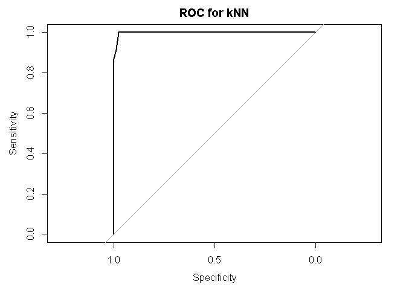

Tumer Classification with kNN
================
Mohammed Zakaria

Required packages

``` r
#install.packages("class") # for kNN classification
library(class)
#install.packages("gmodels") # for CrossTable function at the evaluation
library(gmodels)
#install.packages("caret") # for model tuning
library(caret)
```

    ## Loading required package: lattice

    ## Loading required package: ggplot2

``` r
#install.packages("e1071") # to help with model tuning
library(e1071)
#install.packages("pROC") # to make ROC plots
library(pROC)   
```

    ## Type 'citation("pROC")' for a citation.

    ## 
    ## Attaching package: 'pROC'

    ## The following object is masked from 'package:gmodels':
    ## 
    ##     ci

    ## The following objects are masked from 'package:stats':
    ## 
    ##     cov, smooth, var

Pulling the data: The cancer data is from Brett Lantz's "Machine Learning with R" a repo for the data is under this link: <https://github.com/mzakariaCERN/Machine-Learning-with-R-datasets/blob/master/wisc_bc_data.csv> and original data can be found under <https://archive.ics.uci.edu/ml/machine-learning-databases/breast-cancer-wisconsin/>

``` r
#plot(cars)
wbcd <- read.csv(file="C:/Users/mkzak/Documents/GitHub/FunWithR/FunWithR/1_kNN/wisc_bc_data.csv", stringsAsFactors = FALSE)

str(wbcd)
```

    ## 'data.frame':    569 obs. of  32 variables:
    ##  $ id                     : int  842302 842517 84300903 84348301 84358402 843786 844359 84458202 844981 84501001 ...
    ##  $ diagnosis              : chr  "M" "M" "M" "M" ...
    ##  $ radius_mean            : num  18 20.6 19.7 11.4 20.3 ...
    ##  $ texture_mean           : num  10.4 17.8 21.2 20.4 14.3 ...
    ##  $ perimeter_mean         : num  122.8 132.9 130 77.6 135.1 ...
    ##  $ area_mean              : num  1001 1326 1203 386 1297 ...
    ##  $ smoothness_mean        : num  0.1184 0.0847 0.1096 0.1425 0.1003 ...
    ##  $ compactness_mean       : num  0.2776 0.0786 0.1599 0.2839 0.1328 ...
    ##  $ concavity_mean         : num  0.3001 0.0869 0.1974 0.2414 0.198 ...
    ##  $ concave.points_mean    : num  0.1471 0.0702 0.1279 0.1052 0.1043 ...
    ##  $ symmetry_mean          : num  0.242 0.181 0.207 0.26 0.181 ...
    ##  $ fractal_dimension_mean : num  0.0787 0.0567 0.06 0.0974 0.0588 ...
    ##  $ radius_se              : num  1.095 0.543 0.746 0.496 0.757 ...
    ##  $ texture_se             : num  0.905 0.734 0.787 1.156 0.781 ...
    ##  $ perimeter_se           : num  8.59 3.4 4.58 3.44 5.44 ...
    ##  $ area_se                : num  153.4 74.1 94 27.2 94.4 ...
    ##  $ smoothness_se          : num  0.0064 0.00522 0.00615 0.00911 0.01149 ...
    ##  $ compactness_se         : num  0.049 0.0131 0.0401 0.0746 0.0246 ...
    ##  $ concavity_se           : num  0.0537 0.0186 0.0383 0.0566 0.0569 ...
    ##  $ concave.points_se      : num  0.0159 0.0134 0.0206 0.0187 0.0188 ...
    ##  $ symmetry_se            : num  0.03 0.0139 0.0225 0.0596 0.0176 ...
    ##  $ fractal_dimension_se   : num  0.00619 0.00353 0.00457 0.00921 0.00511 ...
    ##  $ radius_worst           : num  25.4 25 23.6 14.9 22.5 ...
    ##  $ texture_worst          : num  17.3 23.4 25.5 26.5 16.7 ...
    ##  $ perimeter_worst        : num  184.6 158.8 152.5 98.9 152.2 ...
    ##  $ area_worst             : num  2019 1956 1709 568 1575 ...
    ##  $ smoothness_worst       : num  0.162 0.124 0.144 0.21 0.137 ...
    ##  $ compactness_worst      : num  0.666 0.187 0.424 0.866 0.205 ...
    ##  $ concavity_worst        : num  0.712 0.242 0.45 0.687 0.4 ...
    ##  $ concave.points_worst   : num  0.265 0.186 0.243 0.258 0.163 ...
    ##  $ symmetry_worst         : num  0.46 0.275 0.361 0.664 0.236 ...
    ##  $ fractal_dimension_worst: num  0.1189 0.089 0.0876 0.173 0.0768 ...

``` r
summary(wbcd)
```

    ##        id             diagnosis          radius_mean      texture_mean  
    ##  Min.   :     8670   Length:569         Min.   : 6.981   Min.   : 9.71  
    ##  1st Qu.:   869218   Class :character   1st Qu.:11.700   1st Qu.:16.17  
    ##  Median :   906024   Mode  :character   Median :13.370   Median :18.84  
    ##  Mean   : 30371831                      Mean   :14.127   Mean   :19.29  
    ##  3rd Qu.:  8813129                      3rd Qu.:15.780   3rd Qu.:21.80  
    ##  Max.   :911320502                      Max.   :28.110   Max.   :39.28  
    ##  perimeter_mean     area_mean      smoothness_mean   compactness_mean 
    ##  Min.   : 43.79   Min.   : 143.5   Min.   :0.05263   Min.   :0.01938  
    ##  1st Qu.: 75.17   1st Qu.: 420.3   1st Qu.:0.08637   1st Qu.:0.06492  
    ##  Median : 86.24   Median : 551.1   Median :0.09587   Median :0.09263  
    ##  Mean   : 91.97   Mean   : 654.9   Mean   :0.09636   Mean   :0.10434  
    ##  3rd Qu.:104.10   3rd Qu.: 782.7   3rd Qu.:0.10530   3rd Qu.:0.13040  
    ##  Max.   :188.50   Max.   :2501.0   Max.   :0.16340   Max.   :0.34540  
    ##  concavity_mean    concave.points_mean symmetry_mean   
    ##  Min.   :0.00000   Min.   :0.00000     Min.   :0.1060  
    ##  1st Qu.:0.02956   1st Qu.:0.02031     1st Qu.:0.1619  
    ##  Median :0.06154   Median :0.03350     Median :0.1792  
    ##  Mean   :0.08880   Mean   :0.04892     Mean   :0.1812  
    ##  3rd Qu.:0.13070   3rd Qu.:0.07400     3rd Qu.:0.1957  
    ##  Max.   :0.42680   Max.   :0.20120     Max.   :0.3040  
    ##  fractal_dimension_mean   radius_se        texture_se      perimeter_se   
    ##  Min.   :0.04996        Min.   :0.1115   Min.   :0.3602   Min.   : 0.757  
    ##  1st Qu.:0.05770        1st Qu.:0.2324   1st Qu.:0.8339   1st Qu.: 1.606  
    ##  Median :0.06154        Median :0.3242   Median :1.1080   Median : 2.287  
    ##  Mean   :0.06280        Mean   :0.4052   Mean   :1.2169   Mean   : 2.866  
    ##  3rd Qu.:0.06612        3rd Qu.:0.4789   3rd Qu.:1.4740   3rd Qu.: 3.357  
    ##  Max.   :0.09744        Max.   :2.8730   Max.   :4.8850   Max.   :21.980  
    ##     area_se        smoothness_se      compactness_se      concavity_se    
    ##  Min.   :  6.802   Min.   :0.001713   Min.   :0.002252   Min.   :0.00000  
    ##  1st Qu.: 17.850   1st Qu.:0.005169   1st Qu.:0.013080   1st Qu.:0.01509  
    ##  Median : 24.530   Median :0.006380   Median :0.020450   Median :0.02589  
    ##  Mean   : 40.337   Mean   :0.007041   Mean   :0.025478   Mean   :0.03189  
    ##  3rd Qu.: 45.190   3rd Qu.:0.008146   3rd Qu.:0.032450   3rd Qu.:0.04205  
    ##  Max.   :542.200   Max.   :0.031130   Max.   :0.135400   Max.   :0.39600  
    ##  concave.points_se   symmetry_se       fractal_dimension_se
    ##  Min.   :0.000000   Min.   :0.007882   Min.   :0.0008948   
    ##  1st Qu.:0.007638   1st Qu.:0.015160   1st Qu.:0.0022480   
    ##  Median :0.010930   Median :0.018730   Median :0.0031870   
    ##  Mean   :0.011796   Mean   :0.020542   Mean   :0.0037949   
    ##  3rd Qu.:0.014710   3rd Qu.:0.023480   3rd Qu.:0.0045580   
    ##  Max.   :0.052790   Max.   :0.078950   Max.   :0.0298400   
    ##   radius_worst   texture_worst   perimeter_worst    area_worst    
    ##  Min.   : 7.93   Min.   :12.02   Min.   : 50.41   Min.   : 185.2  
    ##  1st Qu.:13.01   1st Qu.:21.08   1st Qu.: 84.11   1st Qu.: 515.3  
    ##  Median :14.97   Median :25.41   Median : 97.66   Median : 686.5  
    ##  Mean   :16.27   Mean   :25.68   Mean   :107.26   Mean   : 880.6  
    ##  3rd Qu.:18.79   3rd Qu.:29.72   3rd Qu.:125.40   3rd Qu.:1084.0  
    ##  Max.   :36.04   Max.   :49.54   Max.   :251.20   Max.   :4254.0  
    ##  smoothness_worst  compactness_worst concavity_worst  concave.points_worst
    ##  Min.   :0.07117   Min.   :0.02729   Min.   :0.0000   Min.   :0.00000     
    ##  1st Qu.:0.11660   1st Qu.:0.14720   1st Qu.:0.1145   1st Qu.:0.06493     
    ##  Median :0.13130   Median :0.21190   Median :0.2267   Median :0.09993     
    ##  Mean   :0.13237   Mean   :0.25427   Mean   :0.2722   Mean   :0.11461     
    ##  3rd Qu.:0.14600   3rd Qu.:0.33910   3rd Qu.:0.3829   3rd Qu.:0.16140     
    ##  Max.   :0.22260   Max.   :1.05800   Max.   :1.2520   Max.   :0.29100     
    ##  symmetry_worst   fractal_dimension_worst
    ##  Min.   :0.1565   Min.   :0.05504        
    ##  1st Qu.:0.2504   1st Qu.:0.07146        
    ##  Median :0.2822   Median :0.08004        
    ##  Mean   :0.2901   Mean   :0.08395        
    ##  3rd Qu.:0.3179   3rd Qu.:0.09208        
    ##  Max.   :0.6638   Max.   :0.20750

``` r
# remove id

wbcd <- wbcd[-1]
```

Convert diagnosis into factors

``` r
wbcd$diagnosis <- factor(wbcd$diagnosis, levels = c("M", "B"), labels = c("Malignant", "Benign"))
round(prop.table(table(wbcd$diagnosis))*100, digits = 1)
```

    ## 
    ## Malignant    Benign 
    ##      37.3      62.7

Since different features have different scales, we introduce a function "normalize" to set the values withing a range of \[0,1\]

``` r
normalize <- function(x){
  return((x - min(x)) / (max(x) - min(x)))
  
  
}
```

use lapply to get a list (the l in lappy) and then convert the list inso data frame

``` r
wbcd_n <- apply(wbcd[2:31],2,normalize)
#another choice 
#wbcd_n <- as.data.frame(lapply(wbcd[2:31], normalize))
```

We split the data into training and testing (the records wehre already in random order, so no need to randomize further)

``` r
wbcd_train <- wbcd_n[1:469,]
wbcd_test <- wbcd_n[470:569,]
```

remove the labeling

``` r
wbcd_train_labels <- wbcd[1:469, 1]
wbcd_test_labels <- wbcd[470:569,1]
```

Building the classifier

``` r
wbcd_test_pred <- knn(train = wbcd_train, test = wbcd_test, cl = wbcd_train_labels, k = 21)
```

Evaluating model performance

``` r
CrossTable(x = wbcd_test_labels, y = wbcd_test_pred, prop.chisq = FALSE)
```

    ## 
    ##  
    ##    Cell Contents
    ## |-------------------------|
    ## |                       N |
    ## |           N / Row Total |
    ## |           N / Col Total |
    ## |         N / Table Total |
    ## |-------------------------|
    ## 
    ##  
    ## Total Observations in Table:  100 
    ## 
    ##  
    ##                  | wbcd_test_pred 
    ## wbcd_test_labels | Malignant |    Benign | Row Total | 
    ## -----------------|-----------|-----------|-----------|
    ##        Malignant |        21 |         2 |        23 | 
    ##                  |     0.913 |     0.087 |     0.230 | 
    ##                  |     1.000 |     0.025 |           | 
    ##                  |     0.210 |     0.020 |           | 
    ## -----------------|-----------|-----------|-----------|
    ##           Benign |         0 |        77 |        77 | 
    ##                  |     0.000 |     1.000 |     0.770 | 
    ##                  |     0.000 |     0.975 |           | 
    ##                  |     0.000 |     0.770 |           | 
    ## -----------------|-----------|-----------|-----------|
    ##     Column Total |        21 |        79 |       100 | 
    ##                  |     0.210 |     0.790 |           | 
    ## -----------------|-----------|-----------|-----------|
    ## 
    ## 

Tuning See what caret has to say about knn

``` r
modelLookup("knn")
```

    ##   model parameter      label forReg forClass probModel
    ## 1   knn         k #Neighbors   TRUE     TRUE      TRUE

Let us do the tuning with some values for k

``` r
m<- train(wbcd_train,  wbcd_train_labels, method = "knn")
m
```

    ## k-Nearest Neighbors 
    ## 
    ## 469 samples
    ##  30 predictor
    ##   2 classes: 'Malignant', 'Benign' 
    ## 
    ## No pre-processing
    ## Resampling: Bootstrapped (25 reps) 
    ## Summary of sample sizes: 469, 469, 469, 469, 469, 469, ... 
    ## Resampling results across tuning parameters:
    ## 
    ##   k  Accuracy   Kappa    
    ##   5  0.9612994  0.9191900
    ##   7  0.9629336  0.9226532
    ##   9  0.9645400  0.9258463
    ## 
    ## Accuracy was used to select the optimal model using  the largest value.
    ## The final value used for the model was k = 9.

Something fancies

``` r
m_cv <- train(wbcd_train, wbcd_train_labels, method = "knn",  trControl = trainControl(method = "cv"), tuneLength = 15)
m_boot <- train(wbcd_train, wbcd_train_labels, method = "knn",  trControl = trainControl(method = "boot"), tuneLength = 15)

ctrl <- trainControl(classProbs = TRUE, method = "boot")
m_boot_ROC <- train(wbcd_train, wbcd_train_labels, method = "knn",  trControl = ctrl, tuneLength = 15, metric = "ROC")
```

    ## Warning in train.default(wbcd_train, wbcd_train_labels, method = "knn", :
    ## The metric "ROC" was not in the result set. Accuracy will be used instead.

``` r
ctrl <- trainControl(method = "repeatedcv",   # 10fold cross validation
                     number = 5,                            # do 5 repititions of cv
                     summaryFunction=twoClassSummary,   # Use AUC to pick the best model
                     classProbs=TRUE,
                     allowParallel = TRUE)
m_cv_ROC <- train(wbcd_train, wbcd_train_labels,
      method = "knn",
      metric = "ROC",
      trControl = ctrl)

m_cv
```

    ## k-Nearest Neighbors 
    ## 
    ## 469 samples
    ##  30 predictor
    ##   2 classes: 'Malignant', 'Benign' 
    ## 
    ## No pre-processing
    ## Resampling: Cross-Validated (10 fold) 
    ## Summary of sample sizes: 422, 422, 423, 422, 422, 422, ... 
    ## Resampling results across tuning parameters:
    ## 
    ##   k   Accuracy   Kappa    
    ##    5  0.9659112  0.9287059
    ##    7  0.9722942  0.9420038
    ##    9  0.9701665  0.9373935
    ##   11  0.9722942  0.9417725
    ##   13  0.9744218  0.9463828
    ##   15  0.9722942  0.9417758
    ##   17  0.9701665  0.9373929
    ##   19  0.9658187  0.9277397
    ##   21  0.9616096  0.9191721
    ##   23  0.9573543  0.9102635
    ##   25  0.9616559  0.9195763
    ##   27  0.9616559  0.9195763
    ##   29  0.9594820  0.9146418
    ##   31  0.9595282  0.9148140
    ##   33  0.9573543  0.9100315
    ## 
    ## Accuracy was used to select the optimal model using  the largest value.
    ## The final value used for the model was k = 13.

To get tons of details about the model and how it was tuned:

``` r
#str(m_cv)
```

Let us make a prediction

``` r
m_cv_ROC_prediction <- predict(m_cv_ROC,wbcd_test)
#CrossTable(x = wbcd_test_labels, y = m_cv_ROC_prediction, prop.chisq = FALSE)
confusionMatrix(m_cv_ROC_prediction, wbcd_test_labels)
```

    ## Confusion Matrix and Statistics
    ## 
    ##            Reference
    ## Prediction  Malignant Benign
    ##   Malignant        23      2
    ##   Benign            0     75
    ##                                           
    ##                Accuracy : 0.98            
    ##                  95% CI : (0.9296, 0.9976)
    ##     No Information Rate : 0.77            
    ##     P-Value [Acc > NIR] : 2.106e-09       
    ##                                           
    ##                   Kappa : 0.9452          
    ##  Mcnemar's Test P-Value : 0.4795          
    ##                                           
    ##             Sensitivity : 1.000           
    ##             Specificity : 0.974           
    ##          Pos Pred Value : 0.920           
    ##          Neg Pred Value : 1.000           
    ##              Prevalence : 0.230           
    ##          Detection Rate : 0.230           
    ##    Detection Prevalence : 0.250           
    ##       Balanced Accuracy : 0.987           
    ##                                           
    ##        'Positive' Class : Malignant       
    ## 

``` r
m_cv_ROC_prediction_probs <- predict(m_cv_ROC,wbcd_test, type = "prob")
#head(m_cv_ROC_prediction_probs)

ROC <- roc(predictor=m_cv_ROC_prediction_probs$Malignant,
               response=wbcd_test_labels,
               levels=rev(levels(wbcd_test_labels)))

ROC$auc
```

    ## Area under the curve: 0.9994

``` r
#Area under the curve: 0.8731
plot(ROC,main="ROC for kNN")
```


