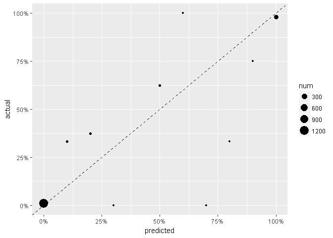
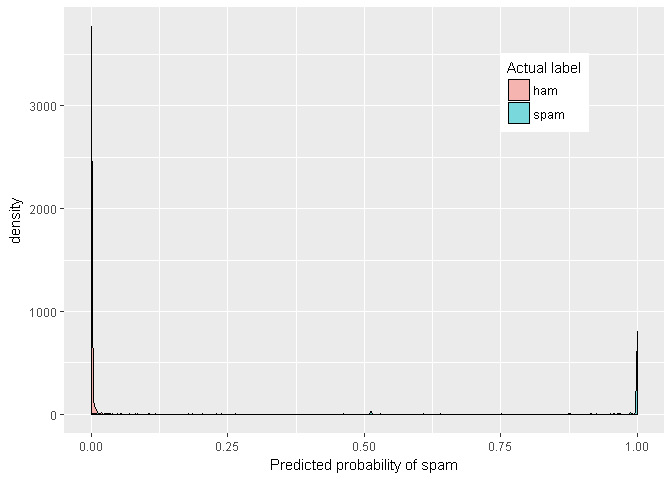
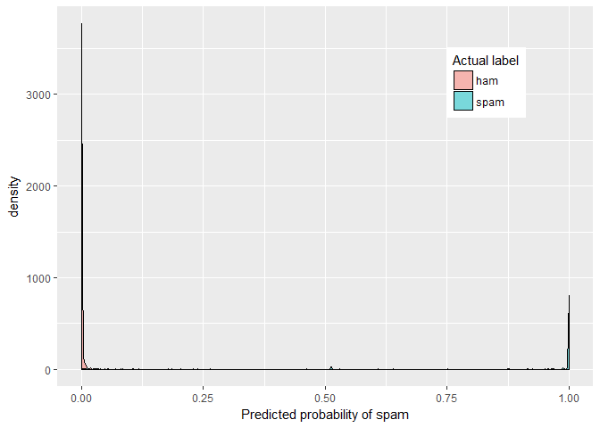
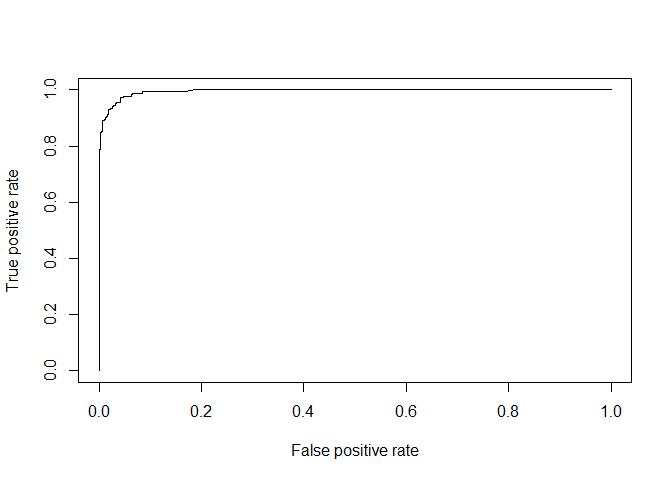
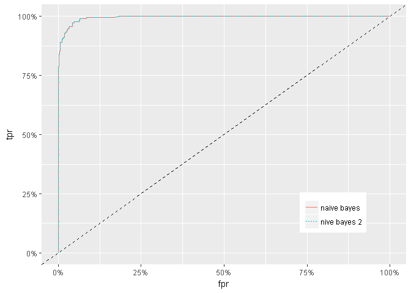
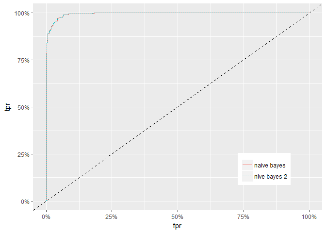
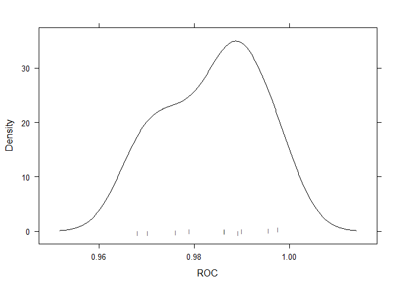

Spam SMS classifier with Naive Bays
================
Mohammed Zakaria

Required packages

``` r
#install.packages("class") # for kNN classification
#library(class)
#install.packages("gmodels") # for CrossTable function at the evaluation
library(gmodels)
#install.packages("caret") # for model tuning
library(caret)
```

    ## Loading required package: lattice

    ## Loading required package: ggplot2

``` r
#install.packages("e1071") # to give us Naive Bayes 
library(e1071)
#install.packages("pROC") # to make ROC plots
library(pROC)   
```

    ## Type 'citation("pROC")' for a citation.

    ## 
    ## Attaching package: 'pROC'

    ## The following object is masked from 'package:gmodels':
    ## 
    ##     ci

    ## The following objects are masked from 'package:stats':
    ## 
    ##     cov, smooth, var

``` r
#install.packages("tm") # to handle text data
library(tm)
```

    ## Loading required package: NLP

    ## 
    ## Attaching package: 'NLP'

    ## The following object is masked from 'package:ggplot2':
    ## 
    ##     annotate

``` r
#install.packages("SnowballC") # for steaming
library(SnowballC)
#install.packages("wordcloud2") # to create word cloud
library(wordcloud2)
```

    ## Warning: package 'wordcloud2' was built under R version 3.4.4

``` r
#install.packages("widgetframe")
#library(widgetframe)
#devtools::install_github('ramnathv/htmlwidgets')
library(wordcloud)
```

    ## Loading required package: RColorBrewer

``` r
library(klaR) # nb library used by caret
```

    ## Loading required package: MASS

``` r
library(ROCR) # another way to do ROC
```

    ## Loading required package: gplots

    ## 
    ## Attaching package: 'gplots'

    ## The following object is masked from 'package:wordcloud':
    ## 
    ##     textplot

    ## The following object is masked from 'package:stats':
    ## 
    ##     lowess

``` r
#install.packages("ggplot2")
library(ggplot2)
#install.packages("dplyr")
library(dplyr)
```

    ## 
    ## Attaching package: 'dplyr'

    ## The following object is masked from 'package:MASS':
    ## 
    ##     select

    ## The following objects are masked from 'package:stats':
    ## 
    ##     filter, lag

    ## The following objects are masked from 'package:base':
    ## 
    ##     intersect, setdiff, setequal, union

Pulling the data: The cancer data is from Brett Lantz's "Machine Learning with R" a repo for the data is under this link: <https://github.com/mzakariaCERN/Machine-Learning-with-R-datasets/blob/master/wisc_bc_data.csv> and original data can be found under <https://archive.ics.uci.edu/ml/machine-learning-databases/breast-cancer-wisconsin/>

``` r
sms_raw <- read.csv(file="C:/Users/mkzak/Documents/GitHub/FunWithR/FunWithR/2_NB/Data/sms_spam.csv", stringsAsFactors = FALSE)


dim(sms_raw)
```

    ## [1] 5574    2

``` r
str(sms_raw)
```

    ## 'data.frame':    5574 obs. of  2 variables:
    ##  $ type: chr  "ham" "ham" "spam" "ham" ...
    ##  $ text: chr  "Go until jurong point, crazy.. Available only in bugis n great world la e buffet... Cine there got amore wat..." "Ok lar... Joking wif u oni..." "Free entry in 2 a wkly comp to win FA Cup final tkts 21st May 2005. Text FA to 87121 to receive entry question("| __truncated__ "U dun say so early hor... U c already then say..." ...

``` r
summary(sms_raw)
```

    ##      type               text          
    ##  Length:5574        Length:5574       
    ##  Class :character   Class :character  
    ##  Mode  :character   Mode  :character

We see there are two features. And the feature type has a categorical variables. So we need to convert it to factor

``` r
sms_raw$type <- as.factor(sms_raw$type)

str(sms_raw$type)
```

    ##  Factor w/ 2 levels "ham","spam": 1 1 2 1 1 2 1 1 2 2 ...

``` r
table(sms_raw$type)
```

    ## 
    ##  ham spam 
    ## 4827  747

After installing (loading) tm library, we need to create a container for all the text we are dealing with. This is called a corpus. WE will use VCorpus (for volatile corpus: corpus stored in memove, compare it to PCorpus, which is stored on disk).

``` r
sms_corpus <- VCorpus(VectorSource(sms_raw$text))
typeof(sms_corpus)
```

    ## [1] "list"

corpus can read from pdf of MS word using readerControl parameter. Check it out! Notice also that corpus is a list objects. So we can manipulate it as such.

``` r
print(sms_corpus)
```

    ## <<VCorpus>>
    ## Metadata:  corpus specific: 0, document level (indexed): 0
    ## Content:  documents: 5574

``` r
inspect(sms_corpus[1:3])
```

    ## <<VCorpus>>
    ## Metadata:  corpus specific: 0, document level (indexed): 0
    ## Content:  documents: 3
    ## 
    ## [[1]]
    ## <<PlainTextDocument>>
    ## Metadata:  7
    ## Content:  chars: 111
    ## 
    ## [[2]]
    ## <<PlainTextDocument>>
    ## Metadata:  7
    ## Content:  chars: 29
    ## 
    ## [[3]]
    ## <<PlainTextDocument>>
    ## Metadata:  7
    ## Content:  chars: 155

To see one message, we need to grab that element in from the list, and conver it to characters

``` r
as.character(sms_corpus[[1]])
```

    ## [1] "Go until jurong point, crazy.. Available only in bugis n great world la e buffet... Cine there got amore wat..."

This can be generalized using lapply

``` r
lapply(sms_corpus[1:2], as.character)
```

    ## $`1`
    ## [1] "Go until jurong point, crazy.. Available only in bugis n great world la e buffet... Cine there got amore wat..."
    ## 
    ## $`2`
    ## [1] "Ok lar... Joking wif u oni..."

Next, we need to clean the text from special characters, capital letters etc, and convert it into separate words.

First, convert to lower case

``` r
sms_corpus_clean <- tm_map(sms_corpus, content_transformer(tolower))
```

remember the first message starts with an upper case letter. Let us take a look now

``` r
as.character(sms_corpus_clean[[1]])
```

    ## [1] "go until jurong point, crazy.. available only in bugis n great world la e buffet... cine there got amore wat..."

next thing, is to remove numbers from SMS. Though some might be useful for the sender/receiver. It doesn't play much value in spam/ham classification.

``` r
sms_corpus_clean <- tm_map(sms_corpus_clean, removeNumbers) # no need for content_tranformer b/c removeNumbers is built in tm. to see other
# built in functions type getTransformations()
```

Next we remove filler (stop) words suc as: 'and', 'or', and 'but'

``` r
sms_corpus_clean <- tm_map(sms_corpus_clean, removeWords, stopwords())
```

Notice that stoprwords returns a vector of the words we need to consider as such. We can thus add a remove words from the list to modify the selection

Next, we remove any punctuation

``` r
sms_corpus_clean <- tm_map(sms_corpus_clean, removePunctuation)
```

Notice that this function will join words that have punctuation marks between them without any space. Ex: "Hi...Hi" will become "HiHi" To fix this we can create a function like

``` r
replacePunctuation <- function(x){gsub("[[:punct:]]", " ", x)}
```

the above function can be used with tm\_map

Next, we return all words to their root (AKA: steaming). To do this install and/or load SnowballC

``` r
sms_corpus_clean <- tm_map(sms_corpus_clean, stemDocument)
```

next, to remove any extra white space

``` r
sms_corpus_clean <- tm_map(sms_corpus_clean, stripWhitespace)
```

Finally, we need to convert the messages into word (AKA tokenization). We will convert the corpus into Document Term Matrix: rows are SMS messages, and columns are word. Think of it as creating dummy variables for each word.

``` r
sms_dtm <- DocumentTermMatrix(sms_corpus_clean)

sms_dtm
```

    ## <<DocumentTermMatrix (documents: 5574, terms: 6604)>>
    ## Non-/sparse entries: 42631/36768065
    ## Sparsity           : 100%
    ## Maximal term length: 40
    ## Weighting          : term frequency (tf)

Notice that we could have create a DTM from the raw corpus with all the pre-processing in one command

``` r
sms_dtm2 <- DocumentTermMatrix(sms_corpus, control = list(tolower = TRUE, removeNumbers = TRUE, stopwords = TRUE, removePunctuation = TRUE, steaming = TRUE))

sms_dtm2
```

    ## <<DocumentTermMatrix (documents: 5574, terms: 8364)>>
    ## Non-/sparse entries: 44221/46576715
    ## Sparsity           : 100%
    ## Maximal term length: 40
    ## Weighting          : term frequency (tf)

notice there are minor differences between the two matrices. this is mainly due to cleaning the corpus after spliting it into words in the second option. it also uses a slightly different choice for stop words. To fortce it to use the same stopwords:

``` r
stopWords = function(x){removeWords(x, stopwords())}
```

and replace stopwrods = TRUE with that function

Next step is splitting the data into training and testing. Since the data is randomized as is, no need to randomize it

``` r
sms_dtm_train <- sms_dtm[1:4169, ]
sms_dtm_test <- sms_dtm[4170: 5574, ]

sms_train_labels <- sms_raw[1:4169, ]$type
sms_test_labels <- sms_raw[4170: 5574, ]$type
```

Checking that ratio of spam to ham is close in both samples

``` r
prop.table(table(sms_train_labels))
```

    ## sms_train_labels
    ##       ham      spam 
    ## 0.8647158 0.1352842

``` r
prop.table(table(sms_test_labels))
```

    ## sms_test_labels
    ##       ham      spam 
    ## 0.8697509 0.1302491

create a word cloud. Lantz uses package wordcount. I will replicate that here and use another package: wordcloud2 that gives js plots with interactive elements

``` r
wordcloud(sms_corpus_clean, min.freq = 50, random.order = FALSE)
```


Let us do a cloud for only spam and ham

``` r
spam <- subset(sms_raw, type == "spam")
ham <- subset(sms_raw, type = "ham")
wordcloud(spam$text, max.words = 40, scale = c(3, .5))
```


``` r
wordcloud(ham$text, max.words= 40, scale= c(3, .5))
```


Next I will use wordcount2. Which needs a data frame with word and frequency. which can be prepared from a TermDocumentMatrix (TDM, and not DTM)

``` r
myTdm <- as.matrix(TermDocumentMatrix(sms_corpus, control = list(tolower = TRUE, removeNumbers = TRUE, stopwords = TRUE, removePunctuation = TRUE, steaming = TRUE)))
FreqMat <- data.frame(ST = rownames(myTdm),
Freq = rowSums(myTdm),
row.names = NULL)


wc2 <- wordcloud2(FreqMat, minSize = 50)
```

We can also do similar plots with ham and spam messages to compare between them. Notice that you need to set always\_allow\_html: yes in yaml and you can only see the interactive image in html. so it was difficult to deploy on github.

Since the TDM has one feature per word, we have over 6000 features. Many of these features for words that were mentioned once or twice. These are unlikely to be useful in the classification. so we set a frequency filter to remove any word mentioned less than 5 times.

``` r
sms_freq_words <- findFreqTerms(sms_dtm_train, 5)
str(sms_freq_words)
```

    ##  chr [1:1158] "–" "abiola" "abl" "abt" "accept" "access" "account" ...

remove every column that matches this vector

``` r
sms_dtm_freq_train <- sms_dtm_train[, sms_freq_words]
sms_dtm_freq_test  <- sms_dtm_test[,  sms_freq_words]
```

NB classifiers typically use categorical features. This poses an issue for sparce matrices (DTM) since the cell are numeric and measure the number of times a word appears in the same massage. To change it to categorical we convert it to yes/no

``` r
convert_counts <- function(x){
  x <- ifelse(x > 0, "yes", "no")
}
```

we apply the function on the columns

``` r
sms_train <- apply(sms_dtm_freq_train, 2, convert_counts)
sms_test <-  apply(sms_dtm_freq_test, 2, convert_counts)
```

Next we build a Naive Bayes model to find the probability of the message being a spam or a ham based on the presence of words.

``` r
sms_classifier <- naiveBayes(sms_train, sms_train_labels)
```

making a prediction

``` r
sms_test_pred <- predict(sms_classifier, sms_test)
```

using CrossTables() for evaluation

``` r
CrossTable(sms_test_pred, sms_test_labels, prop.chisq = FALSE, prop.t = FALSE, dnn = c('predicted','actual'))
```

    ## 
    ##  
    ##    Cell Contents
    ## |-------------------------|
    ## |                       N |
    ## |           N / Row Total |
    ## |           N / Col Total |
    ## |-------------------------|
    ## 
    ##  
    ## Total Observations in Table:  1405 
    ## 
    ##  
    ##              | actual 
    ##    predicted |       ham |      spam | Row Total | 
    ## -------------|-----------|-----------|-----------|
    ##          ham |      1213 |        20 |      1233 | 
    ##              |     0.984 |     0.016 |     0.878 | 
    ##              |     0.993 |     0.109 |           | 
    ## -------------|-----------|-----------|-----------|
    ##         spam |         9 |       163 |       172 | 
    ##              |     0.052 |     0.948 |     0.122 | 
    ##              |     0.007 |     0.891 |           | 
    ## -------------|-----------|-----------|-----------|
    ## Column Total |      1222 |       183 |      1405 | 
    ##              |     0.870 |     0.130 |           | 
    ## -------------|-----------|-----------|-----------|
    ## 
    ## 

``` r
probs <- predict(sms_classifier, sms_test, type="raw")
# plot ROC curve
pred <- prediction(probs[, "spam"], sms_test_labels)
perf_nb <- performance(pred, measure='tpr', x.measure='fpr')
plot(perf_nb)
```



``` r
performance(pred, 'auc')
```

    ## An object of class "performance"
    ## Slot "x.name":
    ## [1] "None"
    ## 
    ## Slot "y.name":
    ## [1] "Area under the ROC curve"
    ## 
    ## Slot "alpha.name":
    ## [1] "none"
    ## 
    ## Slot "x.values":
    ## list()
    ## 
    ## Slot "y.values":
    ## [[1]]
    ## [1] 0.9951057
    ## 
    ## 
    ## Slot "alpha.values":
    ## list()

``` r
# plot calibration
data.frame(predicted=probs[, "spam"], actual=sms_test_labels) %>%
  group_by(predicted=round(predicted*10)/10) %>%
  summarize(num=n(), actual=mean(actual == "spam")) %>%
  ggplot(data=., aes(x=predicted, y=actual, size=num)) +
  geom_point() +
  geom_abline(a=1, b=0, linetype=2) +
  scale_x_continuous(labels=scales::percent, lim=c(0,1)) +
  scale_y_continuous(labels=scales::percent, lim=c(0,1))
```

    ## Warning: Ignoring unknown parameters: a, b



They points are distributed evenly. So no sign of over confidence.

``` r
data.frame(predicted=probs, actual=sms_test_labels) %>%
  ggplot(data=., aes(x=predicted.spam)) +
  geom_density(aes(fill=sms_test_labels), alpha=0.5) +
  xlab('Predicted probability of spam') +
  scale_fill_discrete(name="Actual label") +
  theme(legend.position=c(0.8,0.8))
```



One way to improve on the model, is to set laplace more than zero. this way words with zero occurance in either class will not have an indisputable say of the classification

``` r
sms_classifier2 <- naiveBayes(sms_train, sms_train_labels, lablace = 2)
sms_test_pred2 <- predict(sms_classifier2, sms_test)
```

``` r
CrossTable(sms_test_pred2, sms_test_labels, prop.chisq = FALSE, prop.t = FALSE, prop.r = FALSE, dnn = c('predicted','actual'))
```

    ## 
    ##  
    ##    Cell Contents
    ## |-------------------------|
    ## |                       N |
    ## |           N / Col Total |
    ## |-------------------------|
    ## 
    ##  
    ## Total Observations in Table:  1405 
    ## 
    ##  
    ##              | actual 
    ##    predicted |       ham |      spam | Row Total | 
    ## -------------|-----------|-----------|-----------|
    ##          ham |      1213 |        20 |      1233 | 
    ##              |     0.993 |     0.109 |           | 
    ## -------------|-----------|-----------|-----------|
    ##         spam |         9 |       163 |       172 | 
    ##              |     0.007 |     0.891 |           | 
    ## -------------|-----------|-----------|-----------|
    ## Column Total |      1222 |       183 |      1405 | 
    ##              |     0.870 |     0.130 |           | 
    ## -------------|-----------|-----------|-----------|
    ## 
    ## 

``` r
probs_2 <- predict(sms_classifier2, sms_test, type="raw")
# plot ROC curve
pred <- prediction(probs_2[, "spam"], sms_test_labels)
perf_nb_2 <- performance(pred, measure='tpr', x.measure='fpr')
plot(perf_nb_2)
```



``` r
performance(pred, 'auc')
```

    ## An object of class "performance"
    ## Slot "x.name":
    ## [1] "None"
    ## 
    ## Slot "y.name":
    ## [1] "Area under the ROC curve"
    ## 
    ## Slot "alpha.name":
    ## [1] "none"
    ## 
    ## Slot "x.values":
    ## list()
    ## 
    ## Slot "y.values":
    ## [[1]]
    ## [1] 0.9951057
    ## 
    ## 
    ## Slot "alpha.values":
    ## list()

``` r
# plot calibration
data.frame(predicted=probs_2[, "spam"], actual=sms_test_labels) %>%
  group_by(predicted=round(predicted*10)/10) %>%
  summarize(num=n(), actual=mean(actual == "spam")) %>%
  ggplot(data=., aes(x=predicted, y=actual, size=num)) +
  geom_point() +
  geom_abline(a=1, b=0, linetype=2) +
  scale_x_continuous(labels=scales::percent, lim=c(0,1)) +
  scale_y_continuous(labels=scales::percent, lim=c(0,1))
```

    ## Warning: Ignoring unknown parameters: a, b



Lets compary the two ROC curves

``` r
# plot ROC for each method
roc_nb   <- data.frame(fpr=unlist(perf_nb@x.values), tpr=unlist(perf_nb@y.values))
roc_nb$method <- "naive bayes"
roc_nb_2 <- data.frame(fpr=unlist(perf_nb_2@x.values), tpr=unlist(perf_nb_2@y.values))
roc_nb_2$method <- "nive bayes 2"
rbind(roc_nb, roc_nb_2) %>%
  ggplot(data=., aes(x=fpr, y=tpr, linetype=method, color=method)) + 
  geom_line() +
  geom_abline(a=1, b=0, linetype=2) +
  scale_x_continuous(labels=scales::percent, lim=c(0,1)) +
  scale_y_continuous(labels=scales::percent, lim=c(0,1)) +
  theme(legend.position=c(0.8,0.2), legend.title=element_blank())
```

    ## Warning: Ignoring unknown parameters: a, b



Next we need to investigate if hypertuning can get us a better result. First, let us see what caret has to say about Naive Bayes

``` r
modelLookup("nb")
```

    ##   model parameter                label forReg forClass probModel
    ## 1    nb        fL   Laplace Correction  FALSE     TRUE      TRUE
    ## 2    nb usekernel    Distribution Type  FALSE     TRUE      TRUE
    ## 3    nb    adjust Bandwidth Adjustment  FALSE     TRUE      TRUE

So we have 3 parameters to tune

``` r
sms_classifier3<- train(sms_train, sms_train_labels, method = "nb", verbose = FALSE)
```

    ## Warning in FUN(X[[i]], ...): Numerical 0 probability for all classes with
    ## observation 1

    ## Warning in FUN(X[[i]], ...): Numerical 0 probability for all classes with
    ## observation 2

    ## Warning in FUN(X[[i]], ...): Numerical 0 probability for all classes with
    ## observation 3

    ## Warning in FUN(X[[i]], ...): Numerical 0 probability for all classes with
    ## observation 4

    ## Warning in FUN(X[[i]], ...): Numerical 0 probability for all classes with
    ## observation 5

    ## Warning in FUN(X[[i]], ...): Numerical 0 probability for all classes with
    ## observation 6

    ## Warning in FUN(X[[i]], ...): Numerical 0 probability for all classes with
    ## observation 7

    ## Warning in FUN(X[[i]], ...): Numerical 0 probability for all classes with
    ## observation 8

    ## Warning in FUN(X[[i]], ...): Numerical 0 probability for all classes with
    ## observation 9

    ## Warning in FUN(X[[i]], ...): Numerical 0 probability for all classes with
    ## observation 11

    ## Warning in FUN(X[[i]], ...): Numerical 0 probability for all classes with
    ## observation 12

    ## Warning in FUN(X[[i]], ...): Numerical 0 probability for all classes with
    ## observation 13

    ## Warning in FUN(X[[i]], ...): Numerical 0 probability for all classes with
    ## observation 15

    ## Warning in FUN(X[[i]], ...): Numerical 0 probability for all classes with
    ## observation 17

    ## Warning in FUN(X[[i]], ...): Numerical 0 probability for all classes with
    ## observation 18

    ## Warning in FUN(X[[i]], ...): Numerical 0 probability for all classes with
    ## observation 19

    ## Warning in FUN(X[[i]], ...): Numerical 0 probability for all classes with
    ## observation 20

    ## Warning in FUN(X[[i]], ...): Numerical 0 probability for all classes with
    ## observation 21

    ## Warning in FUN(X[[i]], ...): Numerical 0 probability for all classes with
    ## observation 25

    ## Warning in FUN(X[[i]], ...): Numerical 0 probability for all classes with
    ## observation 26

    ## Warning in FUN(X[[i]], ...): Numerical 0 probability for all classes with
    ## observation 27

    ## Warning in FUN(X[[i]], ...): Numerical 0 probability for all classes with
    ## observation 28

    ## Warning in FUN(X[[i]], ...): Numerical 0 probability for all classes with
    ## observation 29

    ## Warning in FUN(X[[i]], ...): Numerical 0 probability for all classes with
    ## observation 30

    ## Warning in FUN(X[[i]], ...): Numerical 0 probability for all classes with
    ## observation 31

    ## Warning in FUN(X[[i]], ...): Numerical 0 probability for all classes with
    ## observation 32

    ## Warning in FUN(X[[i]], ...): Numerical 0 probability for all classes with
    ## observation 33

    ## Warning in FUN(X[[i]], ...): Numerical 0 probability for all classes with
    ## observation 34

    ## Warning in FUN(X[[i]], ...): Numerical 0 probability for all classes with
    ## observation 35

    ## Warning in FUN(X[[i]], ...): Numerical 0 probability for all classes with
    ## observation 36

    ## Warning in FUN(X[[i]], ...): Numerical 0 probability for all classes with
    ## observation 37

    ## Warning in FUN(X[[i]], ...): Numerical 0 probability for all classes with
    ## observation 38

    ## Warning in FUN(X[[i]], ...): Numerical 0 probability for all classes with
    ## observation 41

    ## Warning in FUN(X[[i]], ...): Numerical 0 probability for all classes with
    ## observation 42

    ## Warning in FUN(X[[i]], ...): Numerical 0 probability for all classes with
    ## observation 45

    ## Warning in FUN(X[[i]], ...): Numerical 0 probability for all classes with
    ## observation 46

    ## Warning in FUN(X[[i]], ...): Numerical 0 probability for all classes with
    ## observation 47

    ## Warning in FUN(X[[i]], ...): Numerical 0 probability for all classes with
    ## observation 49

    ## Warning in FUN(X[[i]], ...): Numerical 0 probability for all classes with
    ## observation 51

    ## Warning in FUN(X[[i]], ...): Numerical 0 probability for all classes with
    ## observation 52

    ## Warning in FUN(X[[i]], ...): Numerical 0 probability for all classes with
    ## observation 54

    ## Warning in FUN(X[[i]], ...): Numerical 0 probability for all classes with
    ## observation 55

    ## Warning in FUN(X[[i]], ...): Numerical 0 probability for all classes with
    ## observation 56

    ## Warning in FUN(X[[i]], ...): Numerical 0 probability for all classes with
    ## observation 57

    ## Warning in FUN(X[[i]], ...): Numerical 0 probability for all classes with
    ## observation 58

    ## Warning in FUN(X[[i]], ...): Numerical 0 probability for all classes with
    ## observation 59

    ## Warning in FUN(X[[i]], ...): Numerical 0 probability for all classes with
    ## observation 60

    ## Warning in FUN(X[[i]], ...): Numerical 0 probability for all classes with
    ## observation 61

    ## Warning in FUN(X[[i]], ...): Numerical 0 probability for all classes with
    ## observation 62

    ## Warning in FUN(X[[i]], ...): Numerical 0 probability for all classes with
    ## observation 64

    ## Warning in FUN(X[[i]], ...): Numerical 0 probability for all classes with
    ## observation 65

    ## Warning in FUN(X[[i]], ...): Numerical 0 probability for all classes with
    ## observation 66

    ## Warning in FUN(X[[i]], ...): Numerical 0 probability for all classes with
    ## observation 68

    ## Warning in FUN(X[[i]], ...): Numerical 0 probability for all classes with
    ## observation 70

    ## Warning in FUN(X[[i]], ...): Numerical 0 probability for all classes with
    ## observation 71

    ## Warning in FUN(X[[i]], ...): Numerical 0 probability for all classes with
    ## observation 72

    ## Warning in FUN(X[[i]], ...): Numerical 0 probability for all classes with
    ## observation 73

    ## Warning in FUN(X[[i]], ...): Numerical 0 probability for all classes with
    ## observation 75

    ## Warning in FUN(X[[i]], ...): Numerical 0 probability for all classes with
    ## observation 76

    ## Warning in FUN(X[[i]], ...): Numerical 0 probability for all classes with
    ## observation 77

    ## Warning in FUN(X[[i]], ...): Numerical 0 probability for all classes with
    ## observation 82

    ## Warning in FUN(X[[i]], ...): Numerical 0 probability for all classes with
    ## observation 84

    ## Warning in FUN(X[[i]], ...): Numerical 0 probability for all classes with
    ## observation 85

    ## Warning in FUN(X[[i]], ...): Numerical 0 probability for all classes with
    ## observation 86

    ## Warning in FUN(X[[i]], ...): Numerical 0 probability for all classes with
    ## observation 87

    ## Warning in FUN(X[[i]], ...): Numerical 0 probability for all classes with
    ## observation 88

    ## Warning in FUN(X[[i]], ...): Numerical 0 probability for all classes with
    ## observation 89

    ## Warning in FUN(X[[i]], ...): Numerical 0 probability for all classes with
    ## observation 91

    ## Warning in FUN(X[[i]], ...): Numerical 0 probability for all classes with
    ## observation 93

    ## Warning in FUN(X[[i]], ...): Numerical 0 probability for all classes with
    ## observation 94

    ## Warning in FUN(X[[i]], ...): Numerical 0 probability for all classes with
    ## observation 96

    ## Warning in FUN(X[[i]], ...): Numerical 0 probability for all classes with
    ## observation 97

    ## Warning in FUN(X[[i]], ...): Numerical 0 probability for all classes with
    ## observation 98

    ## Warning in FUN(X[[i]], ...): Numerical 0 probability for all classes with
    ## observation 99

    ## Warning in FUN(X[[i]], ...): Numerical 0 probability for all classes with
    ## observation 100

    ## Warning in FUN(X[[i]], ...): Numerical 0 probability for all classes with
    ## observation 101

    ## Warning in FUN(X[[i]], ...): Numerical 0 probability for all classes with
    ## observation 102

    ## Warning in FUN(X[[i]], ...): Numerical 0 probability for all classes with
    ## observation 104

    ## Warning in FUN(X[[i]], ...): Numerical 0 probability for all classes with
    ## observation 105

    ## Warning in FUN(X[[i]], ...): Numerical 0 probability for all classes with
    ## observation 107

    ## Warning in FUN(X[[i]], ...): Numerical 0 probability for all classes with
    ## observation 108

    ## Warning in FUN(X[[i]], ...): Numerical 0 probability for all classes with
    ## observation 109

    ## Warning in FUN(X[[i]], ...): Numerical 0 probability for all classes with
    ## observation 111

    ## Warning in FUN(X[[i]], ...): Numerical 0 probability for all classes with
    ## observation 114

    ## Warning in FUN(X[[i]], ...): Numerical 0 probability for all classes with
    ## observation 115

    ## Warning in FUN(X[[i]], ...): Numerical 0 probability for all classes with
    ## observation 118

    ## Warning in FUN(X[[i]], ...): Numerical 0 probability for all classes with
    ## observation 120

    ## Warning in FUN(X[[i]], ...): Numerical 0 probability for all classes with
    ## observation 121

    ## Warning in FUN(X[[i]], ...): Numerical 0 probability for all classes with
    ## observation 122

    ## Warning in FUN(X[[i]], ...): Numerical 0 probability for all classes with
    ## observation 123

    ## Warning in FUN(X[[i]], ...): Numerical 0 probability for all classes with
    ## observation 125

    ## Warning in FUN(X[[i]], ...): Numerical 0 probability for all classes with
    ## observation 126

    ## Warning in FUN(X[[i]], ...): Numerical 0 probability for all classes with
    ## observation 127

    ## Warning in FUN(X[[i]], ...): Numerical 0 probability for all classes with
    ## observation 128

    ## Warning in FUN(X[[i]], ...): Numerical 0 probability for all classes with
    ## observation 129

    ## Warning in FUN(X[[i]], ...): Numerical 0 probability for all classes with
    ## observation 130

    ## Warning in FUN(X[[i]], ...): Numerical 0 probability for all classes with
    ## observation 131

    ## Warning in FUN(X[[i]], ...): Numerical 0 probability for all classes with
    ## observation 132

    ## Warning in FUN(X[[i]], ...): Numerical 0 probability for all classes with
    ## observation 133

    ## Warning in FUN(X[[i]], ...): Numerical 0 probability for all classes with
    ## observation 134

    ## Warning in FUN(X[[i]], ...): Numerical 0 probability for all classes with
    ## observation 136

    ## Warning in FUN(X[[i]], ...): Numerical 0 probability for all classes with
    ## observation 137

    ## Warning in FUN(X[[i]], ...): Numerical 0 probability for all classes with
    ## observation 139

    ## Warning in FUN(X[[i]], ...): Numerical 0 probability for all classes with
    ## observation 140

    ## Warning in FUN(X[[i]], ...): Numerical 0 probability for all classes with
    ## observation 141

    ## Warning in FUN(X[[i]], ...): Numerical 0 probability for all classes with
    ## observation 142

    ## Warning in FUN(X[[i]], ...): Numerical 0 probability for all classes with
    ## observation 143

    ## Warning in FUN(X[[i]], ...): Numerical 0 probability for all classes with
    ## observation 145

    ## Warning in FUN(X[[i]], ...): Numerical 0 probability for all classes with
    ## observation 146

    ## Warning in FUN(X[[i]], ...): Numerical 0 probability for all classes with
    ## observation 147

    ## Warning in FUN(X[[i]], ...): Numerical 0 probability for all classes with
    ## observation 148

    ## Warning in FUN(X[[i]], ...): Numerical 0 probability for all classes with
    ## observation 149

    ## Warning in FUN(X[[i]], ...): Numerical 0 probability for all classes with
    ## observation 151

    ## Warning in FUN(X[[i]], ...): Numerical 0 probability for all classes with
    ## observation 152

    ## Warning in FUN(X[[i]], ...): Numerical 0 probability for all classes with
    ## observation 153

    ## Warning in FUN(X[[i]], ...): Numerical 0 probability for all classes with
    ## observation 154

    ## Warning in FUN(X[[i]], ...): Numerical 0 probability for all classes with
    ## observation 155

    ## Warning in FUN(X[[i]], ...): Numerical 0 probability for all classes with
    ## observation 156

    ## Warning in FUN(X[[i]], ...): Numerical 0 probability for all classes with
    ## observation 157

    ## Warning in FUN(X[[i]], ...): Numerical 0 probability for all classes with
    ## observation 158

    ## Warning in FUN(X[[i]], ...): Numerical 0 probability for all classes with
    ## observation 159

    ## Warning in FUN(X[[i]], ...): Numerical 0 probability for all classes with
    ## observation 160

    ## Warning in FUN(X[[i]], ...): Numerical 0 probability for all classes with
    ## observation 162

    ## Warning in FUN(X[[i]], ...): Numerical 0 probability for all classes with
    ## observation 163

    ## Warning in FUN(X[[i]], ...): Numerical 0 probability for all classes with
    ## observation 164

    ## Warning in FUN(X[[i]], ...): Numerical 0 probability for all classes with
    ## observation 169

    ## Warning in FUN(X[[i]], ...): Numerical 0 probability for all classes with
    ## observation 170

    ## Warning in FUN(X[[i]], ...): Numerical 0 probability for all classes with
    ## observation 172

    ## Warning in FUN(X[[i]], ...): Numerical 0 probability for all classes with
    ## observation 174

    ## Warning in FUN(X[[i]], ...): Numerical 0 probability for all classes with
    ## observation 175

    ## Warning in FUN(X[[i]], ...): Numerical 0 probability for all classes with
    ## observation 176

    ## Warning in FUN(X[[i]], ...): Numerical 0 probability for all classes with
    ## observation 177

    ## Warning in FUN(X[[i]], ...): Numerical 0 probability for all classes with
    ## observation 178

    ## Warning in FUN(X[[i]], ...): Numerical 0 probability for all classes with
    ## observation 179

    ## Warning in FUN(X[[i]], ...): Numerical 0 probability for all classes with
    ## observation 181

    ## Warning in FUN(X[[i]], ...): Numerical 0 probability for all classes with
    ## observation 182

    ## Warning in FUN(X[[i]], ...): Numerical 0 probability for all classes with
    ## observation 184

    ## Warning in FUN(X[[i]], ...): Numerical 0 probability for all classes with
    ## observation 185

    ## Warning in FUN(X[[i]], ...): Numerical 0 probability for all classes with
    ## observation 187

    ## Warning in FUN(X[[i]], ...): Numerical 0 probability for all classes with
    ## observation 189

    ## Warning in FUN(X[[i]], ...): Numerical 0 probability for all classes with
    ## observation 190

    ## Warning in FUN(X[[i]], ...): Numerical 0 probability for all classes with
    ## observation 191

    ## Warning in FUN(X[[i]], ...): Numerical 0 probability for all classes with
    ## observation 192

    ## Warning in FUN(X[[i]], ...): Numerical 0 probability for all classes with
    ## observation 193

    ## Warning in FUN(X[[i]], ...): Numerical 0 probability for all classes with
    ## observation 194

    ## Warning in FUN(X[[i]], ...): Numerical 0 probability for all classes with
    ## observation 195

    ## Warning in FUN(X[[i]], ...): Numerical 0 probability for all classes with
    ## observation 196

    ## Warning in FUN(X[[i]], ...): Numerical 0 probability for all classes with
    ## observation 197

    ## Warning in FUN(X[[i]], ...): Numerical 0 probability for all classes with
    ## observation 198

    ## Warning in FUN(X[[i]], ...): Numerical 0 probability for all classes with
    ## observation 199

    ## Warning in FUN(X[[i]], ...): Numerical 0 probability for all classes with
    ## observation 200

    ## Warning in FUN(X[[i]], ...): Numerical 0 probability for all classes with
    ## observation 202

    ## Warning in FUN(X[[i]], ...): Numerical 0 probability for all classes with
    ## observation 204

    ## Warning in FUN(X[[i]], ...): Numerical 0 probability for all classes with
    ## observation 205

    ## Warning in FUN(X[[i]], ...): Numerical 0 probability for all classes with
    ## observation 207

    ## Warning in FUN(X[[i]], ...): Numerical 0 probability for all classes with
    ## observation 208

    ## Warning in FUN(X[[i]], ...): Numerical 0 probability for all classes with
    ## observation 209

    ## Warning in FUN(X[[i]], ...): Numerical 0 probability for all classes with
    ## observation 210

    ## Warning in FUN(X[[i]], ...): Numerical 0 probability for all classes with
    ## observation 212

    ## Warning in FUN(X[[i]], ...): Numerical 0 probability for all classes with
    ## observation 213

    ## Warning in FUN(X[[i]], ...): Numerical 0 probability for all classes with
    ## observation 214

    ## Warning in FUN(X[[i]], ...): Numerical 0 probability for all classes with
    ## observation 215

    ## Warning in FUN(X[[i]], ...): Numerical 0 probability for all classes with
    ## observation 216

    ## Warning in FUN(X[[i]], ...): Numerical 0 probability for all classes with
    ## observation 217

    ## Warning in FUN(X[[i]], ...): Numerical 0 probability for all classes with
    ## observation 218

    ## Warning in FUN(X[[i]], ...): Numerical 0 probability for all classes with
    ## observation 219

    ## Warning in FUN(X[[i]], ...): Numerical 0 probability for all classes with
    ## observation 220

    ## Warning in FUN(X[[i]], ...): Numerical 0 probability for all classes with
    ## observation 221

    ## Warning in FUN(X[[i]], ...): Numerical 0 probability for all classes with
    ## observation 222

    ## Warning in FUN(X[[i]], ...): Numerical 0 probability for all classes with
    ## observation 223

    ## Warning in FUN(X[[i]], ...): Numerical 0 probability for all classes with
    ## observation 224

    ## Warning in FUN(X[[i]], ...): Numerical 0 probability for all classes with
    ## observation 226

    ## Warning in FUN(X[[i]], ...): Numerical 0 probability for all classes with
    ## observation 227

    ## Warning in FUN(X[[i]], ...): Numerical 0 probability for all classes with
    ## observation 229

    ## Warning in FUN(X[[i]], ...): Numerical 0 probability for all classes with
    ## observation 230

    ## Warning in FUN(X[[i]], ...): Numerical 0 probability for all classes with
    ## observation 231

    ## Warning in FUN(X[[i]], ...): Numerical 0 probability for all classes with
    ## observation 232

    ## Warning in FUN(X[[i]], ...): Numerical 0 probability for all classes with
    ## observation 234

    ## Warning in FUN(X[[i]], ...): Numerical 0 probability for all classes with
    ## observation 235

    ## Warning in FUN(X[[i]], ...): Numerical 0 probability for all classes with
    ## observation 236

    ## Warning in FUN(X[[i]], ...): Numerical 0 probability for all classes with
    ## observation 237

    ## Warning in FUN(X[[i]], ...): Numerical 0 probability for all classes with
    ## observation 238

    ## Warning in FUN(X[[i]], ...): Numerical 0 probability for all classes with
    ## observation 239

    ## Warning in FUN(X[[i]], ...): Numerical 0 probability for all classes with
    ## observation 240

    ## Warning in FUN(X[[i]], ...): Numerical 0 probability for all classes with
    ## observation 241

    ## Warning in FUN(X[[i]], ...): Numerical 0 probability for all classes with
    ## observation 243

    ## Warning in FUN(X[[i]], ...): Numerical 0 probability for all classes with
    ## observation 244

    ## Warning in FUN(X[[i]], ...): Numerical 0 probability for all classes with
    ## observation 245

    ## Warning in FUN(X[[i]], ...): Numerical 0 probability for all classes with
    ## observation 247

    ## Warning in FUN(X[[i]], ...): Numerical 0 probability for all classes with
    ## observation 248

    ## Warning in FUN(X[[i]], ...): Numerical 0 probability for all classes with
    ## observation 249

    ## Warning in FUN(X[[i]], ...): Numerical 0 probability for all classes with
    ## observation 251

    ## Warning in FUN(X[[i]], ...): Numerical 0 probability for all classes with
    ## observation 254

    ## Warning in FUN(X[[i]], ...): Numerical 0 probability for all classes with
    ## observation 255

    ## Warning in FUN(X[[i]], ...): Numerical 0 probability for all classes with
    ## observation 256

    ## Warning in FUN(X[[i]], ...): Numerical 0 probability for all classes with
    ## observation 257

    ## Warning in FUN(X[[i]], ...): Numerical 0 probability for all classes with
    ## observation 259

    ## Warning in FUN(X[[i]], ...): Numerical 0 probability for all classes with
    ## observation 260

    ## Warning in FUN(X[[i]], ...): Numerical 0 probability for all classes with
    ## observation 261

    ## Warning in FUN(X[[i]], ...): Numerical 0 probability for all classes with
    ## observation 262

    ## Warning in FUN(X[[i]], ...): Numerical 0 probability for all classes with
    ## observation 263

    ## Warning in FUN(X[[i]], ...): Numerical 0 probability for all classes with
    ## observation 264

    ## Warning in FUN(X[[i]], ...): Numerical 0 probability for all classes with
    ## observation 265

    ## Warning in FUN(X[[i]], ...): Numerical 0 probability for all classes with
    ## observation 267

    ## Warning in FUN(X[[i]], ...): Numerical 0 probability for all classes with
    ## observation 268

    ## Warning in FUN(X[[i]], ...): Numerical 0 probability for all classes with
    ## observation 269

    ## Warning in FUN(X[[i]], ...): Numerical 0 probability for all classes with
    ## observation 270

    ## Warning in FUN(X[[i]], ...): Numerical 0 probability for all classes with
    ## observation 271

    ## Warning in FUN(X[[i]], ...): Numerical 0 probability for all classes with
    ## observation 272

    ## Warning in FUN(X[[i]], ...): Numerical 0 probability for all classes with
    ## observation 275

    ## Warning in FUN(X[[i]], ...): Numerical 0 probability for all classes with
    ## observation 276

    ## Warning in FUN(X[[i]], ...): Numerical 0 probability for all classes with
    ## observation 281

    ## Warning in FUN(X[[i]], ...): Numerical 0 probability for all classes with
    ## observation 283

    ## Warning in FUN(X[[i]], ...): Numerical 0 probability for all classes with
    ## observation 284

    ## Warning in FUN(X[[i]], ...): Numerical 0 probability for all classes with
    ## observation 286

    ## Warning in FUN(X[[i]], ...): Numerical 0 probability for all classes with
    ## observation 287

    ## Warning in FUN(X[[i]], ...): Numerical 0 probability for all classes with
    ## observation 288

    ## Warning in FUN(X[[i]], ...): Numerical 0 probability for all classes with
    ## observation 289

    ## Warning in FUN(X[[i]], ...): Numerical 0 probability for all classes with
    ## observation 290

    ## Warning in FUN(X[[i]], ...): Numerical 0 probability for all classes with
    ## observation 291

    ## Warning in FUN(X[[i]], ...): Numerical 0 probability for all classes with
    ## observation 292

    ## Warning in FUN(X[[i]], ...): Numerical 0 probability for all classes with
    ## observation 295

    ## Warning in FUN(X[[i]], ...): Numerical 0 probability for all classes with
    ## observation 296

    ## Warning in FUN(X[[i]], ...): Numerical 0 probability for all classes with
    ## observation 297

    ## Warning in FUN(X[[i]], ...): Numerical 0 probability for all classes with
    ## observation 298

    ## Warning in FUN(X[[i]], ...): Numerical 0 probability for all classes with
    ## observation 299

    ## Warning in FUN(X[[i]], ...): Numerical 0 probability for all classes with
    ## observation 300

    ## Warning in FUN(X[[i]], ...): Numerical 0 probability for all classes with
    ## observation 302

    ## Warning in FUN(X[[i]], ...): Numerical 0 probability for all classes with
    ## observation 303

    ## Warning in FUN(X[[i]], ...): Numerical 0 probability for all classes with
    ## observation 304

    ## Warning in FUN(X[[i]], ...): Numerical 0 probability for all classes with
    ## observation 305

    ## Warning in FUN(X[[i]], ...): Numerical 0 probability for all classes with
    ## observation 306

    ## Warning in FUN(X[[i]], ...): Numerical 0 probability for all classes with
    ## observation 307

    ## Warning in FUN(X[[i]], ...): Numerical 0 probability for all classes with
    ## observation 310

    ## Warning in FUN(X[[i]], ...): Numerical 0 probability for all classes with
    ## observation 311

    ## Warning in FUN(X[[i]], ...): Numerical 0 probability for all classes with
    ## observation 312

    ## Warning in FUN(X[[i]], ...): Numerical 0 probability for all classes with
    ## observation 313

    ## Warning in FUN(X[[i]], ...): Numerical 0 probability for all classes with
    ## observation 314

    ## Warning in FUN(X[[i]], ...): Numerical 0 probability for all classes with
    ## observation 317

    ## Warning in FUN(X[[i]], ...): Numerical 0 probability for all classes with
    ## observation 318

    ## Warning in FUN(X[[i]], ...): Numerical 0 probability for all classes with
    ## observation 320

    ## Warning in FUN(X[[i]], ...): Numerical 0 probability for all classes with
    ## observation 321

    ## Warning in FUN(X[[i]], ...): Numerical 0 probability for all classes with
    ## observation 322

    ## Warning in FUN(X[[i]], ...): Numerical 0 probability for all classes with
    ## observation 323

    ## Warning in FUN(X[[i]], ...): Numerical 0 probability for all classes with
    ## observation 324

    ## Warning in FUN(X[[i]], ...): Numerical 0 probability for all classes with
    ## observation 325

    ## Warning in FUN(X[[i]], ...): Numerical 0 probability for all classes with
    ## observation 326

    ## Warning in FUN(X[[i]], ...): Numerical 0 probability for all classes with
    ## observation 327

    ## Warning in FUN(X[[i]], ...): Numerical 0 probability for all classes with
    ## observation 328

    ## Warning in FUN(X[[i]], ...): Numerical 0 probability for all classes with
    ## observation 331

    ## Warning in FUN(X[[i]], ...): Numerical 0 probability for all classes with
    ## observation 333

    ## Warning in FUN(X[[i]], ...): Numerical 0 probability for all classes with
    ## observation 334

    ## Warning in FUN(X[[i]], ...): Numerical 0 probability for all classes with
    ## observation 335

    ## Warning in FUN(X[[i]], ...): Numerical 0 probability for all classes with
    ## observation 336

    ## Warning in FUN(X[[i]], ...): Numerical 0 probability for all classes with
    ## observation 337

    ## Warning in FUN(X[[i]], ...): Numerical 0 probability for all classes with
    ## observation 339

    ## Warning in FUN(X[[i]], ...): Numerical 0 probability for all classes with
    ## observation 340

    ## Warning in FUN(X[[i]], ...): Numerical 0 probability for all classes with
    ## observation 341

    ## Warning in FUN(X[[i]], ...): Numerical 0 probability for all classes with
    ## observation 342

    ## Warning in FUN(X[[i]], ...): Numerical 0 probability for all classes with
    ## observation 343

    ## Warning in FUN(X[[i]], ...): Numerical 0 probability for all classes with
    ## observation 344

    ## Warning in FUN(X[[i]], ...): Numerical 0 probability for all classes with
    ## observation 346

    ## Warning in FUN(X[[i]], ...): Numerical 0 probability for all classes with
    ## observation 347

    ## Warning in FUN(X[[i]], ...): Numerical 0 probability for all classes with
    ## observation 348

    ## Warning in FUN(X[[i]], ...): Numerical 0 probability for all classes with
    ## observation 349

    ## Warning in FUN(X[[i]], ...): Numerical 0 probability for all classes with
    ## observation 350

    ## Warning in FUN(X[[i]], ...): Numerical 0 probability for all classes with
    ## observation 351

    ## Warning in FUN(X[[i]], ...): Numerical 0 probability for all classes with
    ## observation 352

    ## Warning in FUN(X[[i]], ...): Numerical 0 probability for all classes with
    ## observation 353

    ## Warning in FUN(X[[i]], ...): Numerical 0 probability for all classes with
    ## observation 354

    ## Warning in FUN(X[[i]], ...): Numerical 0 probability for all classes with
    ## observation 355

    ## Warning in FUN(X[[i]], ...): Numerical 0 probability for all classes with
    ## observation 356

    ## Warning in FUN(X[[i]], ...): Numerical 0 probability for all classes with
    ## observation 357

    ## Warning in FUN(X[[i]], ...): Numerical 0 probability for all classes with
    ## observation 359

    ## Warning in FUN(X[[i]], ...): Numerical 0 probability for all classes with
    ## observation 360

    ## Warning in FUN(X[[i]], ...): Numerical 0 probability for all classes with
    ## observation 361

    ## Warning in FUN(X[[i]], ...): Numerical 0 probability for all classes with
    ## observation 362

    ## Warning in FUN(X[[i]], ...): Numerical 0 probability for all classes with
    ## observation 363

    ## Warning in FUN(X[[i]], ...): Numerical 0 probability for all classes with
    ## observation 364

    ## Warning in FUN(X[[i]], ...): Numerical 0 probability for all classes with
    ## observation 365

    ## Warning in FUN(X[[i]], ...): Numerical 0 probability for all classes with
    ## observation 367

    ## Warning in FUN(X[[i]], ...): Numerical 0 probability for all classes with
    ## observation 368

    ## Warning in FUN(X[[i]], ...): Numerical 0 probability for all classes with
    ## observation 369

    ## Warning in FUN(X[[i]], ...): Numerical 0 probability for all classes with
    ## observation 370

    ## Warning in FUN(X[[i]], ...): Numerical 0 probability for all classes with
    ## observation 371

    ## Warning in FUN(X[[i]], ...): Numerical 0 probability for all classes with
    ## observation 373

    ## Warning in FUN(X[[i]], ...): Numerical 0 probability for all classes with
    ## observation 374

    ## Warning in FUN(X[[i]], ...): Numerical 0 probability for all classes with
    ## observation 375

    ## Warning in FUN(X[[i]], ...): Numerical 0 probability for all classes with
    ## observation 376

    ## Warning in FUN(X[[i]], ...): Numerical 0 probability for all classes with
    ## observation 377

    ## Warning in FUN(X[[i]], ...): Numerical 0 probability for all classes with
    ## observation 378

    ## Warning in FUN(X[[i]], ...): Numerical 0 probability for all classes with
    ## observation 379

    ## Warning in FUN(X[[i]], ...): Numerical 0 probability for all classes with
    ## observation 380

    ## Warning in FUN(X[[i]], ...): Numerical 0 probability for all classes with
    ## observation 381

    ## Warning in FUN(X[[i]], ...): Numerical 0 probability for all classes with
    ## observation 383

    ## Warning in FUN(X[[i]], ...): Numerical 0 probability for all classes with
    ## observation 384

    ## Warning in FUN(X[[i]], ...): Numerical 0 probability for all classes with
    ## observation 385

    ## Warning in FUN(X[[i]], ...): Numerical 0 probability for all classes with
    ## observation 386

    ## Warning in FUN(X[[i]], ...): Numerical 0 probability for all classes with
    ## observation 387

    ## Warning in FUN(X[[i]], ...): Numerical 0 probability for all classes with
    ## observation 389

    ## Warning in FUN(X[[i]], ...): Numerical 0 probability for all classes with
    ## observation 391

    ## Warning in FUN(X[[i]], ...): Numerical 0 probability for all classes with
    ## observation 392

    ## Warning in FUN(X[[i]], ...): Numerical 0 probability for all classes with
    ## observation 393

    ## Warning in FUN(X[[i]], ...): Numerical 0 probability for all classes with
    ## observation 395

    ## Warning in FUN(X[[i]], ...): Numerical 0 probability for all classes with
    ## observation 396

    ## Warning in FUN(X[[i]], ...): Numerical 0 probability for all classes with
    ## observation 397

    ## Warning in FUN(X[[i]], ...): Numerical 0 probability for all classes with
    ## observation 398

    ## Warning in FUN(X[[i]], ...): Numerical 0 probability for all classes with
    ## observation 401

    ## Warning in FUN(X[[i]], ...): Numerical 0 probability for all classes with
    ## observation 402

    ## Warning in FUN(X[[i]], ...): Numerical 0 probability for all classes with
    ## observation 403

    ## Warning in FUN(X[[i]], ...): Numerical 0 probability for all classes with
    ## observation 406

    ## Warning in FUN(X[[i]], ...): Numerical 0 probability for all classes with
    ## observation 407

    ## Warning in FUN(X[[i]], ...): Numerical 0 probability for all classes with
    ## observation 408

    ## Warning in FUN(X[[i]], ...): Numerical 0 probability for all classes with
    ## observation 410

    ## Warning in FUN(X[[i]], ...): Numerical 0 probability for all classes with
    ## observation 411

    ## Warning in FUN(X[[i]], ...): Numerical 0 probability for all classes with
    ## observation 412

    ## Warning in FUN(X[[i]], ...): Numerical 0 probability for all classes with
    ## observation 414

    ## Warning in FUN(X[[i]], ...): Numerical 0 probability for all classes with
    ## observation 415

    ## Warning in FUN(X[[i]], ...): Numerical 0 probability for all classes with
    ## observation 417

    ## Warning in FUN(X[[i]], ...): Numerical 0 probability for all classes with
    ## observation 418

    ## Warning in FUN(X[[i]], ...): Numerical 0 probability for all classes with
    ## observation 420

    ## Warning in FUN(X[[i]], ...): Numerical 0 probability for all classes with
    ## observation 421

    ## Warning in FUN(X[[i]], ...): Numerical 0 probability for all classes with
    ## observation 422

    ## Warning in FUN(X[[i]], ...): Numerical 0 probability for all classes with
    ## observation 423

    ## Warning in FUN(X[[i]], ...): Numerical 0 probability for all classes with
    ## observation 424

    ## Warning in FUN(X[[i]], ...): Numerical 0 probability for all classes with
    ## observation 426

    ## Warning in FUN(X[[i]], ...): Numerical 0 probability for all classes with
    ## observation 427

    ## Warning in FUN(X[[i]], ...): Numerical 0 probability for all classes with
    ## observation 428

    ## Warning in FUN(X[[i]], ...): Numerical 0 probability for all classes with
    ## observation 429

    ## Warning in FUN(X[[i]], ...): Numerical 0 probability for all classes with
    ## observation 432

    ## Warning in FUN(X[[i]], ...): Numerical 0 probability for all classes with
    ## observation 433

    ## Warning in FUN(X[[i]], ...): Numerical 0 probability for all classes with
    ## observation 434

    ## Warning in FUN(X[[i]], ...): Numerical 0 probability for all classes with
    ## observation 435

    ## Warning in FUN(X[[i]], ...): Numerical 0 probability for all classes with
    ## observation 436

    ## Warning in FUN(X[[i]], ...): Numerical 0 probability for all classes with
    ## observation 437

    ## Warning in FUN(X[[i]], ...): Numerical 0 probability for all classes with
    ## observation 438

    ## Warning in FUN(X[[i]], ...): Numerical 0 probability for all classes with
    ## observation 439

    ## Warning in FUN(X[[i]], ...): Numerical 0 probability for all classes with
    ## observation 442

    ## Warning in FUN(X[[i]], ...): Numerical 0 probability for all classes with
    ## observation 445

    ## Warning in FUN(X[[i]], ...): Numerical 0 probability for all classes with
    ## observation 448

    ## Warning in FUN(X[[i]], ...): Numerical 0 probability for all classes with
    ## observation 449

    ## Warning in FUN(X[[i]], ...): Numerical 0 probability for all classes with
    ## observation 450

    ## Warning in FUN(X[[i]], ...): Numerical 0 probability for all classes with
    ## observation 451

    ## Warning in FUN(X[[i]], ...): Numerical 0 probability for all classes with
    ## observation 452

    ## Warning in FUN(X[[i]], ...): Numerical 0 probability for all classes with
    ## observation 453

    ## Warning in FUN(X[[i]], ...): Numerical 0 probability for all classes with
    ## observation 454

    ## Warning in FUN(X[[i]], ...): Numerical 0 probability for all classes with
    ## observation 455

    ## Warning in FUN(X[[i]], ...): Numerical 0 probability for all classes with
    ## observation 456

    ## Warning in FUN(X[[i]], ...): Numerical 0 probability for all classes with
    ## observation 457

    ## Warning in FUN(X[[i]], ...): Numerical 0 probability for all classes with
    ## observation 460

    ## Warning in FUN(X[[i]], ...): Numerical 0 probability for all classes with
    ## observation 461

    ## Warning in FUN(X[[i]], ...): Numerical 0 probability for all classes with
    ## observation 462

    ## Warning in FUN(X[[i]], ...): Numerical 0 probability for all classes with
    ## observation 463

    ## Warning in FUN(X[[i]], ...): Numerical 0 probability for all classes with
    ## observation 464

    ## Warning in FUN(X[[i]], ...): Numerical 0 probability for all classes with
    ## observation 465

    ## Warning in FUN(X[[i]], ...): Numerical 0 probability for all classes with
    ## observation 467

    ## Warning in FUN(X[[i]], ...): Numerical 0 probability for all classes with
    ## observation 468

    ## Warning in FUN(X[[i]], ...): Numerical 0 probability for all classes with
    ## observation 469

    ## Warning in FUN(X[[i]], ...): Numerical 0 probability for all classes with
    ## observation 471

    ## Warning in FUN(X[[i]], ...): Numerical 0 probability for all classes with
    ## observation 472

    ## Warning in FUN(X[[i]], ...): Numerical 0 probability for all classes with
    ## observation 473

    ## Warning in FUN(X[[i]], ...): Numerical 0 probability for all classes with
    ## observation 474

    ## Warning in FUN(X[[i]], ...): Numerical 0 probability for all classes with
    ## observation 475

    ## Warning in FUN(X[[i]], ...): Numerical 0 probability for all classes with
    ## observation 477

    ## Warning in FUN(X[[i]], ...): Numerical 0 probability for all classes with
    ## observation 478

    ## Warning in FUN(X[[i]], ...): Numerical 0 probability for all classes with
    ## observation 479

    ## Warning in FUN(X[[i]], ...): Numerical 0 probability for all classes with
    ## observation 480

    ## Warning in FUN(X[[i]], ...): Numerical 0 probability for all classes with
    ## observation 481

    ## Warning in FUN(X[[i]], ...): Numerical 0 probability for all classes with
    ## observation 482

    ## Warning in FUN(X[[i]], ...): Numerical 0 probability for all classes with
    ## observation 483

    ## Warning in FUN(X[[i]], ...): Numerical 0 probability for all classes with
    ## observation 486

    ## Warning in FUN(X[[i]], ...): Numerical 0 probability for all classes with
    ## observation 487

    ## Warning in FUN(X[[i]], ...): Numerical 0 probability for all classes with
    ## observation 488

    ## Warning in FUN(X[[i]], ...): Numerical 0 probability for all classes with
    ## observation 489

    ## Warning in FUN(X[[i]], ...): Numerical 0 probability for all classes with
    ## observation 490

    ## Warning in FUN(X[[i]], ...): Numerical 0 probability for all classes with
    ## observation 491

    ## Warning in FUN(X[[i]], ...): Numerical 0 probability for all classes with
    ## observation 495

    ## Warning in FUN(X[[i]], ...): Numerical 0 probability for all classes with
    ## observation 496

    ## Warning in FUN(X[[i]], ...): Numerical 0 probability for all classes with
    ## observation 497

    ## Warning in FUN(X[[i]], ...): Numerical 0 probability for all classes with
    ## observation 498

    ## Warning in FUN(X[[i]], ...): Numerical 0 probability for all classes with
    ## observation 499

    ## Warning in FUN(X[[i]], ...): Numerical 0 probability for all classes with
    ## observation 503

    ## Warning in FUN(X[[i]], ...): Numerical 0 probability for all classes with
    ## observation 505

    ## Warning in FUN(X[[i]], ...): Numerical 0 probability for all classes with
    ## observation 507

    ## Warning in FUN(X[[i]], ...): Numerical 0 probability for all classes with
    ## observation 508

    ## Warning in FUN(X[[i]], ...): Numerical 0 probability for all classes with
    ## observation 509

    ## Warning in FUN(X[[i]], ...): Numerical 0 probability for all classes with
    ## observation 512

    ## Warning in FUN(X[[i]], ...): Numerical 0 probability for all classes with
    ## observation 513

    ## Warning in FUN(X[[i]], ...): Numerical 0 probability for all classes with
    ## observation 514

    ## Warning in FUN(X[[i]], ...): Numerical 0 probability for all classes with
    ## observation 515

    ## Warning in FUN(X[[i]], ...): Numerical 0 probability for all classes with
    ## observation 516

    ## Warning in FUN(X[[i]], ...): Numerical 0 probability for all classes with
    ## observation 517

    ## Warning in FUN(X[[i]], ...): Numerical 0 probability for all classes with
    ## observation 519

    ## Warning in FUN(X[[i]], ...): Numerical 0 probability for all classes with
    ## observation 520

    ## Warning in FUN(X[[i]], ...): Numerical 0 probability for all classes with
    ## observation 523

    ## Warning in FUN(X[[i]], ...): Numerical 0 probability for all classes with
    ## observation 524

    ## Warning in FUN(X[[i]], ...): Numerical 0 probability for all classes with
    ## observation 525

    ## Warning in FUN(X[[i]], ...): Numerical 0 probability for all classes with
    ## observation 526

    ## Warning in FUN(X[[i]], ...): Numerical 0 probability for all classes with
    ## observation 527

    ## Warning in FUN(X[[i]], ...): Numerical 0 probability for all classes with
    ## observation 528

    ## Warning in FUN(X[[i]], ...): Numerical 0 probability for all classes with
    ## observation 531

    ## Warning in FUN(X[[i]], ...): Numerical 0 probability for all classes with
    ## observation 532

    ## Warning in FUN(X[[i]], ...): Numerical 0 probability for all classes with
    ## observation 535

    ## Warning in FUN(X[[i]], ...): Numerical 0 probability for all classes with
    ## observation 536

    ## Warning in FUN(X[[i]], ...): Numerical 0 probability for all classes with
    ## observation 539

    ## Warning in FUN(X[[i]], ...): Numerical 0 probability for all classes with
    ## observation 540

    ## Warning in FUN(X[[i]], ...): Numerical 0 probability for all classes with
    ## observation 541

    ## Warning in FUN(X[[i]], ...): Numerical 0 probability for all classes with
    ## observation 542

    ## Warning in FUN(X[[i]], ...): Numerical 0 probability for all classes with
    ## observation 543

    ## Warning in FUN(X[[i]], ...): Numerical 0 probability for all classes with
    ## observation 544

    ## Warning in FUN(X[[i]], ...): Numerical 0 probability for all classes with
    ## observation 547

    ## Warning in FUN(X[[i]], ...): Numerical 0 probability for all classes with
    ## observation 548

    ## Warning in FUN(X[[i]], ...): Numerical 0 probability for all classes with
    ## observation 549

    ## Warning in FUN(X[[i]], ...): Numerical 0 probability for all classes with
    ## observation 552

    ## Warning in FUN(X[[i]], ...): Numerical 0 probability for all classes with
    ## observation 554

    ## Warning in FUN(X[[i]], ...): Numerical 0 probability for all classes with
    ## observation 555

    ## Warning in FUN(X[[i]], ...): Numerical 0 probability for all classes with
    ## observation 556

    ## Warning in FUN(X[[i]], ...): Numerical 0 probability for all classes with
    ## observation 557

    ## Warning in FUN(X[[i]], ...): Numerical 0 probability for all classes with
    ## observation 558

    ## Warning in FUN(X[[i]], ...): Numerical 0 probability for all classes with
    ## observation 559

    ## Warning in FUN(X[[i]], ...): Numerical 0 probability for all classes with
    ## observation 560

    ## Warning in FUN(X[[i]], ...): Numerical 0 probability for all classes with
    ## observation 562

    ## Warning in FUN(X[[i]], ...): Numerical 0 probability for all classes with
    ## observation 564

    ## Warning in FUN(X[[i]], ...): Numerical 0 probability for all classes with
    ## observation 565

    ## Warning in FUN(X[[i]], ...): Numerical 0 probability for all classes with
    ## observation 566

    ## Warning in FUN(X[[i]], ...): Numerical 0 probability for all classes with
    ## observation 567

    ## Warning in FUN(X[[i]], ...): Numerical 0 probability for all classes with
    ## observation 568

    ## Warning in FUN(X[[i]], ...): Numerical 0 probability for all classes with
    ## observation 569

    ## Warning in FUN(X[[i]], ...): Numerical 0 probability for all classes with
    ## observation 571

    ## Warning in FUN(X[[i]], ...): Numerical 0 probability for all classes with
    ## observation 572

    ## Warning in FUN(X[[i]], ...): Numerical 0 probability for all classes with
    ## observation 573

    ## Warning in FUN(X[[i]], ...): Numerical 0 probability for all classes with
    ## observation 574

    ## Warning in FUN(X[[i]], ...): Numerical 0 probability for all classes with
    ## observation 575

    ## Warning in FUN(X[[i]], ...): Numerical 0 probability for all classes with
    ## observation 577

    ## Warning in FUN(X[[i]], ...): Numerical 0 probability for all classes with
    ## observation 578

    ## Warning in FUN(X[[i]], ...): Numerical 0 probability for all classes with
    ## observation 580

    ## Warning in FUN(X[[i]], ...): Numerical 0 probability for all classes with
    ## observation 581

    ## Warning in FUN(X[[i]], ...): Numerical 0 probability for all classes with
    ## observation 582

    ## Warning in FUN(X[[i]], ...): Numerical 0 probability for all classes with
    ## observation 585

    ## Warning in FUN(X[[i]], ...): Numerical 0 probability for all classes with
    ## observation 586

    ## Warning in FUN(X[[i]], ...): Numerical 0 probability for all classes with
    ## observation 587

    ## Warning in FUN(X[[i]], ...): Numerical 0 probability for all classes with
    ## observation 588

    ## Warning in FUN(X[[i]], ...): Numerical 0 probability for all classes with
    ## observation 589

    ## Warning in FUN(X[[i]], ...): Numerical 0 probability for all classes with
    ## observation 591

    ## Warning in FUN(X[[i]], ...): Numerical 0 probability for all classes with
    ## observation 592

    ## Warning in FUN(X[[i]], ...): Numerical 0 probability for all classes with
    ## observation 593

    ## Warning in FUN(X[[i]], ...): Numerical 0 probability for all classes with
    ## observation 596

    ## Warning in FUN(X[[i]], ...): Numerical 0 probability for all classes with
    ## observation 597

    ## Warning in FUN(X[[i]], ...): Numerical 0 probability for all classes with
    ## observation 598

    ## Warning in FUN(X[[i]], ...): Numerical 0 probability for all classes with
    ## observation 599

    ## Warning in FUN(X[[i]], ...): Numerical 0 probability for all classes with
    ## observation 600

    ## Warning in FUN(X[[i]], ...): Numerical 0 probability for all classes with
    ## observation 602

    ## Warning in FUN(X[[i]], ...): Numerical 0 probability for all classes with
    ## observation 605

    ## Warning in FUN(X[[i]], ...): Numerical 0 probability for all classes with
    ## observation 606

    ## Warning in FUN(X[[i]], ...): Numerical 0 probability for all classes with
    ## observation 607

    ## Warning in FUN(X[[i]], ...): Numerical 0 probability for all classes with
    ## observation 608

    ## Warning in FUN(X[[i]], ...): Numerical 0 probability for all classes with
    ## observation 609

    ## Warning in FUN(X[[i]], ...): Numerical 0 probability for all classes with
    ## observation 610

    ## Warning in FUN(X[[i]], ...): Numerical 0 probability for all classes with
    ## observation 611

    ## Warning in FUN(X[[i]], ...): Numerical 0 probability for all classes with
    ## observation 613

    ## Warning in FUN(X[[i]], ...): Numerical 0 probability for all classes with
    ## observation 614

    ## Warning in FUN(X[[i]], ...): Numerical 0 probability for all classes with
    ## observation 615

    ## Warning in FUN(X[[i]], ...): Numerical 0 probability for all classes with
    ## observation 617

    ## Warning in FUN(X[[i]], ...): Numerical 0 probability for all classes with
    ## observation 618

    ## Warning in FUN(X[[i]], ...): Numerical 0 probability for all classes with
    ## observation 619

    ## Warning in FUN(X[[i]], ...): Numerical 0 probability for all classes with
    ## observation 620

    ## Warning in FUN(X[[i]], ...): Numerical 0 probability for all classes with
    ## observation 622

    ## Warning in FUN(X[[i]], ...): Numerical 0 probability for all classes with
    ## observation 623

    ## Warning in FUN(X[[i]], ...): Numerical 0 probability for all classes with
    ## observation 624

    ## Warning in FUN(X[[i]], ...): Numerical 0 probability for all classes with
    ## observation 625

    ## Warning in FUN(X[[i]], ...): Numerical 0 probability for all classes with
    ## observation 626

    ## Warning in FUN(X[[i]], ...): Numerical 0 probability for all classes with
    ## observation 627

    ## Warning in FUN(X[[i]], ...): Numerical 0 probability for all classes with
    ## observation 628

    ## Warning in FUN(X[[i]], ...): Numerical 0 probability for all classes with
    ## observation 630

    ## Warning in FUN(X[[i]], ...): Numerical 0 probability for all classes with
    ## observation 631

    ## Warning in FUN(X[[i]], ...): Numerical 0 probability for all classes with
    ## observation 632

    ## Warning in FUN(X[[i]], ...): Numerical 0 probability for all classes with
    ## observation 634

    ## Warning in FUN(X[[i]], ...): Numerical 0 probability for all classes with
    ## observation 635

    ## Warning in FUN(X[[i]], ...): Numerical 0 probability for all classes with
    ## observation 636

    ## Warning in FUN(X[[i]], ...): Numerical 0 probability for all classes with
    ## observation 637

    ## Warning in FUN(X[[i]], ...): Numerical 0 probability for all classes with
    ## observation 638

    ## Warning in FUN(X[[i]], ...): Numerical 0 probability for all classes with
    ## observation 639

    ## Warning in FUN(X[[i]], ...): Numerical 0 probability for all classes with
    ## observation 641

    ## Warning in FUN(X[[i]], ...): Numerical 0 probability for all classes with
    ## observation 642

    ## Warning in FUN(X[[i]], ...): Numerical 0 probability for all classes with
    ## observation 643

    ## Warning in FUN(X[[i]], ...): Numerical 0 probability for all classes with
    ## observation 644

    ## Warning in FUN(X[[i]], ...): Numerical 0 probability for all classes with
    ## observation 645

    ## Warning in FUN(X[[i]], ...): Numerical 0 probability for all classes with
    ## observation 646

    ## Warning in FUN(X[[i]], ...): Numerical 0 probability for all classes with
    ## observation 647

    ## Warning in FUN(X[[i]], ...): Numerical 0 probability for all classes with
    ## observation 648

    ## Warning in FUN(X[[i]], ...): Numerical 0 probability for all classes with
    ## observation 649

    ## Warning in FUN(X[[i]], ...): Numerical 0 probability for all classes with
    ## observation 651

    ## Warning in FUN(X[[i]], ...): Numerical 0 probability for all classes with
    ## observation 652

    ## Warning in FUN(X[[i]], ...): Numerical 0 probability for all classes with
    ## observation 655

    ## Warning in FUN(X[[i]], ...): Numerical 0 probability for all classes with
    ## observation 656

    ## Warning in FUN(X[[i]], ...): Numerical 0 probability for all classes with
    ## observation 657

    ## Warning in FUN(X[[i]], ...): Numerical 0 probability for all classes with
    ## observation 658

    ## Warning in FUN(X[[i]], ...): Numerical 0 probability for all classes with
    ## observation 661

    ## Warning in FUN(X[[i]], ...): Numerical 0 probability for all classes with
    ## observation 662

    ## Warning in FUN(X[[i]], ...): Numerical 0 probability for all classes with
    ## observation 663

    ## Warning in FUN(X[[i]], ...): Numerical 0 probability for all classes with
    ## observation 664

    ## Warning in FUN(X[[i]], ...): Numerical 0 probability for all classes with
    ## observation 666

    ## Warning in FUN(X[[i]], ...): Numerical 0 probability for all classes with
    ## observation 667

    ## Warning in FUN(X[[i]], ...): Numerical 0 probability for all classes with
    ## observation 668

    ## Warning in FUN(X[[i]], ...): Numerical 0 probability for all classes with
    ## observation 669

    ## Warning in FUN(X[[i]], ...): Numerical 0 probability for all classes with
    ## observation 670

    ## Warning in FUN(X[[i]], ...): Numerical 0 probability for all classes with
    ## observation 671

    ## Warning in FUN(X[[i]], ...): Numerical 0 probability for all classes with
    ## observation 672

    ## Warning in FUN(X[[i]], ...): Numerical 0 probability for all classes with
    ## observation 673

    ## Warning in FUN(X[[i]], ...): Numerical 0 probability for all classes with
    ## observation 674

    ## Warning in FUN(X[[i]], ...): Numerical 0 probability for all classes with
    ## observation 675

    ## Warning in FUN(X[[i]], ...): Numerical 0 probability for all classes with
    ## observation 676

    ## Warning in FUN(X[[i]], ...): Numerical 0 probability for all classes with
    ## observation 677

    ## Warning in FUN(X[[i]], ...): Numerical 0 probability for all classes with
    ## observation 678

    ## Warning in FUN(X[[i]], ...): Numerical 0 probability for all classes with
    ## observation 680

    ## Warning in FUN(X[[i]], ...): Numerical 0 probability for all classes with
    ## observation 682

    ## Warning in FUN(X[[i]], ...): Numerical 0 probability for all classes with
    ## observation 683

    ## Warning in FUN(X[[i]], ...): Numerical 0 probability for all classes with
    ## observation 684

    ## Warning in FUN(X[[i]], ...): Numerical 0 probability for all classes with
    ## observation 685

    ## Warning in FUN(X[[i]], ...): Numerical 0 probability for all classes with
    ## observation 686

    ## Warning in FUN(X[[i]], ...): Numerical 0 probability for all classes with
    ## observation 687

    ## Warning in FUN(X[[i]], ...): Numerical 0 probability for all classes with
    ## observation 688

    ## Warning in FUN(X[[i]], ...): Numerical 0 probability for all classes with
    ## observation 689

    ## Warning in FUN(X[[i]], ...): Numerical 0 probability for all classes with
    ## observation 690

    ## Warning in FUN(X[[i]], ...): Numerical 0 probability for all classes with
    ## observation 691

    ## Warning in FUN(X[[i]], ...): Numerical 0 probability for all classes with
    ## observation 693

    ## Warning in FUN(X[[i]], ...): Numerical 0 probability for all classes with
    ## observation 694

    ## Warning in FUN(X[[i]], ...): Numerical 0 probability for all classes with
    ## observation 695

    ## Warning in FUN(X[[i]], ...): Numerical 0 probability for all classes with
    ## observation 696

    ## Warning in FUN(X[[i]], ...): Numerical 0 probability for all classes with
    ## observation 697

    ## Warning in FUN(X[[i]], ...): Numerical 0 probability for all classes with
    ## observation 698

    ## Warning in FUN(X[[i]], ...): Numerical 0 probability for all classes with
    ## observation 700

    ## Warning in FUN(X[[i]], ...): Numerical 0 probability for all classes with
    ## observation 701

    ## Warning in FUN(X[[i]], ...): Numerical 0 probability for all classes with
    ## observation 702

    ## Warning in FUN(X[[i]], ...): Numerical 0 probability for all classes with
    ## observation 703

    ## Warning in FUN(X[[i]], ...): Numerical 0 probability for all classes with
    ## observation 704

    ## Warning in FUN(X[[i]], ...): Numerical 0 probability for all classes with
    ## observation 705

    ## Warning in FUN(X[[i]], ...): Numerical 0 probability for all classes with
    ## observation 707

    ## Warning in FUN(X[[i]], ...): Numerical 0 probability for all classes with
    ## observation 708

    ## Warning in FUN(X[[i]], ...): Numerical 0 probability for all classes with
    ## observation 709

    ## Warning in FUN(X[[i]], ...): Numerical 0 probability for all classes with
    ## observation 710

    ## Warning in FUN(X[[i]], ...): Numerical 0 probability for all classes with
    ## observation 711

    ## Warning in FUN(X[[i]], ...): Numerical 0 probability for all classes with
    ## observation 712

    ## Warning in FUN(X[[i]], ...): Numerical 0 probability for all classes with
    ## observation 714

    ## Warning in FUN(X[[i]], ...): Numerical 0 probability for all classes with
    ## observation 716

    ## Warning in FUN(X[[i]], ...): Numerical 0 probability for all classes with
    ## observation 717

    ## Warning in FUN(X[[i]], ...): Numerical 0 probability for all classes with
    ## observation 718

    ## Warning in FUN(X[[i]], ...): Numerical 0 probability for all classes with
    ## observation 719

    ## Warning in FUN(X[[i]], ...): Numerical 0 probability for all classes with
    ## observation 720

    ## Warning in FUN(X[[i]], ...): Numerical 0 probability for all classes with
    ## observation 721

    ## Warning in FUN(X[[i]], ...): Numerical 0 probability for all classes with
    ## observation 722

    ## Warning in FUN(X[[i]], ...): Numerical 0 probability for all classes with
    ## observation 723

    ## Warning in FUN(X[[i]], ...): Numerical 0 probability for all classes with
    ## observation 724

    ## Warning in FUN(X[[i]], ...): Numerical 0 probability for all classes with
    ## observation 725

    ## Warning in FUN(X[[i]], ...): Numerical 0 probability for all classes with
    ## observation 726

    ## Warning in FUN(X[[i]], ...): Numerical 0 probability for all classes with
    ## observation 727

    ## Warning in FUN(X[[i]], ...): Numerical 0 probability for all classes with
    ## observation 728

    ## Warning in FUN(X[[i]], ...): Numerical 0 probability for all classes with
    ## observation 729

    ## Warning in FUN(X[[i]], ...): Numerical 0 probability for all classes with
    ## observation 730

    ## Warning in FUN(X[[i]], ...): Numerical 0 probability for all classes with
    ## observation 731

    ## Warning in FUN(X[[i]], ...): Numerical 0 probability for all classes with
    ## observation 732

    ## Warning in FUN(X[[i]], ...): Numerical 0 probability for all classes with
    ## observation 733

    ## Warning in FUN(X[[i]], ...): Numerical 0 probability for all classes with
    ## observation 735

    ## Warning in FUN(X[[i]], ...): Numerical 0 probability for all classes with
    ## observation 736

    ## Warning in FUN(X[[i]], ...): Numerical 0 probability for all classes with
    ## observation 738

    ## Warning in FUN(X[[i]], ...): Numerical 0 probability for all classes with
    ## observation 739

    ## Warning in FUN(X[[i]], ...): Numerical 0 probability for all classes with
    ## observation 740

    ## Warning in FUN(X[[i]], ...): Numerical 0 probability for all classes with
    ## observation 741

    ## Warning in FUN(X[[i]], ...): Numerical 0 probability for all classes with
    ## observation 743

    ## Warning in FUN(X[[i]], ...): Numerical 0 probability for all classes with
    ## observation 744

    ## Warning in FUN(X[[i]], ...): Numerical 0 probability for all classes with
    ## observation 745

    ## Warning in FUN(X[[i]], ...): Numerical 0 probability for all classes with
    ## observation 746

    ## Warning in FUN(X[[i]], ...): Numerical 0 probability for all classes with
    ## observation 747

    ## Warning in FUN(X[[i]], ...): Numerical 0 probability for all classes with
    ## observation 748

    ## Warning in FUN(X[[i]], ...): Numerical 0 probability for all classes with
    ## observation 749

    ## Warning in FUN(X[[i]], ...): Numerical 0 probability for all classes with
    ## observation 751

    ## Warning in FUN(X[[i]], ...): Numerical 0 probability for all classes with
    ## observation 752

    ## Warning in FUN(X[[i]], ...): Numerical 0 probability for all classes with
    ## observation 753

    ## Warning in FUN(X[[i]], ...): Numerical 0 probability for all classes with
    ## observation 754

    ## Warning in FUN(X[[i]], ...): Numerical 0 probability for all classes with
    ## observation 755

    ## Warning in FUN(X[[i]], ...): Numerical 0 probability for all classes with
    ## observation 757

    ## Warning in FUN(X[[i]], ...): Numerical 0 probability for all classes with
    ## observation 762

    ## Warning in FUN(X[[i]], ...): Numerical 0 probability for all classes with
    ## observation 763

    ## Warning in FUN(X[[i]], ...): Numerical 0 probability for all classes with
    ## observation 764

    ## Warning in FUN(X[[i]], ...): Numerical 0 probability for all classes with
    ## observation 767

    ## Warning in FUN(X[[i]], ...): Numerical 0 probability for all classes with
    ## observation 768

    ## Warning in FUN(X[[i]], ...): Numerical 0 probability for all classes with
    ## observation 769

    ## Warning in FUN(X[[i]], ...): Numerical 0 probability for all classes with
    ## observation 770

    ## Warning in FUN(X[[i]], ...): Numerical 0 probability for all classes with
    ## observation 774

    ## Warning in FUN(X[[i]], ...): Numerical 0 probability for all classes with
    ## observation 775

    ## Warning in FUN(X[[i]], ...): Numerical 0 probability for all classes with
    ## observation 777

    ## Warning in FUN(X[[i]], ...): Numerical 0 probability for all classes with
    ## observation 778

    ## Warning in FUN(X[[i]], ...): Numerical 0 probability for all classes with
    ## observation 779

    ## Warning in FUN(X[[i]], ...): Numerical 0 probability for all classes with
    ## observation 780

    ## Warning in FUN(X[[i]], ...): Numerical 0 probability for all classes with
    ## observation 782

    ## Warning in FUN(X[[i]], ...): Numerical 0 probability for all classes with
    ## observation 783

    ## Warning in FUN(X[[i]], ...): Numerical 0 probability for all classes with
    ## observation 784

    ## Warning in FUN(X[[i]], ...): Numerical 0 probability for all classes with
    ## observation 786

    ## Warning in FUN(X[[i]], ...): Numerical 0 probability for all classes with
    ## observation 787

    ## Warning in FUN(X[[i]], ...): Numerical 0 probability for all classes with
    ## observation 789

    ## Warning in FUN(X[[i]], ...): Numerical 0 probability for all classes with
    ## observation 790

    ## Warning in FUN(X[[i]], ...): Numerical 0 probability for all classes with
    ## observation 791

    ## Warning in FUN(X[[i]], ...): Numerical 0 probability for all classes with
    ## observation 792

    ## Warning in FUN(X[[i]], ...): Numerical 0 probability for all classes with
    ## observation 793

    ## Warning in FUN(X[[i]], ...): Numerical 0 probability for all classes with
    ## observation 794

    ## Warning in FUN(X[[i]], ...): Numerical 0 probability for all classes with
    ## observation 797

    ## Warning in FUN(X[[i]], ...): Numerical 0 probability for all classes with
    ## observation 798

    ## Warning in FUN(X[[i]], ...): Numerical 0 probability for all classes with
    ## observation 799

    ## Warning in FUN(X[[i]], ...): Numerical 0 probability for all classes with
    ## observation 800

    ## Warning in FUN(X[[i]], ...): Numerical 0 probability for all classes with
    ## observation 801

    ## Warning in FUN(X[[i]], ...): Numerical 0 probability for all classes with
    ## observation 802

    ## Warning in FUN(X[[i]], ...): Numerical 0 probability for all classes with
    ## observation 803

    ## Warning in FUN(X[[i]], ...): Numerical 0 probability for all classes with
    ## observation 804

    ## Warning in FUN(X[[i]], ...): Numerical 0 probability for all classes with
    ## observation 805

    ## Warning in FUN(X[[i]], ...): Numerical 0 probability for all classes with
    ## observation 806

    ## Warning in FUN(X[[i]], ...): Numerical 0 probability for all classes with
    ## observation 809

    ## Warning in FUN(X[[i]], ...): Numerical 0 probability for all classes with
    ## observation 810

    ## Warning in FUN(X[[i]], ...): Numerical 0 probability for all classes with
    ## observation 813

    ## Warning in FUN(X[[i]], ...): Numerical 0 probability for all classes with
    ## observation 814

    ## Warning in FUN(X[[i]], ...): Numerical 0 probability for all classes with
    ## observation 815

    ## Warning in FUN(X[[i]], ...): Numerical 0 probability for all classes with
    ## observation 816

    ## Warning in FUN(X[[i]], ...): Numerical 0 probability for all classes with
    ## observation 817

    ## Warning in FUN(X[[i]], ...): Numerical 0 probability for all classes with
    ## observation 818

    ## Warning in FUN(X[[i]], ...): Numerical 0 probability for all classes with
    ## observation 819

    ## Warning in FUN(X[[i]], ...): Numerical 0 probability for all classes with
    ## observation 820

    ## Warning in FUN(X[[i]], ...): Numerical 0 probability for all classes with
    ## observation 821

    ## Warning in FUN(X[[i]], ...): Numerical 0 probability for all classes with
    ## observation 822

    ## Warning in FUN(X[[i]], ...): Numerical 0 probability for all classes with
    ## observation 823

    ## Warning in FUN(X[[i]], ...): Numerical 0 probability for all classes with
    ## observation 824

    ## Warning in FUN(X[[i]], ...): Numerical 0 probability for all classes with
    ## observation 825

    ## Warning in FUN(X[[i]], ...): Numerical 0 probability for all classes with
    ## observation 826

    ## Warning in FUN(X[[i]], ...): Numerical 0 probability for all classes with
    ## observation 827

    ## Warning in FUN(X[[i]], ...): Numerical 0 probability for all classes with
    ## observation 828

    ## Warning in FUN(X[[i]], ...): Numerical 0 probability for all classes with
    ## observation 829

    ## Warning in FUN(X[[i]], ...): Numerical 0 probability for all classes with
    ## observation 830

    ## Warning in FUN(X[[i]], ...): Numerical 0 probability for all classes with
    ## observation 831

    ## Warning in FUN(X[[i]], ...): Numerical 0 probability for all classes with
    ## observation 832

    ## Warning in FUN(X[[i]], ...): Numerical 0 probability for all classes with
    ## observation 833

    ## Warning in FUN(X[[i]], ...): Numerical 0 probability for all classes with
    ## observation 834

    ## Warning in FUN(X[[i]], ...): Numerical 0 probability for all classes with
    ## observation 835

    ## Warning in FUN(X[[i]], ...): Numerical 0 probability for all classes with
    ## observation 836

    ## Warning in FUN(X[[i]], ...): Numerical 0 probability for all classes with
    ## observation 837

    ## Warning in FUN(X[[i]], ...): Numerical 0 probability for all classes with
    ## observation 841

    ## Warning in FUN(X[[i]], ...): Numerical 0 probability for all classes with
    ## observation 843

    ## Warning in FUN(X[[i]], ...): Numerical 0 probability for all classes with
    ## observation 844

    ## Warning in FUN(X[[i]], ...): Numerical 0 probability for all classes with
    ## observation 846

    ## Warning in FUN(X[[i]], ...): Numerical 0 probability for all classes with
    ## observation 848

    ## Warning in FUN(X[[i]], ...): Numerical 0 probability for all classes with
    ## observation 850

    ## Warning in FUN(X[[i]], ...): Numerical 0 probability for all classes with
    ## observation 851

    ## Warning in FUN(X[[i]], ...): Numerical 0 probability for all classes with
    ## observation 852

    ## Warning in FUN(X[[i]], ...): Numerical 0 probability for all classes with
    ## observation 853

    ## Warning in FUN(X[[i]], ...): Numerical 0 probability for all classes with
    ## observation 854

    ## Warning in FUN(X[[i]], ...): Numerical 0 probability for all classes with
    ## observation 855

    ## Warning in FUN(X[[i]], ...): Numerical 0 probability for all classes with
    ## observation 856

    ## Warning in FUN(X[[i]], ...): Numerical 0 probability for all classes with
    ## observation 857

    ## Warning in FUN(X[[i]], ...): Numerical 0 probability for all classes with
    ## observation 858

    ## Warning in FUN(X[[i]], ...): Numerical 0 probability for all classes with
    ## observation 861

    ## Warning in FUN(X[[i]], ...): Numerical 0 probability for all classes with
    ## observation 862

    ## Warning in FUN(X[[i]], ...): Numerical 0 probability for all classes with
    ## observation 865

    ## Warning in FUN(X[[i]], ...): Numerical 0 probability for all classes with
    ## observation 867

    ## Warning in FUN(X[[i]], ...): Numerical 0 probability for all classes with
    ## observation 868

    ## Warning in FUN(X[[i]], ...): Numerical 0 probability for all classes with
    ## observation 869

    ## Warning in FUN(X[[i]], ...): Numerical 0 probability for all classes with
    ## observation 870

    ## Warning in FUN(X[[i]], ...): Numerical 0 probability for all classes with
    ## observation 871

    ## Warning in FUN(X[[i]], ...): Numerical 0 probability for all classes with
    ## observation 873

    ## Warning in FUN(X[[i]], ...): Numerical 0 probability for all classes with
    ## observation 874

    ## Warning in FUN(X[[i]], ...): Numerical 0 probability for all classes with
    ## observation 875

    ## Warning in FUN(X[[i]], ...): Numerical 0 probability for all classes with
    ## observation 876

    ## Warning in FUN(X[[i]], ...): Numerical 0 probability for all classes with
    ## observation 877

    ## Warning in FUN(X[[i]], ...): Numerical 0 probability for all classes with
    ## observation 878

    ## Warning in FUN(X[[i]], ...): Numerical 0 probability for all classes with
    ## observation 879

    ## Warning in FUN(X[[i]], ...): Numerical 0 probability for all classes with
    ## observation 880

    ## Warning in FUN(X[[i]], ...): Numerical 0 probability for all classes with
    ## observation 883

    ## Warning in FUN(X[[i]], ...): Numerical 0 probability for all classes with
    ## observation 884

    ## Warning in FUN(X[[i]], ...): Numerical 0 probability for all classes with
    ## observation 885

    ## Warning in FUN(X[[i]], ...): Numerical 0 probability for all classes with
    ## observation 886

    ## Warning in FUN(X[[i]], ...): Numerical 0 probability for all classes with
    ## observation 889

    ## Warning in FUN(X[[i]], ...): Numerical 0 probability for all classes with
    ## observation 890

    ## Warning in FUN(X[[i]], ...): Numerical 0 probability for all classes with
    ## observation 891

    ## Warning in FUN(X[[i]], ...): Numerical 0 probability for all classes with
    ## observation 892

    ## Warning in FUN(X[[i]], ...): Numerical 0 probability for all classes with
    ## observation 893

    ## Warning in FUN(X[[i]], ...): Numerical 0 probability for all classes with
    ## observation 894

    ## Warning in FUN(X[[i]], ...): Numerical 0 probability for all classes with
    ## observation 896

    ## Warning in FUN(X[[i]], ...): Numerical 0 probability for all classes with
    ## observation 897

    ## Warning in FUN(X[[i]], ...): Numerical 0 probability for all classes with
    ## observation 901

    ## Warning in FUN(X[[i]], ...): Numerical 0 probability for all classes with
    ## observation 902

    ## Warning in FUN(X[[i]], ...): Numerical 0 probability for all classes with
    ## observation 904

    ## Warning in FUN(X[[i]], ...): Numerical 0 probability for all classes with
    ## observation 906

    ## Warning in FUN(X[[i]], ...): Numerical 0 probability for all classes with
    ## observation 907

    ## Warning in FUN(X[[i]], ...): Numerical 0 probability for all classes with
    ## observation 908

    ## Warning in FUN(X[[i]], ...): Numerical 0 probability for all classes with
    ## observation 911

    ## Warning in FUN(X[[i]], ...): Numerical 0 probability for all classes with
    ## observation 913

    ## Warning in FUN(X[[i]], ...): Numerical 0 probability for all classes with
    ## observation 914

    ## Warning in FUN(X[[i]], ...): Numerical 0 probability for all classes with
    ## observation 915

    ## Warning in FUN(X[[i]], ...): Numerical 0 probability for all classes with
    ## observation 916

    ## Warning in FUN(X[[i]], ...): Numerical 0 probability for all classes with
    ## observation 917

    ## Warning in FUN(X[[i]], ...): Numerical 0 probability for all classes with
    ## observation 918

    ## Warning in FUN(X[[i]], ...): Numerical 0 probability for all classes with
    ## observation 919

    ## Warning in FUN(X[[i]], ...): Numerical 0 probability for all classes with
    ## observation 920

    ## Warning in FUN(X[[i]], ...): Numerical 0 probability for all classes with
    ## observation 923

    ## Warning in FUN(X[[i]], ...): Numerical 0 probability for all classes with
    ## observation 924

    ## Warning in FUN(X[[i]], ...): Numerical 0 probability for all classes with
    ## observation 925

    ## Warning in FUN(X[[i]], ...): Numerical 0 probability for all classes with
    ## observation 926

    ## Warning in FUN(X[[i]], ...): Numerical 0 probability for all classes with
    ## observation 927

    ## Warning in FUN(X[[i]], ...): Numerical 0 probability for all classes with
    ## observation 928

    ## Warning in FUN(X[[i]], ...): Numerical 0 probability for all classes with
    ## observation 930

    ## Warning in FUN(X[[i]], ...): Numerical 0 probability for all classes with
    ## observation 932

    ## Warning in FUN(X[[i]], ...): Numerical 0 probability for all classes with
    ## observation 933

    ## Warning in FUN(X[[i]], ...): Numerical 0 probability for all classes with
    ## observation 934

    ## Warning in FUN(X[[i]], ...): Numerical 0 probability for all classes with
    ## observation 935

    ## Warning in FUN(X[[i]], ...): Numerical 0 probability for all classes with
    ## observation 936

    ## Warning in FUN(X[[i]], ...): Numerical 0 probability for all classes with
    ## observation 937

    ## Warning in FUN(X[[i]], ...): Numerical 0 probability for all classes with
    ## observation 939

    ## Warning in FUN(X[[i]], ...): Numerical 0 probability for all classes with
    ## observation 940

    ## Warning in FUN(X[[i]], ...): Numerical 0 probability for all classes with
    ## observation 943

    ## Warning in FUN(X[[i]], ...): Numerical 0 probability for all classes with
    ## observation 946

    ## Warning in FUN(X[[i]], ...): Numerical 0 probability for all classes with
    ## observation 947

    ## Warning in FUN(X[[i]], ...): Numerical 0 probability for all classes with
    ## observation 949

    ## Warning in FUN(X[[i]], ...): Numerical 0 probability for all classes with
    ## observation 951

    ## Warning in FUN(X[[i]], ...): Numerical 0 probability for all classes with
    ## observation 954

    ## Warning in FUN(X[[i]], ...): Numerical 0 probability for all classes with
    ## observation 955

    ## Warning in FUN(X[[i]], ...): Numerical 0 probability for all classes with
    ## observation 956

    ## Warning in FUN(X[[i]], ...): Numerical 0 probability for all classes with
    ## observation 959

    ## Warning in FUN(X[[i]], ...): Numerical 0 probability for all classes with
    ## observation 960

    ## Warning in FUN(X[[i]], ...): Numerical 0 probability for all classes with
    ## observation 962

    ## Warning in FUN(X[[i]], ...): Numerical 0 probability for all classes with
    ## observation 963

    ## Warning in FUN(X[[i]], ...): Numerical 0 probability for all classes with
    ## observation 965

    ## Warning in FUN(X[[i]], ...): Numerical 0 probability for all classes with
    ## observation 967

    ## Warning in FUN(X[[i]], ...): Numerical 0 probability for all classes with
    ## observation 968

    ## Warning in FUN(X[[i]], ...): Numerical 0 probability for all classes with
    ## observation 969

    ## Warning in FUN(X[[i]], ...): Numerical 0 probability for all classes with
    ## observation 970

    ## Warning in FUN(X[[i]], ...): Numerical 0 probability for all classes with
    ## observation 971

    ## Warning in FUN(X[[i]], ...): Numerical 0 probability for all classes with
    ## observation 973

    ## Warning in FUN(X[[i]], ...): Numerical 0 probability for all classes with
    ## observation 974

    ## Warning in FUN(X[[i]], ...): Numerical 0 probability for all classes with
    ## observation 975

    ## Warning in FUN(X[[i]], ...): Numerical 0 probability for all classes with
    ## observation 976

    ## Warning in FUN(X[[i]], ...): Numerical 0 probability for all classes with
    ## observation 977

    ## Warning in FUN(X[[i]], ...): Numerical 0 probability for all classes with
    ## observation 978

    ## Warning in FUN(X[[i]], ...): Numerical 0 probability for all classes with
    ## observation 980

    ## Warning in FUN(X[[i]], ...): Numerical 0 probability for all classes with
    ## observation 982

    ## Warning in FUN(X[[i]], ...): Numerical 0 probability for all classes with
    ## observation 983

    ## Warning in FUN(X[[i]], ...): Numerical 0 probability for all classes with
    ## observation 984

    ## Warning in FUN(X[[i]], ...): Numerical 0 probability for all classes with
    ## observation 986

    ## Warning in FUN(X[[i]], ...): Numerical 0 probability for all classes with
    ## observation 988

    ## Warning in FUN(X[[i]], ...): Numerical 0 probability for all classes with
    ## observation 992

    ## Warning in FUN(X[[i]], ...): Numerical 0 probability for all classes with
    ## observation 993

    ## Warning in FUN(X[[i]], ...): Numerical 0 probability for all classes with
    ## observation 994

    ## Warning in FUN(X[[i]], ...): Numerical 0 probability for all classes with
    ## observation 996

    ## Warning in FUN(X[[i]], ...): Numerical 0 probability for all classes with
    ## observation 997

    ## Warning in FUN(X[[i]], ...): Numerical 0 probability for all classes with
    ## observation 998

    ## Warning in FUN(X[[i]], ...): Numerical 0 probability for all classes with
    ## observation 999

    ## Warning in FUN(X[[i]], ...): Numerical 0 probability for all classes with
    ## observation 1000

    ## Warning in FUN(X[[i]], ...): Numerical 0 probability for all classes with
    ## observation 1001

    ## Warning in FUN(X[[i]], ...): Numerical 0 probability for all classes with
    ## observation 1003

    ## Warning in FUN(X[[i]], ...): Numerical 0 probability for all classes with
    ## observation 1004

    ## Warning in FUN(X[[i]], ...): Numerical 0 probability for all classes with
    ## observation 1005

    ## Warning in FUN(X[[i]], ...): Numerical 0 probability for all classes with
    ## observation 1006

    ## Warning in FUN(X[[i]], ...): Numerical 0 probability for all classes with
    ## observation 1008

    ## Warning in FUN(X[[i]], ...): Numerical 0 probability for all classes with
    ## observation 1010

    ## Warning in FUN(X[[i]], ...): Numerical 0 probability for all classes with
    ## observation 1011

    ## Warning in FUN(X[[i]], ...): Numerical 0 probability for all classes with
    ## observation 1012

    ## Warning in FUN(X[[i]], ...): Numerical 0 probability for all classes with
    ## observation 1013

    ## Warning in FUN(X[[i]], ...): Numerical 0 probability for all classes with
    ## observation 1015

    ## Warning in FUN(X[[i]], ...): Numerical 0 probability for all classes with
    ## observation 1016

    ## Warning in FUN(X[[i]], ...): Numerical 0 probability for all classes with
    ## observation 1018

    ## Warning in FUN(X[[i]], ...): Numerical 0 probability for all classes with
    ## observation 1019

    ## Warning in FUN(X[[i]], ...): Numerical 0 probability for all classes with
    ## observation 1020

    ## Warning in FUN(X[[i]], ...): Numerical 0 probability for all classes with
    ## observation 1021

    ## Warning in FUN(X[[i]], ...): Numerical 0 probability for all classes with
    ## observation 1022

    ## Warning in FUN(X[[i]], ...): Numerical 0 probability for all classes with
    ## observation 1024

    ## Warning in FUN(X[[i]], ...): Numerical 0 probability for all classes with
    ## observation 1025

    ## Warning in FUN(X[[i]], ...): Numerical 0 probability for all classes with
    ## observation 1027

    ## Warning in FUN(X[[i]], ...): Numerical 0 probability for all classes with
    ## observation 1028

    ## Warning in FUN(X[[i]], ...): Numerical 0 probability for all classes with
    ## observation 1029

    ## Warning in FUN(X[[i]], ...): Numerical 0 probability for all classes with
    ## observation 1030

    ## Warning in FUN(X[[i]], ...): Numerical 0 probability for all classes with
    ## observation 1031

    ## Warning in FUN(X[[i]], ...): Numerical 0 probability for all classes with
    ## observation 1033

    ## Warning in FUN(X[[i]], ...): Numerical 0 probability for all classes with
    ## observation 1034

    ## Warning in FUN(X[[i]], ...): Numerical 0 probability for all classes with
    ## observation 1035

    ## Warning in FUN(X[[i]], ...): Numerical 0 probability for all classes with
    ## observation 1036

    ## Warning in FUN(X[[i]], ...): Numerical 0 probability for all classes with
    ## observation 1037

    ## Warning in FUN(X[[i]], ...): Numerical 0 probability for all classes with
    ## observation 1038

    ## Warning in FUN(X[[i]], ...): Numerical 0 probability for all classes with
    ## observation 1040

    ## Warning in FUN(X[[i]], ...): Numerical 0 probability for all classes with
    ## observation 1042

    ## Warning in FUN(X[[i]], ...): Numerical 0 probability for all classes with
    ## observation 1048

    ## Warning in FUN(X[[i]], ...): Numerical 0 probability for all classes with
    ## observation 1049

    ## Warning in FUN(X[[i]], ...): Numerical 0 probability for all classes with
    ## observation 1050

    ## Warning in FUN(X[[i]], ...): Numerical 0 probability for all classes with
    ## observation 1051

    ## Warning in FUN(X[[i]], ...): Numerical 0 probability for all classes with
    ## observation 1052

    ## Warning in FUN(X[[i]], ...): Numerical 0 probability for all classes with
    ## observation 1053

    ## Warning in FUN(X[[i]], ...): Numerical 0 probability for all classes with
    ## observation 1054

    ## Warning in FUN(X[[i]], ...): Numerical 0 probability for all classes with
    ## observation 1055

    ## Warning in FUN(X[[i]], ...): Numerical 0 probability for all classes with
    ## observation 1058

    ## Warning in FUN(X[[i]], ...): Numerical 0 probability for all classes with
    ## observation 1059

    ## Warning in FUN(X[[i]], ...): Numerical 0 probability for all classes with
    ## observation 1060

    ## Warning in FUN(X[[i]], ...): Numerical 0 probability for all classes with
    ## observation 1061

    ## Warning in FUN(X[[i]], ...): Numerical 0 probability for all classes with
    ## observation 1063

    ## Warning in FUN(X[[i]], ...): Numerical 0 probability for all classes with
    ## observation 1064

    ## Warning in FUN(X[[i]], ...): Numerical 0 probability for all classes with
    ## observation 1066

    ## Warning in FUN(X[[i]], ...): Numerical 0 probability for all classes with
    ## observation 1067

    ## Warning in FUN(X[[i]], ...): Numerical 0 probability for all classes with
    ## observation 1069

    ## Warning in FUN(X[[i]], ...): Numerical 0 probability for all classes with
    ## observation 1070

    ## Warning in FUN(X[[i]], ...): Numerical 0 probability for all classes with
    ## observation 1071

    ## Warning in FUN(X[[i]], ...): Numerical 0 probability for all classes with
    ## observation 1072

    ## Warning in FUN(X[[i]], ...): Numerical 0 probability for all classes with
    ## observation 1073

    ## Warning in FUN(X[[i]], ...): Numerical 0 probability for all classes with
    ## observation 1074

    ## Warning in FUN(X[[i]], ...): Numerical 0 probability for all classes with
    ## observation 1077

    ## Warning in FUN(X[[i]], ...): Numerical 0 probability for all classes with
    ## observation 1078

    ## Warning in FUN(X[[i]], ...): Numerical 0 probability for all classes with
    ## observation 1081

    ## Warning in FUN(X[[i]], ...): Numerical 0 probability for all classes with
    ## observation 1083

    ## Warning in FUN(X[[i]], ...): Numerical 0 probability for all classes with
    ## observation 1085

    ## Warning in FUN(X[[i]], ...): Numerical 0 probability for all classes with
    ## observation 1088

    ## Warning in FUN(X[[i]], ...): Numerical 0 probability for all classes with
    ## observation 1089

    ## Warning in FUN(X[[i]], ...): Numerical 0 probability for all classes with
    ## observation 1090

    ## Warning in FUN(X[[i]], ...): Numerical 0 probability for all classes with
    ## observation 1093

    ## Warning in FUN(X[[i]], ...): Numerical 0 probability for all classes with
    ## observation 1094

    ## Warning in FUN(X[[i]], ...): Numerical 0 probability for all classes with
    ## observation 1095

    ## Warning in FUN(X[[i]], ...): Numerical 0 probability for all classes with
    ## observation 1096

    ## Warning in FUN(X[[i]], ...): Numerical 0 probability for all classes with
    ## observation 1097

    ## Warning in FUN(X[[i]], ...): Numerical 0 probability for all classes with
    ## observation 1099

    ## Warning in FUN(X[[i]], ...): Numerical 0 probability for all classes with
    ## observation 1101

    ## Warning in FUN(X[[i]], ...): Numerical 0 probability for all classes with
    ## observation 1102

    ## Warning in FUN(X[[i]], ...): Numerical 0 probability for all classes with
    ## observation 1103

    ## Warning in FUN(X[[i]], ...): Numerical 0 probability for all classes with
    ## observation 1104

    ## Warning in FUN(X[[i]], ...): Numerical 0 probability for all classes with
    ## observation 1105

    ## Warning in FUN(X[[i]], ...): Numerical 0 probability for all classes with
    ## observation 1106

    ## Warning in FUN(X[[i]], ...): Numerical 0 probability for all classes with
    ## observation 1107

    ## Warning in FUN(X[[i]], ...): Numerical 0 probability for all classes with
    ## observation 1108

    ## Warning in FUN(X[[i]], ...): Numerical 0 probability for all classes with
    ## observation 1109

    ## Warning in FUN(X[[i]], ...): Numerical 0 probability for all classes with
    ## observation 1111

    ## Warning in FUN(X[[i]], ...): Numerical 0 probability for all classes with
    ## observation 1113

    ## Warning in FUN(X[[i]], ...): Numerical 0 probability for all classes with
    ## observation 1114

    ## Warning in FUN(X[[i]], ...): Numerical 0 probability for all classes with
    ## observation 1115

    ## Warning in FUN(X[[i]], ...): Numerical 0 probability for all classes with
    ## observation 1116

    ## Warning in FUN(X[[i]], ...): Numerical 0 probability for all classes with
    ## observation 1117

    ## Warning in FUN(X[[i]], ...): Numerical 0 probability for all classes with
    ## observation 1119

    ## Warning in FUN(X[[i]], ...): Numerical 0 probability for all classes with
    ## observation 1120

    ## Warning in FUN(X[[i]], ...): Numerical 0 probability for all classes with
    ## observation 1121

    ## Warning in FUN(X[[i]], ...): Numerical 0 probability for all classes with
    ## observation 1122

    ## Warning in FUN(X[[i]], ...): Numerical 0 probability for all classes with
    ## observation 1123

    ## Warning in FUN(X[[i]], ...): Numerical 0 probability for all classes with
    ## observation 1124

    ## Warning in FUN(X[[i]], ...): Numerical 0 probability for all classes with
    ## observation 1125

    ## Warning in FUN(X[[i]], ...): Numerical 0 probability for all classes with
    ## observation 1126

    ## Warning in FUN(X[[i]], ...): Numerical 0 probability for all classes with
    ## observation 1128

    ## Warning in FUN(X[[i]], ...): Numerical 0 probability for all classes with
    ## observation 1131

    ## Warning in FUN(X[[i]], ...): Numerical 0 probability for all classes with
    ## observation 1132

    ## Warning in FUN(X[[i]], ...): Numerical 0 probability for all classes with
    ## observation 1135

    ## Warning in FUN(X[[i]], ...): Numerical 0 probability for all classes with
    ## observation 1136

    ## Warning in FUN(X[[i]], ...): Numerical 0 probability for all classes with
    ## observation 1137

    ## Warning in FUN(X[[i]], ...): Numerical 0 probability for all classes with
    ## observation 1138

    ## Warning in FUN(X[[i]], ...): Numerical 0 probability for all classes with
    ## observation 1139

    ## Warning in FUN(X[[i]], ...): Numerical 0 probability for all classes with
    ## observation 1140

    ## Warning in FUN(X[[i]], ...): Numerical 0 probability for all classes with
    ## observation 1141

    ## Warning in FUN(X[[i]], ...): Numerical 0 probability for all classes with
    ## observation 1144

    ## Warning in FUN(X[[i]], ...): Numerical 0 probability for all classes with
    ## observation 1145

    ## Warning in FUN(X[[i]], ...): Numerical 0 probability for all classes with
    ## observation 1146

    ## Warning in FUN(X[[i]], ...): Numerical 0 probability for all classes with
    ## observation 1147

    ## Warning in FUN(X[[i]], ...): Numerical 0 probability for all classes with
    ## observation 1149

    ## Warning in FUN(X[[i]], ...): Numerical 0 probability for all classes with
    ## observation 1152

    ## Warning in FUN(X[[i]], ...): Numerical 0 probability for all classes with
    ## observation 1154

    ## Warning in FUN(X[[i]], ...): Numerical 0 probability for all classes with
    ## observation 1155

    ## Warning in FUN(X[[i]], ...): Numerical 0 probability for all classes with
    ## observation 1156

    ## Warning in FUN(X[[i]], ...): Numerical 0 probability for all classes with
    ## observation 1157

    ## Warning in FUN(X[[i]], ...): Numerical 0 probability for all classes with
    ## observation 1159

    ## Warning in FUN(X[[i]], ...): Numerical 0 probability for all classes with
    ## observation 1160

    ## Warning in FUN(X[[i]], ...): Numerical 0 probability for all classes with
    ## observation 1161

    ## Warning in FUN(X[[i]], ...): Numerical 0 probability for all classes with
    ## observation 1162

    ## Warning in FUN(X[[i]], ...): Numerical 0 probability for all classes with
    ## observation 1163

    ## Warning in FUN(X[[i]], ...): Numerical 0 probability for all classes with
    ## observation 1164

    ## Warning in FUN(X[[i]], ...): Numerical 0 probability for all classes with
    ## observation 1166

    ## Warning in FUN(X[[i]], ...): Numerical 0 probability for all classes with
    ## observation 1167

    ## Warning in FUN(X[[i]], ...): Numerical 0 probability for all classes with
    ## observation 1171

    ## Warning in FUN(X[[i]], ...): Numerical 0 probability for all classes with
    ## observation 1172

    ## Warning in FUN(X[[i]], ...): Numerical 0 probability for all classes with
    ## observation 1173

    ## Warning in FUN(X[[i]], ...): Numerical 0 probability for all classes with
    ## observation 1174

    ## Warning in FUN(X[[i]], ...): Numerical 0 probability for all classes with
    ## observation 1175

    ## Warning in FUN(X[[i]], ...): Numerical 0 probability for all classes with
    ## observation 1176

    ## Warning in FUN(X[[i]], ...): Numerical 0 probability for all classes with
    ## observation 1177

    ## Warning in FUN(X[[i]], ...): Numerical 0 probability for all classes with
    ## observation 1178

    ## Warning in FUN(X[[i]], ...): Numerical 0 probability for all classes with
    ## observation 1179

    ## Warning in FUN(X[[i]], ...): Numerical 0 probability for all classes with
    ## observation 1180

    ## Warning in FUN(X[[i]], ...): Numerical 0 probability for all classes with
    ## observation 1181

    ## Warning in FUN(X[[i]], ...): Numerical 0 probability for all classes with
    ## observation 1182

    ## Warning in FUN(X[[i]], ...): Numerical 0 probability for all classes with
    ## observation 1183

    ## Warning in FUN(X[[i]], ...): Numerical 0 probability for all classes with
    ## observation 1184

    ## Warning in FUN(X[[i]], ...): Numerical 0 probability for all classes with
    ## observation 1185

    ## Warning in FUN(X[[i]], ...): Numerical 0 probability for all classes with
    ## observation 1186

    ## Warning in FUN(X[[i]], ...): Numerical 0 probability for all classes with
    ## observation 1187

    ## Warning in FUN(X[[i]], ...): Numerical 0 probability for all classes with
    ## observation 1188

    ## Warning in FUN(X[[i]], ...): Numerical 0 probability for all classes with
    ## observation 1189

    ## Warning in FUN(X[[i]], ...): Numerical 0 probability for all classes with
    ## observation 1190

    ## Warning in FUN(X[[i]], ...): Numerical 0 probability for all classes with
    ## observation 1191

    ## Warning in FUN(X[[i]], ...): Numerical 0 probability for all classes with
    ## observation 1192

    ## Warning in FUN(X[[i]], ...): Numerical 0 probability for all classes with
    ## observation 1193

    ## Warning in FUN(X[[i]], ...): Numerical 0 probability for all classes with
    ## observation 1194

    ## Warning in FUN(X[[i]], ...): Numerical 0 probability for all classes with
    ## observation 1195

    ## Warning in FUN(X[[i]], ...): Numerical 0 probability for all classes with
    ## observation 1197

    ## Warning in FUN(X[[i]], ...): Numerical 0 probability for all classes with
    ## observation 1199

    ## Warning in FUN(X[[i]], ...): Numerical 0 probability for all classes with
    ## observation 1201

    ## Warning in FUN(X[[i]], ...): Numerical 0 probability for all classes with
    ## observation 1202

    ## Warning in FUN(X[[i]], ...): Numerical 0 probability for all classes with
    ## observation 1204

    ## Warning in FUN(X[[i]], ...): Numerical 0 probability for all classes with
    ## observation 1205

    ## Warning in FUN(X[[i]], ...): Numerical 0 probability for all classes with
    ## observation 1206

    ## Warning in FUN(X[[i]], ...): Numerical 0 probability for all classes with
    ## observation 1209

    ## Warning in FUN(X[[i]], ...): Numerical 0 probability for all classes with
    ## observation 1210

    ## Warning in FUN(X[[i]], ...): Numerical 0 probability for all classes with
    ## observation 1211

    ## Warning in FUN(X[[i]], ...): Numerical 0 probability for all classes with
    ## observation 1212

    ## Warning in FUN(X[[i]], ...): Numerical 0 probability for all classes with
    ## observation 1216

    ## Warning in FUN(X[[i]], ...): Numerical 0 probability for all classes with
    ## observation 1217

    ## Warning in FUN(X[[i]], ...): Numerical 0 probability for all classes with
    ## observation 1218

    ## Warning in FUN(X[[i]], ...): Numerical 0 probability for all classes with
    ## observation 1220

    ## Warning in FUN(X[[i]], ...): Numerical 0 probability for all classes with
    ## observation 1221

    ## Warning in FUN(X[[i]], ...): Numerical 0 probability for all classes with
    ## observation 1223

    ## Warning in FUN(X[[i]], ...): Numerical 0 probability for all classes with
    ## observation 1224

    ## Warning in FUN(X[[i]], ...): Numerical 0 probability for all classes with
    ## observation 1225

    ## Warning in FUN(X[[i]], ...): Numerical 0 probability for all classes with
    ## observation 1226

    ## Warning in FUN(X[[i]], ...): Numerical 0 probability for all classes with
    ## observation 1228

    ## Warning in FUN(X[[i]], ...): Numerical 0 probability for all classes with
    ## observation 1229

    ## Warning in FUN(X[[i]], ...): Numerical 0 probability for all classes with
    ## observation 1230

    ## Warning in FUN(X[[i]], ...): Numerical 0 probability for all classes with
    ## observation 1231

    ## Warning in FUN(X[[i]], ...): Numerical 0 probability for all classes with
    ## observation 1234

    ## Warning in FUN(X[[i]], ...): Numerical 0 probability for all classes with
    ## observation 1236

    ## Warning in FUN(X[[i]], ...): Numerical 0 probability for all classes with
    ## observation 1237

    ## Warning in FUN(X[[i]], ...): Numerical 0 probability for all classes with
    ## observation 1239

    ## Warning in FUN(X[[i]], ...): Numerical 0 probability for all classes with
    ## observation 1242

    ## Warning in FUN(X[[i]], ...): Numerical 0 probability for all classes with
    ## observation 1243

    ## Warning in FUN(X[[i]], ...): Numerical 0 probability for all classes with
    ## observation 1244

    ## Warning in FUN(X[[i]], ...): Numerical 0 probability for all classes with
    ## observation 1246

    ## Warning in FUN(X[[i]], ...): Numerical 0 probability for all classes with
    ## observation 1247

    ## Warning in FUN(X[[i]], ...): Numerical 0 probability for all classes with
    ## observation 1248

    ## Warning in FUN(X[[i]], ...): Numerical 0 probability for all classes with
    ## observation 1249

    ## Warning in FUN(X[[i]], ...): Numerical 0 probability for all classes with
    ## observation 1254

    ## Warning in FUN(X[[i]], ...): Numerical 0 probability for all classes with
    ## observation 1255

    ## Warning in FUN(X[[i]], ...): Numerical 0 probability for all classes with
    ## observation 1256

    ## Warning in FUN(X[[i]], ...): Numerical 0 probability for all classes with
    ## observation 1258

    ## Warning in FUN(X[[i]], ...): Numerical 0 probability for all classes with
    ## observation 1259

    ## Warning in FUN(X[[i]], ...): Numerical 0 probability for all classes with
    ## observation 1261

    ## Warning in FUN(X[[i]], ...): Numerical 0 probability for all classes with
    ## observation 1264

    ## Warning in FUN(X[[i]], ...): Numerical 0 probability for all classes with
    ## observation 1265

    ## Warning in FUN(X[[i]], ...): Numerical 0 probability for all classes with
    ## observation 1266

    ## Warning in FUN(X[[i]], ...): Numerical 0 probability for all classes with
    ## observation 1268

    ## Warning in FUN(X[[i]], ...): Numerical 0 probability for all classes with
    ## observation 1269

    ## Warning in FUN(X[[i]], ...): Numerical 0 probability for all classes with
    ## observation 1271

    ## Warning in FUN(X[[i]], ...): Numerical 0 probability for all classes with
    ## observation 1272

    ## Warning in FUN(X[[i]], ...): Numerical 0 probability for all classes with
    ## observation 1274

    ## Warning in FUN(X[[i]], ...): Numerical 0 probability for all classes with
    ## observation 1275

    ## Warning in FUN(X[[i]], ...): Numerical 0 probability for all classes with
    ## observation 1276

    ## Warning in FUN(X[[i]], ...): Numerical 0 probability for all classes with
    ## observation 1277

    ## Warning in FUN(X[[i]], ...): Numerical 0 probability for all classes with
    ## observation 1278

    ## Warning in FUN(X[[i]], ...): Numerical 0 probability for all classes with
    ## observation 1279

    ## Warning in FUN(X[[i]], ...): Numerical 0 probability for all classes with
    ## observation 1280

    ## Warning in FUN(X[[i]], ...): Numerical 0 probability for all classes with
    ## observation 1281

    ## Warning in FUN(X[[i]], ...): Numerical 0 probability for all classes with
    ## observation 1282

    ## Warning in FUN(X[[i]], ...): Numerical 0 probability for all classes with
    ## observation 1283

    ## Warning in FUN(X[[i]], ...): Numerical 0 probability for all classes with
    ## observation 1285

    ## Warning in FUN(X[[i]], ...): Numerical 0 probability for all classes with
    ## observation 1286

    ## Warning in FUN(X[[i]], ...): Numerical 0 probability for all classes with
    ## observation 1287

    ## Warning in FUN(X[[i]], ...): Numerical 0 probability for all classes with
    ## observation 1288

    ## Warning in FUN(X[[i]], ...): Numerical 0 probability for all classes with
    ## observation 1289

    ## Warning in FUN(X[[i]], ...): Numerical 0 probability for all classes with
    ## observation 1290

    ## Warning in FUN(X[[i]], ...): Numerical 0 probability for all classes with
    ## observation 1293

    ## Warning in FUN(X[[i]], ...): Numerical 0 probability for all classes with
    ## observation 1295

    ## Warning in FUN(X[[i]], ...): Numerical 0 probability for all classes with
    ## observation 1296

    ## Warning in FUN(X[[i]], ...): Numerical 0 probability for all classes with
    ## observation 1297

    ## Warning in FUN(X[[i]], ...): Numerical 0 probability for all classes with
    ## observation 1298

    ## Warning in FUN(X[[i]], ...): Numerical 0 probability for all classes with
    ## observation 1299

    ## Warning in FUN(X[[i]], ...): Numerical 0 probability for all classes with
    ## observation 1300

    ## Warning in FUN(X[[i]], ...): Numerical 0 probability for all classes with
    ## observation 1301

    ## Warning in FUN(X[[i]], ...): Numerical 0 probability for all classes with
    ## observation 1302

    ## Warning in FUN(X[[i]], ...): Numerical 0 probability for all classes with
    ## observation 1303

    ## Warning in FUN(X[[i]], ...): Numerical 0 probability for all classes with
    ## observation 1304

    ## Warning in FUN(X[[i]], ...): Numerical 0 probability for all classes with
    ## observation 1305

    ## Warning in FUN(X[[i]], ...): Numerical 0 probability for all classes with
    ## observation 1307

    ## Warning in FUN(X[[i]], ...): Numerical 0 probability for all classes with
    ## observation 1308

    ## Warning in FUN(X[[i]], ...): Numerical 0 probability for all classes with
    ## observation 1309

    ## Warning in FUN(X[[i]], ...): Numerical 0 probability for all classes with
    ## observation 1310

    ## Warning in FUN(X[[i]], ...): Numerical 0 probability for all classes with
    ## observation 1311

    ## Warning in FUN(X[[i]], ...): Numerical 0 probability for all classes with
    ## observation 1312

    ## Warning in FUN(X[[i]], ...): Numerical 0 probability for all classes with
    ## observation 1313

    ## Warning in FUN(X[[i]], ...): Numerical 0 probability for all classes with
    ## observation 1314

    ## Warning in FUN(X[[i]], ...): Numerical 0 probability for all classes with
    ## observation 1315

    ## Warning in FUN(X[[i]], ...): Numerical 0 probability for all classes with
    ## observation 1316

    ## Warning in FUN(X[[i]], ...): Numerical 0 probability for all classes with
    ## observation 1317

    ## Warning in FUN(X[[i]], ...): Numerical 0 probability for all classes with
    ## observation 1318

    ## Warning in FUN(X[[i]], ...): Numerical 0 probability for all classes with
    ## observation 1319

    ## Warning in FUN(X[[i]], ...): Numerical 0 probability for all classes with
    ## observation 1320

    ## Warning in FUN(X[[i]], ...): Numerical 0 probability for all classes with
    ## observation 1321

    ## Warning in FUN(X[[i]], ...): Numerical 0 probability for all classes with
    ## observation 1322

    ## Warning in FUN(X[[i]], ...): Numerical 0 probability for all classes with
    ## observation 1323

    ## Warning in FUN(X[[i]], ...): Numerical 0 probability for all classes with
    ## observation 1324

    ## Warning in FUN(X[[i]], ...): Numerical 0 probability for all classes with
    ## observation 1327

    ## Warning in FUN(X[[i]], ...): Numerical 0 probability for all classes with
    ## observation 1328

    ## Warning in FUN(X[[i]], ...): Numerical 0 probability for all classes with
    ## observation 1329

    ## Warning in FUN(X[[i]], ...): Numerical 0 probability for all classes with
    ## observation 1330

    ## Warning in FUN(X[[i]], ...): Numerical 0 probability for all classes with
    ## observation 1332

    ## Warning in FUN(X[[i]], ...): Numerical 0 probability for all classes with
    ## observation 1333

    ## Warning in FUN(X[[i]], ...): Numerical 0 probability for all classes with
    ## observation 1334

    ## Warning in FUN(X[[i]], ...): Numerical 0 probability for all classes with
    ## observation 1335

    ## Warning in FUN(X[[i]], ...): Numerical 0 probability for all classes with
    ## observation 1336

    ## Warning in FUN(X[[i]], ...): Numerical 0 probability for all classes with
    ## observation 1337

    ## Warning in FUN(X[[i]], ...): Numerical 0 probability for all classes with
    ## observation 1338

    ## Warning in FUN(X[[i]], ...): Numerical 0 probability for all classes with
    ## observation 1339

    ## Warning in FUN(X[[i]], ...): Numerical 0 probability for all classes with
    ## observation 1340

    ## Warning in FUN(X[[i]], ...): Numerical 0 probability for all classes with
    ## observation 1341

    ## Warning in FUN(X[[i]], ...): Numerical 0 probability for all classes with
    ## observation 1343

    ## Warning in FUN(X[[i]], ...): Numerical 0 probability for all classes with
    ## observation 1344

    ## Warning in FUN(X[[i]], ...): Numerical 0 probability for all classes with
    ## observation 1346

    ## Warning in FUN(X[[i]], ...): Numerical 0 probability for all classes with
    ## observation 1347

    ## Warning in FUN(X[[i]], ...): Numerical 0 probability for all classes with
    ## observation 1349

    ## Warning in FUN(X[[i]], ...): Numerical 0 probability for all classes with
    ## observation 1350

    ## Warning in FUN(X[[i]], ...): Numerical 0 probability for all classes with
    ## observation 1351

    ## Warning in FUN(X[[i]], ...): Numerical 0 probability for all classes with
    ## observation 1352

    ## Warning in FUN(X[[i]], ...): Numerical 0 probability for all classes with
    ## observation 1353

    ## Warning in FUN(X[[i]], ...): Numerical 0 probability for all classes with
    ## observation 1354

    ## Warning in FUN(X[[i]], ...): Numerical 0 probability for all classes with
    ## observation 1355

    ## Warning in FUN(X[[i]], ...): Numerical 0 probability for all classes with
    ## observation 1358

    ## Warning in FUN(X[[i]], ...): Numerical 0 probability for all classes with
    ## observation 1359

    ## Warning in FUN(X[[i]], ...): Numerical 0 probability for all classes with
    ## observation 1360

    ## Warning in FUN(X[[i]], ...): Numerical 0 probability for all classes with
    ## observation 1361

    ## Warning in FUN(X[[i]], ...): Numerical 0 probability for all classes with
    ## observation 1363

    ## Warning in FUN(X[[i]], ...): Numerical 0 probability for all classes with
    ## observation 1364

    ## Warning in FUN(X[[i]], ...): Numerical 0 probability for all classes with
    ## observation 1365

    ## Warning in FUN(X[[i]], ...): Numerical 0 probability for all classes with
    ## observation 1367

    ## Warning in FUN(X[[i]], ...): Numerical 0 probability for all classes with
    ## observation 1372

    ## Warning in FUN(X[[i]], ...): Numerical 0 probability for all classes with
    ## observation 1373

    ## Warning in FUN(X[[i]], ...): Numerical 0 probability for all classes with
    ## observation 1375

    ## Warning in FUN(X[[i]], ...): Numerical 0 probability for all classes with
    ## observation 1376

    ## Warning in FUN(X[[i]], ...): Numerical 0 probability for all classes with
    ## observation 1377

    ## Warning in FUN(X[[i]], ...): Numerical 0 probability for all classes with
    ## observation 1378

    ## Warning in FUN(X[[i]], ...): Numerical 0 probability for all classes with
    ## observation 1379

    ## Warning in FUN(X[[i]], ...): Numerical 0 probability for all classes with
    ## observation 1380

    ## Warning in FUN(X[[i]], ...): Numerical 0 probability for all classes with
    ## observation 1381

    ## Warning in FUN(X[[i]], ...): Numerical 0 probability for all classes with
    ## observation 1382

    ## Warning in FUN(X[[i]], ...): Numerical 0 probability for all classes with
    ## observation 1383

    ## Warning in FUN(X[[i]], ...): Numerical 0 probability for all classes with
    ## observation 1384

    ## Warning in FUN(X[[i]], ...): Numerical 0 probability for all classes with
    ## observation 1385

    ## Warning in FUN(X[[i]], ...): Numerical 0 probability for all classes with
    ## observation 1386

    ## Warning in FUN(X[[i]], ...): Numerical 0 probability for all classes with
    ## observation 1387

    ## Warning in FUN(X[[i]], ...): Numerical 0 probability for all classes with
    ## observation 1388

    ## Warning in FUN(X[[i]], ...): Numerical 0 probability for all classes with
    ## observation 1389

    ## Warning in FUN(X[[i]], ...): Numerical 0 probability for all classes with
    ## observation 1390

    ## Warning in FUN(X[[i]], ...): Numerical 0 probability for all classes with
    ## observation 1391

    ## Warning in FUN(X[[i]], ...): Numerical 0 probability for all classes with
    ## observation 1392

    ## Warning in FUN(X[[i]], ...): Numerical 0 probability for all classes with
    ## observation 1393

    ## Warning in FUN(X[[i]], ...): Numerical 0 probability for all classes with
    ## observation 1396

    ## Warning in FUN(X[[i]], ...): Numerical 0 probability for all classes with
    ## observation 1397

    ## Warning in FUN(X[[i]], ...): Numerical 0 probability for all classes with
    ## observation 1398

    ## Warning in FUN(X[[i]], ...): Numerical 0 probability for all classes with
    ## observation 1399

    ## Warning in FUN(X[[i]], ...): Numerical 0 probability for all classes with
    ## observation 1400

    ## Warning in FUN(X[[i]], ...): Numerical 0 probability for all classes with
    ## observation 1401

    ## Warning in FUN(X[[i]], ...): Numerical 0 probability for all classes with
    ## observation 1402

    ## Warning in FUN(X[[i]], ...): Numerical 0 probability for all classes with
    ## observation 1403

    ## Warning in FUN(X[[i]], ...): Numerical 0 probability for all classes with
    ## observation 1404

    ## Warning in FUN(X[[i]], ...): Numerical 0 probability for all classes with
    ## observation 1405

    ## Warning in FUN(X[[i]], ...): Numerical 0 probability for all classes with
    ## observation 1406

    ## Warning in FUN(X[[i]], ...): Numerical 0 probability for all classes with
    ## observation 1407

    ## Warning in FUN(X[[i]], ...): Numerical 0 probability for all classes with
    ## observation 1409

    ## Warning in FUN(X[[i]], ...): Numerical 0 probability for all classes with
    ## observation 1410

    ## Warning in FUN(X[[i]], ...): Numerical 0 probability for all classes with
    ## observation 1413

    ## Warning in FUN(X[[i]], ...): Numerical 0 probability for all classes with
    ## observation 1414

    ## Warning in FUN(X[[i]], ...): Numerical 0 probability for all classes with
    ## observation 1415

    ## Warning in FUN(X[[i]], ...): Numerical 0 probability for all classes with
    ## observation 1417

    ## Warning in FUN(X[[i]], ...): Numerical 0 probability for all classes with
    ## observation 1418

    ## Warning in FUN(X[[i]], ...): Numerical 0 probability for all classes with
    ## observation 1419

    ## Warning in FUN(X[[i]], ...): Numerical 0 probability for all classes with
    ## observation 1420

    ## Warning in FUN(X[[i]], ...): Numerical 0 probability for all classes with
    ## observation 1421

    ## Warning in FUN(X[[i]], ...): Numerical 0 probability for all classes with
    ## observation 1423

    ## Warning in FUN(X[[i]], ...): Numerical 0 probability for all classes with
    ## observation 1424

    ## Warning in FUN(X[[i]], ...): Numerical 0 probability for all classes with
    ## observation 1425

    ## Warning in FUN(X[[i]], ...): Numerical 0 probability for all classes with
    ## observation 1426

    ## Warning in FUN(X[[i]], ...): Numerical 0 probability for all classes with
    ## observation 1427

    ## Warning in FUN(X[[i]], ...): Numerical 0 probability for all classes with
    ## observation 1428

    ## Warning in FUN(X[[i]], ...): Numerical 0 probability for all classes with
    ## observation 1429

    ## Warning in FUN(X[[i]], ...): Numerical 0 probability for all classes with
    ## observation 1430

    ## Warning in FUN(X[[i]], ...): Numerical 0 probability for all classes with
    ## observation 1431

    ## Warning in FUN(X[[i]], ...): Numerical 0 probability for all classes with
    ## observation 1434

    ## Warning in FUN(X[[i]], ...): Numerical 0 probability for all classes with
    ## observation 1435

    ## Warning in FUN(X[[i]], ...): Numerical 0 probability for all classes with
    ## observation 1436

    ## Warning in FUN(X[[i]], ...): Numerical 0 probability for all classes with
    ## observation 1438

    ## Warning in FUN(X[[i]], ...): Numerical 0 probability for all classes with
    ## observation 1439

    ## Warning in FUN(X[[i]], ...): Numerical 0 probability for all classes with
    ## observation 1441

    ## Warning in FUN(X[[i]], ...): Numerical 0 probability for all classes with
    ## observation 1442

    ## Warning in FUN(X[[i]], ...): Numerical 0 probability for all classes with
    ## observation 1443

    ## Warning in FUN(X[[i]], ...): Numerical 0 probability for all classes with
    ## observation 1444

    ## Warning in FUN(X[[i]], ...): Numerical 0 probability for all classes with
    ## observation 1445

    ## Warning in FUN(X[[i]], ...): Numerical 0 probability for all classes with
    ## observation 1446

    ## Warning in FUN(X[[i]], ...): Numerical 0 probability for all classes with
    ## observation 1447

    ## Warning in FUN(X[[i]], ...): Numerical 0 probability for all classes with
    ## observation 1448

    ## Warning in FUN(X[[i]], ...): Numerical 0 probability for all classes with
    ## observation 1449

    ## Warning in FUN(X[[i]], ...): Numerical 0 probability for all classes with
    ## observation 1451

    ## Warning in FUN(X[[i]], ...): Numerical 0 probability for all classes with
    ## observation 1452

    ## Warning in FUN(X[[i]], ...): Numerical 0 probability for all classes with
    ## observation 1454

    ## Warning in FUN(X[[i]], ...): Numerical 0 probability for all classes with
    ## observation 1455

    ## Warning in FUN(X[[i]], ...): Numerical 0 probability for all classes with
    ## observation 1456

    ## Warning in FUN(X[[i]], ...): Numerical 0 probability for all classes with
    ## observation 1457

    ## Warning in FUN(X[[i]], ...): Numerical 0 probability for all classes with
    ## observation 1458

    ## Warning in FUN(X[[i]], ...): Numerical 0 probability for all classes with
    ## observation 1459

    ## Warning in FUN(X[[i]], ...): Numerical 0 probability for all classes with
    ## observation 1460

    ## Warning in FUN(X[[i]], ...): Numerical 0 probability for all classes with
    ## observation 1461

    ## Warning in FUN(X[[i]], ...): Numerical 0 probability for all classes with
    ## observation 1462

    ## Warning in FUN(X[[i]], ...): Numerical 0 probability for all classes with
    ## observation 1464

    ## Warning in FUN(X[[i]], ...): Numerical 0 probability for all classes with
    ## observation 1465

    ## Warning in FUN(X[[i]], ...): Numerical 0 probability for all classes with
    ## observation 1466

    ## Warning in FUN(X[[i]], ...): Numerical 0 probability for all classes with
    ## observation 1468

    ## Warning in FUN(X[[i]], ...): Numerical 0 probability for all classes with
    ## observation 1469

    ## Warning in FUN(X[[i]], ...): Numerical 0 probability for all classes with
    ## observation 1470

    ## Warning in FUN(X[[i]], ...): Numerical 0 probability for all classes with
    ## observation 1471

    ## Warning in FUN(X[[i]], ...): Numerical 0 probability for all classes with
    ## observation 1472

    ## Warning in FUN(X[[i]], ...): Numerical 0 probability for all classes with
    ## observation 1473

    ## Warning in FUN(X[[i]], ...): Numerical 0 probability for all classes with
    ## observation 1475

    ## Warning in FUN(X[[i]], ...): Numerical 0 probability for all classes with
    ## observation 1476

    ## Warning in FUN(X[[i]], ...): Numerical 0 probability for all classes with
    ## observation 1479

    ## Warning in FUN(X[[i]], ...): Numerical 0 probability for all classes with
    ## observation 1480

    ## Warning in FUN(X[[i]], ...): Numerical 0 probability for all classes with
    ## observation 1482

    ## Warning in FUN(X[[i]], ...): Numerical 0 probability for all classes with
    ## observation 1483

    ## Warning in FUN(X[[i]], ...): Numerical 0 probability for all classes with
    ## observation 1484

    ## Warning in FUN(X[[i]], ...): Numerical 0 probability for all classes with
    ## observation 1485

    ## Warning in FUN(X[[i]], ...): Numerical 0 probability for all classes with
    ## observation 1486

    ## Warning in FUN(X[[i]], ...): Numerical 0 probability for all classes with
    ## observation 1487

    ## Warning in FUN(X[[i]], ...): Numerical 0 probability for all classes with
    ## observation 1488

    ## Warning in FUN(X[[i]], ...): Numerical 0 probability for all classes with
    ## observation 1490

    ## Warning in FUN(X[[i]], ...): Numerical 0 probability for all classes with
    ## observation 1491

    ## Warning in FUN(X[[i]], ...): Numerical 0 probability for all classes with
    ## observation 1492

    ## Warning in FUN(X[[i]], ...): Numerical 0 probability for all classes with
    ## observation 1493

    ## Warning in FUN(X[[i]], ...): Numerical 0 probability for all classes with
    ## observation 1494

    ## Warning in FUN(X[[i]], ...): Numerical 0 probability for all classes with
    ## observation 1495

    ## Warning in FUN(X[[i]], ...): Numerical 0 probability for all classes with
    ## observation 1496

    ## Warning in FUN(X[[i]], ...): Numerical 0 probability for all classes with
    ## observation 1497

    ## Warning in FUN(X[[i]], ...): Numerical 0 probability for all classes with
    ## observation 1498

    ## Warning in FUN(X[[i]], ...): Numerical 0 probability for all classes with
    ## observation 1500

    ## Warning in FUN(X[[i]], ...): Numerical 0 probability for all classes with
    ## observation 1501

    ## Warning in FUN(X[[i]], ...): Numerical 0 probability for all classes with
    ## observation 1502

    ## Warning in FUN(X[[i]], ...): Numerical 0 probability for all classes with
    ## observation 1503

    ## Warning in FUN(X[[i]], ...): Numerical 0 probability for all classes with
    ## observation 1504

    ## Warning in FUN(X[[i]], ...): Numerical 0 probability for all classes with
    ## observation 1505

    ## Warning in FUN(X[[i]], ...): Numerical 0 probability for all classes with
    ## observation 1506

    ## Warning in FUN(X[[i]], ...): Numerical 0 probability for all classes with
    ## observation 1507

    ## Warning in FUN(X[[i]], ...): Numerical 0 probability for all classes with
    ## observation 1508

    ## Warning in FUN(X[[i]], ...): Numerical 0 probability for all classes with
    ## observation 1510

    ## Warning in FUN(X[[i]], ...): Numerical 0 probability for all classes with
    ## observation 1511

    ## Warning in FUN(X[[i]], ...): Numerical 0 probability for all classes with
    ## observation 1513

    ## Warning in FUN(X[[i]], ...): Numerical 0 probability for all classes with
    ## observation 1514

    ## Warning in FUN(X[[i]], ...): Numerical 0 probability for all classes with
    ## observation 1515

    ## Warning in FUN(X[[i]], ...): Numerical 0 probability for all classes with
    ## observation 1516

    ## Warning in FUN(X[[i]], ...): Numerical 0 probability for all classes with
    ## observation 1517

    ## Warning in FUN(X[[i]], ...): Numerical 0 probability for all classes with
    ## observation 1518

    ## Warning in FUN(X[[i]], ...): Numerical 0 probability for all classes with
    ## observation 1

    ## Warning in FUN(X[[i]], ...): Numerical 0 probability for all classes with
    ## observation 2

    ## Warning in FUN(X[[i]], ...): Numerical 0 probability for all classes with
    ## observation 3

    ## Warning in FUN(X[[i]], ...): Numerical 0 probability for all classes with
    ## observation 4

    ## Warning in FUN(X[[i]], ...): Numerical 0 probability for all classes with
    ## observation 5

    ## Warning in FUN(X[[i]], ...): Numerical 0 probability for all classes with
    ## observation 6

    ## Warning in FUN(X[[i]], ...): Numerical 0 probability for all classes with
    ## observation 7

    ## Warning in FUN(X[[i]], ...): Numerical 0 probability for all classes with
    ## observation 8

    ## Warning in FUN(X[[i]], ...): Numerical 0 probability for all classes with
    ## observation 9

    ## Warning in FUN(X[[i]], ...): Numerical 0 probability for all classes with
    ## observation 11

    ## Warning in FUN(X[[i]], ...): Numerical 0 probability for all classes with
    ## observation 12

    ## Warning in FUN(X[[i]], ...): Numerical 0 probability for all classes with
    ## observation 13

    ## Warning in FUN(X[[i]], ...): Numerical 0 probability for all classes with
    ## observation 15

    ## Warning in FUN(X[[i]], ...): Numerical 0 probability for all classes with
    ## observation 17

    ## Warning in FUN(X[[i]], ...): Numerical 0 probability for all classes with
    ## observation 18

    ## Warning in FUN(X[[i]], ...): Numerical 0 probability for all classes with
    ## observation 19

    ## Warning in FUN(X[[i]], ...): Numerical 0 probability for all classes with
    ## observation 20

    ## Warning in FUN(X[[i]], ...): Numerical 0 probability for all classes with
    ## observation 21

    ## Warning in FUN(X[[i]], ...): Numerical 0 probability for all classes with
    ## observation 25

    ## Warning in FUN(X[[i]], ...): Numerical 0 probability for all classes with
    ## observation 26

    ## Warning in FUN(X[[i]], ...): Numerical 0 probability for all classes with
    ## observation 27

    ## Warning in FUN(X[[i]], ...): Numerical 0 probability for all classes with
    ## observation 28

    ## Warning in FUN(X[[i]], ...): Numerical 0 probability for all classes with
    ## observation 29

    ## Warning in FUN(X[[i]], ...): Numerical 0 probability for all classes with
    ## observation 30

    ## Warning in FUN(X[[i]], ...): Numerical 0 probability for all classes with
    ## observation 31

    ## Warning in FUN(X[[i]], ...): Numerical 0 probability for all classes with
    ## observation 32

    ## Warning in FUN(X[[i]], ...): Numerical 0 probability for all classes with
    ## observation 33

    ## Warning in FUN(X[[i]], ...): Numerical 0 probability for all classes with
    ## observation 34

    ## Warning in FUN(X[[i]], ...): Numerical 0 probability for all classes with
    ## observation 35

    ## Warning in FUN(X[[i]], ...): Numerical 0 probability for all classes with
    ## observation 36

    ## Warning in FUN(X[[i]], ...): Numerical 0 probability for all classes with
    ## observation 37

    ## Warning in FUN(X[[i]], ...): Numerical 0 probability for all classes with
    ## observation 38

    ## Warning in FUN(X[[i]], ...): Numerical 0 probability for all classes with
    ## observation 41

    ## Warning in FUN(X[[i]], ...): Numerical 0 probability for all classes with
    ## observation 42

    ## Warning in FUN(X[[i]], ...): Numerical 0 probability for all classes with
    ## observation 45

    ## Warning in FUN(X[[i]], ...): Numerical 0 probability for all classes with
    ## observation 46

    ## Warning in FUN(X[[i]], ...): Numerical 0 probability for all classes with
    ## observation 47

    ## Warning in FUN(X[[i]], ...): Numerical 0 probability for all classes with
    ## observation 49

    ## Warning in FUN(X[[i]], ...): Numerical 0 probability for all classes with
    ## observation 51

    ## Warning in FUN(X[[i]], ...): Numerical 0 probability for all classes with
    ## observation 52

    ## Warning in FUN(X[[i]], ...): Numerical 0 probability for all classes with
    ## observation 54

    ## Warning in FUN(X[[i]], ...): Numerical 0 probability for all classes with
    ## observation 55

    ## Warning in FUN(X[[i]], ...): Numerical 0 probability for all classes with
    ## observation 56

    ## Warning in FUN(X[[i]], ...): Numerical 0 probability for all classes with
    ## observation 57

    ## Warning in FUN(X[[i]], ...): Numerical 0 probability for all classes with
    ## observation 58

    ## Warning in FUN(X[[i]], ...): Numerical 0 probability for all classes with
    ## observation 59

    ## Warning in FUN(X[[i]], ...): Numerical 0 probability for all classes with
    ## observation 60

    ## Warning in FUN(X[[i]], ...): Numerical 0 probability for all classes with
    ## observation 61

    ## Warning in FUN(X[[i]], ...): Numerical 0 probability for all classes with
    ## observation 62

    ## Warning in FUN(X[[i]], ...): Numerical 0 probability for all classes with
    ## observation 64

    ## Warning in FUN(X[[i]], ...): Numerical 0 probability for all classes with
    ## observation 65

    ## Warning in FUN(X[[i]], ...): Numerical 0 probability for all classes with
    ## observation 66

    ## Warning in FUN(X[[i]], ...): Numerical 0 probability for all classes with
    ## observation 68

    ## Warning in FUN(X[[i]], ...): Numerical 0 probability for all classes with
    ## observation 70

    ## Warning in FUN(X[[i]], ...): Numerical 0 probability for all classes with
    ## observation 71

    ## Warning in FUN(X[[i]], ...): Numerical 0 probability for all classes with
    ## observation 72

    ## Warning in FUN(X[[i]], ...): Numerical 0 probability for all classes with
    ## observation 73

    ## Warning in FUN(X[[i]], ...): Numerical 0 probability for all classes with
    ## observation 75

    ## Warning in FUN(X[[i]], ...): Numerical 0 probability for all classes with
    ## observation 76

    ## Warning in FUN(X[[i]], ...): Numerical 0 probability for all classes with
    ## observation 77

    ## Warning in FUN(X[[i]], ...): Numerical 0 probability for all classes with
    ## observation 82

    ## Warning in FUN(X[[i]], ...): Numerical 0 probability for all classes with
    ## observation 84

    ## Warning in FUN(X[[i]], ...): Numerical 0 probability for all classes with
    ## observation 85

    ## Warning in FUN(X[[i]], ...): Numerical 0 probability for all classes with
    ## observation 86

    ## Warning in FUN(X[[i]], ...): Numerical 0 probability for all classes with
    ## observation 87

    ## Warning in FUN(X[[i]], ...): Numerical 0 probability for all classes with
    ## observation 88

    ## Warning in FUN(X[[i]], ...): Numerical 0 probability for all classes with
    ## observation 89

    ## Warning in FUN(X[[i]], ...): Numerical 0 probability for all classes with
    ## observation 91

    ## Warning in FUN(X[[i]], ...): Numerical 0 probability for all classes with
    ## observation 93

    ## Warning in FUN(X[[i]], ...): Numerical 0 probability for all classes with
    ## observation 94

    ## Warning in FUN(X[[i]], ...): Numerical 0 probability for all classes with
    ## observation 96

    ## Warning in FUN(X[[i]], ...): Numerical 0 probability for all classes with
    ## observation 97

    ## Warning in FUN(X[[i]], ...): Numerical 0 probability for all classes with
    ## observation 98

    ## Warning in FUN(X[[i]], ...): Numerical 0 probability for all classes with
    ## observation 99

    ## Warning in FUN(X[[i]], ...): Numerical 0 probability for all classes with
    ## observation 100

    ## Warning in FUN(X[[i]], ...): Numerical 0 probability for all classes with
    ## observation 101

    ## Warning in FUN(X[[i]], ...): Numerical 0 probability for all classes with
    ## observation 102

    ## Warning in FUN(X[[i]], ...): Numerical 0 probability for all classes with
    ## observation 104

    ## Warning in FUN(X[[i]], ...): Numerical 0 probability for all classes with
    ## observation 105

    ## Warning in FUN(X[[i]], ...): Numerical 0 probability for all classes with
    ## observation 107

    ## Warning in FUN(X[[i]], ...): Numerical 0 probability for all classes with
    ## observation 108

    ## Warning in FUN(X[[i]], ...): Numerical 0 probability for all classes with
    ## observation 109

    ## Warning in FUN(X[[i]], ...): Numerical 0 probability for all classes with
    ## observation 111

    ## Warning in FUN(X[[i]], ...): Numerical 0 probability for all classes with
    ## observation 114

    ## Warning in FUN(X[[i]], ...): Numerical 0 probability for all classes with
    ## observation 115

    ## Warning in FUN(X[[i]], ...): Numerical 0 probability for all classes with
    ## observation 118

    ## Warning in FUN(X[[i]], ...): Numerical 0 probability for all classes with
    ## observation 120

    ## Warning in FUN(X[[i]], ...): Numerical 0 probability for all classes with
    ## observation 121

    ## Warning in FUN(X[[i]], ...): Numerical 0 probability for all classes with
    ## observation 122

    ## Warning in FUN(X[[i]], ...): Numerical 0 probability for all classes with
    ## observation 123

    ## Warning in FUN(X[[i]], ...): Numerical 0 probability for all classes with
    ## observation 125

    ## Warning in FUN(X[[i]], ...): Numerical 0 probability for all classes with
    ## observation 126

    ## Warning in FUN(X[[i]], ...): Numerical 0 probability for all classes with
    ## observation 127

    ## Warning in FUN(X[[i]], ...): Numerical 0 probability for all classes with
    ## observation 128

    ## Warning in FUN(X[[i]], ...): Numerical 0 probability for all classes with
    ## observation 129

    ## Warning in FUN(X[[i]], ...): Numerical 0 probability for all classes with
    ## observation 130

    ## Warning in FUN(X[[i]], ...): Numerical 0 probability for all classes with
    ## observation 131

    ## Warning in FUN(X[[i]], ...): Numerical 0 probability for all classes with
    ## observation 132

    ## Warning in FUN(X[[i]], ...): Numerical 0 probability for all classes with
    ## observation 133

    ## Warning in FUN(X[[i]], ...): Numerical 0 probability for all classes with
    ## observation 134

    ## Warning in FUN(X[[i]], ...): Numerical 0 probability for all classes with
    ## observation 136

    ## Warning in FUN(X[[i]], ...): Numerical 0 probability for all classes with
    ## observation 137

    ## Warning in FUN(X[[i]], ...): Numerical 0 probability for all classes with
    ## observation 139

    ## Warning in FUN(X[[i]], ...): Numerical 0 probability for all classes with
    ## observation 140

    ## Warning in FUN(X[[i]], ...): Numerical 0 probability for all classes with
    ## observation 141

    ## Warning in FUN(X[[i]], ...): Numerical 0 probability for all classes with
    ## observation 142

    ## Warning in FUN(X[[i]], ...): Numerical 0 probability for all classes with
    ## observation 143

    ## Warning in FUN(X[[i]], ...): Numerical 0 probability for all classes with
    ## observation 145

    ## Warning in FUN(X[[i]], ...): Numerical 0 probability for all classes with
    ## observation 146

    ## Warning in FUN(X[[i]], ...): Numerical 0 probability for all classes with
    ## observation 147

    ## Warning in FUN(X[[i]], ...): Numerical 0 probability for all classes with
    ## observation 148

    ## Warning in FUN(X[[i]], ...): Numerical 0 probability for all classes with
    ## observation 149

    ## Warning in FUN(X[[i]], ...): Numerical 0 probability for all classes with
    ## observation 151

    ## Warning in FUN(X[[i]], ...): Numerical 0 probability for all classes with
    ## observation 152

    ## Warning in FUN(X[[i]], ...): Numerical 0 probability for all classes with
    ## observation 153

    ## Warning in FUN(X[[i]], ...): Numerical 0 probability for all classes with
    ## observation 154

    ## Warning in FUN(X[[i]], ...): Numerical 0 probability for all classes with
    ## observation 155

    ## Warning in FUN(X[[i]], ...): Numerical 0 probability for all classes with
    ## observation 156

    ## Warning in FUN(X[[i]], ...): Numerical 0 probability for all classes with
    ## observation 157

    ## Warning in FUN(X[[i]], ...): Numerical 0 probability for all classes with
    ## observation 158

    ## Warning in FUN(X[[i]], ...): Numerical 0 probability for all classes with
    ## observation 159

    ## Warning in FUN(X[[i]], ...): Numerical 0 probability for all classes with
    ## observation 160

    ## Warning in FUN(X[[i]], ...): Numerical 0 probability for all classes with
    ## observation 162

    ## Warning in FUN(X[[i]], ...): Numerical 0 probability for all classes with
    ## observation 163

    ## Warning in FUN(X[[i]], ...): Numerical 0 probability for all classes with
    ## observation 164

    ## Warning in FUN(X[[i]], ...): Numerical 0 probability for all classes with
    ## observation 169

    ## Warning in FUN(X[[i]], ...): Numerical 0 probability for all classes with
    ## observation 170

    ## Warning in FUN(X[[i]], ...): Numerical 0 probability for all classes with
    ## observation 172

    ## Warning in FUN(X[[i]], ...): Numerical 0 probability for all classes with
    ## observation 174

    ## Warning in FUN(X[[i]], ...): Numerical 0 probability for all classes with
    ## observation 175

    ## Warning in FUN(X[[i]], ...): Numerical 0 probability for all classes with
    ## observation 176

    ## Warning in FUN(X[[i]], ...): Numerical 0 probability for all classes with
    ## observation 177

    ## Warning in FUN(X[[i]], ...): Numerical 0 probability for all classes with
    ## observation 178

    ## Warning in FUN(X[[i]], ...): Numerical 0 probability for all classes with
    ## observation 179

    ## Warning in FUN(X[[i]], ...): Numerical 0 probability for all classes with
    ## observation 181

    ## Warning in FUN(X[[i]], ...): Numerical 0 probability for all classes with
    ## observation 182

    ## Warning in FUN(X[[i]], ...): Numerical 0 probability for all classes with
    ## observation 184

    ## Warning in FUN(X[[i]], ...): Numerical 0 probability for all classes with
    ## observation 185

    ## Warning in FUN(X[[i]], ...): Numerical 0 probability for all classes with
    ## observation 187

    ## Warning in FUN(X[[i]], ...): Numerical 0 probability for all classes with
    ## observation 189

    ## Warning in FUN(X[[i]], ...): Numerical 0 probability for all classes with
    ## observation 190

    ## Warning in FUN(X[[i]], ...): Numerical 0 probability for all classes with
    ## observation 191

    ## Warning in FUN(X[[i]], ...): Numerical 0 probability for all classes with
    ## observation 192

    ## Warning in FUN(X[[i]], ...): Numerical 0 probability for all classes with
    ## observation 193

    ## Warning in FUN(X[[i]], ...): Numerical 0 probability for all classes with
    ## observation 194

    ## Warning in FUN(X[[i]], ...): Numerical 0 probability for all classes with
    ## observation 195

    ## Warning in FUN(X[[i]], ...): Numerical 0 probability for all classes with
    ## observation 196

    ## Warning in FUN(X[[i]], ...): Numerical 0 probability for all classes with
    ## observation 197

    ## Warning in FUN(X[[i]], ...): Numerical 0 probability for all classes with
    ## observation 198

    ## Warning in FUN(X[[i]], ...): Numerical 0 probability for all classes with
    ## observation 199

    ## Warning in FUN(X[[i]], ...): Numerical 0 probability for all classes with
    ## observation 200

    ## Warning in FUN(X[[i]], ...): Numerical 0 probability for all classes with
    ## observation 202

    ## Warning in FUN(X[[i]], ...): Numerical 0 probability for all classes with
    ## observation 204

    ## Warning in FUN(X[[i]], ...): Numerical 0 probability for all classes with
    ## observation 205

    ## Warning in FUN(X[[i]], ...): Numerical 0 probability for all classes with
    ## observation 207

    ## Warning in FUN(X[[i]], ...): Numerical 0 probability for all classes with
    ## observation 208

    ## Warning in FUN(X[[i]], ...): Numerical 0 probability for all classes with
    ## observation 209

    ## Warning in FUN(X[[i]], ...): Numerical 0 probability for all classes with
    ## observation 210

    ## Warning in FUN(X[[i]], ...): Numerical 0 probability for all classes with
    ## observation 212

    ## Warning in FUN(X[[i]], ...): Numerical 0 probability for all classes with
    ## observation 213

    ## Warning in FUN(X[[i]], ...): Numerical 0 probability for all classes with
    ## observation 214

    ## Warning in FUN(X[[i]], ...): Numerical 0 probability for all classes with
    ## observation 215

    ## Warning in FUN(X[[i]], ...): Numerical 0 probability for all classes with
    ## observation 216

    ## Warning in FUN(X[[i]], ...): Numerical 0 probability for all classes with
    ## observation 217

    ## Warning in FUN(X[[i]], ...): Numerical 0 probability for all classes with
    ## observation 218

    ## Warning in FUN(X[[i]], ...): Numerical 0 probability for all classes with
    ## observation 219

    ## Warning in FUN(X[[i]], ...): Numerical 0 probability for all classes with
    ## observation 220

    ## Warning in FUN(X[[i]], ...): Numerical 0 probability for all classes with
    ## observation 221

    ## Warning in FUN(X[[i]], ...): Numerical 0 probability for all classes with
    ## observation 222

    ## Warning in FUN(X[[i]], ...): Numerical 0 probability for all classes with
    ## observation 223

    ## Warning in FUN(X[[i]], ...): Numerical 0 probability for all classes with
    ## observation 224

    ## Warning in FUN(X[[i]], ...): Numerical 0 probability for all classes with
    ## observation 226

    ## Warning in FUN(X[[i]], ...): Numerical 0 probability for all classes with
    ## observation 227

    ## Warning in FUN(X[[i]], ...): Numerical 0 probability for all classes with
    ## observation 229

    ## Warning in FUN(X[[i]], ...): Numerical 0 probability for all classes with
    ## observation 230

    ## Warning in FUN(X[[i]], ...): Numerical 0 probability for all classes with
    ## observation 231

    ## Warning in FUN(X[[i]], ...): Numerical 0 probability for all classes with
    ## observation 232

    ## Warning in FUN(X[[i]], ...): Numerical 0 probability for all classes with
    ## observation 234

    ## Warning in FUN(X[[i]], ...): Numerical 0 probability for all classes with
    ## observation 235

    ## Warning in FUN(X[[i]], ...): Numerical 0 probability for all classes with
    ## observation 236

    ## Warning in FUN(X[[i]], ...): Numerical 0 probability for all classes with
    ## observation 237

    ## Warning in FUN(X[[i]], ...): Numerical 0 probability for all classes with
    ## observation 238

    ## Warning in FUN(X[[i]], ...): Numerical 0 probability for all classes with
    ## observation 239

    ## Warning in FUN(X[[i]], ...): Numerical 0 probability for all classes with
    ## observation 240

    ## Warning in FUN(X[[i]], ...): Numerical 0 probability for all classes with
    ## observation 241

    ## Warning in FUN(X[[i]], ...): Numerical 0 probability for all classes with
    ## observation 243

    ## Warning in FUN(X[[i]], ...): Numerical 0 probability for all classes with
    ## observation 244

    ## Warning in FUN(X[[i]], ...): Numerical 0 probability for all classes with
    ## observation 245

    ## Warning in FUN(X[[i]], ...): Numerical 0 probability for all classes with
    ## observation 247

    ## Warning in FUN(X[[i]], ...): Numerical 0 probability for all classes with
    ## observation 248

    ## Warning in FUN(X[[i]], ...): Numerical 0 probability for all classes with
    ## observation 249

    ## Warning in FUN(X[[i]], ...): Numerical 0 probability for all classes with
    ## observation 251

    ## Warning in FUN(X[[i]], ...): Numerical 0 probability for all classes with
    ## observation 254

    ## Warning in FUN(X[[i]], ...): Numerical 0 probability for all classes with
    ## observation 255

    ## Warning in FUN(X[[i]], ...): Numerical 0 probability for all classes with
    ## observation 256

    ## Warning in FUN(X[[i]], ...): Numerical 0 probability for all classes with
    ## observation 257

    ## Warning in FUN(X[[i]], ...): Numerical 0 probability for all classes with
    ## observation 259

    ## Warning in FUN(X[[i]], ...): Numerical 0 probability for all classes with
    ## observation 260

    ## Warning in FUN(X[[i]], ...): Numerical 0 probability for all classes with
    ## observation 261

    ## Warning in FUN(X[[i]], ...): Numerical 0 probability for all classes with
    ## observation 262

    ## Warning in FUN(X[[i]], ...): Numerical 0 probability for all classes with
    ## observation 263

    ## Warning in FUN(X[[i]], ...): Numerical 0 probability for all classes with
    ## observation 264

    ## Warning in FUN(X[[i]], ...): Numerical 0 probability for all classes with
    ## observation 265

    ## Warning in FUN(X[[i]], ...): Numerical 0 probability for all classes with
    ## observation 267

    ## Warning in FUN(X[[i]], ...): Numerical 0 probability for all classes with
    ## observation 268

    ## Warning in FUN(X[[i]], ...): Numerical 0 probability for all classes with
    ## observation 269

    ## Warning in FUN(X[[i]], ...): Numerical 0 probability for all classes with
    ## observation 270

    ## Warning in FUN(X[[i]], ...): Numerical 0 probability for all classes with
    ## observation 271

    ## Warning in FUN(X[[i]], ...): Numerical 0 probability for all classes with
    ## observation 272

    ## Warning in FUN(X[[i]], ...): Numerical 0 probability for all classes with
    ## observation 275

    ## Warning in FUN(X[[i]], ...): Numerical 0 probability for all classes with
    ## observation 276

    ## Warning in FUN(X[[i]], ...): Numerical 0 probability for all classes with
    ## observation 281

    ## Warning in FUN(X[[i]], ...): Numerical 0 probability for all classes with
    ## observation 283

    ## Warning in FUN(X[[i]], ...): Numerical 0 probability for all classes with
    ## observation 284

    ## Warning in FUN(X[[i]], ...): Numerical 0 probability for all classes with
    ## observation 286

    ## Warning in FUN(X[[i]], ...): Numerical 0 probability for all classes with
    ## observation 287

    ## Warning in FUN(X[[i]], ...): Numerical 0 probability for all classes with
    ## observation 288

    ## Warning in FUN(X[[i]], ...): Numerical 0 probability for all classes with
    ## observation 289

    ## Warning in FUN(X[[i]], ...): Numerical 0 probability for all classes with
    ## observation 290

    ## Warning in FUN(X[[i]], ...): Numerical 0 probability for all classes with
    ## observation 291

    ## Warning in FUN(X[[i]], ...): Numerical 0 probability for all classes with
    ## observation 292

    ## Warning in FUN(X[[i]], ...): Numerical 0 probability for all classes with
    ## observation 295

    ## Warning in FUN(X[[i]], ...): Numerical 0 probability for all classes with
    ## observation 296

    ## Warning in FUN(X[[i]], ...): Numerical 0 probability for all classes with
    ## observation 297

    ## Warning in FUN(X[[i]], ...): Numerical 0 probability for all classes with
    ## observation 298

    ## Warning in FUN(X[[i]], ...): Numerical 0 probability for all classes with
    ## observation 299

    ## Warning in FUN(X[[i]], ...): Numerical 0 probability for all classes with
    ## observation 300

    ## Warning in FUN(X[[i]], ...): Numerical 0 probability for all classes with
    ## observation 302

    ## Warning in FUN(X[[i]], ...): Numerical 0 probability for all classes with
    ## observation 303

    ## Warning in FUN(X[[i]], ...): Numerical 0 probability for all classes with
    ## observation 304

    ## Warning in FUN(X[[i]], ...): Numerical 0 probability for all classes with
    ## observation 305

    ## Warning in FUN(X[[i]], ...): Numerical 0 probability for all classes with
    ## observation 306

    ## Warning in FUN(X[[i]], ...): Numerical 0 probability for all classes with
    ## observation 307

    ## Warning in FUN(X[[i]], ...): Numerical 0 probability for all classes with
    ## observation 310

    ## Warning in FUN(X[[i]], ...): Numerical 0 probability for all classes with
    ## observation 311

    ## Warning in FUN(X[[i]], ...): Numerical 0 probability for all classes with
    ## observation 312

    ## Warning in FUN(X[[i]], ...): Numerical 0 probability for all classes with
    ## observation 313

    ## Warning in FUN(X[[i]], ...): Numerical 0 probability for all classes with
    ## observation 314

    ## Warning in FUN(X[[i]], ...): Numerical 0 probability for all classes with
    ## observation 317

    ## Warning in FUN(X[[i]], ...): Numerical 0 probability for all classes with
    ## observation 318

    ## Warning in FUN(X[[i]], ...): Numerical 0 probability for all classes with
    ## observation 320

    ## Warning in FUN(X[[i]], ...): Numerical 0 probability for all classes with
    ## observation 321

    ## Warning in FUN(X[[i]], ...): Numerical 0 probability for all classes with
    ## observation 322

    ## Warning in FUN(X[[i]], ...): Numerical 0 probability for all classes with
    ## observation 323

    ## Warning in FUN(X[[i]], ...): Numerical 0 probability for all classes with
    ## observation 324

    ## Warning in FUN(X[[i]], ...): Numerical 0 probability for all classes with
    ## observation 325

    ## Warning in FUN(X[[i]], ...): Numerical 0 probability for all classes with
    ## observation 326

    ## Warning in FUN(X[[i]], ...): Numerical 0 probability for all classes with
    ## observation 327

    ## Warning in FUN(X[[i]], ...): Numerical 0 probability for all classes with
    ## observation 328

    ## Warning in FUN(X[[i]], ...): Numerical 0 probability for all classes with
    ## observation 331

    ## Warning in FUN(X[[i]], ...): Numerical 0 probability for all classes with
    ## observation 333

    ## Warning in FUN(X[[i]], ...): Numerical 0 probability for all classes with
    ## observation 334

    ## Warning in FUN(X[[i]], ...): Numerical 0 probability for all classes with
    ## observation 335

    ## Warning in FUN(X[[i]], ...): Numerical 0 probability for all classes with
    ## observation 336

    ## Warning in FUN(X[[i]], ...): Numerical 0 probability for all classes with
    ## observation 337

    ## Warning in FUN(X[[i]], ...): Numerical 0 probability for all classes with
    ## observation 339

    ## Warning in FUN(X[[i]], ...): Numerical 0 probability for all classes with
    ## observation 340

    ## Warning in FUN(X[[i]], ...): Numerical 0 probability for all classes with
    ## observation 341

    ## Warning in FUN(X[[i]], ...): Numerical 0 probability for all classes with
    ## observation 342

    ## Warning in FUN(X[[i]], ...): Numerical 0 probability for all classes with
    ## observation 343

    ## Warning in FUN(X[[i]], ...): Numerical 0 probability for all classes with
    ## observation 344

    ## Warning in FUN(X[[i]], ...): Numerical 0 probability for all classes with
    ## observation 346

    ## Warning in FUN(X[[i]], ...): Numerical 0 probability for all classes with
    ## observation 347

    ## Warning in FUN(X[[i]], ...): Numerical 0 probability for all classes with
    ## observation 348

    ## Warning in FUN(X[[i]], ...): Numerical 0 probability for all classes with
    ## observation 349

    ## Warning in FUN(X[[i]], ...): Numerical 0 probability for all classes with
    ## observation 350

    ## Warning in FUN(X[[i]], ...): Numerical 0 probability for all classes with
    ## observation 351

    ## Warning in FUN(X[[i]], ...): Numerical 0 probability for all classes with
    ## observation 352

    ## Warning in FUN(X[[i]], ...): Numerical 0 probability for all classes with
    ## observation 353

    ## Warning in FUN(X[[i]], ...): Numerical 0 probability for all classes with
    ## observation 354

    ## Warning in FUN(X[[i]], ...): Numerical 0 probability for all classes with
    ## observation 355

    ## Warning in FUN(X[[i]], ...): Numerical 0 probability for all classes with
    ## observation 356

    ## Warning in FUN(X[[i]], ...): Numerical 0 probability for all classes with
    ## observation 357

    ## Warning in FUN(X[[i]], ...): Numerical 0 probability for all classes with
    ## observation 359

    ## Warning in FUN(X[[i]], ...): Numerical 0 probability for all classes with
    ## observation 360

    ## Warning in FUN(X[[i]], ...): Numerical 0 probability for all classes with
    ## observation 361

    ## Warning in FUN(X[[i]], ...): Numerical 0 probability for all classes with
    ## observation 362

    ## Warning in FUN(X[[i]], ...): Numerical 0 probability for all classes with
    ## observation 363

    ## Warning in FUN(X[[i]], ...): Numerical 0 probability for all classes with
    ## observation 364

    ## Warning in FUN(X[[i]], ...): Numerical 0 probability for all classes with
    ## observation 365

    ## Warning in FUN(X[[i]], ...): Numerical 0 probability for all classes with
    ## observation 367

    ## Warning in FUN(X[[i]], ...): Numerical 0 probability for all classes with
    ## observation 368

    ## Warning in FUN(X[[i]], ...): Numerical 0 probability for all classes with
    ## observation 369

    ## Warning in FUN(X[[i]], ...): Numerical 0 probability for all classes with
    ## observation 370

    ## Warning in FUN(X[[i]], ...): Numerical 0 probability for all classes with
    ## observation 371

    ## Warning in FUN(X[[i]], ...): Numerical 0 probability for all classes with
    ## observation 373

    ## Warning in FUN(X[[i]], ...): Numerical 0 probability for all classes with
    ## observation 374

    ## Warning in FUN(X[[i]], ...): Numerical 0 probability for all classes with
    ## observation 375

    ## Warning in FUN(X[[i]], ...): Numerical 0 probability for all classes with
    ## observation 376

    ## Warning in FUN(X[[i]], ...): Numerical 0 probability for all classes with
    ## observation 377

    ## Warning in FUN(X[[i]], ...): Numerical 0 probability for all classes with
    ## observation 378

    ## Warning in FUN(X[[i]], ...): Numerical 0 probability for all classes with
    ## observation 379

    ## Warning in FUN(X[[i]], ...): Numerical 0 probability for all classes with
    ## observation 380

    ## Warning in FUN(X[[i]], ...): Numerical 0 probability for all classes with
    ## observation 381

    ## Warning in FUN(X[[i]], ...): Numerical 0 probability for all classes with
    ## observation 383

    ## Warning in FUN(X[[i]], ...): Numerical 0 probability for all classes with
    ## observation 384

    ## Warning in FUN(X[[i]], ...): Numerical 0 probability for all classes with
    ## observation 385

    ## Warning in FUN(X[[i]], ...): Numerical 0 probability for all classes with
    ## observation 386

    ## Warning in FUN(X[[i]], ...): Numerical 0 probability for all classes with
    ## observation 387

    ## Warning in FUN(X[[i]], ...): Numerical 0 probability for all classes with
    ## observation 389

    ## Warning in FUN(X[[i]], ...): Numerical 0 probability for all classes with
    ## observation 391

    ## Warning in FUN(X[[i]], ...): Numerical 0 probability for all classes with
    ## observation 392

    ## Warning in FUN(X[[i]], ...): Numerical 0 probability for all classes with
    ## observation 393

    ## Warning in FUN(X[[i]], ...): Numerical 0 probability for all classes with
    ## observation 395

    ## Warning in FUN(X[[i]], ...): Numerical 0 probability for all classes with
    ## observation 396

    ## Warning in FUN(X[[i]], ...): Numerical 0 probability for all classes with
    ## observation 397

    ## Warning in FUN(X[[i]], ...): Numerical 0 probability for all classes with
    ## observation 398

    ## Warning in FUN(X[[i]], ...): Numerical 0 probability for all classes with
    ## observation 401

    ## Warning in FUN(X[[i]], ...): Numerical 0 probability for all classes with
    ## observation 402

    ## Warning in FUN(X[[i]], ...): Numerical 0 probability for all classes with
    ## observation 403

    ## Warning in FUN(X[[i]], ...): Numerical 0 probability for all classes with
    ## observation 406

    ## Warning in FUN(X[[i]], ...): Numerical 0 probability for all classes with
    ## observation 407

    ## Warning in FUN(X[[i]], ...): Numerical 0 probability for all classes with
    ## observation 408

    ## Warning in FUN(X[[i]], ...): Numerical 0 probability for all classes with
    ## observation 410

    ## Warning in FUN(X[[i]], ...): Numerical 0 probability for all classes with
    ## observation 411

    ## Warning in FUN(X[[i]], ...): Numerical 0 probability for all classes with
    ## observation 412

    ## Warning in FUN(X[[i]], ...): Numerical 0 probability for all classes with
    ## observation 414

    ## Warning in FUN(X[[i]], ...): Numerical 0 probability for all classes with
    ## observation 415

    ## Warning in FUN(X[[i]], ...): Numerical 0 probability for all classes with
    ## observation 417

    ## Warning in FUN(X[[i]], ...): Numerical 0 probability for all classes with
    ## observation 418

    ## Warning in FUN(X[[i]], ...): Numerical 0 probability for all classes with
    ## observation 420

    ## Warning in FUN(X[[i]], ...): Numerical 0 probability for all classes with
    ## observation 421

    ## Warning in FUN(X[[i]], ...): Numerical 0 probability for all classes with
    ## observation 422

    ## Warning in FUN(X[[i]], ...): Numerical 0 probability for all classes with
    ## observation 423

    ## Warning in FUN(X[[i]], ...): Numerical 0 probability for all classes with
    ## observation 424

    ## Warning in FUN(X[[i]], ...): Numerical 0 probability for all classes with
    ## observation 426

    ## Warning in FUN(X[[i]], ...): Numerical 0 probability for all classes with
    ## observation 427

    ## Warning in FUN(X[[i]], ...): Numerical 0 probability for all classes with
    ## observation 428

    ## Warning in FUN(X[[i]], ...): Numerical 0 probability for all classes with
    ## observation 429

    ## Warning in FUN(X[[i]], ...): Numerical 0 probability for all classes with
    ## observation 432

    ## Warning in FUN(X[[i]], ...): Numerical 0 probability for all classes with
    ## observation 433

    ## Warning in FUN(X[[i]], ...): Numerical 0 probability for all classes with
    ## observation 434

    ## Warning in FUN(X[[i]], ...): Numerical 0 probability for all classes with
    ## observation 435

    ## Warning in FUN(X[[i]], ...): Numerical 0 probability for all classes with
    ## observation 436

    ## Warning in FUN(X[[i]], ...): Numerical 0 probability for all classes with
    ## observation 437

    ## Warning in FUN(X[[i]], ...): Numerical 0 probability for all classes with
    ## observation 438

    ## Warning in FUN(X[[i]], ...): Numerical 0 probability for all classes with
    ## observation 439

    ## Warning in FUN(X[[i]], ...): Numerical 0 probability for all classes with
    ## observation 442

    ## Warning in FUN(X[[i]], ...): Numerical 0 probability for all classes with
    ## observation 445

    ## Warning in FUN(X[[i]], ...): Numerical 0 probability for all classes with
    ## observation 448

    ## Warning in FUN(X[[i]], ...): Numerical 0 probability for all classes with
    ## observation 449

    ## Warning in FUN(X[[i]], ...): Numerical 0 probability for all classes with
    ## observation 450

    ## Warning in FUN(X[[i]], ...): Numerical 0 probability for all classes with
    ## observation 451

    ## Warning in FUN(X[[i]], ...): Numerical 0 probability for all classes with
    ## observation 452

    ## Warning in FUN(X[[i]], ...): Numerical 0 probability for all classes with
    ## observation 453

    ## Warning in FUN(X[[i]], ...): Numerical 0 probability for all classes with
    ## observation 454

    ## Warning in FUN(X[[i]], ...): Numerical 0 probability for all classes with
    ## observation 455

    ## Warning in FUN(X[[i]], ...): Numerical 0 probability for all classes with
    ## observation 456

    ## Warning in FUN(X[[i]], ...): Numerical 0 probability for all classes with
    ## observation 457

    ## Warning in FUN(X[[i]], ...): Numerical 0 probability for all classes with
    ## observation 460

    ## Warning in FUN(X[[i]], ...): Numerical 0 probability for all classes with
    ## observation 461

    ## Warning in FUN(X[[i]], ...): Numerical 0 probability for all classes with
    ## observation 462

    ## Warning in FUN(X[[i]], ...): Numerical 0 probability for all classes with
    ## observation 463

    ## Warning in FUN(X[[i]], ...): Numerical 0 probability for all classes with
    ## observation 464

    ## Warning in FUN(X[[i]], ...): Numerical 0 probability for all classes with
    ## observation 465

    ## Warning in FUN(X[[i]], ...): Numerical 0 probability for all classes with
    ## observation 467

    ## Warning in FUN(X[[i]], ...): Numerical 0 probability for all classes with
    ## observation 468

    ## Warning in FUN(X[[i]], ...): Numerical 0 probability for all classes with
    ## observation 469

    ## Warning in FUN(X[[i]], ...): Numerical 0 probability for all classes with
    ## observation 471

    ## Warning in FUN(X[[i]], ...): Numerical 0 probability for all classes with
    ## observation 472

    ## Warning in FUN(X[[i]], ...): Numerical 0 probability for all classes with
    ## observation 473

    ## Warning in FUN(X[[i]], ...): Numerical 0 probability for all classes with
    ## observation 474

    ## Warning in FUN(X[[i]], ...): Numerical 0 probability for all classes with
    ## observation 475

    ## Warning in FUN(X[[i]], ...): Numerical 0 probability for all classes with
    ## observation 477

    ## Warning in FUN(X[[i]], ...): Numerical 0 probability for all classes with
    ## observation 478

    ## Warning in FUN(X[[i]], ...): Numerical 0 probability for all classes with
    ## observation 479

    ## Warning in FUN(X[[i]], ...): Numerical 0 probability for all classes with
    ## observation 480

    ## Warning in FUN(X[[i]], ...): Numerical 0 probability for all classes with
    ## observation 481

    ## Warning in FUN(X[[i]], ...): Numerical 0 probability for all classes with
    ## observation 482

    ## Warning in FUN(X[[i]], ...): Numerical 0 probability for all classes with
    ## observation 483

    ## Warning in FUN(X[[i]], ...): Numerical 0 probability for all classes with
    ## observation 486

    ## Warning in FUN(X[[i]], ...): Numerical 0 probability for all classes with
    ## observation 487

    ## Warning in FUN(X[[i]], ...): Numerical 0 probability for all classes with
    ## observation 488

    ## Warning in FUN(X[[i]], ...): Numerical 0 probability for all classes with
    ## observation 489

    ## Warning in FUN(X[[i]], ...): Numerical 0 probability for all classes with
    ## observation 490

    ## Warning in FUN(X[[i]], ...): Numerical 0 probability for all classes with
    ## observation 491

    ## Warning in FUN(X[[i]], ...): Numerical 0 probability for all classes with
    ## observation 495

    ## Warning in FUN(X[[i]], ...): Numerical 0 probability for all classes with
    ## observation 496

    ## Warning in FUN(X[[i]], ...): Numerical 0 probability for all classes with
    ## observation 497

    ## Warning in FUN(X[[i]], ...): Numerical 0 probability for all classes with
    ## observation 498

    ## Warning in FUN(X[[i]], ...): Numerical 0 probability for all classes with
    ## observation 499

    ## Warning in FUN(X[[i]], ...): Numerical 0 probability for all classes with
    ## observation 503

    ## Warning in FUN(X[[i]], ...): Numerical 0 probability for all classes with
    ## observation 505

    ## Warning in FUN(X[[i]], ...): Numerical 0 probability for all classes with
    ## observation 507

    ## Warning in FUN(X[[i]], ...): Numerical 0 probability for all classes with
    ## observation 508

    ## Warning in FUN(X[[i]], ...): Numerical 0 probability for all classes with
    ## observation 509

    ## Warning in FUN(X[[i]], ...): Numerical 0 probability for all classes with
    ## observation 512

    ## Warning in FUN(X[[i]], ...): Numerical 0 probability for all classes with
    ## observation 513

    ## Warning in FUN(X[[i]], ...): Numerical 0 probability for all classes with
    ## observation 514

    ## Warning in FUN(X[[i]], ...): Numerical 0 probability for all classes with
    ## observation 515

    ## Warning in FUN(X[[i]], ...): Numerical 0 probability for all classes with
    ## observation 516

    ## Warning in FUN(X[[i]], ...): Numerical 0 probability for all classes with
    ## observation 517

    ## Warning in FUN(X[[i]], ...): Numerical 0 probability for all classes with
    ## observation 519

    ## Warning in FUN(X[[i]], ...): Numerical 0 probability for all classes with
    ## observation 520

    ## Warning in FUN(X[[i]], ...): Numerical 0 probability for all classes with
    ## observation 523

    ## Warning in FUN(X[[i]], ...): Numerical 0 probability for all classes with
    ## observation 524

    ## Warning in FUN(X[[i]], ...): Numerical 0 probability for all classes with
    ## observation 525

    ## Warning in FUN(X[[i]], ...): Numerical 0 probability for all classes with
    ## observation 526

    ## Warning in FUN(X[[i]], ...): Numerical 0 probability for all classes with
    ## observation 527

    ## Warning in FUN(X[[i]], ...): Numerical 0 probability for all classes with
    ## observation 528

    ## Warning in FUN(X[[i]], ...): Numerical 0 probability for all classes with
    ## observation 531

    ## Warning in FUN(X[[i]], ...): Numerical 0 probability for all classes with
    ## observation 532

    ## Warning in FUN(X[[i]], ...): Numerical 0 probability for all classes with
    ## observation 535

    ## Warning in FUN(X[[i]], ...): Numerical 0 probability for all classes with
    ## observation 536

    ## Warning in FUN(X[[i]], ...): Numerical 0 probability for all classes with
    ## observation 539

    ## Warning in FUN(X[[i]], ...): Numerical 0 probability for all classes with
    ## observation 540

    ## Warning in FUN(X[[i]], ...): Numerical 0 probability for all classes with
    ## observation 541

    ## Warning in FUN(X[[i]], ...): Numerical 0 probability for all classes with
    ## observation 542

    ## Warning in FUN(X[[i]], ...): Numerical 0 probability for all classes with
    ## observation 543

    ## Warning in FUN(X[[i]], ...): Numerical 0 probability for all classes with
    ## observation 544

    ## Warning in FUN(X[[i]], ...): Numerical 0 probability for all classes with
    ## observation 547

    ## Warning in FUN(X[[i]], ...): Numerical 0 probability for all classes with
    ## observation 548

    ## Warning in FUN(X[[i]], ...): Numerical 0 probability for all classes with
    ## observation 549

    ## Warning in FUN(X[[i]], ...): Numerical 0 probability for all classes with
    ## observation 552

    ## Warning in FUN(X[[i]], ...): Numerical 0 probability for all classes with
    ## observation 554

    ## Warning in FUN(X[[i]], ...): Numerical 0 probability for all classes with
    ## observation 555

    ## Warning in FUN(X[[i]], ...): Numerical 0 probability for all classes with
    ## observation 556

    ## Warning in FUN(X[[i]], ...): Numerical 0 probability for all classes with
    ## observation 557

    ## Warning in FUN(X[[i]], ...): Numerical 0 probability for all classes with
    ## observation 558

    ## Warning in FUN(X[[i]], ...): Numerical 0 probability for all classes with
    ## observation 559

    ## Warning in FUN(X[[i]], ...): Numerical 0 probability for all classes with
    ## observation 560

    ## Warning in FUN(X[[i]], ...): Numerical 0 probability for all classes with
    ## observation 562

    ## Warning in FUN(X[[i]], ...): Numerical 0 probability for all classes with
    ## observation 564

    ## Warning in FUN(X[[i]], ...): Numerical 0 probability for all classes with
    ## observation 565

    ## Warning in FUN(X[[i]], ...): Numerical 0 probability for all classes with
    ## observation 566

    ## Warning in FUN(X[[i]], ...): Numerical 0 probability for all classes with
    ## observation 567

    ## Warning in FUN(X[[i]], ...): Numerical 0 probability for all classes with
    ## observation 568

    ## Warning in FUN(X[[i]], ...): Numerical 0 probability for all classes with
    ## observation 569

    ## Warning in FUN(X[[i]], ...): Numerical 0 probability for all classes with
    ## observation 571

    ## Warning in FUN(X[[i]], ...): Numerical 0 probability for all classes with
    ## observation 572

    ## Warning in FUN(X[[i]], ...): Numerical 0 probability for all classes with
    ## observation 573

    ## Warning in FUN(X[[i]], ...): Numerical 0 probability for all classes with
    ## observation 574

    ## Warning in FUN(X[[i]], ...): Numerical 0 probability for all classes with
    ## observation 575

    ## Warning in FUN(X[[i]], ...): Numerical 0 probability for all classes with
    ## observation 577

    ## Warning in FUN(X[[i]], ...): Numerical 0 probability for all classes with
    ## observation 578

    ## Warning in FUN(X[[i]], ...): Numerical 0 probability for all classes with
    ## observation 580

    ## Warning in FUN(X[[i]], ...): Numerical 0 probability for all classes with
    ## observation 581

    ## Warning in FUN(X[[i]], ...): Numerical 0 probability for all classes with
    ## observation 582

    ## Warning in FUN(X[[i]], ...): Numerical 0 probability for all classes with
    ## observation 585

    ## Warning in FUN(X[[i]], ...): Numerical 0 probability for all classes with
    ## observation 586

    ## Warning in FUN(X[[i]], ...): Numerical 0 probability for all classes with
    ## observation 587

    ## Warning in FUN(X[[i]], ...): Numerical 0 probability for all classes with
    ## observation 588

    ## Warning in FUN(X[[i]], ...): Numerical 0 probability for all classes with
    ## observation 589

    ## Warning in FUN(X[[i]], ...): Numerical 0 probability for all classes with
    ## observation 591

    ## Warning in FUN(X[[i]], ...): Numerical 0 probability for all classes with
    ## observation 592

    ## Warning in FUN(X[[i]], ...): Numerical 0 probability for all classes with
    ## observation 593

    ## Warning in FUN(X[[i]], ...): Numerical 0 probability for all classes with
    ## observation 596

    ## Warning in FUN(X[[i]], ...): Numerical 0 probability for all classes with
    ## observation 597

    ## Warning in FUN(X[[i]], ...): Numerical 0 probability for all classes with
    ## observation 598

    ## Warning in FUN(X[[i]], ...): Numerical 0 probability for all classes with
    ## observation 599

    ## Warning in FUN(X[[i]], ...): Numerical 0 probability for all classes with
    ## observation 600

    ## Warning in FUN(X[[i]], ...): Numerical 0 probability for all classes with
    ## observation 602

    ## Warning in FUN(X[[i]], ...): Numerical 0 probability for all classes with
    ## observation 605

    ## Warning in FUN(X[[i]], ...): Numerical 0 probability for all classes with
    ## observation 606

    ## Warning in FUN(X[[i]], ...): Numerical 0 probability for all classes with
    ## observation 607

    ## Warning in FUN(X[[i]], ...): Numerical 0 probability for all classes with
    ## observation 608

    ## Warning in FUN(X[[i]], ...): Numerical 0 probability for all classes with
    ## observation 609

    ## Warning in FUN(X[[i]], ...): Numerical 0 probability for all classes with
    ## observation 610

    ## Warning in FUN(X[[i]], ...): Numerical 0 probability for all classes with
    ## observation 611

    ## Warning in FUN(X[[i]], ...): Numerical 0 probability for all classes with
    ## observation 613

    ## Warning in FUN(X[[i]], ...): Numerical 0 probability for all classes with
    ## observation 614

    ## Warning in FUN(X[[i]], ...): Numerical 0 probability for all classes with
    ## observation 615

    ## Warning in FUN(X[[i]], ...): Numerical 0 probability for all classes with
    ## observation 617

    ## Warning in FUN(X[[i]], ...): Numerical 0 probability for all classes with
    ## observation 618

    ## Warning in FUN(X[[i]], ...): Numerical 0 probability for all classes with
    ## observation 619

    ## Warning in FUN(X[[i]], ...): Numerical 0 probability for all classes with
    ## observation 620

    ## Warning in FUN(X[[i]], ...): Numerical 0 probability for all classes with
    ## observation 622

    ## Warning in FUN(X[[i]], ...): Numerical 0 probability for all classes with
    ## observation 623

    ## Warning in FUN(X[[i]], ...): Numerical 0 probability for all classes with
    ## observation 624

    ## Warning in FUN(X[[i]], ...): Numerical 0 probability for all classes with
    ## observation 625

    ## Warning in FUN(X[[i]], ...): Numerical 0 probability for all classes with
    ## observation 626

    ## Warning in FUN(X[[i]], ...): Numerical 0 probability for all classes with
    ## observation 627

    ## Warning in FUN(X[[i]], ...): Numerical 0 probability for all classes with
    ## observation 628

    ## Warning in FUN(X[[i]], ...): Numerical 0 probability for all classes with
    ## observation 630

    ## Warning in FUN(X[[i]], ...): Numerical 0 probability for all classes with
    ## observation 631

    ## Warning in FUN(X[[i]], ...): Numerical 0 probability for all classes with
    ## observation 632

    ## Warning in FUN(X[[i]], ...): Numerical 0 probability for all classes with
    ## observation 634

    ## Warning in FUN(X[[i]], ...): Numerical 0 probability for all classes with
    ## observation 635

    ## Warning in FUN(X[[i]], ...): Numerical 0 probability for all classes with
    ## observation 636

    ## Warning in FUN(X[[i]], ...): Numerical 0 probability for all classes with
    ## observation 637

    ## Warning in FUN(X[[i]], ...): Numerical 0 probability for all classes with
    ## observation 638

    ## Warning in FUN(X[[i]], ...): Numerical 0 probability for all classes with
    ## observation 639

    ## Warning in FUN(X[[i]], ...): Numerical 0 probability for all classes with
    ## observation 641

    ## Warning in FUN(X[[i]], ...): Numerical 0 probability for all classes with
    ## observation 642

    ## Warning in FUN(X[[i]], ...): Numerical 0 probability for all classes with
    ## observation 643

    ## Warning in FUN(X[[i]], ...): Numerical 0 probability for all classes with
    ## observation 644

    ## Warning in FUN(X[[i]], ...): Numerical 0 probability for all classes with
    ## observation 645

    ## Warning in FUN(X[[i]], ...): Numerical 0 probability for all classes with
    ## observation 646

    ## Warning in FUN(X[[i]], ...): Numerical 0 probability for all classes with
    ## observation 647

    ## Warning in FUN(X[[i]], ...): Numerical 0 probability for all classes with
    ## observation 648

    ## Warning in FUN(X[[i]], ...): Numerical 0 probability for all classes with
    ## observation 649

    ## Warning in FUN(X[[i]], ...): Numerical 0 probability for all classes with
    ## observation 651

    ## Warning in FUN(X[[i]], ...): Numerical 0 probability for all classes with
    ## observation 652

    ## Warning in FUN(X[[i]], ...): Numerical 0 probability for all classes with
    ## observation 655

    ## Warning in FUN(X[[i]], ...): Numerical 0 probability for all classes with
    ## observation 656

    ## Warning in FUN(X[[i]], ...): Numerical 0 probability for all classes with
    ## observation 657

    ## Warning in FUN(X[[i]], ...): Numerical 0 probability for all classes with
    ## observation 658

    ## Warning in FUN(X[[i]], ...): Numerical 0 probability for all classes with
    ## observation 661

    ## Warning in FUN(X[[i]], ...): Numerical 0 probability for all classes with
    ## observation 662

    ## Warning in FUN(X[[i]], ...): Numerical 0 probability for all classes with
    ## observation 663

    ## Warning in FUN(X[[i]], ...): Numerical 0 probability for all classes with
    ## observation 664

    ## Warning in FUN(X[[i]], ...): Numerical 0 probability for all classes with
    ## observation 666

    ## Warning in FUN(X[[i]], ...): Numerical 0 probability for all classes with
    ## observation 667

    ## Warning in FUN(X[[i]], ...): Numerical 0 probability for all classes with
    ## observation 668

    ## Warning in FUN(X[[i]], ...): Numerical 0 probability for all classes with
    ## observation 669

    ## Warning in FUN(X[[i]], ...): Numerical 0 probability for all classes with
    ## observation 670

    ## Warning in FUN(X[[i]], ...): Numerical 0 probability for all classes with
    ## observation 671

    ## Warning in FUN(X[[i]], ...): Numerical 0 probability for all classes with
    ## observation 672

    ## Warning in FUN(X[[i]], ...): Numerical 0 probability for all classes with
    ## observation 673

    ## Warning in FUN(X[[i]], ...): Numerical 0 probability for all classes with
    ## observation 674

    ## Warning in FUN(X[[i]], ...): Numerical 0 probability for all classes with
    ## observation 675

    ## Warning in FUN(X[[i]], ...): Numerical 0 probability for all classes with
    ## observation 676

    ## Warning in FUN(X[[i]], ...): Numerical 0 probability for all classes with
    ## observation 677

    ## Warning in FUN(X[[i]], ...): Numerical 0 probability for all classes with
    ## observation 678

    ## Warning in FUN(X[[i]], ...): Numerical 0 probability for all classes with
    ## observation 680

    ## Warning in FUN(X[[i]], ...): Numerical 0 probability for all classes with
    ## observation 682

    ## Warning in FUN(X[[i]], ...): Numerical 0 probability for all classes with
    ## observation 683

    ## Warning in FUN(X[[i]], ...): Numerical 0 probability for all classes with
    ## observation 684

    ## Warning in FUN(X[[i]], ...): Numerical 0 probability for all classes with
    ## observation 685

    ## Warning in FUN(X[[i]], ...): Numerical 0 probability for all classes with
    ## observation 686

    ## Warning in FUN(X[[i]], ...): Numerical 0 probability for all classes with
    ## observation 687

    ## Warning in FUN(X[[i]], ...): Numerical 0 probability for all classes with
    ## observation 688

    ## Warning in FUN(X[[i]], ...): Numerical 0 probability for all classes with
    ## observation 689

    ## Warning in FUN(X[[i]], ...): Numerical 0 probability for all classes with
    ## observation 690

    ## Warning in FUN(X[[i]], ...): Numerical 0 probability for all classes with
    ## observation 691

    ## Warning in FUN(X[[i]], ...): Numerical 0 probability for all classes with
    ## observation 693

    ## Warning in FUN(X[[i]], ...): Numerical 0 probability for all classes with
    ## observation 694

    ## Warning in FUN(X[[i]], ...): Numerical 0 probability for all classes with
    ## observation 695

    ## Warning in FUN(X[[i]], ...): Numerical 0 probability for all classes with
    ## observation 696

    ## Warning in FUN(X[[i]], ...): Numerical 0 probability for all classes with
    ## observation 697

    ## Warning in FUN(X[[i]], ...): Numerical 0 probability for all classes with
    ## observation 698

    ## Warning in FUN(X[[i]], ...): Numerical 0 probability for all classes with
    ## observation 700

    ## Warning in FUN(X[[i]], ...): Numerical 0 probability for all classes with
    ## observation 701

    ## Warning in FUN(X[[i]], ...): Numerical 0 probability for all classes with
    ## observation 702

    ## Warning in FUN(X[[i]], ...): Numerical 0 probability for all classes with
    ## observation 703

    ## Warning in FUN(X[[i]], ...): Numerical 0 probability for all classes with
    ## observation 704

    ## Warning in FUN(X[[i]], ...): Numerical 0 probability for all classes with
    ## observation 705

    ## Warning in FUN(X[[i]], ...): Numerical 0 probability for all classes with
    ## observation 707

    ## Warning in FUN(X[[i]], ...): Numerical 0 probability for all classes with
    ## observation 708

    ## Warning in FUN(X[[i]], ...): Numerical 0 probability for all classes with
    ## observation 709

    ## Warning in FUN(X[[i]], ...): Numerical 0 probability for all classes with
    ## observation 710

    ## Warning in FUN(X[[i]], ...): Numerical 0 probability for all classes with
    ## observation 711

    ## Warning in FUN(X[[i]], ...): Numerical 0 probability for all classes with
    ## observation 712

    ## Warning in FUN(X[[i]], ...): Numerical 0 probability for all classes with
    ## observation 714

    ## Warning in FUN(X[[i]], ...): Numerical 0 probability for all classes with
    ## observation 716

    ## Warning in FUN(X[[i]], ...): Numerical 0 probability for all classes with
    ## observation 717

    ## Warning in FUN(X[[i]], ...): Numerical 0 probability for all classes with
    ## observation 718

    ## Warning in FUN(X[[i]], ...): Numerical 0 probability for all classes with
    ## observation 719

    ## Warning in FUN(X[[i]], ...): Numerical 0 probability for all classes with
    ## observation 720

    ## Warning in FUN(X[[i]], ...): Numerical 0 probability for all classes with
    ## observation 721

    ## Warning in FUN(X[[i]], ...): Numerical 0 probability for all classes with
    ## observation 722

    ## Warning in FUN(X[[i]], ...): Numerical 0 probability for all classes with
    ## observation 723

    ## Warning in FUN(X[[i]], ...): Numerical 0 probability for all classes with
    ## observation 724

    ## Warning in FUN(X[[i]], ...): Numerical 0 probability for all classes with
    ## observation 725

    ## Warning in FUN(X[[i]], ...): Numerical 0 probability for all classes with
    ## observation 726

    ## Warning in FUN(X[[i]], ...): Numerical 0 probability for all classes with
    ## observation 727

    ## Warning in FUN(X[[i]], ...): Numerical 0 probability for all classes with
    ## observation 728

    ## Warning in FUN(X[[i]], ...): Numerical 0 probability for all classes with
    ## observation 729

    ## Warning in FUN(X[[i]], ...): Numerical 0 probability for all classes with
    ## observation 730

    ## Warning in FUN(X[[i]], ...): Numerical 0 probability for all classes with
    ## observation 731

    ## Warning in FUN(X[[i]], ...): Numerical 0 probability for all classes with
    ## observation 732

    ## Warning in FUN(X[[i]], ...): Numerical 0 probability for all classes with
    ## observation 733

    ## Warning in FUN(X[[i]], ...): Numerical 0 probability for all classes with
    ## observation 735

    ## Warning in FUN(X[[i]], ...): Numerical 0 probability for all classes with
    ## observation 736

    ## Warning in FUN(X[[i]], ...): Numerical 0 probability for all classes with
    ## observation 738

    ## Warning in FUN(X[[i]], ...): Numerical 0 probability for all classes with
    ## observation 739

    ## Warning in FUN(X[[i]], ...): Numerical 0 probability for all classes with
    ## observation 740

    ## Warning in FUN(X[[i]], ...): Numerical 0 probability for all classes with
    ## observation 741

    ## Warning in FUN(X[[i]], ...): Numerical 0 probability for all classes with
    ## observation 743

    ## Warning in FUN(X[[i]], ...): Numerical 0 probability for all classes with
    ## observation 744

    ## Warning in FUN(X[[i]], ...): Numerical 0 probability for all classes with
    ## observation 745

    ## Warning in FUN(X[[i]], ...): Numerical 0 probability for all classes with
    ## observation 746

    ## Warning in FUN(X[[i]], ...): Numerical 0 probability for all classes with
    ## observation 747

    ## Warning in FUN(X[[i]], ...): Numerical 0 probability for all classes with
    ## observation 748

    ## Warning in FUN(X[[i]], ...): Numerical 0 probability for all classes with
    ## observation 749

    ## Warning in FUN(X[[i]], ...): Numerical 0 probability for all classes with
    ## observation 751

    ## Warning in FUN(X[[i]], ...): Numerical 0 probability for all classes with
    ## observation 752

    ## Warning in FUN(X[[i]], ...): Numerical 0 probability for all classes with
    ## observation 753

    ## Warning in FUN(X[[i]], ...): Numerical 0 probability for all classes with
    ## observation 754

    ## Warning in FUN(X[[i]], ...): Numerical 0 probability for all classes with
    ## observation 755

    ## Warning in FUN(X[[i]], ...): Numerical 0 probability for all classes with
    ## observation 757

    ## Warning in FUN(X[[i]], ...): Numerical 0 probability for all classes with
    ## observation 762

    ## Warning in FUN(X[[i]], ...): Numerical 0 probability for all classes with
    ## observation 763

    ## Warning in FUN(X[[i]], ...): Numerical 0 probability for all classes with
    ## observation 764

    ## Warning in FUN(X[[i]], ...): Numerical 0 probability for all classes with
    ## observation 767

    ## Warning in FUN(X[[i]], ...): Numerical 0 probability for all classes with
    ## observation 768

    ## Warning in FUN(X[[i]], ...): Numerical 0 probability for all classes with
    ## observation 769

    ## Warning in FUN(X[[i]], ...): Numerical 0 probability for all classes with
    ## observation 770

    ## Warning in FUN(X[[i]], ...): Numerical 0 probability for all classes with
    ## observation 774

    ## Warning in FUN(X[[i]], ...): Numerical 0 probability for all classes with
    ## observation 775

    ## Warning in FUN(X[[i]], ...): Numerical 0 probability for all classes with
    ## observation 777

    ## Warning in FUN(X[[i]], ...): Numerical 0 probability for all classes with
    ## observation 778

    ## Warning in FUN(X[[i]], ...): Numerical 0 probability for all classes with
    ## observation 779

    ## Warning in FUN(X[[i]], ...): Numerical 0 probability for all classes with
    ## observation 780

    ## Warning in FUN(X[[i]], ...): Numerical 0 probability for all classes with
    ## observation 782

    ## Warning in FUN(X[[i]], ...): Numerical 0 probability for all classes with
    ## observation 783

    ## Warning in FUN(X[[i]], ...): Numerical 0 probability for all classes with
    ## observation 784

    ## Warning in FUN(X[[i]], ...): Numerical 0 probability for all classes with
    ## observation 786

    ## Warning in FUN(X[[i]], ...): Numerical 0 probability for all classes with
    ## observation 787

    ## Warning in FUN(X[[i]], ...): Numerical 0 probability for all classes with
    ## observation 789

    ## Warning in FUN(X[[i]], ...): Numerical 0 probability for all classes with
    ## observation 790

    ## Warning in FUN(X[[i]], ...): Numerical 0 probability for all classes with
    ## observation 791

    ## Warning in FUN(X[[i]], ...): Numerical 0 probability for all classes with
    ## observation 792

    ## Warning in FUN(X[[i]], ...): Numerical 0 probability for all classes with
    ## observation 793

    ## Warning in FUN(X[[i]], ...): Numerical 0 probability for all classes with
    ## observation 794

    ## Warning in FUN(X[[i]], ...): Numerical 0 probability for all classes with
    ## observation 797

    ## Warning in FUN(X[[i]], ...): Numerical 0 probability for all classes with
    ## observation 798

    ## Warning in FUN(X[[i]], ...): Numerical 0 probability for all classes with
    ## observation 799

    ## Warning in FUN(X[[i]], ...): Numerical 0 probability for all classes with
    ## observation 800

    ## Warning in FUN(X[[i]], ...): Numerical 0 probability for all classes with
    ## observation 801

    ## Warning in FUN(X[[i]], ...): Numerical 0 probability for all classes with
    ## observation 802

    ## Warning in FUN(X[[i]], ...): Numerical 0 probability for all classes with
    ## observation 803

    ## Warning in FUN(X[[i]], ...): Numerical 0 probability for all classes with
    ## observation 804

    ## Warning in FUN(X[[i]], ...): Numerical 0 probability for all classes with
    ## observation 805

    ## Warning in FUN(X[[i]], ...): Numerical 0 probability for all classes with
    ## observation 806

    ## Warning in FUN(X[[i]], ...): Numerical 0 probability for all classes with
    ## observation 809

    ## Warning in FUN(X[[i]], ...): Numerical 0 probability for all classes with
    ## observation 810

    ## Warning in FUN(X[[i]], ...): Numerical 0 probability for all classes with
    ## observation 813

    ## Warning in FUN(X[[i]], ...): Numerical 0 probability for all classes with
    ## observation 814

    ## Warning in FUN(X[[i]], ...): Numerical 0 probability for all classes with
    ## observation 815

    ## Warning in FUN(X[[i]], ...): Numerical 0 probability for all classes with
    ## observation 816

    ## Warning in FUN(X[[i]], ...): Numerical 0 probability for all classes with
    ## observation 817

    ## Warning in FUN(X[[i]], ...): Numerical 0 probability for all classes with
    ## observation 818

    ## Warning in FUN(X[[i]], ...): Numerical 0 probability for all classes with
    ## observation 819

    ## Warning in FUN(X[[i]], ...): Numerical 0 probability for all classes with
    ## observation 820

    ## Warning in FUN(X[[i]], ...): Numerical 0 probability for all classes with
    ## observation 821

    ## Warning in FUN(X[[i]], ...): Numerical 0 probability for all classes with
    ## observation 822

    ## Warning in FUN(X[[i]], ...): Numerical 0 probability for all classes with
    ## observation 823

    ## Warning in FUN(X[[i]], ...): Numerical 0 probability for all classes with
    ## observation 824

    ## Warning in FUN(X[[i]], ...): Numerical 0 probability for all classes with
    ## observation 825

    ## Warning in FUN(X[[i]], ...): Numerical 0 probability for all classes with
    ## observation 826

    ## Warning in FUN(X[[i]], ...): Numerical 0 probability for all classes with
    ## observation 827

    ## Warning in FUN(X[[i]], ...): Numerical 0 probability for all classes with
    ## observation 828

    ## Warning in FUN(X[[i]], ...): Numerical 0 probability for all classes with
    ## observation 829

    ## Warning in FUN(X[[i]], ...): Numerical 0 probability for all classes with
    ## observation 830

    ## Warning in FUN(X[[i]], ...): Numerical 0 probability for all classes with
    ## observation 831

    ## Warning in FUN(X[[i]], ...): Numerical 0 probability for all classes with
    ## observation 832

    ## Warning in FUN(X[[i]], ...): Numerical 0 probability for all classes with
    ## observation 833

    ## Warning in FUN(X[[i]], ...): Numerical 0 probability for all classes with
    ## observation 834

    ## Warning in FUN(X[[i]], ...): Numerical 0 probability for all classes with
    ## observation 835

    ## Warning in FUN(X[[i]], ...): Numerical 0 probability for all classes with
    ## observation 836

    ## Warning in FUN(X[[i]], ...): Numerical 0 probability for all classes with
    ## observation 837

    ## Warning in FUN(X[[i]], ...): Numerical 0 probability for all classes with
    ## observation 841

    ## Warning in FUN(X[[i]], ...): Numerical 0 probability for all classes with
    ## observation 843

    ## Warning in FUN(X[[i]], ...): Numerical 0 probability for all classes with
    ## observation 844

    ## Warning in FUN(X[[i]], ...): Numerical 0 probability for all classes with
    ## observation 846

    ## Warning in FUN(X[[i]], ...): Numerical 0 probability for all classes with
    ## observation 848

    ## Warning in FUN(X[[i]], ...): Numerical 0 probability for all classes with
    ## observation 850

    ## Warning in FUN(X[[i]], ...): Numerical 0 probability for all classes with
    ## observation 851

    ## Warning in FUN(X[[i]], ...): Numerical 0 probability for all classes with
    ## observation 852

    ## Warning in FUN(X[[i]], ...): Numerical 0 probability for all classes with
    ## observation 853

    ## Warning in FUN(X[[i]], ...): Numerical 0 probability for all classes with
    ## observation 854

    ## Warning in FUN(X[[i]], ...): Numerical 0 probability for all classes with
    ## observation 855

    ## Warning in FUN(X[[i]], ...): Numerical 0 probability for all classes with
    ## observation 856

    ## Warning in FUN(X[[i]], ...): Numerical 0 probability for all classes with
    ## observation 857

    ## Warning in FUN(X[[i]], ...): Numerical 0 probability for all classes with
    ## observation 858

    ## Warning in FUN(X[[i]], ...): Numerical 0 probability for all classes with
    ## observation 861

    ## Warning in FUN(X[[i]], ...): Numerical 0 probability for all classes with
    ## observation 862

    ## Warning in FUN(X[[i]], ...): Numerical 0 probability for all classes with
    ## observation 865

    ## Warning in FUN(X[[i]], ...): Numerical 0 probability for all classes with
    ## observation 867

    ## Warning in FUN(X[[i]], ...): Numerical 0 probability for all classes with
    ## observation 868

    ## Warning in FUN(X[[i]], ...): Numerical 0 probability for all classes with
    ## observation 869

    ## Warning in FUN(X[[i]], ...): Numerical 0 probability for all classes with
    ## observation 870

    ## Warning in FUN(X[[i]], ...): Numerical 0 probability for all classes with
    ## observation 871

    ## Warning in FUN(X[[i]], ...): Numerical 0 probability for all classes with
    ## observation 873

    ## Warning in FUN(X[[i]], ...): Numerical 0 probability for all classes with
    ## observation 874

    ## Warning in FUN(X[[i]], ...): Numerical 0 probability for all classes with
    ## observation 875

    ## Warning in FUN(X[[i]], ...): Numerical 0 probability for all classes with
    ## observation 876

    ## Warning in FUN(X[[i]], ...): Numerical 0 probability for all classes with
    ## observation 877

    ## Warning in FUN(X[[i]], ...): Numerical 0 probability for all classes with
    ## observation 878

    ## Warning in FUN(X[[i]], ...): Numerical 0 probability for all classes with
    ## observation 879

    ## Warning in FUN(X[[i]], ...): Numerical 0 probability for all classes with
    ## observation 880

    ## Warning in FUN(X[[i]], ...): Numerical 0 probability for all classes with
    ## observation 883

    ## Warning in FUN(X[[i]], ...): Numerical 0 probability for all classes with
    ## observation 884

    ## Warning in FUN(X[[i]], ...): Numerical 0 probability for all classes with
    ## observation 885

    ## Warning in FUN(X[[i]], ...): Numerical 0 probability for all classes with
    ## observation 886

    ## Warning in FUN(X[[i]], ...): Numerical 0 probability for all classes with
    ## observation 889

    ## Warning in FUN(X[[i]], ...): Numerical 0 probability for all classes with
    ## observation 890

    ## Warning in FUN(X[[i]], ...): Numerical 0 probability for all classes with
    ## observation 891

    ## Warning in FUN(X[[i]], ...): Numerical 0 probability for all classes with
    ## observation 892

    ## Warning in FUN(X[[i]], ...): Numerical 0 probability for all classes with
    ## observation 893

    ## Warning in FUN(X[[i]], ...): Numerical 0 probability for all classes with
    ## observation 894

    ## Warning in FUN(X[[i]], ...): Numerical 0 probability for all classes with
    ## observation 896

    ## Warning in FUN(X[[i]], ...): Numerical 0 probability for all classes with
    ## observation 897

    ## Warning in FUN(X[[i]], ...): Numerical 0 probability for all classes with
    ## observation 901

    ## Warning in FUN(X[[i]], ...): Numerical 0 probability for all classes with
    ## observation 902

    ## Warning in FUN(X[[i]], ...): Numerical 0 probability for all classes with
    ## observation 904

    ## Warning in FUN(X[[i]], ...): Numerical 0 probability for all classes with
    ## observation 906

    ## Warning in FUN(X[[i]], ...): Numerical 0 probability for all classes with
    ## observation 907

    ## Warning in FUN(X[[i]], ...): Numerical 0 probability for all classes with
    ## observation 908

    ## Warning in FUN(X[[i]], ...): Numerical 0 probability for all classes with
    ## observation 911

    ## Warning in FUN(X[[i]], ...): Numerical 0 probability for all classes with
    ## observation 913

    ## Warning in FUN(X[[i]], ...): Numerical 0 probability for all classes with
    ## observation 914

    ## Warning in FUN(X[[i]], ...): Numerical 0 probability for all classes with
    ## observation 915

    ## Warning in FUN(X[[i]], ...): Numerical 0 probability for all classes with
    ## observation 916

    ## Warning in FUN(X[[i]], ...): Numerical 0 probability for all classes with
    ## observation 917

    ## Warning in FUN(X[[i]], ...): Numerical 0 probability for all classes with
    ## observation 918

    ## Warning in FUN(X[[i]], ...): Numerical 0 probability for all classes with
    ## observation 919

    ## Warning in FUN(X[[i]], ...): Numerical 0 probability for all classes with
    ## observation 920

    ## Warning in FUN(X[[i]], ...): Numerical 0 probability for all classes with
    ## observation 923

    ## Warning in FUN(X[[i]], ...): Numerical 0 probability for all classes with
    ## observation 924

    ## Warning in FUN(X[[i]], ...): Numerical 0 probability for all classes with
    ## observation 925

    ## Warning in FUN(X[[i]], ...): Numerical 0 probability for all classes with
    ## observation 926

    ## Warning in FUN(X[[i]], ...): Numerical 0 probability for all classes with
    ## observation 927

    ## Warning in FUN(X[[i]], ...): Numerical 0 probability for all classes with
    ## observation 928

    ## Warning in FUN(X[[i]], ...): Numerical 0 probability for all classes with
    ## observation 930

    ## Warning in FUN(X[[i]], ...): Numerical 0 probability for all classes with
    ## observation 932

    ## Warning in FUN(X[[i]], ...): Numerical 0 probability for all classes with
    ## observation 933

    ## Warning in FUN(X[[i]], ...): Numerical 0 probability for all classes with
    ## observation 934

    ## Warning in FUN(X[[i]], ...): Numerical 0 probability for all classes with
    ## observation 935

    ## Warning in FUN(X[[i]], ...): Numerical 0 probability for all classes with
    ## observation 936

    ## Warning in FUN(X[[i]], ...): Numerical 0 probability for all classes with
    ## observation 937

    ## Warning in FUN(X[[i]], ...): Numerical 0 probability for all classes with
    ## observation 939

    ## Warning in FUN(X[[i]], ...): Numerical 0 probability for all classes with
    ## observation 940

    ## Warning in FUN(X[[i]], ...): Numerical 0 probability for all classes with
    ## observation 943

    ## Warning in FUN(X[[i]], ...): Numerical 0 probability for all classes with
    ## observation 946

    ## Warning in FUN(X[[i]], ...): Numerical 0 probability for all classes with
    ## observation 947

    ## Warning in FUN(X[[i]], ...): Numerical 0 probability for all classes with
    ## observation 949

    ## Warning in FUN(X[[i]], ...): Numerical 0 probability for all classes with
    ## observation 951

    ## Warning in FUN(X[[i]], ...): Numerical 0 probability for all classes with
    ## observation 954

    ## Warning in FUN(X[[i]], ...): Numerical 0 probability for all classes with
    ## observation 955

    ## Warning in FUN(X[[i]], ...): Numerical 0 probability for all classes with
    ## observation 956

    ## Warning in FUN(X[[i]], ...): Numerical 0 probability for all classes with
    ## observation 959

    ## Warning in FUN(X[[i]], ...): Numerical 0 probability for all classes with
    ## observation 960

    ## Warning in FUN(X[[i]], ...): Numerical 0 probability for all classes with
    ## observation 962

    ## Warning in FUN(X[[i]], ...): Numerical 0 probability for all classes with
    ## observation 963

    ## Warning in FUN(X[[i]], ...): Numerical 0 probability for all classes with
    ## observation 965

    ## Warning in FUN(X[[i]], ...): Numerical 0 probability for all classes with
    ## observation 967

    ## Warning in FUN(X[[i]], ...): Numerical 0 probability for all classes with
    ## observation 968

    ## Warning in FUN(X[[i]], ...): Numerical 0 probability for all classes with
    ## observation 969

    ## Warning in FUN(X[[i]], ...): Numerical 0 probability for all classes with
    ## observation 970

    ## Warning in FUN(X[[i]], ...): Numerical 0 probability for all classes with
    ## observation 971

    ## Warning in FUN(X[[i]], ...): Numerical 0 probability for all classes with
    ## observation 973

    ## Warning in FUN(X[[i]], ...): Numerical 0 probability for all classes with
    ## observation 974

    ## Warning in FUN(X[[i]], ...): Numerical 0 probability for all classes with
    ## observation 975

    ## Warning in FUN(X[[i]], ...): Numerical 0 probability for all classes with
    ## observation 976

    ## Warning in FUN(X[[i]], ...): Numerical 0 probability for all classes with
    ## observation 977

    ## Warning in FUN(X[[i]], ...): Numerical 0 probability for all classes with
    ## observation 978

    ## Warning in FUN(X[[i]], ...): Numerical 0 probability for all classes with
    ## observation 980

    ## Warning in FUN(X[[i]], ...): Numerical 0 probability for all classes with
    ## observation 982

    ## Warning in FUN(X[[i]], ...): Numerical 0 probability for all classes with
    ## observation 983

    ## Warning in FUN(X[[i]], ...): Numerical 0 probability for all classes with
    ## observation 984

    ## Warning in FUN(X[[i]], ...): Numerical 0 probability for all classes with
    ## observation 986

    ## Warning in FUN(X[[i]], ...): Numerical 0 probability for all classes with
    ## observation 988

    ## Warning in FUN(X[[i]], ...): Numerical 0 probability for all classes with
    ## observation 992

    ## Warning in FUN(X[[i]], ...): Numerical 0 probability for all classes with
    ## observation 993

    ## Warning in FUN(X[[i]], ...): Numerical 0 probability for all classes with
    ## observation 994

    ## Warning in FUN(X[[i]], ...): Numerical 0 probability for all classes with
    ## observation 996

    ## Warning in FUN(X[[i]], ...): Numerical 0 probability for all classes with
    ## observation 997

    ## Warning in FUN(X[[i]], ...): Numerical 0 probability for all classes with
    ## observation 998

    ## Warning in FUN(X[[i]], ...): Numerical 0 probability for all classes with
    ## observation 999

    ## Warning in FUN(X[[i]], ...): Numerical 0 probability for all classes with
    ## observation 1000

    ## Warning in FUN(X[[i]], ...): Numerical 0 probability for all classes with
    ## observation 1001

    ## Warning in FUN(X[[i]], ...): Numerical 0 probability for all classes with
    ## observation 1003

    ## Warning in FUN(X[[i]], ...): Numerical 0 probability for all classes with
    ## observation 1004

    ## Warning in FUN(X[[i]], ...): Numerical 0 probability for all classes with
    ## observation 1005

    ## Warning in FUN(X[[i]], ...): Numerical 0 probability for all classes with
    ## observation 1006

    ## Warning in FUN(X[[i]], ...): Numerical 0 probability for all classes with
    ## observation 1008

    ## Warning in FUN(X[[i]], ...): Numerical 0 probability for all classes with
    ## observation 1010

    ## Warning in FUN(X[[i]], ...): Numerical 0 probability for all classes with
    ## observation 1011

    ## Warning in FUN(X[[i]], ...): Numerical 0 probability for all classes with
    ## observation 1012

    ## Warning in FUN(X[[i]], ...): Numerical 0 probability for all classes with
    ## observation 1013

    ## Warning in FUN(X[[i]], ...): Numerical 0 probability for all classes with
    ## observation 1015

    ## Warning in FUN(X[[i]], ...): Numerical 0 probability for all classes with
    ## observation 1016

    ## Warning in FUN(X[[i]], ...): Numerical 0 probability for all classes with
    ## observation 1018

    ## Warning in FUN(X[[i]], ...): Numerical 0 probability for all classes with
    ## observation 1019

    ## Warning in FUN(X[[i]], ...): Numerical 0 probability for all classes with
    ## observation 1020

    ## Warning in FUN(X[[i]], ...): Numerical 0 probability for all classes with
    ## observation 1021

    ## Warning in FUN(X[[i]], ...): Numerical 0 probability for all classes with
    ## observation 1022

    ## Warning in FUN(X[[i]], ...): Numerical 0 probability for all classes with
    ## observation 1024

    ## Warning in FUN(X[[i]], ...): Numerical 0 probability for all classes with
    ## observation 1025

    ## Warning in FUN(X[[i]], ...): Numerical 0 probability for all classes with
    ## observation 1027

    ## Warning in FUN(X[[i]], ...): Numerical 0 probability for all classes with
    ## observation 1028

    ## Warning in FUN(X[[i]], ...): Numerical 0 probability for all classes with
    ## observation 1029

    ## Warning in FUN(X[[i]], ...): Numerical 0 probability for all classes with
    ## observation 1030

    ## Warning in FUN(X[[i]], ...): Numerical 0 probability for all classes with
    ## observation 1031

    ## Warning in FUN(X[[i]], ...): Numerical 0 probability for all classes with
    ## observation 1033

    ## Warning in FUN(X[[i]], ...): Numerical 0 probability for all classes with
    ## observation 1034

    ## Warning in FUN(X[[i]], ...): Numerical 0 probability for all classes with
    ## observation 1035

    ## Warning in FUN(X[[i]], ...): Numerical 0 probability for all classes with
    ## observation 1036

    ## Warning in FUN(X[[i]], ...): Numerical 0 probability for all classes with
    ## observation 1037

    ## Warning in FUN(X[[i]], ...): Numerical 0 probability for all classes with
    ## observation 1038

    ## Warning in FUN(X[[i]], ...): Numerical 0 probability for all classes with
    ## observation 1040

    ## Warning in FUN(X[[i]], ...): Numerical 0 probability for all classes with
    ## observation 1042

    ## Warning in FUN(X[[i]], ...): Numerical 0 probability for all classes with
    ## observation 1048

    ## Warning in FUN(X[[i]], ...): Numerical 0 probability for all classes with
    ## observation 1049

    ## Warning in FUN(X[[i]], ...): Numerical 0 probability for all classes with
    ## observation 1050

    ## Warning in FUN(X[[i]], ...): Numerical 0 probability for all classes with
    ## observation 1051

    ## Warning in FUN(X[[i]], ...): Numerical 0 probability for all classes with
    ## observation 1052

    ## Warning in FUN(X[[i]], ...): Numerical 0 probability for all classes with
    ## observation 1053

    ## Warning in FUN(X[[i]], ...): Numerical 0 probability for all classes with
    ## observation 1054

    ## Warning in FUN(X[[i]], ...): Numerical 0 probability for all classes with
    ## observation 1055

    ## Warning in FUN(X[[i]], ...): Numerical 0 probability for all classes with
    ## observation 1058

    ## Warning in FUN(X[[i]], ...): Numerical 0 probability for all classes with
    ## observation 1059

    ## Warning in FUN(X[[i]], ...): Numerical 0 probability for all classes with
    ## observation 1060

    ## Warning in FUN(X[[i]], ...): Numerical 0 probability for all classes with
    ## observation 1061

    ## Warning in FUN(X[[i]], ...): Numerical 0 probability for all classes with
    ## observation 1063

    ## Warning in FUN(X[[i]], ...): Numerical 0 probability for all classes with
    ## observation 1064

    ## Warning in FUN(X[[i]], ...): Numerical 0 probability for all classes with
    ## observation 1066

    ## Warning in FUN(X[[i]], ...): Numerical 0 probability for all classes with
    ## observation 1067

    ## Warning in FUN(X[[i]], ...): Numerical 0 probability for all classes with
    ## observation 1069

    ## Warning in FUN(X[[i]], ...): Numerical 0 probability for all classes with
    ## observation 1070

    ## Warning in FUN(X[[i]], ...): Numerical 0 probability for all classes with
    ## observation 1071

    ## Warning in FUN(X[[i]], ...): Numerical 0 probability for all classes with
    ## observation 1072

    ## Warning in FUN(X[[i]], ...): Numerical 0 probability for all classes with
    ## observation 1073

    ## Warning in FUN(X[[i]], ...): Numerical 0 probability for all classes with
    ## observation 1074

    ## Warning in FUN(X[[i]], ...): Numerical 0 probability for all classes with
    ## observation 1077

    ## Warning in FUN(X[[i]], ...): Numerical 0 probability for all classes with
    ## observation 1078

    ## Warning in FUN(X[[i]], ...): Numerical 0 probability for all classes with
    ## observation 1081

    ## Warning in FUN(X[[i]], ...): Numerical 0 probability for all classes with
    ## observation 1083

    ## Warning in FUN(X[[i]], ...): Numerical 0 probability for all classes with
    ## observation 1085

    ## Warning in FUN(X[[i]], ...): Numerical 0 probability for all classes with
    ## observation 1088

    ## Warning in FUN(X[[i]], ...): Numerical 0 probability for all classes with
    ## observation 1089

    ## Warning in FUN(X[[i]], ...): Numerical 0 probability for all classes with
    ## observation 1090

    ## Warning in FUN(X[[i]], ...): Numerical 0 probability for all classes with
    ## observation 1093

    ## Warning in FUN(X[[i]], ...): Numerical 0 probability for all classes with
    ## observation 1094

    ## Warning in FUN(X[[i]], ...): Numerical 0 probability for all classes with
    ## observation 1095

    ## Warning in FUN(X[[i]], ...): Numerical 0 probability for all classes with
    ## observation 1096

    ## Warning in FUN(X[[i]], ...): Numerical 0 probability for all classes with
    ## observation 1097

    ## Warning in FUN(X[[i]], ...): Numerical 0 probability for all classes with
    ## observation 1099

    ## Warning in FUN(X[[i]], ...): Numerical 0 probability for all classes with
    ## observation 1101

    ## Warning in FUN(X[[i]], ...): Numerical 0 probability for all classes with
    ## observation 1102

    ## Warning in FUN(X[[i]], ...): Numerical 0 probability for all classes with
    ## observation 1103

    ## Warning in FUN(X[[i]], ...): Numerical 0 probability for all classes with
    ## observation 1104

    ## Warning in FUN(X[[i]], ...): Numerical 0 probability for all classes with
    ## observation 1105

    ## Warning in FUN(X[[i]], ...): Numerical 0 probability for all classes with
    ## observation 1106

    ## Warning in FUN(X[[i]], ...): Numerical 0 probability for all classes with
    ## observation 1107

    ## Warning in FUN(X[[i]], ...): Numerical 0 probability for all classes with
    ## observation 1108

    ## Warning in FUN(X[[i]], ...): Numerical 0 probability for all classes with
    ## observation 1109

    ## Warning in FUN(X[[i]], ...): Numerical 0 probability for all classes with
    ## observation 1111

    ## Warning in FUN(X[[i]], ...): Numerical 0 probability for all classes with
    ## observation 1113

    ## Warning in FUN(X[[i]], ...): Numerical 0 probability for all classes with
    ## observation 1114

    ## Warning in FUN(X[[i]], ...): Numerical 0 probability for all classes with
    ## observation 1115

    ## Warning in FUN(X[[i]], ...): Numerical 0 probability for all classes with
    ## observation 1116

    ## Warning in FUN(X[[i]], ...): Numerical 0 probability for all classes with
    ## observation 1117

    ## Warning in FUN(X[[i]], ...): Numerical 0 probability for all classes with
    ## observation 1119

    ## Warning in FUN(X[[i]], ...): Numerical 0 probability for all classes with
    ## observation 1120

    ## Warning in FUN(X[[i]], ...): Numerical 0 probability for all classes with
    ## observation 1121

    ## Warning in FUN(X[[i]], ...): Numerical 0 probability for all classes with
    ## observation 1122

    ## Warning in FUN(X[[i]], ...): Numerical 0 probability for all classes with
    ## observation 1123

    ## Warning in FUN(X[[i]], ...): Numerical 0 probability for all classes with
    ## observation 1124

    ## Warning in FUN(X[[i]], ...): Numerical 0 probability for all classes with
    ## observation 1125

    ## Warning in FUN(X[[i]], ...): Numerical 0 probability for all classes with
    ## observation 1126

    ## Warning in FUN(X[[i]], ...): Numerical 0 probability for all classes with
    ## observation 1128

    ## Warning in FUN(X[[i]], ...): Numerical 0 probability for all classes with
    ## observation 1131

    ## Warning in FUN(X[[i]], ...): Numerical 0 probability for all classes with
    ## observation 1132

    ## Warning in FUN(X[[i]], ...): Numerical 0 probability for all classes with
    ## observation 1135

    ## Warning in FUN(X[[i]], ...): Numerical 0 probability for all classes with
    ## observation 1136

    ## Warning in FUN(X[[i]], ...): Numerical 0 probability for all classes with
    ## observation 1137

    ## Warning in FUN(X[[i]], ...): Numerical 0 probability for all classes with
    ## observation 1138

    ## Warning in FUN(X[[i]], ...): Numerical 0 probability for all classes with
    ## observation 1139

    ## Warning in FUN(X[[i]], ...): Numerical 0 probability for all classes with
    ## observation 1140

    ## Warning in FUN(X[[i]], ...): Numerical 0 probability for all classes with
    ## observation 1141

    ## Warning in FUN(X[[i]], ...): Numerical 0 probability for all classes with
    ## observation 1144

    ## Warning in FUN(X[[i]], ...): Numerical 0 probability for all classes with
    ## observation 1145

    ## Warning in FUN(X[[i]], ...): Numerical 0 probability for all classes with
    ## observation 1146

    ## Warning in FUN(X[[i]], ...): Numerical 0 probability for all classes with
    ## observation 1147

    ## Warning in FUN(X[[i]], ...): Numerical 0 probability for all classes with
    ## observation 1149

    ## Warning in FUN(X[[i]], ...): Numerical 0 probability for all classes with
    ## observation 1152

    ## Warning in FUN(X[[i]], ...): Numerical 0 probability for all classes with
    ## observation 1154

    ## Warning in FUN(X[[i]], ...): Numerical 0 probability for all classes with
    ## observation 1155

    ## Warning in FUN(X[[i]], ...): Numerical 0 probability for all classes with
    ## observation 1156

    ## Warning in FUN(X[[i]], ...): Numerical 0 probability for all classes with
    ## observation 1157

    ## Warning in FUN(X[[i]], ...): Numerical 0 probability for all classes with
    ## observation 1159

    ## Warning in FUN(X[[i]], ...): Numerical 0 probability for all classes with
    ## observation 1160

    ## Warning in FUN(X[[i]], ...): Numerical 0 probability for all classes with
    ## observation 1161

    ## Warning in FUN(X[[i]], ...): Numerical 0 probability for all classes with
    ## observation 1162

    ## Warning in FUN(X[[i]], ...): Numerical 0 probability for all classes with
    ## observation 1163

    ## Warning in FUN(X[[i]], ...): Numerical 0 probability for all classes with
    ## observation 1164

    ## Warning in FUN(X[[i]], ...): Numerical 0 probability for all classes with
    ## observation 1166

    ## Warning in FUN(X[[i]], ...): Numerical 0 probability for all classes with
    ## observation 1167

    ## Warning in FUN(X[[i]], ...): Numerical 0 probability for all classes with
    ## observation 1171

    ## Warning in FUN(X[[i]], ...): Numerical 0 probability for all classes with
    ## observation 1172

    ## Warning in FUN(X[[i]], ...): Numerical 0 probability for all classes with
    ## observation 1173

    ## Warning in FUN(X[[i]], ...): Numerical 0 probability for all classes with
    ## observation 1174

    ## Warning in FUN(X[[i]], ...): Numerical 0 probability for all classes with
    ## observation 1175

    ## Warning in FUN(X[[i]], ...): Numerical 0 probability for all classes with
    ## observation 1176

    ## Warning in FUN(X[[i]], ...): Numerical 0 probability for all classes with
    ## observation 1177

    ## Warning in FUN(X[[i]], ...): Numerical 0 probability for all classes with
    ## observation 1178

    ## Warning in FUN(X[[i]], ...): Numerical 0 probability for all classes with
    ## observation 1179

    ## Warning in FUN(X[[i]], ...): Numerical 0 probability for all classes with
    ## observation 1180

    ## Warning in FUN(X[[i]], ...): Numerical 0 probability for all classes with
    ## observation 1181

    ## Warning in FUN(X[[i]], ...): Numerical 0 probability for all classes with
    ## observation 1182

    ## Warning in FUN(X[[i]], ...): Numerical 0 probability for all classes with
    ## observation 1183

    ## Warning in FUN(X[[i]], ...): Numerical 0 probability for all classes with
    ## observation 1184

    ## Warning in FUN(X[[i]], ...): Numerical 0 probability for all classes with
    ## observation 1185

    ## Warning in FUN(X[[i]], ...): Numerical 0 probability for all classes with
    ## observation 1186

    ## Warning in FUN(X[[i]], ...): Numerical 0 probability for all classes with
    ## observation 1187

    ## Warning in FUN(X[[i]], ...): Numerical 0 probability for all classes with
    ## observation 1188

    ## Warning in FUN(X[[i]], ...): Numerical 0 probability for all classes with
    ## observation 1189

    ## Warning in FUN(X[[i]], ...): Numerical 0 probability for all classes with
    ## observation 1190

    ## Warning in FUN(X[[i]], ...): Numerical 0 probability for all classes with
    ## observation 1191

    ## Warning in FUN(X[[i]], ...): Numerical 0 probability for all classes with
    ## observation 1192

    ## Warning in FUN(X[[i]], ...): Numerical 0 probability for all classes with
    ## observation 1193

    ## Warning in FUN(X[[i]], ...): Numerical 0 probability for all classes with
    ## observation 1194

    ## Warning in FUN(X[[i]], ...): Numerical 0 probability for all classes with
    ## observation 1195

    ## Warning in FUN(X[[i]], ...): Numerical 0 probability for all classes with
    ## observation 1197

    ## Warning in FUN(X[[i]], ...): Numerical 0 probability for all classes with
    ## observation 1199

    ## Warning in FUN(X[[i]], ...): Numerical 0 probability for all classes with
    ## observation 1201

    ## Warning in FUN(X[[i]], ...): Numerical 0 probability for all classes with
    ## observation 1202

    ## Warning in FUN(X[[i]], ...): Numerical 0 probability for all classes with
    ## observation 1204

    ## Warning in FUN(X[[i]], ...): Numerical 0 probability for all classes with
    ## observation 1205

    ## Warning in FUN(X[[i]], ...): Numerical 0 probability for all classes with
    ## observation 1206

    ## Warning in FUN(X[[i]], ...): Numerical 0 probability for all classes with
    ## observation 1209

    ## Warning in FUN(X[[i]], ...): Numerical 0 probability for all classes with
    ## observation 1210

    ## Warning in FUN(X[[i]], ...): Numerical 0 probability for all classes with
    ## observation 1211

    ## Warning in FUN(X[[i]], ...): Numerical 0 probability for all classes with
    ## observation 1212

    ## Warning in FUN(X[[i]], ...): Numerical 0 probability for all classes with
    ## observation 1216

    ## Warning in FUN(X[[i]], ...): Numerical 0 probability for all classes with
    ## observation 1217

    ## Warning in FUN(X[[i]], ...): Numerical 0 probability for all classes with
    ## observation 1218

    ## Warning in FUN(X[[i]], ...): Numerical 0 probability for all classes with
    ## observation 1220

    ## Warning in FUN(X[[i]], ...): Numerical 0 probability for all classes with
    ## observation 1221

    ## Warning in FUN(X[[i]], ...): Numerical 0 probability for all classes with
    ## observation 1223

    ## Warning in FUN(X[[i]], ...): Numerical 0 probability for all classes with
    ## observation 1224

    ## Warning in FUN(X[[i]], ...): Numerical 0 probability for all classes with
    ## observation 1225

    ## Warning in FUN(X[[i]], ...): Numerical 0 probability for all classes with
    ## observation 1226

    ## Warning in FUN(X[[i]], ...): Numerical 0 probability for all classes with
    ## observation 1228

    ## Warning in FUN(X[[i]], ...): Numerical 0 probability for all classes with
    ## observation 1229

    ## Warning in FUN(X[[i]], ...): Numerical 0 probability for all classes with
    ## observation 1230

    ## Warning in FUN(X[[i]], ...): Numerical 0 probability for all classes with
    ## observation 1231

    ## Warning in FUN(X[[i]], ...): Numerical 0 probability for all classes with
    ## observation 1234

    ## Warning in FUN(X[[i]], ...): Numerical 0 probability for all classes with
    ## observation 1236

    ## Warning in FUN(X[[i]], ...): Numerical 0 probability for all classes with
    ## observation 1237

    ## Warning in FUN(X[[i]], ...): Numerical 0 probability for all classes with
    ## observation 1239

    ## Warning in FUN(X[[i]], ...): Numerical 0 probability for all classes with
    ## observation 1242

    ## Warning in FUN(X[[i]], ...): Numerical 0 probability for all classes with
    ## observation 1243

    ## Warning in FUN(X[[i]], ...): Numerical 0 probability for all classes with
    ## observation 1244

    ## Warning in FUN(X[[i]], ...): Numerical 0 probability for all classes with
    ## observation 1246

    ## Warning in FUN(X[[i]], ...): Numerical 0 probability for all classes with
    ## observation 1247

    ## Warning in FUN(X[[i]], ...): Numerical 0 probability for all classes with
    ## observation 1248

    ## Warning in FUN(X[[i]], ...): Numerical 0 probability for all classes with
    ## observation 1249

    ## Warning in FUN(X[[i]], ...): Numerical 0 probability for all classes with
    ## observation 1254

    ## Warning in FUN(X[[i]], ...): Numerical 0 probability for all classes with
    ## observation 1255

    ## Warning in FUN(X[[i]], ...): Numerical 0 probability for all classes with
    ## observation 1256

    ## Warning in FUN(X[[i]], ...): Numerical 0 probability for all classes with
    ## observation 1258

    ## Warning in FUN(X[[i]], ...): Numerical 0 probability for all classes with
    ## observation 1259

    ## Warning in FUN(X[[i]], ...): Numerical 0 probability for all classes with
    ## observation 1261

    ## Warning in FUN(X[[i]], ...): Numerical 0 probability for all classes with
    ## observation 1264

    ## Warning in FUN(X[[i]], ...): Numerical 0 probability for all classes with
    ## observation 1265

    ## Warning in FUN(X[[i]], ...): Numerical 0 probability for all classes with
    ## observation 1266

    ## Warning in FUN(X[[i]], ...): Numerical 0 probability for all classes with
    ## observation 1268

    ## Warning in FUN(X[[i]], ...): Numerical 0 probability for all classes with
    ## observation 1269

    ## Warning in FUN(X[[i]], ...): Numerical 0 probability for all classes with
    ## observation 1271

    ## Warning in FUN(X[[i]], ...): Numerical 0 probability for all classes with
    ## observation 1272

    ## Warning in FUN(X[[i]], ...): Numerical 0 probability for all classes with
    ## observation 1274

    ## Warning in FUN(X[[i]], ...): Numerical 0 probability for all classes with
    ## observation 1275

    ## Warning in FUN(X[[i]], ...): Numerical 0 probability for all classes with
    ## observation 1276

    ## Warning in FUN(X[[i]], ...): Numerical 0 probability for all classes with
    ## observation 1277

    ## Warning in FUN(X[[i]], ...): Numerical 0 probability for all classes with
    ## observation 1278

    ## Warning in FUN(X[[i]], ...): Numerical 0 probability for all classes with
    ## observation 1279

    ## Warning in FUN(X[[i]], ...): Numerical 0 probability for all classes with
    ## observation 1280

    ## Warning in FUN(X[[i]], ...): Numerical 0 probability for all classes with
    ## observation 1281

    ## Warning in FUN(X[[i]], ...): Numerical 0 probability for all classes with
    ## observation 1282

    ## Warning in FUN(X[[i]], ...): Numerical 0 probability for all classes with
    ## observation 1283

    ## Warning in FUN(X[[i]], ...): Numerical 0 probability for all classes with
    ## observation 1285

    ## Warning in FUN(X[[i]], ...): Numerical 0 probability for all classes with
    ## observation 1286

    ## Warning in FUN(X[[i]], ...): Numerical 0 probability for all classes with
    ## observation 1287

    ## Warning in FUN(X[[i]], ...): Numerical 0 probability for all classes with
    ## observation 1288

    ## Warning in FUN(X[[i]], ...): Numerical 0 probability for all classes with
    ## observation 1289

    ## Warning in FUN(X[[i]], ...): Numerical 0 probability for all classes with
    ## observation 1290

    ## Warning in FUN(X[[i]], ...): Numerical 0 probability for all classes with
    ## observation 1293

    ## Warning in FUN(X[[i]], ...): Numerical 0 probability for all classes with
    ## observation 1295

    ## Warning in FUN(X[[i]], ...): Numerical 0 probability for all classes with
    ## observation 1296

    ## Warning in FUN(X[[i]], ...): Numerical 0 probability for all classes with
    ## observation 1297

    ## Warning in FUN(X[[i]], ...): Numerical 0 probability for all classes with
    ## observation 1298

    ## Warning in FUN(X[[i]], ...): Numerical 0 probability for all classes with
    ## observation 1299

    ## Warning in FUN(X[[i]], ...): Numerical 0 probability for all classes with
    ## observation 1300

    ## Warning in FUN(X[[i]], ...): Numerical 0 probability for all classes with
    ## observation 1301

    ## Warning in FUN(X[[i]], ...): Numerical 0 probability for all classes with
    ## observation 1302

    ## Warning in FUN(X[[i]], ...): Numerical 0 probability for all classes with
    ## observation 1303

    ## Warning in FUN(X[[i]], ...): Numerical 0 probability for all classes with
    ## observation 1304

    ## Warning in FUN(X[[i]], ...): Numerical 0 probability for all classes with
    ## observation 1305

    ## Warning in FUN(X[[i]], ...): Numerical 0 probability for all classes with
    ## observation 1307

    ## Warning in FUN(X[[i]], ...): Numerical 0 probability for all classes with
    ## observation 1308

    ## Warning in FUN(X[[i]], ...): Numerical 0 probability for all classes with
    ## observation 1309

    ## Warning in FUN(X[[i]], ...): Numerical 0 probability for all classes with
    ## observation 1310

    ## Warning in FUN(X[[i]], ...): Numerical 0 probability for all classes with
    ## observation 1311

    ## Warning in FUN(X[[i]], ...): Numerical 0 probability for all classes with
    ## observation 1312

    ## Warning in FUN(X[[i]], ...): Numerical 0 probability for all classes with
    ## observation 1313

    ## Warning in FUN(X[[i]], ...): Numerical 0 probability for all classes with
    ## observation 1314

    ## Warning in FUN(X[[i]], ...): Numerical 0 probability for all classes with
    ## observation 1315

    ## Warning in FUN(X[[i]], ...): Numerical 0 probability for all classes with
    ## observation 1316

    ## Warning in FUN(X[[i]], ...): Numerical 0 probability for all classes with
    ## observation 1317

    ## Warning in FUN(X[[i]], ...): Numerical 0 probability for all classes with
    ## observation 1318

    ## Warning in FUN(X[[i]], ...): Numerical 0 probability for all classes with
    ## observation 1319

    ## Warning in FUN(X[[i]], ...): Numerical 0 probability for all classes with
    ## observation 1320

    ## Warning in FUN(X[[i]], ...): Numerical 0 probability for all classes with
    ## observation 1321

    ## Warning in FUN(X[[i]], ...): Numerical 0 probability for all classes with
    ## observation 1322

    ## Warning in FUN(X[[i]], ...): Numerical 0 probability for all classes with
    ## observation 1323

    ## Warning in FUN(X[[i]], ...): Numerical 0 probability for all classes with
    ## observation 1324

    ## Warning in FUN(X[[i]], ...): Numerical 0 probability for all classes with
    ## observation 1327

    ## Warning in FUN(X[[i]], ...): Numerical 0 probability for all classes with
    ## observation 1328

    ## Warning in FUN(X[[i]], ...): Numerical 0 probability for all classes with
    ## observation 1329

    ## Warning in FUN(X[[i]], ...): Numerical 0 probability for all classes with
    ## observation 1330

    ## Warning in FUN(X[[i]], ...): Numerical 0 probability for all classes with
    ## observation 1332

    ## Warning in FUN(X[[i]], ...): Numerical 0 probability for all classes with
    ## observation 1333

    ## Warning in FUN(X[[i]], ...): Numerical 0 probability for all classes with
    ## observation 1334

    ## Warning in FUN(X[[i]], ...): Numerical 0 probability for all classes with
    ## observation 1335

    ## Warning in FUN(X[[i]], ...): Numerical 0 probability for all classes with
    ## observation 1336

    ## Warning in FUN(X[[i]], ...): Numerical 0 probability for all classes with
    ## observation 1337

    ## Warning in FUN(X[[i]], ...): Numerical 0 probability for all classes with
    ## observation 1338

    ## Warning in FUN(X[[i]], ...): Numerical 0 probability for all classes with
    ## observation 1339

    ## Warning in FUN(X[[i]], ...): Numerical 0 probability for all classes with
    ## observation 1340

    ## Warning in FUN(X[[i]], ...): Numerical 0 probability for all classes with
    ## observation 1341

    ## Warning in FUN(X[[i]], ...): Numerical 0 probability for all classes with
    ## observation 1343

    ## Warning in FUN(X[[i]], ...): Numerical 0 probability for all classes with
    ## observation 1344

    ## Warning in FUN(X[[i]], ...): Numerical 0 probability for all classes with
    ## observation 1346

    ## Warning in FUN(X[[i]], ...): Numerical 0 probability for all classes with
    ## observation 1347

    ## Warning in FUN(X[[i]], ...): Numerical 0 probability for all classes with
    ## observation 1349

    ## Warning in FUN(X[[i]], ...): Numerical 0 probability for all classes with
    ## observation 1350

    ## Warning in FUN(X[[i]], ...): Numerical 0 probability for all classes with
    ## observation 1351

    ## Warning in FUN(X[[i]], ...): Numerical 0 probability for all classes with
    ## observation 1352

    ## Warning in FUN(X[[i]], ...): Numerical 0 probability for all classes with
    ## observation 1353

    ## Warning in FUN(X[[i]], ...): Numerical 0 probability for all classes with
    ## observation 1354

    ## Warning in FUN(X[[i]], ...): Numerical 0 probability for all classes with
    ## observation 1355

    ## Warning in FUN(X[[i]], ...): Numerical 0 probability for all classes with
    ## observation 1358

    ## Warning in FUN(X[[i]], ...): Numerical 0 probability for all classes with
    ## observation 1359

    ## Warning in FUN(X[[i]], ...): Numerical 0 probability for all classes with
    ## observation 1360

    ## Warning in FUN(X[[i]], ...): Numerical 0 probability for all classes with
    ## observation 1361

    ## Warning in FUN(X[[i]], ...): Numerical 0 probability for all classes with
    ## observation 1363

    ## Warning in FUN(X[[i]], ...): Numerical 0 probability for all classes with
    ## observation 1364

    ## Warning in FUN(X[[i]], ...): Numerical 0 probability for all classes with
    ## observation 1365

    ## Warning in FUN(X[[i]], ...): Numerical 0 probability for all classes with
    ## observation 1367

    ## Warning in FUN(X[[i]], ...): Numerical 0 probability for all classes with
    ## observation 1372

    ## Warning in FUN(X[[i]], ...): Numerical 0 probability for all classes with
    ## observation 1373

    ## Warning in FUN(X[[i]], ...): Numerical 0 probability for all classes with
    ## observation 1375

    ## Warning in FUN(X[[i]], ...): Numerical 0 probability for all classes with
    ## observation 1376

    ## Warning in FUN(X[[i]], ...): Numerical 0 probability for all classes with
    ## observation 1377

    ## Warning in FUN(X[[i]], ...): Numerical 0 probability for all classes with
    ## observation 1378

    ## Warning in FUN(X[[i]], ...): Numerical 0 probability for all classes with
    ## observation 1379

    ## Warning in FUN(X[[i]], ...): Numerical 0 probability for all classes with
    ## observation 1380

    ## Warning in FUN(X[[i]], ...): Numerical 0 probability for all classes with
    ## observation 1381

    ## Warning in FUN(X[[i]], ...): Numerical 0 probability for all classes with
    ## observation 1382

    ## Warning in FUN(X[[i]], ...): Numerical 0 probability for all classes with
    ## observation 1383

    ## Warning in FUN(X[[i]], ...): Numerical 0 probability for all classes with
    ## observation 1384

    ## Warning in FUN(X[[i]], ...): Numerical 0 probability for all classes with
    ## observation 1385

    ## Warning in FUN(X[[i]], ...): Numerical 0 probability for all classes with
    ## observation 1386

    ## Warning in FUN(X[[i]], ...): Numerical 0 probability for all classes with
    ## observation 1387

    ## Warning in FUN(X[[i]], ...): Numerical 0 probability for all classes with
    ## observation 1388

    ## Warning in FUN(X[[i]], ...): Numerical 0 probability for all classes with
    ## observation 1389

    ## Warning in FUN(X[[i]], ...): Numerical 0 probability for all classes with
    ## observation 1390

    ## Warning in FUN(X[[i]], ...): Numerical 0 probability for all classes with
    ## observation 1391

    ## Warning in FUN(X[[i]], ...): Numerical 0 probability for all classes with
    ## observation 1392

    ## Warning in FUN(X[[i]], ...): Numerical 0 probability for all classes with
    ## observation 1393

    ## Warning in FUN(X[[i]], ...): Numerical 0 probability for all classes with
    ## observation 1396

    ## Warning in FUN(X[[i]], ...): Numerical 0 probability for all classes with
    ## observation 1397

    ## Warning in FUN(X[[i]], ...): Numerical 0 probability for all classes with
    ## observation 1398

    ## Warning in FUN(X[[i]], ...): Numerical 0 probability for all classes with
    ## observation 1399

    ## Warning in FUN(X[[i]], ...): Numerical 0 probability for all classes with
    ## observation 1400

    ## Warning in FUN(X[[i]], ...): Numerical 0 probability for all classes with
    ## observation 1401

    ## Warning in FUN(X[[i]], ...): Numerical 0 probability for all classes with
    ## observation 1402

    ## Warning in FUN(X[[i]], ...): Numerical 0 probability for all classes with
    ## observation 1403

    ## Warning in FUN(X[[i]], ...): Numerical 0 probability for all classes with
    ## observation 1404

    ## Warning in FUN(X[[i]], ...): Numerical 0 probability for all classes with
    ## observation 1405

    ## Warning in FUN(X[[i]], ...): Numerical 0 probability for all classes with
    ## observation 1406

    ## Warning in FUN(X[[i]], ...): Numerical 0 probability for all classes with
    ## observation 1407

    ## Warning in FUN(X[[i]], ...): Numerical 0 probability for all classes with
    ## observation 1409

    ## Warning in FUN(X[[i]], ...): Numerical 0 probability for all classes with
    ## observation 1410

    ## Warning in FUN(X[[i]], ...): Numerical 0 probability for all classes with
    ## observation 1413

    ## Warning in FUN(X[[i]], ...): Numerical 0 probability for all classes with
    ## observation 1414

    ## Warning in FUN(X[[i]], ...): Numerical 0 probability for all classes with
    ## observation 1415

    ## Warning in FUN(X[[i]], ...): Numerical 0 probability for all classes with
    ## observation 1417

    ## Warning in FUN(X[[i]], ...): Numerical 0 probability for all classes with
    ## observation 1418

    ## Warning in FUN(X[[i]], ...): Numerical 0 probability for all classes with
    ## observation 1419

    ## Warning in FUN(X[[i]], ...): Numerical 0 probability for all classes with
    ## observation 1420

    ## Warning in FUN(X[[i]], ...): Numerical 0 probability for all classes with
    ## observation 1421

    ## Warning in FUN(X[[i]], ...): Numerical 0 probability for all classes with
    ## observation 1423

    ## Warning in FUN(X[[i]], ...): Numerical 0 probability for all classes with
    ## observation 1424

    ## Warning in FUN(X[[i]], ...): Numerical 0 probability for all classes with
    ## observation 1425

    ## Warning in FUN(X[[i]], ...): Numerical 0 probability for all classes with
    ## observation 1426

    ## Warning in FUN(X[[i]], ...): Numerical 0 probability for all classes with
    ## observation 1427

    ## Warning in FUN(X[[i]], ...): Numerical 0 probability for all classes with
    ## observation 1428

    ## Warning in FUN(X[[i]], ...): Numerical 0 probability for all classes with
    ## observation 1429

    ## Warning in FUN(X[[i]], ...): Numerical 0 probability for all classes with
    ## observation 1430

    ## Warning in FUN(X[[i]], ...): Numerical 0 probability for all classes with
    ## observation 1431

    ## Warning in FUN(X[[i]], ...): Numerical 0 probability for all classes with
    ## observation 1434

    ## Warning in FUN(X[[i]], ...): Numerical 0 probability for all classes with
    ## observation 1435

    ## Warning in FUN(X[[i]], ...): Numerical 0 probability for all classes with
    ## observation 1436

    ## Warning in FUN(X[[i]], ...): Numerical 0 probability for all classes with
    ## observation 1438

    ## Warning in FUN(X[[i]], ...): Numerical 0 probability for all classes with
    ## observation 1439

    ## Warning in FUN(X[[i]], ...): Numerical 0 probability for all classes with
    ## observation 1441

    ## Warning in FUN(X[[i]], ...): Numerical 0 probability for all classes with
    ## observation 1442

    ## Warning in FUN(X[[i]], ...): Numerical 0 probability for all classes with
    ## observation 1443

    ## Warning in FUN(X[[i]], ...): Numerical 0 probability for all classes with
    ## observation 1444

    ## Warning in FUN(X[[i]], ...): Numerical 0 probability for all classes with
    ## observation 1445

    ## Warning in FUN(X[[i]], ...): Numerical 0 probability for all classes with
    ## observation 1446

    ## Warning in FUN(X[[i]], ...): Numerical 0 probability for all classes with
    ## observation 1447

    ## Warning in FUN(X[[i]], ...): Numerical 0 probability for all classes with
    ## observation 1448

    ## Warning in FUN(X[[i]], ...): Numerical 0 probability for all classes with
    ## observation 1449

    ## Warning in FUN(X[[i]], ...): Numerical 0 probability for all classes with
    ## observation 1451

    ## Warning in FUN(X[[i]], ...): Numerical 0 probability for all classes with
    ## observation 1452

    ## Warning in FUN(X[[i]], ...): Numerical 0 probability for all classes with
    ## observation 1454

    ## Warning in FUN(X[[i]], ...): Numerical 0 probability for all classes with
    ## observation 1455

    ## Warning in FUN(X[[i]], ...): Numerical 0 probability for all classes with
    ## observation 1456

    ## Warning in FUN(X[[i]], ...): Numerical 0 probability for all classes with
    ## observation 1457

    ## Warning in FUN(X[[i]], ...): Numerical 0 probability for all classes with
    ## observation 1458

    ## Warning in FUN(X[[i]], ...): Numerical 0 probability for all classes with
    ## observation 1459

    ## Warning in FUN(X[[i]], ...): Numerical 0 probability for all classes with
    ## observation 1460

    ## Warning in FUN(X[[i]], ...): Numerical 0 probability for all classes with
    ## observation 1461

    ## Warning in FUN(X[[i]], ...): Numerical 0 probability for all classes with
    ## observation 1462

    ## Warning in FUN(X[[i]], ...): Numerical 0 probability for all classes with
    ## observation 1464

    ## Warning in FUN(X[[i]], ...): Numerical 0 probability for all classes with
    ## observation 1465

    ## Warning in FUN(X[[i]], ...): Numerical 0 probability for all classes with
    ## observation 1466

    ## Warning in FUN(X[[i]], ...): Numerical 0 probability for all classes with
    ## observation 1468

    ## Warning in FUN(X[[i]], ...): Numerical 0 probability for all classes with
    ## observation 1469

    ## Warning in FUN(X[[i]], ...): Numerical 0 probability for all classes with
    ## observation 1470

    ## Warning in FUN(X[[i]], ...): Numerical 0 probability for all classes with
    ## observation 1471

    ## Warning in FUN(X[[i]], ...): Numerical 0 probability for all classes with
    ## observation 1472

    ## Warning in FUN(X[[i]], ...): Numerical 0 probability for all classes with
    ## observation 1473

    ## Warning in FUN(X[[i]], ...): Numerical 0 probability for all classes with
    ## observation 1475

    ## Warning in FUN(X[[i]], ...): Numerical 0 probability for all classes with
    ## observation 1476

    ## Warning in FUN(X[[i]], ...): Numerical 0 probability for all classes with
    ## observation 1479

    ## Warning in FUN(X[[i]], ...): Numerical 0 probability for all classes with
    ## observation 1480

    ## Warning in FUN(X[[i]], ...): Numerical 0 probability for all classes with
    ## observation 1482

    ## Warning in FUN(X[[i]], ...): Numerical 0 probability for all classes with
    ## observation 1483

    ## Warning in FUN(X[[i]], ...): Numerical 0 probability for all classes with
    ## observation 1484

    ## Warning in FUN(X[[i]], ...): Numerical 0 probability for all classes with
    ## observation 1485

    ## Warning in FUN(X[[i]], ...): Numerical 0 probability for all classes with
    ## observation 1486

    ## Warning in FUN(X[[i]], ...): Numerical 0 probability for all classes with
    ## observation 1487

    ## Warning in FUN(X[[i]], ...): Numerical 0 probability for all classes with
    ## observation 1488

    ## Warning in FUN(X[[i]], ...): Numerical 0 probability for all classes with
    ## observation 1490

    ## Warning in FUN(X[[i]], ...): Numerical 0 probability for all classes with
    ## observation 1491

    ## Warning in FUN(X[[i]], ...): Numerical 0 probability for all classes with
    ## observation 1492

    ## Warning in FUN(X[[i]], ...): Numerical 0 probability for all classes with
    ## observation 1493

    ## Warning in FUN(X[[i]], ...): Numerical 0 probability for all classes with
    ## observation 1494

    ## Warning in FUN(X[[i]], ...): Numerical 0 probability for all classes with
    ## observation 1495

    ## Warning in FUN(X[[i]], ...): Numerical 0 probability for all classes with
    ## observation 1496

    ## Warning in FUN(X[[i]], ...): Numerical 0 probability for all classes with
    ## observation 1497

    ## Warning in FUN(X[[i]], ...): Numerical 0 probability for all classes with
    ## observation 1498

    ## Warning in FUN(X[[i]], ...): Numerical 0 probability for all classes with
    ## observation 1500

    ## Warning in FUN(X[[i]], ...): Numerical 0 probability for all classes with
    ## observation 1501

    ## Warning in FUN(X[[i]], ...): Numerical 0 probability for all classes with
    ## observation 1502

    ## Warning in FUN(X[[i]], ...): Numerical 0 probability for all classes with
    ## observation 1503

    ## Warning in FUN(X[[i]], ...): Numerical 0 probability for all classes with
    ## observation 1504

    ## Warning in FUN(X[[i]], ...): Numerical 0 probability for all classes with
    ## observation 1505

    ## Warning in FUN(X[[i]], ...): Numerical 0 probability for all classes with
    ## observation 1506

    ## Warning in FUN(X[[i]], ...): Numerical 0 probability for all classes with
    ## observation 1507

    ## Warning in FUN(X[[i]], ...): Numerical 0 probability for all classes with
    ## observation 1508

    ## Warning in FUN(X[[i]], ...): Numerical 0 probability for all classes with
    ## observation 1510

    ## Warning in FUN(X[[i]], ...): Numerical 0 probability for all classes with
    ## observation 1511

    ## Warning in FUN(X[[i]], ...): Numerical 0 probability for all classes with
    ## observation 1513

    ## Warning in FUN(X[[i]], ...): Numerical 0 probability for all classes with
    ## observation 1514

    ## Warning in FUN(X[[i]], ...): Numerical 0 probability for all classes with
    ## observation 1515

    ## Warning in FUN(X[[i]], ...): Numerical 0 probability for all classes with
    ## observation 1516

    ## Warning in FUN(X[[i]], ...): Numerical 0 probability for all classes with
    ## observation 1517

    ## Warning in FUN(X[[i]], ...): Numerical 0 probability for all classes with
    ## observation 1518

    ## Warning in eval(xpr, envir = envir): predictions failed for Resample02: usekernel= TRUE, fL=0, adjust=1 Error in log(sapply(1:nattribs, tempfoo)) : 
    ##   non-numeric argument to mathematical function

    ## Warning in eval(xpr, envir = envir): model fit failed for Resample02: usekernel=FALSE, fL=0, adjust=1 Error in `[<-`(`*tmp*`, , !num, value = 1) : 
    ##   (subscript) logical subscript too long

    ## Warning in eval(xpr, envir = envir): predictions failed for Resample03: usekernel= TRUE, fL=0, adjust=1 Error in log(sapply(1:nattribs, tempfoo)) : 
    ##   non-numeric argument to mathematical function

    ## Warning in eval(xpr, envir = envir): model fit failed for Resample03: usekernel=FALSE, fL=0, adjust=1 Error in `[<-`(`*tmp*`, , !num, value = 1) : 
    ##   (subscript) logical subscript too long

    ## Warning in eval(xpr, envir = envir): predictions failed for Resample04: usekernel= TRUE, fL=0, adjust=1 Error in log(sapply(1:nattribs, tempfoo)) : 
    ##   non-numeric argument to mathematical function

    ## Warning in eval(xpr, envir = envir): model fit failed for Resample04: usekernel=FALSE, fL=0, adjust=1 Error in `[<-`(`*tmp*`, , !num, value = 1) : 
    ##   (subscript) logical subscript too long

    ## Warning in eval(xpr, envir = envir): predictions failed for Resample05: usekernel= TRUE, fL=0, adjust=1 Error in log(sapply(1:nattribs, tempfoo)) : 
    ##   non-numeric argument to mathematical function

    ## Warning in eval(xpr, envir = envir): model fit failed for Resample05: usekernel=FALSE, fL=0, adjust=1 Error in `[<-`(`*tmp*`, , !num, value = 1) : 
    ##   (subscript) logical subscript too long

    ## Warning in eval(xpr, envir = envir): predictions failed for Resample06: usekernel= TRUE, fL=0, adjust=1 Error in log(sapply(1:nattribs, tempfoo)) : 
    ##   non-numeric argument to mathematical function

    ## Warning in eval(xpr, envir = envir): model fit failed for Resample06: usekernel=FALSE, fL=0, adjust=1 Error in `[<-`(`*tmp*`, , !num, value = 1) : 
    ##   (subscript) logical subscript too long

    ## Warning in eval(xpr, envir = envir): predictions failed for Resample07: usekernel= TRUE, fL=0, adjust=1 Error in log(sapply(1:nattribs, tempfoo)) : 
    ##   non-numeric argument to mathematical function

    ## Warning in eval(xpr, envir = envir): model fit failed for Resample07: usekernel=FALSE, fL=0, adjust=1 Error in `[<-`(`*tmp*`, , !num, value = 1) : 
    ##   (subscript) logical subscript too long

    ## Warning in eval(xpr, envir = envir): predictions failed for Resample08: usekernel= TRUE, fL=0, adjust=1 Error in log(sapply(1:nattribs, tempfoo)) : 
    ##   non-numeric argument to mathematical function

    ## Warning in eval(xpr, envir = envir): model fit failed for Resample08: usekernel=FALSE, fL=0, adjust=1 Error in `[<-`(`*tmp*`, , !num, value = 1) : 
    ##   (subscript) logical subscript too long

    ## Warning in FUN(X[[i]], ...): Numerical 0 probability for all classes with
    ## observation 1

    ## Warning in FUN(X[[i]], ...): Numerical 0 probability for all classes with
    ## observation 2

    ## Warning in FUN(X[[i]], ...): Numerical 0 probability for all classes with
    ## observation 3

    ## Warning in FUN(X[[i]], ...): Numerical 0 probability for all classes with
    ## observation 4

    ## Warning in FUN(X[[i]], ...): Numerical 0 probability for all classes with
    ## observation 5

    ## Warning in FUN(X[[i]], ...): Numerical 0 probability for all classes with
    ## observation 6

    ## Warning in FUN(X[[i]], ...): Numerical 0 probability for all classes with
    ## observation 7

    ## Warning in FUN(X[[i]], ...): Numerical 0 probability for all classes with
    ## observation 8

    ## Warning in FUN(X[[i]], ...): Numerical 0 probability for all classes with
    ## observation 9

    ## Warning in FUN(X[[i]], ...): Numerical 0 probability for all classes with
    ## observation 10

    ## Warning in FUN(X[[i]], ...): Numerical 0 probability for all classes with
    ## observation 11

    ## Warning in FUN(X[[i]], ...): Numerical 0 probability for all classes with
    ## observation 12

    ## Warning in FUN(X[[i]], ...): Numerical 0 probability for all classes with
    ## observation 13

    ## Warning in FUN(X[[i]], ...): Numerical 0 probability for all classes with
    ## observation 14

    ## Warning in FUN(X[[i]], ...): Numerical 0 probability for all classes with
    ## observation 15

    ## Warning in FUN(X[[i]], ...): Numerical 0 probability for all classes with
    ## observation 17

    ## Warning in FUN(X[[i]], ...): Numerical 0 probability for all classes with
    ## observation 18

    ## Warning in FUN(X[[i]], ...): Numerical 0 probability for all classes with
    ## observation 19

    ## Warning in FUN(X[[i]], ...): Numerical 0 probability for all classes with
    ## observation 20

    ## Warning in FUN(X[[i]], ...): Numerical 0 probability for all classes with
    ## observation 22

    ## Warning in FUN(X[[i]], ...): Numerical 0 probability for all classes with
    ## observation 23

    ## Warning in FUN(X[[i]], ...): Numerical 0 probability for all classes with
    ## observation 24

    ## Warning in FUN(X[[i]], ...): Numerical 0 probability for all classes with
    ## observation 25

    ## Warning in FUN(X[[i]], ...): Numerical 0 probability for all classes with
    ## observation 26

    ## Warning in FUN(X[[i]], ...): Numerical 0 probability for all classes with
    ## observation 27

    ## Warning in FUN(X[[i]], ...): Numerical 0 probability for all classes with
    ## observation 28

    ## Warning in FUN(X[[i]], ...): Numerical 0 probability for all classes with
    ## observation 29

    ## Warning in FUN(X[[i]], ...): Numerical 0 probability for all classes with
    ## observation 30

    ## Warning in FUN(X[[i]], ...): Numerical 0 probability for all classes with
    ## observation 31

    ## Warning in FUN(X[[i]], ...): Numerical 0 probability for all classes with
    ## observation 33

    ## Warning in FUN(X[[i]], ...): Numerical 0 probability for all classes with
    ## observation 34

    ## Warning in FUN(X[[i]], ...): Numerical 0 probability for all classes with
    ## observation 35

    ## Warning in FUN(X[[i]], ...): Numerical 0 probability for all classes with
    ## observation 36

    ## Warning in FUN(X[[i]], ...): Numerical 0 probability for all classes with
    ## observation 37

    ## Warning in FUN(X[[i]], ...): Numerical 0 probability for all classes with
    ## observation 39

    ## Warning in FUN(X[[i]], ...): Numerical 0 probability for all classes with
    ## observation 42

    ## Warning in FUN(X[[i]], ...): Numerical 0 probability for all classes with
    ## observation 43

    ## Warning in FUN(X[[i]], ...): Numerical 0 probability for all classes with
    ## observation 44

    ## Warning in FUN(X[[i]], ...): Numerical 0 probability for all classes with
    ## observation 45

    ## Warning in FUN(X[[i]], ...): Numerical 0 probability for all classes with
    ## observation 46

    ## Warning in FUN(X[[i]], ...): Numerical 0 probability for all classes with
    ## observation 47

    ## Warning in FUN(X[[i]], ...): Numerical 0 probability for all classes with
    ## observation 48

    ## Warning in FUN(X[[i]], ...): Numerical 0 probability for all classes with
    ## observation 49

    ## Warning in FUN(X[[i]], ...): Numerical 0 probability for all classes with
    ## observation 51

    ## Warning in FUN(X[[i]], ...): Numerical 0 probability for all classes with
    ## observation 52

    ## Warning in FUN(X[[i]], ...): Numerical 0 probability for all classes with
    ## observation 53

    ## Warning in FUN(X[[i]], ...): Numerical 0 probability for all classes with
    ## observation 56

    ## Warning in FUN(X[[i]], ...): Numerical 0 probability for all classes with
    ## observation 58

    ## Warning in FUN(X[[i]], ...): Numerical 0 probability for all classes with
    ## observation 60

    ## Warning in FUN(X[[i]], ...): Numerical 0 probability for all classes with
    ## observation 61

    ## Warning in FUN(X[[i]], ...): Numerical 0 probability for all classes with
    ## observation 62

    ## Warning in FUN(X[[i]], ...): Numerical 0 probability for all classes with
    ## observation 63

    ## Warning in FUN(X[[i]], ...): Numerical 0 probability for all classes with
    ## observation 65

    ## Warning in FUN(X[[i]], ...): Numerical 0 probability for all classes with
    ## observation 67

    ## Warning in FUN(X[[i]], ...): Numerical 0 probability for all classes with
    ## observation 68

    ## Warning in FUN(X[[i]], ...): Numerical 0 probability for all classes with
    ## observation 69

    ## Warning in FUN(X[[i]], ...): Numerical 0 probability for all classes with
    ## observation 71

    ## Warning in FUN(X[[i]], ...): Numerical 0 probability for all classes with
    ## observation 72

    ## Warning in FUN(X[[i]], ...): Numerical 0 probability for all classes with
    ## observation 73

    ## Warning in FUN(X[[i]], ...): Numerical 0 probability for all classes with
    ## observation 74

    ## Warning in FUN(X[[i]], ...): Numerical 0 probability for all classes with
    ## observation 75

    ## Warning in FUN(X[[i]], ...): Numerical 0 probability for all classes with
    ## observation 76

    ## Warning in FUN(X[[i]], ...): Numerical 0 probability for all classes with
    ## observation 77

    ## Warning in FUN(X[[i]], ...): Numerical 0 probability for all classes with
    ## observation 78

    ## Warning in FUN(X[[i]], ...): Numerical 0 probability for all classes with
    ## observation 81

    ## Warning in FUN(X[[i]], ...): Numerical 0 probability for all classes with
    ## observation 82

    ## Warning in FUN(X[[i]], ...): Numerical 0 probability for all classes with
    ## observation 83

    ## Warning in FUN(X[[i]], ...): Numerical 0 probability for all classes with
    ## observation 84

    ## Warning in FUN(X[[i]], ...): Numerical 0 probability for all classes with
    ## observation 86

    ## Warning in FUN(X[[i]], ...): Numerical 0 probability for all classes with
    ## observation 87

    ## Warning in FUN(X[[i]], ...): Numerical 0 probability for all classes with
    ## observation 90

    ## Warning in FUN(X[[i]], ...): Numerical 0 probability for all classes with
    ## observation 91

    ## Warning in FUN(X[[i]], ...): Numerical 0 probability for all classes with
    ## observation 92

    ## Warning in FUN(X[[i]], ...): Numerical 0 probability for all classes with
    ## observation 93

    ## Warning in FUN(X[[i]], ...): Numerical 0 probability for all classes with
    ## observation 94

    ## Warning in FUN(X[[i]], ...): Numerical 0 probability for all classes with
    ## observation 95

    ## Warning in FUN(X[[i]], ...): Numerical 0 probability for all classes with
    ## observation 97

    ## Warning in FUN(X[[i]], ...): Numerical 0 probability for all classes with
    ## observation 98

    ## Warning in FUN(X[[i]], ...): Numerical 0 probability for all classes with
    ## observation 99

    ## Warning in FUN(X[[i]], ...): Numerical 0 probability for all classes with
    ## observation 102

    ## Warning in FUN(X[[i]], ...): Numerical 0 probability for all classes with
    ## observation 103

    ## Warning in FUN(X[[i]], ...): Numerical 0 probability for all classes with
    ## observation 104

    ## Warning in FUN(X[[i]], ...): Numerical 0 probability for all classes with
    ## observation 106

    ## Warning in FUN(X[[i]], ...): Numerical 0 probability for all classes with
    ## observation 107

    ## Warning in FUN(X[[i]], ...): Numerical 0 probability for all classes with
    ## observation 108

    ## Warning in FUN(X[[i]], ...): Numerical 0 probability for all classes with
    ## observation 109

    ## Warning in FUN(X[[i]], ...): Numerical 0 probability for all classes with
    ## observation 110

    ## Warning in FUN(X[[i]], ...): Numerical 0 probability for all classes with
    ## observation 111

    ## Warning in FUN(X[[i]], ...): Numerical 0 probability for all classes with
    ## observation 112

    ## Warning in FUN(X[[i]], ...): Numerical 0 probability for all classes with
    ## observation 113

    ## Warning in FUN(X[[i]], ...): Numerical 0 probability for all classes with
    ## observation 114

    ## Warning in FUN(X[[i]], ...): Numerical 0 probability for all classes with
    ## observation 116

    ## Warning in FUN(X[[i]], ...): Numerical 0 probability for all classes with
    ## observation 119

    ## Warning in FUN(X[[i]], ...): Numerical 0 probability for all classes with
    ## observation 120

    ## Warning in FUN(X[[i]], ...): Numerical 0 probability for all classes with
    ## observation 121

    ## Warning in FUN(X[[i]], ...): Numerical 0 probability for all classes with
    ## observation 123

    ## Warning in FUN(X[[i]], ...): Numerical 0 probability for all classes with
    ## observation 124

    ## Warning in FUN(X[[i]], ...): Numerical 0 probability for all classes with
    ## observation 125

    ## Warning in FUN(X[[i]], ...): Numerical 0 probability for all classes with
    ## observation 126

    ## Warning in FUN(X[[i]], ...): Numerical 0 probability for all classes with
    ## observation 128

    ## Warning in FUN(X[[i]], ...): Numerical 0 probability for all classes with
    ## observation 129

    ## Warning in FUN(X[[i]], ...): Numerical 0 probability for all classes with
    ## observation 130

    ## Warning in FUN(X[[i]], ...): Numerical 0 probability for all classes with
    ## observation 131

    ## Warning in FUN(X[[i]], ...): Numerical 0 probability for all classes with
    ## observation 132

    ## Warning in FUN(X[[i]], ...): Numerical 0 probability for all classes with
    ## observation 135

    ## Warning in FUN(X[[i]], ...): Numerical 0 probability for all classes with
    ## observation 136

    ## Warning in FUN(X[[i]], ...): Numerical 0 probability for all classes with
    ## observation 138

    ## Warning in FUN(X[[i]], ...): Numerical 0 probability for all classes with
    ## observation 140

    ## Warning in FUN(X[[i]], ...): Numerical 0 probability for all classes with
    ## observation 142

    ## Warning in FUN(X[[i]], ...): Numerical 0 probability for all classes with
    ## observation 143

    ## Warning in FUN(X[[i]], ...): Numerical 0 probability for all classes with
    ## observation 144

    ## Warning in FUN(X[[i]], ...): Numerical 0 probability for all classes with
    ## observation 145

    ## Warning in FUN(X[[i]], ...): Numerical 0 probability for all classes with
    ## observation 148

    ## Warning in FUN(X[[i]], ...): Numerical 0 probability for all classes with
    ## observation 151

    ## Warning in FUN(X[[i]], ...): Numerical 0 probability for all classes with
    ## observation 152

    ## Warning in FUN(X[[i]], ...): Numerical 0 probability for all classes with
    ## observation 154

    ## Warning in FUN(X[[i]], ...): Numerical 0 probability for all classes with
    ## observation 155

    ## Warning in FUN(X[[i]], ...): Numerical 0 probability for all classes with
    ## observation 156

    ## Warning in FUN(X[[i]], ...): Numerical 0 probability for all classes with
    ## observation 157

    ## Warning in FUN(X[[i]], ...): Numerical 0 probability for all classes with
    ## observation 158

    ## Warning in FUN(X[[i]], ...): Numerical 0 probability for all classes with
    ## observation 159

    ## Warning in FUN(X[[i]], ...): Numerical 0 probability for all classes with
    ## observation 160

    ## Warning in FUN(X[[i]], ...): Numerical 0 probability for all classes with
    ## observation 161

    ## Warning in FUN(X[[i]], ...): Numerical 0 probability for all classes with
    ## observation 162

    ## Warning in FUN(X[[i]], ...): Numerical 0 probability for all classes with
    ## observation 163

    ## Warning in FUN(X[[i]], ...): Numerical 0 probability for all classes with
    ## observation 164

    ## Warning in FUN(X[[i]], ...): Numerical 0 probability for all classes with
    ## observation 166

    ## Warning in FUN(X[[i]], ...): Numerical 0 probability for all classes with
    ## observation 167

    ## Warning in FUN(X[[i]], ...): Numerical 0 probability for all classes with
    ## observation 168

    ## Warning in FUN(X[[i]], ...): Numerical 0 probability for all classes with
    ## observation 169

    ## Warning in FUN(X[[i]], ...): Numerical 0 probability for all classes with
    ## observation 170

    ## Warning in FUN(X[[i]], ...): Numerical 0 probability for all classes with
    ## observation 172

    ## Warning in FUN(X[[i]], ...): Numerical 0 probability for all classes with
    ## observation 174

    ## Warning in FUN(X[[i]], ...): Numerical 0 probability for all classes with
    ## observation 175

    ## Warning in FUN(X[[i]], ...): Numerical 0 probability for all classes with
    ## observation 176

    ## Warning in FUN(X[[i]], ...): Numerical 0 probability for all classes with
    ## observation 177

    ## Warning in FUN(X[[i]], ...): Numerical 0 probability for all classes with
    ## observation 178

    ## Warning in FUN(X[[i]], ...): Numerical 0 probability for all classes with
    ## observation 180

    ## Warning in FUN(X[[i]], ...): Numerical 0 probability for all classes with
    ## observation 181

    ## Warning in FUN(X[[i]], ...): Numerical 0 probability for all classes with
    ## observation 183

    ## Warning in FUN(X[[i]], ...): Numerical 0 probability for all classes with
    ## observation 185

    ## Warning in FUN(X[[i]], ...): Numerical 0 probability for all classes with
    ## observation 187

    ## Warning in FUN(X[[i]], ...): Numerical 0 probability for all classes with
    ## observation 188

    ## Warning in FUN(X[[i]], ...): Numerical 0 probability for all classes with
    ## observation 189

    ## Warning in FUN(X[[i]], ...): Numerical 0 probability for all classes with
    ## observation 190

    ## Warning in FUN(X[[i]], ...): Numerical 0 probability for all classes with
    ## observation 192

    ## Warning in FUN(X[[i]], ...): Numerical 0 probability for all classes with
    ## observation 193

    ## Warning in FUN(X[[i]], ...): Numerical 0 probability for all classes with
    ## observation 194

    ## Warning in FUN(X[[i]], ...): Numerical 0 probability for all classes with
    ## observation 199

    ## Warning in FUN(X[[i]], ...): Numerical 0 probability for all classes with
    ## observation 200

    ## Warning in FUN(X[[i]], ...): Numerical 0 probability for all classes with
    ## observation 201

    ## Warning in FUN(X[[i]], ...): Numerical 0 probability for all classes with
    ## observation 203

    ## Warning in FUN(X[[i]], ...): Numerical 0 probability for all classes with
    ## observation 206

    ## Warning in FUN(X[[i]], ...): Numerical 0 probability for all classes with
    ## observation 210

    ## Warning in FUN(X[[i]], ...): Numerical 0 probability for all classes with
    ## observation 211

    ## Warning in FUN(X[[i]], ...): Numerical 0 probability for all classes with
    ## observation 212

    ## Warning in FUN(X[[i]], ...): Numerical 0 probability for all classes with
    ## observation 213

    ## Warning in FUN(X[[i]], ...): Numerical 0 probability for all classes with
    ## observation 214

    ## Warning in FUN(X[[i]], ...): Numerical 0 probability for all classes with
    ## observation 215

    ## Warning in FUN(X[[i]], ...): Numerical 0 probability for all classes with
    ## observation 217

    ## Warning in FUN(X[[i]], ...): Numerical 0 probability for all classes with
    ## observation 222

    ## Warning in FUN(X[[i]], ...): Numerical 0 probability for all classes with
    ## observation 223

    ## Warning in FUN(X[[i]], ...): Numerical 0 probability for all classes with
    ## observation 225

    ## Warning in FUN(X[[i]], ...): Numerical 0 probability for all classes with
    ## observation 226

    ## Warning in FUN(X[[i]], ...): Numerical 0 probability for all classes with
    ## observation 227

    ## Warning in FUN(X[[i]], ...): Numerical 0 probability for all classes with
    ## observation 228

    ## Warning in FUN(X[[i]], ...): Numerical 0 probability for all classes with
    ## observation 229

    ## Warning in FUN(X[[i]], ...): Numerical 0 probability for all classes with
    ## observation 231

    ## Warning in FUN(X[[i]], ...): Numerical 0 probability for all classes with
    ## observation 232

    ## Warning in FUN(X[[i]], ...): Numerical 0 probability for all classes with
    ## observation 233

    ## Warning in FUN(X[[i]], ...): Numerical 0 probability for all classes with
    ## observation 234

    ## Warning in FUN(X[[i]], ...): Numerical 0 probability for all classes with
    ## observation 235

    ## Warning in FUN(X[[i]], ...): Numerical 0 probability for all classes with
    ## observation 237

    ## Warning in FUN(X[[i]], ...): Numerical 0 probability for all classes with
    ## observation 239

    ## Warning in FUN(X[[i]], ...): Numerical 0 probability for all classes with
    ## observation 240

    ## Warning in FUN(X[[i]], ...): Numerical 0 probability for all classes with
    ## observation 241

    ## Warning in FUN(X[[i]], ...): Numerical 0 probability for all classes with
    ## observation 242

    ## Warning in FUN(X[[i]], ...): Numerical 0 probability for all classes with
    ## observation 243

    ## Warning in FUN(X[[i]], ...): Numerical 0 probability for all classes with
    ## observation 244

    ## Warning in FUN(X[[i]], ...): Numerical 0 probability for all classes with
    ## observation 245

    ## Warning in FUN(X[[i]], ...): Numerical 0 probability for all classes with
    ## observation 246

    ## Warning in FUN(X[[i]], ...): Numerical 0 probability for all classes with
    ## observation 247

    ## Warning in FUN(X[[i]], ...): Numerical 0 probability for all classes with
    ## observation 248

    ## Warning in FUN(X[[i]], ...): Numerical 0 probability for all classes with
    ## observation 249

    ## Warning in FUN(X[[i]], ...): Numerical 0 probability for all classes with
    ## observation 250

    ## Warning in FUN(X[[i]], ...): Numerical 0 probability for all classes with
    ## observation 251

    ## Warning in FUN(X[[i]], ...): Numerical 0 probability for all classes with
    ## observation 252

    ## Warning in FUN(X[[i]], ...): Numerical 0 probability for all classes with
    ## observation 253

    ## Warning in FUN(X[[i]], ...): Numerical 0 probability for all classes with
    ## observation 254

    ## Warning in FUN(X[[i]], ...): Numerical 0 probability for all classes with
    ## observation 255

    ## Warning in FUN(X[[i]], ...): Numerical 0 probability for all classes with
    ## observation 256

    ## Warning in FUN(X[[i]], ...): Numerical 0 probability for all classes with
    ## observation 258

    ## Warning in FUN(X[[i]], ...): Numerical 0 probability for all classes with
    ## observation 260

    ## Warning in FUN(X[[i]], ...): Numerical 0 probability for all classes with
    ## observation 262

    ## Warning in FUN(X[[i]], ...): Numerical 0 probability for all classes with
    ## observation 263

    ## Warning in FUN(X[[i]], ...): Numerical 0 probability for all classes with
    ## observation 264

    ## Warning in FUN(X[[i]], ...): Numerical 0 probability for all classes with
    ## observation 265

    ## Warning in FUN(X[[i]], ...): Numerical 0 probability for all classes with
    ## observation 266

    ## Warning in FUN(X[[i]], ...): Numerical 0 probability for all classes with
    ## observation 267

    ## Warning in FUN(X[[i]], ...): Numerical 0 probability for all classes with
    ## observation 269

    ## Warning in FUN(X[[i]], ...): Numerical 0 probability for all classes with
    ## observation 270

    ## Warning in FUN(X[[i]], ...): Numerical 0 probability for all classes with
    ## observation 272

    ## Warning in FUN(X[[i]], ...): Numerical 0 probability for all classes with
    ## observation 273

    ## Warning in FUN(X[[i]], ...): Numerical 0 probability for all classes with
    ## observation 274

    ## Warning in FUN(X[[i]], ...): Numerical 0 probability for all classes with
    ## observation 275

    ## Warning in FUN(X[[i]], ...): Numerical 0 probability for all classes with
    ## observation 277

    ## Warning in FUN(X[[i]], ...): Numerical 0 probability for all classes with
    ## observation 281

    ## Warning in FUN(X[[i]], ...): Numerical 0 probability for all classes with
    ## observation 282

    ## Warning in FUN(X[[i]], ...): Numerical 0 probability for all classes with
    ## observation 283

    ## Warning in FUN(X[[i]], ...): Numerical 0 probability for all classes with
    ## observation 285

    ## Warning in FUN(X[[i]], ...): Numerical 0 probability for all classes with
    ## observation 286

    ## Warning in FUN(X[[i]], ...): Numerical 0 probability for all classes with
    ## observation 287

    ## Warning in FUN(X[[i]], ...): Numerical 0 probability for all classes with
    ## observation 288

    ## Warning in FUN(X[[i]], ...): Numerical 0 probability for all classes with
    ## observation 290

    ## Warning in FUN(X[[i]], ...): Numerical 0 probability for all classes with
    ## observation 291

    ## Warning in FUN(X[[i]], ...): Numerical 0 probability for all classes with
    ## observation 292

    ## Warning in FUN(X[[i]], ...): Numerical 0 probability for all classes with
    ## observation 293

    ## Warning in FUN(X[[i]], ...): Numerical 0 probability for all classes with
    ## observation 294

    ## Warning in FUN(X[[i]], ...): Numerical 0 probability for all classes with
    ## observation 295

    ## Warning in FUN(X[[i]], ...): Numerical 0 probability for all classes with
    ## observation 296

    ## Warning in FUN(X[[i]], ...): Numerical 0 probability for all classes with
    ## observation 297

    ## Warning in FUN(X[[i]], ...): Numerical 0 probability for all classes with
    ## observation 298

    ## Warning in FUN(X[[i]], ...): Numerical 0 probability for all classes with
    ## observation 299

    ## Warning in FUN(X[[i]], ...): Numerical 0 probability for all classes with
    ## observation 300

    ## Warning in FUN(X[[i]], ...): Numerical 0 probability for all classes with
    ## observation 301

    ## Warning in FUN(X[[i]], ...): Numerical 0 probability for all classes with
    ## observation 302

    ## Warning in FUN(X[[i]], ...): Numerical 0 probability for all classes with
    ## observation 303

    ## Warning in FUN(X[[i]], ...): Numerical 0 probability for all classes with
    ## observation 304

    ## Warning in FUN(X[[i]], ...): Numerical 0 probability for all classes with
    ## observation 306

    ## Warning in FUN(X[[i]], ...): Numerical 0 probability for all classes with
    ## observation 307

    ## Warning in FUN(X[[i]], ...): Numerical 0 probability for all classes with
    ## observation 308

    ## Warning in FUN(X[[i]], ...): Numerical 0 probability for all classes with
    ## observation 309

    ## Warning in FUN(X[[i]], ...): Numerical 0 probability for all classes with
    ## observation 310

    ## Warning in FUN(X[[i]], ...): Numerical 0 probability for all classes with
    ## observation 311

    ## Warning in FUN(X[[i]], ...): Numerical 0 probability for all classes with
    ## observation 312

    ## Warning in FUN(X[[i]], ...): Numerical 0 probability for all classes with
    ## observation 313

    ## Warning in FUN(X[[i]], ...): Numerical 0 probability for all classes with
    ## observation 314

    ## Warning in FUN(X[[i]], ...): Numerical 0 probability for all classes with
    ## observation 315

    ## Warning in FUN(X[[i]], ...): Numerical 0 probability for all classes with
    ## observation 317

    ## Warning in FUN(X[[i]], ...): Numerical 0 probability for all classes with
    ## observation 318

    ## Warning in FUN(X[[i]], ...): Numerical 0 probability for all classes with
    ## observation 319

    ## Warning in FUN(X[[i]], ...): Numerical 0 probability for all classes with
    ## observation 322

    ## Warning in FUN(X[[i]], ...): Numerical 0 probability for all classes with
    ## observation 323

    ## Warning in FUN(X[[i]], ...): Numerical 0 probability for all classes with
    ## observation 326

    ## Warning in FUN(X[[i]], ...): Numerical 0 probability for all classes with
    ## observation 327

    ## Warning in FUN(X[[i]], ...): Numerical 0 probability for all classes with
    ## observation 328

    ## Warning in FUN(X[[i]], ...): Numerical 0 probability for all classes with
    ## observation 332

    ## Warning in FUN(X[[i]], ...): Numerical 0 probability for all classes with
    ## observation 333

    ## Warning in FUN(X[[i]], ...): Numerical 0 probability for all classes with
    ## observation 334

    ## Warning in FUN(X[[i]], ...): Numerical 0 probability for all classes with
    ## observation 335

    ## Warning in FUN(X[[i]], ...): Numerical 0 probability for all classes with
    ## observation 336

    ## Warning in FUN(X[[i]], ...): Numerical 0 probability for all classes with
    ## observation 338

    ## Warning in FUN(X[[i]], ...): Numerical 0 probability for all classes with
    ## observation 339

    ## Warning in FUN(X[[i]], ...): Numerical 0 probability for all classes with
    ## observation 341

    ## Warning in FUN(X[[i]], ...): Numerical 0 probability for all classes with
    ## observation 343

    ## Warning in FUN(X[[i]], ...): Numerical 0 probability for all classes with
    ## observation 344

    ## Warning in FUN(X[[i]], ...): Numerical 0 probability for all classes with
    ## observation 346

    ## Warning in FUN(X[[i]], ...): Numerical 0 probability for all classes with
    ## observation 348

    ## Warning in FUN(X[[i]], ...): Numerical 0 probability for all classes with
    ## observation 349

    ## Warning in FUN(X[[i]], ...): Numerical 0 probability for all classes with
    ## observation 351

    ## Warning in FUN(X[[i]], ...): Numerical 0 probability for all classes with
    ## observation 353

    ## Warning in FUN(X[[i]], ...): Numerical 0 probability for all classes with
    ## observation 354

    ## Warning in FUN(X[[i]], ...): Numerical 0 probability for all classes with
    ## observation 355

    ## Warning in FUN(X[[i]], ...): Numerical 0 probability for all classes with
    ## observation 356

    ## Warning in FUN(X[[i]], ...): Numerical 0 probability for all classes with
    ## observation 357

    ## Warning in FUN(X[[i]], ...): Numerical 0 probability for all classes with
    ## observation 358

    ## Warning in FUN(X[[i]], ...): Numerical 0 probability for all classes with
    ## observation 359

    ## Warning in FUN(X[[i]], ...): Numerical 0 probability for all classes with
    ## observation 361

    ## Warning in FUN(X[[i]], ...): Numerical 0 probability for all classes with
    ## observation 363

    ## Warning in FUN(X[[i]], ...): Numerical 0 probability for all classes with
    ## observation 364

    ## Warning in FUN(X[[i]], ...): Numerical 0 probability for all classes with
    ## observation 365

    ## Warning in FUN(X[[i]], ...): Numerical 0 probability for all classes with
    ## observation 366

    ## Warning in FUN(X[[i]], ...): Numerical 0 probability for all classes with
    ## observation 367

    ## Warning in FUN(X[[i]], ...): Numerical 0 probability for all classes with
    ## observation 369

    ## Warning in FUN(X[[i]], ...): Numerical 0 probability for all classes with
    ## observation 370

    ## Warning in FUN(X[[i]], ...): Numerical 0 probability for all classes with
    ## observation 372

    ## Warning in FUN(X[[i]], ...): Numerical 0 probability for all classes with
    ## observation 373

    ## Warning in FUN(X[[i]], ...): Numerical 0 probability for all classes with
    ## observation 374

    ## Warning in FUN(X[[i]], ...): Numerical 0 probability for all classes with
    ## observation 375

    ## Warning in FUN(X[[i]], ...): Numerical 0 probability for all classes with
    ## observation 376

    ## Warning in FUN(X[[i]], ...): Numerical 0 probability for all classes with
    ## observation 377

    ## Warning in FUN(X[[i]], ...): Numerical 0 probability for all classes with
    ## observation 378

    ## Warning in FUN(X[[i]], ...): Numerical 0 probability for all classes with
    ## observation 379

    ## Warning in FUN(X[[i]], ...): Numerical 0 probability for all classes with
    ## observation 381

    ## Warning in FUN(X[[i]], ...): Numerical 0 probability for all classes with
    ## observation 382

    ## Warning in FUN(X[[i]], ...): Numerical 0 probability for all classes with
    ## observation 383

    ## Warning in FUN(X[[i]], ...): Numerical 0 probability for all classes with
    ## observation 384

    ## Warning in FUN(X[[i]], ...): Numerical 0 probability for all classes with
    ## observation 385

    ## Warning in FUN(X[[i]], ...): Numerical 0 probability for all classes with
    ## observation 389

    ## Warning in FUN(X[[i]], ...): Numerical 0 probability for all classes with
    ## observation 390

    ## Warning in FUN(X[[i]], ...): Numerical 0 probability for all classes with
    ## observation 391

    ## Warning in FUN(X[[i]], ...): Numerical 0 probability for all classes with
    ## observation 392

    ## Warning in FUN(X[[i]], ...): Numerical 0 probability for all classes with
    ## observation 394

    ## Warning in FUN(X[[i]], ...): Numerical 0 probability for all classes with
    ## observation 395

    ## Warning in FUN(X[[i]], ...): Numerical 0 probability for all classes with
    ## observation 397

    ## Warning in FUN(X[[i]], ...): Numerical 0 probability for all classes with
    ## observation 399

    ## Warning in FUN(X[[i]], ...): Numerical 0 probability for all classes with
    ## observation 402

    ## Warning in FUN(X[[i]], ...): Numerical 0 probability for all classes with
    ## observation 403

    ## Warning in FUN(X[[i]], ...): Numerical 0 probability for all classes with
    ## observation 404

    ## Warning in FUN(X[[i]], ...): Numerical 0 probability for all classes with
    ## observation 405

    ## Warning in FUN(X[[i]], ...): Numerical 0 probability for all classes with
    ## observation 406

    ## Warning in FUN(X[[i]], ...): Numerical 0 probability for all classes with
    ## observation 407

    ## Warning in FUN(X[[i]], ...): Numerical 0 probability for all classes with
    ## observation 409

    ## Warning in FUN(X[[i]], ...): Numerical 0 probability for all classes with
    ## observation 412

    ## Warning in FUN(X[[i]], ...): Numerical 0 probability for all classes with
    ## observation 413

    ## Warning in FUN(X[[i]], ...): Numerical 0 probability for all classes with
    ## observation 415

    ## Warning in FUN(X[[i]], ...): Numerical 0 probability for all classes with
    ## observation 416

    ## Warning in FUN(X[[i]], ...): Numerical 0 probability for all classes with
    ## observation 417

    ## Warning in FUN(X[[i]], ...): Numerical 0 probability for all classes with
    ## observation 418

    ## Warning in FUN(X[[i]], ...): Numerical 0 probability for all classes with
    ## observation 419

    ## Warning in FUN(X[[i]], ...): Numerical 0 probability for all classes with
    ## observation 420

    ## Warning in FUN(X[[i]], ...): Numerical 0 probability for all classes with
    ## observation 421

    ## Warning in FUN(X[[i]], ...): Numerical 0 probability for all classes with
    ## observation 422

    ## Warning in FUN(X[[i]], ...): Numerical 0 probability for all classes with
    ## observation 423

    ## Warning in FUN(X[[i]], ...): Numerical 0 probability for all classes with
    ## observation 424

    ## Warning in FUN(X[[i]], ...): Numerical 0 probability for all classes with
    ## observation 425

    ## Warning in FUN(X[[i]], ...): Numerical 0 probability for all classes with
    ## observation 426

    ## Warning in FUN(X[[i]], ...): Numerical 0 probability for all classes with
    ## observation 427

    ## Warning in FUN(X[[i]], ...): Numerical 0 probability for all classes with
    ## observation 429

    ## Warning in FUN(X[[i]], ...): Numerical 0 probability for all classes with
    ## observation 430

    ## Warning in FUN(X[[i]], ...): Numerical 0 probability for all classes with
    ## observation 431

    ## Warning in FUN(X[[i]], ...): Numerical 0 probability for all classes with
    ## observation 434

    ## Warning in FUN(X[[i]], ...): Numerical 0 probability for all classes with
    ## observation 435

    ## Warning in FUN(X[[i]], ...): Numerical 0 probability for all classes with
    ## observation 436

    ## Warning in FUN(X[[i]], ...): Numerical 0 probability for all classes with
    ## observation 437

    ## Warning in FUN(X[[i]], ...): Numerical 0 probability for all classes with
    ## observation 439

    ## Warning in FUN(X[[i]], ...): Numerical 0 probability for all classes with
    ## observation 440

    ## Warning in FUN(X[[i]], ...): Numerical 0 probability for all classes with
    ## observation 441

    ## Warning in FUN(X[[i]], ...): Numerical 0 probability for all classes with
    ## observation 442

    ## Warning in FUN(X[[i]], ...): Numerical 0 probability for all classes with
    ## observation 445

    ## Warning in FUN(X[[i]], ...): Numerical 0 probability for all classes with
    ## observation 447

    ## Warning in FUN(X[[i]], ...): Numerical 0 probability for all classes with
    ## observation 448

    ## Warning in FUN(X[[i]], ...): Numerical 0 probability for all classes with
    ## observation 449

    ## Warning in FUN(X[[i]], ...): Numerical 0 probability for all classes with
    ## observation 450

    ## Warning in FUN(X[[i]], ...): Numerical 0 probability for all classes with
    ## observation 451

    ## Warning in FUN(X[[i]], ...): Numerical 0 probability for all classes with
    ## observation 452

    ## Warning in FUN(X[[i]], ...): Numerical 0 probability for all classes with
    ## observation 453

    ## Warning in FUN(X[[i]], ...): Numerical 0 probability for all classes with
    ## observation 454

    ## Warning in FUN(X[[i]], ...): Numerical 0 probability for all classes with
    ## observation 456

    ## Warning in FUN(X[[i]], ...): Numerical 0 probability for all classes with
    ## observation 458

    ## Warning in FUN(X[[i]], ...): Numerical 0 probability for all classes with
    ## observation 460

    ## Warning in FUN(X[[i]], ...): Numerical 0 probability for all classes with
    ## observation 461

    ## Warning in FUN(X[[i]], ...): Numerical 0 probability for all classes with
    ## observation 462

    ## Warning in FUN(X[[i]], ...): Numerical 0 probability for all classes with
    ## observation 463

    ## Warning in FUN(X[[i]], ...): Numerical 0 probability for all classes with
    ## observation 464

    ## Warning in FUN(X[[i]], ...): Numerical 0 probability for all classes with
    ## observation 466

    ## Warning in FUN(X[[i]], ...): Numerical 0 probability for all classes with
    ## observation 467

    ## Warning in FUN(X[[i]], ...): Numerical 0 probability for all classes with
    ## observation 468

    ## Warning in FUN(X[[i]], ...): Numerical 0 probability for all classes with
    ## observation 469

    ## Warning in FUN(X[[i]], ...): Numerical 0 probability for all classes with
    ## observation 470

    ## Warning in FUN(X[[i]], ...): Numerical 0 probability for all classes with
    ## observation 471

    ## Warning in FUN(X[[i]], ...): Numerical 0 probability for all classes with
    ## observation 472

    ## Warning in FUN(X[[i]], ...): Numerical 0 probability for all classes with
    ## observation 474

    ## Warning in FUN(X[[i]], ...): Numerical 0 probability for all classes with
    ## observation 476

    ## Warning in FUN(X[[i]], ...): Numerical 0 probability for all classes with
    ## observation 477

    ## Warning in FUN(X[[i]], ...): Numerical 0 probability for all classes with
    ## observation 478

    ## Warning in FUN(X[[i]], ...): Numerical 0 probability for all classes with
    ## observation 479

    ## Warning in FUN(X[[i]], ...): Numerical 0 probability for all classes with
    ## observation 480

    ## Warning in FUN(X[[i]], ...): Numerical 0 probability for all classes with
    ## observation 481

    ## Warning in FUN(X[[i]], ...): Numerical 0 probability for all classes with
    ## observation 482

    ## Warning in FUN(X[[i]], ...): Numerical 0 probability for all classes with
    ## observation 483

    ## Warning in FUN(X[[i]], ...): Numerical 0 probability for all classes with
    ## observation 484

    ## Warning in FUN(X[[i]], ...): Numerical 0 probability for all classes with
    ## observation 485

    ## Warning in FUN(X[[i]], ...): Numerical 0 probability for all classes with
    ## observation 487

    ## Warning in FUN(X[[i]], ...): Numerical 0 probability for all classes with
    ## observation 490

    ## Warning in FUN(X[[i]], ...): Numerical 0 probability for all classes with
    ## observation 491

    ## Warning in FUN(X[[i]], ...): Numerical 0 probability for all classes with
    ## observation 493

    ## Warning in FUN(X[[i]], ...): Numerical 0 probability for all classes with
    ## observation 494

    ## Warning in FUN(X[[i]], ...): Numerical 0 probability for all classes with
    ## observation 495

    ## Warning in FUN(X[[i]], ...): Numerical 0 probability for all classes with
    ## observation 496

    ## Warning in FUN(X[[i]], ...): Numerical 0 probability for all classes with
    ## observation 497

    ## Warning in FUN(X[[i]], ...): Numerical 0 probability for all classes with
    ## observation 498

    ## Warning in FUN(X[[i]], ...): Numerical 0 probability for all classes with
    ## observation 500

    ## Warning in FUN(X[[i]], ...): Numerical 0 probability for all classes with
    ## observation 501

    ## Warning in FUN(X[[i]], ...): Numerical 0 probability for all classes with
    ## observation 502

    ## Warning in FUN(X[[i]], ...): Numerical 0 probability for all classes with
    ## observation 503

    ## Warning in FUN(X[[i]], ...): Numerical 0 probability for all classes with
    ## observation 504

    ## Warning in FUN(X[[i]], ...): Numerical 0 probability for all classes with
    ## observation 505

    ## Warning in FUN(X[[i]], ...): Numerical 0 probability for all classes with
    ## observation 507

    ## Warning in FUN(X[[i]], ...): Numerical 0 probability for all classes with
    ## observation 508

    ## Warning in FUN(X[[i]], ...): Numerical 0 probability for all classes with
    ## observation 510

    ## Warning in FUN(X[[i]], ...): Numerical 0 probability for all classes with
    ## observation 511

    ## Warning in FUN(X[[i]], ...): Numerical 0 probability for all classes with
    ## observation 512

    ## Warning in FUN(X[[i]], ...): Numerical 0 probability for all classes with
    ## observation 513

    ## Warning in FUN(X[[i]], ...): Numerical 0 probability for all classes with
    ## observation 515

    ## Warning in FUN(X[[i]], ...): Numerical 0 probability for all classes with
    ## observation 516

    ## Warning in FUN(X[[i]], ...): Numerical 0 probability for all classes with
    ## observation 517

    ## Warning in FUN(X[[i]], ...): Numerical 0 probability for all classes with
    ## observation 518

    ## Warning in FUN(X[[i]], ...): Numerical 0 probability for all classes with
    ## observation 520

    ## Warning in FUN(X[[i]], ...): Numerical 0 probability for all classes with
    ## observation 521

    ## Warning in FUN(X[[i]], ...): Numerical 0 probability for all classes with
    ## observation 522

    ## Warning in FUN(X[[i]], ...): Numerical 0 probability for all classes with
    ## observation 523

    ## Warning in FUN(X[[i]], ...): Numerical 0 probability for all classes with
    ## observation 524

    ## Warning in FUN(X[[i]], ...): Numerical 0 probability for all classes with
    ## observation 525

    ## Warning in FUN(X[[i]], ...): Numerical 0 probability for all classes with
    ## observation 526

    ## Warning in FUN(X[[i]], ...): Numerical 0 probability for all classes with
    ## observation 527

    ## Warning in FUN(X[[i]], ...): Numerical 0 probability for all classes with
    ## observation 529

    ## Warning in FUN(X[[i]], ...): Numerical 0 probability for all classes with
    ## observation 530

    ## Warning in FUN(X[[i]], ...): Numerical 0 probability for all classes with
    ## observation 531

    ## Warning in FUN(X[[i]], ...): Numerical 0 probability for all classes with
    ## observation 532

    ## Warning in FUN(X[[i]], ...): Numerical 0 probability for all classes with
    ## observation 533

    ## Warning in FUN(X[[i]], ...): Numerical 0 probability for all classes with
    ## observation 534

    ## Warning in FUN(X[[i]], ...): Numerical 0 probability for all classes with
    ## observation 535

    ## Warning in FUN(X[[i]], ...): Numerical 0 probability for all classes with
    ## observation 536

    ## Warning in FUN(X[[i]], ...): Numerical 0 probability for all classes with
    ## observation 537

    ## Warning in FUN(X[[i]], ...): Numerical 0 probability for all classes with
    ## observation 538

    ## Warning in FUN(X[[i]], ...): Numerical 0 probability for all classes with
    ## observation 539

    ## Warning in FUN(X[[i]], ...): Numerical 0 probability for all classes with
    ## observation 541

    ## Warning in FUN(X[[i]], ...): Numerical 0 probability for all classes with
    ## observation 542

    ## Warning in FUN(X[[i]], ...): Numerical 0 probability for all classes with
    ## observation 543

    ## Warning in FUN(X[[i]], ...): Numerical 0 probability for all classes with
    ## observation 544

    ## Warning in FUN(X[[i]], ...): Numerical 0 probability for all classes with
    ## observation 546

    ## Warning in FUN(X[[i]], ...): Numerical 0 probability for all classes with
    ## observation 548

    ## Warning in FUN(X[[i]], ...): Numerical 0 probability for all classes with
    ## observation 550

    ## Warning in FUN(X[[i]], ...): Numerical 0 probability for all classes with
    ## observation 551

    ## Warning in FUN(X[[i]], ...): Numerical 0 probability for all classes with
    ## observation 552

    ## Warning in FUN(X[[i]], ...): Numerical 0 probability for all classes with
    ## observation 553

    ## Warning in FUN(X[[i]], ...): Numerical 0 probability for all classes with
    ## observation 555

    ## Warning in FUN(X[[i]], ...): Numerical 0 probability for all classes with
    ## observation 556

    ## Warning in FUN(X[[i]], ...): Numerical 0 probability for all classes with
    ## observation 557

    ## Warning in FUN(X[[i]], ...): Numerical 0 probability for all classes with
    ## observation 558

    ## Warning in FUN(X[[i]], ...): Numerical 0 probability for all classes with
    ## observation 559

    ## Warning in FUN(X[[i]], ...): Numerical 0 probability for all classes with
    ## observation 560

    ## Warning in FUN(X[[i]], ...): Numerical 0 probability for all classes with
    ## observation 563

    ## Warning in FUN(X[[i]], ...): Numerical 0 probability for all classes with
    ## observation 564

    ## Warning in FUN(X[[i]], ...): Numerical 0 probability for all classes with
    ## observation 565

    ## Warning in FUN(X[[i]], ...): Numerical 0 probability for all classes with
    ## observation 566

    ## Warning in FUN(X[[i]], ...): Numerical 0 probability for all classes with
    ## observation 568

    ## Warning in FUN(X[[i]], ...): Numerical 0 probability for all classes with
    ## observation 569

    ## Warning in FUN(X[[i]], ...): Numerical 0 probability for all classes with
    ## observation 570

    ## Warning in FUN(X[[i]], ...): Numerical 0 probability for all classes with
    ## observation 571

    ## Warning in FUN(X[[i]], ...): Numerical 0 probability for all classes with
    ## observation 572

    ## Warning in FUN(X[[i]], ...): Numerical 0 probability for all classes with
    ## observation 573

    ## Warning in FUN(X[[i]], ...): Numerical 0 probability for all classes with
    ## observation 574

    ## Warning in FUN(X[[i]], ...): Numerical 0 probability for all classes with
    ## observation 575

    ## Warning in FUN(X[[i]], ...): Numerical 0 probability for all classes with
    ## observation 576

    ## Warning in FUN(X[[i]], ...): Numerical 0 probability for all classes with
    ## observation 577

    ## Warning in FUN(X[[i]], ...): Numerical 0 probability for all classes with
    ## observation 578

    ## Warning in FUN(X[[i]], ...): Numerical 0 probability for all classes with
    ## observation 580

    ## Warning in FUN(X[[i]], ...): Numerical 0 probability for all classes with
    ## observation 581

    ## Warning in FUN(X[[i]], ...): Numerical 0 probability for all classes with
    ## observation 582

    ## Warning in FUN(X[[i]], ...): Numerical 0 probability for all classes with
    ## observation 583

    ## Warning in FUN(X[[i]], ...): Numerical 0 probability for all classes with
    ## observation 588

    ## Warning in FUN(X[[i]], ...): Numerical 0 probability for all classes with
    ## observation 591

    ## Warning in FUN(X[[i]], ...): Numerical 0 probability for all classes with
    ## observation 592

    ## Warning in FUN(X[[i]], ...): Numerical 0 probability for all classes with
    ## observation 593

    ## Warning in FUN(X[[i]], ...): Numerical 0 probability for all classes with
    ## observation 594

    ## Warning in FUN(X[[i]], ...): Numerical 0 probability for all classes with
    ## observation 595

    ## Warning in FUN(X[[i]], ...): Numerical 0 probability for all classes with
    ## observation 596

    ## Warning in FUN(X[[i]], ...): Numerical 0 probability for all classes with
    ## observation 597

    ## Warning in FUN(X[[i]], ...): Numerical 0 probability for all classes with
    ## observation 598

    ## Warning in FUN(X[[i]], ...): Numerical 0 probability for all classes with
    ## observation 600

    ## Warning in FUN(X[[i]], ...): Numerical 0 probability for all classes with
    ## observation 601

    ## Warning in FUN(X[[i]], ...): Numerical 0 probability for all classes with
    ## observation 602

    ## Warning in FUN(X[[i]], ...): Numerical 0 probability for all classes with
    ## observation 603

    ## Warning in FUN(X[[i]], ...): Numerical 0 probability for all classes with
    ## observation 605

    ## Warning in FUN(X[[i]], ...): Numerical 0 probability for all classes with
    ## observation 606

    ## Warning in FUN(X[[i]], ...): Numerical 0 probability for all classes with
    ## observation 607

    ## Warning in FUN(X[[i]], ...): Numerical 0 probability for all classes with
    ## observation 608

    ## Warning in FUN(X[[i]], ...): Numerical 0 probability for all classes with
    ## observation 609

    ## Warning in FUN(X[[i]], ...): Numerical 0 probability for all classes with
    ## observation 611

    ## Warning in FUN(X[[i]], ...): Numerical 0 probability for all classes with
    ## observation 612

    ## Warning in FUN(X[[i]], ...): Numerical 0 probability for all classes with
    ## observation 613

    ## Warning in FUN(X[[i]], ...): Numerical 0 probability for all classes with
    ## observation 614

    ## Warning in FUN(X[[i]], ...): Numerical 0 probability for all classes with
    ## observation 615

    ## Warning in FUN(X[[i]], ...): Numerical 0 probability for all classes with
    ## observation 616

    ## Warning in FUN(X[[i]], ...): Numerical 0 probability for all classes with
    ## observation 617

    ## Warning in FUN(X[[i]], ...): Numerical 0 probability for all classes with
    ## observation 618

    ## Warning in FUN(X[[i]], ...): Numerical 0 probability for all classes with
    ## observation 619

    ## Warning in FUN(X[[i]], ...): Numerical 0 probability for all classes with
    ## observation 620

    ## Warning in FUN(X[[i]], ...): Numerical 0 probability for all classes with
    ## observation 621

    ## Warning in FUN(X[[i]], ...): Numerical 0 probability for all classes with
    ## observation 622

    ## Warning in FUN(X[[i]], ...): Numerical 0 probability for all classes with
    ## observation 623

    ## Warning in FUN(X[[i]], ...): Numerical 0 probability for all classes with
    ## observation 625

    ## Warning in FUN(X[[i]], ...): Numerical 0 probability for all classes with
    ## observation 627

    ## Warning in FUN(X[[i]], ...): Numerical 0 probability for all classes with
    ## observation 628

    ## Warning in FUN(X[[i]], ...): Numerical 0 probability for all classes with
    ## observation 629

    ## Warning in FUN(X[[i]], ...): Numerical 0 probability for all classes with
    ## observation 631

    ## Warning in FUN(X[[i]], ...): Numerical 0 probability for all classes with
    ## observation 634

    ## Warning in FUN(X[[i]], ...): Numerical 0 probability for all classes with
    ## observation 636

    ## Warning in FUN(X[[i]], ...): Numerical 0 probability for all classes with
    ## observation 637

    ## Warning in FUN(X[[i]], ...): Numerical 0 probability for all classes with
    ## observation 639

    ## Warning in FUN(X[[i]], ...): Numerical 0 probability for all classes with
    ## observation 641

    ## Warning in FUN(X[[i]], ...): Numerical 0 probability for all classes with
    ## observation 642

    ## Warning in FUN(X[[i]], ...): Numerical 0 probability for all classes with
    ## observation 643

    ## Warning in FUN(X[[i]], ...): Numerical 0 probability for all classes with
    ## observation 644

    ## Warning in FUN(X[[i]], ...): Numerical 0 probability for all classes with
    ## observation 645

    ## Warning in FUN(X[[i]], ...): Numerical 0 probability for all classes with
    ## observation 646

    ## Warning in FUN(X[[i]], ...): Numerical 0 probability for all classes with
    ## observation 647

    ## Warning in FUN(X[[i]], ...): Numerical 0 probability for all classes with
    ## observation 648

    ## Warning in FUN(X[[i]], ...): Numerical 0 probability for all classes with
    ## observation 649

    ## Warning in FUN(X[[i]], ...): Numerical 0 probability for all classes with
    ## observation 650

    ## Warning in FUN(X[[i]], ...): Numerical 0 probability for all classes with
    ## observation 651

    ## Warning in FUN(X[[i]], ...): Numerical 0 probability for all classes with
    ## observation 653

    ## Warning in FUN(X[[i]], ...): Numerical 0 probability for all classes with
    ## observation 654

    ## Warning in FUN(X[[i]], ...): Numerical 0 probability for all classes with
    ## observation 655

    ## Warning in FUN(X[[i]], ...): Numerical 0 probability for all classes with
    ## observation 656

    ## Warning in FUN(X[[i]], ...): Numerical 0 probability for all classes with
    ## observation 658

    ## Warning in FUN(X[[i]], ...): Numerical 0 probability for all classes with
    ## observation 659

    ## Warning in FUN(X[[i]], ...): Numerical 0 probability for all classes with
    ## observation 660

    ## Warning in FUN(X[[i]], ...): Numerical 0 probability for all classes with
    ## observation 661

    ## Warning in FUN(X[[i]], ...): Numerical 0 probability for all classes with
    ## observation 663

    ## Warning in FUN(X[[i]], ...): Numerical 0 probability for all classes with
    ## observation 664

    ## Warning in FUN(X[[i]], ...): Numerical 0 probability for all classes with
    ## observation 665

    ## Warning in FUN(X[[i]], ...): Numerical 0 probability for all classes with
    ## observation 666

    ## Warning in FUN(X[[i]], ...): Numerical 0 probability for all classes with
    ## observation 667

    ## Warning in FUN(X[[i]], ...): Numerical 0 probability for all classes with
    ## observation 668

    ## Warning in FUN(X[[i]], ...): Numerical 0 probability for all classes with
    ## observation 671

    ## Warning in FUN(X[[i]], ...): Numerical 0 probability for all classes with
    ## observation 672

    ## Warning in FUN(X[[i]], ...): Numerical 0 probability for all classes with
    ## observation 673

    ## Warning in FUN(X[[i]], ...): Numerical 0 probability for all classes with
    ## observation 674

    ## Warning in FUN(X[[i]], ...): Numerical 0 probability for all classes with
    ## observation 675

    ## Warning in FUN(X[[i]], ...): Numerical 0 probability for all classes with
    ## observation 676

    ## Warning in FUN(X[[i]], ...): Numerical 0 probability for all classes with
    ## observation 677

    ## Warning in FUN(X[[i]], ...): Numerical 0 probability for all classes with
    ## observation 678

    ## Warning in FUN(X[[i]], ...): Numerical 0 probability for all classes with
    ## observation 679

    ## Warning in FUN(X[[i]], ...): Numerical 0 probability for all classes with
    ## observation 682

    ## Warning in FUN(X[[i]], ...): Numerical 0 probability for all classes with
    ## observation 683

    ## Warning in FUN(X[[i]], ...): Numerical 0 probability for all classes with
    ## observation 684

    ## Warning in FUN(X[[i]], ...): Numerical 0 probability for all classes with
    ## observation 685

    ## Warning in FUN(X[[i]], ...): Numerical 0 probability for all classes with
    ## observation 686

    ## Warning in FUN(X[[i]], ...): Numerical 0 probability for all classes with
    ## observation 687

    ## Warning in FUN(X[[i]], ...): Numerical 0 probability for all classes with
    ## observation 688

    ## Warning in FUN(X[[i]], ...): Numerical 0 probability for all classes with
    ## observation 689

    ## Warning in FUN(X[[i]], ...): Numerical 0 probability for all classes with
    ## observation 691

    ## Warning in FUN(X[[i]], ...): Numerical 0 probability for all classes with
    ## observation 692

    ## Warning in FUN(X[[i]], ...): Numerical 0 probability for all classes with
    ## observation 694

    ## Warning in FUN(X[[i]], ...): Numerical 0 probability for all classes with
    ## observation 695

    ## Warning in FUN(X[[i]], ...): Numerical 0 probability for all classes with
    ## observation 696

    ## Warning in FUN(X[[i]], ...): Numerical 0 probability for all classes with
    ## observation 697

    ## Warning in FUN(X[[i]], ...): Numerical 0 probability for all classes with
    ## observation 698

    ## Warning in FUN(X[[i]], ...): Numerical 0 probability for all classes with
    ## observation 699

    ## Warning in FUN(X[[i]], ...): Numerical 0 probability for all classes with
    ## observation 700

    ## Warning in FUN(X[[i]], ...): Numerical 0 probability for all classes with
    ## observation 701

    ## Warning in FUN(X[[i]], ...): Numerical 0 probability for all classes with
    ## observation 702

    ## Warning in FUN(X[[i]], ...): Numerical 0 probability for all classes with
    ## observation 703

    ## Warning in FUN(X[[i]], ...): Numerical 0 probability for all classes with
    ## observation 704

    ## Warning in FUN(X[[i]], ...): Numerical 0 probability for all classes with
    ## observation 705

    ## Warning in FUN(X[[i]], ...): Numerical 0 probability for all classes with
    ## observation 706

    ## Warning in FUN(X[[i]], ...): Numerical 0 probability for all classes with
    ## observation 707

    ## Warning in FUN(X[[i]], ...): Numerical 0 probability for all classes with
    ## observation 708

    ## Warning in FUN(X[[i]], ...): Numerical 0 probability for all classes with
    ## observation 709

    ## Warning in FUN(X[[i]], ...): Numerical 0 probability for all classes with
    ## observation 710

    ## Warning in FUN(X[[i]], ...): Numerical 0 probability for all classes with
    ## observation 712

    ## Warning in FUN(X[[i]], ...): Numerical 0 probability for all classes with
    ## observation 713

    ## Warning in FUN(X[[i]], ...): Numerical 0 probability for all classes with
    ## observation 714

    ## Warning in FUN(X[[i]], ...): Numerical 0 probability for all classes with
    ## observation 715

    ## Warning in FUN(X[[i]], ...): Numerical 0 probability for all classes with
    ## observation 716

    ## Warning in FUN(X[[i]], ...): Numerical 0 probability for all classes with
    ## observation 717

    ## Warning in FUN(X[[i]], ...): Numerical 0 probability for all classes with
    ## observation 718

    ## Warning in FUN(X[[i]], ...): Numerical 0 probability for all classes with
    ## observation 719

    ## Warning in FUN(X[[i]], ...): Numerical 0 probability for all classes with
    ## observation 720

    ## Warning in FUN(X[[i]], ...): Numerical 0 probability for all classes with
    ## observation 721

    ## Warning in FUN(X[[i]], ...): Numerical 0 probability for all classes with
    ## observation 722

    ## Warning in FUN(X[[i]], ...): Numerical 0 probability for all classes with
    ## observation 725

    ## Warning in FUN(X[[i]], ...): Numerical 0 probability for all classes with
    ## observation 726

    ## Warning in FUN(X[[i]], ...): Numerical 0 probability for all classes with
    ## observation 727

    ## Warning in FUN(X[[i]], ...): Numerical 0 probability for all classes with
    ## observation 728

    ## Warning in FUN(X[[i]], ...): Numerical 0 probability for all classes with
    ## observation 730

    ## Warning in FUN(X[[i]], ...): Numerical 0 probability for all classes with
    ## observation 731

    ## Warning in FUN(X[[i]], ...): Numerical 0 probability for all classes with
    ## observation 732

    ## Warning in FUN(X[[i]], ...): Numerical 0 probability for all classes with
    ## observation 736

    ## Warning in FUN(X[[i]], ...): Numerical 0 probability for all classes with
    ## observation 737

    ## Warning in FUN(X[[i]], ...): Numerical 0 probability for all classes with
    ## observation 738

    ## Warning in FUN(X[[i]], ...): Numerical 0 probability for all classes with
    ## observation 739

    ## Warning in FUN(X[[i]], ...): Numerical 0 probability for all classes with
    ## observation 740

    ## Warning in FUN(X[[i]], ...): Numerical 0 probability for all classes with
    ## observation 741

    ## Warning in FUN(X[[i]], ...): Numerical 0 probability for all classes with
    ## observation 742

    ## Warning in FUN(X[[i]], ...): Numerical 0 probability for all classes with
    ## observation 744

    ## Warning in FUN(X[[i]], ...): Numerical 0 probability for all classes with
    ## observation 745

    ## Warning in FUN(X[[i]], ...): Numerical 0 probability for all classes with
    ## observation 746

    ## Warning in FUN(X[[i]], ...): Numerical 0 probability for all classes with
    ## observation 748

    ## Warning in FUN(X[[i]], ...): Numerical 0 probability for all classes with
    ## observation 749

    ## Warning in FUN(X[[i]], ...): Numerical 0 probability for all classes with
    ## observation 750

    ## Warning in FUN(X[[i]], ...): Numerical 0 probability for all classes with
    ## observation 751

    ## Warning in FUN(X[[i]], ...): Numerical 0 probability for all classes with
    ## observation 752

    ## Warning in FUN(X[[i]], ...): Numerical 0 probability for all classes with
    ## observation 753

    ## Warning in FUN(X[[i]], ...): Numerical 0 probability for all classes with
    ## observation 754

    ## Warning in FUN(X[[i]], ...): Numerical 0 probability for all classes with
    ## observation 755

    ## Warning in FUN(X[[i]], ...): Numerical 0 probability for all classes with
    ## observation 757

    ## Warning in FUN(X[[i]], ...): Numerical 0 probability for all classes with
    ## observation 758

    ## Warning in FUN(X[[i]], ...): Numerical 0 probability for all classes with
    ## observation 761

    ## Warning in FUN(X[[i]], ...): Numerical 0 probability for all classes with
    ## observation 762

    ## Warning in FUN(X[[i]], ...): Numerical 0 probability for all classes with
    ## observation 763

    ## Warning in FUN(X[[i]], ...): Numerical 0 probability for all classes with
    ## observation 765

    ## Warning in FUN(X[[i]], ...): Numerical 0 probability for all classes with
    ## observation 767

    ## Warning in FUN(X[[i]], ...): Numerical 0 probability for all classes with
    ## observation 768

    ## Warning in FUN(X[[i]], ...): Numerical 0 probability for all classes with
    ## observation 769

    ## Warning in FUN(X[[i]], ...): Numerical 0 probability for all classes with
    ## observation 770

    ## Warning in FUN(X[[i]], ...): Numerical 0 probability for all classes with
    ## observation 771

    ## Warning in FUN(X[[i]], ...): Numerical 0 probability for all classes with
    ## observation 772

    ## Warning in FUN(X[[i]], ...): Numerical 0 probability for all classes with
    ## observation 773

    ## Warning in FUN(X[[i]], ...): Numerical 0 probability for all classes with
    ## observation 775

    ## Warning in FUN(X[[i]], ...): Numerical 0 probability for all classes with
    ## observation 776

    ## Warning in FUN(X[[i]], ...): Numerical 0 probability for all classes with
    ## observation 777

    ## Warning in FUN(X[[i]], ...): Numerical 0 probability for all classes with
    ## observation 779

    ## Warning in FUN(X[[i]], ...): Numerical 0 probability for all classes with
    ## observation 781

    ## Warning in FUN(X[[i]], ...): Numerical 0 probability for all classes with
    ## observation 782

    ## Warning in FUN(X[[i]], ...): Numerical 0 probability for all classes with
    ## observation 783

    ## Warning in FUN(X[[i]], ...): Numerical 0 probability for all classes with
    ## observation 784

    ## Warning in FUN(X[[i]], ...): Numerical 0 probability for all classes with
    ## observation 786

    ## Warning in FUN(X[[i]], ...): Numerical 0 probability for all classes with
    ## observation 788

    ## Warning in FUN(X[[i]], ...): Numerical 0 probability for all classes with
    ## observation 789

    ## Warning in FUN(X[[i]], ...): Numerical 0 probability for all classes with
    ## observation 791

    ## Warning in FUN(X[[i]], ...): Numerical 0 probability for all classes with
    ## observation 793

    ## Warning in FUN(X[[i]], ...): Numerical 0 probability for all classes with
    ## observation 794

    ## Warning in FUN(X[[i]], ...): Numerical 0 probability for all classes with
    ## observation 795

    ## Warning in FUN(X[[i]], ...): Numerical 0 probability for all classes with
    ## observation 797

    ## Warning in FUN(X[[i]], ...): Numerical 0 probability for all classes with
    ## observation 798

    ## Warning in FUN(X[[i]], ...): Numerical 0 probability for all classes with
    ## observation 800

    ## Warning in FUN(X[[i]], ...): Numerical 0 probability for all classes with
    ## observation 801

    ## Warning in FUN(X[[i]], ...): Numerical 0 probability for all classes with
    ## observation 802

    ## Warning in FUN(X[[i]], ...): Numerical 0 probability for all classes with
    ## observation 803

    ## Warning in FUN(X[[i]], ...): Numerical 0 probability for all classes with
    ## observation 804

    ## Warning in FUN(X[[i]], ...): Numerical 0 probability for all classes with
    ## observation 805

    ## Warning in FUN(X[[i]], ...): Numerical 0 probability for all classes with
    ## observation 806

    ## Warning in FUN(X[[i]], ...): Numerical 0 probability for all classes with
    ## observation 807

    ## Warning in FUN(X[[i]], ...): Numerical 0 probability for all classes with
    ## observation 809

    ## Warning in FUN(X[[i]], ...): Numerical 0 probability for all classes with
    ## observation 811

    ## Warning in FUN(X[[i]], ...): Numerical 0 probability for all classes with
    ## observation 812

    ## Warning in FUN(X[[i]], ...): Numerical 0 probability for all classes with
    ## observation 814

    ## Warning in FUN(X[[i]], ...): Numerical 0 probability for all classes with
    ## observation 815

    ## Warning in FUN(X[[i]], ...): Numerical 0 probability for all classes with
    ## observation 816

    ## Warning in FUN(X[[i]], ...): Numerical 0 probability for all classes with
    ## observation 817

    ## Warning in FUN(X[[i]], ...): Numerical 0 probability for all classes with
    ## observation 818

    ## Warning in FUN(X[[i]], ...): Numerical 0 probability for all classes with
    ## observation 820

    ## Warning in FUN(X[[i]], ...): Numerical 0 probability for all classes with
    ## observation 821

    ## Warning in FUN(X[[i]], ...): Numerical 0 probability for all classes with
    ## observation 822

    ## Warning in FUN(X[[i]], ...): Numerical 0 probability for all classes with
    ## observation 823

    ## Warning in FUN(X[[i]], ...): Numerical 0 probability for all classes with
    ## observation 825

    ## Warning in FUN(X[[i]], ...): Numerical 0 probability for all classes with
    ## observation 827

    ## Warning in FUN(X[[i]], ...): Numerical 0 probability for all classes with
    ## observation 829

    ## Warning in FUN(X[[i]], ...): Numerical 0 probability for all classes with
    ## observation 830

    ## Warning in FUN(X[[i]], ...): Numerical 0 probability for all classes with
    ## observation 831

    ## Warning in FUN(X[[i]], ...): Numerical 0 probability for all classes with
    ## observation 832

    ## Warning in FUN(X[[i]], ...): Numerical 0 probability for all classes with
    ## observation 833

    ## Warning in FUN(X[[i]], ...): Numerical 0 probability for all classes with
    ## observation 834

    ## Warning in FUN(X[[i]], ...): Numerical 0 probability for all classes with
    ## observation 835

    ## Warning in FUN(X[[i]], ...): Numerical 0 probability for all classes with
    ## observation 837

    ## Warning in FUN(X[[i]], ...): Numerical 0 probability for all classes with
    ## observation 838

    ## Warning in FUN(X[[i]], ...): Numerical 0 probability for all classes with
    ## observation 839

    ## Warning in FUN(X[[i]], ...): Numerical 0 probability for all classes with
    ## observation 840

    ## Warning in FUN(X[[i]], ...): Numerical 0 probability for all classes with
    ## observation 842

    ## Warning in FUN(X[[i]], ...): Numerical 0 probability for all classes with
    ## observation 843

    ## Warning in FUN(X[[i]], ...): Numerical 0 probability for all classes with
    ## observation 844

    ## Warning in FUN(X[[i]], ...): Numerical 0 probability for all classes with
    ## observation 845

    ## Warning in FUN(X[[i]], ...): Numerical 0 probability for all classes with
    ## observation 846

    ## Warning in FUN(X[[i]], ...): Numerical 0 probability for all classes with
    ## observation 847

    ## Warning in FUN(X[[i]], ...): Numerical 0 probability for all classes with
    ## observation 848

    ## Warning in FUN(X[[i]], ...): Numerical 0 probability for all classes with
    ## observation 850

    ## Warning in FUN(X[[i]], ...): Numerical 0 probability for all classes with
    ## observation 851

    ## Warning in FUN(X[[i]], ...): Numerical 0 probability for all classes with
    ## observation 852

    ## Warning in FUN(X[[i]], ...): Numerical 0 probability for all classes with
    ## observation 854

    ## Warning in FUN(X[[i]], ...): Numerical 0 probability for all classes with
    ## observation 856

    ## Warning in FUN(X[[i]], ...): Numerical 0 probability for all classes with
    ## observation 857

    ## Warning in FUN(X[[i]], ...): Numerical 0 probability for all classes with
    ## observation 858

    ## Warning in FUN(X[[i]], ...): Numerical 0 probability for all classes with
    ## observation 859

    ## Warning in FUN(X[[i]], ...): Numerical 0 probability for all classes with
    ## observation 860

    ## Warning in FUN(X[[i]], ...): Numerical 0 probability for all classes with
    ## observation 861

    ## Warning in FUN(X[[i]], ...): Numerical 0 probability for all classes with
    ## observation 862

    ## Warning in FUN(X[[i]], ...): Numerical 0 probability for all classes with
    ## observation 863

    ## Warning in FUN(X[[i]], ...): Numerical 0 probability for all classes with
    ## observation 864

    ## Warning in FUN(X[[i]], ...): Numerical 0 probability for all classes with
    ## observation 865

    ## Warning in FUN(X[[i]], ...): Numerical 0 probability for all classes with
    ## observation 866

    ## Warning in FUN(X[[i]], ...): Numerical 0 probability for all classes with
    ## observation 867

    ## Warning in FUN(X[[i]], ...): Numerical 0 probability for all classes with
    ## observation 868

    ## Warning in FUN(X[[i]], ...): Numerical 0 probability for all classes with
    ## observation 869

    ## Warning in FUN(X[[i]], ...): Numerical 0 probability for all classes with
    ## observation 873

    ## Warning in FUN(X[[i]], ...): Numerical 0 probability for all classes with
    ## observation 874

    ## Warning in FUN(X[[i]], ...): Numerical 0 probability for all classes with
    ## observation 876

    ## Warning in FUN(X[[i]], ...): Numerical 0 probability for all classes with
    ## observation 879

    ## Warning in FUN(X[[i]], ...): Numerical 0 probability for all classes with
    ## observation 880

    ## Warning in FUN(X[[i]], ...): Numerical 0 probability for all classes with
    ## observation 881

    ## Warning in FUN(X[[i]], ...): Numerical 0 probability for all classes with
    ## observation 883

    ## Warning in FUN(X[[i]], ...): Numerical 0 probability for all classes with
    ## observation 884

    ## Warning in FUN(X[[i]], ...): Numerical 0 probability for all classes with
    ## observation 885

    ## Warning in FUN(X[[i]], ...): Numerical 0 probability for all classes with
    ## observation 886

    ## Warning in FUN(X[[i]], ...): Numerical 0 probability for all classes with
    ## observation 887

    ## Warning in FUN(X[[i]], ...): Numerical 0 probability for all classes with
    ## observation 888

    ## Warning in FUN(X[[i]], ...): Numerical 0 probability for all classes with
    ## observation 889

    ## Warning in FUN(X[[i]], ...): Numerical 0 probability for all classes with
    ## observation 890

    ## Warning in FUN(X[[i]], ...): Numerical 0 probability for all classes with
    ## observation 891

    ## Warning in FUN(X[[i]], ...): Numerical 0 probability for all classes with
    ## observation 892

    ## Warning in FUN(X[[i]], ...): Numerical 0 probability for all classes with
    ## observation 893

    ## Warning in FUN(X[[i]], ...): Numerical 0 probability for all classes with
    ## observation 894

    ## Warning in FUN(X[[i]], ...): Numerical 0 probability for all classes with
    ## observation 895

    ## Warning in FUN(X[[i]], ...): Numerical 0 probability for all classes with
    ## observation 896

    ## Warning in FUN(X[[i]], ...): Numerical 0 probability for all classes with
    ## observation 898

    ## Warning in FUN(X[[i]], ...): Numerical 0 probability for all classes with
    ## observation 900

    ## Warning in FUN(X[[i]], ...): Numerical 0 probability for all classes with
    ## observation 901

    ## Warning in FUN(X[[i]], ...): Numerical 0 probability for all classes with
    ## observation 905

    ## Warning in FUN(X[[i]], ...): Numerical 0 probability for all classes with
    ## observation 907

    ## Warning in FUN(X[[i]], ...): Numerical 0 probability for all classes with
    ## observation 909

    ## Warning in FUN(X[[i]], ...): Numerical 0 probability for all classes with
    ## observation 910

    ## Warning in FUN(X[[i]], ...): Numerical 0 probability for all classes with
    ## observation 911

    ## Warning in FUN(X[[i]], ...): Numerical 0 probability for all classes with
    ## observation 913

    ## Warning in FUN(X[[i]], ...): Numerical 0 probability for all classes with
    ## observation 914

    ## Warning in FUN(X[[i]], ...): Numerical 0 probability for all classes with
    ## observation 915

    ## Warning in FUN(X[[i]], ...): Numerical 0 probability for all classes with
    ## observation 916

    ## Warning in FUN(X[[i]], ...): Numerical 0 probability for all classes with
    ## observation 917

    ## Warning in FUN(X[[i]], ...): Numerical 0 probability for all classes with
    ## observation 919

    ## Warning in FUN(X[[i]], ...): Numerical 0 probability for all classes with
    ## observation 920

    ## Warning in FUN(X[[i]], ...): Numerical 0 probability for all classes with
    ## observation 921

    ## Warning in FUN(X[[i]], ...): Numerical 0 probability for all classes with
    ## observation 923

    ## Warning in FUN(X[[i]], ...): Numerical 0 probability for all classes with
    ## observation 926

    ## Warning in FUN(X[[i]], ...): Numerical 0 probability for all classes with
    ## observation 928

    ## Warning in FUN(X[[i]], ...): Numerical 0 probability for all classes with
    ## observation 929

    ## Warning in FUN(X[[i]], ...): Numerical 0 probability for all classes with
    ## observation 931

    ## Warning in FUN(X[[i]], ...): Numerical 0 probability for all classes with
    ## observation 932

    ## Warning in FUN(X[[i]], ...): Numerical 0 probability for all classes with
    ## observation 933

    ## Warning in FUN(X[[i]], ...): Numerical 0 probability for all classes with
    ## observation 935

    ## Warning in FUN(X[[i]], ...): Numerical 0 probability for all classes with
    ## observation 936

    ## Warning in FUN(X[[i]], ...): Numerical 0 probability for all classes with
    ## observation 937

    ## Warning in FUN(X[[i]], ...): Numerical 0 probability for all classes with
    ## observation 939

    ## Warning in FUN(X[[i]], ...): Numerical 0 probability for all classes with
    ## observation 940

    ## Warning in FUN(X[[i]], ...): Numerical 0 probability for all classes with
    ## observation 942

    ## Warning in FUN(X[[i]], ...): Numerical 0 probability for all classes with
    ## observation 944

    ## Warning in FUN(X[[i]], ...): Numerical 0 probability for all classes with
    ## observation 945

    ## Warning in FUN(X[[i]], ...): Numerical 0 probability for all classes with
    ## observation 946

    ## Warning in FUN(X[[i]], ...): Numerical 0 probability for all classes with
    ## observation 949

    ## Warning in FUN(X[[i]], ...): Numerical 0 probability for all classes with
    ## observation 952

    ## Warning in FUN(X[[i]], ...): Numerical 0 probability for all classes with
    ## observation 953

    ## Warning in FUN(X[[i]], ...): Numerical 0 probability for all classes with
    ## observation 954

    ## Warning in FUN(X[[i]], ...): Numerical 0 probability for all classes with
    ## observation 955

    ## Warning in FUN(X[[i]], ...): Numerical 0 probability for all classes with
    ## observation 956

    ## Warning in FUN(X[[i]], ...): Numerical 0 probability for all classes with
    ## observation 957

    ## Warning in FUN(X[[i]], ...): Numerical 0 probability for all classes with
    ## observation 959

    ## Warning in FUN(X[[i]], ...): Numerical 0 probability for all classes with
    ## observation 960

    ## Warning in FUN(X[[i]], ...): Numerical 0 probability for all classes with
    ## observation 961

    ## Warning in FUN(X[[i]], ...): Numerical 0 probability for all classes with
    ## observation 964

    ## Warning in FUN(X[[i]], ...): Numerical 0 probability for all classes with
    ## observation 965

    ## Warning in FUN(X[[i]], ...): Numerical 0 probability for all classes with
    ## observation 966

    ## Warning in FUN(X[[i]], ...): Numerical 0 probability for all classes with
    ## observation 967

    ## Warning in FUN(X[[i]], ...): Numerical 0 probability for all classes with
    ## observation 968

    ## Warning in FUN(X[[i]], ...): Numerical 0 probability for all classes with
    ## observation 969

    ## Warning in FUN(X[[i]], ...): Numerical 0 probability for all classes with
    ## observation 970

    ## Warning in FUN(X[[i]], ...): Numerical 0 probability for all classes with
    ## observation 971

    ## Warning in FUN(X[[i]], ...): Numerical 0 probability for all classes with
    ## observation 972

    ## Warning in FUN(X[[i]], ...): Numerical 0 probability for all classes with
    ## observation 973

    ## Warning in FUN(X[[i]], ...): Numerical 0 probability for all classes with
    ## observation 975

    ## Warning in FUN(X[[i]], ...): Numerical 0 probability for all classes with
    ## observation 976

    ## Warning in FUN(X[[i]], ...): Numerical 0 probability for all classes with
    ## observation 977

    ## Warning in FUN(X[[i]], ...): Numerical 0 probability for all classes with
    ## observation 978

    ## Warning in FUN(X[[i]], ...): Numerical 0 probability for all classes with
    ## observation 981

    ## Warning in FUN(X[[i]], ...): Numerical 0 probability for all classes with
    ## observation 983

    ## Warning in FUN(X[[i]], ...): Numerical 0 probability for all classes with
    ## observation 984

    ## Warning in FUN(X[[i]], ...): Numerical 0 probability for all classes with
    ## observation 989

    ## Warning in FUN(X[[i]], ...): Numerical 0 probability for all classes with
    ## observation 990

    ## Warning in FUN(X[[i]], ...): Numerical 0 probability for all classes with
    ## observation 991

    ## Warning in FUN(X[[i]], ...): Numerical 0 probability for all classes with
    ## observation 992

    ## Warning in FUN(X[[i]], ...): Numerical 0 probability for all classes with
    ## observation 993

    ## Warning in FUN(X[[i]], ...): Numerical 0 probability for all classes with
    ## observation 994

    ## Warning in FUN(X[[i]], ...): Numerical 0 probability for all classes with
    ## observation 996

    ## Warning in FUN(X[[i]], ...): Numerical 0 probability for all classes with
    ## observation 997

    ## Warning in FUN(X[[i]], ...): Numerical 0 probability for all classes with
    ## observation 999

    ## Warning in FUN(X[[i]], ...): Numerical 0 probability for all classes with
    ## observation 1000

    ## Warning in FUN(X[[i]], ...): Numerical 0 probability for all classes with
    ## observation 1001

    ## Warning in FUN(X[[i]], ...): Numerical 0 probability for all classes with
    ## observation 1002

    ## Warning in FUN(X[[i]], ...): Numerical 0 probability for all classes with
    ## observation 1003

    ## Warning in FUN(X[[i]], ...): Numerical 0 probability for all classes with
    ## observation 1004

    ## Warning in FUN(X[[i]], ...): Numerical 0 probability for all classes with
    ## observation 1005

    ## Warning in FUN(X[[i]], ...): Numerical 0 probability for all classes with
    ## observation 1006

    ## Warning in FUN(X[[i]], ...): Numerical 0 probability for all classes with
    ## observation 1007

    ## Warning in FUN(X[[i]], ...): Numerical 0 probability for all classes with
    ## observation 1008

    ## Warning in FUN(X[[i]], ...): Numerical 0 probability for all classes with
    ## observation 1009

    ## Warning in FUN(X[[i]], ...): Numerical 0 probability for all classes with
    ## observation 1010

    ## Warning in FUN(X[[i]], ...): Numerical 0 probability for all classes with
    ## observation 1012

    ## Warning in FUN(X[[i]], ...): Numerical 0 probability for all classes with
    ## observation 1013

    ## Warning in FUN(X[[i]], ...): Numerical 0 probability for all classes with
    ## observation 1015

    ## Warning in FUN(X[[i]], ...): Numerical 0 probability for all classes with
    ## observation 1018

    ## Warning in FUN(X[[i]], ...): Numerical 0 probability for all classes with
    ## observation 1019

    ## Warning in FUN(X[[i]], ...): Numerical 0 probability for all classes with
    ## observation 1021

    ## Warning in FUN(X[[i]], ...): Numerical 0 probability for all classes with
    ## observation 1022

    ## Warning in FUN(X[[i]], ...): Numerical 0 probability for all classes with
    ## observation 1024

    ## Warning in FUN(X[[i]], ...): Numerical 0 probability for all classes with
    ## observation 1026

    ## Warning in FUN(X[[i]], ...): Numerical 0 probability for all classes with
    ## observation 1027

    ## Warning in FUN(X[[i]], ...): Numerical 0 probability for all classes with
    ## observation 1028

    ## Warning in FUN(X[[i]], ...): Numerical 0 probability for all classes with
    ## observation 1030

    ## Warning in FUN(X[[i]], ...): Numerical 0 probability for all classes with
    ## observation 1031

    ## Warning in FUN(X[[i]], ...): Numerical 0 probability for all classes with
    ## observation 1032

    ## Warning in FUN(X[[i]], ...): Numerical 0 probability for all classes with
    ## observation 1033

    ## Warning in FUN(X[[i]], ...): Numerical 0 probability for all classes with
    ## observation 1034

    ## Warning in FUN(X[[i]], ...): Numerical 0 probability for all classes with
    ## observation 1035

    ## Warning in FUN(X[[i]], ...): Numerical 0 probability for all classes with
    ## observation 1036

    ## Warning in FUN(X[[i]], ...): Numerical 0 probability for all classes with
    ## observation 1037

    ## Warning in FUN(X[[i]], ...): Numerical 0 probability for all classes with
    ## observation 1038

    ## Warning in FUN(X[[i]], ...): Numerical 0 probability for all classes with
    ## observation 1039

    ## Warning in FUN(X[[i]], ...): Numerical 0 probability for all classes with
    ## observation 1041

    ## Warning in FUN(X[[i]], ...): Numerical 0 probability for all classes with
    ## observation 1042

    ## Warning in FUN(X[[i]], ...): Numerical 0 probability for all classes with
    ## observation 1043

    ## Warning in FUN(X[[i]], ...): Numerical 0 probability for all classes with
    ## observation 1045

    ## Warning in FUN(X[[i]], ...): Numerical 0 probability for all classes with
    ## observation 1046

    ## Warning in FUN(X[[i]], ...): Numerical 0 probability for all classes with
    ## observation 1047

    ## Warning in FUN(X[[i]], ...): Numerical 0 probability for all classes with
    ## observation 1048

    ## Warning in FUN(X[[i]], ...): Numerical 0 probability for all classes with
    ## observation 1049

    ## Warning in FUN(X[[i]], ...): Numerical 0 probability for all classes with
    ## observation 1050

    ## Warning in FUN(X[[i]], ...): Numerical 0 probability for all classes with
    ## observation 1051

    ## Warning in FUN(X[[i]], ...): Numerical 0 probability for all classes with
    ## observation 1052

    ## Warning in FUN(X[[i]], ...): Numerical 0 probability for all classes with
    ## observation 1053

    ## Warning in FUN(X[[i]], ...): Numerical 0 probability for all classes with
    ## observation 1057

    ## Warning in FUN(X[[i]], ...): Numerical 0 probability for all classes with
    ## observation 1058

    ## Warning in FUN(X[[i]], ...): Numerical 0 probability for all classes with
    ## observation 1059

    ## Warning in FUN(X[[i]], ...): Numerical 0 probability for all classes with
    ## observation 1061

    ## Warning in FUN(X[[i]], ...): Numerical 0 probability for all classes with
    ## observation 1062

    ## Warning in FUN(X[[i]], ...): Numerical 0 probability for all classes with
    ## observation 1063

    ## Warning in FUN(X[[i]], ...): Numerical 0 probability for all classes with
    ## observation 1064

    ## Warning in FUN(X[[i]], ...): Numerical 0 probability for all classes with
    ## observation 1065

    ## Warning in FUN(X[[i]], ...): Numerical 0 probability for all classes with
    ## observation 1066

    ## Warning in FUN(X[[i]], ...): Numerical 0 probability for all classes with
    ## observation 1067

    ## Warning in FUN(X[[i]], ...): Numerical 0 probability for all classes with
    ## observation 1070

    ## Warning in FUN(X[[i]], ...): Numerical 0 probability for all classes with
    ## observation 1071

    ## Warning in FUN(X[[i]], ...): Numerical 0 probability for all classes with
    ## observation 1072

    ## Warning in FUN(X[[i]], ...): Numerical 0 probability for all classes with
    ## observation 1073

    ## Warning in FUN(X[[i]], ...): Numerical 0 probability for all classes with
    ## observation 1077

    ## Warning in FUN(X[[i]], ...): Numerical 0 probability for all classes with
    ## observation 1079

    ## Warning in FUN(X[[i]], ...): Numerical 0 probability for all classes with
    ## observation 1080

    ## Warning in FUN(X[[i]], ...): Numerical 0 probability for all classes with
    ## observation 1082

    ## Warning in FUN(X[[i]], ...): Numerical 0 probability for all classes with
    ## observation 1083

    ## Warning in FUN(X[[i]], ...): Numerical 0 probability for all classes with
    ## observation 1084

    ## Warning in FUN(X[[i]], ...): Numerical 0 probability for all classes with
    ## observation 1085

    ## Warning in FUN(X[[i]], ...): Numerical 0 probability for all classes with
    ## observation 1086

    ## Warning in FUN(X[[i]], ...): Numerical 0 probability for all classes with
    ## observation 1088

    ## Warning in FUN(X[[i]], ...): Numerical 0 probability for all classes with
    ## observation 1089

    ## Warning in FUN(X[[i]], ...): Numerical 0 probability for all classes with
    ## observation 1090

    ## Warning in FUN(X[[i]], ...): Numerical 0 probability for all classes with
    ## observation 1091

    ## Warning in FUN(X[[i]], ...): Numerical 0 probability for all classes with
    ## observation 1093

    ## Warning in FUN(X[[i]], ...): Numerical 0 probability for all classes with
    ## observation 1095

    ## Warning in FUN(X[[i]], ...): Numerical 0 probability for all classes with
    ## observation 1096

    ## Warning in FUN(X[[i]], ...): Numerical 0 probability for all classes with
    ## observation 1097

    ## Warning in FUN(X[[i]], ...): Numerical 0 probability for all classes with
    ## observation 1098

    ## Warning in FUN(X[[i]], ...): Numerical 0 probability for all classes with
    ## observation 1100

    ## Warning in FUN(X[[i]], ...): Numerical 0 probability for all classes with
    ## observation 1101

    ## Warning in FUN(X[[i]], ...): Numerical 0 probability for all classes with
    ## observation 1104

    ## Warning in FUN(X[[i]], ...): Numerical 0 probability for all classes with
    ## observation 1105

    ## Warning in FUN(X[[i]], ...): Numerical 0 probability for all classes with
    ## observation 1106

    ## Warning in FUN(X[[i]], ...): Numerical 0 probability for all classes with
    ## observation 1108

    ## Warning in FUN(X[[i]], ...): Numerical 0 probability for all classes with
    ## observation 1113

    ## Warning in FUN(X[[i]], ...): Numerical 0 probability for all classes with
    ## observation 1114

    ## Warning in FUN(X[[i]], ...): Numerical 0 probability for all classes with
    ## observation 1116

    ## Warning in FUN(X[[i]], ...): Numerical 0 probability for all classes with
    ## observation 1118

    ## Warning in FUN(X[[i]], ...): Numerical 0 probability for all classes with
    ## observation 1119

    ## Warning in FUN(X[[i]], ...): Numerical 0 probability for all classes with
    ## observation 1120

    ## Warning in FUN(X[[i]], ...): Numerical 0 probability for all classes with
    ## observation 1122

    ## Warning in FUN(X[[i]], ...): Numerical 0 probability for all classes with
    ## observation 1123

    ## Warning in FUN(X[[i]], ...): Numerical 0 probability for all classes with
    ## observation 1125

    ## Warning in FUN(X[[i]], ...): Numerical 0 probability for all classes with
    ## observation 1126

    ## Warning in FUN(X[[i]], ...): Numerical 0 probability for all classes with
    ## observation 1127

    ## Warning in FUN(X[[i]], ...): Numerical 0 probability for all classes with
    ## observation 1128

    ## Warning in FUN(X[[i]], ...): Numerical 0 probability for all classes with
    ## observation 1129

    ## Warning in FUN(X[[i]], ...): Numerical 0 probability for all classes with
    ## observation 1130

    ## Warning in FUN(X[[i]], ...): Numerical 0 probability for all classes with
    ## observation 1132

    ## Warning in FUN(X[[i]], ...): Numerical 0 probability for all classes with
    ## observation 1135

    ## Warning in FUN(X[[i]], ...): Numerical 0 probability for all classes with
    ## observation 1136

    ## Warning in FUN(X[[i]], ...): Numerical 0 probability for all classes with
    ## observation 1137

    ## Warning in FUN(X[[i]], ...): Numerical 0 probability for all classes with
    ## observation 1138

    ## Warning in FUN(X[[i]], ...): Numerical 0 probability for all classes with
    ## observation 1139

    ## Warning in FUN(X[[i]], ...): Numerical 0 probability for all classes with
    ## observation 1141

    ## Warning in FUN(X[[i]], ...): Numerical 0 probability for all classes with
    ## observation 1142

    ## Warning in FUN(X[[i]], ...): Numerical 0 probability for all classes with
    ## observation 1144

    ## Warning in FUN(X[[i]], ...): Numerical 0 probability for all classes with
    ## observation 1145

    ## Warning in FUN(X[[i]], ...): Numerical 0 probability for all classes with
    ## observation 1146

    ## Warning in FUN(X[[i]], ...): Numerical 0 probability for all classes with
    ## observation 1147

    ## Warning in FUN(X[[i]], ...): Numerical 0 probability for all classes with
    ## observation 1149

    ## Warning in FUN(X[[i]], ...): Numerical 0 probability for all classes with
    ## observation 1150

    ## Warning in FUN(X[[i]], ...): Numerical 0 probability for all classes with
    ## observation 1151

    ## Warning in FUN(X[[i]], ...): Numerical 0 probability for all classes with
    ## observation 1152

    ## Warning in FUN(X[[i]], ...): Numerical 0 probability for all classes with
    ## observation 1153

    ## Warning in FUN(X[[i]], ...): Numerical 0 probability for all classes with
    ## observation 1156

    ## Warning in FUN(X[[i]], ...): Numerical 0 probability for all classes with
    ## observation 1157

    ## Warning in FUN(X[[i]], ...): Numerical 0 probability for all classes with
    ## observation 1158

    ## Warning in FUN(X[[i]], ...): Numerical 0 probability for all classes with
    ## observation 1159

    ## Warning in FUN(X[[i]], ...): Numerical 0 probability for all classes with
    ## observation 1160

    ## Warning in FUN(X[[i]], ...): Numerical 0 probability for all classes with
    ## observation 1161

    ## Warning in FUN(X[[i]], ...): Numerical 0 probability for all classes with
    ## observation 1163

    ## Warning in FUN(X[[i]], ...): Numerical 0 probability for all classes with
    ## observation 1166

    ## Warning in FUN(X[[i]], ...): Numerical 0 probability for all classes with
    ## observation 1167

    ## Warning in FUN(X[[i]], ...): Numerical 0 probability for all classes with
    ## observation 1169

    ## Warning in FUN(X[[i]], ...): Numerical 0 probability for all classes with
    ## observation 1170

    ## Warning in FUN(X[[i]], ...): Numerical 0 probability for all classes with
    ## observation 1171

    ## Warning in FUN(X[[i]], ...): Numerical 0 probability for all classes with
    ## observation 1173

    ## Warning in FUN(X[[i]], ...): Numerical 0 probability for all classes with
    ## observation 1174

    ## Warning in FUN(X[[i]], ...): Numerical 0 probability for all classes with
    ## observation 1175

    ## Warning in FUN(X[[i]], ...): Numerical 0 probability for all classes with
    ## observation 1177

    ## Warning in FUN(X[[i]], ...): Numerical 0 probability for all classes with
    ## observation 1178

    ## Warning in FUN(X[[i]], ...): Numerical 0 probability for all classes with
    ## observation 1179

    ## Warning in FUN(X[[i]], ...): Numerical 0 probability for all classes with
    ## observation 1180

    ## Warning in FUN(X[[i]], ...): Numerical 0 probability for all classes with
    ## observation 1181

    ## Warning in FUN(X[[i]], ...): Numerical 0 probability for all classes with
    ## observation 1182

    ## Warning in FUN(X[[i]], ...): Numerical 0 probability for all classes with
    ## observation 1183

    ## Warning in FUN(X[[i]], ...): Numerical 0 probability for all classes with
    ## observation 1184

    ## Warning in FUN(X[[i]], ...): Numerical 0 probability for all classes with
    ## observation 1186

    ## Warning in FUN(X[[i]], ...): Numerical 0 probability for all classes with
    ## observation 1187

    ## Warning in FUN(X[[i]], ...): Numerical 0 probability for all classes with
    ## observation 1188

    ## Warning in FUN(X[[i]], ...): Numerical 0 probability for all classes with
    ## observation 1189

    ## Warning in FUN(X[[i]], ...): Numerical 0 probability for all classes with
    ## observation 1190

    ## Warning in FUN(X[[i]], ...): Numerical 0 probability for all classes with
    ## observation 1191

    ## Warning in FUN(X[[i]], ...): Numerical 0 probability for all classes with
    ## observation 1192

    ## Warning in FUN(X[[i]], ...): Numerical 0 probability for all classes with
    ## observation 1193

    ## Warning in FUN(X[[i]], ...): Numerical 0 probability for all classes with
    ## observation 1194

    ## Warning in FUN(X[[i]], ...): Numerical 0 probability for all classes with
    ## observation 1195

    ## Warning in FUN(X[[i]], ...): Numerical 0 probability for all classes with
    ## observation 1197

    ## Warning in FUN(X[[i]], ...): Numerical 0 probability for all classes with
    ## observation 1198

    ## Warning in FUN(X[[i]], ...): Numerical 0 probability for all classes with
    ## observation 1200

    ## Warning in FUN(X[[i]], ...): Numerical 0 probability for all classes with
    ## observation 1203

    ## Warning in FUN(X[[i]], ...): Numerical 0 probability for all classes with
    ## observation 1204

    ## Warning in FUN(X[[i]], ...): Numerical 0 probability for all classes with
    ## observation 1205

    ## Warning in FUN(X[[i]], ...): Numerical 0 probability for all classes with
    ## observation 1207

    ## Warning in FUN(X[[i]], ...): Numerical 0 probability for all classes with
    ## observation 1208

    ## Warning in FUN(X[[i]], ...): Numerical 0 probability for all classes with
    ## observation 1209

    ## Warning in FUN(X[[i]], ...): Numerical 0 probability for all classes with
    ## observation 1210

    ## Warning in FUN(X[[i]], ...): Numerical 0 probability for all classes with
    ## observation 1211

    ## Warning in FUN(X[[i]], ...): Numerical 0 probability for all classes with
    ## observation 1212

    ## Warning in FUN(X[[i]], ...): Numerical 0 probability for all classes with
    ## observation 1213

    ## Warning in FUN(X[[i]], ...): Numerical 0 probability for all classes with
    ## observation 1214

    ## Warning in FUN(X[[i]], ...): Numerical 0 probability for all classes with
    ## observation 1215

    ## Warning in FUN(X[[i]], ...): Numerical 0 probability for all classes with
    ## observation 1216

    ## Warning in FUN(X[[i]], ...): Numerical 0 probability for all classes with
    ## observation 1217

    ## Warning in FUN(X[[i]], ...): Numerical 0 probability for all classes with
    ## observation 1218

    ## Warning in FUN(X[[i]], ...): Numerical 0 probability for all classes with
    ## observation 1220

    ## Warning in FUN(X[[i]], ...): Numerical 0 probability for all classes with
    ## observation 1221

    ## Warning in FUN(X[[i]], ...): Numerical 0 probability for all classes with
    ## observation 1222

    ## Warning in FUN(X[[i]], ...): Numerical 0 probability for all classes with
    ## observation 1223

    ## Warning in FUN(X[[i]], ...): Numerical 0 probability for all classes with
    ## observation 1224

    ## Warning in FUN(X[[i]], ...): Numerical 0 probability for all classes with
    ## observation 1225

    ## Warning in FUN(X[[i]], ...): Numerical 0 probability for all classes with
    ## observation 1226

    ## Warning in FUN(X[[i]], ...): Numerical 0 probability for all classes with
    ## observation 1227

    ## Warning in FUN(X[[i]], ...): Numerical 0 probability for all classes with
    ## observation 1228

    ## Warning in FUN(X[[i]], ...): Numerical 0 probability for all classes with
    ## observation 1229

    ## Warning in FUN(X[[i]], ...): Numerical 0 probability for all classes with
    ## observation 1230

    ## Warning in FUN(X[[i]], ...): Numerical 0 probability for all classes with
    ## observation 1231

    ## Warning in FUN(X[[i]], ...): Numerical 0 probability for all classes with
    ## observation 1233

    ## Warning in FUN(X[[i]], ...): Numerical 0 probability for all classes with
    ## observation 1234

    ## Warning in FUN(X[[i]], ...): Numerical 0 probability for all classes with
    ## observation 1235

    ## Warning in FUN(X[[i]], ...): Numerical 0 probability for all classes with
    ## observation 1236

    ## Warning in FUN(X[[i]], ...): Numerical 0 probability for all classes with
    ## observation 1237

    ## Warning in FUN(X[[i]], ...): Numerical 0 probability for all classes with
    ## observation 1238

    ## Warning in FUN(X[[i]], ...): Numerical 0 probability for all classes with
    ## observation 1239

    ## Warning in FUN(X[[i]], ...): Numerical 0 probability for all classes with
    ## observation 1242

    ## Warning in FUN(X[[i]], ...): Numerical 0 probability for all classes with
    ## observation 1243

    ## Warning in FUN(X[[i]], ...): Numerical 0 probability for all classes with
    ## observation 1244

    ## Warning in FUN(X[[i]], ...): Numerical 0 probability for all classes with
    ## observation 1245

    ## Warning in FUN(X[[i]], ...): Numerical 0 probability for all classes with
    ## observation 1246

    ## Warning in FUN(X[[i]], ...): Numerical 0 probability for all classes with
    ## observation 1247

    ## Warning in FUN(X[[i]], ...): Numerical 0 probability for all classes with
    ## observation 1248

    ## Warning in FUN(X[[i]], ...): Numerical 0 probability for all classes with
    ## observation 1249

    ## Warning in FUN(X[[i]], ...): Numerical 0 probability for all classes with
    ## observation 1250

    ## Warning in FUN(X[[i]], ...): Numerical 0 probability for all classes with
    ## observation 1251

    ## Warning in FUN(X[[i]], ...): Numerical 0 probability for all classes with
    ## observation 1252

    ## Warning in FUN(X[[i]], ...): Numerical 0 probability for all classes with
    ## observation 1254

    ## Warning in FUN(X[[i]], ...): Numerical 0 probability for all classes with
    ## observation 1256

    ## Warning in FUN(X[[i]], ...): Numerical 0 probability for all classes with
    ## observation 1257

    ## Warning in FUN(X[[i]], ...): Numerical 0 probability for all classes with
    ## observation 1259

    ## Warning in FUN(X[[i]], ...): Numerical 0 probability for all classes with
    ## observation 1260

    ## Warning in FUN(X[[i]], ...): Numerical 0 probability for all classes with
    ## observation 1261

    ## Warning in FUN(X[[i]], ...): Numerical 0 probability for all classes with
    ## observation 1263

    ## Warning in FUN(X[[i]], ...): Numerical 0 probability for all classes with
    ## observation 1264

    ## Warning in FUN(X[[i]], ...): Numerical 0 probability for all classes with
    ## observation 1266

    ## Warning in FUN(X[[i]], ...): Numerical 0 probability for all classes with
    ## observation 1268

    ## Warning in FUN(X[[i]], ...): Numerical 0 probability for all classes with
    ## observation 1269

    ## Warning in FUN(X[[i]], ...): Numerical 0 probability for all classes with
    ## observation 1272

    ## Warning in FUN(X[[i]], ...): Numerical 0 probability for all classes with
    ## observation 1275

    ## Warning in FUN(X[[i]], ...): Numerical 0 probability for all classes with
    ## observation 1276

    ## Warning in FUN(X[[i]], ...): Numerical 0 probability for all classes with
    ## observation 1277

    ## Warning in FUN(X[[i]], ...): Numerical 0 probability for all classes with
    ## observation 1278

    ## Warning in FUN(X[[i]], ...): Numerical 0 probability for all classes with
    ## observation 1279

    ## Warning in FUN(X[[i]], ...): Numerical 0 probability for all classes with
    ## observation 1282

    ## Warning in FUN(X[[i]], ...): Numerical 0 probability for all classes with
    ## observation 1283

    ## Warning in FUN(X[[i]], ...): Numerical 0 probability for all classes with
    ## observation 1285

    ## Warning in FUN(X[[i]], ...): Numerical 0 probability for all classes with
    ## observation 1286

    ## Warning in FUN(X[[i]], ...): Numerical 0 probability for all classes with
    ## observation 1287

    ## Warning in FUN(X[[i]], ...): Numerical 0 probability for all classes with
    ## observation 1288

    ## Warning in FUN(X[[i]], ...): Numerical 0 probability for all classes with
    ## observation 1289

    ## Warning in FUN(X[[i]], ...): Numerical 0 probability for all classes with
    ## observation 1290

    ## Warning in FUN(X[[i]], ...): Numerical 0 probability for all classes with
    ## observation 1291

    ## Warning in FUN(X[[i]], ...): Numerical 0 probability for all classes with
    ## observation 1293

    ## Warning in FUN(X[[i]], ...): Numerical 0 probability for all classes with
    ## observation 1294

    ## Warning in FUN(X[[i]], ...): Numerical 0 probability for all classes with
    ## observation 1295

    ## Warning in FUN(X[[i]], ...): Numerical 0 probability for all classes with
    ## observation 1296

    ## Warning in FUN(X[[i]], ...): Numerical 0 probability for all classes with
    ## observation 1297

    ## Warning in FUN(X[[i]], ...): Numerical 0 probability for all classes with
    ## observation 1300

    ## Warning in FUN(X[[i]], ...): Numerical 0 probability for all classes with
    ## observation 1301

    ## Warning in FUN(X[[i]], ...): Numerical 0 probability for all classes with
    ## observation 1302

    ## Warning in FUN(X[[i]], ...): Numerical 0 probability for all classes with
    ## observation 1303

    ## Warning in FUN(X[[i]], ...): Numerical 0 probability for all classes with
    ## observation 1304

    ## Warning in FUN(X[[i]], ...): Numerical 0 probability for all classes with
    ## observation 1307

    ## Warning in FUN(X[[i]], ...): Numerical 0 probability for all classes with
    ## observation 1309

    ## Warning in FUN(X[[i]], ...): Numerical 0 probability for all classes with
    ## observation 1310

    ## Warning in FUN(X[[i]], ...): Numerical 0 probability for all classes with
    ## observation 1311

    ## Warning in FUN(X[[i]], ...): Numerical 0 probability for all classes with
    ## observation 1312

    ## Warning in FUN(X[[i]], ...): Numerical 0 probability for all classes with
    ## observation 1313

    ## Warning in FUN(X[[i]], ...): Numerical 0 probability for all classes with
    ## observation 1314

    ## Warning in FUN(X[[i]], ...): Numerical 0 probability for all classes with
    ## observation 1315

    ## Warning in FUN(X[[i]], ...): Numerical 0 probability for all classes with
    ## observation 1316

    ## Warning in FUN(X[[i]], ...): Numerical 0 probability for all classes with
    ## observation 1320

    ## Warning in FUN(X[[i]], ...): Numerical 0 probability for all classes with
    ## observation 1321

    ## Warning in FUN(X[[i]], ...): Numerical 0 probability for all classes with
    ## observation 1322

    ## Warning in FUN(X[[i]], ...): Numerical 0 probability for all classes with
    ## observation 1323

    ## Warning in FUN(X[[i]], ...): Numerical 0 probability for all classes with
    ## observation 1325

    ## Warning in FUN(X[[i]], ...): Numerical 0 probability for all classes with
    ## observation 1327

    ## Warning in FUN(X[[i]], ...): Numerical 0 probability for all classes with
    ## observation 1328

    ## Warning in FUN(X[[i]], ...): Numerical 0 probability for all classes with
    ## observation 1329

    ## Warning in FUN(X[[i]], ...): Numerical 0 probability for all classes with
    ## observation 1330

    ## Warning in FUN(X[[i]], ...): Numerical 0 probability for all classes with
    ## observation 1331

    ## Warning in FUN(X[[i]], ...): Numerical 0 probability for all classes with
    ## observation 1332

    ## Warning in FUN(X[[i]], ...): Numerical 0 probability for all classes with
    ## observation 1333

    ## Warning in FUN(X[[i]], ...): Numerical 0 probability for all classes with
    ## observation 1334

    ## Warning in FUN(X[[i]], ...): Numerical 0 probability for all classes with
    ## observation 1335

    ## Warning in FUN(X[[i]], ...): Numerical 0 probability for all classes with
    ## observation 1336

    ## Warning in FUN(X[[i]], ...): Numerical 0 probability for all classes with
    ## observation 1337

    ## Warning in FUN(X[[i]], ...): Numerical 0 probability for all classes with
    ## observation 1340

    ## Warning in FUN(X[[i]], ...): Numerical 0 probability for all classes with
    ## observation 1341

    ## Warning in FUN(X[[i]], ...): Numerical 0 probability for all classes with
    ## observation 1342

    ## Warning in FUN(X[[i]], ...): Numerical 0 probability for all classes with
    ## observation 1343

    ## Warning in FUN(X[[i]], ...): Numerical 0 probability for all classes with
    ## observation 1344

    ## Warning in FUN(X[[i]], ...): Numerical 0 probability for all classes with
    ## observation 1346

    ## Warning in FUN(X[[i]], ...): Numerical 0 probability for all classes with
    ## observation 1347

    ## Warning in FUN(X[[i]], ...): Numerical 0 probability for all classes with
    ## observation 1348

    ## Warning in FUN(X[[i]], ...): Numerical 0 probability for all classes with
    ## observation 1349

    ## Warning in FUN(X[[i]], ...): Numerical 0 probability for all classes with
    ## observation 1350

    ## Warning in FUN(X[[i]], ...): Numerical 0 probability for all classes with
    ## observation 1351

    ## Warning in FUN(X[[i]], ...): Numerical 0 probability for all classes with
    ## observation 1353

    ## Warning in FUN(X[[i]], ...): Numerical 0 probability for all classes with
    ## observation 1354

    ## Warning in FUN(X[[i]], ...): Numerical 0 probability for all classes with
    ## observation 1355

    ## Warning in FUN(X[[i]], ...): Numerical 0 probability for all classes with
    ## observation 1356

    ## Warning in FUN(X[[i]], ...): Numerical 0 probability for all classes with
    ## observation 1357

    ## Warning in FUN(X[[i]], ...): Numerical 0 probability for all classes with
    ## observation 1358

    ## Warning in FUN(X[[i]], ...): Numerical 0 probability for all classes with
    ## observation 1359

    ## Warning in FUN(X[[i]], ...): Numerical 0 probability for all classes with
    ## observation 1360

    ## Warning in FUN(X[[i]], ...): Numerical 0 probability for all classes with
    ## observation 1361

    ## Warning in FUN(X[[i]], ...): Numerical 0 probability for all classes with
    ## observation 1362

    ## Warning in FUN(X[[i]], ...): Numerical 0 probability for all classes with
    ## observation 1363

    ## Warning in FUN(X[[i]], ...): Numerical 0 probability for all classes with
    ## observation 1364

    ## Warning in FUN(X[[i]], ...): Numerical 0 probability for all classes with
    ## observation 1365

    ## Warning in FUN(X[[i]], ...): Numerical 0 probability for all classes with
    ## observation 1366

    ## Warning in FUN(X[[i]], ...): Numerical 0 probability for all classes with
    ## observation 1367

    ## Warning in FUN(X[[i]], ...): Numerical 0 probability for all classes with
    ## observation 1368

    ## Warning in FUN(X[[i]], ...): Numerical 0 probability for all classes with
    ## observation 1369

    ## Warning in FUN(X[[i]], ...): Numerical 0 probability for all classes with
    ## observation 1370

    ## Warning in FUN(X[[i]], ...): Numerical 0 probability for all classes with
    ## observation 1371

    ## Warning in FUN(X[[i]], ...): Numerical 0 probability for all classes with
    ## observation 1373

    ## Warning in FUN(X[[i]], ...): Numerical 0 probability for all classes with
    ## observation 1374

    ## Warning in FUN(X[[i]], ...): Numerical 0 probability for all classes with
    ## observation 1375

    ## Warning in FUN(X[[i]], ...): Numerical 0 probability for all classes with
    ## observation 1376

    ## Warning in FUN(X[[i]], ...): Numerical 0 probability for all classes with
    ## observation 1379

    ## Warning in FUN(X[[i]], ...): Numerical 0 probability for all classes with
    ## observation 1381

    ## Warning in FUN(X[[i]], ...): Numerical 0 probability for all classes with
    ## observation 1382

    ## Warning in FUN(X[[i]], ...): Numerical 0 probability for all classes with
    ## observation 1383

    ## Warning in FUN(X[[i]], ...): Numerical 0 probability for all classes with
    ## observation 1384

    ## Warning in FUN(X[[i]], ...): Numerical 0 probability for all classes with
    ## observation 1385

    ## Warning in FUN(X[[i]], ...): Numerical 0 probability for all classes with
    ## observation 1388

    ## Warning in FUN(X[[i]], ...): Numerical 0 probability for all classes with
    ## observation 1389

    ## Warning in FUN(X[[i]], ...): Numerical 0 probability for all classes with
    ## observation 1391

    ## Warning in FUN(X[[i]], ...): Numerical 0 probability for all classes with
    ## observation 1392

    ## Warning in FUN(X[[i]], ...): Numerical 0 probability for all classes with
    ## observation 1393

    ## Warning in FUN(X[[i]], ...): Numerical 0 probability for all classes with
    ## observation 1394

    ## Warning in FUN(X[[i]], ...): Numerical 0 probability for all classes with
    ## observation 1395

    ## Warning in FUN(X[[i]], ...): Numerical 0 probability for all classes with
    ## observation 1397

    ## Warning in FUN(X[[i]], ...): Numerical 0 probability for all classes with
    ## observation 1398

    ## Warning in FUN(X[[i]], ...): Numerical 0 probability for all classes with
    ## observation 1400

    ## Warning in FUN(X[[i]], ...): Numerical 0 probability for all classes with
    ## observation 1401

    ## Warning in FUN(X[[i]], ...): Numerical 0 probability for all classes with
    ## observation 1403

    ## Warning in FUN(X[[i]], ...): Numerical 0 probability for all classes with
    ## observation 1404

    ## Warning in FUN(X[[i]], ...): Numerical 0 probability for all classes with
    ## observation 1406

    ## Warning in FUN(X[[i]], ...): Numerical 0 probability for all classes with
    ## observation 1407

    ## Warning in FUN(X[[i]], ...): Numerical 0 probability for all classes with
    ## observation 1408

    ## Warning in FUN(X[[i]], ...): Numerical 0 probability for all classes with
    ## observation 1409

    ## Warning in FUN(X[[i]], ...): Numerical 0 probability for all classes with
    ## observation 1410

    ## Warning in FUN(X[[i]], ...): Numerical 0 probability for all classes with
    ## observation 1411

    ## Warning in FUN(X[[i]], ...): Numerical 0 probability for all classes with
    ## observation 1412

    ## Warning in FUN(X[[i]], ...): Numerical 0 probability for all classes with
    ## observation 1413

    ## Warning in FUN(X[[i]], ...): Numerical 0 probability for all classes with
    ## observation 1414

    ## Warning in FUN(X[[i]], ...): Numerical 0 probability for all classes with
    ## observation 1415

    ## Warning in FUN(X[[i]], ...): Numerical 0 probability for all classes with
    ## observation 1417

    ## Warning in FUN(X[[i]], ...): Numerical 0 probability for all classes with
    ## observation 1418

    ## Warning in FUN(X[[i]], ...): Numerical 0 probability for all classes with
    ## observation 1419

    ## Warning in FUN(X[[i]], ...): Numerical 0 probability for all classes with
    ## observation 1420

    ## Warning in FUN(X[[i]], ...): Numerical 0 probability for all classes with
    ## observation 1421

    ## Warning in FUN(X[[i]], ...): Numerical 0 probability for all classes with
    ## observation 1422

    ## Warning in FUN(X[[i]], ...): Numerical 0 probability for all classes with
    ## observation 1423

    ## Warning in FUN(X[[i]], ...): Numerical 0 probability for all classes with
    ## observation 1424

    ## Warning in FUN(X[[i]], ...): Numerical 0 probability for all classes with
    ## observation 1425

    ## Warning in FUN(X[[i]], ...): Numerical 0 probability for all classes with
    ## observation 1426

    ## Warning in FUN(X[[i]], ...): Numerical 0 probability for all classes with
    ## observation 1427

    ## Warning in FUN(X[[i]], ...): Numerical 0 probability for all classes with
    ## observation 1429

    ## Warning in FUN(X[[i]], ...): Numerical 0 probability for all classes with
    ## observation 1430

    ## Warning in FUN(X[[i]], ...): Numerical 0 probability for all classes with
    ## observation 1431

    ## Warning in FUN(X[[i]], ...): Numerical 0 probability for all classes with
    ## observation 1433

    ## Warning in FUN(X[[i]], ...): Numerical 0 probability for all classes with
    ## observation 1434

    ## Warning in FUN(X[[i]], ...): Numerical 0 probability for all classes with
    ## observation 1435

    ## Warning in FUN(X[[i]], ...): Numerical 0 probability for all classes with
    ## observation 1436

    ## Warning in FUN(X[[i]], ...): Numerical 0 probability for all classes with
    ## observation 1437

    ## Warning in FUN(X[[i]], ...): Numerical 0 probability for all classes with
    ## observation 1438

    ## Warning in FUN(X[[i]], ...): Numerical 0 probability for all classes with
    ## observation 1439

    ## Warning in FUN(X[[i]], ...): Numerical 0 probability for all classes with
    ## observation 1440

    ## Warning in FUN(X[[i]], ...): Numerical 0 probability for all classes with
    ## observation 1441

    ## Warning in FUN(X[[i]], ...): Numerical 0 probability for all classes with
    ## observation 1442

    ## Warning in FUN(X[[i]], ...): Numerical 0 probability for all classes with
    ## observation 1445

    ## Warning in FUN(X[[i]], ...): Numerical 0 probability for all classes with
    ## observation 1446

    ## Warning in FUN(X[[i]], ...): Numerical 0 probability for all classes with
    ## observation 1447

    ## Warning in FUN(X[[i]], ...): Numerical 0 probability for all classes with
    ## observation 1448

    ## Warning in FUN(X[[i]], ...): Numerical 0 probability for all classes with
    ## observation 1449

    ## Warning in FUN(X[[i]], ...): Numerical 0 probability for all classes with
    ## observation 1451

    ## Warning in FUN(X[[i]], ...): Numerical 0 probability for all classes with
    ## observation 1452

    ## Warning in FUN(X[[i]], ...): Numerical 0 probability for all classes with
    ## observation 1453

    ## Warning in FUN(X[[i]], ...): Numerical 0 probability for all classes with
    ## observation 1454

    ## Warning in FUN(X[[i]], ...): Numerical 0 probability for all classes with
    ## observation 1455

    ## Warning in FUN(X[[i]], ...): Numerical 0 probability for all classes with
    ## observation 1456

    ## Warning in FUN(X[[i]], ...): Numerical 0 probability for all classes with
    ## observation 1457

    ## Warning in FUN(X[[i]], ...): Numerical 0 probability for all classes with
    ## observation 1458

    ## Warning in FUN(X[[i]], ...): Numerical 0 probability for all classes with
    ## observation 1460

    ## Warning in FUN(X[[i]], ...): Numerical 0 probability for all classes with
    ## observation 1462

    ## Warning in FUN(X[[i]], ...): Numerical 0 probability for all classes with
    ## observation 1463

    ## Warning in FUN(X[[i]], ...): Numerical 0 probability for all classes with
    ## observation 1465

    ## Warning in FUN(X[[i]], ...): Numerical 0 probability for all classes with
    ## observation 1466

    ## Warning in FUN(X[[i]], ...): Numerical 0 probability for all classes with
    ## observation 1467

    ## Warning in FUN(X[[i]], ...): Numerical 0 probability for all classes with
    ## observation 1468

    ## Warning in FUN(X[[i]], ...): Numerical 0 probability for all classes with
    ## observation 1469

    ## Warning in FUN(X[[i]], ...): Numerical 0 probability for all classes with
    ## observation 1470

    ## Warning in FUN(X[[i]], ...): Numerical 0 probability for all classes with
    ## observation 1471

    ## Warning in FUN(X[[i]], ...): Numerical 0 probability for all classes with
    ## observation 1472

    ## Warning in FUN(X[[i]], ...): Numerical 0 probability for all classes with
    ## observation 1473

    ## Warning in FUN(X[[i]], ...): Numerical 0 probability for all classes with
    ## observation 1474

    ## Warning in FUN(X[[i]], ...): Numerical 0 probability for all classes with
    ## observation 1475

    ## Warning in FUN(X[[i]], ...): Numerical 0 probability for all classes with
    ## observation 1477

    ## Warning in FUN(X[[i]], ...): Numerical 0 probability for all classes with
    ## observation 1479

    ## Warning in FUN(X[[i]], ...): Numerical 0 probability for all classes with
    ## observation 1480

    ## Warning in FUN(X[[i]], ...): Numerical 0 probability for all classes with
    ## observation 1481

    ## Warning in FUN(X[[i]], ...): Numerical 0 probability for all classes with
    ## observation 1482

    ## Warning in FUN(X[[i]], ...): Numerical 0 probability for all classes with
    ## observation 1484

    ## Warning in FUN(X[[i]], ...): Numerical 0 probability for all classes with
    ## observation 1485

    ## Warning in FUN(X[[i]], ...): Numerical 0 probability for all classes with
    ## observation 1488

    ## Warning in FUN(X[[i]], ...): Numerical 0 probability for all classes with
    ## observation 1489

    ## Warning in FUN(X[[i]], ...): Numerical 0 probability for all classes with
    ## observation 1490

    ## Warning in FUN(X[[i]], ...): Numerical 0 probability for all classes with
    ## observation 1491

    ## Warning in FUN(X[[i]], ...): Numerical 0 probability for all classes with
    ## observation 1493

    ## Warning in FUN(X[[i]], ...): Numerical 0 probability for all classes with
    ## observation 1494

    ## Warning in FUN(X[[i]], ...): Numerical 0 probability for all classes with
    ## observation 1495

    ## Warning in FUN(X[[i]], ...): Numerical 0 probability for all classes with
    ## observation 1496

    ## Warning in FUN(X[[i]], ...): Numerical 0 probability for all classes with
    ## observation 1499

    ## Warning in FUN(X[[i]], ...): Numerical 0 probability for all classes with
    ## observation 1500

    ## Warning in FUN(X[[i]], ...): Numerical 0 probability for all classes with
    ## observation 1501

    ## Warning in FUN(X[[i]], ...): Numerical 0 probability for all classes with
    ## observation 1502

    ## Warning in FUN(X[[i]], ...): Numerical 0 probability for all classes with
    ## observation 1504

    ## Warning in FUN(X[[i]], ...): Numerical 0 probability for all classes with
    ## observation 1506

    ## Warning in FUN(X[[i]], ...): Numerical 0 probability for all classes with
    ## observation 1507

    ## Warning in FUN(X[[i]], ...): Numerical 0 probability for all classes with
    ## observation 1509

    ## Warning in FUN(X[[i]], ...): Numerical 0 probability for all classes with
    ## observation 1511

    ## Warning in FUN(X[[i]], ...): Numerical 0 probability for all classes with
    ## observation 1512

    ## Warning in FUN(X[[i]], ...): Numerical 0 probability for all classes with
    ## observation 1514

    ## Warning in FUN(X[[i]], ...): Numerical 0 probability for all classes with
    ## observation 1516

    ## Warning in FUN(X[[i]], ...): Numerical 0 probability for all classes with
    ## observation 1519

    ## Warning in FUN(X[[i]], ...): Numerical 0 probability for all classes with
    ## observation 1522

    ## Warning in FUN(X[[i]], ...): Numerical 0 probability for all classes with
    ## observation 1523

    ## Warning in FUN(X[[i]], ...): Numerical 0 probability for all classes with
    ## observation 1525

    ## Warning in FUN(X[[i]], ...): Numerical 0 probability for all classes with
    ## observation 1526

    ## Warning in FUN(X[[i]], ...): Numerical 0 probability for all classes with
    ## observation 1527

    ## Warning in FUN(X[[i]], ...): Numerical 0 probability for all classes with
    ## observation 1528

    ## Warning in FUN(X[[i]], ...): Numerical 0 probability for all classes with
    ## observation 1529

    ## Warning in FUN(X[[i]], ...): Numerical 0 probability for all classes with
    ## observation 1530

    ## Warning in FUN(X[[i]], ...): Numerical 0 probability for all classes with
    ## observation 1532

    ## Warning in FUN(X[[i]], ...): Numerical 0 probability for all classes with
    ## observation 1534

    ## Warning in FUN(X[[i]], ...): Numerical 0 probability for all classes with
    ## observation 1535

    ## Warning in FUN(X[[i]], ...): Numerical 0 probability for all classes with
    ## observation 1536

    ## Warning in FUN(X[[i]], ...): Numerical 0 probability for all classes with
    ## observation 1537

    ## Warning in FUN(X[[i]], ...): Numerical 0 probability for all classes with
    ## observation 1538

    ## Warning in FUN(X[[i]], ...): Numerical 0 probability for all classes with
    ## observation 1539

    ## Warning in FUN(X[[i]], ...): Numerical 0 probability for all classes with
    ## observation 1540

    ## Warning in FUN(X[[i]], ...): Numerical 0 probability for all classes with
    ## observation 1541

    ## Warning in FUN(X[[i]], ...): Numerical 0 probability for all classes with
    ## observation 1542

    ## Warning in FUN(X[[i]], ...): Numerical 0 probability for all classes with
    ## observation 1543

    ## Warning in FUN(X[[i]], ...): Numerical 0 probability for all classes with
    ## observation 1546

    ## Warning in FUN(X[[i]], ...): Numerical 0 probability for all classes with
    ## observation 1547

    ## Warning in FUN(X[[i]], ...): Numerical 0 probability for all classes with
    ## observation 1548

    ## Warning in FUN(X[[i]], ...): Numerical 0 probability for all classes with
    ## observation 1550

    ## Warning in FUN(X[[i]], ...): Numerical 0 probability for all classes with
    ## observation 1551

    ## Warning in FUN(X[[i]], ...): Numerical 0 probability for all classes with
    ## observation 1552

    ## Warning in FUN(X[[i]], ...): Numerical 0 probability for all classes with
    ## observation 1553

    ## Warning in FUN(X[[i]], ...): Numerical 0 probability for all classes with
    ## observation 1554

    ## Warning in FUN(X[[i]], ...): Numerical 0 probability for all classes with
    ## observation 1555

    ## Warning in FUN(X[[i]], ...): Numerical 0 probability for all classes with
    ## observation 1556

    ## Warning in FUN(X[[i]], ...): Numerical 0 probability for all classes with
    ## observation 1557

    ## Warning in FUN(X[[i]], ...): Numerical 0 probability for all classes with
    ## observation 1558

    ## Warning in FUN(X[[i]], ...): Numerical 0 probability for all classes with
    ## observation 1559

    ## Warning in FUN(X[[i]], ...): Numerical 0 probability for all classes with
    ## observation 1

    ## Warning in FUN(X[[i]], ...): Numerical 0 probability for all classes with
    ## observation 2

    ## Warning in FUN(X[[i]], ...): Numerical 0 probability for all classes with
    ## observation 3

    ## Warning in FUN(X[[i]], ...): Numerical 0 probability for all classes with
    ## observation 4

    ## Warning in FUN(X[[i]], ...): Numerical 0 probability for all classes with
    ## observation 5

    ## Warning in FUN(X[[i]], ...): Numerical 0 probability for all classes with
    ## observation 6

    ## Warning in FUN(X[[i]], ...): Numerical 0 probability for all classes with
    ## observation 7

    ## Warning in FUN(X[[i]], ...): Numerical 0 probability for all classes with
    ## observation 8

    ## Warning in FUN(X[[i]], ...): Numerical 0 probability for all classes with
    ## observation 9

    ## Warning in FUN(X[[i]], ...): Numerical 0 probability for all classes with
    ## observation 10

    ## Warning in FUN(X[[i]], ...): Numerical 0 probability for all classes with
    ## observation 11

    ## Warning in FUN(X[[i]], ...): Numerical 0 probability for all classes with
    ## observation 12

    ## Warning in FUN(X[[i]], ...): Numerical 0 probability for all classes with
    ## observation 13

    ## Warning in FUN(X[[i]], ...): Numerical 0 probability for all classes with
    ## observation 14

    ## Warning in FUN(X[[i]], ...): Numerical 0 probability for all classes with
    ## observation 15

    ## Warning in FUN(X[[i]], ...): Numerical 0 probability for all classes with
    ## observation 17

    ## Warning in FUN(X[[i]], ...): Numerical 0 probability for all classes with
    ## observation 18

    ## Warning in FUN(X[[i]], ...): Numerical 0 probability for all classes with
    ## observation 19

    ## Warning in FUN(X[[i]], ...): Numerical 0 probability for all classes with
    ## observation 20

    ## Warning in FUN(X[[i]], ...): Numerical 0 probability for all classes with
    ## observation 22

    ## Warning in FUN(X[[i]], ...): Numerical 0 probability for all classes with
    ## observation 23

    ## Warning in FUN(X[[i]], ...): Numerical 0 probability for all classes with
    ## observation 24

    ## Warning in FUN(X[[i]], ...): Numerical 0 probability for all classes with
    ## observation 25

    ## Warning in FUN(X[[i]], ...): Numerical 0 probability for all classes with
    ## observation 26

    ## Warning in FUN(X[[i]], ...): Numerical 0 probability for all classes with
    ## observation 27

    ## Warning in FUN(X[[i]], ...): Numerical 0 probability for all classes with
    ## observation 28

    ## Warning in FUN(X[[i]], ...): Numerical 0 probability for all classes with
    ## observation 29

    ## Warning in FUN(X[[i]], ...): Numerical 0 probability for all classes with
    ## observation 30

    ## Warning in FUN(X[[i]], ...): Numerical 0 probability for all classes with
    ## observation 31

    ## Warning in FUN(X[[i]], ...): Numerical 0 probability for all classes with
    ## observation 33

    ## Warning in FUN(X[[i]], ...): Numerical 0 probability for all classes with
    ## observation 34

    ## Warning in FUN(X[[i]], ...): Numerical 0 probability for all classes with
    ## observation 35

    ## Warning in FUN(X[[i]], ...): Numerical 0 probability for all classes with
    ## observation 36

    ## Warning in FUN(X[[i]], ...): Numerical 0 probability for all classes with
    ## observation 37

    ## Warning in FUN(X[[i]], ...): Numerical 0 probability for all classes with
    ## observation 39

    ## Warning in FUN(X[[i]], ...): Numerical 0 probability for all classes with
    ## observation 42

    ## Warning in FUN(X[[i]], ...): Numerical 0 probability for all classes with
    ## observation 43

    ## Warning in FUN(X[[i]], ...): Numerical 0 probability for all classes with
    ## observation 44

    ## Warning in FUN(X[[i]], ...): Numerical 0 probability for all classes with
    ## observation 45

    ## Warning in FUN(X[[i]], ...): Numerical 0 probability for all classes with
    ## observation 46

    ## Warning in FUN(X[[i]], ...): Numerical 0 probability for all classes with
    ## observation 47

    ## Warning in FUN(X[[i]], ...): Numerical 0 probability for all classes with
    ## observation 48

    ## Warning in FUN(X[[i]], ...): Numerical 0 probability for all classes with
    ## observation 49

    ## Warning in FUN(X[[i]], ...): Numerical 0 probability for all classes with
    ## observation 51

    ## Warning in FUN(X[[i]], ...): Numerical 0 probability for all classes with
    ## observation 52

    ## Warning in FUN(X[[i]], ...): Numerical 0 probability for all classes with
    ## observation 53

    ## Warning in FUN(X[[i]], ...): Numerical 0 probability for all classes with
    ## observation 56

    ## Warning in FUN(X[[i]], ...): Numerical 0 probability for all classes with
    ## observation 58

    ## Warning in FUN(X[[i]], ...): Numerical 0 probability for all classes with
    ## observation 60

    ## Warning in FUN(X[[i]], ...): Numerical 0 probability for all classes with
    ## observation 61

    ## Warning in FUN(X[[i]], ...): Numerical 0 probability for all classes with
    ## observation 62

    ## Warning in FUN(X[[i]], ...): Numerical 0 probability for all classes with
    ## observation 63

    ## Warning in FUN(X[[i]], ...): Numerical 0 probability for all classes with
    ## observation 65

    ## Warning in FUN(X[[i]], ...): Numerical 0 probability for all classes with
    ## observation 67

    ## Warning in FUN(X[[i]], ...): Numerical 0 probability for all classes with
    ## observation 68

    ## Warning in FUN(X[[i]], ...): Numerical 0 probability for all classes with
    ## observation 69

    ## Warning in FUN(X[[i]], ...): Numerical 0 probability for all classes with
    ## observation 71

    ## Warning in FUN(X[[i]], ...): Numerical 0 probability for all classes with
    ## observation 72

    ## Warning in FUN(X[[i]], ...): Numerical 0 probability for all classes with
    ## observation 73

    ## Warning in FUN(X[[i]], ...): Numerical 0 probability for all classes with
    ## observation 74

    ## Warning in FUN(X[[i]], ...): Numerical 0 probability for all classes with
    ## observation 75

    ## Warning in FUN(X[[i]], ...): Numerical 0 probability for all classes with
    ## observation 76

    ## Warning in FUN(X[[i]], ...): Numerical 0 probability for all classes with
    ## observation 77

    ## Warning in FUN(X[[i]], ...): Numerical 0 probability for all classes with
    ## observation 78

    ## Warning in FUN(X[[i]], ...): Numerical 0 probability for all classes with
    ## observation 81

    ## Warning in FUN(X[[i]], ...): Numerical 0 probability for all classes with
    ## observation 82

    ## Warning in FUN(X[[i]], ...): Numerical 0 probability for all classes with
    ## observation 83

    ## Warning in FUN(X[[i]], ...): Numerical 0 probability for all classes with
    ## observation 84

    ## Warning in FUN(X[[i]], ...): Numerical 0 probability for all classes with
    ## observation 86

    ## Warning in FUN(X[[i]], ...): Numerical 0 probability for all classes with
    ## observation 87

    ## Warning in FUN(X[[i]], ...): Numerical 0 probability for all classes with
    ## observation 90

    ## Warning in FUN(X[[i]], ...): Numerical 0 probability for all classes with
    ## observation 91

    ## Warning in FUN(X[[i]], ...): Numerical 0 probability for all classes with
    ## observation 92

    ## Warning in FUN(X[[i]], ...): Numerical 0 probability for all classes with
    ## observation 93

    ## Warning in FUN(X[[i]], ...): Numerical 0 probability for all classes with
    ## observation 94

    ## Warning in FUN(X[[i]], ...): Numerical 0 probability for all classes with
    ## observation 95

    ## Warning in FUN(X[[i]], ...): Numerical 0 probability for all classes with
    ## observation 97

    ## Warning in FUN(X[[i]], ...): Numerical 0 probability for all classes with
    ## observation 98

    ## Warning in FUN(X[[i]], ...): Numerical 0 probability for all classes with
    ## observation 99

    ## Warning in FUN(X[[i]], ...): Numerical 0 probability for all classes with
    ## observation 102

    ## Warning in FUN(X[[i]], ...): Numerical 0 probability for all classes with
    ## observation 103

    ## Warning in FUN(X[[i]], ...): Numerical 0 probability for all classes with
    ## observation 104

    ## Warning in FUN(X[[i]], ...): Numerical 0 probability for all classes with
    ## observation 106

    ## Warning in FUN(X[[i]], ...): Numerical 0 probability for all classes with
    ## observation 107

    ## Warning in FUN(X[[i]], ...): Numerical 0 probability for all classes with
    ## observation 108

    ## Warning in FUN(X[[i]], ...): Numerical 0 probability for all classes with
    ## observation 109

    ## Warning in FUN(X[[i]], ...): Numerical 0 probability for all classes with
    ## observation 110

    ## Warning in FUN(X[[i]], ...): Numerical 0 probability for all classes with
    ## observation 111

    ## Warning in FUN(X[[i]], ...): Numerical 0 probability for all classes with
    ## observation 112

    ## Warning in FUN(X[[i]], ...): Numerical 0 probability for all classes with
    ## observation 113

    ## Warning in FUN(X[[i]], ...): Numerical 0 probability for all classes with
    ## observation 114

    ## Warning in FUN(X[[i]], ...): Numerical 0 probability for all classes with
    ## observation 116

    ## Warning in FUN(X[[i]], ...): Numerical 0 probability for all classes with
    ## observation 119

    ## Warning in FUN(X[[i]], ...): Numerical 0 probability for all classes with
    ## observation 120

    ## Warning in FUN(X[[i]], ...): Numerical 0 probability for all classes with
    ## observation 121

    ## Warning in FUN(X[[i]], ...): Numerical 0 probability for all classes with
    ## observation 123

    ## Warning in FUN(X[[i]], ...): Numerical 0 probability for all classes with
    ## observation 124

    ## Warning in FUN(X[[i]], ...): Numerical 0 probability for all classes with
    ## observation 125

    ## Warning in FUN(X[[i]], ...): Numerical 0 probability for all classes with
    ## observation 126

    ## Warning in FUN(X[[i]], ...): Numerical 0 probability for all classes with
    ## observation 128

    ## Warning in FUN(X[[i]], ...): Numerical 0 probability for all classes with
    ## observation 129

    ## Warning in FUN(X[[i]], ...): Numerical 0 probability for all classes with
    ## observation 130

    ## Warning in FUN(X[[i]], ...): Numerical 0 probability for all classes with
    ## observation 131

    ## Warning in FUN(X[[i]], ...): Numerical 0 probability for all classes with
    ## observation 132

    ## Warning in FUN(X[[i]], ...): Numerical 0 probability for all classes with
    ## observation 135

    ## Warning in FUN(X[[i]], ...): Numerical 0 probability for all classes with
    ## observation 136

    ## Warning in FUN(X[[i]], ...): Numerical 0 probability for all classes with
    ## observation 138

    ## Warning in FUN(X[[i]], ...): Numerical 0 probability for all classes with
    ## observation 140

    ## Warning in FUN(X[[i]], ...): Numerical 0 probability for all classes with
    ## observation 142

    ## Warning in FUN(X[[i]], ...): Numerical 0 probability for all classes with
    ## observation 143

    ## Warning in FUN(X[[i]], ...): Numerical 0 probability for all classes with
    ## observation 144

    ## Warning in FUN(X[[i]], ...): Numerical 0 probability for all classes with
    ## observation 145

    ## Warning in FUN(X[[i]], ...): Numerical 0 probability for all classes with
    ## observation 148

    ## Warning in FUN(X[[i]], ...): Numerical 0 probability for all classes with
    ## observation 151

    ## Warning in FUN(X[[i]], ...): Numerical 0 probability for all classes with
    ## observation 152

    ## Warning in FUN(X[[i]], ...): Numerical 0 probability for all classes with
    ## observation 154

    ## Warning in FUN(X[[i]], ...): Numerical 0 probability for all classes with
    ## observation 155

    ## Warning in FUN(X[[i]], ...): Numerical 0 probability for all classes with
    ## observation 156

    ## Warning in FUN(X[[i]], ...): Numerical 0 probability for all classes with
    ## observation 157

    ## Warning in FUN(X[[i]], ...): Numerical 0 probability for all classes with
    ## observation 158

    ## Warning in FUN(X[[i]], ...): Numerical 0 probability for all classes with
    ## observation 159

    ## Warning in FUN(X[[i]], ...): Numerical 0 probability for all classes with
    ## observation 160

    ## Warning in FUN(X[[i]], ...): Numerical 0 probability for all classes with
    ## observation 161

    ## Warning in FUN(X[[i]], ...): Numerical 0 probability for all classes with
    ## observation 162

    ## Warning in FUN(X[[i]], ...): Numerical 0 probability for all classes with
    ## observation 163

    ## Warning in FUN(X[[i]], ...): Numerical 0 probability for all classes with
    ## observation 164

    ## Warning in FUN(X[[i]], ...): Numerical 0 probability for all classes with
    ## observation 166

    ## Warning in FUN(X[[i]], ...): Numerical 0 probability for all classes with
    ## observation 167

    ## Warning in FUN(X[[i]], ...): Numerical 0 probability for all classes with
    ## observation 168

    ## Warning in FUN(X[[i]], ...): Numerical 0 probability for all classes with
    ## observation 169

    ## Warning in FUN(X[[i]], ...): Numerical 0 probability for all classes with
    ## observation 170

    ## Warning in FUN(X[[i]], ...): Numerical 0 probability for all classes with
    ## observation 172

    ## Warning in FUN(X[[i]], ...): Numerical 0 probability for all classes with
    ## observation 174

    ## Warning in FUN(X[[i]], ...): Numerical 0 probability for all classes with
    ## observation 175

    ## Warning in FUN(X[[i]], ...): Numerical 0 probability for all classes with
    ## observation 176

    ## Warning in FUN(X[[i]], ...): Numerical 0 probability for all classes with
    ## observation 177

    ## Warning in FUN(X[[i]], ...): Numerical 0 probability for all classes with
    ## observation 178

    ## Warning in FUN(X[[i]], ...): Numerical 0 probability for all classes with
    ## observation 180

    ## Warning in FUN(X[[i]], ...): Numerical 0 probability for all classes with
    ## observation 181

    ## Warning in FUN(X[[i]], ...): Numerical 0 probability for all classes with
    ## observation 183

    ## Warning in FUN(X[[i]], ...): Numerical 0 probability for all classes with
    ## observation 185

    ## Warning in FUN(X[[i]], ...): Numerical 0 probability for all classes with
    ## observation 187

    ## Warning in FUN(X[[i]], ...): Numerical 0 probability for all classes with
    ## observation 188

    ## Warning in FUN(X[[i]], ...): Numerical 0 probability for all classes with
    ## observation 189

    ## Warning in FUN(X[[i]], ...): Numerical 0 probability for all classes with
    ## observation 190

    ## Warning in FUN(X[[i]], ...): Numerical 0 probability for all classes with
    ## observation 192

    ## Warning in FUN(X[[i]], ...): Numerical 0 probability for all classes with
    ## observation 193

    ## Warning in FUN(X[[i]], ...): Numerical 0 probability for all classes with
    ## observation 194

    ## Warning in FUN(X[[i]], ...): Numerical 0 probability for all classes with
    ## observation 199

    ## Warning in FUN(X[[i]], ...): Numerical 0 probability for all classes with
    ## observation 200

    ## Warning in FUN(X[[i]], ...): Numerical 0 probability for all classes with
    ## observation 201

    ## Warning in FUN(X[[i]], ...): Numerical 0 probability for all classes with
    ## observation 203

    ## Warning in FUN(X[[i]], ...): Numerical 0 probability for all classes with
    ## observation 206

    ## Warning in FUN(X[[i]], ...): Numerical 0 probability for all classes with
    ## observation 210

    ## Warning in FUN(X[[i]], ...): Numerical 0 probability for all classes with
    ## observation 211

    ## Warning in FUN(X[[i]], ...): Numerical 0 probability for all classes with
    ## observation 212

    ## Warning in FUN(X[[i]], ...): Numerical 0 probability for all classes with
    ## observation 213

    ## Warning in FUN(X[[i]], ...): Numerical 0 probability for all classes with
    ## observation 214

    ## Warning in FUN(X[[i]], ...): Numerical 0 probability for all classes with
    ## observation 215

    ## Warning in FUN(X[[i]], ...): Numerical 0 probability for all classes with
    ## observation 217

    ## Warning in FUN(X[[i]], ...): Numerical 0 probability for all classes with
    ## observation 222

    ## Warning in FUN(X[[i]], ...): Numerical 0 probability for all classes with
    ## observation 223

    ## Warning in FUN(X[[i]], ...): Numerical 0 probability for all classes with
    ## observation 225

    ## Warning in FUN(X[[i]], ...): Numerical 0 probability for all classes with
    ## observation 226

    ## Warning in FUN(X[[i]], ...): Numerical 0 probability for all classes with
    ## observation 227

    ## Warning in FUN(X[[i]], ...): Numerical 0 probability for all classes with
    ## observation 228

    ## Warning in FUN(X[[i]], ...): Numerical 0 probability for all classes with
    ## observation 229

    ## Warning in FUN(X[[i]], ...): Numerical 0 probability for all classes with
    ## observation 231

    ## Warning in FUN(X[[i]], ...): Numerical 0 probability for all classes with
    ## observation 232

    ## Warning in FUN(X[[i]], ...): Numerical 0 probability for all classes with
    ## observation 233

    ## Warning in FUN(X[[i]], ...): Numerical 0 probability for all classes with
    ## observation 234

    ## Warning in FUN(X[[i]], ...): Numerical 0 probability for all classes with
    ## observation 235

    ## Warning in FUN(X[[i]], ...): Numerical 0 probability for all classes with
    ## observation 237

    ## Warning in FUN(X[[i]], ...): Numerical 0 probability for all classes with
    ## observation 239

    ## Warning in FUN(X[[i]], ...): Numerical 0 probability for all classes with
    ## observation 240

    ## Warning in FUN(X[[i]], ...): Numerical 0 probability for all classes with
    ## observation 241

    ## Warning in FUN(X[[i]], ...): Numerical 0 probability for all classes with
    ## observation 242

    ## Warning in FUN(X[[i]], ...): Numerical 0 probability for all classes with
    ## observation 243

    ## Warning in FUN(X[[i]], ...): Numerical 0 probability for all classes with
    ## observation 244

    ## Warning in FUN(X[[i]], ...): Numerical 0 probability for all classes with
    ## observation 245

    ## Warning in FUN(X[[i]], ...): Numerical 0 probability for all classes with
    ## observation 246

    ## Warning in FUN(X[[i]], ...): Numerical 0 probability for all classes with
    ## observation 247

    ## Warning in FUN(X[[i]], ...): Numerical 0 probability for all classes with
    ## observation 248

    ## Warning in FUN(X[[i]], ...): Numerical 0 probability for all classes with
    ## observation 249

    ## Warning in FUN(X[[i]], ...): Numerical 0 probability for all classes with
    ## observation 250

    ## Warning in FUN(X[[i]], ...): Numerical 0 probability for all classes with
    ## observation 251

    ## Warning in FUN(X[[i]], ...): Numerical 0 probability for all classes with
    ## observation 252

    ## Warning in FUN(X[[i]], ...): Numerical 0 probability for all classes with
    ## observation 253

    ## Warning in FUN(X[[i]], ...): Numerical 0 probability for all classes with
    ## observation 254

    ## Warning in FUN(X[[i]], ...): Numerical 0 probability for all classes with
    ## observation 255

    ## Warning in FUN(X[[i]], ...): Numerical 0 probability for all classes with
    ## observation 256

    ## Warning in FUN(X[[i]], ...): Numerical 0 probability for all classes with
    ## observation 258

    ## Warning in FUN(X[[i]], ...): Numerical 0 probability for all classes with
    ## observation 260

    ## Warning in FUN(X[[i]], ...): Numerical 0 probability for all classes with
    ## observation 262

    ## Warning in FUN(X[[i]], ...): Numerical 0 probability for all classes with
    ## observation 263

    ## Warning in FUN(X[[i]], ...): Numerical 0 probability for all classes with
    ## observation 264

    ## Warning in FUN(X[[i]], ...): Numerical 0 probability for all classes with
    ## observation 265

    ## Warning in FUN(X[[i]], ...): Numerical 0 probability for all classes with
    ## observation 266

    ## Warning in FUN(X[[i]], ...): Numerical 0 probability for all classes with
    ## observation 267

    ## Warning in FUN(X[[i]], ...): Numerical 0 probability for all classes with
    ## observation 269

    ## Warning in FUN(X[[i]], ...): Numerical 0 probability for all classes with
    ## observation 270

    ## Warning in FUN(X[[i]], ...): Numerical 0 probability for all classes with
    ## observation 272

    ## Warning in FUN(X[[i]], ...): Numerical 0 probability for all classes with
    ## observation 273

    ## Warning in FUN(X[[i]], ...): Numerical 0 probability for all classes with
    ## observation 274

    ## Warning in FUN(X[[i]], ...): Numerical 0 probability for all classes with
    ## observation 275

    ## Warning in FUN(X[[i]], ...): Numerical 0 probability for all classes with
    ## observation 277

    ## Warning in FUN(X[[i]], ...): Numerical 0 probability for all classes with
    ## observation 281

    ## Warning in FUN(X[[i]], ...): Numerical 0 probability for all classes with
    ## observation 282

    ## Warning in FUN(X[[i]], ...): Numerical 0 probability for all classes with
    ## observation 283

    ## Warning in FUN(X[[i]], ...): Numerical 0 probability for all classes with
    ## observation 285

    ## Warning in FUN(X[[i]], ...): Numerical 0 probability for all classes with
    ## observation 286

    ## Warning in FUN(X[[i]], ...): Numerical 0 probability for all classes with
    ## observation 287

    ## Warning in FUN(X[[i]], ...): Numerical 0 probability for all classes with
    ## observation 288

    ## Warning in FUN(X[[i]], ...): Numerical 0 probability for all classes with
    ## observation 290

    ## Warning in FUN(X[[i]], ...): Numerical 0 probability for all classes with
    ## observation 291

    ## Warning in FUN(X[[i]], ...): Numerical 0 probability for all classes with
    ## observation 292

    ## Warning in FUN(X[[i]], ...): Numerical 0 probability for all classes with
    ## observation 293

    ## Warning in FUN(X[[i]], ...): Numerical 0 probability for all classes with
    ## observation 294

    ## Warning in FUN(X[[i]], ...): Numerical 0 probability for all classes with
    ## observation 295

    ## Warning in FUN(X[[i]], ...): Numerical 0 probability for all classes with
    ## observation 296

    ## Warning in FUN(X[[i]], ...): Numerical 0 probability for all classes with
    ## observation 297

    ## Warning in FUN(X[[i]], ...): Numerical 0 probability for all classes with
    ## observation 298

    ## Warning in FUN(X[[i]], ...): Numerical 0 probability for all classes with
    ## observation 299

    ## Warning in FUN(X[[i]], ...): Numerical 0 probability for all classes with
    ## observation 300

    ## Warning in FUN(X[[i]], ...): Numerical 0 probability for all classes with
    ## observation 301

    ## Warning in FUN(X[[i]], ...): Numerical 0 probability for all classes with
    ## observation 302

    ## Warning in FUN(X[[i]], ...): Numerical 0 probability for all classes with
    ## observation 303

    ## Warning in FUN(X[[i]], ...): Numerical 0 probability for all classes with
    ## observation 304

    ## Warning in FUN(X[[i]], ...): Numerical 0 probability for all classes with
    ## observation 306

    ## Warning in FUN(X[[i]], ...): Numerical 0 probability for all classes with
    ## observation 307

    ## Warning in FUN(X[[i]], ...): Numerical 0 probability for all classes with
    ## observation 308

    ## Warning in FUN(X[[i]], ...): Numerical 0 probability for all classes with
    ## observation 309

    ## Warning in FUN(X[[i]], ...): Numerical 0 probability for all classes with
    ## observation 310

    ## Warning in FUN(X[[i]], ...): Numerical 0 probability for all classes with
    ## observation 311

    ## Warning in FUN(X[[i]], ...): Numerical 0 probability for all classes with
    ## observation 312

    ## Warning in FUN(X[[i]], ...): Numerical 0 probability for all classes with
    ## observation 313

    ## Warning in FUN(X[[i]], ...): Numerical 0 probability for all classes with
    ## observation 314

    ## Warning in FUN(X[[i]], ...): Numerical 0 probability for all classes with
    ## observation 315

    ## Warning in FUN(X[[i]], ...): Numerical 0 probability for all classes with
    ## observation 317

    ## Warning in FUN(X[[i]], ...): Numerical 0 probability for all classes with
    ## observation 318

    ## Warning in FUN(X[[i]], ...): Numerical 0 probability for all classes with
    ## observation 319

    ## Warning in FUN(X[[i]], ...): Numerical 0 probability for all classes with
    ## observation 322

    ## Warning in FUN(X[[i]], ...): Numerical 0 probability for all classes with
    ## observation 323

    ## Warning in FUN(X[[i]], ...): Numerical 0 probability for all classes with
    ## observation 326

    ## Warning in FUN(X[[i]], ...): Numerical 0 probability for all classes with
    ## observation 327

    ## Warning in FUN(X[[i]], ...): Numerical 0 probability for all classes with
    ## observation 328

    ## Warning in FUN(X[[i]], ...): Numerical 0 probability for all classes with
    ## observation 332

    ## Warning in FUN(X[[i]], ...): Numerical 0 probability for all classes with
    ## observation 333

    ## Warning in FUN(X[[i]], ...): Numerical 0 probability for all classes with
    ## observation 334

    ## Warning in FUN(X[[i]], ...): Numerical 0 probability for all classes with
    ## observation 335

    ## Warning in FUN(X[[i]], ...): Numerical 0 probability for all classes with
    ## observation 336

    ## Warning in FUN(X[[i]], ...): Numerical 0 probability for all classes with
    ## observation 338

    ## Warning in FUN(X[[i]], ...): Numerical 0 probability for all classes with
    ## observation 339

    ## Warning in FUN(X[[i]], ...): Numerical 0 probability for all classes with
    ## observation 341

    ## Warning in FUN(X[[i]], ...): Numerical 0 probability for all classes with
    ## observation 343

    ## Warning in FUN(X[[i]], ...): Numerical 0 probability for all classes with
    ## observation 344

    ## Warning in FUN(X[[i]], ...): Numerical 0 probability for all classes with
    ## observation 346

    ## Warning in FUN(X[[i]], ...): Numerical 0 probability for all classes with
    ## observation 348

    ## Warning in FUN(X[[i]], ...): Numerical 0 probability for all classes with
    ## observation 349

    ## Warning in FUN(X[[i]], ...): Numerical 0 probability for all classes with
    ## observation 351

    ## Warning in FUN(X[[i]], ...): Numerical 0 probability for all classes with
    ## observation 353

    ## Warning in FUN(X[[i]], ...): Numerical 0 probability for all classes with
    ## observation 354

    ## Warning in FUN(X[[i]], ...): Numerical 0 probability for all classes with
    ## observation 355

    ## Warning in FUN(X[[i]], ...): Numerical 0 probability for all classes with
    ## observation 356

    ## Warning in FUN(X[[i]], ...): Numerical 0 probability for all classes with
    ## observation 357

    ## Warning in FUN(X[[i]], ...): Numerical 0 probability for all classes with
    ## observation 358

    ## Warning in FUN(X[[i]], ...): Numerical 0 probability for all classes with
    ## observation 359

    ## Warning in FUN(X[[i]], ...): Numerical 0 probability for all classes with
    ## observation 361

    ## Warning in FUN(X[[i]], ...): Numerical 0 probability for all classes with
    ## observation 363

    ## Warning in FUN(X[[i]], ...): Numerical 0 probability for all classes with
    ## observation 364

    ## Warning in FUN(X[[i]], ...): Numerical 0 probability for all classes with
    ## observation 365

    ## Warning in FUN(X[[i]], ...): Numerical 0 probability for all classes with
    ## observation 366

    ## Warning in FUN(X[[i]], ...): Numerical 0 probability for all classes with
    ## observation 367

    ## Warning in FUN(X[[i]], ...): Numerical 0 probability for all classes with
    ## observation 369

    ## Warning in FUN(X[[i]], ...): Numerical 0 probability for all classes with
    ## observation 370

    ## Warning in FUN(X[[i]], ...): Numerical 0 probability for all classes with
    ## observation 372

    ## Warning in FUN(X[[i]], ...): Numerical 0 probability for all classes with
    ## observation 373

    ## Warning in FUN(X[[i]], ...): Numerical 0 probability for all classes with
    ## observation 374

    ## Warning in FUN(X[[i]], ...): Numerical 0 probability for all classes with
    ## observation 375

    ## Warning in FUN(X[[i]], ...): Numerical 0 probability for all classes with
    ## observation 376

    ## Warning in FUN(X[[i]], ...): Numerical 0 probability for all classes with
    ## observation 377

    ## Warning in FUN(X[[i]], ...): Numerical 0 probability for all classes with
    ## observation 378

    ## Warning in FUN(X[[i]], ...): Numerical 0 probability for all classes with
    ## observation 379

    ## Warning in FUN(X[[i]], ...): Numerical 0 probability for all classes with
    ## observation 381

    ## Warning in FUN(X[[i]], ...): Numerical 0 probability for all classes with
    ## observation 382

    ## Warning in FUN(X[[i]], ...): Numerical 0 probability for all classes with
    ## observation 383

    ## Warning in FUN(X[[i]], ...): Numerical 0 probability for all classes with
    ## observation 384

    ## Warning in FUN(X[[i]], ...): Numerical 0 probability for all classes with
    ## observation 385

    ## Warning in FUN(X[[i]], ...): Numerical 0 probability for all classes with
    ## observation 389

    ## Warning in FUN(X[[i]], ...): Numerical 0 probability for all classes with
    ## observation 390

    ## Warning in FUN(X[[i]], ...): Numerical 0 probability for all classes with
    ## observation 391

    ## Warning in FUN(X[[i]], ...): Numerical 0 probability for all classes with
    ## observation 392

    ## Warning in FUN(X[[i]], ...): Numerical 0 probability for all classes with
    ## observation 394

    ## Warning in FUN(X[[i]], ...): Numerical 0 probability for all classes with
    ## observation 395

    ## Warning in FUN(X[[i]], ...): Numerical 0 probability for all classes with
    ## observation 397

    ## Warning in FUN(X[[i]], ...): Numerical 0 probability for all classes with
    ## observation 399

    ## Warning in FUN(X[[i]], ...): Numerical 0 probability for all classes with
    ## observation 402

    ## Warning in FUN(X[[i]], ...): Numerical 0 probability for all classes with
    ## observation 403

    ## Warning in FUN(X[[i]], ...): Numerical 0 probability for all classes with
    ## observation 404

    ## Warning in FUN(X[[i]], ...): Numerical 0 probability for all classes with
    ## observation 405

    ## Warning in FUN(X[[i]], ...): Numerical 0 probability for all classes with
    ## observation 406

    ## Warning in FUN(X[[i]], ...): Numerical 0 probability for all classes with
    ## observation 407

    ## Warning in FUN(X[[i]], ...): Numerical 0 probability for all classes with
    ## observation 409

    ## Warning in FUN(X[[i]], ...): Numerical 0 probability for all classes with
    ## observation 412

    ## Warning in FUN(X[[i]], ...): Numerical 0 probability for all classes with
    ## observation 413

    ## Warning in FUN(X[[i]], ...): Numerical 0 probability for all classes with
    ## observation 415

    ## Warning in FUN(X[[i]], ...): Numerical 0 probability for all classes with
    ## observation 416

    ## Warning in FUN(X[[i]], ...): Numerical 0 probability for all classes with
    ## observation 417

    ## Warning in FUN(X[[i]], ...): Numerical 0 probability for all classes with
    ## observation 418

    ## Warning in FUN(X[[i]], ...): Numerical 0 probability for all classes with
    ## observation 419

    ## Warning in FUN(X[[i]], ...): Numerical 0 probability for all classes with
    ## observation 420

    ## Warning in FUN(X[[i]], ...): Numerical 0 probability for all classes with
    ## observation 421

    ## Warning in FUN(X[[i]], ...): Numerical 0 probability for all classes with
    ## observation 422

    ## Warning in FUN(X[[i]], ...): Numerical 0 probability for all classes with
    ## observation 423

    ## Warning in FUN(X[[i]], ...): Numerical 0 probability for all classes with
    ## observation 424

    ## Warning in FUN(X[[i]], ...): Numerical 0 probability for all classes with
    ## observation 425

    ## Warning in FUN(X[[i]], ...): Numerical 0 probability for all classes with
    ## observation 426

    ## Warning in FUN(X[[i]], ...): Numerical 0 probability for all classes with
    ## observation 427

    ## Warning in FUN(X[[i]], ...): Numerical 0 probability for all classes with
    ## observation 429

    ## Warning in FUN(X[[i]], ...): Numerical 0 probability for all classes with
    ## observation 430

    ## Warning in FUN(X[[i]], ...): Numerical 0 probability for all classes with
    ## observation 431

    ## Warning in FUN(X[[i]], ...): Numerical 0 probability for all classes with
    ## observation 434

    ## Warning in FUN(X[[i]], ...): Numerical 0 probability for all classes with
    ## observation 435

    ## Warning in FUN(X[[i]], ...): Numerical 0 probability for all classes with
    ## observation 436

    ## Warning in FUN(X[[i]], ...): Numerical 0 probability for all classes with
    ## observation 437

    ## Warning in FUN(X[[i]], ...): Numerical 0 probability for all classes with
    ## observation 439

    ## Warning in FUN(X[[i]], ...): Numerical 0 probability for all classes with
    ## observation 440

    ## Warning in FUN(X[[i]], ...): Numerical 0 probability for all classes with
    ## observation 441

    ## Warning in FUN(X[[i]], ...): Numerical 0 probability for all classes with
    ## observation 442

    ## Warning in FUN(X[[i]], ...): Numerical 0 probability for all classes with
    ## observation 445

    ## Warning in FUN(X[[i]], ...): Numerical 0 probability for all classes with
    ## observation 447

    ## Warning in FUN(X[[i]], ...): Numerical 0 probability for all classes with
    ## observation 448

    ## Warning in FUN(X[[i]], ...): Numerical 0 probability for all classes with
    ## observation 449

    ## Warning in FUN(X[[i]], ...): Numerical 0 probability for all classes with
    ## observation 450

    ## Warning in FUN(X[[i]], ...): Numerical 0 probability for all classes with
    ## observation 451

    ## Warning in FUN(X[[i]], ...): Numerical 0 probability for all classes with
    ## observation 452

    ## Warning in FUN(X[[i]], ...): Numerical 0 probability for all classes with
    ## observation 453

    ## Warning in FUN(X[[i]], ...): Numerical 0 probability for all classes with
    ## observation 454

    ## Warning in FUN(X[[i]], ...): Numerical 0 probability for all classes with
    ## observation 456

    ## Warning in FUN(X[[i]], ...): Numerical 0 probability for all classes with
    ## observation 458

    ## Warning in FUN(X[[i]], ...): Numerical 0 probability for all classes with
    ## observation 460

    ## Warning in FUN(X[[i]], ...): Numerical 0 probability for all classes with
    ## observation 461

    ## Warning in FUN(X[[i]], ...): Numerical 0 probability for all classes with
    ## observation 462

    ## Warning in FUN(X[[i]], ...): Numerical 0 probability for all classes with
    ## observation 463

    ## Warning in FUN(X[[i]], ...): Numerical 0 probability for all classes with
    ## observation 464

    ## Warning in FUN(X[[i]], ...): Numerical 0 probability for all classes with
    ## observation 466

    ## Warning in FUN(X[[i]], ...): Numerical 0 probability for all classes with
    ## observation 467

    ## Warning in FUN(X[[i]], ...): Numerical 0 probability for all classes with
    ## observation 468

    ## Warning in FUN(X[[i]], ...): Numerical 0 probability for all classes with
    ## observation 469

    ## Warning in FUN(X[[i]], ...): Numerical 0 probability for all classes with
    ## observation 470

    ## Warning in FUN(X[[i]], ...): Numerical 0 probability for all classes with
    ## observation 471

    ## Warning in FUN(X[[i]], ...): Numerical 0 probability for all classes with
    ## observation 472

    ## Warning in FUN(X[[i]], ...): Numerical 0 probability for all classes with
    ## observation 474

    ## Warning in FUN(X[[i]], ...): Numerical 0 probability for all classes with
    ## observation 476

    ## Warning in FUN(X[[i]], ...): Numerical 0 probability for all classes with
    ## observation 477

    ## Warning in FUN(X[[i]], ...): Numerical 0 probability for all classes with
    ## observation 478

    ## Warning in FUN(X[[i]], ...): Numerical 0 probability for all classes with
    ## observation 479

    ## Warning in FUN(X[[i]], ...): Numerical 0 probability for all classes with
    ## observation 480

    ## Warning in FUN(X[[i]], ...): Numerical 0 probability for all classes with
    ## observation 481

    ## Warning in FUN(X[[i]], ...): Numerical 0 probability for all classes with
    ## observation 482

    ## Warning in FUN(X[[i]], ...): Numerical 0 probability for all classes with
    ## observation 483

    ## Warning in FUN(X[[i]], ...): Numerical 0 probability for all classes with
    ## observation 484

    ## Warning in FUN(X[[i]], ...): Numerical 0 probability for all classes with
    ## observation 485

    ## Warning in FUN(X[[i]], ...): Numerical 0 probability for all classes with
    ## observation 487

    ## Warning in FUN(X[[i]], ...): Numerical 0 probability for all classes with
    ## observation 490

    ## Warning in FUN(X[[i]], ...): Numerical 0 probability for all classes with
    ## observation 491

    ## Warning in FUN(X[[i]], ...): Numerical 0 probability for all classes with
    ## observation 493

    ## Warning in FUN(X[[i]], ...): Numerical 0 probability for all classes with
    ## observation 494

    ## Warning in FUN(X[[i]], ...): Numerical 0 probability for all classes with
    ## observation 495

    ## Warning in FUN(X[[i]], ...): Numerical 0 probability for all classes with
    ## observation 496

    ## Warning in FUN(X[[i]], ...): Numerical 0 probability for all classes with
    ## observation 497

    ## Warning in FUN(X[[i]], ...): Numerical 0 probability for all classes with
    ## observation 498

    ## Warning in FUN(X[[i]], ...): Numerical 0 probability for all classes with
    ## observation 500

    ## Warning in FUN(X[[i]], ...): Numerical 0 probability for all classes with
    ## observation 501

    ## Warning in FUN(X[[i]], ...): Numerical 0 probability for all classes with
    ## observation 502

    ## Warning in FUN(X[[i]], ...): Numerical 0 probability for all classes with
    ## observation 503

    ## Warning in FUN(X[[i]], ...): Numerical 0 probability for all classes with
    ## observation 504

    ## Warning in FUN(X[[i]], ...): Numerical 0 probability for all classes with
    ## observation 505

    ## Warning in FUN(X[[i]], ...): Numerical 0 probability for all classes with
    ## observation 507

    ## Warning in FUN(X[[i]], ...): Numerical 0 probability for all classes with
    ## observation 508

    ## Warning in FUN(X[[i]], ...): Numerical 0 probability for all classes with
    ## observation 510

    ## Warning in FUN(X[[i]], ...): Numerical 0 probability for all classes with
    ## observation 511

    ## Warning in FUN(X[[i]], ...): Numerical 0 probability for all classes with
    ## observation 512

    ## Warning in FUN(X[[i]], ...): Numerical 0 probability for all classes with
    ## observation 513

    ## Warning in FUN(X[[i]], ...): Numerical 0 probability for all classes with
    ## observation 515

    ## Warning in FUN(X[[i]], ...): Numerical 0 probability for all classes with
    ## observation 516

    ## Warning in FUN(X[[i]], ...): Numerical 0 probability for all classes with
    ## observation 517

    ## Warning in FUN(X[[i]], ...): Numerical 0 probability for all classes with
    ## observation 518

    ## Warning in FUN(X[[i]], ...): Numerical 0 probability for all classes with
    ## observation 520

    ## Warning in FUN(X[[i]], ...): Numerical 0 probability for all classes with
    ## observation 521

    ## Warning in FUN(X[[i]], ...): Numerical 0 probability for all classes with
    ## observation 522

    ## Warning in FUN(X[[i]], ...): Numerical 0 probability for all classes with
    ## observation 523

    ## Warning in FUN(X[[i]], ...): Numerical 0 probability for all classes with
    ## observation 524

    ## Warning in FUN(X[[i]], ...): Numerical 0 probability for all classes with
    ## observation 525

    ## Warning in FUN(X[[i]], ...): Numerical 0 probability for all classes with
    ## observation 526

    ## Warning in FUN(X[[i]], ...): Numerical 0 probability for all classes with
    ## observation 527

    ## Warning in FUN(X[[i]], ...): Numerical 0 probability for all classes with
    ## observation 529

    ## Warning in FUN(X[[i]], ...): Numerical 0 probability for all classes with
    ## observation 530

    ## Warning in FUN(X[[i]], ...): Numerical 0 probability for all classes with
    ## observation 531

    ## Warning in FUN(X[[i]], ...): Numerical 0 probability for all classes with
    ## observation 532

    ## Warning in FUN(X[[i]], ...): Numerical 0 probability for all classes with
    ## observation 533

    ## Warning in FUN(X[[i]], ...): Numerical 0 probability for all classes with
    ## observation 534

    ## Warning in FUN(X[[i]], ...): Numerical 0 probability for all classes with
    ## observation 535

    ## Warning in FUN(X[[i]], ...): Numerical 0 probability for all classes with
    ## observation 536

    ## Warning in FUN(X[[i]], ...): Numerical 0 probability for all classes with
    ## observation 537

    ## Warning in FUN(X[[i]], ...): Numerical 0 probability for all classes with
    ## observation 538

    ## Warning in FUN(X[[i]], ...): Numerical 0 probability for all classes with
    ## observation 539

    ## Warning in FUN(X[[i]], ...): Numerical 0 probability for all classes with
    ## observation 541

    ## Warning in FUN(X[[i]], ...): Numerical 0 probability for all classes with
    ## observation 542

    ## Warning in FUN(X[[i]], ...): Numerical 0 probability for all classes with
    ## observation 543

    ## Warning in FUN(X[[i]], ...): Numerical 0 probability for all classes with
    ## observation 544

    ## Warning in FUN(X[[i]], ...): Numerical 0 probability for all classes with
    ## observation 546

    ## Warning in FUN(X[[i]], ...): Numerical 0 probability for all classes with
    ## observation 548

    ## Warning in FUN(X[[i]], ...): Numerical 0 probability for all classes with
    ## observation 550

    ## Warning in FUN(X[[i]], ...): Numerical 0 probability for all classes with
    ## observation 551

    ## Warning in FUN(X[[i]], ...): Numerical 0 probability for all classes with
    ## observation 552

    ## Warning in FUN(X[[i]], ...): Numerical 0 probability for all classes with
    ## observation 553

    ## Warning in FUN(X[[i]], ...): Numerical 0 probability for all classes with
    ## observation 555

    ## Warning in FUN(X[[i]], ...): Numerical 0 probability for all classes with
    ## observation 556

    ## Warning in FUN(X[[i]], ...): Numerical 0 probability for all classes with
    ## observation 557

    ## Warning in FUN(X[[i]], ...): Numerical 0 probability for all classes with
    ## observation 558

    ## Warning in FUN(X[[i]], ...): Numerical 0 probability for all classes with
    ## observation 559

    ## Warning in FUN(X[[i]], ...): Numerical 0 probability for all classes with
    ## observation 560

    ## Warning in FUN(X[[i]], ...): Numerical 0 probability for all classes with
    ## observation 563

    ## Warning in FUN(X[[i]], ...): Numerical 0 probability for all classes with
    ## observation 564

    ## Warning in FUN(X[[i]], ...): Numerical 0 probability for all classes with
    ## observation 565

    ## Warning in FUN(X[[i]], ...): Numerical 0 probability for all classes with
    ## observation 566

    ## Warning in FUN(X[[i]], ...): Numerical 0 probability for all classes with
    ## observation 568

    ## Warning in FUN(X[[i]], ...): Numerical 0 probability for all classes with
    ## observation 569

    ## Warning in FUN(X[[i]], ...): Numerical 0 probability for all classes with
    ## observation 570

    ## Warning in FUN(X[[i]], ...): Numerical 0 probability for all classes with
    ## observation 571

    ## Warning in FUN(X[[i]], ...): Numerical 0 probability for all classes with
    ## observation 572

    ## Warning in FUN(X[[i]], ...): Numerical 0 probability for all classes with
    ## observation 573

    ## Warning in FUN(X[[i]], ...): Numerical 0 probability for all classes with
    ## observation 574

    ## Warning in FUN(X[[i]], ...): Numerical 0 probability for all classes with
    ## observation 575

    ## Warning in FUN(X[[i]], ...): Numerical 0 probability for all classes with
    ## observation 576

    ## Warning in FUN(X[[i]], ...): Numerical 0 probability for all classes with
    ## observation 577

    ## Warning in FUN(X[[i]], ...): Numerical 0 probability for all classes with
    ## observation 578

    ## Warning in FUN(X[[i]], ...): Numerical 0 probability for all classes with
    ## observation 580

    ## Warning in FUN(X[[i]], ...): Numerical 0 probability for all classes with
    ## observation 581

    ## Warning in FUN(X[[i]], ...): Numerical 0 probability for all classes with
    ## observation 582

    ## Warning in FUN(X[[i]], ...): Numerical 0 probability for all classes with
    ## observation 583

    ## Warning in FUN(X[[i]], ...): Numerical 0 probability for all classes with
    ## observation 588

    ## Warning in FUN(X[[i]], ...): Numerical 0 probability for all classes with
    ## observation 591

    ## Warning in FUN(X[[i]], ...): Numerical 0 probability for all classes with
    ## observation 592

    ## Warning in FUN(X[[i]], ...): Numerical 0 probability for all classes with
    ## observation 593

    ## Warning in FUN(X[[i]], ...): Numerical 0 probability for all classes with
    ## observation 594

    ## Warning in FUN(X[[i]], ...): Numerical 0 probability for all classes with
    ## observation 595

    ## Warning in FUN(X[[i]], ...): Numerical 0 probability for all classes with
    ## observation 596

    ## Warning in FUN(X[[i]], ...): Numerical 0 probability for all classes with
    ## observation 597

    ## Warning in FUN(X[[i]], ...): Numerical 0 probability for all classes with
    ## observation 598

    ## Warning in FUN(X[[i]], ...): Numerical 0 probability for all classes with
    ## observation 600

    ## Warning in FUN(X[[i]], ...): Numerical 0 probability for all classes with
    ## observation 601

    ## Warning in FUN(X[[i]], ...): Numerical 0 probability for all classes with
    ## observation 602

    ## Warning in FUN(X[[i]], ...): Numerical 0 probability for all classes with
    ## observation 603

    ## Warning in FUN(X[[i]], ...): Numerical 0 probability for all classes with
    ## observation 605

    ## Warning in FUN(X[[i]], ...): Numerical 0 probability for all classes with
    ## observation 606

    ## Warning in FUN(X[[i]], ...): Numerical 0 probability for all classes with
    ## observation 607

    ## Warning in FUN(X[[i]], ...): Numerical 0 probability for all classes with
    ## observation 608

    ## Warning in FUN(X[[i]], ...): Numerical 0 probability for all classes with
    ## observation 609

    ## Warning in FUN(X[[i]], ...): Numerical 0 probability for all classes with
    ## observation 611

    ## Warning in FUN(X[[i]], ...): Numerical 0 probability for all classes with
    ## observation 612

    ## Warning in FUN(X[[i]], ...): Numerical 0 probability for all classes with
    ## observation 613

    ## Warning in FUN(X[[i]], ...): Numerical 0 probability for all classes with
    ## observation 614

    ## Warning in FUN(X[[i]], ...): Numerical 0 probability for all classes with
    ## observation 615

    ## Warning in FUN(X[[i]], ...): Numerical 0 probability for all classes with
    ## observation 616

    ## Warning in FUN(X[[i]], ...): Numerical 0 probability for all classes with
    ## observation 617

    ## Warning in FUN(X[[i]], ...): Numerical 0 probability for all classes with
    ## observation 618

    ## Warning in FUN(X[[i]], ...): Numerical 0 probability for all classes with
    ## observation 619

    ## Warning in FUN(X[[i]], ...): Numerical 0 probability for all classes with
    ## observation 620

    ## Warning in FUN(X[[i]], ...): Numerical 0 probability for all classes with
    ## observation 621

    ## Warning in FUN(X[[i]], ...): Numerical 0 probability for all classes with
    ## observation 622

    ## Warning in FUN(X[[i]], ...): Numerical 0 probability for all classes with
    ## observation 623

    ## Warning in FUN(X[[i]], ...): Numerical 0 probability for all classes with
    ## observation 625

    ## Warning in FUN(X[[i]], ...): Numerical 0 probability for all classes with
    ## observation 627

    ## Warning in FUN(X[[i]], ...): Numerical 0 probability for all classes with
    ## observation 628

    ## Warning in FUN(X[[i]], ...): Numerical 0 probability for all classes with
    ## observation 629

    ## Warning in FUN(X[[i]], ...): Numerical 0 probability for all classes with
    ## observation 631

    ## Warning in FUN(X[[i]], ...): Numerical 0 probability for all classes with
    ## observation 634

    ## Warning in FUN(X[[i]], ...): Numerical 0 probability for all classes with
    ## observation 636

    ## Warning in FUN(X[[i]], ...): Numerical 0 probability for all classes with
    ## observation 637

    ## Warning in FUN(X[[i]], ...): Numerical 0 probability for all classes with
    ## observation 639

    ## Warning in FUN(X[[i]], ...): Numerical 0 probability for all classes with
    ## observation 641

    ## Warning in FUN(X[[i]], ...): Numerical 0 probability for all classes with
    ## observation 642

    ## Warning in FUN(X[[i]], ...): Numerical 0 probability for all classes with
    ## observation 643

    ## Warning in FUN(X[[i]], ...): Numerical 0 probability for all classes with
    ## observation 644

    ## Warning in FUN(X[[i]], ...): Numerical 0 probability for all classes with
    ## observation 645

    ## Warning in FUN(X[[i]], ...): Numerical 0 probability for all classes with
    ## observation 646

    ## Warning in FUN(X[[i]], ...): Numerical 0 probability for all classes with
    ## observation 647

    ## Warning in FUN(X[[i]], ...): Numerical 0 probability for all classes with
    ## observation 648

    ## Warning in FUN(X[[i]], ...): Numerical 0 probability for all classes with
    ## observation 649

    ## Warning in FUN(X[[i]], ...): Numerical 0 probability for all classes with
    ## observation 650

    ## Warning in FUN(X[[i]], ...): Numerical 0 probability for all classes with
    ## observation 651

    ## Warning in FUN(X[[i]], ...): Numerical 0 probability for all classes with
    ## observation 653

    ## Warning in FUN(X[[i]], ...): Numerical 0 probability for all classes with
    ## observation 654

    ## Warning in FUN(X[[i]], ...): Numerical 0 probability for all classes with
    ## observation 655

    ## Warning in FUN(X[[i]], ...): Numerical 0 probability for all classes with
    ## observation 656

    ## Warning in FUN(X[[i]], ...): Numerical 0 probability for all classes with
    ## observation 658

    ## Warning in FUN(X[[i]], ...): Numerical 0 probability for all classes with
    ## observation 659

    ## Warning in FUN(X[[i]], ...): Numerical 0 probability for all classes with
    ## observation 660

    ## Warning in FUN(X[[i]], ...): Numerical 0 probability for all classes with
    ## observation 661

    ## Warning in FUN(X[[i]], ...): Numerical 0 probability for all classes with
    ## observation 663

    ## Warning in FUN(X[[i]], ...): Numerical 0 probability for all classes with
    ## observation 664

    ## Warning in FUN(X[[i]], ...): Numerical 0 probability for all classes with
    ## observation 665

    ## Warning in FUN(X[[i]], ...): Numerical 0 probability for all classes with
    ## observation 666

    ## Warning in FUN(X[[i]], ...): Numerical 0 probability for all classes with
    ## observation 667

    ## Warning in FUN(X[[i]], ...): Numerical 0 probability for all classes with
    ## observation 668

    ## Warning in FUN(X[[i]], ...): Numerical 0 probability for all classes with
    ## observation 671

    ## Warning in FUN(X[[i]], ...): Numerical 0 probability for all classes with
    ## observation 672

    ## Warning in FUN(X[[i]], ...): Numerical 0 probability for all classes with
    ## observation 673

    ## Warning in FUN(X[[i]], ...): Numerical 0 probability for all classes with
    ## observation 674

    ## Warning in FUN(X[[i]], ...): Numerical 0 probability for all classes with
    ## observation 675

    ## Warning in FUN(X[[i]], ...): Numerical 0 probability for all classes with
    ## observation 676

    ## Warning in FUN(X[[i]], ...): Numerical 0 probability for all classes with
    ## observation 677

    ## Warning in FUN(X[[i]], ...): Numerical 0 probability for all classes with
    ## observation 678

    ## Warning in FUN(X[[i]], ...): Numerical 0 probability for all classes with
    ## observation 679

    ## Warning in FUN(X[[i]], ...): Numerical 0 probability for all classes with
    ## observation 682

    ## Warning in FUN(X[[i]], ...): Numerical 0 probability for all classes with
    ## observation 683

    ## Warning in FUN(X[[i]], ...): Numerical 0 probability for all classes with
    ## observation 684

    ## Warning in FUN(X[[i]], ...): Numerical 0 probability for all classes with
    ## observation 685

    ## Warning in FUN(X[[i]], ...): Numerical 0 probability for all classes with
    ## observation 686

    ## Warning in FUN(X[[i]], ...): Numerical 0 probability for all classes with
    ## observation 687

    ## Warning in FUN(X[[i]], ...): Numerical 0 probability for all classes with
    ## observation 688

    ## Warning in FUN(X[[i]], ...): Numerical 0 probability for all classes with
    ## observation 689

    ## Warning in FUN(X[[i]], ...): Numerical 0 probability for all classes with
    ## observation 691

    ## Warning in FUN(X[[i]], ...): Numerical 0 probability for all classes with
    ## observation 692

    ## Warning in FUN(X[[i]], ...): Numerical 0 probability for all classes with
    ## observation 694

    ## Warning in FUN(X[[i]], ...): Numerical 0 probability for all classes with
    ## observation 695

    ## Warning in FUN(X[[i]], ...): Numerical 0 probability for all classes with
    ## observation 696

    ## Warning in FUN(X[[i]], ...): Numerical 0 probability for all classes with
    ## observation 697

    ## Warning in FUN(X[[i]], ...): Numerical 0 probability for all classes with
    ## observation 698

    ## Warning in FUN(X[[i]], ...): Numerical 0 probability for all classes with
    ## observation 699

    ## Warning in FUN(X[[i]], ...): Numerical 0 probability for all classes with
    ## observation 700

    ## Warning in FUN(X[[i]], ...): Numerical 0 probability for all classes with
    ## observation 701

    ## Warning in FUN(X[[i]], ...): Numerical 0 probability for all classes with
    ## observation 702

    ## Warning in FUN(X[[i]], ...): Numerical 0 probability for all classes with
    ## observation 703

    ## Warning in FUN(X[[i]], ...): Numerical 0 probability for all classes with
    ## observation 704

    ## Warning in FUN(X[[i]], ...): Numerical 0 probability for all classes with
    ## observation 705

    ## Warning in FUN(X[[i]], ...): Numerical 0 probability for all classes with
    ## observation 706

    ## Warning in FUN(X[[i]], ...): Numerical 0 probability for all classes with
    ## observation 707

    ## Warning in FUN(X[[i]], ...): Numerical 0 probability for all classes with
    ## observation 708

    ## Warning in FUN(X[[i]], ...): Numerical 0 probability for all classes with
    ## observation 709

    ## Warning in FUN(X[[i]], ...): Numerical 0 probability for all classes with
    ## observation 710

    ## Warning in FUN(X[[i]], ...): Numerical 0 probability for all classes with
    ## observation 712

    ## Warning in FUN(X[[i]], ...): Numerical 0 probability for all classes with
    ## observation 713

    ## Warning in FUN(X[[i]], ...): Numerical 0 probability for all classes with
    ## observation 714

    ## Warning in FUN(X[[i]], ...): Numerical 0 probability for all classes with
    ## observation 715

    ## Warning in FUN(X[[i]], ...): Numerical 0 probability for all classes with
    ## observation 716

    ## Warning in FUN(X[[i]], ...): Numerical 0 probability for all classes with
    ## observation 717

    ## Warning in FUN(X[[i]], ...): Numerical 0 probability for all classes with
    ## observation 718

    ## Warning in FUN(X[[i]], ...): Numerical 0 probability for all classes with
    ## observation 719

    ## Warning in FUN(X[[i]], ...): Numerical 0 probability for all classes with
    ## observation 720

    ## Warning in FUN(X[[i]], ...): Numerical 0 probability for all classes with
    ## observation 721

    ## Warning in FUN(X[[i]], ...): Numerical 0 probability for all classes with
    ## observation 722

    ## Warning in FUN(X[[i]], ...): Numerical 0 probability for all classes with
    ## observation 725

    ## Warning in FUN(X[[i]], ...): Numerical 0 probability for all classes with
    ## observation 726

    ## Warning in FUN(X[[i]], ...): Numerical 0 probability for all classes with
    ## observation 727

    ## Warning in FUN(X[[i]], ...): Numerical 0 probability for all classes with
    ## observation 728

    ## Warning in FUN(X[[i]], ...): Numerical 0 probability for all classes with
    ## observation 730

    ## Warning in FUN(X[[i]], ...): Numerical 0 probability for all classes with
    ## observation 731

    ## Warning in FUN(X[[i]], ...): Numerical 0 probability for all classes with
    ## observation 732

    ## Warning in FUN(X[[i]], ...): Numerical 0 probability for all classes with
    ## observation 736

    ## Warning in FUN(X[[i]], ...): Numerical 0 probability for all classes with
    ## observation 737

    ## Warning in FUN(X[[i]], ...): Numerical 0 probability for all classes with
    ## observation 738

    ## Warning in FUN(X[[i]], ...): Numerical 0 probability for all classes with
    ## observation 739

    ## Warning in FUN(X[[i]], ...): Numerical 0 probability for all classes with
    ## observation 740

    ## Warning in FUN(X[[i]], ...): Numerical 0 probability for all classes with
    ## observation 741

    ## Warning in FUN(X[[i]], ...): Numerical 0 probability for all classes with
    ## observation 742

    ## Warning in FUN(X[[i]], ...): Numerical 0 probability for all classes with
    ## observation 744

    ## Warning in FUN(X[[i]], ...): Numerical 0 probability for all classes with
    ## observation 745

    ## Warning in FUN(X[[i]], ...): Numerical 0 probability for all classes with
    ## observation 746

    ## Warning in FUN(X[[i]], ...): Numerical 0 probability for all classes with
    ## observation 748

    ## Warning in FUN(X[[i]], ...): Numerical 0 probability for all classes with
    ## observation 749

    ## Warning in FUN(X[[i]], ...): Numerical 0 probability for all classes with
    ## observation 750

    ## Warning in FUN(X[[i]], ...): Numerical 0 probability for all classes with
    ## observation 751

    ## Warning in FUN(X[[i]], ...): Numerical 0 probability for all classes with
    ## observation 752

    ## Warning in FUN(X[[i]], ...): Numerical 0 probability for all classes with
    ## observation 753

    ## Warning in FUN(X[[i]], ...): Numerical 0 probability for all classes with
    ## observation 754

    ## Warning in FUN(X[[i]], ...): Numerical 0 probability for all classes with
    ## observation 755

    ## Warning in FUN(X[[i]], ...): Numerical 0 probability for all classes with
    ## observation 757

    ## Warning in FUN(X[[i]], ...): Numerical 0 probability for all classes with
    ## observation 758

    ## Warning in FUN(X[[i]], ...): Numerical 0 probability for all classes with
    ## observation 761

    ## Warning in FUN(X[[i]], ...): Numerical 0 probability for all classes with
    ## observation 762

    ## Warning in FUN(X[[i]], ...): Numerical 0 probability for all classes with
    ## observation 763

    ## Warning in FUN(X[[i]], ...): Numerical 0 probability for all classes with
    ## observation 765

    ## Warning in FUN(X[[i]], ...): Numerical 0 probability for all classes with
    ## observation 767

    ## Warning in FUN(X[[i]], ...): Numerical 0 probability for all classes with
    ## observation 768

    ## Warning in FUN(X[[i]], ...): Numerical 0 probability for all classes with
    ## observation 769

    ## Warning in FUN(X[[i]], ...): Numerical 0 probability for all classes with
    ## observation 770

    ## Warning in FUN(X[[i]], ...): Numerical 0 probability for all classes with
    ## observation 771

    ## Warning in FUN(X[[i]], ...): Numerical 0 probability for all classes with
    ## observation 772

    ## Warning in FUN(X[[i]], ...): Numerical 0 probability for all classes with
    ## observation 773

    ## Warning in FUN(X[[i]], ...): Numerical 0 probability for all classes with
    ## observation 775

    ## Warning in FUN(X[[i]], ...): Numerical 0 probability for all classes with
    ## observation 776

    ## Warning in FUN(X[[i]], ...): Numerical 0 probability for all classes with
    ## observation 777

    ## Warning in FUN(X[[i]], ...): Numerical 0 probability for all classes with
    ## observation 779

    ## Warning in FUN(X[[i]], ...): Numerical 0 probability for all classes with
    ## observation 781

    ## Warning in FUN(X[[i]], ...): Numerical 0 probability for all classes with
    ## observation 782

    ## Warning in FUN(X[[i]], ...): Numerical 0 probability for all classes with
    ## observation 783

    ## Warning in FUN(X[[i]], ...): Numerical 0 probability for all classes with
    ## observation 784

    ## Warning in FUN(X[[i]], ...): Numerical 0 probability for all classes with
    ## observation 786

    ## Warning in FUN(X[[i]], ...): Numerical 0 probability for all classes with
    ## observation 788

    ## Warning in FUN(X[[i]], ...): Numerical 0 probability for all classes with
    ## observation 789

    ## Warning in FUN(X[[i]], ...): Numerical 0 probability for all classes with
    ## observation 791

    ## Warning in FUN(X[[i]], ...): Numerical 0 probability for all classes with
    ## observation 793

    ## Warning in FUN(X[[i]], ...): Numerical 0 probability for all classes with
    ## observation 794

    ## Warning in FUN(X[[i]], ...): Numerical 0 probability for all classes with
    ## observation 795

    ## Warning in FUN(X[[i]], ...): Numerical 0 probability for all classes with
    ## observation 797

    ## Warning in FUN(X[[i]], ...): Numerical 0 probability for all classes with
    ## observation 798

    ## Warning in FUN(X[[i]], ...): Numerical 0 probability for all classes with
    ## observation 800

    ## Warning in FUN(X[[i]], ...): Numerical 0 probability for all classes with
    ## observation 801

    ## Warning in FUN(X[[i]], ...): Numerical 0 probability for all classes with
    ## observation 802

    ## Warning in FUN(X[[i]], ...): Numerical 0 probability for all classes with
    ## observation 803

    ## Warning in FUN(X[[i]], ...): Numerical 0 probability for all classes with
    ## observation 804

    ## Warning in FUN(X[[i]], ...): Numerical 0 probability for all classes with
    ## observation 805

    ## Warning in FUN(X[[i]], ...): Numerical 0 probability for all classes with
    ## observation 806

    ## Warning in FUN(X[[i]], ...): Numerical 0 probability for all classes with
    ## observation 807

    ## Warning in FUN(X[[i]], ...): Numerical 0 probability for all classes with
    ## observation 809

    ## Warning in FUN(X[[i]], ...): Numerical 0 probability for all classes with
    ## observation 811

    ## Warning in FUN(X[[i]], ...): Numerical 0 probability for all classes with
    ## observation 812

    ## Warning in FUN(X[[i]], ...): Numerical 0 probability for all classes with
    ## observation 814

    ## Warning in FUN(X[[i]], ...): Numerical 0 probability for all classes with
    ## observation 815

    ## Warning in FUN(X[[i]], ...): Numerical 0 probability for all classes with
    ## observation 816

    ## Warning in FUN(X[[i]], ...): Numerical 0 probability for all classes with
    ## observation 817

    ## Warning in FUN(X[[i]], ...): Numerical 0 probability for all classes with
    ## observation 818

    ## Warning in FUN(X[[i]], ...): Numerical 0 probability for all classes with
    ## observation 820

    ## Warning in FUN(X[[i]], ...): Numerical 0 probability for all classes with
    ## observation 821

    ## Warning in FUN(X[[i]], ...): Numerical 0 probability for all classes with
    ## observation 822

    ## Warning in FUN(X[[i]], ...): Numerical 0 probability for all classes with
    ## observation 823

    ## Warning in FUN(X[[i]], ...): Numerical 0 probability for all classes with
    ## observation 825

    ## Warning in FUN(X[[i]], ...): Numerical 0 probability for all classes with
    ## observation 827

    ## Warning in FUN(X[[i]], ...): Numerical 0 probability for all classes with
    ## observation 829

    ## Warning in FUN(X[[i]], ...): Numerical 0 probability for all classes with
    ## observation 830

    ## Warning in FUN(X[[i]], ...): Numerical 0 probability for all classes with
    ## observation 831

    ## Warning in FUN(X[[i]], ...): Numerical 0 probability for all classes with
    ## observation 832

    ## Warning in FUN(X[[i]], ...): Numerical 0 probability for all classes with
    ## observation 833

    ## Warning in FUN(X[[i]], ...): Numerical 0 probability for all classes with
    ## observation 834

    ## Warning in FUN(X[[i]], ...): Numerical 0 probability for all classes with
    ## observation 835

    ## Warning in FUN(X[[i]], ...): Numerical 0 probability for all classes with
    ## observation 837

    ## Warning in FUN(X[[i]], ...): Numerical 0 probability for all classes with
    ## observation 838

    ## Warning in FUN(X[[i]], ...): Numerical 0 probability for all classes with
    ## observation 839

    ## Warning in FUN(X[[i]], ...): Numerical 0 probability for all classes with
    ## observation 840

    ## Warning in FUN(X[[i]], ...): Numerical 0 probability for all classes with
    ## observation 842

    ## Warning in FUN(X[[i]], ...): Numerical 0 probability for all classes with
    ## observation 843

    ## Warning in FUN(X[[i]], ...): Numerical 0 probability for all classes with
    ## observation 844

    ## Warning in FUN(X[[i]], ...): Numerical 0 probability for all classes with
    ## observation 845

    ## Warning in FUN(X[[i]], ...): Numerical 0 probability for all classes with
    ## observation 846

    ## Warning in FUN(X[[i]], ...): Numerical 0 probability for all classes with
    ## observation 847

    ## Warning in FUN(X[[i]], ...): Numerical 0 probability for all classes with
    ## observation 848

    ## Warning in FUN(X[[i]], ...): Numerical 0 probability for all classes with
    ## observation 850

    ## Warning in FUN(X[[i]], ...): Numerical 0 probability for all classes with
    ## observation 851

    ## Warning in FUN(X[[i]], ...): Numerical 0 probability for all classes with
    ## observation 852

    ## Warning in FUN(X[[i]], ...): Numerical 0 probability for all classes with
    ## observation 854

    ## Warning in FUN(X[[i]], ...): Numerical 0 probability for all classes with
    ## observation 856

    ## Warning in FUN(X[[i]], ...): Numerical 0 probability for all classes with
    ## observation 857

    ## Warning in FUN(X[[i]], ...): Numerical 0 probability for all classes with
    ## observation 858

    ## Warning in FUN(X[[i]], ...): Numerical 0 probability for all classes with
    ## observation 859

    ## Warning in FUN(X[[i]], ...): Numerical 0 probability for all classes with
    ## observation 860

    ## Warning in FUN(X[[i]], ...): Numerical 0 probability for all classes with
    ## observation 861

    ## Warning in FUN(X[[i]], ...): Numerical 0 probability for all classes with
    ## observation 862

    ## Warning in FUN(X[[i]], ...): Numerical 0 probability for all classes with
    ## observation 863

    ## Warning in FUN(X[[i]], ...): Numerical 0 probability for all classes with
    ## observation 864

    ## Warning in FUN(X[[i]], ...): Numerical 0 probability for all classes with
    ## observation 865

    ## Warning in FUN(X[[i]], ...): Numerical 0 probability for all classes with
    ## observation 866

    ## Warning in FUN(X[[i]], ...): Numerical 0 probability for all classes with
    ## observation 867

    ## Warning in FUN(X[[i]], ...): Numerical 0 probability for all classes with
    ## observation 868

    ## Warning in FUN(X[[i]], ...): Numerical 0 probability for all classes with
    ## observation 869

    ## Warning in FUN(X[[i]], ...): Numerical 0 probability for all classes with
    ## observation 873

    ## Warning in FUN(X[[i]], ...): Numerical 0 probability for all classes with
    ## observation 874

    ## Warning in FUN(X[[i]], ...): Numerical 0 probability for all classes with
    ## observation 876

    ## Warning in FUN(X[[i]], ...): Numerical 0 probability for all classes with
    ## observation 879

    ## Warning in FUN(X[[i]], ...): Numerical 0 probability for all classes with
    ## observation 880

    ## Warning in FUN(X[[i]], ...): Numerical 0 probability for all classes with
    ## observation 881

    ## Warning in FUN(X[[i]], ...): Numerical 0 probability for all classes with
    ## observation 883

    ## Warning in FUN(X[[i]], ...): Numerical 0 probability for all classes with
    ## observation 884

    ## Warning in FUN(X[[i]], ...): Numerical 0 probability for all classes with
    ## observation 885

    ## Warning in FUN(X[[i]], ...): Numerical 0 probability for all classes with
    ## observation 886

    ## Warning in FUN(X[[i]], ...): Numerical 0 probability for all classes with
    ## observation 887

    ## Warning in FUN(X[[i]], ...): Numerical 0 probability for all classes with
    ## observation 888

    ## Warning in FUN(X[[i]], ...): Numerical 0 probability for all classes with
    ## observation 889

    ## Warning in FUN(X[[i]], ...): Numerical 0 probability for all classes with
    ## observation 890

    ## Warning in FUN(X[[i]], ...): Numerical 0 probability for all classes with
    ## observation 891

    ## Warning in FUN(X[[i]], ...): Numerical 0 probability for all classes with
    ## observation 892

    ## Warning in FUN(X[[i]], ...): Numerical 0 probability for all classes with
    ## observation 893

    ## Warning in FUN(X[[i]], ...): Numerical 0 probability for all classes with
    ## observation 894

    ## Warning in FUN(X[[i]], ...): Numerical 0 probability for all classes with
    ## observation 895

    ## Warning in FUN(X[[i]], ...): Numerical 0 probability for all classes with
    ## observation 896

    ## Warning in FUN(X[[i]], ...): Numerical 0 probability for all classes with
    ## observation 898

    ## Warning in FUN(X[[i]], ...): Numerical 0 probability for all classes with
    ## observation 900

    ## Warning in FUN(X[[i]], ...): Numerical 0 probability for all classes with
    ## observation 901

    ## Warning in FUN(X[[i]], ...): Numerical 0 probability for all classes with
    ## observation 905

    ## Warning in FUN(X[[i]], ...): Numerical 0 probability for all classes with
    ## observation 907

    ## Warning in FUN(X[[i]], ...): Numerical 0 probability for all classes with
    ## observation 909

    ## Warning in FUN(X[[i]], ...): Numerical 0 probability for all classes with
    ## observation 910

    ## Warning in FUN(X[[i]], ...): Numerical 0 probability for all classes with
    ## observation 911

    ## Warning in FUN(X[[i]], ...): Numerical 0 probability for all classes with
    ## observation 913

    ## Warning in FUN(X[[i]], ...): Numerical 0 probability for all classes with
    ## observation 914

    ## Warning in FUN(X[[i]], ...): Numerical 0 probability for all classes with
    ## observation 915

    ## Warning in FUN(X[[i]], ...): Numerical 0 probability for all classes with
    ## observation 916

    ## Warning in FUN(X[[i]], ...): Numerical 0 probability for all classes with
    ## observation 917

    ## Warning in FUN(X[[i]], ...): Numerical 0 probability for all classes with
    ## observation 919

    ## Warning in FUN(X[[i]], ...): Numerical 0 probability for all classes with
    ## observation 920

    ## Warning in FUN(X[[i]], ...): Numerical 0 probability for all classes with
    ## observation 921

    ## Warning in FUN(X[[i]], ...): Numerical 0 probability for all classes with
    ## observation 923

    ## Warning in FUN(X[[i]], ...): Numerical 0 probability for all classes with
    ## observation 926

    ## Warning in FUN(X[[i]], ...): Numerical 0 probability for all classes with
    ## observation 928

    ## Warning in FUN(X[[i]], ...): Numerical 0 probability for all classes with
    ## observation 929

    ## Warning in FUN(X[[i]], ...): Numerical 0 probability for all classes with
    ## observation 931

    ## Warning in FUN(X[[i]], ...): Numerical 0 probability for all classes with
    ## observation 932

    ## Warning in FUN(X[[i]], ...): Numerical 0 probability for all classes with
    ## observation 933

    ## Warning in FUN(X[[i]], ...): Numerical 0 probability for all classes with
    ## observation 935

    ## Warning in FUN(X[[i]], ...): Numerical 0 probability for all classes with
    ## observation 936

    ## Warning in FUN(X[[i]], ...): Numerical 0 probability for all classes with
    ## observation 937

    ## Warning in FUN(X[[i]], ...): Numerical 0 probability for all classes with
    ## observation 939

    ## Warning in FUN(X[[i]], ...): Numerical 0 probability for all classes with
    ## observation 940

    ## Warning in FUN(X[[i]], ...): Numerical 0 probability for all classes with
    ## observation 942

    ## Warning in FUN(X[[i]], ...): Numerical 0 probability for all classes with
    ## observation 944

    ## Warning in FUN(X[[i]], ...): Numerical 0 probability for all classes with
    ## observation 945

    ## Warning in FUN(X[[i]], ...): Numerical 0 probability for all classes with
    ## observation 946

    ## Warning in FUN(X[[i]], ...): Numerical 0 probability for all classes with
    ## observation 949

    ## Warning in FUN(X[[i]], ...): Numerical 0 probability for all classes with
    ## observation 952

    ## Warning in FUN(X[[i]], ...): Numerical 0 probability for all classes with
    ## observation 953

    ## Warning in FUN(X[[i]], ...): Numerical 0 probability for all classes with
    ## observation 954

    ## Warning in FUN(X[[i]], ...): Numerical 0 probability for all classes with
    ## observation 955

    ## Warning in FUN(X[[i]], ...): Numerical 0 probability for all classes with
    ## observation 956

    ## Warning in FUN(X[[i]], ...): Numerical 0 probability for all classes with
    ## observation 957

    ## Warning in FUN(X[[i]], ...): Numerical 0 probability for all classes with
    ## observation 959

    ## Warning in FUN(X[[i]], ...): Numerical 0 probability for all classes with
    ## observation 960

    ## Warning in FUN(X[[i]], ...): Numerical 0 probability for all classes with
    ## observation 961

    ## Warning in FUN(X[[i]], ...): Numerical 0 probability for all classes with
    ## observation 964

    ## Warning in FUN(X[[i]], ...): Numerical 0 probability for all classes with
    ## observation 965

    ## Warning in FUN(X[[i]], ...): Numerical 0 probability for all classes with
    ## observation 966

    ## Warning in FUN(X[[i]], ...): Numerical 0 probability for all classes with
    ## observation 967

    ## Warning in FUN(X[[i]], ...): Numerical 0 probability for all classes with
    ## observation 968

    ## Warning in FUN(X[[i]], ...): Numerical 0 probability for all classes with
    ## observation 969

    ## Warning in FUN(X[[i]], ...): Numerical 0 probability for all classes with
    ## observation 970

    ## Warning in FUN(X[[i]], ...): Numerical 0 probability for all classes with
    ## observation 971

    ## Warning in FUN(X[[i]], ...): Numerical 0 probability for all classes with
    ## observation 972

    ## Warning in FUN(X[[i]], ...): Numerical 0 probability for all classes with
    ## observation 973

    ## Warning in FUN(X[[i]], ...): Numerical 0 probability for all classes with
    ## observation 975

    ## Warning in FUN(X[[i]], ...): Numerical 0 probability for all classes with
    ## observation 976

    ## Warning in FUN(X[[i]], ...): Numerical 0 probability for all classes with
    ## observation 977

    ## Warning in FUN(X[[i]], ...): Numerical 0 probability for all classes with
    ## observation 978

    ## Warning in FUN(X[[i]], ...): Numerical 0 probability for all classes with
    ## observation 981

    ## Warning in FUN(X[[i]], ...): Numerical 0 probability for all classes with
    ## observation 983

    ## Warning in FUN(X[[i]], ...): Numerical 0 probability for all classes with
    ## observation 984

    ## Warning in FUN(X[[i]], ...): Numerical 0 probability for all classes with
    ## observation 989

    ## Warning in FUN(X[[i]], ...): Numerical 0 probability for all classes with
    ## observation 990

    ## Warning in FUN(X[[i]], ...): Numerical 0 probability for all classes with
    ## observation 991

    ## Warning in FUN(X[[i]], ...): Numerical 0 probability for all classes with
    ## observation 992

    ## Warning in FUN(X[[i]], ...): Numerical 0 probability for all classes with
    ## observation 993

    ## Warning in FUN(X[[i]], ...): Numerical 0 probability for all classes with
    ## observation 994

    ## Warning in FUN(X[[i]], ...): Numerical 0 probability for all classes with
    ## observation 996

    ## Warning in FUN(X[[i]], ...): Numerical 0 probability for all classes with
    ## observation 997

    ## Warning in FUN(X[[i]], ...): Numerical 0 probability for all classes with
    ## observation 999

    ## Warning in FUN(X[[i]], ...): Numerical 0 probability for all classes with
    ## observation 1000

    ## Warning in FUN(X[[i]], ...): Numerical 0 probability for all classes with
    ## observation 1001

    ## Warning in FUN(X[[i]], ...): Numerical 0 probability for all classes with
    ## observation 1002

    ## Warning in FUN(X[[i]], ...): Numerical 0 probability for all classes with
    ## observation 1003

    ## Warning in FUN(X[[i]], ...): Numerical 0 probability for all classes with
    ## observation 1004

    ## Warning in FUN(X[[i]], ...): Numerical 0 probability for all classes with
    ## observation 1005

    ## Warning in FUN(X[[i]], ...): Numerical 0 probability for all classes with
    ## observation 1006

    ## Warning in FUN(X[[i]], ...): Numerical 0 probability for all classes with
    ## observation 1007

    ## Warning in FUN(X[[i]], ...): Numerical 0 probability for all classes with
    ## observation 1008

    ## Warning in FUN(X[[i]], ...): Numerical 0 probability for all classes with
    ## observation 1009

    ## Warning in FUN(X[[i]], ...): Numerical 0 probability for all classes with
    ## observation 1010

    ## Warning in FUN(X[[i]], ...): Numerical 0 probability for all classes with
    ## observation 1012

    ## Warning in FUN(X[[i]], ...): Numerical 0 probability for all classes with
    ## observation 1013

    ## Warning in FUN(X[[i]], ...): Numerical 0 probability for all classes with
    ## observation 1015

    ## Warning in FUN(X[[i]], ...): Numerical 0 probability for all classes with
    ## observation 1018

    ## Warning in FUN(X[[i]], ...): Numerical 0 probability for all classes with
    ## observation 1019

    ## Warning in FUN(X[[i]], ...): Numerical 0 probability for all classes with
    ## observation 1021

    ## Warning in FUN(X[[i]], ...): Numerical 0 probability for all classes with
    ## observation 1022

    ## Warning in FUN(X[[i]], ...): Numerical 0 probability for all classes with
    ## observation 1024

    ## Warning in FUN(X[[i]], ...): Numerical 0 probability for all classes with
    ## observation 1026

    ## Warning in FUN(X[[i]], ...): Numerical 0 probability for all classes with
    ## observation 1027

    ## Warning in FUN(X[[i]], ...): Numerical 0 probability for all classes with
    ## observation 1028

    ## Warning in FUN(X[[i]], ...): Numerical 0 probability for all classes with
    ## observation 1030

    ## Warning in FUN(X[[i]], ...): Numerical 0 probability for all classes with
    ## observation 1031

    ## Warning in FUN(X[[i]], ...): Numerical 0 probability for all classes with
    ## observation 1032

    ## Warning in FUN(X[[i]], ...): Numerical 0 probability for all classes with
    ## observation 1033

    ## Warning in FUN(X[[i]], ...): Numerical 0 probability for all classes with
    ## observation 1034

    ## Warning in FUN(X[[i]], ...): Numerical 0 probability for all classes with
    ## observation 1035

    ## Warning in FUN(X[[i]], ...): Numerical 0 probability for all classes with
    ## observation 1036

    ## Warning in FUN(X[[i]], ...): Numerical 0 probability for all classes with
    ## observation 1037

    ## Warning in FUN(X[[i]], ...): Numerical 0 probability for all classes with
    ## observation 1038

    ## Warning in FUN(X[[i]], ...): Numerical 0 probability for all classes with
    ## observation 1039

    ## Warning in FUN(X[[i]], ...): Numerical 0 probability for all classes with
    ## observation 1041

    ## Warning in FUN(X[[i]], ...): Numerical 0 probability for all classes with
    ## observation 1042

    ## Warning in FUN(X[[i]], ...): Numerical 0 probability for all classes with
    ## observation 1043

    ## Warning in FUN(X[[i]], ...): Numerical 0 probability for all classes with
    ## observation 1045

    ## Warning in FUN(X[[i]], ...): Numerical 0 probability for all classes with
    ## observation 1046

    ## Warning in FUN(X[[i]], ...): Numerical 0 probability for all classes with
    ## observation 1047

    ## Warning in FUN(X[[i]], ...): Numerical 0 probability for all classes with
    ## observation 1048

    ## Warning in FUN(X[[i]], ...): Numerical 0 probability for all classes with
    ## observation 1049

    ## Warning in FUN(X[[i]], ...): Numerical 0 probability for all classes with
    ## observation 1050

    ## Warning in FUN(X[[i]], ...): Numerical 0 probability for all classes with
    ## observation 1051

    ## Warning in FUN(X[[i]], ...): Numerical 0 probability for all classes with
    ## observation 1052

    ## Warning in FUN(X[[i]], ...): Numerical 0 probability for all classes with
    ## observation 1053

    ## Warning in FUN(X[[i]], ...): Numerical 0 probability for all classes with
    ## observation 1057

    ## Warning in FUN(X[[i]], ...): Numerical 0 probability for all classes with
    ## observation 1058

    ## Warning in FUN(X[[i]], ...): Numerical 0 probability for all classes with
    ## observation 1059

    ## Warning in FUN(X[[i]], ...): Numerical 0 probability for all classes with
    ## observation 1061

    ## Warning in FUN(X[[i]], ...): Numerical 0 probability for all classes with
    ## observation 1062

    ## Warning in FUN(X[[i]], ...): Numerical 0 probability for all classes with
    ## observation 1063

    ## Warning in FUN(X[[i]], ...): Numerical 0 probability for all classes with
    ## observation 1064

    ## Warning in FUN(X[[i]], ...): Numerical 0 probability for all classes with
    ## observation 1065

    ## Warning in FUN(X[[i]], ...): Numerical 0 probability for all classes with
    ## observation 1066

    ## Warning in FUN(X[[i]], ...): Numerical 0 probability for all classes with
    ## observation 1067

    ## Warning in FUN(X[[i]], ...): Numerical 0 probability for all classes with
    ## observation 1070

    ## Warning in FUN(X[[i]], ...): Numerical 0 probability for all classes with
    ## observation 1071

    ## Warning in FUN(X[[i]], ...): Numerical 0 probability for all classes with
    ## observation 1072

    ## Warning in FUN(X[[i]], ...): Numerical 0 probability for all classes with
    ## observation 1073

    ## Warning in FUN(X[[i]], ...): Numerical 0 probability for all classes with
    ## observation 1077

    ## Warning in FUN(X[[i]], ...): Numerical 0 probability for all classes with
    ## observation 1079

    ## Warning in FUN(X[[i]], ...): Numerical 0 probability for all classes with
    ## observation 1080

    ## Warning in FUN(X[[i]], ...): Numerical 0 probability for all classes with
    ## observation 1082

    ## Warning in FUN(X[[i]], ...): Numerical 0 probability for all classes with
    ## observation 1083

    ## Warning in FUN(X[[i]], ...): Numerical 0 probability for all classes with
    ## observation 1084

    ## Warning in FUN(X[[i]], ...): Numerical 0 probability for all classes with
    ## observation 1085

    ## Warning in FUN(X[[i]], ...): Numerical 0 probability for all classes with
    ## observation 1086

    ## Warning in FUN(X[[i]], ...): Numerical 0 probability for all classes with
    ## observation 1088

    ## Warning in FUN(X[[i]], ...): Numerical 0 probability for all classes with
    ## observation 1089

    ## Warning in FUN(X[[i]], ...): Numerical 0 probability for all classes with
    ## observation 1090

    ## Warning in FUN(X[[i]], ...): Numerical 0 probability for all classes with
    ## observation 1091

    ## Warning in FUN(X[[i]], ...): Numerical 0 probability for all classes with
    ## observation 1093

    ## Warning in FUN(X[[i]], ...): Numerical 0 probability for all classes with
    ## observation 1095

    ## Warning in FUN(X[[i]], ...): Numerical 0 probability for all classes with
    ## observation 1096

    ## Warning in FUN(X[[i]], ...): Numerical 0 probability for all classes with
    ## observation 1097

    ## Warning in FUN(X[[i]], ...): Numerical 0 probability for all classes with
    ## observation 1098

    ## Warning in FUN(X[[i]], ...): Numerical 0 probability for all classes with
    ## observation 1100

    ## Warning in FUN(X[[i]], ...): Numerical 0 probability for all classes with
    ## observation 1101

    ## Warning in FUN(X[[i]], ...): Numerical 0 probability for all classes with
    ## observation 1104

    ## Warning in FUN(X[[i]], ...): Numerical 0 probability for all classes with
    ## observation 1105

    ## Warning in FUN(X[[i]], ...): Numerical 0 probability for all classes with
    ## observation 1106

    ## Warning in FUN(X[[i]], ...): Numerical 0 probability for all classes with
    ## observation 1108

    ## Warning in FUN(X[[i]], ...): Numerical 0 probability for all classes with
    ## observation 1113

    ## Warning in FUN(X[[i]], ...): Numerical 0 probability for all classes with
    ## observation 1114

    ## Warning in FUN(X[[i]], ...): Numerical 0 probability for all classes with
    ## observation 1116

    ## Warning in FUN(X[[i]], ...): Numerical 0 probability for all classes with
    ## observation 1118

    ## Warning in FUN(X[[i]], ...): Numerical 0 probability for all classes with
    ## observation 1119

    ## Warning in FUN(X[[i]], ...): Numerical 0 probability for all classes with
    ## observation 1120

    ## Warning in FUN(X[[i]], ...): Numerical 0 probability for all classes with
    ## observation 1122

    ## Warning in FUN(X[[i]], ...): Numerical 0 probability for all classes with
    ## observation 1123

    ## Warning in FUN(X[[i]], ...): Numerical 0 probability for all classes with
    ## observation 1125

    ## Warning in FUN(X[[i]], ...): Numerical 0 probability for all classes with
    ## observation 1126

    ## Warning in FUN(X[[i]], ...): Numerical 0 probability for all classes with
    ## observation 1127

    ## Warning in FUN(X[[i]], ...): Numerical 0 probability for all classes with
    ## observation 1128

    ## Warning in FUN(X[[i]], ...): Numerical 0 probability for all classes with
    ## observation 1129

    ## Warning in FUN(X[[i]], ...): Numerical 0 probability for all classes with
    ## observation 1130

    ## Warning in FUN(X[[i]], ...): Numerical 0 probability for all classes with
    ## observation 1132

    ## Warning in FUN(X[[i]], ...): Numerical 0 probability for all classes with
    ## observation 1135

    ## Warning in FUN(X[[i]], ...): Numerical 0 probability for all classes with
    ## observation 1136

    ## Warning in FUN(X[[i]], ...): Numerical 0 probability for all classes with
    ## observation 1137

    ## Warning in FUN(X[[i]], ...): Numerical 0 probability for all classes with
    ## observation 1138

    ## Warning in FUN(X[[i]], ...): Numerical 0 probability for all classes with
    ## observation 1139

    ## Warning in FUN(X[[i]], ...): Numerical 0 probability for all classes with
    ## observation 1141

    ## Warning in FUN(X[[i]], ...): Numerical 0 probability for all classes with
    ## observation 1142

    ## Warning in FUN(X[[i]], ...): Numerical 0 probability for all classes with
    ## observation 1144

    ## Warning in FUN(X[[i]], ...): Numerical 0 probability for all classes with
    ## observation 1145

    ## Warning in FUN(X[[i]], ...): Numerical 0 probability for all classes with
    ## observation 1146

    ## Warning in FUN(X[[i]], ...): Numerical 0 probability for all classes with
    ## observation 1147

    ## Warning in FUN(X[[i]], ...): Numerical 0 probability for all classes with
    ## observation 1149

    ## Warning in FUN(X[[i]], ...): Numerical 0 probability for all classes with
    ## observation 1150

    ## Warning in FUN(X[[i]], ...): Numerical 0 probability for all classes with
    ## observation 1151

    ## Warning in FUN(X[[i]], ...): Numerical 0 probability for all classes with
    ## observation 1152

    ## Warning in FUN(X[[i]], ...): Numerical 0 probability for all classes with
    ## observation 1153

    ## Warning in FUN(X[[i]], ...): Numerical 0 probability for all classes with
    ## observation 1156

    ## Warning in FUN(X[[i]], ...): Numerical 0 probability for all classes with
    ## observation 1157

    ## Warning in FUN(X[[i]], ...): Numerical 0 probability for all classes with
    ## observation 1158

    ## Warning in FUN(X[[i]], ...): Numerical 0 probability for all classes with
    ## observation 1159

    ## Warning in FUN(X[[i]], ...): Numerical 0 probability for all classes with
    ## observation 1160

    ## Warning in FUN(X[[i]], ...): Numerical 0 probability for all classes with
    ## observation 1161

    ## Warning in FUN(X[[i]], ...): Numerical 0 probability for all classes with
    ## observation 1163

    ## Warning in FUN(X[[i]], ...): Numerical 0 probability for all classes with
    ## observation 1166

    ## Warning in FUN(X[[i]], ...): Numerical 0 probability for all classes with
    ## observation 1167

    ## Warning in FUN(X[[i]], ...): Numerical 0 probability for all classes with
    ## observation 1169

    ## Warning in FUN(X[[i]], ...): Numerical 0 probability for all classes with
    ## observation 1170

    ## Warning in FUN(X[[i]], ...): Numerical 0 probability for all classes with
    ## observation 1171

    ## Warning in FUN(X[[i]], ...): Numerical 0 probability for all classes with
    ## observation 1173

    ## Warning in FUN(X[[i]], ...): Numerical 0 probability for all classes with
    ## observation 1174

    ## Warning in FUN(X[[i]], ...): Numerical 0 probability for all classes with
    ## observation 1175

    ## Warning in FUN(X[[i]], ...): Numerical 0 probability for all classes with
    ## observation 1177

    ## Warning in FUN(X[[i]], ...): Numerical 0 probability for all classes with
    ## observation 1178

    ## Warning in FUN(X[[i]], ...): Numerical 0 probability for all classes with
    ## observation 1179

    ## Warning in FUN(X[[i]], ...): Numerical 0 probability for all classes with
    ## observation 1180

    ## Warning in FUN(X[[i]], ...): Numerical 0 probability for all classes with
    ## observation 1181

    ## Warning in FUN(X[[i]], ...): Numerical 0 probability for all classes with
    ## observation 1182

    ## Warning in FUN(X[[i]], ...): Numerical 0 probability for all classes with
    ## observation 1183

    ## Warning in FUN(X[[i]], ...): Numerical 0 probability for all classes with
    ## observation 1184

    ## Warning in FUN(X[[i]], ...): Numerical 0 probability for all classes with
    ## observation 1186

    ## Warning in FUN(X[[i]], ...): Numerical 0 probability for all classes with
    ## observation 1187

    ## Warning in FUN(X[[i]], ...): Numerical 0 probability for all classes with
    ## observation 1188

    ## Warning in FUN(X[[i]], ...): Numerical 0 probability for all classes with
    ## observation 1189

    ## Warning in FUN(X[[i]], ...): Numerical 0 probability for all classes with
    ## observation 1190

    ## Warning in FUN(X[[i]], ...): Numerical 0 probability for all classes with
    ## observation 1191

    ## Warning in FUN(X[[i]], ...): Numerical 0 probability for all classes with
    ## observation 1192

    ## Warning in FUN(X[[i]], ...): Numerical 0 probability for all classes with
    ## observation 1193

    ## Warning in FUN(X[[i]], ...): Numerical 0 probability for all classes with
    ## observation 1194

    ## Warning in FUN(X[[i]], ...): Numerical 0 probability for all classes with
    ## observation 1195

    ## Warning in FUN(X[[i]], ...): Numerical 0 probability for all classes with
    ## observation 1197

    ## Warning in FUN(X[[i]], ...): Numerical 0 probability for all classes with
    ## observation 1198

    ## Warning in FUN(X[[i]], ...): Numerical 0 probability for all classes with
    ## observation 1200

    ## Warning in FUN(X[[i]], ...): Numerical 0 probability for all classes with
    ## observation 1203

    ## Warning in FUN(X[[i]], ...): Numerical 0 probability for all classes with
    ## observation 1204

    ## Warning in FUN(X[[i]], ...): Numerical 0 probability for all classes with
    ## observation 1205

    ## Warning in FUN(X[[i]], ...): Numerical 0 probability for all classes with
    ## observation 1207

    ## Warning in FUN(X[[i]], ...): Numerical 0 probability for all classes with
    ## observation 1208

    ## Warning in FUN(X[[i]], ...): Numerical 0 probability for all classes with
    ## observation 1209

    ## Warning in FUN(X[[i]], ...): Numerical 0 probability for all classes with
    ## observation 1210

    ## Warning in FUN(X[[i]], ...): Numerical 0 probability for all classes with
    ## observation 1211

    ## Warning in FUN(X[[i]], ...): Numerical 0 probability for all classes with
    ## observation 1212

    ## Warning in FUN(X[[i]], ...): Numerical 0 probability for all classes with
    ## observation 1213

    ## Warning in FUN(X[[i]], ...): Numerical 0 probability for all classes with
    ## observation 1214

    ## Warning in FUN(X[[i]], ...): Numerical 0 probability for all classes with
    ## observation 1215

    ## Warning in FUN(X[[i]], ...): Numerical 0 probability for all classes with
    ## observation 1216

    ## Warning in FUN(X[[i]], ...): Numerical 0 probability for all classes with
    ## observation 1217

    ## Warning in FUN(X[[i]], ...): Numerical 0 probability for all classes with
    ## observation 1218

    ## Warning in FUN(X[[i]], ...): Numerical 0 probability for all classes with
    ## observation 1220

    ## Warning in FUN(X[[i]], ...): Numerical 0 probability for all classes with
    ## observation 1221

    ## Warning in FUN(X[[i]], ...): Numerical 0 probability for all classes with
    ## observation 1222

    ## Warning in FUN(X[[i]], ...): Numerical 0 probability for all classes with
    ## observation 1223

    ## Warning in FUN(X[[i]], ...): Numerical 0 probability for all classes with
    ## observation 1224

    ## Warning in FUN(X[[i]], ...): Numerical 0 probability for all classes with
    ## observation 1225

    ## Warning in FUN(X[[i]], ...): Numerical 0 probability for all classes with
    ## observation 1226

    ## Warning in FUN(X[[i]], ...): Numerical 0 probability for all classes with
    ## observation 1227

    ## Warning in FUN(X[[i]], ...): Numerical 0 probability for all classes with
    ## observation 1228

    ## Warning in FUN(X[[i]], ...): Numerical 0 probability for all classes with
    ## observation 1229

    ## Warning in FUN(X[[i]], ...): Numerical 0 probability for all classes with
    ## observation 1230

    ## Warning in FUN(X[[i]], ...): Numerical 0 probability for all classes with
    ## observation 1231

    ## Warning in FUN(X[[i]], ...): Numerical 0 probability for all classes with
    ## observation 1233

    ## Warning in FUN(X[[i]], ...): Numerical 0 probability for all classes with
    ## observation 1234

    ## Warning in FUN(X[[i]], ...): Numerical 0 probability for all classes with
    ## observation 1235

    ## Warning in FUN(X[[i]], ...): Numerical 0 probability for all classes with
    ## observation 1236

    ## Warning in FUN(X[[i]], ...): Numerical 0 probability for all classes with
    ## observation 1237

    ## Warning in FUN(X[[i]], ...): Numerical 0 probability for all classes with
    ## observation 1238

    ## Warning in FUN(X[[i]], ...): Numerical 0 probability for all classes with
    ## observation 1239

    ## Warning in FUN(X[[i]], ...): Numerical 0 probability for all classes with
    ## observation 1242

    ## Warning in FUN(X[[i]], ...): Numerical 0 probability for all classes with
    ## observation 1243

    ## Warning in FUN(X[[i]], ...): Numerical 0 probability for all classes with
    ## observation 1244

    ## Warning in FUN(X[[i]], ...): Numerical 0 probability for all classes with
    ## observation 1245

    ## Warning in FUN(X[[i]], ...): Numerical 0 probability for all classes with
    ## observation 1246

    ## Warning in FUN(X[[i]], ...): Numerical 0 probability for all classes with
    ## observation 1247

    ## Warning in FUN(X[[i]], ...): Numerical 0 probability for all classes with
    ## observation 1248

    ## Warning in FUN(X[[i]], ...): Numerical 0 probability for all classes with
    ## observation 1249

    ## Warning in FUN(X[[i]], ...): Numerical 0 probability for all classes with
    ## observation 1250

    ## Warning in FUN(X[[i]], ...): Numerical 0 probability for all classes with
    ## observation 1251

    ## Warning in FUN(X[[i]], ...): Numerical 0 probability for all classes with
    ## observation 1252

    ## Warning in FUN(X[[i]], ...): Numerical 0 probability for all classes with
    ## observation 1254

    ## Warning in FUN(X[[i]], ...): Numerical 0 probability for all classes with
    ## observation 1256

    ## Warning in FUN(X[[i]], ...): Numerical 0 probability for all classes with
    ## observation 1257

    ## Warning in FUN(X[[i]], ...): Numerical 0 probability for all classes with
    ## observation 1259

    ## Warning in FUN(X[[i]], ...): Numerical 0 probability for all classes with
    ## observation 1260

    ## Warning in FUN(X[[i]], ...): Numerical 0 probability for all classes with
    ## observation 1261

    ## Warning in FUN(X[[i]], ...): Numerical 0 probability for all classes with
    ## observation 1263

    ## Warning in FUN(X[[i]], ...): Numerical 0 probability for all classes with
    ## observation 1264

    ## Warning in FUN(X[[i]], ...): Numerical 0 probability for all classes with
    ## observation 1266

    ## Warning in FUN(X[[i]], ...): Numerical 0 probability for all classes with
    ## observation 1268

    ## Warning in FUN(X[[i]], ...): Numerical 0 probability for all classes with
    ## observation 1269

    ## Warning in FUN(X[[i]], ...): Numerical 0 probability for all classes with
    ## observation 1272

    ## Warning in FUN(X[[i]], ...): Numerical 0 probability for all classes with
    ## observation 1275

    ## Warning in FUN(X[[i]], ...): Numerical 0 probability for all classes with
    ## observation 1276

    ## Warning in FUN(X[[i]], ...): Numerical 0 probability for all classes with
    ## observation 1277

    ## Warning in FUN(X[[i]], ...): Numerical 0 probability for all classes with
    ## observation 1278

    ## Warning in FUN(X[[i]], ...): Numerical 0 probability for all classes with
    ## observation 1279

    ## Warning in FUN(X[[i]], ...): Numerical 0 probability for all classes with
    ## observation 1282

    ## Warning in FUN(X[[i]], ...): Numerical 0 probability for all classes with
    ## observation 1283

    ## Warning in FUN(X[[i]], ...): Numerical 0 probability for all classes with
    ## observation 1285

    ## Warning in FUN(X[[i]], ...): Numerical 0 probability for all classes with
    ## observation 1286

    ## Warning in FUN(X[[i]], ...): Numerical 0 probability for all classes with
    ## observation 1287

    ## Warning in FUN(X[[i]], ...): Numerical 0 probability for all classes with
    ## observation 1288

    ## Warning in FUN(X[[i]], ...): Numerical 0 probability for all classes with
    ## observation 1289

    ## Warning in FUN(X[[i]], ...): Numerical 0 probability for all classes with
    ## observation 1290

    ## Warning in FUN(X[[i]], ...): Numerical 0 probability for all classes with
    ## observation 1291

    ## Warning in FUN(X[[i]], ...): Numerical 0 probability for all classes with
    ## observation 1293

    ## Warning in FUN(X[[i]], ...): Numerical 0 probability for all classes with
    ## observation 1294

    ## Warning in FUN(X[[i]], ...): Numerical 0 probability for all classes with
    ## observation 1295

    ## Warning in FUN(X[[i]], ...): Numerical 0 probability for all classes with
    ## observation 1296

    ## Warning in FUN(X[[i]], ...): Numerical 0 probability for all classes with
    ## observation 1297

    ## Warning in FUN(X[[i]], ...): Numerical 0 probability for all classes with
    ## observation 1300

    ## Warning in FUN(X[[i]], ...): Numerical 0 probability for all classes with
    ## observation 1301

    ## Warning in FUN(X[[i]], ...): Numerical 0 probability for all classes with
    ## observation 1302

    ## Warning in FUN(X[[i]], ...): Numerical 0 probability for all classes with
    ## observation 1303

    ## Warning in FUN(X[[i]], ...): Numerical 0 probability for all classes with
    ## observation 1304

    ## Warning in FUN(X[[i]], ...): Numerical 0 probability for all classes with
    ## observation 1307

    ## Warning in FUN(X[[i]], ...): Numerical 0 probability for all classes with
    ## observation 1309

    ## Warning in FUN(X[[i]], ...): Numerical 0 probability for all classes with
    ## observation 1310

    ## Warning in FUN(X[[i]], ...): Numerical 0 probability for all classes with
    ## observation 1311

    ## Warning in FUN(X[[i]], ...): Numerical 0 probability for all classes with
    ## observation 1312

    ## Warning in FUN(X[[i]], ...): Numerical 0 probability for all classes with
    ## observation 1313

    ## Warning in FUN(X[[i]], ...): Numerical 0 probability for all classes with
    ## observation 1314

    ## Warning in FUN(X[[i]], ...): Numerical 0 probability for all classes with
    ## observation 1315

    ## Warning in FUN(X[[i]], ...): Numerical 0 probability for all classes with
    ## observation 1316

    ## Warning in FUN(X[[i]], ...): Numerical 0 probability for all classes with
    ## observation 1320

    ## Warning in FUN(X[[i]], ...): Numerical 0 probability for all classes with
    ## observation 1321

    ## Warning in FUN(X[[i]], ...): Numerical 0 probability for all classes with
    ## observation 1322

    ## Warning in FUN(X[[i]], ...): Numerical 0 probability for all classes with
    ## observation 1323

    ## Warning in FUN(X[[i]], ...): Numerical 0 probability for all classes with
    ## observation 1325

    ## Warning in FUN(X[[i]], ...): Numerical 0 probability for all classes with
    ## observation 1327

    ## Warning in FUN(X[[i]], ...): Numerical 0 probability for all classes with
    ## observation 1328

    ## Warning in FUN(X[[i]], ...): Numerical 0 probability for all classes with
    ## observation 1329

    ## Warning in FUN(X[[i]], ...): Numerical 0 probability for all classes with
    ## observation 1330

    ## Warning in FUN(X[[i]], ...): Numerical 0 probability for all classes with
    ## observation 1331

    ## Warning in FUN(X[[i]], ...): Numerical 0 probability for all classes with
    ## observation 1332

    ## Warning in FUN(X[[i]], ...): Numerical 0 probability for all classes with
    ## observation 1333

    ## Warning in FUN(X[[i]], ...): Numerical 0 probability for all classes with
    ## observation 1334

    ## Warning in FUN(X[[i]], ...): Numerical 0 probability for all classes with
    ## observation 1335

    ## Warning in FUN(X[[i]], ...): Numerical 0 probability for all classes with
    ## observation 1336

    ## Warning in FUN(X[[i]], ...): Numerical 0 probability for all classes with
    ## observation 1337

    ## Warning in FUN(X[[i]], ...): Numerical 0 probability for all classes with
    ## observation 1340

    ## Warning in FUN(X[[i]], ...): Numerical 0 probability for all classes with
    ## observation 1341

    ## Warning in FUN(X[[i]], ...): Numerical 0 probability for all classes with
    ## observation 1342

    ## Warning in FUN(X[[i]], ...): Numerical 0 probability for all classes with
    ## observation 1343

    ## Warning in FUN(X[[i]], ...): Numerical 0 probability for all classes with
    ## observation 1344

    ## Warning in FUN(X[[i]], ...): Numerical 0 probability for all classes with
    ## observation 1346

    ## Warning in FUN(X[[i]], ...): Numerical 0 probability for all classes with
    ## observation 1347

    ## Warning in FUN(X[[i]], ...): Numerical 0 probability for all classes with
    ## observation 1348

    ## Warning in FUN(X[[i]], ...): Numerical 0 probability for all classes with
    ## observation 1349

    ## Warning in FUN(X[[i]], ...): Numerical 0 probability for all classes with
    ## observation 1350

    ## Warning in FUN(X[[i]], ...): Numerical 0 probability for all classes with
    ## observation 1351

    ## Warning in FUN(X[[i]], ...): Numerical 0 probability for all classes with
    ## observation 1353

    ## Warning in FUN(X[[i]], ...): Numerical 0 probability for all classes with
    ## observation 1354

    ## Warning in FUN(X[[i]], ...): Numerical 0 probability for all classes with
    ## observation 1355

    ## Warning in FUN(X[[i]], ...): Numerical 0 probability for all classes with
    ## observation 1356

    ## Warning in FUN(X[[i]], ...): Numerical 0 probability for all classes with
    ## observation 1357

    ## Warning in FUN(X[[i]], ...): Numerical 0 probability for all classes with
    ## observation 1358

    ## Warning in FUN(X[[i]], ...): Numerical 0 probability for all classes with
    ## observation 1359

    ## Warning in FUN(X[[i]], ...): Numerical 0 probability for all classes with
    ## observation 1360

    ## Warning in FUN(X[[i]], ...): Numerical 0 probability for all classes with
    ## observation 1361

    ## Warning in FUN(X[[i]], ...): Numerical 0 probability for all classes with
    ## observation 1362

    ## Warning in FUN(X[[i]], ...): Numerical 0 probability for all classes with
    ## observation 1363

    ## Warning in FUN(X[[i]], ...): Numerical 0 probability for all classes with
    ## observation 1364

    ## Warning in FUN(X[[i]], ...): Numerical 0 probability for all classes with
    ## observation 1365

    ## Warning in FUN(X[[i]], ...): Numerical 0 probability for all classes with
    ## observation 1366

    ## Warning in FUN(X[[i]], ...): Numerical 0 probability for all classes with
    ## observation 1367

    ## Warning in FUN(X[[i]], ...): Numerical 0 probability for all classes with
    ## observation 1368

    ## Warning in FUN(X[[i]], ...): Numerical 0 probability for all classes with
    ## observation 1369

    ## Warning in FUN(X[[i]], ...): Numerical 0 probability for all classes with
    ## observation 1370

    ## Warning in FUN(X[[i]], ...): Numerical 0 probability for all classes with
    ## observation 1371

    ## Warning in FUN(X[[i]], ...): Numerical 0 probability for all classes with
    ## observation 1373

    ## Warning in FUN(X[[i]], ...): Numerical 0 probability for all classes with
    ## observation 1374

    ## Warning in FUN(X[[i]], ...): Numerical 0 probability for all classes with
    ## observation 1375

    ## Warning in FUN(X[[i]], ...): Numerical 0 probability for all classes with
    ## observation 1376

    ## Warning in FUN(X[[i]], ...): Numerical 0 probability for all classes with
    ## observation 1379

    ## Warning in FUN(X[[i]], ...): Numerical 0 probability for all classes with
    ## observation 1381

    ## Warning in FUN(X[[i]], ...): Numerical 0 probability for all classes with
    ## observation 1382

    ## Warning in FUN(X[[i]], ...): Numerical 0 probability for all classes with
    ## observation 1383

    ## Warning in FUN(X[[i]], ...): Numerical 0 probability for all classes with
    ## observation 1384

    ## Warning in FUN(X[[i]], ...): Numerical 0 probability for all classes with
    ## observation 1385

    ## Warning in FUN(X[[i]], ...): Numerical 0 probability for all classes with
    ## observation 1388

    ## Warning in FUN(X[[i]], ...): Numerical 0 probability for all classes with
    ## observation 1389

    ## Warning in FUN(X[[i]], ...): Numerical 0 probability for all classes with
    ## observation 1391

    ## Warning in FUN(X[[i]], ...): Numerical 0 probability for all classes with
    ## observation 1392

    ## Warning in FUN(X[[i]], ...): Numerical 0 probability for all classes with
    ## observation 1393

    ## Warning in FUN(X[[i]], ...): Numerical 0 probability for all classes with
    ## observation 1394

    ## Warning in FUN(X[[i]], ...): Numerical 0 probability for all classes with
    ## observation 1395

    ## Warning in FUN(X[[i]], ...): Numerical 0 probability for all classes with
    ## observation 1397

    ## Warning in FUN(X[[i]], ...): Numerical 0 probability for all classes with
    ## observation 1398

    ## Warning in FUN(X[[i]], ...): Numerical 0 probability for all classes with
    ## observation 1400

    ## Warning in FUN(X[[i]], ...): Numerical 0 probability for all classes with
    ## observation 1401

    ## Warning in FUN(X[[i]], ...): Numerical 0 probability for all classes with
    ## observation 1403

    ## Warning in FUN(X[[i]], ...): Numerical 0 probability for all classes with
    ## observation 1404

    ## Warning in FUN(X[[i]], ...): Numerical 0 probability for all classes with
    ## observation 1406

    ## Warning in FUN(X[[i]], ...): Numerical 0 probability for all classes with
    ## observation 1407

    ## Warning in FUN(X[[i]], ...): Numerical 0 probability for all classes with
    ## observation 1408

    ## Warning in FUN(X[[i]], ...): Numerical 0 probability for all classes with
    ## observation 1409

    ## Warning in FUN(X[[i]], ...): Numerical 0 probability for all classes with
    ## observation 1410

    ## Warning in FUN(X[[i]], ...): Numerical 0 probability for all classes with
    ## observation 1411

    ## Warning in FUN(X[[i]], ...): Numerical 0 probability for all classes with
    ## observation 1412

    ## Warning in FUN(X[[i]], ...): Numerical 0 probability for all classes with
    ## observation 1413

    ## Warning in FUN(X[[i]], ...): Numerical 0 probability for all classes with
    ## observation 1414

    ## Warning in FUN(X[[i]], ...): Numerical 0 probability for all classes with
    ## observation 1415

    ## Warning in FUN(X[[i]], ...): Numerical 0 probability for all classes with
    ## observation 1417

    ## Warning in FUN(X[[i]], ...): Numerical 0 probability for all classes with
    ## observation 1418

    ## Warning in FUN(X[[i]], ...): Numerical 0 probability for all classes with
    ## observation 1419

    ## Warning in FUN(X[[i]], ...): Numerical 0 probability for all classes with
    ## observation 1420

    ## Warning in FUN(X[[i]], ...): Numerical 0 probability for all classes with
    ## observation 1421

    ## Warning in FUN(X[[i]], ...): Numerical 0 probability for all classes with
    ## observation 1422

    ## Warning in FUN(X[[i]], ...): Numerical 0 probability for all classes with
    ## observation 1423

    ## Warning in FUN(X[[i]], ...): Numerical 0 probability for all classes with
    ## observation 1424

    ## Warning in FUN(X[[i]], ...): Numerical 0 probability for all classes with
    ## observation 1425

    ## Warning in FUN(X[[i]], ...): Numerical 0 probability for all classes with
    ## observation 1426

    ## Warning in FUN(X[[i]], ...): Numerical 0 probability for all classes with
    ## observation 1427

    ## Warning in FUN(X[[i]], ...): Numerical 0 probability for all classes with
    ## observation 1429

    ## Warning in FUN(X[[i]], ...): Numerical 0 probability for all classes with
    ## observation 1430

    ## Warning in FUN(X[[i]], ...): Numerical 0 probability for all classes with
    ## observation 1431

    ## Warning in FUN(X[[i]], ...): Numerical 0 probability for all classes with
    ## observation 1433

    ## Warning in FUN(X[[i]], ...): Numerical 0 probability for all classes with
    ## observation 1434

    ## Warning in FUN(X[[i]], ...): Numerical 0 probability for all classes with
    ## observation 1435

    ## Warning in FUN(X[[i]], ...): Numerical 0 probability for all classes with
    ## observation 1436

    ## Warning in FUN(X[[i]], ...): Numerical 0 probability for all classes with
    ## observation 1437

    ## Warning in FUN(X[[i]], ...): Numerical 0 probability for all classes with
    ## observation 1438

    ## Warning in FUN(X[[i]], ...): Numerical 0 probability for all classes with
    ## observation 1439

    ## Warning in FUN(X[[i]], ...): Numerical 0 probability for all classes with
    ## observation 1440

    ## Warning in FUN(X[[i]], ...): Numerical 0 probability for all classes with
    ## observation 1441

    ## Warning in FUN(X[[i]], ...): Numerical 0 probability for all classes with
    ## observation 1442

    ## Warning in FUN(X[[i]], ...): Numerical 0 probability for all classes with
    ## observation 1445

    ## Warning in FUN(X[[i]], ...): Numerical 0 probability for all classes with
    ## observation 1446

    ## Warning in FUN(X[[i]], ...): Numerical 0 probability for all classes with
    ## observation 1447

    ## Warning in FUN(X[[i]], ...): Numerical 0 probability for all classes with
    ## observation 1448

    ## Warning in FUN(X[[i]], ...): Numerical 0 probability for all classes with
    ## observation 1449

    ## Warning in FUN(X[[i]], ...): Numerical 0 probability for all classes with
    ## observation 1451

    ## Warning in FUN(X[[i]], ...): Numerical 0 probability for all classes with
    ## observation 1452

    ## Warning in FUN(X[[i]], ...): Numerical 0 probability for all classes with
    ## observation 1453

    ## Warning in FUN(X[[i]], ...): Numerical 0 probability for all classes with
    ## observation 1454

    ## Warning in FUN(X[[i]], ...): Numerical 0 probability for all classes with
    ## observation 1455

    ## Warning in FUN(X[[i]], ...): Numerical 0 probability for all classes with
    ## observation 1456

    ## Warning in FUN(X[[i]], ...): Numerical 0 probability for all classes with
    ## observation 1457

    ## Warning in FUN(X[[i]], ...): Numerical 0 probability for all classes with
    ## observation 1458

    ## Warning in FUN(X[[i]], ...): Numerical 0 probability for all classes with
    ## observation 1460

    ## Warning in FUN(X[[i]], ...): Numerical 0 probability for all classes with
    ## observation 1462

    ## Warning in FUN(X[[i]], ...): Numerical 0 probability for all classes with
    ## observation 1463

    ## Warning in FUN(X[[i]], ...): Numerical 0 probability for all classes with
    ## observation 1465

    ## Warning in FUN(X[[i]], ...): Numerical 0 probability for all classes with
    ## observation 1466

    ## Warning in FUN(X[[i]], ...): Numerical 0 probability for all classes with
    ## observation 1467

    ## Warning in FUN(X[[i]], ...): Numerical 0 probability for all classes with
    ## observation 1468

    ## Warning in FUN(X[[i]], ...): Numerical 0 probability for all classes with
    ## observation 1469

    ## Warning in FUN(X[[i]], ...): Numerical 0 probability for all classes with
    ## observation 1470

    ## Warning in FUN(X[[i]], ...): Numerical 0 probability for all classes with
    ## observation 1471

    ## Warning in FUN(X[[i]], ...): Numerical 0 probability for all classes with
    ## observation 1472

    ## Warning in FUN(X[[i]], ...): Numerical 0 probability for all classes with
    ## observation 1473

    ## Warning in FUN(X[[i]], ...): Numerical 0 probability for all classes with
    ## observation 1474

    ## Warning in FUN(X[[i]], ...): Numerical 0 probability for all classes with
    ## observation 1475

    ## Warning in FUN(X[[i]], ...): Numerical 0 probability for all classes with
    ## observation 1477

    ## Warning in FUN(X[[i]], ...): Numerical 0 probability for all classes with
    ## observation 1479

    ## Warning in FUN(X[[i]], ...): Numerical 0 probability for all classes with
    ## observation 1480

    ## Warning in FUN(X[[i]], ...): Numerical 0 probability for all classes with
    ## observation 1481

    ## Warning in FUN(X[[i]], ...): Numerical 0 probability for all classes with
    ## observation 1482

    ## Warning in FUN(X[[i]], ...): Numerical 0 probability for all classes with
    ## observation 1484

    ## Warning in FUN(X[[i]], ...): Numerical 0 probability for all classes with
    ## observation 1485

    ## Warning in FUN(X[[i]], ...): Numerical 0 probability for all classes with
    ## observation 1488

    ## Warning in FUN(X[[i]], ...): Numerical 0 probability for all classes with
    ## observation 1489

    ## Warning in FUN(X[[i]], ...): Numerical 0 probability for all classes with
    ## observation 1490

    ## Warning in FUN(X[[i]], ...): Numerical 0 probability for all classes with
    ## observation 1491

    ## Warning in FUN(X[[i]], ...): Numerical 0 probability for all classes with
    ## observation 1493

    ## Warning in FUN(X[[i]], ...): Numerical 0 probability for all classes with
    ## observation 1494

    ## Warning in FUN(X[[i]], ...): Numerical 0 probability for all classes with
    ## observation 1495

    ## Warning in FUN(X[[i]], ...): Numerical 0 probability for all classes with
    ## observation 1496

    ## Warning in FUN(X[[i]], ...): Numerical 0 probability for all classes with
    ## observation 1499

    ## Warning in FUN(X[[i]], ...): Numerical 0 probability for all classes with
    ## observation 1500

    ## Warning in FUN(X[[i]], ...): Numerical 0 probability for all classes with
    ## observation 1501

    ## Warning in FUN(X[[i]], ...): Numerical 0 probability for all classes with
    ## observation 1502

    ## Warning in FUN(X[[i]], ...): Numerical 0 probability for all classes with
    ## observation 1504

    ## Warning in FUN(X[[i]], ...): Numerical 0 probability for all classes with
    ## observation 1506

    ## Warning in FUN(X[[i]], ...): Numerical 0 probability for all classes with
    ## observation 1507

    ## Warning in FUN(X[[i]], ...): Numerical 0 probability for all classes with
    ## observation 1509

    ## Warning in FUN(X[[i]], ...): Numerical 0 probability for all classes with
    ## observation 1511

    ## Warning in FUN(X[[i]], ...): Numerical 0 probability for all classes with
    ## observation 1512

    ## Warning in FUN(X[[i]], ...): Numerical 0 probability for all classes with
    ## observation 1514

    ## Warning in FUN(X[[i]], ...): Numerical 0 probability for all classes with
    ## observation 1516

    ## Warning in FUN(X[[i]], ...): Numerical 0 probability for all classes with
    ## observation 1519

    ## Warning in FUN(X[[i]], ...): Numerical 0 probability for all classes with
    ## observation 1522

    ## Warning in FUN(X[[i]], ...): Numerical 0 probability for all classes with
    ## observation 1523

    ## Warning in FUN(X[[i]], ...): Numerical 0 probability for all classes with
    ## observation 1525

    ## Warning in FUN(X[[i]], ...): Numerical 0 probability for all classes with
    ## observation 1526

    ## Warning in FUN(X[[i]], ...): Numerical 0 probability for all classes with
    ## observation 1527

    ## Warning in FUN(X[[i]], ...): Numerical 0 probability for all classes with
    ## observation 1528

    ## Warning in FUN(X[[i]], ...): Numerical 0 probability for all classes with
    ## observation 1529

    ## Warning in FUN(X[[i]], ...): Numerical 0 probability for all classes with
    ## observation 1530

    ## Warning in FUN(X[[i]], ...): Numerical 0 probability for all classes with
    ## observation 1532

    ## Warning in FUN(X[[i]], ...): Numerical 0 probability for all classes with
    ## observation 1534

    ## Warning in FUN(X[[i]], ...): Numerical 0 probability for all classes with
    ## observation 1535

    ## Warning in FUN(X[[i]], ...): Numerical 0 probability for all classes with
    ## observation 1536

    ## Warning in FUN(X[[i]], ...): Numerical 0 probability for all classes with
    ## observation 1537

    ## Warning in FUN(X[[i]], ...): Numerical 0 probability for all classes with
    ## observation 1538

    ## Warning in FUN(X[[i]], ...): Numerical 0 probability for all classes with
    ## observation 1539

    ## Warning in FUN(X[[i]], ...): Numerical 0 probability for all classes with
    ## observation 1540

    ## Warning in FUN(X[[i]], ...): Numerical 0 probability for all classes with
    ## observation 1541

    ## Warning in FUN(X[[i]], ...): Numerical 0 probability for all classes with
    ## observation 1542

    ## Warning in FUN(X[[i]], ...): Numerical 0 probability for all classes with
    ## observation 1543

    ## Warning in FUN(X[[i]], ...): Numerical 0 probability for all classes with
    ## observation 1546

    ## Warning in FUN(X[[i]], ...): Numerical 0 probability for all classes with
    ## observation 1547

    ## Warning in FUN(X[[i]], ...): Numerical 0 probability for all classes with
    ## observation 1548

    ## Warning in FUN(X[[i]], ...): Numerical 0 probability for all classes with
    ## observation 1550

    ## Warning in FUN(X[[i]], ...): Numerical 0 probability for all classes with
    ## observation 1551

    ## Warning in FUN(X[[i]], ...): Numerical 0 probability for all classes with
    ## observation 1552

    ## Warning in FUN(X[[i]], ...): Numerical 0 probability for all classes with
    ## observation 1553

    ## Warning in FUN(X[[i]], ...): Numerical 0 probability for all classes with
    ## observation 1554

    ## Warning in FUN(X[[i]], ...): Numerical 0 probability for all classes with
    ## observation 1555

    ## Warning in FUN(X[[i]], ...): Numerical 0 probability for all classes with
    ## observation 1556

    ## Warning in FUN(X[[i]], ...): Numerical 0 probability for all classes with
    ## observation 1557

    ## Warning in FUN(X[[i]], ...): Numerical 0 probability for all classes with
    ## observation 1558

    ## Warning in FUN(X[[i]], ...): Numerical 0 probability for all classes with
    ## observation 1559

    ## Warning in eval(xpr, envir = envir): predictions failed for Resample10: usekernel= TRUE, fL=0, adjust=1 Error in log(sapply(1:nattribs, tempfoo)) : 
    ##   non-numeric argument to mathematical function

    ## Warning in eval(xpr, envir = envir): model fit failed for Resample10: usekernel=FALSE, fL=0, adjust=1 Error in `[<-`(`*tmp*`, , !num, value = 1) : 
    ##   (subscript) logical subscript too long

    ## Warning in eval(xpr, envir = envir): predictions failed for Resample11: usekernel= TRUE, fL=0, adjust=1 Error in log(sapply(1:nattribs, tempfoo)) : 
    ##   non-numeric argument to mathematical function

    ## Warning in eval(xpr, envir = envir): model fit failed for Resample11: usekernel=FALSE, fL=0, adjust=1 Error in `[<-`(`*tmp*`, , !num, value = 1) : 
    ##   (subscript) logical subscript too long

    ## Warning in eval(xpr, envir = envir): predictions failed for Resample12: usekernel= TRUE, fL=0, adjust=1 Error in log(sapply(1:nattribs, tempfoo)) : 
    ##   non-numeric argument to mathematical function

    ## Warning in eval(xpr, envir = envir): model fit failed for Resample12: usekernel=FALSE, fL=0, adjust=1 Error in `[<-`(`*tmp*`, , !num, value = 1) : 
    ##   (subscript) logical subscript too long

    ## Warning in eval(xpr, envir = envir): predictions failed for Resample13: usekernel= TRUE, fL=0, adjust=1 Error in log(sapply(1:nattribs, tempfoo)) : 
    ##   non-numeric argument to mathematical function

    ## Warning in eval(xpr, envir = envir): model fit failed for Resample13: usekernel=FALSE, fL=0, adjust=1 Error in `[<-`(`*tmp*`, , !num, value = 1) : 
    ##   (subscript) logical subscript too long

    ## Warning in eval(xpr, envir = envir): predictions failed for Resample14: usekernel= TRUE, fL=0, adjust=1 Error in log(sapply(1:nattribs, tempfoo)) : 
    ##   non-numeric argument to mathematical function

    ## Warning in eval(xpr, envir = envir): model fit failed for Resample14: usekernel=FALSE, fL=0, adjust=1 Error in `[<-`(`*tmp*`, , !num, value = 1) : 
    ##   (subscript) logical subscript too long

    ## Warning in eval(xpr, envir = envir): predictions failed for Resample15: usekernel= TRUE, fL=0, adjust=1 Error in log(sapply(1:nattribs, tempfoo)) : 
    ##   non-numeric argument to mathematical function

    ## Warning in eval(xpr, envir = envir): model fit failed for Resample15: usekernel=FALSE, fL=0, adjust=1 Error in `[<-`(`*tmp*`, , !num, value = 1) : 
    ##   (subscript) logical subscript too long

    ## Warning in eval(xpr, envir = envir): predictions failed for Resample16: usekernel= TRUE, fL=0, adjust=1 Error in log(sapply(1:nattribs, tempfoo)) : 
    ##   non-numeric argument to mathematical function

    ## Warning in eval(xpr, envir = envir): model fit failed for Resample16: usekernel=FALSE, fL=0, adjust=1 Error in `[<-`(`*tmp*`, , !num, value = 1) : 
    ##   (subscript) logical subscript too long

    ## Warning in eval(xpr, envir = envir): predictions failed for Resample17: usekernel= TRUE, fL=0, adjust=1 Error in log(sapply(1:nattribs, tempfoo)) : 
    ##   non-numeric argument to mathematical function

    ## Warning in eval(xpr, envir = envir): model fit failed for Resample17: usekernel=FALSE, fL=0, adjust=1 Error in `[<-`(`*tmp*`, , !num, value = 1) : 
    ##   (subscript) logical subscript too long

    ## Warning in eval(xpr, envir = envir): predictions failed for Resample18: usekernel= TRUE, fL=0, adjust=1 Error in log(sapply(1:nattribs, tempfoo)) : 
    ##   non-numeric argument to mathematical function

    ## Warning in eval(xpr, envir = envir): model fit failed for Resample18: usekernel=FALSE, fL=0, adjust=1 Error in `[<-`(`*tmp*`, , !num, value = 1) : 
    ##   (subscript) logical subscript too long

    ## Warning in eval(xpr, envir = envir): predictions failed for Resample19: usekernel= TRUE, fL=0, adjust=1 Error in log(sapply(1:nattribs, tempfoo)) : 
    ##   non-numeric argument to mathematical function

    ## Warning in eval(xpr, envir = envir): model fit failed for Resample19: usekernel=FALSE, fL=0, adjust=1 Error in `[<-`(`*tmp*`, , !num, value = 1) : 
    ##   (subscript) logical subscript too long

    ## Warning in eval(xpr, envir = envir): predictions failed for Resample20: usekernel= TRUE, fL=0, adjust=1 Error in log(sapply(1:nattribs, tempfoo)) : 
    ##   non-numeric argument to mathematical function

    ## Warning in eval(xpr, envir = envir): model fit failed for Resample20: usekernel=FALSE, fL=0, adjust=1 Error in `[<-`(`*tmp*`, , !num, value = 1) : 
    ##   (subscript) logical subscript too long

    ## Warning in eval(xpr, envir = envir): predictions failed for Resample21: usekernel= TRUE, fL=0, adjust=1 Error in log(sapply(1:nattribs, tempfoo)) : 
    ##   non-numeric argument to mathematical function

    ## Warning in eval(xpr, envir = envir): model fit failed for Resample21: usekernel=FALSE, fL=0, adjust=1 Error in `[<-`(`*tmp*`, , !num, value = 1) : 
    ##   (subscript) logical subscript too long

    ## Warning in eval(xpr, envir = envir): predictions failed for Resample22: usekernel= TRUE, fL=0, adjust=1 Error in log(sapply(1:nattribs, tempfoo)) : 
    ##   non-numeric argument to mathematical function

    ## Warning in eval(xpr, envir = envir): model fit failed for Resample22: usekernel=FALSE, fL=0, adjust=1 Error in `[<-`(`*tmp*`, , !num, value = 1) : 
    ##   (subscript) logical subscript too long

    ## Warning in eval(xpr, envir = envir): predictions failed for Resample23: usekernel= TRUE, fL=0, adjust=1 Error in log(sapply(1:nattribs, tempfoo)) : 
    ##   non-numeric argument to mathematical function

    ## Warning in eval(xpr, envir = envir): model fit failed for Resample23: usekernel=FALSE, fL=0, adjust=1 Error in `[<-`(`*tmp*`, , !num, value = 1) : 
    ##   (subscript) logical subscript too long

    ## Warning in eval(xpr, envir = envir): predictions failed for Resample24: usekernel= TRUE, fL=0, adjust=1 Error in log(sapply(1:nattribs, tempfoo)) : 
    ##   non-numeric argument to mathematical function

    ## Warning in eval(xpr, envir = envir): model fit failed for Resample24: usekernel=FALSE, fL=0, adjust=1 Error in `[<-`(`*tmp*`, , !num, value = 1) : 
    ##   (subscript) logical subscript too long

    ## Warning in eval(xpr, envir = envir): predictions failed for Resample25: usekernel= TRUE, fL=0, adjust=1 Error in log(sapply(1:nattribs, tempfoo)) : 
    ##   non-numeric argument to mathematical function

    ## Warning in eval(xpr, envir = envir): model fit failed for Resample25: usekernel=FALSE, fL=0, adjust=1 Error in `[<-`(`*tmp*`, , !num, value = 1) : 
    ##   (subscript) logical subscript too long

    ## Warning in nominalTrainWorkflow(x = x, y = y, wts = weights, info =
    ## trainInfo, : There were missing values in resampled performance measures.

``` r
sms_classifier3
```

    ## Naive Bayes 
    ## 
    ## 4169 samples
    ## 1158 predictors
    ##    2 classes: 'ham', 'spam' 
    ## 
    ## No pre-processing
    ## Resampling: Bootstrapped (25 reps) 
    ## Summary of sample sizes: 4169, 4169, 4169, 4169, 4169, 4169, ... 
    ## Resampling results across tuning parameters:
    ## 
    ##   usekernel  Accuracy   Kappa   
    ##   FALSE      0.9769081  0.901487
    ##    TRUE      0.9769081  0.901487
    ## 
    ## Tuning parameter 'fL' was held constant at a value of 0
    ## Tuning
    ##  parameter 'adjust' was held constant at a value of 1
    ## Accuracy was used to select the optimal model using  the largest value.
    ## The final values used for the model were fL = 0, usekernel = FALSE
    ##  and adjust = 1.

``` r
sms_test_pred3 <- predict(sms_classifier3, sms_test)
```

    ## Warning in FUN(X[[i]], ...): Numerical 0 probability for all classes with
    ## observation 1

    ## Warning in FUN(X[[i]], ...): Numerical 0 probability for all classes with
    ## observation 2

    ## Warning in FUN(X[[i]], ...): Numerical 0 probability for all classes with
    ## observation 3

    ## Warning in FUN(X[[i]], ...): Numerical 0 probability for all classes with
    ## observation 4

    ## Warning in FUN(X[[i]], ...): Numerical 0 probability for all classes with
    ## observation 6

    ## Warning in FUN(X[[i]], ...): Numerical 0 probability for all classes with
    ## observation 7

    ## Warning in FUN(X[[i]], ...): Numerical 0 probability for all classes with
    ## observation 9

    ## Warning in FUN(X[[i]], ...): Numerical 0 probability for all classes with
    ## observation 11

    ## Warning in FUN(X[[i]], ...): Numerical 0 probability for all classes with
    ## observation 14

    ## Warning in FUN(X[[i]], ...): Numerical 0 probability for all classes with
    ## observation 15

    ## Warning in FUN(X[[i]], ...): Numerical 0 probability for all classes with
    ## observation 16

    ## Warning in FUN(X[[i]], ...): Numerical 0 probability for all classes with
    ## observation 17

    ## Warning in FUN(X[[i]], ...): Numerical 0 probability for all classes with
    ## observation 19

    ## Warning in FUN(X[[i]], ...): Numerical 0 probability for all classes with
    ## observation 20

    ## Warning in FUN(X[[i]], ...): Numerical 0 probability for all classes with
    ## observation 21

    ## Warning in FUN(X[[i]], ...): Numerical 0 probability for all classes with
    ## observation 22

    ## Warning in FUN(X[[i]], ...): Numerical 0 probability for all classes with
    ## observation 24

    ## Warning in FUN(X[[i]], ...): Numerical 0 probability for all classes with
    ## observation 25

    ## Warning in FUN(X[[i]], ...): Numerical 0 probability for all classes with
    ## observation 27

    ## Warning in FUN(X[[i]], ...): Numerical 0 probability for all classes with
    ## observation 28

    ## Warning in FUN(X[[i]], ...): Numerical 0 probability for all classes with
    ## observation 29

    ## Warning in FUN(X[[i]], ...): Numerical 0 probability for all classes with
    ## observation 30

    ## Warning in FUN(X[[i]], ...): Numerical 0 probability for all classes with
    ## observation 31

    ## Warning in FUN(X[[i]], ...): Numerical 0 probability for all classes with
    ## observation 32

    ## Warning in FUN(X[[i]], ...): Numerical 0 probability for all classes with
    ## observation 34

    ## Warning in FUN(X[[i]], ...): Numerical 0 probability for all classes with
    ## observation 35

    ## Warning in FUN(X[[i]], ...): Numerical 0 probability for all classes with
    ## observation 36

    ## Warning in FUN(X[[i]], ...): Numerical 0 probability for all classes with
    ## observation 37

    ## Warning in FUN(X[[i]], ...): Numerical 0 probability for all classes with
    ## observation 38

    ## Warning in FUN(X[[i]], ...): Numerical 0 probability for all classes with
    ## observation 40

    ## Warning in FUN(X[[i]], ...): Numerical 0 probability for all classes with
    ## observation 41

    ## Warning in FUN(X[[i]], ...): Numerical 0 probability for all classes with
    ## observation 42

    ## Warning in FUN(X[[i]], ...): Numerical 0 probability for all classes with
    ## observation 43

    ## Warning in FUN(X[[i]], ...): Numerical 0 probability for all classes with
    ## observation 45

    ## Warning in FUN(X[[i]], ...): Numerical 0 probability for all classes with
    ## observation 47

    ## Warning in FUN(X[[i]], ...): Numerical 0 probability for all classes with
    ## observation 50

    ## Warning in FUN(X[[i]], ...): Numerical 0 probability for all classes with
    ## observation 51

    ## Warning in FUN(X[[i]], ...): Numerical 0 probability for all classes with
    ## observation 53

    ## Warning in FUN(X[[i]], ...): Numerical 0 probability for all classes with
    ## observation 54

    ## Warning in FUN(X[[i]], ...): Numerical 0 probability for all classes with
    ## observation 55

    ## Warning in FUN(X[[i]], ...): Numerical 0 probability for all classes with
    ## observation 56

    ## Warning in FUN(X[[i]], ...): Numerical 0 probability for all classes with
    ## observation 57

    ## Warning in FUN(X[[i]], ...): Numerical 0 probability for all classes with
    ## observation 58

    ## Warning in FUN(X[[i]], ...): Numerical 0 probability for all classes with
    ## observation 59

    ## Warning in FUN(X[[i]], ...): Numerical 0 probability for all classes with
    ## observation 64

    ## Warning in FUN(X[[i]], ...): Numerical 0 probability for all classes with
    ## observation 66

    ## Warning in FUN(X[[i]], ...): Numerical 0 probability for all classes with
    ## observation 67

    ## Warning in FUN(X[[i]], ...): Numerical 0 probability for all classes with
    ## observation 68

    ## Warning in FUN(X[[i]], ...): Numerical 0 probability for all classes with
    ## observation 69

    ## Warning in FUN(X[[i]], ...): Numerical 0 probability for all classes with
    ## observation 70

    ## Warning in FUN(X[[i]], ...): Numerical 0 probability for all classes with
    ## observation 71

    ## Warning in FUN(X[[i]], ...): Numerical 0 probability for all classes with
    ## observation 72

    ## Warning in FUN(X[[i]], ...): Numerical 0 probability for all classes with
    ## observation 73

    ## Warning in FUN(X[[i]], ...): Numerical 0 probability for all classes with
    ## observation 74

    ## Warning in FUN(X[[i]], ...): Numerical 0 probability for all classes with
    ## observation 75

    ## Warning in FUN(X[[i]], ...): Numerical 0 probability for all classes with
    ## observation 77

    ## Warning in FUN(X[[i]], ...): Numerical 0 probability for all classes with
    ## observation 79

    ## Warning in FUN(X[[i]], ...): Numerical 0 probability for all classes with
    ## observation 80

    ## Warning in FUN(X[[i]], ...): Numerical 0 probability for all classes with
    ## observation 81

    ## Warning in FUN(X[[i]], ...): Numerical 0 probability for all classes with
    ## observation 82

    ## Warning in FUN(X[[i]], ...): Numerical 0 probability for all classes with
    ## observation 84

    ## Warning in FUN(X[[i]], ...): Numerical 0 probability for all classes with
    ## observation 85

    ## Warning in FUN(X[[i]], ...): Numerical 0 probability for all classes with
    ## observation 86

    ## Warning in FUN(X[[i]], ...): Numerical 0 probability for all classes with
    ## observation 88

    ## Warning in FUN(X[[i]], ...): Numerical 0 probability for all classes with
    ## observation 89

    ## Warning in FUN(X[[i]], ...): Numerical 0 probability for all classes with
    ## observation 90

    ## Warning in FUN(X[[i]], ...): Numerical 0 probability for all classes with
    ## observation 92

    ## Warning in FUN(X[[i]], ...): Numerical 0 probability for all classes with
    ## observation 93

    ## Warning in FUN(X[[i]], ...): Numerical 0 probability for all classes with
    ## observation 94

    ## Warning in FUN(X[[i]], ...): Numerical 0 probability for all classes with
    ## observation 95

    ## Warning in FUN(X[[i]], ...): Numerical 0 probability for all classes with
    ## observation 96

    ## Warning in FUN(X[[i]], ...): Numerical 0 probability for all classes with
    ## observation 97

    ## Warning in FUN(X[[i]], ...): Numerical 0 probability for all classes with
    ## observation 98

    ## Warning in FUN(X[[i]], ...): Numerical 0 probability for all classes with
    ## observation 99

    ## Warning in FUN(X[[i]], ...): Numerical 0 probability for all classes with
    ## observation 100

    ## Warning in FUN(X[[i]], ...): Numerical 0 probability for all classes with
    ## observation 101

    ## Warning in FUN(X[[i]], ...): Numerical 0 probability for all classes with
    ## observation 102

    ## Warning in FUN(X[[i]], ...): Numerical 0 probability for all classes with
    ## observation 103

    ## Warning in FUN(X[[i]], ...): Numerical 0 probability for all classes with
    ## observation 104

    ## Warning in FUN(X[[i]], ...): Numerical 0 probability for all classes with
    ## observation 106

    ## Warning in FUN(X[[i]], ...): Numerical 0 probability for all classes with
    ## observation 107

    ## Warning in FUN(X[[i]], ...): Numerical 0 probability for all classes with
    ## observation 109

    ## Warning in FUN(X[[i]], ...): Numerical 0 probability for all classes with
    ## observation 110

    ## Warning in FUN(X[[i]], ...): Numerical 0 probability for all classes with
    ## observation 111

    ## Warning in FUN(X[[i]], ...): Numerical 0 probability for all classes with
    ## observation 112

    ## Warning in FUN(X[[i]], ...): Numerical 0 probability for all classes with
    ## observation 113

    ## Warning in FUN(X[[i]], ...): Numerical 0 probability for all classes with
    ## observation 114

    ## Warning in FUN(X[[i]], ...): Numerical 0 probability for all classes with
    ## observation 116

    ## Warning in FUN(X[[i]], ...): Numerical 0 probability for all classes with
    ## observation 119

    ## Warning in FUN(X[[i]], ...): Numerical 0 probability for all classes with
    ## observation 120

    ## Warning in FUN(X[[i]], ...): Numerical 0 probability for all classes with
    ## observation 121

    ## Warning in FUN(X[[i]], ...): Numerical 0 probability for all classes with
    ## observation 122

    ## Warning in FUN(X[[i]], ...): Numerical 0 probability for all classes with
    ## observation 123

    ## Warning in FUN(X[[i]], ...): Numerical 0 probability for all classes with
    ## observation 124

    ## Warning in FUN(X[[i]], ...): Numerical 0 probability for all classes with
    ## observation 126

    ## Warning in FUN(X[[i]], ...): Numerical 0 probability for all classes with
    ## observation 127

    ## Warning in FUN(X[[i]], ...): Numerical 0 probability for all classes with
    ## observation 128

    ## Warning in FUN(X[[i]], ...): Numerical 0 probability for all classes with
    ## observation 129

    ## Warning in FUN(X[[i]], ...): Numerical 0 probability for all classes with
    ## observation 130

    ## Warning in FUN(X[[i]], ...): Numerical 0 probability for all classes with
    ## observation 131

    ## Warning in FUN(X[[i]], ...): Numerical 0 probability for all classes with
    ## observation 132

    ## Warning in FUN(X[[i]], ...): Numerical 0 probability for all classes with
    ## observation 133

    ## Warning in FUN(X[[i]], ...): Numerical 0 probability for all classes with
    ## observation 134

    ## Warning in FUN(X[[i]], ...): Numerical 0 probability for all classes with
    ## observation 135

    ## Warning in FUN(X[[i]], ...): Numerical 0 probability for all classes with
    ## observation 137

    ## Warning in FUN(X[[i]], ...): Numerical 0 probability for all classes with
    ## observation 138

    ## Warning in FUN(X[[i]], ...): Numerical 0 probability for all classes with
    ## observation 139

    ## Warning in FUN(X[[i]], ...): Numerical 0 probability for all classes with
    ## observation 140

    ## Warning in FUN(X[[i]], ...): Numerical 0 probability for all classes with
    ## observation 142

    ## Warning in FUN(X[[i]], ...): Numerical 0 probability for all classes with
    ## observation 143

    ## Warning in FUN(X[[i]], ...): Numerical 0 probability for all classes with
    ## observation 144

    ## Warning in FUN(X[[i]], ...): Numerical 0 probability for all classes with
    ## observation 145

    ## Warning in FUN(X[[i]], ...): Numerical 0 probability for all classes with
    ## observation 146

    ## Warning in FUN(X[[i]], ...): Numerical 0 probability for all classes with
    ## observation 147

    ## Warning in FUN(X[[i]], ...): Numerical 0 probability for all classes with
    ## observation 149

    ## Warning in FUN(X[[i]], ...): Numerical 0 probability for all classes with
    ## observation 150

    ## Warning in FUN(X[[i]], ...): Numerical 0 probability for all classes with
    ## observation 151

    ## Warning in FUN(X[[i]], ...): Numerical 0 probability for all classes with
    ## observation 153

    ## Warning in FUN(X[[i]], ...): Numerical 0 probability for all classes with
    ## observation 154

    ## Warning in FUN(X[[i]], ...): Numerical 0 probability for all classes with
    ## observation 155

    ## Warning in FUN(X[[i]], ...): Numerical 0 probability for all classes with
    ## observation 156

    ## Warning in FUN(X[[i]], ...): Numerical 0 probability for all classes with
    ## observation 158

    ## Warning in FUN(X[[i]], ...): Numerical 0 probability for all classes with
    ## observation 161

    ## Warning in FUN(X[[i]], ...): Numerical 0 probability for all classes with
    ## observation 162

    ## Warning in FUN(X[[i]], ...): Numerical 0 probability for all classes with
    ## observation 163

    ## Warning in FUN(X[[i]], ...): Numerical 0 probability for all classes with
    ## observation 164

    ## Warning in FUN(X[[i]], ...): Numerical 0 probability for all classes with
    ## observation 165

    ## Warning in FUN(X[[i]], ...): Numerical 0 probability for all classes with
    ## observation 166

    ## Warning in FUN(X[[i]], ...): Numerical 0 probability for all classes with
    ## observation 167

    ## Warning in FUN(X[[i]], ...): Numerical 0 probability for all classes with
    ## observation 168

    ## Warning in FUN(X[[i]], ...): Numerical 0 probability for all classes with
    ## observation 169

    ## Warning in FUN(X[[i]], ...): Numerical 0 probability for all classes with
    ## observation 170

    ## Warning in FUN(X[[i]], ...): Numerical 0 probability for all classes with
    ## observation 172

    ## Warning in FUN(X[[i]], ...): Numerical 0 probability for all classes with
    ## observation 173

    ## Warning in FUN(X[[i]], ...): Numerical 0 probability for all classes with
    ## observation 175

    ## Warning in FUN(X[[i]], ...): Numerical 0 probability for all classes with
    ## observation 176

    ## Warning in FUN(X[[i]], ...): Numerical 0 probability for all classes with
    ## observation 178

    ## Warning in FUN(X[[i]], ...): Numerical 0 probability for all classes with
    ## observation 180

    ## Warning in FUN(X[[i]], ...): Numerical 0 probability for all classes with
    ## observation 181

    ## Warning in FUN(X[[i]], ...): Numerical 0 probability for all classes with
    ## observation 182

    ## Warning in FUN(X[[i]], ...): Numerical 0 probability for all classes with
    ## observation 183

    ## Warning in FUN(X[[i]], ...): Numerical 0 probability for all classes with
    ## observation 184

    ## Warning in FUN(X[[i]], ...): Numerical 0 probability for all classes with
    ## observation 185

    ## Warning in FUN(X[[i]], ...): Numerical 0 probability for all classes with
    ## observation 186

    ## Warning in FUN(X[[i]], ...): Numerical 0 probability for all classes with
    ## observation 187

    ## Warning in FUN(X[[i]], ...): Numerical 0 probability for all classes with
    ## observation 189

    ## Warning in FUN(X[[i]], ...): Numerical 0 probability for all classes with
    ## observation 190

    ## Warning in FUN(X[[i]], ...): Numerical 0 probability for all classes with
    ## observation 191

    ## Warning in FUN(X[[i]], ...): Numerical 0 probability for all classes with
    ## observation 192

    ## Warning in FUN(X[[i]], ...): Numerical 0 probability for all classes with
    ## observation 193

    ## Warning in FUN(X[[i]], ...): Numerical 0 probability for all classes with
    ## observation 194

    ## Warning in FUN(X[[i]], ...): Numerical 0 probability for all classes with
    ## observation 195

    ## Warning in FUN(X[[i]], ...): Numerical 0 probability for all classes with
    ## observation 196

    ## Warning in FUN(X[[i]], ...): Numerical 0 probability for all classes with
    ## observation 198

    ## Warning in FUN(X[[i]], ...): Numerical 0 probability for all classes with
    ## observation 199

    ## Warning in FUN(X[[i]], ...): Numerical 0 probability for all classes with
    ## observation 200

    ## Warning in FUN(X[[i]], ...): Numerical 0 probability for all classes with
    ## observation 201

    ## Warning in FUN(X[[i]], ...): Numerical 0 probability for all classes with
    ## observation 203

    ## Warning in FUN(X[[i]], ...): Numerical 0 probability for all classes with
    ## observation 204

    ## Warning in FUN(X[[i]], ...): Numerical 0 probability for all classes with
    ## observation 205

    ## Warning in FUN(X[[i]], ...): Numerical 0 probability for all classes with
    ## observation 208

    ## Warning in FUN(X[[i]], ...): Numerical 0 probability for all classes with
    ## observation 209

    ## Warning in FUN(X[[i]], ...): Numerical 0 probability for all classes with
    ## observation 213

    ## Warning in FUN(X[[i]], ...): Numerical 0 probability for all classes with
    ## observation 215

    ## Warning in FUN(X[[i]], ...): Numerical 0 probability for all classes with
    ## observation 216

    ## Warning in FUN(X[[i]], ...): Numerical 0 probability for all classes with
    ## observation 217

    ## Warning in FUN(X[[i]], ...): Numerical 0 probability for all classes with
    ## observation 218

    ## Warning in FUN(X[[i]], ...): Numerical 0 probability for all classes with
    ## observation 219

    ## Warning in FUN(X[[i]], ...): Numerical 0 probability for all classes with
    ## observation 223

    ## Warning in FUN(X[[i]], ...): Numerical 0 probability for all classes with
    ## observation 224

    ## Warning in FUN(X[[i]], ...): Numerical 0 probability for all classes with
    ## observation 225

    ## Warning in FUN(X[[i]], ...): Numerical 0 probability for all classes with
    ## observation 226

    ## Warning in FUN(X[[i]], ...): Numerical 0 probability for all classes with
    ## observation 227

    ## Warning in FUN(X[[i]], ...): Numerical 0 probability for all classes with
    ## observation 228

    ## Warning in FUN(X[[i]], ...): Numerical 0 probability for all classes with
    ## observation 229

    ## Warning in FUN(X[[i]], ...): Numerical 0 probability for all classes with
    ## observation 231

    ## Warning in FUN(X[[i]], ...): Numerical 0 probability for all classes with
    ## observation 232

    ## Warning in FUN(X[[i]], ...): Numerical 0 probability for all classes with
    ## observation 234

    ## Warning in FUN(X[[i]], ...): Numerical 0 probability for all classes with
    ## observation 235

    ## Warning in FUN(X[[i]], ...): Numerical 0 probability for all classes with
    ## observation 236

    ## Warning in FUN(X[[i]], ...): Numerical 0 probability for all classes with
    ## observation 237

    ## Warning in FUN(X[[i]], ...): Numerical 0 probability for all classes with
    ## observation 238

    ## Warning in FUN(X[[i]], ...): Numerical 0 probability for all classes with
    ## observation 239

    ## Warning in FUN(X[[i]], ...): Numerical 0 probability for all classes with
    ## observation 240

    ## Warning in FUN(X[[i]], ...): Numerical 0 probability for all classes with
    ## observation 241

    ## Warning in FUN(X[[i]], ...): Numerical 0 probability for all classes with
    ## observation 242

    ## Warning in FUN(X[[i]], ...): Numerical 0 probability for all classes with
    ## observation 244

    ## Warning in FUN(X[[i]], ...): Numerical 0 probability for all classes with
    ## observation 245

    ## Warning in FUN(X[[i]], ...): Numerical 0 probability for all classes with
    ## observation 246

    ## Warning in FUN(X[[i]], ...): Numerical 0 probability for all classes with
    ## observation 247

    ## Warning in FUN(X[[i]], ...): Numerical 0 probability for all classes with
    ## observation 248

    ## Warning in FUN(X[[i]], ...): Numerical 0 probability for all classes with
    ## observation 249

    ## Warning in FUN(X[[i]], ...): Numerical 0 probability for all classes with
    ## observation 250

    ## Warning in FUN(X[[i]], ...): Numerical 0 probability for all classes with
    ## observation 252

    ## Warning in FUN(X[[i]], ...): Numerical 0 probability for all classes with
    ## observation 253

    ## Warning in FUN(X[[i]], ...): Numerical 0 probability for all classes with
    ## observation 254

    ## Warning in FUN(X[[i]], ...): Numerical 0 probability for all classes with
    ## observation 255

    ## Warning in FUN(X[[i]], ...): Numerical 0 probability for all classes with
    ## observation 256

    ## Warning in FUN(X[[i]], ...): Numerical 0 probability for all classes with
    ## observation 257

    ## Warning in FUN(X[[i]], ...): Numerical 0 probability for all classes with
    ## observation 258

    ## Warning in FUN(X[[i]], ...): Numerical 0 probability for all classes with
    ## observation 260

    ## Warning in FUN(X[[i]], ...): Numerical 0 probability for all classes with
    ## observation 261

    ## Warning in FUN(X[[i]], ...): Numerical 0 probability for all classes with
    ## observation 262

    ## Warning in FUN(X[[i]], ...): Numerical 0 probability for all classes with
    ## observation 263

    ## Warning in FUN(X[[i]], ...): Numerical 0 probability for all classes with
    ## observation 264

    ## Warning in FUN(X[[i]], ...): Numerical 0 probability for all classes with
    ## observation 265

    ## Warning in FUN(X[[i]], ...): Numerical 0 probability for all classes with
    ## observation 266

    ## Warning in FUN(X[[i]], ...): Numerical 0 probability for all classes with
    ## observation 267

    ## Warning in FUN(X[[i]], ...): Numerical 0 probability for all classes with
    ## observation 268

    ## Warning in FUN(X[[i]], ...): Numerical 0 probability for all classes with
    ## observation 269

    ## Warning in FUN(X[[i]], ...): Numerical 0 probability for all classes with
    ## observation 271

    ## Warning in FUN(X[[i]], ...): Numerical 0 probability for all classes with
    ## observation 274

    ## Warning in FUN(X[[i]], ...): Numerical 0 probability for all classes with
    ## observation 275

    ## Warning in FUN(X[[i]], ...): Numerical 0 probability for all classes with
    ## observation 276

    ## Warning in FUN(X[[i]], ...): Numerical 0 probability for all classes with
    ## observation 277

    ## Warning in FUN(X[[i]], ...): Numerical 0 probability for all classes with
    ## observation 280

    ## Warning in FUN(X[[i]], ...): Numerical 0 probability for all classes with
    ## observation 282

    ## Warning in FUN(X[[i]], ...): Numerical 0 probability for all classes with
    ## observation 284

    ## Warning in FUN(X[[i]], ...): Numerical 0 probability for all classes with
    ## observation 285

    ## Warning in FUN(X[[i]], ...): Numerical 0 probability for all classes with
    ## observation 286

    ## Warning in FUN(X[[i]], ...): Numerical 0 probability for all classes with
    ## observation 287

    ## Warning in FUN(X[[i]], ...): Numerical 0 probability for all classes with
    ## observation 288

    ## Warning in FUN(X[[i]], ...): Numerical 0 probability for all classes with
    ## observation 289

    ## Warning in FUN(X[[i]], ...): Numerical 0 probability for all classes with
    ## observation 290

    ## Warning in FUN(X[[i]], ...): Numerical 0 probability for all classes with
    ## observation 291

    ## Warning in FUN(X[[i]], ...): Numerical 0 probability for all classes with
    ## observation 292

    ## Warning in FUN(X[[i]], ...): Numerical 0 probability for all classes with
    ## observation 293

    ## Warning in FUN(X[[i]], ...): Numerical 0 probability for all classes with
    ## observation 294

    ## Warning in FUN(X[[i]], ...): Numerical 0 probability for all classes with
    ## observation 295

    ## Warning in FUN(X[[i]], ...): Numerical 0 probability for all classes with
    ## observation 296

    ## Warning in FUN(X[[i]], ...): Numerical 0 probability for all classes with
    ## observation 297

    ## Warning in FUN(X[[i]], ...): Numerical 0 probability for all classes with
    ## observation 298

    ## Warning in FUN(X[[i]], ...): Numerical 0 probability for all classes with
    ## observation 299

    ## Warning in FUN(X[[i]], ...): Numerical 0 probability for all classes with
    ## observation 300

    ## Warning in FUN(X[[i]], ...): Numerical 0 probability for all classes with
    ## observation 301

    ## Warning in FUN(X[[i]], ...): Numerical 0 probability for all classes with
    ## observation 302

    ## Warning in FUN(X[[i]], ...): Numerical 0 probability for all classes with
    ## observation 303

    ## Warning in FUN(X[[i]], ...): Numerical 0 probability for all classes with
    ## observation 305

    ## Warning in FUN(X[[i]], ...): Numerical 0 probability for all classes with
    ## observation 307

    ## Warning in FUN(X[[i]], ...): Numerical 0 probability for all classes with
    ## observation 308

    ## Warning in FUN(X[[i]], ...): Numerical 0 probability for all classes with
    ## observation 309

    ## Warning in FUN(X[[i]], ...): Numerical 0 probability for all classes with
    ## observation 310

    ## Warning in FUN(X[[i]], ...): Numerical 0 probability for all classes with
    ## observation 313

    ## Warning in FUN(X[[i]], ...): Numerical 0 probability for all classes with
    ## observation 315

    ## Warning in FUN(X[[i]], ...): Numerical 0 probability for all classes with
    ## observation 316

    ## Warning in FUN(X[[i]], ...): Numerical 0 probability for all classes with
    ## observation 320

    ## Warning in FUN(X[[i]], ...): Numerical 0 probability for all classes with
    ## observation 321

    ## Warning in FUN(X[[i]], ...): Numerical 0 probability for all classes with
    ## observation 322

    ## Warning in FUN(X[[i]], ...): Numerical 0 probability for all classes with
    ## observation 323

    ## Warning in FUN(X[[i]], ...): Numerical 0 probability for all classes with
    ## observation 324

    ## Warning in FUN(X[[i]], ...): Numerical 0 probability for all classes with
    ## observation 325

    ## Warning in FUN(X[[i]], ...): Numerical 0 probability for all classes with
    ## observation 326

    ## Warning in FUN(X[[i]], ...): Numerical 0 probability for all classes with
    ## observation 327

    ## Warning in FUN(X[[i]], ...): Numerical 0 probability for all classes with
    ## observation 328

    ## Warning in FUN(X[[i]], ...): Numerical 0 probability for all classes with
    ## observation 329

    ## Warning in FUN(X[[i]], ...): Numerical 0 probability for all classes with
    ## observation 331

    ## Warning in FUN(X[[i]], ...): Numerical 0 probability for all classes with
    ## observation 332

    ## Warning in FUN(X[[i]], ...): Numerical 0 probability for all classes with
    ## observation 336

    ## Warning in FUN(X[[i]], ...): Numerical 0 probability for all classes with
    ## observation 337

    ## Warning in FUN(X[[i]], ...): Numerical 0 probability for all classes with
    ## observation 338

    ## Warning in FUN(X[[i]], ...): Numerical 0 probability for all classes with
    ## observation 340

    ## Warning in FUN(X[[i]], ...): Numerical 0 probability for all classes with
    ## observation 343

    ## Warning in FUN(X[[i]], ...): Numerical 0 probability for all classes with
    ## observation 344

    ## Warning in FUN(X[[i]], ...): Numerical 0 probability for all classes with
    ## observation 345

    ## Warning in FUN(X[[i]], ...): Numerical 0 probability for all classes with
    ## observation 346

    ## Warning in FUN(X[[i]], ...): Numerical 0 probability for all classes with
    ## observation 347

    ## Warning in FUN(X[[i]], ...): Numerical 0 probability for all classes with
    ## observation 349

    ## Warning in FUN(X[[i]], ...): Numerical 0 probability for all classes with
    ## observation 350

    ## Warning in FUN(X[[i]], ...): Numerical 0 probability for all classes with
    ## observation 351

    ## Warning in FUN(X[[i]], ...): Numerical 0 probability for all classes with
    ## observation 352

    ## Warning in FUN(X[[i]], ...): Numerical 0 probability for all classes with
    ## observation 353

    ## Warning in FUN(X[[i]], ...): Numerical 0 probability for all classes with
    ## observation 356

    ## Warning in FUN(X[[i]], ...): Numerical 0 probability for all classes with
    ## observation 358

    ## Warning in FUN(X[[i]], ...): Numerical 0 probability for all classes with
    ## observation 359

    ## Warning in FUN(X[[i]], ...): Numerical 0 probability for all classes with
    ## observation 360

    ## Warning in FUN(X[[i]], ...): Numerical 0 probability for all classes with
    ## observation 361

    ## Warning in FUN(X[[i]], ...): Numerical 0 probability for all classes with
    ## observation 362

    ## Warning in FUN(X[[i]], ...): Numerical 0 probability for all classes with
    ## observation 363

    ## Warning in FUN(X[[i]], ...): Numerical 0 probability for all classes with
    ## observation 364

    ## Warning in FUN(X[[i]], ...): Numerical 0 probability for all classes with
    ## observation 365

    ## Warning in FUN(X[[i]], ...): Numerical 0 probability for all classes with
    ## observation 366

    ## Warning in FUN(X[[i]], ...): Numerical 0 probability for all classes with
    ## observation 369

    ## Warning in FUN(X[[i]], ...): Numerical 0 probability for all classes with
    ## observation 370

    ## Warning in FUN(X[[i]], ...): Numerical 0 probability for all classes with
    ## observation 371

    ## Warning in FUN(X[[i]], ...): Numerical 0 probability for all classes with
    ## observation 372

    ## Warning in FUN(X[[i]], ...): Numerical 0 probability for all classes with
    ## observation 373

    ## Warning in FUN(X[[i]], ...): Numerical 0 probability for all classes with
    ## observation 374

    ## Warning in FUN(X[[i]], ...): Numerical 0 probability for all classes with
    ## observation 375

    ## Warning in FUN(X[[i]], ...): Numerical 0 probability for all classes with
    ## observation 376

    ## Warning in FUN(X[[i]], ...): Numerical 0 probability for all classes with
    ## observation 378

    ## Warning in FUN(X[[i]], ...): Numerical 0 probability for all classes with
    ## observation 379

    ## Warning in FUN(X[[i]], ...): Numerical 0 probability for all classes with
    ## observation 380

    ## Warning in FUN(X[[i]], ...): Numerical 0 probability for all classes with
    ## observation 381

    ## Warning in FUN(X[[i]], ...): Numerical 0 probability for all classes with
    ## observation 382

    ## Warning in FUN(X[[i]], ...): Numerical 0 probability for all classes with
    ## observation 383

    ## Warning in FUN(X[[i]], ...): Numerical 0 probability for all classes with
    ## observation 384

    ## Warning in FUN(X[[i]], ...): Numerical 0 probability for all classes with
    ## observation 385

    ## Warning in FUN(X[[i]], ...): Numerical 0 probability for all classes with
    ## observation 386

    ## Warning in FUN(X[[i]], ...): Numerical 0 probability for all classes with
    ## observation 387

    ## Warning in FUN(X[[i]], ...): Numerical 0 probability for all classes with
    ## observation 388

    ## Warning in FUN(X[[i]], ...): Numerical 0 probability for all classes with
    ## observation 389

    ## Warning in FUN(X[[i]], ...): Numerical 0 probability for all classes with
    ## observation 390

    ## Warning in FUN(X[[i]], ...): Numerical 0 probability for all classes with
    ## observation 391

    ## Warning in FUN(X[[i]], ...): Numerical 0 probability for all classes with
    ## observation 394

    ## Warning in FUN(X[[i]], ...): Numerical 0 probability for all classes with
    ## observation 396

    ## Warning in FUN(X[[i]], ...): Numerical 0 probability for all classes with
    ## observation 398

    ## Warning in FUN(X[[i]], ...): Numerical 0 probability for all classes with
    ## observation 399

    ## Warning in FUN(X[[i]], ...): Numerical 0 probability for all classes with
    ## observation 401

    ## Warning in FUN(X[[i]], ...): Numerical 0 probability for all classes with
    ## observation 403

    ## Warning in FUN(X[[i]], ...): Numerical 0 probability for all classes with
    ## observation 404

    ## Warning in FUN(X[[i]], ...): Numerical 0 probability for all classes with
    ## observation 406

    ## Warning in FUN(X[[i]], ...): Numerical 0 probability for all classes with
    ## observation 409

    ## Warning in FUN(X[[i]], ...): Numerical 0 probability for all classes with
    ## observation 410

    ## Warning in FUN(X[[i]], ...): Numerical 0 probability for all classes with
    ## observation 411

    ## Warning in FUN(X[[i]], ...): Numerical 0 probability for all classes with
    ## observation 413

    ## Warning in FUN(X[[i]], ...): Numerical 0 probability for all classes with
    ## observation 414

    ## Warning in FUN(X[[i]], ...): Numerical 0 probability for all classes with
    ## observation 415

    ## Warning in FUN(X[[i]], ...): Numerical 0 probability for all classes with
    ## observation 416

    ## Warning in FUN(X[[i]], ...): Numerical 0 probability for all classes with
    ## observation 417

    ## Warning in FUN(X[[i]], ...): Numerical 0 probability for all classes with
    ## observation 418

    ## Warning in FUN(X[[i]], ...): Numerical 0 probability for all classes with
    ## observation 419

    ## Warning in FUN(X[[i]], ...): Numerical 0 probability for all classes with
    ## observation 420

    ## Warning in FUN(X[[i]], ...): Numerical 0 probability for all classes with
    ## observation 421

    ## Warning in FUN(X[[i]], ...): Numerical 0 probability for all classes with
    ## observation 422

    ## Warning in FUN(X[[i]], ...): Numerical 0 probability for all classes with
    ## observation 423

    ## Warning in FUN(X[[i]], ...): Numerical 0 probability for all classes with
    ## observation 424

    ## Warning in FUN(X[[i]], ...): Numerical 0 probability for all classes with
    ## observation 425

    ## Warning in FUN(X[[i]], ...): Numerical 0 probability for all classes with
    ## observation 426

    ## Warning in FUN(X[[i]], ...): Numerical 0 probability for all classes with
    ## observation 427

    ## Warning in FUN(X[[i]], ...): Numerical 0 probability for all classes with
    ## observation 429

    ## Warning in FUN(X[[i]], ...): Numerical 0 probability for all classes with
    ## observation 430

    ## Warning in FUN(X[[i]], ...): Numerical 0 probability for all classes with
    ## observation 431

    ## Warning in FUN(X[[i]], ...): Numerical 0 probability for all classes with
    ## observation 433

    ## Warning in FUN(X[[i]], ...): Numerical 0 probability for all classes with
    ## observation 434

    ## Warning in FUN(X[[i]], ...): Numerical 0 probability for all classes with
    ## observation 435

    ## Warning in FUN(X[[i]], ...): Numerical 0 probability for all classes with
    ## observation 436

    ## Warning in FUN(X[[i]], ...): Numerical 0 probability for all classes with
    ## observation 438

    ## Warning in FUN(X[[i]], ...): Numerical 0 probability for all classes with
    ## observation 439

    ## Warning in FUN(X[[i]], ...): Numerical 0 probability for all classes with
    ## observation 440

    ## Warning in FUN(X[[i]], ...): Numerical 0 probability for all classes with
    ## observation 441

    ## Warning in FUN(X[[i]], ...): Numerical 0 probability for all classes with
    ## observation 443

    ## Warning in FUN(X[[i]], ...): Numerical 0 probability for all classes with
    ## observation 445

    ## Warning in FUN(X[[i]], ...): Numerical 0 probability for all classes with
    ## observation 446

    ## Warning in FUN(X[[i]], ...): Numerical 0 probability for all classes with
    ## observation 447

    ## Warning in FUN(X[[i]], ...): Numerical 0 probability for all classes with
    ## observation 448

    ## Warning in FUN(X[[i]], ...): Numerical 0 probability for all classes with
    ## observation 449

    ## Warning in FUN(X[[i]], ...): Numerical 0 probability for all classes with
    ## observation 450

    ## Warning in FUN(X[[i]], ...): Numerical 0 probability for all classes with
    ## observation 451

    ## Warning in FUN(X[[i]], ...): Numerical 0 probability for all classes with
    ## observation 452

    ## Warning in FUN(X[[i]], ...): Numerical 0 probability for all classes with
    ## observation 455

    ## Warning in FUN(X[[i]], ...): Numerical 0 probability for all classes with
    ## observation 456

    ## Warning in FUN(X[[i]], ...): Numerical 0 probability for all classes with
    ## observation 457

    ## Warning in FUN(X[[i]], ...): Numerical 0 probability for all classes with
    ## observation 459

    ## Warning in FUN(X[[i]], ...): Numerical 0 probability for all classes with
    ## observation 460

    ## Warning in FUN(X[[i]], ...): Numerical 0 probability for all classes with
    ## observation 461

    ## Warning in FUN(X[[i]], ...): Numerical 0 probability for all classes with
    ## observation 462

    ## Warning in FUN(X[[i]], ...): Numerical 0 probability for all classes with
    ## observation 463

    ## Warning in FUN(X[[i]], ...): Numerical 0 probability for all classes with
    ## observation 464

    ## Warning in FUN(X[[i]], ...): Numerical 0 probability for all classes with
    ## observation 466

    ## Warning in FUN(X[[i]], ...): Numerical 0 probability for all classes with
    ## observation 468

    ## Warning in FUN(X[[i]], ...): Numerical 0 probability for all classes with
    ## observation 470

    ## Warning in FUN(X[[i]], ...): Numerical 0 probability for all classes with
    ## observation 472

    ## Warning in FUN(X[[i]], ...): Numerical 0 probability for all classes with
    ## observation 475

    ## Warning in FUN(X[[i]], ...): Numerical 0 probability for all classes with
    ## observation 477

    ## Warning in FUN(X[[i]], ...): Numerical 0 probability for all classes with
    ## observation 478

    ## Warning in FUN(X[[i]], ...): Numerical 0 probability for all classes with
    ## observation 479

    ## Warning in FUN(X[[i]], ...): Numerical 0 probability for all classes with
    ## observation 480

    ## Warning in FUN(X[[i]], ...): Numerical 0 probability for all classes with
    ## observation 481

    ## Warning in FUN(X[[i]], ...): Numerical 0 probability for all classes with
    ## observation 482

    ## Warning in FUN(X[[i]], ...): Numerical 0 probability for all classes with
    ## observation 483

    ## Warning in FUN(X[[i]], ...): Numerical 0 probability for all classes with
    ## observation 484

    ## Warning in FUN(X[[i]], ...): Numerical 0 probability for all classes with
    ## observation 486

    ## Warning in FUN(X[[i]], ...): Numerical 0 probability for all classes with
    ## observation 488

    ## Warning in FUN(X[[i]], ...): Numerical 0 probability for all classes with
    ## observation 490

    ## Warning in FUN(X[[i]], ...): Numerical 0 probability for all classes with
    ## observation 491

    ## Warning in FUN(X[[i]], ...): Numerical 0 probability for all classes with
    ## observation 492

    ## Warning in FUN(X[[i]], ...): Numerical 0 probability for all classes with
    ## observation 495

    ## Warning in FUN(X[[i]], ...): Numerical 0 probability for all classes with
    ## observation 498

    ## Warning in FUN(X[[i]], ...): Numerical 0 probability for all classes with
    ## observation 502

    ## Warning in FUN(X[[i]], ...): Numerical 0 probability for all classes with
    ## observation 503

    ## Warning in FUN(X[[i]], ...): Numerical 0 probability for all classes with
    ## observation 504

    ## Warning in FUN(X[[i]], ...): Numerical 0 probability for all classes with
    ## observation 505

    ## Warning in FUN(X[[i]], ...): Numerical 0 probability for all classes with
    ## observation 506

    ## Warning in FUN(X[[i]], ...): Numerical 0 probability for all classes with
    ## observation 508

    ## Warning in FUN(X[[i]], ...): Numerical 0 probability for all classes with
    ## observation 511

    ## Warning in FUN(X[[i]], ...): Numerical 0 probability for all classes with
    ## observation 513

    ## Warning in FUN(X[[i]], ...): Numerical 0 probability for all classes with
    ## observation 515

    ## Warning in FUN(X[[i]], ...): Numerical 0 probability for all classes with
    ## observation 516

    ## Warning in FUN(X[[i]], ...): Numerical 0 probability for all classes with
    ## observation 517

    ## Warning in FUN(X[[i]], ...): Numerical 0 probability for all classes with
    ## observation 518

    ## Warning in FUN(X[[i]], ...): Numerical 0 probability for all classes with
    ## observation 519

    ## Warning in FUN(X[[i]], ...): Numerical 0 probability for all classes with
    ## observation 521

    ## Warning in FUN(X[[i]], ...): Numerical 0 probability for all classes with
    ## observation 522

    ## Warning in FUN(X[[i]], ...): Numerical 0 probability for all classes with
    ## observation 524

    ## Warning in FUN(X[[i]], ...): Numerical 0 probability for all classes with
    ## observation 525

    ## Warning in FUN(X[[i]], ...): Numerical 0 probability for all classes with
    ## observation 526

    ## Warning in FUN(X[[i]], ...): Numerical 0 probability for all classes with
    ## observation 527

    ## Warning in FUN(X[[i]], ...): Numerical 0 probability for all classes with
    ## observation 528

    ## Warning in FUN(X[[i]], ...): Numerical 0 probability for all classes with
    ## observation 529

    ## Warning in FUN(X[[i]], ...): Numerical 0 probability for all classes with
    ## observation 530

    ## Warning in FUN(X[[i]], ...): Numerical 0 probability for all classes with
    ## observation 533

    ## Warning in FUN(X[[i]], ...): Numerical 0 probability for all classes with
    ## observation 534

    ## Warning in FUN(X[[i]], ...): Numerical 0 probability for all classes with
    ## observation 536

    ## Warning in FUN(X[[i]], ...): Numerical 0 probability for all classes with
    ## observation 537

    ## Warning in FUN(X[[i]], ...): Numerical 0 probability for all classes with
    ## observation 539

    ## Warning in FUN(X[[i]], ...): Numerical 0 probability for all classes with
    ## observation 540

    ## Warning in FUN(X[[i]], ...): Numerical 0 probability for all classes with
    ## observation 541

    ## Warning in FUN(X[[i]], ...): Numerical 0 probability for all classes with
    ## observation 542

    ## Warning in FUN(X[[i]], ...): Numerical 0 probability for all classes with
    ## observation 543

    ## Warning in FUN(X[[i]], ...): Numerical 0 probability for all classes with
    ## observation 544

    ## Warning in FUN(X[[i]], ...): Numerical 0 probability for all classes with
    ## observation 545

    ## Warning in FUN(X[[i]], ...): Numerical 0 probability for all classes with
    ## observation 546

    ## Warning in FUN(X[[i]], ...): Numerical 0 probability for all classes with
    ## observation 547

    ## Warning in FUN(X[[i]], ...): Numerical 0 probability for all classes with
    ## observation 549

    ## Warning in FUN(X[[i]], ...): Numerical 0 probability for all classes with
    ## observation 550

    ## Warning in FUN(X[[i]], ...): Numerical 0 probability for all classes with
    ## observation 551

    ## Warning in FUN(X[[i]], ...): Numerical 0 probability for all classes with
    ## observation 552

    ## Warning in FUN(X[[i]], ...): Numerical 0 probability for all classes with
    ## observation 553

    ## Warning in FUN(X[[i]], ...): Numerical 0 probability for all classes with
    ## observation 554

    ## Warning in FUN(X[[i]], ...): Numerical 0 probability for all classes with
    ## observation 555

    ## Warning in FUN(X[[i]], ...): Numerical 0 probability for all classes with
    ## observation 557

    ## Warning in FUN(X[[i]], ...): Numerical 0 probability for all classes with
    ## observation 558

    ## Warning in FUN(X[[i]], ...): Numerical 0 probability for all classes with
    ## observation 559

    ## Warning in FUN(X[[i]], ...): Numerical 0 probability for all classes with
    ## observation 560

    ## Warning in FUN(X[[i]], ...): Numerical 0 probability for all classes with
    ## observation 561

    ## Warning in FUN(X[[i]], ...): Numerical 0 probability for all classes with
    ## observation 563

    ## Warning in FUN(X[[i]], ...): Numerical 0 probability for all classes with
    ## observation 566

    ## Warning in FUN(X[[i]], ...): Numerical 0 probability for all classes with
    ## observation 567

    ## Warning in FUN(X[[i]], ...): Numerical 0 probability for all classes with
    ## observation 570

    ## Warning in FUN(X[[i]], ...): Numerical 0 probability for all classes with
    ## observation 571

    ## Warning in FUN(X[[i]], ...): Numerical 0 probability for all classes with
    ## observation 573

    ## Warning in FUN(X[[i]], ...): Numerical 0 probability for all classes with
    ## observation 574

    ## Warning in FUN(X[[i]], ...): Numerical 0 probability for all classes with
    ## observation 576

    ## Warning in FUN(X[[i]], ...): Numerical 0 probability for all classes with
    ## observation 578

    ## Warning in FUN(X[[i]], ...): Numerical 0 probability for all classes with
    ## observation 579

    ## Warning in FUN(X[[i]], ...): Numerical 0 probability for all classes with
    ## observation 580

    ## Warning in FUN(X[[i]], ...): Numerical 0 probability for all classes with
    ## observation 581

    ## Warning in FUN(X[[i]], ...): Numerical 0 probability for all classes with
    ## observation 582

    ## Warning in FUN(X[[i]], ...): Numerical 0 probability for all classes with
    ## observation 583

    ## Warning in FUN(X[[i]], ...): Numerical 0 probability for all classes with
    ## observation 584

    ## Warning in FUN(X[[i]], ...): Numerical 0 probability for all classes with
    ## observation 585

    ## Warning in FUN(X[[i]], ...): Numerical 0 probability for all classes with
    ## observation 586

    ## Warning in FUN(X[[i]], ...): Numerical 0 probability for all classes with
    ## observation 588

    ## Warning in FUN(X[[i]], ...): Numerical 0 probability for all classes with
    ## observation 589

    ## Warning in FUN(X[[i]], ...): Numerical 0 probability for all classes with
    ## observation 590

    ## Warning in FUN(X[[i]], ...): Numerical 0 probability for all classes with
    ## observation 591

    ## Warning in FUN(X[[i]], ...): Numerical 0 probability for all classes with
    ## observation 592

    ## Warning in FUN(X[[i]], ...): Numerical 0 probability for all classes with
    ## observation 593

    ## Warning in FUN(X[[i]], ...): Numerical 0 probability for all classes with
    ## observation 594

    ## Warning in FUN(X[[i]], ...): Numerical 0 probability for all classes with
    ## observation 596

    ## Warning in FUN(X[[i]], ...): Numerical 0 probability for all classes with
    ## observation 597

    ## Warning in FUN(X[[i]], ...): Numerical 0 probability for all classes with
    ## observation 598

    ## Warning in FUN(X[[i]], ...): Numerical 0 probability for all classes with
    ## observation 600

    ## Warning in FUN(X[[i]], ...): Numerical 0 probability for all classes with
    ## observation 601

    ## Warning in FUN(X[[i]], ...): Numerical 0 probability for all classes with
    ## observation 602

    ## Warning in FUN(X[[i]], ...): Numerical 0 probability for all classes with
    ## observation 603

    ## Warning in FUN(X[[i]], ...): Numerical 0 probability for all classes with
    ## observation 605

    ## Warning in FUN(X[[i]], ...): Numerical 0 probability for all classes with
    ## observation 606

    ## Warning in FUN(X[[i]], ...): Numerical 0 probability for all classes with
    ## observation 607

    ## Warning in FUN(X[[i]], ...): Numerical 0 probability for all classes with
    ## observation 608

    ## Warning in FUN(X[[i]], ...): Numerical 0 probability for all classes with
    ## observation 609

    ## Warning in FUN(X[[i]], ...): Numerical 0 probability for all classes with
    ## observation 610

    ## Warning in FUN(X[[i]], ...): Numerical 0 probability for all classes with
    ## observation 611

    ## Warning in FUN(X[[i]], ...): Numerical 0 probability for all classes with
    ## observation 612

    ## Warning in FUN(X[[i]], ...): Numerical 0 probability for all classes with
    ## observation 613

    ## Warning in FUN(X[[i]], ...): Numerical 0 probability for all classes with
    ## observation 614

    ## Warning in FUN(X[[i]], ...): Numerical 0 probability for all classes with
    ## observation 616

    ## Warning in FUN(X[[i]], ...): Numerical 0 probability for all classes with
    ## observation 618

    ## Warning in FUN(X[[i]], ...): Numerical 0 probability for all classes with
    ## observation 619

    ## Warning in FUN(X[[i]], ...): Numerical 0 probability for all classes with
    ## observation 620

    ## Warning in FUN(X[[i]], ...): Numerical 0 probability for all classes with
    ## observation 621

    ## Warning in FUN(X[[i]], ...): Numerical 0 probability for all classes with
    ## observation 623

    ## Warning in FUN(X[[i]], ...): Numerical 0 probability for all classes with
    ## observation 625

    ## Warning in FUN(X[[i]], ...): Numerical 0 probability for all classes with
    ## observation 626

    ## Warning in FUN(X[[i]], ...): Numerical 0 probability for all classes with
    ## observation 627

    ## Warning in FUN(X[[i]], ...): Numerical 0 probability for all classes with
    ## observation 628

    ## Warning in FUN(X[[i]], ...): Numerical 0 probability for all classes with
    ## observation 629

    ## Warning in FUN(X[[i]], ...): Numerical 0 probability for all classes with
    ## observation 630

    ## Warning in FUN(X[[i]], ...): Numerical 0 probability for all classes with
    ## observation 632

    ## Warning in FUN(X[[i]], ...): Numerical 0 probability for all classes with
    ## observation 633

    ## Warning in FUN(X[[i]], ...): Numerical 0 probability for all classes with
    ## observation 634

    ## Warning in FUN(X[[i]], ...): Numerical 0 probability for all classes with
    ## observation 637

    ## Warning in FUN(X[[i]], ...): Numerical 0 probability for all classes with
    ## observation 639

    ## Warning in FUN(X[[i]], ...): Numerical 0 probability for all classes with
    ## observation 640

    ## Warning in FUN(X[[i]], ...): Numerical 0 probability for all classes with
    ## observation 641

    ## Warning in FUN(X[[i]], ...): Numerical 0 probability for all classes with
    ## observation 642

    ## Warning in FUN(X[[i]], ...): Numerical 0 probability for all classes with
    ## observation 643

    ## Warning in FUN(X[[i]], ...): Numerical 0 probability for all classes with
    ## observation 644

    ## Warning in FUN(X[[i]], ...): Numerical 0 probability for all classes with
    ## observation 645

    ## Warning in FUN(X[[i]], ...): Numerical 0 probability for all classes with
    ## observation 646

    ## Warning in FUN(X[[i]], ...): Numerical 0 probability for all classes with
    ## observation 647

    ## Warning in FUN(X[[i]], ...): Numerical 0 probability for all classes with
    ## observation 648

    ## Warning in FUN(X[[i]], ...): Numerical 0 probability for all classes with
    ## observation 649

    ## Warning in FUN(X[[i]], ...): Numerical 0 probability for all classes with
    ## observation 650

    ## Warning in FUN(X[[i]], ...): Numerical 0 probability for all classes with
    ## observation 653

    ## Warning in FUN(X[[i]], ...): Numerical 0 probability for all classes with
    ## observation 655

    ## Warning in FUN(X[[i]], ...): Numerical 0 probability for all classes with
    ## observation 657

    ## Warning in FUN(X[[i]], ...): Numerical 0 probability for all classes with
    ## observation 659

    ## Warning in FUN(X[[i]], ...): Numerical 0 probability for all classes with
    ## observation 660

    ## Warning in FUN(X[[i]], ...): Numerical 0 probability for all classes with
    ## observation 661

    ## Warning in FUN(X[[i]], ...): Numerical 0 probability for all classes with
    ## observation 662

    ## Warning in FUN(X[[i]], ...): Numerical 0 probability for all classes with
    ## observation 663

    ## Warning in FUN(X[[i]], ...): Numerical 0 probability for all classes with
    ## observation 665

    ## Warning in FUN(X[[i]], ...): Numerical 0 probability for all classes with
    ## observation 666

    ## Warning in FUN(X[[i]], ...): Numerical 0 probability for all classes with
    ## observation 668

    ## Warning in FUN(X[[i]], ...): Numerical 0 probability for all classes with
    ## observation 669

    ## Warning in FUN(X[[i]], ...): Numerical 0 probability for all classes with
    ## observation 671

    ## Warning in FUN(X[[i]], ...): Numerical 0 probability for all classes with
    ## observation 672

    ## Warning in FUN(X[[i]], ...): Numerical 0 probability for all classes with
    ## observation 673

    ## Warning in FUN(X[[i]], ...): Numerical 0 probability for all classes with
    ## observation 674

    ## Warning in FUN(X[[i]], ...): Numerical 0 probability for all classes with
    ## observation 675

    ## Warning in FUN(X[[i]], ...): Numerical 0 probability for all classes with
    ## observation 676

    ## Warning in FUN(X[[i]], ...): Numerical 0 probability for all classes with
    ## observation 677

    ## Warning in FUN(X[[i]], ...): Numerical 0 probability for all classes with
    ## observation 679

    ## Warning in FUN(X[[i]], ...): Numerical 0 probability for all classes with
    ## observation 681

    ## Warning in FUN(X[[i]], ...): Numerical 0 probability for all classes with
    ## observation 682

    ## Warning in FUN(X[[i]], ...): Numerical 0 probability for all classes with
    ## observation 683

    ## Warning in FUN(X[[i]], ...): Numerical 0 probability for all classes with
    ## observation 684

    ## Warning in FUN(X[[i]], ...): Numerical 0 probability for all classes with
    ## observation 686

    ## Warning in FUN(X[[i]], ...): Numerical 0 probability for all classes with
    ## observation 687

    ## Warning in FUN(X[[i]], ...): Numerical 0 probability for all classes with
    ## observation 689

    ## Warning in FUN(X[[i]], ...): Numerical 0 probability for all classes with
    ## observation 690

    ## Warning in FUN(X[[i]], ...): Numerical 0 probability for all classes with
    ## observation 692

    ## Warning in FUN(X[[i]], ...): Numerical 0 probability for all classes with
    ## observation 693

    ## Warning in FUN(X[[i]], ...): Numerical 0 probability for all classes with
    ## observation 695

    ## Warning in FUN(X[[i]], ...): Numerical 0 probability for all classes with
    ## observation 696

    ## Warning in FUN(X[[i]], ...): Numerical 0 probability for all classes with
    ## observation 697

    ## Warning in FUN(X[[i]], ...): Numerical 0 probability for all classes with
    ## observation 698

    ## Warning in FUN(X[[i]], ...): Numerical 0 probability for all classes with
    ## observation 699

    ## Warning in FUN(X[[i]], ...): Numerical 0 probability for all classes with
    ## observation 701

    ## Warning in FUN(X[[i]], ...): Numerical 0 probability for all classes with
    ## observation 702

    ## Warning in FUN(X[[i]], ...): Numerical 0 probability for all classes with
    ## observation 703

    ## Warning in FUN(X[[i]], ...): Numerical 0 probability for all classes with
    ## observation 704

    ## Warning in FUN(X[[i]], ...): Numerical 0 probability for all classes with
    ## observation 705

    ## Warning in FUN(X[[i]], ...): Numerical 0 probability for all classes with
    ## observation 706

    ## Warning in FUN(X[[i]], ...): Numerical 0 probability for all classes with
    ## observation 708

    ## Warning in FUN(X[[i]], ...): Numerical 0 probability for all classes with
    ## observation 709

    ## Warning in FUN(X[[i]], ...): Numerical 0 probability for all classes with
    ## observation 710

    ## Warning in FUN(X[[i]], ...): Numerical 0 probability for all classes with
    ## observation 711

    ## Warning in FUN(X[[i]], ...): Numerical 0 probability for all classes with
    ## observation 712

    ## Warning in FUN(X[[i]], ...): Numerical 0 probability for all classes with
    ## observation 713

    ## Warning in FUN(X[[i]], ...): Numerical 0 probability for all classes with
    ## observation 715

    ## Warning in FUN(X[[i]], ...): Numerical 0 probability for all classes with
    ## observation 716

    ## Warning in FUN(X[[i]], ...): Numerical 0 probability for all classes with
    ## observation 717

    ## Warning in FUN(X[[i]], ...): Numerical 0 probability for all classes with
    ## observation 718

    ## Warning in FUN(X[[i]], ...): Numerical 0 probability for all classes with
    ## observation 720

    ## Warning in FUN(X[[i]], ...): Numerical 0 probability for all classes with
    ## observation 721

    ## Warning in FUN(X[[i]], ...): Numerical 0 probability for all classes with
    ## observation 722

    ## Warning in FUN(X[[i]], ...): Numerical 0 probability for all classes with
    ## observation 723

    ## Warning in FUN(X[[i]], ...): Numerical 0 probability for all classes with
    ## observation 724

    ## Warning in FUN(X[[i]], ...): Numerical 0 probability for all classes with
    ## observation 725

    ## Warning in FUN(X[[i]], ...): Numerical 0 probability for all classes with
    ## observation 727

    ## Warning in FUN(X[[i]], ...): Numerical 0 probability for all classes with
    ## observation 728

    ## Warning in FUN(X[[i]], ...): Numerical 0 probability for all classes with
    ## observation 729

    ## Warning in FUN(X[[i]], ...): Numerical 0 probability for all classes with
    ## observation 730

    ## Warning in FUN(X[[i]], ...): Numerical 0 probability for all classes with
    ## observation 732

    ## Warning in FUN(X[[i]], ...): Numerical 0 probability for all classes with
    ## observation 733

    ## Warning in FUN(X[[i]], ...): Numerical 0 probability for all classes with
    ## observation 734

    ## Warning in FUN(X[[i]], ...): Numerical 0 probability for all classes with
    ## observation 735

    ## Warning in FUN(X[[i]], ...): Numerical 0 probability for all classes with
    ## observation 736

    ## Warning in FUN(X[[i]], ...): Numerical 0 probability for all classes with
    ## observation 737

    ## Warning in FUN(X[[i]], ...): Numerical 0 probability for all classes with
    ## observation 738

    ## Warning in FUN(X[[i]], ...): Numerical 0 probability for all classes with
    ## observation 739

    ## Warning in FUN(X[[i]], ...): Numerical 0 probability for all classes with
    ## observation 743

    ## Warning in FUN(X[[i]], ...): Numerical 0 probability for all classes with
    ## observation 744

    ## Warning in FUN(X[[i]], ...): Numerical 0 probability for all classes with
    ## observation 746

    ## Warning in FUN(X[[i]], ...): Numerical 0 probability for all classes with
    ## observation 747

    ## Warning in FUN(X[[i]], ...): Numerical 0 probability for all classes with
    ## observation 748

    ## Warning in FUN(X[[i]], ...): Numerical 0 probability for all classes with
    ## observation 749

    ## Warning in FUN(X[[i]], ...): Numerical 0 probability for all classes with
    ## observation 750

    ## Warning in FUN(X[[i]], ...): Numerical 0 probability for all classes with
    ## observation 751

    ## Warning in FUN(X[[i]], ...): Numerical 0 probability for all classes with
    ## observation 752

    ## Warning in FUN(X[[i]], ...): Numerical 0 probability for all classes with
    ## observation 753

    ## Warning in FUN(X[[i]], ...): Numerical 0 probability for all classes with
    ## observation 754

    ## Warning in FUN(X[[i]], ...): Numerical 0 probability for all classes with
    ## observation 755

    ## Warning in FUN(X[[i]], ...): Numerical 0 probability for all classes with
    ## observation 756

    ## Warning in FUN(X[[i]], ...): Numerical 0 probability for all classes with
    ## observation 758

    ## Warning in FUN(X[[i]], ...): Numerical 0 probability for all classes with
    ## observation 759

    ## Warning in FUN(X[[i]], ...): Numerical 0 probability for all classes with
    ## observation 761

    ## Warning in FUN(X[[i]], ...): Numerical 0 probability for all classes with
    ## observation 762

    ## Warning in FUN(X[[i]], ...): Numerical 0 probability for all classes with
    ## observation 763

    ## Warning in FUN(X[[i]], ...): Numerical 0 probability for all classes with
    ## observation 764

    ## Warning in FUN(X[[i]], ...): Numerical 0 probability for all classes with
    ## observation 767

    ## Warning in FUN(X[[i]], ...): Numerical 0 probability for all classes with
    ## observation 768

    ## Warning in FUN(X[[i]], ...): Numerical 0 probability for all classes with
    ## observation 771

    ## Warning in FUN(X[[i]], ...): Numerical 0 probability for all classes with
    ## observation 772

    ## Warning in FUN(X[[i]], ...): Numerical 0 probability for all classes with
    ## observation 773

    ## Warning in FUN(X[[i]], ...): Numerical 0 probability for all classes with
    ## observation 774

    ## Warning in FUN(X[[i]], ...): Numerical 0 probability for all classes with
    ## observation 775

    ## Warning in FUN(X[[i]], ...): Numerical 0 probability for all classes with
    ## observation 776

    ## Warning in FUN(X[[i]], ...): Numerical 0 probability for all classes with
    ## observation 777

    ## Warning in FUN(X[[i]], ...): Numerical 0 probability for all classes with
    ## observation 778

    ## Warning in FUN(X[[i]], ...): Numerical 0 probability for all classes with
    ## observation 779

    ## Warning in FUN(X[[i]], ...): Numerical 0 probability for all classes with
    ## observation 780

    ## Warning in FUN(X[[i]], ...): Numerical 0 probability for all classes with
    ## observation 781

    ## Warning in FUN(X[[i]], ...): Numerical 0 probability for all classes with
    ## observation 783

    ## Warning in FUN(X[[i]], ...): Numerical 0 probability for all classes with
    ## observation 784

    ## Warning in FUN(X[[i]], ...): Numerical 0 probability for all classes with
    ## observation 785

    ## Warning in FUN(X[[i]], ...): Numerical 0 probability for all classes with
    ## observation 786

    ## Warning in FUN(X[[i]], ...): Numerical 0 probability for all classes with
    ## observation 787

    ## Warning in FUN(X[[i]], ...): Numerical 0 probability for all classes with
    ## observation 788

    ## Warning in FUN(X[[i]], ...): Numerical 0 probability for all classes with
    ## observation 789

    ## Warning in FUN(X[[i]], ...): Numerical 0 probability for all classes with
    ## observation 792

    ## Warning in FUN(X[[i]], ...): Numerical 0 probability for all classes with
    ## observation 794

    ## Warning in FUN(X[[i]], ...): Numerical 0 probability for all classes with
    ## observation 797

    ## Warning in FUN(X[[i]], ...): Numerical 0 probability for all classes with
    ## observation 799

    ## Warning in FUN(X[[i]], ...): Numerical 0 probability for all classes with
    ## observation 800

    ## Warning in FUN(X[[i]], ...): Numerical 0 probability for all classes with
    ## observation 801

    ## Warning in FUN(X[[i]], ...): Numerical 0 probability for all classes with
    ## observation 802

    ## Warning in FUN(X[[i]], ...): Numerical 0 probability for all classes with
    ## observation 803

    ## Warning in FUN(X[[i]], ...): Numerical 0 probability for all classes with
    ## observation 804

    ## Warning in FUN(X[[i]], ...): Numerical 0 probability for all classes with
    ## observation 805

    ## Warning in FUN(X[[i]], ...): Numerical 0 probability for all classes with
    ## observation 806

    ## Warning in FUN(X[[i]], ...): Numerical 0 probability for all classes with
    ## observation 807

    ## Warning in FUN(X[[i]], ...): Numerical 0 probability for all classes with
    ## observation 808

    ## Warning in FUN(X[[i]], ...): Numerical 0 probability for all classes with
    ## observation 809

    ## Warning in FUN(X[[i]], ...): Numerical 0 probability for all classes with
    ## observation 810

    ## Warning in FUN(X[[i]], ...): Numerical 0 probability for all classes with
    ## observation 811

    ## Warning in FUN(X[[i]], ...): Numerical 0 probability for all classes with
    ## observation 812

    ## Warning in FUN(X[[i]], ...): Numerical 0 probability for all classes with
    ## observation 814

    ## Warning in FUN(X[[i]], ...): Numerical 0 probability for all classes with
    ## observation 815

    ## Warning in FUN(X[[i]], ...): Numerical 0 probability for all classes with
    ## observation 817

    ## Warning in FUN(X[[i]], ...): Numerical 0 probability for all classes with
    ## observation 818

    ## Warning in FUN(X[[i]], ...): Numerical 0 probability for all classes with
    ## observation 819

    ## Warning in FUN(X[[i]], ...): Numerical 0 probability for all classes with
    ## observation 820

    ## Warning in FUN(X[[i]], ...): Numerical 0 probability for all classes with
    ## observation 822

    ## Warning in FUN(X[[i]], ...): Numerical 0 probability for all classes with
    ## observation 823

    ## Warning in FUN(X[[i]], ...): Numerical 0 probability for all classes with
    ## observation 824

    ## Warning in FUN(X[[i]], ...): Numerical 0 probability for all classes with
    ## observation 825

    ## Warning in FUN(X[[i]], ...): Numerical 0 probability for all classes with
    ## observation 826

    ## Warning in FUN(X[[i]], ...): Numerical 0 probability for all classes with
    ## observation 827

    ## Warning in FUN(X[[i]], ...): Numerical 0 probability for all classes with
    ## observation 828

    ## Warning in FUN(X[[i]], ...): Numerical 0 probability for all classes with
    ## observation 829

    ## Warning in FUN(X[[i]], ...): Numerical 0 probability for all classes with
    ## observation 833

    ## Warning in FUN(X[[i]], ...): Numerical 0 probability for all classes with
    ## observation 834

    ## Warning in FUN(X[[i]], ...): Numerical 0 probability for all classes with
    ## observation 835

    ## Warning in FUN(X[[i]], ...): Numerical 0 probability for all classes with
    ## observation 836

    ## Warning in FUN(X[[i]], ...): Numerical 0 probability for all classes with
    ## observation 837

    ## Warning in FUN(X[[i]], ...): Numerical 0 probability for all classes with
    ## observation 838

    ## Warning in FUN(X[[i]], ...): Numerical 0 probability for all classes with
    ## observation 842

    ## Warning in FUN(X[[i]], ...): Numerical 0 probability for all classes with
    ## observation 844

    ## Warning in FUN(X[[i]], ...): Numerical 0 probability for all classes with
    ## observation 845

    ## Warning in FUN(X[[i]], ...): Numerical 0 probability for all classes with
    ## observation 846

    ## Warning in FUN(X[[i]], ...): Numerical 0 probability for all classes with
    ## observation 847

    ## Warning in FUN(X[[i]], ...): Numerical 0 probability for all classes with
    ## observation 848

    ## Warning in FUN(X[[i]], ...): Numerical 0 probability for all classes with
    ## observation 849

    ## Warning in FUN(X[[i]], ...): Numerical 0 probability for all classes with
    ## observation 850

    ## Warning in FUN(X[[i]], ...): Numerical 0 probability for all classes with
    ## observation 851

    ## Warning in FUN(X[[i]], ...): Numerical 0 probability for all classes with
    ## observation 852

    ## Warning in FUN(X[[i]], ...): Numerical 0 probability for all classes with
    ## observation 853

    ## Warning in FUN(X[[i]], ...): Numerical 0 probability for all classes with
    ## observation 855

    ## Warning in FUN(X[[i]], ...): Numerical 0 probability for all classes with
    ## observation 856

    ## Warning in FUN(X[[i]], ...): Numerical 0 probability for all classes with
    ## observation 858

    ## Warning in FUN(X[[i]], ...): Numerical 0 probability for all classes with
    ## observation 859

    ## Warning in FUN(X[[i]], ...): Numerical 0 probability for all classes with
    ## observation 860

    ## Warning in FUN(X[[i]], ...): Numerical 0 probability for all classes with
    ## observation 862

    ## Warning in FUN(X[[i]], ...): Numerical 0 probability for all classes with
    ## observation 863

    ## Warning in FUN(X[[i]], ...): Numerical 0 probability for all classes with
    ## observation 864

    ## Warning in FUN(X[[i]], ...): Numerical 0 probability for all classes with
    ## observation 866

    ## Warning in FUN(X[[i]], ...): Numerical 0 probability for all classes with
    ## observation 868

    ## Warning in FUN(X[[i]], ...): Numerical 0 probability for all classes with
    ## observation 869

    ## Warning in FUN(X[[i]], ...): Numerical 0 probability for all classes with
    ## observation 871

    ## Warning in FUN(X[[i]], ...): Numerical 0 probability for all classes with
    ## observation 872

    ## Warning in FUN(X[[i]], ...): Numerical 0 probability for all classes with
    ## observation 873

    ## Warning in FUN(X[[i]], ...): Numerical 0 probability for all classes with
    ## observation 874

    ## Warning in FUN(X[[i]], ...): Numerical 0 probability for all classes with
    ## observation 875

    ## Warning in FUN(X[[i]], ...): Numerical 0 probability for all classes with
    ## observation 876

    ## Warning in FUN(X[[i]], ...): Numerical 0 probability for all classes with
    ## observation 877

    ## Warning in FUN(X[[i]], ...): Numerical 0 probability for all classes with
    ## observation 878

    ## Warning in FUN(X[[i]], ...): Numerical 0 probability for all classes with
    ## observation 879

    ## Warning in FUN(X[[i]], ...): Numerical 0 probability for all classes with
    ## observation 881

    ## Warning in FUN(X[[i]], ...): Numerical 0 probability for all classes with
    ## observation 882

    ## Warning in FUN(X[[i]], ...): Numerical 0 probability for all classes with
    ## observation 884

    ## Warning in FUN(X[[i]], ...): Numerical 0 probability for all classes with
    ## observation 887

    ## Warning in FUN(X[[i]], ...): Numerical 0 probability for all classes with
    ## observation 888

    ## Warning in FUN(X[[i]], ...): Numerical 0 probability for all classes with
    ## observation 889

    ## Warning in FUN(X[[i]], ...): Numerical 0 probability for all classes with
    ## observation 890

    ## Warning in FUN(X[[i]], ...): Numerical 0 probability for all classes with
    ## observation 891

    ## Warning in FUN(X[[i]], ...): Numerical 0 probability for all classes with
    ## observation 892

    ## Warning in FUN(X[[i]], ...): Numerical 0 probability for all classes with
    ## observation 894

    ## Warning in FUN(X[[i]], ...): Numerical 0 probability for all classes with
    ## observation 895

    ## Warning in FUN(X[[i]], ...): Numerical 0 probability for all classes with
    ## observation 896

    ## Warning in FUN(X[[i]], ...): Numerical 0 probability for all classes with
    ## observation 897

    ## Warning in FUN(X[[i]], ...): Numerical 0 probability for all classes with
    ## observation 899

    ## Warning in FUN(X[[i]], ...): Numerical 0 probability for all classes with
    ## observation 900

    ## Warning in FUN(X[[i]], ...): Numerical 0 probability for all classes with
    ## observation 902

    ## Warning in FUN(X[[i]], ...): Numerical 0 probability for all classes with
    ## observation 903

    ## Warning in FUN(X[[i]], ...): Numerical 0 probability for all classes with
    ## observation 904

    ## Warning in FUN(X[[i]], ...): Numerical 0 probability for all classes with
    ## observation 905

    ## Warning in FUN(X[[i]], ...): Numerical 0 probability for all classes with
    ## observation 907

    ## Warning in FUN(X[[i]], ...): Numerical 0 probability for all classes with
    ## observation 908

    ## Warning in FUN(X[[i]], ...): Numerical 0 probability for all classes with
    ## observation 909

    ## Warning in FUN(X[[i]], ...): Numerical 0 probability for all classes with
    ## observation 910

    ## Warning in FUN(X[[i]], ...): Numerical 0 probability for all classes with
    ## observation 911

    ## Warning in FUN(X[[i]], ...): Numerical 0 probability for all classes with
    ## observation 912

    ## Warning in FUN(X[[i]], ...): Numerical 0 probability for all classes with
    ## observation 913

    ## Warning in FUN(X[[i]], ...): Numerical 0 probability for all classes with
    ## observation 914

    ## Warning in FUN(X[[i]], ...): Numerical 0 probability for all classes with
    ## observation 915

    ## Warning in FUN(X[[i]], ...): Numerical 0 probability for all classes with
    ## observation 916

    ## Warning in FUN(X[[i]], ...): Numerical 0 probability for all classes with
    ## observation 917

    ## Warning in FUN(X[[i]], ...): Numerical 0 probability for all classes with
    ## observation 918

    ## Warning in FUN(X[[i]], ...): Numerical 0 probability for all classes with
    ## observation 919

    ## Warning in FUN(X[[i]], ...): Numerical 0 probability for all classes with
    ## observation 920

    ## Warning in FUN(X[[i]], ...): Numerical 0 probability for all classes with
    ## observation 921

    ## Warning in FUN(X[[i]], ...): Numerical 0 probability for all classes with
    ## observation 923

    ## Warning in FUN(X[[i]], ...): Numerical 0 probability for all classes with
    ## observation 925

    ## Warning in FUN(X[[i]], ...): Numerical 0 probability for all classes with
    ## observation 926

    ## Warning in FUN(X[[i]], ...): Numerical 0 probability for all classes with
    ## observation 928

    ## Warning in FUN(X[[i]], ...): Numerical 0 probability for all classes with
    ## observation 929

    ## Warning in FUN(X[[i]], ...): Numerical 0 probability for all classes with
    ## observation 930

    ## Warning in FUN(X[[i]], ...): Numerical 0 probability for all classes with
    ## observation 931

    ## Warning in FUN(X[[i]], ...): Numerical 0 probability for all classes with
    ## observation 932

    ## Warning in FUN(X[[i]], ...): Numerical 0 probability for all classes with
    ## observation 933

    ## Warning in FUN(X[[i]], ...): Numerical 0 probability for all classes with
    ## observation 934

    ## Warning in FUN(X[[i]], ...): Numerical 0 probability for all classes with
    ## observation 935

    ## Warning in FUN(X[[i]], ...): Numerical 0 probability for all classes with
    ## observation 936

    ## Warning in FUN(X[[i]], ...): Numerical 0 probability for all classes with
    ## observation 937

    ## Warning in FUN(X[[i]], ...): Numerical 0 probability for all classes with
    ## observation 938

    ## Warning in FUN(X[[i]], ...): Numerical 0 probability for all classes with
    ## observation 939

    ## Warning in FUN(X[[i]], ...): Numerical 0 probability for all classes with
    ## observation 941

    ## Warning in FUN(X[[i]], ...): Numerical 0 probability for all classes with
    ## observation 942

    ## Warning in FUN(X[[i]], ...): Numerical 0 probability for all classes with
    ## observation 943

    ## Warning in FUN(X[[i]], ...): Numerical 0 probability for all classes with
    ## observation 944

    ## Warning in FUN(X[[i]], ...): Numerical 0 probability for all classes with
    ## observation 945

    ## Warning in FUN(X[[i]], ...): Numerical 0 probability for all classes with
    ## observation 946

    ## Warning in FUN(X[[i]], ...): Numerical 0 probability for all classes with
    ## observation 947

    ## Warning in FUN(X[[i]], ...): Numerical 0 probability for all classes with
    ## observation 948

    ## Warning in FUN(X[[i]], ...): Numerical 0 probability for all classes with
    ## observation 949

    ## Warning in FUN(X[[i]], ...): Numerical 0 probability for all classes with
    ## observation 950

    ## Warning in FUN(X[[i]], ...): Numerical 0 probability for all classes with
    ## observation 953

    ## Warning in FUN(X[[i]], ...): Numerical 0 probability for all classes with
    ## observation 954

    ## Warning in FUN(X[[i]], ...): Numerical 0 probability for all classes with
    ## observation 956

    ## Warning in FUN(X[[i]], ...): Numerical 0 probability for all classes with
    ## observation 957

    ## Warning in FUN(X[[i]], ...): Numerical 0 probability for all classes with
    ## observation 958

    ## Warning in FUN(X[[i]], ...): Numerical 0 probability for all classes with
    ## observation 959

    ## Warning in FUN(X[[i]], ...): Numerical 0 probability for all classes with
    ## observation 960

    ## Warning in FUN(X[[i]], ...): Numerical 0 probability for all classes with
    ## observation 961

    ## Warning in FUN(X[[i]], ...): Numerical 0 probability for all classes with
    ## observation 962

    ## Warning in FUN(X[[i]], ...): Numerical 0 probability for all classes with
    ## observation 963

    ## Warning in FUN(X[[i]], ...): Numerical 0 probability for all classes with
    ## observation 965

    ## Warning in FUN(X[[i]], ...): Numerical 0 probability for all classes with
    ## observation 966

    ## Warning in FUN(X[[i]], ...): Numerical 0 probability for all classes with
    ## observation 967

    ## Warning in FUN(X[[i]], ...): Numerical 0 probability for all classes with
    ## observation 968

    ## Warning in FUN(X[[i]], ...): Numerical 0 probability for all classes with
    ## observation 970

    ## Warning in FUN(X[[i]], ...): Numerical 0 probability for all classes with
    ## observation 971

    ## Warning in FUN(X[[i]], ...): Numerical 0 probability for all classes with
    ## observation 972

    ## Warning in FUN(X[[i]], ...): Numerical 0 probability for all classes with
    ## observation 973

    ## Warning in FUN(X[[i]], ...): Numerical 0 probability for all classes with
    ## observation 974

    ## Warning in FUN(X[[i]], ...): Numerical 0 probability for all classes with
    ## observation 975

    ## Warning in FUN(X[[i]], ...): Numerical 0 probability for all classes with
    ## observation 976

    ## Warning in FUN(X[[i]], ...): Numerical 0 probability for all classes with
    ## observation 977

    ## Warning in FUN(X[[i]], ...): Numerical 0 probability for all classes with
    ## observation 979

    ## Warning in FUN(X[[i]], ...): Numerical 0 probability for all classes with
    ## observation 980

    ## Warning in FUN(X[[i]], ...): Numerical 0 probability for all classes with
    ## observation 981

    ## Warning in FUN(X[[i]], ...): Numerical 0 probability for all classes with
    ## observation 982

    ## Warning in FUN(X[[i]], ...): Numerical 0 probability for all classes with
    ## observation 984

    ## Warning in FUN(X[[i]], ...): Numerical 0 probability for all classes with
    ## observation 985

    ## Warning in FUN(X[[i]], ...): Numerical 0 probability for all classes with
    ## observation 986

    ## Warning in FUN(X[[i]], ...): Numerical 0 probability for all classes with
    ## observation 987

    ## Warning in FUN(X[[i]], ...): Numerical 0 probability for all classes with
    ## observation 989

    ## Warning in FUN(X[[i]], ...): Numerical 0 probability for all classes with
    ## observation 990

    ## Warning in FUN(X[[i]], ...): Numerical 0 probability for all classes with
    ## observation 992

    ## Warning in FUN(X[[i]], ...): Numerical 0 probability for all classes with
    ## observation 995

    ## Warning in FUN(X[[i]], ...): Numerical 0 probability for all classes with
    ## observation 996

    ## Warning in FUN(X[[i]], ...): Numerical 0 probability for all classes with
    ## observation 998

    ## Warning in FUN(X[[i]], ...): Numerical 0 probability for all classes with
    ## observation 999

    ## Warning in FUN(X[[i]], ...): Numerical 0 probability for all classes with
    ## observation 1000

    ## Warning in FUN(X[[i]], ...): Numerical 0 probability for all classes with
    ## observation 1001

    ## Warning in FUN(X[[i]], ...): Numerical 0 probability for all classes with
    ## observation 1002

    ## Warning in FUN(X[[i]], ...): Numerical 0 probability for all classes with
    ## observation 1004

    ## Warning in FUN(X[[i]], ...): Numerical 0 probability for all classes with
    ## observation 1006

    ## Warning in FUN(X[[i]], ...): Numerical 0 probability for all classes with
    ## observation 1008

    ## Warning in FUN(X[[i]], ...): Numerical 0 probability for all classes with
    ## observation 1009

    ## Warning in FUN(X[[i]], ...): Numerical 0 probability for all classes with
    ## observation 1010

    ## Warning in FUN(X[[i]], ...): Numerical 0 probability for all classes with
    ## observation 1011

    ## Warning in FUN(X[[i]], ...): Numerical 0 probability for all classes with
    ## observation 1012

    ## Warning in FUN(X[[i]], ...): Numerical 0 probability for all classes with
    ## observation 1013

    ## Warning in FUN(X[[i]], ...): Numerical 0 probability for all classes with
    ## observation 1014

    ## Warning in FUN(X[[i]], ...): Numerical 0 probability for all classes with
    ## observation 1015

    ## Warning in FUN(X[[i]], ...): Numerical 0 probability for all classes with
    ## observation 1018

    ## Warning in FUN(X[[i]], ...): Numerical 0 probability for all classes with
    ## observation 1019

    ## Warning in FUN(X[[i]], ...): Numerical 0 probability for all classes with
    ## observation 1023

    ## Warning in FUN(X[[i]], ...): Numerical 0 probability for all classes with
    ## observation 1024

    ## Warning in FUN(X[[i]], ...): Numerical 0 probability for all classes with
    ## observation 1026

    ## Warning in FUN(X[[i]], ...): Numerical 0 probability for all classes with
    ## observation 1028

    ## Warning in FUN(X[[i]], ...): Numerical 0 probability for all classes with
    ## observation 1029

    ## Warning in FUN(X[[i]], ...): Numerical 0 probability for all classes with
    ## observation 1030

    ## Warning in FUN(X[[i]], ...): Numerical 0 probability for all classes with
    ## observation 1031

    ## Warning in FUN(X[[i]], ...): Numerical 0 probability for all classes with
    ## observation 1032

    ## Warning in FUN(X[[i]], ...): Numerical 0 probability for all classes with
    ## observation 1033

    ## Warning in FUN(X[[i]], ...): Numerical 0 probability for all classes with
    ## observation 1034

    ## Warning in FUN(X[[i]], ...): Numerical 0 probability for all classes with
    ## observation 1035

    ## Warning in FUN(X[[i]], ...): Numerical 0 probability for all classes with
    ## observation 1036

    ## Warning in FUN(X[[i]], ...): Numerical 0 probability for all classes with
    ## observation 1038

    ## Warning in FUN(X[[i]], ...): Numerical 0 probability for all classes with
    ## observation 1039

    ## Warning in FUN(X[[i]], ...): Numerical 0 probability for all classes with
    ## observation 1040

    ## Warning in FUN(X[[i]], ...): Numerical 0 probability for all classes with
    ## observation 1041

    ## Warning in FUN(X[[i]], ...): Numerical 0 probability for all classes with
    ## observation 1043

    ## Warning in FUN(X[[i]], ...): Numerical 0 probability for all classes with
    ## observation 1044

    ## Warning in FUN(X[[i]], ...): Numerical 0 probability for all classes with
    ## observation 1048

    ## Warning in FUN(X[[i]], ...): Numerical 0 probability for all classes with
    ## observation 1049

    ## Warning in FUN(X[[i]], ...): Numerical 0 probability for all classes with
    ## observation 1051

    ## Warning in FUN(X[[i]], ...): Numerical 0 probability for all classes with
    ## observation 1053

    ## Warning in FUN(X[[i]], ...): Numerical 0 probability for all classes with
    ## observation 1054

    ## Warning in FUN(X[[i]], ...): Numerical 0 probability for all classes with
    ## observation 1055

    ## Warning in FUN(X[[i]], ...): Numerical 0 probability for all classes with
    ## observation 1056

    ## Warning in FUN(X[[i]], ...): Numerical 0 probability for all classes with
    ## observation 1057

    ## Warning in FUN(X[[i]], ...): Numerical 0 probability for all classes with
    ## observation 1058

    ## Warning in FUN(X[[i]], ...): Numerical 0 probability for all classes with
    ## observation 1059

    ## Warning in FUN(X[[i]], ...): Numerical 0 probability for all classes with
    ## observation 1061

    ## Warning in FUN(X[[i]], ...): Numerical 0 probability for all classes with
    ## observation 1062

    ## Warning in FUN(X[[i]], ...): Numerical 0 probability for all classes with
    ## observation 1063

    ## Warning in FUN(X[[i]], ...): Numerical 0 probability for all classes with
    ## observation 1065

    ## Warning in FUN(X[[i]], ...): Numerical 0 probability for all classes with
    ## observation 1066

    ## Warning in FUN(X[[i]], ...): Numerical 0 probability for all classes with
    ## observation 1067

    ## Warning in FUN(X[[i]], ...): Numerical 0 probability for all classes with
    ## observation 1069

    ## Warning in FUN(X[[i]], ...): Numerical 0 probability for all classes with
    ## observation 1070

    ## Warning in FUN(X[[i]], ...): Numerical 0 probability for all classes with
    ## observation 1071

    ## Warning in FUN(X[[i]], ...): Numerical 0 probability for all classes with
    ## observation 1072

    ## Warning in FUN(X[[i]], ...): Numerical 0 probability for all classes with
    ## observation 1073

    ## Warning in FUN(X[[i]], ...): Numerical 0 probability for all classes with
    ## observation 1074

    ## Warning in FUN(X[[i]], ...): Numerical 0 probability for all classes with
    ## observation 1076

    ## Warning in FUN(X[[i]], ...): Numerical 0 probability for all classes with
    ## observation 1077

    ## Warning in FUN(X[[i]], ...): Numerical 0 probability for all classes with
    ## observation 1078

    ## Warning in FUN(X[[i]], ...): Numerical 0 probability for all classes with
    ## observation 1079

    ## Warning in FUN(X[[i]], ...): Numerical 0 probability for all classes with
    ## observation 1080

    ## Warning in FUN(X[[i]], ...): Numerical 0 probability for all classes with
    ## observation 1083

    ## Warning in FUN(X[[i]], ...): Numerical 0 probability for all classes with
    ## observation 1084

    ## Warning in FUN(X[[i]], ...): Numerical 0 probability for all classes with
    ## observation 1085

    ## Warning in FUN(X[[i]], ...): Numerical 0 probability for all classes with
    ## observation 1086

    ## Warning in FUN(X[[i]], ...): Numerical 0 probability for all classes with
    ## observation 1087

    ## Warning in FUN(X[[i]], ...): Numerical 0 probability for all classes with
    ## observation 1090

    ## Warning in FUN(X[[i]], ...): Numerical 0 probability for all classes with
    ## observation 1091

    ## Warning in FUN(X[[i]], ...): Numerical 0 probability for all classes with
    ## observation 1093

    ## Warning in FUN(X[[i]], ...): Numerical 0 probability for all classes with
    ## observation 1094

    ## Warning in FUN(X[[i]], ...): Numerical 0 probability for all classes with
    ## observation 1095

    ## Warning in FUN(X[[i]], ...): Numerical 0 probability for all classes with
    ## observation 1097

    ## Warning in FUN(X[[i]], ...): Numerical 0 probability for all classes with
    ## observation 1098

    ## Warning in FUN(X[[i]], ...): Numerical 0 probability for all classes with
    ## observation 1100

    ## Warning in FUN(X[[i]], ...): Numerical 0 probability for all classes with
    ## observation 1101

    ## Warning in FUN(X[[i]], ...): Numerical 0 probability for all classes with
    ## observation 1102

    ## Warning in FUN(X[[i]], ...): Numerical 0 probability for all classes with
    ## observation 1103

    ## Warning in FUN(X[[i]], ...): Numerical 0 probability for all classes with
    ## observation 1104

    ## Warning in FUN(X[[i]], ...): Numerical 0 probability for all classes with
    ## observation 1105

    ## Warning in FUN(X[[i]], ...): Numerical 0 probability for all classes with
    ## observation 1106

    ## Warning in FUN(X[[i]], ...): Numerical 0 probability for all classes with
    ## observation 1108

    ## Warning in FUN(X[[i]], ...): Numerical 0 probability for all classes with
    ## observation 1109

    ## Warning in FUN(X[[i]], ...): Numerical 0 probability for all classes with
    ## observation 1110

    ## Warning in FUN(X[[i]], ...): Numerical 0 probability for all classes with
    ## observation 1111

    ## Warning in FUN(X[[i]], ...): Numerical 0 probability for all classes with
    ## observation 1112

    ## Warning in FUN(X[[i]], ...): Numerical 0 probability for all classes with
    ## observation 1113

    ## Warning in FUN(X[[i]], ...): Numerical 0 probability for all classes with
    ## observation 1114

    ## Warning in FUN(X[[i]], ...): Numerical 0 probability for all classes with
    ## observation 1116

    ## Warning in FUN(X[[i]], ...): Numerical 0 probability for all classes with
    ## observation 1118

    ## Warning in FUN(X[[i]], ...): Numerical 0 probability for all classes with
    ## observation 1119

    ## Warning in FUN(X[[i]], ...): Numerical 0 probability for all classes with
    ## observation 1120

    ## Warning in FUN(X[[i]], ...): Numerical 0 probability for all classes with
    ## observation 1121

    ## Warning in FUN(X[[i]], ...): Numerical 0 probability for all classes with
    ## observation 1122

    ## Warning in FUN(X[[i]], ...): Numerical 0 probability for all classes with
    ## observation 1123

    ## Warning in FUN(X[[i]], ...): Numerical 0 probability for all classes with
    ## observation 1125

    ## Warning in FUN(X[[i]], ...): Numerical 0 probability for all classes with
    ## observation 1126

    ## Warning in FUN(X[[i]], ...): Numerical 0 probability for all classes with
    ## observation 1128

    ## Warning in FUN(X[[i]], ...): Numerical 0 probability for all classes with
    ## observation 1131

    ## Warning in FUN(X[[i]], ...): Numerical 0 probability for all classes with
    ## observation 1132

    ## Warning in FUN(X[[i]], ...): Numerical 0 probability for all classes with
    ## observation 1133

    ## Warning in FUN(X[[i]], ...): Numerical 0 probability for all classes with
    ## observation 1136

    ## Warning in FUN(X[[i]], ...): Numerical 0 probability for all classes with
    ## observation 1137

    ## Warning in FUN(X[[i]], ...): Numerical 0 probability for all classes with
    ## observation 1138

    ## Warning in FUN(X[[i]], ...): Numerical 0 probability for all classes with
    ## observation 1139

    ## Warning in FUN(X[[i]], ...): Numerical 0 probability for all classes with
    ## observation 1140

    ## Warning in FUN(X[[i]], ...): Numerical 0 probability for all classes with
    ## observation 1142

    ## Warning in FUN(X[[i]], ...): Numerical 0 probability for all classes with
    ## observation 1143

    ## Warning in FUN(X[[i]], ...): Numerical 0 probability for all classes with
    ## observation 1145

    ## Warning in FUN(X[[i]], ...): Numerical 0 probability for all classes with
    ## observation 1146

    ## Warning in FUN(X[[i]], ...): Numerical 0 probability for all classes with
    ## observation 1148

    ## Warning in FUN(X[[i]], ...): Numerical 0 probability for all classes with
    ## observation 1150

    ## Warning in FUN(X[[i]], ...): Numerical 0 probability for all classes with
    ## observation 1151

    ## Warning in FUN(X[[i]], ...): Numerical 0 probability for all classes with
    ## observation 1152

    ## Warning in FUN(X[[i]], ...): Numerical 0 probability for all classes with
    ## observation 1154

    ## Warning in FUN(X[[i]], ...): Numerical 0 probability for all classes with
    ## observation 1155

    ## Warning in FUN(X[[i]], ...): Numerical 0 probability for all classes with
    ## observation 1156

    ## Warning in FUN(X[[i]], ...): Numerical 0 probability for all classes with
    ## observation 1157

    ## Warning in FUN(X[[i]], ...): Numerical 0 probability for all classes with
    ## observation 1158

    ## Warning in FUN(X[[i]], ...): Numerical 0 probability for all classes with
    ## observation 1159

    ## Warning in FUN(X[[i]], ...): Numerical 0 probability for all classes with
    ## observation 1161

    ## Warning in FUN(X[[i]], ...): Numerical 0 probability for all classes with
    ## observation 1163

    ## Warning in FUN(X[[i]], ...): Numerical 0 probability for all classes with
    ## observation 1164

    ## Warning in FUN(X[[i]], ...): Numerical 0 probability for all classes with
    ## observation 1165

    ## Warning in FUN(X[[i]], ...): Numerical 0 probability for all classes with
    ## observation 1166

    ## Warning in FUN(X[[i]], ...): Numerical 0 probability for all classes with
    ## observation 1167

    ## Warning in FUN(X[[i]], ...): Numerical 0 probability for all classes with
    ## observation 1169

    ## Warning in FUN(X[[i]], ...): Numerical 0 probability for all classes with
    ## observation 1170

    ## Warning in FUN(X[[i]], ...): Numerical 0 probability for all classes with
    ## observation 1176

    ## Warning in FUN(X[[i]], ...): Numerical 0 probability for all classes with
    ## observation 1177

    ## Warning in FUN(X[[i]], ...): Numerical 0 probability for all classes with
    ## observation 1180

    ## Warning in FUN(X[[i]], ...): Numerical 0 probability for all classes with
    ## observation 1181

    ## Warning in FUN(X[[i]], ...): Numerical 0 probability for all classes with
    ## observation 1182

    ## Warning in FUN(X[[i]], ...): Numerical 0 probability for all classes with
    ## observation 1184

    ## Warning in FUN(X[[i]], ...): Numerical 0 probability for all classes with
    ## observation 1185

    ## Warning in FUN(X[[i]], ...): Numerical 0 probability for all classes with
    ## observation 1186

    ## Warning in FUN(X[[i]], ...): Numerical 0 probability for all classes with
    ## observation 1187

    ## Warning in FUN(X[[i]], ...): Numerical 0 probability for all classes with
    ## observation 1188

    ## Warning in FUN(X[[i]], ...): Numerical 0 probability for all classes with
    ## observation 1189

    ## Warning in FUN(X[[i]], ...): Numerical 0 probability for all classes with
    ## observation 1190

    ## Warning in FUN(X[[i]], ...): Numerical 0 probability for all classes with
    ## observation 1192

    ## Warning in FUN(X[[i]], ...): Numerical 0 probability for all classes with
    ## observation 1193

    ## Warning in FUN(X[[i]], ...): Numerical 0 probability for all classes with
    ## observation 1194

    ## Warning in FUN(X[[i]], ...): Numerical 0 probability for all classes with
    ## observation 1196

    ## Warning in FUN(X[[i]], ...): Numerical 0 probability for all classes with
    ## observation 1198

    ## Warning in FUN(X[[i]], ...): Numerical 0 probability for all classes with
    ## observation 1199

    ## Warning in FUN(X[[i]], ...): Numerical 0 probability for all classes with
    ## observation 1200

    ## Warning in FUN(X[[i]], ...): Numerical 0 probability for all classes with
    ## observation 1201

    ## Warning in FUN(X[[i]], ...): Numerical 0 probability for all classes with
    ## observation 1202

    ## Warning in FUN(X[[i]], ...): Numerical 0 probability for all classes with
    ## observation 1203

    ## Warning in FUN(X[[i]], ...): Numerical 0 probability for all classes with
    ## observation 1204

    ## Warning in FUN(X[[i]], ...): Numerical 0 probability for all classes with
    ## observation 1205

    ## Warning in FUN(X[[i]], ...): Numerical 0 probability for all classes with
    ## observation 1206

    ## Warning in FUN(X[[i]], ...): Numerical 0 probability for all classes with
    ## observation 1207

    ## Warning in FUN(X[[i]], ...): Numerical 0 probability for all classes with
    ## observation 1208

    ## Warning in FUN(X[[i]], ...): Numerical 0 probability for all classes with
    ## observation 1209

    ## Warning in FUN(X[[i]], ...): Numerical 0 probability for all classes with
    ## observation 1210

    ## Warning in FUN(X[[i]], ...): Numerical 0 probability for all classes with
    ## observation 1211

    ## Warning in FUN(X[[i]], ...): Numerical 0 probability for all classes with
    ## observation 1212

    ## Warning in FUN(X[[i]], ...): Numerical 0 probability for all classes with
    ## observation 1213

    ## Warning in FUN(X[[i]], ...): Numerical 0 probability for all classes with
    ## observation 1214

    ## Warning in FUN(X[[i]], ...): Numerical 0 probability for all classes with
    ## observation 1216

    ## Warning in FUN(X[[i]], ...): Numerical 0 probability for all classes with
    ## observation 1217

    ## Warning in FUN(X[[i]], ...): Numerical 0 probability for all classes with
    ## observation 1218

    ## Warning in FUN(X[[i]], ...): Numerical 0 probability for all classes with
    ## observation 1219

    ## Warning in FUN(X[[i]], ...): Numerical 0 probability for all classes with
    ## observation 1221

    ## Warning in FUN(X[[i]], ...): Numerical 0 probability for all classes with
    ## observation 1222

    ## Warning in FUN(X[[i]], ...): Numerical 0 probability for all classes with
    ## observation 1224

    ## Warning in FUN(X[[i]], ...): Numerical 0 probability for all classes with
    ## observation 1226

    ## Warning in FUN(X[[i]], ...): Numerical 0 probability for all classes with
    ## observation 1227

    ## Warning in FUN(X[[i]], ...): Numerical 0 probability for all classes with
    ## observation 1228

    ## Warning in FUN(X[[i]], ...): Numerical 0 probability for all classes with
    ## observation 1229

    ## Warning in FUN(X[[i]], ...): Numerical 0 probability for all classes with
    ## observation 1230

    ## Warning in FUN(X[[i]], ...): Numerical 0 probability for all classes with
    ## observation 1232

    ## Warning in FUN(X[[i]], ...): Numerical 0 probability for all classes with
    ## observation 1233

    ## Warning in FUN(X[[i]], ...): Numerical 0 probability for all classes with
    ## observation 1234

    ## Warning in FUN(X[[i]], ...): Numerical 0 probability for all classes with
    ## observation 1235

    ## Warning in FUN(X[[i]], ...): Numerical 0 probability for all classes with
    ## observation 1236

    ## Warning in FUN(X[[i]], ...): Numerical 0 probability for all classes with
    ## observation 1237

    ## Warning in FUN(X[[i]], ...): Numerical 0 probability for all classes with
    ## observation 1238

    ## Warning in FUN(X[[i]], ...): Numerical 0 probability for all classes with
    ## observation 1239

    ## Warning in FUN(X[[i]], ...): Numerical 0 probability for all classes with
    ## observation 1240

    ## Warning in FUN(X[[i]], ...): Numerical 0 probability for all classes with
    ## observation 1241

    ## Warning in FUN(X[[i]], ...): Numerical 0 probability for all classes with
    ## observation 1243

    ## Warning in FUN(X[[i]], ...): Numerical 0 probability for all classes with
    ## observation 1244

    ## Warning in FUN(X[[i]], ...): Numerical 0 probability for all classes with
    ## observation 1245

    ## Warning in FUN(X[[i]], ...): Numerical 0 probability for all classes with
    ## observation 1247

    ## Warning in FUN(X[[i]], ...): Numerical 0 probability for all classes with
    ## observation 1249

    ## Warning in FUN(X[[i]], ...): Numerical 0 probability for all classes with
    ## observation 1250

    ## Warning in FUN(X[[i]], ...): Numerical 0 probability for all classes with
    ## observation 1251

    ## Warning in FUN(X[[i]], ...): Numerical 0 probability for all classes with
    ## observation 1253

    ## Warning in FUN(X[[i]], ...): Numerical 0 probability for all classes with
    ## observation 1254

    ## Warning in FUN(X[[i]], ...): Numerical 0 probability for all classes with
    ## observation 1255

    ## Warning in FUN(X[[i]], ...): Numerical 0 probability for all classes with
    ## observation 1258

    ## Warning in FUN(X[[i]], ...): Numerical 0 probability for all classes with
    ## observation 1259

    ## Warning in FUN(X[[i]], ...): Numerical 0 probability for all classes with
    ## observation 1261

    ## Warning in FUN(X[[i]], ...): Numerical 0 probability for all classes with
    ## observation 1263

    ## Warning in FUN(X[[i]], ...): Numerical 0 probability for all classes with
    ## observation 1264

    ## Warning in FUN(X[[i]], ...): Numerical 0 probability for all classes with
    ## observation 1266

    ## Warning in FUN(X[[i]], ...): Numerical 0 probability for all classes with
    ## observation 1268

    ## Warning in FUN(X[[i]], ...): Numerical 0 probability for all classes with
    ## observation 1269

    ## Warning in FUN(X[[i]], ...): Numerical 0 probability for all classes with
    ## observation 1270

    ## Warning in FUN(X[[i]], ...): Numerical 0 probability for all classes with
    ## observation 1273

    ## Warning in FUN(X[[i]], ...): Numerical 0 probability for all classes with
    ## observation 1275

    ## Warning in FUN(X[[i]], ...): Numerical 0 probability for all classes with
    ## observation 1276

    ## Warning in FUN(X[[i]], ...): Numerical 0 probability for all classes with
    ## observation 1277

    ## Warning in FUN(X[[i]], ...): Numerical 0 probability for all classes with
    ## observation 1278

    ## Warning in FUN(X[[i]], ...): Numerical 0 probability for all classes with
    ## observation 1279

    ## Warning in FUN(X[[i]], ...): Numerical 0 probability for all classes with
    ## observation 1280

    ## Warning in FUN(X[[i]], ...): Numerical 0 probability for all classes with
    ## observation 1281

    ## Warning in FUN(X[[i]], ...): Numerical 0 probability for all classes with
    ## observation 1282

    ## Warning in FUN(X[[i]], ...): Numerical 0 probability for all classes with
    ## observation 1283

    ## Warning in FUN(X[[i]], ...): Numerical 0 probability for all classes with
    ## observation 1285

    ## Warning in FUN(X[[i]], ...): Numerical 0 probability for all classes with
    ## observation 1286

    ## Warning in FUN(X[[i]], ...): Numerical 0 probability for all classes with
    ## observation 1288

    ## Warning in FUN(X[[i]], ...): Numerical 0 probability for all classes with
    ## observation 1289

    ## Warning in FUN(X[[i]], ...): Numerical 0 probability for all classes with
    ## observation 1290

    ## Warning in FUN(X[[i]], ...): Numerical 0 probability for all classes with
    ## observation 1293

    ## Warning in FUN(X[[i]], ...): Numerical 0 probability for all classes with
    ## observation 1294

    ## Warning in FUN(X[[i]], ...): Numerical 0 probability for all classes with
    ## observation 1295

    ## Warning in FUN(X[[i]], ...): Numerical 0 probability for all classes with
    ## observation 1296

    ## Warning in FUN(X[[i]], ...): Numerical 0 probability for all classes with
    ## observation 1298

    ## Warning in FUN(X[[i]], ...): Numerical 0 probability for all classes with
    ## observation 1299

    ## Warning in FUN(X[[i]], ...): Numerical 0 probability for all classes with
    ## observation 1301

    ## Warning in FUN(X[[i]], ...): Numerical 0 probability for all classes with
    ## observation 1302

    ## Warning in FUN(X[[i]], ...): Numerical 0 probability for all classes with
    ## observation 1306

    ## Warning in FUN(X[[i]], ...): Numerical 0 probability for all classes with
    ## observation 1308

    ## Warning in FUN(X[[i]], ...): Numerical 0 probability for all classes with
    ## observation 1309

    ## Warning in FUN(X[[i]], ...): Numerical 0 probability for all classes with
    ## observation 1310

    ## Warning in FUN(X[[i]], ...): Numerical 0 probability for all classes with
    ## observation 1313

    ## Warning in FUN(X[[i]], ...): Numerical 0 probability for all classes with
    ## observation 1315

    ## Warning in FUN(X[[i]], ...): Numerical 0 probability for all classes with
    ## observation 1316

    ## Warning in FUN(X[[i]], ...): Numerical 0 probability for all classes with
    ## observation 1317

    ## Warning in FUN(X[[i]], ...): Numerical 0 probability for all classes with
    ## observation 1318

    ## Warning in FUN(X[[i]], ...): Numerical 0 probability for all classes with
    ## observation 1319

    ## Warning in FUN(X[[i]], ...): Numerical 0 probability for all classes with
    ## observation 1321

    ## Warning in FUN(X[[i]], ...): Numerical 0 probability for all classes with
    ## observation 1323

    ## Warning in FUN(X[[i]], ...): Numerical 0 probability for all classes with
    ## observation 1325

    ## Warning in FUN(X[[i]], ...): Numerical 0 probability for all classes with
    ## observation 1326

    ## Warning in FUN(X[[i]], ...): Numerical 0 probability for all classes with
    ## observation 1327

    ## Warning in FUN(X[[i]], ...): Numerical 0 probability for all classes with
    ## observation 1328

    ## Warning in FUN(X[[i]], ...): Numerical 0 probability for all classes with
    ## observation 1329

    ## Warning in FUN(X[[i]], ...): Numerical 0 probability for all classes with
    ## observation 1330

    ## Warning in FUN(X[[i]], ...): Numerical 0 probability for all classes with
    ## observation 1331

    ## Warning in FUN(X[[i]], ...): Numerical 0 probability for all classes with
    ## observation 1333

    ## Warning in FUN(X[[i]], ...): Numerical 0 probability for all classes with
    ## observation 1334

    ## Warning in FUN(X[[i]], ...): Numerical 0 probability for all classes with
    ## observation 1335

    ## Warning in FUN(X[[i]], ...): Numerical 0 probability for all classes with
    ## observation 1337

    ## Warning in FUN(X[[i]], ...): Numerical 0 probability for all classes with
    ## observation 1338

    ## Warning in FUN(X[[i]], ...): Numerical 0 probability for all classes with
    ## observation 1339

    ## Warning in FUN(X[[i]], ...): Numerical 0 probability for all classes with
    ## observation 1340

    ## Warning in FUN(X[[i]], ...): Numerical 0 probability for all classes with
    ## observation 1342

    ## Warning in FUN(X[[i]], ...): Numerical 0 probability for all classes with
    ## observation 1343

    ## Warning in FUN(X[[i]], ...): Numerical 0 probability for all classes with
    ## observation 1347

    ## Warning in FUN(X[[i]], ...): Numerical 0 probability for all classes with
    ## observation 1348

    ## Warning in FUN(X[[i]], ...): Numerical 0 probability for all classes with
    ## observation 1349

    ## Warning in FUN(X[[i]], ...): Numerical 0 probability for all classes with
    ## observation 1350

    ## Warning in FUN(X[[i]], ...): Numerical 0 probability for all classes with
    ## observation 1351

    ## Warning in FUN(X[[i]], ...): Numerical 0 probability for all classes with
    ## observation 1352

    ## Warning in FUN(X[[i]], ...): Numerical 0 probability for all classes with
    ## observation 1353

    ## Warning in FUN(X[[i]], ...): Numerical 0 probability for all classes with
    ## observation 1354

    ## Warning in FUN(X[[i]], ...): Numerical 0 probability for all classes with
    ## observation 1356

    ## Warning in FUN(X[[i]], ...): Numerical 0 probability for all classes with
    ## observation 1358

    ## Warning in FUN(X[[i]], ...): Numerical 0 probability for all classes with
    ## observation 1359

    ## Warning in FUN(X[[i]], ...): Numerical 0 probability for all classes with
    ## observation 1360

    ## Warning in FUN(X[[i]], ...): Numerical 0 probability for all classes with
    ## observation 1361

    ## Warning in FUN(X[[i]], ...): Numerical 0 probability for all classes with
    ## observation 1362

    ## Warning in FUN(X[[i]], ...): Numerical 0 probability for all classes with
    ## observation 1364

    ## Warning in FUN(X[[i]], ...): Numerical 0 probability for all classes with
    ## observation 1365

    ## Warning in FUN(X[[i]], ...): Numerical 0 probability for all classes with
    ## observation 1367

    ## Warning in FUN(X[[i]], ...): Numerical 0 probability for all classes with
    ## observation 1369

    ## Warning in FUN(X[[i]], ...): Numerical 0 probability for all classes with
    ## observation 1370

    ## Warning in FUN(X[[i]], ...): Numerical 0 probability for all classes with
    ## observation 1371

    ## Warning in FUN(X[[i]], ...): Numerical 0 probability for all classes with
    ## observation 1372

    ## Warning in FUN(X[[i]], ...): Numerical 0 probability for all classes with
    ## observation 1374

    ## Warning in FUN(X[[i]], ...): Numerical 0 probability for all classes with
    ## observation 1375

    ## Warning in FUN(X[[i]], ...): Numerical 0 probability for all classes with
    ## observation 1377

    ## Warning in FUN(X[[i]], ...): Numerical 0 probability for all classes with
    ## observation 1378

    ## Warning in FUN(X[[i]], ...): Numerical 0 probability for all classes with
    ## observation 1381

    ## Warning in FUN(X[[i]], ...): Numerical 0 probability for all classes with
    ## observation 1383

    ## Warning in FUN(X[[i]], ...): Numerical 0 probability for all classes with
    ## observation 1384

    ## Warning in FUN(X[[i]], ...): Numerical 0 probability for all classes with
    ## observation 1385

    ## Warning in FUN(X[[i]], ...): Numerical 0 probability for all classes with
    ## observation 1386

    ## Warning in FUN(X[[i]], ...): Numerical 0 probability for all classes with
    ## observation 1388

    ## Warning in FUN(X[[i]], ...): Numerical 0 probability for all classes with
    ## observation 1389

    ## Warning in FUN(X[[i]], ...): Numerical 0 probability for all classes with
    ## observation 1391

    ## Warning in FUN(X[[i]], ...): Numerical 0 probability for all classes with
    ## observation 1393

    ## Warning in FUN(X[[i]], ...): Numerical 0 probability for all classes with
    ## observation 1394

    ## Warning in FUN(X[[i]], ...): Numerical 0 probability for all classes with
    ## observation 1395

    ## Warning in FUN(X[[i]], ...): Numerical 0 probability for all classes with
    ## observation 1396

    ## Warning in FUN(X[[i]], ...): Numerical 0 probability for all classes with
    ## observation 1397

    ## Warning in FUN(X[[i]], ...): Numerical 0 probability for all classes with
    ## observation 1398

    ## Warning in FUN(X[[i]], ...): Numerical 0 probability for all classes with
    ## observation 1400

    ## Warning in FUN(X[[i]], ...): Numerical 0 probability for all classes with
    ## observation 1401

    ## Warning in FUN(X[[i]], ...): Numerical 0 probability for all classes with
    ## observation 1404

``` r
CrossTable(sms_test_pred3, sms_test_labels, prop.chisq = FALSE, prop.t = FALSE, prop.r = FALSE, dnn = c('predicted','actual'))
```

    ## 
    ##  
    ##    Cell Contents
    ## |-------------------------|
    ## |                       N |
    ## |           N / Col Total |
    ## |-------------------------|
    ## 
    ##  
    ## Total Observations in Table:  1405 
    ## 
    ##  
    ##              | actual 
    ##    predicted |       ham |      spam | Row Total | 
    ## -------------|-----------|-----------|-----------|
    ##          ham |      1213 |        20 |      1233 | 
    ##              |     0.993 |     0.109 |           | 
    ## -------------|-----------|-----------|-----------|
    ##         spam |         9 |       163 |       172 | 
    ##              |     0.007 |     0.891 |           | 
    ## -------------|-----------|-----------|-----------|
    ## Column Total |      1222 |       183 |      1405 | 
    ##              |     0.870 |     0.130 |           | 
    ## -------------|-----------|-----------|-----------|
    ## 
    ## 

I turned the verbose flag off, the output is very large. if you turn it on, you notice the first few messages are: predictions failed for Resample01: usekernel= TRUE, fL=0, adjust=1 Error in log(sapply(1:nattribs, tempfoo)) : non-numeric argument to mathematical function model fit failed for Resample01: usekernel=FALSE, fL=0, adjust=1 Error in `[<-`(`*tmp*`, , !num, value = 1) : (subscript) logical subscript too long predictions failed for Resample02: usekernel= TRUE, fL=0, adjust=1 Error in log(sapply(1:nattribs, tempfoo)) : non-numeric argument to mathematical function model fit failed for Resample02: usekernel=FALSE, fL=0, adjust=1 Error in `[<-`(`*tmp*`, , !num, value = 1) : (subscript) logical subscript too long predictions failed for Resample03: usekernel= TRUE, fL=0, adjust=1 Error in log(sapply(1:nattribs, tempfoo)) : non-numeric argument to mathematical function model fit failed for Resample03: usekernel=FALSE, fL=0, adjust=1 Error in `[<-`(`*tmp*`, , !num, value = 1) : (subscript) logical subscript too long predictions failed for Resample04: usekernel= TRUE, fL=0, adjust=1 Error in log(sapply(1:nattribs, tempfoo)) : non-numeric argument to mathematical function model fit failed for Resample04: usekernel=FALSE, fL=0, adjust=1 Error in `[<-`(`*tmp*`, , !num, value = 1) : (subscript) logical subscript too long predictions failed for Resample05: usekernel= TRUE, fL=0, adjust=1 Error in log(sapply(1:nattribs, tempfoo)) : non-numeric argument to mathematical function model fit failed for Resample05: usekernel=FALSE, fL=0, adjust=1 Error in `[<-`(`*tmp*`, , !num, value = 1) : (subscript) logical subscript too long

which is bother some. we are not getting an output ofr most of the tuning choices, except the kernel

``` r
trellis.par.set(caretTheme())
densityplot(sms_classifier3, pch = "|")
```


if you check str(sms\_classifier3) default method is boot, let us try cv

``` r
sms_classifier4<- train(sms_train, sms_train_labels, method = "nb", trControl=trainControl(method='cv',number=10));
```

    ## Warning in FUN(X[[i]], ...): Numerical 0 probability for all classes with
    ## observation 1

    ## Warning in FUN(X[[i]], ...): Numerical 0 probability for all classes with
    ## observation 2

    ## Warning in FUN(X[[i]], ...): Numerical 0 probability for all classes with
    ## observation 3

    ## Warning in FUN(X[[i]], ...): Numerical 0 probability for all classes with
    ## observation 4

    ## Warning in FUN(X[[i]], ...): Numerical 0 probability for all classes with
    ## observation 5

    ## Warning in FUN(X[[i]], ...): Numerical 0 probability for all classes with
    ## observation 6

    ## Warning in FUN(X[[i]], ...): Numerical 0 probability for all classes with
    ## observation 7

    ## Warning in FUN(X[[i]], ...): Numerical 0 probability for all classes with
    ## observation 8

    ## Warning in FUN(X[[i]], ...): Numerical 0 probability for all classes with
    ## observation 10

    ## Warning in FUN(X[[i]], ...): Numerical 0 probability for all classes with
    ## observation 12

    ## Warning in FUN(X[[i]], ...): Numerical 0 probability for all classes with
    ## observation 13

    ## Warning in FUN(X[[i]], ...): Numerical 0 probability for all classes with
    ## observation 14

    ## Warning in FUN(X[[i]], ...): Numerical 0 probability for all classes with
    ## observation 15

    ## Warning in FUN(X[[i]], ...): Numerical 0 probability for all classes with
    ## observation 17

    ## Warning in FUN(X[[i]], ...): Numerical 0 probability for all classes with
    ## observation 18

    ## Warning in FUN(X[[i]], ...): Numerical 0 probability for all classes with
    ## observation 19

    ## Warning in FUN(X[[i]], ...): Numerical 0 probability for all classes with
    ## observation 20

    ## Warning in FUN(X[[i]], ...): Numerical 0 probability for all classes with
    ## observation 21

    ## Warning in FUN(X[[i]], ...): Numerical 0 probability for all classes with
    ## observation 22

    ## Warning in FUN(X[[i]], ...): Numerical 0 probability for all classes with
    ## observation 23

    ## Warning in FUN(X[[i]], ...): Numerical 0 probability for all classes with
    ## observation 24

    ## Warning in FUN(X[[i]], ...): Numerical 0 probability for all classes with
    ## observation 25

    ## Warning in FUN(X[[i]], ...): Numerical 0 probability for all classes with
    ## observation 26

    ## Warning in FUN(X[[i]], ...): Numerical 0 probability for all classes with
    ## observation 28

    ## Warning in FUN(X[[i]], ...): Numerical 0 probability for all classes with
    ## observation 30

    ## Warning in FUN(X[[i]], ...): Numerical 0 probability for all classes with
    ## observation 31

    ## Warning in FUN(X[[i]], ...): Numerical 0 probability for all classes with
    ## observation 32

    ## Warning in FUN(X[[i]], ...): Numerical 0 probability for all classes with
    ## observation 33

    ## Warning in FUN(X[[i]], ...): Numerical 0 probability for all classes with
    ## observation 34

    ## Warning in FUN(X[[i]], ...): Numerical 0 probability for all classes with
    ## observation 35

    ## Warning in FUN(X[[i]], ...): Numerical 0 probability for all classes with
    ## observation 36

    ## Warning in FUN(X[[i]], ...): Numerical 0 probability for all classes with
    ## observation 37

    ## Warning in FUN(X[[i]], ...): Numerical 0 probability for all classes with
    ## observation 38

    ## Warning in FUN(X[[i]], ...): Numerical 0 probability for all classes with
    ## observation 39

    ## Warning in FUN(X[[i]], ...): Numerical 0 probability for all classes with
    ## observation 41

    ## Warning in FUN(X[[i]], ...): Numerical 0 probability for all classes with
    ## observation 44

    ## Warning in FUN(X[[i]], ...): Numerical 0 probability for all classes with
    ## observation 45

    ## Warning in FUN(X[[i]], ...): Numerical 0 probability for all classes with
    ## observation 46

    ## Warning in FUN(X[[i]], ...): Numerical 0 probability for all classes with
    ## observation 47

    ## Warning in FUN(X[[i]], ...): Numerical 0 probability for all classes with
    ## observation 48

    ## Warning in FUN(X[[i]], ...): Numerical 0 probability for all classes with
    ## observation 50

    ## Warning in FUN(X[[i]], ...): Numerical 0 probability for all classes with
    ## observation 52

    ## Warning in FUN(X[[i]], ...): Numerical 0 probability for all classes with
    ## observation 54

    ## Warning in FUN(X[[i]], ...): Numerical 0 probability for all classes with
    ## observation 60

    ## Warning in FUN(X[[i]], ...): Numerical 0 probability for all classes with
    ## observation 61

    ## Warning in FUN(X[[i]], ...): Numerical 0 probability for all classes with
    ## observation 62

    ## Warning in FUN(X[[i]], ...): Numerical 0 probability for all classes with
    ## observation 63

    ## Warning in FUN(X[[i]], ...): Numerical 0 probability for all classes with
    ## observation 64

    ## Warning in FUN(X[[i]], ...): Numerical 0 probability for all classes with
    ## observation 65

    ## Warning in FUN(X[[i]], ...): Numerical 0 probability for all classes with
    ## observation 66

    ## Warning in FUN(X[[i]], ...): Numerical 0 probability for all classes with
    ## observation 67

    ## Warning in FUN(X[[i]], ...): Numerical 0 probability for all classes with
    ## observation 68

    ## Warning in FUN(X[[i]], ...): Numerical 0 probability for all classes with
    ## observation 69

    ## Warning in FUN(X[[i]], ...): Numerical 0 probability for all classes with
    ## observation 70

    ## Warning in FUN(X[[i]], ...): Numerical 0 probability for all classes with
    ## observation 73

    ## Warning in FUN(X[[i]], ...): Numerical 0 probability for all classes with
    ## observation 74

    ## Warning in FUN(X[[i]], ...): Numerical 0 probability for all classes with
    ## observation 75

    ## Warning in FUN(X[[i]], ...): Numerical 0 probability for all classes with
    ## observation 76

    ## Warning in FUN(X[[i]], ...): Numerical 0 probability for all classes with
    ## observation 77

    ## Warning in FUN(X[[i]], ...): Numerical 0 probability for all classes with
    ## observation 78

    ## Warning in FUN(X[[i]], ...): Numerical 0 probability for all classes with
    ## observation 80

    ## Warning in FUN(X[[i]], ...): Numerical 0 probability for all classes with
    ## observation 83

    ## Warning in FUN(X[[i]], ...): Numerical 0 probability for all classes with
    ## observation 84

    ## Warning in FUN(X[[i]], ...): Numerical 0 probability for all classes with
    ## observation 85

    ## Warning in FUN(X[[i]], ...): Numerical 0 probability for all classes with
    ## observation 87

    ## Warning in FUN(X[[i]], ...): Numerical 0 probability for all classes with
    ## observation 88

    ## Warning in FUN(X[[i]], ...): Numerical 0 probability for all classes with
    ## observation 89

    ## Warning in FUN(X[[i]], ...): Numerical 0 probability for all classes with
    ## observation 90

    ## Warning in FUN(X[[i]], ...): Numerical 0 probability for all classes with
    ## observation 92

    ## Warning in FUN(X[[i]], ...): Numerical 0 probability for all classes with
    ## observation 94

    ## Warning in FUN(X[[i]], ...): Numerical 0 probability for all classes with
    ## observation 95

    ## Warning in FUN(X[[i]], ...): Numerical 0 probability for all classes with
    ## observation 97

    ## Warning in FUN(X[[i]], ...): Numerical 0 probability for all classes with
    ## observation 98

    ## Warning in FUN(X[[i]], ...): Numerical 0 probability for all classes with
    ## observation 99

    ## Warning in FUN(X[[i]], ...): Numerical 0 probability for all classes with
    ## observation 100

    ## Warning in FUN(X[[i]], ...): Numerical 0 probability for all classes with
    ## observation 101

    ## Warning in FUN(X[[i]], ...): Numerical 0 probability for all classes with
    ## observation 102

    ## Warning in FUN(X[[i]], ...): Numerical 0 probability for all classes with
    ## observation 104

    ## Warning in FUN(X[[i]], ...): Numerical 0 probability for all classes with
    ## observation 105

    ## Warning in FUN(X[[i]], ...): Numerical 0 probability for all classes with
    ## observation 106

    ## Warning in FUN(X[[i]], ...): Numerical 0 probability for all classes with
    ## observation 107

    ## Warning in FUN(X[[i]], ...): Numerical 0 probability for all classes with
    ## observation 108

    ## Warning in FUN(X[[i]], ...): Numerical 0 probability for all classes with
    ## observation 109

    ## Warning in FUN(X[[i]], ...): Numerical 0 probability for all classes with
    ## observation 110

    ## Warning in FUN(X[[i]], ...): Numerical 0 probability for all classes with
    ## observation 111

    ## Warning in FUN(X[[i]], ...): Numerical 0 probability for all classes with
    ## observation 112

    ## Warning in FUN(X[[i]], ...): Numerical 0 probability for all classes with
    ## observation 113

    ## Warning in FUN(X[[i]], ...): Numerical 0 probability for all classes with
    ## observation 114

    ## Warning in FUN(X[[i]], ...): Numerical 0 probability for all classes with
    ## observation 115

    ## Warning in FUN(X[[i]], ...): Numerical 0 probability for all classes with
    ## observation 116

    ## Warning in FUN(X[[i]], ...): Numerical 0 probability for all classes with
    ## observation 118

    ## Warning in FUN(X[[i]], ...): Numerical 0 probability for all classes with
    ## observation 120

    ## Warning in FUN(X[[i]], ...): Numerical 0 probability for all classes with
    ## observation 121

    ## Warning in FUN(X[[i]], ...): Numerical 0 probability for all classes with
    ## observation 122

    ## Warning in FUN(X[[i]], ...): Numerical 0 probability for all classes with
    ## observation 123

    ## Warning in FUN(X[[i]], ...): Numerical 0 probability for all classes with
    ## observation 124

    ## Warning in FUN(X[[i]], ...): Numerical 0 probability for all classes with
    ## observation 125

    ## Warning in FUN(X[[i]], ...): Numerical 0 probability for all classes with
    ## observation 126

    ## Warning in FUN(X[[i]], ...): Numerical 0 probability for all classes with
    ## observation 127

    ## Warning in FUN(X[[i]], ...): Numerical 0 probability for all classes with
    ## observation 128

    ## Warning in FUN(X[[i]], ...): Numerical 0 probability for all classes with
    ## observation 129

    ## Warning in FUN(X[[i]], ...): Numerical 0 probability for all classes with
    ## observation 130

    ## Warning in FUN(X[[i]], ...): Numerical 0 probability for all classes with
    ## observation 131

    ## Warning in FUN(X[[i]], ...): Numerical 0 probability for all classes with
    ## observation 132

    ## Warning in FUN(X[[i]], ...): Numerical 0 probability for all classes with
    ## observation 133

    ## Warning in FUN(X[[i]], ...): Numerical 0 probability for all classes with
    ## observation 134

    ## Warning in FUN(X[[i]], ...): Numerical 0 probability for all classes with
    ## observation 135

    ## Warning in FUN(X[[i]], ...): Numerical 0 probability for all classes with
    ## observation 137

    ## Warning in FUN(X[[i]], ...): Numerical 0 probability for all classes with
    ## observation 139

    ## Warning in FUN(X[[i]], ...): Numerical 0 probability for all classes with
    ## observation 140

    ## Warning in FUN(X[[i]], ...): Numerical 0 probability for all classes with
    ## observation 141

    ## Warning in FUN(X[[i]], ...): Numerical 0 probability for all classes with
    ## observation 142

    ## Warning in FUN(X[[i]], ...): Numerical 0 probability for all classes with
    ## observation 143

    ## Warning in FUN(X[[i]], ...): Numerical 0 probability for all classes with
    ## observation 145

    ## Warning in FUN(X[[i]], ...): Numerical 0 probability for all classes with
    ## observation 146

    ## Warning in FUN(X[[i]], ...): Numerical 0 probability for all classes with
    ## observation 147

    ## Warning in FUN(X[[i]], ...): Numerical 0 probability for all classes with
    ## observation 149

    ## Warning in FUN(X[[i]], ...): Numerical 0 probability for all classes with
    ## observation 150

    ## Warning in FUN(X[[i]], ...): Numerical 0 probability for all classes with
    ## observation 151

    ## Warning in FUN(X[[i]], ...): Numerical 0 probability for all classes with
    ## observation 152

    ## Warning in FUN(X[[i]], ...): Numerical 0 probability for all classes with
    ## observation 153

    ## Warning in FUN(X[[i]], ...): Numerical 0 probability for all classes with
    ## observation 154

    ## Warning in FUN(X[[i]], ...): Numerical 0 probability for all classes with
    ## observation 155

    ## Warning in FUN(X[[i]], ...): Numerical 0 probability for all classes with
    ## observation 156

    ## Warning in FUN(X[[i]], ...): Numerical 0 probability for all classes with
    ## observation 157

    ## Warning in FUN(X[[i]], ...): Numerical 0 probability for all classes with
    ## observation 158

    ## Warning in FUN(X[[i]], ...): Numerical 0 probability for all classes with
    ## observation 160

    ## Warning in FUN(X[[i]], ...): Numerical 0 probability for all classes with
    ## observation 162

    ## Warning in FUN(X[[i]], ...): Numerical 0 probability for all classes with
    ## observation 163

    ## Warning in FUN(X[[i]], ...): Numerical 0 probability for all classes with
    ## observation 164

    ## Warning in FUN(X[[i]], ...): Numerical 0 probability for all classes with
    ## observation 165

    ## Warning in FUN(X[[i]], ...): Numerical 0 probability for all classes with
    ## observation 166

    ## Warning in FUN(X[[i]], ...): Numerical 0 probability for all classes with
    ## observation 167

    ## Warning in FUN(X[[i]], ...): Numerical 0 probability for all classes with
    ## observation 168

    ## Warning in FUN(X[[i]], ...): Numerical 0 probability for all classes with
    ## observation 171

    ## Warning in FUN(X[[i]], ...): Numerical 0 probability for all classes with
    ## observation 172

    ## Warning in FUN(X[[i]], ...): Numerical 0 probability for all classes with
    ## observation 173

    ## Warning in FUN(X[[i]], ...): Numerical 0 probability for all classes with
    ## observation 175

    ## Warning in FUN(X[[i]], ...): Numerical 0 probability for all classes with
    ## observation 177

    ## Warning in FUN(X[[i]], ...): Numerical 0 probability for all classes with
    ## observation 178

    ## Warning in FUN(X[[i]], ...): Numerical 0 probability for all classes with
    ## observation 179

    ## Warning in FUN(X[[i]], ...): Numerical 0 probability for all classes with
    ## observation 180

    ## Warning in FUN(X[[i]], ...): Numerical 0 probability for all classes with
    ## observation 182

    ## Warning in FUN(X[[i]], ...): Numerical 0 probability for all classes with
    ## observation 184

    ## Warning in FUN(X[[i]], ...): Numerical 0 probability for all classes with
    ## observation 185

    ## Warning in FUN(X[[i]], ...): Numerical 0 probability for all classes with
    ## observation 186

    ## Warning in FUN(X[[i]], ...): Numerical 0 probability for all classes with
    ## observation 187

    ## Warning in FUN(X[[i]], ...): Numerical 0 probability for all classes with
    ## observation 188

    ## Warning in FUN(X[[i]], ...): Numerical 0 probability for all classes with
    ## observation 189

    ## Warning in FUN(X[[i]], ...): Numerical 0 probability for all classes with
    ## observation 190

    ## Warning in FUN(X[[i]], ...): Numerical 0 probability for all classes with
    ## observation 191

    ## Warning in FUN(X[[i]], ...): Numerical 0 probability for all classes with
    ## observation 192

    ## Warning in FUN(X[[i]], ...): Numerical 0 probability for all classes with
    ## observation 194

    ## Warning in FUN(X[[i]], ...): Numerical 0 probability for all classes with
    ## observation 195

    ## Warning in FUN(X[[i]], ...): Numerical 0 probability for all classes with
    ## observation 197

    ## Warning in FUN(X[[i]], ...): Numerical 0 probability for all classes with
    ## observation 198

    ## Warning in FUN(X[[i]], ...): Numerical 0 probability for all classes with
    ## observation 199

    ## Warning in FUN(X[[i]], ...): Numerical 0 probability for all classes with
    ## observation 201

    ## Warning in FUN(X[[i]], ...): Numerical 0 probability for all classes with
    ## observation 202

    ## Warning in FUN(X[[i]], ...): Numerical 0 probability for all classes with
    ## observation 203

    ## Warning in FUN(X[[i]], ...): Numerical 0 probability for all classes with
    ## observation 204

    ## Warning in FUN(X[[i]], ...): Numerical 0 probability for all classes with
    ## observation 205

    ## Warning in FUN(X[[i]], ...): Numerical 0 probability for all classes with
    ## observation 207

    ## Warning in FUN(X[[i]], ...): Numerical 0 probability for all classes with
    ## observation 208

    ## Warning in FUN(X[[i]], ...): Numerical 0 probability for all classes with
    ## observation 209

    ## Warning in FUN(X[[i]], ...): Numerical 0 probability for all classes with
    ## observation 210

    ## Warning in FUN(X[[i]], ...): Numerical 0 probability for all classes with
    ## observation 211

    ## Warning in FUN(X[[i]], ...): Numerical 0 probability for all classes with
    ## observation 214

    ## Warning in FUN(X[[i]], ...): Numerical 0 probability for all classes with
    ## observation 215

    ## Warning in FUN(X[[i]], ...): Numerical 0 probability for all classes with
    ## observation 217

    ## Warning in FUN(X[[i]], ...): Numerical 0 probability for all classes with
    ## observation 219

    ## Warning in FUN(X[[i]], ...): Numerical 0 probability for all classes with
    ## observation 221

    ## Warning in FUN(X[[i]], ...): Numerical 0 probability for all classes with
    ## observation 222

    ## Warning in FUN(X[[i]], ...): Numerical 0 probability for all classes with
    ## observation 223

    ## Warning in FUN(X[[i]], ...): Numerical 0 probability for all classes with
    ## observation 225

    ## Warning in FUN(X[[i]], ...): Numerical 0 probability for all classes with
    ## observation 227

    ## Warning in FUN(X[[i]], ...): Numerical 0 probability for all classes with
    ## observation 229

    ## Warning in FUN(X[[i]], ...): Numerical 0 probability for all classes with
    ## observation 231

    ## Warning in FUN(X[[i]], ...): Numerical 0 probability for all classes with
    ## observation 232

    ## Warning in FUN(X[[i]], ...): Numerical 0 probability for all classes with
    ## observation 234

    ## Warning in FUN(X[[i]], ...): Numerical 0 probability for all classes with
    ## observation 235

    ## Warning in FUN(X[[i]], ...): Numerical 0 probability for all classes with
    ## observation 236

    ## Warning in FUN(X[[i]], ...): Numerical 0 probability for all classes with
    ## observation 237

    ## Warning in FUN(X[[i]], ...): Numerical 0 probability for all classes with
    ## observation 238

    ## Warning in FUN(X[[i]], ...): Numerical 0 probability for all classes with
    ## observation 239

    ## Warning in FUN(X[[i]], ...): Numerical 0 probability for all classes with
    ## observation 241

    ## Warning in FUN(X[[i]], ...): Numerical 0 probability for all classes with
    ## observation 242

    ## Warning in FUN(X[[i]], ...): Numerical 0 probability for all classes with
    ## observation 244

    ## Warning in FUN(X[[i]], ...): Numerical 0 probability for all classes with
    ## observation 246

    ## Warning in FUN(X[[i]], ...): Numerical 0 probability for all classes with
    ## observation 247

    ## Warning in FUN(X[[i]], ...): Numerical 0 probability for all classes with
    ## observation 248

    ## Warning in FUN(X[[i]], ...): Numerical 0 probability for all classes with
    ## observation 250

    ## Warning in FUN(X[[i]], ...): Numerical 0 probability for all classes with
    ## observation 251

    ## Warning in FUN(X[[i]], ...): Numerical 0 probability for all classes with
    ## observation 255

    ## Warning in FUN(X[[i]], ...): Numerical 0 probability for all classes with
    ## observation 256

    ## Warning in FUN(X[[i]], ...): Numerical 0 probability for all classes with
    ## observation 257

    ## Warning in FUN(X[[i]], ...): Numerical 0 probability for all classes with
    ## observation 258

    ## Warning in FUN(X[[i]], ...): Numerical 0 probability for all classes with
    ## observation 259

    ## Warning in FUN(X[[i]], ...): Numerical 0 probability for all classes with
    ## observation 260

    ## Warning in FUN(X[[i]], ...): Numerical 0 probability for all classes with
    ## observation 262

    ## Warning in FUN(X[[i]], ...): Numerical 0 probability for all classes with
    ## observation 263

    ## Warning in FUN(X[[i]], ...): Numerical 0 probability for all classes with
    ## observation 264

    ## Warning in FUN(X[[i]], ...): Numerical 0 probability for all classes with
    ## observation 265

    ## Warning in FUN(X[[i]], ...): Numerical 0 probability for all classes with
    ## observation 266

    ## Warning in FUN(X[[i]], ...): Numerical 0 probability for all classes with
    ## observation 269

    ## Warning in FUN(X[[i]], ...): Numerical 0 probability for all classes with
    ## observation 271

    ## Warning in FUN(X[[i]], ...): Numerical 0 probability for all classes with
    ## observation 272

    ## Warning in FUN(X[[i]], ...): Numerical 0 probability for all classes with
    ## observation 274

    ## Warning in FUN(X[[i]], ...): Numerical 0 probability for all classes with
    ## observation 275

    ## Warning in FUN(X[[i]], ...): Numerical 0 probability for all classes with
    ## observation 276

    ## Warning in FUN(X[[i]], ...): Numerical 0 probability for all classes with
    ## observation 277

    ## Warning in FUN(X[[i]], ...): Numerical 0 probability for all classes with
    ## observation 279

    ## Warning in FUN(X[[i]], ...): Numerical 0 probability for all classes with
    ## observation 280

    ## Warning in FUN(X[[i]], ...): Numerical 0 probability for all classes with
    ## observation 281

    ## Warning in FUN(X[[i]], ...): Numerical 0 probability for all classes with
    ## observation 282

    ## Warning in FUN(X[[i]], ...): Numerical 0 probability for all classes with
    ## observation 283

    ## Warning in FUN(X[[i]], ...): Numerical 0 probability for all classes with
    ## observation 284

    ## Warning in FUN(X[[i]], ...): Numerical 0 probability for all classes with
    ## observation 285

    ## Warning in FUN(X[[i]], ...): Numerical 0 probability for all classes with
    ## observation 286

    ## Warning in FUN(X[[i]], ...): Numerical 0 probability for all classes with
    ## observation 287

    ## Warning in FUN(X[[i]], ...): Numerical 0 probability for all classes with
    ## observation 288

    ## Warning in FUN(X[[i]], ...): Numerical 0 probability for all classes with
    ## observation 289

    ## Warning in FUN(X[[i]], ...): Numerical 0 probability for all classes with
    ## observation 290

    ## Warning in FUN(X[[i]], ...): Numerical 0 probability for all classes with
    ## observation 291

    ## Warning in FUN(X[[i]], ...): Numerical 0 probability for all classes with
    ## observation 292

    ## Warning in FUN(X[[i]], ...): Numerical 0 probability for all classes with
    ## observation 293

    ## Warning in FUN(X[[i]], ...): Numerical 0 probability for all classes with
    ## observation 294

    ## Warning in FUN(X[[i]], ...): Numerical 0 probability for all classes with
    ## observation 295

    ## Warning in FUN(X[[i]], ...): Numerical 0 probability for all classes with
    ## observation 296

    ## Warning in FUN(X[[i]], ...): Numerical 0 probability for all classes with
    ## observation 297

    ## Warning in FUN(X[[i]], ...): Numerical 0 probability for all classes with
    ## observation 298

    ## Warning in FUN(X[[i]], ...): Numerical 0 probability for all classes with
    ## observation 299

    ## Warning in FUN(X[[i]], ...): Numerical 0 probability for all classes with
    ## observation 300

    ## Warning in FUN(X[[i]], ...): Numerical 0 probability for all classes with
    ## observation 302

    ## Warning in FUN(X[[i]], ...): Numerical 0 probability for all classes with
    ## observation 303

    ## Warning in FUN(X[[i]], ...): Numerical 0 probability for all classes with
    ## observation 304

    ## Warning in FUN(X[[i]], ...): Numerical 0 probability for all classes with
    ## observation 305

    ## Warning in FUN(X[[i]], ...): Numerical 0 probability for all classes with
    ## observation 306

    ## Warning in FUN(X[[i]], ...): Numerical 0 probability for all classes with
    ## observation 307

    ## Warning in FUN(X[[i]], ...): Numerical 0 probability for all classes with
    ## observation 308

    ## Warning in FUN(X[[i]], ...): Numerical 0 probability for all classes with
    ## observation 309

    ## Warning in FUN(X[[i]], ...): Numerical 0 probability for all classes with
    ## observation 311

    ## Warning in FUN(X[[i]], ...): Numerical 0 probability for all classes with
    ## observation 314

    ## Warning in FUN(X[[i]], ...): Numerical 0 probability for all classes with
    ## observation 315

    ## Warning in FUN(X[[i]], ...): Numerical 0 probability for all classes with
    ## observation 318

    ## Warning in FUN(X[[i]], ...): Numerical 0 probability for all classes with
    ## observation 319

    ## Warning in FUN(X[[i]], ...): Numerical 0 probability for all classes with
    ## observation 320

    ## Warning in FUN(X[[i]], ...): Numerical 0 probability for all classes with
    ## observation 323

    ## Warning in FUN(X[[i]], ...): Numerical 0 probability for all classes with
    ## observation 325

    ## Warning in FUN(X[[i]], ...): Numerical 0 probability for all classes with
    ## observation 326

    ## Warning in FUN(X[[i]], ...): Numerical 0 probability for all classes with
    ## observation 327

    ## Warning in FUN(X[[i]], ...): Numerical 0 probability for all classes with
    ## observation 328

    ## Warning in FUN(X[[i]], ...): Numerical 0 probability for all classes with
    ## observation 329

    ## Warning in FUN(X[[i]], ...): Numerical 0 probability for all classes with
    ## observation 331

    ## Warning in FUN(X[[i]], ...): Numerical 0 probability for all classes with
    ## observation 332

    ## Warning in FUN(X[[i]], ...): Numerical 0 probability for all classes with
    ## observation 333

    ## Warning in FUN(X[[i]], ...): Numerical 0 probability for all classes with
    ## observation 335

    ## Warning in FUN(X[[i]], ...): Numerical 0 probability for all classes with
    ## observation 336

    ## Warning in FUN(X[[i]], ...): Numerical 0 probability for all classes with
    ## observation 337

    ## Warning in FUN(X[[i]], ...): Numerical 0 probability for all classes with
    ## observation 339

    ## Warning in FUN(X[[i]], ...): Numerical 0 probability for all classes with
    ## observation 340

    ## Warning in FUN(X[[i]], ...): Numerical 0 probability for all classes with
    ## observation 342

    ## Warning in FUN(X[[i]], ...): Numerical 0 probability for all classes with
    ## observation 343

    ## Warning in FUN(X[[i]], ...): Numerical 0 probability for all classes with
    ## observation 344

    ## Warning in FUN(X[[i]], ...): Numerical 0 probability for all classes with
    ## observation 347

    ## Warning in FUN(X[[i]], ...): Numerical 0 probability for all classes with
    ## observation 348

    ## Warning in FUN(X[[i]], ...): Numerical 0 probability for all classes with
    ## observation 349

    ## Warning in FUN(X[[i]], ...): Numerical 0 probability for all classes with
    ## observation 350

    ## Warning in FUN(X[[i]], ...): Numerical 0 probability for all classes with
    ## observation 352

    ## Warning in FUN(X[[i]], ...): Numerical 0 probability for all classes with
    ## observation 353

    ## Warning in FUN(X[[i]], ...): Numerical 0 probability for all classes with
    ## observation 355

    ## Warning in FUN(X[[i]], ...): Numerical 0 probability for all classes with
    ## observation 356

    ## Warning in FUN(X[[i]], ...): Numerical 0 probability for all classes with
    ## observation 357

    ## Warning in FUN(X[[i]], ...): Numerical 0 probability for all classes with
    ## observation 358

    ## Warning in FUN(X[[i]], ...): Numerical 0 probability for all classes with
    ## observation 359

    ## Warning in FUN(X[[i]], ...): Numerical 0 probability for all classes with
    ## observation 364

    ## Warning in FUN(X[[i]], ...): Numerical 0 probability for all classes with
    ## observation 365

    ## Warning in FUN(X[[i]], ...): Numerical 0 probability for all classes with
    ## observation 366

    ## Warning in FUN(X[[i]], ...): Numerical 0 probability for all classes with
    ## observation 367

    ## Warning in FUN(X[[i]], ...): Numerical 0 probability for all classes with
    ## observation 369

    ## Warning in FUN(X[[i]], ...): Numerical 0 probability for all classes with
    ## observation 372

    ## Warning in FUN(X[[i]], ...): Numerical 0 probability for all classes with
    ## observation 374

    ## Warning in FUN(X[[i]], ...): Numerical 0 probability for all classes with
    ## observation 375

    ## Warning in FUN(X[[i]], ...): Numerical 0 probability for all classes with
    ## observation 376

    ## Warning in FUN(X[[i]], ...): Numerical 0 probability for all classes with
    ## observation 377

    ## Warning in FUN(X[[i]], ...): Numerical 0 probability for all classes with
    ## observation 379

    ## Warning in FUN(X[[i]], ...): Numerical 0 probability for all classes with
    ## observation 381

    ## Warning in FUN(X[[i]], ...): Numerical 0 probability for all classes with
    ## observation 383

    ## Warning in FUN(X[[i]], ...): Numerical 0 probability for all classes with
    ## observation 384

    ## Warning in FUN(X[[i]], ...): Numerical 0 probability for all classes with
    ## observation 386

    ## Warning in FUN(X[[i]], ...): Numerical 0 probability for all classes with
    ## observation 387

    ## Warning in FUN(X[[i]], ...): Numerical 0 probability for all classes with
    ## observation 388

    ## Warning in FUN(X[[i]], ...): Numerical 0 probability for all classes with
    ## observation 389

    ## Warning in FUN(X[[i]], ...): Numerical 0 probability for all classes with
    ## observation 390

    ## Warning in FUN(X[[i]], ...): Numerical 0 probability for all classes with
    ## observation 392

    ## Warning in FUN(X[[i]], ...): Numerical 0 probability for all classes with
    ## observation 393

    ## Warning in FUN(X[[i]], ...): Numerical 0 probability for all classes with
    ## observation 394

    ## Warning in FUN(X[[i]], ...): Numerical 0 probability for all classes with
    ## observation 395

    ## Warning in FUN(X[[i]], ...): Numerical 0 probability for all classes with
    ## observation 397

    ## Warning in FUN(X[[i]], ...): Numerical 0 probability for all classes with
    ## observation 398

    ## Warning in FUN(X[[i]], ...): Numerical 0 probability for all classes with
    ## observation 399

    ## Warning in FUN(X[[i]], ...): Numerical 0 probability for all classes with
    ## observation 402

    ## Warning in FUN(X[[i]], ...): Numerical 0 probability for all classes with
    ## observation 405

    ## Warning in FUN(X[[i]], ...): Numerical 0 probability for all classes with
    ## observation 406

    ## Warning in FUN(X[[i]], ...): Numerical 0 probability for all classes with
    ## observation 408

    ## Warning in FUN(X[[i]], ...): Numerical 0 probability for all classes with
    ## observation 410

    ## Warning in FUN(X[[i]], ...): Numerical 0 probability for all classes with
    ## observation 411

    ## Warning in FUN(X[[i]], ...): Numerical 0 probability for all classes with
    ## observation 412

    ## Warning in FUN(X[[i]], ...): Numerical 0 probability for all classes with
    ## observation 413

    ## Warning in FUN(X[[i]], ...): Numerical 0 probability for all classes with
    ## observation 414

    ## Warning in FUN(X[[i]], ...): Numerical 0 probability for all classes with
    ## observation 416

    ## Warning in FUN(X[[i]], ...): Numerical 0 probability for all classes with
    ## observation 1

    ## Warning in FUN(X[[i]], ...): Numerical 0 probability for all classes with
    ## observation 2

    ## Warning in FUN(X[[i]], ...): Numerical 0 probability for all classes with
    ## observation 3

    ## Warning in FUN(X[[i]], ...): Numerical 0 probability for all classes with
    ## observation 4

    ## Warning in FUN(X[[i]], ...): Numerical 0 probability for all classes with
    ## observation 5

    ## Warning in FUN(X[[i]], ...): Numerical 0 probability for all classes with
    ## observation 6

    ## Warning in FUN(X[[i]], ...): Numerical 0 probability for all classes with
    ## observation 7

    ## Warning in FUN(X[[i]], ...): Numerical 0 probability for all classes with
    ## observation 8

    ## Warning in FUN(X[[i]], ...): Numerical 0 probability for all classes with
    ## observation 10

    ## Warning in FUN(X[[i]], ...): Numerical 0 probability for all classes with
    ## observation 12

    ## Warning in FUN(X[[i]], ...): Numerical 0 probability for all classes with
    ## observation 13

    ## Warning in FUN(X[[i]], ...): Numerical 0 probability for all classes with
    ## observation 14

    ## Warning in FUN(X[[i]], ...): Numerical 0 probability for all classes with
    ## observation 15

    ## Warning in FUN(X[[i]], ...): Numerical 0 probability for all classes with
    ## observation 17

    ## Warning in FUN(X[[i]], ...): Numerical 0 probability for all classes with
    ## observation 18

    ## Warning in FUN(X[[i]], ...): Numerical 0 probability for all classes with
    ## observation 19

    ## Warning in FUN(X[[i]], ...): Numerical 0 probability for all classes with
    ## observation 20

    ## Warning in FUN(X[[i]], ...): Numerical 0 probability for all classes with
    ## observation 21

    ## Warning in FUN(X[[i]], ...): Numerical 0 probability for all classes with
    ## observation 22

    ## Warning in FUN(X[[i]], ...): Numerical 0 probability for all classes with
    ## observation 23

    ## Warning in FUN(X[[i]], ...): Numerical 0 probability for all classes with
    ## observation 24

    ## Warning in FUN(X[[i]], ...): Numerical 0 probability for all classes with
    ## observation 25

    ## Warning in FUN(X[[i]], ...): Numerical 0 probability for all classes with
    ## observation 26

    ## Warning in FUN(X[[i]], ...): Numerical 0 probability for all classes with
    ## observation 28

    ## Warning in FUN(X[[i]], ...): Numerical 0 probability for all classes with
    ## observation 30

    ## Warning in FUN(X[[i]], ...): Numerical 0 probability for all classes with
    ## observation 31

    ## Warning in FUN(X[[i]], ...): Numerical 0 probability for all classes with
    ## observation 32

    ## Warning in FUN(X[[i]], ...): Numerical 0 probability for all classes with
    ## observation 33

    ## Warning in FUN(X[[i]], ...): Numerical 0 probability for all classes with
    ## observation 34

    ## Warning in FUN(X[[i]], ...): Numerical 0 probability for all classes with
    ## observation 35

    ## Warning in FUN(X[[i]], ...): Numerical 0 probability for all classes with
    ## observation 36

    ## Warning in FUN(X[[i]], ...): Numerical 0 probability for all classes with
    ## observation 37

    ## Warning in FUN(X[[i]], ...): Numerical 0 probability for all classes with
    ## observation 38

    ## Warning in FUN(X[[i]], ...): Numerical 0 probability for all classes with
    ## observation 39

    ## Warning in FUN(X[[i]], ...): Numerical 0 probability for all classes with
    ## observation 41

    ## Warning in FUN(X[[i]], ...): Numerical 0 probability for all classes with
    ## observation 44

    ## Warning in FUN(X[[i]], ...): Numerical 0 probability for all classes with
    ## observation 45

    ## Warning in FUN(X[[i]], ...): Numerical 0 probability for all classes with
    ## observation 46

    ## Warning in FUN(X[[i]], ...): Numerical 0 probability for all classes with
    ## observation 47

    ## Warning in FUN(X[[i]], ...): Numerical 0 probability for all classes with
    ## observation 48

    ## Warning in FUN(X[[i]], ...): Numerical 0 probability for all classes with
    ## observation 50

    ## Warning in FUN(X[[i]], ...): Numerical 0 probability for all classes with
    ## observation 52

    ## Warning in FUN(X[[i]], ...): Numerical 0 probability for all classes with
    ## observation 54

    ## Warning in FUN(X[[i]], ...): Numerical 0 probability for all classes with
    ## observation 60

    ## Warning in FUN(X[[i]], ...): Numerical 0 probability for all classes with
    ## observation 61

    ## Warning in FUN(X[[i]], ...): Numerical 0 probability for all classes with
    ## observation 62

    ## Warning in FUN(X[[i]], ...): Numerical 0 probability for all classes with
    ## observation 63

    ## Warning in FUN(X[[i]], ...): Numerical 0 probability for all classes with
    ## observation 64

    ## Warning in FUN(X[[i]], ...): Numerical 0 probability for all classes with
    ## observation 65

    ## Warning in FUN(X[[i]], ...): Numerical 0 probability for all classes with
    ## observation 66

    ## Warning in FUN(X[[i]], ...): Numerical 0 probability for all classes with
    ## observation 67

    ## Warning in FUN(X[[i]], ...): Numerical 0 probability for all classes with
    ## observation 68

    ## Warning in FUN(X[[i]], ...): Numerical 0 probability for all classes with
    ## observation 69

    ## Warning in FUN(X[[i]], ...): Numerical 0 probability for all classes with
    ## observation 70

    ## Warning in FUN(X[[i]], ...): Numerical 0 probability for all classes with
    ## observation 73

    ## Warning in FUN(X[[i]], ...): Numerical 0 probability for all classes with
    ## observation 74

    ## Warning in FUN(X[[i]], ...): Numerical 0 probability for all classes with
    ## observation 75

    ## Warning in FUN(X[[i]], ...): Numerical 0 probability for all classes with
    ## observation 76

    ## Warning in FUN(X[[i]], ...): Numerical 0 probability for all classes with
    ## observation 77

    ## Warning in FUN(X[[i]], ...): Numerical 0 probability for all classes with
    ## observation 78

    ## Warning in FUN(X[[i]], ...): Numerical 0 probability for all classes with
    ## observation 80

    ## Warning in FUN(X[[i]], ...): Numerical 0 probability for all classes with
    ## observation 83

    ## Warning in FUN(X[[i]], ...): Numerical 0 probability for all classes with
    ## observation 84

    ## Warning in FUN(X[[i]], ...): Numerical 0 probability for all classes with
    ## observation 85

    ## Warning in FUN(X[[i]], ...): Numerical 0 probability for all classes with
    ## observation 87

    ## Warning in FUN(X[[i]], ...): Numerical 0 probability for all classes with
    ## observation 88

    ## Warning in FUN(X[[i]], ...): Numerical 0 probability for all classes with
    ## observation 89

    ## Warning in FUN(X[[i]], ...): Numerical 0 probability for all classes with
    ## observation 90

    ## Warning in FUN(X[[i]], ...): Numerical 0 probability for all classes with
    ## observation 92

    ## Warning in FUN(X[[i]], ...): Numerical 0 probability for all classes with
    ## observation 94

    ## Warning in FUN(X[[i]], ...): Numerical 0 probability for all classes with
    ## observation 95

    ## Warning in FUN(X[[i]], ...): Numerical 0 probability for all classes with
    ## observation 97

    ## Warning in FUN(X[[i]], ...): Numerical 0 probability for all classes with
    ## observation 98

    ## Warning in FUN(X[[i]], ...): Numerical 0 probability for all classes with
    ## observation 99

    ## Warning in FUN(X[[i]], ...): Numerical 0 probability for all classes with
    ## observation 100

    ## Warning in FUN(X[[i]], ...): Numerical 0 probability for all classes with
    ## observation 101

    ## Warning in FUN(X[[i]], ...): Numerical 0 probability for all classes with
    ## observation 102

    ## Warning in FUN(X[[i]], ...): Numerical 0 probability for all classes with
    ## observation 104

    ## Warning in FUN(X[[i]], ...): Numerical 0 probability for all classes with
    ## observation 105

    ## Warning in FUN(X[[i]], ...): Numerical 0 probability for all classes with
    ## observation 106

    ## Warning in FUN(X[[i]], ...): Numerical 0 probability for all classes with
    ## observation 107

    ## Warning in FUN(X[[i]], ...): Numerical 0 probability for all classes with
    ## observation 108

    ## Warning in FUN(X[[i]], ...): Numerical 0 probability for all classes with
    ## observation 109

    ## Warning in FUN(X[[i]], ...): Numerical 0 probability for all classes with
    ## observation 110

    ## Warning in FUN(X[[i]], ...): Numerical 0 probability for all classes with
    ## observation 111

    ## Warning in FUN(X[[i]], ...): Numerical 0 probability for all classes with
    ## observation 112

    ## Warning in FUN(X[[i]], ...): Numerical 0 probability for all classes with
    ## observation 113

    ## Warning in FUN(X[[i]], ...): Numerical 0 probability for all classes with
    ## observation 114

    ## Warning in FUN(X[[i]], ...): Numerical 0 probability for all classes with
    ## observation 115

    ## Warning in FUN(X[[i]], ...): Numerical 0 probability for all classes with
    ## observation 116

    ## Warning in FUN(X[[i]], ...): Numerical 0 probability for all classes with
    ## observation 118

    ## Warning in FUN(X[[i]], ...): Numerical 0 probability for all classes with
    ## observation 120

    ## Warning in FUN(X[[i]], ...): Numerical 0 probability for all classes with
    ## observation 121

    ## Warning in FUN(X[[i]], ...): Numerical 0 probability for all classes with
    ## observation 122

    ## Warning in FUN(X[[i]], ...): Numerical 0 probability for all classes with
    ## observation 123

    ## Warning in FUN(X[[i]], ...): Numerical 0 probability for all classes with
    ## observation 124

    ## Warning in FUN(X[[i]], ...): Numerical 0 probability for all classes with
    ## observation 125

    ## Warning in FUN(X[[i]], ...): Numerical 0 probability for all classes with
    ## observation 126

    ## Warning in FUN(X[[i]], ...): Numerical 0 probability for all classes with
    ## observation 127

    ## Warning in FUN(X[[i]], ...): Numerical 0 probability for all classes with
    ## observation 128

    ## Warning in FUN(X[[i]], ...): Numerical 0 probability for all classes with
    ## observation 129

    ## Warning in FUN(X[[i]], ...): Numerical 0 probability for all classes with
    ## observation 130

    ## Warning in FUN(X[[i]], ...): Numerical 0 probability for all classes with
    ## observation 131

    ## Warning in FUN(X[[i]], ...): Numerical 0 probability for all classes with
    ## observation 132

    ## Warning in FUN(X[[i]], ...): Numerical 0 probability for all classes with
    ## observation 133

    ## Warning in FUN(X[[i]], ...): Numerical 0 probability for all classes with
    ## observation 134

    ## Warning in FUN(X[[i]], ...): Numerical 0 probability for all classes with
    ## observation 135

    ## Warning in FUN(X[[i]], ...): Numerical 0 probability for all classes with
    ## observation 137

    ## Warning in FUN(X[[i]], ...): Numerical 0 probability for all classes with
    ## observation 139

    ## Warning in FUN(X[[i]], ...): Numerical 0 probability for all classes with
    ## observation 140

    ## Warning in FUN(X[[i]], ...): Numerical 0 probability for all classes with
    ## observation 141

    ## Warning in FUN(X[[i]], ...): Numerical 0 probability for all classes with
    ## observation 142

    ## Warning in FUN(X[[i]], ...): Numerical 0 probability for all classes with
    ## observation 143

    ## Warning in FUN(X[[i]], ...): Numerical 0 probability for all classes with
    ## observation 145

    ## Warning in FUN(X[[i]], ...): Numerical 0 probability for all classes with
    ## observation 146

    ## Warning in FUN(X[[i]], ...): Numerical 0 probability for all classes with
    ## observation 147

    ## Warning in FUN(X[[i]], ...): Numerical 0 probability for all classes with
    ## observation 149

    ## Warning in FUN(X[[i]], ...): Numerical 0 probability for all classes with
    ## observation 150

    ## Warning in FUN(X[[i]], ...): Numerical 0 probability for all classes with
    ## observation 151

    ## Warning in FUN(X[[i]], ...): Numerical 0 probability for all classes with
    ## observation 152

    ## Warning in FUN(X[[i]], ...): Numerical 0 probability for all classes with
    ## observation 153

    ## Warning in FUN(X[[i]], ...): Numerical 0 probability for all classes with
    ## observation 154

    ## Warning in FUN(X[[i]], ...): Numerical 0 probability for all classes with
    ## observation 155

    ## Warning in FUN(X[[i]], ...): Numerical 0 probability for all classes with
    ## observation 156

    ## Warning in FUN(X[[i]], ...): Numerical 0 probability for all classes with
    ## observation 157

    ## Warning in FUN(X[[i]], ...): Numerical 0 probability for all classes with
    ## observation 158

    ## Warning in FUN(X[[i]], ...): Numerical 0 probability for all classes with
    ## observation 160

    ## Warning in FUN(X[[i]], ...): Numerical 0 probability for all classes with
    ## observation 162

    ## Warning in FUN(X[[i]], ...): Numerical 0 probability for all classes with
    ## observation 163

    ## Warning in FUN(X[[i]], ...): Numerical 0 probability for all classes with
    ## observation 164

    ## Warning in FUN(X[[i]], ...): Numerical 0 probability for all classes with
    ## observation 165

    ## Warning in FUN(X[[i]], ...): Numerical 0 probability for all classes with
    ## observation 166

    ## Warning in FUN(X[[i]], ...): Numerical 0 probability for all classes with
    ## observation 167

    ## Warning in FUN(X[[i]], ...): Numerical 0 probability for all classes with
    ## observation 168

    ## Warning in FUN(X[[i]], ...): Numerical 0 probability for all classes with
    ## observation 171

    ## Warning in FUN(X[[i]], ...): Numerical 0 probability for all classes with
    ## observation 172

    ## Warning in FUN(X[[i]], ...): Numerical 0 probability for all classes with
    ## observation 173

    ## Warning in FUN(X[[i]], ...): Numerical 0 probability for all classes with
    ## observation 175

    ## Warning in FUN(X[[i]], ...): Numerical 0 probability for all classes with
    ## observation 177

    ## Warning in FUN(X[[i]], ...): Numerical 0 probability for all classes with
    ## observation 178

    ## Warning in FUN(X[[i]], ...): Numerical 0 probability for all classes with
    ## observation 179

    ## Warning in FUN(X[[i]], ...): Numerical 0 probability for all classes with
    ## observation 180

    ## Warning in FUN(X[[i]], ...): Numerical 0 probability for all classes with
    ## observation 182

    ## Warning in FUN(X[[i]], ...): Numerical 0 probability for all classes with
    ## observation 184

    ## Warning in FUN(X[[i]], ...): Numerical 0 probability for all classes with
    ## observation 185

    ## Warning in FUN(X[[i]], ...): Numerical 0 probability for all classes with
    ## observation 186

    ## Warning in FUN(X[[i]], ...): Numerical 0 probability for all classes with
    ## observation 187

    ## Warning in FUN(X[[i]], ...): Numerical 0 probability for all classes with
    ## observation 188

    ## Warning in FUN(X[[i]], ...): Numerical 0 probability for all classes with
    ## observation 189

    ## Warning in FUN(X[[i]], ...): Numerical 0 probability for all classes with
    ## observation 190

    ## Warning in FUN(X[[i]], ...): Numerical 0 probability for all classes with
    ## observation 191

    ## Warning in FUN(X[[i]], ...): Numerical 0 probability for all classes with
    ## observation 192

    ## Warning in FUN(X[[i]], ...): Numerical 0 probability for all classes with
    ## observation 194

    ## Warning in FUN(X[[i]], ...): Numerical 0 probability for all classes with
    ## observation 195

    ## Warning in FUN(X[[i]], ...): Numerical 0 probability for all classes with
    ## observation 197

    ## Warning in FUN(X[[i]], ...): Numerical 0 probability for all classes with
    ## observation 198

    ## Warning in FUN(X[[i]], ...): Numerical 0 probability for all classes with
    ## observation 199

    ## Warning in FUN(X[[i]], ...): Numerical 0 probability for all classes with
    ## observation 201

    ## Warning in FUN(X[[i]], ...): Numerical 0 probability for all classes with
    ## observation 202

    ## Warning in FUN(X[[i]], ...): Numerical 0 probability for all classes with
    ## observation 203

    ## Warning in FUN(X[[i]], ...): Numerical 0 probability for all classes with
    ## observation 204

    ## Warning in FUN(X[[i]], ...): Numerical 0 probability for all classes with
    ## observation 205

    ## Warning in FUN(X[[i]], ...): Numerical 0 probability for all classes with
    ## observation 207

    ## Warning in FUN(X[[i]], ...): Numerical 0 probability for all classes with
    ## observation 208

    ## Warning in FUN(X[[i]], ...): Numerical 0 probability for all classes with
    ## observation 209

    ## Warning in FUN(X[[i]], ...): Numerical 0 probability for all classes with
    ## observation 210

    ## Warning in FUN(X[[i]], ...): Numerical 0 probability for all classes with
    ## observation 211

    ## Warning in FUN(X[[i]], ...): Numerical 0 probability for all classes with
    ## observation 214

    ## Warning in FUN(X[[i]], ...): Numerical 0 probability for all classes with
    ## observation 215

    ## Warning in FUN(X[[i]], ...): Numerical 0 probability for all classes with
    ## observation 217

    ## Warning in FUN(X[[i]], ...): Numerical 0 probability for all classes with
    ## observation 219

    ## Warning in FUN(X[[i]], ...): Numerical 0 probability for all classes with
    ## observation 221

    ## Warning in FUN(X[[i]], ...): Numerical 0 probability for all classes with
    ## observation 222

    ## Warning in FUN(X[[i]], ...): Numerical 0 probability for all classes with
    ## observation 223

    ## Warning in FUN(X[[i]], ...): Numerical 0 probability for all classes with
    ## observation 225

    ## Warning in FUN(X[[i]], ...): Numerical 0 probability for all classes with
    ## observation 227

    ## Warning in FUN(X[[i]], ...): Numerical 0 probability for all classes with
    ## observation 229

    ## Warning in FUN(X[[i]], ...): Numerical 0 probability for all classes with
    ## observation 231

    ## Warning in FUN(X[[i]], ...): Numerical 0 probability for all classes with
    ## observation 232

    ## Warning in FUN(X[[i]], ...): Numerical 0 probability for all classes with
    ## observation 234

    ## Warning in FUN(X[[i]], ...): Numerical 0 probability for all classes with
    ## observation 235

    ## Warning in FUN(X[[i]], ...): Numerical 0 probability for all classes with
    ## observation 236

    ## Warning in FUN(X[[i]], ...): Numerical 0 probability for all classes with
    ## observation 237

    ## Warning in FUN(X[[i]], ...): Numerical 0 probability for all classes with
    ## observation 238

    ## Warning in FUN(X[[i]], ...): Numerical 0 probability for all classes with
    ## observation 239

    ## Warning in FUN(X[[i]], ...): Numerical 0 probability for all classes with
    ## observation 241

    ## Warning in FUN(X[[i]], ...): Numerical 0 probability for all classes with
    ## observation 242

    ## Warning in FUN(X[[i]], ...): Numerical 0 probability for all classes with
    ## observation 244

    ## Warning in FUN(X[[i]], ...): Numerical 0 probability for all classes with
    ## observation 246

    ## Warning in FUN(X[[i]], ...): Numerical 0 probability for all classes with
    ## observation 247

    ## Warning in FUN(X[[i]], ...): Numerical 0 probability for all classes with
    ## observation 248

    ## Warning in FUN(X[[i]], ...): Numerical 0 probability for all classes with
    ## observation 250

    ## Warning in FUN(X[[i]], ...): Numerical 0 probability for all classes with
    ## observation 251

    ## Warning in FUN(X[[i]], ...): Numerical 0 probability for all classes with
    ## observation 255

    ## Warning in FUN(X[[i]], ...): Numerical 0 probability for all classes with
    ## observation 256

    ## Warning in FUN(X[[i]], ...): Numerical 0 probability for all classes with
    ## observation 257

    ## Warning in FUN(X[[i]], ...): Numerical 0 probability for all classes with
    ## observation 258

    ## Warning in FUN(X[[i]], ...): Numerical 0 probability for all classes with
    ## observation 259

    ## Warning in FUN(X[[i]], ...): Numerical 0 probability for all classes with
    ## observation 260

    ## Warning in FUN(X[[i]], ...): Numerical 0 probability for all classes with
    ## observation 262

    ## Warning in FUN(X[[i]], ...): Numerical 0 probability for all classes with
    ## observation 263

    ## Warning in FUN(X[[i]], ...): Numerical 0 probability for all classes with
    ## observation 264

    ## Warning in FUN(X[[i]], ...): Numerical 0 probability for all classes with
    ## observation 265

    ## Warning in FUN(X[[i]], ...): Numerical 0 probability for all classes with
    ## observation 266

    ## Warning in FUN(X[[i]], ...): Numerical 0 probability for all classes with
    ## observation 269

    ## Warning in FUN(X[[i]], ...): Numerical 0 probability for all classes with
    ## observation 271

    ## Warning in FUN(X[[i]], ...): Numerical 0 probability for all classes with
    ## observation 272

    ## Warning in FUN(X[[i]], ...): Numerical 0 probability for all classes with
    ## observation 274

    ## Warning in FUN(X[[i]], ...): Numerical 0 probability for all classes with
    ## observation 275

    ## Warning in FUN(X[[i]], ...): Numerical 0 probability for all classes with
    ## observation 276

    ## Warning in FUN(X[[i]], ...): Numerical 0 probability for all classes with
    ## observation 277

    ## Warning in FUN(X[[i]], ...): Numerical 0 probability for all classes with
    ## observation 279

    ## Warning in FUN(X[[i]], ...): Numerical 0 probability for all classes with
    ## observation 280

    ## Warning in FUN(X[[i]], ...): Numerical 0 probability for all classes with
    ## observation 281

    ## Warning in FUN(X[[i]], ...): Numerical 0 probability for all classes with
    ## observation 282

    ## Warning in FUN(X[[i]], ...): Numerical 0 probability for all classes with
    ## observation 283

    ## Warning in FUN(X[[i]], ...): Numerical 0 probability for all classes with
    ## observation 284

    ## Warning in FUN(X[[i]], ...): Numerical 0 probability for all classes with
    ## observation 285

    ## Warning in FUN(X[[i]], ...): Numerical 0 probability for all classes with
    ## observation 286

    ## Warning in FUN(X[[i]], ...): Numerical 0 probability for all classes with
    ## observation 287

    ## Warning in FUN(X[[i]], ...): Numerical 0 probability for all classes with
    ## observation 288

    ## Warning in FUN(X[[i]], ...): Numerical 0 probability for all classes with
    ## observation 289

    ## Warning in FUN(X[[i]], ...): Numerical 0 probability for all classes with
    ## observation 290

    ## Warning in FUN(X[[i]], ...): Numerical 0 probability for all classes with
    ## observation 291

    ## Warning in FUN(X[[i]], ...): Numerical 0 probability for all classes with
    ## observation 292

    ## Warning in FUN(X[[i]], ...): Numerical 0 probability for all classes with
    ## observation 293

    ## Warning in FUN(X[[i]], ...): Numerical 0 probability for all classes with
    ## observation 294

    ## Warning in FUN(X[[i]], ...): Numerical 0 probability for all classes with
    ## observation 295

    ## Warning in FUN(X[[i]], ...): Numerical 0 probability for all classes with
    ## observation 296

    ## Warning in FUN(X[[i]], ...): Numerical 0 probability for all classes with
    ## observation 297

    ## Warning in FUN(X[[i]], ...): Numerical 0 probability for all classes with
    ## observation 298

    ## Warning in FUN(X[[i]], ...): Numerical 0 probability for all classes with
    ## observation 299

    ## Warning in FUN(X[[i]], ...): Numerical 0 probability for all classes with
    ## observation 300

    ## Warning in FUN(X[[i]], ...): Numerical 0 probability for all classes with
    ## observation 302

    ## Warning in FUN(X[[i]], ...): Numerical 0 probability for all classes with
    ## observation 303

    ## Warning in FUN(X[[i]], ...): Numerical 0 probability for all classes with
    ## observation 304

    ## Warning in FUN(X[[i]], ...): Numerical 0 probability for all classes with
    ## observation 305

    ## Warning in FUN(X[[i]], ...): Numerical 0 probability for all classes with
    ## observation 306

    ## Warning in FUN(X[[i]], ...): Numerical 0 probability for all classes with
    ## observation 307

    ## Warning in FUN(X[[i]], ...): Numerical 0 probability for all classes with
    ## observation 308

    ## Warning in FUN(X[[i]], ...): Numerical 0 probability for all classes with
    ## observation 309

    ## Warning in FUN(X[[i]], ...): Numerical 0 probability for all classes with
    ## observation 311

    ## Warning in FUN(X[[i]], ...): Numerical 0 probability for all classes with
    ## observation 314

    ## Warning in FUN(X[[i]], ...): Numerical 0 probability for all classes with
    ## observation 315

    ## Warning in FUN(X[[i]], ...): Numerical 0 probability for all classes with
    ## observation 318

    ## Warning in FUN(X[[i]], ...): Numerical 0 probability for all classes with
    ## observation 319

    ## Warning in FUN(X[[i]], ...): Numerical 0 probability for all classes with
    ## observation 320

    ## Warning in FUN(X[[i]], ...): Numerical 0 probability for all classes with
    ## observation 323

    ## Warning in FUN(X[[i]], ...): Numerical 0 probability for all classes with
    ## observation 325

    ## Warning in FUN(X[[i]], ...): Numerical 0 probability for all classes with
    ## observation 326

    ## Warning in FUN(X[[i]], ...): Numerical 0 probability for all classes with
    ## observation 327

    ## Warning in FUN(X[[i]], ...): Numerical 0 probability for all classes with
    ## observation 328

    ## Warning in FUN(X[[i]], ...): Numerical 0 probability for all classes with
    ## observation 329

    ## Warning in FUN(X[[i]], ...): Numerical 0 probability for all classes with
    ## observation 331

    ## Warning in FUN(X[[i]], ...): Numerical 0 probability for all classes with
    ## observation 332

    ## Warning in FUN(X[[i]], ...): Numerical 0 probability for all classes with
    ## observation 333

    ## Warning in FUN(X[[i]], ...): Numerical 0 probability for all classes with
    ## observation 335

    ## Warning in FUN(X[[i]], ...): Numerical 0 probability for all classes with
    ## observation 336

    ## Warning in FUN(X[[i]], ...): Numerical 0 probability for all classes with
    ## observation 337

    ## Warning in FUN(X[[i]], ...): Numerical 0 probability for all classes with
    ## observation 339

    ## Warning in FUN(X[[i]], ...): Numerical 0 probability for all classes with
    ## observation 340

    ## Warning in FUN(X[[i]], ...): Numerical 0 probability for all classes with
    ## observation 342

    ## Warning in FUN(X[[i]], ...): Numerical 0 probability for all classes with
    ## observation 343

    ## Warning in FUN(X[[i]], ...): Numerical 0 probability for all classes with
    ## observation 344

    ## Warning in FUN(X[[i]], ...): Numerical 0 probability for all classes with
    ## observation 347

    ## Warning in FUN(X[[i]], ...): Numerical 0 probability for all classes with
    ## observation 348

    ## Warning in FUN(X[[i]], ...): Numerical 0 probability for all classes with
    ## observation 349

    ## Warning in FUN(X[[i]], ...): Numerical 0 probability for all classes with
    ## observation 350

    ## Warning in FUN(X[[i]], ...): Numerical 0 probability for all classes with
    ## observation 352

    ## Warning in FUN(X[[i]], ...): Numerical 0 probability for all classes with
    ## observation 353

    ## Warning in FUN(X[[i]], ...): Numerical 0 probability for all classes with
    ## observation 355

    ## Warning in FUN(X[[i]], ...): Numerical 0 probability for all classes with
    ## observation 356

    ## Warning in FUN(X[[i]], ...): Numerical 0 probability for all classes with
    ## observation 357

    ## Warning in FUN(X[[i]], ...): Numerical 0 probability for all classes with
    ## observation 358

    ## Warning in FUN(X[[i]], ...): Numerical 0 probability for all classes with
    ## observation 359

    ## Warning in FUN(X[[i]], ...): Numerical 0 probability for all classes with
    ## observation 364

    ## Warning in FUN(X[[i]], ...): Numerical 0 probability for all classes with
    ## observation 365

    ## Warning in FUN(X[[i]], ...): Numerical 0 probability for all classes with
    ## observation 366

    ## Warning in FUN(X[[i]], ...): Numerical 0 probability for all classes with
    ## observation 367

    ## Warning in FUN(X[[i]], ...): Numerical 0 probability for all classes with
    ## observation 369

    ## Warning in FUN(X[[i]], ...): Numerical 0 probability for all classes with
    ## observation 372

    ## Warning in FUN(X[[i]], ...): Numerical 0 probability for all classes with
    ## observation 374

    ## Warning in FUN(X[[i]], ...): Numerical 0 probability for all classes with
    ## observation 375

    ## Warning in FUN(X[[i]], ...): Numerical 0 probability for all classes with
    ## observation 376

    ## Warning in FUN(X[[i]], ...): Numerical 0 probability for all classes with
    ## observation 377

    ## Warning in FUN(X[[i]], ...): Numerical 0 probability for all classes with
    ## observation 379

    ## Warning in FUN(X[[i]], ...): Numerical 0 probability for all classes with
    ## observation 381

    ## Warning in FUN(X[[i]], ...): Numerical 0 probability for all classes with
    ## observation 383

    ## Warning in FUN(X[[i]], ...): Numerical 0 probability for all classes with
    ## observation 384

    ## Warning in FUN(X[[i]], ...): Numerical 0 probability for all classes with
    ## observation 386

    ## Warning in FUN(X[[i]], ...): Numerical 0 probability for all classes with
    ## observation 387

    ## Warning in FUN(X[[i]], ...): Numerical 0 probability for all classes with
    ## observation 388

    ## Warning in FUN(X[[i]], ...): Numerical 0 probability for all classes with
    ## observation 389

    ## Warning in FUN(X[[i]], ...): Numerical 0 probability for all classes with
    ## observation 390

    ## Warning in FUN(X[[i]], ...): Numerical 0 probability for all classes with
    ## observation 392

    ## Warning in FUN(X[[i]], ...): Numerical 0 probability for all classes with
    ## observation 393

    ## Warning in FUN(X[[i]], ...): Numerical 0 probability for all classes with
    ## observation 394

    ## Warning in FUN(X[[i]], ...): Numerical 0 probability for all classes with
    ## observation 395

    ## Warning in FUN(X[[i]], ...): Numerical 0 probability for all classes with
    ## observation 397

    ## Warning in FUN(X[[i]], ...): Numerical 0 probability for all classes with
    ## observation 398

    ## Warning in FUN(X[[i]], ...): Numerical 0 probability for all classes with
    ## observation 399

    ## Warning in FUN(X[[i]], ...): Numerical 0 probability for all classes with
    ## observation 402

    ## Warning in FUN(X[[i]], ...): Numerical 0 probability for all classes with
    ## observation 405

    ## Warning in FUN(X[[i]], ...): Numerical 0 probability for all classes with
    ## observation 406

    ## Warning in FUN(X[[i]], ...): Numerical 0 probability for all classes with
    ## observation 408

    ## Warning in FUN(X[[i]], ...): Numerical 0 probability for all classes with
    ## observation 410

    ## Warning in FUN(X[[i]], ...): Numerical 0 probability for all classes with
    ## observation 411

    ## Warning in FUN(X[[i]], ...): Numerical 0 probability for all classes with
    ## observation 412

    ## Warning in FUN(X[[i]], ...): Numerical 0 probability for all classes with
    ## observation 413

    ## Warning in FUN(X[[i]], ...): Numerical 0 probability for all classes with
    ## observation 414

    ## Warning in FUN(X[[i]], ...): Numerical 0 probability for all classes with
    ## observation 416

    ## Warning in FUN(X[[i]], ...): Numerical 0 probability for all classes with
    ## observation 1

    ## Warning in FUN(X[[i]], ...): Numerical 0 probability for all classes with
    ## observation 2

    ## Warning in FUN(X[[i]], ...): Numerical 0 probability for all classes with
    ## observation 3

    ## Warning in FUN(X[[i]], ...): Numerical 0 probability for all classes with
    ## observation 4

    ## Warning in FUN(X[[i]], ...): Numerical 0 probability for all classes with
    ## observation 5

    ## Warning in FUN(X[[i]], ...): Numerical 0 probability for all classes with
    ## observation 7

    ## Warning in FUN(X[[i]], ...): Numerical 0 probability for all classes with
    ## observation 8

    ## Warning in FUN(X[[i]], ...): Numerical 0 probability for all classes with
    ## observation 9

    ## Warning in FUN(X[[i]], ...): Numerical 0 probability for all classes with
    ## observation 10

    ## Warning in FUN(X[[i]], ...): Numerical 0 probability for all classes with
    ## observation 11

    ## Warning in FUN(X[[i]], ...): Numerical 0 probability for all classes with
    ## observation 12

    ## Warning in FUN(X[[i]], ...): Numerical 0 probability for all classes with
    ## observation 13

    ## Warning in FUN(X[[i]], ...): Numerical 0 probability for all classes with
    ## observation 14

    ## Warning in FUN(X[[i]], ...): Numerical 0 probability for all classes with
    ## observation 15

    ## Warning in FUN(X[[i]], ...): Numerical 0 probability for all classes with
    ## observation 16

    ## Warning in FUN(X[[i]], ...): Numerical 0 probability for all classes with
    ## observation 18

    ## Warning in FUN(X[[i]], ...): Numerical 0 probability for all classes with
    ## observation 19

    ## Warning in FUN(X[[i]], ...): Numerical 0 probability for all classes with
    ## observation 21

    ## Warning in FUN(X[[i]], ...): Numerical 0 probability for all classes with
    ## observation 23

    ## Warning in FUN(X[[i]], ...): Numerical 0 probability for all classes with
    ## observation 24

    ## Warning in FUN(X[[i]], ...): Numerical 0 probability for all classes with
    ## observation 25

    ## Warning in FUN(X[[i]], ...): Numerical 0 probability for all classes with
    ## observation 26

    ## Warning in FUN(X[[i]], ...): Numerical 0 probability for all classes with
    ## observation 27

    ## Warning in FUN(X[[i]], ...): Numerical 0 probability for all classes with
    ## observation 28

    ## Warning in FUN(X[[i]], ...): Numerical 0 probability for all classes with
    ## observation 30

    ## Warning in FUN(X[[i]], ...): Numerical 0 probability for all classes with
    ## observation 31

    ## Warning in FUN(X[[i]], ...): Numerical 0 probability for all classes with
    ## observation 32

    ## Warning in FUN(X[[i]], ...): Numerical 0 probability for all classes with
    ## observation 33

    ## Warning in FUN(X[[i]], ...): Numerical 0 probability for all classes with
    ## observation 34

    ## Warning in FUN(X[[i]], ...): Numerical 0 probability for all classes with
    ## observation 35

    ## Warning in FUN(X[[i]], ...): Numerical 0 probability for all classes with
    ## observation 36

    ## Warning in FUN(X[[i]], ...): Numerical 0 probability for all classes with
    ## observation 37

    ## Warning in FUN(X[[i]], ...): Numerical 0 probability for all classes with
    ## observation 38

    ## Warning in FUN(X[[i]], ...): Numerical 0 probability for all classes with
    ## observation 39

    ## Warning in FUN(X[[i]], ...): Numerical 0 probability for all classes with
    ## observation 40

    ## Warning in FUN(X[[i]], ...): Numerical 0 probability for all classes with
    ## observation 41

    ## Warning in FUN(X[[i]], ...): Numerical 0 probability for all classes with
    ## observation 42

    ## Warning in FUN(X[[i]], ...): Numerical 0 probability for all classes with
    ## observation 43

    ## Warning in FUN(X[[i]], ...): Numerical 0 probability for all classes with
    ## observation 45

    ## Warning in FUN(X[[i]], ...): Numerical 0 probability for all classes with
    ## observation 46

    ## Warning in FUN(X[[i]], ...): Numerical 0 probability for all classes with
    ## observation 47

    ## Warning in FUN(X[[i]], ...): Numerical 0 probability for all classes with
    ## observation 50

    ## Warning in FUN(X[[i]], ...): Numerical 0 probability for all classes with
    ## observation 51

    ## Warning in FUN(X[[i]], ...): Numerical 0 probability for all classes with
    ## observation 54

    ## Warning in FUN(X[[i]], ...): Numerical 0 probability for all classes with
    ## observation 56

    ## Warning in FUN(X[[i]], ...): Numerical 0 probability for all classes with
    ## observation 57

    ## Warning in FUN(X[[i]], ...): Numerical 0 probability for all classes with
    ## observation 60

    ## Warning in FUN(X[[i]], ...): Numerical 0 probability for all classes with
    ## observation 61

    ## Warning in FUN(X[[i]], ...): Numerical 0 probability for all classes with
    ## observation 62

    ## Warning in FUN(X[[i]], ...): Numerical 0 probability for all classes with
    ## observation 63

    ## Warning in FUN(X[[i]], ...): Numerical 0 probability for all classes with
    ## observation 65

    ## Warning in FUN(X[[i]], ...): Numerical 0 probability for all classes with
    ## observation 68

    ## Warning in FUN(X[[i]], ...): Numerical 0 probability for all classes with
    ## observation 69

    ## Warning in FUN(X[[i]], ...): Numerical 0 probability for all classes with
    ## observation 70

    ## Warning in FUN(X[[i]], ...): Numerical 0 probability for all classes with
    ## observation 71

    ## Warning in FUN(X[[i]], ...): Numerical 0 probability for all classes with
    ## observation 73

    ## Warning in FUN(X[[i]], ...): Numerical 0 probability for all classes with
    ## observation 74

    ## Warning in FUN(X[[i]], ...): Numerical 0 probability for all classes with
    ## observation 75

    ## Warning in FUN(X[[i]], ...): Numerical 0 probability for all classes with
    ## observation 76

    ## Warning in FUN(X[[i]], ...): Numerical 0 probability for all classes with
    ## observation 77

    ## Warning in FUN(X[[i]], ...): Numerical 0 probability for all classes with
    ## observation 78

    ## Warning in FUN(X[[i]], ...): Numerical 0 probability for all classes with
    ## observation 79

    ## Warning in FUN(X[[i]], ...): Numerical 0 probability for all classes with
    ## observation 80

    ## Warning in FUN(X[[i]], ...): Numerical 0 probability for all classes with
    ## observation 81

    ## Warning in FUN(X[[i]], ...): Numerical 0 probability for all classes with
    ## observation 82

    ## Warning in FUN(X[[i]], ...): Numerical 0 probability for all classes with
    ## observation 83

    ## Warning in FUN(X[[i]], ...): Numerical 0 probability for all classes with
    ## observation 84

    ## Warning in FUN(X[[i]], ...): Numerical 0 probability for all classes with
    ## observation 85

    ## Warning in FUN(X[[i]], ...): Numerical 0 probability for all classes with
    ## observation 86

    ## Warning in FUN(X[[i]], ...): Numerical 0 probability for all classes with
    ## observation 87

    ## Warning in FUN(X[[i]], ...): Numerical 0 probability for all classes with
    ## observation 88

    ## Warning in FUN(X[[i]], ...): Numerical 0 probability for all classes with
    ## observation 89

    ## Warning in FUN(X[[i]], ...): Numerical 0 probability for all classes with
    ## observation 91

    ## Warning in FUN(X[[i]], ...): Numerical 0 probability for all classes with
    ## observation 92

    ## Warning in FUN(X[[i]], ...): Numerical 0 probability for all classes with
    ## observation 93

    ## Warning in FUN(X[[i]], ...): Numerical 0 probability for all classes with
    ## observation 94

    ## Warning in FUN(X[[i]], ...): Numerical 0 probability for all classes with
    ## observation 95

    ## Warning in FUN(X[[i]], ...): Numerical 0 probability for all classes with
    ## observation 96

    ## Warning in FUN(X[[i]], ...): Numerical 0 probability for all classes with
    ## observation 97

    ## Warning in FUN(X[[i]], ...): Numerical 0 probability for all classes with
    ## observation 98

    ## Warning in FUN(X[[i]], ...): Numerical 0 probability for all classes with
    ## observation 99

    ## Warning in FUN(X[[i]], ...): Numerical 0 probability for all classes with
    ## observation 100

    ## Warning in FUN(X[[i]], ...): Numerical 0 probability for all classes with
    ## observation 101

    ## Warning in FUN(X[[i]], ...): Numerical 0 probability for all classes with
    ## observation 102

    ## Warning in FUN(X[[i]], ...): Numerical 0 probability for all classes with
    ## observation 103

    ## Warning in FUN(X[[i]], ...): Numerical 0 probability for all classes with
    ## observation 105

    ## Warning in FUN(X[[i]], ...): Numerical 0 probability for all classes with
    ## observation 107

    ## Warning in FUN(X[[i]], ...): Numerical 0 probability for all classes with
    ## observation 108

    ## Warning in FUN(X[[i]], ...): Numerical 0 probability for all classes with
    ## observation 109

    ## Warning in FUN(X[[i]], ...): Numerical 0 probability for all classes with
    ## observation 111

    ## Warning in FUN(X[[i]], ...): Numerical 0 probability for all classes with
    ## observation 112

    ## Warning in FUN(X[[i]], ...): Numerical 0 probability for all classes with
    ## observation 115

    ## Warning in FUN(X[[i]], ...): Numerical 0 probability for all classes with
    ## observation 116

    ## Warning in FUN(X[[i]], ...): Numerical 0 probability for all classes with
    ## observation 118

    ## Warning in FUN(X[[i]], ...): Numerical 0 probability for all classes with
    ## observation 119

    ## Warning in FUN(X[[i]], ...): Numerical 0 probability for all classes with
    ## observation 120

    ## Warning in FUN(X[[i]], ...): Numerical 0 probability for all classes with
    ## observation 121

    ## Warning in FUN(X[[i]], ...): Numerical 0 probability for all classes with
    ## observation 122

    ## Warning in FUN(X[[i]], ...): Numerical 0 probability for all classes with
    ## observation 123

    ## Warning in FUN(X[[i]], ...): Numerical 0 probability for all classes with
    ## observation 124

    ## Warning in FUN(X[[i]], ...): Numerical 0 probability for all classes with
    ## observation 125

    ## Warning in FUN(X[[i]], ...): Numerical 0 probability for all classes with
    ## observation 126

    ## Warning in FUN(X[[i]], ...): Numerical 0 probability for all classes with
    ## observation 128

    ## Warning in FUN(X[[i]], ...): Numerical 0 probability for all classes with
    ## observation 129

    ## Warning in FUN(X[[i]], ...): Numerical 0 probability for all classes with
    ## observation 130

    ## Warning in FUN(X[[i]], ...): Numerical 0 probability for all classes with
    ## observation 131

    ## Warning in FUN(X[[i]], ...): Numerical 0 probability for all classes with
    ## observation 132

    ## Warning in FUN(X[[i]], ...): Numerical 0 probability for all classes with
    ## observation 133

    ## Warning in FUN(X[[i]], ...): Numerical 0 probability for all classes with
    ## observation 134

    ## Warning in FUN(X[[i]], ...): Numerical 0 probability for all classes with
    ## observation 135

    ## Warning in FUN(X[[i]], ...): Numerical 0 probability for all classes with
    ## observation 136

    ## Warning in FUN(X[[i]], ...): Numerical 0 probability for all classes with
    ## observation 137

    ## Warning in FUN(X[[i]], ...): Numerical 0 probability for all classes with
    ## observation 138

    ## Warning in FUN(X[[i]], ...): Numerical 0 probability for all classes with
    ## observation 139

    ## Warning in FUN(X[[i]], ...): Numerical 0 probability for all classes with
    ## observation 140

    ## Warning in FUN(X[[i]], ...): Numerical 0 probability for all classes with
    ## observation 142

    ## Warning in FUN(X[[i]], ...): Numerical 0 probability for all classes with
    ## observation 143

    ## Warning in FUN(X[[i]], ...): Numerical 0 probability for all classes with
    ## observation 144

    ## Warning in FUN(X[[i]], ...): Numerical 0 probability for all classes with
    ## observation 146

    ## Warning in FUN(X[[i]], ...): Numerical 0 probability for all classes with
    ## observation 147

    ## Warning in FUN(X[[i]], ...): Numerical 0 probability for all classes with
    ## observation 148

    ## Warning in FUN(X[[i]], ...): Numerical 0 probability for all classes with
    ## observation 149

    ## Warning in FUN(X[[i]], ...): Numerical 0 probability for all classes with
    ## observation 150

    ## Warning in FUN(X[[i]], ...): Numerical 0 probability for all classes with
    ## observation 151

    ## Warning in FUN(X[[i]], ...): Numerical 0 probability for all classes with
    ## observation 152

    ## Warning in FUN(X[[i]], ...): Numerical 0 probability for all classes with
    ## observation 155

    ## Warning in FUN(X[[i]], ...): Numerical 0 probability for all classes with
    ## observation 156

    ## Warning in FUN(X[[i]], ...): Numerical 0 probability for all classes with
    ## observation 158

    ## Warning in FUN(X[[i]], ...): Numerical 0 probability for all classes with
    ## observation 159

    ## Warning in FUN(X[[i]], ...): Numerical 0 probability for all classes with
    ## observation 160

    ## Warning in FUN(X[[i]], ...): Numerical 0 probability for all classes with
    ## observation 161

    ## Warning in FUN(X[[i]], ...): Numerical 0 probability for all classes with
    ## observation 162

    ## Warning in FUN(X[[i]], ...): Numerical 0 probability for all classes with
    ## observation 163

    ## Warning in FUN(X[[i]], ...): Numerical 0 probability for all classes with
    ## observation 166

    ## Warning in FUN(X[[i]], ...): Numerical 0 probability for all classes with
    ## observation 167

    ## Warning in FUN(X[[i]], ...): Numerical 0 probability for all classes with
    ## observation 168

    ## Warning in FUN(X[[i]], ...): Numerical 0 probability for all classes with
    ## observation 169

    ## Warning in FUN(X[[i]], ...): Numerical 0 probability for all classes with
    ## observation 170

    ## Warning in FUN(X[[i]], ...): Numerical 0 probability for all classes with
    ## observation 171

    ## Warning in FUN(X[[i]], ...): Numerical 0 probability for all classes with
    ## observation 172

    ## Warning in FUN(X[[i]], ...): Numerical 0 probability for all classes with
    ## observation 174

    ## Warning in FUN(X[[i]], ...): Numerical 0 probability for all classes with
    ## observation 175

    ## Warning in FUN(X[[i]], ...): Numerical 0 probability for all classes with
    ## observation 176

    ## Warning in FUN(X[[i]], ...): Numerical 0 probability for all classes with
    ## observation 179

    ## Warning in FUN(X[[i]], ...): Numerical 0 probability for all classes with
    ## observation 180

    ## Warning in FUN(X[[i]], ...): Numerical 0 probability for all classes with
    ## observation 181

    ## Warning in FUN(X[[i]], ...): Numerical 0 probability for all classes with
    ## observation 183

    ## Warning in FUN(X[[i]], ...): Numerical 0 probability for all classes with
    ## observation 184

    ## Warning in FUN(X[[i]], ...): Numerical 0 probability for all classes with
    ## observation 185

    ## Warning in FUN(X[[i]], ...): Numerical 0 probability for all classes with
    ## observation 186

    ## Warning in FUN(X[[i]], ...): Numerical 0 probability for all classes with
    ## observation 187

    ## Warning in FUN(X[[i]], ...): Numerical 0 probability for all classes with
    ## observation 188

    ## Warning in FUN(X[[i]], ...): Numerical 0 probability for all classes with
    ## observation 189

    ## Warning in FUN(X[[i]], ...): Numerical 0 probability for all classes with
    ## observation 190

    ## Warning in FUN(X[[i]], ...): Numerical 0 probability for all classes with
    ## observation 191

    ## Warning in FUN(X[[i]], ...): Numerical 0 probability for all classes with
    ## observation 192

    ## Warning in FUN(X[[i]], ...): Numerical 0 probability for all classes with
    ## observation 193

    ## Warning in FUN(X[[i]], ...): Numerical 0 probability for all classes with
    ## observation 195

    ## Warning in FUN(X[[i]], ...): Numerical 0 probability for all classes with
    ## observation 197

    ## Warning in FUN(X[[i]], ...): Numerical 0 probability for all classes with
    ## observation 198

    ## Warning in FUN(X[[i]], ...): Numerical 0 probability for all classes with
    ## observation 199

    ## Warning in FUN(X[[i]], ...): Numerical 0 probability for all classes with
    ## observation 201

    ## Warning in FUN(X[[i]], ...): Numerical 0 probability for all classes with
    ## observation 202

    ## Warning in FUN(X[[i]], ...): Numerical 0 probability for all classes with
    ## observation 203

    ## Warning in FUN(X[[i]], ...): Numerical 0 probability for all classes with
    ## observation 205

    ## Warning in FUN(X[[i]], ...): Numerical 0 probability for all classes with
    ## observation 206

    ## Warning in FUN(X[[i]], ...): Numerical 0 probability for all classes with
    ## observation 207

    ## Warning in FUN(X[[i]], ...): Numerical 0 probability for all classes with
    ## observation 209

    ## Warning in FUN(X[[i]], ...): Numerical 0 probability for all classes with
    ## observation 210

    ## Warning in FUN(X[[i]], ...): Numerical 0 probability for all classes with
    ## observation 211

    ## Warning in FUN(X[[i]], ...): Numerical 0 probability for all classes with
    ## observation 212

    ## Warning in FUN(X[[i]], ...): Numerical 0 probability for all classes with
    ## observation 213

    ## Warning in FUN(X[[i]], ...): Numerical 0 probability for all classes with
    ## observation 214

    ## Warning in FUN(X[[i]], ...): Numerical 0 probability for all classes with
    ## observation 216

    ## Warning in FUN(X[[i]], ...): Numerical 0 probability for all classes with
    ## observation 218

    ## Warning in FUN(X[[i]], ...): Numerical 0 probability for all classes with
    ## observation 219

    ## Warning in FUN(X[[i]], ...): Numerical 0 probability for all classes with
    ## observation 220

    ## Warning in FUN(X[[i]], ...): Numerical 0 probability for all classes with
    ## observation 222

    ## Warning in FUN(X[[i]], ...): Numerical 0 probability for all classes with
    ## observation 223

    ## Warning in FUN(X[[i]], ...): Numerical 0 probability for all classes with
    ## observation 224

    ## Warning in FUN(X[[i]], ...): Numerical 0 probability for all classes with
    ## observation 225

    ## Warning in FUN(X[[i]], ...): Numerical 0 probability for all classes with
    ## observation 226

    ## Warning in FUN(X[[i]], ...): Numerical 0 probability for all classes with
    ## observation 227

    ## Warning in FUN(X[[i]], ...): Numerical 0 probability for all classes with
    ## observation 228

    ## Warning in FUN(X[[i]], ...): Numerical 0 probability for all classes with
    ## observation 229

    ## Warning in FUN(X[[i]], ...): Numerical 0 probability for all classes with
    ## observation 232

    ## Warning in FUN(X[[i]], ...): Numerical 0 probability for all classes with
    ## observation 235

    ## Warning in FUN(X[[i]], ...): Numerical 0 probability for all classes with
    ## observation 236

    ## Warning in FUN(X[[i]], ...): Numerical 0 probability for all classes with
    ## observation 237

    ## Warning in FUN(X[[i]], ...): Numerical 0 probability for all classes with
    ## observation 238

    ## Warning in FUN(X[[i]], ...): Numerical 0 probability for all classes with
    ## observation 239

    ## Warning in FUN(X[[i]], ...): Numerical 0 probability for all classes with
    ## observation 241

    ## Warning in FUN(X[[i]], ...): Numerical 0 probability for all classes with
    ## observation 243

    ## Warning in FUN(X[[i]], ...): Numerical 0 probability for all classes with
    ## observation 244

    ## Warning in FUN(X[[i]], ...): Numerical 0 probability for all classes with
    ## observation 247

    ## Warning in FUN(X[[i]], ...): Numerical 0 probability for all classes with
    ## observation 248

    ## Warning in FUN(X[[i]], ...): Numerical 0 probability for all classes with
    ## observation 249

    ## Warning in FUN(X[[i]], ...): Numerical 0 probability for all classes with
    ## observation 250

    ## Warning in FUN(X[[i]], ...): Numerical 0 probability for all classes with
    ## observation 251

    ## Warning in FUN(X[[i]], ...): Numerical 0 probability for all classes with
    ## observation 252

    ## Warning in FUN(X[[i]], ...): Numerical 0 probability for all classes with
    ## observation 253

    ## Warning in FUN(X[[i]], ...): Numerical 0 probability for all classes with
    ## observation 254

    ## Warning in FUN(X[[i]], ...): Numerical 0 probability for all classes with
    ## observation 255

    ## Warning in FUN(X[[i]], ...): Numerical 0 probability for all classes with
    ## observation 258

    ## Warning in FUN(X[[i]], ...): Numerical 0 probability for all classes with
    ## observation 259

    ## Warning in FUN(X[[i]], ...): Numerical 0 probability for all classes with
    ## observation 262

    ## Warning in FUN(X[[i]], ...): Numerical 0 probability for all classes with
    ## observation 263

    ## Warning in FUN(X[[i]], ...): Numerical 0 probability for all classes with
    ## observation 264

    ## Warning in FUN(X[[i]], ...): Numerical 0 probability for all classes with
    ## observation 265

    ## Warning in FUN(X[[i]], ...): Numerical 0 probability for all classes with
    ## observation 266

    ## Warning in FUN(X[[i]], ...): Numerical 0 probability for all classes with
    ## observation 267

    ## Warning in FUN(X[[i]], ...): Numerical 0 probability for all classes with
    ## observation 268

    ## Warning in FUN(X[[i]], ...): Numerical 0 probability for all classes with
    ## observation 270

    ## Warning in FUN(X[[i]], ...): Numerical 0 probability for all classes with
    ## observation 271

    ## Warning in FUN(X[[i]], ...): Numerical 0 probability for all classes with
    ## observation 273

    ## Warning in FUN(X[[i]], ...): Numerical 0 probability for all classes with
    ## observation 274

    ## Warning in FUN(X[[i]], ...): Numerical 0 probability for all classes with
    ## observation 275

    ## Warning in FUN(X[[i]], ...): Numerical 0 probability for all classes with
    ## observation 276

    ## Warning in FUN(X[[i]], ...): Numerical 0 probability for all classes with
    ## observation 277

    ## Warning in FUN(X[[i]], ...): Numerical 0 probability for all classes with
    ## observation 278

    ## Warning in FUN(X[[i]], ...): Numerical 0 probability for all classes with
    ## observation 279

    ## Warning in FUN(X[[i]], ...): Numerical 0 probability for all classes with
    ## observation 280

    ## Warning in FUN(X[[i]], ...): Numerical 0 probability for all classes with
    ## observation 282

    ## Warning in FUN(X[[i]], ...): Numerical 0 probability for all classes with
    ## observation 283

    ## Warning in FUN(X[[i]], ...): Numerical 0 probability for all classes with
    ## observation 284

    ## Warning in FUN(X[[i]], ...): Numerical 0 probability for all classes with
    ## observation 286

    ## Warning in FUN(X[[i]], ...): Numerical 0 probability for all classes with
    ## observation 287

    ## Warning in FUN(X[[i]], ...): Numerical 0 probability for all classes with
    ## observation 288

    ## Warning in FUN(X[[i]], ...): Numerical 0 probability for all classes with
    ## observation 289

    ## Warning in FUN(X[[i]], ...): Numerical 0 probability for all classes with
    ## observation 292

    ## Warning in FUN(X[[i]], ...): Numerical 0 probability for all classes with
    ## observation 293

    ## Warning in FUN(X[[i]], ...): Numerical 0 probability for all classes with
    ## observation 294

    ## Warning in FUN(X[[i]], ...): Numerical 0 probability for all classes with
    ## observation 296

    ## Warning in FUN(X[[i]], ...): Numerical 0 probability for all classes with
    ## observation 297

    ## Warning in FUN(X[[i]], ...): Numerical 0 probability for all classes with
    ## observation 299

    ## Warning in FUN(X[[i]], ...): Numerical 0 probability for all classes with
    ## observation 303

    ## Warning in FUN(X[[i]], ...): Numerical 0 probability for all classes with
    ## observation 304

    ## Warning in FUN(X[[i]], ...): Numerical 0 probability for all classes with
    ## observation 306

    ## Warning in FUN(X[[i]], ...): Numerical 0 probability for all classes with
    ## observation 307

    ## Warning in FUN(X[[i]], ...): Numerical 0 probability for all classes with
    ## observation 308

    ## Warning in FUN(X[[i]], ...): Numerical 0 probability for all classes with
    ## observation 309

    ## Warning in FUN(X[[i]], ...): Numerical 0 probability for all classes with
    ## observation 310

    ## Warning in FUN(X[[i]], ...): Numerical 0 probability for all classes with
    ## observation 314

    ## Warning in FUN(X[[i]], ...): Numerical 0 probability for all classes with
    ## observation 316

    ## Warning in FUN(X[[i]], ...): Numerical 0 probability for all classes with
    ## observation 319

    ## Warning in FUN(X[[i]], ...): Numerical 0 probability for all classes with
    ## observation 320

    ## Warning in FUN(X[[i]], ...): Numerical 0 probability for all classes with
    ## observation 321

    ## Warning in FUN(X[[i]], ...): Numerical 0 probability for all classes with
    ## observation 322

    ## Warning in FUN(X[[i]], ...): Numerical 0 probability for all classes with
    ## observation 323

    ## Warning in FUN(X[[i]], ...): Numerical 0 probability for all classes with
    ## observation 325

    ## Warning in FUN(X[[i]], ...): Numerical 0 probability for all classes with
    ## observation 326

    ## Warning in FUN(X[[i]], ...): Numerical 0 probability for all classes with
    ## observation 331

    ## Warning in FUN(X[[i]], ...): Numerical 0 probability for all classes with
    ## observation 334

    ## Warning in FUN(X[[i]], ...): Numerical 0 probability for all classes with
    ## observation 335

    ## Warning in FUN(X[[i]], ...): Numerical 0 probability for all classes with
    ## observation 337

    ## Warning in FUN(X[[i]], ...): Numerical 0 probability for all classes with
    ## observation 339

    ## Warning in FUN(X[[i]], ...): Numerical 0 probability for all classes with
    ## observation 340

    ## Warning in FUN(X[[i]], ...): Numerical 0 probability for all classes with
    ## observation 341

    ## Warning in FUN(X[[i]], ...): Numerical 0 probability for all classes with
    ## observation 342

    ## Warning in FUN(X[[i]], ...): Numerical 0 probability for all classes with
    ## observation 344

    ## Warning in FUN(X[[i]], ...): Numerical 0 probability for all classes with
    ## observation 345

    ## Warning in FUN(X[[i]], ...): Numerical 0 probability for all classes with
    ## observation 347

    ## Warning in FUN(X[[i]], ...): Numerical 0 probability for all classes with
    ## observation 349

    ## Warning in FUN(X[[i]], ...): Numerical 0 probability for all classes with
    ## observation 350

    ## Warning in FUN(X[[i]], ...): Numerical 0 probability for all classes with
    ## observation 351

    ## Warning in FUN(X[[i]], ...): Numerical 0 probability for all classes with
    ## observation 352

    ## Warning in FUN(X[[i]], ...): Numerical 0 probability for all classes with
    ## observation 353

    ## Warning in FUN(X[[i]], ...): Numerical 0 probability for all classes with
    ## observation 354

    ## Warning in FUN(X[[i]], ...): Numerical 0 probability for all classes with
    ## observation 355

    ## Warning in FUN(X[[i]], ...): Numerical 0 probability for all classes with
    ## observation 356

    ## Warning in FUN(X[[i]], ...): Numerical 0 probability for all classes with
    ## observation 357

    ## Warning in FUN(X[[i]], ...): Numerical 0 probability for all classes with
    ## observation 358

    ## Warning in FUN(X[[i]], ...): Numerical 0 probability for all classes with
    ## observation 359

    ## Warning in FUN(X[[i]], ...): Numerical 0 probability for all classes with
    ## observation 360

    ## Warning in FUN(X[[i]], ...): Numerical 0 probability for all classes with
    ## observation 361

    ## Warning in FUN(X[[i]], ...): Numerical 0 probability for all classes with
    ## observation 362

    ## Warning in FUN(X[[i]], ...): Numerical 0 probability for all classes with
    ## observation 363

    ## Warning in FUN(X[[i]], ...): Numerical 0 probability for all classes with
    ## observation 364

    ## Warning in FUN(X[[i]], ...): Numerical 0 probability for all classes with
    ## observation 366

    ## Warning in FUN(X[[i]], ...): Numerical 0 probability for all classes with
    ## observation 367

    ## Warning in FUN(X[[i]], ...): Numerical 0 probability for all classes with
    ## observation 368

    ## Warning in FUN(X[[i]], ...): Numerical 0 probability for all classes with
    ## observation 370

    ## Warning in FUN(X[[i]], ...): Numerical 0 probability for all classes with
    ## observation 371

    ## Warning in FUN(X[[i]], ...): Numerical 0 probability for all classes with
    ## observation 373

    ## Warning in FUN(X[[i]], ...): Numerical 0 probability for all classes with
    ## observation 374

    ## Warning in FUN(X[[i]], ...): Numerical 0 probability for all classes with
    ## observation 375

    ## Warning in FUN(X[[i]], ...): Numerical 0 probability for all classes with
    ## observation 376

    ## Warning in FUN(X[[i]], ...): Numerical 0 probability for all classes with
    ## observation 377

    ## Warning in FUN(X[[i]], ...): Numerical 0 probability for all classes with
    ## observation 378

    ## Warning in FUN(X[[i]], ...): Numerical 0 probability for all classes with
    ## observation 379

    ## Warning in FUN(X[[i]], ...): Numerical 0 probability for all classes with
    ## observation 381

    ## Warning in FUN(X[[i]], ...): Numerical 0 probability for all classes with
    ## observation 382

    ## Warning in FUN(X[[i]], ...): Numerical 0 probability for all classes with
    ## observation 383

    ## Warning in FUN(X[[i]], ...): Numerical 0 probability for all classes with
    ## observation 384

    ## Warning in FUN(X[[i]], ...): Numerical 0 probability for all classes with
    ## observation 386

    ## Warning in FUN(X[[i]], ...): Numerical 0 probability for all classes with
    ## observation 388

    ## Warning in FUN(X[[i]], ...): Numerical 0 probability for all classes with
    ## observation 389

    ## Warning in FUN(X[[i]], ...): Numerical 0 probability for all classes with
    ## observation 390

    ## Warning in FUN(X[[i]], ...): Numerical 0 probability for all classes with
    ## observation 391

    ## Warning in FUN(X[[i]], ...): Numerical 0 probability for all classes with
    ## observation 392

    ## Warning in FUN(X[[i]], ...): Numerical 0 probability for all classes with
    ## observation 393

    ## Warning in FUN(X[[i]], ...): Numerical 0 probability for all classes with
    ## observation 394

    ## Warning in FUN(X[[i]], ...): Numerical 0 probability for all classes with
    ## observation 395

    ## Warning in FUN(X[[i]], ...): Numerical 0 probability for all classes with
    ## observation 396

    ## Warning in FUN(X[[i]], ...): Numerical 0 probability for all classes with
    ## observation 399

    ## Warning in FUN(X[[i]], ...): Numerical 0 probability for all classes with
    ## observation 400

    ## Warning in FUN(X[[i]], ...): Numerical 0 probability for all classes with
    ## observation 401

    ## Warning in FUN(X[[i]], ...): Numerical 0 probability for all classes with
    ## observation 406

    ## Warning in FUN(X[[i]], ...): Numerical 0 probability for all classes with
    ## observation 407

    ## Warning in FUN(X[[i]], ...): Numerical 0 probability for all classes with
    ## observation 408

    ## Warning in FUN(X[[i]], ...): Numerical 0 probability for all classes with
    ## observation 410

    ## Warning in FUN(X[[i]], ...): Numerical 0 probability for all classes with
    ## observation 411

    ## Warning in FUN(X[[i]], ...): Numerical 0 probability for all classes with
    ## observation 412

    ## Warning in FUN(X[[i]], ...): Numerical 0 probability for all classes with
    ## observation 414

    ## Warning in FUN(X[[i]], ...): Numerical 0 probability for all classes with
    ## observation 415

    ## Warning in FUN(X[[i]], ...): Numerical 0 probability for all classes with
    ## observation 416

    ## Warning in FUN(X[[i]], ...): Numerical 0 probability for all classes with
    ## observation 1

    ## Warning in FUN(X[[i]], ...): Numerical 0 probability for all classes with
    ## observation 2

    ## Warning in FUN(X[[i]], ...): Numerical 0 probability for all classes with
    ## observation 3

    ## Warning in FUN(X[[i]], ...): Numerical 0 probability for all classes with
    ## observation 4

    ## Warning in FUN(X[[i]], ...): Numerical 0 probability for all classes with
    ## observation 5

    ## Warning in FUN(X[[i]], ...): Numerical 0 probability for all classes with
    ## observation 7

    ## Warning in FUN(X[[i]], ...): Numerical 0 probability for all classes with
    ## observation 8

    ## Warning in FUN(X[[i]], ...): Numerical 0 probability for all classes with
    ## observation 9

    ## Warning in FUN(X[[i]], ...): Numerical 0 probability for all classes with
    ## observation 10

    ## Warning in FUN(X[[i]], ...): Numerical 0 probability for all classes with
    ## observation 11

    ## Warning in FUN(X[[i]], ...): Numerical 0 probability for all classes with
    ## observation 12

    ## Warning in FUN(X[[i]], ...): Numerical 0 probability for all classes with
    ## observation 13

    ## Warning in FUN(X[[i]], ...): Numerical 0 probability for all classes with
    ## observation 14

    ## Warning in FUN(X[[i]], ...): Numerical 0 probability for all classes with
    ## observation 15

    ## Warning in FUN(X[[i]], ...): Numerical 0 probability for all classes with
    ## observation 16

    ## Warning in FUN(X[[i]], ...): Numerical 0 probability for all classes with
    ## observation 18

    ## Warning in FUN(X[[i]], ...): Numerical 0 probability for all classes with
    ## observation 19

    ## Warning in FUN(X[[i]], ...): Numerical 0 probability for all classes with
    ## observation 21

    ## Warning in FUN(X[[i]], ...): Numerical 0 probability for all classes with
    ## observation 23

    ## Warning in FUN(X[[i]], ...): Numerical 0 probability for all classes with
    ## observation 24

    ## Warning in FUN(X[[i]], ...): Numerical 0 probability for all classes with
    ## observation 25

    ## Warning in FUN(X[[i]], ...): Numerical 0 probability for all classes with
    ## observation 26

    ## Warning in FUN(X[[i]], ...): Numerical 0 probability for all classes with
    ## observation 27

    ## Warning in FUN(X[[i]], ...): Numerical 0 probability for all classes with
    ## observation 28

    ## Warning in FUN(X[[i]], ...): Numerical 0 probability for all classes with
    ## observation 30

    ## Warning in FUN(X[[i]], ...): Numerical 0 probability for all classes with
    ## observation 31

    ## Warning in FUN(X[[i]], ...): Numerical 0 probability for all classes with
    ## observation 32

    ## Warning in FUN(X[[i]], ...): Numerical 0 probability for all classes with
    ## observation 33

    ## Warning in FUN(X[[i]], ...): Numerical 0 probability for all classes with
    ## observation 34

    ## Warning in FUN(X[[i]], ...): Numerical 0 probability for all classes with
    ## observation 35

    ## Warning in FUN(X[[i]], ...): Numerical 0 probability for all classes with
    ## observation 36

    ## Warning in FUN(X[[i]], ...): Numerical 0 probability for all classes with
    ## observation 37

    ## Warning in FUN(X[[i]], ...): Numerical 0 probability for all classes with
    ## observation 38

    ## Warning in FUN(X[[i]], ...): Numerical 0 probability for all classes with
    ## observation 39

    ## Warning in FUN(X[[i]], ...): Numerical 0 probability for all classes with
    ## observation 40

    ## Warning in FUN(X[[i]], ...): Numerical 0 probability for all classes with
    ## observation 41

    ## Warning in FUN(X[[i]], ...): Numerical 0 probability for all classes with
    ## observation 42

    ## Warning in FUN(X[[i]], ...): Numerical 0 probability for all classes with
    ## observation 43

    ## Warning in FUN(X[[i]], ...): Numerical 0 probability for all classes with
    ## observation 45

    ## Warning in FUN(X[[i]], ...): Numerical 0 probability for all classes with
    ## observation 46

    ## Warning in FUN(X[[i]], ...): Numerical 0 probability for all classes with
    ## observation 47

    ## Warning in FUN(X[[i]], ...): Numerical 0 probability for all classes with
    ## observation 50

    ## Warning in FUN(X[[i]], ...): Numerical 0 probability for all classes with
    ## observation 51

    ## Warning in FUN(X[[i]], ...): Numerical 0 probability for all classes with
    ## observation 54

    ## Warning in FUN(X[[i]], ...): Numerical 0 probability for all classes with
    ## observation 56

    ## Warning in FUN(X[[i]], ...): Numerical 0 probability for all classes with
    ## observation 57

    ## Warning in FUN(X[[i]], ...): Numerical 0 probability for all classes with
    ## observation 60

    ## Warning in FUN(X[[i]], ...): Numerical 0 probability for all classes with
    ## observation 61

    ## Warning in FUN(X[[i]], ...): Numerical 0 probability for all classes with
    ## observation 62

    ## Warning in FUN(X[[i]], ...): Numerical 0 probability for all classes with
    ## observation 63

    ## Warning in FUN(X[[i]], ...): Numerical 0 probability for all classes with
    ## observation 65

    ## Warning in FUN(X[[i]], ...): Numerical 0 probability for all classes with
    ## observation 68

    ## Warning in FUN(X[[i]], ...): Numerical 0 probability for all classes with
    ## observation 69

    ## Warning in FUN(X[[i]], ...): Numerical 0 probability for all classes with
    ## observation 70

    ## Warning in FUN(X[[i]], ...): Numerical 0 probability for all classes with
    ## observation 71

    ## Warning in FUN(X[[i]], ...): Numerical 0 probability for all classes with
    ## observation 73

    ## Warning in FUN(X[[i]], ...): Numerical 0 probability for all classes with
    ## observation 74

    ## Warning in FUN(X[[i]], ...): Numerical 0 probability for all classes with
    ## observation 75

    ## Warning in FUN(X[[i]], ...): Numerical 0 probability for all classes with
    ## observation 76

    ## Warning in FUN(X[[i]], ...): Numerical 0 probability for all classes with
    ## observation 77

    ## Warning in FUN(X[[i]], ...): Numerical 0 probability for all classes with
    ## observation 78

    ## Warning in FUN(X[[i]], ...): Numerical 0 probability for all classes with
    ## observation 79

    ## Warning in FUN(X[[i]], ...): Numerical 0 probability for all classes with
    ## observation 80

    ## Warning in FUN(X[[i]], ...): Numerical 0 probability for all classes with
    ## observation 81

    ## Warning in FUN(X[[i]], ...): Numerical 0 probability for all classes with
    ## observation 82

    ## Warning in FUN(X[[i]], ...): Numerical 0 probability for all classes with
    ## observation 83

    ## Warning in FUN(X[[i]], ...): Numerical 0 probability for all classes with
    ## observation 84

    ## Warning in FUN(X[[i]], ...): Numerical 0 probability for all classes with
    ## observation 85

    ## Warning in FUN(X[[i]], ...): Numerical 0 probability for all classes with
    ## observation 86

    ## Warning in FUN(X[[i]], ...): Numerical 0 probability for all classes with
    ## observation 87

    ## Warning in FUN(X[[i]], ...): Numerical 0 probability for all classes with
    ## observation 88

    ## Warning in FUN(X[[i]], ...): Numerical 0 probability for all classes with
    ## observation 89

    ## Warning in FUN(X[[i]], ...): Numerical 0 probability for all classes with
    ## observation 91

    ## Warning in FUN(X[[i]], ...): Numerical 0 probability for all classes with
    ## observation 92

    ## Warning in FUN(X[[i]], ...): Numerical 0 probability for all classes with
    ## observation 93

    ## Warning in FUN(X[[i]], ...): Numerical 0 probability for all classes with
    ## observation 94

    ## Warning in FUN(X[[i]], ...): Numerical 0 probability for all classes with
    ## observation 95

    ## Warning in FUN(X[[i]], ...): Numerical 0 probability for all classes with
    ## observation 96

    ## Warning in FUN(X[[i]], ...): Numerical 0 probability for all classes with
    ## observation 97

    ## Warning in FUN(X[[i]], ...): Numerical 0 probability for all classes with
    ## observation 98

    ## Warning in FUN(X[[i]], ...): Numerical 0 probability for all classes with
    ## observation 99

    ## Warning in FUN(X[[i]], ...): Numerical 0 probability for all classes with
    ## observation 100

    ## Warning in FUN(X[[i]], ...): Numerical 0 probability for all classes with
    ## observation 101

    ## Warning in FUN(X[[i]], ...): Numerical 0 probability for all classes with
    ## observation 102

    ## Warning in FUN(X[[i]], ...): Numerical 0 probability for all classes with
    ## observation 103

    ## Warning in FUN(X[[i]], ...): Numerical 0 probability for all classes with
    ## observation 105

    ## Warning in FUN(X[[i]], ...): Numerical 0 probability for all classes with
    ## observation 107

    ## Warning in FUN(X[[i]], ...): Numerical 0 probability for all classes with
    ## observation 108

    ## Warning in FUN(X[[i]], ...): Numerical 0 probability for all classes with
    ## observation 109

    ## Warning in FUN(X[[i]], ...): Numerical 0 probability for all classes with
    ## observation 111

    ## Warning in FUN(X[[i]], ...): Numerical 0 probability for all classes with
    ## observation 112

    ## Warning in FUN(X[[i]], ...): Numerical 0 probability for all classes with
    ## observation 115

    ## Warning in FUN(X[[i]], ...): Numerical 0 probability for all classes with
    ## observation 116

    ## Warning in FUN(X[[i]], ...): Numerical 0 probability for all classes with
    ## observation 118

    ## Warning in FUN(X[[i]], ...): Numerical 0 probability for all classes with
    ## observation 119

    ## Warning in FUN(X[[i]], ...): Numerical 0 probability for all classes with
    ## observation 120

    ## Warning in FUN(X[[i]], ...): Numerical 0 probability for all classes with
    ## observation 121

    ## Warning in FUN(X[[i]], ...): Numerical 0 probability for all classes with
    ## observation 122

    ## Warning in FUN(X[[i]], ...): Numerical 0 probability for all classes with
    ## observation 123

    ## Warning in FUN(X[[i]], ...): Numerical 0 probability for all classes with
    ## observation 124

    ## Warning in FUN(X[[i]], ...): Numerical 0 probability for all classes with
    ## observation 125

    ## Warning in FUN(X[[i]], ...): Numerical 0 probability for all classes with
    ## observation 126

    ## Warning in FUN(X[[i]], ...): Numerical 0 probability for all classes with
    ## observation 128

    ## Warning in FUN(X[[i]], ...): Numerical 0 probability for all classes with
    ## observation 129

    ## Warning in FUN(X[[i]], ...): Numerical 0 probability for all classes with
    ## observation 130

    ## Warning in FUN(X[[i]], ...): Numerical 0 probability for all classes with
    ## observation 131

    ## Warning in FUN(X[[i]], ...): Numerical 0 probability for all classes with
    ## observation 132

    ## Warning in FUN(X[[i]], ...): Numerical 0 probability for all classes with
    ## observation 133

    ## Warning in FUN(X[[i]], ...): Numerical 0 probability for all classes with
    ## observation 134

    ## Warning in FUN(X[[i]], ...): Numerical 0 probability for all classes with
    ## observation 135

    ## Warning in FUN(X[[i]], ...): Numerical 0 probability for all classes with
    ## observation 136

    ## Warning in FUN(X[[i]], ...): Numerical 0 probability for all classes with
    ## observation 137

    ## Warning in FUN(X[[i]], ...): Numerical 0 probability for all classes with
    ## observation 138

    ## Warning in FUN(X[[i]], ...): Numerical 0 probability for all classes with
    ## observation 139

    ## Warning in FUN(X[[i]], ...): Numerical 0 probability for all classes with
    ## observation 140

    ## Warning in FUN(X[[i]], ...): Numerical 0 probability for all classes with
    ## observation 142

    ## Warning in FUN(X[[i]], ...): Numerical 0 probability for all classes with
    ## observation 143

    ## Warning in FUN(X[[i]], ...): Numerical 0 probability for all classes with
    ## observation 144

    ## Warning in FUN(X[[i]], ...): Numerical 0 probability for all classes with
    ## observation 146

    ## Warning in FUN(X[[i]], ...): Numerical 0 probability for all classes with
    ## observation 147

    ## Warning in FUN(X[[i]], ...): Numerical 0 probability for all classes with
    ## observation 148

    ## Warning in FUN(X[[i]], ...): Numerical 0 probability for all classes with
    ## observation 149

    ## Warning in FUN(X[[i]], ...): Numerical 0 probability for all classes with
    ## observation 150

    ## Warning in FUN(X[[i]], ...): Numerical 0 probability for all classes with
    ## observation 151

    ## Warning in FUN(X[[i]], ...): Numerical 0 probability for all classes with
    ## observation 152

    ## Warning in FUN(X[[i]], ...): Numerical 0 probability for all classes with
    ## observation 155

    ## Warning in FUN(X[[i]], ...): Numerical 0 probability for all classes with
    ## observation 156

    ## Warning in FUN(X[[i]], ...): Numerical 0 probability for all classes with
    ## observation 158

    ## Warning in FUN(X[[i]], ...): Numerical 0 probability for all classes with
    ## observation 159

    ## Warning in FUN(X[[i]], ...): Numerical 0 probability for all classes with
    ## observation 160

    ## Warning in FUN(X[[i]], ...): Numerical 0 probability for all classes with
    ## observation 161

    ## Warning in FUN(X[[i]], ...): Numerical 0 probability for all classes with
    ## observation 162

    ## Warning in FUN(X[[i]], ...): Numerical 0 probability for all classes with
    ## observation 163

    ## Warning in FUN(X[[i]], ...): Numerical 0 probability for all classes with
    ## observation 166

    ## Warning in FUN(X[[i]], ...): Numerical 0 probability for all classes with
    ## observation 167

    ## Warning in FUN(X[[i]], ...): Numerical 0 probability for all classes with
    ## observation 168

    ## Warning in FUN(X[[i]], ...): Numerical 0 probability for all classes with
    ## observation 169

    ## Warning in FUN(X[[i]], ...): Numerical 0 probability for all classes with
    ## observation 170

    ## Warning in FUN(X[[i]], ...): Numerical 0 probability for all classes with
    ## observation 171

    ## Warning in FUN(X[[i]], ...): Numerical 0 probability for all classes with
    ## observation 172

    ## Warning in FUN(X[[i]], ...): Numerical 0 probability for all classes with
    ## observation 174

    ## Warning in FUN(X[[i]], ...): Numerical 0 probability for all classes with
    ## observation 175

    ## Warning in FUN(X[[i]], ...): Numerical 0 probability for all classes with
    ## observation 176

    ## Warning in FUN(X[[i]], ...): Numerical 0 probability for all classes with
    ## observation 179

    ## Warning in FUN(X[[i]], ...): Numerical 0 probability for all classes with
    ## observation 180

    ## Warning in FUN(X[[i]], ...): Numerical 0 probability for all classes with
    ## observation 181

    ## Warning in FUN(X[[i]], ...): Numerical 0 probability for all classes with
    ## observation 183

    ## Warning in FUN(X[[i]], ...): Numerical 0 probability for all classes with
    ## observation 184

    ## Warning in FUN(X[[i]], ...): Numerical 0 probability for all classes with
    ## observation 185

    ## Warning in FUN(X[[i]], ...): Numerical 0 probability for all classes with
    ## observation 186

    ## Warning in FUN(X[[i]], ...): Numerical 0 probability for all classes with
    ## observation 187

    ## Warning in FUN(X[[i]], ...): Numerical 0 probability for all classes with
    ## observation 188

    ## Warning in FUN(X[[i]], ...): Numerical 0 probability for all classes with
    ## observation 189

    ## Warning in FUN(X[[i]], ...): Numerical 0 probability for all classes with
    ## observation 190

    ## Warning in FUN(X[[i]], ...): Numerical 0 probability for all classes with
    ## observation 191

    ## Warning in FUN(X[[i]], ...): Numerical 0 probability for all classes with
    ## observation 192

    ## Warning in FUN(X[[i]], ...): Numerical 0 probability for all classes with
    ## observation 193

    ## Warning in FUN(X[[i]], ...): Numerical 0 probability for all classes with
    ## observation 195

    ## Warning in FUN(X[[i]], ...): Numerical 0 probability for all classes with
    ## observation 197

    ## Warning in FUN(X[[i]], ...): Numerical 0 probability for all classes with
    ## observation 198

    ## Warning in FUN(X[[i]], ...): Numerical 0 probability for all classes with
    ## observation 199

    ## Warning in FUN(X[[i]], ...): Numerical 0 probability for all classes with
    ## observation 201

    ## Warning in FUN(X[[i]], ...): Numerical 0 probability for all classes with
    ## observation 202

    ## Warning in FUN(X[[i]], ...): Numerical 0 probability for all classes with
    ## observation 203

    ## Warning in FUN(X[[i]], ...): Numerical 0 probability for all classes with
    ## observation 205

    ## Warning in FUN(X[[i]], ...): Numerical 0 probability for all classes with
    ## observation 206

    ## Warning in FUN(X[[i]], ...): Numerical 0 probability for all classes with
    ## observation 207

    ## Warning in FUN(X[[i]], ...): Numerical 0 probability for all classes with
    ## observation 209

    ## Warning in FUN(X[[i]], ...): Numerical 0 probability for all classes with
    ## observation 210

    ## Warning in FUN(X[[i]], ...): Numerical 0 probability for all classes with
    ## observation 211

    ## Warning in FUN(X[[i]], ...): Numerical 0 probability for all classes with
    ## observation 212

    ## Warning in FUN(X[[i]], ...): Numerical 0 probability for all classes with
    ## observation 213

    ## Warning in FUN(X[[i]], ...): Numerical 0 probability for all classes with
    ## observation 214

    ## Warning in FUN(X[[i]], ...): Numerical 0 probability for all classes with
    ## observation 216

    ## Warning in FUN(X[[i]], ...): Numerical 0 probability for all classes with
    ## observation 218

    ## Warning in FUN(X[[i]], ...): Numerical 0 probability for all classes with
    ## observation 219

    ## Warning in FUN(X[[i]], ...): Numerical 0 probability for all classes with
    ## observation 220

    ## Warning in FUN(X[[i]], ...): Numerical 0 probability for all classes with
    ## observation 222

    ## Warning in FUN(X[[i]], ...): Numerical 0 probability for all classes with
    ## observation 223

    ## Warning in FUN(X[[i]], ...): Numerical 0 probability for all classes with
    ## observation 224

    ## Warning in FUN(X[[i]], ...): Numerical 0 probability for all classes with
    ## observation 225

    ## Warning in FUN(X[[i]], ...): Numerical 0 probability for all classes with
    ## observation 226

    ## Warning in FUN(X[[i]], ...): Numerical 0 probability for all classes with
    ## observation 227

    ## Warning in FUN(X[[i]], ...): Numerical 0 probability for all classes with
    ## observation 228

    ## Warning in FUN(X[[i]], ...): Numerical 0 probability for all classes with
    ## observation 229

    ## Warning in FUN(X[[i]], ...): Numerical 0 probability for all classes with
    ## observation 232

    ## Warning in FUN(X[[i]], ...): Numerical 0 probability for all classes with
    ## observation 235

    ## Warning in FUN(X[[i]], ...): Numerical 0 probability for all classes with
    ## observation 236

    ## Warning in FUN(X[[i]], ...): Numerical 0 probability for all classes with
    ## observation 237

    ## Warning in FUN(X[[i]], ...): Numerical 0 probability for all classes with
    ## observation 238

    ## Warning in FUN(X[[i]], ...): Numerical 0 probability for all classes with
    ## observation 239

    ## Warning in FUN(X[[i]], ...): Numerical 0 probability for all classes with
    ## observation 241

    ## Warning in FUN(X[[i]], ...): Numerical 0 probability for all classes with
    ## observation 243

    ## Warning in FUN(X[[i]], ...): Numerical 0 probability for all classes with
    ## observation 244

    ## Warning in FUN(X[[i]], ...): Numerical 0 probability for all classes with
    ## observation 247

    ## Warning in FUN(X[[i]], ...): Numerical 0 probability for all classes with
    ## observation 248

    ## Warning in FUN(X[[i]], ...): Numerical 0 probability for all classes with
    ## observation 249

    ## Warning in FUN(X[[i]], ...): Numerical 0 probability for all classes with
    ## observation 250

    ## Warning in FUN(X[[i]], ...): Numerical 0 probability for all classes with
    ## observation 251

    ## Warning in FUN(X[[i]], ...): Numerical 0 probability for all classes with
    ## observation 252

    ## Warning in FUN(X[[i]], ...): Numerical 0 probability for all classes with
    ## observation 253

    ## Warning in FUN(X[[i]], ...): Numerical 0 probability for all classes with
    ## observation 254

    ## Warning in FUN(X[[i]], ...): Numerical 0 probability for all classes with
    ## observation 255

    ## Warning in FUN(X[[i]], ...): Numerical 0 probability for all classes with
    ## observation 258

    ## Warning in FUN(X[[i]], ...): Numerical 0 probability for all classes with
    ## observation 259

    ## Warning in FUN(X[[i]], ...): Numerical 0 probability for all classes with
    ## observation 262

    ## Warning in FUN(X[[i]], ...): Numerical 0 probability for all classes with
    ## observation 263

    ## Warning in FUN(X[[i]], ...): Numerical 0 probability for all classes with
    ## observation 264

    ## Warning in FUN(X[[i]], ...): Numerical 0 probability for all classes with
    ## observation 265

    ## Warning in FUN(X[[i]], ...): Numerical 0 probability for all classes with
    ## observation 266

    ## Warning in FUN(X[[i]], ...): Numerical 0 probability for all classes with
    ## observation 267

    ## Warning in FUN(X[[i]], ...): Numerical 0 probability for all classes with
    ## observation 268

    ## Warning in FUN(X[[i]], ...): Numerical 0 probability for all classes with
    ## observation 270

    ## Warning in FUN(X[[i]], ...): Numerical 0 probability for all classes with
    ## observation 271

    ## Warning in FUN(X[[i]], ...): Numerical 0 probability for all classes with
    ## observation 273

    ## Warning in FUN(X[[i]], ...): Numerical 0 probability for all classes with
    ## observation 274

    ## Warning in FUN(X[[i]], ...): Numerical 0 probability for all classes with
    ## observation 275

    ## Warning in FUN(X[[i]], ...): Numerical 0 probability for all classes with
    ## observation 276

    ## Warning in FUN(X[[i]], ...): Numerical 0 probability for all classes with
    ## observation 277

    ## Warning in FUN(X[[i]], ...): Numerical 0 probability for all classes with
    ## observation 278

    ## Warning in FUN(X[[i]], ...): Numerical 0 probability for all classes with
    ## observation 279

    ## Warning in FUN(X[[i]], ...): Numerical 0 probability for all classes with
    ## observation 280

    ## Warning in FUN(X[[i]], ...): Numerical 0 probability for all classes with
    ## observation 282

    ## Warning in FUN(X[[i]], ...): Numerical 0 probability for all classes with
    ## observation 283

    ## Warning in FUN(X[[i]], ...): Numerical 0 probability for all classes with
    ## observation 284

    ## Warning in FUN(X[[i]], ...): Numerical 0 probability for all classes with
    ## observation 286

    ## Warning in FUN(X[[i]], ...): Numerical 0 probability for all classes with
    ## observation 287

    ## Warning in FUN(X[[i]], ...): Numerical 0 probability for all classes with
    ## observation 288

    ## Warning in FUN(X[[i]], ...): Numerical 0 probability for all classes with
    ## observation 289

    ## Warning in FUN(X[[i]], ...): Numerical 0 probability for all classes with
    ## observation 292

    ## Warning in FUN(X[[i]], ...): Numerical 0 probability for all classes with
    ## observation 293

    ## Warning in FUN(X[[i]], ...): Numerical 0 probability for all classes with
    ## observation 294

    ## Warning in FUN(X[[i]], ...): Numerical 0 probability for all classes with
    ## observation 296

    ## Warning in FUN(X[[i]], ...): Numerical 0 probability for all classes with
    ## observation 297

    ## Warning in FUN(X[[i]], ...): Numerical 0 probability for all classes with
    ## observation 299

    ## Warning in FUN(X[[i]], ...): Numerical 0 probability for all classes with
    ## observation 303

    ## Warning in FUN(X[[i]], ...): Numerical 0 probability for all classes with
    ## observation 304

    ## Warning in FUN(X[[i]], ...): Numerical 0 probability for all classes with
    ## observation 306

    ## Warning in FUN(X[[i]], ...): Numerical 0 probability for all classes with
    ## observation 307

    ## Warning in FUN(X[[i]], ...): Numerical 0 probability for all classes with
    ## observation 308

    ## Warning in FUN(X[[i]], ...): Numerical 0 probability for all classes with
    ## observation 309

    ## Warning in FUN(X[[i]], ...): Numerical 0 probability for all classes with
    ## observation 310

    ## Warning in FUN(X[[i]], ...): Numerical 0 probability for all classes with
    ## observation 314

    ## Warning in FUN(X[[i]], ...): Numerical 0 probability for all classes with
    ## observation 316

    ## Warning in FUN(X[[i]], ...): Numerical 0 probability for all classes with
    ## observation 319

    ## Warning in FUN(X[[i]], ...): Numerical 0 probability for all classes with
    ## observation 320

    ## Warning in FUN(X[[i]], ...): Numerical 0 probability for all classes with
    ## observation 321

    ## Warning in FUN(X[[i]], ...): Numerical 0 probability for all classes with
    ## observation 322

    ## Warning in FUN(X[[i]], ...): Numerical 0 probability for all classes with
    ## observation 323

    ## Warning in FUN(X[[i]], ...): Numerical 0 probability for all classes with
    ## observation 325

    ## Warning in FUN(X[[i]], ...): Numerical 0 probability for all classes with
    ## observation 326

    ## Warning in FUN(X[[i]], ...): Numerical 0 probability for all classes with
    ## observation 331

    ## Warning in FUN(X[[i]], ...): Numerical 0 probability for all classes with
    ## observation 334

    ## Warning in FUN(X[[i]], ...): Numerical 0 probability for all classes with
    ## observation 335

    ## Warning in FUN(X[[i]], ...): Numerical 0 probability for all classes with
    ## observation 337

    ## Warning in FUN(X[[i]], ...): Numerical 0 probability for all classes with
    ## observation 339

    ## Warning in FUN(X[[i]], ...): Numerical 0 probability for all classes with
    ## observation 340

    ## Warning in FUN(X[[i]], ...): Numerical 0 probability for all classes with
    ## observation 341

    ## Warning in FUN(X[[i]], ...): Numerical 0 probability for all classes with
    ## observation 342

    ## Warning in FUN(X[[i]], ...): Numerical 0 probability for all classes with
    ## observation 344

    ## Warning in FUN(X[[i]], ...): Numerical 0 probability for all classes with
    ## observation 345

    ## Warning in FUN(X[[i]], ...): Numerical 0 probability for all classes with
    ## observation 347

    ## Warning in FUN(X[[i]], ...): Numerical 0 probability for all classes with
    ## observation 349

    ## Warning in FUN(X[[i]], ...): Numerical 0 probability for all classes with
    ## observation 350

    ## Warning in FUN(X[[i]], ...): Numerical 0 probability for all classes with
    ## observation 351

    ## Warning in FUN(X[[i]], ...): Numerical 0 probability for all classes with
    ## observation 352

    ## Warning in FUN(X[[i]], ...): Numerical 0 probability for all classes with
    ## observation 353

    ## Warning in FUN(X[[i]], ...): Numerical 0 probability for all classes with
    ## observation 354

    ## Warning in FUN(X[[i]], ...): Numerical 0 probability for all classes with
    ## observation 355

    ## Warning in FUN(X[[i]], ...): Numerical 0 probability for all classes with
    ## observation 356

    ## Warning in FUN(X[[i]], ...): Numerical 0 probability for all classes with
    ## observation 357

    ## Warning in FUN(X[[i]], ...): Numerical 0 probability for all classes with
    ## observation 358

    ## Warning in FUN(X[[i]], ...): Numerical 0 probability for all classes with
    ## observation 359

    ## Warning in FUN(X[[i]], ...): Numerical 0 probability for all classes with
    ## observation 360

    ## Warning in FUN(X[[i]], ...): Numerical 0 probability for all classes with
    ## observation 361

    ## Warning in FUN(X[[i]], ...): Numerical 0 probability for all classes with
    ## observation 362

    ## Warning in FUN(X[[i]], ...): Numerical 0 probability for all classes with
    ## observation 363

    ## Warning in FUN(X[[i]], ...): Numerical 0 probability for all classes with
    ## observation 364

    ## Warning in FUN(X[[i]], ...): Numerical 0 probability for all classes with
    ## observation 366

    ## Warning in FUN(X[[i]], ...): Numerical 0 probability for all classes with
    ## observation 367

    ## Warning in FUN(X[[i]], ...): Numerical 0 probability for all classes with
    ## observation 368

    ## Warning in FUN(X[[i]], ...): Numerical 0 probability for all classes with
    ## observation 370

    ## Warning in FUN(X[[i]], ...): Numerical 0 probability for all classes with
    ## observation 371

    ## Warning in FUN(X[[i]], ...): Numerical 0 probability for all classes with
    ## observation 373

    ## Warning in FUN(X[[i]], ...): Numerical 0 probability for all classes with
    ## observation 374

    ## Warning in FUN(X[[i]], ...): Numerical 0 probability for all classes with
    ## observation 375

    ## Warning in FUN(X[[i]], ...): Numerical 0 probability for all classes with
    ## observation 376

    ## Warning in FUN(X[[i]], ...): Numerical 0 probability for all classes with
    ## observation 377

    ## Warning in FUN(X[[i]], ...): Numerical 0 probability for all classes with
    ## observation 378

    ## Warning in FUN(X[[i]], ...): Numerical 0 probability for all classes with
    ## observation 379

    ## Warning in FUN(X[[i]], ...): Numerical 0 probability for all classes with
    ## observation 381

    ## Warning in FUN(X[[i]], ...): Numerical 0 probability for all classes with
    ## observation 382

    ## Warning in FUN(X[[i]], ...): Numerical 0 probability for all classes with
    ## observation 383

    ## Warning in FUN(X[[i]], ...): Numerical 0 probability for all classes with
    ## observation 384

    ## Warning in FUN(X[[i]], ...): Numerical 0 probability for all classes with
    ## observation 386

    ## Warning in FUN(X[[i]], ...): Numerical 0 probability for all classes with
    ## observation 388

    ## Warning in FUN(X[[i]], ...): Numerical 0 probability for all classes with
    ## observation 389

    ## Warning in FUN(X[[i]], ...): Numerical 0 probability for all classes with
    ## observation 390

    ## Warning in FUN(X[[i]], ...): Numerical 0 probability for all classes with
    ## observation 391

    ## Warning in FUN(X[[i]], ...): Numerical 0 probability for all classes with
    ## observation 392

    ## Warning in FUN(X[[i]], ...): Numerical 0 probability for all classes with
    ## observation 393

    ## Warning in FUN(X[[i]], ...): Numerical 0 probability for all classes with
    ## observation 394

    ## Warning in FUN(X[[i]], ...): Numerical 0 probability for all classes with
    ## observation 395

    ## Warning in FUN(X[[i]], ...): Numerical 0 probability for all classes with
    ## observation 396

    ## Warning in FUN(X[[i]], ...): Numerical 0 probability for all classes with
    ## observation 399

    ## Warning in FUN(X[[i]], ...): Numerical 0 probability for all classes with
    ## observation 400

    ## Warning in FUN(X[[i]], ...): Numerical 0 probability for all classes with
    ## observation 401

    ## Warning in FUN(X[[i]], ...): Numerical 0 probability for all classes with
    ## observation 406

    ## Warning in FUN(X[[i]], ...): Numerical 0 probability for all classes with
    ## observation 407

    ## Warning in FUN(X[[i]], ...): Numerical 0 probability for all classes with
    ## observation 408

    ## Warning in FUN(X[[i]], ...): Numerical 0 probability for all classes with
    ## observation 410

    ## Warning in FUN(X[[i]], ...): Numerical 0 probability for all classes with
    ## observation 411

    ## Warning in FUN(X[[i]], ...): Numerical 0 probability for all classes with
    ## observation 412

    ## Warning in FUN(X[[i]], ...): Numerical 0 probability for all classes with
    ## observation 414

    ## Warning in FUN(X[[i]], ...): Numerical 0 probability for all classes with
    ## observation 415

    ## Warning in FUN(X[[i]], ...): Numerical 0 probability for all classes with
    ## observation 416

    ## Warning in FUN(X[[i]], ...): Numerical 0 probability for all classes with
    ## observation 1

    ## Warning in FUN(X[[i]], ...): Numerical 0 probability for all classes with
    ## observation 2

    ## Warning in FUN(X[[i]], ...): Numerical 0 probability for all classes with
    ## observation 3

    ## Warning in FUN(X[[i]], ...): Numerical 0 probability for all classes with
    ## observation 4

    ## Warning in FUN(X[[i]], ...): Numerical 0 probability for all classes with
    ## observation 5

    ## Warning in FUN(X[[i]], ...): Numerical 0 probability for all classes with
    ## observation 7

    ## Warning in FUN(X[[i]], ...): Numerical 0 probability for all classes with
    ## observation 8

    ## Warning in FUN(X[[i]], ...): Numerical 0 probability for all classes with
    ## observation 9

    ## Warning in FUN(X[[i]], ...): Numerical 0 probability for all classes with
    ## observation 10

    ## Warning in FUN(X[[i]], ...): Numerical 0 probability for all classes with
    ## observation 12

    ## Warning in FUN(X[[i]], ...): Numerical 0 probability for all classes with
    ## observation 13

    ## Warning in FUN(X[[i]], ...): Numerical 0 probability for all classes with
    ## observation 14

    ## Warning in FUN(X[[i]], ...): Numerical 0 probability for all classes with
    ## observation 16

    ## Warning in FUN(X[[i]], ...): Numerical 0 probability for all classes with
    ## observation 19

    ## Warning in FUN(X[[i]], ...): Numerical 0 probability for all classes with
    ## observation 20

    ## Warning in FUN(X[[i]], ...): Numerical 0 probability for all classes with
    ## observation 21

    ## Warning in FUN(X[[i]], ...): Numerical 0 probability for all classes with
    ## observation 22

    ## Warning in FUN(X[[i]], ...): Numerical 0 probability for all classes with
    ## observation 23

    ## Warning in FUN(X[[i]], ...): Numerical 0 probability for all classes with
    ## observation 24

    ## Warning in FUN(X[[i]], ...): Numerical 0 probability for all classes with
    ## observation 25

    ## Warning in FUN(X[[i]], ...): Numerical 0 probability for all classes with
    ## observation 27

    ## Warning in FUN(X[[i]], ...): Numerical 0 probability for all classes with
    ## observation 28

    ## Warning in FUN(X[[i]], ...): Numerical 0 probability for all classes with
    ## observation 29

    ## Warning in FUN(X[[i]], ...): Numerical 0 probability for all classes with
    ## observation 30

    ## Warning in FUN(X[[i]], ...): Numerical 0 probability for all classes with
    ## observation 31

    ## Warning in FUN(X[[i]], ...): Numerical 0 probability for all classes with
    ## observation 32

    ## Warning in FUN(X[[i]], ...): Numerical 0 probability for all classes with
    ## observation 35

    ## Warning in FUN(X[[i]], ...): Numerical 0 probability for all classes with
    ## observation 36

    ## Warning in FUN(X[[i]], ...): Numerical 0 probability for all classes with
    ## observation 38

    ## Warning in FUN(X[[i]], ...): Numerical 0 probability for all classes with
    ## observation 39

    ## Warning in FUN(X[[i]], ...): Numerical 0 probability for all classes with
    ## observation 40

    ## Warning in FUN(X[[i]], ...): Numerical 0 probability for all classes with
    ## observation 41

    ## Warning in FUN(X[[i]], ...): Numerical 0 probability for all classes with
    ## observation 42

    ## Warning in FUN(X[[i]], ...): Numerical 0 probability for all classes with
    ## observation 43

    ## Warning in FUN(X[[i]], ...): Numerical 0 probability for all classes with
    ## observation 44

    ## Warning in FUN(X[[i]], ...): Numerical 0 probability for all classes with
    ## observation 45

    ## Warning in FUN(X[[i]], ...): Numerical 0 probability for all classes with
    ## observation 46

    ## Warning in FUN(X[[i]], ...): Numerical 0 probability for all classes with
    ## observation 47

    ## Warning in FUN(X[[i]], ...): Numerical 0 probability for all classes with
    ## observation 48

    ## Warning in FUN(X[[i]], ...): Numerical 0 probability for all classes with
    ## observation 49

    ## Warning in FUN(X[[i]], ...): Numerical 0 probability for all classes with
    ## observation 50

    ## Warning in FUN(X[[i]], ...): Numerical 0 probability for all classes with
    ## observation 52

    ## Warning in FUN(X[[i]], ...): Numerical 0 probability for all classes with
    ## observation 53

    ## Warning in FUN(X[[i]], ...): Numerical 0 probability for all classes with
    ## observation 58

    ## Warning in FUN(X[[i]], ...): Numerical 0 probability for all classes with
    ## observation 59

    ## Warning in FUN(X[[i]], ...): Numerical 0 probability for all classes with
    ## observation 60

    ## Warning in FUN(X[[i]], ...): Numerical 0 probability for all classes with
    ## observation 61

    ## Warning in FUN(X[[i]], ...): Numerical 0 probability for all classes with
    ## observation 63

    ## Warning in FUN(X[[i]], ...): Numerical 0 probability for all classes with
    ## observation 64

    ## Warning in FUN(X[[i]], ...): Numerical 0 probability for all classes with
    ## observation 65

    ## Warning in FUN(X[[i]], ...): Numerical 0 probability for all classes with
    ## observation 66

    ## Warning in FUN(X[[i]], ...): Numerical 0 probability for all classes with
    ## observation 67

    ## Warning in FUN(X[[i]], ...): Numerical 0 probability for all classes with
    ## observation 68

    ## Warning in FUN(X[[i]], ...): Numerical 0 probability for all classes with
    ## observation 69

    ## Warning in FUN(X[[i]], ...): Numerical 0 probability for all classes with
    ## observation 70

    ## Warning in FUN(X[[i]], ...): Numerical 0 probability for all classes with
    ## observation 71

    ## Warning in FUN(X[[i]], ...): Numerical 0 probability for all classes with
    ## observation 72

    ## Warning in FUN(X[[i]], ...): Numerical 0 probability for all classes with
    ## observation 73

    ## Warning in FUN(X[[i]], ...): Numerical 0 probability for all classes with
    ## observation 75

    ## Warning in FUN(X[[i]], ...): Numerical 0 probability for all classes with
    ## observation 76

    ## Warning in FUN(X[[i]], ...): Numerical 0 probability for all classes with
    ## observation 77

    ## Warning in FUN(X[[i]], ...): Numerical 0 probability for all classes with
    ## observation 79

    ## Warning in FUN(X[[i]], ...): Numerical 0 probability for all classes with
    ## observation 80

    ## Warning in FUN(X[[i]], ...): Numerical 0 probability for all classes with
    ## observation 81

    ## Warning in FUN(X[[i]], ...): Numerical 0 probability for all classes with
    ## observation 82

    ## Warning in FUN(X[[i]], ...): Numerical 0 probability for all classes with
    ## observation 84

    ## Warning in FUN(X[[i]], ...): Numerical 0 probability for all classes with
    ## observation 88

    ## Warning in FUN(X[[i]], ...): Numerical 0 probability for all classes with
    ## observation 89

    ## Warning in FUN(X[[i]], ...): Numerical 0 probability for all classes with
    ## observation 90

    ## Warning in FUN(X[[i]], ...): Numerical 0 probability for all classes with
    ## observation 92

    ## Warning in FUN(X[[i]], ...): Numerical 0 probability for all classes with
    ## observation 93

    ## Warning in FUN(X[[i]], ...): Numerical 0 probability for all classes with
    ## observation 95

    ## Warning in FUN(X[[i]], ...): Numerical 0 probability for all classes with
    ## observation 98

    ## Warning in FUN(X[[i]], ...): Numerical 0 probability for all classes with
    ## observation 99

    ## Warning in FUN(X[[i]], ...): Numerical 0 probability for all classes with
    ## observation 101

    ## Warning in FUN(X[[i]], ...): Numerical 0 probability for all classes with
    ## observation 103

    ## Warning in FUN(X[[i]], ...): Numerical 0 probability for all classes with
    ## observation 104

    ## Warning in FUN(X[[i]], ...): Numerical 0 probability for all classes with
    ## observation 106

    ## Warning in FUN(X[[i]], ...): Numerical 0 probability for all classes with
    ## observation 108

    ## Warning in FUN(X[[i]], ...): Numerical 0 probability for all classes with
    ## observation 109

    ## Warning in FUN(X[[i]], ...): Numerical 0 probability for all classes with
    ## observation 110

    ## Warning in FUN(X[[i]], ...): Numerical 0 probability for all classes with
    ## observation 111

    ## Warning in FUN(X[[i]], ...): Numerical 0 probability for all classes with
    ## observation 112

    ## Warning in FUN(X[[i]], ...): Numerical 0 probability for all classes with
    ## observation 113

    ## Warning in FUN(X[[i]], ...): Numerical 0 probability for all classes with
    ## observation 114

    ## Warning in FUN(X[[i]], ...): Numerical 0 probability for all classes with
    ## observation 116

    ## Warning in FUN(X[[i]], ...): Numerical 0 probability for all classes with
    ## observation 118

    ## Warning in FUN(X[[i]], ...): Numerical 0 probability for all classes with
    ## observation 119

    ## Warning in FUN(X[[i]], ...): Numerical 0 probability for all classes with
    ## observation 120

    ## Warning in FUN(X[[i]], ...): Numerical 0 probability for all classes with
    ## observation 121

    ## Warning in FUN(X[[i]], ...): Numerical 0 probability for all classes with
    ## observation 123

    ## Warning in FUN(X[[i]], ...): Numerical 0 probability for all classes with
    ## observation 124

    ## Warning in FUN(X[[i]], ...): Numerical 0 probability for all classes with
    ## observation 125

    ## Warning in FUN(X[[i]], ...): Numerical 0 probability for all classes with
    ## observation 126

    ## Warning in FUN(X[[i]], ...): Numerical 0 probability for all classes with
    ## observation 127

    ## Warning in FUN(X[[i]], ...): Numerical 0 probability for all classes with
    ## observation 131

    ## Warning in FUN(X[[i]], ...): Numerical 0 probability for all classes with
    ## observation 132

    ## Warning in FUN(X[[i]], ...): Numerical 0 probability for all classes with
    ## observation 133

    ## Warning in FUN(X[[i]], ...): Numerical 0 probability for all classes with
    ## observation 135

    ## Warning in FUN(X[[i]], ...): Numerical 0 probability for all classes with
    ## observation 136

    ## Warning in FUN(X[[i]], ...): Numerical 0 probability for all classes with
    ## observation 137

    ## Warning in FUN(X[[i]], ...): Numerical 0 probability for all classes with
    ## observation 138

    ## Warning in FUN(X[[i]], ...): Numerical 0 probability for all classes with
    ## observation 139

    ## Warning in FUN(X[[i]], ...): Numerical 0 probability for all classes with
    ## observation 140

    ## Warning in FUN(X[[i]], ...): Numerical 0 probability for all classes with
    ## observation 141

    ## Warning in FUN(X[[i]], ...): Numerical 0 probability for all classes with
    ## observation 142

    ## Warning in FUN(X[[i]], ...): Numerical 0 probability for all classes with
    ## observation 144

    ## Warning in FUN(X[[i]], ...): Numerical 0 probability for all classes with
    ## observation 146

    ## Warning in FUN(X[[i]], ...): Numerical 0 probability for all classes with
    ## observation 147

    ## Warning in FUN(X[[i]], ...): Numerical 0 probability for all classes with
    ## observation 149

    ## Warning in FUN(X[[i]], ...): Numerical 0 probability for all classes with
    ## observation 151

    ## Warning in FUN(X[[i]], ...): Numerical 0 probability for all classes with
    ## observation 152

    ## Warning in FUN(X[[i]], ...): Numerical 0 probability for all classes with
    ## observation 153

    ## Warning in FUN(X[[i]], ...): Numerical 0 probability for all classes with
    ## observation 154

    ## Warning in FUN(X[[i]], ...): Numerical 0 probability for all classes with
    ## observation 155

    ## Warning in FUN(X[[i]], ...): Numerical 0 probability for all classes with
    ## observation 156

    ## Warning in FUN(X[[i]], ...): Numerical 0 probability for all classes with
    ## observation 158

    ## Warning in FUN(X[[i]], ...): Numerical 0 probability for all classes with
    ## observation 159

    ## Warning in FUN(X[[i]], ...): Numerical 0 probability for all classes with
    ## observation 160

    ## Warning in FUN(X[[i]], ...): Numerical 0 probability for all classes with
    ## observation 161

    ## Warning in FUN(X[[i]], ...): Numerical 0 probability for all classes with
    ## observation 162

    ## Warning in FUN(X[[i]], ...): Numerical 0 probability for all classes with
    ## observation 163

    ## Warning in FUN(X[[i]], ...): Numerical 0 probability for all classes with
    ## observation 164

    ## Warning in FUN(X[[i]], ...): Numerical 0 probability for all classes with
    ## observation 167

    ## Warning in FUN(X[[i]], ...): Numerical 0 probability for all classes with
    ## observation 168

    ## Warning in FUN(X[[i]], ...): Numerical 0 probability for all classes with
    ## observation 170

    ## Warning in FUN(X[[i]], ...): Numerical 0 probability for all classes with
    ## observation 171

    ## Warning in FUN(X[[i]], ...): Numerical 0 probability for all classes with
    ## observation 172

    ## Warning in FUN(X[[i]], ...): Numerical 0 probability for all classes with
    ## observation 173

    ## Warning in FUN(X[[i]], ...): Numerical 0 probability for all classes with
    ## observation 174

    ## Warning in FUN(X[[i]], ...): Numerical 0 probability for all classes with
    ## observation 175

    ## Warning in FUN(X[[i]], ...): Numerical 0 probability for all classes with
    ## observation 177

    ## Warning in FUN(X[[i]], ...): Numerical 0 probability for all classes with
    ## observation 180

    ## Warning in FUN(X[[i]], ...): Numerical 0 probability for all classes with
    ## observation 183

    ## Warning in FUN(X[[i]], ...): Numerical 0 probability for all classes with
    ## observation 184

    ## Warning in FUN(X[[i]], ...): Numerical 0 probability for all classes with
    ## observation 186

    ## Warning in FUN(X[[i]], ...): Numerical 0 probability for all classes with
    ## observation 187

    ## Warning in FUN(X[[i]], ...): Numerical 0 probability for all classes with
    ## observation 188

    ## Warning in FUN(X[[i]], ...): Numerical 0 probability for all classes with
    ## observation 190

    ## Warning in FUN(X[[i]], ...): Numerical 0 probability for all classes with
    ## observation 193

    ## Warning in FUN(X[[i]], ...): Numerical 0 probability for all classes with
    ## observation 194

    ## Warning in FUN(X[[i]], ...): Numerical 0 probability for all classes with
    ## observation 196

    ## Warning in FUN(X[[i]], ...): Numerical 0 probability for all classes with
    ## observation 199

    ## Warning in FUN(X[[i]], ...): Numerical 0 probability for all classes with
    ## observation 200

    ## Warning in FUN(X[[i]], ...): Numerical 0 probability for all classes with
    ## observation 201

    ## Warning in FUN(X[[i]], ...): Numerical 0 probability for all classes with
    ## observation 202

    ## Warning in FUN(X[[i]], ...): Numerical 0 probability for all classes with
    ## observation 203

    ## Warning in FUN(X[[i]], ...): Numerical 0 probability for all classes with
    ## observation 204

    ## Warning in FUN(X[[i]], ...): Numerical 0 probability for all classes with
    ## observation 206

    ## Warning in FUN(X[[i]], ...): Numerical 0 probability for all classes with
    ## observation 207

    ## Warning in FUN(X[[i]], ...): Numerical 0 probability for all classes with
    ## observation 208

    ## Warning in FUN(X[[i]], ...): Numerical 0 probability for all classes with
    ## observation 209

    ## Warning in FUN(X[[i]], ...): Numerical 0 probability for all classes with
    ## observation 210

    ## Warning in FUN(X[[i]], ...): Numerical 0 probability for all classes with
    ## observation 211

    ## Warning in FUN(X[[i]], ...): Numerical 0 probability for all classes with
    ## observation 214

    ## Warning in FUN(X[[i]], ...): Numerical 0 probability for all classes with
    ## observation 215

    ## Warning in FUN(X[[i]], ...): Numerical 0 probability for all classes with
    ## observation 217

    ## Warning in FUN(X[[i]], ...): Numerical 0 probability for all classes with
    ## observation 218

    ## Warning in FUN(X[[i]], ...): Numerical 0 probability for all classes with
    ## observation 220

    ## Warning in FUN(X[[i]], ...): Numerical 0 probability for all classes with
    ## observation 221

    ## Warning in FUN(X[[i]], ...): Numerical 0 probability for all classes with
    ## observation 222

    ## Warning in FUN(X[[i]], ...): Numerical 0 probability for all classes with
    ## observation 223

    ## Warning in FUN(X[[i]], ...): Numerical 0 probability for all classes with
    ## observation 224

    ## Warning in FUN(X[[i]], ...): Numerical 0 probability for all classes with
    ## observation 228

    ## Warning in FUN(X[[i]], ...): Numerical 0 probability for all classes with
    ## observation 229

    ## Warning in FUN(X[[i]], ...): Numerical 0 probability for all classes with
    ## observation 231

    ## Warning in FUN(X[[i]], ...): Numerical 0 probability for all classes with
    ## observation 232

    ## Warning in FUN(X[[i]], ...): Numerical 0 probability for all classes with
    ## observation 234

    ## Warning in FUN(X[[i]], ...): Numerical 0 probability for all classes with
    ## observation 235

    ## Warning in FUN(X[[i]], ...): Numerical 0 probability for all classes with
    ## observation 236

    ## Warning in FUN(X[[i]], ...): Numerical 0 probability for all classes with
    ## observation 237

    ## Warning in FUN(X[[i]], ...): Numerical 0 probability for all classes with
    ## observation 238

    ## Warning in FUN(X[[i]], ...): Numerical 0 probability for all classes with
    ## observation 239

    ## Warning in FUN(X[[i]], ...): Numerical 0 probability for all classes with
    ## observation 242

    ## Warning in FUN(X[[i]], ...): Numerical 0 probability for all classes with
    ## observation 243

    ## Warning in FUN(X[[i]], ...): Numerical 0 probability for all classes with
    ## observation 245

    ## Warning in FUN(X[[i]], ...): Numerical 0 probability for all classes with
    ## observation 247

    ## Warning in FUN(X[[i]], ...): Numerical 0 probability for all classes with
    ## observation 248

    ## Warning in FUN(X[[i]], ...): Numerical 0 probability for all classes with
    ## observation 249

    ## Warning in FUN(X[[i]], ...): Numerical 0 probability for all classes with
    ## observation 254

    ## Warning in FUN(X[[i]], ...): Numerical 0 probability for all classes with
    ## observation 255

    ## Warning in FUN(X[[i]], ...): Numerical 0 probability for all classes with
    ## observation 256

    ## Warning in FUN(X[[i]], ...): Numerical 0 probability for all classes with
    ## observation 257

    ## Warning in FUN(X[[i]], ...): Numerical 0 probability for all classes with
    ## observation 258

    ## Warning in FUN(X[[i]], ...): Numerical 0 probability for all classes with
    ## observation 259

    ## Warning in FUN(X[[i]], ...): Numerical 0 probability for all classes with
    ## observation 260

    ## Warning in FUN(X[[i]], ...): Numerical 0 probability for all classes with
    ## observation 261

    ## Warning in FUN(X[[i]], ...): Numerical 0 probability for all classes with
    ## observation 262

    ## Warning in FUN(X[[i]], ...): Numerical 0 probability for all classes with
    ## observation 264

    ## Warning in FUN(X[[i]], ...): Numerical 0 probability for all classes with
    ## observation 268

    ## Warning in FUN(X[[i]], ...): Numerical 0 probability for all classes with
    ## observation 270

    ## Warning in FUN(X[[i]], ...): Numerical 0 probability for all classes with
    ## observation 271

    ## Warning in FUN(X[[i]], ...): Numerical 0 probability for all classes with
    ## observation 272

    ## Warning in FUN(X[[i]], ...): Numerical 0 probability for all classes with
    ## observation 273

    ## Warning in FUN(X[[i]], ...): Numerical 0 probability for all classes with
    ## observation 275

    ## Warning in FUN(X[[i]], ...): Numerical 0 probability for all classes with
    ## observation 280

    ## Warning in FUN(X[[i]], ...): Numerical 0 probability for all classes with
    ## observation 281

    ## Warning in FUN(X[[i]], ...): Numerical 0 probability for all classes with
    ## observation 282

    ## Warning in FUN(X[[i]], ...): Numerical 0 probability for all classes with
    ## observation 285

    ## Warning in FUN(X[[i]], ...): Numerical 0 probability for all classes with
    ## observation 286

    ## Warning in FUN(X[[i]], ...): Numerical 0 probability for all classes with
    ## observation 287

    ## Warning in FUN(X[[i]], ...): Numerical 0 probability for all classes with
    ## observation 288

    ## Warning in FUN(X[[i]], ...): Numerical 0 probability for all classes with
    ## observation 289

    ## Warning in FUN(X[[i]], ...): Numerical 0 probability for all classes with
    ## observation 291

    ## Warning in FUN(X[[i]], ...): Numerical 0 probability for all classes with
    ## observation 292

    ## Warning in FUN(X[[i]], ...): Numerical 0 probability for all classes with
    ## observation 293

    ## Warning in FUN(X[[i]], ...): Numerical 0 probability for all classes with
    ## observation 295

    ## Warning in FUN(X[[i]], ...): Numerical 0 probability for all classes with
    ## observation 296

    ## Warning in FUN(X[[i]], ...): Numerical 0 probability for all classes with
    ## observation 297

    ## Warning in FUN(X[[i]], ...): Numerical 0 probability for all classes with
    ## observation 298

    ## Warning in FUN(X[[i]], ...): Numerical 0 probability for all classes with
    ## observation 300

    ## Warning in FUN(X[[i]], ...): Numerical 0 probability for all classes with
    ## observation 301

    ## Warning in FUN(X[[i]], ...): Numerical 0 probability for all classes with
    ## observation 303

    ## Warning in FUN(X[[i]], ...): Numerical 0 probability for all classes with
    ## observation 304

    ## Warning in FUN(X[[i]], ...): Numerical 0 probability for all classes with
    ## observation 305

    ## Warning in FUN(X[[i]], ...): Numerical 0 probability for all classes with
    ## observation 306

    ## Warning in FUN(X[[i]], ...): Numerical 0 probability for all classes with
    ## observation 307

    ## Warning in FUN(X[[i]], ...): Numerical 0 probability for all classes with
    ## observation 308

    ## Warning in FUN(X[[i]], ...): Numerical 0 probability for all classes with
    ## observation 309

    ## Warning in FUN(X[[i]], ...): Numerical 0 probability for all classes with
    ## observation 310

    ## Warning in FUN(X[[i]], ...): Numerical 0 probability for all classes with
    ## observation 311

    ## Warning in FUN(X[[i]], ...): Numerical 0 probability for all classes with
    ## observation 312

    ## Warning in FUN(X[[i]], ...): Numerical 0 probability for all classes with
    ## observation 313

    ## Warning in FUN(X[[i]], ...): Numerical 0 probability for all classes with
    ## observation 314

    ## Warning in FUN(X[[i]], ...): Numerical 0 probability for all classes with
    ## observation 315

    ## Warning in FUN(X[[i]], ...): Numerical 0 probability for all classes with
    ## observation 316

    ## Warning in FUN(X[[i]], ...): Numerical 0 probability for all classes with
    ## observation 317

    ## Warning in FUN(X[[i]], ...): Numerical 0 probability for all classes with
    ## observation 318

    ## Warning in FUN(X[[i]], ...): Numerical 0 probability for all classes with
    ## observation 319

    ## Warning in FUN(X[[i]], ...): Numerical 0 probability for all classes with
    ## observation 320

    ## Warning in FUN(X[[i]], ...): Numerical 0 probability for all classes with
    ## observation 321

    ## Warning in FUN(X[[i]], ...): Numerical 0 probability for all classes with
    ## observation 322

    ## Warning in FUN(X[[i]], ...): Numerical 0 probability for all classes with
    ## observation 325

    ## Warning in FUN(X[[i]], ...): Numerical 0 probability for all classes with
    ## observation 326

    ## Warning in FUN(X[[i]], ...): Numerical 0 probability for all classes with
    ## observation 327

    ## Warning in FUN(X[[i]], ...): Numerical 0 probability for all classes with
    ## observation 328

    ## Warning in FUN(X[[i]], ...): Numerical 0 probability for all classes with
    ## observation 332

    ## Warning in FUN(X[[i]], ...): Numerical 0 probability for all classes with
    ## observation 334

    ## Warning in FUN(X[[i]], ...): Numerical 0 probability for all classes with
    ## observation 336

    ## Warning in FUN(X[[i]], ...): Numerical 0 probability for all classes with
    ## observation 338

    ## Warning in FUN(X[[i]], ...): Numerical 0 probability for all classes with
    ## observation 339

    ## Warning in FUN(X[[i]], ...): Numerical 0 probability for all classes with
    ## observation 340

    ## Warning in FUN(X[[i]], ...): Numerical 0 probability for all classes with
    ## observation 341

    ## Warning in FUN(X[[i]], ...): Numerical 0 probability for all classes with
    ## observation 342

    ## Warning in FUN(X[[i]], ...): Numerical 0 probability for all classes with
    ## observation 343

    ## Warning in FUN(X[[i]], ...): Numerical 0 probability for all classes with
    ## observation 344

    ## Warning in FUN(X[[i]], ...): Numerical 0 probability for all classes with
    ## observation 345

    ## Warning in FUN(X[[i]], ...): Numerical 0 probability for all classes with
    ## observation 346

    ## Warning in FUN(X[[i]], ...): Numerical 0 probability for all classes with
    ## observation 348

    ## Warning in FUN(X[[i]], ...): Numerical 0 probability for all classes with
    ## observation 349

    ## Warning in FUN(X[[i]], ...): Numerical 0 probability for all classes with
    ## observation 350

    ## Warning in FUN(X[[i]], ...): Numerical 0 probability for all classes with
    ## observation 351

    ## Warning in FUN(X[[i]], ...): Numerical 0 probability for all classes with
    ## observation 352

    ## Warning in FUN(X[[i]], ...): Numerical 0 probability for all classes with
    ## observation 354

    ## Warning in FUN(X[[i]], ...): Numerical 0 probability for all classes with
    ## observation 355

    ## Warning in FUN(X[[i]], ...): Numerical 0 probability for all classes with
    ## observation 356

    ## Warning in FUN(X[[i]], ...): Numerical 0 probability for all classes with
    ## observation 357

    ## Warning in FUN(X[[i]], ...): Numerical 0 probability for all classes with
    ## observation 358

    ## Warning in FUN(X[[i]], ...): Numerical 0 probability for all classes with
    ## observation 359

    ## Warning in FUN(X[[i]], ...): Numerical 0 probability for all classes with
    ## observation 361

    ## Warning in FUN(X[[i]], ...): Numerical 0 probability for all classes with
    ## observation 362

    ## Warning in FUN(X[[i]], ...): Numerical 0 probability for all classes with
    ## observation 363

    ## Warning in FUN(X[[i]], ...): Numerical 0 probability for all classes with
    ## observation 365

    ## Warning in FUN(X[[i]], ...): Numerical 0 probability for all classes with
    ## observation 367

    ## Warning in FUN(X[[i]], ...): Numerical 0 probability for all classes with
    ## observation 369

    ## Warning in FUN(X[[i]], ...): Numerical 0 probability for all classes with
    ## observation 370

    ## Warning in FUN(X[[i]], ...): Numerical 0 probability for all classes with
    ## observation 372

    ## Warning in FUN(X[[i]], ...): Numerical 0 probability for all classes with
    ## observation 375

    ## Warning in FUN(X[[i]], ...): Numerical 0 probability for all classes with
    ## observation 376

    ## Warning in FUN(X[[i]], ...): Numerical 0 probability for all classes with
    ## observation 377

    ## Warning in FUN(X[[i]], ...): Numerical 0 probability for all classes with
    ## observation 380

    ## Warning in FUN(X[[i]], ...): Numerical 0 probability for all classes with
    ## observation 382

    ## Warning in FUN(X[[i]], ...): Numerical 0 probability for all classes with
    ## observation 383

    ## Warning in FUN(X[[i]], ...): Numerical 0 probability for all classes with
    ## observation 384

    ## Warning in FUN(X[[i]], ...): Numerical 0 probability for all classes with
    ## observation 385

    ## Warning in FUN(X[[i]], ...): Numerical 0 probability for all classes with
    ## observation 386

    ## Warning in FUN(X[[i]], ...): Numerical 0 probability for all classes with
    ## observation 387

    ## Warning in FUN(X[[i]], ...): Numerical 0 probability for all classes with
    ## observation 388

    ## Warning in FUN(X[[i]], ...): Numerical 0 probability for all classes with
    ## observation 389

    ## Warning in FUN(X[[i]], ...): Numerical 0 probability for all classes with
    ## observation 390

    ## Warning in FUN(X[[i]], ...): Numerical 0 probability for all classes with
    ## observation 391

    ## Warning in FUN(X[[i]], ...): Numerical 0 probability for all classes with
    ## observation 392

    ## Warning in FUN(X[[i]], ...): Numerical 0 probability for all classes with
    ## observation 393

    ## Warning in FUN(X[[i]], ...): Numerical 0 probability for all classes with
    ## observation 394

    ## Warning in FUN(X[[i]], ...): Numerical 0 probability for all classes with
    ## observation 395

    ## Warning in FUN(X[[i]], ...): Numerical 0 probability for all classes with
    ## observation 396

    ## Warning in FUN(X[[i]], ...): Numerical 0 probability for all classes with
    ## observation 398

    ## Warning in FUN(X[[i]], ...): Numerical 0 probability for all classes with
    ## observation 399

    ## Warning in FUN(X[[i]], ...): Numerical 0 probability for all classes with
    ## observation 400

    ## Warning in FUN(X[[i]], ...): Numerical 0 probability for all classes with
    ## observation 402

    ## Warning in FUN(X[[i]], ...): Numerical 0 probability for all classes with
    ## observation 403

    ## Warning in FUN(X[[i]], ...): Numerical 0 probability for all classes with
    ## observation 406

    ## Warning in FUN(X[[i]], ...): Numerical 0 probability for all classes with
    ## observation 407

    ## Warning in FUN(X[[i]], ...): Numerical 0 probability for all classes with
    ## observation 408

    ## Warning in FUN(X[[i]], ...): Numerical 0 probability for all classes with
    ## observation 409

    ## Warning in FUN(X[[i]], ...): Numerical 0 probability for all classes with
    ## observation 410

    ## Warning in FUN(X[[i]], ...): Numerical 0 probability for all classes with
    ## observation 411

    ## Warning in FUN(X[[i]], ...): Numerical 0 probability for all classes with
    ## observation 412

    ## Warning in FUN(X[[i]], ...): Numerical 0 probability for all classes with
    ## observation 413

    ## Warning in FUN(X[[i]], ...): Numerical 0 probability for all classes with
    ## observation 414

    ## Warning in FUN(X[[i]], ...): Numerical 0 probability for all classes with
    ## observation 415

    ## Warning in FUN(X[[i]], ...): Numerical 0 probability for all classes with
    ## observation 416

    ## Warning in FUN(X[[i]], ...): Numerical 0 probability for all classes with
    ## observation 1

    ## Warning in FUN(X[[i]], ...): Numerical 0 probability for all classes with
    ## observation 2

    ## Warning in FUN(X[[i]], ...): Numerical 0 probability for all classes with
    ## observation 3

    ## Warning in FUN(X[[i]], ...): Numerical 0 probability for all classes with
    ## observation 4

    ## Warning in FUN(X[[i]], ...): Numerical 0 probability for all classes with
    ## observation 5

    ## Warning in FUN(X[[i]], ...): Numerical 0 probability for all classes with
    ## observation 7

    ## Warning in FUN(X[[i]], ...): Numerical 0 probability for all classes with
    ## observation 8

    ## Warning in FUN(X[[i]], ...): Numerical 0 probability for all classes with
    ## observation 9

    ## Warning in FUN(X[[i]], ...): Numerical 0 probability for all classes with
    ## observation 10

    ## Warning in FUN(X[[i]], ...): Numerical 0 probability for all classes with
    ## observation 12

    ## Warning in FUN(X[[i]], ...): Numerical 0 probability for all classes with
    ## observation 13

    ## Warning in FUN(X[[i]], ...): Numerical 0 probability for all classes with
    ## observation 14

    ## Warning in FUN(X[[i]], ...): Numerical 0 probability for all classes with
    ## observation 16

    ## Warning in FUN(X[[i]], ...): Numerical 0 probability for all classes with
    ## observation 19

    ## Warning in FUN(X[[i]], ...): Numerical 0 probability for all classes with
    ## observation 20

    ## Warning in FUN(X[[i]], ...): Numerical 0 probability for all classes with
    ## observation 21

    ## Warning in FUN(X[[i]], ...): Numerical 0 probability for all classes with
    ## observation 22

    ## Warning in FUN(X[[i]], ...): Numerical 0 probability for all classes with
    ## observation 23

    ## Warning in FUN(X[[i]], ...): Numerical 0 probability for all classes with
    ## observation 24

    ## Warning in FUN(X[[i]], ...): Numerical 0 probability for all classes with
    ## observation 25

    ## Warning in FUN(X[[i]], ...): Numerical 0 probability for all classes with
    ## observation 27

    ## Warning in FUN(X[[i]], ...): Numerical 0 probability for all classes with
    ## observation 28

    ## Warning in FUN(X[[i]], ...): Numerical 0 probability for all classes with
    ## observation 29

    ## Warning in FUN(X[[i]], ...): Numerical 0 probability for all classes with
    ## observation 30

    ## Warning in FUN(X[[i]], ...): Numerical 0 probability for all classes with
    ## observation 31

    ## Warning in FUN(X[[i]], ...): Numerical 0 probability for all classes with
    ## observation 32

    ## Warning in FUN(X[[i]], ...): Numerical 0 probability for all classes with
    ## observation 35

    ## Warning in FUN(X[[i]], ...): Numerical 0 probability for all classes with
    ## observation 36

    ## Warning in FUN(X[[i]], ...): Numerical 0 probability for all classes with
    ## observation 38

    ## Warning in FUN(X[[i]], ...): Numerical 0 probability for all classes with
    ## observation 39

    ## Warning in FUN(X[[i]], ...): Numerical 0 probability for all classes with
    ## observation 40

    ## Warning in FUN(X[[i]], ...): Numerical 0 probability for all classes with
    ## observation 41

    ## Warning in FUN(X[[i]], ...): Numerical 0 probability for all classes with
    ## observation 42

    ## Warning in FUN(X[[i]], ...): Numerical 0 probability for all classes with
    ## observation 43

    ## Warning in FUN(X[[i]], ...): Numerical 0 probability for all classes with
    ## observation 44

    ## Warning in FUN(X[[i]], ...): Numerical 0 probability for all classes with
    ## observation 45

    ## Warning in FUN(X[[i]], ...): Numerical 0 probability for all classes with
    ## observation 46

    ## Warning in FUN(X[[i]], ...): Numerical 0 probability for all classes with
    ## observation 47

    ## Warning in FUN(X[[i]], ...): Numerical 0 probability for all classes with
    ## observation 48

    ## Warning in FUN(X[[i]], ...): Numerical 0 probability for all classes with
    ## observation 49

    ## Warning in FUN(X[[i]], ...): Numerical 0 probability for all classes with
    ## observation 50

    ## Warning in FUN(X[[i]], ...): Numerical 0 probability for all classes with
    ## observation 52

    ## Warning in FUN(X[[i]], ...): Numerical 0 probability for all classes with
    ## observation 53

    ## Warning in FUN(X[[i]], ...): Numerical 0 probability for all classes with
    ## observation 58

    ## Warning in FUN(X[[i]], ...): Numerical 0 probability for all classes with
    ## observation 59

    ## Warning in FUN(X[[i]], ...): Numerical 0 probability for all classes with
    ## observation 60

    ## Warning in FUN(X[[i]], ...): Numerical 0 probability for all classes with
    ## observation 61

    ## Warning in FUN(X[[i]], ...): Numerical 0 probability for all classes with
    ## observation 63

    ## Warning in FUN(X[[i]], ...): Numerical 0 probability for all classes with
    ## observation 64

    ## Warning in FUN(X[[i]], ...): Numerical 0 probability for all classes with
    ## observation 65

    ## Warning in FUN(X[[i]], ...): Numerical 0 probability for all classes with
    ## observation 66

    ## Warning in FUN(X[[i]], ...): Numerical 0 probability for all classes with
    ## observation 67

    ## Warning in FUN(X[[i]], ...): Numerical 0 probability for all classes with
    ## observation 68

    ## Warning in FUN(X[[i]], ...): Numerical 0 probability for all classes with
    ## observation 69

    ## Warning in FUN(X[[i]], ...): Numerical 0 probability for all classes with
    ## observation 70

    ## Warning in FUN(X[[i]], ...): Numerical 0 probability for all classes with
    ## observation 71

    ## Warning in FUN(X[[i]], ...): Numerical 0 probability for all classes with
    ## observation 72

    ## Warning in FUN(X[[i]], ...): Numerical 0 probability for all classes with
    ## observation 73

    ## Warning in FUN(X[[i]], ...): Numerical 0 probability for all classes with
    ## observation 75

    ## Warning in FUN(X[[i]], ...): Numerical 0 probability for all classes with
    ## observation 76

    ## Warning in FUN(X[[i]], ...): Numerical 0 probability for all classes with
    ## observation 77

    ## Warning in FUN(X[[i]], ...): Numerical 0 probability for all classes with
    ## observation 79

    ## Warning in FUN(X[[i]], ...): Numerical 0 probability for all classes with
    ## observation 80

    ## Warning in FUN(X[[i]], ...): Numerical 0 probability for all classes with
    ## observation 81

    ## Warning in FUN(X[[i]], ...): Numerical 0 probability for all classes with
    ## observation 82

    ## Warning in FUN(X[[i]], ...): Numerical 0 probability for all classes with
    ## observation 84

    ## Warning in FUN(X[[i]], ...): Numerical 0 probability for all classes with
    ## observation 88

    ## Warning in FUN(X[[i]], ...): Numerical 0 probability for all classes with
    ## observation 89

    ## Warning in FUN(X[[i]], ...): Numerical 0 probability for all classes with
    ## observation 90

    ## Warning in FUN(X[[i]], ...): Numerical 0 probability for all classes with
    ## observation 92

    ## Warning in FUN(X[[i]], ...): Numerical 0 probability for all classes with
    ## observation 93

    ## Warning in FUN(X[[i]], ...): Numerical 0 probability for all classes with
    ## observation 95

    ## Warning in FUN(X[[i]], ...): Numerical 0 probability for all classes with
    ## observation 98

    ## Warning in FUN(X[[i]], ...): Numerical 0 probability for all classes with
    ## observation 99

    ## Warning in FUN(X[[i]], ...): Numerical 0 probability for all classes with
    ## observation 101

    ## Warning in FUN(X[[i]], ...): Numerical 0 probability for all classes with
    ## observation 103

    ## Warning in FUN(X[[i]], ...): Numerical 0 probability for all classes with
    ## observation 104

    ## Warning in FUN(X[[i]], ...): Numerical 0 probability for all classes with
    ## observation 106

    ## Warning in FUN(X[[i]], ...): Numerical 0 probability for all classes with
    ## observation 108

    ## Warning in FUN(X[[i]], ...): Numerical 0 probability for all classes with
    ## observation 109

    ## Warning in FUN(X[[i]], ...): Numerical 0 probability for all classes with
    ## observation 110

    ## Warning in FUN(X[[i]], ...): Numerical 0 probability for all classes with
    ## observation 111

    ## Warning in FUN(X[[i]], ...): Numerical 0 probability for all classes with
    ## observation 112

    ## Warning in FUN(X[[i]], ...): Numerical 0 probability for all classes with
    ## observation 113

    ## Warning in FUN(X[[i]], ...): Numerical 0 probability for all classes with
    ## observation 114

    ## Warning in FUN(X[[i]], ...): Numerical 0 probability for all classes with
    ## observation 116

    ## Warning in FUN(X[[i]], ...): Numerical 0 probability for all classes with
    ## observation 118

    ## Warning in FUN(X[[i]], ...): Numerical 0 probability for all classes with
    ## observation 119

    ## Warning in FUN(X[[i]], ...): Numerical 0 probability for all classes with
    ## observation 120

    ## Warning in FUN(X[[i]], ...): Numerical 0 probability for all classes with
    ## observation 121

    ## Warning in FUN(X[[i]], ...): Numerical 0 probability for all classes with
    ## observation 123

    ## Warning in FUN(X[[i]], ...): Numerical 0 probability for all classes with
    ## observation 124

    ## Warning in FUN(X[[i]], ...): Numerical 0 probability for all classes with
    ## observation 125

    ## Warning in FUN(X[[i]], ...): Numerical 0 probability for all classes with
    ## observation 126

    ## Warning in FUN(X[[i]], ...): Numerical 0 probability for all classes with
    ## observation 127

    ## Warning in FUN(X[[i]], ...): Numerical 0 probability for all classes with
    ## observation 131

    ## Warning in FUN(X[[i]], ...): Numerical 0 probability for all classes with
    ## observation 132

    ## Warning in FUN(X[[i]], ...): Numerical 0 probability for all classes with
    ## observation 133

    ## Warning in FUN(X[[i]], ...): Numerical 0 probability for all classes with
    ## observation 135

    ## Warning in FUN(X[[i]], ...): Numerical 0 probability for all classes with
    ## observation 136

    ## Warning in FUN(X[[i]], ...): Numerical 0 probability for all classes with
    ## observation 137

    ## Warning in FUN(X[[i]], ...): Numerical 0 probability for all classes with
    ## observation 138

    ## Warning in FUN(X[[i]], ...): Numerical 0 probability for all classes with
    ## observation 139

    ## Warning in FUN(X[[i]], ...): Numerical 0 probability for all classes with
    ## observation 140

    ## Warning in FUN(X[[i]], ...): Numerical 0 probability for all classes with
    ## observation 141

    ## Warning in FUN(X[[i]], ...): Numerical 0 probability for all classes with
    ## observation 142

    ## Warning in FUN(X[[i]], ...): Numerical 0 probability for all classes with
    ## observation 144

    ## Warning in FUN(X[[i]], ...): Numerical 0 probability for all classes with
    ## observation 146

    ## Warning in FUN(X[[i]], ...): Numerical 0 probability for all classes with
    ## observation 147

    ## Warning in FUN(X[[i]], ...): Numerical 0 probability for all classes with
    ## observation 149

    ## Warning in FUN(X[[i]], ...): Numerical 0 probability for all classes with
    ## observation 151

    ## Warning in FUN(X[[i]], ...): Numerical 0 probability for all classes with
    ## observation 152

    ## Warning in FUN(X[[i]], ...): Numerical 0 probability for all classes with
    ## observation 153

    ## Warning in FUN(X[[i]], ...): Numerical 0 probability for all classes with
    ## observation 154

    ## Warning in FUN(X[[i]], ...): Numerical 0 probability for all classes with
    ## observation 155

    ## Warning in FUN(X[[i]], ...): Numerical 0 probability for all classes with
    ## observation 156

    ## Warning in FUN(X[[i]], ...): Numerical 0 probability for all classes with
    ## observation 158

    ## Warning in FUN(X[[i]], ...): Numerical 0 probability for all classes with
    ## observation 159

    ## Warning in FUN(X[[i]], ...): Numerical 0 probability for all classes with
    ## observation 160

    ## Warning in FUN(X[[i]], ...): Numerical 0 probability for all classes with
    ## observation 161

    ## Warning in FUN(X[[i]], ...): Numerical 0 probability for all classes with
    ## observation 162

    ## Warning in FUN(X[[i]], ...): Numerical 0 probability for all classes with
    ## observation 163

    ## Warning in FUN(X[[i]], ...): Numerical 0 probability for all classes with
    ## observation 164

    ## Warning in FUN(X[[i]], ...): Numerical 0 probability for all classes with
    ## observation 167

    ## Warning in FUN(X[[i]], ...): Numerical 0 probability for all classes with
    ## observation 168

    ## Warning in FUN(X[[i]], ...): Numerical 0 probability for all classes with
    ## observation 170

    ## Warning in FUN(X[[i]], ...): Numerical 0 probability for all classes with
    ## observation 171

    ## Warning in FUN(X[[i]], ...): Numerical 0 probability for all classes with
    ## observation 172

    ## Warning in FUN(X[[i]], ...): Numerical 0 probability for all classes with
    ## observation 173

    ## Warning in FUN(X[[i]], ...): Numerical 0 probability for all classes with
    ## observation 174

    ## Warning in FUN(X[[i]], ...): Numerical 0 probability for all classes with
    ## observation 175

    ## Warning in FUN(X[[i]], ...): Numerical 0 probability for all classes with
    ## observation 177

    ## Warning in FUN(X[[i]], ...): Numerical 0 probability for all classes with
    ## observation 180

    ## Warning in FUN(X[[i]], ...): Numerical 0 probability for all classes with
    ## observation 183

    ## Warning in FUN(X[[i]], ...): Numerical 0 probability for all classes with
    ## observation 184

    ## Warning in FUN(X[[i]], ...): Numerical 0 probability for all classes with
    ## observation 186

    ## Warning in FUN(X[[i]], ...): Numerical 0 probability for all classes with
    ## observation 187

    ## Warning in FUN(X[[i]], ...): Numerical 0 probability for all classes with
    ## observation 188

    ## Warning in FUN(X[[i]], ...): Numerical 0 probability for all classes with
    ## observation 190

    ## Warning in FUN(X[[i]], ...): Numerical 0 probability for all classes with
    ## observation 193

    ## Warning in FUN(X[[i]], ...): Numerical 0 probability for all classes with
    ## observation 194

    ## Warning in FUN(X[[i]], ...): Numerical 0 probability for all classes with
    ## observation 196

    ## Warning in FUN(X[[i]], ...): Numerical 0 probability for all classes with
    ## observation 199

    ## Warning in FUN(X[[i]], ...): Numerical 0 probability for all classes with
    ## observation 200

    ## Warning in FUN(X[[i]], ...): Numerical 0 probability for all classes with
    ## observation 201

    ## Warning in FUN(X[[i]], ...): Numerical 0 probability for all classes with
    ## observation 202

    ## Warning in FUN(X[[i]], ...): Numerical 0 probability for all classes with
    ## observation 203

    ## Warning in FUN(X[[i]], ...): Numerical 0 probability for all classes with
    ## observation 204

    ## Warning in FUN(X[[i]], ...): Numerical 0 probability for all classes with
    ## observation 206

    ## Warning in FUN(X[[i]], ...): Numerical 0 probability for all classes with
    ## observation 207

    ## Warning in FUN(X[[i]], ...): Numerical 0 probability for all classes with
    ## observation 208

    ## Warning in FUN(X[[i]], ...): Numerical 0 probability for all classes with
    ## observation 209

    ## Warning in FUN(X[[i]], ...): Numerical 0 probability for all classes with
    ## observation 210

    ## Warning in FUN(X[[i]], ...): Numerical 0 probability for all classes with
    ## observation 211

    ## Warning in FUN(X[[i]], ...): Numerical 0 probability for all classes with
    ## observation 214

    ## Warning in FUN(X[[i]], ...): Numerical 0 probability for all classes with
    ## observation 215

    ## Warning in FUN(X[[i]], ...): Numerical 0 probability for all classes with
    ## observation 217

    ## Warning in FUN(X[[i]], ...): Numerical 0 probability for all classes with
    ## observation 218

    ## Warning in FUN(X[[i]], ...): Numerical 0 probability for all classes with
    ## observation 220

    ## Warning in FUN(X[[i]], ...): Numerical 0 probability for all classes with
    ## observation 221

    ## Warning in FUN(X[[i]], ...): Numerical 0 probability for all classes with
    ## observation 222

    ## Warning in FUN(X[[i]], ...): Numerical 0 probability for all classes with
    ## observation 223

    ## Warning in FUN(X[[i]], ...): Numerical 0 probability for all classes with
    ## observation 224

    ## Warning in FUN(X[[i]], ...): Numerical 0 probability for all classes with
    ## observation 228

    ## Warning in FUN(X[[i]], ...): Numerical 0 probability for all classes with
    ## observation 229

    ## Warning in FUN(X[[i]], ...): Numerical 0 probability for all classes with
    ## observation 231

    ## Warning in FUN(X[[i]], ...): Numerical 0 probability for all classes with
    ## observation 232

    ## Warning in FUN(X[[i]], ...): Numerical 0 probability for all classes with
    ## observation 234

    ## Warning in FUN(X[[i]], ...): Numerical 0 probability for all classes with
    ## observation 235

    ## Warning in FUN(X[[i]], ...): Numerical 0 probability for all classes with
    ## observation 236

    ## Warning in FUN(X[[i]], ...): Numerical 0 probability for all classes with
    ## observation 237

    ## Warning in FUN(X[[i]], ...): Numerical 0 probability for all classes with
    ## observation 238

    ## Warning in FUN(X[[i]], ...): Numerical 0 probability for all classes with
    ## observation 239

    ## Warning in FUN(X[[i]], ...): Numerical 0 probability for all classes with
    ## observation 242

    ## Warning in FUN(X[[i]], ...): Numerical 0 probability for all classes with
    ## observation 243

    ## Warning in FUN(X[[i]], ...): Numerical 0 probability for all classes with
    ## observation 245

    ## Warning in FUN(X[[i]], ...): Numerical 0 probability for all classes with
    ## observation 247

    ## Warning in FUN(X[[i]], ...): Numerical 0 probability for all classes with
    ## observation 248

    ## Warning in FUN(X[[i]], ...): Numerical 0 probability for all classes with
    ## observation 249

    ## Warning in FUN(X[[i]], ...): Numerical 0 probability for all classes with
    ## observation 254

    ## Warning in FUN(X[[i]], ...): Numerical 0 probability for all classes with
    ## observation 255

    ## Warning in FUN(X[[i]], ...): Numerical 0 probability for all classes with
    ## observation 256

    ## Warning in FUN(X[[i]], ...): Numerical 0 probability for all classes with
    ## observation 257

    ## Warning in FUN(X[[i]], ...): Numerical 0 probability for all classes with
    ## observation 258

    ## Warning in FUN(X[[i]], ...): Numerical 0 probability for all classes with
    ## observation 259

    ## Warning in FUN(X[[i]], ...): Numerical 0 probability for all classes with
    ## observation 260

    ## Warning in FUN(X[[i]], ...): Numerical 0 probability for all classes with
    ## observation 261

    ## Warning in FUN(X[[i]], ...): Numerical 0 probability for all classes with
    ## observation 262

    ## Warning in FUN(X[[i]], ...): Numerical 0 probability for all classes with
    ## observation 264

    ## Warning in FUN(X[[i]], ...): Numerical 0 probability for all classes with
    ## observation 268

    ## Warning in FUN(X[[i]], ...): Numerical 0 probability for all classes with
    ## observation 270

    ## Warning in FUN(X[[i]], ...): Numerical 0 probability for all classes with
    ## observation 271

    ## Warning in FUN(X[[i]], ...): Numerical 0 probability for all classes with
    ## observation 272

    ## Warning in FUN(X[[i]], ...): Numerical 0 probability for all classes with
    ## observation 273

    ## Warning in FUN(X[[i]], ...): Numerical 0 probability for all classes with
    ## observation 275

    ## Warning in FUN(X[[i]], ...): Numerical 0 probability for all classes with
    ## observation 280

    ## Warning in FUN(X[[i]], ...): Numerical 0 probability for all classes with
    ## observation 281

    ## Warning in FUN(X[[i]], ...): Numerical 0 probability for all classes with
    ## observation 282

    ## Warning in FUN(X[[i]], ...): Numerical 0 probability for all classes with
    ## observation 285

    ## Warning in FUN(X[[i]], ...): Numerical 0 probability for all classes with
    ## observation 286

    ## Warning in FUN(X[[i]], ...): Numerical 0 probability for all classes with
    ## observation 287

    ## Warning in FUN(X[[i]], ...): Numerical 0 probability for all classes with
    ## observation 288

    ## Warning in FUN(X[[i]], ...): Numerical 0 probability for all classes with
    ## observation 289

    ## Warning in FUN(X[[i]], ...): Numerical 0 probability for all classes with
    ## observation 291

    ## Warning in FUN(X[[i]], ...): Numerical 0 probability for all classes with
    ## observation 292

    ## Warning in FUN(X[[i]], ...): Numerical 0 probability for all classes with
    ## observation 293

    ## Warning in FUN(X[[i]], ...): Numerical 0 probability for all classes with
    ## observation 295

    ## Warning in FUN(X[[i]], ...): Numerical 0 probability for all classes with
    ## observation 296

    ## Warning in FUN(X[[i]], ...): Numerical 0 probability for all classes with
    ## observation 297

    ## Warning in FUN(X[[i]], ...): Numerical 0 probability for all classes with
    ## observation 298

    ## Warning in FUN(X[[i]], ...): Numerical 0 probability for all classes with
    ## observation 300

    ## Warning in FUN(X[[i]], ...): Numerical 0 probability for all classes with
    ## observation 301

    ## Warning in FUN(X[[i]], ...): Numerical 0 probability for all classes with
    ## observation 303

    ## Warning in FUN(X[[i]], ...): Numerical 0 probability for all classes with
    ## observation 304

    ## Warning in FUN(X[[i]], ...): Numerical 0 probability for all classes with
    ## observation 305

    ## Warning in FUN(X[[i]], ...): Numerical 0 probability for all classes with
    ## observation 306

    ## Warning in FUN(X[[i]], ...): Numerical 0 probability for all classes with
    ## observation 307

    ## Warning in FUN(X[[i]], ...): Numerical 0 probability for all classes with
    ## observation 308

    ## Warning in FUN(X[[i]], ...): Numerical 0 probability for all classes with
    ## observation 309

    ## Warning in FUN(X[[i]], ...): Numerical 0 probability for all classes with
    ## observation 310

    ## Warning in FUN(X[[i]], ...): Numerical 0 probability for all classes with
    ## observation 311

    ## Warning in FUN(X[[i]], ...): Numerical 0 probability for all classes with
    ## observation 312

    ## Warning in FUN(X[[i]], ...): Numerical 0 probability for all classes with
    ## observation 313

    ## Warning in FUN(X[[i]], ...): Numerical 0 probability for all classes with
    ## observation 314

    ## Warning in FUN(X[[i]], ...): Numerical 0 probability for all classes with
    ## observation 315

    ## Warning in FUN(X[[i]], ...): Numerical 0 probability for all classes with
    ## observation 316

    ## Warning in FUN(X[[i]], ...): Numerical 0 probability for all classes with
    ## observation 317

    ## Warning in FUN(X[[i]], ...): Numerical 0 probability for all classes with
    ## observation 318

    ## Warning in FUN(X[[i]], ...): Numerical 0 probability for all classes with
    ## observation 319

    ## Warning in FUN(X[[i]], ...): Numerical 0 probability for all classes with
    ## observation 320

    ## Warning in FUN(X[[i]], ...): Numerical 0 probability for all classes with
    ## observation 321

    ## Warning in FUN(X[[i]], ...): Numerical 0 probability for all classes with
    ## observation 322

    ## Warning in FUN(X[[i]], ...): Numerical 0 probability for all classes with
    ## observation 325

    ## Warning in FUN(X[[i]], ...): Numerical 0 probability for all classes with
    ## observation 326

    ## Warning in FUN(X[[i]], ...): Numerical 0 probability for all classes with
    ## observation 327

    ## Warning in FUN(X[[i]], ...): Numerical 0 probability for all classes with
    ## observation 328

    ## Warning in FUN(X[[i]], ...): Numerical 0 probability for all classes with
    ## observation 332

    ## Warning in FUN(X[[i]], ...): Numerical 0 probability for all classes with
    ## observation 334

    ## Warning in FUN(X[[i]], ...): Numerical 0 probability for all classes with
    ## observation 336

    ## Warning in FUN(X[[i]], ...): Numerical 0 probability for all classes with
    ## observation 338

    ## Warning in FUN(X[[i]], ...): Numerical 0 probability for all classes with
    ## observation 339

    ## Warning in FUN(X[[i]], ...): Numerical 0 probability for all classes with
    ## observation 340

    ## Warning in FUN(X[[i]], ...): Numerical 0 probability for all classes with
    ## observation 341

    ## Warning in FUN(X[[i]], ...): Numerical 0 probability for all classes with
    ## observation 342

    ## Warning in FUN(X[[i]], ...): Numerical 0 probability for all classes with
    ## observation 343

    ## Warning in FUN(X[[i]], ...): Numerical 0 probability for all classes with
    ## observation 344

    ## Warning in FUN(X[[i]], ...): Numerical 0 probability for all classes with
    ## observation 345

    ## Warning in FUN(X[[i]], ...): Numerical 0 probability for all classes with
    ## observation 346

    ## Warning in FUN(X[[i]], ...): Numerical 0 probability for all classes with
    ## observation 348

    ## Warning in FUN(X[[i]], ...): Numerical 0 probability for all classes with
    ## observation 349

    ## Warning in FUN(X[[i]], ...): Numerical 0 probability for all classes with
    ## observation 350

    ## Warning in FUN(X[[i]], ...): Numerical 0 probability for all classes with
    ## observation 351

    ## Warning in FUN(X[[i]], ...): Numerical 0 probability for all classes with
    ## observation 352

    ## Warning in FUN(X[[i]], ...): Numerical 0 probability for all classes with
    ## observation 354

    ## Warning in FUN(X[[i]], ...): Numerical 0 probability for all classes with
    ## observation 355

    ## Warning in FUN(X[[i]], ...): Numerical 0 probability for all classes with
    ## observation 356

    ## Warning in FUN(X[[i]], ...): Numerical 0 probability for all classes with
    ## observation 357

    ## Warning in FUN(X[[i]], ...): Numerical 0 probability for all classes with
    ## observation 358

    ## Warning in FUN(X[[i]], ...): Numerical 0 probability for all classes with
    ## observation 359

    ## Warning in FUN(X[[i]], ...): Numerical 0 probability for all classes with
    ## observation 361

    ## Warning in FUN(X[[i]], ...): Numerical 0 probability for all classes with
    ## observation 362

    ## Warning in FUN(X[[i]], ...): Numerical 0 probability for all classes with
    ## observation 363

    ## Warning in FUN(X[[i]], ...): Numerical 0 probability for all classes with
    ## observation 365

    ## Warning in FUN(X[[i]], ...): Numerical 0 probability for all classes with
    ## observation 367

    ## Warning in FUN(X[[i]], ...): Numerical 0 probability for all classes with
    ## observation 369

    ## Warning in FUN(X[[i]], ...): Numerical 0 probability for all classes with
    ## observation 370

    ## Warning in FUN(X[[i]], ...): Numerical 0 probability for all classes with
    ## observation 372

    ## Warning in FUN(X[[i]], ...): Numerical 0 probability for all classes with
    ## observation 375

    ## Warning in FUN(X[[i]], ...): Numerical 0 probability for all classes with
    ## observation 376

    ## Warning in FUN(X[[i]], ...): Numerical 0 probability for all classes with
    ## observation 377

    ## Warning in FUN(X[[i]], ...): Numerical 0 probability for all classes with
    ## observation 380

    ## Warning in FUN(X[[i]], ...): Numerical 0 probability for all classes with
    ## observation 382

    ## Warning in FUN(X[[i]], ...): Numerical 0 probability for all classes with
    ## observation 383

    ## Warning in FUN(X[[i]], ...): Numerical 0 probability for all classes with
    ## observation 384

    ## Warning in FUN(X[[i]], ...): Numerical 0 probability for all classes with
    ## observation 385

    ## Warning in FUN(X[[i]], ...): Numerical 0 probability for all classes with
    ## observation 386

    ## Warning in FUN(X[[i]], ...): Numerical 0 probability for all classes with
    ## observation 387

    ## Warning in FUN(X[[i]], ...): Numerical 0 probability for all classes with
    ## observation 388

    ## Warning in FUN(X[[i]], ...): Numerical 0 probability for all classes with
    ## observation 389

    ## Warning in FUN(X[[i]], ...): Numerical 0 probability for all classes with
    ## observation 390

    ## Warning in FUN(X[[i]], ...): Numerical 0 probability for all classes with
    ## observation 391

    ## Warning in FUN(X[[i]], ...): Numerical 0 probability for all classes with
    ## observation 392

    ## Warning in FUN(X[[i]], ...): Numerical 0 probability for all classes with
    ## observation 393

    ## Warning in FUN(X[[i]], ...): Numerical 0 probability for all classes with
    ## observation 394

    ## Warning in FUN(X[[i]], ...): Numerical 0 probability for all classes with
    ## observation 395

    ## Warning in FUN(X[[i]], ...): Numerical 0 probability for all classes with
    ## observation 396

    ## Warning in FUN(X[[i]], ...): Numerical 0 probability for all classes with
    ## observation 398

    ## Warning in FUN(X[[i]], ...): Numerical 0 probability for all classes with
    ## observation 399

    ## Warning in FUN(X[[i]], ...): Numerical 0 probability for all classes with
    ## observation 400

    ## Warning in FUN(X[[i]], ...): Numerical 0 probability for all classes with
    ## observation 402

    ## Warning in FUN(X[[i]], ...): Numerical 0 probability for all classes with
    ## observation 403

    ## Warning in FUN(X[[i]], ...): Numerical 0 probability for all classes with
    ## observation 406

    ## Warning in FUN(X[[i]], ...): Numerical 0 probability for all classes with
    ## observation 407

    ## Warning in FUN(X[[i]], ...): Numerical 0 probability for all classes with
    ## observation 408

    ## Warning in FUN(X[[i]], ...): Numerical 0 probability for all classes with
    ## observation 409

    ## Warning in FUN(X[[i]], ...): Numerical 0 probability for all classes with
    ## observation 410

    ## Warning in FUN(X[[i]], ...): Numerical 0 probability for all classes with
    ## observation 411

    ## Warning in FUN(X[[i]], ...): Numerical 0 probability for all classes with
    ## observation 412

    ## Warning in FUN(X[[i]], ...): Numerical 0 probability for all classes with
    ## observation 413

    ## Warning in FUN(X[[i]], ...): Numerical 0 probability for all classes with
    ## observation 414

    ## Warning in FUN(X[[i]], ...): Numerical 0 probability for all classes with
    ## observation 415

    ## Warning in FUN(X[[i]], ...): Numerical 0 probability for all classes with
    ## observation 416

    ## Warning in FUN(X[[i]], ...): Numerical 0 probability for all classes with
    ## observation 1

    ## Warning in FUN(X[[i]], ...): Numerical 0 probability for all classes with
    ## observation 2

    ## Warning in FUN(X[[i]], ...): Numerical 0 probability for all classes with
    ## observation 3

    ## Warning in FUN(X[[i]], ...): Numerical 0 probability for all classes with
    ## observation 6

    ## Warning in FUN(X[[i]], ...): Numerical 0 probability for all classes with
    ## observation 7

    ## Warning in FUN(X[[i]], ...): Numerical 0 probability for all classes with
    ## observation 9

    ## Warning in FUN(X[[i]], ...): Numerical 0 probability for all classes with
    ## observation 10

    ## Warning in FUN(X[[i]], ...): Numerical 0 probability for all classes with
    ## observation 11

    ## Warning in FUN(X[[i]], ...): Numerical 0 probability for all classes with
    ## observation 12

    ## Warning in FUN(X[[i]], ...): Numerical 0 probability for all classes with
    ## observation 13

    ## Warning in FUN(X[[i]], ...): Numerical 0 probability for all classes with
    ## observation 14

    ## Warning in FUN(X[[i]], ...): Numerical 0 probability for all classes with
    ## observation 16

    ## Warning in FUN(X[[i]], ...): Numerical 0 probability for all classes with
    ## observation 17

    ## Warning in FUN(X[[i]], ...): Numerical 0 probability for all classes with
    ## observation 21

    ## Warning in FUN(X[[i]], ...): Numerical 0 probability for all classes with
    ## observation 22

    ## Warning in FUN(X[[i]], ...): Numerical 0 probability for all classes with
    ## observation 23

    ## Warning in FUN(X[[i]], ...): Numerical 0 probability for all classes with
    ## observation 25

    ## Warning in FUN(X[[i]], ...): Numerical 0 probability for all classes with
    ## observation 27

    ## Warning in FUN(X[[i]], ...): Numerical 0 probability for all classes with
    ## observation 28

    ## Warning in FUN(X[[i]], ...): Numerical 0 probability for all classes with
    ## observation 29

    ## Warning in FUN(X[[i]], ...): Numerical 0 probability for all classes with
    ## observation 30

    ## Warning in FUN(X[[i]], ...): Numerical 0 probability for all classes with
    ## observation 31

    ## Warning in FUN(X[[i]], ...): Numerical 0 probability for all classes with
    ## observation 32

    ## Warning in FUN(X[[i]], ...): Numerical 0 probability for all classes with
    ## observation 34

    ## Warning in FUN(X[[i]], ...): Numerical 0 probability for all classes with
    ## observation 35

    ## Warning in FUN(X[[i]], ...): Numerical 0 probability for all classes with
    ## observation 38

    ## Warning in FUN(X[[i]], ...): Numerical 0 probability for all classes with
    ## observation 40

    ## Warning in FUN(X[[i]], ...): Numerical 0 probability for all classes with
    ## observation 41

    ## Warning in FUN(X[[i]], ...): Numerical 0 probability for all classes with
    ## observation 43

    ## Warning in FUN(X[[i]], ...): Numerical 0 probability for all classes with
    ## observation 44

    ## Warning in FUN(X[[i]], ...): Numerical 0 probability for all classes with
    ## observation 45

    ## Warning in FUN(X[[i]], ...): Numerical 0 probability for all classes with
    ## observation 46

    ## Warning in FUN(X[[i]], ...): Numerical 0 probability for all classes with
    ## observation 47

    ## Warning in FUN(X[[i]], ...): Numerical 0 probability for all classes with
    ## observation 48

    ## Warning in FUN(X[[i]], ...): Numerical 0 probability for all classes with
    ## observation 49

    ## Warning in FUN(X[[i]], ...): Numerical 0 probability for all classes with
    ## observation 50

    ## Warning in FUN(X[[i]], ...): Numerical 0 probability for all classes with
    ## observation 51

    ## Warning in FUN(X[[i]], ...): Numerical 0 probability for all classes with
    ## observation 52

    ## Warning in FUN(X[[i]], ...): Numerical 0 probability for all classes with
    ## observation 54

    ## Warning in FUN(X[[i]], ...): Numerical 0 probability for all classes with
    ## observation 55

    ## Warning in FUN(X[[i]], ...): Numerical 0 probability for all classes with
    ## observation 56

    ## Warning in FUN(X[[i]], ...): Numerical 0 probability for all classes with
    ## observation 57

    ## Warning in FUN(X[[i]], ...): Numerical 0 probability for all classes with
    ## observation 58

    ## Warning in FUN(X[[i]], ...): Numerical 0 probability for all classes with
    ## observation 59

    ## Warning in FUN(X[[i]], ...): Numerical 0 probability for all classes with
    ## observation 61

    ## Warning in FUN(X[[i]], ...): Numerical 0 probability for all classes with
    ## observation 62

    ## Warning in FUN(X[[i]], ...): Numerical 0 probability for all classes with
    ## observation 63

    ## Warning in FUN(X[[i]], ...): Numerical 0 probability for all classes with
    ## observation 64

    ## Warning in FUN(X[[i]], ...): Numerical 0 probability for all classes with
    ## observation 65

    ## Warning in FUN(X[[i]], ...): Numerical 0 probability for all classes with
    ## observation 66

    ## Warning in FUN(X[[i]], ...): Numerical 0 probability for all classes with
    ## observation 67

    ## Warning in FUN(X[[i]], ...): Numerical 0 probability for all classes with
    ## observation 68

    ## Warning in FUN(X[[i]], ...): Numerical 0 probability for all classes with
    ## observation 69

    ## Warning in FUN(X[[i]], ...): Numerical 0 probability for all classes with
    ## observation 70

    ## Warning in FUN(X[[i]], ...): Numerical 0 probability for all classes with
    ## observation 71

    ## Warning in FUN(X[[i]], ...): Numerical 0 probability for all classes with
    ## observation 72

    ## Warning in FUN(X[[i]], ...): Numerical 0 probability for all classes with
    ## observation 73

    ## Warning in FUN(X[[i]], ...): Numerical 0 probability for all classes with
    ## observation 75

    ## Warning in FUN(X[[i]], ...): Numerical 0 probability for all classes with
    ## observation 76

    ## Warning in FUN(X[[i]], ...): Numerical 0 probability for all classes with
    ## observation 78

    ## Warning in FUN(X[[i]], ...): Numerical 0 probability for all classes with
    ## observation 79

    ## Warning in FUN(X[[i]], ...): Numerical 0 probability for all classes with
    ## observation 81

    ## Warning in FUN(X[[i]], ...): Numerical 0 probability for all classes with
    ## observation 83

    ## Warning in FUN(X[[i]], ...): Numerical 0 probability for all classes with
    ## observation 84

    ## Warning in FUN(X[[i]], ...): Numerical 0 probability for all classes with
    ## observation 85

    ## Warning in FUN(X[[i]], ...): Numerical 0 probability for all classes with
    ## observation 87

    ## Warning in FUN(X[[i]], ...): Numerical 0 probability for all classes with
    ## observation 88

    ## Warning in FUN(X[[i]], ...): Numerical 0 probability for all classes with
    ## observation 90

    ## Warning in FUN(X[[i]], ...): Numerical 0 probability for all classes with
    ## observation 92

    ## Warning in FUN(X[[i]], ...): Numerical 0 probability for all classes with
    ## observation 93

    ## Warning in FUN(X[[i]], ...): Numerical 0 probability for all classes with
    ## observation 94

    ## Warning in FUN(X[[i]], ...): Numerical 0 probability for all classes with
    ## observation 96

    ## Warning in FUN(X[[i]], ...): Numerical 0 probability for all classes with
    ## observation 97

    ## Warning in FUN(X[[i]], ...): Numerical 0 probability for all classes with
    ## observation 98

    ## Warning in FUN(X[[i]], ...): Numerical 0 probability for all classes with
    ## observation 100

    ## Warning in FUN(X[[i]], ...): Numerical 0 probability for all classes with
    ## observation 101

    ## Warning in FUN(X[[i]], ...): Numerical 0 probability for all classes with
    ## observation 102

    ## Warning in FUN(X[[i]], ...): Numerical 0 probability for all classes with
    ## observation 104

    ## Warning in FUN(X[[i]], ...): Numerical 0 probability for all classes with
    ## observation 105

    ## Warning in FUN(X[[i]], ...): Numerical 0 probability for all classes with
    ## observation 106

    ## Warning in FUN(X[[i]], ...): Numerical 0 probability for all classes with
    ## observation 107

    ## Warning in FUN(X[[i]], ...): Numerical 0 probability for all classes with
    ## observation 108

    ## Warning in FUN(X[[i]], ...): Numerical 0 probability for all classes with
    ## observation 109

    ## Warning in FUN(X[[i]], ...): Numerical 0 probability for all classes with
    ## observation 110

    ## Warning in FUN(X[[i]], ...): Numerical 0 probability for all classes with
    ## observation 111

    ## Warning in FUN(X[[i]], ...): Numerical 0 probability for all classes with
    ## observation 112

    ## Warning in FUN(X[[i]], ...): Numerical 0 probability for all classes with
    ## observation 113

    ## Warning in FUN(X[[i]], ...): Numerical 0 probability for all classes with
    ## observation 114

    ## Warning in FUN(X[[i]], ...): Numerical 0 probability for all classes with
    ## observation 115

    ## Warning in FUN(X[[i]], ...): Numerical 0 probability for all classes with
    ## observation 117

    ## Warning in FUN(X[[i]], ...): Numerical 0 probability for all classes with
    ## observation 118

    ## Warning in FUN(X[[i]], ...): Numerical 0 probability for all classes with
    ## observation 119

    ## Warning in FUN(X[[i]], ...): Numerical 0 probability for all classes with
    ## observation 120

    ## Warning in FUN(X[[i]], ...): Numerical 0 probability for all classes with
    ## observation 122

    ## Warning in FUN(X[[i]], ...): Numerical 0 probability for all classes with
    ## observation 123

    ## Warning in FUN(X[[i]], ...): Numerical 0 probability for all classes with
    ## observation 124

    ## Warning in FUN(X[[i]], ...): Numerical 0 probability for all classes with
    ## observation 125

    ## Warning in FUN(X[[i]], ...): Numerical 0 probability for all classes with
    ## observation 126

    ## Warning in FUN(X[[i]], ...): Numerical 0 probability for all classes with
    ## observation 128

    ## Warning in FUN(X[[i]], ...): Numerical 0 probability for all classes with
    ## observation 130

    ## Warning in FUN(X[[i]], ...): Numerical 0 probability for all classes with
    ## observation 131

    ## Warning in FUN(X[[i]], ...): Numerical 0 probability for all classes with
    ## observation 133

    ## Warning in FUN(X[[i]], ...): Numerical 0 probability for all classes with
    ## observation 136

    ## Warning in FUN(X[[i]], ...): Numerical 0 probability for all classes with
    ## observation 138

    ## Warning in FUN(X[[i]], ...): Numerical 0 probability for all classes with
    ## observation 140

    ## Warning in FUN(X[[i]], ...): Numerical 0 probability for all classes with
    ## observation 141

    ## Warning in FUN(X[[i]], ...): Numerical 0 probability for all classes with
    ## observation 142

    ## Warning in FUN(X[[i]], ...): Numerical 0 probability for all classes with
    ## observation 143

    ## Warning in FUN(X[[i]], ...): Numerical 0 probability for all classes with
    ## observation 144

    ## Warning in FUN(X[[i]], ...): Numerical 0 probability for all classes with
    ## observation 145

    ## Warning in FUN(X[[i]], ...): Numerical 0 probability for all classes with
    ## observation 146

    ## Warning in FUN(X[[i]], ...): Numerical 0 probability for all classes with
    ## observation 147

    ## Warning in FUN(X[[i]], ...): Numerical 0 probability for all classes with
    ## observation 148

    ## Warning in FUN(X[[i]], ...): Numerical 0 probability for all classes with
    ## observation 149

    ## Warning in FUN(X[[i]], ...): Numerical 0 probability for all classes with
    ## observation 150

    ## Warning in FUN(X[[i]], ...): Numerical 0 probability for all classes with
    ## observation 151

    ## Warning in FUN(X[[i]], ...): Numerical 0 probability for all classes with
    ## observation 153

    ## Warning in FUN(X[[i]], ...): Numerical 0 probability for all classes with
    ## observation 154

    ## Warning in FUN(X[[i]], ...): Numerical 0 probability for all classes with
    ## observation 155

    ## Warning in FUN(X[[i]], ...): Numerical 0 probability for all classes with
    ## observation 156

    ## Warning in FUN(X[[i]], ...): Numerical 0 probability for all classes with
    ## observation 158

    ## Warning in FUN(X[[i]], ...): Numerical 0 probability for all classes with
    ## observation 159

    ## Warning in FUN(X[[i]], ...): Numerical 0 probability for all classes with
    ## observation 160

    ## Warning in FUN(X[[i]], ...): Numerical 0 probability for all classes with
    ## observation 161

    ## Warning in FUN(X[[i]], ...): Numerical 0 probability for all classes with
    ## observation 162

    ## Warning in FUN(X[[i]], ...): Numerical 0 probability for all classes with
    ## observation 164

    ## Warning in FUN(X[[i]], ...): Numerical 0 probability for all classes with
    ## observation 165

    ## Warning in FUN(X[[i]], ...): Numerical 0 probability for all classes with
    ## observation 166

    ## Warning in FUN(X[[i]], ...): Numerical 0 probability for all classes with
    ## observation 167

    ## Warning in FUN(X[[i]], ...): Numerical 0 probability for all classes with
    ## observation 168

    ## Warning in FUN(X[[i]], ...): Numerical 0 probability for all classes with
    ## observation 169

    ## Warning in FUN(X[[i]], ...): Numerical 0 probability for all classes with
    ## observation 171

    ## Warning in FUN(X[[i]], ...): Numerical 0 probability for all classes with
    ## observation 172

    ## Warning in FUN(X[[i]], ...): Numerical 0 probability for all classes with
    ## observation 173

    ## Warning in FUN(X[[i]], ...): Numerical 0 probability for all classes with
    ## observation 175

    ## Warning in FUN(X[[i]], ...): Numerical 0 probability for all classes with
    ## observation 176

    ## Warning in FUN(X[[i]], ...): Numerical 0 probability for all classes with
    ## observation 177

    ## Warning in FUN(X[[i]], ...): Numerical 0 probability for all classes with
    ## observation 178

    ## Warning in FUN(X[[i]], ...): Numerical 0 probability for all classes with
    ## observation 179

    ## Warning in FUN(X[[i]], ...): Numerical 0 probability for all classes with
    ## observation 181

    ## Warning in FUN(X[[i]], ...): Numerical 0 probability for all classes with
    ## observation 182

    ## Warning in FUN(X[[i]], ...): Numerical 0 probability for all classes with
    ## observation 183

    ## Warning in FUN(X[[i]], ...): Numerical 0 probability for all classes with
    ## observation 184

    ## Warning in FUN(X[[i]], ...): Numerical 0 probability for all classes with
    ## observation 185

    ## Warning in FUN(X[[i]], ...): Numerical 0 probability for all classes with
    ## observation 186

    ## Warning in FUN(X[[i]], ...): Numerical 0 probability for all classes with
    ## observation 188

    ## Warning in FUN(X[[i]], ...): Numerical 0 probability for all classes with
    ## observation 189

    ## Warning in FUN(X[[i]], ...): Numerical 0 probability for all classes with
    ## observation 190

    ## Warning in FUN(X[[i]], ...): Numerical 0 probability for all classes with
    ## observation 191

    ## Warning in FUN(X[[i]], ...): Numerical 0 probability for all classes with
    ## observation 192

    ## Warning in FUN(X[[i]], ...): Numerical 0 probability for all classes with
    ## observation 193

    ## Warning in FUN(X[[i]], ...): Numerical 0 probability for all classes with
    ## observation 195

    ## Warning in FUN(X[[i]], ...): Numerical 0 probability for all classes with
    ## observation 196

    ## Warning in FUN(X[[i]], ...): Numerical 0 probability for all classes with
    ## observation 197

    ## Warning in FUN(X[[i]], ...): Numerical 0 probability for all classes with
    ## observation 199

    ## Warning in FUN(X[[i]], ...): Numerical 0 probability for all classes with
    ## observation 201

    ## Warning in FUN(X[[i]], ...): Numerical 0 probability for all classes with
    ## observation 202

    ## Warning in FUN(X[[i]], ...): Numerical 0 probability for all classes with
    ## observation 203

    ## Warning in FUN(X[[i]], ...): Numerical 0 probability for all classes with
    ## observation 204

    ## Warning in FUN(X[[i]], ...): Numerical 0 probability for all classes with
    ## observation 205

    ## Warning in FUN(X[[i]], ...): Numerical 0 probability for all classes with
    ## observation 206

    ## Warning in FUN(X[[i]], ...): Numerical 0 probability for all classes with
    ## observation 207

    ## Warning in FUN(X[[i]], ...): Numerical 0 probability for all classes with
    ## observation 209

    ## Warning in FUN(X[[i]], ...): Numerical 0 probability for all classes with
    ## observation 211

    ## Warning in FUN(X[[i]], ...): Numerical 0 probability for all classes with
    ## observation 212

    ## Warning in FUN(X[[i]], ...): Numerical 0 probability for all classes with
    ## observation 214

    ## Warning in FUN(X[[i]], ...): Numerical 0 probability for all classes with
    ## observation 215

    ## Warning in FUN(X[[i]], ...): Numerical 0 probability for all classes with
    ## observation 216

    ## Warning in FUN(X[[i]], ...): Numerical 0 probability for all classes with
    ## observation 219

    ## Warning in FUN(X[[i]], ...): Numerical 0 probability for all classes with
    ## observation 220

    ## Warning in FUN(X[[i]], ...): Numerical 0 probability for all classes with
    ## observation 221

    ## Warning in FUN(X[[i]], ...): Numerical 0 probability for all classes with
    ## observation 222

    ## Warning in FUN(X[[i]], ...): Numerical 0 probability for all classes with
    ## observation 223

    ## Warning in FUN(X[[i]], ...): Numerical 0 probability for all classes with
    ## observation 226

    ## Warning in FUN(X[[i]], ...): Numerical 0 probability for all classes with
    ## observation 227

    ## Warning in FUN(X[[i]], ...): Numerical 0 probability for all classes with
    ## observation 228

    ## Warning in FUN(X[[i]], ...): Numerical 0 probability for all classes with
    ## observation 229

    ## Warning in FUN(X[[i]], ...): Numerical 0 probability for all classes with
    ## observation 230

    ## Warning in FUN(X[[i]], ...): Numerical 0 probability for all classes with
    ## observation 231

    ## Warning in FUN(X[[i]], ...): Numerical 0 probability for all classes with
    ## observation 232

    ## Warning in FUN(X[[i]], ...): Numerical 0 probability for all classes with
    ## observation 233

    ## Warning in FUN(X[[i]], ...): Numerical 0 probability for all classes with
    ## observation 236

    ## Warning in FUN(X[[i]], ...): Numerical 0 probability for all classes with
    ## observation 237

    ## Warning in FUN(X[[i]], ...): Numerical 0 probability for all classes with
    ## observation 239

    ## Warning in FUN(X[[i]], ...): Numerical 0 probability for all classes with
    ## observation 242

    ## Warning in FUN(X[[i]], ...): Numerical 0 probability for all classes with
    ## observation 243

    ## Warning in FUN(X[[i]], ...): Numerical 0 probability for all classes with
    ## observation 244

    ## Warning in FUN(X[[i]], ...): Numerical 0 probability for all classes with
    ## observation 245

    ## Warning in FUN(X[[i]], ...): Numerical 0 probability for all classes with
    ## observation 248

    ## Warning in FUN(X[[i]], ...): Numerical 0 probability for all classes with
    ## observation 249

    ## Warning in FUN(X[[i]], ...): Numerical 0 probability for all classes with
    ## observation 250

    ## Warning in FUN(X[[i]], ...): Numerical 0 probability for all classes with
    ## observation 251

    ## Warning in FUN(X[[i]], ...): Numerical 0 probability for all classes with
    ## observation 252

    ## Warning in FUN(X[[i]], ...): Numerical 0 probability for all classes with
    ## observation 253

    ## Warning in FUN(X[[i]], ...): Numerical 0 probability for all classes with
    ## observation 254

    ## Warning in FUN(X[[i]], ...): Numerical 0 probability for all classes with
    ## observation 255

    ## Warning in FUN(X[[i]], ...): Numerical 0 probability for all classes with
    ## observation 257

    ## Warning in FUN(X[[i]], ...): Numerical 0 probability for all classes with
    ## observation 259

    ## Warning in FUN(X[[i]], ...): Numerical 0 probability for all classes with
    ## observation 260

    ## Warning in FUN(X[[i]], ...): Numerical 0 probability for all classes with
    ## observation 261

    ## Warning in FUN(X[[i]], ...): Numerical 0 probability for all classes with
    ## observation 264

    ## Warning in FUN(X[[i]], ...): Numerical 0 probability for all classes with
    ## observation 266

    ## Warning in FUN(X[[i]], ...): Numerical 0 probability for all classes with
    ## observation 268

    ## Warning in FUN(X[[i]], ...): Numerical 0 probability for all classes with
    ## observation 269

    ## Warning in FUN(X[[i]], ...): Numerical 0 probability for all classes with
    ## observation 270

    ## Warning in FUN(X[[i]], ...): Numerical 0 probability for all classes with
    ## observation 271

    ## Warning in FUN(X[[i]], ...): Numerical 0 probability for all classes with
    ## observation 272

    ## Warning in FUN(X[[i]], ...): Numerical 0 probability for all classes with
    ## observation 273

    ## Warning in FUN(X[[i]], ...): Numerical 0 probability for all classes with
    ## observation 275

    ## Warning in FUN(X[[i]], ...): Numerical 0 probability for all classes with
    ## observation 276

    ## Warning in FUN(X[[i]], ...): Numerical 0 probability for all classes with
    ## observation 277

    ## Warning in FUN(X[[i]], ...): Numerical 0 probability for all classes with
    ## observation 278

    ## Warning in FUN(X[[i]], ...): Numerical 0 probability for all classes with
    ## observation 279

    ## Warning in FUN(X[[i]], ...): Numerical 0 probability for all classes with
    ## observation 281

    ## Warning in FUN(X[[i]], ...): Numerical 0 probability for all classes with
    ## observation 282

    ## Warning in FUN(X[[i]], ...): Numerical 0 probability for all classes with
    ## observation 284

    ## Warning in FUN(X[[i]], ...): Numerical 0 probability for all classes with
    ## observation 285

    ## Warning in FUN(X[[i]], ...): Numerical 0 probability for all classes with
    ## observation 286

    ## Warning in FUN(X[[i]], ...): Numerical 0 probability for all classes with
    ## observation 287

    ## Warning in FUN(X[[i]], ...): Numerical 0 probability for all classes with
    ## observation 288

    ## Warning in FUN(X[[i]], ...): Numerical 0 probability for all classes with
    ## observation 289

    ## Warning in FUN(X[[i]], ...): Numerical 0 probability for all classes with
    ## observation 291

    ## Warning in FUN(X[[i]], ...): Numerical 0 probability for all classes with
    ## observation 294

    ## Warning in FUN(X[[i]], ...): Numerical 0 probability for all classes with
    ## observation 295

    ## Warning in FUN(X[[i]], ...): Numerical 0 probability for all classes with
    ## observation 296

    ## Warning in FUN(X[[i]], ...): Numerical 0 probability for all classes with
    ## observation 299

    ## Warning in FUN(X[[i]], ...): Numerical 0 probability for all classes with
    ## observation 300

    ## Warning in FUN(X[[i]], ...): Numerical 0 probability for all classes with
    ## observation 305

    ## Warning in FUN(X[[i]], ...): Numerical 0 probability for all classes with
    ## observation 306

    ## Warning in FUN(X[[i]], ...): Numerical 0 probability for all classes with
    ## observation 307

    ## Warning in FUN(X[[i]], ...): Numerical 0 probability for all classes with
    ## observation 308

    ## Warning in FUN(X[[i]], ...): Numerical 0 probability for all classes with
    ## observation 309

    ## Warning in FUN(X[[i]], ...): Numerical 0 probability for all classes with
    ## observation 310

    ## Warning in FUN(X[[i]], ...): Numerical 0 probability for all classes with
    ## observation 311

    ## Warning in FUN(X[[i]], ...): Numerical 0 probability for all classes with
    ## observation 312

    ## Warning in FUN(X[[i]], ...): Numerical 0 probability for all classes with
    ## observation 313

    ## Warning in FUN(X[[i]], ...): Numerical 0 probability for all classes with
    ## observation 314

    ## Warning in FUN(X[[i]], ...): Numerical 0 probability for all classes with
    ## observation 315

    ## Warning in FUN(X[[i]], ...): Numerical 0 probability for all classes with
    ## observation 317

    ## Warning in FUN(X[[i]], ...): Numerical 0 probability for all classes with
    ## observation 318

    ## Warning in FUN(X[[i]], ...): Numerical 0 probability for all classes with
    ## observation 319

    ## Warning in FUN(X[[i]], ...): Numerical 0 probability for all classes with
    ## observation 321

    ## Warning in FUN(X[[i]], ...): Numerical 0 probability for all classes with
    ## observation 323

    ## Warning in FUN(X[[i]], ...): Numerical 0 probability for all classes with
    ## observation 324

    ## Warning in FUN(X[[i]], ...): Numerical 0 probability for all classes with
    ## observation 327

    ## Warning in FUN(X[[i]], ...): Numerical 0 probability for all classes with
    ## observation 328

    ## Warning in FUN(X[[i]], ...): Numerical 0 probability for all classes with
    ## observation 329

    ## Warning in FUN(X[[i]], ...): Numerical 0 probability for all classes with
    ## observation 330

    ## Warning in FUN(X[[i]], ...): Numerical 0 probability for all classes with
    ## observation 331

    ## Warning in FUN(X[[i]], ...): Numerical 0 probability for all classes with
    ## observation 332

    ## Warning in FUN(X[[i]], ...): Numerical 0 probability for all classes with
    ## observation 333

    ## Warning in FUN(X[[i]], ...): Numerical 0 probability for all classes with
    ## observation 334

    ## Warning in FUN(X[[i]], ...): Numerical 0 probability for all classes with
    ## observation 336

    ## Warning in FUN(X[[i]], ...): Numerical 0 probability for all classes with
    ## observation 338

    ## Warning in FUN(X[[i]], ...): Numerical 0 probability for all classes with
    ## observation 340

    ## Warning in FUN(X[[i]], ...): Numerical 0 probability for all classes with
    ## observation 342

    ## Warning in FUN(X[[i]], ...): Numerical 0 probability for all classes with
    ## observation 343

    ## Warning in FUN(X[[i]], ...): Numerical 0 probability for all classes with
    ## observation 345

    ## Warning in FUN(X[[i]], ...): Numerical 0 probability for all classes with
    ## observation 346

    ## Warning in FUN(X[[i]], ...): Numerical 0 probability for all classes with
    ## observation 347

    ## Warning in FUN(X[[i]], ...): Numerical 0 probability for all classes with
    ## observation 348

    ## Warning in FUN(X[[i]], ...): Numerical 0 probability for all classes with
    ## observation 349

    ## Warning in FUN(X[[i]], ...): Numerical 0 probability for all classes with
    ## observation 351

    ## Warning in FUN(X[[i]], ...): Numerical 0 probability for all classes with
    ## observation 353

    ## Warning in FUN(X[[i]], ...): Numerical 0 probability for all classes with
    ## observation 354

    ## Warning in FUN(X[[i]], ...): Numerical 0 probability for all classes with
    ## observation 355

    ## Warning in FUN(X[[i]], ...): Numerical 0 probability for all classes with
    ## observation 356

    ## Warning in FUN(X[[i]], ...): Numerical 0 probability for all classes with
    ## observation 357

    ## Warning in FUN(X[[i]], ...): Numerical 0 probability for all classes with
    ## observation 358

    ## Warning in FUN(X[[i]], ...): Numerical 0 probability for all classes with
    ## observation 359

    ## Warning in FUN(X[[i]], ...): Numerical 0 probability for all classes with
    ## observation 360

    ## Warning in FUN(X[[i]], ...): Numerical 0 probability for all classes with
    ## observation 364

    ## Warning in FUN(X[[i]], ...): Numerical 0 probability for all classes with
    ## observation 365

    ## Warning in FUN(X[[i]], ...): Numerical 0 probability for all classes with
    ## observation 367

    ## Warning in FUN(X[[i]], ...): Numerical 0 probability for all classes with
    ## observation 370

    ## Warning in FUN(X[[i]], ...): Numerical 0 probability for all classes with
    ## observation 371

    ## Warning in FUN(X[[i]], ...): Numerical 0 probability for all classes with
    ## observation 372

    ## Warning in FUN(X[[i]], ...): Numerical 0 probability for all classes with
    ## observation 373

    ## Warning in FUN(X[[i]], ...): Numerical 0 probability for all classes with
    ## observation 375

    ## Warning in FUN(X[[i]], ...): Numerical 0 probability for all classes with
    ## observation 376

    ## Warning in FUN(X[[i]], ...): Numerical 0 probability for all classes with
    ## observation 377

    ## Warning in FUN(X[[i]], ...): Numerical 0 probability for all classes with
    ## observation 378

    ## Warning in FUN(X[[i]], ...): Numerical 0 probability for all classes with
    ## observation 379

    ## Warning in FUN(X[[i]], ...): Numerical 0 probability for all classes with
    ## observation 380

    ## Warning in FUN(X[[i]], ...): Numerical 0 probability for all classes with
    ## observation 381

    ## Warning in FUN(X[[i]], ...): Numerical 0 probability for all classes with
    ## observation 382

    ## Warning in FUN(X[[i]], ...): Numerical 0 probability for all classes with
    ## observation 383

    ## Warning in FUN(X[[i]], ...): Numerical 0 probability for all classes with
    ## observation 384

    ## Warning in FUN(X[[i]], ...): Numerical 0 probability for all classes with
    ## observation 385

    ## Warning in FUN(X[[i]], ...): Numerical 0 probability for all classes with
    ## observation 386

    ## Warning in FUN(X[[i]], ...): Numerical 0 probability for all classes with
    ## observation 387

    ## Warning in FUN(X[[i]], ...): Numerical 0 probability for all classes with
    ## observation 388

    ## Warning in FUN(X[[i]], ...): Numerical 0 probability for all classes with
    ## observation 389

    ## Warning in FUN(X[[i]], ...): Numerical 0 probability for all classes with
    ## observation 390

    ## Warning in FUN(X[[i]], ...): Numerical 0 probability for all classes with
    ## observation 392

    ## Warning in FUN(X[[i]], ...): Numerical 0 probability for all classes with
    ## observation 393

    ## Warning in FUN(X[[i]], ...): Numerical 0 probability for all classes with
    ## observation 396

    ## Warning in FUN(X[[i]], ...): Numerical 0 probability for all classes with
    ## observation 397

    ## Warning in FUN(X[[i]], ...): Numerical 0 probability for all classes with
    ## observation 398

    ## Warning in FUN(X[[i]], ...): Numerical 0 probability for all classes with
    ## observation 399

    ## Warning in FUN(X[[i]], ...): Numerical 0 probability for all classes with
    ## observation 401

    ## Warning in FUN(X[[i]], ...): Numerical 0 probability for all classes with
    ## observation 402

    ## Warning in FUN(X[[i]], ...): Numerical 0 probability for all classes with
    ## observation 403

    ## Warning in FUN(X[[i]], ...): Numerical 0 probability for all classes with
    ## observation 405

    ## Warning in FUN(X[[i]], ...): Numerical 0 probability for all classes with
    ## observation 407

    ## Warning in FUN(X[[i]], ...): Numerical 0 probability for all classes with
    ## observation 408

    ## Warning in FUN(X[[i]], ...): Numerical 0 probability for all classes with
    ## observation 409

    ## Warning in FUN(X[[i]], ...): Numerical 0 probability for all classes with
    ## observation 410

    ## Warning in FUN(X[[i]], ...): Numerical 0 probability for all classes with
    ## observation 411

    ## Warning in FUN(X[[i]], ...): Numerical 0 probability for all classes with
    ## observation 412

    ## Warning in FUN(X[[i]], ...): Numerical 0 probability for all classes with
    ## observation 413

    ## Warning in FUN(X[[i]], ...): Numerical 0 probability for all classes with
    ## observation 414

    ## Warning in FUN(X[[i]], ...): Numerical 0 probability for all classes with
    ## observation 415

    ## Warning in FUN(X[[i]], ...): Numerical 0 probability for all classes with
    ## observation 416

    ## Warning in FUN(X[[i]], ...): Numerical 0 probability for all classes with
    ## observation 1

    ## Warning in FUN(X[[i]], ...): Numerical 0 probability for all classes with
    ## observation 2

    ## Warning in FUN(X[[i]], ...): Numerical 0 probability for all classes with
    ## observation 3

    ## Warning in FUN(X[[i]], ...): Numerical 0 probability for all classes with
    ## observation 6

    ## Warning in FUN(X[[i]], ...): Numerical 0 probability for all classes with
    ## observation 7

    ## Warning in FUN(X[[i]], ...): Numerical 0 probability for all classes with
    ## observation 9

    ## Warning in FUN(X[[i]], ...): Numerical 0 probability for all classes with
    ## observation 10

    ## Warning in FUN(X[[i]], ...): Numerical 0 probability for all classes with
    ## observation 11

    ## Warning in FUN(X[[i]], ...): Numerical 0 probability for all classes with
    ## observation 12

    ## Warning in FUN(X[[i]], ...): Numerical 0 probability for all classes with
    ## observation 13

    ## Warning in FUN(X[[i]], ...): Numerical 0 probability for all classes with
    ## observation 14

    ## Warning in FUN(X[[i]], ...): Numerical 0 probability for all classes with
    ## observation 16

    ## Warning in FUN(X[[i]], ...): Numerical 0 probability for all classes with
    ## observation 17

    ## Warning in FUN(X[[i]], ...): Numerical 0 probability for all classes with
    ## observation 21

    ## Warning in FUN(X[[i]], ...): Numerical 0 probability for all classes with
    ## observation 22

    ## Warning in FUN(X[[i]], ...): Numerical 0 probability for all classes with
    ## observation 23

    ## Warning in FUN(X[[i]], ...): Numerical 0 probability for all classes with
    ## observation 25

    ## Warning in FUN(X[[i]], ...): Numerical 0 probability for all classes with
    ## observation 27

    ## Warning in FUN(X[[i]], ...): Numerical 0 probability for all classes with
    ## observation 28

    ## Warning in FUN(X[[i]], ...): Numerical 0 probability for all classes with
    ## observation 29

    ## Warning in FUN(X[[i]], ...): Numerical 0 probability for all classes with
    ## observation 30

    ## Warning in FUN(X[[i]], ...): Numerical 0 probability for all classes with
    ## observation 31

    ## Warning in FUN(X[[i]], ...): Numerical 0 probability for all classes with
    ## observation 32

    ## Warning in FUN(X[[i]], ...): Numerical 0 probability for all classes with
    ## observation 34

    ## Warning in FUN(X[[i]], ...): Numerical 0 probability for all classes with
    ## observation 35

    ## Warning in FUN(X[[i]], ...): Numerical 0 probability for all classes with
    ## observation 38

    ## Warning in FUN(X[[i]], ...): Numerical 0 probability for all classes with
    ## observation 40

    ## Warning in FUN(X[[i]], ...): Numerical 0 probability for all classes with
    ## observation 41

    ## Warning in FUN(X[[i]], ...): Numerical 0 probability for all classes with
    ## observation 43

    ## Warning in FUN(X[[i]], ...): Numerical 0 probability for all classes with
    ## observation 44

    ## Warning in FUN(X[[i]], ...): Numerical 0 probability for all classes with
    ## observation 45

    ## Warning in FUN(X[[i]], ...): Numerical 0 probability for all classes with
    ## observation 46

    ## Warning in FUN(X[[i]], ...): Numerical 0 probability for all classes with
    ## observation 47

    ## Warning in FUN(X[[i]], ...): Numerical 0 probability for all classes with
    ## observation 48

    ## Warning in FUN(X[[i]], ...): Numerical 0 probability for all classes with
    ## observation 49

    ## Warning in FUN(X[[i]], ...): Numerical 0 probability for all classes with
    ## observation 50

    ## Warning in FUN(X[[i]], ...): Numerical 0 probability for all classes with
    ## observation 51

    ## Warning in FUN(X[[i]], ...): Numerical 0 probability for all classes with
    ## observation 52

    ## Warning in FUN(X[[i]], ...): Numerical 0 probability for all classes with
    ## observation 54

    ## Warning in FUN(X[[i]], ...): Numerical 0 probability for all classes with
    ## observation 55

    ## Warning in FUN(X[[i]], ...): Numerical 0 probability for all classes with
    ## observation 56

    ## Warning in FUN(X[[i]], ...): Numerical 0 probability for all classes with
    ## observation 57

    ## Warning in FUN(X[[i]], ...): Numerical 0 probability for all classes with
    ## observation 58

    ## Warning in FUN(X[[i]], ...): Numerical 0 probability for all classes with
    ## observation 59

    ## Warning in FUN(X[[i]], ...): Numerical 0 probability for all classes with
    ## observation 61

    ## Warning in FUN(X[[i]], ...): Numerical 0 probability for all classes with
    ## observation 62

    ## Warning in FUN(X[[i]], ...): Numerical 0 probability for all classes with
    ## observation 63

    ## Warning in FUN(X[[i]], ...): Numerical 0 probability for all classes with
    ## observation 64

    ## Warning in FUN(X[[i]], ...): Numerical 0 probability for all classes with
    ## observation 65

    ## Warning in FUN(X[[i]], ...): Numerical 0 probability for all classes with
    ## observation 66

    ## Warning in FUN(X[[i]], ...): Numerical 0 probability for all classes with
    ## observation 67

    ## Warning in FUN(X[[i]], ...): Numerical 0 probability for all classes with
    ## observation 68

    ## Warning in FUN(X[[i]], ...): Numerical 0 probability for all classes with
    ## observation 69

    ## Warning in FUN(X[[i]], ...): Numerical 0 probability for all classes with
    ## observation 70

    ## Warning in FUN(X[[i]], ...): Numerical 0 probability for all classes with
    ## observation 71

    ## Warning in FUN(X[[i]], ...): Numerical 0 probability for all classes with
    ## observation 72

    ## Warning in FUN(X[[i]], ...): Numerical 0 probability for all classes with
    ## observation 73

    ## Warning in FUN(X[[i]], ...): Numerical 0 probability for all classes with
    ## observation 75

    ## Warning in FUN(X[[i]], ...): Numerical 0 probability for all classes with
    ## observation 76

    ## Warning in FUN(X[[i]], ...): Numerical 0 probability for all classes with
    ## observation 78

    ## Warning in FUN(X[[i]], ...): Numerical 0 probability for all classes with
    ## observation 79

    ## Warning in FUN(X[[i]], ...): Numerical 0 probability for all classes with
    ## observation 81

    ## Warning in FUN(X[[i]], ...): Numerical 0 probability for all classes with
    ## observation 83

    ## Warning in FUN(X[[i]], ...): Numerical 0 probability for all classes with
    ## observation 84

    ## Warning in FUN(X[[i]], ...): Numerical 0 probability for all classes with
    ## observation 85

    ## Warning in FUN(X[[i]], ...): Numerical 0 probability for all classes with
    ## observation 87

    ## Warning in FUN(X[[i]], ...): Numerical 0 probability for all classes with
    ## observation 88

    ## Warning in FUN(X[[i]], ...): Numerical 0 probability for all classes with
    ## observation 90

    ## Warning in FUN(X[[i]], ...): Numerical 0 probability for all classes with
    ## observation 92

    ## Warning in FUN(X[[i]], ...): Numerical 0 probability for all classes with
    ## observation 93

    ## Warning in FUN(X[[i]], ...): Numerical 0 probability for all classes with
    ## observation 94

    ## Warning in FUN(X[[i]], ...): Numerical 0 probability for all classes with
    ## observation 96

    ## Warning in FUN(X[[i]], ...): Numerical 0 probability for all classes with
    ## observation 97

    ## Warning in FUN(X[[i]], ...): Numerical 0 probability for all classes with
    ## observation 98

    ## Warning in FUN(X[[i]], ...): Numerical 0 probability for all classes with
    ## observation 100

    ## Warning in FUN(X[[i]], ...): Numerical 0 probability for all classes with
    ## observation 101

    ## Warning in FUN(X[[i]], ...): Numerical 0 probability for all classes with
    ## observation 102

    ## Warning in FUN(X[[i]], ...): Numerical 0 probability for all classes with
    ## observation 104

    ## Warning in FUN(X[[i]], ...): Numerical 0 probability for all classes with
    ## observation 105

    ## Warning in FUN(X[[i]], ...): Numerical 0 probability for all classes with
    ## observation 106

    ## Warning in FUN(X[[i]], ...): Numerical 0 probability for all classes with
    ## observation 107

    ## Warning in FUN(X[[i]], ...): Numerical 0 probability for all classes with
    ## observation 108

    ## Warning in FUN(X[[i]], ...): Numerical 0 probability for all classes with
    ## observation 109

    ## Warning in FUN(X[[i]], ...): Numerical 0 probability for all classes with
    ## observation 110

    ## Warning in FUN(X[[i]], ...): Numerical 0 probability for all classes with
    ## observation 111

    ## Warning in FUN(X[[i]], ...): Numerical 0 probability for all classes with
    ## observation 112

    ## Warning in FUN(X[[i]], ...): Numerical 0 probability for all classes with
    ## observation 113

    ## Warning in FUN(X[[i]], ...): Numerical 0 probability for all classes with
    ## observation 114

    ## Warning in FUN(X[[i]], ...): Numerical 0 probability for all classes with
    ## observation 115

    ## Warning in FUN(X[[i]], ...): Numerical 0 probability for all classes with
    ## observation 117

    ## Warning in FUN(X[[i]], ...): Numerical 0 probability for all classes with
    ## observation 118

    ## Warning in FUN(X[[i]], ...): Numerical 0 probability for all classes with
    ## observation 119

    ## Warning in FUN(X[[i]], ...): Numerical 0 probability for all classes with
    ## observation 120

    ## Warning in FUN(X[[i]], ...): Numerical 0 probability for all classes with
    ## observation 122

    ## Warning in FUN(X[[i]], ...): Numerical 0 probability for all classes with
    ## observation 123

    ## Warning in FUN(X[[i]], ...): Numerical 0 probability for all classes with
    ## observation 124

    ## Warning in FUN(X[[i]], ...): Numerical 0 probability for all classes with
    ## observation 125

    ## Warning in FUN(X[[i]], ...): Numerical 0 probability for all classes with
    ## observation 126

    ## Warning in FUN(X[[i]], ...): Numerical 0 probability for all classes with
    ## observation 128

    ## Warning in FUN(X[[i]], ...): Numerical 0 probability for all classes with
    ## observation 130

    ## Warning in FUN(X[[i]], ...): Numerical 0 probability for all classes with
    ## observation 131

    ## Warning in FUN(X[[i]], ...): Numerical 0 probability for all classes with
    ## observation 133

    ## Warning in FUN(X[[i]], ...): Numerical 0 probability for all classes with
    ## observation 136

    ## Warning in FUN(X[[i]], ...): Numerical 0 probability for all classes with
    ## observation 138

    ## Warning in FUN(X[[i]], ...): Numerical 0 probability for all classes with
    ## observation 140

    ## Warning in FUN(X[[i]], ...): Numerical 0 probability for all classes with
    ## observation 141

    ## Warning in FUN(X[[i]], ...): Numerical 0 probability for all classes with
    ## observation 142

    ## Warning in FUN(X[[i]], ...): Numerical 0 probability for all classes with
    ## observation 143

    ## Warning in FUN(X[[i]], ...): Numerical 0 probability for all classes with
    ## observation 144

    ## Warning in FUN(X[[i]], ...): Numerical 0 probability for all classes with
    ## observation 145

    ## Warning in FUN(X[[i]], ...): Numerical 0 probability for all classes with
    ## observation 146

    ## Warning in FUN(X[[i]], ...): Numerical 0 probability for all classes with
    ## observation 147

    ## Warning in FUN(X[[i]], ...): Numerical 0 probability for all classes with
    ## observation 148

    ## Warning in FUN(X[[i]], ...): Numerical 0 probability for all classes with
    ## observation 149

    ## Warning in FUN(X[[i]], ...): Numerical 0 probability for all classes with
    ## observation 150

    ## Warning in FUN(X[[i]], ...): Numerical 0 probability for all classes with
    ## observation 151

    ## Warning in FUN(X[[i]], ...): Numerical 0 probability for all classes with
    ## observation 153

    ## Warning in FUN(X[[i]], ...): Numerical 0 probability for all classes with
    ## observation 154

    ## Warning in FUN(X[[i]], ...): Numerical 0 probability for all classes with
    ## observation 155

    ## Warning in FUN(X[[i]], ...): Numerical 0 probability for all classes with
    ## observation 156

    ## Warning in FUN(X[[i]], ...): Numerical 0 probability for all classes with
    ## observation 158

    ## Warning in FUN(X[[i]], ...): Numerical 0 probability for all classes with
    ## observation 159

    ## Warning in FUN(X[[i]], ...): Numerical 0 probability for all classes with
    ## observation 160

    ## Warning in FUN(X[[i]], ...): Numerical 0 probability for all classes with
    ## observation 161

    ## Warning in FUN(X[[i]], ...): Numerical 0 probability for all classes with
    ## observation 162

    ## Warning in FUN(X[[i]], ...): Numerical 0 probability for all classes with
    ## observation 164

    ## Warning in FUN(X[[i]], ...): Numerical 0 probability for all classes with
    ## observation 165

    ## Warning in FUN(X[[i]], ...): Numerical 0 probability for all classes with
    ## observation 166

    ## Warning in FUN(X[[i]], ...): Numerical 0 probability for all classes with
    ## observation 167

    ## Warning in FUN(X[[i]], ...): Numerical 0 probability for all classes with
    ## observation 168

    ## Warning in FUN(X[[i]], ...): Numerical 0 probability for all classes with
    ## observation 169

    ## Warning in FUN(X[[i]], ...): Numerical 0 probability for all classes with
    ## observation 171

    ## Warning in FUN(X[[i]], ...): Numerical 0 probability for all classes with
    ## observation 172

    ## Warning in FUN(X[[i]], ...): Numerical 0 probability for all classes with
    ## observation 173

    ## Warning in FUN(X[[i]], ...): Numerical 0 probability for all classes with
    ## observation 175

    ## Warning in FUN(X[[i]], ...): Numerical 0 probability for all classes with
    ## observation 176

    ## Warning in FUN(X[[i]], ...): Numerical 0 probability for all classes with
    ## observation 177

    ## Warning in FUN(X[[i]], ...): Numerical 0 probability for all classes with
    ## observation 178

    ## Warning in FUN(X[[i]], ...): Numerical 0 probability for all classes with
    ## observation 179

    ## Warning in FUN(X[[i]], ...): Numerical 0 probability for all classes with
    ## observation 181

    ## Warning in FUN(X[[i]], ...): Numerical 0 probability for all classes with
    ## observation 182

    ## Warning in FUN(X[[i]], ...): Numerical 0 probability for all classes with
    ## observation 183

    ## Warning in FUN(X[[i]], ...): Numerical 0 probability for all classes with
    ## observation 184

    ## Warning in FUN(X[[i]], ...): Numerical 0 probability for all classes with
    ## observation 185

    ## Warning in FUN(X[[i]], ...): Numerical 0 probability for all classes with
    ## observation 186

    ## Warning in FUN(X[[i]], ...): Numerical 0 probability for all classes with
    ## observation 188

    ## Warning in FUN(X[[i]], ...): Numerical 0 probability for all classes with
    ## observation 189

    ## Warning in FUN(X[[i]], ...): Numerical 0 probability for all classes with
    ## observation 190

    ## Warning in FUN(X[[i]], ...): Numerical 0 probability for all classes with
    ## observation 191

    ## Warning in FUN(X[[i]], ...): Numerical 0 probability for all classes with
    ## observation 192

    ## Warning in FUN(X[[i]], ...): Numerical 0 probability for all classes with
    ## observation 193

    ## Warning in FUN(X[[i]], ...): Numerical 0 probability for all classes with
    ## observation 195

    ## Warning in FUN(X[[i]], ...): Numerical 0 probability for all classes with
    ## observation 196

    ## Warning in FUN(X[[i]], ...): Numerical 0 probability for all classes with
    ## observation 197

    ## Warning in FUN(X[[i]], ...): Numerical 0 probability for all classes with
    ## observation 199

    ## Warning in FUN(X[[i]], ...): Numerical 0 probability for all classes with
    ## observation 201

    ## Warning in FUN(X[[i]], ...): Numerical 0 probability for all classes with
    ## observation 202

    ## Warning in FUN(X[[i]], ...): Numerical 0 probability for all classes with
    ## observation 203

    ## Warning in FUN(X[[i]], ...): Numerical 0 probability for all classes with
    ## observation 204

    ## Warning in FUN(X[[i]], ...): Numerical 0 probability for all classes with
    ## observation 205

    ## Warning in FUN(X[[i]], ...): Numerical 0 probability for all classes with
    ## observation 206

    ## Warning in FUN(X[[i]], ...): Numerical 0 probability for all classes with
    ## observation 207

    ## Warning in FUN(X[[i]], ...): Numerical 0 probability for all classes with
    ## observation 209

    ## Warning in FUN(X[[i]], ...): Numerical 0 probability for all classes with
    ## observation 211

    ## Warning in FUN(X[[i]], ...): Numerical 0 probability for all classes with
    ## observation 212

    ## Warning in FUN(X[[i]], ...): Numerical 0 probability for all classes with
    ## observation 214

    ## Warning in FUN(X[[i]], ...): Numerical 0 probability for all classes with
    ## observation 215

    ## Warning in FUN(X[[i]], ...): Numerical 0 probability for all classes with
    ## observation 216

    ## Warning in FUN(X[[i]], ...): Numerical 0 probability for all classes with
    ## observation 219

    ## Warning in FUN(X[[i]], ...): Numerical 0 probability for all classes with
    ## observation 220

    ## Warning in FUN(X[[i]], ...): Numerical 0 probability for all classes with
    ## observation 221

    ## Warning in FUN(X[[i]], ...): Numerical 0 probability for all classes with
    ## observation 222

    ## Warning in FUN(X[[i]], ...): Numerical 0 probability for all classes with
    ## observation 223

    ## Warning in FUN(X[[i]], ...): Numerical 0 probability for all classes with
    ## observation 226

    ## Warning in FUN(X[[i]], ...): Numerical 0 probability for all classes with
    ## observation 227

    ## Warning in FUN(X[[i]], ...): Numerical 0 probability for all classes with
    ## observation 228

    ## Warning in FUN(X[[i]], ...): Numerical 0 probability for all classes with
    ## observation 229

    ## Warning in FUN(X[[i]], ...): Numerical 0 probability for all classes with
    ## observation 230

    ## Warning in FUN(X[[i]], ...): Numerical 0 probability for all classes with
    ## observation 231

    ## Warning in FUN(X[[i]], ...): Numerical 0 probability for all classes with
    ## observation 232

    ## Warning in FUN(X[[i]], ...): Numerical 0 probability for all classes with
    ## observation 233

    ## Warning in FUN(X[[i]], ...): Numerical 0 probability for all classes with
    ## observation 236

    ## Warning in FUN(X[[i]], ...): Numerical 0 probability for all classes with
    ## observation 237

    ## Warning in FUN(X[[i]], ...): Numerical 0 probability for all classes with
    ## observation 239

    ## Warning in FUN(X[[i]], ...): Numerical 0 probability for all classes with
    ## observation 242

    ## Warning in FUN(X[[i]], ...): Numerical 0 probability for all classes with
    ## observation 243

    ## Warning in FUN(X[[i]], ...): Numerical 0 probability for all classes with
    ## observation 244

    ## Warning in FUN(X[[i]], ...): Numerical 0 probability for all classes with
    ## observation 245

    ## Warning in FUN(X[[i]], ...): Numerical 0 probability for all classes with
    ## observation 248

    ## Warning in FUN(X[[i]], ...): Numerical 0 probability for all classes with
    ## observation 249

    ## Warning in FUN(X[[i]], ...): Numerical 0 probability for all classes with
    ## observation 250

    ## Warning in FUN(X[[i]], ...): Numerical 0 probability for all classes with
    ## observation 251

    ## Warning in FUN(X[[i]], ...): Numerical 0 probability for all classes with
    ## observation 252

    ## Warning in FUN(X[[i]], ...): Numerical 0 probability for all classes with
    ## observation 253

    ## Warning in FUN(X[[i]], ...): Numerical 0 probability for all classes with
    ## observation 254

    ## Warning in FUN(X[[i]], ...): Numerical 0 probability for all classes with
    ## observation 255

    ## Warning in FUN(X[[i]], ...): Numerical 0 probability for all classes with
    ## observation 257

    ## Warning in FUN(X[[i]], ...): Numerical 0 probability for all classes with
    ## observation 259

    ## Warning in FUN(X[[i]], ...): Numerical 0 probability for all classes with
    ## observation 260

    ## Warning in FUN(X[[i]], ...): Numerical 0 probability for all classes with
    ## observation 261

    ## Warning in FUN(X[[i]], ...): Numerical 0 probability for all classes with
    ## observation 264

    ## Warning in FUN(X[[i]], ...): Numerical 0 probability for all classes with
    ## observation 266

    ## Warning in FUN(X[[i]], ...): Numerical 0 probability for all classes with
    ## observation 268

    ## Warning in FUN(X[[i]], ...): Numerical 0 probability for all classes with
    ## observation 269

    ## Warning in FUN(X[[i]], ...): Numerical 0 probability for all classes with
    ## observation 270

    ## Warning in FUN(X[[i]], ...): Numerical 0 probability for all classes with
    ## observation 271

    ## Warning in FUN(X[[i]], ...): Numerical 0 probability for all classes with
    ## observation 272

    ## Warning in FUN(X[[i]], ...): Numerical 0 probability for all classes with
    ## observation 273

    ## Warning in FUN(X[[i]], ...): Numerical 0 probability for all classes with
    ## observation 275

    ## Warning in FUN(X[[i]], ...): Numerical 0 probability for all classes with
    ## observation 276

    ## Warning in FUN(X[[i]], ...): Numerical 0 probability for all classes with
    ## observation 277

    ## Warning in FUN(X[[i]], ...): Numerical 0 probability for all classes with
    ## observation 278

    ## Warning in FUN(X[[i]], ...): Numerical 0 probability for all classes with
    ## observation 279

    ## Warning in FUN(X[[i]], ...): Numerical 0 probability for all classes with
    ## observation 281

    ## Warning in FUN(X[[i]], ...): Numerical 0 probability for all classes with
    ## observation 282

    ## Warning in FUN(X[[i]], ...): Numerical 0 probability for all classes with
    ## observation 284

    ## Warning in FUN(X[[i]], ...): Numerical 0 probability for all classes with
    ## observation 285

    ## Warning in FUN(X[[i]], ...): Numerical 0 probability for all classes with
    ## observation 286

    ## Warning in FUN(X[[i]], ...): Numerical 0 probability for all classes with
    ## observation 287

    ## Warning in FUN(X[[i]], ...): Numerical 0 probability for all classes with
    ## observation 288

    ## Warning in FUN(X[[i]], ...): Numerical 0 probability for all classes with
    ## observation 289

    ## Warning in FUN(X[[i]], ...): Numerical 0 probability for all classes with
    ## observation 291

    ## Warning in FUN(X[[i]], ...): Numerical 0 probability for all classes with
    ## observation 294

    ## Warning in FUN(X[[i]], ...): Numerical 0 probability for all classes with
    ## observation 295

    ## Warning in FUN(X[[i]], ...): Numerical 0 probability for all classes with
    ## observation 296

    ## Warning in FUN(X[[i]], ...): Numerical 0 probability for all classes with
    ## observation 299

    ## Warning in FUN(X[[i]], ...): Numerical 0 probability for all classes with
    ## observation 300

    ## Warning in FUN(X[[i]], ...): Numerical 0 probability for all classes with
    ## observation 305

    ## Warning in FUN(X[[i]], ...): Numerical 0 probability for all classes with
    ## observation 306

    ## Warning in FUN(X[[i]], ...): Numerical 0 probability for all classes with
    ## observation 307

    ## Warning in FUN(X[[i]], ...): Numerical 0 probability for all classes with
    ## observation 308

    ## Warning in FUN(X[[i]], ...): Numerical 0 probability for all classes with
    ## observation 309

    ## Warning in FUN(X[[i]], ...): Numerical 0 probability for all classes with
    ## observation 310

    ## Warning in FUN(X[[i]], ...): Numerical 0 probability for all classes with
    ## observation 311

    ## Warning in FUN(X[[i]], ...): Numerical 0 probability for all classes with
    ## observation 312

    ## Warning in FUN(X[[i]], ...): Numerical 0 probability for all classes with
    ## observation 313

    ## Warning in FUN(X[[i]], ...): Numerical 0 probability for all classes with
    ## observation 314

    ## Warning in FUN(X[[i]], ...): Numerical 0 probability for all classes with
    ## observation 315

    ## Warning in FUN(X[[i]], ...): Numerical 0 probability for all classes with
    ## observation 317

    ## Warning in FUN(X[[i]], ...): Numerical 0 probability for all classes with
    ## observation 318

    ## Warning in FUN(X[[i]], ...): Numerical 0 probability for all classes with
    ## observation 319

    ## Warning in FUN(X[[i]], ...): Numerical 0 probability for all classes with
    ## observation 321

    ## Warning in FUN(X[[i]], ...): Numerical 0 probability for all classes with
    ## observation 323

    ## Warning in FUN(X[[i]], ...): Numerical 0 probability for all classes with
    ## observation 324

    ## Warning in FUN(X[[i]], ...): Numerical 0 probability for all classes with
    ## observation 327

    ## Warning in FUN(X[[i]], ...): Numerical 0 probability for all classes with
    ## observation 328

    ## Warning in FUN(X[[i]], ...): Numerical 0 probability for all classes with
    ## observation 329

    ## Warning in FUN(X[[i]], ...): Numerical 0 probability for all classes with
    ## observation 330

    ## Warning in FUN(X[[i]], ...): Numerical 0 probability for all classes with
    ## observation 331

    ## Warning in FUN(X[[i]], ...): Numerical 0 probability for all classes with
    ## observation 332

    ## Warning in FUN(X[[i]], ...): Numerical 0 probability for all classes with
    ## observation 333

    ## Warning in FUN(X[[i]], ...): Numerical 0 probability for all classes with
    ## observation 334

    ## Warning in FUN(X[[i]], ...): Numerical 0 probability for all classes with
    ## observation 336

    ## Warning in FUN(X[[i]], ...): Numerical 0 probability for all classes with
    ## observation 338

    ## Warning in FUN(X[[i]], ...): Numerical 0 probability for all classes with
    ## observation 340

    ## Warning in FUN(X[[i]], ...): Numerical 0 probability for all classes with
    ## observation 342

    ## Warning in FUN(X[[i]], ...): Numerical 0 probability for all classes with
    ## observation 343

    ## Warning in FUN(X[[i]], ...): Numerical 0 probability for all classes with
    ## observation 345

    ## Warning in FUN(X[[i]], ...): Numerical 0 probability for all classes with
    ## observation 346

    ## Warning in FUN(X[[i]], ...): Numerical 0 probability for all classes with
    ## observation 347

    ## Warning in FUN(X[[i]], ...): Numerical 0 probability for all classes with
    ## observation 348

    ## Warning in FUN(X[[i]], ...): Numerical 0 probability for all classes with
    ## observation 349

    ## Warning in FUN(X[[i]], ...): Numerical 0 probability for all classes with
    ## observation 351

    ## Warning in FUN(X[[i]], ...): Numerical 0 probability for all classes with
    ## observation 353

    ## Warning in FUN(X[[i]], ...): Numerical 0 probability for all classes with
    ## observation 354

    ## Warning in FUN(X[[i]], ...): Numerical 0 probability for all classes with
    ## observation 355

    ## Warning in FUN(X[[i]], ...): Numerical 0 probability for all classes with
    ## observation 356

    ## Warning in FUN(X[[i]], ...): Numerical 0 probability for all classes with
    ## observation 357

    ## Warning in FUN(X[[i]], ...): Numerical 0 probability for all classes with
    ## observation 358

    ## Warning in FUN(X[[i]], ...): Numerical 0 probability for all classes with
    ## observation 359

    ## Warning in FUN(X[[i]], ...): Numerical 0 probability for all classes with
    ## observation 360

    ## Warning in FUN(X[[i]], ...): Numerical 0 probability for all classes with
    ## observation 364

    ## Warning in FUN(X[[i]], ...): Numerical 0 probability for all classes with
    ## observation 365

    ## Warning in FUN(X[[i]], ...): Numerical 0 probability for all classes with
    ## observation 367

    ## Warning in FUN(X[[i]], ...): Numerical 0 probability for all classes with
    ## observation 370

    ## Warning in FUN(X[[i]], ...): Numerical 0 probability for all classes with
    ## observation 371

    ## Warning in FUN(X[[i]], ...): Numerical 0 probability for all classes with
    ## observation 372

    ## Warning in FUN(X[[i]], ...): Numerical 0 probability for all classes with
    ## observation 373

    ## Warning in FUN(X[[i]], ...): Numerical 0 probability for all classes with
    ## observation 375

    ## Warning in FUN(X[[i]], ...): Numerical 0 probability for all classes with
    ## observation 376

    ## Warning in FUN(X[[i]], ...): Numerical 0 probability for all classes with
    ## observation 377

    ## Warning in FUN(X[[i]], ...): Numerical 0 probability for all classes with
    ## observation 378

    ## Warning in FUN(X[[i]], ...): Numerical 0 probability for all classes with
    ## observation 379

    ## Warning in FUN(X[[i]], ...): Numerical 0 probability for all classes with
    ## observation 380

    ## Warning in FUN(X[[i]], ...): Numerical 0 probability for all classes with
    ## observation 381

    ## Warning in FUN(X[[i]], ...): Numerical 0 probability for all classes with
    ## observation 382

    ## Warning in FUN(X[[i]], ...): Numerical 0 probability for all classes with
    ## observation 383

    ## Warning in FUN(X[[i]], ...): Numerical 0 probability for all classes with
    ## observation 384

    ## Warning in FUN(X[[i]], ...): Numerical 0 probability for all classes with
    ## observation 385

    ## Warning in FUN(X[[i]], ...): Numerical 0 probability for all classes with
    ## observation 386

    ## Warning in FUN(X[[i]], ...): Numerical 0 probability for all classes with
    ## observation 387

    ## Warning in FUN(X[[i]], ...): Numerical 0 probability for all classes with
    ## observation 388

    ## Warning in FUN(X[[i]], ...): Numerical 0 probability for all classes with
    ## observation 389

    ## Warning in FUN(X[[i]], ...): Numerical 0 probability for all classes with
    ## observation 390

    ## Warning in FUN(X[[i]], ...): Numerical 0 probability for all classes with
    ## observation 392

    ## Warning in FUN(X[[i]], ...): Numerical 0 probability for all classes with
    ## observation 393

    ## Warning in FUN(X[[i]], ...): Numerical 0 probability for all classes with
    ## observation 396

    ## Warning in FUN(X[[i]], ...): Numerical 0 probability for all classes with
    ## observation 397

    ## Warning in FUN(X[[i]], ...): Numerical 0 probability for all classes with
    ## observation 398

    ## Warning in FUN(X[[i]], ...): Numerical 0 probability for all classes with
    ## observation 399

    ## Warning in FUN(X[[i]], ...): Numerical 0 probability for all classes with
    ## observation 401

    ## Warning in FUN(X[[i]], ...): Numerical 0 probability for all classes with
    ## observation 402

    ## Warning in FUN(X[[i]], ...): Numerical 0 probability for all classes with
    ## observation 403

    ## Warning in FUN(X[[i]], ...): Numerical 0 probability for all classes with
    ## observation 405

    ## Warning in FUN(X[[i]], ...): Numerical 0 probability for all classes with
    ## observation 407

    ## Warning in FUN(X[[i]], ...): Numerical 0 probability for all classes with
    ## observation 408

    ## Warning in FUN(X[[i]], ...): Numerical 0 probability for all classes with
    ## observation 409

    ## Warning in FUN(X[[i]], ...): Numerical 0 probability for all classes with
    ## observation 410

    ## Warning in FUN(X[[i]], ...): Numerical 0 probability for all classes with
    ## observation 411

    ## Warning in FUN(X[[i]], ...): Numerical 0 probability for all classes with
    ## observation 412

    ## Warning in FUN(X[[i]], ...): Numerical 0 probability for all classes with
    ## observation 413

    ## Warning in FUN(X[[i]], ...): Numerical 0 probability for all classes with
    ## observation 414

    ## Warning in FUN(X[[i]], ...): Numerical 0 probability for all classes with
    ## observation 415

    ## Warning in FUN(X[[i]], ...): Numerical 0 probability for all classes with
    ## observation 416

    ## Warning in FUN(X[[i]], ...): Numerical 0 probability for all classes with
    ## observation 1

    ## Warning in FUN(X[[i]], ...): Numerical 0 probability for all classes with
    ## observation 3

    ## Warning in FUN(X[[i]], ...): Numerical 0 probability for all classes with
    ## observation 5

    ## Warning in FUN(X[[i]], ...): Numerical 0 probability for all classes with
    ## observation 7

    ## Warning in FUN(X[[i]], ...): Numerical 0 probability for all classes with
    ## observation 8

    ## Warning in FUN(X[[i]], ...): Numerical 0 probability for all classes with
    ## observation 10

    ## Warning in FUN(X[[i]], ...): Numerical 0 probability for all classes with
    ## observation 11

    ## Warning in FUN(X[[i]], ...): Numerical 0 probability for all classes with
    ## observation 15

    ## Warning in FUN(X[[i]], ...): Numerical 0 probability for all classes with
    ## observation 16

    ## Warning in FUN(X[[i]], ...): Numerical 0 probability for all classes with
    ## observation 17

    ## Warning in FUN(X[[i]], ...): Numerical 0 probability for all classes with
    ## observation 18

    ## Warning in FUN(X[[i]], ...): Numerical 0 probability for all classes with
    ## observation 20

    ## Warning in FUN(X[[i]], ...): Numerical 0 probability for all classes with
    ## observation 21

    ## Warning in FUN(X[[i]], ...): Numerical 0 probability for all classes with
    ## observation 23

    ## Warning in FUN(X[[i]], ...): Numerical 0 probability for all classes with
    ## observation 25

    ## Warning in FUN(X[[i]], ...): Numerical 0 probability for all classes with
    ## observation 26

    ## Warning in FUN(X[[i]], ...): Numerical 0 probability for all classes with
    ## observation 27

    ## Warning in FUN(X[[i]], ...): Numerical 0 probability for all classes with
    ## observation 29

    ## Warning in FUN(X[[i]], ...): Numerical 0 probability for all classes with
    ## observation 30

    ## Warning in FUN(X[[i]], ...): Numerical 0 probability for all classes with
    ## observation 33

    ## Warning in FUN(X[[i]], ...): Numerical 0 probability for all classes with
    ## observation 35

    ## Warning in FUN(X[[i]], ...): Numerical 0 probability for all classes with
    ## observation 36

    ## Warning in FUN(X[[i]], ...): Numerical 0 probability for all classes with
    ## observation 40

    ## Warning in FUN(X[[i]], ...): Numerical 0 probability for all classes with
    ## observation 41

    ## Warning in FUN(X[[i]], ...): Numerical 0 probability for all classes with
    ## observation 42

    ## Warning in FUN(X[[i]], ...): Numerical 0 probability for all classes with
    ## observation 44

    ## Warning in FUN(X[[i]], ...): Numerical 0 probability for all classes with
    ## observation 45

    ## Warning in FUN(X[[i]], ...): Numerical 0 probability for all classes with
    ## observation 46

    ## Warning in FUN(X[[i]], ...): Numerical 0 probability for all classes with
    ## observation 48

    ## Warning in FUN(X[[i]], ...): Numerical 0 probability for all classes with
    ## observation 49

    ## Warning in FUN(X[[i]], ...): Numerical 0 probability for all classes with
    ## observation 50

    ## Warning in FUN(X[[i]], ...): Numerical 0 probability for all classes with
    ## observation 51

    ## Warning in FUN(X[[i]], ...): Numerical 0 probability for all classes with
    ## observation 53

    ## Warning in FUN(X[[i]], ...): Numerical 0 probability for all classes with
    ## observation 54

    ## Warning in FUN(X[[i]], ...): Numerical 0 probability for all classes with
    ## observation 55

    ## Warning in FUN(X[[i]], ...): Numerical 0 probability for all classes with
    ## observation 56

    ## Warning in FUN(X[[i]], ...): Numerical 0 probability for all classes with
    ## observation 57

    ## Warning in FUN(X[[i]], ...): Numerical 0 probability for all classes with
    ## observation 58

    ## Warning in FUN(X[[i]], ...): Numerical 0 probability for all classes with
    ## observation 59

    ## Warning in FUN(X[[i]], ...): Numerical 0 probability for all classes with
    ## observation 60

    ## Warning in FUN(X[[i]], ...): Numerical 0 probability for all classes with
    ## observation 62

    ## Warning in FUN(X[[i]], ...): Numerical 0 probability for all classes with
    ## observation 63

    ## Warning in FUN(X[[i]], ...): Numerical 0 probability for all classes with
    ## observation 66

    ## Warning in FUN(X[[i]], ...): Numerical 0 probability for all classes with
    ## observation 67

    ## Warning in FUN(X[[i]], ...): Numerical 0 probability for all classes with
    ## observation 68

    ## Warning in FUN(X[[i]], ...): Numerical 0 probability for all classes with
    ## observation 69

    ## Warning in FUN(X[[i]], ...): Numerical 0 probability for all classes with
    ## observation 72

    ## Warning in FUN(X[[i]], ...): Numerical 0 probability for all classes with
    ## observation 73

    ## Warning in FUN(X[[i]], ...): Numerical 0 probability for all classes with
    ## observation 75

    ## Warning in FUN(X[[i]], ...): Numerical 0 probability for all classes with
    ## observation 78

    ## Warning in FUN(X[[i]], ...): Numerical 0 probability for all classes with
    ## observation 79

    ## Warning in FUN(X[[i]], ...): Numerical 0 probability for all classes with
    ## observation 80

    ## Warning in FUN(X[[i]], ...): Numerical 0 probability for all classes with
    ## observation 81

    ## Warning in FUN(X[[i]], ...): Numerical 0 probability for all classes with
    ## observation 83

    ## Warning in FUN(X[[i]], ...): Numerical 0 probability for all classes with
    ## observation 84

    ## Warning in FUN(X[[i]], ...): Numerical 0 probability for all classes with
    ## observation 85

    ## Warning in FUN(X[[i]], ...): Numerical 0 probability for all classes with
    ## observation 86

    ## Warning in FUN(X[[i]], ...): Numerical 0 probability for all classes with
    ## observation 87

    ## Warning in FUN(X[[i]], ...): Numerical 0 probability for all classes with
    ## observation 88

    ## Warning in FUN(X[[i]], ...): Numerical 0 probability for all classes with
    ## observation 90

    ## Warning in FUN(X[[i]], ...): Numerical 0 probability for all classes with
    ## observation 91

    ## Warning in FUN(X[[i]], ...): Numerical 0 probability for all classes with
    ## observation 92

    ## Warning in FUN(X[[i]], ...): Numerical 0 probability for all classes with
    ## observation 93

    ## Warning in FUN(X[[i]], ...): Numerical 0 probability for all classes with
    ## observation 94

    ## Warning in FUN(X[[i]], ...): Numerical 0 probability for all classes with
    ## observation 96

    ## Warning in FUN(X[[i]], ...): Numerical 0 probability for all classes with
    ## observation 97

    ## Warning in FUN(X[[i]], ...): Numerical 0 probability for all classes with
    ## observation 99

    ## Warning in FUN(X[[i]], ...): Numerical 0 probability for all classes with
    ## observation 100

    ## Warning in FUN(X[[i]], ...): Numerical 0 probability for all classes with
    ## observation 101

    ## Warning in FUN(X[[i]], ...): Numerical 0 probability for all classes with
    ## observation 102

    ## Warning in FUN(X[[i]], ...): Numerical 0 probability for all classes with
    ## observation 103

    ## Warning in FUN(X[[i]], ...): Numerical 0 probability for all classes with
    ## observation 104

    ## Warning in FUN(X[[i]], ...): Numerical 0 probability for all classes with
    ## observation 106

    ## Warning in FUN(X[[i]], ...): Numerical 0 probability for all classes with
    ## observation 107

    ## Warning in FUN(X[[i]], ...): Numerical 0 probability for all classes with
    ## observation 108

    ## Warning in FUN(X[[i]], ...): Numerical 0 probability for all classes with
    ## observation 110

    ## Warning in FUN(X[[i]], ...): Numerical 0 probability for all classes with
    ## observation 111

    ## Warning in FUN(X[[i]], ...): Numerical 0 probability for all classes with
    ## observation 112

    ## Warning in FUN(X[[i]], ...): Numerical 0 probability for all classes with
    ## observation 113

    ## Warning in FUN(X[[i]], ...): Numerical 0 probability for all classes with
    ## observation 114

    ## Warning in FUN(X[[i]], ...): Numerical 0 probability for all classes with
    ## observation 116

    ## Warning in FUN(X[[i]], ...): Numerical 0 probability for all classes with
    ## observation 118

    ## Warning in FUN(X[[i]], ...): Numerical 0 probability for all classes with
    ## observation 119

    ## Warning in FUN(X[[i]], ...): Numerical 0 probability for all classes with
    ## observation 120

    ## Warning in FUN(X[[i]], ...): Numerical 0 probability for all classes with
    ## observation 123

    ## Warning in FUN(X[[i]], ...): Numerical 0 probability for all classes with
    ## observation 125

    ## Warning in FUN(X[[i]], ...): Numerical 0 probability for all classes with
    ## observation 127

    ## Warning in FUN(X[[i]], ...): Numerical 0 probability for all classes with
    ## observation 128

    ## Warning in FUN(X[[i]], ...): Numerical 0 probability for all classes with
    ## observation 129

    ## Warning in FUN(X[[i]], ...): Numerical 0 probability for all classes with
    ## observation 130

    ## Warning in FUN(X[[i]], ...): Numerical 0 probability for all classes with
    ## observation 132

    ## Warning in FUN(X[[i]], ...): Numerical 0 probability for all classes with
    ## observation 134

    ## Warning in FUN(X[[i]], ...): Numerical 0 probability for all classes with
    ## observation 135

    ## Warning in FUN(X[[i]], ...): Numerical 0 probability for all classes with
    ## observation 136

    ## Warning in FUN(X[[i]], ...): Numerical 0 probability for all classes with
    ## observation 137

    ## Warning in FUN(X[[i]], ...): Numerical 0 probability for all classes with
    ## observation 138

    ## Warning in FUN(X[[i]], ...): Numerical 0 probability for all classes with
    ## observation 139

    ## Warning in FUN(X[[i]], ...): Numerical 0 probability for all classes with
    ## observation 140

    ## Warning in FUN(X[[i]], ...): Numerical 0 probability for all classes with
    ## observation 142

    ## Warning in FUN(X[[i]], ...): Numerical 0 probability for all classes with
    ## observation 143

    ## Warning in FUN(X[[i]], ...): Numerical 0 probability for all classes with
    ## observation 145

    ## Warning in FUN(X[[i]], ...): Numerical 0 probability for all classes with
    ## observation 146

    ## Warning in FUN(X[[i]], ...): Numerical 0 probability for all classes with
    ## observation 147

    ## Warning in FUN(X[[i]], ...): Numerical 0 probability for all classes with
    ## observation 148

    ## Warning in FUN(X[[i]], ...): Numerical 0 probability for all classes with
    ## observation 149

    ## Warning in FUN(X[[i]], ...): Numerical 0 probability for all classes with
    ## observation 150

    ## Warning in FUN(X[[i]], ...): Numerical 0 probability for all classes with
    ## observation 151

    ## Warning in FUN(X[[i]], ...): Numerical 0 probability for all classes with
    ## observation 153

    ## Warning in FUN(X[[i]], ...): Numerical 0 probability for all classes with
    ## observation 154

    ## Warning in FUN(X[[i]], ...): Numerical 0 probability for all classes with
    ## observation 155

    ## Warning in FUN(X[[i]], ...): Numerical 0 probability for all classes with
    ## observation 157

    ## Warning in FUN(X[[i]], ...): Numerical 0 probability for all classes with
    ## observation 160

    ## Warning in FUN(X[[i]], ...): Numerical 0 probability for all classes with
    ## observation 161

    ## Warning in FUN(X[[i]], ...): Numerical 0 probability for all classes with
    ## observation 162

    ## Warning in FUN(X[[i]], ...): Numerical 0 probability for all classes with
    ## observation 163

    ## Warning in FUN(X[[i]], ...): Numerical 0 probability for all classes with
    ## observation 165

    ## Warning in FUN(X[[i]], ...): Numerical 0 probability for all classes with
    ## observation 166

    ## Warning in FUN(X[[i]], ...): Numerical 0 probability for all classes with
    ## observation 167

    ## Warning in FUN(X[[i]], ...): Numerical 0 probability for all classes with
    ## observation 168

    ## Warning in FUN(X[[i]], ...): Numerical 0 probability for all classes with
    ## observation 169

    ## Warning in FUN(X[[i]], ...): Numerical 0 probability for all classes with
    ## observation 171

    ## Warning in FUN(X[[i]], ...): Numerical 0 probability for all classes with
    ## observation 172

    ## Warning in FUN(X[[i]], ...): Numerical 0 probability for all classes with
    ## observation 173

    ## Warning in FUN(X[[i]], ...): Numerical 0 probability for all classes with
    ## observation 174

    ## Warning in FUN(X[[i]], ...): Numerical 0 probability for all classes with
    ## observation 175

    ## Warning in FUN(X[[i]], ...): Numerical 0 probability for all classes with
    ## observation 176

    ## Warning in FUN(X[[i]], ...): Numerical 0 probability for all classes with
    ## observation 179

    ## Warning in FUN(X[[i]], ...): Numerical 0 probability for all classes with
    ## observation 180

    ## Warning in FUN(X[[i]], ...): Numerical 0 probability for all classes with
    ## observation 181

    ## Warning in FUN(X[[i]], ...): Numerical 0 probability for all classes with
    ## observation 182

    ## Warning in FUN(X[[i]], ...): Numerical 0 probability for all classes with
    ## observation 183

    ## Warning in FUN(X[[i]], ...): Numerical 0 probability for all classes with
    ## observation 184

    ## Warning in FUN(X[[i]], ...): Numerical 0 probability for all classes with
    ## observation 185

    ## Warning in FUN(X[[i]], ...): Numerical 0 probability for all classes with
    ## observation 186

    ## Warning in FUN(X[[i]], ...): Numerical 0 probability for all classes with
    ## observation 187

    ## Warning in FUN(X[[i]], ...): Numerical 0 probability for all classes with
    ## observation 189

    ## Warning in FUN(X[[i]], ...): Numerical 0 probability for all classes with
    ## observation 190

    ## Warning in FUN(X[[i]], ...): Numerical 0 probability for all classes with
    ## observation 193

    ## Warning in FUN(X[[i]], ...): Numerical 0 probability for all classes with
    ## observation 194

    ## Warning in FUN(X[[i]], ...): Numerical 0 probability for all classes with
    ## observation 195

    ## Warning in FUN(X[[i]], ...): Numerical 0 probability for all classes with
    ## observation 196

    ## Warning in FUN(X[[i]], ...): Numerical 0 probability for all classes with
    ## observation 197

    ## Warning in FUN(X[[i]], ...): Numerical 0 probability for all classes with
    ## observation 199

    ## Warning in FUN(X[[i]], ...): Numerical 0 probability for all classes with
    ## observation 200

    ## Warning in FUN(X[[i]], ...): Numerical 0 probability for all classes with
    ## observation 202

    ## Warning in FUN(X[[i]], ...): Numerical 0 probability for all classes with
    ## observation 203

    ## Warning in FUN(X[[i]], ...): Numerical 0 probability for all classes with
    ## observation 204

    ## Warning in FUN(X[[i]], ...): Numerical 0 probability for all classes with
    ## observation 205

    ## Warning in FUN(X[[i]], ...): Numerical 0 probability for all classes with
    ## observation 206

    ## Warning in FUN(X[[i]], ...): Numerical 0 probability for all classes with
    ## observation 208

    ## Warning in FUN(X[[i]], ...): Numerical 0 probability for all classes with
    ## observation 210

    ## Warning in FUN(X[[i]], ...): Numerical 0 probability for all classes with
    ## observation 211

    ## Warning in FUN(X[[i]], ...): Numerical 0 probability for all classes with
    ## observation 212

    ## Warning in FUN(X[[i]], ...): Numerical 0 probability for all classes with
    ## observation 213

    ## Warning in FUN(X[[i]], ...): Numerical 0 probability for all classes with
    ## observation 214

    ## Warning in FUN(X[[i]], ...): Numerical 0 probability for all classes with
    ## observation 215

    ## Warning in FUN(X[[i]], ...): Numerical 0 probability for all classes with
    ## observation 216

    ## Warning in FUN(X[[i]], ...): Numerical 0 probability for all classes with
    ## observation 217

    ## Warning in FUN(X[[i]], ...): Numerical 0 probability for all classes with
    ## observation 218

    ## Warning in FUN(X[[i]], ...): Numerical 0 probability for all classes with
    ## observation 219

    ## Warning in FUN(X[[i]], ...): Numerical 0 probability for all classes with
    ## observation 220

    ## Warning in FUN(X[[i]], ...): Numerical 0 probability for all classes with
    ## observation 221

    ## Warning in FUN(X[[i]], ...): Numerical 0 probability for all classes with
    ## observation 222

    ## Warning in FUN(X[[i]], ...): Numerical 0 probability for all classes with
    ## observation 223

    ## Warning in FUN(X[[i]], ...): Numerical 0 probability for all classes with
    ## observation 225

    ## Warning in FUN(X[[i]], ...): Numerical 0 probability for all classes with
    ## observation 226

    ## Warning in FUN(X[[i]], ...): Numerical 0 probability for all classes with
    ## observation 227

    ## Warning in FUN(X[[i]], ...): Numerical 0 probability for all classes with
    ## observation 228

    ## Warning in FUN(X[[i]], ...): Numerical 0 probability for all classes with
    ## observation 229

    ## Warning in FUN(X[[i]], ...): Numerical 0 probability for all classes with
    ## observation 231

    ## Warning in FUN(X[[i]], ...): Numerical 0 probability for all classes with
    ## observation 232

    ## Warning in FUN(X[[i]], ...): Numerical 0 probability for all classes with
    ## observation 233

    ## Warning in FUN(X[[i]], ...): Numerical 0 probability for all classes with
    ## observation 234

    ## Warning in FUN(X[[i]], ...): Numerical 0 probability for all classes with
    ## observation 235

    ## Warning in FUN(X[[i]], ...): Numerical 0 probability for all classes with
    ## observation 236

    ## Warning in FUN(X[[i]], ...): Numerical 0 probability for all classes with
    ## observation 240

    ## Warning in FUN(X[[i]], ...): Numerical 0 probability for all classes with
    ## observation 241

    ## Warning in FUN(X[[i]], ...): Numerical 0 probability for all classes with
    ## observation 242

    ## Warning in FUN(X[[i]], ...): Numerical 0 probability for all classes with
    ## observation 243

    ## Warning in FUN(X[[i]], ...): Numerical 0 probability for all classes with
    ## observation 247

    ## Warning in FUN(X[[i]], ...): Numerical 0 probability for all classes with
    ## observation 249

    ## Warning in FUN(X[[i]], ...): Numerical 0 probability for all classes with
    ## observation 250

    ## Warning in FUN(X[[i]], ...): Numerical 0 probability for all classes with
    ## observation 251

    ## Warning in FUN(X[[i]], ...): Numerical 0 probability for all classes with
    ## observation 252

    ## Warning in FUN(X[[i]], ...): Numerical 0 probability for all classes with
    ## observation 253

    ## Warning in FUN(X[[i]], ...): Numerical 0 probability for all classes with
    ## observation 255

    ## Warning in FUN(X[[i]], ...): Numerical 0 probability for all classes with
    ## observation 257

    ## Warning in FUN(X[[i]], ...): Numerical 0 probability for all classes with
    ## observation 260

    ## Warning in FUN(X[[i]], ...): Numerical 0 probability for all classes with
    ## observation 261

    ## Warning in FUN(X[[i]], ...): Numerical 0 probability for all classes with
    ## observation 262

    ## Warning in FUN(X[[i]], ...): Numerical 0 probability for all classes with
    ## observation 263

    ## Warning in FUN(X[[i]], ...): Numerical 0 probability for all classes with
    ## observation 264

    ## Warning in FUN(X[[i]], ...): Numerical 0 probability for all classes with
    ## observation 268

    ## Warning in FUN(X[[i]], ...): Numerical 0 probability for all classes with
    ## observation 269

    ## Warning in FUN(X[[i]], ...): Numerical 0 probability for all classes with
    ## observation 270

    ## Warning in FUN(X[[i]], ...): Numerical 0 probability for all classes with
    ## observation 272

    ## Warning in FUN(X[[i]], ...): Numerical 0 probability for all classes with
    ## observation 273

    ## Warning in FUN(X[[i]], ...): Numerical 0 probability for all classes with
    ## observation 274

    ## Warning in FUN(X[[i]], ...): Numerical 0 probability for all classes with
    ## observation 275

    ## Warning in FUN(X[[i]], ...): Numerical 0 probability for all classes with
    ## observation 277

    ## Warning in FUN(X[[i]], ...): Numerical 0 probability for all classes with
    ## observation 278

    ## Warning in FUN(X[[i]], ...): Numerical 0 probability for all classes with
    ## observation 279

    ## Warning in FUN(X[[i]], ...): Numerical 0 probability for all classes with
    ## observation 280

    ## Warning in FUN(X[[i]], ...): Numerical 0 probability for all classes with
    ## observation 281

    ## Warning in FUN(X[[i]], ...): Numerical 0 probability for all classes with
    ## observation 284

    ## Warning in FUN(X[[i]], ...): Numerical 0 probability for all classes with
    ## observation 285

    ## Warning in FUN(X[[i]], ...): Numerical 0 probability for all classes with
    ## observation 287

    ## Warning in FUN(X[[i]], ...): Numerical 0 probability for all classes with
    ## observation 289

    ## Warning in FUN(X[[i]], ...): Numerical 0 probability for all classes with
    ## observation 290

    ## Warning in FUN(X[[i]], ...): Numerical 0 probability for all classes with
    ## observation 291

    ## Warning in FUN(X[[i]], ...): Numerical 0 probability for all classes with
    ## observation 293

    ## Warning in FUN(X[[i]], ...): Numerical 0 probability for all classes with
    ## observation 294

    ## Warning in FUN(X[[i]], ...): Numerical 0 probability for all classes with
    ## observation 295

    ## Warning in FUN(X[[i]], ...): Numerical 0 probability for all classes with
    ## observation 296

    ## Warning in FUN(X[[i]], ...): Numerical 0 probability for all classes with
    ## observation 298

    ## Warning in FUN(X[[i]], ...): Numerical 0 probability for all classes with
    ## observation 300

    ## Warning in FUN(X[[i]], ...): Numerical 0 probability for all classes with
    ## observation 301

    ## Warning in FUN(X[[i]], ...): Numerical 0 probability for all classes with
    ## observation 302

    ## Warning in FUN(X[[i]], ...): Numerical 0 probability for all classes with
    ## observation 303

    ## Warning in FUN(X[[i]], ...): Numerical 0 probability for all classes with
    ## observation 304

    ## Warning in FUN(X[[i]], ...): Numerical 0 probability for all classes with
    ## observation 305

    ## Warning in FUN(X[[i]], ...): Numerical 0 probability for all classes with
    ## observation 306

    ## Warning in FUN(X[[i]], ...): Numerical 0 probability for all classes with
    ## observation 307

    ## Warning in FUN(X[[i]], ...): Numerical 0 probability for all classes with
    ## observation 309

    ## Warning in FUN(X[[i]], ...): Numerical 0 probability for all classes with
    ## observation 310

    ## Warning in FUN(X[[i]], ...): Numerical 0 probability for all classes with
    ## observation 311

    ## Warning in FUN(X[[i]], ...): Numerical 0 probability for all classes with
    ## observation 317

    ## Warning in FUN(X[[i]], ...): Numerical 0 probability for all classes with
    ## observation 318

    ## Warning in FUN(X[[i]], ...): Numerical 0 probability for all classes with
    ## observation 319

    ## Warning in FUN(X[[i]], ...): Numerical 0 probability for all classes with
    ## observation 320

    ## Warning in FUN(X[[i]], ...): Numerical 0 probability for all classes with
    ## observation 321

    ## Warning in FUN(X[[i]], ...): Numerical 0 probability for all classes with
    ## observation 322

    ## Warning in FUN(X[[i]], ...): Numerical 0 probability for all classes with
    ## observation 323

    ## Warning in FUN(X[[i]], ...): Numerical 0 probability for all classes with
    ## observation 324

    ## Warning in FUN(X[[i]], ...): Numerical 0 probability for all classes with
    ## observation 325

    ## Warning in FUN(X[[i]], ...): Numerical 0 probability for all classes with
    ## observation 326

    ## Warning in FUN(X[[i]], ...): Numerical 0 probability for all classes with
    ## observation 328

    ## Warning in FUN(X[[i]], ...): Numerical 0 probability for all classes with
    ## observation 329

    ## Warning in FUN(X[[i]], ...): Numerical 0 probability for all classes with
    ## observation 330

    ## Warning in FUN(X[[i]], ...): Numerical 0 probability for all classes with
    ## observation 331

    ## Warning in FUN(X[[i]], ...): Numerical 0 probability for all classes with
    ## observation 333

    ## Warning in FUN(X[[i]], ...): Numerical 0 probability for all classes with
    ## observation 334

    ## Warning in FUN(X[[i]], ...): Numerical 0 probability for all classes with
    ## observation 335

    ## Warning in FUN(X[[i]], ...): Numerical 0 probability for all classes with
    ## observation 336

    ## Warning in FUN(X[[i]], ...): Numerical 0 probability for all classes with
    ## observation 338

    ## Warning in FUN(X[[i]], ...): Numerical 0 probability for all classes with
    ## observation 339

    ## Warning in FUN(X[[i]], ...): Numerical 0 probability for all classes with
    ## observation 340

    ## Warning in FUN(X[[i]], ...): Numerical 0 probability for all classes with
    ## observation 342

    ## Warning in FUN(X[[i]], ...): Numerical 0 probability for all classes with
    ## observation 343

    ## Warning in FUN(X[[i]], ...): Numerical 0 probability for all classes with
    ## observation 344

    ## Warning in FUN(X[[i]], ...): Numerical 0 probability for all classes with
    ## observation 345

    ## Warning in FUN(X[[i]], ...): Numerical 0 probability for all classes with
    ## observation 346

    ## Warning in FUN(X[[i]], ...): Numerical 0 probability for all classes with
    ## observation 348

    ## Warning in FUN(X[[i]], ...): Numerical 0 probability for all classes with
    ## observation 350

    ## Warning in FUN(X[[i]], ...): Numerical 0 probability for all classes with
    ## observation 351

    ## Warning in FUN(X[[i]], ...): Numerical 0 probability for all classes with
    ## observation 353

    ## Warning in FUN(X[[i]], ...): Numerical 0 probability for all classes with
    ## observation 355

    ## Warning in FUN(X[[i]], ...): Numerical 0 probability for all classes with
    ## observation 356

    ## Warning in FUN(X[[i]], ...): Numerical 0 probability for all classes with
    ## observation 357

    ## Warning in FUN(X[[i]], ...): Numerical 0 probability for all classes with
    ## observation 358

    ## Warning in FUN(X[[i]], ...): Numerical 0 probability for all classes with
    ## observation 359

    ## Warning in FUN(X[[i]], ...): Numerical 0 probability for all classes with
    ## observation 360

    ## Warning in FUN(X[[i]], ...): Numerical 0 probability for all classes with
    ## observation 361

    ## Warning in FUN(X[[i]], ...): Numerical 0 probability for all classes with
    ## observation 362

    ## Warning in FUN(X[[i]], ...): Numerical 0 probability for all classes with
    ## observation 363

    ## Warning in FUN(X[[i]], ...): Numerical 0 probability for all classes with
    ## observation 364

    ## Warning in FUN(X[[i]], ...): Numerical 0 probability for all classes with
    ## observation 366

    ## Warning in FUN(X[[i]], ...): Numerical 0 probability for all classes with
    ## observation 367

    ## Warning in FUN(X[[i]], ...): Numerical 0 probability for all classes with
    ## observation 368

    ## Warning in FUN(X[[i]], ...): Numerical 0 probability for all classes with
    ## observation 369

    ## Warning in FUN(X[[i]], ...): Numerical 0 probability for all classes with
    ## observation 371

    ## Warning in FUN(X[[i]], ...): Numerical 0 probability for all classes with
    ## observation 372

    ## Warning in FUN(X[[i]], ...): Numerical 0 probability for all classes with
    ## observation 378

    ## Warning in FUN(X[[i]], ...): Numerical 0 probability for all classes with
    ## observation 379

    ## Warning in FUN(X[[i]], ...): Numerical 0 probability for all classes with
    ## observation 380

    ## Warning in FUN(X[[i]], ...): Numerical 0 probability for all classes with
    ## observation 381

    ## Warning in FUN(X[[i]], ...): Numerical 0 probability for all classes with
    ## observation 382

    ## Warning in FUN(X[[i]], ...): Numerical 0 probability for all classes with
    ## observation 383

    ## Warning in FUN(X[[i]], ...): Numerical 0 probability for all classes with
    ## observation 384

    ## Warning in FUN(X[[i]], ...): Numerical 0 probability for all classes with
    ## observation 385

    ## Warning in FUN(X[[i]], ...): Numerical 0 probability for all classes with
    ## observation 386

    ## Warning in FUN(X[[i]], ...): Numerical 0 probability for all classes with
    ## observation 388

    ## Warning in FUN(X[[i]], ...): Numerical 0 probability for all classes with
    ## observation 389

    ## Warning in FUN(X[[i]], ...): Numerical 0 probability for all classes with
    ## observation 390

    ## Warning in FUN(X[[i]], ...): Numerical 0 probability for all classes with
    ## observation 391

    ## Warning in FUN(X[[i]], ...): Numerical 0 probability for all classes with
    ## observation 393

    ## Warning in FUN(X[[i]], ...): Numerical 0 probability for all classes with
    ## observation 395

    ## Warning in FUN(X[[i]], ...): Numerical 0 probability for all classes with
    ## observation 396

    ## Warning in FUN(X[[i]], ...): Numerical 0 probability for all classes with
    ## observation 398

    ## Warning in FUN(X[[i]], ...): Numerical 0 probability for all classes with
    ## observation 399

    ## Warning in FUN(X[[i]], ...): Numerical 0 probability for all classes with
    ## observation 400

    ## Warning in FUN(X[[i]], ...): Numerical 0 probability for all classes with
    ## observation 401

    ## Warning in FUN(X[[i]], ...): Numerical 0 probability for all classes with
    ## observation 403

    ## Warning in FUN(X[[i]], ...): Numerical 0 probability for all classes with
    ## observation 404

    ## Warning in FUN(X[[i]], ...): Numerical 0 probability for all classes with
    ## observation 405

    ## Warning in FUN(X[[i]], ...): Numerical 0 probability for all classes with
    ## observation 406

    ## Warning in FUN(X[[i]], ...): Numerical 0 probability for all classes with
    ## observation 408

    ## Warning in FUN(X[[i]], ...): Numerical 0 probability for all classes with
    ## observation 409

    ## Warning in FUN(X[[i]], ...): Numerical 0 probability for all classes with
    ## observation 411

    ## Warning in FUN(X[[i]], ...): Numerical 0 probability for all classes with
    ## observation 412

    ## Warning in FUN(X[[i]], ...): Numerical 0 probability for all classes with
    ## observation 413

    ## Warning in FUN(X[[i]], ...): Numerical 0 probability for all classes with
    ## observation 414

    ## Warning in FUN(X[[i]], ...): Numerical 0 probability for all classes with
    ## observation 415

    ## Warning in FUN(X[[i]], ...): Numerical 0 probability for all classes with
    ## observation 416

    ## Warning in FUN(X[[i]], ...): Numerical 0 probability for all classes with
    ## observation 1

    ## Warning in FUN(X[[i]], ...): Numerical 0 probability for all classes with
    ## observation 3

    ## Warning in FUN(X[[i]], ...): Numerical 0 probability for all classes with
    ## observation 5

    ## Warning in FUN(X[[i]], ...): Numerical 0 probability for all classes with
    ## observation 7

    ## Warning in FUN(X[[i]], ...): Numerical 0 probability for all classes with
    ## observation 8

    ## Warning in FUN(X[[i]], ...): Numerical 0 probability for all classes with
    ## observation 10

    ## Warning in FUN(X[[i]], ...): Numerical 0 probability for all classes with
    ## observation 11

    ## Warning in FUN(X[[i]], ...): Numerical 0 probability for all classes with
    ## observation 15

    ## Warning in FUN(X[[i]], ...): Numerical 0 probability for all classes with
    ## observation 16

    ## Warning in FUN(X[[i]], ...): Numerical 0 probability for all classes with
    ## observation 17

    ## Warning in FUN(X[[i]], ...): Numerical 0 probability for all classes with
    ## observation 18

    ## Warning in FUN(X[[i]], ...): Numerical 0 probability for all classes with
    ## observation 20

    ## Warning in FUN(X[[i]], ...): Numerical 0 probability for all classes with
    ## observation 21

    ## Warning in FUN(X[[i]], ...): Numerical 0 probability for all classes with
    ## observation 23

    ## Warning in FUN(X[[i]], ...): Numerical 0 probability for all classes with
    ## observation 25

    ## Warning in FUN(X[[i]], ...): Numerical 0 probability for all classes with
    ## observation 26

    ## Warning in FUN(X[[i]], ...): Numerical 0 probability for all classes with
    ## observation 27

    ## Warning in FUN(X[[i]], ...): Numerical 0 probability for all classes with
    ## observation 29

    ## Warning in FUN(X[[i]], ...): Numerical 0 probability for all classes with
    ## observation 30

    ## Warning in FUN(X[[i]], ...): Numerical 0 probability for all classes with
    ## observation 33

    ## Warning in FUN(X[[i]], ...): Numerical 0 probability for all classes with
    ## observation 35

    ## Warning in FUN(X[[i]], ...): Numerical 0 probability for all classes with
    ## observation 36

    ## Warning in FUN(X[[i]], ...): Numerical 0 probability for all classes with
    ## observation 40

    ## Warning in FUN(X[[i]], ...): Numerical 0 probability for all classes with
    ## observation 41

    ## Warning in FUN(X[[i]], ...): Numerical 0 probability for all classes with
    ## observation 42

    ## Warning in FUN(X[[i]], ...): Numerical 0 probability for all classes with
    ## observation 44

    ## Warning in FUN(X[[i]], ...): Numerical 0 probability for all classes with
    ## observation 45

    ## Warning in FUN(X[[i]], ...): Numerical 0 probability for all classes with
    ## observation 46

    ## Warning in FUN(X[[i]], ...): Numerical 0 probability for all classes with
    ## observation 48

    ## Warning in FUN(X[[i]], ...): Numerical 0 probability for all classes with
    ## observation 49

    ## Warning in FUN(X[[i]], ...): Numerical 0 probability for all classes with
    ## observation 50

    ## Warning in FUN(X[[i]], ...): Numerical 0 probability for all classes with
    ## observation 51

    ## Warning in FUN(X[[i]], ...): Numerical 0 probability for all classes with
    ## observation 53

    ## Warning in FUN(X[[i]], ...): Numerical 0 probability for all classes with
    ## observation 54

    ## Warning in FUN(X[[i]], ...): Numerical 0 probability for all classes with
    ## observation 55

    ## Warning in FUN(X[[i]], ...): Numerical 0 probability for all classes with
    ## observation 56

    ## Warning in FUN(X[[i]], ...): Numerical 0 probability for all classes with
    ## observation 57

    ## Warning in FUN(X[[i]], ...): Numerical 0 probability for all classes with
    ## observation 58

    ## Warning in FUN(X[[i]], ...): Numerical 0 probability for all classes with
    ## observation 59

    ## Warning in FUN(X[[i]], ...): Numerical 0 probability for all classes with
    ## observation 60

    ## Warning in FUN(X[[i]], ...): Numerical 0 probability for all classes with
    ## observation 62

    ## Warning in FUN(X[[i]], ...): Numerical 0 probability for all classes with
    ## observation 63

    ## Warning in FUN(X[[i]], ...): Numerical 0 probability for all classes with
    ## observation 66

    ## Warning in FUN(X[[i]], ...): Numerical 0 probability for all classes with
    ## observation 67

    ## Warning in FUN(X[[i]], ...): Numerical 0 probability for all classes with
    ## observation 68

    ## Warning in FUN(X[[i]], ...): Numerical 0 probability for all classes with
    ## observation 69

    ## Warning in FUN(X[[i]], ...): Numerical 0 probability for all classes with
    ## observation 72

    ## Warning in FUN(X[[i]], ...): Numerical 0 probability for all classes with
    ## observation 73

    ## Warning in FUN(X[[i]], ...): Numerical 0 probability for all classes with
    ## observation 75

    ## Warning in FUN(X[[i]], ...): Numerical 0 probability for all classes with
    ## observation 78

    ## Warning in FUN(X[[i]], ...): Numerical 0 probability for all classes with
    ## observation 79

    ## Warning in FUN(X[[i]], ...): Numerical 0 probability for all classes with
    ## observation 80

    ## Warning in FUN(X[[i]], ...): Numerical 0 probability for all classes with
    ## observation 81

    ## Warning in FUN(X[[i]], ...): Numerical 0 probability for all classes with
    ## observation 83

    ## Warning in FUN(X[[i]], ...): Numerical 0 probability for all classes with
    ## observation 84

    ## Warning in FUN(X[[i]], ...): Numerical 0 probability for all classes with
    ## observation 85

    ## Warning in FUN(X[[i]], ...): Numerical 0 probability for all classes with
    ## observation 86

    ## Warning in FUN(X[[i]], ...): Numerical 0 probability for all classes with
    ## observation 87

    ## Warning in FUN(X[[i]], ...): Numerical 0 probability for all classes with
    ## observation 88

    ## Warning in FUN(X[[i]], ...): Numerical 0 probability for all classes with
    ## observation 90

    ## Warning in FUN(X[[i]], ...): Numerical 0 probability for all classes with
    ## observation 91

    ## Warning in FUN(X[[i]], ...): Numerical 0 probability for all classes with
    ## observation 92

    ## Warning in FUN(X[[i]], ...): Numerical 0 probability for all classes with
    ## observation 93

    ## Warning in FUN(X[[i]], ...): Numerical 0 probability for all classes with
    ## observation 94

    ## Warning in FUN(X[[i]], ...): Numerical 0 probability for all classes with
    ## observation 96

    ## Warning in FUN(X[[i]], ...): Numerical 0 probability for all classes with
    ## observation 97

    ## Warning in FUN(X[[i]], ...): Numerical 0 probability for all classes with
    ## observation 99

    ## Warning in FUN(X[[i]], ...): Numerical 0 probability for all classes with
    ## observation 100

    ## Warning in FUN(X[[i]], ...): Numerical 0 probability for all classes with
    ## observation 101

    ## Warning in FUN(X[[i]], ...): Numerical 0 probability for all classes with
    ## observation 102

    ## Warning in FUN(X[[i]], ...): Numerical 0 probability for all classes with
    ## observation 103

    ## Warning in FUN(X[[i]], ...): Numerical 0 probability for all classes with
    ## observation 104

    ## Warning in FUN(X[[i]], ...): Numerical 0 probability for all classes with
    ## observation 106

    ## Warning in FUN(X[[i]], ...): Numerical 0 probability for all classes with
    ## observation 107

    ## Warning in FUN(X[[i]], ...): Numerical 0 probability for all classes with
    ## observation 108

    ## Warning in FUN(X[[i]], ...): Numerical 0 probability for all classes with
    ## observation 110

    ## Warning in FUN(X[[i]], ...): Numerical 0 probability for all classes with
    ## observation 111

    ## Warning in FUN(X[[i]], ...): Numerical 0 probability for all classes with
    ## observation 112

    ## Warning in FUN(X[[i]], ...): Numerical 0 probability for all classes with
    ## observation 113

    ## Warning in FUN(X[[i]], ...): Numerical 0 probability for all classes with
    ## observation 114

    ## Warning in FUN(X[[i]], ...): Numerical 0 probability for all classes with
    ## observation 116

    ## Warning in FUN(X[[i]], ...): Numerical 0 probability for all classes with
    ## observation 118

    ## Warning in FUN(X[[i]], ...): Numerical 0 probability for all classes with
    ## observation 119

    ## Warning in FUN(X[[i]], ...): Numerical 0 probability for all classes with
    ## observation 120

    ## Warning in FUN(X[[i]], ...): Numerical 0 probability for all classes with
    ## observation 123

    ## Warning in FUN(X[[i]], ...): Numerical 0 probability for all classes with
    ## observation 125

    ## Warning in FUN(X[[i]], ...): Numerical 0 probability for all classes with
    ## observation 127

    ## Warning in FUN(X[[i]], ...): Numerical 0 probability for all classes with
    ## observation 128

    ## Warning in FUN(X[[i]], ...): Numerical 0 probability for all classes with
    ## observation 129

    ## Warning in FUN(X[[i]], ...): Numerical 0 probability for all classes with
    ## observation 130

    ## Warning in FUN(X[[i]], ...): Numerical 0 probability for all classes with
    ## observation 132

    ## Warning in FUN(X[[i]], ...): Numerical 0 probability for all classes with
    ## observation 134

    ## Warning in FUN(X[[i]], ...): Numerical 0 probability for all classes with
    ## observation 135

    ## Warning in FUN(X[[i]], ...): Numerical 0 probability for all classes with
    ## observation 136

    ## Warning in FUN(X[[i]], ...): Numerical 0 probability for all classes with
    ## observation 137

    ## Warning in FUN(X[[i]], ...): Numerical 0 probability for all classes with
    ## observation 138

    ## Warning in FUN(X[[i]], ...): Numerical 0 probability for all classes with
    ## observation 139

    ## Warning in FUN(X[[i]], ...): Numerical 0 probability for all classes with
    ## observation 140

    ## Warning in FUN(X[[i]], ...): Numerical 0 probability for all classes with
    ## observation 142

    ## Warning in FUN(X[[i]], ...): Numerical 0 probability for all classes with
    ## observation 143

    ## Warning in FUN(X[[i]], ...): Numerical 0 probability for all classes with
    ## observation 145

    ## Warning in FUN(X[[i]], ...): Numerical 0 probability for all classes with
    ## observation 146

    ## Warning in FUN(X[[i]], ...): Numerical 0 probability for all classes with
    ## observation 147

    ## Warning in FUN(X[[i]], ...): Numerical 0 probability for all classes with
    ## observation 148

    ## Warning in FUN(X[[i]], ...): Numerical 0 probability for all classes with
    ## observation 149

    ## Warning in FUN(X[[i]], ...): Numerical 0 probability for all classes with
    ## observation 150

    ## Warning in FUN(X[[i]], ...): Numerical 0 probability for all classes with
    ## observation 151

    ## Warning in FUN(X[[i]], ...): Numerical 0 probability for all classes with
    ## observation 153

    ## Warning in FUN(X[[i]], ...): Numerical 0 probability for all classes with
    ## observation 154

    ## Warning in FUN(X[[i]], ...): Numerical 0 probability for all classes with
    ## observation 155

    ## Warning in FUN(X[[i]], ...): Numerical 0 probability for all classes with
    ## observation 157

    ## Warning in FUN(X[[i]], ...): Numerical 0 probability for all classes with
    ## observation 160

    ## Warning in FUN(X[[i]], ...): Numerical 0 probability for all classes with
    ## observation 161

    ## Warning in FUN(X[[i]], ...): Numerical 0 probability for all classes with
    ## observation 162

    ## Warning in FUN(X[[i]], ...): Numerical 0 probability for all classes with
    ## observation 163

    ## Warning in FUN(X[[i]], ...): Numerical 0 probability for all classes with
    ## observation 165

    ## Warning in FUN(X[[i]], ...): Numerical 0 probability for all classes with
    ## observation 166

    ## Warning in FUN(X[[i]], ...): Numerical 0 probability for all classes with
    ## observation 167

    ## Warning in FUN(X[[i]], ...): Numerical 0 probability for all classes with
    ## observation 168

    ## Warning in FUN(X[[i]], ...): Numerical 0 probability for all classes with
    ## observation 169

    ## Warning in FUN(X[[i]], ...): Numerical 0 probability for all classes with
    ## observation 171

    ## Warning in FUN(X[[i]], ...): Numerical 0 probability for all classes with
    ## observation 172

    ## Warning in FUN(X[[i]], ...): Numerical 0 probability for all classes with
    ## observation 173

    ## Warning in FUN(X[[i]], ...): Numerical 0 probability for all classes with
    ## observation 174

    ## Warning in FUN(X[[i]], ...): Numerical 0 probability for all classes with
    ## observation 175

    ## Warning in FUN(X[[i]], ...): Numerical 0 probability for all classes with
    ## observation 176

    ## Warning in FUN(X[[i]], ...): Numerical 0 probability for all classes with
    ## observation 179

    ## Warning in FUN(X[[i]], ...): Numerical 0 probability for all classes with
    ## observation 180

    ## Warning in FUN(X[[i]], ...): Numerical 0 probability for all classes with
    ## observation 181

    ## Warning in FUN(X[[i]], ...): Numerical 0 probability for all classes with
    ## observation 182

    ## Warning in FUN(X[[i]], ...): Numerical 0 probability for all classes with
    ## observation 183

    ## Warning in FUN(X[[i]], ...): Numerical 0 probability for all classes with
    ## observation 184

    ## Warning in FUN(X[[i]], ...): Numerical 0 probability for all classes with
    ## observation 185

    ## Warning in FUN(X[[i]], ...): Numerical 0 probability for all classes with
    ## observation 186

    ## Warning in FUN(X[[i]], ...): Numerical 0 probability for all classes with
    ## observation 187

    ## Warning in FUN(X[[i]], ...): Numerical 0 probability for all classes with
    ## observation 189

    ## Warning in FUN(X[[i]], ...): Numerical 0 probability for all classes with
    ## observation 190

    ## Warning in FUN(X[[i]], ...): Numerical 0 probability for all classes with
    ## observation 193

    ## Warning in FUN(X[[i]], ...): Numerical 0 probability for all classes with
    ## observation 194

    ## Warning in FUN(X[[i]], ...): Numerical 0 probability for all classes with
    ## observation 195

    ## Warning in FUN(X[[i]], ...): Numerical 0 probability for all classes with
    ## observation 196

    ## Warning in FUN(X[[i]], ...): Numerical 0 probability for all classes with
    ## observation 197

    ## Warning in FUN(X[[i]], ...): Numerical 0 probability for all classes with
    ## observation 199

    ## Warning in FUN(X[[i]], ...): Numerical 0 probability for all classes with
    ## observation 200

    ## Warning in FUN(X[[i]], ...): Numerical 0 probability for all classes with
    ## observation 202

    ## Warning in FUN(X[[i]], ...): Numerical 0 probability for all classes with
    ## observation 203

    ## Warning in FUN(X[[i]], ...): Numerical 0 probability for all classes with
    ## observation 204

    ## Warning in FUN(X[[i]], ...): Numerical 0 probability for all classes with
    ## observation 205

    ## Warning in FUN(X[[i]], ...): Numerical 0 probability for all classes with
    ## observation 206

    ## Warning in FUN(X[[i]], ...): Numerical 0 probability for all classes with
    ## observation 208

    ## Warning in FUN(X[[i]], ...): Numerical 0 probability for all classes with
    ## observation 210

    ## Warning in FUN(X[[i]], ...): Numerical 0 probability for all classes with
    ## observation 211

    ## Warning in FUN(X[[i]], ...): Numerical 0 probability for all classes with
    ## observation 212

    ## Warning in FUN(X[[i]], ...): Numerical 0 probability for all classes with
    ## observation 213

    ## Warning in FUN(X[[i]], ...): Numerical 0 probability for all classes with
    ## observation 214

    ## Warning in FUN(X[[i]], ...): Numerical 0 probability for all classes with
    ## observation 215

    ## Warning in FUN(X[[i]], ...): Numerical 0 probability for all classes with
    ## observation 216

    ## Warning in FUN(X[[i]], ...): Numerical 0 probability for all classes with
    ## observation 217

    ## Warning in FUN(X[[i]], ...): Numerical 0 probability for all classes with
    ## observation 218

    ## Warning in FUN(X[[i]], ...): Numerical 0 probability for all classes with
    ## observation 219

    ## Warning in FUN(X[[i]], ...): Numerical 0 probability for all classes with
    ## observation 220

    ## Warning in FUN(X[[i]], ...): Numerical 0 probability for all classes with
    ## observation 221

    ## Warning in FUN(X[[i]], ...): Numerical 0 probability for all classes with
    ## observation 222

    ## Warning in FUN(X[[i]], ...): Numerical 0 probability for all classes with
    ## observation 223

    ## Warning in FUN(X[[i]], ...): Numerical 0 probability for all classes with
    ## observation 225

    ## Warning in FUN(X[[i]], ...): Numerical 0 probability for all classes with
    ## observation 226

    ## Warning in FUN(X[[i]], ...): Numerical 0 probability for all classes with
    ## observation 227

    ## Warning in FUN(X[[i]], ...): Numerical 0 probability for all classes with
    ## observation 228

    ## Warning in FUN(X[[i]], ...): Numerical 0 probability for all classes with
    ## observation 229

    ## Warning in FUN(X[[i]], ...): Numerical 0 probability for all classes with
    ## observation 231

    ## Warning in FUN(X[[i]], ...): Numerical 0 probability for all classes with
    ## observation 232

    ## Warning in FUN(X[[i]], ...): Numerical 0 probability for all classes with
    ## observation 233

    ## Warning in FUN(X[[i]], ...): Numerical 0 probability for all classes with
    ## observation 234

    ## Warning in FUN(X[[i]], ...): Numerical 0 probability for all classes with
    ## observation 235

    ## Warning in FUN(X[[i]], ...): Numerical 0 probability for all classes with
    ## observation 236

    ## Warning in FUN(X[[i]], ...): Numerical 0 probability for all classes with
    ## observation 240

    ## Warning in FUN(X[[i]], ...): Numerical 0 probability for all classes with
    ## observation 241

    ## Warning in FUN(X[[i]], ...): Numerical 0 probability for all classes with
    ## observation 242

    ## Warning in FUN(X[[i]], ...): Numerical 0 probability for all classes with
    ## observation 243

    ## Warning in FUN(X[[i]], ...): Numerical 0 probability for all classes with
    ## observation 247

    ## Warning in FUN(X[[i]], ...): Numerical 0 probability for all classes with
    ## observation 249

    ## Warning in FUN(X[[i]], ...): Numerical 0 probability for all classes with
    ## observation 250

    ## Warning in FUN(X[[i]], ...): Numerical 0 probability for all classes with
    ## observation 251

    ## Warning in FUN(X[[i]], ...): Numerical 0 probability for all classes with
    ## observation 252

    ## Warning in FUN(X[[i]], ...): Numerical 0 probability for all classes with
    ## observation 253

    ## Warning in FUN(X[[i]], ...): Numerical 0 probability for all classes with
    ## observation 255

    ## Warning in FUN(X[[i]], ...): Numerical 0 probability for all classes with
    ## observation 257

    ## Warning in FUN(X[[i]], ...): Numerical 0 probability for all classes with
    ## observation 260

    ## Warning in FUN(X[[i]], ...): Numerical 0 probability for all classes with
    ## observation 261

    ## Warning in FUN(X[[i]], ...): Numerical 0 probability for all classes with
    ## observation 262

    ## Warning in FUN(X[[i]], ...): Numerical 0 probability for all classes with
    ## observation 263

    ## Warning in FUN(X[[i]], ...): Numerical 0 probability for all classes with
    ## observation 264

    ## Warning in FUN(X[[i]], ...): Numerical 0 probability for all classes with
    ## observation 268

    ## Warning in FUN(X[[i]], ...): Numerical 0 probability for all classes with
    ## observation 269

    ## Warning in FUN(X[[i]], ...): Numerical 0 probability for all classes with
    ## observation 270

    ## Warning in FUN(X[[i]], ...): Numerical 0 probability for all classes with
    ## observation 272

    ## Warning in FUN(X[[i]], ...): Numerical 0 probability for all classes with
    ## observation 273

    ## Warning in FUN(X[[i]], ...): Numerical 0 probability for all classes with
    ## observation 274

    ## Warning in FUN(X[[i]], ...): Numerical 0 probability for all classes with
    ## observation 275

    ## Warning in FUN(X[[i]], ...): Numerical 0 probability for all classes with
    ## observation 277

    ## Warning in FUN(X[[i]], ...): Numerical 0 probability for all classes with
    ## observation 278

    ## Warning in FUN(X[[i]], ...): Numerical 0 probability for all classes with
    ## observation 279

    ## Warning in FUN(X[[i]], ...): Numerical 0 probability for all classes with
    ## observation 280

    ## Warning in FUN(X[[i]], ...): Numerical 0 probability for all classes with
    ## observation 281

    ## Warning in FUN(X[[i]], ...): Numerical 0 probability for all classes with
    ## observation 284

    ## Warning in FUN(X[[i]], ...): Numerical 0 probability for all classes with
    ## observation 285

    ## Warning in FUN(X[[i]], ...): Numerical 0 probability for all classes with
    ## observation 287

    ## Warning in FUN(X[[i]], ...): Numerical 0 probability for all classes with
    ## observation 289

    ## Warning in FUN(X[[i]], ...): Numerical 0 probability for all classes with
    ## observation 290

    ## Warning in FUN(X[[i]], ...): Numerical 0 probability for all classes with
    ## observation 291

    ## Warning in FUN(X[[i]], ...): Numerical 0 probability for all classes with
    ## observation 293

    ## Warning in FUN(X[[i]], ...): Numerical 0 probability for all classes with
    ## observation 294

    ## Warning in FUN(X[[i]], ...): Numerical 0 probability for all classes with
    ## observation 295

    ## Warning in FUN(X[[i]], ...): Numerical 0 probability for all classes with
    ## observation 296

    ## Warning in FUN(X[[i]], ...): Numerical 0 probability for all classes with
    ## observation 298

    ## Warning in FUN(X[[i]], ...): Numerical 0 probability for all classes with
    ## observation 300

    ## Warning in FUN(X[[i]], ...): Numerical 0 probability for all classes with
    ## observation 301

    ## Warning in FUN(X[[i]], ...): Numerical 0 probability for all classes with
    ## observation 302

    ## Warning in FUN(X[[i]], ...): Numerical 0 probability for all classes with
    ## observation 303

    ## Warning in FUN(X[[i]], ...): Numerical 0 probability for all classes with
    ## observation 304

    ## Warning in FUN(X[[i]], ...): Numerical 0 probability for all classes with
    ## observation 305

    ## Warning in FUN(X[[i]], ...): Numerical 0 probability for all classes with
    ## observation 306

    ## Warning in FUN(X[[i]], ...): Numerical 0 probability for all classes with
    ## observation 307

    ## Warning in FUN(X[[i]], ...): Numerical 0 probability for all classes with
    ## observation 309

    ## Warning in FUN(X[[i]], ...): Numerical 0 probability for all classes with
    ## observation 310

    ## Warning in FUN(X[[i]], ...): Numerical 0 probability for all classes with
    ## observation 311

    ## Warning in FUN(X[[i]], ...): Numerical 0 probability for all classes with
    ## observation 317

    ## Warning in FUN(X[[i]], ...): Numerical 0 probability for all classes with
    ## observation 318

    ## Warning in FUN(X[[i]], ...): Numerical 0 probability for all classes with
    ## observation 319

    ## Warning in FUN(X[[i]], ...): Numerical 0 probability for all classes with
    ## observation 320

    ## Warning in FUN(X[[i]], ...): Numerical 0 probability for all classes with
    ## observation 321

    ## Warning in FUN(X[[i]], ...): Numerical 0 probability for all classes with
    ## observation 322

    ## Warning in FUN(X[[i]], ...): Numerical 0 probability for all classes with
    ## observation 323

    ## Warning in FUN(X[[i]], ...): Numerical 0 probability for all classes with
    ## observation 324

    ## Warning in FUN(X[[i]], ...): Numerical 0 probability for all classes with
    ## observation 325

    ## Warning in FUN(X[[i]], ...): Numerical 0 probability for all classes with
    ## observation 326

    ## Warning in FUN(X[[i]], ...): Numerical 0 probability for all classes with
    ## observation 328

    ## Warning in FUN(X[[i]], ...): Numerical 0 probability for all classes with
    ## observation 329

    ## Warning in FUN(X[[i]], ...): Numerical 0 probability for all classes with
    ## observation 330

    ## Warning in FUN(X[[i]], ...): Numerical 0 probability for all classes with
    ## observation 331

    ## Warning in FUN(X[[i]], ...): Numerical 0 probability for all classes with
    ## observation 333

    ## Warning in FUN(X[[i]], ...): Numerical 0 probability for all classes with
    ## observation 334

    ## Warning in FUN(X[[i]], ...): Numerical 0 probability for all classes with
    ## observation 335

    ## Warning in FUN(X[[i]], ...): Numerical 0 probability for all classes with
    ## observation 336

    ## Warning in FUN(X[[i]], ...): Numerical 0 probability for all classes with
    ## observation 338

    ## Warning in FUN(X[[i]], ...): Numerical 0 probability for all classes with
    ## observation 339

    ## Warning in FUN(X[[i]], ...): Numerical 0 probability for all classes with
    ## observation 340

    ## Warning in FUN(X[[i]], ...): Numerical 0 probability for all classes with
    ## observation 342

    ## Warning in FUN(X[[i]], ...): Numerical 0 probability for all classes with
    ## observation 343

    ## Warning in FUN(X[[i]], ...): Numerical 0 probability for all classes with
    ## observation 344

    ## Warning in FUN(X[[i]], ...): Numerical 0 probability for all classes with
    ## observation 345

    ## Warning in FUN(X[[i]], ...): Numerical 0 probability for all classes with
    ## observation 346

    ## Warning in FUN(X[[i]], ...): Numerical 0 probability for all classes with
    ## observation 348

    ## Warning in FUN(X[[i]], ...): Numerical 0 probability for all classes with
    ## observation 350

    ## Warning in FUN(X[[i]], ...): Numerical 0 probability for all classes with
    ## observation 351

    ## Warning in FUN(X[[i]], ...): Numerical 0 probability for all classes with
    ## observation 353

    ## Warning in FUN(X[[i]], ...): Numerical 0 probability for all classes with
    ## observation 355

    ## Warning in FUN(X[[i]], ...): Numerical 0 probability for all classes with
    ## observation 356

    ## Warning in FUN(X[[i]], ...): Numerical 0 probability for all classes with
    ## observation 357

    ## Warning in FUN(X[[i]], ...): Numerical 0 probability for all classes with
    ## observation 358

    ## Warning in FUN(X[[i]], ...): Numerical 0 probability for all classes with
    ## observation 359

    ## Warning in FUN(X[[i]], ...): Numerical 0 probability for all classes with
    ## observation 360

    ## Warning in FUN(X[[i]], ...): Numerical 0 probability for all classes with
    ## observation 361

    ## Warning in FUN(X[[i]], ...): Numerical 0 probability for all classes with
    ## observation 362

    ## Warning in FUN(X[[i]], ...): Numerical 0 probability for all classes with
    ## observation 363

    ## Warning in FUN(X[[i]], ...): Numerical 0 probability for all classes with
    ## observation 364

    ## Warning in FUN(X[[i]], ...): Numerical 0 probability for all classes with
    ## observation 366

    ## Warning in FUN(X[[i]], ...): Numerical 0 probability for all classes with
    ## observation 367

    ## Warning in FUN(X[[i]], ...): Numerical 0 probability for all classes with
    ## observation 368

    ## Warning in FUN(X[[i]], ...): Numerical 0 probability for all classes with
    ## observation 369

    ## Warning in FUN(X[[i]], ...): Numerical 0 probability for all classes with
    ## observation 371

    ## Warning in FUN(X[[i]], ...): Numerical 0 probability for all classes with
    ## observation 372

    ## Warning in FUN(X[[i]], ...): Numerical 0 probability for all classes with
    ## observation 378

    ## Warning in FUN(X[[i]], ...): Numerical 0 probability for all classes with
    ## observation 379

    ## Warning in FUN(X[[i]], ...): Numerical 0 probability for all classes with
    ## observation 380

    ## Warning in FUN(X[[i]], ...): Numerical 0 probability for all classes with
    ## observation 381

    ## Warning in FUN(X[[i]], ...): Numerical 0 probability for all classes with
    ## observation 382

    ## Warning in FUN(X[[i]], ...): Numerical 0 probability for all classes with
    ## observation 383

    ## Warning in FUN(X[[i]], ...): Numerical 0 probability for all classes with
    ## observation 384

    ## Warning in FUN(X[[i]], ...): Numerical 0 probability for all classes with
    ## observation 385

    ## Warning in FUN(X[[i]], ...): Numerical 0 probability for all classes with
    ## observation 386

    ## Warning in FUN(X[[i]], ...): Numerical 0 probability for all classes with
    ## observation 388

    ## Warning in FUN(X[[i]], ...): Numerical 0 probability for all classes with
    ## observation 389

    ## Warning in FUN(X[[i]], ...): Numerical 0 probability for all classes with
    ## observation 390

    ## Warning in FUN(X[[i]], ...): Numerical 0 probability for all classes with
    ## observation 391

    ## Warning in FUN(X[[i]], ...): Numerical 0 probability for all classes with
    ## observation 393

    ## Warning in FUN(X[[i]], ...): Numerical 0 probability for all classes with
    ## observation 395

    ## Warning in FUN(X[[i]], ...): Numerical 0 probability for all classes with
    ## observation 396

    ## Warning in FUN(X[[i]], ...): Numerical 0 probability for all classes with
    ## observation 398

    ## Warning in FUN(X[[i]], ...): Numerical 0 probability for all classes with
    ## observation 399

    ## Warning in FUN(X[[i]], ...): Numerical 0 probability for all classes with
    ## observation 400

    ## Warning in FUN(X[[i]], ...): Numerical 0 probability for all classes with
    ## observation 401

    ## Warning in FUN(X[[i]], ...): Numerical 0 probability for all classes with
    ## observation 403

    ## Warning in FUN(X[[i]], ...): Numerical 0 probability for all classes with
    ## observation 404

    ## Warning in FUN(X[[i]], ...): Numerical 0 probability for all classes with
    ## observation 405

    ## Warning in FUN(X[[i]], ...): Numerical 0 probability for all classes with
    ## observation 406

    ## Warning in FUN(X[[i]], ...): Numerical 0 probability for all classes with
    ## observation 408

    ## Warning in FUN(X[[i]], ...): Numerical 0 probability for all classes with
    ## observation 409

    ## Warning in FUN(X[[i]], ...): Numerical 0 probability for all classes with
    ## observation 411

    ## Warning in FUN(X[[i]], ...): Numerical 0 probability for all classes with
    ## observation 412

    ## Warning in FUN(X[[i]], ...): Numerical 0 probability for all classes with
    ## observation 413

    ## Warning in FUN(X[[i]], ...): Numerical 0 probability for all classes with
    ## observation 414

    ## Warning in FUN(X[[i]], ...): Numerical 0 probability for all classes with
    ## observation 415

    ## Warning in FUN(X[[i]], ...): Numerical 0 probability for all classes with
    ## observation 416

    ## Warning in FUN(X[[i]], ...): Numerical 0 probability for all classes with
    ## observation 1

    ## Warning in FUN(X[[i]], ...): Numerical 0 probability for all classes with
    ## observation 2

    ## Warning in FUN(X[[i]], ...): Numerical 0 probability for all classes with
    ## observation 3

    ## Warning in FUN(X[[i]], ...): Numerical 0 probability for all classes with
    ## observation 4

    ## Warning in FUN(X[[i]], ...): Numerical 0 probability for all classes with
    ## observation 5

    ## Warning in FUN(X[[i]], ...): Numerical 0 probability for all classes with
    ## observation 6

    ## Warning in FUN(X[[i]], ...): Numerical 0 probability for all classes with
    ## observation 9

    ## Warning in FUN(X[[i]], ...): Numerical 0 probability for all classes with
    ## observation 10

    ## Warning in FUN(X[[i]], ...): Numerical 0 probability for all classes with
    ## observation 11

    ## Warning in FUN(X[[i]], ...): Numerical 0 probability for all classes with
    ## observation 12

    ## Warning in FUN(X[[i]], ...): Numerical 0 probability for all classes with
    ## observation 16

    ## Warning in FUN(X[[i]], ...): Numerical 0 probability for all classes with
    ## observation 17

    ## Warning in FUN(X[[i]], ...): Numerical 0 probability for all classes with
    ## observation 18

    ## Warning in FUN(X[[i]], ...): Numerical 0 probability for all classes with
    ## observation 20

    ## Warning in FUN(X[[i]], ...): Numerical 0 probability for all classes with
    ## observation 21

    ## Warning in FUN(X[[i]], ...): Numerical 0 probability for all classes with
    ## observation 22

    ## Warning in FUN(X[[i]], ...): Numerical 0 probability for all classes with
    ## observation 23

    ## Warning in FUN(X[[i]], ...): Numerical 0 probability for all classes with
    ## observation 26

    ## Warning in FUN(X[[i]], ...): Numerical 0 probability for all classes with
    ## observation 27

    ## Warning in FUN(X[[i]], ...): Numerical 0 probability for all classes with
    ## observation 29

    ## Warning in FUN(X[[i]], ...): Numerical 0 probability for all classes with
    ## observation 30

    ## Warning in FUN(X[[i]], ...): Numerical 0 probability for all classes with
    ## observation 32

    ## Warning in FUN(X[[i]], ...): Numerical 0 probability for all classes with
    ## observation 33

    ## Warning in FUN(X[[i]], ...): Numerical 0 probability for all classes with
    ## observation 35

    ## Warning in FUN(X[[i]], ...): Numerical 0 probability for all classes with
    ## observation 36

    ## Warning in FUN(X[[i]], ...): Numerical 0 probability for all classes with
    ## observation 37

    ## Warning in FUN(X[[i]], ...): Numerical 0 probability for all classes with
    ## observation 38

    ## Warning in FUN(X[[i]], ...): Numerical 0 probability for all classes with
    ## observation 39

    ## Warning in FUN(X[[i]], ...): Numerical 0 probability for all classes with
    ## observation 40

    ## Warning in FUN(X[[i]], ...): Numerical 0 probability for all classes with
    ## observation 41

    ## Warning in FUN(X[[i]], ...): Numerical 0 probability for all classes with
    ## observation 42

    ## Warning in FUN(X[[i]], ...): Numerical 0 probability for all classes with
    ## observation 43

    ## Warning in FUN(X[[i]], ...): Numerical 0 probability for all classes with
    ## observation 44

    ## Warning in FUN(X[[i]], ...): Numerical 0 probability for all classes with
    ## observation 45

    ## Warning in FUN(X[[i]], ...): Numerical 0 probability for all classes with
    ## observation 46

    ## Warning in FUN(X[[i]], ...): Numerical 0 probability for all classes with
    ## observation 49

    ## Warning in FUN(X[[i]], ...): Numerical 0 probability for all classes with
    ## observation 51

    ## Warning in FUN(X[[i]], ...): Numerical 0 probability for all classes with
    ## observation 52

    ## Warning in FUN(X[[i]], ...): Numerical 0 probability for all classes with
    ## observation 53

    ## Warning in FUN(X[[i]], ...): Numerical 0 probability for all classes with
    ## observation 54

    ## Warning in FUN(X[[i]], ...): Numerical 0 probability for all classes with
    ## observation 55

    ## Warning in FUN(X[[i]], ...): Numerical 0 probability for all classes with
    ## observation 56

    ## Warning in FUN(X[[i]], ...): Numerical 0 probability for all classes with
    ## observation 57

    ## Warning in FUN(X[[i]], ...): Numerical 0 probability for all classes with
    ## observation 59

    ## Warning in FUN(X[[i]], ...): Numerical 0 probability for all classes with
    ## observation 60

    ## Warning in FUN(X[[i]], ...): Numerical 0 probability for all classes with
    ## observation 62

    ## Warning in FUN(X[[i]], ...): Numerical 0 probability for all classes with
    ## observation 63

    ## Warning in FUN(X[[i]], ...): Numerical 0 probability for all classes with
    ## observation 65

    ## Warning in FUN(X[[i]], ...): Numerical 0 probability for all classes with
    ## observation 67

    ## Warning in FUN(X[[i]], ...): Numerical 0 probability for all classes with
    ## observation 69

    ## Warning in FUN(X[[i]], ...): Numerical 0 probability for all classes with
    ## observation 70

    ## Warning in FUN(X[[i]], ...): Numerical 0 probability for all classes with
    ## observation 71

    ## Warning in FUN(X[[i]], ...): Numerical 0 probability for all classes with
    ## observation 72

    ## Warning in FUN(X[[i]], ...): Numerical 0 probability for all classes with
    ## observation 74

    ## Warning in FUN(X[[i]], ...): Numerical 0 probability for all classes with
    ## observation 75

    ## Warning in FUN(X[[i]], ...): Numerical 0 probability for all classes with
    ## observation 76

    ## Warning in FUN(X[[i]], ...): Numerical 0 probability for all classes with
    ## observation 77

    ## Warning in FUN(X[[i]], ...): Numerical 0 probability for all classes with
    ## observation 78

    ## Warning in FUN(X[[i]], ...): Numerical 0 probability for all classes with
    ## observation 80

    ## Warning in FUN(X[[i]], ...): Numerical 0 probability for all classes with
    ## observation 81

    ## Warning in FUN(X[[i]], ...): Numerical 0 probability for all classes with
    ## observation 82

    ## Warning in FUN(X[[i]], ...): Numerical 0 probability for all classes with
    ## observation 83

    ## Warning in FUN(X[[i]], ...): Numerical 0 probability for all classes with
    ## observation 86

    ## Warning in FUN(X[[i]], ...): Numerical 0 probability for all classes with
    ## observation 87

    ## Warning in FUN(X[[i]], ...): Numerical 0 probability for all classes with
    ## observation 89

    ## Warning in FUN(X[[i]], ...): Numerical 0 probability for all classes with
    ## observation 91

    ## Warning in FUN(X[[i]], ...): Numerical 0 probability for all classes with
    ## observation 93

    ## Warning in FUN(X[[i]], ...): Numerical 0 probability for all classes with
    ## observation 94

    ## Warning in FUN(X[[i]], ...): Numerical 0 probability for all classes with
    ## observation 95

    ## Warning in FUN(X[[i]], ...): Numerical 0 probability for all classes with
    ## observation 96

    ## Warning in FUN(X[[i]], ...): Numerical 0 probability for all classes with
    ## observation 97

    ## Warning in FUN(X[[i]], ...): Numerical 0 probability for all classes with
    ## observation 100

    ## Warning in FUN(X[[i]], ...): Numerical 0 probability for all classes with
    ## observation 103

    ## Warning in FUN(X[[i]], ...): Numerical 0 probability for all classes with
    ## observation 104

    ## Warning in FUN(X[[i]], ...): Numerical 0 probability for all classes with
    ## observation 106

    ## Warning in FUN(X[[i]], ...): Numerical 0 probability for all classes with
    ## observation 107

    ## Warning in FUN(X[[i]], ...): Numerical 0 probability for all classes with
    ## observation 108

    ## Warning in FUN(X[[i]], ...): Numerical 0 probability for all classes with
    ## observation 110

    ## Warning in FUN(X[[i]], ...): Numerical 0 probability for all classes with
    ## observation 111

    ## Warning in FUN(X[[i]], ...): Numerical 0 probability for all classes with
    ## observation 113

    ## Warning in FUN(X[[i]], ...): Numerical 0 probability for all classes with
    ## observation 114

    ## Warning in FUN(X[[i]], ...): Numerical 0 probability for all classes with
    ## observation 117

    ## Warning in FUN(X[[i]], ...): Numerical 0 probability for all classes with
    ## observation 118

    ## Warning in FUN(X[[i]], ...): Numerical 0 probability for all classes with
    ## observation 119

    ## Warning in FUN(X[[i]], ...): Numerical 0 probability for all classes with
    ## observation 120

    ## Warning in FUN(X[[i]], ...): Numerical 0 probability for all classes with
    ## observation 121

    ## Warning in FUN(X[[i]], ...): Numerical 0 probability for all classes with
    ## observation 122

    ## Warning in FUN(X[[i]], ...): Numerical 0 probability for all classes with
    ## observation 123

    ## Warning in FUN(X[[i]], ...): Numerical 0 probability for all classes with
    ## observation 124

    ## Warning in FUN(X[[i]], ...): Numerical 0 probability for all classes with
    ## observation 125

    ## Warning in FUN(X[[i]], ...): Numerical 0 probability for all classes with
    ## observation 126

    ## Warning in FUN(X[[i]], ...): Numerical 0 probability for all classes with
    ## observation 127

    ## Warning in FUN(X[[i]], ...): Numerical 0 probability for all classes with
    ## observation 130

    ## Warning in FUN(X[[i]], ...): Numerical 0 probability for all classes with
    ## observation 132

    ## Warning in FUN(X[[i]], ...): Numerical 0 probability for all classes with
    ## observation 133

    ## Warning in FUN(X[[i]], ...): Numerical 0 probability for all classes with
    ## observation 134

    ## Warning in FUN(X[[i]], ...): Numerical 0 probability for all classes with
    ## observation 135

    ## Warning in FUN(X[[i]], ...): Numerical 0 probability for all classes with
    ## observation 137

    ## Warning in FUN(X[[i]], ...): Numerical 0 probability for all classes with
    ## observation 138

    ## Warning in FUN(X[[i]], ...): Numerical 0 probability for all classes with
    ## observation 139

    ## Warning in FUN(X[[i]], ...): Numerical 0 probability for all classes with
    ## observation 140

    ## Warning in FUN(X[[i]], ...): Numerical 0 probability for all classes with
    ## observation 142

    ## Warning in FUN(X[[i]], ...): Numerical 0 probability for all classes with
    ## observation 143

    ## Warning in FUN(X[[i]], ...): Numerical 0 probability for all classes with
    ## observation 144

    ## Warning in FUN(X[[i]], ...): Numerical 0 probability for all classes with
    ## observation 146

    ## Warning in FUN(X[[i]], ...): Numerical 0 probability for all classes with
    ## observation 147

    ## Warning in FUN(X[[i]], ...): Numerical 0 probability for all classes with
    ## observation 148

    ## Warning in FUN(X[[i]], ...): Numerical 0 probability for all classes with
    ## observation 150

    ## Warning in FUN(X[[i]], ...): Numerical 0 probability for all classes with
    ## observation 152

    ## Warning in FUN(X[[i]], ...): Numerical 0 probability for all classes with
    ## observation 153

    ## Warning in FUN(X[[i]], ...): Numerical 0 probability for all classes with
    ## observation 155

    ## Warning in FUN(X[[i]], ...): Numerical 0 probability for all classes with
    ## observation 156

    ## Warning in FUN(X[[i]], ...): Numerical 0 probability for all classes with
    ## observation 157

    ## Warning in FUN(X[[i]], ...): Numerical 0 probability for all classes with
    ## observation 158

    ## Warning in FUN(X[[i]], ...): Numerical 0 probability for all classes with
    ## observation 159

    ## Warning in FUN(X[[i]], ...): Numerical 0 probability for all classes with
    ## observation 161

    ## Warning in FUN(X[[i]], ...): Numerical 0 probability for all classes with
    ## observation 162

    ## Warning in FUN(X[[i]], ...): Numerical 0 probability for all classes with
    ## observation 163

    ## Warning in FUN(X[[i]], ...): Numerical 0 probability for all classes with
    ## observation 164

    ## Warning in FUN(X[[i]], ...): Numerical 0 probability for all classes with
    ## observation 165

    ## Warning in FUN(X[[i]], ...): Numerical 0 probability for all classes with
    ## observation 166

    ## Warning in FUN(X[[i]], ...): Numerical 0 probability for all classes with
    ## observation 167

    ## Warning in FUN(X[[i]], ...): Numerical 0 probability for all classes with
    ## observation 168

    ## Warning in FUN(X[[i]], ...): Numerical 0 probability for all classes with
    ## observation 170

    ## Warning in FUN(X[[i]], ...): Numerical 0 probability for all classes with
    ## observation 171

    ## Warning in FUN(X[[i]], ...): Numerical 0 probability for all classes with
    ## observation 172

    ## Warning in FUN(X[[i]], ...): Numerical 0 probability for all classes with
    ## observation 173

    ## Warning in FUN(X[[i]], ...): Numerical 0 probability for all classes with
    ## observation 174

    ## Warning in FUN(X[[i]], ...): Numerical 0 probability for all classes with
    ## observation 175

    ## Warning in FUN(X[[i]], ...): Numerical 0 probability for all classes with
    ## observation 176

    ## Warning in FUN(X[[i]], ...): Numerical 0 probability for all classes with
    ## observation 177

    ## Warning in FUN(X[[i]], ...): Numerical 0 probability for all classes with
    ## observation 179

    ## Warning in FUN(X[[i]], ...): Numerical 0 probability for all classes with
    ## observation 180

    ## Warning in FUN(X[[i]], ...): Numerical 0 probability for all classes with
    ## observation 181

    ## Warning in FUN(X[[i]], ...): Numerical 0 probability for all classes with
    ## observation 182

    ## Warning in FUN(X[[i]], ...): Numerical 0 probability for all classes with
    ## observation 184

    ## Warning in FUN(X[[i]], ...): Numerical 0 probability for all classes with
    ## observation 186

    ## Warning in FUN(X[[i]], ...): Numerical 0 probability for all classes with
    ## observation 187

    ## Warning in FUN(X[[i]], ...): Numerical 0 probability for all classes with
    ## observation 188

    ## Warning in FUN(X[[i]], ...): Numerical 0 probability for all classes with
    ## observation 189

    ## Warning in FUN(X[[i]], ...): Numerical 0 probability for all classes with
    ## observation 190

    ## Warning in FUN(X[[i]], ...): Numerical 0 probability for all classes with
    ## observation 193

    ## Warning in FUN(X[[i]], ...): Numerical 0 probability for all classes with
    ## observation 196

    ## Warning in FUN(X[[i]], ...): Numerical 0 probability for all classes with
    ## observation 197

    ## Warning in FUN(X[[i]], ...): Numerical 0 probability for all classes with
    ## observation 198

    ## Warning in FUN(X[[i]], ...): Numerical 0 probability for all classes with
    ## observation 200

    ## Warning in FUN(X[[i]], ...): Numerical 0 probability for all classes with
    ## observation 202

    ## Warning in FUN(X[[i]], ...): Numerical 0 probability for all classes with
    ## observation 203

    ## Warning in FUN(X[[i]], ...): Numerical 0 probability for all classes with
    ## observation 205

    ## Warning in FUN(X[[i]], ...): Numerical 0 probability for all classes with
    ## observation 208

    ## Warning in FUN(X[[i]], ...): Numerical 0 probability for all classes with
    ## observation 209

    ## Warning in FUN(X[[i]], ...): Numerical 0 probability for all classes with
    ## observation 210

    ## Warning in FUN(X[[i]], ...): Numerical 0 probability for all classes with
    ## observation 212

    ## Warning in FUN(X[[i]], ...): Numerical 0 probability for all classes with
    ## observation 213

    ## Warning in FUN(X[[i]], ...): Numerical 0 probability for all classes with
    ## observation 214

    ## Warning in FUN(X[[i]], ...): Numerical 0 probability for all classes with
    ## observation 215

    ## Warning in FUN(X[[i]], ...): Numerical 0 probability for all classes with
    ## observation 216

    ## Warning in FUN(X[[i]], ...): Numerical 0 probability for all classes with
    ## observation 217

    ## Warning in FUN(X[[i]], ...): Numerical 0 probability for all classes with
    ## observation 218

    ## Warning in FUN(X[[i]], ...): Numerical 0 probability for all classes with
    ## observation 220

    ## Warning in FUN(X[[i]], ...): Numerical 0 probability for all classes with
    ## observation 222

    ## Warning in FUN(X[[i]], ...): Numerical 0 probability for all classes with
    ## observation 223

    ## Warning in FUN(X[[i]], ...): Numerical 0 probability for all classes with
    ## observation 224

    ## Warning in FUN(X[[i]], ...): Numerical 0 probability for all classes with
    ## observation 225

    ## Warning in FUN(X[[i]], ...): Numerical 0 probability for all classes with
    ## observation 226

    ## Warning in FUN(X[[i]], ...): Numerical 0 probability for all classes with
    ## observation 228

    ## Warning in FUN(X[[i]], ...): Numerical 0 probability for all classes with
    ## observation 229

    ## Warning in FUN(X[[i]], ...): Numerical 0 probability for all classes with
    ## observation 230

    ## Warning in FUN(X[[i]], ...): Numerical 0 probability for all classes with
    ## observation 231

    ## Warning in FUN(X[[i]], ...): Numerical 0 probability for all classes with
    ## observation 234

    ## Warning in FUN(X[[i]], ...): Numerical 0 probability for all classes with
    ## observation 235

    ## Warning in FUN(X[[i]], ...): Numerical 0 probability for all classes with
    ## observation 237

    ## Warning in FUN(X[[i]], ...): Numerical 0 probability for all classes with
    ## observation 238

    ## Warning in FUN(X[[i]], ...): Numerical 0 probability for all classes with
    ## observation 239

    ## Warning in FUN(X[[i]], ...): Numerical 0 probability for all classes with
    ## observation 240

    ## Warning in FUN(X[[i]], ...): Numerical 0 probability for all classes with
    ## observation 241

    ## Warning in FUN(X[[i]], ...): Numerical 0 probability for all classes with
    ## observation 243

    ## Warning in FUN(X[[i]], ...): Numerical 0 probability for all classes with
    ## observation 244

    ## Warning in FUN(X[[i]], ...): Numerical 0 probability for all classes with
    ## observation 245

    ## Warning in FUN(X[[i]], ...): Numerical 0 probability for all classes with
    ## observation 247

    ## Warning in FUN(X[[i]], ...): Numerical 0 probability for all classes with
    ## observation 248

    ## Warning in FUN(X[[i]], ...): Numerical 0 probability for all classes with
    ## observation 249

    ## Warning in FUN(X[[i]], ...): Numerical 0 probability for all classes with
    ## observation 252

    ## Warning in FUN(X[[i]], ...): Numerical 0 probability for all classes with
    ## observation 254

    ## Warning in FUN(X[[i]], ...): Numerical 0 probability for all classes with
    ## observation 255

    ## Warning in FUN(X[[i]], ...): Numerical 0 probability for all classes with
    ## observation 256

    ## Warning in FUN(X[[i]], ...): Numerical 0 probability for all classes with
    ## observation 257

    ## Warning in FUN(X[[i]], ...): Numerical 0 probability for all classes with
    ## observation 258

    ## Warning in FUN(X[[i]], ...): Numerical 0 probability for all classes with
    ## observation 261

    ## Warning in FUN(X[[i]], ...): Numerical 0 probability for all classes with
    ## observation 262

    ## Warning in FUN(X[[i]], ...): Numerical 0 probability for all classes with
    ## observation 264

    ## Warning in FUN(X[[i]], ...): Numerical 0 probability for all classes with
    ## observation 266

    ## Warning in FUN(X[[i]], ...): Numerical 0 probability for all classes with
    ## observation 269

    ## Warning in FUN(X[[i]], ...): Numerical 0 probability for all classes with
    ## observation 270

    ## Warning in FUN(X[[i]], ...): Numerical 0 probability for all classes with
    ## observation 271

    ## Warning in FUN(X[[i]], ...): Numerical 0 probability for all classes with
    ## observation 272

    ## Warning in FUN(X[[i]], ...): Numerical 0 probability for all classes with
    ## observation 273

    ## Warning in FUN(X[[i]], ...): Numerical 0 probability for all classes with
    ## observation 274

    ## Warning in FUN(X[[i]], ...): Numerical 0 probability for all classes with
    ## observation 275

    ## Warning in FUN(X[[i]], ...): Numerical 0 probability for all classes with
    ## observation 276

    ## Warning in FUN(X[[i]], ...): Numerical 0 probability for all classes with
    ## observation 278

    ## Warning in FUN(X[[i]], ...): Numerical 0 probability for all classes with
    ## observation 279

    ## Warning in FUN(X[[i]], ...): Numerical 0 probability for all classes with
    ## observation 280

    ## Warning in FUN(X[[i]], ...): Numerical 0 probability for all classes with
    ## observation 284

    ## Warning in FUN(X[[i]], ...): Numerical 0 probability for all classes with
    ## observation 286

    ## Warning in FUN(X[[i]], ...): Numerical 0 probability for all classes with
    ## observation 291

    ## Warning in FUN(X[[i]], ...): Numerical 0 probability for all classes with
    ## observation 292

    ## Warning in FUN(X[[i]], ...): Numerical 0 probability for all classes with
    ## observation 293

    ## Warning in FUN(X[[i]], ...): Numerical 0 probability for all classes with
    ## observation 294

    ## Warning in FUN(X[[i]], ...): Numerical 0 probability for all classes with
    ## observation 295

    ## Warning in FUN(X[[i]], ...): Numerical 0 probability for all classes with
    ## observation 296

    ## Warning in FUN(X[[i]], ...): Numerical 0 probability for all classes with
    ## observation 297

    ## Warning in FUN(X[[i]], ...): Numerical 0 probability for all classes with
    ## observation 298

    ## Warning in FUN(X[[i]], ...): Numerical 0 probability for all classes with
    ## observation 301

    ## Warning in FUN(X[[i]], ...): Numerical 0 probability for all classes with
    ## observation 302

    ## Warning in FUN(X[[i]], ...): Numerical 0 probability for all classes with
    ## observation 303

    ## Warning in FUN(X[[i]], ...): Numerical 0 probability for all classes with
    ## observation 306

    ## Warning in FUN(X[[i]], ...): Numerical 0 probability for all classes with
    ## observation 307

    ## Warning in FUN(X[[i]], ...): Numerical 0 probability for all classes with
    ## observation 309

    ## Warning in FUN(X[[i]], ...): Numerical 0 probability for all classes with
    ## observation 310

    ## Warning in FUN(X[[i]], ...): Numerical 0 probability for all classes with
    ## observation 311

    ## Warning in FUN(X[[i]], ...): Numerical 0 probability for all classes with
    ## observation 312

    ## Warning in FUN(X[[i]], ...): Numerical 0 probability for all classes with
    ## observation 313

    ## Warning in FUN(X[[i]], ...): Numerical 0 probability for all classes with
    ## observation 314

    ## Warning in FUN(X[[i]], ...): Numerical 0 probability for all classes with
    ## observation 315

    ## Warning in FUN(X[[i]], ...): Numerical 0 probability for all classes with
    ## observation 316

    ## Warning in FUN(X[[i]], ...): Numerical 0 probability for all classes with
    ## observation 318

    ## Warning in FUN(X[[i]], ...): Numerical 0 probability for all classes with
    ## observation 319

    ## Warning in FUN(X[[i]], ...): Numerical 0 probability for all classes with
    ## observation 321

    ## Warning in FUN(X[[i]], ...): Numerical 0 probability for all classes with
    ## observation 322

    ## Warning in FUN(X[[i]], ...): Numerical 0 probability for all classes with
    ## observation 324

    ## Warning in FUN(X[[i]], ...): Numerical 0 probability for all classes with
    ## observation 325

    ## Warning in FUN(X[[i]], ...): Numerical 0 probability for all classes with
    ## observation 326

    ## Warning in FUN(X[[i]], ...): Numerical 0 probability for all classes with
    ## observation 327

    ## Warning in FUN(X[[i]], ...): Numerical 0 probability for all classes with
    ## observation 328

    ## Warning in FUN(X[[i]], ...): Numerical 0 probability for all classes with
    ## observation 330

    ## Warning in FUN(X[[i]], ...): Numerical 0 probability for all classes with
    ## observation 331

    ## Warning in FUN(X[[i]], ...): Numerical 0 probability for all classes with
    ## observation 332

    ## Warning in FUN(X[[i]], ...): Numerical 0 probability for all classes with
    ## observation 334

    ## Warning in FUN(X[[i]], ...): Numerical 0 probability for all classes with
    ## observation 336

    ## Warning in FUN(X[[i]], ...): Numerical 0 probability for all classes with
    ## observation 337

    ## Warning in FUN(X[[i]], ...): Numerical 0 probability for all classes with
    ## observation 338

    ## Warning in FUN(X[[i]], ...): Numerical 0 probability for all classes with
    ## observation 340

    ## Warning in FUN(X[[i]], ...): Numerical 0 probability for all classes with
    ## observation 341

    ## Warning in FUN(X[[i]], ...): Numerical 0 probability for all classes with
    ## observation 343

    ## Warning in FUN(X[[i]], ...): Numerical 0 probability for all classes with
    ## observation 344

    ## Warning in FUN(X[[i]], ...): Numerical 0 probability for all classes with
    ## observation 345

    ## Warning in FUN(X[[i]], ...): Numerical 0 probability for all classes with
    ## observation 346

    ## Warning in FUN(X[[i]], ...): Numerical 0 probability for all classes with
    ## observation 347

    ## Warning in FUN(X[[i]], ...): Numerical 0 probability for all classes with
    ## observation 348

    ## Warning in FUN(X[[i]], ...): Numerical 0 probability for all classes with
    ## observation 349

    ## Warning in FUN(X[[i]], ...): Numerical 0 probability for all classes with
    ## observation 353

    ## Warning in FUN(X[[i]], ...): Numerical 0 probability for all classes with
    ## observation 354

    ## Warning in FUN(X[[i]], ...): Numerical 0 probability for all classes with
    ## observation 355

    ## Warning in FUN(X[[i]], ...): Numerical 0 probability for all classes with
    ## observation 356

    ## Warning in FUN(X[[i]], ...): Numerical 0 probability for all classes with
    ## observation 357

    ## Warning in FUN(X[[i]], ...): Numerical 0 probability for all classes with
    ## observation 359

    ## Warning in FUN(X[[i]], ...): Numerical 0 probability for all classes with
    ## observation 360

    ## Warning in FUN(X[[i]], ...): Numerical 0 probability for all classes with
    ## observation 361

    ## Warning in FUN(X[[i]], ...): Numerical 0 probability for all classes with
    ## observation 362

    ## Warning in FUN(X[[i]], ...): Numerical 0 probability for all classes with
    ## observation 363

    ## Warning in FUN(X[[i]], ...): Numerical 0 probability for all classes with
    ## observation 364

    ## Warning in FUN(X[[i]], ...): Numerical 0 probability for all classes with
    ## observation 365

    ## Warning in FUN(X[[i]], ...): Numerical 0 probability for all classes with
    ## observation 366

    ## Warning in FUN(X[[i]], ...): Numerical 0 probability for all classes with
    ## observation 367

    ## Warning in FUN(X[[i]], ...): Numerical 0 probability for all classes with
    ## observation 368

    ## Warning in FUN(X[[i]], ...): Numerical 0 probability for all classes with
    ## observation 369

    ## Warning in FUN(X[[i]], ...): Numerical 0 probability for all classes with
    ## observation 370

    ## Warning in FUN(X[[i]], ...): Numerical 0 probability for all classes with
    ## observation 371

    ## Warning in FUN(X[[i]], ...): Numerical 0 probability for all classes with
    ## observation 372

    ## Warning in FUN(X[[i]], ...): Numerical 0 probability for all classes with
    ## observation 373

    ## Warning in FUN(X[[i]], ...): Numerical 0 probability for all classes with
    ## observation 374

    ## Warning in FUN(X[[i]], ...): Numerical 0 probability for all classes with
    ## observation 375

    ## Warning in FUN(X[[i]], ...): Numerical 0 probability for all classes with
    ## observation 376

    ## Warning in FUN(X[[i]], ...): Numerical 0 probability for all classes with
    ## observation 378

    ## Warning in FUN(X[[i]], ...): Numerical 0 probability for all classes with
    ## observation 379

    ## Warning in FUN(X[[i]], ...): Numerical 0 probability for all classes with
    ## observation 380

    ## Warning in FUN(X[[i]], ...): Numerical 0 probability for all classes with
    ## observation 381

    ## Warning in FUN(X[[i]], ...): Numerical 0 probability for all classes with
    ## observation 382

    ## Warning in FUN(X[[i]], ...): Numerical 0 probability for all classes with
    ## observation 383

    ## Warning in FUN(X[[i]], ...): Numerical 0 probability for all classes with
    ## observation 384

    ## Warning in FUN(X[[i]], ...): Numerical 0 probability for all classes with
    ## observation 385

    ## Warning in FUN(X[[i]], ...): Numerical 0 probability for all classes with
    ## observation 386

    ## Warning in FUN(X[[i]], ...): Numerical 0 probability for all classes with
    ## observation 387

    ## Warning in FUN(X[[i]], ...): Numerical 0 probability for all classes with
    ## observation 388

    ## Warning in FUN(X[[i]], ...): Numerical 0 probability for all classes with
    ## observation 389

    ## Warning in FUN(X[[i]], ...): Numerical 0 probability for all classes with
    ## observation 390

    ## Warning in FUN(X[[i]], ...): Numerical 0 probability for all classes with
    ## observation 391

    ## Warning in FUN(X[[i]], ...): Numerical 0 probability for all classes with
    ## observation 392

    ## Warning in FUN(X[[i]], ...): Numerical 0 probability for all classes with
    ## observation 393

    ## Warning in FUN(X[[i]], ...): Numerical 0 probability for all classes with
    ## observation 394

    ## Warning in FUN(X[[i]], ...): Numerical 0 probability for all classes with
    ## observation 395

    ## Warning in FUN(X[[i]], ...): Numerical 0 probability for all classes with
    ## observation 396

    ## Warning in FUN(X[[i]], ...): Numerical 0 probability for all classes with
    ## observation 397

    ## Warning in FUN(X[[i]], ...): Numerical 0 probability for all classes with
    ## observation 398

    ## Warning in FUN(X[[i]], ...): Numerical 0 probability for all classes with
    ## observation 399

    ## Warning in FUN(X[[i]], ...): Numerical 0 probability for all classes with
    ## observation 400

    ## Warning in FUN(X[[i]], ...): Numerical 0 probability for all classes with
    ## observation 401

    ## Warning in FUN(X[[i]], ...): Numerical 0 probability for all classes with
    ## observation 402

    ## Warning in FUN(X[[i]], ...): Numerical 0 probability for all classes with
    ## observation 403

    ## Warning in FUN(X[[i]], ...): Numerical 0 probability for all classes with
    ## observation 404

    ## Warning in FUN(X[[i]], ...): Numerical 0 probability for all classes with
    ## observation 405

    ## Warning in FUN(X[[i]], ...): Numerical 0 probability for all classes with
    ## observation 406

    ## Warning in FUN(X[[i]], ...): Numerical 0 probability for all classes with
    ## observation 408

    ## Warning in FUN(X[[i]], ...): Numerical 0 probability for all classes with
    ## observation 409

    ## Warning in FUN(X[[i]], ...): Numerical 0 probability for all classes with
    ## observation 410

    ## Warning in FUN(X[[i]], ...): Numerical 0 probability for all classes with
    ## observation 414

    ## Warning in FUN(X[[i]], ...): Numerical 0 probability for all classes with
    ## observation 415

    ## Warning in FUN(X[[i]], ...): Numerical 0 probability for all classes with
    ## observation 416

    ## Warning in FUN(X[[i]], ...): Numerical 0 probability for all classes with
    ## observation 1

    ## Warning in FUN(X[[i]], ...): Numerical 0 probability for all classes with
    ## observation 2

    ## Warning in FUN(X[[i]], ...): Numerical 0 probability for all classes with
    ## observation 3

    ## Warning in FUN(X[[i]], ...): Numerical 0 probability for all classes with
    ## observation 4

    ## Warning in FUN(X[[i]], ...): Numerical 0 probability for all classes with
    ## observation 5

    ## Warning in FUN(X[[i]], ...): Numerical 0 probability for all classes with
    ## observation 6

    ## Warning in FUN(X[[i]], ...): Numerical 0 probability for all classes with
    ## observation 9

    ## Warning in FUN(X[[i]], ...): Numerical 0 probability for all classes with
    ## observation 10

    ## Warning in FUN(X[[i]], ...): Numerical 0 probability for all classes with
    ## observation 11

    ## Warning in FUN(X[[i]], ...): Numerical 0 probability for all classes with
    ## observation 12

    ## Warning in FUN(X[[i]], ...): Numerical 0 probability for all classes with
    ## observation 16

    ## Warning in FUN(X[[i]], ...): Numerical 0 probability for all classes with
    ## observation 17

    ## Warning in FUN(X[[i]], ...): Numerical 0 probability for all classes with
    ## observation 18

    ## Warning in FUN(X[[i]], ...): Numerical 0 probability for all classes with
    ## observation 20

    ## Warning in FUN(X[[i]], ...): Numerical 0 probability for all classes with
    ## observation 21

    ## Warning in FUN(X[[i]], ...): Numerical 0 probability for all classes with
    ## observation 22

    ## Warning in FUN(X[[i]], ...): Numerical 0 probability for all classes with
    ## observation 23

    ## Warning in FUN(X[[i]], ...): Numerical 0 probability for all classes with
    ## observation 26

    ## Warning in FUN(X[[i]], ...): Numerical 0 probability for all classes with
    ## observation 27

    ## Warning in FUN(X[[i]], ...): Numerical 0 probability for all classes with
    ## observation 29

    ## Warning in FUN(X[[i]], ...): Numerical 0 probability for all classes with
    ## observation 30

    ## Warning in FUN(X[[i]], ...): Numerical 0 probability for all classes with
    ## observation 32

    ## Warning in FUN(X[[i]], ...): Numerical 0 probability for all classes with
    ## observation 33

    ## Warning in FUN(X[[i]], ...): Numerical 0 probability for all classes with
    ## observation 35

    ## Warning in FUN(X[[i]], ...): Numerical 0 probability for all classes with
    ## observation 36

    ## Warning in FUN(X[[i]], ...): Numerical 0 probability for all classes with
    ## observation 37

    ## Warning in FUN(X[[i]], ...): Numerical 0 probability for all classes with
    ## observation 38

    ## Warning in FUN(X[[i]], ...): Numerical 0 probability for all classes with
    ## observation 39

    ## Warning in FUN(X[[i]], ...): Numerical 0 probability for all classes with
    ## observation 40

    ## Warning in FUN(X[[i]], ...): Numerical 0 probability for all classes with
    ## observation 41

    ## Warning in FUN(X[[i]], ...): Numerical 0 probability for all classes with
    ## observation 42

    ## Warning in FUN(X[[i]], ...): Numerical 0 probability for all classes with
    ## observation 43

    ## Warning in FUN(X[[i]], ...): Numerical 0 probability for all classes with
    ## observation 44

    ## Warning in FUN(X[[i]], ...): Numerical 0 probability for all classes with
    ## observation 45

    ## Warning in FUN(X[[i]], ...): Numerical 0 probability for all classes with
    ## observation 46

    ## Warning in FUN(X[[i]], ...): Numerical 0 probability for all classes with
    ## observation 49

    ## Warning in FUN(X[[i]], ...): Numerical 0 probability for all classes with
    ## observation 51

    ## Warning in FUN(X[[i]], ...): Numerical 0 probability for all classes with
    ## observation 52

    ## Warning in FUN(X[[i]], ...): Numerical 0 probability for all classes with
    ## observation 53

    ## Warning in FUN(X[[i]], ...): Numerical 0 probability for all classes with
    ## observation 54

    ## Warning in FUN(X[[i]], ...): Numerical 0 probability for all classes with
    ## observation 55

    ## Warning in FUN(X[[i]], ...): Numerical 0 probability for all classes with
    ## observation 56

    ## Warning in FUN(X[[i]], ...): Numerical 0 probability for all classes with
    ## observation 57

    ## Warning in FUN(X[[i]], ...): Numerical 0 probability for all classes with
    ## observation 59

    ## Warning in FUN(X[[i]], ...): Numerical 0 probability for all classes with
    ## observation 60

    ## Warning in FUN(X[[i]], ...): Numerical 0 probability for all classes with
    ## observation 62

    ## Warning in FUN(X[[i]], ...): Numerical 0 probability for all classes with
    ## observation 63

    ## Warning in FUN(X[[i]], ...): Numerical 0 probability for all classes with
    ## observation 65

    ## Warning in FUN(X[[i]], ...): Numerical 0 probability for all classes with
    ## observation 67

    ## Warning in FUN(X[[i]], ...): Numerical 0 probability for all classes with
    ## observation 69

    ## Warning in FUN(X[[i]], ...): Numerical 0 probability for all classes with
    ## observation 70

    ## Warning in FUN(X[[i]], ...): Numerical 0 probability for all classes with
    ## observation 71

    ## Warning in FUN(X[[i]], ...): Numerical 0 probability for all classes with
    ## observation 72

    ## Warning in FUN(X[[i]], ...): Numerical 0 probability for all classes with
    ## observation 74

    ## Warning in FUN(X[[i]], ...): Numerical 0 probability for all classes with
    ## observation 75

    ## Warning in FUN(X[[i]], ...): Numerical 0 probability for all classes with
    ## observation 76

    ## Warning in FUN(X[[i]], ...): Numerical 0 probability for all classes with
    ## observation 77

    ## Warning in FUN(X[[i]], ...): Numerical 0 probability for all classes with
    ## observation 78

    ## Warning in FUN(X[[i]], ...): Numerical 0 probability for all classes with
    ## observation 80

    ## Warning in FUN(X[[i]], ...): Numerical 0 probability for all classes with
    ## observation 81

    ## Warning in FUN(X[[i]], ...): Numerical 0 probability for all classes with
    ## observation 82

    ## Warning in FUN(X[[i]], ...): Numerical 0 probability for all classes with
    ## observation 83

    ## Warning in FUN(X[[i]], ...): Numerical 0 probability for all classes with
    ## observation 86

    ## Warning in FUN(X[[i]], ...): Numerical 0 probability for all classes with
    ## observation 87

    ## Warning in FUN(X[[i]], ...): Numerical 0 probability for all classes with
    ## observation 89

    ## Warning in FUN(X[[i]], ...): Numerical 0 probability for all classes with
    ## observation 91

    ## Warning in FUN(X[[i]], ...): Numerical 0 probability for all classes with
    ## observation 93

    ## Warning in FUN(X[[i]], ...): Numerical 0 probability for all classes with
    ## observation 94

    ## Warning in FUN(X[[i]], ...): Numerical 0 probability for all classes with
    ## observation 95

    ## Warning in FUN(X[[i]], ...): Numerical 0 probability for all classes with
    ## observation 96

    ## Warning in FUN(X[[i]], ...): Numerical 0 probability for all classes with
    ## observation 97

    ## Warning in FUN(X[[i]], ...): Numerical 0 probability for all classes with
    ## observation 100

    ## Warning in FUN(X[[i]], ...): Numerical 0 probability for all classes with
    ## observation 103

    ## Warning in FUN(X[[i]], ...): Numerical 0 probability for all classes with
    ## observation 104

    ## Warning in FUN(X[[i]], ...): Numerical 0 probability for all classes with
    ## observation 106

    ## Warning in FUN(X[[i]], ...): Numerical 0 probability for all classes with
    ## observation 107

    ## Warning in FUN(X[[i]], ...): Numerical 0 probability for all classes with
    ## observation 108

    ## Warning in FUN(X[[i]], ...): Numerical 0 probability for all classes with
    ## observation 110

    ## Warning in FUN(X[[i]], ...): Numerical 0 probability for all classes with
    ## observation 111

    ## Warning in FUN(X[[i]], ...): Numerical 0 probability for all classes with
    ## observation 113

    ## Warning in FUN(X[[i]], ...): Numerical 0 probability for all classes with
    ## observation 114

    ## Warning in FUN(X[[i]], ...): Numerical 0 probability for all classes with
    ## observation 117

    ## Warning in FUN(X[[i]], ...): Numerical 0 probability for all classes with
    ## observation 118

    ## Warning in FUN(X[[i]], ...): Numerical 0 probability for all classes with
    ## observation 119

    ## Warning in FUN(X[[i]], ...): Numerical 0 probability for all classes with
    ## observation 120

    ## Warning in FUN(X[[i]], ...): Numerical 0 probability for all classes with
    ## observation 121

    ## Warning in FUN(X[[i]], ...): Numerical 0 probability for all classes with
    ## observation 122

    ## Warning in FUN(X[[i]], ...): Numerical 0 probability for all classes with
    ## observation 123

    ## Warning in FUN(X[[i]], ...): Numerical 0 probability for all classes with
    ## observation 124

    ## Warning in FUN(X[[i]], ...): Numerical 0 probability for all classes with
    ## observation 125

    ## Warning in FUN(X[[i]], ...): Numerical 0 probability for all classes with
    ## observation 126

    ## Warning in FUN(X[[i]], ...): Numerical 0 probability for all classes with
    ## observation 127

    ## Warning in FUN(X[[i]], ...): Numerical 0 probability for all classes with
    ## observation 130

    ## Warning in FUN(X[[i]], ...): Numerical 0 probability for all classes with
    ## observation 132

    ## Warning in FUN(X[[i]], ...): Numerical 0 probability for all classes with
    ## observation 133

    ## Warning in FUN(X[[i]], ...): Numerical 0 probability for all classes with
    ## observation 134

    ## Warning in FUN(X[[i]], ...): Numerical 0 probability for all classes with
    ## observation 135

    ## Warning in FUN(X[[i]], ...): Numerical 0 probability for all classes with
    ## observation 137

    ## Warning in FUN(X[[i]], ...): Numerical 0 probability for all classes with
    ## observation 138

    ## Warning in FUN(X[[i]], ...): Numerical 0 probability for all classes with
    ## observation 139

    ## Warning in FUN(X[[i]], ...): Numerical 0 probability for all classes with
    ## observation 140

    ## Warning in FUN(X[[i]], ...): Numerical 0 probability for all classes with
    ## observation 142

    ## Warning in FUN(X[[i]], ...): Numerical 0 probability for all classes with
    ## observation 143

    ## Warning in FUN(X[[i]], ...): Numerical 0 probability for all classes with
    ## observation 144

    ## Warning in FUN(X[[i]], ...): Numerical 0 probability for all classes with
    ## observation 146

    ## Warning in FUN(X[[i]], ...): Numerical 0 probability for all classes with
    ## observation 147

    ## Warning in FUN(X[[i]], ...): Numerical 0 probability for all classes with
    ## observation 148

    ## Warning in FUN(X[[i]], ...): Numerical 0 probability for all classes with
    ## observation 150

    ## Warning in FUN(X[[i]], ...): Numerical 0 probability for all classes with
    ## observation 152

    ## Warning in FUN(X[[i]], ...): Numerical 0 probability for all classes with
    ## observation 153

    ## Warning in FUN(X[[i]], ...): Numerical 0 probability for all classes with
    ## observation 155

    ## Warning in FUN(X[[i]], ...): Numerical 0 probability for all classes with
    ## observation 156

    ## Warning in FUN(X[[i]], ...): Numerical 0 probability for all classes with
    ## observation 157

    ## Warning in FUN(X[[i]], ...): Numerical 0 probability for all classes with
    ## observation 158

    ## Warning in FUN(X[[i]], ...): Numerical 0 probability for all classes with
    ## observation 159

    ## Warning in FUN(X[[i]], ...): Numerical 0 probability for all classes with
    ## observation 161

    ## Warning in FUN(X[[i]], ...): Numerical 0 probability for all classes with
    ## observation 162

    ## Warning in FUN(X[[i]], ...): Numerical 0 probability for all classes with
    ## observation 163

    ## Warning in FUN(X[[i]], ...): Numerical 0 probability for all classes with
    ## observation 164

    ## Warning in FUN(X[[i]], ...): Numerical 0 probability for all classes with
    ## observation 165

    ## Warning in FUN(X[[i]], ...): Numerical 0 probability for all classes with
    ## observation 166

    ## Warning in FUN(X[[i]], ...): Numerical 0 probability for all classes with
    ## observation 167

    ## Warning in FUN(X[[i]], ...): Numerical 0 probability for all classes with
    ## observation 168

    ## Warning in FUN(X[[i]], ...): Numerical 0 probability for all classes with
    ## observation 170

    ## Warning in FUN(X[[i]], ...): Numerical 0 probability for all classes with
    ## observation 171

    ## Warning in FUN(X[[i]], ...): Numerical 0 probability for all classes with
    ## observation 172

    ## Warning in FUN(X[[i]], ...): Numerical 0 probability for all classes with
    ## observation 173

    ## Warning in FUN(X[[i]], ...): Numerical 0 probability for all classes with
    ## observation 174

    ## Warning in FUN(X[[i]], ...): Numerical 0 probability for all classes with
    ## observation 175

    ## Warning in FUN(X[[i]], ...): Numerical 0 probability for all classes with
    ## observation 176

    ## Warning in FUN(X[[i]], ...): Numerical 0 probability for all classes with
    ## observation 177

    ## Warning in FUN(X[[i]], ...): Numerical 0 probability for all classes with
    ## observation 179

    ## Warning in FUN(X[[i]], ...): Numerical 0 probability for all classes with
    ## observation 180

    ## Warning in FUN(X[[i]], ...): Numerical 0 probability for all classes with
    ## observation 181

    ## Warning in FUN(X[[i]], ...): Numerical 0 probability for all classes with
    ## observation 182

    ## Warning in FUN(X[[i]], ...): Numerical 0 probability for all classes with
    ## observation 184

    ## Warning in FUN(X[[i]], ...): Numerical 0 probability for all classes with
    ## observation 186

    ## Warning in FUN(X[[i]], ...): Numerical 0 probability for all classes with
    ## observation 187

    ## Warning in FUN(X[[i]], ...): Numerical 0 probability for all classes with
    ## observation 188

    ## Warning in FUN(X[[i]], ...): Numerical 0 probability for all classes with
    ## observation 189

    ## Warning in FUN(X[[i]], ...): Numerical 0 probability for all classes with
    ## observation 190

    ## Warning in FUN(X[[i]], ...): Numerical 0 probability for all classes with
    ## observation 193

    ## Warning in FUN(X[[i]], ...): Numerical 0 probability for all classes with
    ## observation 196

    ## Warning in FUN(X[[i]], ...): Numerical 0 probability for all classes with
    ## observation 197

    ## Warning in FUN(X[[i]], ...): Numerical 0 probability for all classes with
    ## observation 198

    ## Warning in FUN(X[[i]], ...): Numerical 0 probability for all classes with
    ## observation 200

    ## Warning in FUN(X[[i]], ...): Numerical 0 probability for all classes with
    ## observation 202

    ## Warning in FUN(X[[i]], ...): Numerical 0 probability for all classes with
    ## observation 203

    ## Warning in FUN(X[[i]], ...): Numerical 0 probability for all classes with
    ## observation 205

    ## Warning in FUN(X[[i]], ...): Numerical 0 probability for all classes with
    ## observation 208

    ## Warning in FUN(X[[i]], ...): Numerical 0 probability for all classes with
    ## observation 209

    ## Warning in FUN(X[[i]], ...): Numerical 0 probability for all classes with
    ## observation 210

    ## Warning in FUN(X[[i]], ...): Numerical 0 probability for all classes with
    ## observation 212

    ## Warning in FUN(X[[i]], ...): Numerical 0 probability for all classes with
    ## observation 213

    ## Warning in FUN(X[[i]], ...): Numerical 0 probability for all classes with
    ## observation 214

    ## Warning in FUN(X[[i]], ...): Numerical 0 probability for all classes with
    ## observation 215

    ## Warning in FUN(X[[i]], ...): Numerical 0 probability for all classes with
    ## observation 216

    ## Warning in FUN(X[[i]], ...): Numerical 0 probability for all classes with
    ## observation 217

    ## Warning in FUN(X[[i]], ...): Numerical 0 probability for all classes with
    ## observation 218

    ## Warning in FUN(X[[i]], ...): Numerical 0 probability for all classes with
    ## observation 220

    ## Warning in FUN(X[[i]], ...): Numerical 0 probability for all classes with
    ## observation 222

    ## Warning in FUN(X[[i]], ...): Numerical 0 probability for all classes with
    ## observation 223

    ## Warning in FUN(X[[i]], ...): Numerical 0 probability for all classes with
    ## observation 224

    ## Warning in FUN(X[[i]], ...): Numerical 0 probability for all classes with
    ## observation 225

    ## Warning in FUN(X[[i]], ...): Numerical 0 probability for all classes with
    ## observation 226

    ## Warning in FUN(X[[i]], ...): Numerical 0 probability for all classes with
    ## observation 228

    ## Warning in FUN(X[[i]], ...): Numerical 0 probability for all classes with
    ## observation 229

    ## Warning in FUN(X[[i]], ...): Numerical 0 probability for all classes with
    ## observation 230

    ## Warning in FUN(X[[i]], ...): Numerical 0 probability for all classes with
    ## observation 231

    ## Warning in FUN(X[[i]], ...): Numerical 0 probability for all classes with
    ## observation 234

    ## Warning in FUN(X[[i]], ...): Numerical 0 probability for all classes with
    ## observation 235

    ## Warning in FUN(X[[i]], ...): Numerical 0 probability for all classes with
    ## observation 237

    ## Warning in FUN(X[[i]], ...): Numerical 0 probability for all classes with
    ## observation 238

    ## Warning in FUN(X[[i]], ...): Numerical 0 probability for all classes with
    ## observation 239

    ## Warning in FUN(X[[i]], ...): Numerical 0 probability for all classes with
    ## observation 240

    ## Warning in FUN(X[[i]], ...): Numerical 0 probability for all classes with
    ## observation 241

    ## Warning in FUN(X[[i]], ...): Numerical 0 probability for all classes with
    ## observation 243

    ## Warning in FUN(X[[i]], ...): Numerical 0 probability for all classes with
    ## observation 244

    ## Warning in FUN(X[[i]], ...): Numerical 0 probability for all classes with
    ## observation 245

    ## Warning in FUN(X[[i]], ...): Numerical 0 probability for all classes with
    ## observation 247

    ## Warning in FUN(X[[i]], ...): Numerical 0 probability for all classes with
    ## observation 248

    ## Warning in FUN(X[[i]], ...): Numerical 0 probability for all classes with
    ## observation 249

    ## Warning in FUN(X[[i]], ...): Numerical 0 probability for all classes with
    ## observation 252

    ## Warning in FUN(X[[i]], ...): Numerical 0 probability for all classes with
    ## observation 254

    ## Warning in FUN(X[[i]], ...): Numerical 0 probability for all classes with
    ## observation 255

    ## Warning in FUN(X[[i]], ...): Numerical 0 probability for all classes with
    ## observation 256

    ## Warning in FUN(X[[i]], ...): Numerical 0 probability for all classes with
    ## observation 257

    ## Warning in FUN(X[[i]], ...): Numerical 0 probability for all classes with
    ## observation 258

    ## Warning in FUN(X[[i]], ...): Numerical 0 probability for all classes with
    ## observation 261

    ## Warning in FUN(X[[i]], ...): Numerical 0 probability for all classes with
    ## observation 262

    ## Warning in FUN(X[[i]], ...): Numerical 0 probability for all classes with
    ## observation 264

    ## Warning in FUN(X[[i]], ...): Numerical 0 probability for all classes with
    ## observation 266

    ## Warning in FUN(X[[i]], ...): Numerical 0 probability for all classes with
    ## observation 269

    ## Warning in FUN(X[[i]], ...): Numerical 0 probability for all classes with
    ## observation 270

    ## Warning in FUN(X[[i]], ...): Numerical 0 probability for all classes with
    ## observation 271

    ## Warning in FUN(X[[i]], ...): Numerical 0 probability for all classes with
    ## observation 272

    ## Warning in FUN(X[[i]], ...): Numerical 0 probability for all classes with
    ## observation 273

    ## Warning in FUN(X[[i]], ...): Numerical 0 probability for all classes with
    ## observation 274

    ## Warning in FUN(X[[i]], ...): Numerical 0 probability for all classes with
    ## observation 275

    ## Warning in FUN(X[[i]], ...): Numerical 0 probability for all classes with
    ## observation 276

    ## Warning in FUN(X[[i]], ...): Numerical 0 probability for all classes with
    ## observation 278

    ## Warning in FUN(X[[i]], ...): Numerical 0 probability for all classes with
    ## observation 279

    ## Warning in FUN(X[[i]], ...): Numerical 0 probability for all classes with
    ## observation 280

    ## Warning in FUN(X[[i]], ...): Numerical 0 probability for all classes with
    ## observation 284

    ## Warning in FUN(X[[i]], ...): Numerical 0 probability for all classes with
    ## observation 286

    ## Warning in FUN(X[[i]], ...): Numerical 0 probability for all classes with
    ## observation 291

    ## Warning in FUN(X[[i]], ...): Numerical 0 probability for all classes with
    ## observation 292

    ## Warning in FUN(X[[i]], ...): Numerical 0 probability for all classes with
    ## observation 293

    ## Warning in FUN(X[[i]], ...): Numerical 0 probability for all classes with
    ## observation 294

    ## Warning in FUN(X[[i]], ...): Numerical 0 probability for all classes with
    ## observation 295

    ## Warning in FUN(X[[i]], ...): Numerical 0 probability for all classes with
    ## observation 296

    ## Warning in FUN(X[[i]], ...): Numerical 0 probability for all classes with
    ## observation 297

    ## Warning in FUN(X[[i]], ...): Numerical 0 probability for all classes with
    ## observation 298

    ## Warning in FUN(X[[i]], ...): Numerical 0 probability for all classes with
    ## observation 301

    ## Warning in FUN(X[[i]], ...): Numerical 0 probability for all classes with
    ## observation 302

    ## Warning in FUN(X[[i]], ...): Numerical 0 probability for all classes with
    ## observation 303

    ## Warning in FUN(X[[i]], ...): Numerical 0 probability for all classes with
    ## observation 306

    ## Warning in FUN(X[[i]], ...): Numerical 0 probability for all classes with
    ## observation 307

    ## Warning in FUN(X[[i]], ...): Numerical 0 probability for all classes with
    ## observation 309

    ## Warning in FUN(X[[i]], ...): Numerical 0 probability for all classes with
    ## observation 310

    ## Warning in FUN(X[[i]], ...): Numerical 0 probability for all classes with
    ## observation 311

    ## Warning in FUN(X[[i]], ...): Numerical 0 probability for all classes with
    ## observation 312

    ## Warning in FUN(X[[i]], ...): Numerical 0 probability for all classes with
    ## observation 313

    ## Warning in FUN(X[[i]], ...): Numerical 0 probability for all classes with
    ## observation 314

    ## Warning in FUN(X[[i]], ...): Numerical 0 probability for all classes with
    ## observation 315

    ## Warning in FUN(X[[i]], ...): Numerical 0 probability for all classes with
    ## observation 316

    ## Warning in FUN(X[[i]], ...): Numerical 0 probability for all classes with
    ## observation 318

    ## Warning in FUN(X[[i]], ...): Numerical 0 probability for all classes with
    ## observation 319

    ## Warning in FUN(X[[i]], ...): Numerical 0 probability for all classes with
    ## observation 321

    ## Warning in FUN(X[[i]], ...): Numerical 0 probability for all classes with
    ## observation 322

    ## Warning in FUN(X[[i]], ...): Numerical 0 probability for all classes with
    ## observation 324

    ## Warning in FUN(X[[i]], ...): Numerical 0 probability for all classes with
    ## observation 325

    ## Warning in FUN(X[[i]], ...): Numerical 0 probability for all classes with
    ## observation 326

    ## Warning in FUN(X[[i]], ...): Numerical 0 probability for all classes with
    ## observation 327

    ## Warning in FUN(X[[i]], ...): Numerical 0 probability for all classes with
    ## observation 328

    ## Warning in FUN(X[[i]], ...): Numerical 0 probability for all classes with
    ## observation 330

    ## Warning in FUN(X[[i]], ...): Numerical 0 probability for all classes with
    ## observation 331

    ## Warning in FUN(X[[i]], ...): Numerical 0 probability for all classes with
    ## observation 332

    ## Warning in FUN(X[[i]], ...): Numerical 0 probability for all classes with
    ## observation 334

    ## Warning in FUN(X[[i]], ...): Numerical 0 probability for all classes with
    ## observation 336

    ## Warning in FUN(X[[i]], ...): Numerical 0 probability for all classes with
    ## observation 337

    ## Warning in FUN(X[[i]], ...): Numerical 0 probability for all classes with
    ## observation 338

    ## Warning in FUN(X[[i]], ...): Numerical 0 probability for all classes with
    ## observation 340

    ## Warning in FUN(X[[i]], ...): Numerical 0 probability for all classes with
    ## observation 341

    ## Warning in FUN(X[[i]], ...): Numerical 0 probability for all classes with
    ## observation 343

    ## Warning in FUN(X[[i]], ...): Numerical 0 probability for all classes with
    ## observation 344

    ## Warning in FUN(X[[i]], ...): Numerical 0 probability for all classes with
    ## observation 345

    ## Warning in FUN(X[[i]], ...): Numerical 0 probability for all classes with
    ## observation 346

    ## Warning in FUN(X[[i]], ...): Numerical 0 probability for all classes with
    ## observation 347

    ## Warning in FUN(X[[i]], ...): Numerical 0 probability for all classes with
    ## observation 348

    ## Warning in FUN(X[[i]], ...): Numerical 0 probability for all classes with
    ## observation 349

    ## Warning in FUN(X[[i]], ...): Numerical 0 probability for all classes with
    ## observation 353

    ## Warning in FUN(X[[i]], ...): Numerical 0 probability for all classes with
    ## observation 354

    ## Warning in FUN(X[[i]], ...): Numerical 0 probability for all classes with
    ## observation 355

    ## Warning in FUN(X[[i]], ...): Numerical 0 probability for all classes with
    ## observation 356

    ## Warning in FUN(X[[i]], ...): Numerical 0 probability for all classes with
    ## observation 357

    ## Warning in FUN(X[[i]], ...): Numerical 0 probability for all classes with
    ## observation 359

    ## Warning in FUN(X[[i]], ...): Numerical 0 probability for all classes with
    ## observation 360

    ## Warning in FUN(X[[i]], ...): Numerical 0 probability for all classes with
    ## observation 361

    ## Warning in FUN(X[[i]], ...): Numerical 0 probability for all classes with
    ## observation 362

    ## Warning in FUN(X[[i]], ...): Numerical 0 probability for all classes with
    ## observation 363

    ## Warning in FUN(X[[i]], ...): Numerical 0 probability for all classes with
    ## observation 364

    ## Warning in FUN(X[[i]], ...): Numerical 0 probability for all classes with
    ## observation 365

    ## Warning in FUN(X[[i]], ...): Numerical 0 probability for all classes with
    ## observation 366

    ## Warning in FUN(X[[i]], ...): Numerical 0 probability for all classes with
    ## observation 367

    ## Warning in FUN(X[[i]], ...): Numerical 0 probability for all classes with
    ## observation 368

    ## Warning in FUN(X[[i]], ...): Numerical 0 probability for all classes with
    ## observation 369

    ## Warning in FUN(X[[i]], ...): Numerical 0 probability for all classes with
    ## observation 370

    ## Warning in FUN(X[[i]], ...): Numerical 0 probability for all classes with
    ## observation 371

    ## Warning in FUN(X[[i]], ...): Numerical 0 probability for all classes with
    ## observation 372

    ## Warning in FUN(X[[i]], ...): Numerical 0 probability for all classes with
    ## observation 373

    ## Warning in FUN(X[[i]], ...): Numerical 0 probability for all classes with
    ## observation 374

    ## Warning in FUN(X[[i]], ...): Numerical 0 probability for all classes with
    ## observation 375

    ## Warning in FUN(X[[i]], ...): Numerical 0 probability for all classes with
    ## observation 376

    ## Warning in FUN(X[[i]], ...): Numerical 0 probability for all classes with
    ## observation 378

    ## Warning in FUN(X[[i]], ...): Numerical 0 probability for all classes with
    ## observation 379

    ## Warning in FUN(X[[i]], ...): Numerical 0 probability for all classes with
    ## observation 380

    ## Warning in FUN(X[[i]], ...): Numerical 0 probability for all classes with
    ## observation 381

    ## Warning in FUN(X[[i]], ...): Numerical 0 probability for all classes with
    ## observation 382

    ## Warning in FUN(X[[i]], ...): Numerical 0 probability for all classes with
    ## observation 383

    ## Warning in FUN(X[[i]], ...): Numerical 0 probability for all classes with
    ## observation 384

    ## Warning in FUN(X[[i]], ...): Numerical 0 probability for all classes with
    ## observation 385

    ## Warning in FUN(X[[i]], ...): Numerical 0 probability for all classes with
    ## observation 386

    ## Warning in FUN(X[[i]], ...): Numerical 0 probability for all classes with
    ## observation 387

    ## Warning in FUN(X[[i]], ...): Numerical 0 probability for all classes with
    ## observation 388

    ## Warning in FUN(X[[i]], ...): Numerical 0 probability for all classes with
    ## observation 389

    ## Warning in FUN(X[[i]], ...): Numerical 0 probability for all classes with
    ## observation 390

    ## Warning in FUN(X[[i]], ...): Numerical 0 probability for all classes with
    ## observation 391

    ## Warning in FUN(X[[i]], ...): Numerical 0 probability for all classes with
    ## observation 392

    ## Warning in FUN(X[[i]], ...): Numerical 0 probability for all classes with
    ## observation 393

    ## Warning in FUN(X[[i]], ...): Numerical 0 probability for all classes with
    ## observation 394

    ## Warning in FUN(X[[i]], ...): Numerical 0 probability for all classes with
    ## observation 395

    ## Warning in FUN(X[[i]], ...): Numerical 0 probability for all classes with
    ## observation 396

    ## Warning in FUN(X[[i]], ...): Numerical 0 probability for all classes with
    ## observation 397

    ## Warning in FUN(X[[i]], ...): Numerical 0 probability for all classes with
    ## observation 398

    ## Warning in FUN(X[[i]], ...): Numerical 0 probability for all classes with
    ## observation 399

    ## Warning in FUN(X[[i]], ...): Numerical 0 probability for all classes with
    ## observation 400

    ## Warning in FUN(X[[i]], ...): Numerical 0 probability for all classes with
    ## observation 401

    ## Warning in FUN(X[[i]], ...): Numerical 0 probability for all classes with
    ## observation 402

    ## Warning in FUN(X[[i]], ...): Numerical 0 probability for all classes with
    ## observation 403

    ## Warning in FUN(X[[i]], ...): Numerical 0 probability for all classes with
    ## observation 404

    ## Warning in FUN(X[[i]], ...): Numerical 0 probability for all classes with
    ## observation 405

    ## Warning in FUN(X[[i]], ...): Numerical 0 probability for all classes with
    ## observation 406

    ## Warning in FUN(X[[i]], ...): Numerical 0 probability for all classes with
    ## observation 408

    ## Warning in FUN(X[[i]], ...): Numerical 0 probability for all classes with
    ## observation 409

    ## Warning in FUN(X[[i]], ...): Numerical 0 probability for all classes with
    ## observation 410

    ## Warning in FUN(X[[i]], ...): Numerical 0 probability for all classes with
    ## observation 414

    ## Warning in FUN(X[[i]], ...): Numerical 0 probability for all classes with
    ## observation 415

    ## Warning in FUN(X[[i]], ...): Numerical 0 probability for all classes with
    ## observation 416

    ## Warning in FUN(X[[i]], ...): Numerical 0 probability for all classes with
    ## observation 1

    ## Warning in FUN(X[[i]], ...): Numerical 0 probability for all classes with
    ## observation 3

    ## Warning in FUN(X[[i]], ...): Numerical 0 probability for all classes with
    ## observation 4

    ## Warning in FUN(X[[i]], ...): Numerical 0 probability for all classes with
    ## observation 5

    ## Warning in FUN(X[[i]], ...): Numerical 0 probability for all classes with
    ## observation 9

    ## Warning in FUN(X[[i]], ...): Numerical 0 probability for all classes with
    ## observation 10

    ## Warning in FUN(X[[i]], ...): Numerical 0 probability for all classes with
    ## observation 11

    ## Warning in FUN(X[[i]], ...): Numerical 0 probability for all classes with
    ## observation 14

    ## Warning in FUN(X[[i]], ...): Numerical 0 probability for all classes with
    ## observation 15

    ## Warning in FUN(X[[i]], ...): Numerical 0 probability for all classes with
    ## observation 16

    ## Warning in FUN(X[[i]], ...): Numerical 0 probability for all classes with
    ## observation 17

    ## Warning in FUN(X[[i]], ...): Numerical 0 probability for all classes with
    ## observation 18

    ## Warning in FUN(X[[i]], ...): Numerical 0 probability for all classes with
    ## observation 19

    ## Warning in FUN(X[[i]], ...): Numerical 0 probability for all classes with
    ## observation 21

    ## Warning in FUN(X[[i]], ...): Numerical 0 probability for all classes with
    ## observation 22

    ## Warning in FUN(X[[i]], ...): Numerical 0 probability for all classes with
    ## observation 23

    ## Warning in FUN(X[[i]], ...): Numerical 0 probability for all classes with
    ## observation 24

    ## Warning in FUN(X[[i]], ...): Numerical 0 probability for all classes with
    ## observation 25

    ## Warning in FUN(X[[i]], ...): Numerical 0 probability for all classes with
    ## observation 27

    ## Warning in FUN(X[[i]], ...): Numerical 0 probability for all classes with
    ## observation 28

    ## Warning in FUN(X[[i]], ...): Numerical 0 probability for all classes with
    ## observation 29

    ## Warning in FUN(X[[i]], ...): Numerical 0 probability for all classes with
    ## observation 30

    ## Warning in FUN(X[[i]], ...): Numerical 0 probability for all classes with
    ## observation 31

    ## Warning in FUN(X[[i]], ...): Numerical 0 probability for all classes with
    ## observation 33

    ## Warning in FUN(X[[i]], ...): Numerical 0 probability for all classes with
    ## observation 35

    ## Warning in FUN(X[[i]], ...): Numerical 0 probability for all classes with
    ## observation 37

    ## Warning in FUN(X[[i]], ...): Numerical 0 probability for all classes with
    ## observation 38

    ## Warning in FUN(X[[i]], ...): Numerical 0 probability for all classes with
    ## observation 40

    ## Warning in FUN(X[[i]], ...): Numerical 0 probability for all classes with
    ## observation 41

    ## Warning in FUN(X[[i]], ...): Numerical 0 probability for all classes with
    ## observation 42

    ## Warning in FUN(X[[i]], ...): Numerical 0 probability for all classes with
    ## observation 43

    ## Warning in FUN(X[[i]], ...): Numerical 0 probability for all classes with
    ## observation 44

    ## Warning in FUN(X[[i]], ...): Numerical 0 probability for all classes with
    ## observation 45

    ## Warning in FUN(X[[i]], ...): Numerical 0 probability for all classes with
    ## observation 46

    ## Warning in FUN(X[[i]], ...): Numerical 0 probability for all classes with
    ## observation 47

    ## Warning in FUN(X[[i]], ...): Numerical 0 probability for all classes with
    ## observation 48

    ## Warning in FUN(X[[i]], ...): Numerical 0 probability for all classes with
    ## observation 49

    ## Warning in FUN(X[[i]], ...): Numerical 0 probability for all classes with
    ## observation 50

    ## Warning in FUN(X[[i]], ...): Numerical 0 probability for all classes with
    ## observation 51

    ## Warning in FUN(X[[i]], ...): Numerical 0 probability for all classes with
    ## observation 52

    ## Warning in FUN(X[[i]], ...): Numerical 0 probability for all classes with
    ## observation 53

    ## Warning in FUN(X[[i]], ...): Numerical 0 probability for all classes with
    ## observation 54

    ## Warning in FUN(X[[i]], ...): Numerical 0 probability for all classes with
    ## observation 55

    ## Warning in FUN(X[[i]], ...): Numerical 0 probability for all classes with
    ## observation 56

    ## Warning in FUN(X[[i]], ...): Numerical 0 probability for all classes with
    ## observation 57

    ## Warning in FUN(X[[i]], ...): Numerical 0 probability for all classes with
    ## observation 58

    ## Warning in FUN(X[[i]], ...): Numerical 0 probability for all classes with
    ## observation 60

    ## Warning in FUN(X[[i]], ...): Numerical 0 probability for all classes with
    ## observation 62

    ## Warning in FUN(X[[i]], ...): Numerical 0 probability for all classes with
    ## observation 64

    ## Warning in FUN(X[[i]], ...): Numerical 0 probability for all classes with
    ## observation 66

    ## Warning in FUN(X[[i]], ...): Numerical 0 probability for all classes with
    ## observation 67

    ## Warning in FUN(X[[i]], ...): Numerical 0 probability for all classes with
    ## observation 68

    ## Warning in FUN(X[[i]], ...): Numerical 0 probability for all classes with
    ## observation 69

    ## Warning in FUN(X[[i]], ...): Numerical 0 probability for all classes with
    ## observation 70

    ## Warning in FUN(X[[i]], ...): Numerical 0 probability for all classes with
    ## observation 71

    ## Warning in FUN(X[[i]], ...): Numerical 0 probability for all classes with
    ## observation 73

    ## Warning in FUN(X[[i]], ...): Numerical 0 probability for all classes with
    ## observation 74

    ## Warning in FUN(X[[i]], ...): Numerical 0 probability for all classes with
    ## observation 75

    ## Warning in FUN(X[[i]], ...): Numerical 0 probability for all classes with
    ## observation 76

    ## Warning in FUN(X[[i]], ...): Numerical 0 probability for all classes with
    ## observation 77

    ## Warning in FUN(X[[i]], ...): Numerical 0 probability for all classes with
    ## observation 79

    ## Warning in FUN(X[[i]], ...): Numerical 0 probability for all classes with
    ## observation 81

    ## Warning in FUN(X[[i]], ...): Numerical 0 probability for all classes with
    ## observation 82

    ## Warning in FUN(X[[i]], ...): Numerical 0 probability for all classes with
    ## observation 83

    ## Warning in FUN(X[[i]], ...): Numerical 0 probability for all classes with
    ## observation 84

    ## Warning in FUN(X[[i]], ...): Numerical 0 probability for all classes with
    ## observation 85

    ## Warning in FUN(X[[i]], ...): Numerical 0 probability for all classes with
    ## observation 86

    ## Warning in FUN(X[[i]], ...): Numerical 0 probability for all classes with
    ## observation 87

    ## Warning in FUN(X[[i]], ...): Numerical 0 probability for all classes with
    ## observation 88

    ## Warning in FUN(X[[i]], ...): Numerical 0 probability for all classes with
    ## observation 89

    ## Warning in FUN(X[[i]], ...): Numerical 0 probability for all classes with
    ## observation 90

    ## Warning in FUN(X[[i]], ...): Numerical 0 probability for all classes with
    ## observation 91

    ## Warning in FUN(X[[i]], ...): Numerical 0 probability for all classes with
    ## observation 92

    ## Warning in FUN(X[[i]], ...): Numerical 0 probability for all classes with
    ## observation 93

    ## Warning in FUN(X[[i]], ...): Numerical 0 probability for all classes with
    ## observation 94

    ## Warning in FUN(X[[i]], ...): Numerical 0 probability for all classes with
    ## observation 96

    ## Warning in FUN(X[[i]], ...): Numerical 0 probability for all classes with
    ## observation 98

    ## Warning in FUN(X[[i]], ...): Numerical 0 probability for all classes with
    ## observation 99

    ## Warning in FUN(X[[i]], ...): Numerical 0 probability for all classes with
    ## observation 100

    ## Warning in FUN(X[[i]], ...): Numerical 0 probability for all classes with
    ## observation 101

    ## Warning in FUN(X[[i]], ...): Numerical 0 probability for all classes with
    ## observation 102

    ## Warning in FUN(X[[i]], ...): Numerical 0 probability for all classes with
    ## observation 103

    ## Warning in FUN(X[[i]], ...): Numerical 0 probability for all classes with
    ## observation 104

    ## Warning in FUN(X[[i]], ...): Numerical 0 probability for all classes with
    ## observation 106

    ## Warning in FUN(X[[i]], ...): Numerical 0 probability for all classes with
    ## observation 108

    ## Warning in FUN(X[[i]], ...): Numerical 0 probability for all classes with
    ## observation 111

    ## Warning in FUN(X[[i]], ...): Numerical 0 probability for all classes with
    ## observation 113

    ## Warning in FUN(X[[i]], ...): Numerical 0 probability for all classes with
    ## observation 114

    ## Warning in FUN(X[[i]], ...): Numerical 0 probability for all classes with
    ## observation 115

    ## Warning in FUN(X[[i]], ...): Numerical 0 probability for all classes with
    ## observation 116

    ## Warning in FUN(X[[i]], ...): Numerical 0 probability for all classes with
    ## observation 117

    ## Warning in FUN(X[[i]], ...): Numerical 0 probability for all classes with
    ## observation 119

    ## Warning in FUN(X[[i]], ...): Numerical 0 probability for all classes with
    ## observation 120

    ## Warning in FUN(X[[i]], ...): Numerical 0 probability for all classes with
    ## observation 121

    ## Warning in FUN(X[[i]], ...): Numerical 0 probability for all classes with
    ## observation 123

    ## Warning in FUN(X[[i]], ...): Numerical 0 probability for all classes with
    ## observation 125

    ## Warning in FUN(X[[i]], ...): Numerical 0 probability for all classes with
    ## observation 126

    ## Warning in FUN(X[[i]], ...): Numerical 0 probability for all classes with
    ## observation 127

    ## Warning in FUN(X[[i]], ...): Numerical 0 probability for all classes with
    ## observation 128

    ## Warning in FUN(X[[i]], ...): Numerical 0 probability for all classes with
    ## observation 130

    ## Warning in FUN(X[[i]], ...): Numerical 0 probability for all classes with
    ## observation 131

    ## Warning in FUN(X[[i]], ...): Numerical 0 probability for all classes with
    ## observation 132

    ## Warning in FUN(X[[i]], ...): Numerical 0 probability for all classes with
    ## observation 133

    ## Warning in FUN(X[[i]], ...): Numerical 0 probability for all classes with
    ## observation 135

    ## Warning in FUN(X[[i]], ...): Numerical 0 probability for all classes with
    ## observation 136

    ## Warning in FUN(X[[i]], ...): Numerical 0 probability for all classes with
    ## observation 138

    ## Warning in FUN(X[[i]], ...): Numerical 0 probability for all classes with
    ## observation 140

    ## Warning in FUN(X[[i]], ...): Numerical 0 probability for all classes with
    ## observation 141

    ## Warning in FUN(X[[i]], ...): Numerical 0 probability for all classes with
    ## observation 142

    ## Warning in FUN(X[[i]], ...): Numerical 0 probability for all classes with
    ## observation 145

    ## Warning in FUN(X[[i]], ...): Numerical 0 probability for all classes with
    ## observation 147

    ## Warning in FUN(X[[i]], ...): Numerical 0 probability for all classes with
    ## observation 151

    ## Warning in FUN(X[[i]], ...): Numerical 0 probability for all classes with
    ## observation 152

    ## Warning in FUN(X[[i]], ...): Numerical 0 probability for all classes with
    ## observation 154

    ## Warning in FUN(X[[i]], ...): Numerical 0 probability for all classes with
    ## observation 155

    ## Warning in FUN(X[[i]], ...): Numerical 0 probability for all classes with
    ## observation 156

    ## Warning in FUN(X[[i]], ...): Numerical 0 probability for all classes with
    ## observation 157

    ## Warning in FUN(X[[i]], ...): Numerical 0 probability for all classes with
    ## observation 159

    ## Warning in FUN(X[[i]], ...): Numerical 0 probability for all classes with
    ## observation 160

    ## Warning in FUN(X[[i]], ...): Numerical 0 probability for all classes with
    ## observation 161

    ## Warning in FUN(X[[i]], ...): Numerical 0 probability for all classes with
    ## observation 162

    ## Warning in FUN(X[[i]], ...): Numerical 0 probability for all classes with
    ## observation 165

    ## Warning in FUN(X[[i]], ...): Numerical 0 probability for all classes with
    ## observation 169

    ## Warning in FUN(X[[i]], ...): Numerical 0 probability for all classes with
    ## observation 170

    ## Warning in FUN(X[[i]], ...): Numerical 0 probability for all classes with
    ## observation 171

    ## Warning in FUN(X[[i]], ...): Numerical 0 probability for all classes with
    ## observation 172

    ## Warning in FUN(X[[i]], ...): Numerical 0 probability for all classes with
    ## observation 173

    ## Warning in FUN(X[[i]], ...): Numerical 0 probability for all classes with
    ## observation 175

    ## Warning in FUN(X[[i]], ...): Numerical 0 probability for all classes with
    ## observation 176

    ## Warning in FUN(X[[i]], ...): Numerical 0 probability for all classes with
    ## observation 177

    ## Warning in FUN(X[[i]], ...): Numerical 0 probability for all classes with
    ## observation 179

    ## Warning in FUN(X[[i]], ...): Numerical 0 probability for all classes with
    ## observation 180

    ## Warning in FUN(X[[i]], ...): Numerical 0 probability for all classes with
    ## observation 181

    ## Warning in FUN(X[[i]], ...): Numerical 0 probability for all classes with
    ## observation 182

    ## Warning in FUN(X[[i]], ...): Numerical 0 probability for all classes with
    ## observation 185

    ## Warning in FUN(X[[i]], ...): Numerical 0 probability for all classes with
    ## observation 187

    ## Warning in FUN(X[[i]], ...): Numerical 0 probability for all classes with
    ## observation 188

    ## Warning in FUN(X[[i]], ...): Numerical 0 probability for all classes with
    ## observation 189

    ## Warning in FUN(X[[i]], ...): Numerical 0 probability for all classes with
    ## observation 190

    ## Warning in FUN(X[[i]], ...): Numerical 0 probability for all classes with
    ## observation 191

    ## Warning in FUN(X[[i]], ...): Numerical 0 probability for all classes with
    ## observation 192

    ## Warning in FUN(X[[i]], ...): Numerical 0 probability for all classes with
    ## observation 193

    ## Warning in FUN(X[[i]], ...): Numerical 0 probability for all classes with
    ## observation 195

    ## Warning in FUN(X[[i]], ...): Numerical 0 probability for all classes with
    ## observation 196

    ## Warning in FUN(X[[i]], ...): Numerical 0 probability for all classes with
    ## observation 197

    ## Warning in FUN(X[[i]], ...): Numerical 0 probability for all classes with
    ## observation 198

    ## Warning in FUN(X[[i]], ...): Numerical 0 probability for all classes with
    ## observation 199

    ## Warning in FUN(X[[i]], ...): Numerical 0 probability for all classes with
    ## observation 200

    ## Warning in FUN(X[[i]], ...): Numerical 0 probability for all classes with
    ## observation 201

    ## Warning in FUN(X[[i]], ...): Numerical 0 probability for all classes with
    ## observation 202

    ## Warning in FUN(X[[i]], ...): Numerical 0 probability for all classes with
    ## observation 204

    ## Warning in FUN(X[[i]], ...): Numerical 0 probability for all classes with
    ## observation 207

    ## Warning in FUN(X[[i]], ...): Numerical 0 probability for all classes with
    ## observation 210

    ## Warning in FUN(X[[i]], ...): Numerical 0 probability for all classes with
    ## observation 211

    ## Warning in FUN(X[[i]], ...): Numerical 0 probability for all classes with
    ## observation 212

    ## Warning in FUN(X[[i]], ...): Numerical 0 probability for all classes with
    ## observation 213

    ## Warning in FUN(X[[i]], ...): Numerical 0 probability for all classes with
    ## observation 216

    ## Warning in FUN(X[[i]], ...): Numerical 0 probability for all classes with
    ## observation 217

    ## Warning in FUN(X[[i]], ...): Numerical 0 probability for all classes with
    ## observation 218

    ## Warning in FUN(X[[i]], ...): Numerical 0 probability for all classes with
    ## observation 219

    ## Warning in FUN(X[[i]], ...): Numerical 0 probability for all classes with
    ## observation 221

    ## Warning in FUN(X[[i]], ...): Numerical 0 probability for all classes with
    ## observation 222

    ## Warning in FUN(X[[i]], ...): Numerical 0 probability for all classes with
    ## observation 223

    ## Warning in FUN(X[[i]], ...): Numerical 0 probability for all classes with
    ## observation 224

    ## Warning in FUN(X[[i]], ...): Numerical 0 probability for all classes with
    ## observation 226

    ## Warning in FUN(X[[i]], ...): Numerical 0 probability for all classes with
    ## observation 228

    ## Warning in FUN(X[[i]], ...): Numerical 0 probability for all classes with
    ## observation 229

    ## Warning in FUN(X[[i]], ...): Numerical 0 probability for all classes with
    ## observation 230

    ## Warning in FUN(X[[i]], ...): Numerical 0 probability for all classes with
    ## observation 231

    ## Warning in FUN(X[[i]], ...): Numerical 0 probability for all classes with
    ## observation 233

    ## Warning in FUN(X[[i]], ...): Numerical 0 probability for all classes with
    ## observation 234

    ## Warning in FUN(X[[i]], ...): Numerical 0 probability for all classes with
    ## observation 235

    ## Warning in FUN(X[[i]], ...): Numerical 0 probability for all classes with
    ## observation 236

    ## Warning in FUN(X[[i]], ...): Numerical 0 probability for all classes with
    ## observation 237

    ## Warning in FUN(X[[i]], ...): Numerical 0 probability for all classes with
    ## observation 238

    ## Warning in FUN(X[[i]], ...): Numerical 0 probability for all classes with
    ## observation 239

    ## Warning in FUN(X[[i]], ...): Numerical 0 probability for all classes with
    ## observation 242

    ## Warning in FUN(X[[i]], ...): Numerical 0 probability for all classes with
    ## observation 244

    ## Warning in FUN(X[[i]], ...): Numerical 0 probability for all classes with
    ## observation 245

    ## Warning in FUN(X[[i]], ...): Numerical 0 probability for all classes with
    ## observation 246

    ## Warning in FUN(X[[i]], ...): Numerical 0 probability for all classes with
    ## observation 247

    ## Warning in FUN(X[[i]], ...): Numerical 0 probability for all classes with
    ## observation 248

    ## Warning in FUN(X[[i]], ...): Numerical 0 probability for all classes with
    ## observation 249

    ## Warning in FUN(X[[i]], ...): Numerical 0 probability for all classes with
    ## observation 250

    ## Warning in FUN(X[[i]], ...): Numerical 0 probability for all classes with
    ## observation 251

    ## Warning in FUN(X[[i]], ...): Numerical 0 probability for all classes with
    ## observation 252

    ## Warning in FUN(X[[i]], ...): Numerical 0 probability for all classes with
    ## observation 254

    ## Warning in FUN(X[[i]], ...): Numerical 0 probability for all classes with
    ## observation 255

    ## Warning in FUN(X[[i]], ...): Numerical 0 probability for all classes with
    ## observation 256

    ## Warning in FUN(X[[i]], ...): Numerical 0 probability for all classes with
    ## observation 258

    ## Warning in FUN(X[[i]], ...): Numerical 0 probability for all classes with
    ## observation 259

    ## Warning in FUN(X[[i]], ...): Numerical 0 probability for all classes with
    ## observation 260

    ## Warning in FUN(X[[i]], ...): Numerical 0 probability for all classes with
    ## observation 261

    ## Warning in FUN(X[[i]], ...): Numerical 0 probability for all classes with
    ## observation 263

    ## Warning in FUN(X[[i]], ...): Numerical 0 probability for all classes with
    ## observation 266

    ## Warning in FUN(X[[i]], ...): Numerical 0 probability for all classes with
    ## observation 267

    ## Warning in FUN(X[[i]], ...): Numerical 0 probability for all classes with
    ## observation 268

    ## Warning in FUN(X[[i]], ...): Numerical 0 probability for all classes with
    ## observation 269

    ## Warning in FUN(X[[i]], ...): Numerical 0 probability for all classes with
    ## observation 270

    ## Warning in FUN(X[[i]], ...): Numerical 0 probability for all classes with
    ## observation 271

    ## Warning in FUN(X[[i]], ...): Numerical 0 probability for all classes with
    ## observation 272

    ## Warning in FUN(X[[i]], ...): Numerical 0 probability for all classes with
    ## observation 273

    ## Warning in FUN(X[[i]], ...): Numerical 0 probability for all classes with
    ## observation 274

    ## Warning in FUN(X[[i]], ...): Numerical 0 probability for all classes with
    ## observation 275

    ## Warning in FUN(X[[i]], ...): Numerical 0 probability for all classes with
    ## observation 277

    ## Warning in FUN(X[[i]], ...): Numerical 0 probability for all classes with
    ## observation 280

    ## Warning in FUN(X[[i]], ...): Numerical 0 probability for all classes with
    ## observation 281

    ## Warning in FUN(X[[i]], ...): Numerical 0 probability for all classes with
    ## observation 284

    ## Warning in FUN(X[[i]], ...): Numerical 0 probability for all classes with
    ## observation 285

    ## Warning in FUN(X[[i]], ...): Numerical 0 probability for all classes with
    ## observation 286

    ## Warning in FUN(X[[i]], ...): Numerical 0 probability for all classes with
    ## observation 288

    ## Warning in FUN(X[[i]], ...): Numerical 0 probability for all classes with
    ## observation 289

    ## Warning in FUN(X[[i]], ...): Numerical 0 probability for all classes with
    ## observation 290

    ## Warning in FUN(X[[i]], ...): Numerical 0 probability for all classes with
    ## observation 294

    ## Warning in FUN(X[[i]], ...): Numerical 0 probability for all classes with
    ## observation 295

    ## Warning in FUN(X[[i]], ...): Numerical 0 probability for all classes with
    ## observation 296

    ## Warning in FUN(X[[i]], ...): Numerical 0 probability for all classes with
    ## observation 299

    ## Warning in FUN(X[[i]], ...): Numerical 0 probability for all classes with
    ## observation 300

    ## Warning in FUN(X[[i]], ...): Numerical 0 probability for all classes with
    ## observation 301

    ## Warning in FUN(X[[i]], ...): Numerical 0 probability for all classes with
    ## observation 303

    ## Warning in FUN(X[[i]], ...): Numerical 0 probability for all classes with
    ## observation 307

    ## Warning in FUN(X[[i]], ...): Numerical 0 probability for all classes with
    ## observation 308

    ## Warning in FUN(X[[i]], ...): Numerical 0 probability for all classes with
    ## observation 309

    ## Warning in FUN(X[[i]], ...): Numerical 0 probability for all classes with
    ## observation 310

    ## Warning in FUN(X[[i]], ...): Numerical 0 probability for all classes with
    ## observation 312

    ## Warning in FUN(X[[i]], ...): Numerical 0 probability for all classes with
    ## observation 313

    ## Warning in FUN(X[[i]], ...): Numerical 0 probability for all classes with
    ## observation 315

    ## Warning in FUN(X[[i]], ...): Numerical 0 probability for all classes with
    ## observation 317

    ## Warning in FUN(X[[i]], ...): Numerical 0 probability for all classes with
    ## observation 318

    ## Warning in FUN(X[[i]], ...): Numerical 0 probability for all classes with
    ## observation 319

    ## Warning in FUN(X[[i]], ...): Numerical 0 probability for all classes with
    ## observation 324

    ## Warning in FUN(X[[i]], ...): Numerical 0 probability for all classes with
    ## observation 325

    ## Warning in FUN(X[[i]], ...): Numerical 0 probability for all classes with
    ## observation 326

    ## Warning in FUN(X[[i]], ...): Numerical 0 probability for all classes with
    ## observation 328

    ## Warning in FUN(X[[i]], ...): Numerical 0 probability for all classes with
    ## observation 329

    ## Warning in FUN(X[[i]], ...): Numerical 0 probability for all classes with
    ## observation 330

    ## Warning in FUN(X[[i]], ...): Numerical 0 probability for all classes with
    ## observation 331

    ## Warning in FUN(X[[i]], ...): Numerical 0 probability for all classes with
    ## observation 332

    ## Warning in FUN(X[[i]], ...): Numerical 0 probability for all classes with
    ## observation 333

    ## Warning in FUN(X[[i]], ...): Numerical 0 probability for all classes with
    ## observation 334

    ## Warning in FUN(X[[i]], ...): Numerical 0 probability for all classes with
    ## observation 335

    ## Warning in FUN(X[[i]], ...): Numerical 0 probability for all classes with
    ## observation 336

    ## Warning in FUN(X[[i]], ...): Numerical 0 probability for all classes with
    ## observation 338

    ## Warning in FUN(X[[i]], ...): Numerical 0 probability for all classes with
    ## observation 339

    ## Warning in FUN(X[[i]], ...): Numerical 0 probability for all classes with
    ## observation 344

    ## Warning in FUN(X[[i]], ...): Numerical 0 probability for all classes with
    ## observation 345

    ## Warning in FUN(X[[i]], ...): Numerical 0 probability for all classes with
    ## observation 346

    ## Warning in FUN(X[[i]], ...): Numerical 0 probability for all classes with
    ## observation 347

    ## Warning in FUN(X[[i]], ...): Numerical 0 probability for all classes with
    ## observation 348

    ## Warning in FUN(X[[i]], ...): Numerical 0 probability for all classes with
    ## observation 349

    ## Warning in FUN(X[[i]], ...): Numerical 0 probability for all classes with
    ## observation 350

    ## Warning in FUN(X[[i]], ...): Numerical 0 probability for all classes with
    ## observation 351

    ## Warning in FUN(X[[i]], ...): Numerical 0 probability for all classes with
    ## observation 353

    ## Warning in FUN(X[[i]], ...): Numerical 0 probability for all classes with
    ## observation 355

    ## Warning in FUN(X[[i]], ...): Numerical 0 probability for all classes with
    ## observation 356

    ## Warning in FUN(X[[i]], ...): Numerical 0 probability for all classes with
    ## observation 357

    ## Warning in FUN(X[[i]], ...): Numerical 0 probability for all classes with
    ## observation 358

    ## Warning in FUN(X[[i]], ...): Numerical 0 probability for all classes with
    ## observation 359

    ## Warning in FUN(X[[i]], ...): Numerical 0 probability for all classes with
    ## observation 360

    ## Warning in FUN(X[[i]], ...): Numerical 0 probability for all classes with
    ## observation 361

    ## Warning in FUN(X[[i]], ...): Numerical 0 probability for all classes with
    ## observation 362

    ## Warning in FUN(X[[i]], ...): Numerical 0 probability for all classes with
    ## observation 363

    ## Warning in FUN(X[[i]], ...): Numerical 0 probability for all classes with
    ## observation 364

    ## Warning in FUN(X[[i]], ...): Numerical 0 probability for all classes with
    ## observation 365

    ## Warning in FUN(X[[i]], ...): Numerical 0 probability for all classes with
    ## observation 368

    ## Warning in FUN(X[[i]], ...): Numerical 0 probability for all classes with
    ## observation 369

    ## Warning in FUN(X[[i]], ...): Numerical 0 probability for all classes with
    ## observation 374

    ## Warning in FUN(X[[i]], ...): Numerical 0 probability for all classes with
    ## observation 376

    ## Warning in FUN(X[[i]], ...): Numerical 0 probability for all classes with
    ## observation 378

    ## Warning in FUN(X[[i]], ...): Numerical 0 probability for all classes with
    ## observation 379

    ## Warning in FUN(X[[i]], ...): Numerical 0 probability for all classes with
    ## observation 380

    ## Warning in FUN(X[[i]], ...): Numerical 0 probability for all classes with
    ## observation 381

    ## Warning in FUN(X[[i]], ...): Numerical 0 probability for all classes with
    ## observation 382

    ## Warning in FUN(X[[i]], ...): Numerical 0 probability for all classes with
    ## observation 383

    ## Warning in FUN(X[[i]], ...): Numerical 0 probability for all classes with
    ## observation 384

    ## Warning in FUN(X[[i]], ...): Numerical 0 probability for all classes with
    ## observation 385

    ## Warning in FUN(X[[i]], ...): Numerical 0 probability for all classes with
    ## observation 386

    ## Warning in FUN(X[[i]], ...): Numerical 0 probability for all classes with
    ## observation 387

    ## Warning in FUN(X[[i]], ...): Numerical 0 probability for all classes with
    ## observation 388

    ## Warning in FUN(X[[i]], ...): Numerical 0 probability for all classes with
    ## observation 389

    ## Warning in FUN(X[[i]], ...): Numerical 0 probability for all classes with
    ## observation 390

    ## Warning in FUN(X[[i]], ...): Numerical 0 probability for all classes with
    ## observation 391

    ## Warning in FUN(X[[i]], ...): Numerical 0 probability for all classes with
    ## observation 392

    ## Warning in FUN(X[[i]], ...): Numerical 0 probability for all classes with
    ## observation 395

    ## Warning in FUN(X[[i]], ...): Numerical 0 probability for all classes with
    ## observation 399

    ## Warning in FUN(X[[i]], ...): Numerical 0 probability for all classes with
    ## observation 400

    ## Warning in FUN(X[[i]], ...): Numerical 0 probability for all classes with
    ## observation 401

    ## Warning in FUN(X[[i]], ...): Numerical 0 probability for all classes with
    ## observation 403

    ## Warning in FUN(X[[i]], ...): Numerical 0 probability for all classes with
    ## observation 404

    ## Warning in FUN(X[[i]], ...): Numerical 0 probability for all classes with
    ## observation 406

    ## Warning in FUN(X[[i]], ...): Numerical 0 probability for all classes with
    ## observation 408

    ## Warning in FUN(X[[i]], ...): Numerical 0 probability for all classes with
    ## observation 409

    ## Warning in FUN(X[[i]], ...): Numerical 0 probability for all classes with
    ## observation 411

    ## Warning in FUN(X[[i]], ...): Numerical 0 probability for all classes with
    ## observation 413

    ## Warning in FUN(X[[i]], ...): Numerical 0 probability for all classes with
    ## observation 414

    ## Warning in FUN(X[[i]], ...): Numerical 0 probability for all classes with
    ## observation 415

    ## Warning in FUN(X[[i]], ...): Numerical 0 probability for all classes with
    ## observation 416

    ## Warning in FUN(X[[i]], ...): Numerical 0 probability for all classes with
    ## observation 417

    ## Warning in FUN(X[[i]], ...): Numerical 0 probability for all classes with
    ## observation 1

    ## Warning in FUN(X[[i]], ...): Numerical 0 probability for all classes with
    ## observation 3

    ## Warning in FUN(X[[i]], ...): Numerical 0 probability for all classes with
    ## observation 4

    ## Warning in FUN(X[[i]], ...): Numerical 0 probability for all classes with
    ## observation 5

    ## Warning in FUN(X[[i]], ...): Numerical 0 probability for all classes with
    ## observation 9

    ## Warning in FUN(X[[i]], ...): Numerical 0 probability for all classes with
    ## observation 10

    ## Warning in FUN(X[[i]], ...): Numerical 0 probability for all classes with
    ## observation 11

    ## Warning in FUN(X[[i]], ...): Numerical 0 probability for all classes with
    ## observation 14

    ## Warning in FUN(X[[i]], ...): Numerical 0 probability for all classes with
    ## observation 15

    ## Warning in FUN(X[[i]], ...): Numerical 0 probability for all classes with
    ## observation 16

    ## Warning in FUN(X[[i]], ...): Numerical 0 probability for all classes with
    ## observation 17

    ## Warning in FUN(X[[i]], ...): Numerical 0 probability for all classes with
    ## observation 18

    ## Warning in FUN(X[[i]], ...): Numerical 0 probability for all classes with
    ## observation 19

    ## Warning in FUN(X[[i]], ...): Numerical 0 probability for all classes with
    ## observation 21

    ## Warning in FUN(X[[i]], ...): Numerical 0 probability for all classes with
    ## observation 22

    ## Warning in FUN(X[[i]], ...): Numerical 0 probability for all classes with
    ## observation 23

    ## Warning in FUN(X[[i]], ...): Numerical 0 probability for all classes with
    ## observation 24

    ## Warning in FUN(X[[i]], ...): Numerical 0 probability for all classes with
    ## observation 25

    ## Warning in FUN(X[[i]], ...): Numerical 0 probability for all classes with
    ## observation 27

    ## Warning in FUN(X[[i]], ...): Numerical 0 probability for all classes with
    ## observation 28

    ## Warning in FUN(X[[i]], ...): Numerical 0 probability for all classes with
    ## observation 29

    ## Warning in FUN(X[[i]], ...): Numerical 0 probability for all classes with
    ## observation 30

    ## Warning in FUN(X[[i]], ...): Numerical 0 probability for all classes with
    ## observation 31

    ## Warning in FUN(X[[i]], ...): Numerical 0 probability for all classes with
    ## observation 33

    ## Warning in FUN(X[[i]], ...): Numerical 0 probability for all classes with
    ## observation 35

    ## Warning in FUN(X[[i]], ...): Numerical 0 probability for all classes with
    ## observation 37

    ## Warning in FUN(X[[i]], ...): Numerical 0 probability for all classes with
    ## observation 38

    ## Warning in FUN(X[[i]], ...): Numerical 0 probability for all classes with
    ## observation 40

    ## Warning in FUN(X[[i]], ...): Numerical 0 probability for all classes with
    ## observation 41

    ## Warning in FUN(X[[i]], ...): Numerical 0 probability for all classes with
    ## observation 42

    ## Warning in FUN(X[[i]], ...): Numerical 0 probability for all classes with
    ## observation 43

    ## Warning in FUN(X[[i]], ...): Numerical 0 probability for all classes with
    ## observation 44

    ## Warning in FUN(X[[i]], ...): Numerical 0 probability for all classes with
    ## observation 45

    ## Warning in FUN(X[[i]], ...): Numerical 0 probability for all classes with
    ## observation 46

    ## Warning in FUN(X[[i]], ...): Numerical 0 probability for all classes with
    ## observation 47

    ## Warning in FUN(X[[i]], ...): Numerical 0 probability for all classes with
    ## observation 48

    ## Warning in FUN(X[[i]], ...): Numerical 0 probability for all classes with
    ## observation 49

    ## Warning in FUN(X[[i]], ...): Numerical 0 probability for all classes with
    ## observation 50

    ## Warning in FUN(X[[i]], ...): Numerical 0 probability for all classes with
    ## observation 51

    ## Warning in FUN(X[[i]], ...): Numerical 0 probability for all classes with
    ## observation 52

    ## Warning in FUN(X[[i]], ...): Numerical 0 probability for all classes with
    ## observation 53

    ## Warning in FUN(X[[i]], ...): Numerical 0 probability for all classes with
    ## observation 54

    ## Warning in FUN(X[[i]], ...): Numerical 0 probability for all classes with
    ## observation 55

    ## Warning in FUN(X[[i]], ...): Numerical 0 probability for all classes with
    ## observation 56

    ## Warning in FUN(X[[i]], ...): Numerical 0 probability for all classes with
    ## observation 57

    ## Warning in FUN(X[[i]], ...): Numerical 0 probability for all classes with
    ## observation 58

    ## Warning in FUN(X[[i]], ...): Numerical 0 probability for all classes with
    ## observation 60

    ## Warning in FUN(X[[i]], ...): Numerical 0 probability for all classes with
    ## observation 62

    ## Warning in FUN(X[[i]], ...): Numerical 0 probability for all classes with
    ## observation 64

    ## Warning in FUN(X[[i]], ...): Numerical 0 probability for all classes with
    ## observation 66

    ## Warning in FUN(X[[i]], ...): Numerical 0 probability for all classes with
    ## observation 67

    ## Warning in FUN(X[[i]], ...): Numerical 0 probability for all classes with
    ## observation 68

    ## Warning in FUN(X[[i]], ...): Numerical 0 probability for all classes with
    ## observation 69

    ## Warning in FUN(X[[i]], ...): Numerical 0 probability for all classes with
    ## observation 70

    ## Warning in FUN(X[[i]], ...): Numerical 0 probability for all classes with
    ## observation 71

    ## Warning in FUN(X[[i]], ...): Numerical 0 probability for all classes with
    ## observation 73

    ## Warning in FUN(X[[i]], ...): Numerical 0 probability for all classes with
    ## observation 74

    ## Warning in FUN(X[[i]], ...): Numerical 0 probability for all classes with
    ## observation 75

    ## Warning in FUN(X[[i]], ...): Numerical 0 probability for all classes with
    ## observation 76

    ## Warning in FUN(X[[i]], ...): Numerical 0 probability for all classes with
    ## observation 77

    ## Warning in FUN(X[[i]], ...): Numerical 0 probability for all classes with
    ## observation 79

    ## Warning in FUN(X[[i]], ...): Numerical 0 probability for all classes with
    ## observation 81

    ## Warning in FUN(X[[i]], ...): Numerical 0 probability for all classes with
    ## observation 82

    ## Warning in FUN(X[[i]], ...): Numerical 0 probability for all classes with
    ## observation 83

    ## Warning in FUN(X[[i]], ...): Numerical 0 probability for all classes with
    ## observation 84

    ## Warning in FUN(X[[i]], ...): Numerical 0 probability for all classes with
    ## observation 85

    ## Warning in FUN(X[[i]], ...): Numerical 0 probability for all classes with
    ## observation 86

    ## Warning in FUN(X[[i]], ...): Numerical 0 probability for all classes with
    ## observation 87

    ## Warning in FUN(X[[i]], ...): Numerical 0 probability for all classes with
    ## observation 88

    ## Warning in FUN(X[[i]], ...): Numerical 0 probability for all classes with
    ## observation 89

    ## Warning in FUN(X[[i]], ...): Numerical 0 probability for all classes with
    ## observation 90

    ## Warning in FUN(X[[i]], ...): Numerical 0 probability for all classes with
    ## observation 91

    ## Warning in FUN(X[[i]], ...): Numerical 0 probability for all classes with
    ## observation 92

    ## Warning in FUN(X[[i]], ...): Numerical 0 probability for all classes with
    ## observation 93

    ## Warning in FUN(X[[i]], ...): Numerical 0 probability for all classes with
    ## observation 94

    ## Warning in FUN(X[[i]], ...): Numerical 0 probability for all classes with
    ## observation 96

    ## Warning in FUN(X[[i]], ...): Numerical 0 probability for all classes with
    ## observation 98

    ## Warning in FUN(X[[i]], ...): Numerical 0 probability for all classes with
    ## observation 99

    ## Warning in FUN(X[[i]], ...): Numerical 0 probability for all classes with
    ## observation 100

    ## Warning in FUN(X[[i]], ...): Numerical 0 probability for all classes with
    ## observation 101

    ## Warning in FUN(X[[i]], ...): Numerical 0 probability for all classes with
    ## observation 102

    ## Warning in FUN(X[[i]], ...): Numerical 0 probability for all classes with
    ## observation 103

    ## Warning in FUN(X[[i]], ...): Numerical 0 probability for all classes with
    ## observation 104

    ## Warning in FUN(X[[i]], ...): Numerical 0 probability for all classes with
    ## observation 106

    ## Warning in FUN(X[[i]], ...): Numerical 0 probability for all classes with
    ## observation 108

    ## Warning in FUN(X[[i]], ...): Numerical 0 probability for all classes with
    ## observation 111

    ## Warning in FUN(X[[i]], ...): Numerical 0 probability for all classes with
    ## observation 113

    ## Warning in FUN(X[[i]], ...): Numerical 0 probability for all classes with
    ## observation 114

    ## Warning in FUN(X[[i]], ...): Numerical 0 probability for all classes with
    ## observation 115

    ## Warning in FUN(X[[i]], ...): Numerical 0 probability for all classes with
    ## observation 116

    ## Warning in FUN(X[[i]], ...): Numerical 0 probability for all classes with
    ## observation 117

    ## Warning in FUN(X[[i]], ...): Numerical 0 probability for all classes with
    ## observation 119

    ## Warning in FUN(X[[i]], ...): Numerical 0 probability for all classes with
    ## observation 120

    ## Warning in FUN(X[[i]], ...): Numerical 0 probability for all classes with
    ## observation 121

    ## Warning in FUN(X[[i]], ...): Numerical 0 probability for all classes with
    ## observation 123

    ## Warning in FUN(X[[i]], ...): Numerical 0 probability for all classes with
    ## observation 125

    ## Warning in FUN(X[[i]], ...): Numerical 0 probability for all classes with
    ## observation 126

    ## Warning in FUN(X[[i]], ...): Numerical 0 probability for all classes with
    ## observation 127

    ## Warning in FUN(X[[i]], ...): Numerical 0 probability for all classes with
    ## observation 128

    ## Warning in FUN(X[[i]], ...): Numerical 0 probability for all classes with
    ## observation 130

    ## Warning in FUN(X[[i]], ...): Numerical 0 probability for all classes with
    ## observation 131

    ## Warning in FUN(X[[i]], ...): Numerical 0 probability for all classes with
    ## observation 132

    ## Warning in FUN(X[[i]], ...): Numerical 0 probability for all classes with
    ## observation 133

    ## Warning in FUN(X[[i]], ...): Numerical 0 probability for all classes with
    ## observation 135

    ## Warning in FUN(X[[i]], ...): Numerical 0 probability for all classes with
    ## observation 136

    ## Warning in FUN(X[[i]], ...): Numerical 0 probability for all classes with
    ## observation 138

    ## Warning in FUN(X[[i]], ...): Numerical 0 probability for all classes with
    ## observation 140

    ## Warning in FUN(X[[i]], ...): Numerical 0 probability for all classes with
    ## observation 141

    ## Warning in FUN(X[[i]], ...): Numerical 0 probability for all classes with
    ## observation 142

    ## Warning in FUN(X[[i]], ...): Numerical 0 probability for all classes with
    ## observation 145

    ## Warning in FUN(X[[i]], ...): Numerical 0 probability for all classes with
    ## observation 147

    ## Warning in FUN(X[[i]], ...): Numerical 0 probability for all classes with
    ## observation 151

    ## Warning in FUN(X[[i]], ...): Numerical 0 probability for all classes with
    ## observation 152

    ## Warning in FUN(X[[i]], ...): Numerical 0 probability for all classes with
    ## observation 154

    ## Warning in FUN(X[[i]], ...): Numerical 0 probability for all classes with
    ## observation 155

    ## Warning in FUN(X[[i]], ...): Numerical 0 probability for all classes with
    ## observation 156

    ## Warning in FUN(X[[i]], ...): Numerical 0 probability for all classes with
    ## observation 157

    ## Warning in FUN(X[[i]], ...): Numerical 0 probability for all classes with
    ## observation 159

    ## Warning in FUN(X[[i]], ...): Numerical 0 probability for all classes with
    ## observation 160

    ## Warning in FUN(X[[i]], ...): Numerical 0 probability for all classes with
    ## observation 161

    ## Warning in FUN(X[[i]], ...): Numerical 0 probability for all classes with
    ## observation 162

    ## Warning in FUN(X[[i]], ...): Numerical 0 probability for all classes with
    ## observation 165

    ## Warning in FUN(X[[i]], ...): Numerical 0 probability for all classes with
    ## observation 169

    ## Warning in FUN(X[[i]], ...): Numerical 0 probability for all classes with
    ## observation 170

    ## Warning in FUN(X[[i]], ...): Numerical 0 probability for all classes with
    ## observation 171

    ## Warning in FUN(X[[i]], ...): Numerical 0 probability for all classes with
    ## observation 172

    ## Warning in FUN(X[[i]], ...): Numerical 0 probability for all classes with
    ## observation 173

    ## Warning in FUN(X[[i]], ...): Numerical 0 probability for all classes with
    ## observation 175

    ## Warning in FUN(X[[i]], ...): Numerical 0 probability for all classes with
    ## observation 176

    ## Warning in FUN(X[[i]], ...): Numerical 0 probability for all classes with
    ## observation 177

    ## Warning in FUN(X[[i]], ...): Numerical 0 probability for all classes with
    ## observation 179

    ## Warning in FUN(X[[i]], ...): Numerical 0 probability for all classes with
    ## observation 180

    ## Warning in FUN(X[[i]], ...): Numerical 0 probability for all classes with
    ## observation 181

    ## Warning in FUN(X[[i]], ...): Numerical 0 probability for all classes with
    ## observation 182

    ## Warning in FUN(X[[i]], ...): Numerical 0 probability for all classes with
    ## observation 185

    ## Warning in FUN(X[[i]], ...): Numerical 0 probability for all classes with
    ## observation 187

    ## Warning in FUN(X[[i]], ...): Numerical 0 probability for all classes with
    ## observation 188

    ## Warning in FUN(X[[i]], ...): Numerical 0 probability for all classes with
    ## observation 189

    ## Warning in FUN(X[[i]], ...): Numerical 0 probability for all classes with
    ## observation 190

    ## Warning in FUN(X[[i]], ...): Numerical 0 probability for all classes with
    ## observation 191

    ## Warning in FUN(X[[i]], ...): Numerical 0 probability for all classes with
    ## observation 192

    ## Warning in FUN(X[[i]], ...): Numerical 0 probability for all classes with
    ## observation 193

    ## Warning in FUN(X[[i]], ...): Numerical 0 probability for all classes with
    ## observation 195

    ## Warning in FUN(X[[i]], ...): Numerical 0 probability for all classes with
    ## observation 196

    ## Warning in FUN(X[[i]], ...): Numerical 0 probability for all classes with
    ## observation 197

    ## Warning in FUN(X[[i]], ...): Numerical 0 probability for all classes with
    ## observation 198

    ## Warning in FUN(X[[i]], ...): Numerical 0 probability for all classes with
    ## observation 199

    ## Warning in FUN(X[[i]], ...): Numerical 0 probability for all classes with
    ## observation 200

    ## Warning in FUN(X[[i]], ...): Numerical 0 probability for all classes with
    ## observation 201

    ## Warning in FUN(X[[i]], ...): Numerical 0 probability for all classes with
    ## observation 202

    ## Warning in FUN(X[[i]], ...): Numerical 0 probability for all classes with
    ## observation 204

    ## Warning in FUN(X[[i]], ...): Numerical 0 probability for all classes with
    ## observation 207

    ## Warning in FUN(X[[i]], ...): Numerical 0 probability for all classes with
    ## observation 210

    ## Warning in FUN(X[[i]], ...): Numerical 0 probability for all classes with
    ## observation 211

    ## Warning in FUN(X[[i]], ...): Numerical 0 probability for all classes with
    ## observation 212

    ## Warning in FUN(X[[i]], ...): Numerical 0 probability for all classes with
    ## observation 213

    ## Warning in FUN(X[[i]], ...): Numerical 0 probability for all classes with
    ## observation 216

    ## Warning in FUN(X[[i]], ...): Numerical 0 probability for all classes with
    ## observation 217

    ## Warning in FUN(X[[i]], ...): Numerical 0 probability for all classes with
    ## observation 218

    ## Warning in FUN(X[[i]], ...): Numerical 0 probability for all classes with
    ## observation 219

    ## Warning in FUN(X[[i]], ...): Numerical 0 probability for all classes with
    ## observation 221

    ## Warning in FUN(X[[i]], ...): Numerical 0 probability for all classes with
    ## observation 222

    ## Warning in FUN(X[[i]], ...): Numerical 0 probability for all classes with
    ## observation 223

    ## Warning in FUN(X[[i]], ...): Numerical 0 probability for all classes with
    ## observation 224

    ## Warning in FUN(X[[i]], ...): Numerical 0 probability for all classes with
    ## observation 226

    ## Warning in FUN(X[[i]], ...): Numerical 0 probability for all classes with
    ## observation 228

    ## Warning in FUN(X[[i]], ...): Numerical 0 probability for all classes with
    ## observation 229

    ## Warning in FUN(X[[i]], ...): Numerical 0 probability for all classes with
    ## observation 230

    ## Warning in FUN(X[[i]], ...): Numerical 0 probability for all classes with
    ## observation 231

    ## Warning in FUN(X[[i]], ...): Numerical 0 probability for all classes with
    ## observation 233

    ## Warning in FUN(X[[i]], ...): Numerical 0 probability for all classes with
    ## observation 234

    ## Warning in FUN(X[[i]], ...): Numerical 0 probability for all classes with
    ## observation 235

    ## Warning in FUN(X[[i]], ...): Numerical 0 probability for all classes with
    ## observation 236

    ## Warning in FUN(X[[i]], ...): Numerical 0 probability for all classes with
    ## observation 237

    ## Warning in FUN(X[[i]], ...): Numerical 0 probability for all classes with
    ## observation 238

    ## Warning in FUN(X[[i]], ...): Numerical 0 probability for all classes with
    ## observation 239

    ## Warning in FUN(X[[i]], ...): Numerical 0 probability for all classes with
    ## observation 242

    ## Warning in FUN(X[[i]], ...): Numerical 0 probability for all classes with
    ## observation 244

    ## Warning in FUN(X[[i]], ...): Numerical 0 probability for all classes with
    ## observation 245

    ## Warning in FUN(X[[i]], ...): Numerical 0 probability for all classes with
    ## observation 246

    ## Warning in FUN(X[[i]], ...): Numerical 0 probability for all classes with
    ## observation 247

    ## Warning in FUN(X[[i]], ...): Numerical 0 probability for all classes with
    ## observation 248

    ## Warning in FUN(X[[i]], ...): Numerical 0 probability for all classes with
    ## observation 249

    ## Warning in FUN(X[[i]], ...): Numerical 0 probability for all classes with
    ## observation 250

    ## Warning in FUN(X[[i]], ...): Numerical 0 probability for all classes with
    ## observation 251

    ## Warning in FUN(X[[i]], ...): Numerical 0 probability for all classes with
    ## observation 252

    ## Warning in FUN(X[[i]], ...): Numerical 0 probability for all classes with
    ## observation 254

    ## Warning in FUN(X[[i]], ...): Numerical 0 probability for all classes with
    ## observation 255

    ## Warning in FUN(X[[i]], ...): Numerical 0 probability for all classes with
    ## observation 256

    ## Warning in FUN(X[[i]], ...): Numerical 0 probability for all classes with
    ## observation 258

    ## Warning in FUN(X[[i]], ...): Numerical 0 probability for all classes with
    ## observation 259

    ## Warning in FUN(X[[i]], ...): Numerical 0 probability for all classes with
    ## observation 260

    ## Warning in FUN(X[[i]], ...): Numerical 0 probability for all classes with
    ## observation 261

    ## Warning in FUN(X[[i]], ...): Numerical 0 probability for all classes with
    ## observation 263

    ## Warning in FUN(X[[i]], ...): Numerical 0 probability for all classes with
    ## observation 266

    ## Warning in FUN(X[[i]], ...): Numerical 0 probability for all classes with
    ## observation 267

    ## Warning in FUN(X[[i]], ...): Numerical 0 probability for all classes with
    ## observation 268

    ## Warning in FUN(X[[i]], ...): Numerical 0 probability for all classes with
    ## observation 269

    ## Warning in FUN(X[[i]], ...): Numerical 0 probability for all classes with
    ## observation 270

    ## Warning in FUN(X[[i]], ...): Numerical 0 probability for all classes with
    ## observation 271

    ## Warning in FUN(X[[i]], ...): Numerical 0 probability for all classes with
    ## observation 272

    ## Warning in FUN(X[[i]], ...): Numerical 0 probability for all classes with
    ## observation 273

    ## Warning in FUN(X[[i]], ...): Numerical 0 probability for all classes with
    ## observation 274

    ## Warning in FUN(X[[i]], ...): Numerical 0 probability for all classes with
    ## observation 275

    ## Warning in FUN(X[[i]], ...): Numerical 0 probability for all classes with
    ## observation 277

    ## Warning in FUN(X[[i]], ...): Numerical 0 probability for all classes with
    ## observation 280

    ## Warning in FUN(X[[i]], ...): Numerical 0 probability for all classes with
    ## observation 281

    ## Warning in FUN(X[[i]], ...): Numerical 0 probability for all classes with
    ## observation 284

    ## Warning in FUN(X[[i]], ...): Numerical 0 probability for all classes with
    ## observation 285

    ## Warning in FUN(X[[i]], ...): Numerical 0 probability for all classes with
    ## observation 286

    ## Warning in FUN(X[[i]], ...): Numerical 0 probability for all classes with
    ## observation 288

    ## Warning in FUN(X[[i]], ...): Numerical 0 probability for all classes with
    ## observation 289

    ## Warning in FUN(X[[i]], ...): Numerical 0 probability for all classes with
    ## observation 290

    ## Warning in FUN(X[[i]], ...): Numerical 0 probability for all classes with
    ## observation 294

    ## Warning in FUN(X[[i]], ...): Numerical 0 probability for all classes with
    ## observation 295

    ## Warning in FUN(X[[i]], ...): Numerical 0 probability for all classes with
    ## observation 296

    ## Warning in FUN(X[[i]], ...): Numerical 0 probability for all classes with
    ## observation 299

    ## Warning in FUN(X[[i]], ...): Numerical 0 probability for all classes with
    ## observation 300

    ## Warning in FUN(X[[i]], ...): Numerical 0 probability for all classes with
    ## observation 301

    ## Warning in FUN(X[[i]], ...): Numerical 0 probability for all classes with
    ## observation 303

    ## Warning in FUN(X[[i]], ...): Numerical 0 probability for all classes with
    ## observation 307

    ## Warning in FUN(X[[i]], ...): Numerical 0 probability for all classes with
    ## observation 308

    ## Warning in FUN(X[[i]], ...): Numerical 0 probability for all classes with
    ## observation 309

    ## Warning in FUN(X[[i]], ...): Numerical 0 probability for all classes with
    ## observation 310

    ## Warning in FUN(X[[i]], ...): Numerical 0 probability for all classes with
    ## observation 312

    ## Warning in FUN(X[[i]], ...): Numerical 0 probability for all classes with
    ## observation 313

    ## Warning in FUN(X[[i]], ...): Numerical 0 probability for all classes with
    ## observation 315

    ## Warning in FUN(X[[i]], ...): Numerical 0 probability for all classes with
    ## observation 317

    ## Warning in FUN(X[[i]], ...): Numerical 0 probability for all classes with
    ## observation 318

    ## Warning in FUN(X[[i]], ...): Numerical 0 probability for all classes with
    ## observation 319

    ## Warning in FUN(X[[i]], ...): Numerical 0 probability for all classes with
    ## observation 324

    ## Warning in FUN(X[[i]], ...): Numerical 0 probability for all classes with
    ## observation 325

    ## Warning in FUN(X[[i]], ...): Numerical 0 probability for all classes with
    ## observation 326

    ## Warning in FUN(X[[i]], ...): Numerical 0 probability for all classes with
    ## observation 328

    ## Warning in FUN(X[[i]], ...): Numerical 0 probability for all classes with
    ## observation 329

    ## Warning in FUN(X[[i]], ...): Numerical 0 probability for all classes with
    ## observation 330

    ## Warning in FUN(X[[i]], ...): Numerical 0 probability for all classes with
    ## observation 331

    ## Warning in FUN(X[[i]], ...): Numerical 0 probability for all classes with
    ## observation 332

    ## Warning in FUN(X[[i]], ...): Numerical 0 probability for all classes with
    ## observation 333

    ## Warning in FUN(X[[i]], ...): Numerical 0 probability for all classes with
    ## observation 334

    ## Warning in FUN(X[[i]], ...): Numerical 0 probability for all classes with
    ## observation 335

    ## Warning in FUN(X[[i]], ...): Numerical 0 probability for all classes with
    ## observation 336

    ## Warning in FUN(X[[i]], ...): Numerical 0 probability for all classes with
    ## observation 338

    ## Warning in FUN(X[[i]], ...): Numerical 0 probability for all classes with
    ## observation 339

    ## Warning in FUN(X[[i]], ...): Numerical 0 probability for all classes with
    ## observation 344

    ## Warning in FUN(X[[i]], ...): Numerical 0 probability for all classes with
    ## observation 345

    ## Warning in FUN(X[[i]], ...): Numerical 0 probability for all classes with
    ## observation 346

    ## Warning in FUN(X[[i]], ...): Numerical 0 probability for all classes with
    ## observation 347

    ## Warning in FUN(X[[i]], ...): Numerical 0 probability for all classes with
    ## observation 348

    ## Warning in FUN(X[[i]], ...): Numerical 0 probability for all classes with
    ## observation 349

    ## Warning in FUN(X[[i]], ...): Numerical 0 probability for all classes with
    ## observation 350

    ## Warning in FUN(X[[i]], ...): Numerical 0 probability for all classes with
    ## observation 351

    ## Warning in FUN(X[[i]], ...): Numerical 0 probability for all classes with
    ## observation 353

    ## Warning in FUN(X[[i]], ...): Numerical 0 probability for all classes with
    ## observation 355

    ## Warning in FUN(X[[i]], ...): Numerical 0 probability for all classes with
    ## observation 356

    ## Warning in FUN(X[[i]], ...): Numerical 0 probability for all classes with
    ## observation 357

    ## Warning in FUN(X[[i]], ...): Numerical 0 probability for all classes with
    ## observation 358

    ## Warning in FUN(X[[i]], ...): Numerical 0 probability for all classes with
    ## observation 359

    ## Warning in FUN(X[[i]], ...): Numerical 0 probability for all classes with
    ## observation 360

    ## Warning in FUN(X[[i]], ...): Numerical 0 probability for all classes with
    ## observation 361

    ## Warning in FUN(X[[i]], ...): Numerical 0 probability for all classes with
    ## observation 362

    ## Warning in FUN(X[[i]], ...): Numerical 0 probability for all classes with
    ## observation 363

    ## Warning in FUN(X[[i]], ...): Numerical 0 probability for all classes with
    ## observation 364

    ## Warning in FUN(X[[i]], ...): Numerical 0 probability for all classes with
    ## observation 365

    ## Warning in FUN(X[[i]], ...): Numerical 0 probability for all classes with
    ## observation 368

    ## Warning in FUN(X[[i]], ...): Numerical 0 probability for all classes with
    ## observation 369

    ## Warning in FUN(X[[i]], ...): Numerical 0 probability for all classes with
    ## observation 374

    ## Warning in FUN(X[[i]], ...): Numerical 0 probability for all classes with
    ## observation 376

    ## Warning in FUN(X[[i]], ...): Numerical 0 probability for all classes with
    ## observation 378

    ## Warning in FUN(X[[i]], ...): Numerical 0 probability for all classes with
    ## observation 379

    ## Warning in FUN(X[[i]], ...): Numerical 0 probability for all classes with
    ## observation 380

    ## Warning in FUN(X[[i]], ...): Numerical 0 probability for all classes with
    ## observation 381

    ## Warning in FUN(X[[i]], ...): Numerical 0 probability for all classes with
    ## observation 382

    ## Warning in FUN(X[[i]], ...): Numerical 0 probability for all classes with
    ## observation 383

    ## Warning in FUN(X[[i]], ...): Numerical 0 probability for all classes with
    ## observation 384

    ## Warning in FUN(X[[i]], ...): Numerical 0 probability for all classes with
    ## observation 385

    ## Warning in FUN(X[[i]], ...): Numerical 0 probability for all classes with
    ## observation 386

    ## Warning in FUN(X[[i]], ...): Numerical 0 probability for all classes with
    ## observation 387

    ## Warning in FUN(X[[i]], ...): Numerical 0 probability for all classes with
    ## observation 388

    ## Warning in FUN(X[[i]], ...): Numerical 0 probability for all classes with
    ## observation 389

    ## Warning in FUN(X[[i]], ...): Numerical 0 probability for all classes with
    ## observation 390

    ## Warning in FUN(X[[i]], ...): Numerical 0 probability for all classes with
    ## observation 391

    ## Warning in FUN(X[[i]], ...): Numerical 0 probability for all classes with
    ## observation 392

    ## Warning in FUN(X[[i]], ...): Numerical 0 probability for all classes with
    ## observation 395

    ## Warning in FUN(X[[i]], ...): Numerical 0 probability for all classes with
    ## observation 399

    ## Warning in FUN(X[[i]], ...): Numerical 0 probability for all classes with
    ## observation 400

    ## Warning in FUN(X[[i]], ...): Numerical 0 probability for all classes with
    ## observation 401

    ## Warning in FUN(X[[i]], ...): Numerical 0 probability for all classes with
    ## observation 403

    ## Warning in FUN(X[[i]], ...): Numerical 0 probability for all classes with
    ## observation 404

    ## Warning in FUN(X[[i]], ...): Numerical 0 probability for all classes with
    ## observation 406

    ## Warning in FUN(X[[i]], ...): Numerical 0 probability for all classes with
    ## observation 408

    ## Warning in FUN(X[[i]], ...): Numerical 0 probability for all classes with
    ## observation 409

    ## Warning in FUN(X[[i]], ...): Numerical 0 probability for all classes with
    ## observation 411

    ## Warning in FUN(X[[i]], ...): Numerical 0 probability for all classes with
    ## observation 413

    ## Warning in FUN(X[[i]], ...): Numerical 0 probability for all classes with
    ## observation 414

    ## Warning in FUN(X[[i]], ...): Numerical 0 probability for all classes with
    ## observation 415

    ## Warning in FUN(X[[i]], ...): Numerical 0 probability for all classes with
    ## observation 416

    ## Warning in FUN(X[[i]], ...): Numerical 0 probability for all classes with
    ## observation 417

    ## Warning in FUN(X[[i]], ...): Numerical 0 probability for all classes with
    ## observation 1

    ## Warning in FUN(X[[i]], ...): Numerical 0 probability for all classes with
    ## observation 3

    ## Warning in FUN(X[[i]], ...): Numerical 0 probability for all classes with
    ## observation 4

    ## Warning in FUN(X[[i]], ...): Numerical 0 probability for all classes with
    ## observation 5

    ## Warning in FUN(X[[i]], ...): Numerical 0 probability for all classes with
    ## observation 6

    ## Warning in FUN(X[[i]], ...): Numerical 0 probability for all classes with
    ## observation 7

    ## Warning in FUN(X[[i]], ...): Numerical 0 probability for all classes with
    ## observation 9

    ## Warning in FUN(X[[i]], ...): Numerical 0 probability for all classes with
    ## observation 10

    ## Warning in FUN(X[[i]], ...): Numerical 0 probability for all classes with
    ## observation 11

    ## Warning in FUN(X[[i]], ...): Numerical 0 probability for all classes with
    ## observation 12

    ## Warning in FUN(X[[i]], ...): Numerical 0 probability for all classes with
    ## observation 13

    ## Warning in FUN(X[[i]], ...): Numerical 0 probability for all classes with
    ## observation 14

    ## Warning in FUN(X[[i]], ...): Numerical 0 probability for all classes with
    ## observation 15

    ## Warning in FUN(X[[i]], ...): Numerical 0 probability for all classes with
    ## observation 16

    ## Warning in FUN(X[[i]], ...): Numerical 0 probability for all classes with
    ## observation 17

    ## Warning in FUN(X[[i]], ...): Numerical 0 probability for all classes with
    ## observation 18

    ## Warning in FUN(X[[i]], ...): Numerical 0 probability for all classes with
    ## observation 19

    ## Warning in FUN(X[[i]], ...): Numerical 0 probability for all classes with
    ## observation 20

    ## Warning in FUN(X[[i]], ...): Numerical 0 probability for all classes with
    ## observation 21

    ## Warning in FUN(X[[i]], ...): Numerical 0 probability for all classes with
    ## observation 23

    ## Warning in FUN(X[[i]], ...): Numerical 0 probability for all classes with
    ## observation 24

    ## Warning in FUN(X[[i]], ...): Numerical 0 probability for all classes with
    ## observation 26

    ## Warning in FUN(X[[i]], ...): Numerical 0 probability for all classes with
    ## observation 28

    ## Warning in FUN(X[[i]], ...): Numerical 0 probability for all classes with
    ## observation 29

    ## Warning in FUN(X[[i]], ...): Numerical 0 probability for all classes with
    ## observation 30

    ## Warning in FUN(X[[i]], ...): Numerical 0 probability for all classes with
    ## observation 31

    ## Warning in FUN(X[[i]], ...): Numerical 0 probability for all classes with
    ## observation 32

    ## Warning in FUN(X[[i]], ...): Numerical 0 probability for all classes with
    ## observation 34

    ## Warning in FUN(X[[i]], ...): Numerical 0 probability for all classes with
    ## observation 35

    ## Warning in FUN(X[[i]], ...): Numerical 0 probability for all classes with
    ## observation 36

    ## Warning in FUN(X[[i]], ...): Numerical 0 probability for all classes with
    ## observation 37

    ## Warning in FUN(X[[i]], ...): Numerical 0 probability for all classes with
    ## observation 38

    ## Warning in FUN(X[[i]], ...): Numerical 0 probability for all classes with
    ## observation 39

    ## Warning in FUN(X[[i]], ...): Numerical 0 probability for all classes with
    ## observation 42

    ## Warning in FUN(X[[i]], ...): Numerical 0 probability for all classes with
    ## observation 44

    ## Warning in FUN(X[[i]], ...): Numerical 0 probability for all classes with
    ## observation 45

    ## Warning in FUN(X[[i]], ...): Numerical 0 probability for all classes with
    ## observation 47

    ## Warning in FUN(X[[i]], ...): Numerical 0 probability for all classes with
    ## observation 48

    ## Warning in FUN(X[[i]], ...): Numerical 0 probability for all classes with
    ## observation 50

    ## Warning in FUN(X[[i]], ...): Numerical 0 probability for all classes with
    ## observation 52

    ## Warning in FUN(X[[i]], ...): Numerical 0 probability for all classes with
    ## observation 53

    ## Warning in FUN(X[[i]], ...): Numerical 0 probability for all classes with
    ## observation 54

    ## Warning in FUN(X[[i]], ...): Numerical 0 probability for all classes with
    ## observation 55

    ## Warning in FUN(X[[i]], ...): Numerical 0 probability for all classes with
    ## observation 57

    ## Warning in FUN(X[[i]], ...): Numerical 0 probability for all classes with
    ## observation 58

    ## Warning in FUN(X[[i]], ...): Numerical 0 probability for all classes with
    ## observation 60

    ## Warning in FUN(X[[i]], ...): Numerical 0 probability for all classes with
    ## observation 61

    ## Warning in FUN(X[[i]], ...): Numerical 0 probability for all classes with
    ## observation 63

    ## Warning in FUN(X[[i]], ...): Numerical 0 probability for all classes with
    ## observation 64

    ## Warning in FUN(X[[i]], ...): Numerical 0 probability for all classes with
    ## observation 65

    ## Warning in FUN(X[[i]], ...): Numerical 0 probability for all classes with
    ## observation 66

    ## Warning in FUN(X[[i]], ...): Numerical 0 probability for all classes with
    ## observation 67

    ## Warning in FUN(X[[i]], ...): Numerical 0 probability for all classes with
    ## observation 68

    ## Warning in FUN(X[[i]], ...): Numerical 0 probability for all classes with
    ## observation 69

    ## Warning in FUN(X[[i]], ...): Numerical 0 probability for all classes with
    ## observation 70

    ## Warning in FUN(X[[i]], ...): Numerical 0 probability for all classes with
    ## observation 73

    ## Warning in FUN(X[[i]], ...): Numerical 0 probability for all classes with
    ## observation 74

    ## Warning in FUN(X[[i]], ...): Numerical 0 probability for all classes with
    ## observation 76

    ## Warning in FUN(X[[i]], ...): Numerical 0 probability for all classes with
    ## observation 77

    ## Warning in FUN(X[[i]], ...): Numerical 0 probability for all classes with
    ## observation 78

    ## Warning in FUN(X[[i]], ...): Numerical 0 probability for all classes with
    ## observation 79

    ## Warning in FUN(X[[i]], ...): Numerical 0 probability for all classes with
    ## observation 80

    ## Warning in FUN(X[[i]], ...): Numerical 0 probability for all classes with
    ## observation 81

    ## Warning in FUN(X[[i]], ...): Numerical 0 probability for all classes with
    ## observation 82

    ## Warning in FUN(X[[i]], ...): Numerical 0 probability for all classes with
    ## observation 83

    ## Warning in FUN(X[[i]], ...): Numerical 0 probability for all classes with
    ## observation 84

    ## Warning in FUN(X[[i]], ...): Numerical 0 probability for all classes with
    ## observation 86

    ## Warning in FUN(X[[i]], ...): Numerical 0 probability for all classes with
    ## observation 88

    ## Warning in FUN(X[[i]], ...): Numerical 0 probability for all classes with
    ## observation 89

    ## Warning in FUN(X[[i]], ...): Numerical 0 probability for all classes with
    ## observation 91

    ## Warning in FUN(X[[i]], ...): Numerical 0 probability for all classes with
    ## observation 93

    ## Warning in FUN(X[[i]], ...): Numerical 0 probability for all classes with
    ## observation 94

    ## Warning in FUN(X[[i]], ...): Numerical 0 probability for all classes with
    ## observation 95

    ## Warning in FUN(X[[i]], ...): Numerical 0 probability for all classes with
    ## observation 97

    ## Warning in FUN(X[[i]], ...): Numerical 0 probability for all classes with
    ## observation 99

    ## Warning in FUN(X[[i]], ...): Numerical 0 probability for all classes with
    ## observation 100

    ## Warning in FUN(X[[i]], ...): Numerical 0 probability for all classes with
    ## observation 101

    ## Warning in FUN(X[[i]], ...): Numerical 0 probability for all classes with
    ## observation 102

    ## Warning in FUN(X[[i]], ...): Numerical 0 probability for all classes with
    ## observation 104

    ## Warning in FUN(X[[i]], ...): Numerical 0 probability for all classes with
    ## observation 105

    ## Warning in FUN(X[[i]], ...): Numerical 0 probability for all classes with
    ## observation 106

    ## Warning in FUN(X[[i]], ...): Numerical 0 probability for all classes with
    ## observation 107

    ## Warning in FUN(X[[i]], ...): Numerical 0 probability for all classes with
    ## observation 108

    ## Warning in FUN(X[[i]], ...): Numerical 0 probability for all classes with
    ## observation 109

    ## Warning in FUN(X[[i]], ...): Numerical 0 probability for all classes with
    ## observation 110

    ## Warning in FUN(X[[i]], ...): Numerical 0 probability for all classes with
    ## observation 111

    ## Warning in FUN(X[[i]], ...): Numerical 0 probability for all classes with
    ## observation 112

    ## Warning in FUN(X[[i]], ...): Numerical 0 probability for all classes with
    ## observation 113

    ## Warning in FUN(X[[i]], ...): Numerical 0 probability for all classes with
    ## observation 115

    ## Warning in FUN(X[[i]], ...): Numerical 0 probability for all classes with
    ## observation 116

    ## Warning in FUN(X[[i]], ...): Numerical 0 probability for all classes with
    ## observation 117

    ## Warning in FUN(X[[i]], ...): Numerical 0 probability for all classes with
    ## observation 118

    ## Warning in FUN(X[[i]], ...): Numerical 0 probability for all classes with
    ## observation 120

    ## Warning in FUN(X[[i]], ...): Numerical 0 probability for all classes with
    ## observation 121

    ## Warning in FUN(X[[i]], ...): Numerical 0 probability for all classes with
    ## observation 122

    ## Warning in FUN(X[[i]], ...): Numerical 0 probability for all classes with
    ## observation 124

    ## Warning in FUN(X[[i]], ...): Numerical 0 probability for all classes with
    ## observation 126

    ## Warning in FUN(X[[i]], ...): Numerical 0 probability for all classes with
    ## observation 127

    ## Warning in FUN(X[[i]], ...): Numerical 0 probability for all classes with
    ## observation 128

    ## Warning in FUN(X[[i]], ...): Numerical 0 probability for all classes with
    ## observation 129

    ## Warning in FUN(X[[i]], ...): Numerical 0 probability for all classes with
    ## observation 130

    ## Warning in FUN(X[[i]], ...): Numerical 0 probability for all classes with
    ## observation 131

    ## Warning in FUN(X[[i]], ...): Numerical 0 probability for all classes with
    ## observation 132

    ## Warning in FUN(X[[i]], ...): Numerical 0 probability for all classes with
    ## observation 134

    ## Warning in FUN(X[[i]], ...): Numerical 0 probability for all classes with
    ## observation 135

    ## Warning in FUN(X[[i]], ...): Numerical 0 probability for all classes with
    ## observation 136

    ## Warning in FUN(X[[i]], ...): Numerical 0 probability for all classes with
    ## observation 137

    ## Warning in FUN(X[[i]], ...): Numerical 0 probability for all classes with
    ## observation 138

    ## Warning in FUN(X[[i]], ...): Numerical 0 probability for all classes with
    ## observation 140

    ## Warning in FUN(X[[i]], ...): Numerical 0 probability for all classes with
    ## observation 141

    ## Warning in FUN(X[[i]], ...): Numerical 0 probability for all classes with
    ## observation 142

    ## Warning in FUN(X[[i]], ...): Numerical 0 probability for all classes with
    ## observation 143

    ## Warning in FUN(X[[i]], ...): Numerical 0 probability for all classes with
    ## observation 144

    ## Warning in FUN(X[[i]], ...): Numerical 0 probability for all classes with
    ## observation 145

    ## Warning in FUN(X[[i]], ...): Numerical 0 probability for all classes with
    ## observation 146

    ## Warning in FUN(X[[i]], ...): Numerical 0 probability for all classes with
    ## observation 147

    ## Warning in FUN(X[[i]], ...): Numerical 0 probability for all classes with
    ## observation 148

    ## Warning in FUN(X[[i]], ...): Numerical 0 probability for all classes with
    ## observation 149

    ## Warning in FUN(X[[i]], ...): Numerical 0 probability for all classes with
    ## observation 150

    ## Warning in FUN(X[[i]], ...): Numerical 0 probability for all classes with
    ## observation 151

    ## Warning in FUN(X[[i]], ...): Numerical 0 probability for all classes with
    ## observation 152

    ## Warning in FUN(X[[i]], ...): Numerical 0 probability for all classes with
    ## observation 155

    ## Warning in FUN(X[[i]], ...): Numerical 0 probability for all classes with
    ## observation 156

    ## Warning in FUN(X[[i]], ...): Numerical 0 probability for all classes with
    ## observation 157

    ## Warning in FUN(X[[i]], ...): Numerical 0 probability for all classes with
    ## observation 158

    ## Warning in FUN(X[[i]], ...): Numerical 0 probability for all classes with
    ## observation 160

    ## Warning in FUN(X[[i]], ...): Numerical 0 probability for all classes with
    ## observation 161

    ## Warning in FUN(X[[i]], ...): Numerical 0 probability for all classes with
    ## observation 162

    ## Warning in FUN(X[[i]], ...): Numerical 0 probability for all classes with
    ## observation 163

    ## Warning in FUN(X[[i]], ...): Numerical 0 probability for all classes with
    ## observation 164

    ## Warning in FUN(X[[i]], ...): Numerical 0 probability for all classes with
    ## observation 165

    ## Warning in FUN(X[[i]], ...): Numerical 0 probability for all classes with
    ## observation 167

    ## Warning in FUN(X[[i]], ...): Numerical 0 probability for all classes with
    ## observation 169

    ## Warning in FUN(X[[i]], ...): Numerical 0 probability for all classes with
    ## observation 170

    ## Warning in FUN(X[[i]], ...): Numerical 0 probability for all classes with
    ## observation 171

    ## Warning in FUN(X[[i]], ...): Numerical 0 probability for all classes with
    ## observation 172

    ## Warning in FUN(X[[i]], ...): Numerical 0 probability for all classes with
    ## observation 173

    ## Warning in FUN(X[[i]], ...): Numerical 0 probability for all classes with
    ## observation 175

    ## Warning in FUN(X[[i]], ...): Numerical 0 probability for all classes with
    ## observation 177

    ## Warning in FUN(X[[i]], ...): Numerical 0 probability for all classes with
    ## observation 179

    ## Warning in FUN(X[[i]], ...): Numerical 0 probability for all classes with
    ## observation 180

    ## Warning in FUN(X[[i]], ...): Numerical 0 probability for all classes with
    ## observation 181

    ## Warning in FUN(X[[i]], ...): Numerical 0 probability for all classes with
    ## observation 182

    ## Warning in FUN(X[[i]], ...): Numerical 0 probability for all classes with
    ## observation 183

    ## Warning in FUN(X[[i]], ...): Numerical 0 probability for all classes with
    ## observation 184

    ## Warning in FUN(X[[i]], ...): Numerical 0 probability for all classes with
    ## observation 185

    ## Warning in FUN(X[[i]], ...): Numerical 0 probability for all classes with
    ## observation 188

    ## Warning in FUN(X[[i]], ...): Numerical 0 probability for all classes with
    ## observation 189

    ## Warning in FUN(X[[i]], ...): Numerical 0 probability for all classes with
    ## observation 190

    ## Warning in FUN(X[[i]], ...): Numerical 0 probability for all classes with
    ## observation 192

    ## Warning in FUN(X[[i]], ...): Numerical 0 probability for all classes with
    ## observation 193

    ## Warning in FUN(X[[i]], ...): Numerical 0 probability for all classes with
    ## observation 195

    ## Warning in FUN(X[[i]], ...): Numerical 0 probability for all classes with
    ## observation 197

    ## Warning in FUN(X[[i]], ...): Numerical 0 probability for all classes with
    ## observation 198

    ## Warning in FUN(X[[i]], ...): Numerical 0 probability for all classes with
    ## observation 199

    ## Warning in FUN(X[[i]], ...): Numerical 0 probability for all classes with
    ## observation 200

    ## Warning in FUN(X[[i]], ...): Numerical 0 probability for all classes with
    ## observation 201

    ## Warning in FUN(X[[i]], ...): Numerical 0 probability for all classes with
    ## observation 202

    ## Warning in FUN(X[[i]], ...): Numerical 0 probability for all classes with
    ## observation 203

    ## Warning in FUN(X[[i]], ...): Numerical 0 probability for all classes with
    ## observation 204

    ## Warning in FUN(X[[i]], ...): Numerical 0 probability for all classes with
    ## observation 205

    ## Warning in FUN(X[[i]], ...): Numerical 0 probability for all classes with
    ## observation 206

    ## Warning in FUN(X[[i]], ...): Numerical 0 probability for all classes with
    ## observation 208

    ## Warning in FUN(X[[i]], ...): Numerical 0 probability for all classes with
    ## observation 209

    ## Warning in FUN(X[[i]], ...): Numerical 0 probability for all classes with
    ## observation 210

    ## Warning in FUN(X[[i]], ...): Numerical 0 probability for all classes with
    ## observation 211

    ## Warning in FUN(X[[i]], ...): Numerical 0 probability for all classes with
    ## observation 213

    ## Warning in FUN(X[[i]], ...): Numerical 0 probability for all classes with
    ## observation 214

    ## Warning in FUN(X[[i]], ...): Numerical 0 probability for all classes with
    ## observation 215

    ## Warning in FUN(X[[i]], ...): Numerical 0 probability for all classes with
    ## observation 217

    ## Warning in FUN(X[[i]], ...): Numerical 0 probability for all classes with
    ## observation 218

    ## Warning in FUN(X[[i]], ...): Numerical 0 probability for all classes with
    ## observation 220

    ## Warning in FUN(X[[i]], ...): Numerical 0 probability for all classes with
    ## observation 221

    ## Warning in FUN(X[[i]], ...): Numerical 0 probability for all classes with
    ## observation 222

    ## Warning in FUN(X[[i]], ...): Numerical 0 probability for all classes with
    ## observation 223

    ## Warning in FUN(X[[i]], ...): Numerical 0 probability for all classes with
    ## observation 225

    ## Warning in FUN(X[[i]], ...): Numerical 0 probability for all classes with
    ## observation 226

    ## Warning in FUN(X[[i]], ...): Numerical 0 probability for all classes with
    ## observation 227

    ## Warning in FUN(X[[i]], ...): Numerical 0 probability for all classes with
    ## observation 230

    ## Warning in FUN(X[[i]], ...): Numerical 0 probability for all classes with
    ## observation 231

    ## Warning in FUN(X[[i]], ...): Numerical 0 probability for all classes with
    ## observation 232

    ## Warning in FUN(X[[i]], ...): Numerical 0 probability for all classes with
    ## observation 237

    ## Warning in FUN(X[[i]], ...): Numerical 0 probability for all classes with
    ## observation 238

    ## Warning in FUN(X[[i]], ...): Numerical 0 probability for all classes with
    ## observation 239

    ## Warning in FUN(X[[i]], ...): Numerical 0 probability for all classes with
    ## observation 240

    ## Warning in FUN(X[[i]], ...): Numerical 0 probability for all classes with
    ## observation 241

    ## Warning in FUN(X[[i]], ...): Numerical 0 probability for all classes with
    ## observation 242

    ## Warning in FUN(X[[i]], ...): Numerical 0 probability for all classes with
    ## observation 243

    ## Warning in FUN(X[[i]], ...): Numerical 0 probability for all classes with
    ## observation 244

    ## Warning in FUN(X[[i]], ...): Numerical 0 probability for all classes with
    ## observation 247

    ## Warning in FUN(X[[i]], ...): Numerical 0 probability for all classes with
    ## observation 248

    ## Warning in FUN(X[[i]], ...): Numerical 0 probability for all classes with
    ## observation 249

    ## Warning in FUN(X[[i]], ...): Numerical 0 probability for all classes with
    ## observation 251

    ## Warning in FUN(X[[i]], ...): Numerical 0 probability for all classes with
    ## observation 252

    ## Warning in FUN(X[[i]], ...): Numerical 0 probability for all classes with
    ## observation 253

    ## Warning in FUN(X[[i]], ...): Numerical 0 probability for all classes with
    ## observation 254

    ## Warning in FUN(X[[i]], ...): Numerical 0 probability for all classes with
    ## observation 255

    ## Warning in FUN(X[[i]], ...): Numerical 0 probability for all classes with
    ## observation 256

    ## Warning in FUN(X[[i]], ...): Numerical 0 probability for all classes with
    ## observation 258

    ## Warning in FUN(X[[i]], ...): Numerical 0 probability for all classes with
    ## observation 260

    ## Warning in FUN(X[[i]], ...): Numerical 0 probability for all classes with
    ## observation 261

    ## Warning in FUN(X[[i]], ...): Numerical 0 probability for all classes with
    ## observation 262

    ## Warning in FUN(X[[i]], ...): Numerical 0 probability for all classes with
    ## observation 263

    ## Warning in FUN(X[[i]], ...): Numerical 0 probability for all classes with
    ## observation 264

    ## Warning in FUN(X[[i]], ...): Numerical 0 probability for all classes with
    ## observation 265

    ## Warning in FUN(X[[i]], ...): Numerical 0 probability for all classes with
    ## observation 266

    ## Warning in FUN(X[[i]], ...): Numerical 0 probability for all classes with
    ## observation 267

    ## Warning in FUN(X[[i]], ...): Numerical 0 probability for all classes with
    ## observation 269

    ## Warning in FUN(X[[i]], ...): Numerical 0 probability for all classes with
    ## observation 270

    ## Warning in FUN(X[[i]], ...): Numerical 0 probability for all classes with
    ## observation 271

    ## Warning in FUN(X[[i]], ...): Numerical 0 probability for all classes with
    ## observation 272

    ## Warning in FUN(X[[i]], ...): Numerical 0 probability for all classes with
    ## observation 273

    ## Warning in FUN(X[[i]], ...): Numerical 0 probability for all classes with
    ## observation 275

    ## Warning in FUN(X[[i]], ...): Numerical 0 probability for all classes with
    ## observation 276

    ## Warning in FUN(X[[i]], ...): Numerical 0 probability for all classes with
    ## observation 277

    ## Warning in FUN(X[[i]], ...): Numerical 0 probability for all classes with
    ## observation 278

    ## Warning in FUN(X[[i]], ...): Numerical 0 probability for all classes with
    ## observation 279

    ## Warning in FUN(X[[i]], ...): Numerical 0 probability for all classes with
    ## observation 282

    ## Warning in FUN(X[[i]], ...): Numerical 0 probability for all classes with
    ## observation 283

    ## Warning in FUN(X[[i]], ...): Numerical 0 probability for all classes with
    ## observation 284

    ## Warning in FUN(X[[i]], ...): Numerical 0 probability for all classes with
    ## observation 285

    ## Warning in FUN(X[[i]], ...): Numerical 0 probability for all classes with
    ## observation 286

    ## Warning in FUN(X[[i]], ...): Numerical 0 probability for all classes with
    ## observation 287

    ## Warning in FUN(X[[i]], ...): Numerical 0 probability for all classes with
    ## observation 289

    ## Warning in FUN(X[[i]], ...): Numerical 0 probability for all classes with
    ## observation 291

    ## Warning in FUN(X[[i]], ...): Numerical 0 probability for all classes with
    ## observation 292

    ## Warning in FUN(X[[i]], ...): Numerical 0 probability for all classes with
    ## observation 293

    ## Warning in FUN(X[[i]], ...): Numerical 0 probability for all classes with
    ## observation 296

    ## Warning in FUN(X[[i]], ...): Numerical 0 probability for all classes with
    ## observation 297

    ## Warning in FUN(X[[i]], ...): Numerical 0 probability for all classes with
    ## observation 298

    ## Warning in FUN(X[[i]], ...): Numerical 0 probability for all classes with
    ## observation 299

    ## Warning in FUN(X[[i]], ...): Numerical 0 probability for all classes with
    ## observation 300

    ## Warning in FUN(X[[i]], ...): Numerical 0 probability for all classes with
    ## observation 301

    ## Warning in FUN(X[[i]], ...): Numerical 0 probability for all classes with
    ## observation 303

    ## Warning in FUN(X[[i]], ...): Numerical 0 probability for all classes with
    ## observation 304

    ## Warning in FUN(X[[i]], ...): Numerical 0 probability for all classes with
    ## observation 308

    ## Warning in FUN(X[[i]], ...): Numerical 0 probability for all classes with
    ## observation 309

    ## Warning in FUN(X[[i]], ...): Numerical 0 probability for all classes with
    ## observation 310

    ## Warning in FUN(X[[i]], ...): Numerical 0 probability for all classes with
    ## observation 311

    ## Warning in FUN(X[[i]], ...): Numerical 0 probability for all classes with
    ## observation 312

    ## Warning in FUN(X[[i]], ...): Numerical 0 probability for all classes with
    ## observation 313

    ## Warning in FUN(X[[i]], ...): Numerical 0 probability for all classes with
    ## observation 314

    ## Warning in FUN(X[[i]], ...): Numerical 0 probability for all classes with
    ## observation 315

    ## Warning in FUN(X[[i]], ...): Numerical 0 probability for all classes with
    ## observation 316

    ## Warning in FUN(X[[i]], ...): Numerical 0 probability for all classes with
    ## observation 317

    ## Warning in FUN(X[[i]], ...): Numerical 0 probability for all classes with
    ## observation 318

    ## Warning in FUN(X[[i]], ...): Numerical 0 probability for all classes with
    ## observation 319

    ## Warning in FUN(X[[i]], ...): Numerical 0 probability for all classes with
    ## observation 321

    ## Warning in FUN(X[[i]], ...): Numerical 0 probability for all classes with
    ## observation 322

    ## Warning in FUN(X[[i]], ...): Numerical 0 probability for all classes with
    ## observation 323

    ## Warning in FUN(X[[i]], ...): Numerical 0 probability for all classes with
    ## observation 324

    ## Warning in FUN(X[[i]], ...): Numerical 0 probability for all classes with
    ## observation 328

    ## Warning in FUN(X[[i]], ...): Numerical 0 probability for all classes with
    ## observation 330

    ## Warning in FUN(X[[i]], ...): Numerical 0 probability for all classes with
    ## observation 331

    ## Warning in FUN(X[[i]], ...): Numerical 0 probability for all classes with
    ## observation 332

    ## Warning in FUN(X[[i]], ...): Numerical 0 probability for all classes with
    ## observation 333

    ## Warning in FUN(X[[i]], ...): Numerical 0 probability for all classes with
    ## observation 334

    ## Warning in FUN(X[[i]], ...): Numerical 0 probability for all classes with
    ## observation 335

    ## Warning in FUN(X[[i]], ...): Numerical 0 probability for all classes with
    ## observation 337

    ## Warning in FUN(X[[i]], ...): Numerical 0 probability for all classes with
    ## observation 338

    ## Warning in FUN(X[[i]], ...): Numerical 0 probability for all classes with
    ## observation 341

    ## Warning in FUN(X[[i]], ...): Numerical 0 probability for all classes with
    ## observation 342

    ## Warning in FUN(X[[i]], ...): Numerical 0 probability for all classes with
    ## observation 343

    ## Warning in FUN(X[[i]], ...): Numerical 0 probability for all classes with
    ## observation 344

    ## Warning in FUN(X[[i]], ...): Numerical 0 probability for all classes with
    ## observation 346

    ## Warning in FUN(X[[i]], ...): Numerical 0 probability for all classes with
    ## observation 347

    ## Warning in FUN(X[[i]], ...): Numerical 0 probability for all classes with
    ## observation 348

    ## Warning in FUN(X[[i]], ...): Numerical 0 probability for all classes with
    ## observation 349

    ## Warning in FUN(X[[i]], ...): Numerical 0 probability for all classes with
    ## observation 350

    ## Warning in FUN(X[[i]], ...): Numerical 0 probability for all classes with
    ## observation 352

    ## Warning in FUN(X[[i]], ...): Numerical 0 probability for all classes with
    ## observation 353

    ## Warning in FUN(X[[i]], ...): Numerical 0 probability for all classes with
    ## observation 354

    ## Warning in FUN(X[[i]], ...): Numerical 0 probability for all classes with
    ## observation 355

    ## Warning in FUN(X[[i]], ...): Numerical 0 probability for all classes with
    ## observation 356

    ## Warning in FUN(X[[i]], ...): Numerical 0 probability for all classes with
    ## observation 357

    ## Warning in FUN(X[[i]], ...): Numerical 0 probability for all classes with
    ## observation 359

    ## Warning in FUN(X[[i]], ...): Numerical 0 probability for all classes with
    ## observation 360

    ## Warning in FUN(X[[i]], ...): Numerical 0 probability for all classes with
    ## observation 362

    ## Warning in FUN(X[[i]], ...): Numerical 0 probability for all classes with
    ## observation 365

    ## Warning in FUN(X[[i]], ...): Numerical 0 probability for all classes with
    ## observation 366

    ## Warning in FUN(X[[i]], ...): Numerical 0 probability for all classes with
    ## observation 367

    ## Warning in FUN(X[[i]], ...): Numerical 0 probability for all classes with
    ## observation 368

    ## Warning in FUN(X[[i]], ...): Numerical 0 probability for all classes with
    ## observation 370

    ## Warning in FUN(X[[i]], ...): Numerical 0 probability for all classes with
    ## observation 371

    ## Warning in FUN(X[[i]], ...): Numerical 0 probability for all classes with
    ## observation 372

    ## Warning in FUN(X[[i]], ...): Numerical 0 probability for all classes with
    ## observation 374

    ## Warning in FUN(X[[i]], ...): Numerical 0 probability for all classes with
    ## observation 375

    ## Warning in FUN(X[[i]], ...): Numerical 0 probability for all classes with
    ## observation 377

    ## Warning in FUN(X[[i]], ...): Numerical 0 probability for all classes with
    ## observation 378

    ## Warning in FUN(X[[i]], ...): Numerical 0 probability for all classes with
    ## observation 379

    ## Warning in FUN(X[[i]], ...): Numerical 0 probability for all classes with
    ## observation 381

    ## Warning in FUN(X[[i]], ...): Numerical 0 probability for all classes with
    ## observation 382

    ## Warning in FUN(X[[i]], ...): Numerical 0 probability for all classes with
    ## observation 384

    ## Warning in FUN(X[[i]], ...): Numerical 0 probability for all classes with
    ## observation 385

    ## Warning in FUN(X[[i]], ...): Numerical 0 probability for all classes with
    ## observation 386

    ## Warning in FUN(X[[i]], ...): Numerical 0 probability for all classes with
    ## observation 387

    ## Warning in FUN(X[[i]], ...): Numerical 0 probability for all classes with
    ## observation 390

    ## Warning in FUN(X[[i]], ...): Numerical 0 probability for all classes with
    ## observation 392

    ## Warning in FUN(X[[i]], ...): Numerical 0 probability for all classes with
    ## observation 393

    ## Warning in FUN(X[[i]], ...): Numerical 0 probability for all classes with
    ## observation 394

    ## Warning in FUN(X[[i]], ...): Numerical 0 probability for all classes with
    ## observation 395

    ## Warning in FUN(X[[i]], ...): Numerical 0 probability for all classes with
    ## observation 397

    ## Warning in FUN(X[[i]], ...): Numerical 0 probability for all classes with
    ## observation 399

    ## Warning in FUN(X[[i]], ...): Numerical 0 probability for all classes with
    ## observation 400

    ## Warning in FUN(X[[i]], ...): Numerical 0 probability for all classes with
    ## observation 401

    ## Warning in FUN(X[[i]], ...): Numerical 0 probability for all classes with
    ## observation 402

    ## Warning in FUN(X[[i]], ...): Numerical 0 probability for all classes with
    ## observation 403

    ## Warning in FUN(X[[i]], ...): Numerical 0 probability for all classes with
    ## observation 404

    ## Warning in FUN(X[[i]], ...): Numerical 0 probability for all classes with
    ## observation 405

    ## Warning in FUN(X[[i]], ...): Numerical 0 probability for all classes with
    ## observation 406

    ## Warning in FUN(X[[i]], ...): Numerical 0 probability for all classes with
    ## observation 407

    ## Warning in FUN(X[[i]], ...): Numerical 0 probability for all classes with
    ## observation 408

    ## Warning in FUN(X[[i]], ...): Numerical 0 probability for all classes with
    ## observation 410

    ## Warning in FUN(X[[i]], ...): Numerical 0 probability for all classes with
    ## observation 411

    ## Warning in FUN(X[[i]], ...): Numerical 0 probability for all classes with
    ## observation 412

    ## Warning in FUN(X[[i]], ...): Numerical 0 probability for all classes with
    ## observation 413

    ## Warning in FUN(X[[i]], ...): Numerical 0 probability for all classes with
    ## observation 415

    ## Warning in FUN(X[[i]], ...): Numerical 0 probability for all classes with
    ## observation 416

    ## Warning in FUN(X[[i]], ...): Numerical 0 probability for all classes with
    ## observation 417

    ## Warning in FUN(X[[i]], ...): Numerical 0 probability for all classes with
    ## observation 1

    ## Warning in FUN(X[[i]], ...): Numerical 0 probability for all classes with
    ## observation 3

    ## Warning in FUN(X[[i]], ...): Numerical 0 probability for all classes with
    ## observation 4

    ## Warning in FUN(X[[i]], ...): Numerical 0 probability for all classes with
    ## observation 5

    ## Warning in FUN(X[[i]], ...): Numerical 0 probability for all classes with
    ## observation 6

    ## Warning in FUN(X[[i]], ...): Numerical 0 probability for all classes with
    ## observation 7

    ## Warning in FUN(X[[i]], ...): Numerical 0 probability for all classes with
    ## observation 9

    ## Warning in FUN(X[[i]], ...): Numerical 0 probability for all classes with
    ## observation 10

    ## Warning in FUN(X[[i]], ...): Numerical 0 probability for all classes with
    ## observation 11

    ## Warning in FUN(X[[i]], ...): Numerical 0 probability for all classes with
    ## observation 12

    ## Warning in FUN(X[[i]], ...): Numerical 0 probability for all classes with
    ## observation 13

    ## Warning in FUN(X[[i]], ...): Numerical 0 probability for all classes with
    ## observation 14

    ## Warning in FUN(X[[i]], ...): Numerical 0 probability for all classes with
    ## observation 15

    ## Warning in FUN(X[[i]], ...): Numerical 0 probability for all classes with
    ## observation 16

    ## Warning in FUN(X[[i]], ...): Numerical 0 probability for all classes with
    ## observation 17

    ## Warning in FUN(X[[i]], ...): Numerical 0 probability for all classes with
    ## observation 18

    ## Warning in FUN(X[[i]], ...): Numerical 0 probability for all classes with
    ## observation 19

    ## Warning in FUN(X[[i]], ...): Numerical 0 probability for all classes with
    ## observation 20

    ## Warning in FUN(X[[i]], ...): Numerical 0 probability for all classes with
    ## observation 21

    ## Warning in FUN(X[[i]], ...): Numerical 0 probability for all classes with
    ## observation 23

    ## Warning in FUN(X[[i]], ...): Numerical 0 probability for all classes with
    ## observation 24

    ## Warning in FUN(X[[i]], ...): Numerical 0 probability for all classes with
    ## observation 26

    ## Warning in FUN(X[[i]], ...): Numerical 0 probability for all classes with
    ## observation 28

    ## Warning in FUN(X[[i]], ...): Numerical 0 probability for all classes with
    ## observation 29

    ## Warning in FUN(X[[i]], ...): Numerical 0 probability for all classes with
    ## observation 30

    ## Warning in FUN(X[[i]], ...): Numerical 0 probability for all classes with
    ## observation 31

    ## Warning in FUN(X[[i]], ...): Numerical 0 probability for all classes with
    ## observation 32

    ## Warning in FUN(X[[i]], ...): Numerical 0 probability for all classes with
    ## observation 34

    ## Warning in FUN(X[[i]], ...): Numerical 0 probability for all classes with
    ## observation 35

    ## Warning in FUN(X[[i]], ...): Numerical 0 probability for all classes with
    ## observation 36

    ## Warning in FUN(X[[i]], ...): Numerical 0 probability for all classes with
    ## observation 37

    ## Warning in FUN(X[[i]], ...): Numerical 0 probability for all classes with
    ## observation 38

    ## Warning in FUN(X[[i]], ...): Numerical 0 probability for all classes with
    ## observation 39

    ## Warning in FUN(X[[i]], ...): Numerical 0 probability for all classes with
    ## observation 42

    ## Warning in FUN(X[[i]], ...): Numerical 0 probability for all classes with
    ## observation 44

    ## Warning in FUN(X[[i]], ...): Numerical 0 probability for all classes with
    ## observation 45

    ## Warning in FUN(X[[i]], ...): Numerical 0 probability for all classes with
    ## observation 47

    ## Warning in FUN(X[[i]], ...): Numerical 0 probability for all classes with
    ## observation 48

    ## Warning in FUN(X[[i]], ...): Numerical 0 probability for all classes with
    ## observation 50

    ## Warning in FUN(X[[i]], ...): Numerical 0 probability for all classes with
    ## observation 52

    ## Warning in FUN(X[[i]], ...): Numerical 0 probability for all classes with
    ## observation 53

    ## Warning in FUN(X[[i]], ...): Numerical 0 probability for all classes with
    ## observation 54

    ## Warning in FUN(X[[i]], ...): Numerical 0 probability for all classes with
    ## observation 55

    ## Warning in FUN(X[[i]], ...): Numerical 0 probability for all classes with
    ## observation 57

    ## Warning in FUN(X[[i]], ...): Numerical 0 probability for all classes with
    ## observation 58

    ## Warning in FUN(X[[i]], ...): Numerical 0 probability for all classes with
    ## observation 60

    ## Warning in FUN(X[[i]], ...): Numerical 0 probability for all classes with
    ## observation 61

    ## Warning in FUN(X[[i]], ...): Numerical 0 probability for all classes with
    ## observation 63

    ## Warning in FUN(X[[i]], ...): Numerical 0 probability for all classes with
    ## observation 64

    ## Warning in FUN(X[[i]], ...): Numerical 0 probability for all classes with
    ## observation 65

    ## Warning in FUN(X[[i]], ...): Numerical 0 probability for all classes with
    ## observation 66

    ## Warning in FUN(X[[i]], ...): Numerical 0 probability for all classes with
    ## observation 67

    ## Warning in FUN(X[[i]], ...): Numerical 0 probability for all classes with
    ## observation 68

    ## Warning in FUN(X[[i]], ...): Numerical 0 probability for all classes with
    ## observation 69

    ## Warning in FUN(X[[i]], ...): Numerical 0 probability for all classes with
    ## observation 70

    ## Warning in FUN(X[[i]], ...): Numerical 0 probability for all classes with
    ## observation 73

    ## Warning in FUN(X[[i]], ...): Numerical 0 probability for all classes with
    ## observation 74

    ## Warning in FUN(X[[i]], ...): Numerical 0 probability for all classes with
    ## observation 76

    ## Warning in FUN(X[[i]], ...): Numerical 0 probability for all classes with
    ## observation 77

    ## Warning in FUN(X[[i]], ...): Numerical 0 probability for all classes with
    ## observation 78

    ## Warning in FUN(X[[i]], ...): Numerical 0 probability for all classes with
    ## observation 79

    ## Warning in FUN(X[[i]], ...): Numerical 0 probability for all classes with
    ## observation 80

    ## Warning in FUN(X[[i]], ...): Numerical 0 probability for all classes with
    ## observation 81

    ## Warning in FUN(X[[i]], ...): Numerical 0 probability for all classes with
    ## observation 82

    ## Warning in FUN(X[[i]], ...): Numerical 0 probability for all classes with
    ## observation 83

    ## Warning in FUN(X[[i]], ...): Numerical 0 probability for all classes with
    ## observation 84

    ## Warning in FUN(X[[i]], ...): Numerical 0 probability for all classes with
    ## observation 86

    ## Warning in FUN(X[[i]], ...): Numerical 0 probability for all classes with
    ## observation 88

    ## Warning in FUN(X[[i]], ...): Numerical 0 probability for all classes with
    ## observation 89

    ## Warning in FUN(X[[i]], ...): Numerical 0 probability for all classes with
    ## observation 91

    ## Warning in FUN(X[[i]], ...): Numerical 0 probability for all classes with
    ## observation 93

    ## Warning in FUN(X[[i]], ...): Numerical 0 probability for all classes with
    ## observation 94

    ## Warning in FUN(X[[i]], ...): Numerical 0 probability for all classes with
    ## observation 95

    ## Warning in FUN(X[[i]], ...): Numerical 0 probability for all classes with
    ## observation 97

    ## Warning in FUN(X[[i]], ...): Numerical 0 probability for all classes with
    ## observation 99

    ## Warning in FUN(X[[i]], ...): Numerical 0 probability for all classes with
    ## observation 100

    ## Warning in FUN(X[[i]], ...): Numerical 0 probability for all classes with
    ## observation 101

    ## Warning in FUN(X[[i]], ...): Numerical 0 probability for all classes with
    ## observation 102

    ## Warning in FUN(X[[i]], ...): Numerical 0 probability for all classes with
    ## observation 104

    ## Warning in FUN(X[[i]], ...): Numerical 0 probability for all classes with
    ## observation 105

    ## Warning in FUN(X[[i]], ...): Numerical 0 probability for all classes with
    ## observation 106

    ## Warning in FUN(X[[i]], ...): Numerical 0 probability for all classes with
    ## observation 107

    ## Warning in FUN(X[[i]], ...): Numerical 0 probability for all classes with
    ## observation 108

    ## Warning in FUN(X[[i]], ...): Numerical 0 probability for all classes with
    ## observation 109

    ## Warning in FUN(X[[i]], ...): Numerical 0 probability for all classes with
    ## observation 110

    ## Warning in FUN(X[[i]], ...): Numerical 0 probability for all classes with
    ## observation 111

    ## Warning in FUN(X[[i]], ...): Numerical 0 probability for all classes with
    ## observation 112

    ## Warning in FUN(X[[i]], ...): Numerical 0 probability for all classes with
    ## observation 113

    ## Warning in FUN(X[[i]], ...): Numerical 0 probability for all classes with
    ## observation 115

    ## Warning in FUN(X[[i]], ...): Numerical 0 probability for all classes with
    ## observation 116

    ## Warning in FUN(X[[i]], ...): Numerical 0 probability for all classes with
    ## observation 117

    ## Warning in FUN(X[[i]], ...): Numerical 0 probability for all classes with
    ## observation 118

    ## Warning in FUN(X[[i]], ...): Numerical 0 probability for all classes with
    ## observation 120

    ## Warning in FUN(X[[i]], ...): Numerical 0 probability for all classes with
    ## observation 121

    ## Warning in FUN(X[[i]], ...): Numerical 0 probability for all classes with
    ## observation 122

    ## Warning in FUN(X[[i]], ...): Numerical 0 probability for all classes with
    ## observation 124

    ## Warning in FUN(X[[i]], ...): Numerical 0 probability for all classes with
    ## observation 126

    ## Warning in FUN(X[[i]], ...): Numerical 0 probability for all classes with
    ## observation 127

    ## Warning in FUN(X[[i]], ...): Numerical 0 probability for all classes with
    ## observation 128

    ## Warning in FUN(X[[i]], ...): Numerical 0 probability for all classes with
    ## observation 129

    ## Warning in FUN(X[[i]], ...): Numerical 0 probability for all classes with
    ## observation 130

    ## Warning in FUN(X[[i]], ...): Numerical 0 probability for all classes with
    ## observation 131

    ## Warning in FUN(X[[i]], ...): Numerical 0 probability for all classes with
    ## observation 132

    ## Warning in FUN(X[[i]], ...): Numerical 0 probability for all classes with
    ## observation 134

    ## Warning in FUN(X[[i]], ...): Numerical 0 probability for all classes with
    ## observation 135

    ## Warning in FUN(X[[i]], ...): Numerical 0 probability for all classes with
    ## observation 136

    ## Warning in FUN(X[[i]], ...): Numerical 0 probability for all classes with
    ## observation 137

    ## Warning in FUN(X[[i]], ...): Numerical 0 probability for all classes with
    ## observation 138

    ## Warning in FUN(X[[i]], ...): Numerical 0 probability for all classes with
    ## observation 140

    ## Warning in FUN(X[[i]], ...): Numerical 0 probability for all classes with
    ## observation 141

    ## Warning in FUN(X[[i]], ...): Numerical 0 probability for all classes with
    ## observation 142

    ## Warning in FUN(X[[i]], ...): Numerical 0 probability for all classes with
    ## observation 143

    ## Warning in FUN(X[[i]], ...): Numerical 0 probability for all classes with
    ## observation 144

    ## Warning in FUN(X[[i]], ...): Numerical 0 probability for all classes with
    ## observation 145

    ## Warning in FUN(X[[i]], ...): Numerical 0 probability for all classes with
    ## observation 146

    ## Warning in FUN(X[[i]], ...): Numerical 0 probability for all classes with
    ## observation 147

    ## Warning in FUN(X[[i]], ...): Numerical 0 probability for all classes with
    ## observation 148

    ## Warning in FUN(X[[i]], ...): Numerical 0 probability for all classes with
    ## observation 149

    ## Warning in FUN(X[[i]], ...): Numerical 0 probability for all classes with
    ## observation 150

    ## Warning in FUN(X[[i]], ...): Numerical 0 probability for all classes with
    ## observation 151

    ## Warning in FUN(X[[i]], ...): Numerical 0 probability for all classes with
    ## observation 152

    ## Warning in FUN(X[[i]], ...): Numerical 0 probability for all classes with
    ## observation 155

    ## Warning in FUN(X[[i]], ...): Numerical 0 probability for all classes with
    ## observation 156

    ## Warning in FUN(X[[i]], ...): Numerical 0 probability for all classes with
    ## observation 157

    ## Warning in FUN(X[[i]], ...): Numerical 0 probability for all classes with
    ## observation 158

    ## Warning in FUN(X[[i]], ...): Numerical 0 probability for all classes with
    ## observation 160

    ## Warning in FUN(X[[i]], ...): Numerical 0 probability for all classes with
    ## observation 161

    ## Warning in FUN(X[[i]], ...): Numerical 0 probability for all classes with
    ## observation 162

    ## Warning in FUN(X[[i]], ...): Numerical 0 probability for all classes with
    ## observation 163

    ## Warning in FUN(X[[i]], ...): Numerical 0 probability for all classes with
    ## observation 164

    ## Warning in FUN(X[[i]], ...): Numerical 0 probability for all classes with
    ## observation 165

    ## Warning in FUN(X[[i]], ...): Numerical 0 probability for all classes with
    ## observation 167

    ## Warning in FUN(X[[i]], ...): Numerical 0 probability for all classes with
    ## observation 169

    ## Warning in FUN(X[[i]], ...): Numerical 0 probability for all classes with
    ## observation 170

    ## Warning in FUN(X[[i]], ...): Numerical 0 probability for all classes with
    ## observation 171

    ## Warning in FUN(X[[i]], ...): Numerical 0 probability for all classes with
    ## observation 172

    ## Warning in FUN(X[[i]], ...): Numerical 0 probability for all classes with
    ## observation 173

    ## Warning in FUN(X[[i]], ...): Numerical 0 probability for all classes with
    ## observation 175

    ## Warning in FUN(X[[i]], ...): Numerical 0 probability for all classes with
    ## observation 177

    ## Warning in FUN(X[[i]], ...): Numerical 0 probability for all classes with
    ## observation 179

    ## Warning in FUN(X[[i]], ...): Numerical 0 probability for all classes with
    ## observation 180

    ## Warning in FUN(X[[i]], ...): Numerical 0 probability for all classes with
    ## observation 181

    ## Warning in FUN(X[[i]], ...): Numerical 0 probability for all classes with
    ## observation 182

    ## Warning in FUN(X[[i]], ...): Numerical 0 probability for all classes with
    ## observation 183

    ## Warning in FUN(X[[i]], ...): Numerical 0 probability for all classes with
    ## observation 184

    ## Warning in FUN(X[[i]], ...): Numerical 0 probability for all classes with
    ## observation 185

    ## Warning in FUN(X[[i]], ...): Numerical 0 probability for all classes with
    ## observation 188

    ## Warning in FUN(X[[i]], ...): Numerical 0 probability for all classes with
    ## observation 189

    ## Warning in FUN(X[[i]], ...): Numerical 0 probability for all classes with
    ## observation 190

    ## Warning in FUN(X[[i]], ...): Numerical 0 probability for all classes with
    ## observation 192

    ## Warning in FUN(X[[i]], ...): Numerical 0 probability for all classes with
    ## observation 193

    ## Warning in FUN(X[[i]], ...): Numerical 0 probability for all classes with
    ## observation 195

    ## Warning in FUN(X[[i]], ...): Numerical 0 probability for all classes with
    ## observation 197

    ## Warning in FUN(X[[i]], ...): Numerical 0 probability for all classes with
    ## observation 198

    ## Warning in FUN(X[[i]], ...): Numerical 0 probability for all classes with
    ## observation 199

    ## Warning in FUN(X[[i]], ...): Numerical 0 probability for all classes with
    ## observation 200

    ## Warning in FUN(X[[i]], ...): Numerical 0 probability for all classes with
    ## observation 201

    ## Warning in FUN(X[[i]], ...): Numerical 0 probability for all classes with
    ## observation 202

    ## Warning in FUN(X[[i]], ...): Numerical 0 probability for all classes with
    ## observation 203

    ## Warning in FUN(X[[i]], ...): Numerical 0 probability for all classes with
    ## observation 204

    ## Warning in FUN(X[[i]], ...): Numerical 0 probability for all classes with
    ## observation 205

    ## Warning in FUN(X[[i]], ...): Numerical 0 probability for all classes with
    ## observation 206

    ## Warning in FUN(X[[i]], ...): Numerical 0 probability for all classes with
    ## observation 208

    ## Warning in FUN(X[[i]], ...): Numerical 0 probability for all classes with
    ## observation 209

    ## Warning in FUN(X[[i]], ...): Numerical 0 probability for all classes with
    ## observation 210

    ## Warning in FUN(X[[i]], ...): Numerical 0 probability for all classes with
    ## observation 211

    ## Warning in FUN(X[[i]], ...): Numerical 0 probability for all classes with
    ## observation 213

    ## Warning in FUN(X[[i]], ...): Numerical 0 probability for all classes with
    ## observation 214

    ## Warning in FUN(X[[i]], ...): Numerical 0 probability for all classes with
    ## observation 215

    ## Warning in FUN(X[[i]], ...): Numerical 0 probability for all classes with
    ## observation 217

    ## Warning in FUN(X[[i]], ...): Numerical 0 probability for all classes with
    ## observation 218

    ## Warning in FUN(X[[i]], ...): Numerical 0 probability for all classes with
    ## observation 220

    ## Warning in FUN(X[[i]], ...): Numerical 0 probability for all classes with
    ## observation 221

    ## Warning in FUN(X[[i]], ...): Numerical 0 probability for all classes with
    ## observation 222

    ## Warning in FUN(X[[i]], ...): Numerical 0 probability for all classes with
    ## observation 223

    ## Warning in FUN(X[[i]], ...): Numerical 0 probability for all classes with
    ## observation 225

    ## Warning in FUN(X[[i]], ...): Numerical 0 probability for all classes with
    ## observation 226

    ## Warning in FUN(X[[i]], ...): Numerical 0 probability for all classes with
    ## observation 227

    ## Warning in FUN(X[[i]], ...): Numerical 0 probability for all classes with
    ## observation 230

    ## Warning in FUN(X[[i]], ...): Numerical 0 probability for all classes with
    ## observation 231

    ## Warning in FUN(X[[i]], ...): Numerical 0 probability for all classes with
    ## observation 232

    ## Warning in FUN(X[[i]], ...): Numerical 0 probability for all classes with
    ## observation 237

    ## Warning in FUN(X[[i]], ...): Numerical 0 probability for all classes with
    ## observation 238

    ## Warning in FUN(X[[i]], ...): Numerical 0 probability for all classes with
    ## observation 239

    ## Warning in FUN(X[[i]], ...): Numerical 0 probability for all classes with
    ## observation 240

    ## Warning in FUN(X[[i]], ...): Numerical 0 probability for all classes with
    ## observation 241

    ## Warning in FUN(X[[i]], ...): Numerical 0 probability for all classes with
    ## observation 242

    ## Warning in FUN(X[[i]], ...): Numerical 0 probability for all classes with
    ## observation 243

    ## Warning in FUN(X[[i]], ...): Numerical 0 probability for all classes with
    ## observation 244

    ## Warning in FUN(X[[i]], ...): Numerical 0 probability for all classes with
    ## observation 247

    ## Warning in FUN(X[[i]], ...): Numerical 0 probability for all classes with
    ## observation 248

    ## Warning in FUN(X[[i]], ...): Numerical 0 probability for all classes with
    ## observation 249

    ## Warning in FUN(X[[i]], ...): Numerical 0 probability for all classes with
    ## observation 251

    ## Warning in FUN(X[[i]], ...): Numerical 0 probability for all classes with
    ## observation 252

    ## Warning in FUN(X[[i]], ...): Numerical 0 probability for all classes with
    ## observation 253

    ## Warning in FUN(X[[i]], ...): Numerical 0 probability for all classes with
    ## observation 254

    ## Warning in FUN(X[[i]], ...): Numerical 0 probability for all classes with
    ## observation 255

    ## Warning in FUN(X[[i]], ...): Numerical 0 probability for all classes with
    ## observation 256

    ## Warning in FUN(X[[i]], ...): Numerical 0 probability for all classes with
    ## observation 258

    ## Warning in FUN(X[[i]], ...): Numerical 0 probability for all classes with
    ## observation 260

    ## Warning in FUN(X[[i]], ...): Numerical 0 probability for all classes with
    ## observation 261

    ## Warning in FUN(X[[i]], ...): Numerical 0 probability for all classes with
    ## observation 262

    ## Warning in FUN(X[[i]], ...): Numerical 0 probability for all classes with
    ## observation 263

    ## Warning in FUN(X[[i]], ...): Numerical 0 probability for all classes with
    ## observation 264

    ## Warning in FUN(X[[i]], ...): Numerical 0 probability for all classes with
    ## observation 265

    ## Warning in FUN(X[[i]], ...): Numerical 0 probability for all classes with
    ## observation 266

    ## Warning in FUN(X[[i]], ...): Numerical 0 probability for all classes with
    ## observation 267

    ## Warning in FUN(X[[i]], ...): Numerical 0 probability for all classes with
    ## observation 269

    ## Warning in FUN(X[[i]], ...): Numerical 0 probability for all classes with
    ## observation 270

    ## Warning in FUN(X[[i]], ...): Numerical 0 probability for all classes with
    ## observation 271

    ## Warning in FUN(X[[i]], ...): Numerical 0 probability for all classes with
    ## observation 272

    ## Warning in FUN(X[[i]], ...): Numerical 0 probability for all classes with
    ## observation 273

    ## Warning in FUN(X[[i]], ...): Numerical 0 probability for all classes with
    ## observation 275

    ## Warning in FUN(X[[i]], ...): Numerical 0 probability for all classes with
    ## observation 276

    ## Warning in FUN(X[[i]], ...): Numerical 0 probability for all classes with
    ## observation 277

    ## Warning in FUN(X[[i]], ...): Numerical 0 probability for all classes with
    ## observation 278

    ## Warning in FUN(X[[i]], ...): Numerical 0 probability for all classes with
    ## observation 279

    ## Warning in FUN(X[[i]], ...): Numerical 0 probability for all classes with
    ## observation 282

    ## Warning in FUN(X[[i]], ...): Numerical 0 probability for all classes with
    ## observation 283

    ## Warning in FUN(X[[i]], ...): Numerical 0 probability for all classes with
    ## observation 284

    ## Warning in FUN(X[[i]], ...): Numerical 0 probability for all classes with
    ## observation 285

    ## Warning in FUN(X[[i]], ...): Numerical 0 probability for all classes with
    ## observation 286

    ## Warning in FUN(X[[i]], ...): Numerical 0 probability for all classes with
    ## observation 287

    ## Warning in FUN(X[[i]], ...): Numerical 0 probability for all classes with
    ## observation 289

    ## Warning in FUN(X[[i]], ...): Numerical 0 probability for all classes with
    ## observation 291

    ## Warning in FUN(X[[i]], ...): Numerical 0 probability for all classes with
    ## observation 292

    ## Warning in FUN(X[[i]], ...): Numerical 0 probability for all classes with
    ## observation 293

    ## Warning in FUN(X[[i]], ...): Numerical 0 probability for all classes with
    ## observation 296

    ## Warning in FUN(X[[i]], ...): Numerical 0 probability for all classes with
    ## observation 297

    ## Warning in FUN(X[[i]], ...): Numerical 0 probability for all classes with
    ## observation 298

    ## Warning in FUN(X[[i]], ...): Numerical 0 probability for all classes with
    ## observation 299

    ## Warning in FUN(X[[i]], ...): Numerical 0 probability for all classes with
    ## observation 300

    ## Warning in FUN(X[[i]], ...): Numerical 0 probability for all classes with
    ## observation 301

    ## Warning in FUN(X[[i]], ...): Numerical 0 probability for all classes with
    ## observation 303

    ## Warning in FUN(X[[i]], ...): Numerical 0 probability for all classes with
    ## observation 304

    ## Warning in FUN(X[[i]], ...): Numerical 0 probability for all classes with
    ## observation 308

    ## Warning in FUN(X[[i]], ...): Numerical 0 probability for all classes with
    ## observation 309

    ## Warning in FUN(X[[i]], ...): Numerical 0 probability for all classes with
    ## observation 310

    ## Warning in FUN(X[[i]], ...): Numerical 0 probability for all classes with
    ## observation 311

    ## Warning in FUN(X[[i]], ...): Numerical 0 probability for all classes with
    ## observation 312

    ## Warning in FUN(X[[i]], ...): Numerical 0 probability for all classes with
    ## observation 313

    ## Warning in FUN(X[[i]], ...): Numerical 0 probability for all classes with
    ## observation 314

    ## Warning in FUN(X[[i]], ...): Numerical 0 probability for all classes with
    ## observation 315

    ## Warning in FUN(X[[i]], ...): Numerical 0 probability for all classes with
    ## observation 316

    ## Warning in FUN(X[[i]], ...): Numerical 0 probability for all classes with
    ## observation 317

    ## Warning in FUN(X[[i]], ...): Numerical 0 probability for all classes with
    ## observation 318

    ## Warning in FUN(X[[i]], ...): Numerical 0 probability for all classes with
    ## observation 319

    ## Warning in FUN(X[[i]], ...): Numerical 0 probability for all classes with
    ## observation 321

    ## Warning in FUN(X[[i]], ...): Numerical 0 probability for all classes with
    ## observation 322

    ## Warning in FUN(X[[i]], ...): Numerical 0 probability for all classes with
    ## observation 323

    ## Warning in FUN(X[[i]], ...): Numerical 0 probability for all classes with
    ## observation 324

    ## Warning in FUN(X[[i]], ...): Numerical 0 probability for all classes with
    ## observation 328

    ## Warning in FUN(X[[i]], ...): Numerical 0 probability for all classes with
    ## observation 330

    ## Warning in FUN(X[[i]], ...): Numerical 0 probability for all classes with
    ## observation 331

    ## Warning in FUN(X[[i]], ...): Numerical 0 probability for all classes with
    ## observation 332

    ## Warning in FUN(X[[i]], ...): Numerical 0 probability for all classes with
    ## observation 333

    ## Warning in FUN(X[[i]], ...): Numerical 0 probability for all classes with
    ## observation 334

    ## Warning in FUN(X[[i]], ...): Numerical 0 probability for all classes with
    ## observation 335

    ## Warning in FUN(X[[i]], ...): Numerical 0 probability for all classes with
    ## observation 337

    ## Warning in FUN(X[[i]], ...): Numerical 0 probability for all classes with
    ## observation 338

    ## Warning in FUN(X[[i]], ...): Numerical 0 probability for all classes with
    ## observation 341

    ## Warning in FUN(X[[i]], ...): Numerical 0 probability for all classes with
    ## observation 342

    ## Warning in FUN(X[[i]], ...): Numerical 0 probability for all classes with
    ## observation 343

    ## Warning in FUN(X[[i]], ...): Numerical 0 probability for all classes with
    ## observation 344

    ## Warning in FUN(X[[i]], ...): Numerical 0 probability for all classes with
    ## observation 346

    ## Warning in FUN(X[[i]], ...): Numerical 0 probability for all classes with
    ## observation 347

    ## Warning in FUN(X[[i]], ...): Numerical 0 probability for all classes with
    ## observation 348

    ## Warning in FUN(X[[i]], ...): Numerical 0 probability for all classes with
    ## observation 349

    ## Warning in FUN(X[[i]], ...): Numerical 0 probability for all classes with
    ## observation 350

    ## Warning in FUN(X[[i]], ...): Numerical 0 probability for all classes with
    ## observation 352

    ## Warning in FUN(X[[i]], ...): Numerical 0 probability for all classes with
    ## observation 353

    ## Warning in FUN(X[[i]], ...): Numerical 0 probability for all classes with
    ## observation 354

    ## Warning in FUN(X[[i]], ...): Numerical 0 probability for all classes with
    ## observation 355

    ## Warning in FUN(X[[i]], ...): Numerical 0 probability for all classes with
    ## observation 356

    ## Warning in FUN(X[[i]], ...): Numerical 0 probability for all classes with
    ## observation 357

    ## Warning in FUN(X[[i]], ...): Numerical 0 probability for all classes with
    ## observation 359

    ## Warning in FUN(X[[i]], ...): Numerical 0 probability for all classes with
    ## observation 360

    ## Warning in FUN(X[[i]], ...): Numerical 0 probability for all classes with
    ## observation 362

    ## Warning in FUN(X[[i]], ...): Numerical 0 probability for all classes with
    ## observation 365

    ## Warning in FUN(X[[i]], ...): Numerical 0 probability for all classes with
    ## observation 366

    ## Warning in FUN(X[[i]], ...): Numerical 0 probability for all classes with
    ## observation 367

    ## Warning in FUN(X[[i]], ...): Numerical 0 probability for all classes with
    ## observation 368

    ## Warning in FUN(X[[i]], ...): Numerical 0 probability for all classes with
    ## observation 370

    ## Warning in FUN(X[[i]], ...): Numerical 0 probability for all classes with
    ## observation 371

    ## Warning in FUN(X[[i]], ...): Numerical 0 probability for all classes with
    ## observation 372

    ## Warning in FUN(X[[i]], ...): Numerical 0 probability for all classes with
    ## observation 374

    ## Warning in FUN(X[[i]], ...): Numerical 0 probability for all classes with
    ## observation 375

    ## Warning in FUN(X[[i]], ...): Numerical 0 probability for all classes with
    ## observation 377

    ## Warning in FUN(X[[i]], ...): Numerical 0 probability for all classes with
    ## observation 378

    ## Warning in FUN(X[[i]], ...): Numerical 0 probability for all classes with
    ## observation 379

    ## Warning in FUN(X[[i]], ...): Numerical 0 probability for all classes with
    ## observation 381

    ## Warning in FUN(X[[i]], ...): Numerical 0 probability for all classes with
    ## observation 382

    ## Warning in FUN(X[[i]], ...): Numerical 0 probability for all classes with
    ## observation 384

    ## Warning in FUN(X[[i]], ...): Numerical 0 probability for all classes with
    ## observation 385

    ## Warning in FUN(X[[i]], ...): Numerical 0 probability for all classes with
    ## observation 386

    ## Warning in FUN(X[[i]], ...): Numerical 0 probability for all classes with
    ## observation 387

    ## Warning in FUN(X[[i]], ...): Numerical 0 probability for all classes with
    ## observation 390

    ## Warning in FUN(X[[i]], ...): Numerical 0 probability for all classes with
    ## observation 392

    ## Warning in FUN(X[[i]], ...): Numerical 0 probability for all classes with
    ## observation 393

    ## Warning in FUN(X[[i]], ...): Numerical 0 probability for all classes with
    ## observation 394

    ## Warning in FUN(X[[i]], ...): Numerical 0 probability for all classes with
    ## observation 395

    ## Warning in FUN(X[[i]], ...): Numerical 0 probability for all classes with
    ## observation 397

    ## Warning in FUN(X[[i]], ...): Numerical 0 probability for all classes with
    ## observation 399

    ## Warning in FUN(X[[i]], ...): Numerical 0 probability for all classes with
    ## observation 400

    ## Warning in FUN(X[[i]], ...): Numerical 0 probability for all classes with
    ## observation 401

    ## Warning in FUN(X[[i]], ...): Numerical 0 probability for all classes with
    ## observation 402

    ## Warning in FUN(X[[i]], ...): Numerical 0 probability for all classes with
    ## observation 403

    ## Warning in FUN(X[[i]], ...): Numerical 0 probability for all classes with
    ## observation 404

    ## Warning in FUN(X[[i]], ...): Numerical 0 probability for all classes with
    ## observation 405

    ## Warning in FUN(X[[i]], ...): Numerical 0 probability for all classes with
    ## observation 406

    ## Warning in FUN(X[[i]], ...): Numerical 0 probability for all classes with
    ## observation 407

    ## Warning in FUN(X[[i]], ...): Numerical 0 probability for all classes with
    ## observation 408

    ## Warning in FUN(X[[i]], ...): Numerical 0 probability for all classes with
    ## observation 410

    ## Warning in FUN(X[[i]], ...): Numerical 0 probability for all classes with
    ## observation 411

    ## Warning in FUN(X[[i]], ...): Numerical 0 probability for all classes with
    ## observation 412

    ## Warning in FUN(X[[i]], ...): Numerical 0 probability for all classes with
    ## observation 413

    ## Warning in FUN(X[[i]], ...): Numerical 0 probability for all classes with
    ## observation 415

    ## Warning in FUN(X[[i]], ...): Numerical 0 probability for all classes with
    ## observation 416

    ## Warning in FUN(X[[i]], ...): Numerical 0 probability for all classes with
    ## observation 417

    ## Warning in FUN(X[[i]], ...): Numerical 0 probability for all classes with
    ## observation 2

    ## Warning in FUN(X[[i]], ...): Numerical 0 probability for all classes with
    ## observation 3

    ## Warning in FUN(X[[i]], ...): Numerical 0 probability for all classes with
    ## observation 5

    ## Warning in FUN(X[[i]], ...): Numerical 0 probability for all classes with
    ## observation 6

    ## Warning in FUN(X[[i]], ...): Numerical 0 probability for all classes with
    ## observation 7

    ## Warning in FUN(X[[i]], ...): Numerical 0 probability for all classes with
    ## observation 8

    ## Warning in FUN(X[[i]], ...): Numerical 0 probability for all classes with
    ## observation 10

    ## Warning in FUN(X[[i]], ...): Numerical 0 probability for all classes with
    ## observation 11

    ## Warning in FUN(X[[i]], ...): Numerical 0 probability for all classes with
    ## observation 12

    ## Warning in FUN(X[[i]], ...): Numerical 0 probability for all classes with
    ## observation 14

    ## Warning in FUN(X[[i]], ...): Numerical 0 probability for all classes with
    ## observation 15

    ## Warning in FUN(X[[i]], ...): Numerical 0 probability for all classes with
    ## observation 16

    ## Warning in FUN(X[[i]], ...): Numerical 0 probability for all classes with
    ## observation 17

    ## Warning in FUN(X[[i]], ...): Numerical 0 probability for all classes with
    ## observation 19

    ## Warning in FUN(X[[i]], ...): Numerical 0 probability for all classes with
    ## observation 20

    ## Warning in FUN(X[[i]], ...): Numerical 0 probability for all classes with
    ## observation 21

    ## Warning in FUN(X[[i]], ...): Numerical 0 probability for all classes with
    ## observation 22

    ## Warning in FUN(X[[i]], ...): Numerical 0 probability for all classes with
    ## observation 23

    ## Warning in FUN(X[[i]], ...): Numerical 0 probability for all classes with
    ## observation 24

    ## Warning in FUN(X[[i]], ...): Numerical 0 probability for all classes with
    ## observation 25

    ## Warning in FUN(X[[i]], ...): Numerical 0 probability for all classes with
    ## observation 26

    ## Warning in FUN(X[[i]], ...): Numerical 0 probability for all classes with
    ## observation 27

    ## Warning in FUN(X[[i]], ...): Numerical 0 probability for all classes with
    ## observation 28

    ## Warning in FUN(X[[i]], ...): Numerical 0 probability for all classes with
    ## observation 29

    ## Warning in FUN(X[[i]], ...): Numerical 0 probability for all classes with
    ## observation 30

    ## Warning in FUN(X[[i]], ...): Numerical 0 probability for all classes with
    ## observation 31

    ## Warning in FUN(X[[i]], ...): Numerical 0 probability for all classes with
    ## observation 32

    ## Warning in FUN(X[[i]], ...): Numerical 0 probability for all classes with
    ## observation 33

    ## Warning in FUN(X[[i]], ...): Numerical 0 probability for all classes with
    ## observation 34

    ## Warning in FUN(X[[i]], ...): Numerical 0 probability for all classes with
    ## observation 35

    ## Warning in FUN(X[[i]], ...): Numerical 0 probability for all classes with
    ## observation 38

    ## Warning in FUN(X[[i]], ...): Numerical 0 probability for all classes with
    ## observation 39

    ## Warning in FUN(X[[i]], ...): Numerical 0 probability for all classes with
    ## observation 42

    ## Warning in FUN(X[[i]], ...): Numerical 0 probability for all classes with
    ## observation 44

    ## Warning in FUN(X[[i]], ...): Numerical 0 probability for all classes with
    ## observation 45

    ## Warning in FUN(X[[i]], ...): Numerical 0 probability for all classes with
    ## observation 47

    ## Warning in FUN(X[[i]], ...): Numerical 0 probability for all classes with
    ## observation 48

    ## Warning in FUN(X[[i]], ...): Numerical 0 probability for all classes with
    ## observation 49

    ## Warning in FUN(X[[i]], ...): Numerical 0 probability for all classes with
    ## observation 50

    ## Warning in FUN(X[[i]], ...): Numerical 0 probability for all classes with
    ## observation 51

    ## Warning in FUN(X[[i]], ...): Numerical 0 probability for all classes with
    ## observation 52

    ## Warning in FUN(X[[i]], ...): Numerical 0 probability for all classes with
    ## observation 54

    ## Warning in FUN(X[[i]], ...): Numerical 0 probability for all classes with
    ## observation 55

    ## Warning in FUN(X[[i]], ...): Numerical 0 probability for all classes with
    ## observation 57

    ## Warning in FUN(X[[i]], ...): Numerical 0 probability for all classes with
    ## observation 58

    ## Warning in FUN(X[[i]], ...): Numerical 0 probability for all classes with
    ## observation 59

    ## Warning in FUN(X[[i]], ...): Numerical 0 probability for all classes with
    ## observation 60

    ## Warning in FUN(X[[i]], ...): Numerical 0 probability for all classes with
    ## observation 62

    ## Warning in FUN(X[[i]], ...): Numerical 0 probability for all classes with
    ## observation 63

    ## Warning in FUN(X[[i]], ...): Numerical 0 probability for all classes with
    ## observation 64

    ## Warning in FUN(X[[i]], ...): Numerical 0 probability for all classes with
    ## observation 65

    ## Warning in FUN(X[[i]], ...): Numerical 0 probability for all classes with
    ## observation 66

    ## Warning in FUN(X[[i]], ...): Numerical 0 probability for all classes with
    ## observation 67

    ## Warning in FUN(X[[i]], ...): Numerical 0 probability for all classes with
    ## observation 68

    ## Warning in FUN(X[[i]], ...): Numerical 0 probability for all classes with
    ## observation 69

    ## Warning in FUN(X[[i]], ...): Numerical 0 probability for all classes with
    ## observation 70

    ## Warning in FUN(X[[i]], ...): Numerical 0 probability for all classes with
    ## observation 71

    ## Warning in FUN(X[[i]], ...): Numerical 0 probability for all classes with
    ## observation 72

    ## Warning in FUN(X[[i]], ...): Numerical 0 probability for all classes with
    ## observation 74

    ## Warning in FUN(X[[i]], ...): Numerical 0 probability for all classes with
    ## observation 75

    ## Warning in FUN(X[[i]], ...): Numerical 0 probability for all classes with
    ## observation 76

    ## Warning in FUN(X[[i]], ...): Numerical 0 probability for all classes with
    ## observation 77

    ## Warning in FUN(X[[i]], ...): Numerical 0 probability for all classes with
    ## observation 78

    ## Warning in FUN(X[[i]], ...): Numerical 0 probability for all classes with
    ## observation 80

    ## Warning in FUN(X[[i]], ...): Numerical 0 probability for all classes with
    ## observation 81

    ## Warning in FUN(X[[i]], ...): Numerical 0 probability for all classes with
    ## observation 82

    ## Warning in FUN(X[[i]], ...): Numerical 0 probability for all classes with
    ## observation 83

    ## Warning in FUN(X[[i]], ...): Numerical 0 probability for all classes with
    ## observation 84

    ## Warning in FUN(X[[i]], ...): Numerical 0 probability for all classes with
    ## observation 85

    ## Warning in FUN(X[[i]], ...): Numerical 0 probability for all classes with
    ## observation 86

    ## Warning in FUN(X[[i]], ...): Numerical 0 probability for all classes with
    ## observation 87

    ## Warning in FUN(X[[i]], ...): Numerical 0 probability for all classes with
    ## observation 88

    ## Warning in FUN(X[[i]], ...): Numerical 0 probability for all classes with
    ## observation 90

    ## Warning in FUN(X[[i]], ...): Numerical 0 probability for all classes with
    ## observation 91

    ## Warning in FUN(X[[i]], ...): Numerical 0 probability for all classes with
    ## observation 92

    ## Warning in FUN(X[[i]], ...): Numerical 0 probability for all classes with
    ## observation 94

    ## Warning in FUN(X[[i]], ...): Numerical 0 probability for all classes with
    ## observation 95

    ## Warning in FUN(X[[i]], ...): Numerical 0 probability for all classes with
    ## observation 96

    ## Warning in FUN(X[[i]], ...): Numerical 0 probability for all classes with
    ## observation 97

    ## Warning in FUN(X[[i]], ...): Numerical 0 probability for all classes with
    ## observation 98

    ## Warning in FUN(X[[i]], ...): Numerical 0 probability for all classes with
    ## observation 99

    ## Warning in FUN(X[[i]], ...): Numerical 0 probability for all classes with
    ## observation 100

    ## Warning in FUN(X[[i]], ...): Numerical 0 probability for all classes with
    ## observation 102

    ## Warning in FUN(X[[i]], ...): Numerical 0 probability for all classes with
    ## observation 103

    ## Warning in FUN(X[[i]], ...): Numerical 0 probability for all classes with
    ## observation 104

    ## Warning in FUN(X[[i]], ...): Numerical 0 probability for all classes with
    ## observation 106

    ## Warning in FUN(X[[i]], ...): Numerical 0 probability for all classes with
    ## observation 108

    ## Warning in FUN(X[[i]], ...): Numerical 0 probability for all classes with
    ## observation 109

    ## Warning in FUN(X[[i]], ...): Numerical 0 probability for all classes with
    ## observation 110

    ## Warning in FUN(X[[i]], ...): Numerical 0 probability for all classes with
    ## observation 112

    ## Warning in FUN(X[[i]], ...): Numerical 0 probability for all classes with
    ## observation 114

    ## Warning in FUN(X[[i]], ...): Numerical 0 probability for all classes with
    ## observation 116

    ## Warning in FUN(X[[i]], ...): Numerical 0 probability for all classes with
    ## observation 117

    ## Warning in FUN(X[[i]], ...): Numerical 0 probability for all classes with
    ## observation 118

    ## Warning in FUN(X[[i]], ...): Numerical 0 probability for all classes with
    ## observation 119

    ## Warning in FUN(X[[i]], ...): Numerical 0 probability for all classes with
    ## observation 120

    ## Warning in FUN(X[[i]], ...): Numerical 0 probability for all classes with
    ## observation 122

    ## Warning in FUN(X[[i]], ...): Numerical 0 probability for all classes with
    ## observation 123

    ## Warning in FUN(X[[i]], ...): Numerical 0 probability for all classes with
    ## observation 124

    ## Warning in FUN(X[[i]], ...): Numerical 0 probability for all classes with
    ## observation 125

    ## Warning in FUN(X[[i]], ...): Numerical 0 probability for all classes with
    ## observation 127

    ## Warning in FUN(X[[i]], ...): Numerical 0 probability for all classes with
    ## observation 128

    ## Warning in FUN(X[[i]], ...): Numerical 0 probability for all classes with
    ## observation 130

    ## Warning in FUN(X[[i]], ...): Numerical 0 probability for all classes with
    ## observation 131

    ## Warning in FUN(X[[i]], ...): Numerical 0 probability for all classes with
    ## observation 132

    ## Warning in FUN(X[[i]], ...): Numerical 0 probability for all classes with
    ## observation 133

    ## Warning in FUN(X[[i]], ...): Numerical 0 probability for all classes with
    ## observation 135

    ## Warning in FUN(X[[i]], ...): Numerical 0 probability for all classes with
    ## observation 136

    ## Warning in FUN(X[[i]], ...): Numerical 0 probability for all classes with
    ## observation 137

    ## Warning in FUN(X[[i]], ...): Numerical 0 probability for all classes with
    ## observation 139

    ## Warning in FUN(X[[i]], ...): Numerical 0 probability for all classes with
    ## observation 140

    ## Warning in FUN(X[[i]], ...): Numerical 0 probability for all classes with
    ## observation 141

    ## Warning in FUN(X[[i]], ...): Numerical 0 probability for all classes with
    ## observation 142

    ## Warning in FUN(X[[i]], ...): Numerical 0 probability for all classes with
    ## observation 143

    ## Warning in FUN(X[[i]], ...): Numerical 0 probability for all classes with
    ## observation 144

    ## Warning in FUN(X[[i]], ...): Numerical 0 probability for all classes with
    ## observation 145

    ## Warning in FUN(X[[i]], ...): Numerical 0 probability for all classes with
    ## observation 146

    ## Warning in FUN(X[[i]], ...): Numerical 0 probability for all classes with
    ## observation 147

    ## Warning in FUN(X[[i]], ...): Numerical 0 probability for all classes with
    ## observation 149

    ## Warning in FUN(X[[i]], ...): Numerical 0 probability for all classes with
    ## observation 150

    ## Warning in FUN(X[[i]], ...): Numerical 0 probability for all classes with
    ## observation 151

    ## Warning in FUN(X[[i]], ...): Numerical 0 probability for all classes with
    ## observation 152

    ## Warning in FUN(X[[i]], ...): Numerical 0 probability for all classes with
    ## observation 153

    ## Warning in FUN(X[[i]], ...): Numerical 0 probability for all classes with
    ## observation 154

    ## Warning in FUN(X[[i]], ...): Numerical 0 probability for all classes with
    ## observation 156

    ## Warning in FUN(X[[i]], ...): Numerical 0 probability for all classes with
    ## observation 159

    ## Warning in FUN(X[[i]], ...): Numerical 0 probability for all classes with
    ## observation 163

    ## Warning in FUN(X[[i]], ...): Numerical 0 probability for all classes with
    ## observation 165

    ## Warning in FUN(X[[i]], ...): Numerical 0 probability for all classes with
    ## observation 166

    ## Warning in FUN(X[[i]], ...): Numerical 0 probability for all classes with
    ## observation 168

    ## Warning in FUN(X[[i]], ...): Numerical 0 probability for all classes with
    ## observation 169

    ## Warning in FUN(X[[i]], ...): Numerical 0 probability for all classes with
    ## observation 170

    ## Warning in FUN(X[[i]], ...): Numerical 0 probability for all classes with
    ## observation 171

    ## Warning in FUN(X[[i]], ...): Numerical 0 probability for all classes with
    ## observation 172

    ## Warning in FUN(X[[i]], ...): Numerical 0 probability for all classes with
    ## observation 173

    ## Warning in FUN(X[[i]], ...): Numerical 0 probability for all classes with
    ## observation 174

    ## Warning in FUN(X[[i]], ...): Numerical 0 probability for all classes with
    ## observation 175

    ## Warning in FUN(X[[i]], ...): Numerical 0 probability for all classes with
    ## observation 176

    ## Warning in FUN(X[[i]], ...): Numerical 0 probability for all classes with
    ## observation 177

    ## Warning in FUN(X[[i]], ...): Numerical 0 probability for all classes with
    ## observation 179

    ## Warning in FUN(X[[i]], ...): Numerical 0 probability for all classes with
    ## observation 181

    ## Warning in FUN(X[[i]], ...): Numerical 0 probability for all classes with
    ## observation 182

    ## Warning in FUN(X[[i]], ...): Numerical 0 probability for all classes with
    ## observation 183

    ## Warning in FUN(X[[i]], ...): Numerical 0 probability for all classes with
    ## observation 184

    ## Warning in FUN(X[[i]], ...): Numerical 0 probability for all classes with
    ## observation 185

    ## Warning in FUN(X[[i]], ...): Numerical 0 probability for all classes with
    ## observation 186

    ## Warning in FUN(X[[i]], ...): Numerical 0 probability for all classes with
    ## observation 188

    ## Warning in FUN(X[[i]], ...): Numerical 0 probability for all classes with
    ## observation 189

    ## Warning in FUN(X[[i]], ...): Numerical 0 probability for all classes with
    ## observation 190

    ## Warning in FUN(X[[i]], ...): Numerical 0 probability for all classes with
    ## observation 192

    ## Warning in FUN(X[[i]], ...): Numerical 0 probability for all classes with
    ## observation 193

    ## Warning in FUN(X[[i]], ...): Numerical 0 probability for all classes with
    ## observation 194

    ## Warning in FUN(X[[i]], ...): Numerical 0 probability for all classes with
    ## observation 195

    ## Warning in FUN(X[[i]], ...): Numerical 0 probability for all classes with
    ## observation 196

    ## Warning in FUN(X[[i]], ...): Numerical 0 probability for all classes with
    ## observation 197

    ## Warning in FUN(X[[i]], ...): Numerical 0 probability for all classes with
    ## observation 200

    ## Warning in FUN(X[[i]], ...): Numerical 0 probability for all classes with
    ## observation 201

    ## Warning in FUN(X[[i]], ...): Numerical 0 probability for all classes with
    ## observation 202

    ## Warning in FUN(X[[i]], ...): Numerical 0 probability for all classes with
    ## observation 203

    ## Warning in FUN(X[[i]], ...): Numerical 0 probability for all classes with
    ## observation 204

    ## Warning in FUN(X[[i]], ...): Numerical 0 probability for all classes with
    ## observation 205

    ## Warning in FUN(X[[i]], ...): Numerical 0 probability for all classes with
    ## observation 207

    ## Warning in FUN(X[[i]], ...): Numerical 0 probability for all classes with
    ## observation 208

    ## Warning in FUN(X[[i]], ...): Numerical 0 probability for all classes with
    ## observation 209

    ## Warning in FUN(X[[i]], ...): Numerical 0 probability for all classes with
    ## observation 210

    ## Warning in FUN(X[[i]], ...): Numerical 0 probability for all classes with
    ## observation 211

    ## Warning in FUN(X[[i]], ...): Numerical 0 probability for all classes with
    ## observation 212

    ## Warning in FUN(X[[i]], ...): Numerical 0 probability for all classes with
    ## observation 213

    ## Warning in FUN(X[[i]], ...): Numerical 0 probability for all classes with
    ## observation 214

    ## Warning in FUN(X[[i]], ...): Numerical 0 probability for all classes with
    ## observation 216

    ## Warning in FUN(X[[i]], ...): Numerical 0 probability for all classes with
    ## observation 217

    ## Warning in FUN(X[[i]], ...): Numerical 0 probability for all classes with
    ## observation 218

    ## Warning in FUN(X[[i]], ...): Numerical 0 probability for all classes with
    ## observation 219

    ## Warning in FUN(X[[i]], ...): Numerical 0 probability for all classes with
    ## observation 220

    ## Warning in FUN(X[[i]], ...): Numerical 0 probability for all classes with
    ## observation 224

    ## Warning in FUN(X[[i]], ...): Numerical 0 probability for all classes with
    ## observation 225

    ## Warning in FUN(X[[i]], ...): Numerical 0 probability for all classes with
    ## observation 228

    ## Warning in FUN(X[[i]], ...): Numerical 0 probability for all classes with
    ## observation 229

    ## Warning in FUN(X[[i]], ...): Numerical 0 probability for all classes with
    ## observation 230

    ## Warning in FUN(X[[i]], ...): Numerical 0 probability for all classes with
    ## observation 231

    ## Warning in FUN(X[[i]], ...): Numerical 0 probability for all classes with
    ## observation 232

    ## Warning in FUN(X[[i]], ...): Numerical 0 probability for all classes with
    ## observation 233

    ## Warning in FUN(X[[i]], ...): Numerical 0 probability for all classes with
    ## observation 234

    ## Warning in FUN(X[[i]], ...): Numerical 0 probability for all classes with
    ## observation 236

    ## Warning in FUN(X[[i]], ...): Numerical 0 probability for all classes with
    ## observation 237

    ## Warning in FUN(X[[i]], ...): Numerical 0 probability for all classes with
    ## observation 238

    ## Warning in FUN(X[[i]], ...): Numerical 0 probability for all classes with
    ## observation 239

    ## Warning in FUN(X[[i]], ...): Numerical 0 probability for all classes with
    ## observation 240

    ## Warning in FUN(X[[i]], ...): Numerical 0 probability for all classes with
    ## observation 243

    ## Warning in FUN(X[[i]], ...): Numerical 0 probability for all classes with
    ## observation 244

    ## Warning in FUN(X[[i]], ...): Numerical 0 probability for all classes with
    ## observation 245

    ## Warning in FUN(X[[i]], ...): Numerical 0 probability for all classes with
    ## observation 246

    ## Warning in FUN(X[[i]], ...): Numerical 0 probability for all classes with
    ## observation 247

    ## Warning in FUN(X[[i]], ...): Numerical 0 probability for all classes with
    ## observation 248

    ## Warning in FUN(X[[i]], ...): Numerical 0 probability for all classes with
    ## observation 251

    ## Warning in FUN(X[[i]], ...): Numerical 0 probability for all classes with
    ## observation 252

    ## Warning in FUN(X[[i]], ...): Numerical 0 probability for all classes with
    ## observation 253

    ## Warning in FUN(X[[i]], ...): Numerical 0 probability for all classes with
    ## observation 254

    ## Warning in FUN(X[[i]], ...): Numerical 0 probability for all classes with
    ## observation 255

    ## Warning in FUN(X[[i]], ...): Numerical 0 probability for all classes with
    ## observation 256

    ## Warning in FUN(X[[i]], ...): Numerical 0 probability for all classes with
    ## observation 258

    ## Warning in FUN(X[[i]], ...): Numerical 0 probability for all classes with
    ## observation 259

    ## Warning in FUN(X[[i]], ...): Numerical 0 probability for all classes with
    ## observation 261

    ## Warning in FUN(X[[i]], ...): Numerical 0 probability for all classes with
    ## observation 265

    ## Warning in FUN(X[[i]], ...): Numerical 0 probability for all classes with
    ## observation 269

    ## Warning in FUN(X[[i]], ...): Numerical 0 probability for all classes with
    ## observation 270

    ## Warning in FUN(X[[i]], ...): Numerical 0 probability for all classes with
    ## observation 273

    ## Warning in FUN(X[[i]], ...): Numerical 0 probability for all classes with
    ## observation 274

    ## Warning in FUN(X[[i]], ...): Numerical 0 probability for all classes with
    ## observation 277

    ## Warning in FUN(X[[i]], ...): Numerical 0 probability for all classes with
    ## observation 280

    ## Warning in FUN(X[[i]], ...): Numerical 0 probability for all classes with
    ## observation 281

    ## Warning in FUN(X[[i]], ...): Numerical 0 probability for all classes with
    ## observation 282

    ## Warning in FUN(X[[i]], ...): Numerical 0 probability for all classes with
    ## observation 284

    ## Warning in FUN(X[[i]], ...): Numerical 0 probability for all classes with
    ## observation 286

    ## Warning in FUN(X[[i]], ...): Numerical 0 probability for all classes with
    ## observation 287

    ## Warning in FUN(X[[i]], ...): Numerical 0 probability for all classes with
    ## observation 288

    ## Warning in FUN(X[[i]], ...): Numerical 0 probability for all classes with
    ## observation 289

    ## Warning in FUN(X[[i]], ...): Numerical 0 probability for all classes with
    ## observation 292

    ## Warning in FUN(X[[i]], ...): Numerical 0 probability for all classes with
    ## observation 293

    ## Warning in FUN(X[[i]], ...): Numerical 0 probability for all classes with
    ## observation 294

    ## Warning in FUN(X[[i]], ...): Numerical 0 probability for all classes with
    ## observation 296

    ## Warning in FUN(X[[i]], ...): Numerical 0 probability for all classes with
    ## observation 297

    ## Warning in FUN(X[[i]], ...): Numerical 0 probability for all classes with
    ## observation 300

    ## Warning in FUN(X[[i]], ...): Numerical 0 probability for all classes with
    ## observation 301

    ## Warning in FUN(X[[i]], ...): Numerical 0 probability for all classes with
    ## observation 302

    ## Warning in FUN(X[[i]], ...): Numerical 0 probability for all classes with
    ## observation 303

    ## Warning in FUN(X[[i]], ...): Numerical 0 probability for all classes with
    ## observation 304

    ## Warning in FUN(X[[i]], ...): Numerical 0 probability for all classes with
    ## observation 305

    ## Warning in FUN(X[[i]], ...): Numerical 0 probability for all classes with
    ## observation 306

    ## Warning in FUN(X[[i]], ...): Numerical 0 probability for all classes with
    ## observation 307

    ## Warning in FUN(X[[i]], ...): Numerical 0 probability for all classes with
    ## observation 308

    ## Warning in FUN(X[[i]], ...): Numerical 0 probability for all classes with
    ## observation 311

    ## Warning in FUN(X[[i]], ...): Numerical 0 probability for all classes with
    ## observation 312

    ## Warning in FUN(X[[i]], ...): Numerical 0 probability for all classes with
    ## observation 313

    ## Warning in FUN(X[[i]], ...): Numerical 0 probability for all classes with
    ## observation 315

    ## Warning in FUN(X[[i]], ...): Numerical 0 probability for all classes with
    ## observation 317

    ## Warning in FUN(X[[i]], ...): Numerical 0 probability for all classes with
    ## observation 318

    ## Warning in FUN(X[[i]], ...): Numerical 0 probability for all classes with
    ## observation 319

    ## Warning in FUN(X[[i]], ...): Numerical 0 probability for all classes with
    ## observation 320

    ## Warning in FUN(X[[i]], ...): Numerical 0 probability for all classes with
    ## observation 322

    ## Warning in FUN(X[[i]], ...): Numerical 0 probability for all classes with
    ## observation 324

    ## Warning in FUN(X[[i]], ...): Numerical 0 probability for all classes with
    ## observation 325

    ## Warning in FUN(X[[i]], ...): Numerical 0 probability for all classes with
    ## observation 326

    ## Warning in FUN(X[[i]], ...): Numerical 0 probability for all classes with
    ## observation 327

    ## Warning in FUN(X[[i]], ...): Numerical 0 probability for all classes with
    ## observation 328

    ## Warning in FUN(X[[i]], ...): Numerical 0 probability for all classes with
    ## observation 329

    ## Warning in FUN(X[[i]], ...): Numerical 0 probability for all classes with
    ## observation 330

    ## Warning in FUN(X[[i]], ...): Numerical 0 probability for all classes with
    ## observation 332

    ## Warning in FUN(X[[i]], ...): Numerical 0 probability for all classes with
    ## observation 333

    ## Warning in FUN(X[[i]], ...): Numerical 0 probability for all classes with
    ## observation 334

    ## Warning in FUN(X[[i]], ...): Numerical 0 probability for all classes with
    ## observation 335

    ## Warning in FUN(X[[i]], ...): Numerical 0 probability for all classes with
    ## observation 337

    ## Warning in FUN(X[[i]], ...): Numerical 0 probability for all classes with
    ## observation 338

    ## Warning in FUN(X[[i]], ...): Numerical 0 probability for all classes with
    ## observation 339

    ## Warning in FUN(X[[i]], ...): Numerical 0 probability for all classes with
    ## observation 340

    ## Warning in FUN(X[[i]], ...): Numerical 0 probability for all classes with
    ## observation 341

    ## Warning in FUN(X[[i]], ...): Numerical 0 probability for all classes with
    ## observation 342

    ## Warning in FUN(X[[i]], ...): Numerical 0 probability for all classes with
    ## observation 343

    ## Warning in FUN(X[[i]], ...): Numerical 0 probability for all classes with
    ## observation 344

    ## Warning in FUN(X[[i]], ...): Numerical 0 probability for all classes with
    ## observation 347

    ## Warning in FUN(X[[i]], ...): Numerical 0 probability for all classes with
    ## observation 348

    ## Warning in FUN(X[[i]], ...): Numerical 0 probability for all classes with
    ## observation 349

    ## Warning in FUN(X[[i]], ...): Numerical 0 probability for all classes with
    ## observation 350

    ## Warning in FUN(X[[i]], ...): Numerical 0 probability for all classes with
    ## observation 351

    ## Warning in FUN(X[[i]], ...): Numerical 0 probability for all classes with
    ## observation 352

    ## Warning in FUN(X[[i]], ...): Numerical 0 probability for all classes with
    ## observation 353

    ## Warning in FUN(X[[i]], ...): Numerical 0 probability for all classes with
    ## observation 354

    ## Warning in FUN(X[[i]], ...): Numerical 0 probability for all classes with
    ## observation 355

    ## Warning in FUN(X[[i]], ...): Numerical 0 probability for all classes with
    ## observation 356

    ## Warning in FUN(X[[i]], ...): Numerical 0 probability for all classes with
    ## observation 357

    ## Warning in FUN(X[[i]], ...): Numerical 0 probability for all classes with
    ## observation 358

    ## Warning in FUN(X[[i]], ...): Numerical 0 probability for all classes with
    ## observation 359

    ## Warning in FUN(X[[i]], ...): Numerical 0 probability for all classes with
    ## observation 360

    ## Warning in FUN(X[[i]], ...): Numerical 0 probability for all classes with
    ## observation 361

    ## Warning in FUN(X[[i]], ...): Numerical 0 probability for all classes with
    ## observation 362

    ## Warning in FUN(X[[i]], ...): Numerical 0 probability for all classes with
    ## observation 363

    ## Warning in FUN(X[[i]], ...): Numerical 0 probability for all classes with
    ## observation 364

    ## Warning in FUN(X[[i]], ...): Numerical 0 probability for all classes with
    ## observation 365

    ## Warning in FUN(X[[i]], ...): Numerical 0 probability for all classes with
    ## observation 366

    ## Warning in FUN(X[[i]], ...): Numerical 0 probability for all classes with
    ## observation 367

    ## Warning in FUN(X[[i]], ...): Numerical 0 probability for all classes with
    ## observation 368

    ## Warning in FUN(X[[i]], ...): Numerical 0 probability for all classes with
    ## observation 370

    ## Warning in FUN(X[[i]], ...): Numerical 0 probability for all classes with
    ## observation 372

    ## Warning in FUN(X[[i]], ...): Numerical 0 probability for all classes with
    ## observation 374

    ## Warning in FUN(X[[i]], ...): Numerical 0 probability for all classes with
    ## observation 375

    ## Warning in FUN(X[[i]], ...): Numerical 0 probability for all classes with
    ## observation 377

    ## Warning in FUN(X[[i]], ...): Numerical 0 probability for all classes with
    ## observation 378

    ## Warning in FUN(X[[i]], ...): Numerical 0 probability for all classes with
    ## observation 379

    ## Warning in FUN(X[[i]], ...): Numerical 0 probability for all classes with
    ## observation 381

    ## Warning in FUN(X[[i]], ...): Numerical 0 probability for all classes with
    ## observation 383

    ## Warning in FUN(X[[i]], ...): Numerical 0 probability for all classes with
    ## observation 385

    ## Warning in FUN(X[[i]], ...): Numerical 0 probability for all classes with
    ## observation 386

    ## Warning in FUN(X[[i]], ...): Numerical 0 probability for all classes with
    ## observation 387

    ## Warning in FUN(X[[i]], ...): Numerical 0 probability for all classes with
    ## observation 389

    ## Warning in FUN(X[[i]], ...): Numerical 0 probability for all classes with
    ## observation 390

    ## Warning in FUN(X[[i]], ...): Numerical 0 probability for all classes with
    ## observation 392

    ## Warning in FUN(X[[i]], ...): Numerical 0 probability for all classes with
    ## observation 394

    ## Warning in FUN(X[[i]], ...): Numerical 0 probability for all classes with
    ## observation 395

    ## Warning in FUN(X[[i]], ...): Numerical 0 probability for all classes with
    ## observation 396

    ## Warning in FUN(X[[i]], ...): Numerical 0 probability for all classes with
    ## observation 398

    ## Warning in FUN(X[[i]], ...): Numerical 0 probability for all classes with
    ## observation 399

    ## Warning in FUN(X[[i]], ...): Numerical 0 probability for all classes with
    ## observation 401

    ## Warning in FUN(X[[i]], ...): Numerical 0 probability for all classes with
    ## observation 402

    ## Warning in FUN(X[[i]], ...): Numerical 0 probability for all classes with
    ## observation 403

    ## Warning in FUN(X[[i]], ...): Numerical 0 probability for all classes with
    ## observation 404

    ## Warning in FUN(X[[i]], ...): Numerical 0 probability for all classes with
    ## observation 405

    ## Warning in FUN(X[[i]], ...): Numerical 0 probability for all classes with
    ## observation 406

    ## Warning in FUN(X[[i]], ...): Numerical 0 probability for all classes with
    ## observation 407

    ## Warning in FUN(X[[i]], ...): Numerical 0 probability for all classes with
    ## observation 409

    ## Warning in FUN(X[[i]], ...): Numerical 0 probability for all classes with
    ## observation 411

    ## Warning in FUN(X[[i]], ...): Numerical 0 probability for all classes with
    ## observation 412

    ## Warning in FUN(X[[i]], ...): Numerical 0 probability for all classes with
    ## observation 413

    ## Warning in FUN(X[[i]], ...): Numerical 0 probability for all classes with
    ## observation 415

    ## Warning in FUN(X[[i]], ...): Numerical 0 probability for all classes with
    ## observation 416

    ## Warning in FUN(X[[i]], ...): Numerical 0 probability for all classes with
    ## observation 417

    ## Warning in FUN(X[[i]], ...): Numerical 0 probability for all classes with
    ## observation 418

    ## Warning in FUN(X[[i]], ...): Numerical 0 probability for all classes with
    ## observation 2

    ## Warning in FUN(X[[i]], ...): Numerical 0 probability for all classes with
    ## observation 3

    ## Warning in FUN(X[[i]], ...): Numerical 0 probability for all classes with
    ## observation 5

    ## Warning in FUN(X[[i]], ...): Numerical 0 probability for all classes with
    ## observation 6

    ## Warning in FUN(X[[i]], ...): Numerical 0 probability for all classes with
    ## observation 7

    ## Warning in FUN(X[[i]], ...): Numerical 0 probability for all classes with
    ## observation 8

    ## Warning in FUN(X[[i]], ...): Numerical 0 probability for all classes with
    ## observation 10

    ## Warning in FUN(X[[i]], ...): Numerical 0 probability for all classes with
    ## observation 11

    ## Warning in FUN(X[[i]], ...): Numerical 0 probability for all classes with
    ## observation 12

    ## Warning in FUN(X[[i]], ...): Numerical 0 probability for all classes with
    ## observation 14

    ## Warning in FUN(X[[i]], ...): Numerical 0 probability for all classes with
    ## observation 15

    ## Warning in FUN(X[[i]], ...): Numerical 0 probability for all classes with
    ## observation 16

    ## Warning in FUN(X[[i]], ...): Numerical 0 probability for all classes with
    ## observation 17

    ## Warning in FUN(X[[i]], ...): Numerical 0 probability for all classes with
    ## observation 19

    ## Warning in FUN(X[[i]], ...): Numerical 0 probability for all classes with
    ## observation 20

    ## Warning in FUN(X[[i]], ...): Numerical 0 probability for all classes with
    ## observation 21

    ## Warning in FUN(X[[i]], ...): Numerical 0 probability for all classes with
    ## observation 22

    ## Warning in FUN(X[[i]], ...): Numerical 0 probability for all classes with
    ## observation 23

    ## Warning in FUN(X[[i]], ...): Numerical 0 probability for all classes with
    ## observation 24

    ## Warning in FUN(X[[i]], ...): Numerical 0 probability for all classes with
    ## observation 25

    ## Warning in FUN(X[[i]], ...): Numerical 0 probability for all classes with
    ## observation 26

    ## Warning in FUN(X[[i]], ...): Numerical 0 probability for all classes with
    ## observation 27

    ## Warning in FUN(X[[i]], ...): Numerical 0 probability for all classes with
    ## observation 28

    ## Warning in FUN(X[[i]], ...): Numerical 0 probability for all classes with
    ## observation 29

    ## Warning in FUN(X[[i]], ...): Numerical 0 probability for all classes with
    ## observation 30

    ## Warning in FUN(X[[i]], ...): Numerical 0 probability for all classes with
    ## observation 31

    ## Warning in FUN(X[[i]], ...): Numerical 0 probability for all classes with
    ## observation 32

    ## Warning in FUN(X[[i]], ...): Numerical 0 probability for all classes with
    ## observation 33

    ## Warning in FUN(X[[i]], ...): Numerical 0 probability for all classes with
    ## observation 34

    ## Warning in FUN(X[[i]], ...): Numerical 0 probability for all classes with
    ## observation 35

    ## Warning in FUN(X[[i]], ...): Numerical 0 probability for all classes with
    ## observation 38

    ## Warning in FUN(X[[i]], ...): Numerical 0 probability for all classes with
    ## observation 39

    ## Warning in FUN(X[[i]], ...): Numerical 0 probability for all classes with
    ## observation 42

    ## Warning in FUN(X[[i]], ...): Numerical 0 probability for all classes with
    ## observation 44

    ## Warning in FUN(X[[i]], ...): Numerical 0 probability for all classes with
    ## observation 45

    ## Warning in FUN(X[[i]], ...): Numerical 0 probability for all classes with
    ## observation 47

    ## Warning in FUN(X[[i]], ...): Numerical 0 probability for all classes with
    ## observation 48

    ## Warning in FUN(X[[i]], ...): Numerical 0 probability for all classes with
    ## observation 49

    ## Warning in FUN(X[[i]], ...): Numerical 0 probability for all classes with
    ## observation 50

    ## Warning in FUN(X[[i]], ...): Numerical 0 probability for all classes with
    ## observation 51

    ## Warning in FUN(X[[i]], ...): Numerical 0 probability for all classes with
    ## observation 52

    ## Warning in FUN(X[[i]], ...): Numerical 0 probability for all classes with
    ## observation 54

    ## Warning in FUN(X[[i]], ...): Numerical 0 probability for all classes with
    ## observation 55

    ## Warning in FUN(X[[i]], ...): Numerical 0 probability for all classes with
    ## observation 57

    ## Warning in FUN(X[[i]], ...): Numerical 0 probability for all classes with
    ## observation 58

    ## Warning in FUN(X[[i]], ...): Numerical 0 probability for all classes with
    ## observation 59

    ## Warning in FUN(X[[i]], ...): Numerical 0 probability for all classes with
    ## observation 60

    ## Warning in FUN(X[[i]], ...): Numerical 0 probability for all classes with
    ## observation 62

    ## Warning in FUN(X[[i]], ...): Numerical 0 probability for all classes with
    ## observation 63

    ## Warning in FUN(X[[i]], ...): Numerical 0 probability for all classes with
    ## observation 64

    ## Warning in FUN(X[[i]], ...): Numerical 0 probability for all classes with
    ## observation 65

    ## Warning in FUN(X[[i]], ...): Numerical 0 probability for all classes with
    ## observation 66

    ## Warning in FUN(X[[i]], ...): Numerical 0 probability for all classes with
    ## observation 67

    ## Warning in FUN(X[[i]], ...): Numerical 0 probability for all classes with
    ## observation 68

    ## Warning in FUN(X[[i]], ...): Numerical 0 probability for all classes with
    ## observation 69

    ## Warning in FUN(X[[i]], ...): Numerical 0 probability for all classes with
    ## observation 70

    ## Warning in FUN(X[[i]], ...): Numerical 0 probability for all classes with
    ## observation 71

    ## Warning in FUN(X[[i]], ...): Numerical 0 probability for all classes with
    ## observation 72

    ## Warning in FUN(X[[i]], ...): Numerical 0 probability for all classes with
    ## observation 74

    ## Warning in FUN(X[[i]], ...): Numerical 0 probability for all classes with
    ## observation 75

    ## Warning in FUN(X[[i]], ...): Numerical 0 probability for all classes with
    ## observation 76

    ## Warning in FUN(X[[i]], ...): Numerical 0 probability for all classes with
    ## observation 77

    ## Warning in FUN(X[[i]], ...): Numerical 0 probability for all classes with
    ## observation 78

    ## Warning in FUN(X[[i]], ...): Numerical 0 probability for all classes with
    ## observation 80

    ## Warning in FUN(X[[i]], ...): Numerical 0 probability for all classes with
    ## observation 81

    ## Warning in FUN(X[[i]], ...): Numerical 0 probability for all classes with
    ## observation 82

    ## Warning in FUN(X[[i]], ...): Numerical 0 probability for all classes with
    ## observation 83

    ## Warning in FUN(X[[i]], ...): Numerical 0 probability for all classes with
    ## observation 84

    ## Warning in FUN(X[[i]], ...): Numerical 0 probability for all classes with
    ## observation 85

    ## Warning in FUN(X[[i]], ...): Numerical 0 probability for all classes with
    ## observation 86

    ## Warning in FUN(X[[i]], ...): Numerical 0 probability for all classes with
    ## observation 87

    ## Warning in FUN(X[[i]], ...): Numerical 0 probability for all classes with
    ## observation 88

    ## Warning in FUN(X[[i]], ...): Numerical 0 probability for all classes with
    ## observation 90

    ## Warning in FUN(X[[i]], ...): Numerical 0 probability for all classes with
    ## observation 91

    ## Warning in FUN(X[[i]], ...): Numerical 0 probability for all classes with
    ## observation 92

    ## Warning in FUN(X[[i]], ...): Numerical 0 probability for all classes with
    ## observation 94

    ## Warning in FUN(X[[i]], ...): Numerical 0 probability for all classes with
    ## observation 95

    ## Warning in FUN(X[[i]], ...): Numerical 0 probability for all classes with
    ## observation 96

    ## Warning in FUN(X[[i]], ...): Numerical 0 probability for all classes with
    ## observation 97

    ## Warning in FUN(X[[i]], ...): Numerical 0 probability for all classes with
    ## observation 98

    ## Warning in FUN(X[[i]], ...): Numerical 0 probability for all classes with
    ## observation 99

    ## Warning in FUN(X[[i]], ...): Numerical 0 probability for all classes with
    ## observation 100

    ## Warning in FUN(X[[i]], ...): Numerical 0 probability for all classes with
    ## observation 102

    ## Warning in FUN(X[[i]], ...): Numerical 0 probability for all classes with
    ## observation 103

    ## Warning in FUN(X[[i]], ...): Numerical 0 probability for all classes with
    ## observation 104

    ## Warning in FUN(X[[i]], ...): Numerical 0 probability for all classes with
    ## observation 106

    ## Warning in FUN(X[[i]], ...): Numerical 0 probability for all classes with
    ## observation 108

    ## Warning in FUN(X[[i]], ...): Numerical 0 probability for all classes with
    ## observation 109

    ## Warning in FUN(X[[i]], ...): Numerical 0 probability for all classes with
    ## observation 110

    ## Warning in FUN(X[[i]], ...): Numerical 0 probability for all classes with
    ## observation 112

    ## Warning in FUN(X[[i]], ...): Numerical 0 probability for all classes with
    ## observation 114

    ## Warning in FUN(X[[i]], ...): Numerical 0 probability for all classes with
    ## observation 116

    ## Warning in FUN(X[[i]], ...): Numerical 0 probability for all classes with
    ## observation 117

    ## Warning in FUN(X[[i]], ...): Numerical 0 probability for all classes with
    ## observation 118

    ## Warning in FUN(X[[i]], ...): Numerical 0 probability for all classes with
    ## observation 119

    ## Warning in FUN(X[[i]], ...): Numerical 0 probability for all classes with
    ## observation 120

    ## Warning in FUN(X[[i]], ...): Numerical 0 probability for all classes with
    ## observation 122

    ## Warning in FUN(X[[i]], ...): Numerical 0 probability for all classes with
    ## observation 123

    ## Warning in FUN(X[[i]], ...): Numerical 0 probability for all classes with
    ## observation 124

    ## Warning in FUN(X[[i]], ...): Numerical 0 probability for all classes with
    ## observation 125

    ## Warning in FUN(X[[i]], ...): Numerical 0 probability for all classes with
    ## observation 127

    ## Warning in FUN(X[[i]], ...): Numerical 0 probability for all classes with
    ## observation 128

    ## Warning in FUN(X[[i]], ...): Numerical 0 probability for all classes with
    ## observation 130

    ## Warning in FUN(X[[i]], ...): Numerical 0 probability for all classes with
    ## observation 131

    ## Warning in FUN(X[[i]], ...): Numerical 0 probability for all classes with
    ## observation 132

    ## Warning in FUN(X[[i]], ...): Numerical 0 probability for all classes with
    ## observation 133

    ## Warning in FUN(X[[i]], ...): Numerical 0 probability for all classes with
    ## observation 135

    ## Warning in FUN(X[[i]], ...): Numerical 0 probability for all classes with
    ## observation 136

    ## Warning in FUN(X[[i]], ...): Numerical 0 probability for all classes with
    ## observation 137

    ## Warning in FUN(X[[i]], ...): Numerical 0 probability for all classes with
    ## observation 139

    ## Warning in FUN(X[[i]], ...): Numerical 0 probability for all classes with
    ## observation 140

    ## Warning in FUN(X[[i]], ...): Numerical 0 probability for all classes with
    ## observation 141

    ## Warning in FUN(X[[i]], ...): Numerical 0 probability for all classes with
    ## observation 142

    ## Warning in FUN(X[[i]], ...): Numerical 0 probability for all classes with
    ## observation 143

    ## Warning in FUN(X[[i]], ...): Numerical 0 probability for all classes with
    ## observation 144

    ## Warning in FUN(X[[i]], ...): Numerical 0 probability for all classes with
    ## observation 145

    ## Warning in FUN(X[[i]], ...): Numerical 0 probability for all classes with
    ## observation 146

    ## Warning in FUN(X[[i]], ...): Numerical 0 probability for all classes with
    ## observation 147

    ## Warning in FUN(X[[i]], ...): Numerical 0 probability for all classes with
    ## observation 149

    ## Warning in FUN(X[[i]], ...): Numerical 0 probability for all classes with
    ## observation 150

    ## Warning in FUN(X[[i]], ...): Numerical 0 probability for all classes with
    ## observation 151

    ## Warning in FUN(X[[i]], ...): Numerical 0 probability for all classes with
    ## observation 152

    ## Warning in FUN(X[[i]], ...): Numerical 0 probability for all classes with
    ## observation 153

    ## Warning in FUN(X[[i]], ...): Numerical 0 probability for all classes with
    ## observation 154

    ## Warning in FUN(X[[i]], ...): Numerical 0 probability for all classes with
    ## observation 156

    ## Warning in FUN(X[[i]], ...): Numerical 0 probability for all classes with
    ## observation 159

    ## Warning in FUN(X[[i]], ...): Numerical 0 probability for all classes with
    ## observation 163

    ## Warning in FUN(X[[i]], ...): Numerical 0 probability for all classes with
    ## observation 165

    ## Warning in FUN(X[[i]], ...): Numerical 0 probability for all classes with
    ## observation 166

    ## Warning in FUN(X[[i]], ...): Numerical 0 probability for all classes with
    ## observation 168

    ## Warning in FUN(X[[i]], ...): Numerical 0 probability for all classes with
    ## observation 169

    ## Warning in FUN(X[[i]], ...): Numerical 0 probability for all classes with
    ## observation 170

    ## Warning in FUN(X[[i]], ...): Numerical 0 probability for all classes with
    ## observation 171

    ## Warning in FUN(X[[i]], ...): Numerical 0 probability for all classes with
    ## observation 172

    ## Warning in FUN(X[[i]], ...): Numerical 0 probability for all classes with
    ## observation 173

    ## Warning in FUN(X[[i]], ...): Numerical 0 probability for all classes with
    ## observation 174

    ## Warning in FUN(X[[i]], ...): Numerical 0 probability for all classes with
    ## observation 175

    ## Warning in FUN(X[[i]], ...): Numerical 0 probability for all classes with
    ## observation 176

    ## Warning in FUN(X[[i]], ...): Numerical 0 probability for all classes with
    ## observation 177

    ## Warning in FUN(X[[i]], ...): Numerical 0 probability for all classes with
    ## observation 179

    ## Warning in FUN(X[[i]], ...): Numerical 0 probability for all classes with
    ## observation 181

    ## Warning in FUN(X[[i]], ...): Numerical 0 probability for all classes with
    ## observation 182

    ## Warning in FUN(X[[i]], ...): Numerical 0 probability for all classes with
    ## observation 183

    ## Warning in FUN(X[[i]], ...): Numerical 0 probability for all classes with
    ## observation 184

    ## Warning in FUN(X[[i]], ...): Numerical 0 probability for all classes with
    ## observation 185

    ## Warning in FUN(X[[i]], ...): Numerical 0 probability for all classes with
    ## observation 186

    ## Warning in FUN(X[[i]], ...): Numerical 0 probability for all classes with
    ## observation 188

    ## Warning in FUN(X[[i]], ...): Numerical 0 probability for all classes with
    ## observation 189

    ## Warning in FUN(X[[i]], ...): Numerical 0 probability for all classes with
    ## observation 190

    ## Warning in FUN(X[[i]], ...): Numerical 0 probability for all classes with
    ## observation 192

    ## Warning in FUN(X[[i]], ...): Numerical 0 probability for all classes with
    ## observation 193

    ## Warning in FUN(X[[i]], ...): Numerical 0 probability for all classes with
    ## observation 194

    ## Warning in FUN(X[[i]], ...): Numerical 0 probability for all classes with
    ## observation 195

    ## Warning in FUN(X[[i]], ...): Numerical 0 probability for all classes with
    ## observation 196

    ## Warning in FUN(X[[i]], ...): Numerical 0 probability for all classes with
    ## observation 197

    ## Warning in FUN(X[[i]], ...): Numerical 0 probability for all classes with
    ## observation 200

    ## Warning in FUN(X[[i]], ...): Numerical 0 probability for all classes with
    ## observation 201

    ## Warning in FUN(X[[i]], ...): Numerical 0 probability for all classes with
    ## observation 202

    ## Warning in FUN(X[[i]], ...): Numerical 0 probability for all classes with
    ## observation 203

    ## Warning in FUN(X[[i]], ...): Numerical 0 probability for all classes with
    ## observation 204

    ## Warning in FUN(X[[i]], ...): Numerical 0 probability for all classes with
    ## observation 205

    ## Warning in FUN(X[[i]], ...): Numerical 0 probability for all classes with
    ## observation 207

    ## Warning in FUN(X[[i]], ...): Numerical 0 probability for all classes with
    ## observation 208

    ## Warning in FUN(X[[i]], ...): Numerical 0 probability for all classes with
    ## observation 209

    ## Warning in FUN(X[[i]], ...): Numerical 0 probability for all classes with
    ## observation 210

    ## Warning in FUN(X[[i]], ...): Numerical 0 probability for all classes with
    ## observation 211

    ## Warning in FUN(X[[i]], ...): Numerical 0 probability for all classes with
    ## observation 212

    ## Warning in FUN(X[[i]], ...): Numerical 0 probability for all classes with
    ## observation 213

    ## Warning in FUN(X[[i]], ...): Numerical 0 probability for all classes with
    ## observation 214

    ## Warning in FUN(X[[i]], ...): Numerical 0 probability for all classes with
    ## observation 216

    ## Warning in FUN(X[[i]], ...): Numerical 0 probability for all classes with
    ## observation 217

    ## Warning in FUN(X[[i]], ...): Numerical 0 probability for all classes with
    ## observation 218

    ## Warning in FUN(X[[i]], ...): Numerical 0 probability for all classes with
    ## observation 219

    ## Warning in FUN(X[[i]], ...): Numerical 0 probability for all classes with
    ## observation 220

    ## Warning in FUN(X[[i]], ...): Numerical 0 probability for all classes with
    ## observation 224

    ## Warning in FUN(X[[i]], ...): Numerical 0 probability for all classes with
    ## observation 225

    ## Warning in FUN(X[[i]], ...): Numerical 0 probability for all classes with
    ## observation 228

    ## Warning in FUN(X[[i]], ...): Numerical 0 probability for all classes with
    ## observation 229

    ## Warning in FUN(X[[i]], ...): Numerical 0 probability for all classes with
    ## observation 230

    ## Warning in FUN(X[[i]], ...): Numerical 0 probability for all classes with
    ## observation 231

    ## Warning in FUN(X[[i]], ...): Numerical 0 probability for all classes with
    ## observation 232

    ## Warning in FUN(X[[i]], ...): Numerical 0 probability for all classes with
    ## observation 233

    ## Warning in FUN(X[[i]], ...): Numerical 0 probability for all classes with
    ## observation 234

    ## Warning in FUN(X[[i]], ...): Numerical 0 probability for all classes with
    ## observation 236

    ## Warning in FUN(X[[i]], ...): Numerical 0 probability for all classes with
    ## observation 237

    ## Warning in FUN(X[[i]], ...): Numerical 0 probability for all classes with
    ## observation 238

    ## Warning in FUN(X[[i]], ...): Numerical 0 probability for all classes with
    ## observation 239

    ## Warning in FUN(X[[i]], ...): Numerical 0 probability for all classes with
    ## observation 240

    ## Warning in FUN(X[[i]], ...): Numerical 0 probability for all classes with
    ## observation 243

    ## Warning in FUN(X[[i]], ...): Numerical 0 probability for all classes with
    ## observation 244

    ## Warning in FUN(X[[i]], ...): Numerical 0 probability for all classes with
    ## observation 245

    ## Warning in FUN(X[[i]], ...): Numerical 0 probability for all classes with
    ## observation 246

    ## Warning in FUN(X[[i]], ...): Numerical 0 probability for all classes with
    ## observation 247

    ## Warning in FUN(X[[i]], ...): Numerical 0 probability for all classes with
    ## observation 248

    ## Warning in FUN(X[[i]], ...): Numerical 0 probability for all classes with
    ## observation 251

    ## Warning in FUN(X[[i]], ...): Numerical 0 probability for all classes with
    ## observation 252

    ## Warning in FUN(X[[i]], ...): Numerical 0 probability for all classes with
    ## observation 253

    ## Warning in FUN(X[[i]], ...): Numerical 0 probability for all classes with
    ## observation 254

    ## Warning in FUN(X[[i]], ...): Numerical 0 probability for all classes with
    ## observation 255

    ## Warning in FUN(X[[i]], ...): Numerical 0 probability for all classes with
    ## observation 256

    ## Warning in FUN(X[[i]], ...): Numerical 0 probability for all classes with
    ## observation 258

    ## Warning in FUN(X[[i]], ...): Numerical 0 probability for all classes with
    ## observation 259

    ## Warning in FUN(X[[i]], ...): Numerical 0 probability for all classes with
    ## observation 261

    ## Warning in FUN(X[[i]], ...): Numerical 0 probability for all classes with
    ## observation 265

    ## Warning in FUN(X[[i]], ...): Numerical 0 probability for all classes with
    ## observation 269

    ## Warning in FUN(X[[i]], ...): Numerical 0 probability for all classes with
    ## observation 270

    ## Warning in FUN(X[[i]], ...): Numerical 0 probability for all classes with
    ## observation 273

    ## Warning in FUN(X[[i]], ...): Numerical 0 probability for all classes with
    ## observation 274

    ## Warning in FUN(X[[i]], ...): Numerical 0 probability for all classes with
    ## observation 277

    ## Warning in FUN(X[[i]], ...): Numerical 0 probability for all classes with
    ## observation 280

    ## Warning in FUN(X[[i]], ...): Numerical 0 probability for all classes with
    ## observation 281

    ## Warning in FUN(X[[i]], ...): Numerical 0 probability for all classes with
    ## observation 282

    ## Warning in FUN(X[[i]], ...): Numerical 0 probability for all classes with
    ## observation 284

    ## Warning in FUN(X[[i]], ...): Numerical 0 probability for all classes with
    ## observation 286

    ## Warning in FUN(X[[i]], ...): Numerical 0 probability for all classes with
    ## observation 287

    ## Warning in FUN(X[[i]], ...): Numerical 0 probability for all classes with
    ## observation 288

    ## Warning in FUN(X[[i]], ...): Numerical 0 probability for all classes with
    ## observation 289

    ## Warning in FUN(X[[i]], ...): Numerical 0 probability for all classes with
    ## observation 292

    ## Warning in FUN(X[[i]], ...): Numerical 0 probability for all classes with
    ## observation 293

    ## Warning in FUN(X[[i]], ...): Numerical 0 probability for all classes with
    ## observation 294

    ## Warning in FUN(X[[i]], ...): Numerical 0 probability for all classes with
    ## observation 296

    ## Warning in FUN(X[[i]], ...): Numerical 0 probability for all classes with
    ## observation 297

    ## Warning in FUN(X[[i]], ...): Numerical 0 probability for all classes with
    ## observation 300

    ## Warning in FUN(X[[i]], ...): Numerical 0 probability for all classes with
    ## observation 301

    ## Warning in FUN(X[[i]], ...): Numerical 0 probability for all classes with
    ## observation 302

    ## Warning in FUN(X[[i]], ...): Numerical 0 probability for all classes with
    ## observation 303

    ## Warning in FUN(X[[i]], ...): Numerical 0 probability for all classes with
    ## observation 304

    ## Warning in FUN(X[[i]], ...): Numerical 0 probability for all classes with
    ## observation 305

    ## Warning in FUN(X[[i]], ...): Numerical 0 probability for all classes with
    ## observation 306

    ## Warning in FUN(X[[i]], ...): Numerical 0 probability for all classes with
    ## observation 307

    ## Warning in FUN(X[[i]], ...): Numerical 0 probability for all classes with
    ## observation 308

    ## Warning in FUN(X[[i]], ...): Numerical 0 probability for all classes with
    ## observation 311

    ## Warning in FUN(X[[i]], ...): Numerical 0 probability for all classes with
    ## observation 312

    ## Warning in FUN(X[[i]], ...): Numerical 0 probability for all classes with
    ## observation 313

    ## Warning in FUN(X[[i]], ...): Numerical 0 probability for all classes with
    ## observation 315

    ## Warning in FUN(X[[i]], ...): Numerical 0 probability for all classes with
    ## observation 317

    ## Warning in FUN(X[[i]], ...): Numerical 0 probability for all classes with
    ## observation 318

    ## Warning in FUN(X[[i]], ...): Numerical 0 probability for all classes with
    ## observation 319

    ## Warning in FUN(X[[i]], ...): Numerical 0 probability for all classes with
    ## observation 320

    ## Warning in FUN(X[[i]], ...): Numerical 0 probability for all classes with
    ## observation 322

    ## Warning in FUN(X[[i]], ...): Numerical 0 probability for all classes with
    ## observation 324

    ## Warning in FUN(X[[i]], ...): Numerical 0 probability for all classes with
    ## observation 325

    ## Warning in FUN(X[[i]], ...): Numerical 0 probability for all classes with
    ## observation 326

    ## Warning in FUN(X[[i]], ...): Numerical 0 probability for all classes with
    ## observation 327

    ## Warning in FUN(X[[i]], ...): Numerical 0 probability for all classes with
    ## observation 328

    ## Warning in FUN(X[[i]], ...): Numerical 0 probability for all classes with
    ## observation 329

    ## Warning in FUN(X[[i]], ...): Numerical 0 probability for all classes with
    ## observation 330

    ## Warning in FUN(X[[i]], ...): Numerical 0 probability for all classes with
    ## observation 332

    ## Warning in FUN(X[[i]], ...): Numerical 0 probability for all classes with
    ## observation 333

    ## Warning in FUN(X[[i]], ...): Numerical 0 probability for all classes with
    ## observation 334

    ## Warning in FUN(X[[i]], ...): Numerical 0 probability for all classes with
    ## observation 335

    ## Warning in FUN(X[[i]], ...): Numerical 0 probability for all classes with
    ## observation 337

    ## Warning in FUN(X[[i]], ...): Numerical 0 probability for all classes with
    ## observation 338

    ## Warning in FUN(X[[i]], ...): Numerical 0 probability for all classes with
    ## observation 339

    ## Warning in FUN(X[[i]], ...): Numerical 0 probability for all classes with
    ## observation 340

    ## Warning in FUN(X[[i]], ...): Numerical 0 probability for all classes with
    ## observation 341

    ## Warning in FUN(X[[i]], ...): Numerical 0 probability for all classes with
    ## observation 342

    ## Warning in FUN(X[[i]], ...): Numerical 0 probability for all classes with
    ## observation 343

    ## Warning in FUN(X[[i]], ...): Numerical 0 probability for all classes with
    ## observation 344

    ## Warning in FUN(X[[i]], ...): Numerical 0 probability for all classes with
    ## observation 347

    ## Warning in FUN(X[[i]], ...): Numerical 0 probability for all classes with
    ## observation 348

    ## Warning in FUN(X[[i]], ...): Numerical 0 probability for all classes with
    ## observation 349

    ## Warning in FUN(X[[i]], ...): Numerical 0 probability for all classes with
    ## observation 350

    ## Warning in FUN(X[[i]], ...): Numerical 0 probability for all classes with
    ## observation 351

    ## Warning in FUN(X[[i]], ...): Numerical 0 probability for all classes with
    ## observation 352

    ## Warning in FUN(X[[i]], ...): Numerical 0 probability for all classes with
    ## observation 353

    ## Warning in FUN(X[[i]], ...): Numerical 0 probability for all classes with
    ## observation 354

    ## Warning in FUN(X[[i]], ...): Numerical 0 probability for all classes with
    ## observation 355

    ## Warning in FUN(X[[i]], ...): Numerical 0 probability for all classes with
    ## observation 356

    ## Warning in FUN(X[[i]], ...): Numerical 0 probability for all classes with
    ## observation 357

    ## Warning in FUN(X[[i]], ...): Numerical 0 probability for all classes with
    ## observation 358

    ## Warning in FUN(X[[i]], ...): Numerical 0 probability for all classes with
    ## observation 359

    ## Warning in FUN(X[[i]], ...): Numerical 0 probability for all classes with
    ## observation 360

    ## Warning in FUN(X[[i]], ...): Numerical 0 probability for all classes with
    ## observation 361

    ## Warning in FUN(X[[i]], ...): Numerical 0 probability for all classes with
    ## observation 362

    ## Warning in FUN(X[[i]], ...): Numerical 0 probability for all classes with
    ## observation 363

    ## Warning in FUN(X[[i]], ...): Numerical 0 probability for all classes with
    ## observation 364

    ## Warning in FUN(X[[i]], ...): Numerical 0 probability for all classes with
    ## observation 365

    ## Warning in FUN(X[[i]], ...): Numerical 0 probability for all classes with
    ## observation 366

    ## Warning in FUN(X[[i]], ...): Numerical 0 probability for all classes with
    ## observation 367

    ## Warning in FUN(X[[i]], ...): Numerical 0 probability for all classes with
    ## observation 368

    ## Warning in FUN(X[[i]], ...): Numerical 0 probability for all classes with
    ## observation 370

    ## Warning in FUN(X[[i]], ...): Numerical 0 probability for all classes with
    ## observation 372

    ## Warning in FUN(X[[i]], ...): Numerical 0 probability for all classes with
    ## observation 374

    ## Warning in FUN(X[[i]], ...): Numerical 0 probability for all classes with
    ## observation 375

    ## Warning in FUN(X[[i]], ...): Numerical 0 probability for all classes with
    ## observation 377

    ## Warning in FUN(X[[i]], ...): Numerical 0 probability for all classes with
    ## observation 378

    ## Warning in FUN(X[[i]], ...): Numerical 0 probability for all classes with
    ## observation 379

    ## Warning in FUN(X[[i]], ...): Numerical 0 probability for all classes with
    ## observation 381

    ## Warning in FUN(X[[i]], ...): Numerical 0 probability for all classes with
    ## observation 383

    ## Warning in FUN(X[[i]], ...): Numerical 0 probability for all classes with
    ## observation 385

    ## Warning in FUN(X[[i]], ...): Numerical 0 probability for all classes with
    ## observation 386

    ## Warning in FUN(X[[i]], ...): Numerical 0 probability for all classes with
    ## observation 387

    ## Warning in FUN(X[[i]], ...): Numerical 0 probability for all classes with
    ## observation 389

    ## Warning in FUN(X[[i]], ...): Numerical 0 probability for all classes with
    ## observation 390

    ## Warning in FUN(X[[i]], ...): Numerical 0 probability for all classes with
    ## observation 392

    ## Warning in FUN(X[[i]], ...): Numerical 0 probability for all classes with
    ## observation 394

    ## Warning in FUN(X[[i]], ...): Numerical 0 probability for all classes with
    ## observation 395

    ## Warning in FUN(X[[i]], ...): Numerical 0 probability for all classes with
    ## observation 396

    ## Warning in FUN(X[[i]], ...): Numerical 0 probability for all classes with
    ## observation 398

    ## Warning in FUN(X[[i]], ...): Numerical 0 probability for all classes with
    ## observation 399

    ## Warning in FUN(X[[i]], ...): Numerical 0 probability for all classes with
    ## observation 401

    ## Warning in FUN(X[[i]], ...): Numerical 0 probability for all classes with
    ## observation 402

    ## Warning in FUN(X[[i]], ...): Numerical 0 probability for all classes with
    ## observation 403

    ## Warning in FUN(X[[i]], ...): Numerical 0 probability for all classes with
    ## observation 404

    ## Warning in FUN(X[[i]], ...): Numerical 0 probability for all classes with
    ## observation 405

    ## Warning in FUN(X[[i]], ...): Numerical 0 probability for all classes with
    ## observation 406

    ## Warning in FUN(X[[i]], ...): Numerical 0 probability for all classes with
    ## observation 407

    ## Warning in FUN(X[[i]], ...): Numerical 0 probability for all classes with
    ## observation 409

    ## Warning in FUN(X[[i]], ...): Numerical 0 probability for all classes with
    ## observation 411

    ## Warning in FUN(X[[i]], ...): Numerical 0 probability for all classes with
    ## observation 412

    ## Warning in FUN(X[[i]], ...): Numerical 0 probability for all classes with
    ## observation 413

    ## Warning in FUN(X[[i]], ...): Numerical 0 probability for all classes with
    ## observation 415

    ## Warning in FUN(X[[i]], ...): Numerical 0 probability for all classes with
    ## observation 416

    ## Warning in FUN(X[[i]], ...): Numerical 0 probability for all classes with
    ## observation 417

    ## Warning in FUN(X[[i]], ...): Numerical 0 probability for all classes with
    ## observation 418

    ## Warning in FUN(X[[i]], ...): Numerical 0 probability for all classes with
    ## observation 1

    ## Warning in FUN(X[[i]], ...): Numerical 0 probability for all classes with
    ## observation 2

    ## Warning in FUN(X[[i]], ...): Numerical 0 probability for all classes with
    ## observation 3

    ## Warning in FUN(X[[i]], ...): Numerical 0 probability for all classes with
    ## observation 4

    ## Warning in FUN(X[[i]], ...): Numerical 0 probability for all classes with
    ## observation 5

    ## Warning in FUN(X[[i]], ...): Numerical 0 probability for all classes with
    ## observation 7

    ## Warning in FUN(X[[i]], ...): Numerical 0 probability for all classes with
    ## observation 8

    ## Warning in FUN(X[[i]], ...): Numerical 0 probability for all classes with
    ## observation 10

    ## Warning in FUN(X[[i]], ...): Numerical 0 probability for all classes with
    ## observation 12

    ## Warning in FUN(X[[i]], ...): Numerical 0 probability for all classes with
    ## observation 13

    ## Warning in FUN(X[[i]], ...): Numerical 0 probability for all classes with
    ## observation 14

    ## Warning in FUN(X[[i]], ...): Numerical 0 probability for all classes with
    ## observation 15

    ## Warning in FUN(X[[i]], ...): Numerical 0 probability for all classes with
    ## observation 16

    ## Warning in FUN(X[[i]], ...): Numerical 0 probability for all classes with
    ## observation 17

    ## Warning in FUN(X[[i]], ...): Numerical 0 probability for all classes with
    ## observation 18

    ## Warning in FUN(X[[i]], ...): Numerical 0 probability for all classes with
    ## observation 19

    ## Warning in FUN(X[[i]], ...): Numerical 0 probability for all classes with
    ## observation 20

    ## Warning in FUN(X[[i]], ...): Numerical 0 probability for all classes with
    ## observation 21

    ## Warning in FUN(X[[i]], ...): Numerical 0 probability for all classes with
    ## observation 23

    ## Warning in FUN(X[[i]], ...): Numerical 0 probability for all classes with
    ## observation 24

    ## Warning in FUN(X[[i]], ...): Numerical 0 probability for all classes with
    ## observation 29

    ## Warning in FUN(X[[i]], ...): Numerical 0 probability for all classes with
    ## observation 31

    ## Warning in FUN(X[[i]], ...): Numerical 0 probability for all classes with
    ## observation 32

    ## Warning in FUN(X[[i]], ...): Numerical 0 probability for all classes with
    ## observation 33

    ## Warning in FUN(X[[i]], ...): Numerical 0 probability for all classes with
    ## observation 35

    ## Warning in FUN(X[[i]], ...): Numerical 0 probability for all classes with
    ## observation 41

    ## Warning in FUN(X[[i]], ...): Numerical 0 probability for all classes with
    ## observation 45

    ## Warning in FUN(X[[i]], ...): Numerical 0 probability for all classes with
    ## observation 46

    ## Warning in FUN(X[[i]], ...): Numerical 0 probability for all classes with
    ## observation 47

    ## Warning in FUN(X[[i]], ...): Numerical 0 probability for all classes with
    ## observation 49

    ## Warning in FUN(X[[i]], ...): Numerical 0 probability for all classes with
    ## observation 50

    ## Warning in FUN(X[[i]], ...): Numerical 0 probability for all classes with
    ## observation 52

    ## Warning in FUN(X[[i]], ...): Numerical 0 probability for all classes with
    ## observation 54

    ## Warning in FUN(X[[i]], ...): Numerical 0 probability for all classes with
    ## observation 56

    ## Warning in FUN(X[[i]], ...): Numerical 0 probability for all classes with
    ## observation 58

    ## Warning in FUN(X[[i]], ...): Numerical 0 probability for all classes with
    ## observation 59

    ## Warning in FUN(X[[i]], ...): Numerical 0 probability for all classes with
    ## observation 60

    ## Warning in FUN(X[[i]], ...): Numerical 0 probability for all classes with
    ## observation 61

    ## Warning in FUN(X[[i]], ...): Numerical 0 probability for all classes with
    ## observation 62

    ## Warning in FUN(X[[i]], ...): Numerical 0 probability for all classes with
    ## observation 63

    ## Warning in FUN(X[[i]], ...): Numerical 0 probability for all classes with
    ## observation 64

    ## Warning in FUN(X[[i]], ...): Numerical 0 probability for all classes with
    ## observation 65

    ## Warning in FUN(X[[i]], ...): Numerical 0 probability for all classes with
    ## observation 68

    ## Warning in FUN(X[[i]], ...): Numerical 0 probability for all classes with
    ## observation 69

    ## Warning in FUN(X[[i]], ...): Numerical 0 probability for all classes with
    ## observation 70

    ## Warning in FUN(X[[i]], ...): Numerical 0 probability for all classes with
    ## observation 73

    ## Warning in FUN(X[[i]], ...): Numerical 0 probability for all classes with
    ## observation 74

    ## Warning in FUN(X[[i]], ...): Numerical 0 probability for all classes with
    ## observation 75

    ## Warning in FUN(X[[i]], ...): Numerical 0 probability for all classes with
    ## observation 76

    ## Warning in FUN(X[[i]], ...): Numerical 0 probability for all classes with
    ## observation 79

    ## Warning in FUN(X[[i]], ...): Numerical 0 probability for all classes with
    ## observation 80

    ## Warning in FUN(X[[i]], ...): Numerical 0 probability for all classes with
    ## observation 81

    ## Warning in FUN(X[[i]], ...): Numerical 0 probability for all classes with
    ## observation 83

    ## Warning in FUN(X[[i]], ...): Numerical 0 probability for all classes with
    ## observation 84

    ## Warning in FUN(X[[i]], ...): Numerical 0 probability for all classes with
    ## observation 85

    ## Warning in FUN(X[[i]], ...): Numerical 0 probability for all classes with
    ## observation 87

    ## Warning in FUN(X[[i]], ...): Numerical 0 probability for all classes with
    ## observation 89

    ## Warning in FUN(X[[i]], ...): Numerical 0 probability for all classes with
    ## observation 90

    ## Warning in FUN(X[[i]], ...): Numerical 0 probability for all classes with
    ## observation 91

    ## Warning in FUN(X[[i]], ...): Numerical 0 probability for all classes with
    ## observation 92

    ## Warning in FUN(X[[i]], ...): Numerical 0 probability for all classes with
    ## observation 93

    ## Warning in FUN(X[[i]], ...): Numerical 0 probability for all classes with
    ## observation 94

    ## Warning in FUN(X[[i]], ...): Numerical 0 probability for all classes with
    ## observation 95

    ## Warning in FUN(X[[i]], ...): Numerical 0 probability for all classes with
    ## observation 96

    ## Warning in FUN(X[[i]], ...): Numerical 0 probability for all classes with
    ## observation 97

    ## Warning in FUN(X[[i]], ...): Numerical 0 probability for all classes with
    ## observation 98

    ## Warning in FUN(X[[i]], ...): Numerical 0 probability for all classes with
    ## observation 99

    ## Warning in FUN(X[[i]], ...): Numerical 0 probability for all classes with
    ## observation 101

    ## Warning in FUN(X[[i]], ...): Numerical 0 probability for all classes with
    ## observation 102

    ## Warning in FUN(X[[i]], ...): Numerical 0 probability for all classes with
    ## observation 103

    ## Warning in FUN(X[[i]], ...): Numerical 0 probability for all classes with
    ## observation 105

    ## Warning in FUN(X[[i]], ...): Numerical 0 probability for all classes with
    ## observation 106

    ## Warning in FUN(X[[i]], ...): Numerical 0 probability for all classes with
    ## observation 107

    ## Warning in FUN(X[[i]], ...): Numerical 0 probability for all classes with
    ## observation 108

    ## Warning in FUN(X[[i]], ...): Numerical 0 probability for all classes with
    ## observation 109

    ## Warning in FUN(X[[i]], ...): Numerical 0 probability for all classes with
    ## observation 110

    ## Warning in FUN(X[[i]], ...): Numerical 0 probability for all classes with
    ## observation 111

    ## Warning in FUN(X[[i]], ...): Numerical 0 probability for all classes with
    ## observation 112

    ## Warning in FUN(X[[i]], ...): Numerical 0 probability for all classes with
    ## observation 113

    ## Warning in FUN(X[[i]], ...): Numerical 0 probability for all classes with
    ## observation 114

    ## Warning in FUN(X[[i]], ...): Numerical 0 probability for all classes with
    ## observation 115

    ## Warning in FUN(X[[i]], ...): Numerical 0 probability for all classes with
    ## observation 116

    ## Warning in FUN(X[[i]], ...): Numerical 0 probability for all classes with
    ## observation 117

    ## Warning in FUN(X[[i]], ...): Numerical 0 probability for all classes with
    ## observation 118

    ## Warning in FUN(X[[i]], ...): Numerical 0 probability for all classes with
    ## observation 119

    ## Warning in FUN(X[[i]], ...): Numerical 0 probability for all classes with
    ## observation 120

    ## Warning in FUN(X[[i]], ...): Numerical 0 probability for all classes with
    ## observation 123

    ## Warning in FUN(X[[i]], ...): Numerical 0 probability for all classes with
    ## observation 124

    ## Warning in FUN(X[[i]], ...): Numerical 0 probability for all classes with
    ## observation 125

    ## Warning in FUN(X[[i]], ...): Numerical 0 probability for all classes with
    ## observation 126

    ## Warning in FUN(X[[i]], ...): Numerical 0 probability for all classes with
    ## observation 127

    ## Warning in FUN(X[[i]], ...): Numerical 0 probability for all classes with
    ## observation 128

    ## Warning in FUN(X[[i]], ...): Numerical 0 probability for all classes with
    ## observation 129

    ## Warning in FUN(X[[i]], ...): Numerical 0 probability for all classes with
    ## observation 130

    ## Warning in FUN(X[[i]], ...): Numerical 0 probability for all classes with
    ## observation 131

    ## Warning in FUN(X[[i]], ...): Numerical 0 probability for all classes with
    ## observation 132

    ## Warning in FUN(X[[i]], ...): Numerical 0 probability for all classes with
    ## observation 134

    ## Warning in FUN(X[[i]], ...): Numerical 0 probability for all classes with
    ## observation 136

    ## Warning in FUN(X[[i]], ...): Numerical 0 probability for all classes with
    ## observation 137

    ## Warning in FUN(X[[i]], ...): Numerical 0 probability for all classes with
    ## observation 138

    ## Warning in FUN(X[[i]], ...): Numerical 0 probability for all classes with
    ## observation 139

    ## Warning in FUN(X[[i]], ...): Numerical 0 probability for all classes with
    ## observation 141

    ## Warning in FUN(X[[i]], ...): Numerical 0 probability for all classes with
    ## observation 142

    ## Warning in FUN(X[[i]], ...): Numerical 0 probability for all classes with
    ## observation 143

    ## Warning in FUN(X[[i]], ...): Numerical 0 probability for all classes with
    ## observation 144

    ## Warning in FUN(X[[i]], ...): Numerical 0 probability for all classes with
    ## observation 145

    ## Warning in FUN(X[[i]], ...): Numerical 0 probability for all classes with
    ## observation 146

    ## Warning in FUN(X[[i]], ...): Numerical 0 probability for all classes with
    ## observation 147

    ## Warning in FUN(X[[i]], ...): Numerical 0 probability for all classes with
    ## observation 148

    ## Warning in FUN(X[[i]], ...): Numerical 0 probability for all classes with
    ## observation 149

    ## Warning in FUN(X[[i]], ...): Numerical 0 probability for all classes with
    ## observation 152

    ## Warning in FUN(X[[i]], ...): Numerical 0 probability for all classes with
    ## observation 153

    ## Warning in FUN(X[[i]], ...): Numerical 0 probability for all classes with
    ## observation 154

    ## Warning in FUN(X[[i]], ...): Numerical 0 probability for all classes with
    ## observation 155

    ## Warning in FUN(X[[i]], ...): Numerical 0 probability for all classes with
    ## observation 156

    ## Warning in FUN(X[[i]], ...): Numerical 0 probability for all classes with
    ## observation 157

    ## Warning in FUN(X[[i]], ...): Numerical 0 probability for all classes with
    ## observation 158

    ## Warning in FUN(X[[i]], ...): Numerical 0 probability for all classes with
    ## observation 160

    ## Warning in FUN(X[[i]], ...): Numerical 0 probability for all classes with
    ## observation 161

    ## Warning in FUN(X[[i]], ...): Numerical 0 probability for all classes with
    ## observation 165

    ## Warning in FUN(X[[i]], ...): Numerical 0 probability for all classes with
    ## observation 166

    ## Warning in FUN(X[[i]], ...): Numerical 0 probability for all classes with
    ## observation 167

    ## Warning in FUN(X[[i]], ...): Numerical 0 probability for all classes with
    ## observation 169

    ## Warning in FUN(X[[i]], ...): Numerical 0 probability for all classes with
    ## observation 171

    ## Warning in FUN(X[[i]], ...): Numerical 0 probability for all classes with
    ## observation 172

    ## Warning in FUN(X[[i]], ...): Numerical 0 probability for all classes with
    ## observation 173

    ## Warning in FUN(X[[i]], ...): Numerical 0 probability for all classes with
    ## observation 175

    ## Warning in FUN(X[[i]], ...): Numerical 0 probability for all classes with
    ## observation 177

    ## Warning in FUN(X[[i]], ...): Numerical 0 probability for all classes with
    ## observation 179

    ## Warning in FUN(X[[i]], ...): Numerical 0 probability for all classes with
    ## observation 180

    ## Warning in FUN(X[[i]], ...): Numerical 0 probability for all classes with
    ## observation 181

    ## Warning in FUN(X[[i]], ...): Numerical 0 probability for all classes with
    ## observation 182

    ## Warning in FUN(X[[i]], ...): Numerical 0 probability for all classes with
    ## observation 183

    ## Warning in FUN(X[[i]], ...): Numerical 0 probability for all classes with
    ## observation 185

    ## Warning in FUN(X[[i]], ...): Numerical 0 probability for all classes with
    ## observation 186

    ## Warning in FUN(X[[i]], ...): Numerical 0 probability for all classes with
    ## observation 187

    ## Warning in FUN(X[[i]], ...): Numerical 0 probability for all classes with
    ## observation 188

    ## Warning in FUN(X[[i]], ...): Numerical 0 probability for all classes with
    ## observation 189

    ## Warning in FUN(X[[i]], ...): Numerical 0 probability for all classes with
    ## observation 190

    ## Warning in FUN(X[[i]], ...): Numerical 0 probability for all classes with
    ## observation 192

    ## Warning in FUN(X[[i]], ...): Numerical 0 probability for all classes with
    ## observation 194

    ## Warning in FUN(X[[i]], ...): Numerical 0 probability for all classes with
    ## observation 195

    ## Warning in FUN(X[[i]], ...): Numerical 0 probability for all classes with
    ## observation 196

    ## Warning in FUN(X[[i]], ...): Numerical 0 probability for all classes with
    ## observation 197

    ## Warning in FUN(X[[i]], ...): Numerical 0 probability for all classes with
    ## observation 198

    ## Warning in FUN(X[[i]], ...): Numerical 0 probability for all classes with
    ## observation 199

    ## Warning in FUN(X[[i]], ...): Numerical 0 probability for all classes with
    ## observation 200

    ## Warning in FUN(X[[i]], ...): Numerical 0 probability for all classes with
    ## observation 201

    ## Warning in FUN(X[[i]], ...): Numerical 0 probability for all classes with
    ## observation 202

    ## Warning in FUN(X[[i]], ...): Numerical 0 probability for all classes with
    ## observation 203

    ## Warning in FUN(X[[i]], ...): Numerical 0 probability for all classes with
    ## observation 204

    ## Warning in FUN(X[[i]], ...): Numerical 0 probability for all classes with
    ## observation 207

    ## Warning in FUN(X[[i]], ...): Numerical 0 probability for all classes with
    ## observation 208

    ## Warning in FUN(X[[i]], ...): Numerical 0 probability for all classes with
    ## observation 210

    ## Warning in FUN(X[[i]], ...): Numerical 0 probability for all classes with
    ## observation 211

    ## Warning in FUN(X[[i]], ...): Numerical 0 probability for all classes with
    ## observation 212

    ## Warning in FUN(X[[i]], ...): Numerical 0 probability for all classes with
    ## observation 213

    ## Warning in FUN(X[[i]], ...): Numerical 0 probability for all classes with
    ## observation 214

    ## Warning in FUN(X[[i]], ...): Numerical 0 probability for all classes with
    ## observation 215

    ## Warning in FUN(X[[i]], ...): Numerical 0 probability for all classes with
    ## observation 216

    ## Warning in FUN(X[[i]], ...): Numerical 0 probability for all classes with
    ## observation 217

    ## Warning in FUN(X[[i]], ...): Numerical 0 probability for all classes with
    ## observation 220

    ## Warning in FUN(X[[i]], ...): Numerical 0 probability for all classes with
    ## observation 221

    ## Warning in FUN(X[[i]], ...): Numerical 0 probability for all classes with
    ## observation 223

    ## Warning in FUN(X[[i]], ...): Numerical 0 probability for all classes with
    ## observation 224

    ## Warning in FUN(X[[i]], ...): Numerical 0 probability for all classes with
    ## observation 226

    ## Warning in FUN(X[[i]], ...): Numerical 0 probability for all classes with
    ## observation 228

    ## Warning in FUN(X[[i]], ...): Numerical 0 probability for all classes with
    ## observation 231

    ## Warning in FUN(X[[i]], ...): Numerical 0 probability for all classes with
    ## observation 232

    ## Warning in FUN(X[[i]], ...): Numerical 0 probability for all classes with
    ## observation 233

    ## Warning in FUN(X[[i]], ...): Numerical 0 probability for all classes with
    ## observation 235

    ## Warning in FUN(X[[i]], ...): Numerical 0 probability for all classes with
    ## observation 236

    ## Warning in FUN(X[[i]], ...): Numerical 0 probability for all classes with
    ## observation 237

    ## Warning in FUN(X[[i]], ...): Numerical 0 probability for all classes with
    ## observation 238

    ## Warning in FUN(X[[i]], ...): Numerical 0 probability for all classes with
    ## observation 239

    ## Warning in FUN(X[[i]], ...): Numerical 0 probability for all classes with
    ## observation 240

    ## Warning in FUN(X[[i]], ...): Numerical 0 probability for all classes with
    ## observation 241

    ## Warning in FUN(X[[i]], ...): Numerical 0 probability for all classes with
    ## observation 242

    ## Warning in FUN(X[[i]], ...): Numerical 0 probability for all classes with
    ## observation 244

    ## Warning in FUN(X[[i]], ...): Numerical 0 probability for all classes with
    ## observation 246

    ## Warning in FUN(X[[i]], ...): Numerical 0 probability for all classes with
    ## observation 247

    ## Warning in FUN(X[[i]], ...): Numerical 0 probability for all classes with
    ## observation 249

    ## Warning in FUN(X[[i]], ...): Numerical 0 probability for all classes with
    ## observation 251

    ## Warning in FUN(X[[i]], ...): Numerical 0 probability for all classes with
    ## observation 252

    ## Warning in FUN(X[[i]], ...): Numerical 0 probability for all classes with
    ## observation 253

    ## Warning in FUN(X[[i]], ...): Numerical 0 probability for all classes with
    ## observation 254

    ## Warning in FUN(X[[i]], ...): Numerical 0 probability for all classes with
    ## observation 255

    ## Warning in FUN(X[[i]], ...): Numerical 0 probability for all classes with
    ## observation 256

    ## Warning in FUN(X[[i]], ...): Numerical 0 probability for all classes with
    ## observation 257

    ## Warning in FUN(X[[i]], ...): Numerical 0 probability for all classes with
    ## observation 258

    ## Warning in FUN(X[[i]], ...): Numerical 0 probability for all classes with
    ## observation 260

    ## Warning in FUN(X[[i]], ...): Numerical 0 probability for all classes with
    ## observation 261

    ## Warning in FUN(X[[i]], ...): Numerical 0 probability for all classes with
    ## observation 262

    ## Warning in FUN(X[[i]], ...): Numerical 0 probability for all classes with
    ## observation 264

    ## Warning in FUN(X[[i]], ...): Numerical 0 probability for all classes with
    ## observation 265

    ## Warning in FUN(X[[i]], ...): Numerical 0 probability for all classes with
    ## observation 266

    ## Warning in FUN(X[[i]], ...): Numerical 0 probability for all classes with
    ## observation 267

    ## Warning in FUN(X[[i]], ...): Numerical 0 probability for all classes with
    ## observation 268

    ## Warning in FUN(X[[i]], ...): Numerical 0 probability for all classes with
    ## observation 269

    ## Warning in FUN(X[[i]], ...): Numerical 0 probability for all classes with
    ## observation 271

    ## Warning in FUN(X[[i]], ...): Numerical 0 probability for all classes with
    ## observation 272

    ## Warning in FUN(X[[i]], ...): Numerical 0 probability for all classes with
    ## observation 274

    ## Warning in FUN(X[[i]], ...): Numerical 0 probability for all classes with
    ## observation 275

    ## Warning in FUN(X[[i]], ...): Numerical 0 probability for all classes with
    ## observation 276

    ## Warning in FUN(X[[i]], ...): Numerical 0 probability for all classes with
    ## observation 277

    ## Warning in FUN(X[[i]], ...): Numerical 0 probability for all classes with
    ## observation 278

    ## Warning in FUN(X[[i]], ...): Numerical 0 probability for all classes with
    ## observation 280

    ## Warning in FUN(X[[i]], ...): Numerical 0 probability for all classes with
    ## observation 282

    ## Warning in FUN(X[[i]], ...): Numerical 0 probability for all classes with
    ## observation 284

    ## Warning in FUN(X[[i]], ...): Numerical 0 probability for all classes with
    ## observation 285

    ## Warning in FUN(X[[i]], ...): Numerical 0 probability for all classes with
    ## observation 286

    ## Warning in FUN(X[[i]], ...): Numerical 0 probability for all classes with
    ## observation 287

    ## Warning in FUN(X[[i]], ...): Numerical 0 probability for all classes with
    ## observation 288

    ## Warning in FUN(X[[i]], ...): Numerical 0 probability for all classes with
    ## observation 289

    ## Warning in FUN(X[[i]], ...): Numerical 0 probability for all classes with
    ## observation 290

    ## Warning in FUN(X[[i]], ...): Numerical 0 probability for all classes with
    ## observation 291

    ## Warning in FUN(X[[i]], ...): Numerical 0 probability for all classes with
    ## observation 293

    ## Warning in FUN(X[[i]], ...): Numerical 0 probability for all classes with
    ## observation 295

    ## Warning in FUN(X[[i]], ...): Numerical 0 probability for all classes with
    ## observation 296

    ## Warning in FUN(X[[i]], ...): Numerical 0 probability for all classes with
    ## observation 298

    ## Warning in FUN(X[[i]], ...): Numerical 0 probability for all classes with
    ## observation 300

    ## Warning in FUN(X[[i]], ...): Numerical 0 probability for all classes with
    ## observation 301

    ## Warning in FUN(X[[i]], ...): Numerical 0 probability for all classes with
    ## observation 302

    ## Warning in FUN(X[[i]], ...): Numerical 0 probability for all classes with
    ## observation 303

    ## Warning in FUN(X[[i]], ...): Numerical 0 probability for all classes with
    ## observation 304

    ## Warning in FUN(X[[i]], ...): Numerical 0 probability for all classes with
    ## observation 305

    ## Warning in FUN(X[[i]], ...): Numerical 0 probability for all classes with
    ## observation 307

    ## Warning in FUN(X[[i]], ...): Numerical 0 probability for all classes with
    ## observation 308

    ## Warning in FUN(X[[i]], ...): Numerical 0 probability for all classes with
    ## observation 309

    ## Warning in FUN(X[[i]], ...): Numerical 0 probability for all classes with
    ## observation 310

    ## Warning in FUN(X[[i]], ...): Numerical 0 probability for all classes with
    ## observation 311

    ## Warning in FUN(X[[i]], ...): Numerical 0 probability for all classes with
    ## observation 313

    ## Warning in FUN(X[[i]], ...): Numerical 0 probability for all classes with
    ## observation 314

    ## Warning in FUN(X[[i]], ...): Numerical 0 probability for all classes with
    ## observation 315

    ## Warning in FUN(X[[i]], ...): Numerical 0 probability for all classes with
    ## observation 316

    ## Warning in FUN(X[[i]], ...): Numerical 0 probability for all classes with
    ## observation 317

    ## Warning in FUN(X[[i]], ...): Numerical 0 probability for all classes with
    ## observation 318

    ## Warning in FUN(X[[i]], ...): Numerical 0 probability for all classes with
    ## observation 320

    ## Warning in FUN(X[[i]], ...): Numerical 0 probability for all classes with
    ## observation 321

    ## Warning in FUN(X[[i]], ...): Numerical 0 probability for all classes with
    ## observation 322

    ## Warning in FUN(X[[i]], ...): Numerical 0 probability for all classes with
    ## observation 323

    ## Warning in FUN(X[[i]], ...): Numerical 0 probability for all classes with
    ## observation 325

    ## Warning in FUN(X[[i]], ...): Numerical 0 probability for all classes with
    ## observation 326

    ## Warning in FUN(X[[i]], ...): Numerical 0 probability for all classes with
    ## observation 327

    ## Warning in FUN(X[[i]], ...): Numerical 0 probability for all classes with
    ## observation 329

    ## Warning in FUN(X[[i]], ...): Numerical 0 probability for all classes with
    ## observation 331

    ## Warning in FUN(X[[i]], ...): Numerical 0 probability for all classes with
    ## observation 332

    ## Warning in FUN(X[[i]], ...): Numerical 0 probability for all classes with
    ## observation 335

    ## Warning in FUN(X[[i]], ...): Numerical 0 probability for all classes with
    ## observation 336

    ## Warning in FUN(X[[i]], ...): Numerical 0 probability for all classes with
    ## observation 338

    ## Warning in FUN(X[[i]], ...): Numerical 0 probability for all classes with
    ## observation 339

    ## Warning in FUN(X[[i]], ...): Numerical 0 probability for all classes with
    ## observation 342

    ## Warning in FUN(X[[i]], ...): Numerical 0 probability for all classes with
    ## observation 343

    ## Warning in FUN(X[[i]], ...): Numerical 0 probability for all classes with
    ## observation 344

    ## Warning in FUN(X[[i]], ...): Numerical 0 probability for all classes with
    ## observation 345

    ## Warning in FUN(X[[i]], ...): Numerical 0 probability for all classes with
    ## observation 346

    ## Warning in FUN(X[[i]], ...): Numerical 0 probability for all classes with
    ## observation 347

    ## Warning in FUN(X[[i]], ...): Numerical 0 probability for all classes with
    ## observation 348

    ## Warning in FUN(X[[i]], ...): Numerical 0 probability for all classes with
    ## observation 349

    ## Warning in FUN(X[[i]], ...): Numerical 0 probability for all classes with
    ## observation 350

    ## Warning in FUN(X[[i]], ...): Numerical 0 probability for all classes with
    ## observation 351

    ## Warning in FUN(X[[i]], ...): Numerical 0 probability for all classes with
    ## observation 353

    ## Warning in FUN(X[[i]], ...): Numerical 0 probability for all classes with
    ## observation 355

    ## Warning in FUN(X[[i]], ...): Numerical 0 probability for all classes with
    ## observation 356

    ## Warning in FUN(X[[i]], ...): Numerical 0 probability for all classes with
    ## observation 357

    ## Warning in FUN(X[[i]], ...): Numerical 0 probability for all classes with
    ## observation 358

    ## Warning in FUN(X[[i]], ...): Numerical 0 probability for all classes with
    ## observation 359

    ## Warning in FUN(X[[i]], ...): Numerical 0 probability for all classes with
    ## observation 360

    ## Warning in FUN(X[[i]], ...): Numerical 0 probability for all classes with
    ## observation 361

    ## Warning in FUN(X[[i]], ...): Numerical 0 probability for all classes with
    ## observation 363

    ## Warning in FUN(X[[i]], ...): Numerical 0 probability for all classes with
    ## observation 364

    ## Warning in FUN(X[[i]], ...): Numerical 0 probability for all classes with
    ## observation 365

    ## Warning in FUN(X[[i]], ...): Numerical 0 probability for all classes with
    ## observation 366

    ## Warning in FUN(X[[i]], ...): Numerical 0 probability for all classes with
    ## observation 367

    ## Warning in FUN(X[[i]], ...): Numerical 0 probability for all classes with
    ## observation 368

    ## Warning in FUN(X[[i]], ...): Numerical 0 probability for all classes with
    ## observation 370

    ## Warning in FUN(X[[i]], ...): Numerical 0 probability for all classes with
    ## observation 371

    ## Warning in FUN(X[[i]], ...): Numerical 0 probability for all classes with
    ## observation 373

    ## Warning in FUN(X[[i]], ...): Numerical 0 probability for all classes with
    ## observation 374

    ## Warning in FUN(X[[i]], ...): Numerical 0 probability for all classes with
    ## observation 375

    ## Warning in FUN(X[[i]], ...): Numerical 0 probability for all classes with
    ## observation 376

    ## Warning in FUN(X[[i]], ...): Numerical 0 probability for all classes with
    ## observation 377

    ## Warning in FUN(X[[i]], ...): Numerical 0 probability for all classes with
    ## observation 378

    ## Warning in FUN(X[[i]], ...): Numerical 0 probability for all classes with
    ## observation 380

    ## Warning in FUN(X[[i]], ...): Numerical 0 probability for all classes with
    ## observation 381

    ## Warning in FUN(X[[i]], ...): Numerical 0 probability for all classes with
    ## observation 382

    ## Warning in FUN(X[[i]], ...): Numerical 0 probability for all classes with
    ## observation 384

    ## Warning in FUN(X[[i]], ...): Numerical 0 probability for all classes with
    ## observation 387

    ## Warning in FUN(X[[i]], ...): Numerical 0 probability for all classes with
    ## observation 389

    ## Warning in FUN(X[[i]], ...): Numerical 0 probability for all classes with
    ## observation 390

    ## Warning in FUN(X[[i]], ...): Numerical 0 probability for all classes with
    ## observation 391

    ## Warning in FUN(X[[i]], ...): Numerical 0 probability for all classes with
    ## observation 393

    ## Warning in FUN(X[[i]], ...): Numerical 0 probability for all classes with
    ## observation 394

    ## Warning in FUN(X[[i]], ...): Numerical 0 probability for all classes with
    ## observation 395

    ## Warning in FUN(X[[i]], ...): Numerical 0 probability for all classes with
    ## observation 396

    ## Warning in FUN(X[[i]], ...): Numerical 0 probability for all classes with
    ## observation 397

    ## Warning in FUN(X[[i]], ...): Numerical 0 probability for all classes with
    ## observation 399

    ## Warning in FUN(X[[i]], ...): Numerical 0 probability for all classes with
    ## observation 400

    ## Warning in FUN(X[[i]], ...): Numerical 0 probability for all classes with
    ## observation 402

    ## Warning in FUN(X[[i]], ...): Numerical 0 probability for all classes with
    ## observation 403

    ## Warning in FUN(X[[i]], ...): Numerical 0 probability for all classes with
    ## observation 405

    ## Warning in FUN(X[[i]], ...): Numerical 0 probability for all classes with
    ## observation 406

    ## Warning in FUN(X[[i]], ...): Numerical 0 probability for all classes with
    ## observation 407

    ## Warning in FUN(X[[i]], ...): Numerical 0 probability for all classes with
    ## observation 408

    ## Warning in FUN(X[[i]], ...): Numerical 0 probability for all classes with
    ## observation 409

    ## Warning in FUN(X[[i]], ...): Numerical 0 probability for all classes with
    ## observation 410

    ## Warning in FUN(X[[i]], ...): Numerical 0 probability for all classes with
    ## observation 411

    ## Warning in FUN(X[[i]], ...): Numerical 0 probability for all classes with
    ## observation 412

    ## Warning in FUN(X[[i]], ...): Numerical 0 probability for all classes with
    ## observation 413

    ## Warning in FUN(X[[i]], ...): Numerical 0 probability for all classes with
    ## observation 415

    ## Warning in FUN(X[[i]], ...): Numerical 0 probability for all classes with
    ## observation 416

    ## Warning in FUN(X[[i]], ...): Numerical 0 probability for all classes with
    ## observation 1

    ## Warning in FUN(X[[i]], ...): Numerical 0 probability for all classes with
    ## observation 2

    ## Warning in FUN(X[[i]], ...): Numerical 0 probability for all classes with
    ## observation 3

    ## Warning in FUN(X[[i]], ...): Numerical 0 probability for all classes with
    ## observation 4

    ## Warning in FUN(X[[i]], ...): Numerical 0 probability for all classes with
    ## observation 5

    ## Warning in FUN(X[[i]], ...): Numerical 0 probability for all classes with
    ## observation 7

    ## Warning in FUN(X[[i]], ...): Numerical 0 probability for all classes with
    ## observation 8

    ## Warning in FUN(X[[i]], ...): Numerical 0 probability for all classes with
    ## observation 10

    ## Warning in FUN(X[[i]], ...): Numerical 0 probability for all classes with
    ## observation 12

    ## Warning in FUN(X[[i]], ...): Numerical 0 probability for all classes with
    ## observation 13

    ## Warning in FUN(X[[i]], ...): Numerical 0 probability for all classes with
    ## observation 14

    ## Warning in FUN(X[[i]], ...): Numerical 0 probability for all classes with
    ## observation 15

    ## Warning in FUN(X[[i]], ...): Numerical 0 probability for all classes with
    ## observation 16

    ## Warning in FUN(X[[i]], ...): Numerical 0 probability for all classes with
    ## observation 17

    ## Warning in FUN(X[[i]], ...): Numerical 0 probability for all classes with
    ## observation 18

    ## Warning in FUN(X[[i]], ...): Numerical 0 probability for all classes with
    ## observation 19

    ## Warning in FUN(X[[i]], ...): Numerical 0 probability for all classes with
    ## observation 20

    ## Warning in FUN(X[[i]], ...): Numerical 0 probability for all classes with
    ## observation 21

    ## Warning in FUN(X[[i]], ...): Numerical 0 probability for all classes with
    ## observation 23

    ## Warning in FUN(X[[i]], ...): Numerical 0 probability for all classes with
    ## observation 24

    ## Warning in FUN(X[[i]], ...): Numerical 0 probability for all classes with
    ## observation 29

    ## Warning in FUN(X[[i]], ...): Numerical 0 probability for all classes with
    ## observation 31

    ## Warning in FUN(X[[i]], ...): Numerical 0 probability for all classes with
    ## observation 32

    ## Warning in FUN(X[[i]], ...): Numerical 0 probability for all classes with
    ## observation 33

    ## Warning in FUN(X[[i]], ...): Numerical 0 probability for all classes with
    ## observation 35

    ## Warning in FUN(X[[i]], ...): Numerical 0 probability for all classes with
    ## observation 41

    ## Warning in FUN(X[[i]], ...): Numerical 0 probability for all classes with
    ## observation 45

    ## Warning in FUN(X[[i]], ...): Numerical 0 probability for all classes with
    ## observation 46

    ## Warning in FUN(X[[i]], ...): Numerical 0 probability for all classes with
    ## observation 47

    ## Warning in FUN(X[[i]], ...): Numerical 0 probability for all classes with
    ## observation 49

    ## Warning in FUN(X[[i]], ...): Numerical 0 probability for all classes with
    ## observation 50

    ## Warning in FUN(X[[i]], ...): Numerical 0 probability for all classes with
    ## observation 52

    ## Warning in FUN(X[[i]], ...): Numerical 0 probability for all classes with
    ## observation 54

    ## Warning in FUN(X[[i]], ...): Numerical 0 probability for all classes with
    ## observation 56

    ## Warning in FUN(X[[i]], ...): Numerical 0 probability for all classes with
    ## observation 58

    ## Warning in FUN(X[[i]], ...): Numerical 0 probability for all classes with
    ## observation 59

    ## Warning in FUN(X[[i]], ...): Numerical 0 probability for all classes with
    ## observation 60

    ## Warning in FUN(X[[i]], ...): Numerical 0 probability for all classes with
    ## observation 61

    ## Warning in FUN(X[[i]], ...): Numerical 0 probability for all classes with
    ## observation 62

    ## Warning in FUN(X[[i]], ...): Numerical 0 probability for all classes with
    ## observation 63

    ## Warning in FUN(X[[i]], ...): Numerical 0 probability for all classes with
    ## observation 64

    ## Warning in FUN(X[[i]], ...): Numerical 0 probability for all classes with
    ## observation 65

    ## Warning in FUN(X[[i]], ...): Numerical 0 probability for all classes with
    ## observation 68

    ## Warning in FUN(X[[i]], ...): Numerical 0 probability for all classes with
    ## observation 69

    ## Warning in FUN(X[[i]], ...): Numerical 0 probability for all classes with
    ## observation 70

    ## Warning in FUN(X[[i]], ...): Numerical 0 probability for all classes with
    ## observation 73

    ## Warning in FUN(X[[i]], ...): Numerical 0 probability for all classes with
    ## observation 74

    ## Warning in FUN(X[[i]], ...): Numerical 0 probability for all classes with
    ## observation 75

    ## Warning in FUN(X[[i]], ...): Numerical 0 probability for all classes with
    ## observation 76

    ## Warning in FUN(X[[i]], ...): Numerical 0 probability for all classes with
    ## observation 79

    ## Warning in FUN(X[[i]], ...): Numerical 0 probability for all classes with
    ## observation 80

    ## Warning in FUN(X[[i]], ...): Numerical 0 probability for all classes with
    ## observation 81

    ## Warning in FUN(X[[i]], ...): Numerical 0 probability for all classes with
    ## observation 83

    ## Warning in FUN(X[[i]], ...): Numerical 0 probability for all classes with
    ## observation 84

    ## Warning in FUN(X[[i]], ...): Numerical 0 probability for all classes with
    ## observation 85

    ## Warning in FUN(X[[i]], ...): Numerical 0 probability for all classes with
    ## observation 87

    ## Warning in FUN(X[[i]], ...): Numerical 0 probability for all classes with
    ## observation 89

    ## Warning in FUN(X[[i]], ...): Numerical 0 probability for all classes with
    ## observation 90

    ## Warning in FUN(X[[i]], ...): Numerical 0 probability for all classes with
    ## observation 91

    ## Warning in FUN(X[[i]], ...): Numerical 0 probability for all classes with
    ## observation 92

    ## Warning in FUN(X[[i]], ...): Numerical 0 probability for all classes with
    ## observation 93

    ## Warning in FUN(X[[i]], ...): Numerical 0 probability for all classes with
    ## observation 94

    ## Warning in FUN(X[[i]], ...): Numerical 0 probability for all classes with
    ## observation 95

    ## Warning in FUN(X[[i]], ...): Numerical 0 probability for all classes with
    ## observation 96

    ## Warning in FUN(X[[i]], ...): Numerical 0 probability for all classes with
    ## observation 97

    ## Warning in FUN(X[[i]], ...): Numerical 0 probability for all classes with
    ## observation 98

    ## Warning in FUN(X[[i]], ...): Numerical 0 probability for all classes with
    ## observation 99

    ## Warning in FUN(X[[i]], ...): Numerical 0 probability for all classes with
    ## observation 101

    ## Warning in FUN(X[[i]], ...): Numerical 0 probability for all classes with
    ## observation 102

    ## Warning in FUN(X[[i]], ...): Numerical 0 probability for all classes with
    ## observation 103

    ## Warning in FUN(X[[i]], ...): Numerical 0 probability for all classes with
    ## observation 105

    ## Warning in FUN(X[[i]], ...): Numerical 0 probability for all classes with
    ## observation 106

    ## Warning in FUN(X[[i]], ...): Numerical 0 probability for all classes with
    ## observation 107

    ## Warning in FUN(X[[i]], ...): Numerical 0 probability for all classes with
    ## observation 108

    ## Warning in FUN(X[[i]], ...): Numerical 0 probability for all classes with
    ## observation 109

    ## Warning in FUN(X[[i]], ...): Numerical 0 probability for all classes with
    ## observation 110

    ## Warning in FUN(X[[i]], ...): Numerical 0 probability for all classes with
    ## observation 111

    ## Warning in FUN(X[[i]], ...): Numerical 0 probability for all classes with
    ## observation 112

    ## Warning in FUN(X[[i]], ...): Numerical 0 probability for all classes with
    ## observation 113

    ## Warning in FUN(X[[i]], ...): Numerical 0 probability for all classes with
    ## observation 114

    ## Warning in FUN(X[[i]], ...): Numerical 0 probability for all classes with
    ## observation 115

    ## Warning in FUN(X[[i]], ...): Numerical 0 probability for all classes with
    ## observation 116

    ## Warning in FUN(X[[i]], ...): Numerical 0 probability for all classes with
    ## observation 117

    ## Warning in FUN(X[[i]], ...): Numerical 0 probability for all classes with
    ## observation 118

    ## Warning in FUN(X[[i]], ...): Numerical 0 probability for all classes with
    ## observation 119

    ## Warning in FUN(X[[i]], ...): Numerical 0 probability for all classes with
    ## observation 120

    ## Warning in FUN(X[[i]], ...): Numerical 0 probability for all classes with
    ## observation 123

    ## Warning in FUN(X[[i]], ...): Numerical 0 probability for all classes with
    ## observation 124

    ## Warning in FUN(X[[i]], ...): Numerical 0 probability for all classes with
    ## observation 125

    ## Warning in FUN(X[[i]], ...): Numerical 0 probability for all classes with
    ## observation 126

    ## Warning in FUN(X[[i]], ...): Numerical 0 probability for all classes with
    ## observation 127

    ## Warning in FUN(X[[i]], ...): Numerical 0 probability for all classes with
    ## observation 128

    ## Warning in FUN(X[[i]], ...): Numerical 0 probability for all classes with
    ## observation 129

    ## Warning in FUN(X[[i]], ...): Numerical 0 probability for all classes with
    ## observation 130

    ## Warning in FUN(X[[i]], ...): Numerical 0 probability for all classes with
    ## observation 131

    ## Warning in FUN(X[[i]], ...): Numerical 0 probability for all classes with
    ## observation 132

    ## Warning in FUN(X[[i]], ...): Numerical 0 probability for all classes with
    ## observation 134

    ## Warning in FUN(X[[i]], ...): Numerical 0 probability for all classes with
    ## observation 136

    ## Warning in FUN(X[[i]], ...): Numerical 0 probability for all classes with
    ## observation 137

    ## Warning in FUN(X[[i]], ...): Numerical 0 probability for all classes with
    ## observation 138

    ## Warning in FUN(X[[i]], ...): Numerical 0 probability for all classes with
    ## observation 139

    ## Warning in FUN(X[[i]], ...): Numerical 0 probability for all classes with
    ## observation 141

    ## Warning in FUN(X[[i]], ...): Numerical 0 probability for all classes with
    ## observation 142

    ## Warning in FUN(X[[i]], ...): Numerical 0 probability for all classes with
    ## observation 143

    ## Warning in FUN(X[[i]], ...): Numerical 0 probability for all classes with
    ## observation 144

    ## Warning in FUN(X[[i]], ...): Numerical 0 probability for all classes with
    ## observation 145

    ## Warning in FUN(X[[i]], ...): Numerical 0 probability for all classes with
    ## observation 146

    ## Warning in FUN(X[[i]], ...): Numerical 0 probability for all classes with
    ## observation 147

    ## Warning in FUN(X[[i]], ...): Numerical 0 probability for all classes with
    ## observation 148

    ## Warning in FUN(X[[i]], ...): Numerical 0 probability for all classes with
    ## observation 149

    ## Warning in FUN(X[[i]], ...): Numerical 0 probability for all classes with
    ## observation 152

    ## Warning in FUN(X[[i]], ...): Numerical 0 probability for all classes with
    ## observation 153

    ## Warning in FUN(X[[i]], ...): Numerical 0 probability for all classes with
    ## observation 154

    ## Warning in FUN(X[[i]], ...): Numerical 0 probability for all classes with
    ## observation 155

    ## Warning in FUN(X[[i]], ...): Numerical 0 probability for all classes with
    ## observation 156

    ## Warning in FUN(X[[i]], ...): Numerical 0 probability for all classes with
    ## observation 157

    ## Warning in FUN(X[[i]], ...): Numerical 0 probability for all classes with
    ## observation 158

    ## Warning in FUN(X[[i]], ...): Numerical 0 probability for all classes with
    ## observation 160

    ## Warning in FUN(X[[i]], ...): Numerical 0 probability for all classes with
    ## observation 161

    ## Warning in FUN(X[[i]], ...): Numerical 0 probability for all classes with
    ## observation 165

    ## Warning in FUN(X[[i]], ...): Numerical 0 probability for all classes with
    ## observation 166

    ## Warning in FUN(X[[i]], ...): Numerical 0 probability for all classes with
    ## observation 167

    ## Warning in FUN(X[[i]], ...): Numerical 0 probability for all classes with
    ## observation 169

    ## Warning in FUN(X[[i]], ...): Numerical 0 probability for all classes with
    ## observation 171

    ## Warning in FUN(X[[i]], ...): Numerical 0 probability for all classes with
    ## observation 172

    ## Warning in FUN(X[[i]], ...): Numerical 0 probability for all classes with
    ## observation 173

    ## Warning in FUN(X[[i]], ...): Numerical 0 probability for all classes with
    ## observation 175

    ## Warning in FUN(X[[i]], ...): Numerical 0 probability for all classes with
    ## observation 177

    ## Warning in FUN(X[[i]], ...): Numerical 0 probability for all classes with
    ## observation 179

    ## Warning in FUN(X[[i]], ...): Numerical 0 probability for all classes with
    ## observation 180

    ## Warning in FUN(X[[i]], ...): Numerical 0 probability for all classes with
    ## observation 181

    ## Warning in FUN(X[[i]], ...): Numerical 0 probability for all classes with
    ## observation 182

    ## Warning in FUN(X[[i]], ...): Numerical 0 probability for all classes with
    ## observation 183

    ## Warning in FUN(X[[i]], ...): Numerical 0 probability for all classes with
    ## observation 185

    ## Warning in FUN(X[[i]], ...): Numerical 0 probability for all classes with
    ## observation 186

    ## Warning in FUN(X[[i]], ...): Numerical 0 probability for all classes with
    ## observation 187

    ## Warning in FUN(X[[i]], ...): Numerical 0 probability for all classes with
    ## observation 188

    ## Warning in FUN(X[[i]], ...): Numerical 0 probability for all classes with
    ## observation 189

    ## Warning in FUN(X[[i]], ...): Numerical 0 probability for all classes with
    ## observation 190

    ## Warning in FUN(X[[i]], ...): Numerical 0 probability for all classes with
    ## observation 192

    ## Warning in FUN(X[[i]], ...): Numerical 0 probability for all classes with
    ## observation 194

    ## Warning in FUN(X[[i]], ...): Numerical 0 probability for all classes with
    ## observation 195

    ## Warning in FUN(X[[i]], ...): Numerical 0 probability for all classes with
    ## observation 196

    ## Warning in FUN(X[[i]], ...): Numerical 0 probability for all classes with
    ## observation 197

    ## Warning in FUN(X[[i]], ...): Numerical 0 probability for all classes with
    ## observation 198

    ## Warning in FUN(X[[i]], ...): Numerical 0 probability for all classes with
    ## observation 199

    ## Warning in FUN(X[[i]], ...): Numerical 0 probability for all classes with
    ## observation 200

    ## Warning in FUN(X[[i]], ...): Numerical 0 probability for all classes with
    ## observation 201

    ## Warning in FUN(X[[i]], ...): Numerical 0 probability for all classes with
    ## observation 202

    ## Warning in FUN(X[[i]], ...): Numerical 0 probability for all classes with
    ## observation 203

    ## Warning in FUN(X[[i]], ...): Numerical 0 probability for all classes with
    ## observation 204

    ## Warning in FUN(X[[i]], ...): Numerical 0 probability for all classes with
    ## observation 207

    ## Warning in FUN(X[[i]], ...): Numerical 0 probability for all classes with
    ## observation 208

    ## Warning in FUN(X[[i]], ...): Numerical 0 probability for all classes with
    ## observation 210

    ## Warning in FUN(X[[i]], ...): Numerical 0 probability for all classes with
    ## observation 211

    ## Warning in FUN(X[[i]], ...): Numerical 0 probability for all classes with
    ## observation 212

    ## Warning in FUN(X[[i]], ...): Numerical 0 probability for all classes with
    ## observation 213

    ## Warning in FUN(X[[i]], ...): Numerical 0 probability for all classes with
    ## observation 214

    ## Warning in FUN(X[[i]], ...): Numerical 0 probability for all classes with
    ## observation 215

    ## Warning in FUN(X[[i]], ...): Numerical 0 probability for all classes with
    ## observation 216

    ## Warning in FUN(X[[i]], ...): Numerical 0 probability for all classes with
    ## observation 217

    ## Warning in FUN(X[[i]], ...): Numerical 0 probability for all classes with
    ## observation 220

    ## Warning in FUN(X[[i]], ...): Numerical 0 probability for all classes with
    ## observation 221

    ## Warning in FUN(X[[i]], ...): Numerical 0 probability for all classes with
    ## observation 223

    ## Warning in FUN(X[[i]], ...): Numerical 0 probability for all classes with
    ## observation 224

    ## Warning in FUN(X[[i]], ...): Numerical 0 probability for all classes with
    ## observation 226

    ## Warning in FUN(X[[i]], ...): Numerical 0 probability for all classes with
    ## observation 228

    ## Warning in FUN(X[[i]], ...): Numerical 0 probability for all classes with
    ## observation 231

    ## Warning in FUN(X[[i]], ...): Numerical 0 probability for all classes with
    ## observation 232

    ## Warning in FUN(X[[i]], ...): Numerical 0 probability for all classes with
    ## observation 233

    ## Warning in FUN(X[[i]], ...): Numerical 0 probability for all classes with
    ## observation 235

    ## Warning in FUN(X[[i]], ...): Numerical 0 probability for all classes with
    ## observation 236

    ## Warning in FUN(X[[i]], ...): Numerical 0 probability for all classes with
    ## observation 237

    ## Warning in FUN(X[[i]], ...): Numerical 0 probability for all classes with
    ## observation 238

    ## Warning in FUN(X[[i]], ...): Numerical 0 probability for all classes with
    ## observation 239

    ## Warning in FUN(X[[i]], ...): Numerical 0 probability for all classes with
    ## observation 240

    ## Warning in FUN(X[[i]], ...): Numerical 0 probability for all classes with
    ## observation 241

    ## Warning in FUN(X[[i]], ...): Numerical 0 probability for all classes with
    ## observation 242

    ## Warning in FUN(X[[i]], ...): Numerical 0 probability for all classes with
    ## observation 244

    ## Warning in FUN(X[[i]], ...): Numerical 0 probability for all classes with
    ## observation 246

    ## Warning in FUN(X[[i]], ...): Numerical 0 probability for all classes with
    ## observation 247

    ## Warning in FUN(X[[i]], ...): Numerical 0 probability for all classes with
    ## observation 249

    ## Warning in FUN(X[[i]], ...): Numerical 0 probability for all classes with
    ## observation 251

    ## Warning in FUN(X[[i]], ...): Numerical 0 probability for all classes with
    ## observation 252

    ## Warning in FUN(X[[i]], ...): Numerical 0 probability for all classes with
    ## observation 253

    ## Warning in FUN(X[[i]], ...): Numerical 0 probability for all classes with
    ## observation 254

    ## Warning in FUN(X[[i]], ...): Numerical 0 probability for all classes with
    ## observation 255

    ## Warning in FUN(X[[i]], ...): Numerical 0 probability for all classes with
    ## observation 256

    ## Warning in FUN(X[[i]], ...): Numerical 0 probability for all classes with
    ## observation 257

    ## Warning in FUN(X[[i]], ...): Numerical 0 probability for all classes with
    ## observation 258

    ## Warning in FUN(X[[i]], ...): Numerical 0 probability for all classes with
    ## observation 260

    ## Warning in FUN(X[[i]], ...): Numerical 0 probability for all classes with
    ## observation 261

    ## Warning in FUN(X[[i]], ...): Numerical 0 probability for all classes with
    ## observation 262

    ## Warning in FUN(X[[i]], ...): Numerical 0 probability for all classes with
    ## observation 264

    ## Warning in FUN(X[[i]], ...): Numerical 0 probability for all classes with
    ## observation 265

    ## Warning in FUN(X[[i]], ...): Numerical 0 probability for all classes with
    ## observation 266

    ## Warning in FUN(X[[i]], ...): Numerical 0 probability for all classes with
    ## observation 267

    ## Warning in FUN(X[[i]], ...): Numerical 0 probability for all classes with
    ## observation 268

    ## Warning in FUN(X[[i]], ...): Numerical 0 probability for all classes with
    ## observation 269

    ## Warning in FUN(X[[i]], ...): Numerical 0 probability for all classes with
    ## observation 271

    ## Warning in FUN(X[[i]], ...): Numerical 0 probability for all classes with
    ## observation 272

    ## Warning in FUN(X[[i]], ...): Numerical 0 probability for all classes with
    ## observation 274

    ## Warning in FUN(X[[i]], ...): Numerical 0 probability for all classes with
    ## observation 275

    ## Warning in FUN(X[[i]], ...): Numerical 0 probability for all classes with
    ## observation 276

    ## Warning in FUN(X[[i]], ...): Numerical 0 probability for all classes with
    ## observation 277

    ## Warning in FUN(X[[i]], ...): Numerical 0 probability for all classes with
    ## observation 278

    ## Warning in FUN(X[[i]], ...): Numerical 0 probability for all classes with
    ## observation 280

    ## Warning in FUN(X[[i]], ...): Numerical 0 probability for all classes with
    ## observation 282

    ## Warning in FUN(X[[i]], ...): Numerical 0 probability for all classes with
    ## observation 284

    ## Warning in FUN(X[[i]], ...): Numerical 0 probability for all classes with
    ## observation 285

    ## Warning in FUN(X[[i]], ...): Numerical 0 probability for all classes with
    ## observation 286

    ## Warning in FUN(X[[i]], ...): Numerical 0 probability for all classes with
    ## observation 287

    ## Warning in FUN(X[[i]], ...): Numerical 0 probability for all classes with
    ## observation 288

    ## Warning in FUN(X[[i]], ...): Numerical 0 probability for all classes with
    ## observation 289

    ## Warning in FUN(X[[i]], ...): Numerical 0 probability for all classes with
    ## observation 290

    ## Warning in FUN(X[[i]], ...): Numerical 0 probability for all classes with
    ## observation 291

    ## Warning in FUN(X[[i]], ...): Numerical 0 probability for all classes with
    ## observation 293

    ## Warning in FUN(X[[i]], ...): Numerical 0 probability for all classes with
    ## observation 295

    ## Warning in FUN(X[[i]], ...): Numerical 0 probability for all classes with
    ## observation 296

    ## Warning in FUN(X[[i]], ...): Numerical 0 probability for all classes with
    ## observation 298

    ## Warning in FUN(X[[i]], ...): Numerical 0 probability for all classes with
    ## observation 300

    ## Warning in FUN(X[[i]], ...): Numerical 0 probability for all classes with
    ## observation 301

    ## Warning in FUN(X[[i]], ...): Numerical 0 probability for all classes with
    ## observation 302

    ## Warning in FUN(X[[i]], ...): Numerical 0 probability for all classes with
    ## observation 303

    ## Warning in FUN(X[[i]], ...): Numerical 0 probability for all classes with
    ## observation 304

    ## Warning in FUN(X[[i]], ...): Numerical 0 probability for all classes with
    ## observation 305

    ## Warning in FUN(X[[i]], ...): Numerical 0 probability for all classes with
    ## observation 307

    ## Warning in FUN(X[[i]], ...): Numerical 0 probability for all classes with
    ## observation 308

    ## Warning in FUN(X[[i]], ...): Numerical 0 probability for all classes with
    ## observation 309

    ## Warning in FUN(X[[i]], ...): Numerical 0 probability for all classes with
    ## observation 310

    ## Warning in FUN(X[[i]], ...): Numerical 0 probability for all classes with
    ## observation 311

    ## Warning in FUN(X[[i]], ...): Numerical 0 probability for all classes with
    ## observation 313

    ## Warning in FUN(X[[i]], ...): Numerical 0 probability for all classes with
    ## observation 314

    ## Warning in FUN(X[[i]], ...): Numerical 0 probability for all classes with
    ## observation 315

    ## Warning in FUN(X[[i]], ...): Numerical 0 probability for all classes with
    ## observation 316

    ## Warning in FUN(X[[i]], ...): Numerical 0 probability for all classes with
    ## observation 317

    ## Warning in FUN(X[[i]], ...): Numerical 0 probability for all classes with
    ## observation 318

    ## Warning in FUN(X[[i]], ...): Numerical 0 probability for all classes with
    ## observation 320

    ## Warning in FUN(X[[i]], ...): Numerical 0 probability for all classes with
    ## observation 321

    ## Warning in FUN(X[[i]], ...): Numerical 0 probability for all classes with
    ## observation 322

    ## Warning in FUN(X[[i]], ...): Numerical 0 probability for all classes with
    ## observation 323

    ## Warning in FUN(X[[i]], ...): Numerical 0 probability for all classes with
    ## observation 325

    ## Warning in FUN(X[[i]], ...): Numerical 0 probability for all classes with
    ## observation 326

    ## Warning in FUN(X[[i]], ...): Numerical 0 probability for all classes with
    ## observation 327

    ## Warning in FUN(X[[i]], ...): Numerical 0 probability for all classes with
    ## observation 329

    ## Warning in FUN(X[[i]], ...): Numerical 0 probability for all classes with
    ## observation 331

    ## Warning in FUN(X[[i]], ...): Numerical 0 probability for all classes with
    ## observation 332

    ## Warning in FUN(X[[i]], ...): Numerical 0 probability for all classes with
    ## observation 335

    ## Warning in FUN(X[[i]], ...): Numerical 0 probability for all classes with
    ## observation 336

    ## Warning in FUN(X[[i]], ...): Numerical 0 probability for all classes with
    ## observation 338

    ## Warning in FUN(X[[i]], ...): Numerical 0 probability for all classes with
    ## observation 339

    ## Warning in FUN(X[[i]], ...): Numerical 0 probability for all classes with
    ## observation 342

    ## Warning in FUN(X[[i]], ...): Numerical 0 probability for all classes with
    ## observation 343

    ## Warning in FUN(X[[i]], ...): Numerical 0 probability for all classes with
    ## observation 344

    ## Warning in FUN(X[[i]], ...): Numerical 0 probability for all classes with
    ## observation 345

    ## Warning in FUN(X[[i]], ...): Numerical 0 probability for all classes with
    ## observation 346

    ## Warning in FUN(X[[i]], ...): Numerical 0 probability for all classes with
    ## observation 347

    ## Warning in FUN(X[[i]], ...): Numerical 0 probability for all classes with
    ## observation 348

    ## Warning in FUN(X[[i]], ...): Numerical 0 probability for all classes with
    ## observation 349

    ## Warning in FUN(X[[i]], ...): Numerical 0 probability for all classes with
    ## observation 350

    ## Warning in FUN(X[[i]], ...): Numerical 0 probability for all classes with
    ## observation 351

    ## Warning in FUN(X[[i]], ...): Numerical 0 probability for all classes with
    ## observation 353

    ## Warning in FUN(X[[i]], ...): Numerical 0 probability for all classes with
    ## observation 355

    ## Warning in FUN(X[[i]], ...): Numerical 0 probability for all classes with
    ## observation 356

    ## Warning in FUN(X[[i]], ...): Numerical 0 probability for all classes with
    ## observation 357

    ## Warning in FUN(X[[i]], ...): Numerical 0 probability for all classes with
    ## observation 358

    ## Warning in FUN(X[[i]], ...): Numerical 0 probability for all classes with
    ## observation 359

    ## Warning in FUN(X[[i]], ...): Numerical 0 probability for all classes with
    ## observation 360

    ## Warning in FUN(X[[i]], ...): Numerical 0 probability for all classes with
    ## observation 361

    ## Warning in FUN(X[[i]], ...): Numerical 0 probability for all classes with
    ## observation 363

    ## Warning in FUN(X[[i]], ...): Numerical 0 probability for all classes with
    ## observation 364

    ## Warning in FUN(X[[i]], ...): Numerical 0 probability for all classes with
    ## observation 365

    ## Warning in FUN(X[[i]], ...): Numerical 0 probability for all classes with
    ## observation 366

    ## Warning in FUN(X[[i]], ...): Numerical 0 probability for all classes with
    ## observation 367

    ## Warning in FUN(X[[i]], ...): Numerical 0 probability for all classes with
    ## observation 368

    ## Warning in FUN(X[[i]], ...): Numerical 0 probability for all classes with
    ## observation 370

    ## Warning in FUN(X[[i]], ...): Numerical 0 probability for all classes with
    ## observation 371

    ## Warning in FUN(X[[i]], ...): Numerical 0 probability for all classes with
    ## observation 373

    ## Warning in FUN(X[[i]], ...): Numerical 0 probability for all classes with
    ## observation 374

    ## Warning in FUN(X[[i]], ...): Numerical 0 probability for all classes with
    ## observation 375

    ## Warning in FUN(X[[i]], ...): Numerical 0 probability for all classes with
    ## observation 376

    ## Warning in FUN(X[[i]], ...): Numerical 0 probability for all classes with
    ## observation 377

    ## Warning in FUN(X[[i]], ...): Numerical 0 probability for all classes with
    ## observation 378

    ## Warning in FUN(X[[i]], ...): Numerical 0 probability for all classes with
    ## observation 380

    ## Warning in FUN(X[[i]], ...): Numerical 0 probability for all classes with
    ## observation 381

    ## Warning in FUN(X[[i]], ...): Numerical 0 probability for all classes with
    ## observation 382

    ## Warning in FUN(X[[i]], ...): Numerical 0 probability for all classes with
    ## observation 384

    ## Warning in FUN(X[[i]], ...): Numerical 0 probability for all classes with
    ## observation 387

    ## Warning in FUN(X[[i]], ...): Numerical 0 probability for all classes with
    ## observation 389

    ## Warning in FUN(X[[i]], ...): Numerical 0 probability for all classes with
    ## observation 390

    ## Warning in FUN(X[[i]], ...): Numerical 0 probability for all classes with
    ## observation 391

    ## Warning in FUN(X[[i]], ...): Numerical 0 probability for all classes with
    ## observation 393

    ## Warning in FUN(X[[i]], ...): Numerical 0 probability for all classes with
    ## observation 394

    ## Warning in FUN(X[[i]], ...): Numerical 0 probability for all classes with
    ## observation 395

    ## Warning in FUN(X[[i]], ...): Numerical 0 probability for all classes with
    ## observation 396

    ## Warning in FUN(X[[i]], ...): Numerical 0 probability for all classes with
    ## observation 397

    ## Warning in FUN(X[[i]], ...): Numerical 0 probability for all classes with
    ## observation 399

    ## Warning in FUN(X[[i]], ...): Numerical 0 probability for all classes with
    ## observation 400

    ## Warning in FUN(X[[i]], ...): Numerical 0 probability for all classes with
    ## observation 402

    ## Warning in FUN(X[[i]], ...): Numerical 0 probability for all classes with
    ## observation 403

    ## Warning in FUN(X[[i]], ...): Numerical 0 probability for all classes with
    ## observation 405

    ## Warning in FUN(X[[i]], ...): Numerical 0 probability for all classes with
    ## observation 406

    ## Warning in FUN(X[[i]], ...): Numerical 0 probability for all classes with
    ## observation 407

    ## Warning in FUN(X[[i]], ...): Numerical 0 probability for all classes with
    ## observation 408

    ## Warning in FUN(X[[i]], ...): Numerical 0 probability for all classes with
    ## observation 409

    ## Warning in FUN(X[[i]], ...): Numerical 0 probability for all classes with
    ## observation 410

    ## Warning in FUN(X[[i]], ...): Numerical 0 probability for all classes with
    ## observation 411

    ## Warning in FUN(X[[i]], ...): Numerical 0 probability for all classes with
    ## observation 412

    ## Warning in FUN(X[[i]], ...): Numerical 0 probability for all classes with
    ## observation 413

    ## Warning in FUN(X[[i]], ...): Numerical 0 probability for all classes with
    ## observation 415

    ## Warning in FUN(X[[i]], ...): Numerical 0 probability for all classes with
    ## observation 416

``` r
sms_classifier4
```

    ## Naive Bayes 
    ## 
    ## 4169 samples
    ## 1158 predictors
    ##    2 classes: 'ham', 'spam' 
    ## 
    ## No pre-processing
    ## Resampling: Cross-Validated (10 fold) 
    ## Summary of sample sizes: 3753, 3752, 3753, 3752, 3752, 3751, ... 
    ## Resampling results across tuning parameters:
    ## 
    ##   usekernel  Accuracy   Kappa   
    ##   FALSE      0.9815267  0.917699
    ##    TRUE      0.9815267  0.917699
    ## 
    ## Tuning parameter 'fL' was held constant at a value of 0
    ## Tuning
    ##  parameter 'adjust' was held constant at a value of 1
    ## Accuracy was used to select the optimal model using  the largest value.
    ## The final values used for the model were fL = 0, usekernel = FALSE
    ##  and adjust = 1.

``` r
sms_test_pred4 <- predict(sms_classifier4, sms_test)
```

    ## Warning in FUN(X[[i]], ...): Numerical 0 probability for all classes with
    ## observation 1

    ## Warning in FUN(X[[i]], ...): Numerical 0 probability for all classes with
    ## observation 2

    ## Warning in FUN(X[[i]], ...): Numerical 0 probability for all classes with
    ## observation 3

    ## Warning in FUN(X[[i]], ...): Numerical 0 probability for all classes with
    ## observation 4

    ## Warning in FUN(X[[i]], ...): Numerical 0 probability for all classes with
    ## observation 6

    ## Warning in FUN(X[[i]], ...): Numerical 0 probability for all classes with
    ## observation 7

    ## Warning in FUN(X[[i]], ...): Numerical 0 probability for all classes with
    ## observation 9

    ## Warning in FUN(X[[i]], ...): Numerical 0 probability for all classes with
    ## observation 11

    ## Warning in FUN(X[[i]], ...): Numerical 0 probability for all classes with
    ## observation 14

    ## Warning in FUN(X[[i]], ...): Numerical 0 probability for all classes with
    ## observation 15

    ## Warning in FUN(X[[i]], ...): Numerical 0 probability for all classes with
    ## observation 16

    ## Warning in FUN(X[[i]], ...): Numerical 0 probability for all classes with
    ## observation 17

    ## Warning in FUN(X[[i]], ...): Numerical 0 probability for all classes with
    ## observation 19

    ## Warning in FUN(X[[i]], ...): Numerical 0 probability for all classes with
    ## observation 20

    ## Warning in FUN(X[[i]], ...): Numerical 0 probability for all classes with
    ## observation 21

    ## Warning in FUN(X[[i]], ...): Numerical 0 probability for all classes with
    ## observation 22

    ## Warning in FUN(X[[i]], ...): Numerical 0 probability for all classes with
    ## observation 24

    ## Warning in FUN(X[[i]], ...): Numerical 0 probability for all classes with
    ## observation 25

    ## Warning in FUN(X[[i]], ...): Numerical 0 probability for all classes with
    ## observation 27

    ## Warning in FUN(X[[i]], ...): Numerical 0 probability for all classes with
    ## observation 28

    ## Warning in FUN(X[[i]], ...): Numerical 0 probability for all classes with
    ## observation 29

    ## Warning in FUN(X[[i]], ...): Numerical 0 probability for all classes with
    ## observation 30

    ## Warning in FUN(X[[i]], ...): Numerical 0 probability for all classes with
    ## observation 31

    ## Warning in FUN(X[[i]], ...): Numerical 0 probability for all classes with
    ## observation 32

    ## Warning in FUN(X[[i]], ...): Numerical 0 probability for all classes with
    ## observation 34

    ## Warning in FUN(X[[i]], ...): Numerical 0 probability for all classes with
    ## observation 35

    ## Warning in FUN(X[[i]], ...): Numerical 0 probability for all classes with
    ## observation 36

    ## Warning in FUN(X[[i]], ...): Numerical 0 probability for all classes with
    ## observation 37

    ## Warning in FUN(X[[i]], ...): Numerical 0 probability for all classes with
    ## observation 38

    ## Warning in FUN(X[[i]], ...): Numerical 0 probability for all classes with
    ## observation 40

    ## Warning in FUN(X[[i]], ...): Numerical 0 probability for all classes with
    ## observation 41

    ## Warning in FUN(X[[i]], ...): Numerical 0 probability for all classes with
    ## observation 42

    ## Warning in FUN(X[[i]], ...): Numerical 0 probability for all classes with
    ## observation 43

    ## Warning in FUN(X[[i]], ...): Numerical 0 probability for all classes with
    ## observation 45

    ## Warning in FUN(X[[i]], ...): Numerical 0 probability for all classes with
    ## observation 47

    ## Warning in FUN(X[[i]], ...): Numerical 0 probability for all classes with
    ## observation 50

    ## Warning in FUN(X[[i]], ...): Numerical 0 probability for all classes with
    ## observation 51

    ## Warning in FUN(X[[i]], ...): Numerical 0 probability for all classes with
    ## observation 53

    ## Warning in FUN(X[[i]], ...): Numerical 0 probability for all classes with
    ## observation 54

    ## Warning in FUN(X[[i]], ...): Numerical 0 probability for all classes with
    ## observation 55

    ## Warning in FUN(X[[i]], ...): Numerical 0 probability for all classes with
    ## observation 56

    ## Warning in FUN(X[[i]], ...): Numerical 0 probability for all classes with
    ## observation 57

    ## Warning in FUN(X[[i]], ...): Numerical 0 probability for all classes with
    ## observation 58

    ## Warning in FUN(X[[i]], ...): Numerical 0 probability for all classes with
    ## observation 59

    ## Warning in FUN(X[[i]], ...): Numerical 0 probability for all classes with
    ## observation 64

    ## Warning in FUN(X[[i]], ...): Numerical 0 probability for all classes with
    ## observation 66

    ## Warning in FUN(X[[i]], ...): Numerical 0 probability for all classes with
    ## observation 67

    ## Warning in FUN(X[[i]], ...): Numerical 0 probability for all classes with
    ## observation 68

    ## Warning in FUN(X[[i]], ...): Numerical 0 probability for all classes with
    ## observation 69

    ## Warning in FUN(X[[i]], ...): Numerical 0 probability for all classes with
    ## observation 70

    ## Warning in FUN(X[[i]], ...): Numerical 0 probability for all classes with
    ## observation 71

    ## Warning in FUN(X[[i]], ...): Numerical 0 probability for all classes with
    ## observation 72

    ## Warning in FUN(X[[i]], ...): Numerical 0 probability for all classes with
    ## observation 73

    ## Warning in FUN(X[[i]], ...): Numerical 0 probability for all classes with
    ## observation 74

    ## Warning in FUN(X[[i]], ...): Numerical 0 probability for all classes with
    ## observation 75

    ## Warning in FUN(X[[i]], ...): Numerical 0 probability for all classes with
    ## observation 77

    ## Warning in FUN(X[[i]], ...): Numerical 0 probability for all classes with
    ## observation 79

    ## Warning in FUN(X[[i]], ...): Numerical 0 probability for all classes with
    ## observation 80

    ## Warning in FUN(X[[i]], ...): Numerical 0 probability for all classes with
    ## observation 81

    ## Warning in FUN(X[[i]], ...): Numerical 0 probability for all classes with
    ## observation 82

    ## Warning in FUN(X[[i]], ...): Numerical 0 probability for all classes with
    ## observation 84

    ## Warning in FUN(X[[i]], ...): Numerical 0 probability for all classes with
    ## observation 85

    ## Warning in FUN(X[[i]], ...): Numerical 0 probability for all classes with
    ## observation 86

    ## Warning in FUN(X[[i]], ...): Numerical 0 probability for all classes with
    ## observation 88

    ## Warning in FUN(X[[i]], ...): Numerical 0 probability for all classes with
    ## observation 89

    ## Warning in FUN(X[[i]], ...): Numerical 0 probability for all classes with
    ## observation 90

    ## Warning in FUN(X[[i]], ...): Numerical 0 probability for all classes with
    ## observation 92

    ## Warning in FUN(X[[i]], ...): Numerical 0 probability for all classes with
    ## observation 93

    ## Warning in FUN(X[[i]], ...): Numerical 0 probability for all classes with
    ## observation 94

    ## Warning in FUN(X[[i]], ...): Numerical 0 probability for all classes with
    ## observation 95

    ## Warning in FUN(X[[i]], ...): Numerical 0 probability for all classes with
    ## observation 96

    ## Warning in FUN(X[[i]], ...): Numerical 0 probability for all classes with
    ## observation 97

    ## Warning in FUN(X[[i]], ...): Numerical 0 probability for all classes with
    ## observation 98

    ## Warning in FUN(X[[i]], ...): Numerical 0 probability for all classes with
    ## observation 99

    ## Warning in FUN(X[[i]], ...): Numerical 0 probability for all classes with
    ## observation 100

    ## Warning in FUN(X[[i]], ...): Numerical 0 probability for all classes with
    ## observation 101

    ## Warning in FUN(X[[i]], ...): Numerical 0 probability for all classes with
    ## observation 102

    ## Warning in FUN(X[[i]], ...): Numerical 0 probability for all classes with
    ## observation 103

    ## Warning in FUN(X[[i]], ...): Numerical 0 probability for all classes with
    ## observation 104

    ## Warning in FUN(X[[i]], ...): Numerical 0 probability for all classes with
    ## observation 106

    ## Warning in FUN(X[[i]], ...): Numerical 0 probability for all classes with
    ## observation 107

    ## Warning in FUN(X[[i]], ...): Numerical 0 probability for all classes with
    ## observation 109

    ## Warning in FUN(X[[i]], ...): Numerical 0 probability for all classes with
    ## observation 110

    ## Warning in FUN(X[[i]], ...): Numerical 0 probability for all classes with
    ## observation 111

    ## Warning in FUN(X[[i]], ...): Numerical 0 probability for all classes with
    ## observation 112

    ## Warning in FUN(X[[i]], ...): Numerical 0 probability for all classes with
    ## observation 113

    ## Warning in FUN(X[[i]], ...): Numerical 0 probability for all classes with
    ## observation 114

    ## Warning in FUN(X[[i]], ...): Numerical 0 probability for all classes with
    ## observation 116

    ## Warning in FUN(X[[i]], ...): Numerical 0 probability for all classes with
    ## observation 119

    ## Warning in FUN(X[[i]], ...): Numerical 0 probability for all classes with
    ## observation 120

    ## Warning in FUN(X[[i]], ...): Numerical 0 probability for all classes with
    ## observation 121

    ## Warning in FUN(X[[i]], ...): Numerical 0 probability for all classes with
    ## observation 122

    ## Warning in FUN(X[[i]], ...): Numerical 0 probability for all classes with
    ## observation 123

    ## Warning in FUN(X[[i]], ...): Numerical 0 probability for all classes with
    ## observation 124

    ## Warning in FUN(X[[i]], ...): Numerical 0 probability for all classes with
    ## observation 126

    ## Warning in FUN(X[[i]], ...): Numerical 0 probability for all classes with
    ## observation 127

    ## Warning in FUN(X[[i]], ...): Numerical 0 probability for all classes with
    ## observation 128

    ## Warning in FUN(X[[i]], ...): Numerical 0 probability for all classes with
    ## observation 129

    ## Warning in FUN(X[[i]], ...): Numerical 0 probability for all classes with
    ## observation 130

    ## Warning in FUN(X[[i]], ...): Numerical 0 probability for all classes with
    ## observation 131

    ## Warning in FUN(X[[i]], ...): Numerical 0 probability for all classes with
    ## observation 132

    ## Warning in FUN(X[[i]], ...): Numerical 0 probability for all classes with
    ## observation 133

    ## Warning in FUN(X[[i]], ...): Numerical 0 probability for all classes with
    ## observation 134

    ## Warning in FUN(X[[i]], ...): Numerical 0 probability for all classes with
    ## observation 135

    ## Warning in FUN(X[[i]], ...): Numerical 0 probability for all classes with
    ## observation 137

    ## Warning in FUN(X[[i]], ...): Numerical 0 probability for all classes with
    ## observation 138

    ## Warning in FUN(X[[i]], ...): Numerical 0 probability for all classes with
    ## observation 139

    ## Warning in FUN(X[[i]], ...): Numerical 0 probability for all classes with
    ## observation 140

    ## Warning in FUN(X[[i]], ...): Numerical 0 probability for all classes with
    ## observation 142

    ## Warning in FUN(X[[i]], ...): Numerical 0 probability for all classes with
    ## observation 143

    ## Warning in FUN(X[[i]], ...): Numerical 0 probability for all classes with
    ## observation 144

    ## Warning in FUN(X[[i]], ...): Numerical 0 probability for all classes with
    ## observation 145

    ## Warning in FUN(X[[i]], ...): Numerical 0 probability for all classes with
    ## observation 146

    ## Warning in FUN(X[[i]], ...): Numerical 0 probability for all classes with
    ## observation 147

    ## Warning in FUN(X[[i]], ...): Numerical 0 probability for all classes with
    ## observation 149

    ## Warning in FUN(X[[i]], ...): Numerical 0 probability for all classes with
    ## observation 150

    ## Warning in FUN(X[[i]], ...): Numerical 0 probability for all classes with
    ## observation 151

    ## Warning in FUN(X[[i]], ...): Numerical 0 probability for all classes with
    ## observation 153

    ## Warning in FUN(X[[i]], ...): Numerical 0 probability for all classes with
    ## observation 154

    ## Warning in FUN(X[[i]], ...): Numerical 0 probability for all classes with
    ## observation 155

    ## Warning in FUN(X[[i]], ...): Numerical 0 probability for all classes with
    ## observation 156

    ## Warning in FUN(X[[i]], ...): Numerical 0 probability for all classes with
    ## observation 158

    ## Warning in FUN(X[[i]], ...): Numerical 0 probability for all classes with
    ## observation 161

    ## Warning in FUN(X[[i]], ...): Numerical 0 probability for all classes with
    ## observation 162

    ## Warning in FUN(X[[i]], ...): Numerical 0 probability for all classes with
    ## observation 163

    ## Warning in FUN(X[[i]], ...): Numerical 0 probability for all classes with
    ## observation 164

    ## Warning in FUN(X[[i]], ...): Numerical 0 probability for all classes with
    ## observation 165

    ## Warning in FUN(X[[i]], ...): Numerical 0 probability for all classes with
    ## observation 166

    ## Warning in FUN(X[[i]], ...): Numerical 0 probability for all classes with
    ## observation 167

    ## Warning in FUN(X[[i]], ...): Numerical 0 probability for all classes with
    ## observation 168

    ## Warning in FUN(X[[i]], ...): Numerical 0 probability for all classes with
    ## observation 169

    ## Warning in FUN(X[[i]], ...): Numerical 0 probability for all classes with
    ## observation 170

    ## Warning in FUN(X[[i]], ...): Numerical 0 probability for all classes with
    ## observation 172

    ## Warning in FUN(X[[i]], ...): Numerical 0 probability for all classes with
    ## observation 173

    ## Warning in FUN(X[[i]], ...): Numerical 0 probability for all classes with
    ## observation 175

    ## Warning in FUN(X[[i]], ...): Numerical 0 probability for all classes with
    ## observation 176

    ## Warning in FUN(X[[i]], ...): Numerical 0 probability for all classes with
    ## observation 178

    ## Warning in FUN(X[[i]], ...): Numerical 0 probability for all classes with
    ## observation 180

    ## Warning in FUN(X[[i]], ...): Numerical 0 probability for all classes with
    ## observation 181

    ## Warning in FUN(X[[i]], ...): Numerical 0 probability for all classes with
    ## observation 182

    ## Warning in FUN(X[[i]], ...): Numerical 0 probability for all classes with
    ## observation 183

    ## Warning in FUN(X[[i]], ...): Numerical 0 probability for all classes with
    ## observation 184

    ## Warning in FUN(X[[i]], ...): Numerical 0 probability for all classes with
    ## observation 185

    ## Warning in FUN(X[[i]], ...): Numerical 0 probability for all classes with
    ## observation 186

    ## Warning in FUN(X[[i]], ...): Numerical 0 probability for all classes with
    ## observation 187

    ## Warning in FUN(X[[i]], ...): Numerical 0 probability for all classes with
    ## observation 189

    ## Warning in FUN(X[[i]], ...): Numerical 0 probability for all classes with
    ## observation 190

    ## Warning in FUN(X[[i]], ...): Numerical 0 probability for all classes with
    ## observation 191

    ## Warning in FUN(X[[i]], ...): Numerical 0 probability for all classes with
    ## observation 192

    ## Warning in FUN(X[[i]], ...): Numerical 0 probability for all classes with
    ## observation 193

    ## Warning in FUN(X[[i]], ...): Numerical 0 probability for all classes with
    ## observation 194

    ## Warning in FUN(X[[i]], ...): Numerical 0 probability for all classes with
    ## observation 195

    ## Warning in FUN(X[[i]], ...): Numerical 0 probability for all classes with
    ## observation 196

    ## Warning in FUN(X[[i]], ...): Numerical 0 probability for all classes with
    ## observation 198

    ## Warning in FUN(X[[i]], ...): Numerical 0 probability for all classes with
    ## observation 199

    ## Warning in FUN(X[[i]], ...): Numerical 0 probability for all classes with
    ## observation 200

    ## Warning in FUN(X[[i]], ...): Numerical 0 probability for all classes with
    ## observation 201

    ## Warning in FUN(X[[i]], ...): Numerical 0 probability for all classes with
    ## observation 203

    ## Warning in FUN(X[[i]], ...): Numerical 0 probability for all classes with
    ## observation 204

    ## Warning in FUN(X[[i]], ...): Numerical 0 probability for all classes with
    ## observation 205

    ## Warning in FUN(X[[i]], ...): Numerical 0 probability for all classes with
    ## observation 208

    ## Warning in FUN(X[[i]], ...): Numerical 0 probability for all classes with
    ## observation 209

    ## Warning in FUN(X[[i]], ...): Numerical 0 probability for all classes with
    ## observation 213

    ## Warning in FUN(X[[i]], ...): Numerical 0 probability for all classes with
    ## observation 215

    ## Warning in FUN(X[[i]], ...): Numerical 0 probability for all classes with
    ## observation 216

    ## Warning in FUN(X[[i]], ...): Numerical 0 probability for all classes with
    ## observation 217

    ## Warning in FUN(X[[i]], ...): Numerical 0 probability for all classes with
    ## observation 218

    ## Warning in FUN(X[[i]], ...): Numerical 0 probability for all classes with
    ## observation 219

    ## Warning in FUN(X[[i]], ...): Numerical 0 probability for all classes with
    ## observation 223

    ## Warning in FUN(X[[i]], ...): Numerical 0 probability for all classes with
    ## observation 224

    ## Warning in FUN(X[[i]], ...): Numerical 0 probability for all classes with
    ## observation 225

    ## Warning in FUN(X[[i]], ...): Numerical 0 probability for all classes with
    ## observation 226

    ## Warning in FUN(X[[i]], ...): Numerical 0 probability for all classes with
    ## observation 227

    ## Warning in FUN(X[[i]], ...): Numerical 0 probability for all classes with
    ## observation 228

    ## Warning in FUN(X[[i]], ...): Numerical 0 probability for all classes with
    ## observation 229

    ## Warning in FUN(X[[i]], ...): Numerical 0 probability for all classes with
    ## observation 231

    ## Warning in FUN(X[[i]], ...): Numerical 0 probability for all classes with
    ## observation 232

    ## Warning in FUN(X[[i]], ...): Numerical 0 probability for all classes with
    ## observation 234

    ## Warning in FUN(X[[i]], ...): Numerical 0 probability for all classes with
    ## observation 235

    ## Warning in FUN(X[[i]], ...): Numerical 0 probability for all classes with
    ## observation 236

    ## Warning in FUN(X[[i]], ...): Numerical 0 probability for all classes with
    ## observation 237

    ## Warning in FUN(X[[i]], ...): Numerical 0 probability for all classes with
    ## observation 238

    ## Warning in FUN(X[[i]], ...): Numerical 0 probability for all classes with
    ## observation 239

    ## Warning in FUN(X[[i]], ...): Numerical 0 probability for all classes with
    ## observation 240

    ## Warning in FUN(X[[i]], ...): Numerical 0 probability for all classes with
    ## observation 241

    ## Warning in FUN(X[[i]], ...): Numerical 0 probability for all classes with
    ## observation 242

    ## Warning in FUN(X[[i]], ...): Numerical 0 probability for all classes with
    ## observation 244

    ## Warning in FUN(X[[i]], ...): Numerical 0 probability for all classes with
    ## observation 245

    ## Warning in FUN(X[[i]], ...): Numerical 0 probability for all classes with
    ## observation 246

    ## Warning in FUN(X[[i]], ...): Numerical 0 probability for all classes with
    ## observation 247

    ## Warning in FUN(X[[i]], ...): Numerical 0 probability for all classes with
    ## observation 248

    ## Warning in FUN(X[[i]], ...): Numerical 0 probability for all classes with
    ## observation 249

    ## Warning in FUN(X[[i]], ...): Numerical 0 probability for all classes with
    ## observation 250

    ## Warning in FUN(X[[i]], ...): Numerical 0 probability for all classes with
    ## observation 252

    ## Warning in FUN(X[[i]], ...): Numerical 0 probability for all classes with
    ## observation 253

    ## Warning in FUN(X[[i]], ...): Numerical 0 probability for all classes with
    ## observation 254

    ## Warning in FUN(X[[i]], ...): Numerical 0 probability for all classes with
    ## observation 255

    ## Warning in FUN(X[[i]], ...): Numerical 0 probability for all classes with
    ## observation 256

    ## Warning in FUN(X[[i]], ...): Numerical 0 probability for all classes with
    ## observation 257

    ## Warning in FUN(X[[i]], ...): Numerical 0 probability for all classes with
    ## observation 258

    ## Warning in FUN(X[[i]], ...): Numerical 0 probability for all classes with
    ## observation 260

    ## Warning in FUN(X[[i]], ...): Numerical 0 probability for all classes with
    ## observation 261

    ## Warning in FUN(X[[i]], ...): Numerical 0 probability for all classes with
    ## observation 262

    ## Warning in FUN(X[[i]], ...): Numerical 0 probability for all classes with
    ## observation 263

    ## Warning in FUN(X[[i]], ...): Numerical 0 probability for all classes with
    ## observation 264

    ## Warning in FUN(X[[i]], ...): Numerical 0 probability for all classes with
    ## observation 265

    ## Warning in FUN(X[[i]], ...): Numerical 0 probability for all classes with
    ## observation 266

    ## Warning in FUN(X[[i]], ...): Numerical 0 probability for all classes with
    ## observation 267

    ## Warning in FUN(X[[i]], ...): Numerical 0 probability for all classes with
    ## observation 268

    ## Warning in FUN(X[[i]], ...): Numerical 0 probability for all classes with
    ## observation 269

    ## Warning in FUN(X[[i]], ...): Numerical 0 probability for all classes with
    ## observation 271

    ## Warning in FUN(X[[i]], ...): Numerical 0 probability for all classes with
    ## observation 274

    ## Warning in FUN(X[[i]], ...): Numerical 0 probability for all classes with
    ## observation 275

    ## Warning in FUN(X[[i]], ...): Numerical 0 probability for all classes with
    ## observation 276

    ## Warning in FUN(X[[i]], ...): Numerical 0 probability for all classes with
    ## observation 277

    ## Warning in FUN(X[[i]], ...): Numerical 0 probability for all classes with
    ## observation 280

    ## Warning in FUN(X[[i]], ...): Numerical 0 probability for all classes with
    ## observation 282

    ## Warning in FUN(X[[i]], ...): Numerical 0 probability for all classes with
    ## observation 284

    ## Warning in FUN(X[[i]], ...): Numerical 0 probability for all classes with
    ## observation 285

    ## Warning in FUN(X[[i]], ...): Numerical 0 probability for all classes with
    ## observation 286

    ## Warning in FUN(X[[i]], ...): Numerical 0 probability for all classes with
    ## observation 287

    ## Warning in FUN(X[[i]], ...): Numerical 0 probability for all classes with
    ## observation 288

    ## Warning in FUN(X[[i]], ...): Numerical 0 probability for all classes with
    ## observation 289

    ## Warning in FUN(X[[i]], ...): Numerical 0 probability for all classes with
    ## observation 290

    ## Warning in FUN(X[[i]], ...): Numerical 0 probability for all classes with
    ## observation 291

    ## Warning in FUN(X[[i]], ...): Numerical 0 probability for all classes with
    ## observation 292

    ## Warning in FUN(X[[i]], ...): Numerical 0 probability for all classes with
    ## observation 293

    ## Warning in FUN(X[[i]], ...): Numerical 0 probability for all classes with
    ## observation 294

    ## Warning in FUN(X[[i]], ...): Numerical 0 probability for all classes with
    ## observation 295

    ## Warning in FUN(X[[i]], ...): Numerical 0 probability for all classes with
    ## observation 296

    ## Warning in FUN(X[[i]], ...): Numerical 0 probability for all classes with
    ## observation 297

    ## Warning in FUN(X[[i]], ...): Numerical 0 probability for all classes with
    ## observation 298

    ## Warning in FUN(X[[i]], ...): Numerical 0 probability for all classes with
    ## observation 299

    ## Warning in FUN(X[[i]], ...): Numerical 0 probability for all classes with
    ## observation 300

    ## Warning in FUN(X[[i]], ...): Numerical 0 probability for all classes with
    ## observation 301

    ## Warning in FUN(X[[i]], ...): Numerical 0 probability for all classes with
    ## observation 302

    ## Warning in FUN(X[[i]], ...): Numerical 0 probability for all classes with
    ## observation 303

    ## Warning in FUN(X[[i]], ...): Numerical 0 probability for all classes with
    ## observation 305

    ## Warning in FUN(X[[i]], ...): Numerical 0 probability for all classes with
    ## observation 307

    ## Warning in FUN(X[[i]], ...): Numerical 0 probability for all classes with
    ## observation 308

    ## Warning in FUN(X[[i]], ...): Numerical 0 probability for all classes with
    ## observation 309

    ## Warning in FUN(X[[i]], ...): Numerical 0 probability for all classes with
    ## observation 310

    ## Warning in FUN(X[[i]], ...): Numerical 0 probability for all classes with
    ## observation 313

    ## Warning in FUN(X[[i]], ...): Numerical 0 probability for all classes with
    ## observation 315

    ## Warning in FUN(X[[i]], ...): Numerical 0 probability for all classes with
    ## observation 316

    ## Warning in FUN(X[[i]], ...): Numerical 0 probability for all classes with
    ## observation 320

    ## Warning in FUN(X[[i]], ...): Numerical 0 probability for all classes with
    ## observation 321

    ## Warning in FUN(X[[i]], ...): Numerical 0 probability for all classes with
    ## observation 322

    ## Warning in FUN(X[[i]], ...): Numerical 0 probability for all classes with
    ## observation 323

    ## Warning in FUN(X[[i]], ...): Numerical 0 probability for all classes with
    ## observation 324

    ## Warning in FUN(X[[i]], ...): Numerical 0 probability for all classes with
    ## observation 325

    ## Warning in FUN(X[[i]], ...): Numerical 0 probability for all classes with
    ## observation 326

    ## Warning in FUN(X[[i]], ...): Numerical 0 probability for all classes with
    ## observation 327

    ## Warning in FUN(X[[i]], ...): Numerical 0 probability for all classes with
    ## observation 328

    ## Warning in FUN(X[[i]], ...): Numerical 0 probability for all classes with
    ## observation 329

    ## Warning in FUN(X[[i]], ...): Numerical 0 probability for all classes with
    ## observation 331

    ## Warning in FUN(X[[i]], ...): Numerical 0 probability for all classes with
    ## observation 332

    ## Warning in FUN(X[[i]], ...): Numerical 0 probability for all classes with
    ## observation 336

    ## Warning in FUN(X[[i]], ...): Numerical 0 probability for all classes with
    ## observation 337

    ## Warning in FUN(X[[i]], ...): Numerical 0 probability for all classes with
    ## observation 338

    ## Warning in FUN(X[[i]], ...): Numerical 0 probability for all classes with
    ## observation 340

    ## Warning in FUN(X[[i]], ...): Numerical 0 probability for all classes with
    ## observation 343

    ## Warning in FUN(X[[i]], ...): Numerical 0 probability for all classes with
    ## observation 344

    ## Warning in FUN(X[[i]], ...): Numerical 0 probability for all classes with
    ## observation 345

    ## Warning in FUN(X[[i]], ...): Numerical 0 probability for all classes with
    ## observation 346

    ## Warning in FUN(X[[i]], ...): Numerical 0 probability for all classes with
    ## observation 347

    ## Warning in FUN(X[[i]], ...): Numerical 0 probability for all classes with
    ## observation 349

    ## Warning in FUN(X[[i]], ...): Numerical 0 probability for all classes with
    ## observation 350

    ## Warning in FUN(X[[i]], ...): Numerical 0 probability for all classes with
    ## observation 351

    ## Warning in FUN(X[[i]], ...): Numerical 0 probability for all classes with
    ## observation 352

    ## Warning in FUN(X[[i]], ...): Numerical 0 probability for all classes with
    ## observation 353

    ## Warning in FUN(X[[i]], ...): Numerical 0 probability for all classes with
    ## observation 356

    ## Warning in FUN(X[[i]], ...): Numerical 0 probability for all classes with
    ## observation 358

    ## Warning in FUN(X[[i]], ...): Numerical 0 probability for all classes with
    ## observation 359

    ## Warning in FUN(X[[i]], ...): Numerical 0 probability for all classes with
    ## observation 360

    ## Warning in FUN(X[[i]], ...): Numerical 0 probability for all classes with
    ## observation 361

    ## Warning in FUN(X[[i]], ...): Numerical 0 probability for all classes with
    ## observation 362

    ## Warning in FUN(X[[i]], ...): Numerical 0 probability for all classes with
    ## observation 363

    ## Warning in FUN(X[[i]], ...): Numerical 0 probability for all classes with
    ## observation 364

    ## Warning in FUN(X[[i]], ...): Numerical 0 probability for all classes with
    ## observation 365

    ## Warning in FUN(X[[i]], ...): Numerical 0 probability for all classes with
    ## observation 366

    ## Warning in FUN(X[[i]], ...): Numerical 0 probability for all classes with
    ## observation 369

    ## Warning in FUN(X[[i]], ...): Numerical 0 probability for all classes with
    ## observation 370

    ## Warning in FUN(X[[i]], ...): Numerical 0 probability for all classes with
    ## observation 371

    ## Warning in FUN(X[[i]], ...): Numerical 0 probability for all classes with
    ## observation 372

    ## Warning in FUN(X[[i]], ...): Numerical 0 probability for all classes with
    ## observation 373

    ## Warning in FUN(X[[i]], ...): Numerical 0 probability for all classes with
    ## observation 374

    ## Warning in FUN(X[[i]], ...): Numerical 0 probability for all classes with
    ## observation 375

    ## Warning in FUN(X[[i]], ...): Numerical 0 probability for all classes with
    ## observation 376

    ## Warning in FUN(X[[i]], ...): Numerical 0 probability for all classes with
    ## observation 378

    ## Warning in FUN(X[[i]], ...): Numerical 0 probability for all classes with
    ## observation 379

    ## Warning in FUN(X[[i]], ...): Numerical 0 probability for all classes with
    ## observation 380

    ## Warning in FUN(X[[i]], ...): Numerical 0 probability for all classes with
    ## observation 381

    ## Warning in FUN(X[[i]], ...): Numerical 0 probability for all classes with
    ## observation 382

    ## Warning in FUN(X[[i]], ...): Numerical 0 probability for all classes with
    ## observation 383

    ## Warning in FUN(X[[i]], ...): Numerical 0 probability for all classes with
    ## observation 384

    ## Warning in FUN(X[[i]], ...): Numerical 0 probability for all classes with
    ## observation 385

    ## Warning in FUN(X[[i]], ...): Numerical 0 probability for all classes with
    ## observation 386

    ## Warning in FUN(X[[i]], ...): Numerical 0 probability for all classes with
    ## observation 387

    ## Warning in FUN(X[[i]], ...): Numerical 0 probability for all classes with
    ## observation 388

    ## Warning in FUN(X[[i]], ...): Numerical 0 probability for all classes with
    ## observation 389

    ## Warning in FUN(X[[i]], ...): Numerical 0 probability for all classes with
    ## observation 390

    ## Warning in FUN(X[[i]], ...): Numerical 0 probability for all classes with
    ## observation 391

    ## Warning in FUN(X[[i]], ...): Numerical 0 probability for all classes with
    ## observation 394

    ## Warning in FUN(X[[i]], ...): Numerical 0 probability for all classes with
    ## observation 396

    ## Warning in FUN(X[[i]], ...): Numerical 0 probability for all classes with
    ## observation 398

    ## Warning in FUN(X[[i]], ...): Numerical 0 probability for all classes with
    ## observation 399

    ## Warning in FUN(X[[i]], ...): Numerical 0 probability for all classes with
    ## observation 401

    ## Warning in FUN(X[[i]], ...): Numerical 0 probability for all classes with
    ## observation 403

    ## Warning in FUN(X[[i]], ...): Numerical 0 probability for all classes with
    ## observation 404

    ## Warning in FUN(X[[i]], ...): Numerical 0 probability for all classes with
    ## observation 406

    ## Warning in FUN(X[[i]], ...): Numerical 0 probability for all classes with
    ## observation 409

    ## Warning in FUN(X[[i]], ...): Numerical 0 probability for all classes with
    ## observation 410

    ## Warning in FUN(X[[i]], ...): Numerical 0 probability for all classes with
    ## observation 411

    ## Warning in FUN(X[[i]], ...): Numerical 0 probability for all classes with
    ## observation 413

    ## Warning in FUN(X[[i]], ...): Numerical 0 probability for all classes with
    ## observation 414

    ## Warning in FUN(X[[i]], ...): Numerical 0 probability for all classes with
    ## observation 415

    ## Warning in FUN(X[[i]], ...): Numerical 0 probability for all classes with
    ## observation 416

    ## Warning in FUN(X[[i]], ...): Numerical 0 probability for all classes with
    ## observation 417

    ## Warning in FUN(X[[i]], ...): Numerical 0 probability for all classes with
    ## observation 418

    ## Warning in FUN(X[[i]], ...): Numerical 0 probability for all classes with
    ## observation 419

    ## Warning in FUN(X[[i]], ...): Numerical 0 probability for all classes with
    ## observation 420

    ## Warning in FUN(X[[i]], ...): Numerical 0 probability for all classes with
    ## observation 421

    ## Warning in FUN(X[[i]], ...): Numerical 0 probability for all classes with
    ## observation 422

    ## Warning in FUN(X[[i]], ...): Numerical 0 probability for all classes with
    ## observation 423

    ## Warning in FUN(X[[i]], ...): Numerical 0 probability for all classes with
    ## observation 424

    ## Warning in FUN(X[[i]], ...): Numerical 0 probability for all classes with
    ## observation 425

    ## Warning in FUN(X[[i]], ...): Numerical 0 probability for all classes with
    ## observation 426

    ## Warning in FUN(X[[i]], ...): Numerical 0 probability for all classes with
    ## observation 427

    ## Warning in FUN(X[[i]], ...): Numerical 0 probability for all classes with
    ## observation 429

    ## Warning in FUN(X[[i]], ...): Numerical 0 probability for all classes with
    ## observation 430

    ## Warning in FUN(X[[i]], ...): Numerical 0 probability for all classes with
    ## observation 431

    ## Warning in FUN(X[[i]], ...): Numerical 0 probability for all classes with
    ## observation 433

    ## Warning in FUN(X[[i]], ...): Numerical 0 probability for all classes with
    ## observation 434

    ## Warning in FUN(X[[i]], ...): Numerical 0 probability for all classes with
    ## observation 435

    ## Warning in FUN(X[[i]], ...): Numerical 0 probability for all classes with
    ## observation 436

    ## Warning in FUN(X[[i]], ...): Numerical 0 probability for all classes with
    ## observation 438

    ## Warning in FUN(X[[i]], ...): Numerical 0 probability for all classes with
    ## observation 439

    ## Warning in FUN(X[[i]], ...): Numerical 0 probability for all classes with
    ## observation 440

    ## Warning in FUN(X[[i]], ...): Numerical 0 probability for all classes with
    ## observation 441

    ## Warning in FUN(X[[i]], ...): Numerical 0 probability for all classes with
    ## observation 443

    ## Warning in FUN(X[[i]], ...): Numerical 0 probability for all classes with
    ## observation 445

    ## Warning in FUN(X[[i]], ...): Numerical 0 probability for all classes with
    ## observation 446

    ## Warning in FUN(X[[i]], ...): Numerical 0 probability for all classes with
    ## observation 447

    ## Warning in FUN(X[[i]], ...): Numerical 0 probability for all classes with
    ## observation 448

    ## Warning in FUN(X[[i]], ...): Numerical 0 probability for all classes with
    ## observation 449

    ## Warning in FUN(X[[i]], ...): Numerical 0 probability for all classes with
    ## observation 450

    ## Warning in FUN(X[[i]], ...): Numerical 0 probability for all classes with
    ## observation 451

    ## Warning in FUN(X[[i]], ...): Numerical 0 probability for all classes with
    ## observation 452

    ## Warning in FUN(X[[i]], ...): Numerical 0 probability for all classes with
    ## observation 455

    ## Warning in FUN(X[[i]], ...): Numerical 0 probability for all classes with
    ## observation 456

    ## Warning in FUN(X[[i]], ...): Numerical 0 probability for all classes with
    ## observation 457

    ## Warning in FUN(X[[i]], ...): Numerical 0 probability for all classes with
    ## observation 459

    ## Warning in FUN(X[[i]], ...): Numerical 0 probability for all classes with
    ## observation 460

    ## Warning in FUN(X[[i]], ...): Numerical 0 probability for all classes with
    ## observation 461

    ## Warning in FUN(X[[i]], ...): Numerical 0 probability for all classes with
    ## observation 462

    ## Warning in FUN(X[[i]], ...): Numerical 0 probability for all classes with
    ## observation 463

    ## Warning in FUN(X[[i]], ...): Numerical 0 probability for all classes with
    ## observation 464

    ## Warning in FUN(X[[i]], ...): Numerical 0 probability for all classes with
    ## observation 466

    ## Warning in FUN(X[[i]], ...): Numerical 0 probability for all classes with
    ## observation 468

    ## Warning in FUN(X[[i]], ...): Numerical 0 probability for all classes with
    ## observation 470

    ## Warning in FUN(X[[i]], ...): Numerical 0 probability for all classes with
    ## observation 472

    ## Warning in FUN(X[[i]], ...): Numerical 0 probability for all classes with
    ## observation 475

    ## Warning in FUN(X[[i]], ...): Numerical 0 probability for all classes with
    ## observation 477

    ## Warning in FUN(X[[i]], ...): Numerical 0 probability for all classes with
    ## observation 478

    ## Warning in FUN(X[[i]], ...): Numerical 0 probability for all classes with
    ## observation 479

    ## Warning in FUN(X[[i]], ...): Numerical 0 probability for all classes with
    ## observation 480

    ## Warning in FUN(X[[i]], ...): Numerical 0 probability for all classes with
    ## observation 481

    ## Warning in FUN(X[[i]], ...): Numerical 0 probability for all classes with
    ## observation 482

    ## Warning in FUN(X[[i]], ...): Numerical 0 probability for all classes with
    ## observation 483

    ## Warning in FUN(X[[i]], ...): Numerical 0 probability for all classes with
    ## observation 484

    ## Warning in FUN(X[[i]], ...): Numerical 0 probability for all classes with
    ## observation 486

    ## Warning in FUN(X[[i]], ...): Numerical 0 probability for all classes with
    ## observation 488

    ## Warning in FUN(X[[i]], ...): Numerical 0 probability for all classes with
    ## observation 490

    ## Warning in FUN(X[[i]], ...): Numerical 0 probability for all classes with
    ## observation 491

    ## Warning in FUN(X[[i]], ...): Numerical 0 probability for all classes with
    ## observation 492

    ## Warning in FUN(X[[i]], ...): Numerical 0 probability for all classes with
    ## observation 495

    ## Warning in FUN(X[[i]], ...): Numerical 0 probability for all classes with
    ## observation 498

    ## Warning in FUN(X[[i]], ...): Numerical 0 probability for all classes with
    ## observation 502

    ## Warning in FUN(X[[i]], ...): Numerical 0 probability for all classes with
    ## observation 503

    ## Warning in FUN(X[[i]], ...): Numerical 0 probability for all classes with
    ## observation 504

    ## Warning in FUN(X[[i]], ...): Numerical 0 probability for all classes with
    ## observation 505

    ## Warning in FUN(X[[i]], ...): Numerical 0 probability for all classes with
    ## observation 506

    ## Warning in FUN(X[[i]], ...): Numerical 0 probability for all classes with
    ## observation 508

    ## Warning in FUN(X[[i]], ...): Numerical 0 probability for all classes with
    ## observation 511

    ## Warning in FUN(X[[i]], ...): Numerical 0 probability for all classes with
    ## observation 513

    ## Warning in FUN(X[[i]], ...): Numerical 0 probability for all classes with
    ## observation 515

    ## Warning in FUN(X[[i]], ...): Numerical 0 probability for all classes with
    ## observation 516

    ## Warning in FUN(X[[i]], ...): Numerical 0 probability for all classes with
    ## observation 517

    ## Warning in FUN(X[[i]], ...): Numerical 0 probability for all classes with
    ## observation 518

    ## Warning in FUN(X[[i]], ...): Numerical 0 probability for all classes with
    ## observation 519

    ## Warning in FUN(X[[i]], ...): Numerical 0 probability for all classes with
    ## observation 521

    ## Warning in FUN(X[[i]], ...): Numerical 0 probability for all classes with
    ## observation 522

    ## Warning in FUN(X[[i]], ...): Numerical 0 probability for all classes with
    ## observation 524

    ## Warning in FUN(X[[i]], ...): Numerical 0 probability for all classes with
    ## observation 525

    ## Warning in FUN(X[[i]], ...): Numerical 0 probability for all classes with
    ## observation 526

    ## Warning in FUN(X[[i]], ...): Numerical 0 probability for all classes with
    ## observation 527

    ## Warning in FUN(X[[i]], ...): Numerical 0 probability for all classes with
    ## observation 528

    ## Warning in FUN(X[[i]], ...): Numerical 0 probability for all classes with
    ## observation 529

    ## Warning in FUN(X[[i]], ...): Numerical 0 probability for all classes with
    ## observation 530

    ## Warning in FUN(X[[i]], ...): Numerical 0 probability for all classes with
    ## observation 533

    ## Warning in FUN(X[[i]], ...): Numerical 0 probability for all classes with
    ## observation 534

    ## Warning in FUN(X[[i]], ...): Numerical 0 probability for all classes with
    ## observation 536

    ## Warning in FUN(X[[i]], ...): Numerical 0 probability for all classes with
    ## observation 537

    ## Warning in FUN(X[[i]], ...): Numerical 0 probability for all classes with
    ## observation 539

    ## Warning in FUN(X[[i]], ...): Numerical 0 probability for all classes with
    ## observation 540

    ## Warning in FUN(X[[i]], ...): Numerical 0 probability for all classes with
    ## observation 541

    ## Warning in FUN(X[[i]], ...): Numerical 0 probability for all classes with
    ## observation 542

    ## Warning in FUN(X[[i]], ...): Numerical 0 probability for all classes with
    ## observation 543

    ## Warning in FUN(X[[i]], ...): Numerical 0 probability for all classes with
    ## observation 544

    ## Warning in FUN(X[[i]], ...): Numerical 0 probability for all classes with
    ## observation 545

    ## Warning in FUN(X[[i]], ...): Numerical 0 probability for all classes with
    ## observation 546

    ## Warning in FUN(X[[i]], ...): Numerical 0 probability for all classes with
    ## observation 547

    ## Warning in FUN(X[[i]], ...): Numerical 0 probability for all classes with
    ## observation 549

    ## Warning in FUN(X[[i]], ...): Numerical 0 probability for all classes with
    ## observation 550

    ## Warning in FUN(X[[i]], ...): Numerical 0 probability for all classes with
    ## observation 551

    ## Warning in FUN(X[[i]], ...): Numerical 0 probability for all classes with
    ## observation 552

    ## Warning in FUN(X[[i]], ...): Numerical 0 probability for all classes with
    ## observation 553

    ## Warning in FUN(X[[i]], ...): Numerical 0 probability for all classes with
    ## observation 554

    ## Warning in FUN(X[[i]], ...): Numerical 0 probability for all classes with
    ## observation 555

    ## Warning in FUN(X[[i]], ...): Numerical 0 probability for all classes with
    ## observation 557

    ## Warning in FUN(X[[i]], ...): Numerical 0 probability for all classes with
    ## observation 558

    ## Warning in FUN(X[[i]], ...): Numerical 0 probability for all classes with
    ## observation 559

    ## Warning in FUN(X[[i]], ...): Numerical 0 probability for all classes with
    ## observation 560

    ## Warning in FUN(X[[i]], ...): Numerical 0 probability for all classes with
    ## observation 561

    ## Warning in FUN(X[[i]], ...): Numerical 0 probability for all classes with
    ## observation 563

    ## Warning in FUN(X[[i]], ...): Numerical 0 probability for all classes with
    ## observation 566

    ## Warning in FUN(X[[i]], ...): Numerical 0 probability for all classes with
    ## observation 567

    ## Warning in FUN(X[[i]], ...): Numerical 0 probability for all classes with
    ## observation 570

    ## Warning in FUN(X[[i]], ...): Numerical 0 probability for all classes with
    ## observation 571

    ## Warning in FUN(X[[i]], ...): Numerical 0 probability for all classes with
    ## observation 573

    ## Warning in FUN(X[[i]], ...): Numerical 0 probability for all classes with
    ## observation 574

    ## Warning in FUN(X[[i]], ...): Numerical 0 probability for all classes with
    ## observation 576

    ## Warning in FUN(X[[i]], ...): Numerical 0 probability for all classes with
    ## observation 578

    ## Warning in FUN(X[[i]], ...): Numerical 0 probability for all classes with
    ## observation 579

    ## Warning in FUN(X[[i]], ...): Numerical 0 probability for all classes with
    ## observation 580

    ## Warning in FUN(X[[i]], ...): Numerical 0 probability for all classes with
    ## observation 581

    ## Warning in FUN(X[[i]], ...): Numerical 0 probability for all classes with
    ## observation 582

    ## Warning in FUN(X[[i]], ...): Numerical 0 probability for all classes with
    ## observation 583

    ## Warning in FUN(X[[i]], ...): Numerical 0 probability for all classes with
    ## observation 584

    ## Warning in FUN(X[[i]], ...): Numerical 0 probability for all classes with
    ## observation 585

    ## Warning in FUN(X[[i]], ...): Numerical 0 probability for all classes with
    ## observation 586

    ## Warning in FUN(X[[i]], ...): Numerical 0 probability for all classes with
    ## observation 588

    ## Warning in FUN(X[[i]], ...): Numerical 0 probability for all classes with
    ## observation 589

    ## Warning in FUN(X[[i]], ...): Numerical 0 probability for all classes with
    ## observation 590

    ## Warning in FUN(X[[i]], ...): Numerical 0 probability for all classes with
    ## observation 591

    ## Warning in FUN(X[[i]], ...): Numerical 0 probability for all classes with
    ## observation 592

    ## Warning in FUN(X[[i]], ...): Numerical 0 probability for all classes with
    ## observation 593

    ## Warning in FUN(X[[i]], ...): Numerical 0 probability for all classes with
    ## observation 594

    ## Warning in FUN(X[[i]], ...): Numerical 0 probability for all classes with
    ## observation 596

    ## Warning in FUN(X[[i]], ...): Numerical 0 probability for all classes with
    ## observation 597

    ## Warning in FUN(X[[i]], ...): Numerical 0 probability for all classes with
    ## observation 598

    ## Warning in FUN(X[[i]], ...): Numerical 0 probability for all classes with
    ## observation 600

    ## Warning in FUN(X[[i]], ...): Numerical 0 probability for all classes with
    ## observation 601

    ## Warning in FUN(X[[i]], ...): Numerical 0 probability for all classes with
    ## observation 602

    ## Warning in FUN(X[[i]], ...): Numerical 0 probability for all classes with
    ## observation 603

    ## Warning in FUN(X[[i]], ...): Numerical 0 probability for all classes with
    ## observation 605

    ## Warning in FUN(X[[i]], ...): Numerical 0 probability for all classes with
    ## observation 606

    ## Warning in FUN(X[[i]], ...): Numerical 0 probability for all classes with
    ## observation 607

    ## Warning in FUN(X[[i]], ...): Numerical 0 probability for all classes with
    ## observation 608

    ## Warning in FUN(X[[i]], ...): Numerical 0 probability for all classes with
    ## observation 609

    ## Warning in FUN(X[[i]], ...): Numerical 0 probability for all classes with
    ## observation 610

    ## Warning in FUN(X[[i]], ...): Numerical 0 probability for all classes with
    ## observation 611

    ## Warning in FUN(X[[i]], ...): Numerical 0 probability for all classes with
    ## observation 612

    ## Warning in FUN(X[[i]], ...): Numerical 0 probability for all classes with
    ## observation 613

    ## Warning in FUN(X[[i]], ...): Numerical 0 probability for all classes with
    ## observation 614

    ## Warning in FUN(X[[i]], ...): Numerical 0 probability for all classes with
    ## observation 616

    ## Warning in FUN(X[[i]], ...): Numerical 0 probability for all classes with
    ## observation 618

    ## Warning in FUN(X[[i]], ...): Numerical 0 probability for all classes with
    ## observation 619

    ## Warning in FUN(X[[i]], ...): Numerical 0 probability for all classes with
    ## observation 620

    ## Warning in FUN(X[[i]], ...): Numerical 0 probability for all classes with
    ## observation 621

    ## Warning in FUN(X[[i]], ...): Numerical 0 probability for all classes with
    ## observation 623

    ## Warning in FUN(X[[i]], ...): Numerical 0 probability for all classes with
    ## observation 625

    ## Warning in FUN(X[[i]], ...): Numerical 0 probability for all classes with
    ## observation 626

    ## Warning in FUN(X[[i]], ...): Numerical 0 probability for all classes with
    ## observation 627

    ## Warning in FUN(X[[i]], ...): Numerical 0 probability for all classes with
    ## observation 628

    ## Warning in FUN(X[[i]], ...): Numerical 0 probability for all classes with
    ## observation 629

    ## Warning in FUN(X[[i]], ...): Numerical 0 probability for all classes with
    ## observation 630

    ## Warning in FUN(X[[i]], ...): Numerical 0 probability for all classes with
    ## observation 632

    ## Warning in FUN(X[[i]], ...): Numerical 0 probability for all classes with
    ## observation 633

    ## Warning in FUN(X[[i]], ...): Numerical 0 probability for all classes with
    ## observation 634

    ## Warning in FUN(X[[i]], ...): Numerical 0 probability for all classes with
    ## observation 637

    ## Warning in FUN(X[[i]], ...): Numerical 0 probability for all classes with
    ## observation 639

    ## Warning in FUN(X[[i]], ...): Numerical 0 probability for all classes with
    ## observation 640

    ## Warning in FUN(X[[i]], ...): Numerical 0 probability for all classes with
    ## observation 641

    ## Warning in FUN(X[[i]], ...): Numerical 0 probability for all classes with
    ## observation 642

    ## Warning in FUN(X[[i]], ...): Numerical 0 probability for all classes with
    ## observation 643

    ## Warning in FUN(X[[i]], ...): Numerical 0 probability for all classes with
    ## observation 644

    ## Warning in FUN(X[[i]], ...): Numerical 0 probability for all classes with
    ## observation 645

    ## Warning in FUN(X[[i]], ...): Numerical 0 probability for all classes with
    ## observation 646

    ## Warning in FUN(X[[i]], ...): Numerical 0 probability for all classes with
    ## observation 647

    ## Warning in FUN(X[[i]], ...): Numerical 0 probability for all classes with
    ## observation 648

    ## Warning in FUN(X[[i]], ...): Numerical 0 probability for all classes with
    ## observation 649

    ## Warning in FUN(X[[i]], ...): Numerical 0 probability for all classes with
    ## observation 650

    ## Warning in FUN(X[[i]], ...): Numerical 0 probability for all classes with
    ## observation 653

    ## Warning in FUN(X[[i]], ...): Numerical 0 probability for all classes with
    ## observation 655

    ## Warning in FUN(X[[i]], ...): Numerical 0 probability for all classes with
    ## observation 657

    ## Warning in FUN(X[[i]], ...): Numerical 0 probability for all classes with
    ## observation 659

    ## Warning in FUN(X[[i]], ...): Numerical 0 probability for all classes with
    ## observation 660

    ## Warning in FUN(X[[i]], ...): Numerical 0 probability for all classes with
    ## observation 661

    ## Warning in FUN(X[[i]], ...): Numerical 0 probability for all classes with
    ## observation 662

    ## Warning in FUN(X[[i]], ...): Numerical 0 probability for all classes with
    ## observation 663

    ## Warning in FUN(X[[i]], ...): Numerical 0 probability for all classes with
    ## observation 665

    ## Warning in FUN(X[[i]], ...): Numerical 0 probability for all classes with
    ## observation 666

    ## Warning in FUN(X[[i]], ...): Numerical 0 probability for all classes with
    ## observation 668

    ## Warning in FUN(X[[i]], ...): Numerical 0 probability for all classes with
    ## observation 669

    ## Warning in FUN(X[[i]], ...): Numerical 0 probability for all classes with
    ## observation 671

    ## Warning in FUN(X[[i]], ...): Numerical 0 probability for all classes with
    ## observation 672

    ## Warning in FUN(X[[i]], ...): Numerical 0 probability for all classes with
    ## observation 673

    ## Warning in FUN(X[[i]], ...): Numerical 0 probability for all classes with
    ## observation 674

    ## Warning in FUN(X[[i]], ...): Numerical 0 probability for all classes with
    ## observation 675

    ## Warning in FUN(X[[i]], ...): Numerical 0 probability for all classes with
    ## observation 676

    ## Warning in FUN(X[[i]], ...): Numerical 0 probability for all classes with
    ## observation 677

    ## Warning in FUN(X[[i]], ...): Numerical 0 probability for all classes with
    ## observation 679

    ## Warning in FUN(X[[i]], ...): Numerical 0 probability for all classes with
    ## observation 681

    ## Warning in FUN(X[[i]], ...): Numerical 0 probability for all classes with
    ## observation 682

    ## Warning in FUN(X[[i]], ...): Numerical 0 probability for all classes with
    ## observation 683

    ## Warning in FUN(X[[i]], ...): Numerical 0 probability for all classes with
    ## observation 684

    ## Warning in FUN(X[[i]], ...): Numerical 0 probability for all classes with
    ## observation 686

    ## Warning in FUN(X[[i]], ...): Numerical 0 probability for all classes with
    ## observation 687

    ## Warning in FUN(X[[i]], ...): Numerical 0 probability for all classes with
    ## observation 689

    ## Warning in FUN(X[[i]], ...): Numerical 0 probability for all classes with
    ## observation 690

    ## Warning in FUN(X[[i]], ...): Numerical 0 probability for all classes with
    ## observation 692

    ## Warning in FUN(X[[i]], ...): Numerical 0 probability for all classes with
    ## observation 693

    ## Warning in FUN(X[[i]], ...): Numerical 0 probability for all classes with
    ## observation 695

    ## Warning in FUN(X[[i]], ...): Numerical 0 probability for all classes with
    ## observation 696

    ## Warning in FUN(X[[i]], ...): Numerical 0 probability for all classes with
    ## observation 697

    ## Warning in FUN(X[[i]], ...): Numerical 0 probability for all classes with
    ## observation 698

    ## Warning in FUN(X[[i]], ...): Numerical 0 probability for all classes with
    ## observation 699

    ## Warning in FUN(X[[i]], ...): Numerical 0 probability for all classes with
    ## observation 701

    ## Warning in FUN(X[[i]], ...): Numerical 0 probability for all classes with
    ## observation 702

    ## Warning in FUN(X[[i]], ...): Numerical 0 probability for all classes with
    ## observation 703

    ## Warning in FUN(X[[i]], ...): Numerical 0 probability for all classes with
    ## observation 704

    ## Warning in FUN(X[[i]], ...): Numerical 0 probability for all classes with
    ## observation 705

    ## Warning in FUN(X[[i]], ...): Numerical 0 probability for all classes with
    ## observation 706

    ## Warning in FUN(X[[i]], ...): Numerical 0 probability for all classes with
    ## observation 708

    ## Warning in FUN(X[[i]], ...): Numerical 0 probability for all classes with
    ## observation 709

    ## Warning in FUN(X[[i]], ...): Numerical 0 probability for all classes with
    ## observation 710

    ## Warning in FUN(X[[i]], ...): Numerical 0 probability for all classes with
    ## observation 711

    ## Warning in FUN(X[[i]], ...): Numerical 0 probability for all classes with
    ## observation 712

    ## Warning in FUN(X[[i]], ...): Numerical 0 probability for all classes with
    ## observation 713

    ## Warning in FUN(X[[i]], ...): Numerical 0 probability for all classes with
    ## observation 715

    ## Warning in FUN(X[[i]], ...): Numerical 0 probability for all classes with
    ## observation 716

    ## Warning in FUN(X[[i]], ...): Numerical 0 probability for all classes with
    ## observation 717

    ## Warning in FUN(X[[i]], ...): Numerical 0 probability for all classes with
    ## observation 718

    ## Warning in FUN(X[[i]], ...): Numerical 0 probability for all classes with
    ## observation 720

    ## Warning in FUN(X[[i]], ...): Numerical 0 probability for all classes with
    ## observation 721

    ## Warning in FUN(X[[i]], ...): Numerical 0 probability for all classes with
    ## observation 722

    ## Warning in FUN(X[[i]], ...): Numerical 0 probability for all classes with
    ## observation 723

    ## Warning in FUN(X[[i]], ...): Numerical 0 probability for all classes with
    ## observation 724

    ## Warning in FUN(X[[i]], ...): Numerical 0 probability for all classes with
    ## observation 725

    ## Warning in FUN(X[[i]], ...): Numerical 0 probability for all classes with
    ## observation 727

    ## Warning in FUN(X[[i]], ...): Numerical 0 probability for all classes with
    ## observation 728

    ## Warning in FUN(X[[i]], ...): Numerical 0 probability for all classes with
    ## observation 729

    ## Warning in FUN(X[[i]], ...): Numerical 0 probability for all classes with
    ## observation 730

    ## Warning in FUN(X[[i]], ...): Numerical 0 probability for all classes with
    ## observation 732

    ## Warning in FUN(X[[i]], ...): Numerical 0 probability for all classes with
    ## observation 733

    ## Warning in FUN(X[[i]], ...): Numerical 0 probability for all classes with
    ## observation 734

    ## Warning in FUN(X[[i]], ...): Numerical 0 probability for all classes with
    ## observation 735

    ## Warning in FUN(X[[i]], ...): Numerical 0 probability for all classes with
    ## observation 736

    ## Warning in FUN(X[[i]], ...): Numerical 0 probability for all classes with
    ## observation 737

    ## Warning in FUN(X[[i]], ...): Numerical 0 probability for all classes with
    ## observation 738

    ## Warning in FUN(X[[i]], ...): Numerical 0 probability for all classes with
    ## observation 739

    ## Warning in FUN(X[[i]], ...): Numerical 0 probability for all classes with
    ## observation 743

    ## Warning in FUN(X[[i]], ...): Numerical 0 probability for all classes with
    ## observation 744

    ## Warning in FUN(X[[i]], ...): Numerical 0 probability for all classes with
    ## observation 746

    ## Warning in FUN(X[[i]], ...): Numerical 0 probability for all classes with
    ## observation 747

    ## Warning in FUN(X[[i]], ...): Numerical 0 probability for all classes with
    ## observation 748

    ## Warning in FUN(X[[i]], ...): Numerical 0 probability for all classes with
    ## observation 749

    ## Warning in FUN(X[[i]], ...): Numerical 0 probability for all classes with
    ## observation 750

    ## Warning in FUN(X[[i]], ...): Numerical 0 probability for all classes with
    ## observation 751

    ## Warning in FUN(X[[i]], ...): Numerical 0 probability for all classes with
    ## observation 752

    ## Warning in FUN(X[[i]], ...): Numerical 0 probability for all classes with
    ## observation 753

    ## Warning in FUN(X[[i]], ...): Numerical 0 probability for all classes with
    ## observation 754

    ## Warning in FUN(X[[i]], ...): Numerical 0 probability for all classes with
    ## observation 755

    ## Warning in FUN(X[[i]], ...): Numerical 0 probability for all classes with
    ## observation 756

    ## Warning in FUN(X[[i]], ...): Numerical 0 probability for all classes with
    ## observation 758

    ## Warning in FUN(X[[i]], ...): Numerical 0 probability for all classes with
    ## observation 759

    ## Warning in FUN(X[[i]], ...): Numerical 0 probability for all classes with
    ## observation 761

    ## Warning in FUN(X[[i]], ...): Numerical 0 probability for all classes with
    ## observation 762

    ## Warning in FUN(X[[i]], ...): Numerical 0 probability for all classes with
    ## observation 763

    ## Warning in FUN(X[[i]], ...): Numerical 0 probability for all classes with
    ## observation 764

    ## Warning in FUN(X[[i]], ...): Numerical 0 probability for all classes with
    ## observation 767

    ## Warning in FUN(X[[i]], ...): Numerical 0 probability for all classes with
    ## observation 768

    ## Warning in FUN(X[[i]], ...): Numerical 0 probability for all classes with
    ## observation 771

    ## Warning in FUN(X[[i]], ...): Numerical 0 probability for all classes with
    ## observation 772

    ## Warning in FUN(X[[i]], ...): Numerical 0 probability for all classes with
    ## observation 773

    ## Warning in FUN(X[[i]], ...): Numerical 0 probability for all classes with
    ## observation 774

    ## Warning in FUN(X[[i]], ...): Numerical 0 probability for all classes with
    ## observation 775

    ## Warning in FUN(X[[i]], ...): Numerical 0 probability for all classes with
    ## observation 776

    ## Warning in FUN(X[[i]], ...): Numerical 0 probability for all classes with
    ## observation 777

    ## Warning in FUN(X[[i]], ...): Numerical 0 probability for all classes with
    ## observation 778

    ## Warning in FUN(X[[i]], ...): Numerical 0 probability for all classes with
    ## observation 779

    ## Warning in FUN(X[[i]], ...): Numerical 0 probability for all classes with
    ## observation 780

    ## Warning in FUN(X[[i]], ...): Numerical 0 probability for all classes with
    ## observation 781

    ## Warning in FUN(X[[i]], ...): Numerical 0 probability for all classes with
    ## observation 783

    ## Warning in FUN(X[[i]], ...): Numerical 0 probability for all classes with
    ## observation 784

    ## Warning in FUN(X[[i]], ...): Numerical 0 probability for all classes with
    ## observation 785

    ## Warning in FUN(X[[i]], ...): Numerical 0 probability for all classes with
    ## observation 786

    ## Warning in FUN(X[[i]], ...): Numerical 0 probability for all classes with
    ## observation 787

    ## Warning in FUN(X[[i]], ...): Numerical 0 probability for all classes with
    ## observation 788

    ## Warning in FUN(X[[i]], ...): Numerical 0 probability for all classes with
    ## observation 789

    ## Warning in FUN(X[[i]], ...): Numerical 0 probability for all classes with
    ## observation 792

    ## Warning in FUN(X[[i]], ...): Numerical 0 probability for all classes with
    ## observation 794

    ## Warning in FUN(X[[i]], ...): Numerical 0 probability for all classes with
    ## observation 797

    ## Warning in FUN(X[[i]], ...): Numerical 0 probability for all classes with
    ## observation 799

    ## Warning in FUN(X[[i]], ...): Numerical 0 probability for all classes with
    ## observation 800

    ## Warning in FUN(X[[i]], ...): Numerical 0 probability for all classes with
    ## observation 801

    ## Warning in FUN(X[[i]], ...): Numerical 0 probability for all classes with
    ## observation 802

    ## Warning in FUN(X[[i]], ...): Numerical 0 probability for all classes with
    ## observation 803

    ## Warning in FUN(X[[i]], ...): Numerical 0 probability for all classes with
    ## observation 804

    ## Warning in FUN(X[[i]], ...): Numerical 0 probability for all classes with
    ## observation 805

    ## Warning in FUN(X[[i]], ...): Numerical 0 probability for all classes with
    ## observation 806

    ## Warning in FUN(X[[i]], ...): Numerical 0 probability for all classes with
    ## observation 807

    ## Warning in FUN(X[[i]], ...): Numerical 0 probability for all classes with
    ## observation 808

    ## Warning in FUN(X[[i]], ...): Numerical 0 probability for all classes with
    ## observation 809

    ## Warning in FUN(X[[i]], ...): Numerical 0 probability for all classes with
    ## observation 810

    ## Warning in FUN(X[[i]], ...): Numerical 0 probability for all classes with
    ## observation 811

    ## Warning in FUN(X[[i]], ...): Numerical 0 probability for all classes with
    ## observation 812

    ## Warning in FUN(X[[i]], ...): Numerical 0 probability for all classes with
    ## observation 814

    ## Warning in FUN(X[[i]], ...): Numerical 0 probability for all classes with
    ## observation 815

    ## Warning in FUN(X[[i]], ...): Numerical 0 probability for all classes with
    ## observation 817

    ## Warning in FUN(X[[i]], ...): Numerical 0 probability for all classes with
    ## observation 818

    ## Warning in FUN(X[[i]], ...): Numerical 0 probability for all classes with
    ## observation 819

    ## Warning in FUN(X[[i]], ...): Numerical 0 probability for all classes with
    ## observation 820

    ## Warning in FUN(X[[i]], ...): Numerical 0 probability for all classes with
    ## observation 822

    ## Warning in FUN(X[[i]], ...): Numerical 0 probability for all classes with
    ## observation 823

    ## Warning in FUN(X[[i]], ...): Numerical 0 probability for all classes with
    ## observation 824

    ## Warning in FUN(X[[i]], ...): Numerical 0 probability for all classes with
    ## observation 825

    ## Warning in FUN(X[[i]], ...): Numerical 0 probability for all classes with
    ## observation 826

    ## Warning in FUN(X[[i]], ...): Numerical 0 probability for all classes with
    ## observation 827

    ## Warning in FUN(X[[i]], ...): Numerical 0 probability for all classes with
    ## observation 828

    ## Warning in FUN(X[[i]], ...): Numerical 0 probability for all classes with
    ## observation 829

    ## Warning in FUN(X[[i]], ...): Numerical 0 probability for all classes with
    ## observation 833

    ## Warning in FUN(X[[i]], ...): Numerical 0 probability for all classes with
    ## observation 834

    ## Warning in FUN(X[[i]], ...): Numerical 0 probability for all classes with
    ## observation 835

    ## Warning in FUN(X[[i]], ...): Numerical 0 probability for all classes with
    ## observation 836

    ## Warning in FUN(X[[i]], ...): Numerical 0 probability for all classes with
    ## observation 837

    ## Warning in FUN(X[[i]], ...): Numerical 0 probability for all classes with
    ## observation 838

    ## Warning in FUN(X[[i]], ...): Numerical 0 probability for all classes with
    ## observation 842

    ## Warning in FUN(X[[i]], ...): Numerical 0 probability for all classes with
    ## observation 844

    ## Warning in FUN(X[[i]], ...): Numerical 0 probability for all classes with
    ## observation 845

    ## Warning in FUN(X[[i]], ...): Numerical 0 probability for all classes with
    ## observation 846

    ## Warning in FUN(X[[i]], ...): Numerical 0 probability for all classes with
    ## observation 847

    ## Warning in FUN(X[[i]], ...): Numerical 0 probability for all classes with
    ## observation 848

    ## Warning in FUN(X[[i]], ...): Numerical 0 probability for all classes with
    ## observation 849

    ## Warning in FUN(X[[i]], ...): Numerical 0 probability for all classes with
    ## observation 850

    ## Warning in FUN(X[[i]], ...): Numerical 0 probability for all classes with
    ## observation 851

    ## Warning in FUN(X[[i]], ...): Numerical 0 probability for all classes with
    ## observation 852

    ## Warning in FUN(X[[i]], ...): Numerical 0 probability for all classes with
    ## observation 853

    ## Warning in FUN(X[[i]], ...): Numerical 0 probability for all classes with
    ## observation 855

    ## Warning in FUN(X[[i]], ...): Numerical 0 probability for all classes with
    ## observation 856

    ## Warning in FUN(X[[i]], ...): Numerical 0 probability for all classes with
    ## observation 858

    ## Warning in FUN(X[[i]], ...): Numerical 0 probability for all classes with
    ## observation 859

    ## Warning in FUN(X[[i]], ...): Numerical 0 probability for all classes with
    ## observation 860

    ## Warning in FUN(X[[i]], ...): Numerical 0 probability for all classes with
    ## observation 862

    ## Warning in FUN(X[[i]], ...): Numerical 0 probability for all classes with
    ## observation 863

    ## Warning in FUN(X[[i]], ...): Numerical 0 probability for all classes with
    ## observation 864

    ## Warning in FUN(X[[i]], ...): Numerical 0 probability for all classes with
    ## observation 866

    ## Warning in FUN(X[[i]], ...): Numerical 0 probability for all classes with
    ## observation 868

    ## Warning in FUN(X[[i]], ...): Numerical 0 probability for all classes with
    ## observation 869

    ## Warning in FUN(X[[i]], ...): Numerical 0 probability for all classes with
    ## observation 871

    ## Warning in FUN(X[[i]], ...): Numerical 0 probability for all classes with
    ## observation 872

    ## Warning in FUN(X[[i]], ...): Numerical 0 probability for all classes with
    ## observation 873

    ## Warning in FUN(X[[i]], ...): Numerical 0 probability for all classes with
    ## observation 874

    ## Warning in FUN(X[[i]], ...): Numerical 0 probability for all classes with
    ## observation 875

    ## Warning in FUN(X[[i]], ...): Numerical 0 probability for all classes with
    ## observation 876

    ## Warning in FUN(X[[i]], ...): Numerical 0 probability for all classes with
    ## observation 877

    ## Warning in FUN(X[[i]], ...): Numerical 0 probability for all classes with
    ## observation 878

    ## Warning in FUN(X[[i]], ...): Numerical 0 probability for all classes with
    ## observation 879

    ## Warning in FUN(X[[i]], ...): Numerical 0 probability for all classes with
    ## observation 881

    ## Warning in FUN(X[[i]], ...): Numerical 0 probability for all classes with
    ## observation 882

    ## Warning in FUN(X[[i]], ...): Numerical 0 probability for all classes with
    ## observation 884

    ## Warning in FUN(X[[i]], ...): Numerical 0 probability for all classes with
    ## observation 887

    ## Warning in FUN(X[[i]], ...): Numerical 0 probability for all classes with
    ## observation 888

    ## Warning in FUN(X[[i]], ...): Numerical 0 probability for all classes with
    ## observation 889

    ## Warning in FUN(X[[i]], ...): Numerical 0 probability for all classes with
    ## observation 890

    ## Warning in FUN(X[[i]], ...): Numerical 0 probability for all classes with
    ## observation 891

    ## Warning in FUN(X[[i]], ...): Numerical 0 probability for all classes with
    ## observation 892

    ## Warning in FUN(X[[i]], ...): Numerical 0 probability for all classes with
    ## observation 894

    ## Warning in FUN(X[[i]], ...): Numerical 0 probability for all classes with
    ## observation 895

    ## Warning in FUN(X[[i]], ...): Numerical 0 probability for all classes with
    ## observation 896

    ## Warning in FUN(X[[i]], ...): Numerical 0 probability for all classes with
    ## observation 897

    ## Warning in FUN(X[[i]], ...): Numerical 0 probability for all classes with
    ## observation 899

    ## Warning in FUN(X[[i]], ...): Numerical 0 probability for all classes with
    ## observation 900

    ## Warning in FUN(X[[i]], ...): Numerical 0 probability for all classes with
    ## observation 902

    ## Warning in FUN(X[[i]], ...): Numerical 0 probability for all classes with
    ## observation 903

    ## Warning in FUN(X[[i]], ...): Numerical 0 probability for all classes with
    ## observation 904

    ## Warning in FUN(X[[i]], ...): Numerical 0 probability for all classes with
    ## observation 905

    ## Warning in FUN(X[[i]], ...): Numerical 0 probability for all classes with
    ## observation 907

    ## Warning in FUN(X[[i]], ...): Numerical 0 probability for all classes with
    ## observation 908

    ## Warning in FUN(X[[i]], ...): Numerical 0 probability for all classes with
    ## observation 909

    ## Warning in FUN(X[[i]], ...): Numerical 0 probability for all classes with
    ## observation 910

    ## Warning in FUN(X[[i]], ...): Numerical 0 probability for all classes with
    ## observation 911

    ## Warning in FUN(X[[i]], ...): Numerical 0 probability for all classes with
    ## observation 912

    ## Warning in FUN(X[[i]], ...): Numerical 0 probability for all classes with
    ## observation 913

    ## Warning in FUN(X[[i]], ...): Numerical 0 probability for all classes with
    ## observation 914

    ## Warning in FUN(X[[i]], ...): Numerical 0 probability for all classes with
    ## observation 915

    ## Warning in FUN(X[[i]], ...): Numerical 0 probability for all classes with
    ## observation 916

    ## Warning in FUN(X[[i]], ...): Numerical 0 probability for all classes with
    ## observation 917

    ## Warning in FUN(X[[i]], ...): Numerical 0 probability for all classes with
    ## observation 918

    ## Warning in FUN(X[[i]], ...): Numerical 0 probability for all classes with
    ## observation 919

    ## Warning in FUN(X[[i]], ...): Numerical 0 probability for all classes with
    ## observation 920

    ## Warning in FUN(X[[i]], ...): Numerical 0 probability for all classes with
    ## observation 921

    ## Warning in FUN(X[[i]], ...): Numerical 0 probability for all classes with
    ## observation 923

    ## Warning in FUN(X[[i]], ...): Numerical 0 probability for all classes with
    ## observation 925

    ## Warning in FUN(X[[i]], ...): Numerical 0 probability for all classes with
    ## observation 926

    ## Warning in FUN(X[[i]], ...): Numerical 0 probability for all classes with
    ## observation 928

    ## Warning in FUN(X[[i]], ...): Numerical 0 probability for all classes with
    ## observation 929

    ## Warning in FUN(X[[i]], ...): Numerical 0 probability for all classes with
    ## observation 930

    ## Warning in FUN(X[[i]], ...): Numerical 0 probability for all classes with
    ## observation 931

    ## Warning in FUN(X[[i]], ...): Numerical 0 probability for all classes with
    ## observation 932

    ## Warning in FUN(X[[i]], ...): Numerical 0 probability for all classes with
    ## observation 933

    ## Warning in FUN(X[[i]], ...): Numerical 0 probability for all classes with
    ## observation 934

    ## Warning in FUN(X[[i]], ...): Numerical 0 probability for all classes with
    ## observation 935

    ## Warning in FUN(X[[i]], ...): Numerical 0 probability for all classes with
    ## observation 936

    ## Warning in FUN(X[[i]], ...): Numerical 0 probability for all classes with
    ## observation 937

    ## Warning in FUN(X[[i]], ...): Numerical 0 probability for all classes with
    ## observation 938

    ## Warning in FUN(X[[i]], ...): Numerical 0 probability for all classes with
    ## observation 939

    ## Warning in FUN(X[[i]], ...): Numerical 0 probability for all classes with
    ## observation 941

    ## Warning in FUN(X[[i]], ...): Numerical 0 probability for all classes with
    ## observation 942

    ## Warning in FUN(X[[i]], ...): Numerical 0 probability for all classes with
    ## observation 943

    ## Warning in FUN(X[[i]], ...): Numerical 0 probability for all classes with
    ## observation 944

    ## Warning in FUN(X[[i]], ...): Numerical 0 probability for all classes with
    ## observation 945

    ## Warning in FUN(X[[i]], ...): Numerical 0 probability for all classes with
    ## observation 946

    ## Warning in FUN(X[[i]], ...): Numerical 0 probability for all classes with
    ## observation 947

    ## Warning in FUN(X[[i]], ...): Numerical 0 probability for all classes with
    ## observation 948

    ## Warning in FUN(X[[i]], ...): Numerical 0 probability for all classes with
    ## observation 949

    ## Warning in FUN(X[[i]], ...): Numerical 0 probability for all classes with
    ## observation 950

    ## Warning in FUN(X[[i]], ...): Numerical 0 probability for all classes with
    ## observation 953

    ## Warning in FUN(X[[i]], ...): Numerical 0 probability for all classes with
    ## observation 954

    ## Warning in FUN(X[[i]], ...): Numerical 0 probability for all classes with
    ## observation 956

    ## Warning in FUN(X[[i]], ...): Numerical 0 probability for all classes with
    ## observation 957

    ## Warning in FUN(X[[i]], ...): Numerical 0 probability for all classes with
    ## observation 958

    ## Warning in FUN(X[[i]], ...): Numerical 0 probability for all classes with
    ## observation 959

    ## Warning in FUN(X[[i]], ...): Numerical 0 probability for all classes with
    ## observation 960

    ## Warning in FUN(X[[i]], ...): Numerical 0 probability for all classes with
    ## observation 961

    ## Warning in FUN(X[[i]], ...): Numerical 0 probability for all classes with
    ## observation 962

    ## Warning in FUN(X[[i]], ...): Numerical 0 probability for all classes with
    ## observation 963

    ## Warning in FUN(X[[i]], ...): Numerical 0 probability for all classes with
    ## observation 965

    ## Warning in FUN(X[[i]], ...): Numerical 0 probability for all classes with
    ## observation 966

    ## Warning in FUN(X[[i]], ...): Numerical 0 probability for all classes with
    ## observation 967

    ## Warning in FUN(X[[i]], ...): Numerical 0 probability for all classes with
    ## observation 968

    ## Warning in FUN(X[[i]], ...): Numerical 0 probability for all classes with
    ## observation 970

    ## Warning in FUN(X[[i]], ...): Numerical 0 probability for all classes with
    ## observation 971

    ## Warning in FUN(X[[i]], ...): Numerical 0 probability for all classes with
    ## observation 972

    ## Warning in FUN(X[[i]], ...): Numerical 0 probability for all classes with
    ## observation 973

    ## Warning in FUN(X[[i]], ...): Numerical 0 probability for all classes with
    ## observation 974

    ## Warning in FUN(X[[i]], ...): Numerical 0 probability for all classes with
    ## observation 975

    ## Warning in FUN(X[[i]], ...): Numerical 0 probability for all classes with
    ## observation 976

    ## Warning in FUN(X[[i]], ...): Numerical 0 probability for all classes with
    ## observation 977

    ## Warning in FUN(X[[i]], ...): Numerical 0 probability for all classes with
    ## observation 979

    ## Warning in FUN(X[[i]], ...): Numerical 0 probability for all classes with
    ## observation 980

    ## Warning in FUN(X[[i]], ...): Numerical 0 probability for all classes with
    ## observation 981

    ## Warning in FUN(X[[i]], ...): Numerical 0 probability for all classes with
    ## observation 982

    ## Warning in FUN(X[[i]], ...): Numerical 0 probability for all classes with
    ## observation 984

    ## Warning in FUN(X[[i]], ...): Numerical 0 probability for all classes with
    ## observation 985

    ## Warning in FUN(X[[i]], ...): Numerical 0 probability for all classes with
    ## observation 986

    ## Warning in FUN(X[[i]], ...): Numerical 0 probability for all classes with
    ## observation 987

    ## Warning in FUN(X[[i]], ...): Numerical 0 probability for all classes with
    ## observation 989

    ## Warning in FUN(X[[i]], ...): Numerical 0 probability for all classes with
    ## observation 990

    ## Warning in FUN(X[[i]], ...): Numerical 0 probability for all classes with
    ## observation 992

    ## Warning in FUN(X[[i]], ...): Numerical 0 probability for all classes with
    ## observation 995

    ## Warning in FUN(X[[i]], ...): Numerical 0 probability for all classes with
    ## observation 996

    ## Warning in FUN(X[[i]], ...): Numerical 0 probability for all classes with
    ## observation 998

    ## Warning in FUN(X[[i]], ...): Numerical 0 probability for all classes with
    ## observation 999

    ## Warning in FUN(X[[i]], ...): Numerical 0 probability for all classes with
    ## observation 1000

    ## Warning in FUN(X[[i]], ...): Numerical 0 probability for all classes with
    ## observation 1001

    ## Warning in FUN(X[[i]], ...): Numerical 0 probability for all classes with
    ## observation 1002

    ## Warning in FUN(X[[i]], ...): Numerical 0 probability for all classes with
    ## observation 1004

    ## Warning in FUN(X[[i]], ...): Numerical 0 probability for all classes with
    ## observation 1006

    ## Warning in FUN(X[[i]], ...): Numerical 0 probability for all classes with
    ## observation 1008

    ## Warning in FUN(X[[i]], ...): Numerical 0 probability for all classes with
    ## observation 1009

    ## Warning in FUN(X[[i]], ...): Numerical 0 probability for all classes with
    ## observation 1010

    ## Warning in FUN(X[[i]], ...): Numerical 0 probability for all classes with
    ## observation 1011

    ## Warning in FUN(X[[i]], ...): Numerical 0 probability for all classes with
    ## observation 1012

    ## Warning in FUN(X[[i]], ...): Numerical 0 probability for all classes with
    ## observation 1013

    ## Warning in FUN(X[[i]], ...): Numerical 0 probability for all classes with
    ## observation 1014

    ## Warning in FUN(X[[i]], ...): Numerical 0 probability for all classes with
    ## observation 1015

    ## Warning in FUN(X[[i]], ...): Numerical 0 probability for all classes with
    ## observation 1018

    ## Warning in FUN(X[[i]], ...): Numerical 0 probability for all classes with
    ## observation 1019

    ## Warning in FUN(X[[i]], ...): Numerical 0 probability for all classes with
    ## observation 1023

    ## Warning in FUN(X[[i]], ...): Numerical 0 probability for all classes with
    ## observation 1024

    ## Warning in FUN(X[[i]], ...): Numerical 0 probability for all classes with
    ## observation 1026

    ## Warning in FUN(X[[i]], ...): Numerical 0 probability for all classes with
    ## observation 1028

    ## Warning in FUN(X[[i]], ...): Numerical 0 probability for all classes with
    ## observation 1029

    ## Warning in FUN(X[[i]], ...): Numerical 0 probability for all classes with
    ## observation 1030

    ## Warning in FUN(X[[i]], ...): Numerical 0 probability for all classes with
    ## observation 1031

    ## Warning in FUN(X[[i]], ...): Numerical 0 probability for all classes with
    ## observation 1032

    ## Warning in FUN(X[[i]], ...): Numerical 0 probability for all classes with
    ## observation 1033

    ## Warning in FUN(X[[i]], ...): Numerical 0 probability for all classes with
    ## observation 1034

    ## Warning in FUN(X[[i]], ...): Numerical 0 probability for all classes with
    ## observation 1035

    ## Warning in FUN(X[[i]], ...): Numerical 0 probability for all classes with
    ## observation 1036

    ## Warning in FUN(X[[i]], ...): Numerical 0 probability for all classes with
    ## observation 1038

    ## Warning in FUN(X[[i]], ...): Numerical 0 probability for all classes with
    ## observation 1039

    ## Warning in FUN(X[[i]], ...): Numerical 0 probability for all classes with
    ## observation 1040

    ## Warning in FUN(X[[i]], ...): Numerical 0 probability for all classes with
    ## observation 1041

    ## Warning in FUN(X[[i]], ...): Numerical 0 probability for all classes with
    ## observation 1043

    ## Warning in FUN(X[[i]], ...): Numerical 0 probability for all classes with
    ## observation 1044

    ## Warning in FUN(X[[i]], ...): Numerical 0 probability for all classes with
    ## observation 1048

    ## Warning in FUN(X[[i]], ...): Numerical 0 probability for all classes with
    ## observation 1049

    ## Warning in FUN(X[[i]], ...): Numerical 0 probability for all classes with
    ## observation 1051

    ## Warning in FUN(X[[i]], ...): Numerical 0 probability for all classes with
    ## observation 1053

    ## Warning in FUN(X[[i]], ...): Numerical 0 probability for all classes with
    ## observation 1054

    ## Warning in FUN(X[[i]], ...): Numerical 0 probability for all classes with
    ## observation 1055

    ## Warning in FUN(X[[i]], ...): Numerical 0 probability for all classes with
    ## observation 1056

    ## Warning in FUN(X[[i]], ...): Numerical 0 probability for all classes with
    ## observation 1057

    ## Warning in FUN(X[[i]], ...): Numerical 0 probability for all classes with
    ## observation 1058

    ## Warning in FUN(X[[i]], ...): Numerical 0 probability for all classes with
    ## observation 1059

    ## Warning in FUN(X[[i]], ...): Numerical 0 probability for all classes with
    ## observation 1061

    ## Warning in FUN(X[[i]], ...): Numerical 0 probability for all classes with
    ## observation 1062

    ## Warning in FUN(X[[i]], ...): Numerical 0 probability for all classes with
    ## observation 1063

    ## Warning in FUN(X[[i]], ...): Numerical 0 probability for all classes with
    ## observation 1065

    ## Warning in FUN(X[[i]], ...): Numerical 0 probability for all classes with
    ## observation 1066

    ## Warning in FUN(X[[i]], ...): Numerical 0 probability for all classes with
    ## observation 1067

    ## Warning in FUN(X[[i]], ...): Numerical 0 probability for all classes with
    ## observation 1069

    ## Warning in FUN(X[[i]], ...): Numerical 0 probability for all classes with
    ## observation 1070

    ## Warning in FUN(X[[i]], ...): Numerical 0 probability for all classes with
    ## observation 1071

    ## Warning in FUN(X[[i]], ...): Numerical 0 probability for all classes with
    ## observation 1072

    ## Warning in FUN(X[[i]], ...): Numerical 0 probability for all classes with
    ## observation 1073

    ## Warning in FUN(X[[i]], ...): Numerical 0 probability for all classes with
    ## observation 1074

    ## Warning in FUN(X[[i]], ...): Numerical 0 probability for all classes with
    ## observation 1076

    ## Warning in FUN(X[[i]], ...): Numerical 0 probability for all classes with
    ## observation 1077

    ## Warning in FUN(X[[i]], ...): Numerical 0 probability for all classes with
    ## observation 1078

    ## Warning in FUN(X[[i]], ...): Numerical 0 probability for all classes with
    ## observation 1079

    ## Warning in FUN(X[[i]], ...): Numerical 0 probability for all classes with
    ## observation 1080

    ## Warning in FUN(X[[i]], ...): Numerical 0 probability for all classes with
    ## observation 1083

    ## Warning in FUN(X[[i]], ...): Numerical 0 probability for all classes with
    ## observation 1084

    ## Warning in FUN(X[[i]], ...): Numerical 0 probability for all classes with
    ## observation 1085

    ## Warning in FUN(X[[i]], ...): Numerical 0 probability for all classes with
    ## observation 1086

    ## Warning in FUN(X[[i]], ...): Numerical 0 probability for all classes with
    ## observation 1087

    ## Warning in FUN(X[[i]], ...): Numerical 0 probability for all classes with
    ## observation 1090

    ## Warning in FUN(X[[i]], ...): Numerical 0 probability for all classes with
    ## observation 1091

    ## Warning in FUN(X[[i]], ...): Numerical 0 probability for all classes with
    ## observation 1093

    ## Warning in FUN(X[[i]], ...): Numerical 0 probability for all classes with
    ## observation 1094

    ## Warning in FUN(X[[i]], ...): Numerical 0 probability for all classes with
    ## observation 1095

    ## Warning in FUN(X[[i]], ...): Numerical 0 probability for all classes with
    ## observation 1097

    ## Warning in FUN(X[[i]], ...): Numerical 0 probability for all classes with
    ## observation 1098

    ## Warning in FUN(X[[i]], ...): Numerical 0 probability for all classes with
    ## observation 1100

    ## Warning in FUN(X[[i]], ...): Numerical 0 probability for all classes with
    ## observation 1101

    ## Warning in FUN(X[[i]], ...): Numerical 0 probability for all classes with
    ## observation 1102

    ## Warning in FUN(X[[i]], ...): Numerical 0 probability for all classes with
    ## observation 1103

    ## Warning in FUN(X[[i]], ...): Numerical 0 probability for all classes with
    ## observation 1104

    ## Warning in FUN(X[[i]], ...): Numerical 0 probability for all classes with
    ## observation 1105

    ## Warning in FUN(X[[i]], ...): Numerical 0 probability for all classes with
    ## observation 1106

    ## Warning in FUN(X[[i]], ...): Numerical 0 probability for all classes with
    ## observation 1108

    ## Warning in FUN(X[[i]], ...): Numerical 0 probability for all classes with
    ## observation 1109

    ## Warning in FUN(X[[i]], ...): Numerical 0 probability for all classes with
    ## observation 1110

    ## Warning in FUN(X[[i]], ...): Numerical 0 probability for all classes with
    ## observation 1111

    ## Warning in FUN(X[[i]], ...): Numerical 0 probability for all classes with
    ## observation 1112

    ## Warning in FUN(X[[i]], ...): Numerical 0 probability for all classes with
    ## observation 1113

    ## Warning in FUN(X[[i]], ...): Numerical 0 probability for all classes with
    ## observation 1114

    ## Warning in FUN(X[[i]], ...): Numerical 0 probability for all classes with
    ## observation 1116

    ## Warning in FUN(X[[i]], ...): Numerical 0 probability for all classes with
    ## observation 1118

    ## Warning in FUN(X[[i]], ...): Numerical 0 probability for all classes with
    ## observation 1119

    ## Warning in FUN(X[[i]], ...): Numerical 0 probability for all classes with
    ## observation 1120

    ## Warning in FUN(X[[i]], ...): Numerical 0 probability for all classes with
    ## observation 1121

    ## Warning in FUN(X[[i]], ...): Numerical 0 probability for all classes with
    ## observation 1122

    ## Warning in FUN(X[[i]], ...): Numerical 0 probability for all classes with
    ## observation 1123

    ## Warning in FUN(X[[i]], ...): Numerical 0 probability for all classes with
    ## observation 1125

    ## Warning in FUN(X[[i]], ...): Numerical 0 probability for all classes with
    ## observation 1126

    ## Warning in FUN(X[[i]], ...): Numerical 0 probability for all classes with
    ## observation 1128

    ## Warning in FUN(X[[i]], ...): Numerical 0 probability for all classes with
    ## observation 1131

    ## Warning in FUN(X[[i]], ...): Numerical 0 probability for all classes with
    ## observation 1132

    ## Warning in FUN(X[[i]], ...): Numerical 0 probability for all classes with
    ## observation 1133

    ## Warning in FUN(X[[i]], ...): Numerical 0 probability for all classes with
    ## observation 1136

    ## Warning in FUN(X[[i]], ...): Numerical 0 probability for all classes with
    ## observation 1137

    ## Warning in FUN(X[[i]], ...): Numerical 0 probability for all classes with
    ## observation 1138

    ## Warning in FUN(X[[i]], ...): Numerical 0 probability for all classes with
    ## observation 1139

    ## Warning in FUN(X[[i]], ...): Numerical 0 probability for all classes with
    ## observation 1140

    ## Warning in FUN(X[[i]], ...): Numerical 0 probability for all classes with
    ## observation 1142

    ## Warning in FUN(X[[i]], ...): Numerical 0 probability for all classes with
    ## observation 1143

    ## Warning in FUN(X[[i]], ...): Numerical 0 probability for all classes with
    ## observation 1145

    ## Warning in FUN(X[[i]], ...): Numerical 0 probability for all classes with
    ## observation 1146

    ## Warning in FUN(X[[i]], ...): Numerical 0 probability for all classes with
    ## observation 1148

    ## Warning in FUN(X[[i]], ...): Numerical 0 probability for all classes with
    ## observation 1150

    ## Warning in FUN(X[[i]], ...): Numerical 0 probability for all classes with
    ## observation 1151

    ## Warning in FUN(X[[i]], ...): Numerical 0 probability for all classes with
    ## observation 1152

    ## Warning in FUN(X[[i]], ...): Numerical 0 probability for all classes with
    ## observation 1154

    ## Warning in FUN(X[[i]], ...): Numerical 0 probability for all classes with
    ## observation 1155

    ## Warning in FUN(X[[i]], ...): Numerical 0 probability for all classes with
    ## observation 1156

    ## Warning in FUN(X[[i]], ...): Numerical 0 probability for all classes with
    ## observation 1157

    ## Warning in FUN(X[[i]], ...): Numerical 0 probability for all classes with
    ## observation 1158

    ## Warning in FUN(X[[i]], ...): Numerical 0 probability for all classes with
    ## observation 1159

    ## Warning in FUN(X[[i]], ...): Numerical 0 probability for all classes with
    ## observation 1161

    ## Warning in FUN(X[[i]], ...): Numerical 0 probability for all classes with
    ## observation 1163

    ## Warning in FUN(X[[i]], ...): Numerical 0 probability for all classes with
    ## observation 1164

    ## Warning in FUN(X[[i]], ...): Numerical 0 probability for all classes with
    ## observation 1165

    ## Warning in FUN(X[[i]], ...): Numerical 0 probability for all classes with
    ## observation 1166

    ## Warning in FUN(X[[i]], ...): Numerical 0 probability for all classes with
    ## observation 1167

    ## Warning in FUN(X[[i]], ...): Numerical 0 probability for all classes with
    ## observation 1169

    ## Warning in FUN(X[[i]], ...): Numerical 0 probability for all classes with
    ## observation 1170

    ## Warning in FUN(X[[i]], ...): Numerical 0 probability for all classes with
    ## observation 1176

    ## Warning in FUN(X[[i]], ...): Numerical 0 probability for all classes with
    ## observation 1177

    ## Warning in FUN(X[[i]], ...): Numerical 0 probability for all classes with
    ## observation 1180

    ## Warning in FUN(X[[i]], ...): Numerical 0 probability for all classes with
    ## observation 1181

    ## Warning in FUN(X[[i]], ...): Numerical 0 probability for all classes with
    ## observation 1182

    ## Warning in FUN(X[[i]], ...): Numerical 0 probability for all classes with
    ## observation 1184

    ## Warning in FUN(X[[i]], ...): Numerical 0 probability for all classes with
    ## observation 1185

    ## Warning in FUN(X[[i]], ...): Numerical 0 probability for all classes with
    ## observation 1186

    ## Warning in FUN(X[[i]], ...): Numerical 0 probability for all classes with
    ## observation 1187

    ## Warning in FUN(X[[i]], ...): Numerical 0 probability for all classes with
    ## observation 1188

    ## Warning in FUN(X[[i]], ...): Numerical 0 probability for all classes with
    ## observation 1189

    ## Warning in FUN(X[[i]], ...): Numerical 0 probability for all classes with
    ## observation 1190

    ## Warning in FUN(X[[i]], ...): Numerical 0 probability for all classes with
    ## observation 1192

    ## Warning in FUN(X[[i]], ...): Numerical 0 probability for all classes with
    ## observation 1193

    ## Warning in FUN(X[[i]], ...): Numerical 0 probability for all classes with
    ## observation 1194

    ## Warning in FUN(X[[i]], ...): Numerical 0 probability for all classes with
    ## observation 1196

    ## Warning in FUN(X[[i]], ...): Numerical 0 probability for all classes with
    ## observation 1198

    ## Warning in FUN(X[[i]], ...): Numerical 0 probability for all classes with
    ## observation 1199

    ## Warning in FUN(X[[i]], ...): Numerical 0 probability for all classes with
    ## observation 1200

    ## Warning in FUN(X[[i]], ...): Numerical 0 probability for all classes with
    ## observation 1201

    ## Warning in FUN(X[[i]], ...): Numerical 0 probability for all classes with
    ## observation 1202

    ## Warning in FUN(X[[i]], ...): Numerical 0 probability for all classes with
    ## observation 1203

    ## Warning in FUN(X[[i]], ...): Numerical 0 probability for all classes with
    ## observation 1204

    ## Warning in FUN(X[[i]], ...): Numerical 0 probability for all classes with
    ## observation 1205

    ## Warning in FUN(X[[i]], ...): Numerical 0 probability for all classes with
    ## observation 1206

    ## Warning in FUN(X[[i]], ...): Numerical 0 probability for all classes with
    ## observation 1207

    ## Warning in FUN(X[[i]], ...): Numerical 0 probability for all classes with
    ## observation 1208

    ## Warning in FUN(X[[i]], ...): Numerical 0 probability for all classes with
    ## observation 1209

    ## Warning in FUN(X[[i]], ...): Numerical 0 probability for all classes with
    ## observation 1210

    ## Warning in FUN(X[[i]], ...): Numerical 0 probability for all classes with
    ## observation 1211

    ## Warning in FUN(X[[i]], ...): Numerical 0 probability for all classes with
    ## observation 1212

    ## Warning in FUN(X[[i]], ...): Numerical 0 probability for all classes with
    ## observation 1213

    ## Warning in FUN(X[[i]], ...): Numerical 0 probability for all classes with
    ## observation 1214

    ## Warning in FUN(X[[i]], ...): Numerical 0 probability for all classes with
    ## observation 1216

    ## Warning in FUN(X[[i]], ...): Numerical 0 probability for all classes with
    ## observation 1217

    ## Warning in FUN(X[[i]], ...): Numerical 0 probability for all classes with
    ## observation 1218

    ## Warning in FUN(X[[i]], ...): Numerical 0 probability for all classes with
    ## observation 1219

    ## Warning in FUN(X[[i]], ...): Numerical 0 probability for all classes with
    ## observation 1221

    ## Warning in FUN(X[[i]], ...): Numerical 0 probability for all classes with
    ## observation 1222

    ## Warning in FUN(X[[i]], ...): Numerical 0 probability for all classes with
    ## observation 1224

    ## Warning in FUN(X[[i]], ...): Numerical 0 probability for all classes with
    ## observation 1226

    ## Warning in FUN(X[[i]], ...): Numerical 0 probability for all classes with
    ## observation 1227

    ## Warning in FUN(X[[i]], ...): Numerical 0 probability for all classes with
    ## observation 1228

    ## Warning in FUN(X[[i]], ...): Numerical 0 probability for all classes with
    ## observation 1229

    ## Warning in FUN(X[[i]], ...): Numerical 0 probability for all classes with
    ## observation 1230

    ## Warning in FUN(X[[i]], ...): Numerical 0 probability for all classes with
    ## observation 1232

    ## Warning in FUN(X[[i]], ...): Numerical 0 probability for all classes with
    ## observation 1233

    ## Warning in FUN(X[[i]], ...): Numerical 0 probability for all classes with
    ## observation 1234

    ## Warning in FUN(X[[i]], ...): Numerical 0 probability for all classes with
    ## observation 1235

    ## Warning in FUN(X[[i]], ...): Numerical 0 probability for all classes with
    ## observation 1236

    ## Warning in FUN(X[[i]], ...): Numerical 0 probability for all classes with
    ## observation 1237

    ## Warning in FUN(X[[i]], ...): Numerical 0 probability for all classes with
    ## observation 1238

    ## Warning in FUN(X[[i]], ...): Numerical 0 probability for all classes with
    ## observation 1239

    ## Warning in FUN(X[[i]], ...): Numerical 0 probability for all classes with
    ## observation 1240

    ## Warning in FUN(X[[i]], ...): Numerical 0 probability for all classes with
    ## observation 1241

    ## Warning in FUN(X[[i]], ...): Numerical 0 probability for all classes with
    ## observation 1243

    ## Warning in FUN(X[[i]], ...): Numerical 0 probability for all classes with
    ## observation 1244

    ## Warning in FUN(X[[i]], ...): Numerical 0 probability for all classes with
    ## observation 1245

    ## Warning in FUN(X[[i]], ...): Numerical 0 probability for all classes with
    ## observation 1247

    ## Warning in FUN(X[[i]], ...): Numerical 0 probability for all classes with
    ## observation 1249

    ## Warning in FUN(X[[i]], ...): Numerical 0 probability for all classes with
    ## observation 1250

    ## Warning in FUN(X[[i]], ...): Numerical 0 probability for all classes with
    ## observation 1251

    ## Warning in FUN(X[[i]], ...): Numerical 0 probability for all classes with
    ## observation 1253

    ## Warning in FUN(X[[i]], ...): Numerical 0 probability for all classes with
    ## observation 1254

    ## Warning in FUN(X[[i]], ...): Numerical 0 probability for all classes with
    ## observation 1255

    ## Warning in FUN(X[[i]], ...): Numerical 0 probability for all classes with
    ## observation 1258

    ## Warning in FUN(X[[i]], ...): Numerical 0 probability for all classes with
    ## observation 1259

    ## Warning in FUN(X[[i]], ...): Numerical 0 probability for all classes with
    ## observation 1261

    ## Warning in FUN(X[[i]], ...): Numerical 0 probability for all classes with
    ## observation 1263

    ## Warning in FUN(X[[i]], ...): Numerical 0 probability for all classes with
    ## observation 1264

    ## Warning in FUN(X[[i]], ...): Numerical 0 probability for all classes with
    ## observation 1266

    ## Warning in FUN(X[[i]], ...): Numerical 0 probability for all classes with
    ## observation 1268

    ## Warning in FUN(X[[i]], ...): Numerical 0 probability for all classes with
    ## observation 1269

    ## Warning in FUN(X[[i]], ...): Numerical 0 probability for all classes with
    ## observation 1270

    ## Warning in FUN(X[[i]], ...): Numerical 0 probability for all classes with
    ## observation 1273

    ## Warning in FUN(X[[i]], ...): Numerical 0 probability for all classes with
    ## observation 1275

    ## Warning in FUN(X[[i]], ...): Numerical 0 probability for all classes with
    ## observation 1276

    ## Warning in FUN(X[[i]], ...): Numerical 0 probability for all classes with
    ## observation 1277

    ## Warning in FUN(X[[i]], ...): Numerical 0 probability for all classes with
    ## observation 1278

    ## Warning in FUN(X[[i]], ...): Numerical 0 probability for all classes with
    ## observation 1279

    ## Warning in FUN(X[[i]], ...): Numerical 0 probability for all classes with
    ## observation 1280

    ## Warning in FUN(X[[i]], ...): Numerical 0 probability for all classes with
    ## observation 1281

    ## Warning in FUN(X[[i]], ...): Numerical 0 probability for all classes with
    ## observation 1282

    ## Warning in FUN(X[[i]], ...): Numerical 0 probability for all classes with
    ## observation 1283

    ## Warning in FUN(X[[i]], ...): Numerical 0 probability for all classes with
    ## observation 1285

    ## Warning in FUN(X[[i]], ...): Numerical 0 probability for all classes with
    ## observation 1286

    ## Warning in FUN(X[[i]], ...): Numerical 0 probability for all classes with
    ## observation 1288

    ## Warning in FUN(X[[i]], ...): Numerical 0 probability for all classes with
    ## observation 1289

    ## Warning in FUN(X[[i]], ...): Numerical 0 probability for all classes with
    ## observation 1290

    ## Warning in FUN(X[[i]], ...): Numerical 0 probability for all classes with
    ## observation 1293

    ## Warning in FUN(X[[i]], ...): Numerical 0 probability for all classes with
    ## observation 1294

    ## Warning in FUN(X[[i]], ...): Numerical 0 probability for all classes with
    ## observation 1295

    ## Warning in FUN(X[[i]], ...): Numerical 0 probability for all classes with
    ## observation 1296

    ## Warning in FUN(X[[i]], ...): Numerical 0 probability for all classes with
    ## observation 1298

    ## Warning in FUN(X[[i]], ...): Numerical 0 probability for all classes with
    ## observation 1299

    ## Warning in FUN(X[[i]], ...): Numerical 0 probability for all classes with
    ## observation 1301

    ## Warning in FUN(X[[i]], ...): Numerical 0 probability for all classes with
    ## observation 1302

    ## Warning in FUN(X[[i]], ...): Numerical 0 probability for all classes with
    ## observation 1306

    ## Warning in FUN(X[[i]], ...): Numerical 0 probability for all classes with
    ## observation 1308

    ## Warning in FUN(X[[i]], ...): Numerical 0 probability for all classes with
    ## observation 1309

    ## Warning in FUN(X[[i]], ...): Numerical 0 probability for all classes with
    ## observation 1310

    ## Warning in FUN(X[[i]], ...): Numerical 0 probability for all classes with
    ## observation 1313

    ## Warning in FUN(X[[i]], ...): Numerical 0 probability for all classes with
    ## observation 1315

    ## Warning in FUN(X[[i]], ...): Numerical 0 probability for all classes with
    ## observation 1316

    ## Warning in FUN(X[[i]], ...): Numerical 0 probability for all classes with
    ## observation 1317

    ## Warning in FUN(X[[i]], ...): Numerical 0 probability for all classes with
    ## observation 1318

    ## Warning in FUN(X[[i]], ...): Numerical 0 probability for all classes with
    ## observation 1319

    ## Warning in FUN(X[[i]], ...): Numerical 0 probability for all classes with
    ## observation 1321

    ## Warning in FUN(X[[i]], ...): Numerical 0 probability for all classes with
    ## observation 1323

    ## Warning in FUN(X[[i]], ...): Numerical 0 probability for all classes with
    ## observation 1325

    ## Warning in FUN(X[[i]], ...): Numerical 0 probability for all classes with
    ## observation 1326

    ## Warning in FUN(X[[i]], ...): Numerical 0 probability for all classes with
    ## observation 1327

    ## Warning in FUN(X[[i]], ...): Numerical 0 probability for all classes with
    ## observation 1328

    ## Warning in FUN(X[[i]], ...): Numerical 0 probability for all classes with
    ## observation 1329

    ## Warning in FUN(X[[i]], ...): Numerical 0 probability for all classes with
    ## observation 1330

    ## Warning in FUN(X[[i]], ...): Numerical 0 probability for all classes with
    ## observation 1331

    ## Warning in FUN(X[[i]], ...): Numerical 0 probability for all classes with
    ## observation 1333

    ## Warning in FUN(X[[i]], ...): Numerical 0 probability for all classes with
    ## observation 1334

    ## Warning in FUN(X[[i]], ...): Numerical 0 probability for all classes with
    ## observation 1335

    ## Warning in FUN(X[[i]], ...): Numerical 0 probability for all classes with
    ## observation 1337

    ## Warning in FUN(X[[i]], ...): Numerical 0 probability for all classes with
    ## observation 1338

    ## Warning in FUN(X[[i]], ...): Numerical 0 probability for all classes with
    ## observation 1339

    ## Warning in FUN(X[[i]], ...): Numerical 0 probability for all classes with
    ## observation 1340

    ## Warning in FUN(X[[i]], ...): Numerical 0 probability for all classes with
    ## observation 1342

    ## Warning in FUN(X[[i]], ...): Numerical 0 probability for all classes with
    ## observation 1343

    ## Warning in FUN(X[[i]], ...): Numerical 0 probability for all classes with
    ## observation 1347

    ## Warning in FUN(X[[i]], ...): Numerical 0 probability for all classes with
    ## observation 1348

    ## Warning in FUN(X[[i]], ...): Numerical 0 probability for all classes with
    ## observation 1349

    ## Warning in FUN(X[[i]], ...): Numerical 0 probability for all classes with
    ## observation 1350

    ## Warning in FUN(X[[i]], ...): Numerical 0 probability for all classes with
    ## observation 1351

    ## Warning in FUN(X[[i]], ...): Numerical 0 probability for all classes with
    ## observation 1352

    ## Warning in FUN(X[[i]], ...): Numerical 0 probability for all classes with
    ## observation 1353

    ## Warning in FUN(X[[i]], ...): Numerical 0 probability for all classes with
    ## observation 1354

    ## Warning in FUN(X[[i]], ...): Numerical 0 probability for all classes with
    ## observation 1356

    ## Warning in FUN(X[[i]], ...): Numerical 0 probability for all classes with
    ## observation 1358

    ## Warning in FUN(X[[i]], ...): Numerical 0 probability for all classes with
    ## observation 1359

    ## Warning in FUN(X[[i]], ...): Numerical 0 probability for all classes with
    ## observation 1360

    ## Warning in FUN(X[[i]], ...): Numerical 0 probability for all classes with
    ## observation 1361

    ## Warning in FUN(X[[i]], ...): Numerical 0 probability for all classes with
    ## observation 1362

    ## Warning in FUN(X[[i]], ...): Numerical 0 probability for all classes with
    ## observation 1364

    ## Warning in FUN(X[[i]], ...): Numerical 0 probability for all classes with
    ## observation 1365

    ## Warning in FUN(X[[i]], ...): Numerical 0 probability for all classes with
    ## observation 1367

    ## Warning in FUN(X[[i]], ...): Numerical 0 probability for all classes with
    ## observation 1369

    ## Warning in FUN(X[[i]], ...): Numerical 0 probability for all classes with
    ## observation 1370

    ## Warning in FUN(X[[i]], ...): Numerical 0 probability for all classes with
    ## observation 1371

    ## Warning in FUN(X[[i]], ...): Numerical 0 probability for all classes with
    ## observation 1372

    ## Warning in FUN(X[[i]], ...): Numerical 0 probability for all classes with
    ## observation 1374

    ## Warning in FUN(X[[i]], ...): Numerical 0 probability for all classes with
    ## observation 1375

    ## Warning in FUN(X[[i]], ...): Numerical 0 probability for all classes with
    ## observation 1377

    ## Warning in FUN(X[[i]], ...): Numerical 0 probability for all classes with
    ## observation 1378

    ## Warning in FUN(X[[i]], ...): Numerical 0 probability for all classes with
    ## observation 1381

    ## Warning in FUN(X[[i]], ...): Numerical 0 probability for all classes with
    ## observation 1383

    ## Warning in FUN(X[[i]], ...): Numerical 0 probability for all classes with
    ## observation 1384

    ## Warning in FUN(X[[i]], ...): Numerical 0 probability for all classes with
    ## observation 1385

    ## Warning in FUN(X[[i]], ...): Numerical 0 probability for all classes with
    ## observation 1386

    ## Warning in FUN(X[[i]], ...): Numerical 0 probability for all classes with
    ## observation 1388

    ## Warning in FUN(X[[i]], ...): Numerical 0 probability for all classes with
    ## observation 1389

    ## Warning in FUN(X[[i]], ...): Numerical 0 probability for all classes with
    ## observation 1391

    ## Warning in FUN(X[[i]], ...): Numerical 0 probability for all classes with
    ## observation 1393

    ## Warning in FUN(X[[i]], ...): Numerical 0 probability for all classes with
    ## observation 1394

    ## Warning in FUN(X[[i]], ...): Numerical 0 probability for all classes with
    ## observation 1395

    ## Warning in FUN(X[[i]], ...): Numerical 0 probability for all classes with
    ## observation 1396

    ## Warning in FUN(X[[i]], ...): Numerical 0 probability for all classes with
    ## observation 1397

    ## Warning in FUN(X[[i]], ...): Numerical 0 probability for all classes with
    ## observation 1398

    ## Warning in FUN(X[[i]], ...): Numerical 0 probability for all classes with
    ## observation 1400

    ## Warning in FUN(X[[i]], ...): Numerical 0 probability for all classes with
    ## observation 1401

    ## Warning in FUN(X[[i]], ...): Numerical 0 probability for all classes with
    ## observation 1404

``` r
CrossTable(sms_test_pred4, sms_test_labels, prop.chisq = FALSE, prop.t = FALSE, prop.r = FALSE, dnn = c('predicted','actual'))
```

    ## 
    ##  
    ##    Cell Contents
    ## |-------------------------|
    ## |                       N |
    ## |           N / Col Total |
    ## |-------------------------|
    ## 
    ##  
    ## Total Observations in Table:  1405 
    ## 
    ##  
    ##              | actual 
    ##    predicted |       ham |      spam | Row Total | 
    ## -------------|-----------|-----------|-----------|
    ##          ham |      1213 |        20 |      1233 | 
    ##              |     0.993 |     0.109 |           | 
    ## -------------|-----------|-----------|-----------|
    ##         spam |         9 |       163 |       172 | 
    ##              |     0.007 |     0.891 |           | 
    ## -------------|-----------|-----------|-----------|
    ## Column Total |      1222 |       183 |      1405 | 
    ##              |     0.870 |     0.130 |           | 
    ## -------------|-----------|-----------|-----------|
    ## 
    ## 

Trying to use ROC, not sure why we get an error

``` r
ctrl <- trainControl(method = "cv",   # 10fold cross validation
                     
                     summaryFunction=twoClassSummary,   # Use AUC to pick the best model
                     classProbs=TRUE,
                     allowParallel = FALSE)
m_cv_ROC <- train(sms_train, sms_train_labels,
      method = "nb",
      metric = "ROC",
      trControl = ctrl)
```

    ## Warning in FUN(X[[i]], ...): Numerical 0 probability for all classes with
    ## observation 1

    ## Warning in FUN(X[[i]], ...): Numerical 0 probability for all classes with
    ## observation 2

    ## Warning in FUN(X[[i]], ...): Numerical 0 probability for all classes with
    ## observation 4

    ## Warning in FUN(X[[i]], ...): Numerical 0 probability for all classes with
    ## observation 7

    ## Warning in FUN(X[[i]], ...): Numerical 0 probability for all classes with
    ## observation 8

    ## Warning in FUN(X[[i]], ...): Numerical 0 probability for all classes with
    ## observation 9

    ## Warning in FUN(X[[i]], ...): Numerical 0 probability for all classes with
    ## observation 10

    ## Warning in FUN(X[[i]], ...): Numerical 0 probability for all classes with
    ## observation 13

    ## Warning in FUN(X[[i]], ...): Numerical 0 probability for all classes with
    ## observation 14

    ## Warning in FUN(X[[i]], ...): Numerical 0 probability for all classes with
    ## observation 15

    ## Warning in FUN(X[[i]], ...): Numerical 0 probability for all classes with
    ## observation 16

    ## Warning in FUN(X[[i]], ...): Numerical 0 probability for all classes with
    ## observation 17

    ## Warning in FUN(X[[i]], ...): Numerical 0 probability for all classes with
    ## observation 18

    ## Warning in FUN(X[[i]], ...): Numerical 0 probability for all classes with
    ## observation 20

    ## Warning in FUN(X[[i]], ...): Numerical 0 probability for all classes with
    ## observation 21

    ## Warning in FUN(X[[i]], ...): Numerical 0 probability for all classes with
    ## observation 22

    ## Warning in FUN(X[[i]], ...): Numerical 0 probability for all classes with
    ## observation 23

    ## Warning in FUN(X[[i]], ...): Numerical 0 probability for all classes with
    ## observation 24

    ## Warning in FUN(X[[i]], ...): Numerical 0 probability for all classes with
    ## observation 25

    ## Warning in FUN(X[[i]], ...): Numerical 0 probability for all classes with
    ## observation 27

    ## Warning in FUN(X[[i]], ...): Numerical 0 probability for all classes with
    ## observation 29

    ## Warning in FUN(X[[i]], ...): Numerical 0 probability for all classes with
    ## observation 30

    ## Warning in FUN(X[[i]], ...): Numerical 0 probability for all classes with
    ## observation 31

    ## Warning in FUN(X[[i]], ...): Numerical 0 probability for all classes with
    ## observation 32

    ## Warning in FUN(X[[i]], ...): Numerical 0 probability for all classes with
    ## observation 33

    ## Warning in FUN(X[[i]], ...): Numerical 0 probability for all classes with
    ## observation 35

    ## Warning in FUN(X[[i]], ...): Numerical 0 probability for all classes with
    ## observation 37

    ## Warning in FUN(X[[i]], ...): Numerical 0 probability for all classes with
    ## observation 39

    ## Warning in FUN(X[[i]], ...): Numerical 0 probability for all classes with
    ## observation 40

    ## Warning in FUN(X[[i]], ...): Numerical 0 probability for all classes with
    ## observation 42

    ## Warning in FUN(X[[i]], ...): Numerical 0 probability for all classes with
    ## observation 43

    ## Warning in FUN(X[[i]], ...): Numerical 0 probability for all classes with
    ## observation 44

    ## Warning in FUN(X[[i]], ...): Numerical 0 probability for all classes with
    ## observation 45

    ## Warning in FUN(X[[i]], ...): Numerical 0 probability for all classes with
    ## observation 48

    ## Warning in FUN(X[[i]], ...): Numerical 0 probability for all classes with
    ## observation 50

    ## Warning in FUN(X[[i]], ...): Numerical 0 probability for all classes with
    ## observation 51

    ## Warning in FUN(X[[i]], ...): Numerical 0 probability for all classes with
    ## observation 54

    ## Warning in FUN(X[[i]], ...): Numerical 0 probability for all classes with
    ## observation 55

    ## Warning in FUN(X[[i]], ...): Numerical 0 probability for all classes with
    ## observation 56

    ## Warning in FUN(X[[i]], ...): Numerical 0 probability for all classes with
    ## observation 57

    ## Warning in FUN(X[[i]], ...): Numerical 0 probability for all classes with
    ## observation 59

    ## Warning in FUN(X[[i]], ...): Numerical 0 probability for all classes with
    ## observation 60

    ## Warning in FUN(X[[i]], ...): Numerical 0 probability for all classes with
    ## observation 61

    ## Warning in FUN(X[[i]], ...): Numerical 0 probability for all classes with
    ## observation 63

    ## Warning in FUN(X[[i]], ...): Numerical 0 probability for all classes with
    ## observation 64

    ## Warning in FUN(X[[i]], ...): Numerical 0 probability for all classes with
    ## observation 67

    ## Warning in FUN(X[[i]], ...): Numerical 0 probability for all classes with
    ## observation 69

    ## Warning in FUN(X[[i]], ...): Numerical 0 probability for all classes with
    ## observation 70

    ## Warning in FUN(X[[i]], ...): Numerical 0 probability for all classes with
    ## observation 71

    ## Warning in FUN(X[[i]], ...): Numerical 0 probability for all classes with
    ## observation 72

    ## Warning in FUN(X[[i]], ...): Numerical 0 probability for all classes with
    ## observation 73

    ## Warning in FUN(X[[i]], ...): Numerical 0 probability for all classes with
    ## observation 74

    ## Warning in FUN(X[[i]], ...): Numerical 0 probability for all classes with
    ## observation 75

    ## Warning in FUN(X[[i]], ...): Numerical 0 probability for all classes with
    ## observation 76

    ## Warning in FUN(X[[i]], ...): Numerical 0 probability for all classes with
    ## observation 77

    ## Warning in FUN(X[[i]], ...): Numerical 0 probability for all classes with
    ## observation 78

    ## Warning in FUN(X[[i]], ...): Numerical 0 probability for all classes with
    ## observation 79

    ## Warning in FUN(X[[i]], ...): Numerical 0 probability for all classes with
    ## observation 80

    ## Warning in FUN(X[[i]], ...): Numerical 0 probability for all classes with
    ## observation 81

    ## Warning in FUN(X[[i]], ...): Numerical 0 probability for all classes with
    ## observation 82

    ## Warning in FUN(X[[i]], ...): Numerical 0 probability for all classes with
    ## observation 85

    ## Warning in FUN(X[[i]], ...): Numerical 0 probability for all classes with
    ## observation 87

    ## Warning in FUN(X[[i]], ...): Numerical 0 probability for all classes with
    ## observation 88

    ## Warning in FUN(X[[i]], ...): Numerical 0 probability for all classes with
    ## observation 89

    ## Warning in FUN(X[[i]], ...): Numerical 0 probability for all classes with
    ## observation 90

    ## Warning in FUN(X[[i]], ...): Numerical 0 probability for all classes with
    ## observation 91

    ## Warning in FUN(X[[i]], ...): Numerical 0 probability for all classes with
    ## observation 92

    ## Warning in FUN(X[[i]], ...): Numerical 0 probability for all classes with
    ## observation 93

    ## Warning in FUN(X[[i]], ...): Numerical 0 probability for all classes with
    ## observation 94

    ## Warning in FUN(X[[i]], ...): Numerical 0 probability for all classes with
    ## observation 96

    ## Warning in FUN(X[[i]], ...): Numerical 0 probability for all classes with
    ## observation 98

    ## Warning in FUN(X[[i]], ...): Numerical 0 probability for all classes with
    ## observation 99

    ## Warning in FUN(X[[i]], ...): Numerical 0 probability for all classes with
    ## observation 100

    ## Warning in FUN(X[[i]], ...): Numerical 0 probability for all classes with
    ## observation 101

    ## Warning in FUN(X[[i]], ...): Numerical 0 probability for all classes with
    ## observation 102

    ## Warning in FUN(X[[i]], ...): Numerical 0 probability for all classes with
    ## observation 103

    ## Warning in FUN(X[[i]], ...): Numerical 0 probability for all classes with
    ## observation 104

    ## Warning in FUN(X[[i]], ...): Numerical 0 probability for all classes with
    ## observation 106

    ## Warning in FUN(X[[i]], ...): Numerical 0 probability for all classes with
    ## observation 107

    ## Warning in FUN(X[[i]], ...): Numerical 0 probability for all classes with
    ## observation 109

    ## Warning in FUN(X[[i]], ...): Numerical 0 probability for all classes with
    ## observation 110

    ## Warning in FUN(X[[i]], ...): Numerical 0 probability for all classes with
    ## observation 111

    ## Warning in FUN(X[[i]], ...): Numerical 0 probability for all classes with
    ## observation 112

    ## Warning in FUN(X[[i]], ...): Numerical 0 probability for all classes with
    ## observation 113

    ## Warning in FUN(X[[i]], ...): Numerical 0 probability for all classes with
    ## observation 114

    ## Warning in FUN(X[[i]], ...): Numerical 0 probability for all classes with
    ## observation 115

    ## Warning in FUN(X[[i]], ...): Numerical 0 probability for all classes with
    ## observation 116

    ## Warning in FUN(X[[i]], ...): Numerical 0 probability for all classes with
    ## observation 118

    ## Warning in FUN(X[[i]], ...): Numerical 0 probability for all classes with
    ## observation 120

    ## Warning in FUN(X[[i]], ...): Numerical 0 probability for all classes with
    ## observation 121

    ## Warning in FUN(X[[i]], ...): Numerical 0 probability for all classes with
    ## observation 123

    ## Warning in FUN(X[[i]], ...): Numerical 0 probability for all classes with
    ## observation 124

    ## Warning in FUN(X[[i]], ...): Numerical 0 probability for all classes with
    ## observation 125

    ## Warning in FUN(X[[i]], ...): Numerical 0 probability for all classes with
    ## observation 126

    ## Warning in FUN(X[[i]], ...): Numerical 0 probability for all classes with
    ## observation 127

    ## Warning in FUN(X[[i]], ...): Numerical 0 probability for all classes with
    ## observation 128

    ## Warning in FUN(X[[i]], ...): Numerical 0 probability for all classes with
    ## observation 129

    ## Warning in FUN(X[[i]], ...): Numerical 0 probability for all classes with
    ## observation 130

    ## Warning in FUN(X[[i]], ...): Numerical 0 probability for all classes with
    ## observation 131

    ## Warning in FUN(X[[i]], ...): Numerical 0 probability for all classes with
    ## observation 132

    ## Warning in FUN(X[[i]], ...): Numerical 0 probability for all classes with
    ## observation 134

    ## Warning in FUN(X[[i]], ...): Numerical 0 probability for all classes with
    ## observation 135

    ## Warning in FUN(X[[i]], ...): Numerical 0 probability for all classes with
    ## observation 136

    ## Warning in FUN(X[[i]], ...): Numerical 0 probability for all classes with
    ## observation 137

    ## Warning in FUN(X[[i]], ...): Numerical 0 probability for all classes with
    ## observation 138

    ## Warning in FUN(X[[i]], ...): Numerical 0 probability for all classes with
    ## observation 139

    ## Warning in FUN(X[[i]], ...): Numerical 0 probability for all classes with
    ## observation 140

    ## Warning in FUN(X[[i]], ...): Numerical 0 probability for all classes with
    ## observation 141

    ## Warning in FUN(X[[i]], ...): Numerical 0 probability for all classes with
    ## observation 142

    ## Warning in FUN(X[[i]], ...): Numerical 0 probability for all classes with
    ## observation 143

    ## Warning in FUN(X[[i]], ...): Numerical 0 probability for all classes with
    ## observation 146

    ## Warning in FUN(X[[i]], ...): Numerical 0 probability for all classes with
    ## observation 147

    ## Warning in FUN(X[[i]], ...): Numerical 0 probability for all classes with
    ## observation 148

    ## Warning in FUN(X[[i]], ...): Numerical 0 probability for all classes with
    ## observation 149

    ## Warning in FUN(X[[i]], ...): Numerical 0 probability for all classes with
    ## observation 150

    ## Warning in FUN(X[[i]], ...): Numerical 0 probability for all classes with
    ## observation 151

    ## Warning in FUN(X[[i]], ...): Numerical 0 probability for all classes with
    ## observation 153

    ## Warning in FUN(X[[i]], ...): Numerical 0 probability for all classes with
    ## observation 154

    ## Warning in FUN(X[[i]], ...): Numerical 0 probability for all classes with
    ## observation 155

    ## Warning in FUN(X[[i]], ...): Numerical 0 probability for all classes with
    ## observation 156

    ## Warning in FUN(X[[i]], ...): Numerical 0 probability for all classes with
    ## observation 157

    ## Warning in FUN(X[[i]], ...): Numerical 0 probability for all classes with
    ## observation 158

    ## Warning in FUN(X[[i]], ...): Numerical 0 probability for all classes with
    ## observation 159

    ## Warning in FUN(X[[i]], ...): Numerical 0 probability for all classes with
    ## observation 160

    ## Warning in FUN(X[[i]], ...): Numerical 0 probability for all classes with
    ## observation 161

    ## Warning in FUN(X[[i]], ...): Numerical 0 probability for all classes with
    ## observation 163

    ## Warning in FUN(X[[i]], ...): Numerical 0 probability for all classes with
    ## observation 165

    ## Warning in FUN(X[[i]], ...): Numerical 0 probability for all classes with
    ## observation 166

    ## Warning in FUN(X[[i]], ...): Numerical 0 probability for all classes with
    ## observation 167

    ## Warning in FUN(X[[i]], ...): Numerical 0 probability for all classes with
    ## observation 168

    ## Warning in FUN(X[[i]], ...): Numerical 0 probability for all classes with
    ## observation 169

    ## Warning in FUN(X[[i]], ...): Numerical 0 probability for all classes with
    ## observation 171

    ## Warning in FUN(X[[i]], ...): Numerical 0 probability for all classes with
    ## observation 174

    ## Warning in FUN(X[[i]], ...): Numerical 0 probability for all classes with
    ## observation 175

    ## Warning in FUN(X[[i]], ...): Numerical 0 probability for all classes with
    ## observation 176

    ## Warning in FUN(X[[i]], ...): Numerical 0 probability for all classes with
    ## observation 177

    ## Warning in FUN(X[[i]], ...): Numerical 0 probability for all classes with
    ## observation 179

    ## Warning in FUN(X[[i]], ...): Numerical 0 probability for all classes with
    ## observation 180

    ## Warning in FUN(X[[i]], ...): Numerical 0 probability for all classes with
    ## observation 182

    ## Warning in FUN(X[[i]], ...): Numerical 0 probability for all classes with
    ## observation 184

    ## Warning in FUN(X[[i]], ...): Numerical 0 probability for all classes with
    ## observation 185

    ## Warning in FUN(X[[i]], ...): Numerical 0 probability for all classes with
    ## observation 186

    ## Warning in FUN(X[[i]], ...): Numerical 0 probability for all classes with
    ## observation 187

    ## Warning in FUN(X[[i]], ...): Numerical 0 probability for all classes with
    ## observation 188

    ## Warning in FUN(X[[i]], ...): Numerical 0 probability for all classes with
    ## observation 189

    ## Warning in FUN(X[[i]], ...): Numerical 0 probability for all classes with
    ## observation 190

    ## Warning in FUN(X[[i]], ...): Numerical 0 probability for all classes with
    ## observation 191

    ## Warning in FUN(X[[i]], ...): Numerical 0 probability for all classes with
    ## observation 192

    ## Warning in FUN(X[[i]], ...): Numerical 0 probability for all classes with
    ## observation 193

    ## Warning in FUN(X[[i]], ...): Numerical 0 probability for all classes with
    ## observation 195

    ## Warning in FUN(X[[i]], ...): Numerical 0 probability for all classes with
    ## observation 196

    ## Warning in FUN(X[[i]], ...): Numerical 0 probability for all classes with
    ## observation 197

    ## Warning in FUN(X[[i]], ...): Numerical 0 probability for all classes with
    ## observation 198

    ## Warning in FUN(X[[i]], ...): Numerical 0 probability for all classes with
    ## observation 199

    ## Warning in FUN(X[[i]], ...): Numerical 0 probability for all classes with
    ## observation 200

    ## Warning in FUN(X[[i]], ...): Numerical 0 probability for all classes with
    ## observation 201

    ## Warning in FUN(X[[i]], ...): Numerical 0 probability for all classes with
    ## observation 202

    ## Warning in FUN(X[[i]], ...): Numerical 0 probability for all classes with
    ## observation 203

    ## Warning in FUN(X[[i]], ...): Numerical 0 probability for all classes with
    ## observation 204

    ## Warning in FUN(X[[i]], ...): Numerical 0 probability for all classes with
    ## observation 205

    ## Warning in FUN(X[[i]], ...): Numerical 0 probability for all classes with
    ## observation 206

    ## Warning in FUN(X[[i]], ...): Numerical 0 probability for all classes with
    ## observation 207

    ## Warning in FUN(X[[i]], ...): Numerical 0 probability for all classes with
    ## observation 208

    ## Warning in FUN(X[[i]], ...): Numerical 0 probability for all classes with
    ## observation 209

    ## Warning in FUN(X[[i]], ...): Numerical 0 probability for all classes with
    ## observation 211

    ## Warning in FUN(X[[i]], ...): Numerical 0 probability for all classes with
    ## observation 212

    ## Warning in FUN(X[[i]], ...): Numerical 0 probability for all classes with
    ## observation 213

    ## Warning in FUN(X[[i]], ...): Numerical 0 probability for all classes with
    ## observation 215

    ## Warning in FUN(X[[i]], ...): Numerical 0 probability for all classes with
    ## observation 217

    ## Warning in FUN(X[[i]], ...): Numerical 0 probability for all classes with
    ## observation 218

    ## Warning in FUN(X[[i]], ...): Numerical 0 probability for all classes with
    ## observation 220

    ## Warning in FUN(X[[i]], ...): Numerical 0 probability for all classes with
    ## observation 221

    ## Warning in FUN(X[[i]], ...): Numerical 0 probability for all classes with
    ## observation 222

    ## Warning in FUN(X[[i]], ...): Numerical 0 probability for all classes with
    ## observation 223

    ## Warning in FUN(X[[i]], ...): Numerical 0 probability for all classes with
    ## observation 225

    ## Warning in FUN(X[[i]], ...): Numerical 0 probability for all classes with
    ## observation 226

    ## Warning in FUN(X[[i]], ...): Numerical 0 probability for all classes with
    ## observation 227

    ## Warning in FUN(X[[i]], ...): Numerical 0 probability for all classes with
    ## observation 228

    ## Warning in FUN(X[[i]], ...): Numerical 0 probability for all classes with
    ## observation 229

    ## Warning in FUN(X[[i]], ...): Numerical 0 probability for all classes with
    ## observation 230

    ## Warning in FUN(X[[i]], ...): Numerical 0 probability for all classes with
    ## observation 232

    ## Warning in FUN(X[[i]], ...): Numerical 0 probability for all classes with
    ## observation 233

    ## Warning in FUN(X[[i]], ...): Numerical 0 probability for all classes with
    ## observation 234

    ## Warning in FUN(X[[i]], ...): Numerical 0 probability for all classes with
    ## observation 235

    ## Warning in FUN(X[[i]], ...): Numerical 0 probability for all classes with
    ## observation 236

    ## Warning in FUN(X[[i]], ...): Numerical 0 probability for all classes with
    ## observation 237

    ## Warning in FUN(X[[i]], ...): Numerical 0 probability for all classes with
    ## observation 238

    ## Warning in FUN(X[[i]], ...): Numerical 0 probability for all classes with
    ## observation 239

    ## Warning in FUN(X[[i]], ...): Numerical 0 probability for all classes with
    ## observation 240

    ## Warning in FUN(X[[i]], ...): Numerical 0 probability for all classes with
    ## observation 241

    ## Warning in FUN(X[[i]], ...): Numerical 0 probability for all classes with
    ## observation 242

    ## Warning in FUN(X[[i]], ...): Numerical 0 probability for all classes with
    ## observation 243

    ## Warning in FUN(X[[i]], ...): Numerical 0 probability for all classes with
    ## observation 245

    ## Warning in FUN(X[[i]], ...): Numerical 0 probability for all classes with
    ## observation 246

    ## Warning in FUN(X[[i]], ...): Numerical 0 probability for all classes with
    ## observation 247

    ## Warning in FUN(X[[i]], ...): Numerical 0 probability for all classes with
    ## observation 248

    ## Warning in FUN(X[[i]], ...): Numerical 0 probability for all classes with
    ## observation 251

    ## Warning in FUN(X[[i]], ...): Numerical 0 probability for all classes with
    ## observation 252

    ## Warning in FUN(X[[i]], ...): Numerical 0 probability for all classes with
    ## observation 254

    ## Warning in FUN(X[[i]], ...): Numerical 0 probability for all classes with
    ## observation 257

    ## Warning in FUN(X[[i]], ...): Numerical 0 probability for all classes with
    ## observation 258

    ## Warning in FUN(X[[i]], ...): Numerical 0 probability for all classes with
    ## observation 259

    ## Warning in FUN(X[[i]], ...): Numerical 0 probability for all classes with
    ## observation 260

    ## Warning in FUN(X[[i]], ...): Numerical 0 probability for all classes with
    ## observation 262

    ## Warning in FUN(X[[i]], ...): Numerical 0 probability for all classes with
    ## observation 263

    ## Warning in FUN(X[[i]], ...): Numerical 0 probability for all classes with
    ## observation 266

    ## Warning in FUN(X[[i]], ...): Numerical 0 probability for all classes with
    ## observation 267

    ## Warning in FUN(X[[i]], ...): Numerical 0 probability for all classes with
    ## observation 268

    ## Warning in FUN(X[[i]], ...): Numerical 0 probability for all classes with
    ## observation 269

    ## Warning in FUN(X[[i]], ...): Numerical 0 probability for all classes with
    ## observation 270

    ## Warning in FUN(X[[i]], ...): Numerical 0 probability for all classes with
    ## observation 272

    ## Warning in FUN(X[[i]], ...): Numerical 0 probability for all classes with
    ## observation 273

    ## Warning in FUN(X[[i]], ...): Numerical 0 probability for all classes with
    ## observation 275

    ## Warning in FUN(X[[i]], ...): Numerical 0 probability for all classes with
    ## observation 276

    ## Warning in FUN(X[[i]], ...): Numerical 0 probability for all classes with
    ## observation 277

    ## Warning in FUN(X[[i]], ...): Numerical 0 probability for all classes with
    ## observation 279

    ## Warning in FUN(X[[i]], ...): Numerical 0 probability for all classes with
    ## observation 280

    ## Warning in FUN(X[[i]], ...): Numerical 0 probability for all classes with
    ## observation 282

    ## Warning in FUN(X[[i]], ...): Numerical 0 probability for all classes with
    ## observation 284

    ## Warning in FUN(X[[i]], ...): Numerical 0 probability for all classes with
    ## observation 285

    ## Warning in FUN(X[[i]], ...): Numerical 0 probability for all classes with
    ## observation 288

    ## Warning in FUN(X[[i]], ...): Numerical 0 probability for all classes with
    ## observation 289

    ## Warning in FUN(X[[i]], ...): Numerical 0 probability for all classes with
    ## observation 290

    ## Warning in FUN(X[[i]], ...): Numerical 0 probability for all classes with
    ## observation 292

    ## Warning in FUN(X[[i]], ...): Numerical 0 probability for all classes with
    ## observation 293

    ## Warning in FUN(X[[i]], ...): Numerical 0 probability for all classes with
    ## observation 294

    ## Warning in FUN(X[[i]], ...): Numerical 0 probability for all classes with
    ## observation 295

    ## Warning in FUN(X[[i]], ...): Numerical 0 probability for all classes with
    ## observation 297

    ## Warning in FUN(X[[i]], ...): Numerical 0 probability for all classes with
    ## observation 298

    ## Warning in FUN(X[[i]], ...): Numerical 0 probability for all classes with
    ## observation 299

    ## Warning in FUN(X[[i]], ...): Numerical 0 probability for all classes with
    ## observation 300

    ## Warning in FUN(X[[i]], ...): Numerical 0 probability for all classes with
    ## observation 301

    ## Warning in FUN(X[[i]], ...): Numerical 0 probability for all classes with
    ## observation 303

    ## Warning in FUN(X[[i]], ...): Numerical 0 probability for all classes with
    ## observation 304

    ## Warning in FUN(X[[i]], ...): Numerical 0 probability for all classes with
    ## observation 306

    ## Warning in FUN(X[[i]], ...): Numerical 0 probability for all classes with
    ## observation 307

    ## Warning in FUN(X[[i]], ...): Numerical 0 probability for all classes with
    ## observation 310

    ## Warning in FUN(X[[i]], ...): Numerical 0 probability for all classes with
    ## observation 311

    ## Warning in FUN(X[[i]], ...): Numerical 0 probability for all classes with
    ## observation 313

    ## Warning in FUN(X[[i]], ...): Numerical 0 probability for all classes with
    ## observation 317

    ## Warning in FUN(X[[i]], ...): Numerical 0 probability for all classes with
    ## observation 318

    ## Warning in FUN(X[[i]], ...): Numerical 0 probability for all classes with
    ## observation 319

    ## Warning in FUN(X[[i]], ...): Numerical 0 probability for all classes with
    ## observation 320

    ## Warning in FUN(X[[i]], ...): Numerical 0 probability for all classes with
    ## observation 321

    ## Warning in FUN(X[[i]], ...): Numerical 0 probability for all classes with
    ## observation 322

    ## Warning in FUN(X[[i]], ...): Numerical 0 probability for all classes with
    ## observation 323

    ## Warning in FUN(X[[i]], ...): Numerical 0 probability for all classes with
    ## observation 325

    ## Warning in FUN(X[[i]], ...): Numerical 0 probability for all classes with
    ## observation 327

    ## Warning in FUN(X[[i]], ...): Numerical 0 probability for all classes with
    ## observation 328

    ## Warning in FUN(X[[i]], ...): Numerical 0 probability for all classes with
    ## observation 335

    ## Warning in FUN(X[[i]], ...): Numerical 0 probability for all classes with
    ## observation 337

    ## Warning in FUN(X[[i]], ...): Numerical 0 probability for all classes with
    ## observation 339

    ## Warning in FUN(X[[i]], ...): Numerical 0 probability for all classes with
    ## observation 340

    ## Warning in FUN(X[[i]], ...): Numerical 0 probability for all classes with
    ## observation 341

    ## Warning in FUN(X[[i]], ...): Numerical 0 probability for all classes with
    ## observation 342

    ## Warning in FUN(X[[i]], ...): Numerical 0 probability for all classes with
    ## observation 343

    ## Warning in FUN(X[[i]], ...): Numerical 0 probability for all classes with
    ## observation 344

    ## Warning in FUN(X[[i]], ...): Numerical 0 probability for all classes with
    ## observation 346

    ## Warning in FUN(X[[i]], ...): Numerical 0 probability for all classes with
    ## observation 347

    ## Warning in FUN(X[[i]], ...): Numerical 0 probability for all classes with
    ## observation 348

    ## Warning in FUN(X[[i]], ...): Numerical 0 probability for all classes with
    ## observation 349

    ## Warning in FUN(X[[i]], ...): Numerical 0 probability for all classes with
    ## observation 350

    ## Warning in FUN(X[[i]], ...): Numerical 0 probability for all classes with
    ## observation 351

    ## Warning in FUN(X[[i]], ...): Numerical 0 probability for all classes with
    ## observation 353

    ## Warning in FUN(X[[i]], ...): Numerical 0 probability for all classes with
    ## observation 356

    ## Warning in FUN(X[[i]], ...): Numerical 0 probability for all classes with
    ## observation 357

    ## Warning in FUN(X[[i]], ...): Numerical 0 probability for all classes with
    ## observation 359

    ## Warning in FUN(X[[i]], ...): Numerical 0 probability for all classes with
    ## observation 361

    ## Warning in FUN(X[[i]], ...): Numerical 0 probability for all classes with
    ## observation 362

    ## Warning in FUN(X[[i]], ...): Numerical 0 probability for all classes with
    ## observation 363

    ## Warning in FUN(X[[i]], ...): Numerical 0 probability for all classes with
    ## observation 365

    ## Warning in FUN(X[[i]], ...): Numerical 0 probability for all classes with
    ## observation 366

    ## Warning in FUN(X[[i]], ...): Numerical 0 probability for all classes with
    ## observation 367

    ## Warning in FUN(X[[i]], ...): Numerical 0 probability for all classes with
    ## observation 368

    ## Warning in FUN(X[[i]], ...): Numerical 0 probability for all classes with
    ## observation 369

    ## Warning in FUN(X[[i]], ...): Numerical 0 probability for all classes with
    ## observation 370

    ## Warning in FUN(X[[i]], ...): Numerical 0 probability for all classes with
    ## observation 373

    ## Warning in FUN(X[[i]], ...): Numerical 0 probability for all classes with
    ## observation 374

    ## Warning in FUN(X[[i]], ...): Numerical 0 probability for all classes with
    ## observation 376

    ## Warning in FUN(X[[i]], ...): Numerical 0 probability for all classes with
    ## observation 378

    ## Warning in FUN(X[[i]], ...): Numerical 0 probability for all classes with
    ## observation 379

    ## Warning in FUN(X[[i]], ...): Numerical 0 probability for all classes with
    ## observation 380

    ## Warning in FUN(X[[i]], ...): Numerical 0 probability for all classes with
    ## observation 381

    ## Warning in FUN(X[[i]], ...): Numerical 0 probability for all classes with
    ## observation 382

    ## Warning in FUN(X[[i]], ...): Numerical 0 probability for all classes with
    ## observation 386

    ## Warning in FUN(X[[i]], ...): Numerical 0 probability for all classes with
    ## observation 388

    ## Warning in FUN(X[[i]], ...): Numerical 0 probability for all classes with
    ## observation 390

    ## Warning in FUN(X[[i]], ...): Numerical 0 probability for all classes with
    ## observation 391

    ## Warning in FUN(X[[i]], ...): Numerical 0 probability for all classes with
    ## observation 393

    ## Warning in FUN(X[[i]], ...): Numerical 0 probability for all classes with
    ## observation 394

    ## Warning in FUN(X[[i]], ...): Numerical 0 probability for all classes with
    ## observation 395

    ## Warning in FUN(X[[i]], ...): Numerical 0 probability for all classes with
    ## observation 396

    ## Warning in FUN(X[[i]], ...): Numerical 0 probability for all classes with
    ## observation 397

    ## Warning in FUN(X[[i]], ...): Numerical 0 probability for all classes with
    ## observation 398

    ## Warning in FUN(X[[i]], ...): Numerical 0 probability for all classes with
    ## observation 400

    ## Warning in FUN(X[[i]], ...): Numerical 0 probability for all classes with
    ## observation 401

    ## Warning in FUN(X[[i]], ...): Numerical 0 probability for all classes with
    ## observation 402

    ## Warning in FUN(X[[i]], ...): Numerical 0 probability for all classes with
    ## observation 403

    ## Warning in FUN(X[[i]], ...): Numerical 0 probability for all classes with
    ## observation 404

    ## Warning in FUN(X[[i]], ...): Numerical 0 probability for all classes with
    ## observation 407

    ## Warning in FUN(X[[i]], ...): Numerical 0 probability for all classes with
    ## observation 410

    ## Warning in FUN(X[[i]], ...): Numerical 0 probability for all classes with
    ## observation 412

    ## Warning in FUN(X[[i]], ...): Numerical 0 probability for all classes with
    ## observation 413

    ## Warning in FUN(X[[i]], ...): Numerical 0 probability for all classes with
    ## observation 414

    ## Warning in FUN(X[[i]], ...): Numerical 0 probability for all classes with
    ## observation 415

    ## Warning in FUN(X[[i]], ...): Numerical 0 probability for all classes with
    ## observation 416

    ## Warning in FUN(X[[i]], ...): Numerical 0 probability for all classes with
    ## observation 1

    ## Warning in FUN(X[[i]], ...): Numerical 0 probability for all classes with
    ## observation 2

    ## Warning in FUN(X[[i]], ...): Numerical 0 probability for all classes with
    ## observation 4

    ## Warning in FUN(X[[i]], ...): Numerical 0 probability for all classes with
    ## observation 7

    ## Warning in FUN(X[[i]], ...): Numerical 0 probability for all classes with
    ## observation 8

    ## Warning in FUN(X[[i]], ...): Numerical 0 probability for all classes with
    ## observation 9

    ## Warning in FUN(X[[i]], ...): Numerical 0 probability for all classes with
    ## observation 10

    ## Warning in FUN(X[[i]], ...): Numerical 0 probability for all classes with
    ## observation 13

    ## Warning in FUN(X[[i]], ...): Numerical 0 probability for all classes with
    ## observation 14

    ## Warning in FUN(X[[i]], ...): Numerical 0 probability for all classes with
    ## observation 15

    ## Warning in FUN(X[[i]], ...): Numerical 0 probability for all classes with
    ## observation 16

    ## Warning in FUN(X[[i]], ...): Numerical 0 probability for all classes with
    ## observation 17

    ## Warning in FUN(X[[i]], ...): Numerical 0 probability for all classes with
    ## observation 18

    ## Warning in FUN(X[[i]], ...): Numerical 0 probability for all classes with
    ## observation 20

    ## Warning in FUN(X[[i]], ...): Numerical 0 probability for all classes with
    ## observation 21

    ## Warning in FUN(X[[i]], ...): Numerical 0 probability for all classes with
    ## observation 22

    ## Warning in FUN(X[[i]], ...): Numerical 0 probability for all classes with
    ## observation 23

    ## Warning in FUN(X[[i]], ...): Numerical 0 probability for all classes with
    ## observation 24

    ## Warning in FUN(X[[i]], ...): Numerical 0 probability for all classes with
    ## observation 25

    ## Warning in FUN(X[[i]], ...): Numerical 0 probability for all classes with
    ## observation 27

    ## Warning in FUN(X[[i]], ...): Numerical 0 probability for all classes with
    ## observation 29

    ## Warning in FUN(X[[i]], ...): Numerical 0 probability for all classes with
    ## observation 30

    ## Warning in FUN(X[[i]], ...): Numerical 0 probability for all classes with
    ## observation 31

    ## Warning in FUN(X[[i]], ...): Numerical 0 probability for all classes with
    ## observation 32

    ## Warning in FUN(X[[i]], ...): Numerical 0 probability for all classes with
    ## observation 33

    ## Warning in FUN(X[[i]], ...): Numerical 0 probability for all classes with
    ## observation 35

    ## Warning in FUN(X[[i]], ...): Numerical 0 probability for all classes with
    ## observation 37

    ## Warning in FUN(X[[i]], ...): Numerical 0 probability for all classes with
    ## observation 39

    ## Warning in FUN(X[[i]], ...): Numerical 0 probability for all classes with
    ## observation 40

    ## Warning in FUN(X[[i]], ...): Numerical 0 probability for all classes with
    ## observation 42

    ## Warning in FUN(X[[i]], ...): Numerical 0 probability for all classes with
    ## observation 43

    ## Warning in FUN(X[[i]], ...): Numerical 0 probability for all classes with
    ## observation 44

    ## Warning in FUN(X[[i]], ...): Numerical 0 probability for all classes with
    ## observation 45

    ## Warning in FUN(X[[i]], ...): Numerical 0 probability for all classes with
    ## observation 48

    ## Warning in FUN(X[[i]], ...): Numerical 0 probability for all classes with
    ## observation 50

    ## Warning in FUN(X[[i]], ...): Numerical 0 probability for all classes with
    ## observation 51

    ## Warning in FUN(X[[i]], ...): Numerical 0 probability for all classes with
    ## observation 54

    ## Warning in FUN(X[[i]], ...): Numerical 0 probability for all classes with
    ## observation 55

    ## Warning in FUN(X[[i]], ...): Numerical 0 probability for all classes with
    ## observation 56

    ## Warning in FUN(X[[i]], ...): Numerical 0 probability for all classes with
    ## observation 57

    ## Warning in FUN(X[[i]], ...): Numerical 0 probability for all classes with
    ## observation 59

    ## Warning in FUN(X[[i]], ...): Numerical 0 probability for all classes with
    ## observation 60

    ## Warning in FUN(X[[i]], ...): Numerical 0 probability for all classes with
    ## observation 61

    ## Warning in FUN(X[[i]], ...): Numerical 0 probability for all classes with
    ## observation 63

    ## Warning in FUN(X[[i]], ...): Numerical 0 probability for all classes with
    ## observation 64

    ## Warning in FUN(X[[i]], ...): Numerical 0 probability for all classes with
    ## observation 67

    ## Warning in FUN(X[[i]], ...): Numerical 0 probability for all classes with
    ## observation 69

    ## Warning in FUN(X[[i]], ...): Numerical 0 probability for all classes with
    ## observation 70

    ## Warning in FUN(X[[i]], ...): Numerical 0 probability for all classes with
    ## observation 71

    ## Warning in FUN(X[[i]], ...): Numerical 0 probability for all classes with
    ## observation 72

    ## Warning in FUN(X[[i]], ...): Numerical 0 probability for all classes with
    ## observation 73

    ## Warning in FUN(X[[i]], ...): Numerical 0 probability for all classes with
    ## observation 74

    ## Warning in FUN(X[[i]], ...): Numerical 0 probability for all classes with
    ## observation 75

    ## Warning in FUN(X[[i]], ...): Numerical 0 probability for all classes with
    ## observation 76

    ## Warning in FUN(X[[i]], ...): Numerical 0 probability for all classes with
    ## observation 77

    ## Warning in FUN(X[[i]], ...): Numerical 0 probability for all classes with
    ## observation 78

    ## Warning in FUN(X[[i]], ...): Numerical 0 probability for all classes with
    ## observation 79

    ## Warning in FUN(X[[i]], ...): Numerical 0 probability for all classes with
    ## observation 80

    ## Warning in FUN(X[[i]], ...): Numerical 0 probability for all classes with
    ## observation 81

    ## Warning in FUN(X[[i]], ...): Numerical 0 probability for all classes with
    ## observation 82

    ## Warning in FUN(X[[i]], ...): Numerical 0 probability for all classes with
    ## observation 85

    ## Warning in FUN(X[[i]], ...): Numerical 0 probability for all classes with
    ## observation 87

    ## Warning in FUN(X[[i]], ...): Numerical 0 probability for all classes with
    ## observation 88

    ## Warning in FUN(X[[i]], ...): Numerical 0 probability for all classes with
    ## observation 89

    ## Warning in FUN(X[[i]], ...): Numerical 0 probability for all classes with
    ## observation 90

    ## Warning in FUN(X[[i]], ...): Numerical 0 probability for all classes with
    ## observation 91

    ## Warning in FUN(X[[i]], ...): Numerical 0 probability for all classes with
    ## observation 92

    ## Warning in FUN(X[[i]], ...): Numerical 0 probability for all classes with
    ## observation 93

    ## Warning in FUN(X[[i]], ...): Numerical 0 probability for all classes with
    ## observation 94

    ## Warning in FUN(X[[i]], ...): Numerical 0 probability for all classes with
    ## observation 96

    ## Warning in FUN(X[[i]], ...): Numerical 0 probability for all classes with
    ## observation 98

    ## Warning in FUN(X[[i]], ...): Numerical 0 probability for all classes with
    ## observation 99

    ## Warning in FUN(X[[i]], ...): Numerical 0 probability for all classes with
    ## observation 100

    ## Warning in FUN(X[[i]], ...): Numerical 0 probability for all classes with
    ## observation 101

    ## Warning in FUN(X[[i]], ...): Numerical 0 probability for all classes with
    ## observation 102

    ## Warning in FUN(X[[i]], ...): Numerical 0 probability for all classes with
    ## observation 103

    ## Warning in FUN(X[[i]], ...): Numerical 0 probability for all classes with
    ## observation 104

    ## Warning in FUN(X[[i]], ...): Numerical 0 probability for all classes with
    ## observation 106

    ## Warning in FUN(X[[i]], ...): Numerical 0 probability for all classes with
    ## observation 107

    ## Warning in FUN(X[[i]], ...): Numerical 0 probability for all classes with
    ## observation 109

    ## Warning in FUN(X[[i]], ...): Numerical 0 probability for all classes with
    ## observation 110

    ## Warning in FUN(X[[i]], ...): Numerical 0 probability for all classes with
    ## observation 111

    ## Warning in FUN(X[[i]], ...): Numerical 0 probability for all classes with
    ## observation 112

    ## Warning in FUN(X[[i]], ...): Numerical 0 probability for all classes with
    ## observation 113

    ## Warning in FUN(X[[i]], ...): Numerical 0 probability for all classes with
    ## observation 114

    ## Warning in FUN(X[[i]], ...): Numerical 0 probability for all classes with
    ## observation 115

    ## Warning in FUN(X[[i]], ...): Numerical 0 probability for all classes with
    ## observation 116

    ## Warning in FUN(X[[i]], ...): Numerical 0 probability for all classes with
    ## observation 118

    ## Warning in FUN(X[[i]], ...): Numerical 0 probability for all classes with
    ## observation 120

    ## Warning in FUN(X[[i]], ...): Numerical 0 probability for all classes with
    ## observation 121

    ## Warning in FUN(X[[i]], ...): Numerical 0 probability for all classes with
    ## observation 123

    ## Warning in FUN(X[[i]], ...): Numerical 0 probability for all classes with
    ## observation 124

    ## Warning in FUN(X[[i]], ...): Numerical 0 probability for all classes with
    ## observation 125

    ## Warning in FUN(X[[i]], ...): Numerical 0 probability for all classes with
    ## observation 126

    ## Warning in FUN(X[[i]], ...): Numerical 0 probability for all classes with
    ## observation 127

    ## Warning in FUN(X[[i]], ...): Numerical 0 probability for all classes with
    ## observation 128

    ## Warning in FUN(X[[i]], ...): Numerical 0 probability for all classes with
    ## observation 129

    ## Warning in FUN(X[[i]], ...): Numerical 0 probability for all classes with
    ## observation 130

    ## Warning in FUN(X[[i]], ...): Numerical 0 probability for all classes with
    ## observation 131

    ## Warning in FUN(X[[i]], ...): Numerical 0 probability for all classes with
    ## observation 132

    ## Warning in FUN(X[[i]], ...): Numerical 0 probability for all classes with
    ## observation 134

    ## Warning in FUN(X[[i]], ...): Numerical 0 probability for all classes with
    ## observation 135

    ## Warning in FUN(X[[i]], ...): Numerical 0 probability for all classes with
    ## observation 136

    ## Warning in FUN(X[[i]], ...): Numerical 0 probability for all classes with
    ## observation 137

    ## Warning in FUN(X[[i]], ...): Numerical 0 probability for all classes with
    ## observation 138

    ## Warning in FUN(X[[i]], ...): Numerical 0 probability for all classes with
    ## observation 139

    ## Warning in FUN(X[[i]], ...): Numerical 0 probability for all classes with
    ## observation 140

    ## Warning in FUN(X[[i]], ...): Numerical 0 probability for all classes with
    ## observation 141

    ## Warning in FUN(X[[i]], ...): Numerical 0 probability for all classes with
    ## observation 142

    ## Warning in FUN(X[[i]], ...): Numerical 0 probability for all classes with
    ## observation 143

    ## Warning in FUN(X[[i]], ...): Numerical 0 probability for all classes with
    ## observation 146

    ## Warning in FUN(X[[i]], ...): Numerical 0 probability for all classes with
    ## observation 147

    ## Warning in FUN(X[[i]], ...): Numerical 0 probability for all classes with
    ## observation 148

    ## Warning in FUN(X[[i]], ...): Numerical 0 probability for all classes with
    ## observation 149

    ## Warning in FUN(X[[i]], ...): Numerical 0 probability for all classes with
    ## observation 150

    ## Warning in FUN(X[[i]], ...): Numerical 0 probability for all classes with
    ## observation 151

    ## Warning in FUN(X[[i]], ...): Numerical 0 probability for all classes with
    ## observation 153

    ## Warning in FUN(X[[i]], ...): Numerical 0 probability for all classes with
    ## observation 154

    ## Warning in FUN(X[[i]], ...): Numerical 0 probability for all classes with
    ## observation 155

    ## Warning in FUN(X[[i]], ...): Numerical 0 probability for all classes with
    ## observation 156

    ## Warning in FUN(X[[i]], ...): Numerical 0 probability for all classes with
    ## observation 157

    ## Warning in FUN(X[[i]], ...): Numerical 0 probability for all classes with
    ## observation 158

    ## Warning in FUN(X[[i]], ...): Numerical 0 probability for all classes with
    ## observation 159

    ## Warning in FUN(X[[i]], ...): Numerical 0 probability for all classes with
    ## observation 160

    ## Warning in FUN(X[[i]], ...): Numerical 0 probability for all classes with
    ## observation 161

    ## Warning in FUN(X[[i]], ...): Numerical 0 probability for all classes with
    ## observation 163

    ## Warning in FUN(X[[i]], ...): Numerical 0 probability for all classes with
    ## observation 165

    ## Warning in FUN(X[[i]], ...): Numerical 0 probability for all classes with
    ## observation 166

    ## Warning in FUN(X[[i]], ...): Numerical 0 probability for all classes with
    ## observation 167

    ## Warning in FUN(X[[i]], ...): Numerical 0 probability for all classes with
    ## observation 168

    ## Warning in FUN(X[[i]], ...): Numerical 0 probability for all classes with
    ## observation 169

    ## Warning in FUN(X[[i]], ...): Numerical 0 probability for all classes with
    ## observation 171

    ## Warning in FUN(X[[i]], ...): Numerical 0 probability for all classes with
    ## observation 174

    ## Warning in FUN(X[[i]], ...): Numerical 0 probability for all classes with
    ## observation 175

    ## Warning in FUN(X[[i]], ...): Numerical 0 probability for all classes with
    ## observation 176

    ## Warning in FUN(X[[i]], ...): Numerical 0 probability for all classes with
    ## observation 177

    ## Warning in FUN(X[[i]], ...): Numerical 0 probability for all classes with
    ## observation 179

    ## Warning in FUN(X[[i]], ...): Numerical 0 probability for all classes with
    ## observation 180

    ## Warning in FUN(X[[i]], ...): Numerical 0 probability for all classes with
    ## observation 182

    ## Warning in FUN(X[[i]], ...): Numerical 0 probability for all classes with
    ## observation 184

    ## Warning in FUN(X[[i]], ...): Numerical 0 probability for all classes with
    ## observation 185

    ## Warning in FUN(X[[i]], ...): Numerical 0 probability for all classes with
    ## observation 186

    ## Warning in FUN(X[[i]], ...): Numerical 0 probability for all classes with
    ## observation 187

    ## Warning in FUN(X[[i]], ...): Numerical 0 probability for all classes with
    ## observation 188

    ## Warning in FUN(X[[i]], ...): Numerical 0 probability for all classes with
    ## observation 189

    ## Warning in FUN(X[[i]], ...): Numerical 0 probability for all classes with
    ## observation 190

    ## Warning in FUN(X[[i]], ...): Numerical 0 probability for all classes with
    ## observation 191

    ## Warning in FUN(X[[i]], ...): Numerical 0 probability for all classes with
    ## observation 192

    ## Warning in FUN(X[[i]], ...): Numerical 0 probability for all classes with
    ## observation 193

    ## Warning in FUN(X[[i]], ...): Numerical 0 probability for all classes with
    ## observation 195

    ## Warning in FUN(X[[i]], ...): Numerical 0 probability for all classes with
    ## observation 196

    ## Warning in FUN(X[[i]], ...): Numerical 0 probability for all classes with
    ## observation 197

    ## Warning in FUN(X[[i]], ...): Numerical 0 probability for all classes with
    ## observation 198

    ## Warning in FUN(X[[i]], ...): Numerical 0 probability for all classes with
    ## observation 199

    ## Warning in FUN(X[[i]], ...): Numerical 0 probability for all classes with
    ## observation 200

    ## Warning in FUN(X[[i]], ...): Numerical 0 probability for all classes with
    ## observation 201

    ## Warning in FUN(X[[i]], ...): Numerical 0 probability for all classes with
    ## observation 202

    ## Warning in FUN(X[[i]], ...): Numerical 0 probability for all classes with
    ## observation 203

    ## Warning in FUN(X[[i]], ...): Numerical 0 probability for all classes with
    ## observation 204

    ## Warning in FUN(X[[i]], ...): Numerical 0 probability for all classes with
    ## observation 205

    ## Warning in FUN(X[[i]], ...): Numerical 0 probability for all classes with
    ## observation 206

    ## Warning in FUN(X[[i]], ...): Numerical 0 probability for all classes with
    ## observation 207

    ## Warning in FUN(X[[i]], ...): Numerical 0 probability for all classes with
    ## observation 208

    ## Warning in FUN(X[[i]], ...): Numerical 0 probability for all classes with
    ## observation 209

    ## Warning in FUN(X[[i]], ...): Numerical 0 probability for all classes with
    ## observation 211

    ## Warning in FUN(X[[i]], ...): Numerical 0 probability for all classes with
    ## observation 212

    ## Warning in FUN(X[[i]], ...): Numerical 0 probability for all classes with
    ## observation 213

    ## Warning in FUN(X[[i]], ...): Numerical 0 probability for all classes with
    ## observation 215

    ## Warning in FUN(X[[i]], ...): Numerical 0 probability for all classes with
    ## observation 217

    ## Warning in FUN(X[[i]], ...): Numerical 0 probability for all classes with
    ## observation 218

    ## Warning in FUN(X[[i]], ...): Numerical 0 probability for all classes with
    ## observation 220

    ## Warning in FUN(X[[i]], ...): Numerical 0 probability for all classes with
    ## observation 221

    ## Warning in FUN(X[[i]], ...): Numerical 0 probability for all classes with
    ## observation 222

    ## Warning in FUN(X[[i]], ...): Numerical 0 probability for all classes with
    ## observation 223

    ## Warning in FUN(X[[i]], ...): Numerical 0 probability for all classes with
    ## observation 225

    ## Warning in FUN(X[[i]], ...): Numerical 0 probability for all classes with
    ## observation 226

    ## Warning in FUN(X[[i]], ...): Numerical 0 probability for all classes with
    ## observation 227

    ## Warning in FUN(X[[i]], ...): Numerical 0 probability for all classes with
    ## observation 228

    ## Warning in FUN(X[[i]], ...): Numerical 0 probability for all classes with
    ## observation 229

    ## Warning in FUN(X[[i]], ...): Numerical 0 probability for all classes with
    ## observation 230

    ## Warning in FUN(X[[i]], ...): Numerical 0 probability for all classes with
    ## observation 232

    ## Warning in FUN(X[[i]], ...): Numerical 0 probability for all classes with
    ## observation 233

    ## Warning in FUN(X[[i]], ...): Numerical 0 probability for all classes with
    ## observation 234

    ## Warning in FUN(X[[i]], ...): Numerical 0 probability for all classes with
    ## observation 235

    ## Warning in FUN(X[[i]], ...): Numerical 0 probability for all classes with
    ## observation 236

    ## Warning in FUN(X[[i]], ...): Numerical 0 probability for all classes with
    ## observation 237

    ## Warning in FUN(X[[i]], ...): Numerical 0 probability for all classes with
    ## observation 238

    ## Warning in FUN(X[[i]], ...): Numerical 0 probability for all classes with
    ## observation 239

    ## Warning in FUN(X[[i]], ...): Numerical 0 probability for all classes with
    ## observation 240

    ## Warning in FUN(X[[i]], ...): Numerical 0 probability for all classes with
    ## observation 241

    ## Warning in FUN(X[[i]], ...): Numerical 0 probability for all classes with
    ## observation 242

    ## Warning in FUN(X[[i]], ...): Numerical 0 probability for all classes with
    ## observation 243

    ## Warning in FUN(X[[i]], ...): Numerical 0 probability for all classes with
    ## observation 245

    ## Warning in FUN(X[[i]], ...): Numerical 0 probability for all classes with
    ## observation 246

    ## Warning in FUN(X[[i]], ...): Numerical 0 probability for all classes with
    ## observation 247

    ## Warning in FUN(X[[i]], ...): Numerical 0 probability for all classes with
    ## observation 248

    ## Warning in FUN(X[[i]], ...): Numerical 0 probability for all classes with
    ## observation 251

    ## Warning in FUN(X[[i]], ...): Numerical 0 probability for all classes with
    ## observation 252

    ## Warning in FUN(X[[i]], ...): Numerical 0 probability for all classes with
    ## observation 254

    ## Warning in FUN(X[[i]], ...): Numerical 0 probability for all classes with
    ## observation 257

    ## Warning in FUN(X[[i]], ...): Numerical 0 probability for all classes with
    ## observation 258

    ## Warning in FUN(X[[i]], ...): Numerical 0 probability for all classes with
    ## observation 259

    ## Warning in FUN(X[[i]], ...): Numerical 0 probability for all classes with
    ## observation 260

    ## Warning in FUN(X[[i]], ...): Numerical 0 probability for all classes with
    ## observation 262

    ## Warning in FUN(X[[i]], ...): Numerical 0 probability for all classes with
    ## observation 263

    ## Warning in FUN(X[[i]], ...): Numerical 0 probability for all classes with
    ## observation 266

    ## Warning in FUN(X[[i]], ...): Numerical 0 probability for all classes with
    ## observation 267

    ## Warning in FUN(X[[i]], ...): Numerical 0 probability for all classes with
    ## observation 268

    ## Warning in FUN(X[[i]], ...): Numerical 0 probability for all classes with
    ## observation 269

    ## Warning in FUN(X[[i]], ...): Numerical 0 probability for all classes with
    ## observation 270

    ## Warning in FUN(X[[i]], ...): Numerical 0 probability for all classes with
    ## observation 272

    ## Warning in FUN(X[[i]], ...): Numerical 0 probability for all classes with
    ## observation 273

    ## Warning in FUN(X[[i]], ...): Numerical 0 probability for all classes with
    ## observation 275

    ## Warning in FUN(X[[i]], ...): Numerical 0 probability for all classes with
    ## observation 276

    ## Warning in FUN(X[[i]], ...): Numerical 0 probability for all classes with
    ## observation 277

    ## Warning in FUN(X[[i]], ...): Numerical 0 probability for all classes with
    ## observation 279

    ## Warning in FUN(X[[i]], ...): Numerical 0 probability for all classes with
    ## observation 280

    ## Warning in FUN(X[[i]], ...): Numerical 0 probability for all classes with
    ## observation 282

    ## Warning in FUN(X[[i]], ...): Numerical 0 probability for all classes with
    ## observation 284

    ## Warning in FUN(X[[i]], ...): Numerical 0 probability for all classes with
    ## observation 285

    ## Warning in FUN(X[[i]], ...): Numerical 0 probability for all classes with
    ## observation 288

    ## Warning in FUN(X[[i]], ...): Numerical 0 probability for all classes with
    ## observation 289

    ## Warning in FUN(X[[i]], ...): Numerical 0 probability for all classes with
    ## observation 290

    ## Warning in FUN(X[[i]], ...): Numerical 0 probability for all classes with
    ## observation 292

    ## Warning in FUN(X[[i]], ...): Numerical 0 probability for all classes with
    ## observation 293

    ## Warning in FUN(X[[i]], ...): Numerical 0 probability for all classes with
    ## observation 294

    ## Warning in FUN(X[[i]], ...): Numerical 0 probability for all classes with
    ## observation 295

    ## Warning in FUN(X[[i]], ...): Numerical 0 probability for all classes with
    ## observation 297

    ## Warning in FUN(X[[i]], ...): Numerical 0 probability for all classes with
    ## observation 298

    ## Warning in FUN(X[[i]], ...): Numerical 0 probability for all classes with
    ## observation 299

    ## Warning in FUN(X[[i]], ...): Numerical 0 probability for all classes with
    ## observation 300

    ## Warning in FUN(X[[i]], ...): Numerical 0 probability for all classes with
    ## observation 301

    ## Warning in FUN(X[[i]], ...): Numerical 0 probability for all classes with
    ## observation 303

    ## Warning in FUN(X[[i]], ...): Numerical 0 probability for all classes with
    ## observation 304

    ## Warning in FUN(X[[i]], ...): Numerical 0 probability for all classes with
    ## observation 306

    ## Warning in FUN(X[[i]], ...): Numerical 0 probability for all classes with
    ## observation 307

    ## Warning in FUN(X[[i]], ...): Numerical 0 probability for all classes with
    ## observation 310

    ## Warning in FUN(X[[i]], ...): Numerical 0 probability for all classes with
    ## observation 311

    ## Warning in FUN(X[[i]], ...): Numerical 0 probability for all classes with
    ## observation 313

    ## Warning in FUN(X[[i]], ...): Numerical 0 probability for all classes with
    ## observation 317

    ## Warning in FUN(X[[i]], ...): Numerical 0 probability for all classes with
    ## observation 318

    ## Warning in FUN(X[[i]], ...): Numerical 0 probability for all classes with
    ## observation 319

    ## Warning in FUN(X[[i]], ...): Numerical 0 probability for all classes with
    ## observation 320

    ## Warning in FUN(X[[i]], ...): Numerical 0 probability for all classes with
    ## observation 321

    ## Warning in FUN(X[[i]], ...): Numerical 0 probability for all classes with
    ## observation 322

    ## Warning in FUN(X[[i]], ...): Numerical 0 probability for all classes with
    ## observation 323

    ## Warning in FUN(X[[i]], ...): Numerical 0 probability for all classes with
    ## observation 325

    ## Warning in FUN(X[[i]], ...): Numerical 0 probability for all classes with
    ## observation 327

    ## Warning in FUN(X[[i]], ...): Numerical 0 probability for all classes with
    ## observation 328

    ## Warning in FUN(X[[i]], ...): Numerical 0 probability for all classes with
    ## observation 335

    ## Warning in FUN(X[[i]], ...): Numerical 0 probability for all classes with
    ## observation 337

    ## Warning in FUN(X[[i]], ...): Numerical 0 probability for all classes with
    ## observation 339

    ## Warning in FUN(X[[i]], ...): Numerical 0 probability for all classes with
    ## observation 340

    ## Warning in FUN(X[[i]], ...): Numerical 0 probability for all classes with
    ## observation 341

    ## Warning in FUN(X[[i]], ...): Numerical 0 probability for all classes with
    ## observation 342

    ## Warning in FUN(X[[i]], ...): Numerical 0 probability for all classes with
    ## observation 343

    ## Warning in FUN(X[[i]], ...): Numerical 0 probability for all classes with
    ## observation 344

    ## Warning in FUN(X[[i]], ...): Numerical 0 probability for all classes with
    ## observation 346

    ## Warning in FUN(X[[i]], ...): Numerical 0 probability for all classes with
    ## observation 347

    ## Warning in FUN(X[[i]], ...): Numerical 0 probability for all classes with
    ## observation 348

    ## Warning in FUN(X[[i]], ...): Numerical 0 probability for all classes with
    ## observation 349

    ## Warning in FUN(X[[i]], ...): Numerical 0 probability for all classes with
    ## observation 350

    ## Warning in FUN(X[[i]], ...): Numerical 0 probability for all classes with
    ## observation 351

    ## Warning in FUN(X[[i]], ...): Numerical 0 probability for all classes with
    ## observation 353

    ## Warning in FUN(X[[i]], ...): Numerical 0 probability for all classes with
    ## observation 356

    ## Warning in FUN(X[[i]], ...): Numerical 0 probability for all classes with
    ## observation 357

    ## Warning in FUN(X[[i]], ...): Numerical 0 probability for all classes with
    ## observation 359

    ## Warning in FUN(X[[i]], ...): Numerical 0 probability for all classes with
    ## observation 361

    ## Warning in FUN(X[[i]], ...): Numerical 0 probability for all classes with
    ## observation 362

    ## Warning in FUN(X[[i]], ...): Numerical 0 probability for all classes with
    ## observation 363

    ## Warning in FUN(X[[i]], ...): Numerical 0 probability for all classes with
    ## observation 365

    ## Warning in FUN(X[[i]], ...): Numerical 0 probability for all classes with
    ## observation 366

    ## Warning in FUN(X[[i]], ...): Numerical 0 probability for all classes with
    ## observation 367

    ## Warning in FUN(X[[i]], ...): Numerical 0 probability for all classes with
    ## observation 368

    ## Warning in FUN(X[[i]], ...): Numerical 0 probability for all classes with
    ## observation 369

    ## Warning in FUN(X[[i]], ...): Numerical 0 probability for all classes with
    ## observation 370

    ## Warning in FUN(X[[i]], ...): Numerical 0 probability for all classes with
    ## observation 373

    ## Warning in FUN(X[[i]], ...): Numerical 0 probability for all classes with
    ## observation 374

    ## Warning in FUN(X[[i]], ...): Numerical 0 probability for all classes with
    ## observation 376

    ## Warning in FUN(X[[i]], ...): Numerical 0 probability for all classes with
    ## observation 378

    ## Warning in FUN(X[[i]], ...): Numerical 0 probability for all classes with
    ## observation 379

    ## Warning in FUN(X[[i]], ...): Numerical 0 probability for all classes with
    ## observation 380

    ## Warning in FUN(X[[i]], ...): Numerical 0 probability for all classes with
    ## observation 381

    ## Warning in FUN(X[[i]], ...): Numerical 0 probability for all classes with
    ## observation 382

    ## Warning in FUN(X[[i]], ...): Numerical 0 probability for all classes with
    ## observation 386

    ## Warning in FUN(X[[i]], ...): Numerical 0 probability for all classes with
    ## observation 388

    ## Warning in FUN(X[[i]], ...): Numerical 0 probability for all classes with
    ## observation 390

    ## Warning in FUN(X[[i]], ...): Numerical 0 probability for all classes with
    ## observation 391

    ## Warning in FUN(X[[i]], ...): Numerical 0 probability for all classes with
    ## observation 393

    ## Warning in FUN(X[[i]], ...): Numerical 0 probability for all classes with
    ## observation 394

    ## Warning in FUN(X[[i]], ...): Numerical 0 probability for all classes with
    ## observation 395

    ## Warning in FUN(X[[i]], ...): Numerical 0 probability for all classes with
    ## observation 396

    ## Warning in FUN(X[[i]], ...): Numerical 0 probability for all classes with
    ## observation 397

    ## Warning in FUN(X[[i]], ...): Numerical 0 probability for all classes with
    ## observation 398

    ## Warning in FUN(X[[i]], ...): Numerical 0 probability for all classes with
    ## observation 400

    ## Warning in FUN(X[[i]], ...): Numerical 0 probability for all classes with
    ## observation 401

    ## Warning in FUN(X[[i]], ...): Numerical 0 probability for all classes with
    ## observation 402

    ## Warning in FUN(X[[i]], ...): Numerical 0 probability for all classes with
    ## observation 403

    ## Warning in FUN(X[[i]], ...): Numerical 0 probability for all classes with
    ## observation 404

    ## Warning in FUN(X[[i]], ...): Numerical 0 probability for all classes with
    ## observation 407

    ## Warning in FUN(X[[i]], ...): Numerical 0 probability for all classes with
    ## observation 410

    ## Warning in FUN(X[[i]], ...): Numerical 0 probability for all classes with
    ## observation 412

    ## Warning in FUN(X[[i]], ...): Numerical 0 probability for all classes with
    ## observation 413

    ## Warning in FUN(X[[i]], ...): Numerical 0 probability for all classes with
    ## observation 414

    ## Warning in FUN(X[[i]], ...): Numerical 0 probability for all classes with
    ## observation 415

    ## Warning in FUN(X[[i]], ...): Numerical 0 probability for all classes with
    ## observation 416

    ## Warning in FUN(X[[i]], ...): Numerical 0 probability for all classes with
    ## observation 1

    ## Warning in FUN(X[[i]], ...): Numerical 0 probability for all classes with
    ## observation 2

    ## Warning in FUN(X[[i]], ...): Numerical 0 probability for all classes with
    ## observation 4

    ## Warning in FUN(X[[i]], ...): Numerical 0 probability for all classes with
    ## observation 7

    ## Warning in FUN(X[[i]], ...): Numerical 0 probability for all classes with
    ## observation 8

    ## Warning in FUN(X[[i]], ...): Numerical 0 probability for all classes with
    ## observation 9

    ## Warning in FUN(X[[i]], ...): Numerical 0 probability for all classes with
    ## observation 10

    ## Warning in FUN(X[[i]], ...): Numerical 0 probability for all classes with
    ## observation 13

    ## Warning in FUN(X[[i]], ...): Numerical 0 probability for all classes with
    ## observation 14

    ## Warning in FUN(X[[i]], ...): Numerical 0 probability for all classes with
    ## observation 15

    ## Warning in FUN(X[[i]], ...): Numerical 0 probability for all classes with
    ## observation 16

    ## Warning in FUN(X[[i]], ...): Numerical 0 probability for all classes with
    ## observation 17

    ## Warning in FUN(X[[i]], ...): Numerical 0 probability for all classes with
    ## observation 18

    ## Warning in FUN(X[[i]], ...): Numerical 0 probability for all classes with
    ## observation 20

    ## Warning in FUN(X[[i]], ...): Numerical 0 probability for all classes with
    ## observation 21

    ## Warning in FUN(X[[i]], ...): Numerical 0 probability for all classes with
    ## observation 22

    ## Warning in FUN(X[[i]], ...): Numerical 0 probability for all classes with
    ## observation 23

    ## Warning in FUN(X[[i]], ...): Numerical 0 probability for all classes with
    ## observation 24

    ## Warning in FUN(X[[i]], ...): Numerical 0 probability for all classes with
    ## observation 25

    ## Warning in FUN(X[[i]], ...): Numerical 0 probability for all classes with
    ## observation 27

    ## Warning in FUN(X[[i]], ...): Numerical 0 probability for all classes with
    ## observation 29

    ## Warning in FUN(X[[i]], ...): Numerical 0 probability for all classes with
    ## observation 30

    ## Warning in FUN(X[[i]], ...): Numerical 0 probability for all classes with
    ## observation 31

    ## Warning in FUN(X[[i]], ...): Numerical 0 probability for all classes with
    ## observation 32

    ## Warning in FUN(X[[i]], ...): Numerical 0 probability for all classes with
    ## observation 33

    ## Warning in FUN(X[[i]], ...): Numerical 0 probability for all classes with
    ## observation 35

    ## Warning in FUN(X[[i]], ...): Numerical 0 probability for all classes with
    ## observation 37

    ## Warning in FUN(X[[i]], ...): Numerical 0 probability for all classes with
    ## observation 39

    ## Warning in FUN(X[[i]], ...): Numerical 0 probability for all classes with
    ## observation 40

    ## Warning in FUN(X[[i]], ...): Numerical 0 probability for all classes with
    ## observation 42

    ## Warning in FUN(X[[i]], ...): Numerical 0 probability for all classes with
    ## observation 43

    ## Warning in FUN(X[[i]], ...): Numerical 0 probability for all classes with
    ## observation 44

    ## Warning in FUN(X[[i]], ...): Numerical 0 probability for all classes with
    ## observation 45

    ## Warning in FUN(X[[i]], ...): Numerical 0 probability for all classes with
    ## observation 48

    ## Warning in FUN(X[[i]], ...): Numerical 0 probability for all classes with
    ## observation 50

    ## Warning in FUN(X[[i]], ...): Numerical 0 probability for all classes with
    ## observation 51

    ## Warning in FUN(X[[i]], ...): Numerical 0 probability for all classes with
    ## observation 54

    ## Warning in FUN(X[[i]], ...): Numerical 0 probability for all classes with
    ## observation 55

    ## Warning in FUN(X[[i]], ...): Numerical 0 probability for all classes with
    ## observation 56

    ## Warning in FUN(X[[i]], ...): Numerical 0 probability for all classes with
    ## observation 57

    ## Warning in FUN(X[[i]], ...): Numerical 0 probability for all classes with
    ## observation 59

    ## Warning in FUN(X[[i]], ...): Numerical 0 probability for all classes with
    ## observation 60

    ## Warning in FUN(X[[i]], ...): Numerical 0 probability for all classes with
    ## observation 61

    ## Warning in FUN(X[[i]], ...): Numerical 0 probability for all classes with
    ## observation 63

    ## Warning in FUN(X[[i]], ...): Numerical 0 probability for all classes with
    ## observation 64

    ## Warning in FUN(X[[i]], ...): Numerical 0 probability for all classes with
    ## observation 67

    ## Warning in FUN(X[[i]], ...): Numerical 0 probability for all classes with
    ## observation 69

    ## Warning in FUN(X[[i]], ...): Numerical 0 probability for all classes with
    ## observation 70

    ## Warning in FUN(X[[i]], ...): Numerical 0 probability for all classes with
    ## observation 71

    ## Warning in FUN(X[[i]], ...): Numerical 0 probability for all classes with
    ## observation 72

    ## Warning in FUN(X[[i]], ...): Numerical 0 probability for all classes with
    ## observation 73

    ## Warning in FUN(X[[i]], ...): Numerical 0 probability for all classes with
    ## observation 74

    ## Warning in FUN(X[[i]], ...): Numerical 0 probability for all classes with
    ## observation 75

    ## Warning in FUN(X[[i]], ...): Numerical 0 probability for all classes with
    ## observation 76

    ## Warning in FUN(X[[i]], ...): Numerical 0 probability for all classes with
    ## observation 77

    ## Warning in FUN(X[[i]], ...): Numerical 0 probability for all classes with
    ## observation 78

    ## Warning in FUN(X[[i]], ...): Numerical 0 probability for all classes with
    ## observation 79

    ## Warning in FUN(X[[i]], ...): Numerical 0 probability for all classes with
    ## observation 80

    ## Warning in FUN(X[[i]], ...): Numerical 0 probability for all classes with
    ## observation 81

    ## Warning in FUN(X[[i]], ...): Numerical 0 probability for all classes with
    ## observation 82

    ## Warning in FUN(X[[i]], ...): Numerical 0 probability for all classes with
    ## observation 85

    ## Warning in FUN(X[[i]], ...): Numerical 0 probability for all classes with
    ## observation 87

    ## Warning in FUN(X[[i]], ...): Numerical 0 probability for all classes with
    ## observation 88

    ## Warning in FUN(X[[i]], ...): Numerical 0 probability for all classes with
    ## observation 89

    ## Warning in FUN(X[[i]], ...): Numerical 0 probability for all classes with
    ## observation 90

    ## Warning in FUN(X[[i]], ...): Numerical 0 probability for all classes with
    ## observation 91

    ## Warning in FUN(X[[i]], ...): Numerical 0 probability for all classes with
    ## observation 92

    ## Warning in FUN(X[[i]], ...): Numerical 0 probability for all classes with
    ## observation 93

    ## Warning in FUN(X[[i]], ...): Numerical 0 probability for all classes with
    ## observation 94

    ## Warning in FUN(X[[i]], ...): Numerical 0 probability for all classes with
    ## observation 96

    ## Warning in FUN(X[[i]], ...): Numerical 0 probability for all classes with
    ## observation 98

    ## Warning in FUN(X[[i]], ...): Numerical 0 probability for all classes with
    ## observation 99

    ## Warning in FUN(X[[i]], ...): Numerical 0 probability for all classes with
    ## observation 100

    ## Warning in FUN(X[[i]], ...): Numerical 0 probability for all classes with
    ## observation 101

    ## Warning in FUN(X[[i]], ...): Numerical 0 probability for all classes with
    ## observation 102

    ## Warning in FUN(X[[i]], ...): Numerical 0 probability for all classes with
    ## observation 103

    ## Warning in FUN(X[[i]], ...): Numerical 0 probability for all classes with
    ## observation 104

    ## Warning in FUN(X[[i]], ...): Numerical 0 probability for all classes with
    ## observation 106

    ## Warning in FUN(X[[i]], ...): Numerical 0 probability for all classes with
    ## observation 107

    ## Warning in FUN(X[[i]], ...): Numerical 0 probability for all classes with
    ## observation 109

    ## Warning in FUN(X[[i]], ...): Numerical 0 probability for all classes with
    ## observation 110

    ## Warning in FUN(X[[i]], ...): Numerical 0 probability for all classes with
    ## observation 111

    ## Warning in FUN(X[[i]], ...): Numerical 0 probability for all classes with
    ## observation 112

    ## Warning in FUN(X[[i]], ...): Numerical 0 probability for all classes with
    ## observation 113

    ## Warning in FUN(X[[i]], ...): Numerical 0 probability for all classes with
    ## observation 114

    ## Warning in FUN(X[[i]], ...): Numerical 0 probability for all classes with
    ## observation 115

    ## Warning in FUN(X[[i]], ...): Numerical 0 probability for all classes with
    ## observation 116

    ## Warning in FUN(X[[i]], ...): Numerical 0 probability for all classes with
    ## observation 118

    ## Warning in FUN(X[[i]], ...): Numerical 0 probability for all classes with
    ## observation 120

    ## Warning in FUN(X[[i]], ...): Numerical 0 probability for all classes with
    ## observation 121

    ## Warning in FUN(X[[i]], ...): Numerical 0 probability for all classes with
    ## observation 123

    ## Warning in FUN(X[[i]], ...): Numerical 0 probability for all classes with
    ## observation 124

    ## Warning in FUN(X[[i]], ...): Numerical 0 probability for all classes with
    ## observation 125

    ## Warning in FUN(X[[i]], ...): Numerical 0 probability for all classes with
    ## observation 126

    ## Warning in FUN(X[[i]], ...): Numerical 0 probability for all classes with
    ## observation 127

    ## Warning in FUN(X[[i]], ...): Numerical 0 probability for all classes with
    ## observation 128

    ## Warning in FUN(X[[i]], ...): Numerical 0 probability for all classes with
    ## observation 129

    ## Warning in FUN(X[[i]], ...): Numerical 0 probability for all classes with
    ## observation 130

    ## Warning in FUN(X[[i]], ...): Numerical 0 probability for all classes with
    ## observation 131

    ## Warning in FUN(X[[i]], ...): Numerical 0 probability for all classes with
    ## observation 132

    ## Warning in FUN(X[[i]], ...): Numerical 0 probability for all classes with
    ## observation 134

    ## Warning in FUN(X[[i]], ...): Numerical 0 probability for all classes with
    ## observation 135

    ## Warning in FUN(X[[i]], ...): Numerical 0 probability for all classes with
    ## observation 136

    ## Warning in FUN(X[[i]], ...): Numerical 0 probability for all classes with
    ## observation 137

    ## Warning in FUN(X[[i]], ...): Numerical 0 probability for all classes with
    ## observation 138

    ## Warning in FUN(X[[i]], ...): Numerical 0 probability for all classes with
    ## observation 139

    ## Warning in FUN(X[[i]], ...): Numerical 0 probability for all classes with
    ## observation 140

    ## Warning in FUN(X[[i]], ...): Numerical 0 probability for all classes with
    ## observation 141

    ## Warning in FUN(X[[i]], ...): Numerical 0 probability for all classes with
    ## observation 142

    ## Warning in FUN(X[[i]], ...): Numerical 0 probability for all classes with
    ## observation 143

    ## Warning in FUN(X[[i]], ...): Numerical 0 probability for all classes with
    ## observation 146

    ## Warning in FUN(X[[i]], ...): Numerical 0 probability for all classes with
    ## observation 147

    ## Warning in FUN(X[[i]], ...): Numerical 0 probability for all classes with
    ## observation 148

    ## Warning in FUN(X[[i]], ...): Numerical 0 probability for all classes with
    ## observation 149

    ## Warning in FUN(X[[i]], ...): Numerical 0 probability for all classes with
    ## observation 150

    ## Warning in FUN(X[[i]], ...): Numerical 0 probability for all classes with
    ## observation 151

    ## Warning in FUN(X[[i]], ...): Numerical 0 probability for all classes with
    ## observation 153

    ## Warning in FUN(X[[i]], ...): Numerical 0 probability for all classes with
    ## observation 154

    ## Warning in FUN(X[[i]], ...): Numerical 0 probability for all classes with
    ## observation 155

    ## Warning in FUN(X[[i]], ...): Numerical 0 probability for all classes with
    ## observation 156

    ## Warning in FUN(X[[i]], ...): Numerical 0 probability for all classes with
    ## observation 157

    ## Warning in FUN(X[[i]], ...): Numerical 0 probability for all classes with
    ## observation 158

    ## Warning in FUN(X[[i]], ...): Numerical 0 probability for all classes with
    ## observation 159

    ## Warning in FUN(X[[i]], ...): Numerical 0 probability for all classes with
    ## observation 160

    ## Warning in FUN(X[[i]], ...): Numerical 0 probability for all classes with
    ## observation 161

    ## Warning in FUN(X[[i]], ...): Numerical 0 probability for all classes with
    ## observation 163

    ## Warning in FUN(X[[i]], ...): Numerical 0 probability for all classes with
    ## observation 165

    ## Warning in FUN(X[[i]], ...): Numerical 0 probability for all classes with
    ## observation 166

    ## Warning in FUN(X[[i]], ...): Numerical 0 probability for all classes with
    ## observation 167

    ## Warning in FUN(X[[i]], ...): Numerical 0 probability for all classes with
    ## observation 168

    ## Warning in FUN(X[[i]], ...): Numerical 0 probability for all classes with
    ## observation 169

    ## Warning in FUN(X[[i]], ...): Numerical 0 probability for all classes with
    ## observation 171

    ## Warning in FUN(X[[i]], ...): Numerical 0 probability for all classes with
    ## observation 174

    ## Warning in FUN(X[[i]], ...): Numerical 0 probability for all classes with
    ## observation 175

    ## Warning in FUN(X[[i]], ...): Numerical 0 probability for all classes with
    ## observation 176

    ## Warning in FUN(X[[i]], ...): Numerical 0 probability for all classes with
    ## observation 177

    ## Warning in FUN(X[[i]], ...): Numerical 0 probability for all classes with
    ## observation 179

    ## Warning in FUN(X[[i]], ...): Numerical 0 probability for all classes with
    ## observation 180

    ## Warning in FUN(X[[i]], ...): Numerical 0 probability for all classes with
    ## observation 182

    ## Warning in FUN(X[[i]], ...): Numerical 0 probability for all classes with
    ## observation 184

    ## Warning in FUN(X[[i]], ...): Numerical 0 probability for all classes with
    ## observation 185

    ## Warning in FUN(X[[i]], ...): Numerical 0 probability for all classes with
    ## observation 186

    ## Warning in FUN(X[[i]], ...): Numerical 0 probability for all classes with
    ## observation 187

    ## Warning in FUN(X[[i]], ...): Numerical 0 probability for all classes with
    ## observation 188

    ## Warning in FUN(X[[i]], ...): Numerical 0 probability for all classes with
    ## observation 189

    ## Warning in FUN(X[[i]], ...): Numerical 0 probability for all classes with
    ## observation 190

    ## Warning in FUN(X[[i]], ...): Numerical 0 probability for all classes with
    ## observation 191

    ## Warning in FUN(X[[i]], ...): Numerical 0 probability for all classes with
    ## observation 192

    ## Warning in FUN(X[[i]], ...): Numerical 0 probability for all classes with
    ## observation 193

    ## Warning in FUN(X[[i]], ...): Numerical 0 probability for all classes with
    ## observation 195

    ## Warning in FUN(X[[i]], ...): Numerical 0 probability for all classes with
    ## observation 196

    ## Warning in FUN(X[[i]], ...): Numerical 0 probability for all classes with
    ## observation 197

    ## Warning in FUN(X[[i]], ...): Numerical 0 probability for all classes with
    ## observation 198

    ## Warning in FUN(X[[i]], ...): Numerical 0 probability for all classes with
    ## observation 199

    ## Warning in FUN(X[[i]], ...): Numerical 0 probability for all classes with
    ## observation 200

    ## Warning in FUN(X[[i]], ...): Numerical 0 probability for all classes with
    ## observation 201

    ## Warning in FUN(X[[i]], ...): Numerical 0 probability for all classes with
    ## observation 202

    ## Warning in FUN(X[[i]], ...): Numerical 0 probability for all classes with
    ## observation 203

    ## Warning in FUN(X[[i]], ...): Numerical 0 probability for all classes with
    ## observation 204

    ## Warning in FUN(X[[i]], ...): Numerical 0 probability for all classes with
    ## observation 205

    ## Warning in FUN(X[[i]], ...): Numerical 0 probability for all classes with
    ## observation 206

    ## Warning in FUN(X[[i]], ...): Numerical 0 probability for all classes with
    ## observation 207

    ## Warning in FUN(X[[i]], ...): Numerical 0 probability for all classes with
    ## observation 208

    ## Warning in FUN(X[[i]], ...): Numerical 0 probability for all classes with
    ## observation 209

    ## Warning in FUN(X[[i]], ...): Numerical 0 probability for all classes with
    ## observation 211

    ## Warning in FUN(X[[i]], ...): Numerical 0 probability for all classes with
    ## observation 212

    ## Warning in FUN(X[[i]], ...): Numerical 0 probability for all classes with
    ## observation 213

    ## Warning in FUN(X[[i]], ...): Numerical 0 probability for all classes with
    ## observation 215

    ## Warning in FUN(X[[i]], ...): Numerical 0 probability for all classes with
    ## observation 217

    ## Warning in FUN(X[[i]], ...): Numerical 0 probability for all classes with
    ## observation 218

    ## Warning in FUN(X[[i]], ...): Numerical 0 probability for all classes with
    ## observation 220

    ## Warning in FUN(X[[i]], ...): Numerical 0 probability for all classes with
    ## observation 221

    ## Warning in FUN(X[[i]], ...): Numerical 0 probability for all classes with
    ## observation 222

    ## Warning in FUN(X[[i]], ...): Numerical 0 probability for all classes with
    ## observation 223

    ## Warning in FUN(X[[i]], ...): Numerical 0 probability for all classes with
    ## observation 225

    ## Warning in FUN(X[[i]], ...): Numerical 0 probability for all classes with
    ## observation 226

    ## Warning in FUN(X[[i]], ...): Numerical 0 probability for all classes with
    ## observation 227

    ## Warning in FUN(X[[i]], ...): Numerical 0 probability for all classes with
    ## observation 228

    ## Warning in FUN(X[[i]], ...): Numerical 0 probability for all classes with
    ## observation 229

    ## Warning in FUN(X[[i]], ...): Numerical 0 probability for all classes with
    ## observation 230

    ## Warning in FUN(X[[i]], ...): Numerical 0 probability for all classes with
    ## observation 232

    ## Warning in FUN(X[[i]], ...): Numerical 0 probability for all classes with
    ## observation 233

    ## Warning in FUN(X[[i]], ...): Numerical 0 probability for all classes with
    ## observation 234

    ## Warning in FUN(X[[i]], ...): Numerical 0 probability for all classes with
    ## observation 235

    ## Warning in FUN(X[[i]], ...): Numerical 0 probability for all classes with
    ## observation 236

    ## Warning in FUN(X[[i]], ...): Numerical 0 probability for all classes with
    ## observation 237

    ## Warning in FUN(X[[i]], ...): Numerical 0 probability for all classes with
    ## observation 238

    ## Warning in FUN(X[[i]], ...): Numerical 0 probability for all classes with
    ## observation 239

    ## Warning in FUN(X[[i]], ...): Numerical 0 probability for all classes with
    ## observation 240

    ## Warning in FUN(X[[i]], ...): Numerical 0 probability for all classes with
    ## observation 241

    ## Warning in FUN(X[[i]], ...): Numerical 0 probability for all classes with
    ## observation 242

    ## Warning in FUN(X[[i]], ...): Numerical 0 probability for all classes with
    ## observation 243

    ## Warning in FUN(X[[i]], ...): Numerical 0 probability for all classes with
    ## observation 245

    ## Warning in FUN(X[[i]], ...): Numerical 0 probability for all classes with
    ## observation 246

    ## Warning in FUN(X[[i]], ...): Numerical 0 probability for all classes with
    ## observation 247

    ## Warning in FUN(X[[i]], ...): Numerical 0 probability for all classes with
    ## observation 248

    ## Warning in FUN(X[[i]], ...): Numerical 0 probability for all classes with
    ## observation 251

    ## Warning in FUN(X[[i]], ...): Numerical 0 probability for all classes with
    ## observation 252

    ## Warning in FUN(X[[i]], ...): Numerical 0 probability for all classes with
    ## observation 254

    ## Warning in FUN(X[[i]], ...): Numerical 0 probability for all classes with
    ## observation 257

    ## Warning in FUN(X[[i]], ...): Numerical 0 probability for all classes with
    ## observation 258

    ## Warning in FUN(X[[i]], ...): Numerical 0 probability for all classes with
    ## observation 259

    ## Warning in FUN(X[[i]], ...): Numerical 0 probability for all classes with
    ## observation 260

    ## Warning in FUN(X[[i]], ...): Numerical 0 probability for all classes with
    ## observation 262

    ## Warning in FUN(X[[i]], ...): Numerical 0 probability for all classes with
    ## observation 263

    ## Warning in FUN(X[[i]], ...): Numerical 0 probability for all classes with
    ## observation 266

    ## Warning in FUN(X[[i]], ...): Numerical 0 probability for all classes with
    ## observation 267

    ## Warning in FUN(X[[i]], ...): Numerical 0 probability for all classes with
    ## observation 268

    ## Warning in FUN(X[[i]], ...): Numerical 0 probability for all classes with
    ## observation 269

    ## Warning in FUN(X[[i]], ...): Numerical 0 probability for all classes with
    ## observation 270

    ## Warning in FUN(X[[i]], ...): Numerical 0 probability for all classes with
    ## observation 272

    ## Warning in FUN(X[[i]], ...): Numerical 0 probability for all classes with
    ## observation 273

    ## Warning in FUN(X[[i]], ...): Numerical 0 probability for all classes with
    ## observation 275

    ## Warning in FUN(X[[i]], ...): Numerical 0 probability for all classes with
    ## observation 276

    ## Warning in FUN(X[[i]], ...): Numerical 0 probability for all classes with
    ## observation 277

    ## Warning in FUN(X[[i]], ...): Numerical 0 probability for all classes with
    ## observation 279

    ## Warning in FUN(X[[i]], ...): Numerical 0 probability for all classes with
    ## observation 280

    ## Warning in FUN(X[[i]], ...): Numerical 0 probability for all classes with
    ## observation 282

    ## Warning in FUN(X[[i]], ...): Numerical 0 probability for all classes with
    ## observation 284

    ## Warning in FUN(X[[i]], ...): Numerical 0 probability for all classes with
    ## observation 285

    ## Warning in FUN(X[[i]], ...): Numerical 0 probability for all classes with
    ## observation 288

    ## Warning in FUN(X[[i]], ...): Numerical 0 probability for all classes with
    ## observation 289

    ## Warning in FUN(X[[i]], ...): Numerical 0 probability for all classes with
    ## observation 290

    ## Warning in FUN(X[[i]], ...): Numerical 0 probability for all classes with
    ## observation 292

    ## Warning in FUN(X[[i]], ...): Numerical 0 probability for all classes with
    ## observation 293

    ## Warning in FUN(X[[i]], ...): Numerical 0 probability for all classes with
    ## observation 294

    ## Warning in FUN(X[[i]], ...): Numerical 0 probability for all classes with
    ## observation 295

    ## Warning in FUN(X[[i]], ...): Numerical 0 probability for all classes with
    ## observation 297

    ## Warning in FUN(X[[i]], ...): Numerical 0 probability for all classes with
    ## observation 298

    ## Warning in FUN(X[[i]], ...): Numerical 0 probability for all classes with
    ## observation 299

    ## Warning in FUN(X[[i]], ...): Numerical 0 probability for all classes with
    ## observation 300

    ## Warning in FUN(X[[i]], ...): Numerical 0 probability for all classes with
    ## observation 301

    ## Warning in FUN(X[[i]], ...): Numerical 0 probability for all classes with
    ## observation 303

    ## Warning in FUN(X[[i]], ...): Numerical 0 probability for all classes with
    ## observation 304

    ## Warning in FUN(X[[i]], ...): Numerical 0 probability for all classes with
    ## observation 306

    ## Warning in FUN(X[[i]], ...): Numerical 0 probability for all classes with
    ## observation 307

    ## Warning in FUN(X[[i]], ...): Numerical 0 probability for all classes with
    ## observation 310

    ## Warning in FUN(X[[i]], ...): Numerical 0 probability for all classes with
    ## observation 311

    ## Warning in FUN(X[[i]], ...): Numerical 0 probability for all classes with
    ## observation 313

    ## Warning in FUN(X[[i]], ...): Numerical 0 probability for all classes with
    ## observation 317

    ## Warning in FUN(X[[i]], ...): Numerical 0 probability for all classes with
    ## observation 318

    ## Warning in FUN(X[[i]], ...): Numerical 0 probability for all classes with
    ## observation 319

    ## Warning in FUN(X[[i]], ...): Numerical 0 probability for all classes with
    ## observation 320

    ## Warning in FUN(X[[i]], ...): Numerical 0 probability for all classes with
    ## observation 321

    ## Warning in FUN(X[[i]], ...): Numerical 0 probability for all classes with
    ## observation 322

    ## Warning in FUN(X[[i]], ...): Numerical 0 probability for all classes with
    ## observation 323

    ## Warning in FUN(X[[i]], ...): Numerical 0 probability for all classes with
    ## observation 325

    ## Warning in FUN(X[[i]], ...): Numerical 0 probability for all classes with
    ## observation 327

    ## Warning in FUN(X[[i]], ...): Numerical 0 probability for all classes with
    ## observation 328

    ## Warning in FUN(X[[i]], ...): Numerical 0 probability for all classes with
    ## observation 335

    ## Warning in FUN(X[[i]], ...): Numerical 0 probability for all classes with
    ## observation 337

    ## Warning in FUN(X[[i]], ...): Numerical 0 probability for all classes with
    ## observation 339

    ## Warning in FUN(X[[i]], ...): Numerical 0 probability for all classes with
    ## observation 340

    ## Warning in FUN(X[[i]], ...): Numerical 0 probability for all classes with
    ## observation 341

    ## Warning in FUN(X[[i]], ...): Numerical 0 probability for all classes with
    ## observation 342

    ## Warning in FUN(X[[i]], ...): Numerical 0 probability for all classes with
    ## observation 343

    ## Warning in FUN(X[[i]], ...): Numerical 0 probability for all classes with
    ## observation 344

    ## Warning in FUN(X[[i]], ...): Numerical 0 probability for all classes with
    ## observation 346

    ## Warning in FUN(X[[i]], ...): Numerical 0 probability for all classes with
    ## observation 347

    ## Warning in FUN(X[[i]], ...): Numerical 0 probability for all classes with
    ## observation 348

    ## Warning in FUN(X[[i]], ...): Numerical 0 probability for all classes with
    ## observation 349

    ## Warning in FUN(X[[i]], ...): Numerical 0 probability for all classes with
    ## observation 350

    ## Warning in FUN(X[[i]], ...): Numerical 0 probability for all classes with
    ## observation 351

    ## Warning in FUN(X[[i]], ...): Numerical 0 probability for all classes with
    ## observation 353

    ## Warning in FUN(X[[i]], ...): Numerical 0 probability for all classes with
    ## observation 356

    ## Warning in FUN(X[[i]], ...): Numerical 0 probability for all classes with
    ## observation 357

    ## Warning in FUN(X[[i]], ...): Numerical 0 probability for all classes with
    ## observation 359

    ## Warning in FUN(X[[i]], ...): Numerical 0 probability for all classes with
    ## observation 361

    ## Warning in FUN(X[[i]], ...): Numerical 0 probability for all classes with
    ## observation 362

    ## Warning in FUN(X[[i]], ...): Numerical 0 probability for all classes with
    ## observation 363

    ## Warning in FUN(X[[i]], ...): Numerical 0 probability for all classes with
    ## observation 365

    ## Warning in FUN(X[[i]], ...): Numerical 0 probability for all classes with
    ## observation 366

    ## Warning in FUN(X[[i]], ...): Numerical 0 probability for all classes with
    ## observation 367

    ## Warning in FUN(X[[i]], ...): Numerical 0 probability for all classes with
    ## observation 368

    ## Warning in FUN(X[[i]], ...): Numerical 0 probability for all classes with
    ## observation 369

    ## Warning in FUN(X[[i]], ...): Numerical 0 probability for all classes with
    ## observation 370

    ## Warning in FUN(X[[i]], ...): Numerical 0 probability for all classes with
    ## observation 373

    ## Warning in FUN(X[[i]], ...): Numerical 0 probability for all classes with
    ## observation 374

    ## Warning in FUN(X[[i]], ...): Numerical 0 probability for all classes with
    ## observation 376

    ## Warning in FUN(X[[i]], ...): Numerical 0 probability for all classes with
    ## observation 378

    ## Warning in FUN(X[[i]], ...): Numerical 0 probability for all classes with
    ## observation 379

    ## Warning in FUN(X[[i]], ...): Numerical 0 probability for all classes with
    ## observation 380

    ## Warning in FUN(X[[i]], ...): Numerical 0 probability for all classes with
    ## observation 381

    ## Warning in FUN(X[[i]], ...): Numerical 0 probability for all classes with
    ## observation 382

    ## Warning in FUN(X[[i]], ...): Numerical 0 probability for all classes with
    ## observation 386

    ## Warning in FUN(X[[i]], ...): Numerical 0 probability for all classes with
    ## observation 388

    ## Warning in FUN(X[[i]], ...): Numerical 0 probability for all classes with
    ## observation 390

    ## Warning in FUN(X[[i]], ...): Numerical 0 probability for all classes with
    ## observation 391

    ## Warning in FUN(X[[i]], ...): Numerical 0 probability for all classes with
    ## observation 393

    ## Warning in FUN(X[[i]], ...): Numerical 0 probability for all classes with
    ## observation 394

    ## Warning in FUN(X[[i]], ...): Numerical 0 probability for all classes with
    ## observation 395

    ## Warning in FUN(X[[i]], ...): Numerical 0 probability for all classes with
    ## observation 396

    ## Warning in FUN(X[[i]], ...): Numerical 0 probability for all classes with
    ## observation 397

    ## Warning in FUN(X[[i]], ...): Numerical 0 probability for all classes with
    ## observation 398

    ## Warning in FUN(X[[i]], ...): Numerical 0 probability for all classes with
    ## observation 400

    ## Warning in FUN(X[[i]], ...): Numerical 0 probability for all classes with
    ## observation 401

    ## Warning in FUN(X[[i]], ...): Numerical 0 probability for all classes with
    ## observation 402

    ## Warning in FUN(X[[i]], ...): Numerical 0 probability for all classes with
    ## observation 403

    ## Warning in FUN(X[[i]], ...): Numerical 0 probability for all classes with
    ## observation 404

    ## Warning in FUN(X[[i]], ...): Numerical 0 probability for all classes with
    ## observation 407

    ## Warning in FUN(X[[i]], ...): Numerical 0 probability for all classes with
    ## observation 410

    ## Warning in FUN(X[[i]], ...): Numerical 0 probability for all classes with
    ## observation 412

    ## Warning in FUN(X[[i]], ...): Numerical 0 probability for all classes with
    ## observation 413

    ## Warning in FUN(X[[i]], ...): Numerical 0 probability for all classes with
    ## observation 414

    ## Warning in FUN(X[[i]], ...): Numerical 0 probability for all classes with
    ## observation 415

    ## Warning in FUN(X[[i]], ...): Numerical 0 probability for all classes with
    ## observation 416

    ## Warning in FUN(X[[i]], ...): Numerical 0 probability for all classes with
    ## observation 1

    ## Warning in FUN(X[[i]], ...): Numerical 0 probability for all classes with
    ## observation 2

    ## Warning in FUN(X[[i]], ...): Numerical 0 probability for all classes with
    ## observation 4

    ## Warning in FUN(X[[i]], ...): Numerical 0 probability for all classes with
    ## observation 7

    ## Warning in FUN(X[[i]], ...): Numerical 0 probability for all classes with
    ## observation 8

    ## Warning in FUN(X[[i]], ...): Numerical 0 probability for all classes with
    ## observation 9

    ## Warning in FUN(X[[i]], ...): Numerical 0 probability for all classes with
    ## observation 10

    ## Warning in FUN(X[[i]], ...): Numerical 0 probability for all classes with
    ## observation 13

    ## Warning in FUN(X[[i]], ...): Numerical 0 probability for all classes with
    ## observation 14

    ## Warning in FUN(X[[i]], ...): Numerical 0 probability for all classes with
    ## observation 15

    ## Warning in FUN(X[[i]], ...): Numerical 0 probability for all classes with
    ## observation 16

    ## Warning in FUN(X[[i]], ...): Numerical 0 probability for all classes with
    ## observation 17

    ## Warning in FUN(X[[i]], ...): Numerical 0 probability for all classes with
    ## observation 18

    ## Warning in FUN(X[[i]], ...): Numerical 0 probability for all classes with
    ## observation 20

    ## Warning in FUN(X[[i]], ...): Numerical 0 probability for all classes with
    ## observation 21

    ## Warning in FUN(X[[i]], ...): Numerical 0 probability for all classes with
    ## observation 22

    ## Warning in FUN(X[[i]], ...): Numerical 0 probability for all classes with
    ## observation 23

    ## Warning in FUN(X[[i]], ...): Numerical 0 probability for all classes with
    ## observation 24

    ## Warning in FUN(X[[i]], ...): Numerical 0 probability for all classes with
    ## observation 25

    ## Warning in FUN(X[[i]], ...): Numerical 0 probability for all classes with
    ## observation 27

    ## Warning in FUN(X[[i]], ...): Numerical 0 probability for all classes with
    ## observation 29

    ## Warning in FUN(X[[i]], ...): Numerical 0 probability for all classes with
    ## observation 30

    ## Warning in FUN(X[[i]], ...): Numerical 0 probability for all classes with
    ## observation 31

    ## Warning in FUN(X[[i]], ...): Numerical 0 probability for all classes with
    ## observation 32

    ## Warning in FUN(X[[i]], ...): Numerical 0 probability for all classes with
    ## observation 33

    ## Warning in FUN(X[[i]], ...): Numerical 0 probability for all classes with
    ## observation 35

    ## Warning in FUN(X[[i]], ...): Numerical 0 probability for all classes with
    ## observation 37

    ## Warning in FUN(X[[i]], ...): Numerical 0 probability for all classes with
    ## observation 39

    ## Warning in FUN(X[[i]], ...): Numerical 0 probability for all classes with
    ## observation 40

    ## Warning in FUN(X[[i]], ...): Numerical 0 probability for all classes with
    ## observation 42

    ## Warning in FUN(X[[i]], ...): Numerical 0 probability for all classes with
    ## observation 43

    ## Warning in FUN(X[[i]], ...): Numerical 0 probability for all classes with
    ## observation 44

    ## Warning in FUN(X[[i]], ...): Numerical 0 probability for all classes with
    ## observation 45

    ## Warning in FUN(X[[i]], ...): Numerical 0 probability for all classes with
    ## observation 48

    ## Warning in FUN(X[[i]], ...): Numerical 0 probability for all classes with
    ## observation 50

    ## Warning in FUN(X[[i]], ...): Numerical 0 probability for all classes with
    ## observation 51

    ## Warning in FUN(X[[i]], ...): Numerical 0 probability for all classes with
    ## observation 54

    ## Warning in FUN(X[[i]], ...): Numerical 0 probability for all classes with
    ## observation 55

    ## Warning in FUN(X[[i]], ...): Numerical 0 probability for all classes with
    ## observation 56

    ## Warning in FUN(X[[i]], ...): Numerical 0 probability for all classes with
    ## observation 57

    ## Warning in FUN(X[[i]], ...): Numerical 0 probability for all classes with
    ## observation 59

    ## Warning in FUN(X[[i]], ...): Numerical 0 probability for all classes with
    ## observation 60

    ## Warning in FUN(X[[i]], ...): Numerical 0 probability for all classes with
    ## observation 61

    ## Warning in FUN(X[[i]], ...): Numerical 0 probability for all classes with
    ## observation 63

    ## Warning in FUN(X[[i]], ...): Numerical 0 probability for all classes with
    ## observation 64

    ## Warning in FUN(X[[i]], ...): Numerical 0 probability for all classes with
    ## observation 67

    ## Warning in FUN(X[[i]], ...): Numerical 0 probability for all classes with
    ## observation 69

    ## Warning in FUN(X[[i]], ...): Numerical 0 probability for all classes with
    ## observation 70

    ## Warning in FUN(X[[i]], ...): Numerical 0 probability for all classes with
    ## observation 71

    ## Warning in FUN(X[[i]], ...): Numerical 0 probability for all classes with
    ## observation 72

    ## Warning in FUN(X[[i]], ...): Numerical 0 probability for all classes with
    ## observation 73

    ## Warning in FUN(X[[i]], ...): Numerical 0 probability for all classes with
    ## observation 74

    ## Warning in FUN(X[[i]], ...): Numerical 0 probability for all classes with
    ## observation 75

    ## Warning in FUN(X[[i]], ...): Numerical 0 probability for all classes with
    ## observation 76

    ## Warning in FUN(X[[i]], ...): Numerical 0 probability for all classes with
    ## observation 77

    ## Warning in FUN(X[[i]], ...): Numerical 0 probability for all classes with
    ## observation 78

    ## Warning in FUN(X[[i]], ...): Numerical 0 probability for all classes with
    ## observation 79

    ## Warning in FUN(X[[i]], ...): Numerical 0 probability for all classes with
    ## observation 80

    ## Warning in FUN(X[[i]], ...): Numerical 0 probability for all classes with
    ## observation 81

    ## Warning in FUN(X[[i]], ...): Numerical 0 probability for all classes with
    ## observation 82

    ## Warning in FUN(X[[i]], ...): Numerical 0 probability for all classes with
    ## observation 85

    ## Warning in FUN(X[[i]], ...): Numerical 0 probability for all classes with
    ## observation 87

    ## Warning in FUN(X[[i]], ...): Numerical 0 probability for all classes with
    ## observation 88

    ## Warning in FUN(X[[i]], ...): Numerical 0 probability for all classes with
    ## observation 89

    ## Warning in FUN(X[[i]], ...): Numerical 0 probability for all classes with
    ## observation 90

    ## Warning in FUN(X[[i]], ...): Numerical 0 probability for all classes with
    ## observation 91

    ## Warning in FUN(X[[i]], ...): Numerical 0 probability for all classes with
    ## observation 92

    ## Warning in FUN(X[[i]], ...): Numerical 0 probability for all classes with
    ## observation 93

    ## Warning in FUN(X[[i]], ...): Numerical 0 probability for all classes with
    ## observation 94

    ## Warning in FUN(X[[i]], ...): Numerical 0 probability for all classes with
    ## observation 96

    ## Warning in FUN(X[[i]], ...): Numerical 0 probability for all classes with
    ## observation 98

    ## Warning in FUN(X[[i]], ...): Numerical 0 probability for all classes with
    ## observation 99

    ## Warning in FUN(X[[i]], ...): Numerical 0 probability for all classes with
    ## observation 100

    ## Warning in FUN(X[[i]], ...): Numerical 0 probability for all classes with
    ## observation 101

    ## Warning in FUN(X[[i]], ...): Numerical 0 probability for all classes with
    ## observation 102

    ## Warning in FUN(X[[i]], ...): Numerical 0 probability for all classes with
    ## observation 103

    ## Warning in FUN(X[[i]], ...): Numerical 0 probability for all classes with
    ## observation 104

    ## Warning in FUN(X[[i]], ...): Numerical 0 probability for all classes with
    ## observation 106

    ## Warning in FUN(X[[i]], ...): Numerical 0 probability for all classes with
    ## observation 107

    ## Warning in FUN(X[[i]], ...): Numerical 0 probability for all classes with
    ## observation 109

    ## Warning in FUN(X[[i]], ...): Numerical 0 probability for all classes with
    ## observation 110

    ## Warning in FUN(X[[i]], ...): Numerical 0 probability for all classes with
    ## observation 111

    ## Warning in FUN(X[[i]], ...): Numerical 0 probability for all classes with
    ## observation 112

    ## Warning in FUN(X[[i]], ...): Numerical 0 probability for all classes with
    ## observation 113

    ## Warning in FUN(X[[i]], ...): Numerical 0 probability for all classes with
    ## observation 114

    ## Warning in FUN(X[[i]], ...): Numerical 0 probability for all classes with
    ## observation 115

    ## Warning in FUN(X[[i]], ...): Numerical 0 probability for all classes with
    ## observation 116

    ## Warning in FUN(X[[i]], ...): Numerical 0 probability for all classes with
    ## observation 118

    ## Warning in FUN(X[[i]], ...): Numerical 0 probability for all classes with
    ## observation 120

    ## Warning in FUN(X[[i]], ...): Numerical 0 probability for all classes with
    ## observation 121

    ## Warning in FUN(X[[i]], ...): Numerical 0 probability for all classes with
    ## observation 123

    ## Warning in FUN(X[[i]], ...): Numerical 0 probability for all classes with
    ## observation 124

    ## Warning in FUN(X[[i]], ...): Numerical 0 probability for all classes with
    ## observation 125

    ## Warning in FUN(X[[i]], ...): Numerical 0 probability for all classes with
    ## observation 126

    ## Warning in FUN(X[[i]], ...): Numerical 0 probability for all classes with
    ## observation 127

    ## Warning in FUN(X[[i]], ...): Numerical 0 probability for all classes with
    ## observation 128

    ## Warning in FUN(X[[i]], ...): Numerical 0 probability for all classes with
    ## observation 129

    ## Warning in FUN(X[[i]], ...): Numerical 0 probability for all classes with
    ## observation 130

    ## Warning in FUN(X[[i]], ...): Numerical 0 probability for all classes with
    ## observation 131

    ## Warning in FUN(X[[i]], ...): Numerical 0 probability for all classes with
    ## observation 132

    ## Warning in FUN(X[[i]], ...): Numerical 0 probability for all classes with
    ## observation 134

    ## Warning in FUN(X[[i]], ...): Numerical 0 probability for all classes with
    ## observation 135

    ## Warning in FUN(X[[i]], ...): Numerical 0 probability for all classes with
    ## observation 136

    ## Warning in FUN(X[[i]], ...): Numerical 0 probability for all classes with
    ## observation 137

    ## Warning in FUN(X[[i]], ...): Numerical 0 probability for all classes with
    ## observation 138

    ## Warning in FUN(X[[i]], ...): Numerical 0 probability for all classes with
    ## observation 139

    ## Warning in FUN(X[[i]], ...): Numerical 0 probability for all classes with
    ## observation 140

    ## Warning in FUN(X[[i]], ...): Numerical 0 probability for all classes with
    ## observation 141

    ## Warning in FUN(X[[i]], ...): Numerical 0 probability for all classes with
    ## observation 142

    ## Warning in FUN(X[[i]], ...): Numerical 0 probability for all classes with
    ## observation 143

    ## Warning in FUN(X[[i]], ...): Numerical 0 probability for all classes with
    ## observation 146

    ## Warning in FUN(X[[i]], ...): Numerical 0 probability for all classes with
    ## observation 147

    ## Warning in FUN(X[[i]], ...): Numerical 0 probability for all classes with
    ## observation 148

    ## Warning in FUN(X[[i]], ...): Numerical 0 probability for all classes with
    ## observation 149

    ## Warning in FUN(X[[i]], ...): Numerical 0 probability for all classes with
    ## observation 150

    ## Warning in FUN(X[[i]], ...): Numerical 0 probability for all classes with
    ## observation 151

    ## Warning in FUN(X[[i]], ...): Numerical 0 probability for all classes with
    ## observation 153

    ## Warning in FUN(X[[i]], ...): Numerical 0 probability for all classes with
    ## observation 154

    ## Warning in FUN(X[[i]], ...): Numerical 0 probability for all classes with
    ## observation 155

    ## Warning in FUN(X[[i]], ...): Numerical 0 probability for all classes with
    ## observation 156

    ## Warning in FUN(X[[i]], ...): Numerical 0 probability for all classes with
    ## observation 157

    ## Warning in FUN(X[[i]], ...): Numerical 0 probability for all classes with
    ## observation 158

    ## Warning in FUN(X[[i]], ...): Numerical 0 probability for all classes with
    ## observation 159

    ## Warning in FUN(X[[i]], ...): Numerical 0 probability for all classes with
    ## observation 160

    ## Warning in FUN(X[[i]], ...): Numerical 0 probability for all classes with
    ## observation 161

    ## Warning in FUN(X[[i]], ...): Numerical 0 probability for all classes with
    ## observation 163

    ## Warning in FUN(X[[i]], ...): Numerical 0 probability for all classes with
    ## observation 165

    ## Warning in FUN(X[[i]], ...): Numerical 0 probability for all classes with
    ## observation 166

    ## Warning in FUN(X[[i]], ...): Numerical 0 probability for all classes with
    ## observation 167

    ## Warning in FUN(X[[i]], ...): Numerical 0 probability for all classes with
    ## observation 168

    ## Warning in FUN(X[[i]], ...): Numerical 0 probability for all classes with
    ## observation 169

    ## Warning in FUN(X[[i]], ...): Numerical 0 probability for all classes with
    ## observation 171

    ## Warning in FUN(X[[i]], ...): Numerical 0 probability for all classes with
    ## observation 174

    ## Warning in FUN(X[[i]], ...): Numerical 0 probability for all classes with
    ## observation 175

    ## Warning in FUN(X[[i]], ...): Numerical 0 probability for all classes with
    ## observation 176

    ## Warning in FUN(X[[i]], ...): Numerical 0 probability for all classes with
    ## observation 177

    ## Warning in FUN(X[[i]], ...): Numerical 0 probability for all classes with
    ## observation 179

    ## Warning in FUN(X[[i]], ...): Numerical 0 probability for all classes with
    ## observation 180

    ## Warning in FUN(X[[i]], ...): Numerical 0 probability for all classes with
    ## observation 182

    ## Warning in FUN(X[[i]], ...): Numerical 0 probability for all classes with
    ## observation 184

    ## Warning in FUN(X[[i]], ...): Numerical 0 probability for all classes with
    ## observation 185

    ## Warning in FUN(X[[i]], ...): Numerical 0 probability for all classes with
    ## observation 186

    ## Warning in FUN(X[[i]], ...): Numerical 0 probability for all classes with
    ## observation 187

    ## Warning in FUN(X[[i]], ...): Numerical 0 probability for all classes with
    ## observation 188

    ## Warning in FUN(X[[i]], ...): Numerical 0 probability for all classes with
    ## observation 189

    ## Warning in FUN(X[[i]], ...): Numerical 0 probability for all classes with
    ## observation 190

    ## Warning in FUN(X[[i]], ...): Numerical 0 probability for all classes with
    ## observation 191

    ## Warning in FUN(X[[i]], ...): Numerical 0 probability for all classes with
    ## observation 192

    ## Warning in FUN(X[[i]], ...): Numerical 0 probability for all classes with
    ## observation 193

    ## Warning in FUN(X[[i]], ...): Numerical 0 probability for all classes with
    ## observation 195

    ## Warning in FUN(X[[i]], ...): Numerical 0 probability for all classes with
    ## observation 196

    ## Warning in FUN(X[[i]], ...): Numerical 0 probability for all classes with
    ## observation 197

    ## Warning in FUN(X[[i]], ...): Numerical 0 probability for all classes with
    ## observation 198

    ## Warning in FUN(X[[i]], ...): Numerical 0 probability for all classes with
    ## observation 199

    ## Warning in FUN(X[[i]], ...): Numerical 0 probability for all classes with
    ## observation 200

    ## Warning in FUN(X[[i]], ...): Numerical 0 probability for all classes with
    ## observation 201

    ## Warning in FUN(X[[i]], ...): Numerical 0 probability for all classes with
    ## observation 202

    ## Warning in FUN(X[[i]], ...): Numerical 0 probability for all classes with
    ## observation 203

    ## Warning in FUN(X[[i]], ...): Numerical 0 probability for all classes with
    ## observation 204

    ## Warning in FUN(X[[i]], ...): Numerical 0 probability for all classes with
    ## observation 205

    ## Warning in FUN(X[[i]], ...): Numerical 0 probability for all classes with
    ## observation 206

    ## Warning in FUN(X[[i]], ...): Numerical 0 probability for all classes with
    ## observation 207

    ## Warning in FUN(X[[i]], ...): Numerical 0 probability for all classes with
    ## observation 208

    ## Warning in FUN(X[[i]], ...): Numerical 0 probability for all classes with
    ## observation 209

    ## Warning in FUN(X[[i]], ...): Numerical 0 probability for all classes with
    ## observation 211

    ## Warning in FUN(X[[i]], ...): Numerical 0 probability for all classes with
    ## observation 212

    ## Warning in FUN(X[[i]], ...): Numerical 0 probability for all classes with
    ## observation 213

    ## Warning in FUN(X[[i]], ...): Numerical 0 probability for all classes with
    ## observation 215

    ## Warning in FUN(X[[i]], ...): Numerical 0 probability for all classes with
    ## observation 217

    ## Warning in FUN(X[[i]], ...): Numerical 0 probability for all classes with
    ## observation 218

    ## Warning in FUN(X[[i]], ...): Numerical 0 probability for all classes with
    ## observation 220

    ## Warning in FUN(X[[i]], ...): Numerical 0 probability for all classes with
    ## observation 221

    ## Warning in FUN(X[[i]], ...): Numerical 0 probability for all classes with
    ## observation 222

    ## Warning in FUN(X[[i]], ...): Numerical 0 probability for all classes with
    ## observation 223

    ## Warning in FUN(X[[i]], ...): Numerical 0 probability for all classes with
    ## observation 225

    ## Warning in FUN(X[[i]], ...): Numerical 0 probability for all classes with
    ## observation 226

    ## Warning in FUN(X[[i]], ...): Numerical 0 probability for all classes with
    ## observation 227

    ## Warning in FUN(X[[i]], ...): Numerical 0 probability for all classes with
    ## observation 228

    ## Warning in FUN(X[[i]], ...): Numerical 0 probability for all classes with
    ## observation 229

    ## Warning in FUN(X[[i]], ...): Numerical 0 probability for all classes with
    ## observation 230

    ## Warning in FUN(X[[i]], ...): Numerical 0 probability for all classes with
    ## observation 232

    ## Warning in FUN(X[[i]], ...): Numerical 0 probability for all classes with
    ## observation 233

    ## Warning in FUN(X[[i]], ...): Numerical 0 probability for all classes with
    ## observation 234

    ## Warning in FUN(X[[i]], ...): Numerical 0 probability for all classes with
    ## observation 235

    ## Warning in FUN(X[[i]], ...): Numerical 0 probability for all classes with
    ## observation 236

    ## Warning in FUN(X[[i]], ...): Numerical 0 probability for all classes with
    ## observation 237

    ## Warning in FUN(X[[i]], ...): Numerical 0 probability for all classes with
    ## observation 238

    ## Warning in FUN(X[[i]], ...): Numerical 0 probability for all classes with
    ## observation 239

    ## Warning in FUN(X[[i]], ...): Numerical 0 probability for all classes with
    ## observation 240

    ## Warning in FUN(X[[i]], ...): Numerical 0 probability for all classes with
    ## observation 241

    ## Warning in FUN(X[[i]], ...): Numerical 0 probability for all classes with
    ## observation 242

    ## Warning in FUN(X[[i]], ...): Numerical 0 probability for all classes with
    ## observation 243

    ## Warning in FUN(X[[i]], ...): Numerical 0 probability for all classes with
    ## observation 245

    ## Warning in FUN(X[[i]], ...): Numerical 0 probability for all classes with
    ## observation 246

    ## Warning in FUN(X[[i]], ...): Numerical 0 probability for all classes with
    ## observation 247

    ## Warning in FUN(X[[i]], ...): Numerical 0 probability for all classes with
    ## observation 248

    ## Warning in FUN(X[[i]], ...): Numerical 0 probability for all classes with
    ## observation 251

    ## Warning in FUN(X[[i]], ...): Numerical 0 probability for all classes with
    ## observation 252

    ## Warning in FUN(X[[i]], ...): Numerical 0 probability for all classes with
    ## observation 254

    ## Warning in FUN(X[[i]], ...): Numerical 0 probability for all classes with
    ## observation 257

    ## Warning in FUN(X[[i]], ...): Numerical 0 probability for all classes with
    ## observation 258

    ## Warning in FUN(X[[i]], ...): Numerical 0 probability for all classes with
    ## observation 259

    ## Warning in FUN(X[[i]], ...): Numerical 0 probability for all classes with
    ## observation 260

    ## Warning in FUN(X[[i]], ...): Numerical 0 probability for all classes with
    ## observation 262

    ## Warning in FUN(X[[i]], ...): Numerical 0 probability for all classes with
    ## observation 263

    ## Warning in FUN(X[[i]], ...): Numerical 0 probability for all classes with
    ## observation 266

    ## Warning in FUN(X[[i]], ...): Numerical 0 probability for all classes with
    ## observation 267

    ## Warning in FUN(X[[i]], ...): Numerical 0 probability for all classes with
    ## observation 268

    ## Warning in FUN(X[[i]], ...): Numerical 0 probability for all classes with
    ## observation 269

    ## Warning in FUN(X[[i]], ...): Numerical 0 probability for all classes with
    ## observation 270

    ## Warning in FUN(X[[i]], ...): Numerical 0 probability for all classes with
    ## observation 272

    ## Warning in FUN(X[[i]], ...): Numerical 0 probability for all classes with
    ## observation 273

    ## Warning in FUN(X[[i]], ...): Numerical 0 probability for all classes with
    ## observation 275

    ## Warning in FUN(X[[i]], ...): Numerical 0 probability for all classes with
    ## observation 276

    ## Warning in FUN(X[[i]], ...): Numerical 0 probability for all classes with
    ## observation 277

    ## Warning in FUN(X[[i]], ...): Numerical 0 probability for all classes with
    ## observation 279

    ## Warning in FUN(X[[i]], ...): Numerical 0 probability for all classes with
    ## observation 280

    ## Warning in FUN(X[[i]], ...): Numerical 0 probability for all classes with
    ## observation 282

    ## Warning in FUN(X[[i]], ...): Numerical 0 probability for all classes with
    ## observation 284

    ## Warning in FUN(X[[i]], ...): Numerical 0 probability for all classes with
    ## observation 285

    ## Warning in FUN(X[[i]], ...): Numerical 0 probability for all classes with
    ## observation 288

    ## Warning in FUN(X[[i]], ...): Numerical 0 probability for all classes with
    ## observation 289

    ## Warning in FUN(X[[i]], ...): Numerical 0 probability for all classes with
    ## observation 290

    ## Warning in FUN(X[[i]], ...): Numerical 0 probability for all classes with
    ## observation 292

    ## Warning in FUN(X[[i]], ...): Numerical 0 probability for all classes with
    ## observation 293

    ## Warning in FUN(X[[i]], ...): Numerical 0 probability for all classes with
    ## observation 294

    ## Warning in FUN(X[[i]], ...): Numerical 0 probability for all classes with
    ## observation 295

    ## Warning in FUN(X[[i]], ...): Numerical 0 probability for all classes with
    ## observation 297

    ## Warning in FUN(X[[i]], ...): Numerical 0 probability for all classes with
    ## observation 298

    ## Warning in FUN(X[[i]], ...): Numerical 0 probability for all classes with
    ## observation 299

    ## Warning in FUN(X[[i]], ...): Numerical 0 probability for all classes with
    ## observation 300

    ## Warning in FUN(X[[i]], ...): Numerical 0 probability for all classes with
    ## observation 301

    ## Warning in FUN(X[[i]], ...): Numerical 0 probability for all classes with
    ## observation 303

    ## Warning in FUN(X[[i]], ...): Numerical 0 probability for all classes with
    ## observation 304

    ## Warning in FUN(X[[i]], ...): Numerical 0 probability for all classes with
    ## observation 306

    ## Warning in FUN(X[[i]], ...): Numerical 0 probability for all classes with
    ## observation 307

    ## Warning in FUN(X[[i]], ...): Numerical 0 probability for all classes with
    ## observation 310

    ## Warning in FUN(X[[i]], ...): Numerical 0 probability for all classes with
    ## observation 311

    ## Warning in FUN(X[[i]], ...): Numerical 0 probability for all classes with
    ## observation 313

    ## Warning in FUN(X[[i]], ...): Numerical 0 probability for all classes with
    ## observation 317

    ## Warning in FUN(X[[i]], ...): Numerical 0 probability for all classes with
    ## observation 318

    ## Warning in FUN(X[[i]], ...): Numerical 0 probability for all classes with
    ## observation 319

    ## Warning in FUN(X[[i]], ...): Numerical 0 probability for all classes with
    ## observation 320

    ## Warning in FUN(X[[i]], ...): Numerical 0 probability for all classes with
    ## observation 321

    ## Warning in FUN(X[[i]], ...): Numerical 0 probability for all classes with
    ## observation 322

    ## Warning in FUN(X[[i]], ...): Numerical 0 probability for all classes with
    ## observation 323

    ## Warning in FUN(X[[i]], ...): Numerical 0 probability for all classes with
    ## observation 325

    ## Warning in FUN(X[[i]], ...): Numerical 0 probability for all classes with
    ## observation 327

    ## Warning in FUN(X[[i]], ...): Numerical 0 probability for all classes with
    ## observation 328

    ## Warning in FUN(X[[i]], ...): Numerical 0 probability for all classes with
    ## observation 335

    ## Warning in FUN(X[[i]], ...): Numerical 0 probability for all classes with
    ## observation 337

    ## Warning in FUN(X[[i]], ...): Numerical 0 probability for all classes with
    ## observation 339

    ## Warning in FUN(X[[i]], ...): Numerical 0 probability for all classes with
    ## observation 340

    ## Warning in FUN(X[[i]], ...): Numerical 0 probability for all classes with
    ## observation 341

    ## Warning in FUN(X[[i]], ...): Numerical 0 probability for all classes with
    ## observation 342

    ## Warning in FUN(X[[i]], ...): Numerical 0 probability for all classes with
    ## observation 343

    ## Warning in FUN(X[[i]], ...): Numerical 0 probability for all classes with
    ## observation 344

    ## Warning in FUN(X[[i]], ...): Numerical 0 probability for all classes with
    ## observation 346

    ## Warning in FUN(X[[i]], ...): Numerical 0 probability for all classes with
    ## observation 347

    ## Warning in FUN(X[[i]], ...): Numerical 0 probability for all classes with
    ## observation 348

    ## Warning in FUN(X[[i]], ...): Numerical 0 probability for all classes with
    ## observation 349

    ## Warning in FUN(X[[i]], ...): Numerical 0 probability for all classes with
    ## observation 350

    ## Warning in FUN(X[[i]], ...): Numerical 0 probability for all classes with
    ## observation 351

    ## Warning in FUN(X[[i]], ...): Numerical 0 probability for all classes with
    ## observation 353

    ## Warning in FUN(X[[i]], ...): Numerical 0 probability for all classes with
    ## observation 356

    ## Warning in FUN(X[[i]], ...): Numerical 0 probability for all classes with
    ## observation 357

    ## Warning in FUN(X[[i]], ...): Numerical 0 probability for all classes with
    ## observation 359

    ## Warning in FUN(X[[i]], ...): Numerical 0 probability for all classes with
    ## observation 361

    ## Warning in FUN(X[[i]], ...): Numerical 0 probability for all classes with
    ## observation 362

    ## Warning in FUN(X[[i]], ...): Numerical 0 probability for all classes with
    ## observation 363

    ## Warning in FUN(X[[i]], ...): Numerical 0 probability for all classes with
    ## observation 365

    ## Warning in FUN(X[[i]], ...): Numerical 0 probability for all classes with
    ## observation 366

    ## Warning in FUN(X[[i]], ...): Numerical 0 probability for all classes with
    ## observation 367

    ## Warning in FUN(X[[i]], ...): Numerical 0 probability for all classes with
    ## observation 368

    ## Warning in FUN(X[[i]], ...): Numerical 0 probability for all classes with
    ## observation 369

    ## Warning in FUN(X[[i]], ...): Numerical 0 probability for all classes with
    ## observation 370

    ## Warning in FUN(X[[i]], ...): Numerical 0 probability for all classes with
    ## observation 373

    ## Warning in FUN(X[[i]], ...): Numerical 0 probability for all classes with
    ## observation 374

    ## Warning in FUN(X[[i]], ...): Numerical 0 probability for all classes with
    ## observation 376

    ## Warning in FUN(X[[i]], ...): Numerical 0 probability for all classes with
    ## observation 378

    ## Warning in FUN(X[[i]], ...): Numerical 0 probability for all classes with
    ## observation 379

    ## Warning in FUN(X[[i]], ...): Numerical 0 probability for all classes with
    ## observation 380

    ## Warning in FUN(X[[i]], ...): Numerical 0 probability for all classes with
    ## observation 381

    ## Warning in FUN(X[[i]], ...): Numerical 0 probability for all classes with
    ## observation 382

    ## Warning in FUN(X[[i]], ...): Numerical 0 probability for all classes with
    ## observation 386

    ## Warning in FUN(X[[i]], ...): Numerical 0 probability for all classes with
    ## observation 388

    ## Warning in FUN(X[[i]], ...): Numerical 0 probability for all classes with
    ## observation 390

    ## Warning in FUN(X[[i]], ...): Numerical 0 probability for all classes with
    ## observation 391

    ## Warning in FUN(X[[i]], ...): Numerical 0 probability for all classes with
    ## observation 393

    ## Warning in FUN(X[[i]], ...): Numerical 0 probability for all classes with
    ## observation 394

    ## Warning in FUN(X[[i]], ...): Numerical 0 probability for all classes with
    ## observation 395

    ## Warning in FUN(X[[i]], ...): Numerical 0 probability for all classes with
    ## observation 396

    ## Warning in FUN(X[[i]], ...): Numerical 0 probability for all classes with
    ## observation 397

    ## Warning in FUN(X[[i]], ...): Numerical 0 probability for all classes with
    ## observation 398

    ## Warning in FUN(X[[i]], ...): Numerical 0 probability for all classes with
    ## observation 400

    ## Warning in FUN(X[[i]], ...): Numerical 0 probability for all classes with
    ## observation 401

    ## Warning in FUN(X[[i]], ...): Numerical 0 probability for all classes with
    ## observation 402

    ## Warning in FUN(X[[i]], ...): Numerical 0 probability for all classes with
    ## observation 403

    ## Warning in FUN(X[[i]], ...): Numerical 0 probability for all classes with
    ## observation 404

    ## Warning in FUN(X[[i]], ...): Numerical 0 probability for all classes with
    ## observation 407

    ## Warning in FUN(X[[i]], ...): Numerical 0 probability for all classes with
    ## observation 410

    ## Warning in FUN(X[[i]], ...): Numerical 0 probability for all classes with
    ## observation 412

    ## Warning in FUN(X[[i]], ...): Numerical 0 probability for all classes with
    ## observation 413

    ## Warning in FUN(X[[i]], ...): Numerical 0 probability for all classes with
    ## observation 414

    ## Warning in FUN(X[[i]], ...): Numerical 0 probability for all classes with
    ## observation 415

    ## Warning in FUN(X[[i]], ...): Numerical 0 probability for all classes with
    ## observation 416

    ## Warning in FUN(X[[i]], ...): Numerical 0 probability for all classes with
    ## observation 2

    ## Warning in FUN(X[[i]], ...): Numerical 0 probability for all classes with
    ## observation 4

    ## Warning in FUN(X[[i]], ...): Numerical 0 probability for all classes with
    ## observation 5

    ## Warning in FUN(X[[i]], ...): Numerical 0 probability for all classes with
    ## observation 7

    ## Warning in FUN(X[[i]], ...): Numerical 0 probability for all classes with
    ## observation 8

    ## Warning in FUN(X[[i]], ...): Numerical 0 probability for all classes with
    ## observation 9

    ## Warning in FUN(X[[i]], ...): Numerical 0 probability for all classes with
    ## observation 10

    ## Warning in FUN(X[[i]], ...): Numerical 0 probability for all classes with
    ## observation 11

    ## Warning in FUN(X[[i]], ...): Numerical 0 probability for all classes with
    ## observation 12

    ## Warning in FUN(X[[i]], ...): Numerical 0 probability for all classes with
    ## observation 13

    ## Warning in FUN(X[[i]], ...): Numerical 0 probability for all classes with
    ## observation 14

    ## Warning in FUN(X[[i]], ...): Numerical 0 probability for all classes with
    ## observation 15

    ## Warning in FUN(X[[i]], ...): Numerical 0 probability for all classes with
    ## observation 17

    ## Warning in FUN(X[[i]], ...): Numerical 0 probability for all classes with
    ## observation 18

    ## Warning in FUN(X[[i]], ...): Numerical 0 probability for all classes with
    ## observation 19

    ## Warning in FUN(X[[i]], ...): Numerical 0 probability for all classes with
    ## observation 21

    ## Warning in FUN(X[[i]], ...): Numerical 0 probability for all classes with
    ## observation 22

    ## Warning in FUN(X[[i]], ...): Numerical 0 probability for all classes with
    ## observation 23

    ## Warning in FUN(X[[i]], ...): Numerical 0 probability for all classes with
    ## observation 25

    ## Warning in FUN(X[[i]], ...): Numerical 0 probability for all classes with
    ## observation 26

    ## Warning in FUN(X[[i]], ...): Numerical 0 probability for all classes with
    ## observation 27

    ## Warning in FUN(X[[i]], ...): Numerical 0 probability for all classes with
    ## observation 28

    ## Warning in FUN(X[[i]], ...): Numerical 0 probability for all classes with
    ## observation 29

    ## Warning in FUN(X[[i]], ...): Numerical 0 probability for all classes with
    ## observation 30

    ## Warning in FUN(X[[i]], ...): Numerical 0 probability for all classes with
    ## observation 32

    ## Warning in FUN(X[[i]], ...): Numerical 0 probability for all classes with
    ## observation 34

    ## Warning in FUN(X[[i]], ...): Numerical 0 probability for all classes with
    ## observation 35

    ## Warning in FUN(X[[i]], ...): Numerical 0 probability for all classes with
    ## observation 36

    ## Warning in FUN(X[[i]], ...): Numerical 0 probability for all classes with
    ## observation 38

    ## Warning in FUN(X[[i]], ...): Numerical 0 probability for all classes with
    ## observation 39

    ## Warning in FUN(X[[i]], ...): Numerical 0 probability for all classes with
    ## observation 40

    ## Warning in FUN(X[[i]], ...): Numerical 0 probability for all classes with
    ## observation 41

    ## Warning in FUN(X[[i]], ...): Numerical 0 probability for all classes with
    ## observation 42

    ## Warning in FUN(X[[i]], ...): Numerical 0 probability for all classes with
    ## observation 43

    ## Warning in FUN(X[[i]], ...): Numerical 0 probability for all classes with
    ## observation 46

    ## Warning in FUN(X[[i]], ...): Numerical 0 probability for all classes with
    ## observation 47

    ## Warning in FUN(X[[i]], ...): Numerical 0 probability for all classes with
    ## observation 48

    ## Warning in FUN(X[[i]], ...): Numerical 0 probability for all classes with
    ## observation 49

    ## Warning in FUN(X[[i]], ...): Numerical 0 probability for all classes with
    ## observation 50

    ## Warning in FUN(X[[i]], ...): Numerical 0 probability for all classes with
    ## observation 56

    ## Warning in FUN(X[[i]], ...): Numerical 0 probability for all classes with
    ## observation 57

    ## Warning in FUN(X[[i]], ...): Numerical 0 probability for all classes with
    ## observation 58

    ## Warning in FUN(X[[i]], ...): Numerical 0 probability for all classes with
    ## observation 60

    ## Warning in FUN(X[[i]], ...): Numerical 0 probability for all classes with
    ## observation 63

    ## Warning in FUN(X[[i]], ...): Numerical 0 probability for all classes with
    ## observation 65

    ## Warning in FUN(X[[i]], ...): Numerical 0 probability for all classes with
    ## observation 66

    ## Warning in FUN(X[[i]], ...): Numerical 0 probability for all classes with
    ## observation 67

    ## Warning in FUN(X[[i]], ...): Numerical 0 probability for all classes with
    ## observation 68

    ## Warning in FUN(X[[i]], ...): Numerical 0 probability for all classes with
    ## observation 69

    ## Warning in FUN(X[[i]], ...): Numerical 0 probability for all classes with
    ## observation 70

    ## Warning in FUN(X[[i]], ...): Numerical 0 probability for all classes with
    ## observation 71

    ## Warning in FUN(X[[i]], ...): Numerical 0 probability for all classes with
    ## observation 74

    ## Warning in FUN(X[[i]], ...): Numerical 0 probability for all classes with
    ## observation 75

    ## Warning in FUN(X[[i]], ...): Numerical 0 probability for all classes with
    ## observation 78

    ## Warning in FUN(X[[i]], ...): Numerical 0 probability for all classes with
    ## observation 79

    ## Warning in FUN(X[[i]], ...): Numerical 0 probability for all classes with
    ## observation 80

    ## Warning in FUN(X[[i]], ...): Numerical 0 probability for all classes with
    ## observation 81

    ## Warning in FUN(X[[i]], ...): Numerical 0 probability for all classes with
    ## observation 82

    ## Warning in FUN(X[[i]], ...): Numerical 0 probability for all classes with
    ## observation 83

    ## Warning in FUN(X[[i]], ...): Numerical 0 probability for all classes with
    ## observation 84

    ## Warning in FUN(X[[i]], ...): Numerical 0 probability for all classes with
    ## observation 85

    ## Warning in FUN(X[[i]], ...): Numerical 0 probability for all classes with
    ## observation 86

    ## Warning in FUN(X[[i]], ...): Numerical 0 probability for all classes with
    ## observation 87

    ## Warning in FUN(X[[i]], ...): Numerical 0 probability for all classes with
    ## observation 88

    ## Warning in FUN(X[[i]], ...): Numerical 0 probability for all classes with
    ## observation 89

    ## Warning in FUN(X[[i]], ...): Numerical 0 probability for all classes with
    ## observation 90

    ## Warning in FUN(X[[i]], ...): Numerical 0 probability for all classes with
    ## observation 91

    ## Warning in FUN(X[[i]], ...): Numerical 0 probability for all classes with
    ## observation 92

    ## Warning in FUN(X[[i]], ...): Numerical 0 probability for all classes with
    ## observation 93

    ## Warning in FUN(X[[i]], ...): Numerical 0 probability for all classes with
    ## observation 94

    ## Warning in FUN(X[[i]], ...): Numerical 0 probability for all classes with
    ## observation 96

    ## Warning in FUN(X[[i]], ...): Numerical 0 probability for all classes with
    ## observation 97

    ## Warning in FUN(X[[i]], ...): Numerical 0 probability for all classes with
    ## observation 98

    ## Warning in FUN(X[[i]], ...): Numerical 0 probability for all classes with
    ## observation 99

    ## Warning in FUN(X[[i]], ...): Numerical 0 probability for all classes with
    ## observation 105

    ## Warning in FUN(X[[i]], ...): Numerical 0 probability for all classes with
    ## observation 106

    ## Warning in FUN(X[[i]], ...): Numerical 0 probability for all classes with
    ## observation 107

    ## Warning in FUN(X[[i]], ...): Numerical 0 probability for all classes with
    ## observation 108

    ## Warning in FUN(X[[i]], ...): Numerical 0 probability for all classes with
    ## observation 109

    ## Warning in FUN(X[[i]], ...): Numerical 0 probability for all classes with
    ## observation 110

    ## Warning in FUN(X[[i]], ...): Numerical 0 probability for all classes with
    ## observation 112

    ## Warning in FUN(X[[i]], ...): Numerical 0 probability for all classes with
    ## observation 113

    ## Warning in FUN(X[[i]], ...): Numerical 0 probability for all classes with
    ## observation 115

    ## Warning in FUN(X[[i]], ...): Numerical 0 probability for all classes with
    ## observation 117

    ## Warning in FUN(X[[i]], ...): Numerical 0 probability for all classes with
    ## observation 118

    ## Warning in FUN(X[[i]], ...): Numerical 0 probability for all classes with
    ## observation 120

    ## Warning in FUN(X[[i]], ...): Numerical 0 probability for all classes with
    ## observation 121

    ## Warning in FUN(X[[i]], ...): Numerical 0 probability for all classes with
    ## observation 123

    ## Warning in FUN(X[[i]], ...): Numerical 0 probability for all classes with
    ## observation 125

    ## Warning in FUN(X[[i]], ...): Numerical 0 probability for all classes with
    ## observation 126

    ## Warning in FUN(X[[i]], ...): Numerical 0 probability for all classes with
    ## observation 127

    ## Warning in FUN(X[[i]], ...): Numerical 0 probability for all classes with
    ## observation 128

    ## Warning in FUN(X[[i]], ...): Numerical 0 probability for all classes with
    ## observation 132

    ## Warning in FUN(X[[i]], ...): Numerical 0 probability for all classes with
    ## observation 133

    ## Warning in FUN(X[[i]], ...): Numerical 0 probability for all classes with
    ## observation 134

    ## Warning in FUN(X[[i]], ...): Numerical 0 probability for all classes with
    ## observation 135

    ## Warning in FUN(X[[i]], ...): Numerical 0 probability for all classes with
    ## observation 137

    ## Warning in FUN(X[[i]], ...): Numerical 0 probability for all classes with
    ## observation 138

    ## Warning in FUN(X[[i]], ...): Numerical 0 probability for all classes with
    ## observation 139

    ## Warning in FUN(X[[i]], ...): Numerical 0 probability for all classes with
    ## observation 140

    ## Warning in FUN(X[[i]], ...): Numerical 0 probability for all classes with
    ## observation 141

    ## Warning in FUN(X[[i]], ...): Numerical 0 probability for all classes with
    ## observation 143

    ## Warning in FUN(X[[i]], ...): Numerical 0 probability for all classes with
    ## observation 144

    ## Warning in FUN(X[[i]], ...): Numerical 0 probability for all classes with
    ## observation 147

    ## Warning in FUN(X[[i]], ...): Numerical 0 probability for all classes with
    ## observation 148

    ## Warning in FUN(X[[i]], ...): Numerical 0 probability for all classes with
    ## observation 150

    ## Warning in FUN(X[[i]], ...): Numerical 0 probability for all classes with
    ## observation 152

    ## Warning in FUN(X[[i]], ...): Numerical 0 probability for all classes with
    ## observation 153

    ## Warning in FUN(X[[i]], ...): Numerical 0 probability for all classes with
    ## observation 154

    ## Warning in FUN(X[[i]], ...): Numerical 0 probability for all classes with
    ## observation 155

    ## Warning in FUN(X[[i]], ...): Numerical 0 probability for all classes with
    ## observation 156

    ## Warning in FUN(X[[i]], ...): Numerical 0 probability for all classes with
    ## observation 158

    ## Warning in FUN(X[[i]], ...): Numerical 0 probability for all classes with
    ## observation 159

    ## Warning in FUN(X[[i]], ...): Numerical 0 probability for all classes with
    ## observation 162

    ## Warning in FUN(X[[i]], ...): Numerical 0 probability for all classes with
    ## observation 163

    ## Warning in FUN(X[[i]], ...): Numerical 0 probability for all classes with
    ## observation 165

    ## Warning in FUN(X[[i]], ...): Numerical 0 probability for all classes with
    ## observation 166

    ## Warning in FUN(X[[i]], ...): Numerical 0 probability for all classes with
    ## observation 167

    ## Warning in FUN(X[[i]], ...): Numerical 0 probability for all classes with
    ## observation 168

    ## Warning in FUN(X[[i]], ...): Numerical 0 probability for all classes with
    ## observation 169

    ## Warning in FUN(X[[i]], ...): Numerical 0 probability for all classes with
    ## observation 170

    ## Warning in FUN(X[[i]], ...): Numerical 0 probability for all classes with
    ## observation 171

    ## Warning in FUN(X[[i]], ...): Numerical 0 probability for all classes with
    ## observation 175

    ## Warning in FUN(X[[i]], ...): Numerical 0 probability for all classes with
    ## observation 176

    ## Warning in FUN(X[[i]], ...): Numerical 0 probability for all classes with
    ## observation 177

    ## Warning in FUN(X[[i]], ...): Numerical 0 probability for all classes with
    ## observation 178

    ## Warning in FUN(X[[i]], ...): Numerical 0 probability for all classes with
    ## observation 179

    ## Warning in FUN(X[[i]], ...): Numerical 0 probability for all classes with
    ## observation 180

    ## Warning in FUN(X[[i]], ...): Numerical 0 probability for all classes with
    ## observation 181

    ## Warning in FUN(X[[i]], ...): Numerical 0 probability for all classes with
    ## observation 182

    ## Warning in FUN(X[[i]], ...): Numerical 0 probability for all classes with
    ## observation 183

    ## Warning in FUN(X[[i]], ...): Numerical 0 probability for all classes with
    ## observation 184

    ## Warning in FUN(X[[i]], ...): Numerical 0 probability for all classes with
    ## observation 185

    ## Warning in FUN(X[[i]], ...): Numerical 0 probability for all classes with
    ## observation 188

    ## Warning in FUN(X[[i]], ...): Numerical 0 probability for all classes with
    ## observation 190

    ## Warning in FUN(X[[i]], ...): Numerical 0 probability for all classes with
    ## observation 192

    ## Warning in FUN(X[[i]], ...): Numerical 0 probability for all classes with
    ## observation 193

    ## Warning in FUN(X[[i]], ...): Numerical 0 probability for all classes with
    ## observation 194

    ## Warning in FUN(X[[i]], ...): Numerical 0 probability for all classes with
    ## observation 195

    ## Warning in FUN(X[[i]], ...): Numerical 0 probability for all classes with
    ## observation 196

    ## Warning in FUN(X[[i]], ...): Numerical 0 probability for all classes with
    ## observation 197

    ## Warning in FUN(X[[i]], ...): Numerical 0 probability for all classes with
    ## observation 198

    ## Warning in FUN(X[[i]], ...): Numerical 0 probability for all classes with
    ## observation 200

    ## Warning in FUN(X[[i]], ...): Numerical 0 probability for all classes with
    ## observation 201

    ## Warning in FUN(X[[i]], ...): Numerical 0 probability for all classes with
    ## observation 202

    ## Warning in FUN(X[[i]], ...): Numerical 0 probability for all classes with
    ## observation 203

    ## Warning in FUN(X[[i]], ...): Numerical 0 probability for all classes with
    ## observation 204

    ## Warning in FUN(X[[i]], ...): Numerical 0 probability for all classes with
    ## observation 206

    ## Warning in FUN(X[[i]], ...): Numerical 0 probability for all classes with
    ## observation 207

    ## Warning in FUN(X[[i]], ...): Numerical 0 probability for all classes with
    ## observation 208

    ## Warning in FUN(X[[i]], ...): Numerical 0 probability for all classes with
    ## observation 210

    ## Warning in FUN(X[[i]], ...): Numerical 0 probability for all classes with
    ## observation 211

    ## Warning in FUN(X[[i]], ...): Numerical 0 probability for all classes with
    ## observation 213

    ## Warning in FUN(X[[i]], ...): Numerical 0 probability for all classes with
    ## observation 214

    ## Warning in FUN(X[[i]], ...): Numerical 0 probability for all classes with
    ## observation 215

    ## Warning in FUN(X[[i]], ...): Numerical 0 probability for all classes with
    ## observation 217

    ## Warning in FUN(X[[i]], ...): Numerical 0 probability for all classes with
    ## observation 218

    ## Warning in FUN(X[[i]], ...): Numerical 0 probability for all classes with
    ## observation 219

    ## Warning in FUN(X[[i]], ...): Numerical 0 probability for all classes with
    ## observation 220

    ## Warning in FUN(X[[i]], ...): Numerical 0 probability for all classes with
    ## observation 222

    ## Warning in FUN(X[[i]], ...): Numerical 0 probability for all classes with
    ## observation 223

    ## Warning in FUN(X[[i]], ...): Numerical 0 probability for all classes with
    ## observation 225

    ## Warning in FUN(X[[i]], ...): Numerical 0 probability for all classes with
    ## observation 227

    ## Warning in FUN(X[[i]], ...): Numerical 0 probability for all classes with
    ## observation 228

    ## Warning in FUN(X[[i]], ...): Numerical 0 probability for all classes with
    ## observation 229

    ## Warning in FUN(X[[i]], ...): Numerical 0 probability for all classes with
    ## observation 231

    ## Warning in FUN(X[[i]], ...): Numerical 0 probability for all classes with
    ## observation 232

    ## Warning in FUN(X[[i]], ...): Numerical 0 probability for all classes with
    ## observation 233

    ## Warning in FUN(X[[i]], ...): Numerical 0 probability for all classes with
    ## observation 234

    ## Warning in FUN(X[[i]], ...): Numerical 0 probability for all classes with
    ## observation 235

    ## Warning in FUN(X[[i]], ...): Numerical 0 probability for all classes with
    ## observation 236

    ## Warning in FUN(X[[i]], ...): Numerical 0 probability for all classes with
    ## observation 237

    ## Warning in FUN(X[[i]], ...): Numerical 0 probability for all classes with
    ## observation 238

    ## Warning in FUN(X[[i]], ...): Numerical 0 probability for all classes with
    ## observation 240

    ## Warning in FUN(X[[i]], ...): Numerical 0 probability for all classes with
    ## observation 241

    ## Warning in FUN(X[[i]], ...): Numerical 0 probability for all classes with
    ## observation 242

    ## Warning in FUN(X[[i]], ...): Numerical 0 probability for all classes with
    ## observation 244

    ## Warning in FUN(X[[i]], ...): Numerical 0 probability for all classes with
    ## observation 245

    ## Warning in FUN(X[[i]], ...): Numerical 0 probability for all classes with
    ## observation 246

    ## Warning in FUN(X[[i]], ...): Numerical 0 probability for all classes with
    ## observation 247

    ## Warning in FUN(X[[i]], ...): Numerical 0 probability for all classes with
    ## observation 248

    ## Warning in FUN(X[[i]], ...): Numerical 0 probability for all classes with
    ## observation 249

    ## Warning in FUN(X[[i]], ...): Numerical 0 probability for all classes with
    ## observation 250

    ## Warning in FUN(X[[i]], ...): Numerical 0 probability for all classes with
    ## observation 251

    ## Warning in FUN(X[[i]], ...): Numerical 0 probability for all classes with
    ## observation 253

    ## Warning in FUN(X[[i]], ...): Numerical 0 probability for all classes with
    ## observation 256

    ## Warning in FUN(X[[i]], ...): Numerical 0 probability for all classes with
    ## observation 258

    ## Warning in FUN(X[[i]], ...): Numerical 0 probability for all classes with
    ## observation 259

    ## Warning in FUN(X[[i]], ...): Numerical 0 probability for all classes with
    ## observation 260

    ## Warning in FUN(X[[i]], ...): Numerical 0 probability for all classes with
    ## observation 262

    ## Warning in FUN(X[[i]], ...): Numerical 0 probability for all classes with
    ## observation 268

    ## Warning in FUN(X[[i]], ...): Numerical 0 probability for all classes with
    ## observation 269

    ## Warning in FUN(X[[i]], ...): Numerical 0 probability for all classes with
    ## observation 270

    ## Warning in FUN(X[[i]], ...): Numerical 0 probability for all classes with
    ## observation 271

    ## Warning in FUN(X[[i]], ...): Numerical 0 probability for all classes with
    ## observation 272

    ## Warning in FUN(X[[i]], ...): Numerical 0 probability for all classes with
    ## observation 273

    ## Warning in FUN(X[[i]], ...): Numerical 0 probability for all classes with
    ## observation 275

    ## Warning in FUN(X[[i]], ...): Numerical 0 probability for all classes with
    ## observation 276

    ## Warning in FUN(X[[i]], ...): Numerical 0 probability for all classes with
    ## observation 277

    ## Warning in FUN(X[[i]], ...): Numerical 0 probability for all classes with
    ## observation 278

    ## Warning in FUN(X[[i]], ...): Numerical 0 probability for all classes with
    ## observation 279

    ## Warning in FUN(X[[i]], ...): Numerical 0 probability for all classes with
    ## observation 280

    ## Warning in FUN(X[[i]], ...): Numerical 0 probability for all classes with
    ## observation 282

    ## Warning in FUN(X[[i]], ...): Numerical 0 probability for all classes with
    ## observation 283

    ## Warning in FUN(X[[i]], ...): Numerical 0 probability for all classes with
    ## observation 284

    ## Warning in FUN(X[[i]], ...): Numerical 0 probability for all classes with
    ## observation 285

    ## Warning in FUN(X[[i]], ...): Numerical 0 probability for all classes with
    ## observation 287

    ## Warning in FUN(X[[i]], ...): Numerical 0 probability for all classes with
    ## observation 291

    ## Warning in FUN(X[[i]], ...): Numerical 0 probability for all classes with
    ## observation 292

    ## Warning in FUN(X[[i]], ...): Numerical 0 probability for all classes with
    ## observation 294

    ## Warning in FUN(X[[i]], ...): Numerical 0 probability for all classes with
    ## observation 298

    ## Warning in FUN(X[[i]], ...): Numerical 0 probability for all classes with
    ## observation 299

    ## Warning in FUN(X[[i]], ...): Numerical 0 probability for all classes with
    ## observation 300

    ## Warning in FUN(X[[i]], ...): Numerical 0 probability for all classes with
    ## observation 301

    ## Warning in FUN(X[[i]], ...): Numerical 0 probability for all classes with
    ## observation 302

    ## Warning in FUN(X[[i]], ...): Numerical 0 probability for all classes with
    ## observation 304

    ## Warning in FUN(X[[i]], ...): Numerical 0 probability for all classes with
    ## observation 305

    ## Warning in FUN(X[[i]], ...): Numerical 0 probability for all classes with
    ## observation 306

    ## Warning in FUN(X[[i]], ...): Numerical 0 probability for all classes with
    ## observation 307

    ## Warning in FUN(X[[i]], ...): Numerical 0 probability for all classes with
    ## observation 309

    ## Warning in FUN(X[[i]], ...): Numerical 0 probability for all classes with
    ## observation 310

    ## Warning in FUN(X[[i]], ...): Numerical 0 probability for all classes with
    ## observation 311

    ## Warning in FUN(X[[i]], ...): Numerical 0 probability for all classes with
    ## observation 312

    ## Warning in FUN(X[[i]], ...): Numerical 0 probability for all classes with
    ## observation 313

    ## Warning in FUN(X[[i]], ...): Numerical 0 probability for all classes with
    ## observation 314

    ## Warning in FUN(X[[i]], ...): Numerical 0 probability for all classes with
    ## observation 316

    ## Warning in FUN(X[[i]], ...): Numerical 0 probability for all classes with
    ## observation 317

    ## Warning in FUN(X[[i]], ...): Numerical 0 probability for all classes with
    ## observation 318

    ## Warning in FUN(X[[i]], ...): Numerical 0 probability for all classes with
    ## observation 319

    ## Warning in FUN(X[[i]], ...): Numerical 0 probability for all classes with
    ## observation 321

    ## Warning in FUN(X[[i]], ...): Numerical 0 probability for all classes with
    ## observation 322

    ## Warning in FUN(X[[i]], ...): Numerical 0 probability for all classes with
    ## observation 323

    ## Warning in FUN(X[[i]], ...): Numerical 0 probability for all classes with
    ## observation 325

    ## Warning in FUN(X[[i]], ...): Numerical 0 probability for all classes with
    ## observation 326

    ## Warning in FUN(X[[i]], ...): Numerical 0 probability for all classes with
    ## observation 327

    ## Warning in FUN(X[[i]], ...): Numerical 0 probability for all classes with
    ## observation 328

    ## Warning in FUN(X[[i]], ...): Numerical 0 probability for all classes with
    ## observation 329

    ## Warning in FUN(X[[i]], ...): Numerical 0 probability for all classes with
    ## observation 330

    ## Warning in FUN(X[[i]], ...): Numerical 0 probability for all classes with
    ## observation 331

    ## Warning in FUN(X[[i]], ...): Numerical 0 probability for all classes with
    ## observation 332

    ## Warning in FUN(X[[i]], ...): Numerical 0 probability for all classes with
    ## observation 333

    ## Warning in FUN(X[[i]], ...): Numerical 0 probability for all classes with
    ## observation 334

    ## Warning in FUN(X[[i]], ...): Numerical 0 probability for all classes with
    ## observation 335

    ## Warning in FUN(X[[i]], ...): Numerical 0 probability for all classes with
    ## observation 336

    ## Warning in FUN(X[[i]], ...): Numerical 0 probability for all classes with
    ## observation 337

    ## Warning in FUN(X[[i]], ...): Numerical 0 probability for all classes with
    ## observation 339

    ## Warning in FUN(X[[i]], ...): Numerical 0 probability for all classes with
    ## observation 340

    ## Warning in FUN(X[[i]], ...): Numerical 0 probability for all classes with
    ## observation 341

    ## Warning in FUN(X[[i]], ...): Numerical 0 probability for all classes with
    ## observation 344

    ## Warning in FUN(X[[i]], ...): Numerical 0 probability for all classes with
    ## observation 345

    ## Warning in FUN(X[[i]], ...): Numerical 0 probability for all classes with
    ## observation 346

    ## Warning in FUN(X[[i]], ...): Numerical 0 probability for all classes with
    ## observation 347

    ## Warning in FUN(X[[i]], ...): Numerical 0 probability for all classes with
    ## observation 348

    ## Warning in FUN(X[[i]], ...): Numerical 0 probability for all classes with
    ## observation 349

    ## Warning in FUN(X[[i]], ...): Numerical 0 probability for all classes with
    ## observation 350

    ## Warning in FUN(X[[i]], ...): Numerical 0 probability for all classes with
    ## observation 353

    ## Warning in FUN(X[[i]], ...): Numerical 0 probability for all classes with
    ## observation 356

    ## Warning in FUN(X[[i]], ...): Numerical 0 probability for all classes with
    ## observation 357

    ## Warning in FUN(X[[i]], ...): Numerical 0 probability for all classes with
    ## observation 358

    ## Warning in FUN(X[[i]], ...): Numerical 0 probability for all classes with
    ## observation 359

    ## Warning in FUN(X[[i]], ...): Numerical 0 probability for all classes with
    ## observation 363

    ## Warning in FUN(X[[i]], ...): Numerical 0 probability for all classes with
    ## observation 364

    ## Warning in FUN(X[[i]], ...): Numerical 0 probability for all classes with
    ## observation 365

    ## Warning in FUN(X[[i]], ...): Numerical 0 probability for all classes with
    ## observation 366

    ## Warning in FUN(X[[i]], ...): Numerical 0 probability for all classes with
    ## observation 367

    ## Warning in FUN(X[[i]], ...): Numerical 0 probability for all classes with
    ## observation 368

    ## Warning in FUN(X[[i]], ...): Numerical 0 probability for all classes with
    ## observation 369

    ## Warning in FUN(X[[i]], ...): Numerical 0 probability for all classes with
    ## observation 370

    ## Warning in FUN(X[[i]], ...): Numerical 0 probability for all classes with
    ## observation 371

    ## Warning in FUN(X[[i]], ...): Numerical 0 probability for all classes with
    ## observation 372

    ## Warning in FUN(X[[i]], ...): Numerical 0 probability for all classes with
    ## observation 373

    ## Warning in FUN(X[[i]], ...): Numerical 0 probability for all classes with
    ## observation 374

    ## Warning in FUN(X[[i]], ...): Numerical 0 probability for all classes with
    ## observation 376

    ## Warning in FUN(X[[i]], ...): Numerical 0 probability for all classes with
    ## observation 377

    ## Warning in FUN(X[[i]], ...): Numerical 0 probability for all classes with
    ## observation 378

    ## Warning in FUN(X[[i]], ...): Numerical 0 probability for all classes with
    ## observation 379

    ## Warning in FUN(X[[i]], ...): Numerical 0 probability for all classes with
    ## observation 380

    ## Warning in FUN(X[[i]], ...): Numerical 0 probability for all classes with
    ## observation 381

    ## Warning in FUN(X[[i]], ...): Numerical 0 probability for all classes with
    ## observation 384

    ## Warning in FUN(X[[i]], ...): Numerical 0 probability for all classes with
    ## observation 386

    ## Warning in FUN(X[[i]], ...): Numerical 0 probability for all classes with
    ## observation 388

    ## Warning in FUN(X[[i]], ...): Numerical 0 probability for all classes with
    ## observation 390

    ## Warning in FUN(X[[i]], ...): Numerical 0 probability for all classes with
    ## observation 391

    ## Warning in FUN(X[[i]], ...): Numerical 0 probability for all classes with
    ## observation 392

    ## Warning in FUN(X[[i]], ...): Numerical 0 probability for all classes with
    ## observation 394

    ## Warning in FUN(X[[i]], ...): Numerical 0 probability for all classes with
    ## observation 395

    ## Warning in FUN(X[[i]], ...): Numerical 0 probability for all classes with
    ## observation 396

    ## Warning in FUN(X[[i]], ...): Numerical 0 probability for all classes with
    ## observation 398

    ## Warning in FUN(X[[i]], ...): Numerical 0 probability for all classes with
    ## observation 399

    ## Warning in FUN(X[[i]], ...): Numerical 0 probability for all classes with
    ## observation 400

    ## Warning in FUN(X[[i]], ...): Numerical 0 probability for all classes with
    ## observation 401

    ## Warning in FUN(X[[i]], ...): Numerical 0 probability for all classes with
    ## observation 402

    ## Warning in FUN(X[[i]], ...): Numerical 0 probability for all classes with
    ## observation 403

    ## Warning in FUN(X[[i]], ...): Numerical 0 probability for all classes with
    ## observation 404

    ## Warning in FUN(X[[i]], ...): Numerical 0 probability for all classes with
    ## observation 405

    ## Warning in FUN(X[[i]], ...): Numerical 0 probability for all classes with
    ## observation 406

    ## Warning in FUN(X[[i]], ...): Numerical 0 probability for all classes with
    ## observation 407

    ## Warning in FUN(X[[i]], ...): Numerical 0 probability for all classes with
    ## observation 410

    ## Warning in FUN(X[[i]], ...): Numerical 0 probability for all classes with
    ## observation 411

    ## Warning in FUN(X[[i]], ...): Numerical 0 probability for all classes with
    ## observation 412

    ## Warning in FUN(X[[i]], ...): Numerical 0 probability for all classes with
    ## observation 413

    ## Warning in FUN(X[[i]], ...): Numerical 0 probability for all classes with
    ## observation 414

    ## Warning in FUN(X[[i]], ...): Numerical 0 probability for all classes with
    ## observation 416

    ## Warning in FUN(X[[i]], ...): Numerical 0 probability for all classes with
    ## observation 2

    ## Warning in FUN(X[[i]], ...): Numerical 0 probability for all classes with
    ## observation 4

    ## Warning in FUN(X[[i]], ...): Numerical 0 probability for all classes with
    ## observation 5

    ## Warning in FUN(X[[i]], ...): Numerical 0 probability for all classes with
    ## observation 7

    ## Warning in FUN(X[[i]], ...): Numerical 0 probability for all classes with
    ## observation 8

    ## Warning in FUN(X[[i]], ...): Numerical 0 probability for all classes with
    ## observation 9

    ## Warning in FUN(X[[i]], ...): Numerical 0 probability for all classes with
    ## observation 10

    ## Warning in FUN(X[[i]], ...): Numerical 0 probability for all classes with
    ## observation 11

    ## Warning in FUN(X[[i]], ...): Numerical 0 probability for all classes with
    ## observation 12

    ## Warning in FUN(X[[i]], ...): Numerical 0 probability for all classes with
    ## observation 13

    ## Warning in FUN(X[[i]], ...): Numerical 0 probability for all classes with
    ## observation 14

    ## Warning in FUN(X[[i]], ...): Numerical 0 probability for all classes with
    ## observation 15

    ## Warning in FUN(X[[i]], ...): Numerical 0 probability for all classes with
    ## observation 17

    ## Warning in FUN(X[[i]], ...): Numerical 0 probability for all classes with
    ## observation 18

    ## Warning in FUN(X[[i]], ...): Numerical 0 probability for all classes with
    ## observation 19

    ## Warning in FUN(X[[i]], ...): Numerical 0 probability for all classes with
    ## observation 21

    ## Warning in FUN(X[[i]], ...): Numerical 0 probability for all classes with
    ## observation 22

    ## Warning in FUN(X[[i]], ...): Numerical 0 probability for all classes with
    ## observation 23

    ## Warning in FUN(X[[i]], ...): Numerical 0 probability for all classes with
    ## observation 25

    ## Warning in FUN(X[[i]], ...): Numerical 0 probability for all classes with
    ## observation 26

    ## Warning in FUN(X[[i]], ...): Numerical 0 probability for all classes with
    ## observation 27

    ## Warning in FUN(X[[i]], ...): Numerical 0 probability for all classes with
    ## observation 28

    ## Warning in FUN(X[[i]], ...): Numerical 0 probability for all classes with
    ## observation 29

    ## Warning in FUN(X[[i]], ...): Numerical 0 probability for all classes with
    ## observation 30

    ## Warning in FUN(X[[i]], ...): Numerical 0 probability for all classes with
    ## observation 32

    ## Warning in FUN(X[[i]], ...): Numerical 0 probability for all classes with
    ## observation 34

    ## Warning in FUN(X[[i]], ...): Numerical 0 probability for all classes with
    ## observation 35

    ## Warning in FUN(X[[i]], ...): Numerical 0 probability for all classes with
    ## observation 36

    ## Warning in FUN(X[[i]], ...): Numerical 0 probability for all classes with
    ## observation 38

    ## Warning in FUN(X[[i]], ...): Numerical 0 probability for all classes with
    ## observation 39

    ## Warning in FUN(X[[i]], ...): Numerical 0 probability for all classes with
    ## observation 40

    ## Warning in FUN(X[[i]], ...): Numerical 0 probability for all classes with
    ## observation 41

    ## Warning in FUN(X[[i]], ...): Numerical 0 probability for all classes with
    ## observation 42

    ## Warning in FUN(X[[i]], ...): Numerical 0 probability for all classes with
    ## observation 43

    ## Warning in FUN(X[[i]], ...): Numerical 0 probability for all classes with
    ## observation 46

    ## Warning in FUN(X[[i]], ...): Numerical 0 probability for all classes with
    ## observation 47

    ## Warning in FUN(X[[i]], ...): Numerical 0 probability for all classes with
    ## observation 48

    ## Warning in FUN(X[[i]], ...): Numerical 0 probability for all classes with
    ## observation 49

    ## Warning in FUN(X[[i]], ...): Numerical 0 probability for all classes with
    ## observation 50

    ## Warning in FUN(X[[i]], ...): Numerical 0 probability for all classes with
    ## observation 56

    ## Warning in FUN(X[[i]], ...): Numerical 0 probability for all classes with
    ## observation 57

    ## Warning in FUN(X[[i]], ...): Numerical 0 probability for all classes with
    ## observation 58

    ## Warning in FUN(X[[i]], ...): Numerical 0 probability for all classes with
    ## observation 60

    ## Warning in FUN(X[[i]], ...): Numerical 0 probability for all classes with
    ## observation 63

    ## Warning in FUN(X[[i]], ...): Numerical 0 probability for all classes with
    ## observation 65

    ## Warning in FUN(X[[i]], ...): Numerical 0 probability for all classes with
    ## observation 66

    ## Warning in FUN(X[[i]], ...): Numerical 0 probability for all classes with
    ## observation 67

    ## Warning in FUN(X[[i]], ...): Numerical 0 probability for all classes with
    ## observation 68

    ## Warning in FUN(X[[i]], ...): Numerical 0 probability for all classes with
    ## observation 69

    ## Warning in FUN(X[[i]], ...): Numerical 0 probability for all classes with
    ## observation 70

    ## Warning in FUN(X[[i]], ...): Numerical 0 probability for all classes with
    ## observation 71

    ## Warning in FUN(X[[i]], ...): Numerical 0 probability for all classes with
    ## observation 74

    ## Warning in FUN(X[[i]], ...): Numerical 0 probability for all classes with
    ## observation 75

    ## Warning in FUN(X[[i]], ...): Numerical 0 probability for all classes with
    ## observation 78

    ## Warning in FUN(X[[i]], ...): Numerical 0 probability for all classes with
    ## observation 79

    ## Warning in FUN(X[[i]], ...): Numerical 0 probability for all classes with
    ## observation 80

    ## Warning in FUN(X[[i]], ...): Numerical 0 probability for all classes with
    ## observation 81

    ## Warning in FUN(X[[i]], ...): Numerical 0 probability for all classes with
    ## observation 82

    ## Warning in FUN(X[[i]], ...): Numerical 0 probability for all classes with
    ## observation 83

    ## Warning in FUN(X[[i]], ...): Numerical 0 probability for all classes with
    ## observation 84

    ## Warning in FUN(X[[i]], ...): Numerical 0 probability for all classes with
    ## observation 85

    ## Warning in FUN(X[[i]], ...): Numerical 0 probability for all classes with
    ## observation 86

    ## Warning in FUN(X[[i]], ...): Numerical 0 probability for all classes with
    ## observation 87

    ## Warning in FUN(X[[i]], ...): Numerical 0 probability for all classes with
    ## observation 88

    ## Warning in FUN(X[[i]], ...): Numerical 0 probability for all classes with
    ## observation 89

    ## Warning in FUN(X[[i]], ...): Numerical 0 probability for all classes with
    ## observation 90

    ## Warning in FUN(X[[i]], ...): Numerical 0 probability for all classes with
    ## observation 91

    ## Warning in FUN(X[[i]], ...): Numerical 0 probability for all classes with
    ## observation 92

    ## Warning in FUN(X[[i]], ...): Numerical 0 probability for all classes with
    ## observation 93

    ## Warning in FUN(X[[i]], ...): Numerical 0 probability for all classes with
    ## observation 94

    ## Warning in FUN(X[[i]], ...): Numerical 0 probability for all classes with
    ## observation 96

    ## Warning in FUN(X[[i]], ...): Numerical 0 probability for all classes with
    ## observation 97

    ## Warning in FUN(X[[i]], ...): Numerical 0 probability for all classes with
    ## observation 98

    ## Warning in FUN(X[[i]], ...): Numerical 0 probability for all classes with
    ## observation 99

    ## Warning in FUN(X[[i]], ...): Numerical 0 probability for all classes with
    ## observation 105

    ## Warning in FUN(X[[i]], ...): Numerical 0 probability for all classes with
    ## observation 106

    ## Warning in FUN(X[[i]], ...): Numerical 0 probability for all classes with
    ## observation 107

    ## Warning in FUN(X[[i]], ...): Numerical 0 probability for all classes with
    ## observation 108

    ## Warning in FUN(X[[i]], ...): Numerical 0 probability for all classes with
    ## observation 109

    ## Warning in FUN(X[[i]], ...): Numerical 0 probability for all classes with
    ## observation 110

    ## Warning in FUN(X[[i]], ...): Numerical 0 probability for all classes with
    ## observation 112

    ## Warning in FUN(X[[i]], ...): Numerical 0 probability for all classes with
    ## observation 113

    ## Warning in FUN(X[[i]], ...): Numerical 0 probability for all classes with
    ## observation 115

    ## Warning in FUN(X[[i]], ...): Numerical 0 probability for all classes with
    ## observation 117

    ## Warning in FUN(X[[i]], ...): Numerical 0 probability for all classes with
    ## observation 118

    ## Warning in FUN(X[[i]], ...): Numerical 0 probability for all classes with
    ## observation 120

    ## Warning in FUN(X[[i]], ...): Numerical 0 probability for all classes with
    ## observation 121

    ## Warning in FUN(X[[i]], ...): Numerical 0 probability for all classes with
    ## observation 123

    ## Warning in FUN(X[[i]], ...): Numerical 0 probability for all classes with
    ## observation 125

    ## Warning in FUN(X[[i]], ...): Numerical 0 probability for all classes with
    ## observation 126

    ## Warning in FUN(X[[i]], ...): Numerical 0 probability for all classes with
    ## observation 127

    ## Warning in FUN(X[[i]], ...): Numerical 0 probability for all classes with
    ## observation 128

    ## Warning in FUN(X[[i]], ...): Numerical 0 probability for all classes with
    ## observation 132

    ## Warning in FUN(X[[i]], ...): Numerical 0 probability for all classes with
    ## observation 133

    ## Warning in FUN(X[[i]], ...): Numerical 0 probability for all classes with
    ## observation 134

    ## Warning in FUN(X[[i]], ...): Numerical 0 probability for all classes with
    ## observation 135

    ## Warning in FUN(X[[i]], ...): Numerical 0 probability for all classes with
    ## observation 137

    ## Warning in FUN(X[[i]], ...): Numerical 0 probability for all classes with
    ## observation 138

    ## Warning in FUN(X[[i]], ...): Numerical 0 probability for all classes with
    ## observation 139

    ## Warning in FUN(X[[i]], ...): Numerical 0 probability for all classes with
    ## observation 140

    ## Warning in FUN(X[[i]], ...): Numerical 0 probability for all classes with
    ## observation 141

    ## Warning in FUN(X[[i]], ...): Numerical 0 probability for all classes with
    ## observation 143

    ## Warning in FUN(X[[i]], ...): Numerical 0 probability for all classes with
    ## observation 144

    ## Warning in FUN(X[[i]], ...): Numerical 0 probability for all classes with
    ## observation 147

    ## Warning in FUN(X[[i]], ...): Numerical 0 probability for all classes with
    ## observation 148

    ## Warning in FUN(X[[i]], ...): Numerical 0 probability for all classes with
    ## observation 150

    ## Warning in FUN(X[[i]], ...): Numerical 0 probability for all classes with
    ## observation 152

    ## Warning in FUN(X[[i]], ...): Numerical 0 probability for all classes with
    ## observation 153

    ## Warning in FUN(X[[i]], ...): Numerical 0 probability for all classes with
    ## observation 154

    ## Warning in FUN(X[[i]], ...): Numerical 0 probability for all classes with
    ## observation 155

    ## Warning in FUN(X[[i]], ...): Numerical 0 probability for all classes with
    ## observation 156

    ## Warning in FUN(X[[i]], ...): Numerical 0 probability for all classes with
    ## observation 158

    ## Warning in FUN(X[[i]], ...): Numerical 0 probability for all classes with
    ## observation 159

    ## Warning in FUN(X[[i]], ...): Numerical 0 probability for all classes with
    ## observation 162

    ## Warning in FUN(X[[i]], ...): Numerical 0 probability for all classes with
    ## observation 163

    ## Warning in FUN(X[[i]], ...): Numerical 0 probability for all classes with
    ## observation 165

    ## Warning in FUN(X[[i]], ...): Numerical 0 probability for all classes with
    ## observation 166

    ## Warning in FUN(X[[i]], ...): Numerical 0 probability for all classes with
    ## observation 167

    ## Warning in FUN(X[[i]], ...): Numerical 0 probability for all classes with
    ## observation 168

    ## Warning in FUN(X[[i]], ...): Numerical 0 probability for all classes with
    ## observation 169

    ## Warning in FUN(X[[i]], ...): Numerical 0 probability for all classes with
    ## observation 170

    ## Warning in FUN(X[[i]], ...): Numerical 0 probability for all classes with
    ## observation 171

    ## Warning in FUN(X[[i]], ...): Numerical 0 probability for all classes with
    ## observation 175

    ## Warning in FUN(X[[i]], ...): Numerical 0 probability for all classes with
    ## observation 176

    ## Warning in FUN(X[[i]], ...): Numerical 0 probability for all classes with
    ## observation 177

    ## Warning in FUN(X[[i]], ...): Numerical 0 probability for all classes with
    ## observation 178

    ## Warning in FUN(X[[i]], ...): Numerical 0 probability for all classes with
    ## observation 179

    ## Warning in FUN(X[[i]], ...): Numerical 0 probability for all classes with
    ## observation 180

    ## Warning in FUN(X[[i]], ...): Numerical 0 probability for all classes with
    ## observation 181

    ## Warning in FUN(X[[i]], ...): Numerical 0 probability for all classes with
    ## observation 182

    ## Warning in FUN(X[[i]], ...): Numerical 0 probability for all classes with
    ## observation 183

    ## Warning in FUN(X[[i]], ...): Numerical 0 probability for all classes with
    ## observation 184

    ## Warning in FUN(X[[i]], ...): Numerical 0 probability for all classes with
    ## observation 185

    ## Warning in FUN(X[[i]], ...): Numerical 0 probability for all classes with
    ## observation 188

    ## Warning in FUN(X[[i]], ...): Numerical 0 probability for all classes with
    ## observation 190

    ## Warning in FUN(X[[i]], ...): Numerical 0 probability for all classes with
    ## observation 192

    ## Warning in FUN(X[[i]], ...): Numerical 0 probability for all classes with
    ## observation 193

    ## Warning in FUN(X[[i]], ...): Numerical 0 probability for all classes with
    ## observation 194

    ## Warning in FUN(X[[i]], ...): Numerical 0 probability for all classes with
    ## observation 195

    ## Warning in FUN(X[[i]], ...): Numerical 0 probability for all classes with
    ## observation 196

    ## Warning in FUN(X[[i]], ...): Numerical 0 probability for all classes with
    ## observation 197

    ## Warning in FUN(X[[i]], ...): Numerical 0 probability for all classes with
    ## observation 198

    ## Warning in FUN(X[[i]], ...): Numerical 0 probability for all classes with
    ## observation 200

    ## Warning in FUN(X[[i]], ...): Numerical 0 probability for all classes with
    ## observation 201

    ## Warning in FUN(X[[i]], ...): Numerical 0 probability for all classes with
    ## observation 202

    ## Warning in FUN(X[[i]], ...): Numerical 0 probability for all classes with
    ## observation 203

    ## Warning in FUN(X[[i]], ...): Numerical 0 probability for all classes with
    ## observation 204

    ## Warning in FUN(X[[i]], ...): Numerical 0 probability for all classes with
    ## observation 206

    ## Warning in FUN(X[[i]], ...): Numerical 0 probability for all classes with
    ## observation 207

    ## Warning in FUN(X[[i]], ...): Numerical 0 probability for all classes with
    ## observation 208

    ## Warning in FUN(X[[i]], ...): Numerical 0 probability for all classes with
    ## observation 210

    ## Warning in FUN(X[[i]], ...): Numerical 0 probability for all classes with
    ## observation 211

    ## Warning in FUN(X[[i]], ...): Numerical 0 probability for all classes with
    ## observation 213

    ## Warning in FUN(X[[i]], ...): Numerical 0 probability for all classes with
    ## observation 214

    ## Warning in FUN(X[[i]], ...): Numerical 0 probability for all classes with
    ## observation 215

    ## Warning in FUN(X[[i]], ...): Numerical 0 probability for all classes with
    ## observation 217

    ## Warning in FUN(X[[i]], ...): Numerical 0 probability for all classes with
    ## observation 218

    ## Warning in FUN(X[[i]], ...): Numerical 0 probability for all classes with
    ## observation 219

    ## Warning in FUN(X[[i]], ...): Numerical 0 probability for all classes with
    ## observation 220

    ## Warning in FUN(X[[i]], ...): Numerical 0 probability for all classes with
    ## observation 222

    ## Warning in FUN(X[[i]], ...): Numerical 0 probability for all classes with
    ## observation 223

    ## Warning in FUN(X[[i]], ...): Numerical 0 probability for all classes with
    ## observation 225

    ## Warning in FUN(X[[i]], ...): Numerical 0 probability for all classes with
    ## observation 227

    ## Warning in FUN(X[[i]], ...): Numerical 0 probability for all classes with
    ## observation 228

    ## Warning in FUN(X[[i]], ...): Numerical 0 probability for all classes with
    ## observation 229

    ## Warning in FUN(X[[i]], ...): Numerical 0 probability for all classes with
    ## observation 231

    ## Warning in FUN(X[[i]], ...): Numerical 0 probability for all classes with
    ## observation 232

    ## Warning in FUN(X[[i]], ...): Numerical 0 probability for all classes with
    ## observation 233

    ## Warning in FUN(X[[i]], ...): Numerical 0 probability for all classes with
    ## observation 234

    ## Warning in FUN(X[[i]], ...): Numerical 0 probability for all classes with
    ## observation 235

    ## Warning in FUN(X[[i]], ...): Numerical 0 probability for all classes with
    ## observation 236

    ## Warning in FUN(X[[i]], ...): Numerical 0 probability for all classes with
    ## observation 237

    ## Warning in FUN(X[[i]], ...): Numerical 0 probability for all classes with
    ## observation 238

    ## Warning in FUN(X[[i]], ...): Numerical 0 probability for all classes with
    ## observation 240

    ## Warning in FUN(X[[i]], ...): Numerical 0 probability for all classes with
    ## observation 241

    ## Warning in FUN(X[[i]], ...): Numerical 0 probability for all classes with
    ## observation 242

    ## Warning in FUN(X[[i]], ...): Numerical 0 probability for all classes with
    ## observation 244

    ## Warning in FUN(X[[i]], ...): Numerical 0 probability for all classes with
    ## observation 245

    ## Warning in FUN(X[[i]], ...): Numerical 0 probability for all classes with
    ## observation 246

    ## Warning in FUN(X[[i]], ...): Numerical 0 probability for all classes with
    ## observation 247

    ## Warning in FUN(X[[i]], ...): Numerical 0 probability for all classes with
    ## observation 248

    ## Warning in FUN(X[[i]], ...): Numerical 0 probability for all classes with
    ## observation 249

    ## Warning in FUN(X[[i]], ...): Numerical 0 probability for all classes with
    ## observation 250

    ## Warning in FUN(X[[i]], ...): Numerical 0 probability for all classes with
    ## observation 251

    ## Warning in FUN(X[[i]], ...): Numerical 0 probability for all classes with
    ## observation 253

    ## Warning in FUN(X[[i]], ...): Numerical 0 probability for all classes with
    ## observation 256

    ## Warning in FUN(X[[i]], ...): Numerical 0 probability for all classes with
    ## observation 258

    ## Warning in FUN(X[[i]], ...): Numerical 0 probability for all classes with
    ## observation 259

    ## Warning in FUN(X[[i]], ...): Numerical 0 probability for all classes with
    ## observation 260

    ## Warning in FUN(X[[i]], ...): Numerical 0 probability for all classes with
    ## observation 262

    ## Warning in FUN(X[[i]], ...): Numerical 0 probability for all classes with
    ## observation 268

    ## Warning in FUN(X[[i]], ...): Numerical 0 probability for all classes with
    ## observation 269

    ## Warning in FUN(X[[i]], ...): Numerical 0 probability for all classes with
    ## observation 270

    ## Warning in FUN(X[[i]], ...): Numerical 0 probability for all classes with
    ## observation 271

    ## Warning in FUN(X[[i]], ...): Numerical 0 probability for all classes with
    ## observation 272

    ## Warning in FUN(X[[i]], ...): Numerical 0 probability for all classes with
    ## observation 273

    ## Warning in FUN(X[[i]], ...): Numerical 0 probability for all classes with
    ## observation 275

    ## Warning in FUN(X[[i]], ...): Numerical 0 probability for all classes with
    ## observation 276

    ## Warning in FUN(X[[i]], ...): Numerical 0 probability for all classes with
    ## observation 277

    ## Warning in FUN(X[[i]], ...): Numerical 0 probability for all classes with
    ## observation 278

    ## Warning in FUN(X[[i]], ...): Numerical 0 probability for all classes with
    ## observation 279

    ## Warning in FUN(X[[i]], ...): Numerical 0 probability for all classes with
    ## observation 280

    ## Warning in FUN(X[[i]], ...): Numerical 0 probability for all classes with
    ## observation 282

    ## Warning in FUN(X[[i]], ...): Numerical 0 probability for all classes with
    ## observation 283

    ## Warning in FUN(X[[i]], ...): Numerical 0 probability for all classes with
    ## observation 284

    ## Warning in FUN(X[[i]], ...): Numerical 0 probability for all classes with
    ## observation 285

    ## Warning in FUN(X[[i]], ...): Numerical 0 probability for all classes with
    ## observation 287

    ## Warning in FUN(X[[i]], ...): Numerical 0 probability for all classes with
    ## observation 291

    ## Warning in FUN(X[[i]], ...): Numerical 0 probability for all classes with
    ## observation 292

    ## Warning in FUN(X[[i]], ...): Numerical 0 probability for all classes with
    ## observation 294

    ## Warning in FUN(X[[i]], ...): Numerical 0 probability for all classes with
    ## observation 298

    ## Warning in FUN(X[[i]], ...): Numerical 0 probability for all classes with
    ## observation 299

    ## Warning in FUN(X[[i]], ...): Numerical 0 probability for all classes with
    ## observation 300

    ## Warning in FUN(X[[i]], ...): Numerical 0 probability for all classes with
    ## observation 301

    ## Warning in FUN(X[[i]], ...): Numerical 0 probability for all classes with
    ## observation 302

    ## Warning in FUN(X[[i]], ...): Numerical 0 probability for all classes with
    ## observation 304

    ## Warning in FUN(X[[i]], ...): Numerical 0 probability for all classes with
    ## observation 305

    ## Warning in FUN(X[[i]], ...): Numerical 0 probability for all classes with
    ## observation 306

    ## Warning in FUN(X[[i]], ...): Numerical 0 probability for all classes with
    ## observation 307

    ## Warning in FUN(X[[i]], ...): Numerical 0 probability for all classes with
    ## observation 309

    ## Warning in FUN(X[[i]], ...): Numerical 0 probability for all classes with
    ## observation 310

    ## Warning in FUN(X[[i]], ...): Numerical 0 probability for all classes with
    ## observation 311

    ## Warning in FUN(X[[i]], ...): Numerical 0 probability for all classes with
    ## observation 312

    ## Warning in FUN(X[[i]], ...): Numerical 0 probability for all classes with
    ## observation 313

    ## Warning in FUN(X[[i]], ...): Numerical 0 probability for all classes with
    ## observation 314

    ## Warning in FUN(X[[i]], ...): Numerical 0 probability for all classes with
    ## observation 316

    ## Warning in FUN(X[[i]], ...): Numerical 0 probability for all classes with
    ## observation 317

    ## Warning in FUN(X[[i]], ...): Numerical 0 probability for all classes with
    ## observation 318

    ## Warning in FUN(X[[i]], ...): Numerical 0 probability for all classes with
    ## observation 319

    ## Warning in FUN(X[[i]], ...): Numerical 0 probability for all classes with
    ## observation 321

    ## Warning in FUN(X[[i]], ...): Numerical 0 probability for all classes with
    ## observation 322

    ## Warning in FUN(X[[i]], ...): Numerical 0 probability for all classes with
    ## observation 323

    ## Warning in FUN(X[[i]], ...): Numerical 0 probability for all classes with
    ## observation 325

    ## Warning in FUN(X[[i]], ...): Numerical 0 probability for all classes with
    ## observation 326

    ## Warning in FUN(X[[i]], ...): Numerical 0 probability for all classes with
    ## observation 327

    ## Warning in FUN(X[[i]], ...): Numerical 0 probability for all classes with
    ## observation 328

    ## Warning in FUN(X[[i]], ...): Numerical 0 probability for all classes with
    ## observation 329

    ## Warning in FUN(X[[i]], ...): Numerical 0 probability for all classes with
    ## observation 330

    ## Warning in FUN(X[[i]], ...): Numerical 0 probability for all classes with
    ## observation 331

    ## Warning in FUN(X[[i]], ...): Numerical 0 probability for all classes with
    ## observation 332

    ## Warning in FUN(X[[i]], ...): Numerical 0 probability for all classes with
    ## observation 333

    ## Warning in FUN(X[[i]], ...): Numerical 0 probability for all classes with
    ## observation 334

    ## Warning in FUN(X[[i]], ...): Numerical 0 probability for all classes with
    ## observation 335

    ## Warning in FUN(X[[i]], ...): Numerical 0 probability for all classes with
    ## observation 336

    ## Warning in FUN(X[[i]], ...): Numerical 0 probability for all classes with
    ## observation 337

    ## Warning in FUN(X[[i]], ...): Numerical 0 probability for all classes with
    ## observation 339

    ## Warning in FUN(X[[i]], ...): Numerical 0 probability for all classes with
    ## observation 340

    ## Warning in FUN(X[[i]], ...): Numerical 0 probability for all classes with
    ## observation 341

    ## Warning in FUN(X[[i]], ...): Numerical 0 probability for all classes with
    ## observation 344

    ## Warning in FUN(X[[i]], ...): Numerical 0 probability for all classes with
    ## observation 345

    ## Warning in FUN(X[[i]], ...): Numerical 0 probability for all classes with
    ## observation 346

    ## Warning in FUN(X[[i]], ...): Numerical 0 probability for all classes with
    ## observation 347

    ## Warning in FUN(X[[i]], ...): Numerical 0 probability for all classes with
    ## observation 348

    ## Warning in FUN(X[[i]], ...): Numerical 0 probability for all classes with
    ## observation 349

    ## Warning in FUN(X[[i]], ...): Numerical 0 probability for all classes with
    ## observation 350

    ## Warning in FUN(X[[i]], ...): Numerical 0 probability for all classes with
    ## observation 353

    ## Warning in FUN(X[[i]], ...): Numerical 0 probability for all classes with
    ## observation 356

    ## Warning in FUN(X[[i]], ...): Numerical 0 probability for all classes with
    ## observation 357

    ## Warning in FUN(X[[i]], ...): Numerical 0 probability for all classes with
    ## observation 358

    ## Warning in FUN(X[[i]], ...): Numerical 0 probability for all classes with
    ## observation 359

    ## Warning in FUN(X[[i]], ...): Numerical 0 probability for all classes with
    ## observation 363

    ## Warning in FUN(X[[i]], ...): Numerical 0 probability for all classes with
    ## observation 364

    ## Warning in FUN(X[[i]], ...): Numerical 0 probability for all classes with
    ## observation 365

    ## Warning in FUN(X[[i]], ...): Numerical 0 probability for all classes with
    ## observation 366

    ## Warning in FUN(X[[i]], ...): Numerical 0 probability for all classes with
    ## observation 367

    ## Warning in FUN(X[[i]], ...): Numerical 0 probability for all classes with
    ## observation 368

    ## Warning in FUN(X[[i]], ...): Numerical 0 probability for all classes with
    ## observation 369

    ## Warning in FUN(X[[i]], ...): Numerical 0 probability for all classes with
    ## observation 370

    ## Warning in FUN(X[[i]], ...): Numerical 0 probability for all classes with
    ## observation 371

    ## Warning in FUN(X[[i]], ...): Numerical 0 probability for all classes with
    ## observation 372

    ## Warning in FUN(X[[i]], ...): Numerical 0 probability for all classes with
    ## observation 373

    ## Warning in FUN(X[[i]], ...): Numerical 0 probability for all classes with
    ## observation 374

    ## Warning in FUN(X[[i]], ...): Numerical 0 probability for all classes with
    ## observation 376

    ## Warning in FUN(X[[i]], ...): Numerical 0 probability for all classes with
    ## observation 377

    ## Warning in FUN(X[[i]], ...): Numerical 0 probability for all classes with
    ## observation 378

    ## Warning in FUN(X[[i]], ...): Numerical 0 probability for all classes with
    ## observation 379

    ## Warning in FUN(X[[i]], ...): Numerical 0 probability for all classes with
    ## observation 380

    ## Warning in FUN(X[[i]], ...): Numerical 0 probability for all classes with
    ## observation 381

    ## Warning in FUN(X[[i]], ...): Numerical 0 probability for all classes with
    ## observation 384

    ## Warning in FUN(X[[i]], ...): Numerical 0 probability for all classes with
    ## observation 386

    ## Warning in FUN(X[[i]], ...): Numerical 0 probability for all classes with
    ## observation 388

    ## Warning in FUN(X[[i]], ...): Numerical 0 probability for all classes with
    ## observation 390

    ## Warning in FUN(X[[i]], ...): Numerical 0 probability for all classes with
    ## observation 391

    ## Warning in FUN(X[[i]], ...): Numerical 0 probability for all classes with
    ## observation 392

    ## Warning in FUN(X[[i]], ...): Numerical 0 probability for all classes with
    ## observation 394

    ## Warning in FUN(X[[i]], ...): Numerical 0 probability for all classes with
    ## observation 395

    ## Warning in FUN(X[[i]], ...): Numerical 0 probability for all classes with
    ## observation 396

    ## Warning in FUN(X[[i]], ...): Numerical 0 probability for all classes with
    ## observation 398

    ## Warning in FUN(X[[i]], ...): Numerical 0 probability for all classes with
    ## observation 399

    ## Warning in FUN(X[[i]], ...): Numerical 0 probability for all classes with
    ## observation 400

    ## Warning in FUN(X[[i]], ...): Numerical 0 probability for all classes with
    ## observation 401

    ## Warning in FUN(X[[i]], ...): Numerical 0 probability for all classes with
    ## observation 402

    ## Warning in FUN(X[[i]], ...): Numerical 0 probability for all classes with
    ## observation 403

    ## Warning in FUN(X[[i]], ...): Numerical 0 probability for all classes with
    ## observation 404

    ## Warning in FUN(X[[i]], ...): Numerical 0 probability for all classes with
    ## observation 405

    ## Warning in FUN(X[[i]], ...): Numerical 0 probability for all classes with
    ## observation 406

    ## Warning in FUN(X[[i]], ...): Numerical 0 probability for all classes with
    ## observation 407

    ## Warning in FUN(X[[i]], ...): Numerical 0 probability for all classes with
    ## observation 410

    ## Warning in FUN(X[[i]], ...): Numerical 0 probability for all classes with
    ## observation 411

    ## Warning in FUN(X[[i]], ...): Numerical 0 probability for all classes with
    ## observation 412

    ## Warning in FUN(X[[i]], ...): Numerical 0 probability for all classes with
    ## observation 413

    ## Warning in FUN(X[[i]], ...): Numerical 0 probability for all classes with
    ## observation 414

    ## Warning in FUN(X[[i]], ...): Numerical 0 probability for all classes with
    ## observation 416

    ## Warning in FUN(X[[i]], ...): Numerical 0 probability for all classes with
    ## observation 2

    ## Warning in FUN(X[[i]], ...): Numerical 0 probability for all classes with
    ## observation 4

    ## Warning in FUN(X[[i]], ...): Numerical 0 probability for all classes with
    ## observation 5

    ## Warning in FUN(X[[i]], ...): Numerical 0 probability for all classes with
    ## observation 7

    ## Warning in FUN(X[[i]], ...): Numerical 0 probability for all classes with
    ## observation 8

    ## Warning in FUN(X[[i]], ...): Numerical 0 probability for all classes with
    ## observation 9

    ## Warning in FUN(X[[i]], ...): Numerical 0 probability for all classes with
    ## observation 10

    ## Warning in FUN(X[[i]], ...): Numerical 0 probability for all classes with
    ## observation 11

    ## Warning in FUN(X[[i]], ...): Numerical 0 probability for all classes with
    ## observation 12

    ## Warning in FUN(X[[i]], ...): Numerical 0 probability for all classes with
    ## observation 13

    ## Warning in FUN(X[[i]], ...): Numerical 0 probability for all classes with
    ## observation 14

    ## Warning in FUN(X[[i]], ...): Numerical 0 probability for all classes with
    ## observation 15

    ## Warning in FUN(X[[i]], ...): Numerical 0 probability for all classes with
    ## observation 17

    ## Warning in FUN(X[[i]], ...): Numerical 0 probability for all classes with
    ## observation 18

    ## Warning in FUN(X[[i]], ...): Numerical 0 probability for all classes with
    ## observation 19

    ## Warning in FUN(X[[i]], ...): Numerical 0 probability for all classes with
    ## observation 21

    ## Warning in FUN(X[[i]], ...): Numerical 0 probability for all classes with
    ## observation 22

    ## Warning in FUN(X[[i]], ...): Numerical 0 probability for all classes with
    ## observation 23

    ## Warning in FUN(X[[i]], ...): Numerical 0 probability for all classes with
    ## observation 25

    ## Warning in FUN(X[[i]], ...): Numerical 0 probability for all classes with
    ## observation 26

    ## Warning in FUN(X[[i]], ...): Numerical 0 probability for all classes with
    ## observation 27

    ## Warning in FUN(X[[i]], ...): Numerical 0 probability for all classes with
    ## observation 28

    ## Warning in FUN(X[[i]], ...): Numerical 0 probability for all classes with
    ## observation 29

    ## Warning in FUN(X[[i]], ...): Numerical 0 probability for all classes with
    ## observation 30

    ## Warning in FUN(X[[i]], ...): Numerical 0 probability for all classes with
    ## observation 32

    ## Warning in FUN(X[[i]], ...): Numerical 0 probability for all classes with
    ## observation 34

    ## Warning in FUN(X[[i]], ...): Numerical 0 probability for all classes with
    ## observation 35

    ## Warning in FUN(X[[i]], ...): Numerical 0 probability for all classes with
    ## observation 36

    ## Warning in FUN(X[[i]], ...): Numerical 0 probability for all classes with
    ## observation 38

    ## Warning in FUN(X[[i]], ...): Numerical 0 probability for all classes with
    ## observation 39

    ## Warning in FUN(X[[i]], ...): Numerical 0 probability for all classes with
    ## observation 40

    ## Warning in FUN(X[[i]], ...): Numerical 0 probability for all classes with
    ## observation 41

    ## Warning in FUN(X[[i]], ...): Numerical 0 probability for all classes with
    ## observation 42

    ## Warning in FUN(X[[i]], ...): Numerical 0 probability for all classes with
    ## observation 43

    ## Warning in FUN(X[[i]], ...): Numerical 0 probability for all classes with
    ## observation 46

    ## Warning in FUN(X[[i]], ...): Numerical 0 probability for all classes with
    ## observation 47

    ## Warning in FUN(X[[i]], ...): Numerical 0 probability for all classes with
    ## observation 48

    ## Warning in FUN(X[[i]], ...): Numerical 0 probability for all classes with
    ## observation 49

    ## Warning in FUN(X[[i]], ...): Numerical 0 probability for all classes with
    ## observation 50

    ## Warning in FUN(X[[i]], ...): Numerical 0 probability for all classes with
    ## observation 56

    ## Warning in FUN(X[[i]], ...): Numerical 0 probability for all classes with
    ## observation 57

    ## Warning in FUN(X[[i]], ...): Numerical 0 probability for all classes with
    ## observation 58

    ## Warning in FUN(X[[i]], ...): Numerical 0 probability for all classes with
    ## observation 60

    ## Warning in FUN(X[[i]], ...): Numerical 0 probability for all classes with
    ## observation 63

    ## Warning in FUN(X[[i]], ...): Numerical 0 probability for all classes with
    ## observation 65

    ## Warning in FUN(X[[i]], ...): Numerical 0 probability for all classes with
    ## observation 66

    ## Warning in FUN(X[[i]], ...): Numerical 0 probability for all classes with
    ## observation 67

    ## Warning in FUN(X[[i]], ...): Numerical 0 probability for all classes with
    ## observation 68

    ## Warning in FUN(X[[i]], ...): Numerical 0 probability for all classes with
    ## observation 69

    ## Warning in FUN(X[[i]], ...): Numerical 0 probability for all classes with
    ## observation 70

    ## Warning in FUN(X[[i]], ...): Numerical 0 probability for all classes with
    ## observation 71

    ## Warning in FUN(X[[i]], ...): Numerical 0 probability for all classes with
    ## observation 74

    ## Warning in FUN(X[[i]], ...): Numerical 0 probability for all classes with
    ## observation 75

    ## Warning in FUN(X[[i]], ...): Numerical 0 probability for all classes with
    ## observation 78

    ## Warning in FUN(X[[i]], ...): Numerical 0 probability for all classes with
    ## observation 79

    ## Warning in FUN(X[[i]], ...): Numerical 0 probability for all classes with
    ## observation 80

    ## Warning in FUN(X[[i]], ...): Numerical 0 probability for all classes with
    ## observation 81

    ## Warning in FUN(X[[i]], ...): Numerical 0 probability for all classes with
    ## observation 82

    ## Warning in FUN(X[[i]], ...): Numerical 0 probability for all classes with
    ## observation 83

    ## Warning in FUN(X[[i]], ...): Numerical 0 probability for all classes with
    ## observation 84

    ## Warning in FUN(X[[i]], ...): Numerical 0 probability for all classes with
    ## observation 85

    ## Warning in FUN(X[[i]], ...): Numerical 0 probability for all classes with
    ## observation 86

    ## Warning in FUN(X[[i]], ...): Numerical 0 probability for all classes with
    ## observation 87

    ## Warning in FUN(X[[i]], ...): Numerical 0 probability for all classes with
    ## observation 88

    ## Warning in FUN(X[[i]], ...): Numerical 0 probability for all classes with
    ## observation 89

    ## Warning in FUN(X[[i]], ...): Numerical 0 probability for all classes with
    ## observation 90

    ## Warning in FUN(X[[i]], ...): Numerical 0 probability for all classes with
    ## observation 91

    ## Warning in FUN(X[[i]], ...): Numerical 0 probability for all classes with
    ## observation 92

    ## Warning in FUN(X[[i]], ...): Numerical 0 probability for all classes with
    ## observation 93

    ## Warning in FUN(X[[i]], ...): Numerical 0 probability for all classes with
    ## observation 94

    ## Warning in FUN(X[[i]], ...): Numerical 0 probability for all classes with
    ## observation 96

    ## Warning in FUN(X[[i]], ...): Numerical 0 probability for all classes with
    ## observation 97

    ## Warning in FUN(X[[i]], ...): Numerical 0 probability for all classes with
    ## observation 98

    ## Warning in FUN(X[[i]], ...): Numerical 0 probability for all classes with
    ## observation 99

    ## Warning in FUN(X[[i]], ...): Numerical 0 probability for all classes with
    ## observation 105

    ## Warning in FUN(X[[i]], ...): Numerical 0 probability for all classes with
    ## observation 106

    ## Warning in FUN(X[[i]], ...): Numerical 0 probability for all classes with
    ## observation 107

    ## Warning in FUN(X[[i]], ...): Numerical 0 probability for all classes with
    ## observation 108

    ## Warning in FUN(X[[i]], ...): Numerical 0 probability for all classes with
    ## observation 109

    ## Warning in FUN(X[[i]], ...): Numerical 0 probability for all classes with
    ## observation 110

    ## Warning in FUN(X[[i]], ...): Numerical 0 probability for all classes with
    ## observation 112

    ## Warning in FUN(X[[i]], ...): Numerical 0 probability for all classes with
    ## observation 113

    ## Warning in FUN(X[[i]], ...): Numerical 0 probability for all classes with
    ## observation 115

    ## Warning in FUN(X[[i]], ...): Numerical 0 probability for all classes with
    ## observation 117

    ## Warning in FUN(X[[i]], ...): Numerical 0 probability for all classes with
    ## observation 118

    ## Warning in FUN(X[[i]], ...): Numerical 0 probability for all classes with
    ## observation 120

    ## Warning in FUN(X[[i]], ...): Numerical 0 probability for all classes with
    ## observation 121

    ## Warning in FUN(X[[i]], ...): Numerical 0 probability for all classes with
    ## observation 123

    ## Warning in FUN(X[[i]], ...): Numerical 0 probability for all classes with
    ## observation 125

    ## Warning in FUN(X[[i]], ...): Numerical 0 probability for all classes with
    ## observation 126

    ## Warning in FUN(X[[i]], ...): Numerical 0 probability for all classes with
    ## observation 127

    ## Warning in FUN(X[[i]], ...): Numerical 0 probability for all classes with
    ## observation 128

    ## Warning in FUN(X[[i]], ...): Numerical 0 probability for all classes with
    ## observation 132

    ## Warning in FUN(X[[i]], ...): Numerical 0 probability for all classes with
    ## observation 133

    ## Warning in FUN(X[[i]], ...): Numerical 0 probability for all classes with
    ## observation 134

    ## Warning in FUN(X[[i]], ...): Numerical 0 probability for all classes with
    ## observation 135

    ## Warning in FUN(X[[i]], ...): Numerical 0 probability for all classes with
    ## observation 137

    ## Warning in FUN(X[[i]], ...): Numerical 0 probability for all classes with
    ## observation 138

    ## Warning in FUN(X[[i]], ...): Numerical 0 probability for all classes with
    ## observation 139

    ## Warning in FUN(X[[i]], ...): Numerical 0 probability for all classes with
    ## observation 140

    ## Warning in FUN(X[[i]], ...): Numerical 0 probability for all classes with
    ## observation 141

    ## Warning in FUN(X[[i]], ...): Numerical 0 probability for all classes with
    ## observation 143

    ## Warning in FUN(X[[i]], ...): Numerical 0 probability for all classes with
    ## observation 144

    ## Warning in FUN(X[[i]], ...): Numerical 0 probability for all classes with
    ## observation 147

    ## Warning in FUN(X[[i]], ...): Numerical 0 probability for all classes with
    ## observation 148

    ## Warning in FUN(X[[i]], ...): Numerical 0 probability for all classes with
    ## observation 150

    ## Warning in FUN(X[[i]], ...): Numerical 0 probability for all classes with
    ## observation 152

    ## Warning in FUN(X[[i]], ...): Numerical 0 probability for all classes with
    ## observation 153

    ## Warning in FUN(X[[i]], ...): Numerical 0 probability for all classes with
    ## observation 154

    ## Warning in FUN(X[[i]], ...): Numerical 0 probability for all classes with
    ## observation 155

    ## Warning in FUN(X[[i]], ...): Numerical 0 probability for all classes with
    ## observation 156

    ## Warning in FUN(X[[i]], ...): Numerical 0 probability for all classes with
    ## observation 158

    ## Warning in FUN(X[[i]], ...): Numerical 0 probability for all classes with
    ## observation 159

    ## Warning in FUN(X[[i]], ...): Numerical 0 probability for all classes with
    ## observation 162

    ## Warning in FUN(X[[i]], ...): Numerical 0 probability for all classes with
    ## observation 163

    ## Warning in FUN(X[[i]], ...): Numerical 0 probability for all classes with
    ## observation 165

    ## Warning in FUN(X[[i]], ...): Numerical 0 probability for all classes with
    ## observation 166

    ## Warning in FUN(X[[i]], ...): Numerical 0 probability for all classes with
    ## observation 167

    ## Warning in FUN(X[[i]], ...): Numerical 0 probability for all classes with
    ## observation 168

    ## Warning in FUN(X[[i]], ...): Numerical 0 probability for all classes with
    ## observation 169

    ## Warning in FUN(X[[i]], ...): Numerical 0 probability for all classes with
    ## observation 170

    ## Warning in FUN(X[[i]], ...): Numerical 0 probability for all classes with
    ## observation 171

    ## Warning in FUN(X[[i]], ...): Numerical 0 probability for all classes with
    ## observation 175

    ## Warning in FUN(X[[i]], ...): Numerical 0 probability for all classes with
    ## observation 176

    ## Warning in FUN(X[[i]], ...): Numerical 0 probability for all classes with
    ## observation 177

    ## Warning in FUN(X[[i]], ...): Numerical 0 probability for all classes with
    ## observation 178

    ## Warning in FUN(X[[i]], ...): Numerical 0 probability for all classes with
    ## observation 179

    ## Warning in FUN(X[[i]], ...): Numerical 0 probability for all classes with
    ## observation 180

    ## Warning in FUN(X[[i]], ...): Numerical 0 probability for all classes with
    ## observation 181

    ## Warning in FUN(X[[i]], ...): Numerical 0 probability for all classes with
    ## observation 182

    ## Warning in FUN(X[[i]], ...): Numerical 0 probability for all classes with
    ## observation 183

    ## Warning in FUN(X[[i]], ...): Numerical 0 probability for all classes with
    ## observation 184

    ## Warning in FUN(X[[i]], ...): Numerical 0 probability for all classes with
    ## observation 185

    ## Warning in FUN(X[[i]], ...): Numerical 0 probability for all classes with
    ## observation 188

    ## Warning in FUN(X[[i]], ...): Numerical 0 probability for all classes with
    ## observation 190

    ## Warning in FUN(X[[i]], ...): Numerical 0 probability for all classes with
    ## observation 192

    ## Warning in FUN(X[[i]], ...): Numerical 0 probability for all classes with
    ## observation 193

    ## Warning in FUN(X[[i]], ...): Numerical 0 probability for all classes with
    ## observation 194

    ## Warning in FUN(X[[i]], ...): Numerical 0 probability for all classes with
    ## observation 195

    ## Warning in FUN(X[[i]], ...): Numerical 0 probability for all classes with
    ## observation 196

    ## Warning in FUN(X[[i]], ...): Numerical 0 probability for all classes with
    ## observation 197

    ## Warning in FUN(X[[i]], ...): Numerical 0 probability for all classes with
    ## observation 198

    ## Warning in FUN(X[[i]], ...): Numerical 0 probability for all classes with
    ## observation 200

    ## Warning in FUN(X[[i]], ...): Numerical 0 probability for all classes with
    ## observation 201

    ## Warning in FUN(X[[i]], ...): Numerical 0 probability for all classes with
    ## observation 202

    ## Warning in FUN(X[[i]], ...): Numerical 0 probability for all classes with
    ## observation 203

    ## Warning in FUN(X[[i]], ...): Numerical 0 probability for all classes with
    ## observation 204

    ## Warning in FUN(X[[i]], ...): Numerical 0 probability for all classes with
    ## observation 206

    ## Warning in FUN(X[[i]], ...): Numerical 0 probability for all classes with
    ## observation 207

    ## Warning in FUN(X[[i]], ...): Numerical 0 probability for all classes with
    ## observation 208

    ## Warning in FUN(X[[i]], ...): Numerical 0 probability for all classes with
    ## observation 210

    ## Warning in FUN(X[[i]], ...): Numerical 0 probability for all classes with
    ## observation 211

    ## Warning in FUN(X[[i]], ...): Numerical 0 probability for all classes with
    ## observation 213

    ## Warning in FUN(X[[i]], ...): Numerical 0 probability for all classes with
    ## observation 214

    ## Warning in FUN(X[[i]], ...): Numerical 0 probability for all classes with
    ## observation 215

    ## Warning in FUN(X[[i]], ...): Numerical 0 probability for all classes with
    ## observation 217

    ## Warning in FUN(X[[i]], ...): Numerical 0 probability for all classes with
    ## observation 218

    ## Warning in FUN(X[[i]], ...): Numerical 0 probability for all classes with
    ## observation 219

    ## Warning in FUN(X[[i]], ...): Numerical 0 probability for all classes with
    ## observation 220

    ## Warning in FUN(X[[i]], ...): Numerical 0 probability for all classes with
    ## observation 222

    ## Warning in FUN(X[[i]], ...): Numerical 0 probability for all classes with
    ## observation 223

    ## Warning in FUN(X[[i]], ...): Numerical 0 probability for all classes with
    ## observation 225

    ## Warning in FUN(X[[i]], ...): Numerical 0 probability for all classes with
    ## observation 227

    ## Warning in FUN(X[[i]], ...): Numerical 0 probability for all classes with
    ## observation 228

    ## Warning in FUN(X[[i]], ...): Numerical 0 probability for all classes with
    ## observation 229

    ## Warning in FUN(X[[i]], ...): Numerical 0 probability for all classes with
    ## observation 231

    ## Warning in FUN(X[[i]], ...): Numerical 0 probability for all classes with
    ## observation 232

    ## Warning in FUN(X[[i]], ...): Numerical 0 probability for all classes with
    ## observation 233

    ## Warning in FUN(X[[i]], ...): Numerical 0 probability for all classes with
    ## observation 234

    ## Warning in FUN(X[[i]], ...): Numerical 0 probability for all classes with
    ## observation 235

    ## Warning in FUN(X[[i]], ...): Numerical 0 probability for all classes with
    ## observation 236

    ## Warning in FUN(X[[i]], ...): Numerical 0 probability for all classes with
    ## observation 237

    ## Warning in FUN(X[[i]], ...): Numerical 0 probability for all classes with
    ## observation 238

    ## Warning in FUN(X[[i]], ...): Numerical 0 probability for all classes with
    ## observation 240

    ## Warning in FUN(X[[i]], ...): Numerical 0 probability for all classes with
    ## observation 241

    ## Warning in FUN(X[[i]], ...): Numerical 0 probability for all classes with
    ## observation 242

    ## Warning in FUN(X[[i]], ...): Numerical 0 probability for all classes with
    ## observation 244

    ## Warning in FUN(X[[i]], ...): Numerical 0 probability for all classes with
    ## observation 245

    ## Warning in FUN(X[[i]], ...): Numerical 0 probability for all classes with
    ## observation 246

    ## Warning in FUN(X[[i]], ...): Numerical 0 probability for all classes with
    ## observation 247

    ## Warning in FUN(X[[i]], ...): Numerical 0 probability for all classes with
    ## observation 248

    ## Warning in FUN(X[[i]], ...): Numerical 0 probability for all classes with
    ## observation 249

    ## Warning in FUN(X[[i]], ...): Numerical 0 probability for all classes with
    ## observation 250

    ## Warning in FUN(X[[i]], ...): Numerical 0 probability for all classes with
    ## observation 251

    ## Warning in FUN(X[[i]], ...): Numerical 0 probability for all classes with
    ## observation 253

    ## Warning in FUN(X[[i]], ...): Numerical 0 probability for all classes with
    ## observation 256

    ## Warning in FUN(X[[i]], ...): Numerical 0 probability for all classes with
    ## observation 258

    ## Warning in FUN(X[[i]], ...): Numerical 0 probability for all classes with
    ## observation 259

    ## Warning in FUN(X[[i]], ...): Numerical 0 probability for all classes with
    ## observation 260

    ## Warning in FUN(X[[i]], ...): Numerical 0 probability for all classes with
    ## observation 262

    ## Warning in FUN(X[[i]], ...): Numerical 0 probability for all classes with
    ## observation 268

    ## Warning in FUN(X[[i]], ...): Numerical 0 probability for all classes with
    ## observation 269

    ## Warning in FUN(X[[i]], ...): Numerical 0 probability for all classes with
    ## observation 270

    ## Warning in FUN(X[[i]], ...): Numerical 0 probability for all classes with
    ## observation 271

    ## Warning in FUN(X[[i]], ...): Numerical 0 probability for all classes with
    ## observation 272

    ## Warning in FUN(X[[i]], ...): Numerical 0 probability for all classes with
    ## observation 273

    ## Warning in FUN(X[[i]], ...): Numerical 0 probability for all classes with
    ## observation 275

    ## Warning in FUN(X[[i]], ...): Numerical 0 probability for all classes with
    ## observation 276

    ## Warning in FUN(X[[i]], ...): Numerical 0 probability for all classes with
    ## observation 277

    ## Warning in FUN(X[[i]], ...): Numerical 0 probability for all classes with
    ## observation 278

    ## Warning in FUN(X[[i]], ...): Numerical 0 probability for all classes with
    ## observation 279

    ## Warning in FUN(X[[i]], ...): Numerical 0 probability for all classes with
    ## observation 280

    ## Warning in FUN(X[[i]], ...): Numerical 0 probability for all classes with
    ## observation 282

    ## Warning in FUN(X[[i]], ...): Numerical 0 probability for all classes with
    ## observation 283

    ## Warning in FUN(X[[i]], ...): Numerical 0 probability for all classes with
    ## observation 284

    ## Warning in FUN(X[[i]], ...): Numerical 0 probability for all classes with
    ## observation 285

    ## Warning in FUN(X[[i]], ...): Numerical 0 probability for all classes with
    ## observation 287

    ## Warning in FUN(X[[i]], ...): Numerical 0 probability for all classes with
    ## observation 291

    ## Warning in FUN(X[[i]], ...): Numerical 0 probability for all classes with
    ## observation 292

    ## Warning in FUN(X[[i]], ...): Numerical 0 probability for all classes with
    ## observation 294

    ## Warning in FUN(X[[i]], ...): Numerical 0 probability for all classes with
    ## observation 298

    ## Warning in FUN(X[[i]], ...): Numerical 0 probability for all classes with
    ## observation 299

    ## Warning in FUN(X[[i]], ...): Numerical 0 probability for all classes with
    ## observation 300

    ## Warning in FUN(X[[i]], ...): Numerical 0 probability for all classes with
    ## observation 301

    ## Warning in FUN(X[[i]], ...): Numerical 0 probability for all classes with
    ## observation 302

    ## Warning in FUN(X[[i]], ...): Numerical 0 probability for all classes with
    ## observation 304

    ## Warning in FUN(X[[i]], ...): Numerical 0 probability for all classes with
    ## observation 305

    ## Warning in FUN(X[[i]], ...): Numerical 0 probability for all classes with
    ## observation 306

    ## Warning in FUN(X[[i]], ...): Numerical 0 probability for all classes with
    ## observation 307

    ## Warning in FUN(X[[i]], ...): Numerical 0 probability for all classes with
    ## observation 309

    ## Warning in FUN(X[[i]], ...): Numerical 0 probability for all classes with
    ## observation 310

    ## Warning in FUN(X[[i]], ...): Numerical 0 probability for all classes with
    ## observation 311

    ## Warning in FUN(X[[i]], ...): Numerical 0 probability for all classes with
    ## observation 312

    ## Warning in FUN(X[[i]], ...): Numerical 0 probability for all classes with
    ## observation 313

    ## Warning in FUN(X[[i]], ...): Numerical 0 probability for all classes with
    ## observation 314

    ## Warning in FUN(X[[i]], ...): Numerical 0 probability for all classes with
    ## observation 316

    ## Warning in FUN(X[[i]], ...): Numerical 0 probability for all classes with
    ## observation 317

    ## Warning in FUN(X[[i]], ...): Numerical 0 probability for all classes with
    ## observation 318

    ## Warning in FUN(X[[i]], ...): Numerical 0 probability for all classes with
    ## observation 319

    ## Warning in FUN(X[[i]], ...): Numerical 0 probability for all classes with
    ## observation 321

    ## Warning in FUN(X[[i]], ...): Numerical 0 probability for all classes with
    ## observation 322

    ## Warning in FUN(X[[i]], ...): Numerical 0 probability for all classes with
    ## observation 323

    ## Warning in FUN(X[[i]], ...): Numerical 0 probability for all classes with
    ## observation 325

    ## Warning in FUN(X[[i]], ...): Numerical 0 probability for all classes with
    ## observation 326

    ## Warning in FUN(X[[i]], ...): Numerical 0 probability for all classes with
    ## observation 327

    ## Warning in FUN(X[[i]], ...): Numerical 0 probability for all classes with
    ## observation 328

    ## Warning in FUN(X[[i]], ...): Numerical 0 probability for all classes with
    ## observation 329

    ## Warning in FUN(X[[i]], ...): Numerical 0 probability for all classes with
    ## observation 330

    ## Warning in FUN(X[[i]], ...): Numerical 0 probability for all classes with
    ## observation 331

    ## Warning in FUN(X[[i]], ...): Numerical 0 probability for all classes with
    ## observation 332

    ## Warning in FUN(X[[i]], ...): Numerical 0 probability for all classes with
    ## observation 333

    ## Warning in FUN(X[[i]], ...): Numerical 0 probability for all classes with
    ## observation 334

    ## Warning in FUN(X[[i]], ...): Numerical 0 probability for all classes with
    ## observation 335

    ## Warning in FUN(X[[i]], ...): Numerical 0 probability for all classes with
    ## observation 336

    ## Warning in FUN(X[[i]], ...): Numerical 0 probability for all classes with
    ## observation 337

    ## Warning in FUN(X[[i]], ...): Numerical 0 probability for all classes with
    ## observation 339

    ## Warning in FUN(X[[i]], ...): Numerical 0 probability for all classes with
    ## observation 340

    ## Warning in FUN(X[[i]], ...): Numerical 0 probability for all classes with
    ## observation 341

    ## Warning in FUN(X[[i]], ...): Numerical 0 probability for all classes with
    ## observation 344

    ## Warning in FUN(X[[i]], ...): Numerical 0 probability for all classes with
    ## observation 345

    ## Warning in FUN(X[[i]], ...): Numerical 0 probability for all classes with
    ## observation 346

    ## Warning in FUN(X[[i]], ...): Numerical 0 probability for all classes with
    ## observation 347

    ## Warning in FUN(X[[i]], ...): Numerical 0 probability for all classes with
    ## observation 348

    ## Warning in FUN(X[[i]], ...): Numerical 0 probability for all classes with
    ## observation 349

    ## Warning in FUN(X[[i]], ...): Numerical 0 probability for all classes with
    ## observation 350

    ## Warning in FUN(X[[i]], ...): Numerical 0 probability for all classes with
    ## observation 353

    ## Warning in FUN(X[[i]], ...): Numerical 0 probability for all classes with
    ## observation 356

    ## Warning in FUN(X[[i]], ...): Numerical 0 probability for all classes with
    ## observation 357

    ## Warning in FUN(X[[i]], ...): Numerical 0 probability for all classes with
    ## observation 358

    ## Warning in FUN(X[[i]], ...): Numerical 0 probability for all classes with
    ## observation 359

    ## Warning in FUN(X[[i]], ...): Numerical 0 probability for all classes with
    ## observation 363

    ## Warning in FUN(X[[i]], ...): Numerical 0 probability for all classes with
    ## observation 364

    ## Warning in FUN(X[[i]], ...): Numerical 0 probability for all classes with
    ## observation 365

    ## Warning in FUN(X[[i]], ...): Numerical 0 probability for all classes with
    ## observation 366

    ## Warning in FUN(X[[i]], ...): Numerical 0 probability for all classes with
    ## observation 367

    ## Warning in FUN(X[[i]], ...): Numerical 0 probability for all classes with
    ## observation 368

    ## Warning in FUN(X[[i]], ...): Numerical 0 probability for all classes with
    ## observation 369

    ## Warning in FUN(X[[i]], ...): Numerical 0 probability for all classes with
    ## observation 370

    ## Warning in FUN(X[[i]], ...): Numerical 0 probability for all classes with
    ## observation 371

    ## Warning in FUN(X[[i]], ...): Numerical 0 probability for all classes with
    ## observation 372

    ## Warning in FUN(X[[i]], ...): Numerical 0 probability for all classes with
    ## observation 373

    ## Warning in FUN(X[[i]], ...): Numerical 0 probability for all classes with
    ## observation 374

    ## Warning in FUN(X[[i]], ...): Numerical 0 probability for all classes with
    ## observation 376

    ## Warning in FUN(X[[i]], ...): Numerical 0 probability for all classes with
    ## observation 377

    ## Warning in FUN(X[[i]], ...): Numerical 0 probability for all classes with
    ## observation 378

    ## Warning in FUN(X[[i]], ...): Numerical 0 probability for all classes with
    ## observation 379

    ## Warning in FUN(X[[i]], ...): Numerical 0 probability for all classes with
    ## observation 380

    ## Warning in FUN(X[[i]], ...): Numerical 0 probability for all classes with
    ## observation 381

    ## Warning in FUN(X[[i]], ...): Numerical 0 probability for all classes with
    ## observation 384

    ## Warning in FUN(X[[i]], ...): Numerical 0 probability for all classes with
    ## observation 386

    ## Warning in FUN(X[[i]], ...): Numerical 0 probability for all classes with
    ## observation 388

    ## Warning in FUN(X[[i]], ...): Numerical 0 probability for all classes with
    ## observation 390

    ## Warning in FUN(X[[i]], ...): Numerical 0 probability for all classes with
    ## observation 391

    ## Warning in FUN(X[[i]], ...): Numerical 0 probability for all classes with
    ## observation 392

    ## Warning in FUN(X[[i]], ...): Numerical 0 probability for all classes with
    ## observation 394

    ## Warning in FUN(X[[i]], ...): Numerical 0 probability for all classes with
    ## observation 395

    ## Warning in FUN(X[[i]], ...): Numerical 0 probability for all classes with
    ## observation 396

    ## Warning in FUN(X[[i]], ...): Numerical 0 probability for all classes with
    ## observation 398

    ## Warning in FUN(X[[i]], ...): Numerical 0 probability for all classes with
    ## observation 399

    ## Warning in FUN(X[[i]], ...): Numerical 0 probability for all classes with
    ## observation 400

    ## Warning in FUN(X[[i]], ...): Numerical 0 probability for all classes with
    ## observation 401

    ## Warning in FUN(X[[i]], ...): Numerical 0 probability for all classes with
    ## observation 402

    ## Warning in FUN(X[[i]], ...): Numerical 0 probability for all classes with
    ## observation 403

    ## Warning in FUN(X[[i]], ...): Numerical 0 probability for all classes with
    ## observation 404

    ## Warning in FUN(X[[i]], ...): Numerical 0 probability for all classes with
    ## observation 405

    ## Warning in FUN(X[[i]], ...): Numerical 0 probability for all classes with
    ## observation 406

    ## Warning in FUN(X[[i]], ...): Numerical 0 probability for all classes with
    ## observation 407

    ## Warning in FUN(X[[i]], ...): Numerical 0 probability for all classes with
    ## observation 410

    ## Warning in FUN(X[[i]], ...): Numerical 0 probability for all classes with
    ## observation 411

    ## Warning in FUN(X[[i]], ...): Numerical 0 probability for all classes with
    ## observation 412

    ## Warning in FUN(X[[i]], ...): Numerical 0 probability for all classes with
    ## observation 413

    ## Warning in FUN(X[[i]], ...): Numerical 0 probability for all classes with
    ## observation 414

    ## Warning in FUN(X[[i]], ...): Numerical 0 probability for all classes with
    ## observation 416

    ## Warning in FUN(X[[i]], ...): Numerical 0 probability for all classes with
    ## observation 2

    ## Warning in FUN(X[[i]], ...): Numerical 0 probability for all classes with
    ## observation 4

    ## Warning in FUN(X[[i]], ...): Numerical 0 probability for all classes with
    ## observation 5

    ## Warning in FUN(X[[i]], ...): Numerical 0 probability for all classes with
    ## observation 7

    ## Warning in FUN(X[[i]], ...): Numerical 0 probability for all classes with
    ## observation 8

    ## Warning in FUN(X[[i]], ...): Numerical 0 probability for all classes with
    ## observation 9

    ## Warning in FUN(X[[i]], ...): Numerical 0 probability for all classes with
    ## observation 10

    ## Warning in FUN(X[[i]], ...): Numerical 0 probability for all classes with
    ## observation 11

    ## Warning in FUN(X[[i]], ...): Numerical 0 probability for all classes with
    ## observation 12

    ## Warning in FUN(X[[i]], ...): Numerical 0 probability for all classes with
    ## observation 13

    ## Warning in FUN(X[[i]], ...): Numerical 0 probability for all classes with
    ## observation 14

    ## Warning in FUN(X[[i]], ...): Numerical 0 probability for all classes with
    ## observation 15

    ## Warning in FUN(X[[i]], ...): Numerical 0 probability for all classes with
    ## observation 17

    ## Warning in FUN(X[[i]], ...): Numerical 0 probability for all classes with
    ## observation 18

    ## Warning in FUN(X[[i]], ...): Numerical 0 probability for all classes with
    ## observation 19

    ## Warning in FUN(X[[i]], ...): Numerical 0 probability for all classes with
    ## observation 21

    ## Warning in FUN(X[[i]], ...): Numerical 0 probability for all classes with
    ## observation 22

    ## Warning in FUN(X[[i]], ...): Numerical 0 probability for all classes with
    ## observation 23

    ## Warning in FUN(X[[i]], ...): Numerical 0 probability for all classes with
    ## observation 25

    ## Warning in FUN(X[[i]], ...): Numerical 0 probability for all classes with
    ## observation 26

    ## Warning in FUN(X[[i]], ...): Numerical 0 probability for all classes with
    ## observation 27

    ## Warning in FUN(X[[i]], ...): Numerical 0 probability for all classes with
    ## observation 28

    ## Warning in FUN(X[[i]], ...): Numerical 0 probability for all classes with
    ## observation 29

    ## Warning in FUN(X[[i]], ...): Numerical 0 probability for all classes with
    ## observation 30

    ## Warning in FUN(X[[i]], ...): Numerical 0 probability for all classes with
    ## observation 32

    ## Warning in FUN(X[[i]], ...): Numerical 0 probability for all classes with
    ## observation 34

    ## Warning in FUN(X[[i]], ...): Numerical 0 probability for all classes with
    ## observation 35

    ## Warning in FUN(X[[i]], ...): Numerical 0 probability for all classes with
    ## observation 36

    ## Warning in FUN(X[[i]], ...): Numerical 0 probability for all classes with
    ## observation 38

    ## Warning in FUN(X[[i]], ...): Numerical 0 probability for all classes with
    ## observation 39

    ## Warning in FUN(X[[i]], ...): Numerical 0 probability for all classes with
    ## observation 40

    ## Warning in FUN(X[[i]], ...): Numerical 0 probability for all classes with
    ## observation 41

    ## Warning in FUN(X[[i]], ...): Numerical 0 probability for all classes with
    ## observation 42

    ## Warning in FUN(X[[i]], ...): Numerical 0 probability for all classes with
    ## observation 43

    ## Warning in FUN(X[[i]], ...): Numerical 0 probability for all classes with
    ## observation 46

    ## Warning in FUN(X[[i]], ...): Numerical 0 probability for all classes with
    ## observation 47

    ## Warning in FUN(X[[i]], ...): Numerical 0 probability for all classes with
    ## observation 48

    ## Warning in FUN(X[[i]], ...): Numerical 0 probability for all classes with
    ## observation 49

    ## Warning in FUN(X[[i]], ...): Numerical 0 probability for all classes with
    ## observation 50

    ## Warning in FUN(X[[i]], ...): Numerical 0 probability for all classes with
    ## observation 56

    ## Warning in FUN(X[[i]], ...): Numerical 0 probability for all classes with
    ## observation 57

    ## Warning in FUN(X[[i]], ...): Numerical 0 probability for all classes with
    ## observation 58

    ## Warning in FUN(X[[i]], ...): Numerical 0 probability for all classes with
    ## observation 60

    ## Warning in FUN(X[[i]], ...): Numerical 0 probability for all classes with
    ## observation 63

    ## Warning in FUN(X[[i]], ...): Numerical 0 probability for all classes with
    ## observation 65

    ## Warning in FUN(X[[i]], ...): Numerical 0 probability for all classes with
    ## observation 66

    ## Warning in FUN(X[[i]], ...): Numerical 0 probability for all classes with
    ## observation 67

    ## Warning in FUN(X[[i]], ...): Numerical 0 probability for all classes with
    ## observation 68

    ## Warning in FUN(X[[i]], ...): Numerical 0 probability for all classes with
    ## observation 69

    ## Warning in FUN(X[[i]], ...): Numerical 0 probability for all classes with
    ## observation 70

    ## Warning in FUN(X[[i]], ...): Numerical 0 probability for all classes with
    ## observation 71

    ## Warning in FUN(X[[i]], ...): Numerical 0 probability for all classes with
    ## observation 74

    ## Warning in FUN(X[[i]], ...): Numerical 0 probability for all classes with
    ## observation 75

    ## Warning in FUN(X[[i]], ...): Numerical 0 probability for all classes with
    ## observation 78

    ## Warning in FUN(X[[i]], ...): Numerical 0 probability for all classes with
    ## observation 79

    ## Warning in FUN(X[[i]], ...): Numerical 0 probability for all classes with
    ## observation 80

    ## Warning in FUN(X[[i]], ...): Numerical 0 probability for all classes with
    ## observation 81

    ## Warning in FUN(X[[i]], ...): Numerical 0 probability for all classes with
    ## observation 82

    ## Warning in FUN(X[[i]], ...): Numerical 0 probability for all classes with
    ## observation 83

    ## Warning in FUN(X[[i]], ...): Numerical 0 probability for all classes with
    ## observation 84

    ## Warning in FUN(X[[i]], ...): Numerical 0 probability for all classes with
    ## observation 85

    ## Warning in FUN(X[[i]], ...): Numerical 0 probability for all classes with
    ## observation 86

    ## Warning in FUN(X[[i]], ...): Numerical 0 probability for all classes with
    ## observation 87

    ## Warning in FUN(X[[i]], ...): Numerical 0 probability for all classes with
    ## observation 88

    ## Warning in FUN(X[[i]], ...): Numerical 0 probability for all classes with
    ## observation 89

    ## Warning in FUN(X[[i]], ...): Numerical 0 probability for all classes with
    ## observation 90

    ## Warning in FUN(X[[i]], ...): Numerical 0 probability for all classes with
    ## observation 91

    ## Warning in FUN(X[[i]], ...): Numerical 0 probability for all classes with
    ## observation 92

    ## Warning in FUN(X[[i]], ...): Numerical 0 probability for all classes with
    ## observation 93

    ## Warning in FUN(X[[i]], ...): Numerical 0 probability for all classes with
    ## observation 94

    ## Warning in FUN(X[[i]], ...): Numerical 0 probability for all classes with
    ## observation 96

    ## Warning in FUN(X[[i]], ...): Numerical 0 probability for all classes with
    ## observation 97

    ## Warning in FUN(X[[i]], ...): Numerical 0 probability for all classes with
    ## observation 98

    ## Warning in FUN(X[[i]], ...): Numerical 0 probability for all classes with
    ## observation 99

    ## Warning in FUN(X[[i]], ...): Numerical 0 probability for all classes with
    ## observation 105

    ## Warning in FUN(X[[i]], ...): Numerical 0 probability for all classes with
    ## observation 106

    ## Warning in FUN(X[[i]], ...): Numerical 0 probability for all classes with
    ## observation 107

    ## Warning in FUN(X[[i]], ...): Numerical 0 probability for all classes with
    ## observation 108

    ## Warning in FUN(X[[i]], ...): Numerical 0 probability for all classes with
    ## observation 109

    ## Warning in FUN(X[[i]], ...): Numerical 0 probability for all classes with
    ## observation 110

    ## Warning in FUN(X[[i]], ...): Numerical 0 probability for all classes with
    ## observation 112

    ## Warning in FUN(X[[i]], ...): Numerical 0 probability for all classes with
    ## observation 113

    ## Warning in FUN(X[[i]], ...): Numerical 0 probability for all classes with
    ## observation 115

    ## Warning in FUN(X[[i]], ...): Numerical 0 probability for all classes with
    ## observation 117

    ## Warning in FUN(X[[i]], ...): Numerical 0 probability for all classes with
    ## observation 118

    ## Warning in FUN(X[[i]], ...): Numerical 0 probability for all classes with
    ## observation 120

    ## Warning in FUN(X[[i]], ...): Numerical 0 probability for all classes with
    ## observation 121

    ## Warning in FUN(X[[i]], ...): Numerical 0 probability for all classes with
    ## observation 123

    ## Warning in FUN(X[[i]], ...): Numerical 0 probability for all classes with
    ## observation 125

    ## Warning in FUN(X[[i]], ...): Numerical 0 probability for all classes with
    ## observation 126

    ## Warning in FUN(X[[i]], ...): Numerical 0 probability for all classes with
    ## observation 127

    ## Warning in FUN(X[[i]], ...): Numerical 0 probability for all classes with
    ## observation 128

    ## Warning in FUN(X[[i]], ...): Numerical 0 probability for all classes with
    ## observation 132

    ## Warning in FUN(X[[i]], ...): Numerical 0 probability for all classes with
    ## observation 133

    ## Warning in FUN(X[[i]], ...): Numerical 0 probability for all classes with
    ## observation 134

    ## Warning in FUN(X[[i]], ...): Numerical 0 probability for all classes with
    ## observation 135

    ## Warning in FUN(X[[i]], ...): Numerical 0 probability for all classes with
    ## observation 137

    ## Warning in FUN(X[[i]], ...): Numerical 0 probability for all classes with
    ## observation 138

    ## Warning in FUN(X[[i]], ...): Numerical 0 probability for all classes with
    ## observation 139

    ## Warning in FUN(X[[i]], ...): Numerical 0 probability for all classes with
    ## observation 140

    ## Warning in FUN(X[[i]], ...): Numerical 0 probability for all classes with
    ## observation 141

    ## Warning in FUN(X[[i]], ...): Numerical 0 probability for all classes with
    ## observation 143

    ## Warning in FUN(X[[i]], ...): Numerical 0 probability for all classes with
    ## observation 144

    ## Warning in FUN(X[[i]], ...): Numerical 0 probability for all classes with
    ## observation 147

    ## Warning in FUN(X[[i]], ...): Numerical 0 probability for all classes with
    ## observation 148

    ## Warning in FUN(X[[i]], ...): Numerical 0 probability for all classes with
    ## observation 150

    ## Warning in FUN(X[[i]], ...): Numerical 0 probability for all classes with
    ## observation 152

    ## Warning in FUN(X[[i]], ...): Numerical 0 probability for all classes with
    ## observation 153

    ## Warning in FUN(X[[i]], ...): Numerical 0 probability for all classes with
    ## observation 154

    ## Warning in FUN(X[[i]], ...): Numerical 0 probability for all classes with
    ## observation 155

    ## Warning in FUN(X[[i]], ...): Numerical 0 probability for all classes with
    ## observation 156

    ## Warning in FUN(X[[i]], ...): Numerical 0 probability for all classes with
    ## observation 158

    ## Warning in FUN(X[[i]], ...): Numerical 0 probability for all classes with
    ## observation 159

    ## Warning in FUN(X[[i]], ...): Numerical 0 probability for all classes with
    ## observation 162

    ## Warning in FUN(X[[i]], ...): Numerical 0 probability for all classes with
    ## observation 163

    ## Warning in FUN(X[[i]], ...): Numerical 0 probability for all classes with
    ## observation 165

    ## Warning in FUN(X[[i]], ...): Numerical 0 probability for all classes with
    ## observation 166

    ## Warning in FUN(X[[i]], ...): Numerical 0 probability for all classes with
    ## observation 167

    ## Warning in FUN(X[[i]], ...): Numerical 0 probability for all classes with
    ## observation 168

    ## Warning in FUN(X[[i]], ...): Numerical 0 probability for all classes with
    ## observation 169

    ## Warning in FUN(X[[i]], ...): Numerical 0 probability for all classes with
    ## observation 170

    ## Warning in FUN(X[[i]], ...): Numerical 0 probability for all classes with
    ## observation 171

    ## Warning in FUN(X[[i]], ...): Numerical 0 probability for all classes with
    ## observation 175

    ## Warning in FUN(X[[i]], ...): Numerical 0 probability for all classes with
    ## observation 176

    ## Warning in FUN(X[[i]], ...): Numerical 0 probability for all classes with
    ## observation 177

    ## Warning in FUN(X[[i]], ...): Numerical 0 probability for all classes with
    ## observation 178

    ## Warning in FUN(X[[i]], ...): Numerical 0 probability for all classes with
    ## observation 179

    ## Warning in FUN(X[[i]], ...): Numerical 0 probability for all classes with
    ## observation 180

    ## Warning in FUN(X[[i]], ...): Numerical 0 probability for all classes with
    ## observation 181

    ## Warning in FUN(X[[i]], ...): Numerical 0 probability for all classes with
    ## observation 182

    ## Warning in FUN(X[[i]], ...): Numerical 0 probability for all classes with
    ## observation 183

    ## Warning in FUN(X[[i]], ...): Numerical 0 probability for all classes with
    ## observation 184

    ## Warning in FUN(X[[i]], ...): Numerical 0 probability for all classes with
    ## observation 185

    ## Warning in FUN(X[[i]], ...): Numerical 0 probability for all classes with
    ## observation 188

    ## Warning in FUN(X[[i]], ...): Numerical 0 probability for all classes with
    ## observation 190

    ## Warning in FUN(X[[i]], ...): Numerical 0 probability for all classes with
    ## observation 192

    ## Warning in FUN(X[[i]], ...): Numerical 0 probability for all classes with
    ## observation 193

    ## Warning in FUN(X[[i]], ...): Numerical 0 probability for all classes with
    ## observation 194

    ## Warning in FUN(X[[i]], ...): Numerical 0 probability for all classes with
    ## observation 195

    ## Warning in FUN(X[[i]], ...): Numerical 0 probability for all classes with
    ## observation 196

    ## Warning in FUN(X[[i]], ...): Numerical 0 probability for all classes with
    ## observation 197

    ## Warning in FUN(X[[i]], ...): Numerical 0 probability for all classes with
    ## observation 198

    ## Warning in FUN(X[[i]], ...): Numerical 0 probability for all classes with
    ## observation 200

    ## Warning in FUN(X[[i]], ...): Numerical 0 probability for all classes with
    ## observation 201

    ## Warning in FUN(X[[i]], ...): Numerical 0 probability for all classes with
    ## observation 202

    ## Warning in FUN(X[[i]], ...): Numerical 0 probability for all classes with
    ## observation 203

    ## Warning in FUN(X[[i]], ...): Numerical 0 probability for all classes with
    ## observation 204

    ## Warning in FUN(X[[i]], ...): Numerical 0 probability for all classes with
    ## observation 206

    ## Warning in FUN(X[[i]], ...): Numerical 0 probability for all classes with
    ## observation 207

    ## Warning in FUN(X[[i]], ...): Numerical 0 probability for all classes with
    ## observation 208

    ## Warning in FUN(X[[i]], ...): Numerical 0 probability for all classes with
    ## observation 210

    ## Warning in FUN(X[[i]], ...): Numerical 0 probability for all classes with
    ## observation 211

    ## Warning in FUN(X[[i]], ...): Numerical 0 probability for all classes with
    ## observation 213

    ## Warning in FUN(X[[i]], ...): Numerical 0 probability for all classes with
    ## observation 214

    ## Warning in FUN(X[[i]], ...): Numerical 0 probability for all classes with
    ## observation 215

    ## Warning in FUN(X[[i]], ...): Numerical 0 probability for all classes with
    ## observation 217

    ## Warning in FUN(X[[i]], ...): Numerical 0 probability for all classes with
    ## observation 218

    ## Warning in FUN(X[[i]], ...): Numerical 0 probability for all classes with
    ## observation 219

    ## Warning in FUN(X[[i]], ...): Numerical 0 probability for all classes with
    ## observation 220

    ## Warning in FUN(X[[i]], ...): Numerical 0 probability for all classes with
    ## observation 222

    ## Warning in FUN(X[[i]], ...): Numerical 0 probability for all classes with
    ## observation 223

    ## Warning in FUN(X[[i]], ...): Numerical 0 probability for all classes with
    ## observation 225

    ## Warning in FUN(X[[i]], ...): Numerical 0 probability for all classes with
    ## observation 227

    ## Warning in FUN(X[[i]], ...): Numerical 0 probability for all classes with
    ## observation 228

    ## Warning in FUN(X[[i]], ...): Numerical 0 probability for all classes with
    ## observation 229

    ## Warning in FUN(X[[i]], ...): Numerical 0 probability for all classes with
    ## observation 231

    ## Warning in FUN(X[[i]], ...): Numerical 0 probability for all classes with
    ## observation 232

    ## Warning in FUN(X[[i]], ...): Numerical 0 probability for all classes with
    ## observation 233

    ## Warning in FUN(X[[i]], ...): Numerical 0 probability for all classes with
    ## observation 234

    ## Warning in FUN(X[[i]], ...): Numerical 0 probability for all classes with
    ## observation 235

    ## Warning in FUN(X[[i]], ...): Numerical 0 probability for all classes with
    ## observation 236

    ## Warning in FUN(X[[i]], ...): Numerical 0 probability for all classes with
    ## observation 237

    ## Warning in FUN(X[[i]], ...): Numerical 0 probability for all classes with
    ## observation 238

    ## Warning in FUN(X[[i]], ...): Numerical 0 probability for all classes with
    ## observation 240

    ## Warning in FUN(X[[i]], ...): Numerical 0 probability for all classes with
    ## observation 241

    ## Warning in FUN(X[[i]], ...): Numerical 0 probability for all classes with
    ## observation 242

    ## Warning in FUN(X[[i]], ...): Numerical 0 probability for all classes with
    ## observation 244

    ## Warning in FUN(X[[i]], ...): Numerical 0 probability for all classes with
    ## observation 245

    ## Warning in FUN(X[[i]], ...): Numerical 0 probability for all classes with
    ## observation 246

    ## Warning in FUN(X[[i]], ...): Numerical 0 probability for all classes with
    ## observation 247

    ## Warning in FUN(X[[i]], ...): Numerical 0 probability for all classes with
    ## observation 248

    ## Warning in FUN(X[[i]], ...): Numerical 0 probability for all classes with
    ## observation 249

    ## Warning in FUN(X[[i]], ...): Numerical 0 probability for all classes with
    ## observation 250

    ## Warning in FUN(X[[i]], ...): Numerical 0 probability for all classes with
    ## observation 251

    ## Warning in FUN(X[[i]], ...): Numerical 0 probability for all classes with
    ## observation 253

    ## Warning in FUN(X[[i]], ...): Numerical 0 probability for all classes with
    ## observation 256

    ## Warning in FUN(X[[i]], ...): Numerical 0 probability for all classes with
    ## observation 258

    ## Warning in FUN(X[[i]], ...): Numerical 0 probability for all classes with
    ## observation 259

    ## Warning in FUN(X[[i]], ...): Numerical 0 probability for all classes with
    ## observation 260

    ## Warning in FUN(X[[i]], ...): Numerical 0 probability for all classes with
    ## observation 262

    ## Warning in FUN(X[[i]], ...): Numerical 0 probability for all classes with
    ## observation 268

    ## Warning in FUN(X[[i]], ...): Numerical 0 probability for all classes with
    ## observation 269

    ## Warning in FUN(X[[i]], ...): Numerical 0 probability for all classes with
    ## observation 270

    ## Warning in FUN(X[[i]], ...): Numerical 0 probability for all classes with
    ## observation 271

    ## Warning in FUN(X[[i]], ...): Numerical 0 probability for all classes with
    ## observation 272

    ## Warning in FUN(X[[i]], ...): Numerical 0 probability for all classes with
    ## observation 273

    ## Warning in FUN(X[[i]], ...): Numerical 0 probability for all classes with
    ## observation 275

    ## Warning in FUN(X[[i]], ...): Numerical 0 probability for all classes with
    ## observation 276

    ## Warning in FUN(X[[i]], ...): Numerical 0 probability for all classes with
    ## observation 277

    ## Warning in FUN(X[[i]], ...): Numerical 0 probability for all classes with
    ## observation 278

    ## Warning in FUN(X[[i]], ...): Numerical 0 probability for all classes with
    ## observation 279

    ## Warning in FUN(X[[i]], ...): Numerical 0 probability for all classes with
    ## observation 280

    ## Warning in FUN(X[[i]], ...): Numerical 0 probability for all classes with
    ## observation 282

    ## Warning in FUN(X[[i]], ...): Numerical 0 probability for all classes with
    ## observation 283

    ## Warning in FUN(X[[i]], ...): Numerical 0 probability for all classes with
    ## observation 284

    ## Warning in FUN(X[[i]], ...): Numerical 0 probability for all classes with
    ## observation 285

    ## Warning in FUN(X[[i]], ...): Numerical 0 probability for all classes with
    ## observation 287

    ## Warning in FUN(X[[i]], ...): Numerical 0 probability for all classes with
    ## observation 291

    ## Warning in FUN(X[[i]], ...): Numerical 0 probability for all classes with
    ## observation 292

    ## Warning in FUN(X[[i]], ...): Numerical 0 probability for all classes with
    ## observation 294

    ## Warning in FUN(X[[i]], ...): Numerical 0 probability for all classes with
    ## observation 298

    ## Warning in FUN(X[[i]], ...): Numerical 0 probability for all classes with
    ## observation 299

    ## Warning in FUN(X[[i]], ...): Numerical 0 probability for all classes with
    ## observation 300

    ## Warning in FUN(X[[i]], ...): Numerical 0 probability for all classes with
    ## observation 301

    ## Warning in FUN(X[[i]], ...): Numerical 0 probability for all classes with
    ## observation 302

    ## Warning in FUN(X[[i]], ...): Numerical 0 probability for all classes with
    ## observation 304

    ## Warning in FUN(X[[i]], ...): Numerical 0 probability for all classes with
    ## observation 305

    ## Warning in FUN(X[[i]], ...): Numerical 0 probability for all classes with
    ## observation 306

    ## Warning in FUN(X[[i]], ...): Numerical 0 probability for all classes with
    ## observation 307

    ## Warning in FUN(X[[i]], ...): Numerical 0 probability for all classes with
    ## observation 309

    ## Warning in FUN(X[[i]], ...): Numerical 0 probability for all classes with
    ## observation 310

    ## Warning in FUN(X[[i]], ...): Numerical 0 probability for all classes with
    ## observation 311

    ## Warning in FUN(X[[i]], ...): Numerical 0 probability for all classes with
    ## observation 312

    ## Warning in FUN(X[[i]], ...): Numerical 0 probability for all classes with
    ## observation 313

    ## Warning in FUN(X[[i]], ...): Numerical 0 probability for all classes with
    ## observation 314

    ## Warning in FUN(X[[i]], ...): Numerical 0 probability for all classes with
    ## observation 316

    ## Warning in FUN(X[[i]], ...): Numerical 0 probability for all classes with
    ## observation 317

    ## Warning in FUN(X[[i]], ...): Numerical 0 probability for all classes with
    ## observation 318

    ## Warning in FUN(X[[i]], ...): Numerical 0 probability for all classes with
    ## observation 319

    ## Warning in FUN(X[[i]], ...): Numerical 0 probability for all classes with
    ## observation 321

    ## Warning in FUN(X[[i]], ...): Numerical 0 probability for all classes with
    ## observation 322

    ## Warning in FUN(X[[i]], ...): Numerical 0 probability for all classes with
    ## observation 323

    ## Warning in FUN(X[[i]], ...): Numerical 0 probability for all classes with
    ## observation 325

    ## Warning in FUN(X[[i]], ...): Numerical 0 probability for all classes with
    ## observation 326

    ## Warning in FUN(X[[i]], ...): Numerical 0 probability for all classes with
    ## observation 327

    ## Warning in FUN(X[[i]], ...): Numerical 0 probability for all classes with
    ## observation 328

    ## Warning in FUN(X[[i]], ...): Numerical 0 probability for all classes with
    ## observation 329

    ## Warning in FUN(X[[i]], ...): Numerical 0 probability for all classes with
    ## observation 330

    ## Warning in FUN(X[[i]], ...): Numerical 0 probability for all classes with
    ## observation 331

    ## Warning in FUN(X[[i]], ...): Numerical 0 probability for all classes with
    ## observation 332

    ## Warning in FUN(X[[i]], ...): Numerical 0 probability for all classes with
    ## observation 333

    ## Warning in FUN(X[[i]], ...): Numerical 0 probability for all classes with
    ## observation 334

    ## Warning in FUN(X[[i]], ...): Numerical 0 probability for all classes with
    ## observation 335

    ## Warning in FUN(X[[i]], ...): Numerical 0 probability for all classes with
    ## observation 336

    ## Warning in FUN(X[[i]], ...): Numerical 0 probability for all classes with
    ## observation 337

    ## Warning in FUN(X[[i]], ...): Numerical 0 probability for all classes with
    ## observation 339

    ## Warning in FUN(X[[i]], ...): Numerical 0 probability for all classes with
    ## observation 340

    ## Warning in FUN(X[[i]], ...): Numerical 0 probability for all classes with
    ## observation 341

    ## Warning in FUN(X[[i]], ...): Numerical 0 probability for all classes with
    ## observation 344

    ## Warning in FUN(X[[i]], ...): Numerical 0 probability for all classes with
    ## observation 345

    ## Warning in FUN(X[[i]], ...): Numerical 0 probability for all classes with
    ## observation 346

    ## Warning in FUN(X[[i]], ...): Numerical 0 probability for all classes with
    ## observation 347

    ## Warning in FUN(X[[i]], ...): Numerical 0 probability for all classes with
    ## observation 348

    ## Warning in FUN(X[[i]], ...): Numerical 0 probability for all classes with
    ## observation 349

    ## Warning in FUN(X[[i]], ...): Numerical 0 probability for all classes with
    ## observation 350

    ## Warning in FUN(X[[i]], ...): Numerical 0 probability for all classes with
    ## observation 353

    ## Warning in FUN(X[[i]], ...): Numerical 0 probability for all classes with
    ## observation 356

    ## Warning in FUN(X[[i]], ...): Numerical 0 probability for all classes with
    ## observation 357

    ## Warning in FUN(X[[i]], ...): Numerical 0 probability for all classes with
    ## observation 358

    ## Warning in FUN(X[[i]], ...): Numerical 0 probability for all classes with
    ## observation 359

    ## Warning in FUN(X[[i]], ...): Numerical 0 probability for all classes with
    ## observation 363

    ## Warning in FUN(X[[i]], ...): Numerical 0 probability for all classes with
    ## observation 364

    ## Warning in FUN(X[[i]], ...): Numerical 0 probability for all classes with
    ## observation 365

    ## Warning in FUN(X[[i]], ...): Numerical 0 probability for all classes with
    ## observation 366

    ## Warning in FUN(X[[i]], ...): Numerical 0 probability for all classes with
    ## observation 367

    ## Warning in FUN(X[[i]], ...): Numerical 0 probability for all classes with
    ## observation 368

    ## Warning in FUN(X[[i]], ...): Numerical 0 probability for all classes with
    ## observation 369

    ## Warning in FUN(X[[i]], ...): Numerical 0 probability for all classes with
    ## observation 370

    ## Warning in FUN(X[[i]], ...): Numerical 0 probability for all classes with
    ## observation 371

    ## Warning in FUN(X[[i]], ...): Numerical 0 probability for all classes with
    ## observation 372

    ## Warning in FUN(X[[i]], ...): Numerical 0 probability for all classes with
    ## observation 373

    ## Warning in FUN(X[[i]], ...): Numerical 0 probability for all classes with
    ## observation 374

    ## Warning in FUN(X[[i]], ...): Numerical 0 probability for all classes with
    ## observation 376

    ## Warning in FUN(X[[i]], ...): Numerical 0 probability for all classes with
    ## observation 377

    ## Warning in FUN(X[[i]], ...): Numerical 0 probability for all classes with
    ## observation 378

    ## Warning in FUN(X[[i]], ...): Numerical 0 probability for all classes with
    ## observation 379

    ## Warning in FUN(X[[i]], ...): Numerical 0 probability for all classes with
    ## observation 380

    ## Warning in FUN(X[[i]], ...): Numerical 0 probability for all classes with
    ## observation 381

    ## Warning in FUN(X[[i]], ...): Numerical 0 probability for all classes with
    ## observation 384

    ## Warning in FUN(X[[i]], ...): Numerical 0 probability for all classes with
    ## observation 386

    ## Warning in FUN(X[[i]], ...): Numerical 0 probability for all classes with
    ## observation 388

    ## Warning in FUN(X[[i]], ...): Numerical 0 probability for all classes with
    ## observation 390

    ## Warning in FUN(X[[i]], ...): Numerical 0 probability for all classes with
    ## observation 391

    ## Warning in FUN(X[[i]], ...): Numerical 0 probability for all classes with
    ## observation 392

    ## Warning in FUN(X[[i]], ...): Numerical 0 probability for all classes with
    ## observation 394

    ## Warning in FUN(X[[i]], ...): Numerical 0 probability for all classes with
    ## observation 395

    ## Warning in FUN(X[[i]], ...): Numerical 0 probability for all classes with
    ## observation 396

    ## Warning in FUN(X[[i]], ...): Numerical 0 probability for all classes with
    ## observation 398

    ## Warning in FUN(X[[i]], ...): Numerical 0 probability for all classes with
    ## observation 399

    ## Warning in FUN(X[[i]], ...): Numerical 0 probability for all classes with
    ## observation 400

    ## Warning in FUN(X[[i]], ...): Numerical 0 probability for all classes with
    ## observation 401

    ## Warning in FUN(X[[i]], ...): Numerical 0 probability for all classes with
    ## observation 402

    ## Warning in FUN(X[[i]], ...): Numerical 0 probability for all classes with
    ## observation 403

    ## Warning in FUN(X[[i]], ...): Numerical 0 probability for all classes with
    ## observation 404

    ## Warning in FUN(X[[i]], ...): Numerical 0 probability for all classes with
    ## observation 405

    ## Warning in FUN(X[[i]], ...): Numerical 0 probability for all classes with
    ## observation 406

    ## Warning in FUN(X[[i]], ...): Numerical 0 probability for all classes with
    ## observation 407

    ## Warning in FUN(X[[i]], ...): Numerical 0 probability for all classes with
    ## observation 410

    ## Warning in FUN(X[[i]], ...): Numerical 0 probability for all classes with
    ## observation 411

    ## Warning in FUN(X[[i]], ...): Numerical 0 probability for all classes with
    ## observation 412

    ## Warning in FUN(X[[i]], ...): Numerical 0 probability for all classes with
    ## observation 413

    ## Warning in FUN(X[[i]], ...): Numerical 0 probability for all classes with
    ## observation 414

    ## Warning in FUN(X[[i]], ...): Numerical 0 probability for all classes with
    ## observation 416

    ## Warning in FUN(X[[i]], ...): Numerical 0 probability for all classes with
    ## observation 1

    ## Warning in FUN(X[[i]], ...): Numerical 0 probability for all classes with
    ## observation 2

    ## Warning in FUN(X[[i]], ...): Numerical 0 probability for all classes with
    ## observation 3

    ## Warning in FUN(X[[i]], ...): Numerical 0 probability for all classes with
    ## observation 4

    ## Warning in FUN(X[[i]], ...): Numerical 0 probability for all classes with
    ## observation 5

    ## Warning in FUN(X[[i]], ...): Numerical 0 probability for all classes with
    ## observation 6

    ## Warning in FUN(X[[i]], ...): Numerical 0 probability for all classes with
    ## observation 7

    ## Warning in FUN(X[[i]], ...): Numerical 0 probability for all classes with
    ## observation 8

    ## Warning in FUN(X[[i]], ...): Numerical 0 probability for all classes with
    ## observation 9

    ## Warning in FUN(X[[i]], ...): Numerical 0 probability for all classes with
    ## observation 10

    ## Warning in FUN(X[[i]], ...): Numerical 0 probability for all classes with
    ## observation 12

    ## Warning in FUN(X[[i]], ...): Numerical 0 probability for all classes with
    ## observation 13

    ## Warning in FUN(X[[i]], ...): Numerical 0 probability for all classes with
    ## observation 14

    ## Warning in FUN(X[[i]], ...): Numerical 0 probability for all classes with
    ## observation 15

    ## Warning in FUN(X[[i]], ...): Numerical 0 probability for all classes with
    ## observation 16

    ## Warning in FUN(X[[i]], ...): Numerical 0 probability for all classes with
    ## observation 17

    ## Warning in FUN(X[[i]], ...): Numerical 0 probability for all classes with
    ## observation 19

    ## Warning in FUN(X[[i]], ...): Numerical 0 probability for all classes with
    ## observation 20

    ## Warning in FUN(X[[i]], ...): Numerical 0 probability for all classes with
    ## observation 21

    ## Warning in FUN(X[[i]], ...): Numerical 0 probability for all classes with
    ## observation 23

    ## Warning in FUN(X[[i]], ...): Numerical 0 probability for all classes with
    ## observation 24

    ## Warning in FUN(X[[i]], ...): Numerical 0 probability for all classes with
    ## observation 25

    ## Warning in FUN(X[[i]], ...): Numerical 0 probability for all classes with
    ## observation 26

    ## Warning in FUN(X[[i]], ...): Numerical 0 probability for all classes with
    ## observation 27

    ## Warning in FUN(X[[i]], ...): Numerical 0 probability for all classes with
    ## observation 28

    ## Warning in FUN(X[[i]], ...): Numerical 0 probability for all classes with
    ## observation 30

    ## Warning in FUN(X[[i]], ...): Numerical 0 probability for all classes with
    ## observation 31

    ## Warning in FUN(X[[i]], ...): Numerical 0 probability for all classes with
    ## observation 32

    ## Warning in FUN(X[[i]], ...): Numerical 0 probability for all classes with
    ## observation 33

    ## Warning in FUN(X[[i]], ...): Numerical 0 probability for all classes with
    ## observation 34

    ## Warning in FUN(X[[i]], ...): Numerical 0 probability for all classes with
    ## observation 37

    ## Warning in FUN(X[[i]], ...): Numerical 0 probability for all classes with
    ## observation 39

    ## Warning in FUN(X[[i]], ...): Numerical 0 probability for all classes with
    ## observation 40

    ## Warning in FUN(X[[i]], ...): Numerical 0 probability for all classes with
    ## observation 44

    ## Warning in FUN(X[[i]], ...): Numerical 0 probability for all classes with
    ## observation 46

    ## Warning in FUN(X[[i]], ...): Numerical 0 probability for all classes with
    ## observation 47

    ## Warning in FUN(X[[i]], ...): Numerical 0 probability for all classes with
    ## observation 48

    ## Warning in FUN(X[[i]], ...): Numerical 0 probability for all classes with
    ## observation 49

    ## Warning in FUN(X[[i]], ...): Numerical 0 probability for all classes with
    ## observation 52

    ## Warning in FUN(X[[i]], ...): Numerical 0 probability for all classes with
    ## observation 53

    ## Warning in FUN(X[[i]], ...): Numerical 0 probability for all classes with
    ## observation 54

    ## Warning in FUN(X[[i]], ...): Numerical 0 probability for all classes with
    ## observation 56

    ## Warning in FUN(X[[i]], ...): Numerical 0 probability for all classes with
    ## observation 58

    ## Warning in FUN(X[[i]], ...): Numerical 0 probability for all classes with
    ## observation 59

    ## Warning in FUN(X[[i]], ...): Numerical 0 probability for all classes with
    ## observation 62

    ## Warning in FUN(X[[i]], ...): Numerical 0 probability for all classes with
    ## observation 63

    ## Warning in FUN(X[[i]], ...): Numerical 0 probability for all classes with
    ## observation 64

    ## Warning in FUN(X[[i]], ...): Numerical 0 probability for all classes with
    ## observation 65

    ## Warning in FUN(X[[i]], ...): Numerical 0 probability for all classes with
    ## observation 66

    ## Warning in FUN(X[[i]], ...): Numerical 0 probability for all classes with
    ## observation 67

    ## Warning in FUN(X[[i]], ...): Numerical 0 probability for all classes with
    ## observation 69

    ## Warning in FUN(X[[i]], ...): Numerical 0 probability for all classes with
    ## observation 70

    ## Warning in FUN(X[[i]], ...): Numerical 0 probability for all classes with
    ## observation 72

    ## Warning in FUN(X[[i]], ...): Numerical 0 probability for all classes with
    ## observation 73

    ## Warning in FUN(X[[i]], ...): Numerical 0 probability for all classes with
    ## observation 74

    ## Warning in FUN(X[[i]], ...): Numerical 0 probability for all classes with
    ## observation 75

    ## Warning in FUN(X[[i]], ...): Numerical 0 probability for all classes with
    ## observation 78

    ## Warning in FUN(X[[i]], ...): Numerical 0 probability for all classes with
    ## observation 79

    ## Warning in FUN(X[[i]], ...): Numerical 0 probability for all classes with
    ## observation 80

    ## Warning in FUN(X[[i]], ...): Numerical 0 probability for all classes with
    ## observation 81

    ## Warning in FUN(X[[i]], ...): Numerical 0 probability for all classes with
    ## observation 82

    ## Warning in FUN(X[[i]], ...): Numerical 0 probability for all classes with
    ## observation 83

    ## Warning in FUN(X[[i]], ...): Numerical 0 probability for all classes with
    ## observation 85

    ## Warning in FUN(X[[i]], ...): Numerical 0 probability for all classes with
    ## observation 87

    ## Warning in FUN(X[[i]], ...): Numerical 0 probability for all classes with
    ## observation 88

    ## Warning in FUN(X[[i]], ...): Numerical 0 probability for all classes with
    ## observation 90

    ## Warning in FUN(X[[i]], ...): Numerical 0 probability for all classes with
    ## observation 91

    ## Warning in FUN(X[[i]], ...): Numerical 0 probability for all classes with
    ## observation 93

    ## Warning in FUN(X[[i]], ...): Numerical 0 probability for all classes with
    ## observation 94

    ## Warning in FUN(X[[i]], ...): Numerical 0 probability for all classes with
    ## observation 95

    ## Warning in FUN(X[[i]], ...): Numerical 0 probability for all classes with
    ## observation 98

    ## Warning in FUN(X[[i]], ...): Numerical 0 probability for all classes with
    ## observation 99

    ## Warning in FUN(X[[i]], ...): Numerical 0 probability for all classes with
    ## observation 101

    ## Warning in FUN(X[[i]], ...): Numerical 0 probability for all classes with
    ## observation 102

    ## Warning in FUN(X[[i]], ...): Numerical 0 probability for all classes with
    ## observation 105

    ## Warning in FUN(X[[i]], ...): Numerical 0 probability for all classes with
    ## observation 106

    ## Warning in FUN(X[[i]], ...): Numerical 0 probability for all classes with
    ## observation 108

    ## Warning in FUN(X[[i]], ...): Numerical 0 probability for all classes with
    ## observation 109

    ## Warning in FUN(X[[i]], ...): Numerical 0 probability for all classes with
    ## observation 110

    ## Warning in FUN(X[[i]], ...): Numerical 0 probability for all classes with
    ## observation 112

    ## Warning in FUN(X[[i]], ...): Numerical 0 probability for all classes with
    ## observation 114

    ## Warning in FUN(X[[i]], ...): Numerical 0 probability for all classes with
    ## observation 115

    ## Warning in FUN(X[[i]], ...): Numerical 0 probability for all classes with
    ## observation 116

    ## Warning in FUN(X[[i]], ...): Numerical 0 probability for all classes with
    ## observation 117

    ## Warning in FUN(X[[i]], ...): Numerical 0 probability for all classes with
    ## observation 118

    ## Warning in FUN(X[[i]], ...): Numerical 0 probability for all classes with
    ## observation 119

    ## Warning in FUN(X[[i]], ...): Numerical 0 probability for all classes with
    ## observation 120

    ## Warning in FUN(X[[i]], ...): Numerical 0 probability for all classes with
    ## observation 121

    ## Warning in FUN(X[[i]], ...): Numerical 0 probability for all classes with
    ## observation 122

    ## Warning in FUN(X[[i]], ...): Numerical 0 probability for all classes with
    ## observation 123

    ## Warning in FUN(X[[i]], ...): Numerical 0 probability for all classes with
    ## observation 124

    ## Warning in FUN(X[[i]], ...): Numerical 0 probability for all classes with
    ## observation 125

    ## Warning in FUN(X[[i]], ...): Numerical 0 probability for all classes with
    ## observation 126

    ## Warning in FUN(X[[i]], ...): Numerical 0 probability for all classes with
    ## observation 127

    ## Warning in FUN(X[[i]], ...): Numerical 0 probability for all classes with
    ## observation 128

    ## Warning in FUN(X[[i]], ...): Numerical 0 probability for all classes with
    ## observation 129

    ## Warning in FUN(X[[i]], ...): Numerical 0 probability for all classes with
    ## observation 130

    ## Warning in FUN(X[[i]], ...): Numerical 0 probability for all classes with
    ## observation 131

    ## Warning in FUN(X[[i]], ...): Numerical 0 probability for all classes with
    ## observation 132

    ## Warning in FUN(X[[i]], ...): Numerical 0 probability for all classes with
    ## observation 133

    ## Warning in FUN(X[[i]], ...): Numerical 0 probability for all classes with
    ## observation 134

    ## Warning in FUN(X[[i]], ...): Numerical 0 probability for all classes with
    ## observation 135

    ## Warning in FUN(X[[i]], ...): Numerical 0 probability for all classes with
    ## observation 136

    ## Warning in FUN(X[[i]], ...): Numerical 0 probability for all classes with
    ## observation 137

    ## Warning in FUN(X[[i]], ...): Numerical 0 probability for all classes with
    ## observation 139

    ## Warning in FUN(X[[i]], ...): Numerical 0 probability for all classes with
    ## observation 140

    ## Warning in FUN(X[[i]], ...): Numerical 0 probability for all classes with
    ## observation 141

    ## Warning in FUN(X[[i]], ...): Numerical 0 probability for all classes with
    ## observation 142

    ## Warning in FUN(X[[i]], ...): Numerical 0 probability for all classes with
    ## observation 143

    ## Warning in FUN(X[[i]], ...): Numerical 0 probability for all classes with
    ## observation 145

    ## Warning in FUN(X[[i]], ...): Numerical 0 probability for all classes with
    ## observation 146

    ## Warning in FUN(X[[i]], ...): Numerical 0 probability for all classes with
    ## observation 147

    ## Warning in FUN(X[[i]], ...): Numerical 0 probability for all classes with
    ## observation 148

    ## Warning in FUN(X[[i]], ...): Numerical 0 probability for all classes with
    ## observation 149

    ## Warning in FUN(X[[i]], ...): Numerical 0 probability for all classes with
    ## observation 150

    ## Warning in FUN(X[[i]], ...): Numerical 0 probability for all classes with
    ## observation 152

    ## Warning in FUN(X[[i]], ...): Numerical 0 probability for all classes with
    ## observation 153

    ## Warning in FUN(X[[i]], ...): Numerical 0 probability for all classes with
    ## observation 154

    ## Warning in FUN(X[[i]], ...): Numerical 0 probability for all classes with
    ## observation 155

    ## Warning in FUN(X[[i]], ...): Numerical 0 probability for all classes with
    ## observation 156

    ## Warning in FUN(X[[i]], ...): Numerical 0 probability for all classes with
    ## observation 157

    ## Warning in FUN(X[[i]], ...): Numerical 0 probability for all classes with
    ## observation 159

    ## Warning in FUN(X[[i]], ...): Numerical 0 probability for all classes with
    ## observation 160

    ## Warning in FUN(X[[i]], ...): Numerical 0 probability for all classes with
    ## observation 161

    ## Warning in FUN(X[[i]], ...): Numerical 0 probability for all classes with
    ## observation 164

    ## Warning in FUN(X[[i]], ...): Numerical 0 probability for all classes with
    ## observation 165

    ## Warning in FUN(X[[i]], ...): Numerical 0 probability for all classes with
    ## observation 166

    ## Warning in FUN(X[[i]], ...): Numerical 0 probability for all classes with
    ## observation 167

    ## Warning in FUN(X[[i]], ...): Numerical 0 probability for all classes with
    ## observation 169

    ## Warning in FUN(X[[i]], ...): Numerical 0 probability for all classes with
    ## observation 170

    ## Warning in FUN(X[[i]], ...): Numerical 0 probability for all classes with
    ## observation 173

    ## Warning in FUN(X[[i]], ...): Numerical 0 probability for all classes with
    ## observation 174

    ## Warning in FUN(X[[i]], ...): Numerical 0 probability for all classes with
    ## observation 175

    ## Warning in FUN(X[[i]], ...): Numerical 0 probability for all classes with
    ## observation 176

    ## Warning in FUN(X[[i]], ...): Numerical 0 probability for all classes with
    ## observation 178

    ## Warning in FUN(X[[i]], ...): Numerical 0 probability for all classes with
    ## observation 180

    ## Warning in FUN(X[[i]], ...): Numerical 0 probability for all classes with
    ## observation 181

    ## Warning in FUN(X[[i]], ...): Numerical 0 probability for all classes with
    ## observation 182

    ## Warning in FUN(X[[i]], ...): Numerical 0 probability for all classes with
    ## observation 184

    ## Warning in FUN(X[[i]], ...): Numerical 0 probability for all classes with
    ## observation 185

    ## Warning in FUN(X[[i]], ...): Numerical 0 probability for all classes with
    ## observation 186

    ## Warning in FUN(X[[i]], ...): Numerical 0 probability for all classes with
    ## observation 187

    ## Warning in FUN(X[[i]], ...): Numerical 0 probability for all classes with
    ## observation 188

    ## Warning in FUN(X[[i]], ...): Numerical 0 probability for all classes with
    ## observation 190

    ## Warning in FUN(X[[i]], ...): Numerical 0 probability for all classes with
    ## observation 191

    ## Warning in FUN(X[[i]], ...): Numerical 0 probability for all classes with
    ## observation 192

    ## Warning in FUN(X[[i]], ...): Numerical 0 probability for all classes with
    ## observation 193

    ## Warning in FUN(X[[i]], ...): Numerical 0 probability for all classes with
    ## observation 194

    ## Warning in FUN(X[[i]], ...): Numerical 0 probability for all classes with
    ## observation 195

    ## Warning in FUN(X[[i]], ...): Numerical 0 probability for all classes with
    ## observation 197

    ## Warning in FUN(X[[i]], ...): Numerical 0 probability for all classes with
    ## observation 200

    ## Warning in FUN(X[[i]], ...): Numerical 0 probability for all classes with
    ## observation 201

    ## Warning in FUN(X[[i]], ...): Numerical 0 probability for all classes with
    ## observation 202

    ## Warning in FUN(X[[i]], ...): Numerical 0 probability for all classes with
    ## observation 204

    ## Warning in FUN(X[[i]], ...): Numerical 0 probability for all classes with
    ## observation 205

    ## Warning in FUN(X[[i]], ...): Numerical 0 probability for all classes with
    ## observation 206

    ## Warning in FUN(X[[i]], ...): Numerical 0 probability for all classes with
    ## observation 207

    ## Warning in FUN(X[[i]], ...): Numerical 0 probability for all classes with
    ## observation 208

    ## Warning in FUN(X[[i]], ...): Numerical 0 probability for all classes with
    ## observation 211

    ## Warning in FUN(X[[i]], ...): Numerical 0 probability for all classes with
    ## observation 212

    ## Warning in FUN(X[[i]], ...): Numerical 0 probability for all classes with
    ## observation 213

    ## Warning in FUN(X[[i]], ...): Numerical 0 probability for all classes with
    ## observation 214

    ## Warning in FUN(X[[i]], ...): Numerical 0 probability for all classes with
    ## observation 215

    ## Warning in FUN(X[[i]], ...): Numerical 0 probability for all classes with
    ## observation 216

    ## Warning in FUN(X[[i]], ...): Numerical 0 probability for all classes with
    ## observation 217

    ## Warning in FUN(X[[i]], ...): Numerical 0 probability for all classes with
    ## observation 218

    ## Warning in FUN(X[[i]], ...): Numerical 0 probability for all classes with
    ## observation 219

    ## Warning in FUN(X[[i]], ...): Numerical 0 probability for all classes with
    ## observation 220

    ## Warning in FUN(X[[i]], ...): Numerical 0 probability for all classes with
    ## observation 221

    ## Warning in FUN(X[[i]], ...): Numerical 0 probability for all classes with
    ## observation 222

    ## Warning in FUN(X[[i]], ...): Numerical 0 probability for all classes with
    ## observation 223

    ## Warning in FUN(X[[i]], ...): Numerical 0 probability for all classes with
    ## observation 224

    ## Warning in FUN(X[[i]], ...): Numerical 0 probability for all classes with
    ## observation 225

    ## Warning in FUN(X[[i]], ...): Numerical 0 probability for all classes with
    ## observation 226

    ## Warning in FUN(X[[i]], ...): Numerical 0 probability for all classes with
    ## observation 228

    ## Warning in FUN(X[[i]], ...): Numerical 0 probability for all classes with
    ## observation 230

    ## Warning in FUN(X[[i]], ...): Numerical 0 probability for all classes with
    ## observation 231

    ## Warning in FUN(X[[i]], ...): Numerical 0 probability for all classes with
    ## observation 232

    ## Warning in FUN(X[[i]], ...): Numerical 0 probability for all classes with
    ## observation 234

    ## Warning in FUN(X[[i]], ...): Numerical 0 probability for all classes with
    ## observation 235

    ## Warning in FUN(X[[i]], ...): Numerical 0 probability for all classes with
    ## observation 236

    ## Warning in FUN(X[[i]], ...): Numerical 0 probability for all classes with
    ## observation 237

    ## Warning in FUN(X[[i]], ...): Numerical 0 probability for all classes with
    ## observation 238

    ## Warning in FUN(X[[i]], ...): Numerical 0 probability for all classes with
    ## observation 240

    ## Warning in FUN(X[[i]], ...): Numerical 0 probability for all classes with
    ## observation 241

    ## Warning in FUN(X[[i]], ...): Numerical 0 probability for all classes with
    ## observation 242

    ## Warning in FUN(X[[i]], ...): Numerical 0 probability for all classes with
    ## observation 243

    ## Warning in FUN(X[[i]], ...): Numerical 0 probability for all classes with
    ## observation 244

    ## Warning in FUN(X[[i]], ...): Numerical 0 probability for all classes with
    ## observation 246

    ## Warning in FUN(X[[i]], ...): Numerical 0 probability for all classes with
    ## observation 247

    ## Warning in FUN(X[[i]], ...): Numerical 0 probability for all classes with
    ## observation 249

    ## Warning in FUN(X[[i]], ...): Numerical 0 probability for all classes with
    ## observation 250

    ## Warning in FUN(X[[i]], ...): Numerical 0 probability for all classes with
    ## observation 252

    ## Warning in FUN(X[[i]], ...): Numerical 0 probability for all classes with
    ## observation 253

    ## Warning in FUN(X[[i]], ...): Numerical 0 probability for all classes with
    ## observation 254

    ## Warning in FUN(X[[i]], ...): Numerical 0 probability for all classes with
    ## observation 255

    ## Warning in FUN(X[[i]], ...): Numerical 0 probability for all classes with
    ## observation 256

    ## Warning in FUN(X[[i]], ...): Numerical 0 probability for all classes with
    ## observation 257

    ## Warning in FUN(X[[i]], ...): Numerical 0 probability for all classes with
    ## observation 258

    ## Warning in FUN(X[[i]], ...): Numerical 0 probability for all classes with
    ## observation 259

    ## Warning in FUN(X[[i]], ...): Numerical 0 probability for all classes with
    ## observation 261

    ## Warning in FUN(X[[i]], ...): Numerical 0 probability for all classes with
    ## observation 264

    ## Warning in FUN(X[[i]], ...): Numerical 0 probability for all classes with
    ## observation 266

    ## Warning in FUN(X[[i]], ...): Numerical 0 probability for all classes with
    ## observation 267

    ## Warning in FUN(X[[i]], ...): Numerical 0 probability for all classes with
    ## observation 268

    ## Warning in FUN(X[[i]], ...): Numerical 0 probability for all classes with
    ## observation 269

    ## Warning in FUN(X[[i]], ...): Numerical 0 probability for all classes with
    ## observation 270

    ## Warning in FUN(X[[i]], ...): Numerical 0 probability for all classes with
    ## observation 272

    ## Warning in FUN(X[[i]], ...): Numerical 0 probability for all classes with
    ## observation 273

    ## Warning in FUN(X[[i]], ...): Numerical 0 probability for all classes with
    ## observation 274

    ## Warning in FUN(X[[i]], ...): Numerical 0 probability for all classes with
    ## observation 276

    ## Warning in FUN(X[[i]], ...): Numerical 0 probability for all classes with
    ## observation 278

    ## Warning in FUN(X[[i]], ...): Numerical 0 probability for all classes with
    ## observation 279

    ## Warning in FUN(X[[i]], ...): Numerical 0 probability for all classes with
    ## observation 280

    ## Warning in FUN(X[[i]], ...): Numerical 0 probability for all classes with
    ## observation 281

    ## Warning in FUN(X[[i]], ...): Numerical 0 probability for all classes with
    ## observation 282

    ## Warning in FUN(X[[i]], ...): Numerical 0 probability for all classes with
    ## observation 283

    ## Warning in FUN(X[[i]], ...): Numerical 0 probability for all classes with
    ## observation 285

    ## Warning in FUN(X[[i]], ...): Numerical 0 probability for all classes with
    ## observation 287

    ## Warning in FUN(X[[i]], ...): Numerical 0 probability for all classes with
    ## observation 289

    ## Warning in FUN(X[[i]], ...): Numerical 0 probability for all classes with
    ## observation 290

    ## Warning in FUN(X[[i]], ...): Numerical 0 probability for all classes with
    ## observation 291

    ## Warning in FUN(X[[i]], ...): Numerical 0 probability for all classes with
    ## observation 293

    ## Warning in FUN(X[[i]], ...): Numerical 0 probability for all classes with
    ## observation 294

    ## Warning in FUN(X[[i]], ...): Numerical 0 probability for all classes with
    ## observation 295

    ## Warning in FUN(X[[i]], ...): Numerical 0 probability for all classes with
    ## observation 296

    ## Warning in FUN(X[[i]], ...): Numerical 0 probability for all classes with
    ## observation 297

    ## Warning in FUN(X[[i]], ...): Numerical 0 probability for all classes with
    ## observation 298

    ## Warning in FUN(X[[i]], ...): Numerical 0 probability for all classes with
    ## observation 299

    ## Warning in FUN(X[[i]], ...): Numerical 0 probability for all classes with
    ## observation 300

    ## Warning in FUN(X[[i]], ...): Numerical 0 probability for all classes with
    ## observation 302

    ## Warning in FUN(X[[i]], ...): Numerical 0 probability for all classes with
    ## observation 303

    ## Warning in FUN(X[[i]], ...): Numerical 0 probability for all classes with
    ## observation 306

    ## Warning in FUN(X[[i]], ...): Numerical 0 probability for all classes with
    ## observation 308

    ## Warning in FUN(X[[i]], ...): Numerical 0 probability for all classes with
    ## observation 309

    ## Warning in FUN(X[[i]], ...): Numerical 0 probability for all classes with
    ## observation 310

    ## Warning in FUN(X[[i]], ...): Numerical 0 probability for all classes with
    ## observation 316

    ## Warning in FUN(X[[i]], ...): Numerical 0 probability for all classes with
    ## observation 318

    ## Warning in FUN(X[[i]], ...): Numerical 0 probability for all classes with
    ## observation 319

    ## Warning in FUN(X[[i]], ...): Numerical 0 probability for all classes with
    ## observation 320

    ## Warning in FUN(X[[i]], ...): Numerical 0 probability for all classes with
    ## observation 321

    ## Warning in FUN(X[[i]], ...): Numerical 0 probability for all classes with
    ## observation 322

    ## Warning in FUN(X[[i]], ...): Numerical 0 probability for all classes with
    ## observation 323

    ## Warning in FUN(X[[i]], ...): Numerical 0 probability for all classes with
    ## observation 324

    ## Warning in FUN(X[[i]], ...): Numerical 0 probability for all classes with
    ## observation 325

    ## Warning in FUN(X[[i]], ...): Numerical 0 probability for all classes with
    ## observation 326

    ## Warning in FUN(X[[i]], ...): Numerical 0 probability for all classes with
    ## observation 327

    ## Warning in FUN(X[[i]], ...): Numerical 0 probability for all classes with
    ## observation 328

    ## Warning in FUN(X[[i]], ...): Numerical 0 probability for all classes with
    ## observation 330

    ## Warning in FUN(X[[i]], ...): Numerical 0 probability for all classes with
    ## observation 331

    ## Warning in FUN(X[[i]], ...): Numerical 0 probability for all classes with
    ## observation 332

    ## Warning in FUN(X[[i]], ...): Numerical 0 probability for all classes with
    ## observation 333

    ## Warning in FUN(X[[i]], ...): Numerical 0 probability for all classes with
    ## observation 334

    ## Warning in FUN(X[[i]], ...): Numerical 0 probability for all classes with
    ## observation 335

    ## Warning in FUN(X[[i]], ...): Numerical 0 probability for all classes with
    ## observation 336

    ## Warning in FUN(X[[i]], ...): Numerical 0 probability for all classes with
    ## observation 337

    ## Warning in FUN(X[[i]], ...): Numerical 0 probability for all classes with
    ## observation 338

    ## Warning in FUN(X[[i]], ...): Numerical 0 probability for all classes with
    ## observation 341

    ## Warning in FUN(X[[i]], ...): Numerical 0 probability for all classes with
    ## observation 342

    ## Warning in FUN(X[[i]], ...): Numerical 0 probability for all classes with
    ## observation 347

    ## Warning in FUN(X[[i]], ...): Numerical 0 probability for all classes with
    ## observation 348

    ## Warning in FUN(X[[i]], ...): Numerical 0 probability for all classes with
    ## observation 351

    ## Warning in FUN(X[[i]], ...): Numerical 0 probability for all classes with
    ## observation 352

    ## Warning in FUN(X[[i]], ...): Numerical 0 probability for all classes with
    ## observation 353

    ## Warning in FUN(X[[i]], ...): Numerical 0 probability for all classes with
    ## observation 354

    ## Warning in FUN(X[[i]], ...): Numerical 0 probability for all classes with
    ## observation 355

    ## Warning in FUN(X[[i]], ...): Numerical 0 probability for all classes with
    ## observation 356

    ## Warning in FUN(X[[i]], ...): Numerical 0 probability for all classes with
    ## observation 357

    ## Warning in FUN(X[[i]], ...): Numerical 0 probability for all classes with
    ## observation 358

    ## Warning in FUN(X[[i]], ...): Numerical 0 probability for all classes with
    ## observation 359

    ## Warning in FUN(X[[i]], ...): Numerical 0 probability for all classes with
    ## observation 361

    ## Warning in FUN(X[[i]], ...): Numerical 0 probability for all classes with
    ## observation 362

    ## Warning in FUN(X[[i]], ...): Numerical 0 probability for all classes with
    ## observation 363

    ## Warning in FUN(X[[i]], ...): Numerical 0 probability for all classes with
    ## observation 366

    ## Warning in FUN(X[[i]], ...): Numerical 0 probability for all classes with
    ## observation 367

    ## Warning in FUN(X[[i]], ...): Numerical 0 probability for all classes with
    ## observation 368

    ## Warning in FUN(X[[i]], ...): Numerical 0 probability for all classes with
    ## observation 369

    ## Warning in FUN(X[[i]], ...): Numerical 0 probability for all classes with
    ## observation 370

    ## Warning in FUN(X[[i]], ...): Numerical 0 probability for all classes with
    ## observation 373

    ## Warning in FUN(X[[i]], ...): Numerical 0 probability for all classes with
    ## observation 374

    ## Warning in FUN(X[[i]], ...): Numerical 0 probability for all classes with
    ## observation 375

    ## Warning in FUN(X[[i]], ...): Numerical 0 probability for all classes with
    ## observation 378

    ## Warning in FUN(X[[i]], ...): Numerical 0 probability for all classes with
    ## observation 379

    ## Warning in FUN(X[[i]], ...): Numerical 0 probability for all classes with
    ## observation 382

    ## Warning in FUN(X[[i]], ...): Numerical 0 probability for all classes with
    ## observation 383

    ## Warning in FUN(X[[i]], ...): Numerical 0 probability for all classes with
    ## observation 384

    ## Warning in FUN(X[[i]], ...): Numerical 0 probability for all classes with
    ## observation 385

    ## Warning in FUN(X[[i]], ...): Numerical 0 probability for all classes with
    ## observation 386

    ## Warning in FUN(X[[i]], ...): Numerical 0 probability for all classes with
    ## observation 389

    ## Warning in FUN(X[[i]], ...): Numerical 0 probability for all classes with
    ## observation 390

    ## Warning in FUN(X[[i]], ...): Numerical 0 probability for all classes with
    ## observation 391

    ## Warning in FUN(X[[i]], ...): Numerical 0 probability for all classes with
    ## observation 394

    ## Warning in FUN(X[[i]], ...): Numerical 0 probability for all classes with
    ## observation 396

    ## Warning in FUN(X[[i]], ...): Numerical 0 probability for all classes with
    ## observation 398

    ## Warning in FUN(X[[i]], ...): Numerical 0 probability for all classes with
    ## observation 399

    ## Warning in FUN(X[[i]], ...): Numerical 0 probability for all classes with
    ## observation 400

    ## Warning in FUN(X[[i]], ...): Numerical 0 probability for all classes with
    ## observation 401

    ## Warning in FUN(X[[i]], ...): Numerical 0 probability for all classes with
    ## observation 403

    ## Warning in FUN(X[[i]], ...): Numerical 0 probability for all classes with
    ## observation 404

    ## Warning in FUN(X[[i]], ...): Numerical 0 probability for all classes with
    ## observation 405

    ## Warning in FUN(X[[i]], ...): Numerical 0 probability for all classes with
    ## observation 409

    ## Warning in FUN(X[[i]], ...): Numerical 0 probability for all classes with
    ## observation 410

    ## Warning in FUN(X[[i]], ...): Numerical 0 probability for all classes with
    ## observation 411

    ## Warning in FUN(X[[i]], ...): Numerical 0 probability for all classes with
    ## observation 412

    ## Warning in FUN(X[[i]], ...): Numerical 0 probability for all classes with
    ## observation 413

    ## Warning in FUN(X[[i]], ...): Numerical 0 probability for all classes with
    ## observation 414

    ## Warning in FUN(X[[i]], ...): Numerical 0 probability for all classes with
    ## observation 415

    ## Warning in FUN(X[[i]], ...): Numerical 0 probability for all classes with
    ## observation 416

    ## Warning in FUN(X[[i]], ...): Numerical 0 probability for all classes with
    ## observation 417

    ## Warning in FUN(X[[i]], ...): Numerical 0 probability for all classes with
    ## observation 1

    ## Warning in FUN(X[[i]], ...): Numerical 0 probability for all classes with
    ## observation 2

    ## Warning in FUN(X[[i]], ...): Numerical 0 probability for all classes with
    ## observation 3

    ## Warning in FUN(X[[i]], ...): Numerical 0 probability for all classes with
    ## observation 4

    ## Warning in FUN(X[[i]], ...): Numerical 0 probability for all classes with
    ## observation 5

    ## Warning in FUN(X[[i]], ...): Numerical 0 probability for all classes with
    ## observation 6

    ## Warning in FUN(X[[i]], ...): Numerical 0 probability for all classes with
    ## observation 7

    ## Warning in FUN(X[[i]], ...): Numerical 0 probability for all classes with
    ## observation 8

    ## Warning in FUN(X[[i]], ...): Numerical 0 probability for all classes with
    ## observation 9

    ## Warning in FUN(X[[i]], ...): Numerical 0 probability for all classes with
    ## observation 10

    ## Warning in FUN(X[[i]], ...): Numerical 0 probability for all classes with
    ## observation 12

    ## Warning in FUN(X[[i]], ...): Numerical 0 probability for all classes with
    ## observation 13

    ## Warning in FUN(X[[i]], ...): Numerical 0 probability for all classes with
    ## observation 14

    ## Warning in FUN(X[[i]], ...): Numerical 0 probability for all classes with
    ## observation 15

    ## Warning in FUN(X[[i]], ...): Numerical 0 probability for all classes with
    ## observation 16

    ## Warning in FUN(X[[i]], ...): Numerical 0 probability for all classes with
    ## observation 17

    ## Warning in FUN(X[[i]], ...): Numerical 0 probability for all classes with
    ## observation 19

    ## Warning in FUN(X[[i]], ...): Numerical 0 probability for all classes with
    ## observation 20

    ## Warning in FUN(X[[i]], ...): Numerical 0 probability for all classes with
    ## observation 21

    ## Warning in FUN(X[[i]], ...): Numerical 0 probability for all classes with
    ## observation 23

    ## Warning in FUN(X[[i]], ...): Numerical 0 probability for all classes with
    ## observation 24

    ## Warning in FUN(X[[i]], ...): Numerical 0 probability for all classes with
    ## observation 25

    ## Warning in FUN(X[[i]], ...): Numerical 0 probability for all classes with
    ## observation 26

    ## Warning in FUN(X[[i]], ...): Numerical 0 probability for all classes with
    ## observation 27

    ## Warning in FUN(X[[i]], ...): Numerical 0 probability for all classes with
    ## observation 28

    ## Warning in FUN(X[[i]], ...): Numerical 0 probability for all classes with
    ## observation 30

    ## Warning in FUN(X[[i]], ...): Numerical 0 probability for all classes with
    ## observation 31

    ## Warning in FUN(X[[i]], ...): Numerical 0 probability for all classes with
    ## observation 32

    ## Warning in FUN(X[[i]], ...): Numerical 0 probability for all classes with
    ## observation 33

    ## Warning in FUN(X[[i]], ...): Numerical 0 probability for all classes with
    ## observation 34

    ## Warning in FUN(X[[i]], ...): Numerical 0 probability for all classes with
    ## observation 37

    ## Warning in FUN(X[[i]], ...): Numerical 0 probability for all classes with
    ## observation 39

    ## Warning in FUN(X[[i]], ...): Numerical 0 probability for all classes with
    ## observation 40

    ## Warning in FUN(X[[i]], ...): Numerical 0 probability for all classes with
    ## observation 44

    ## Warning in FUN(X[[i]], ...): Numerical 0 probability for all classes with
    ## observation 46

    ## Warning in FUN(X[[i]], ...): Numerical 0 probability for all classes with
    ## observation 47

    ## Warning in FUN(X[[i]], ...): Numerical 0 probability for all classes with
    ## observation 48

    ## Warning in FUN(X[[i]], ...): Numerical 0 probability for all classes with
    ## observation 49

    ## Warning in FUN(X[[i]], ...): Numerical 0 probability for all classes with
    ## observation 52

    ## Warning in FUN(X[[i]], ...): Numerical 0 probability for all classes with
    ## observation 53

    ## Warning in FUN(X[[i]], ...): Numerical 0 probability for all classes with
    ## observation 54

    ## Warning in FUN(X[[i]], ...): Numerical 0 probability for all classes with
    ## observation 56

    ## Warning in FUN(X[[i]], ...): Numerical 0 probability for all classes with
    ## observation 58

    ## Warning in FUN(X[[i]], ...): Numerical 0 probability for all classes with
    ## observation 59

    ## Warning in FUN(X[[i]], ...): Numerical 0 probability for all classes with
    ## observation 62

    ## Warning in FUN(X[[i]], ...): Numerical 0 probability for all classes with
    ## observation 63

    ## Warning in FUN(X[[i]], ...): Numerical 0 probability for all classes with
    ## observation 64

    ## Warning in FUN(X[[i]], ...): Numerical 0 probability for all classes with
    ## observation 65

    ## Warning in FUN(X[[i]], ...): Numerical 0 probability for all classes with
    ## observation 66

    ## Warning in FUN(X[[i]], ...): Numerical 0 probability for all classes with
    ## observation 67

    ## Warning in FUN(X[[i]], ...): Numerical 0 probability for all classes with
    ## observation 69

    ## Warning in FUN(X[[i]], ...): Numerical 0 probability for all classes with
    ## observation 70

    ## Warning in FUN(X[[i]], ...): Numerical 0 probability for all classes with
    ## observation 72

    ## Warning in FUN(X[[i]], ...): Numerical 0 probability for all classes with
    ## observation 73

    ## Warning in FUN(X[[i]], ...): Numerical 0 probability for all classes with
    ## observation 74

    ## Warning in FUN(X[[i]], ...): Numerical 0 probability for all classes with
    ## observation 75

    ## Warning in FUN(X[[i]], ...): Numerical 0 probability for all classes with
    ## observation 78

    ## Warning in FUN(X[[i]], ...): Numerical 0 probability for all classes with
    ## observation 79

    ## Warning in FUN(X[[i]], ...): Numerical 0 probability for all classes with
    ## observation 80

    ## Warning in FUN(X[[i]], ...): Numerical 0 probability for all classes with
    ## observation 81

    ## Warning in FUN(X[[i]], ...): Numerical 0 probability for all classes with
    ## observation 82

    ## Warning in FUN(X[[i]], ...): Numerical 0 probability for all classes with
    ## observation 83

    ## Warning in FUN(X[[i]], ...): Numerical 0 probability for all classes with
    ## observation 85

    ## Warning in FUN(X[[i]], ...): Numerical 0 probability for all classes with
    ## observation 87

    ## Warning in FUN(X[[i]], ...): Numerical 0 probability for all classes with
    ## observation 88

    ## Warning in FUN(X[[i]], ...): Numerical 0 probability for all classes with
    ## observation 90

    ## Warning in FUN(X[[i]], ...): Numerical 0 probability for all classes with
    ## observation 91

    ## Warning in FUN(X[[i]], ...): Numerical 0 probability for all classes with
    ## observation 93

    ## Warning in FUN(X[[i]], ...): Numerical 0 probability for all classes with
    ## observation 94

    ## Warning in FUN(X[[i]], ...): Numerical 0 probability for all classes with
    ## observation 95

    ## Warning in FUN(X[[i]], ...): Numerical 0 probability for all classes with
    ## observation 98

    ## Warning in FUN(X[[i]], ...): Numerical 0 probability for all classes with
    ## observation 99

    ## Warning in FUN(X[[i]], ...): Numerical 0 probability for all classes with
    ## observation 101

    ## Warning in FUN(X[[i]], ...): Numerical 0 probability for all classes with
    ## observation 102

    ## Warning in FUN(X[[i]], ...): Numerical 0 probability for all classes with
    ## observation 105

    ## Warning in FUN(X[[i]], ...): Numerical 0 probability for all classes with
    ## observation 106

    ## Warning in FUN(X[[i]], ...): Numerical 0 probability for all classes with
    ## observation 108

    ## Warning in FUN(X[[i]], ...): Numerical 0 probability for all classes with
    ## observation 109

    ## Warning in FUN(X[[i]], ...): Numerical 0 probability for all classes with
    ## observation 110

    ## Warning in FUN(X[[i]], ...): Numerical 0 probability for all classes with
    ## observation 112

    ## Warning in FUN(X[[i]], ...): Numerical 0 probability for all classes with
    ## observation 114

    ## Warning in FUN(X[[i]], ...): Numerical 0 probability for all classes with
    ## observation 115

    ## Warning in FUN(X[[i]], ...): Numerical 0 probability for all classes with
    ## observation 116

    ## Warning in FUN(X[[i]], ...): Numerical 0 probability for all classes with
    ## observation 117

    ## Warning in FUN(X[[i]], ...): Numerical 0 probability for all classes with
    ## observation 118

    ## Warning in FUN(X[[i]], ...): Numerical 0 probability for all classes with
    ## observation 119

    ## Warning in FUN(X[[i]], ...): Numerical 0 probability for all classes with
    ## observation 120

    ## Warning in FUN(X[[i]], ...): Numerical 0 probability for all classes with
    ## observation 121

    ## Warning in FUN(X[[i]], ...): Numerical 0 probability for all classes with
    ## observation 122

    ## Warning in FUN(X[[i]], ...): Numerical 0 probability for all classes with
    ## observation 123

    ## Warning in FUN(X[[i]], ...): Numerical 0 probability for all classes with
    ## observation 124

    ## Warning in FUN(X[[i]], ...): Numerical 0 probability for all classes with
    ## observation 125

    ## Warning in FUN(X[[i]], ...): Numerical 0 probability for all classes with
    ## observation 126

    ## Warning in FUN(X[[i]], ...): Numerical 0 probability for all classes with
    ## observation 127

    ## Warning in FUN(X[[i]], ...): Numerical 0 probability for all classes with
    ## observation 128

    ## Warning in FUN(X[[i]], ...): Numerical 0 probability for all classes with
    ## observation 129

    ## Warning in FUN(X[[i]], ...): Numerical 0 probability for all classes with
    ## observation 130

    ## Warning in FUN(X[[i]], ...): Numerical 0 probability for all classes with
    ## observation 131

    ## Warning in FUN(X[[i]], ...): Numerical 0 probability for all classes with
    ## observation 132

    ## Warning in FUN(X[[i]], ...): Numerical 0 probability for all classes with
    ## observation 133

    ## Warning in FUN(X[[i]], ...): Numerical 0 probability for all classes with
    ## observation 134

    ## Warning in FUN(X[[i]], ...): Numerical 0 probability for all classes with
    ## observation 135

    ## Warning in FUN(X[[i]], ...): Numerical 0 probability for all classes with
    ## observation 136

    ## Warning in FUN(X[[i]], ...): Numerical 0 probability for all classes with
    ## observation 137

    ## Warning in FUN(X[[i]], ...): Numerical 0 probability for all classes with
    ## observation 139

    ## Warning in FUN(X[[i]], ...): Numerical 0 probability for all classes with
    ## observation 140

    ## Warning in FUN(X[[i]], ...): Numerical 0 probability for all classes with
    ## observation 141

    ## Warning in FUN(X[[i]], ...): Numerical 0 probability for all classes with
    ## observation 142

    ## Warning in FUN(X[[i]], ...): Numerical 0 probability for all classes with
    ## observation 143

    ## Warning in FUN(X[[i]], ...): Numerical 0 probability for all classes with
    ## observation 145

    ## Warning in FUN(X[[i]], ...): Numerical 0 probability for all classes with
    ## observation 146

    ## Warning in FUN(X[[i]], ...): Numerical 0 probability for all classes with
    ## observation 147

    ## Warning in FUN(X[[i]], ...): Numerical 0 probability for all classes with
    ## observation 148

    ## Warning in FUN(X[[i]], ...): Numerical 0 probability for all classes with
    ## observation 149

    ## Warning in FUN(X[[i]], ...): Numerical 0 probability for all classes with
    ## observation 150

    ## Warning in FUN(X[[i]], ...): Numerical 0 probability for all classes with
    ## observation 152

    ## Warning in FUN(X[[i]], ...): Numerical 0 probability for all classes with
    ## observation 153

    ## Warning in FUN(X[[i]], ...): Numerical 0 probability for all classes with
    ## observation 154

    ## Warning in FUN(X[[i]], ...): Numerical 0 probability for all classes with
    ## observation 155

    ## Warning in FUN(X[[i]], ...): Numerical 0 probability for all classes with
    ## observation 156

    ## Warning in FUN(X[[i]], ...): Numerical 0 probability for all classes with
    ## observation 157

    ## Warning in FUN(X[[i]], ...): Numerical 0 probability for all classes with
    ## observation 159

    ## Warning in FUN(X[[i]], ...): Numerical 0 probability for all classes with
    ## observation 160

    ## Warning in FUN(X[[i]], ...): Numerical 0 probability for all classes with
    ## observation 161

    ## Warning in FUN(X[[i]], ...): Numerical 0 probability for all classes with
    ## observation 164

    ## Warning in FUN(X[[i]], ...): Numerical 0 probability for all classes with
    ## observation 165

    ## Warning in FUN(X[[i]], ...): Numerical 0 probability for all classes with
    ## observation 166

    ## Warning in FUN(X[[i]], ...): Numerical 0 probability for all classes with
    ## observation 167

    ## Warning in FUN(X[[i]], ...): Numerical 0 probability for all classes with
    ## observation 169

    ## Warning in FUN(X[[i]], ...): Numerical 0 probability for all classes with
    ## observation 170

    ## Warning in FUN(X[[i]], ...): Numerical 0 probability for all classes with
    ## observation 173

    ## Warning in FUN(X[[i]], ...): Numerical 0 probability for all classes with
    ## observation 174

    ## Warning in FUN(X[[i]], ...): Numerical 0 probability for all classes with
    ## observation 175

    ## Warning in FUN(X[[i]], ...): Numerical 0 probability for all classes with
    ## observation 176

    ## Warning in FUN(X[[i]], ...): Numerical 0 probability for all classes with
    ## observation 178

    ## Warning in FUN(X[[i]], ...): Numerical 0 probability for all classes with
    ## observation 180

    ## Warning in FUN(X[[i]], ...): Numerical 0 probability for all classes with
    ## observation 181

    ## Warning in FUN(X[[i]], ...): Numerical 0 probability for all classes with
    ## observation 182

    ## Warning in FUN(X[[i]], ...): Numerical 0 probability for all classes with
    ## observation 184

    ## Warning in FUN(X[[i]], ...): Numerical 0 probability for all classes with
    ## observation 185

    ## Warning in FUN(X[[i]], ...): Numerical 0 probability for all classes with
    ## observation 186

    ## Warning in FUN(X[[i]], ...): Numerical 0 probability for all classes with
    ## observation 187

    ## Warning in FUN(X[[i]], ...): Numerical 0 probability for all classes with
    ## observation 188

    ## Warning in FUN(X[[i]], ...): Numerical 0 probability for all classes with
    ## observation 190

    ## Warning in FUN(X[[i]], ...): Numerical 0 probability for all classes with
    ## observation 191

    ## Warning in FUN(X[[i]], ...): Numerical 0 probability for all classes with
    ## observation 192

    ## Warning in FUN(X[[i]], ...): Numerical 0 probability for all classes with
    ## observation 193

    ## Warning in FUN(X[[i]], ...): Numerical 0 probability for all classes with
    ## observation 194

    ## Warning in FUN(X[[i]], ...): Numerical 0 probability for all classes with
    ## observation 195

    ## Warning in FUN(X[[i]], ...): Numerical 0 probability for all classes with
    ## observation 197

    ## Warning in FUN(X[[i]], ...): Numerical 0 probability for all classes with
    ## observation 200

    ## Warning in FUN(X[[i]], ...): Numerical 0 probability for all classes with
    ## observation 201

    ## Warning in FUN(X[[i]], ...): Numerical 0 probability for all classes with
    ## observation 202

    ## Warning in FUN(X[[i]], ...): Numerical 0 probability for all classes with
    ## observation 204

    ## Warning in FUN(X[[i]], ...): Numerical 0 probability for all classes with
    ## observation 205

    ## Warning in FUN(X[[i]], ...): Numerical 0 probability for all classes with
    ## observation 206

    ## Warning in FUN(X[[i]], ...): Numerical 0 probability for all classes with
    ## observation 207

    ## Warning in FUN(X[[i]], ...): Numerical 0 probability for all classes with
    ## observation 208

    ## Warning in FUN(X[[i]], ...): Numerical 0 probability for all classes with
    ## observation 211

    ## Warning in FUN(X[[i]], ...): Numerical 0 probability for all classes with
    ## observation 212

    ## Warning in FUN(X[[i]], ...): Numerical 0 probability for all classes with
    ## observation 213

    ## Warning in FUN(X[[i]], ...): Numerical 0 probability for all classes with
    ## observation 214

    ## Warning in FUN(X[[i]], ...): Numerical 0 probability for all classes with
    ## observation 215

    ## Warning in FUN(X[[i]], ...): Numerical 0 probability for all classes with
    ## observation 216

    ## Warning in FUN(X[[i]], ...): Numerical 0 probability for all classes with
    ## observation 217

    ## Warning in FUN(X[[i]], ...): Numerical 0 probability for all classes with
    ## observation 218

    ## Warning in FUN(X[[i]], ...): Numerical 0 probability for all classes with
    ## observation 219

    ## Warning in FUN(X[[i]], ...): Numerical 0 probability for all classes with
    ## observation 220

    ## Warning in FUN(X[[i]], ...): Numerical 0 probability for all classes with
    ## observation 221

    ## Warning in FUN(X[[i]], ...): Numerical 0 probability for all classes with
    ## observation 222

    ## Warning in FUN(X[[i]], ...): Numerical 0 probability for all classes with
    ## observation 223

    ## Warning in FUN(X[[i]], ...): Numerical 0 probability for all classes with
    ## observation 224

    ## Warning in FUN(X[[i]], ...): Numerical 0 probability for all classes with
    ## observation 225

    ## Warning in FUN(X[[i]], ...): Numerical 0 probability for all classes with
    ## observation 226

    ## Warning in FUN(X[[i]], ...): Numerical 0 probability for all classes with
    ## observation 228

    ## Warning in FUN(X[[i]], ...): Numerical 0 probability for all classes with
    ## observation 230

    ## Warning in FUN(X[[i]], ...): Numerical 0 probability for all classes with
    ## observation 231

    ## Warning in FUN(X[[i]], ...): Numerical 0 probability for all classes with
    ## observation 232

    ## Warning in FUN(X[[i]], ...): Numerical 0 probability for all classes with
    ## observation 234

    ## Warning in FUN(X[[i]], ...): Numerical 0 probability for all classes with
    ## observation 235

    ## Warning in FUN(X[[i]], ...): Numerical 0 probability for all classes with
    ## observation 236

    ## Warning in FUN(X[[i]], ...): Numerical 0 probability for all classes with
    ## observation 237

    ## Warning in FUN(X[[i]], ...): Numerical 0 probability for all classes with
    ## observation 238

    ## Warning in FUN(X[[i]], ...): Numerical 0 probability for all classes with
    ## observation 240

    ## Warning in FUN(X[[i]], ...): Numerical 0 probability for all classes with
    ## observation 241

    ## Warning in FUN(X[[i]], ...): Numerical 0 probability for all classes with
    ## observation 242

    ## Warning in FUN(X[[i]], ...): Numerical 0 probability for all classes with
    ## observation 243

    ## Warning in FUN(X[[i]], ...): Numerical 0 probability for all classes with
    ## observation 244

    ## Warning in FUN(X[[i]], ...): Numerical 0 probability for all classes with
    ## observation 246

    ## Warning in FUN(X[[i]], ...): Numerical 0 probability for all classes with
    ## observation 247

    ## Warning in FUN(X[[i]], ...): Numerical 0 probability for all classes with
    ## observation 249

    ## Warning in FUN(X[[i]], ...): Numerical 0 probability for all classes with
    ## observation 250

    ## Warning in FUN(X[[i]], ...): Numerical 0 probability for all classes with
    ## observation 252

    ## Warning in FUN(X[[i]], ...): Numerical 0 probability for all classes with
    ## observation 253

    ## Warning in FUN(X[[i]], ...): Numerical 0 probability for all classes with
    ## observation 254

    ## Warning in FUN(X[[i]], ...): Numerical 0 probability for all classes with
    ## observation 255

    ## Warning in FUN(X[[i]], ...): Numerical 0 probability for all classes with
    ## observation 256

    ## Warning in FUN(X[[i]], ...): Numerical 0 probability for all classes with
    ## observation 257

    ## Warning in FUN(X[[i]], ...): Numerical 0 probability for all classes with
    ## observation 258

    ## Warning in FUN(X[[i]], ...): Numerical 0 probability for all classes with
    ## observation 259

    ## Warning in FUN(X[[i]], ...): Numerical 0 probability for all classes with
    ## observation 261

    ## Warning in FUN(X[[i]], ...): Numerical 0 probability for all classes with
    ## observation 264

    ## Warning in FUN(X[[i]], ...): Numerical 0 probability for all classes with
    ## observation 266

    ## Warning in FUN(X[[i]], ...): Numerical 0 probability for all classes with
    ## observation 267

    ## Warning in FUN(X[[i]], ...): Numerical 0 probability for all classes with
    ## observation 268

    ## Warning in FUN(X[[i]], ...): Numerical 0 probability for all classes with
    ## observation 269

    ## Warning in FUN(X[[i]], ...): Numerical 0 probability for all classes with
    ## observation 270

    ## Warning in FUN(X[[i]], ...): Numerical 0 probability for all classes with
    ## observation 272

    ## Warning in FUN(X[[i]], ...): Numerical 0 probability for all classes with
    ## observation 273

    ## Warning in FUN(X[[i]], ...): Numerical 0 probability for all classes with
    ## observation 274

    ## Warning in FUN(X[[i]], ...): Numerical 0 probability for all classes with
    ## observation 276

    ## Warning in FUN(X[[i]], ...): Numerical 0 probability for all classes with
    ## observation 278

    ## Warning in FUN(X[[i]], ...): Numerical 0 probability for all classes with
    ## observation 279

    ## Warning in FUN(X[[i]], ...): Numerical 0 probability for all classes with
    ## observation 280

    ## Warning in FUN(X[[i]], ...): Numerical 0 probability for all classes with
    ## observation 281

    ## Warning in FUN(X[[i]], ...): Numerical 0 probability for all classes with
    ## observation 282

    ## Warning in FUN(X[[i]], ...): Numerical 0 probability for all classes with
    ## observation 283

    ## Warning in FUN(X[[i]], ...): Numerical 0 probability for all classes with
    ## observation 285

    ## Warning in FUN(X[[i]], ...): Numerical 0 probability for all classes with
    ## observation 287

    ## Warning in FUN(X[[i]], ...): Numerical 0 probability for all classes with
    ## observation 289

    ## Warning in FUN(X[[i]], ...): Numerical 0 probability for all classes with
    ## observation 290

    ## Warning in FUN(X[[i]], ...): Numerical 0 probability for all classes with
    ## observation 291

    ## Warning in FUN(X[[i]], ...): Numerical 0 probability for all classes with
    ## observation 293

    ## Warning in FUN(X[[i]], ...): Numerical 0 probability for all classes with
    ## observation 294

    ## Warning in FUN(X[[i]], ...): Numerical 0 probability for all classes with
    ## observation 295

    ## Warning in FUN(X[[i]], ...): Numerical 0 probability for all classes with
    ## observation 296

    ## Warning in FUN(X[[i]], ...): Numerical 0 probability for all classes with
    ## observation 297

    ## Warning in FUN(X[[i]], ...): Numerical 0 probability for all classes with
    ## observation 298

    ## Warning in FUN(X[[i]], ...): Numerical 0 probability for all classes with
    ## observation 299

    ## Warning in FUN(X[[i]], ...): Numerical 0 probability for all classes with
    ## observation 300

    ## Warning in FUN(X[[i]], ...): Numerical 0 probability for all classes with
    ## observation 302

    ## Warning in FUN(X[[i]], ...): Numerical 0 probability for all classes with
    ## observation 303

    ## Warning in FUN(X[[i]], ...): Numerical 0 probability for all classes with
    ## observation 306

    ## Warning in FUN(X[[i]], ...): Numerical 0 probability for all classes with
    ## observation 308

    ## Warning in FUN(X[[i]], ...): Numerical 0 probability for all classes with
    ## observation 309

    ## Warning in FUN(X[[i]], ...): Numerical 0 probability for all classes with
    ## observation 310

    ## Warning in FUN(X[[i]], ...): Numerical 0 probability for all classes with
    ## observation 316

    ## Warning in FUN(X[[i]], ...): Numerical 0 probability for all classes with
    ## observation 318

    ## Warning in FUN(X[[i]], ...): Numerical 0 probability for all classes with
    ## observation 319

    ## Warning in FUN(X[[i]], ...): Numerical 0 probability for all classes with
    ## observation 320

    ## Warning in FUN(X[[i]], ...): Numerical 0 probability for all classes with
    ## observation 321

    ## Warning in FUN(X[[i]], ...): Numerical 0 probability for all classes with
    ## observation 322

    ## Warning in FUN(X[[i]], ...): Numerical 0 probability for all classes with
    ## observation 323

    ## Warning in FUN(X[[i]], ...): Numerical 0 probability for all classes with
    ## observation 324

    ## Warning in FUN(X[[i]], ...): Numerical 0 probability for all classes with
    ## observation 325

    ## Warning in FUN(X[[i]], ...): Numerical 0 probability for all classes with
    ## observation 326

    ## Warning in FUN(X[[i]], ...): Numerical 0 probability for all classes with
    ## observation 327

    ## Warning in FUN(X[[i]], ...): Numerical 0 probability for all classes with
    ## observation 328

    ## Warning in FUN(X[[i]], ...): Numerical 0 probability for all classes with
    ## observation 330

    ## Warning in FUN(X[[i]], ...): Numerical 0 probability for all classes with
    ## observation 331

    ## Warning in FUN(X[[i]], ...): Numerical 0 probability for all classes with
    ## observation 332

    ## Warning in FUN(X[[i]], ...): Numerical 0 probability for all classes with
    ## observation 333

    ## Warning in FUN(X[[i]], ...): Numerical 0 probability for all classes with
    ## observation 334

    ## Warning in FUN(X[[i]], ...): Numerical 0 probability for all classes with
    ## observation 335

    ## Warning in FUN(X[[i]], ...): Numerical 0 probability for all classes with
    ## observation 336

    ## Warning in FUN(X[[i]], ...): Numerical 0 probability for all classes with
    ## observation 337

    ## Warning in FUN(X[[i]], ...): Numerical 0 probability for all classes with
    ## observation 338

    ## Warning in FUN(X[[i]], ...): Numerical 0 probability for all classes with
    ## observation 341

    ## Warning in FUN(X[[i]], ...): Numerical 0 probability for all classes with
    ## observation 342

    ## Warning in FUN(X[[i]], ...): Numerical 0 probability for all classes with
    ## observation 347

    ## Warning in FUN(X[[i]], ...): Numerical 0 probability for all classes with
    ## observation 348

    ## Warning in FUN(X[[i]], ...): Numerical 0 probability for all classes with
    ## observation 351

    ## Warning in FUN(X[[i]], ...): Numerical 0 probability for all classes with
    ## observation 352

    ## Warning in FUN(X[[i]], ...): Numerical 0 probability for all classes with
    ## observation 353

    ## Warning in FUN(X[[i]], ...): Numerical 0 probability for all classes with
    ## observation 354

    ## Warning in FUN(X[[i]], ...): Numerical 0 probability for all classes with
    ## observation 355

    ## Warning in FUN(X[[i]], ...): Numerical 0 probability for all classes with
    ## observation 356

    ## Warning in FUN(X[[i]], ...): Numerical 0 probability for all classes with
    ## observation 357

    ## Warning in FUN(X[[i]], ...): Numerical 0 probability for all classes with
    ## observation 358

    ## Warning in FUN(X[[i]], ...): Numerical 0 probability for all classes with
    ## observation 359

    ## Warning in FUN(X[[i]], ...): Numerical 0 probability for all classes with
    ## observation 361

    ## Warning in FUN(X[[i]], ...): Numerical 0 probability for all classes with
    ## observation 362

    ## Warning in FUN(X[[i]], ...): Numerical 0 probability for all classes with
    ## observation 363

    ## Warning in FUN(X[[i]], ...): Numerical 0 probability for all classes with
    ## observation 366

    ## Warning in FUN(X[[i]], ...): Numerical 0 probability for all classes with
    ## observation 367

    ## Warning in FUN(X[[i]], ...): Numerical 0 probability for all classes with
    ## observation 368

    ## Warning in FUN(X[[i]], ...): Numerical 0 probability for all classes with
    ## observation 369

    ## Warning in FUN(X[[i]], ...): Numerical 0 probability for all classes with
    ## observation 370

    ## Warning in FUN(X[[i]], ...): Numerical 0 probability for all classes with
    ## observation 373

    ## Warning in FUN(X[[i]], ...): Numerical 0 probability for all classes with
    ## observation 374

    ## Warning in FUN(X[[i]], ...): Numerical 0 probability for all classes with
    ## observation 375

    ## Warning in FUN(X[[i]], ...): Numerical 0 probability for all classes with
    ## observation 378

    ## Warning in FUN(X[[i]], ...): Numerical 0 probability for all classes with
    ## observation 379

    ## Warning in FUN(X[[i]], ...): Numerical 0 probability for all classes with
    ## observation 382

    ## Warning in FUN(X[[i]], ...): Numerical 0 probability for all classes with
    ## observation 383

    ## Warning in FUN(X[[i]], ...): Numerical 0 probability for all classes with
    ## observation 384

    ## Warning in FUN(X[[i]], ...): Numerical 0 probability for all classes with
    ## observation 385

    ## Warning in FUN(X[[i]], ...): Numerical 0 probability for all classes with
    ## observation 386

    ## Warning in FUN(X[[i]], ...): Numerical 0 probability for all classes with
    ## observation 389

    ## Warning in FUN(X[[i]], ...): Numerical 0 probability for all classes with
    ## observation 390

    ## Warning in FUN(X[[i]], ...): Numerical 0 probability for all classes with
    ## observation 391

    ## Warning in FUN(X[[i]], ...): Numerical 0 probability for all classes with
    ## observation 394

    ## Warning in FUN(X[[i]], ...): Numerical 0 probability for all classes with
    ## observation 396

    ## Warning in FUN(X[[i]], ...): Numerical 0 probability for all classes with
    ## observation 398

    ## Warning in FUN(X[[i]], ...): Numerical 0 probability for all classes with
    ## observation 399

    ## Warning in FUN(X[[i]], ...): Numerical 0 probability for all classes with
    ## observation 400

    ## Warning in FUN(X[[i]], ...): Numerical 0 probability for all classes with
    ## observation 401

    ## Warning in FUN(X[[i]], ...): Numerical 0 probability for all classes with
    ## observation 403

    ## Warning in FUN(X[[i]], ...): Numerical 0 probability for all classes with
    ## observation 404

    ## Warning in FUN(X[[i]], ...): Numerical 0 probability for all classes with
    ## observation 405

    ## Warning in FUN(X[[i]], ...): Numerical 0 probability for all classes with
    ## observation 409

    ## Warning in FUN(X[[i]], ...): Numerical 0 probability for all classes with
    ## observation 410

    ## Warning in FUN(X[[i]], ...): Numerical 0 probability for all classes with
    ## observation 411

    ## Warning in FUN(X[[i]], ...): Numerical 0 probability for all classes with
    ## observation 412

    ## Warning in FUN(X[[i]], ...): Numerical 0 probability for all classes with
    ## observation 413

    ## Warning in FUN(X[[i]], ...): Numerical 0 probability for all classes with
    ## observation 414

    ## Warning in FUN(X[[i]], ...): Numerical 0 probability for all classes with
    ## observation 415

    ## Warning in FUN(X[[i]], ...): Numerical 0 probability for all classes with
    ## observation 416

    ## Warning in FUN(X[[i]], ...): Numerical 0 probability for all classes with
    ## observation 417

    ## Warning in FUN(X[[i]], ...): Numerical 0 probability for all classes with
    ## observation 1

    ## Warning in FUN(X[[i]], ...): Numerical 0 probability for all classes with
    ## observation 2

    ## Warning in FUN(X[[i]], ...): Numerical 0 probability for all classes with
    ## observation 3

    ## Warning in FUN(X[[i]], ...): Numerical 0 probability for all classes with
    ## observation 4

    ## Warning in FUN(X[[i]], ...): Numerical 0 probability for all classes with
    ## observation 5

    ## Warning in FUN(X[[i]], ...): Numerical 0 probability for all classes with
    ## observation 6

    ## Warning in FUN(X[[i]], ...): Numerical 0 probability for all classes with
    ## observation 7

    ## Warning in FUN(X[[i]], ...): Numerical 0 probability for all classes with
    ## observation 8

    ## Warning in FUN(X[[i]], ...): Numerical 0 probability for all classes with
    ## observation 9

    ## Warning in FUN(X[[i]], ...): Numerical 0 probability for all classes with
    ## observation 10

    ## Warning in FUN(X[[i]], ...): Numerical 0 probability for all classes with
    ## observation 12

    ## Warning in FUN(X[[i]], ...): Numerical 0 probability for all classes with
    ## observation 13

    ## Warning in FUN(X[[i]], ...): Numerical 0 probability for all classes with
    ## observation 14

    ## Warning in FUN(X[[i]], ...): Numerical 0 probability for all classes with
    ## observation 15

    ## Warning in FUN(X[[i]], ...): Numerical 0 probability for all classes with
    ## observation 16

    ## Warning in FUN(X[[i]], ...): Numerical 0 probability for all classes with
    ## observation 17

    ## Warning in FUN(X[[i]], ...): Numerical 0 probability for all classes with
    ## observation 19

    ## Warning in FUN(X[[i]], ...): Numerical 0 probability for all classes with
    ## observation 20

    ## Warning in FUN(X[[i]], ...): Numerical 0 probability for all classes with
    ## observation 21

    ## Warning in FUN(X[[i]], ...): Numerical 0 probability for all classes with
    ## observation 23

    ## Warning in FUN(X[[i]], ...): Numerical 0 probability for all classes with
    ## observation 24

    ## Warning in FUN(X[[i]], ...): Numerical 0 probability for all classes with
    ## observation 25

    ## Warning in FUN(X[[i]], ...): Numerical 0 probability for all classes with
    ## observation 26

    ## Warning in FUN(X[[i]], ...): Numerical 0 probability for all classes with
    ## observation 27

    ## Warning in FUN(X[[i]], ...): Numerical 0 probability for all classes with
    ## observation 28

    ## Warning in FUN(X[[i]], ...): Numerical 0 probability for all classes with
    ## observation 30

    ## Warning in FUN(X[[i]], ...): Numerical 0 probability for all classes with
    ## observation 31

    ## Warning in FUN(X[[i]], ...): Numerical 0 probability for all classes with
    ## observation 32

    ## Warning in FUN(X[[i]], ...): Numerical 0 probability for all classes with
    ## observation 33

    ## Warning in FUN(X[[i]], ...): Numerical 0 probability for all classes with
    ## observation 34

    ## Warning in FUN(X[[i]], ...): Numerical 0 probability for all classes with
    ## observation 37

    ## Warning in FUN(X[[i]], ...): Numerical 0 probability for all classes with
    ## observation 39

    ## Warning in FUN(X[[i]], ...): Numerical 0 probability for all classes with
    ## observation 40

    ## Warning in FUN(X[[i]], ...): Numerical 0 probability for all classes with
    ## observation 44

    ## Warning in FUN(X[[i]], ...): Numerical 0 probability for all classes with
    ## observation 46

    ## Warning in FUN(X[[i]], ...): Numerical 0 probability for all classes with
    ## observation 47

    ## Warning in FUN(X[[i]], ...): Numerical 0 probability for all classes with
    ## observation 48

    ## Warning in FUN(X[[i]], ...): Numerical 0 probability for all classes with
    ## observation 49

    ## Warning in FUN(X[[i]], ...): Numerical 0 probability for all classes with
    ## observation 52

    ## Warning in FUN(X[[i]], ...): Numerical 0 probability for all classes with
    ## observation 53

    ## Warning in FUN(X[[i]], ...): Numerical 0 probability for all classes with
    ## observation 54

    ## Warning in FUN(X[[i]], ...): Numerical 0 probability for all classes with
    ## observation 56

    ## Warning in FUN(X[[i]], ...): Numerical 0 probability for all classes with
    ## observation 58

    ## Warning in FUN(X[[i]], ...): Numerical 0 probability for all classes with
    ## observation 59

    ## Warning in FUN(X[[i]], ...): Numerical 0 probability for all classes with
    ## observation 62

    ## Warning in FUN(X[[i]], ...): Numerical 0 probability for all classes with
    ## observation 63

    ## Warning in FUN(X[[i]], ...): Numerical 0 probability for all classes with
    ## observation 64

    ## Warning in FUN(X[[i]], ...): Numerical 0 probability for all classes with
    ## observation 65

    ## Warning in FUN(X[[i]], ...): Numerical 0 probability for all classes with
    ## observation 66

    ## Warning in FUN(X[[i]], ...): Numerical 0 probability for all classes with
    ## observation 67

    ## Warning in FUN(X[[i]], ...): Numerical 0 probability for all classes with
    ## observation 69

    ## Warning in FUN(X[[i]], ...): Numerical 0 probability for all classes with
    ## observation 70

    ## Warning in FUN(X[[i]], ...): Numerical 0 probability for all classes with
    ## observation 72

    ## Warning in FUN(X[[i]], ...): Numerical 0 probability for all classes with
    ## observation 73

    ## Warning in FUN(X[[i]], ...): Numerical 0 probability for all classes with
    ## observation 74

    ## Warning in FUN(X[[i]], ...): Numerical 0 probability for all classes with
    ## observation 75

    ## Warning in FUN(X[[i]], ...): Numerical 0 probability for all classes with
    ## observation 78

    ## Warning in FUN(X[[i]], ...): Numerical 0 probability for all classes with
    ## observation 79

    ## Warning in FUN(X[[i]], ...): Numerical 0 probability for all classes with
    ## observation 80

    ## Warning in FUN(X[[i]], ...): Numerical 0 probability for all classes with
    ## observation 81

    ## Warning in FUN(X[[i]], ...): Numerical 0 probability for all classes with
    ## observation 82

    ## Warning in FUN(X[[i]], ...): Numerical 0 probability for all classes with
    ## observation 83

    ## Warning in FUN(X[[i]], ...): Numerical 0 probability for all classes with
    ## observation 85

    ## Warning in FUN(X[[i]], ...): Numerical 0 probability for all classes with
    ## observation 87

    ## Warning in FUN(X[[i]], ...): Numerical 0 probability for all classes with
    ## observation 88

    ## Warning in FUN(X[[i]], ...): Numerical 0 probability for all classes with
    ## observation 90

    ## Warning in FUN(X[[i]], ...): Numerical 0 probability for all classes with
    ## observation 91

    ## Warning in FUN(X[[i]], ...): Numerical 0 probability for all classes with
    ## observation 93

    ## Warning in FUN(X[[i]], ...): Numerical 0 probability for all classes with
    ## observation 94

    ## Warning in FUN(X[[i]], ...): Numerical 0 probability for all classes with
    ## observation 95

    ## Warning in FUN(X[[i]], ...): Numerical 0 probability for all classes with
    ## observation 98

    ## Warning in FUN(X[[i]], ...): Numerical 0 probability for all classes with
    ## observation 99

    ## Warning in FUN(X[[i]], ...): Numerical 0 probability for all classes with
    ## observation 101

    ## Warning in FUN(X[[i]], ...): Numerical 0 probability for all classes with
    ## observation 102

    ## Warning in FUN(X[[i]], ...): Numerical 0 probability for all classes with
    ## observation 105

    ## Warning in FUN(X[[i]], ...): Numerical 0 probability for all classes with
    ## observation 106

    ## Warning in FUN(X[[i]], ...): Numerical 0 probability for all classes with
    ## observation 108

    ## Warning in FUN(X[[i]], ...): Numerical 0 probability for all classes with
    ## observation 109

    ## Warning in FUN(X[[i]], ...): Numerical 0 probability for all classes with
    ## observation 110

    ## Warning in FUN(X[[i]], ...): Numerical 0 probability for all classes with
    ## observation 112

    ## Warning in FUN(X[[i]], ...): Numerical 0 probability for all classes with
    ## observation 114

    ## Warning in FUN(X[[i]], ...): Numerical 0 probability for all classes with
    ## observation 115

    ## Warning in FUN(X[[i]], ...): Numerical 0 probability for all classes with
    ## observation 116

    ## Warning in FUN(X[[i]], ...): Numerical 0 probability for all classes with
    ## observation 117

    ## Warning in FUN(X[[i]], ...): Numerical 0 probability for all classes with
    ## observation 118

    ## Warning in FUN(X[[i]], ...): Numerical 0 probability for all classes with
    ## observation 119

    ## Warning in FUN(X[[i]], ...): Numerical 0 probability for all classes with
    ## observation 120

    ## Warning in FUN(X[[i]], ...): Numerical 0 probability for all classes with
    ## observation 121

    ## Warning in FUN(X[[i]], ...): Numerical 0 probability for all classes with
    ## observation 122

    ## Warning in FUN(X[[i]], ...): Numerical 0 probability for all classes with
    ## observation 123

    ## Warning in FUN(X[[i]], ...): Numerical 0 probability for all classes with
    ## observation 124

    ## Warning in FUN(X[[i]], ...): Numerical 0 probability for all classes with
    ## observation 125

    ## Warning in FUN(X[[i]], ...): Numerical 0 probability for all classes with
    ## observation 126

    ## Warning in FUN(X[[i]], ...): Numerical 0 probability for all classes with
    ## observation 127

    ## Warning in FUN(X[[i]], ...): Numerical 0 probability for all classes with
    ## observation 128

    ## Warning in FUN(X[[i]], ...): Numerical 0 probability for all classes with
    ## observation 129

    ## Warning in FUN(X[[i]], ...): Numerical 0 probability for all classes with
    ## observation 130

    ## Warning in FUN(X[[i]], ...): Numerical 0 probability for all classes with
    ## observation 131

    ## Warning in FUN(X[[i]], ...): Numerical 0 probability for all classes with
    ## observation 132

    ## Warning in FUN(X[[i]], ...): Numerical 0 probability for all classes with
    ## observation 133

    ## Warning in FUN(X[[i]], ...): Numerical 0 probability for all classes with
    ## observation 134

    ## Warning in FUN(X[[i]], ...): Numerical 0 probability for all classes with
    ## observation 135

    ## Warning in FUN(X[[i]], ...): Numerical 0 probability for all classes with
    ## observation 136

    ## Warning in FUN(X[[i]], ...): Numerical 0 probability for all classes with
    ## observation 137

    ## Warning in FUN(X[[i]], ...): Numerical 0 probability for all classes with
    ## observation 139

    ## Warning in FUN(X[[i]], ...): Numerical 0 probability for all classes with
    ## observation 140

    ## Warning in FUN(X[[i]], ...): Numerical 0 probability for all classes with
    ## observation 141

    ## Warning in FUN(X[[i]], ...): Numerical 0 probability for all classes with
    ## observation 142

    ## Warning in FUN(X[[i]], ...): Numerical 0 probability for all classes with
    ## observation 143

    ## Warning in FUN(X[[i]], ...): Numerical 0 probability for all classes with
    ## observation 145

    ## Warning in FUN(X[[i]], ...): Numerical 0 probability for all classes with
    ## observation 146

    ## Warning in FUN(X[[i]], ...): Numerical 0 probability for all classes with
    ## observation 147

    ## Warning in FUN(X[[i]], ...): Numerical 0 probability for all classes with
    ## observation 148

    ## Warning in FUN(X[[i]], ...): Numerical 0 probability for all classes with
    ## observation 149

    ## Warning in FUN(X[[i]], ...): Numerical 0 probability for all classes with
    ## observation 150

    ## Warning in FUN(X[[i]], ...): Numerical 0 probability for all classes with
    ## observation 152

    ## Warning in FUN(X[[i]], ...): Numerical 0 probability for all classes with
    ## observation 153

    ## Warning in FUN(X[[i]], ...): Numerical 0 probability for all classes with
    ## observation 154

    ## Warning in FUN(X[[i]], ...): Numerical 0 probability for all classes with
    ## observation 155

    ## Warning in FUN(X[[i]], ...): Numerical 0 probability for all classes with
    ## observation 156

    ## Warning in FUN(X[[i]], ...): Numerical 0 probability for all classes with
    ## observation 157

    ## Warning in FUN(X[[i]], ...): Numerical 0 probability for all classes with
    ## observation 159

    ## Warning in FUN(X[[i]], ...): Numerical 0 probability for all classes with
    ## observation 160

    ## Warning in FUN(X[[i]], ...): Numerical 0 probability for all classes with
    ## observation 161

    ## Warning in FUN(X[[i]], ...): Numerical 0 probability for all classes with
    ## observation 164

    ## Warning in FUN(X[[i]], ...): Numerical 0 probability for all classes with
    ## observation 165

    ## Warning in FUN(X[[i]], ...): Numerical 0 probability for all classes with
    ## observation 166

    ## Warning in FUN(X[[i]], ...): Numerical 0 probability for all classes with
    ## observation 167

    ## Warning in FUN(X[[i]], ...): Numerical 0 probability for all classes with
    ## observation 169

    ## Warning in FUN(X[[i]], ...): Numerical 0 probability for all classes with
    ## observation 170

    ## Warning in FUN(X[[i]], ...): Numerical 0 probability for all classes with
    ## observation 173

    ## Warning in FUN(X[[i]], ...): Numerical 0 probability for all classes with
    ## observation 174

    ## Warning in FUN(X[[i]], ...): Numerical 0 probability for all classes with
    ## observation 175

    ## Warning in FUN(X[[i]], ...): Numerical 0 probability for all classes with
    ## observation 176

    ## Warning in FUN(X[[i]], ...): Numerical 0 probability for all classes with
    ## observation 178

    ## Warning in FUN(X[[i]], ...): Numerical 0 probability for all classes with
    ## observation 180

    ## Warning in FUN(X[[i]], ...): Numerical 0 probability for all classes with
    ## observation 181

    ## Warning in FUN(X[[i]], ...): Numerical 0 probability for all classes with
    ## observation 182

    ## Warning in FUN(X[[i]], ...): Numerical 0 probability for all classes with
    ## observation 184

    ## Warning in FUN(X[[i]], ...): Numerical 0 probability for all classes with
    ## observation 185

    ## Warning in FUN(X[[i]], ...): Numerical 0 probability for all classes with
    ## observation 186

    ## Warning in FUN(X[[i]], ...): Numerical 0 probability for all classes with
    ## observation 187

    ## Warning in FUN(X[[i]], ...): Numerical 0 probability for all classes with
    ## observation 188

    ## Warning in FUN(X[[i]], ...): Numerical 0 probability for all classes with
    ## observation 190

    ## Warning in FUN(X[[i]], ...): Numerical 0 probability for all classes with
    ## observation 191

    ## Warning in FUN(X[[i]], ...): Numerical 0 probability for all classes with
    ## observation 192

    ## Warning in FUN(X[[i]], ...): Numerical 0 probability for all classes with
    ## observation 193

    ## Warning in FUN(X[[i]], ...): Numerical 0 probability for all classes with
    ## observation 194

    ## Warning in FUN(X[[i]], ...): Numerical 0 probability for all classes with
    ## observation 195

    ## Warning in FUN(X[[i]], ...): Numerical 0 probability for all classes with
    ## observation 197

    ## Warning in FUN(X[[i]], ...): Numerical 0 probability for all classes with
    ## observation 200

    ## Warning in FUN(X[[i]], ...): Numerical 0 probability for all classes with
    ## observation 201

    ## Warning in FUN(X[[i]], ...): Numerical 0 probability for all classes with
    ## observation 202

    ## Warning in FUN(X[[i]], ...): Numerical 0 probability for all classes with
    ## observation 204

    ## Warning in FUN(X[[i]], ...): Numerical 0 probability for all classes with
    ## observation 205

    ## Warning in FUN(X[[i]], ...): Numerical 0 probability for all classes with
    ## observation 206

    ## Warning in FUN(X[[i]], ...): Numerical 0 probability for all classes with
    ## observation 207

    ## Warning in FUN(X[[i]], ...): Numerical 0 probability for all classes with
    ## observation 208

    ## Warning in FUN(X[[i]], ...): Numerical 0 probability for all classes with
    ## observation 211

    ## Warning in FUN(X[[i]], ...): Numerical 0 probability for all classes with
    ## observation 212

    ## Warning in FUN(X[[i]], ...): Numerical 0 probability for all classes with
    ## observation 213

    ## Warning in FUN(X[[i]], ...): Numerical 0 probability for all classes with
    ## observation 214

    ## Warning in FUN(X[[i]], ...): Numerical 0 probability for all classes with
    ## observation 215

    ## Warning in FUN(X[[i]], ...): Numerical 0 probability for all classes with
    ## observation 216

    ## Warning in FUN(X[[i]], ...): Numerical 0 probability for all classes with
    ## observation 217

    ## Warning in FUN(X[[i]], ...): Numerical 0 probability for all classes with
    ## observation 218

    ## Warning in FUN(X[[i]], ...): Numerical 0 probability for all classes with
    ## observation 219

    ## Warning in FUN(X[[i]], ...): Numerical 0 probability for all classes with
    ## observation 220

    ## Warning in FUN(X[[i]], ...): Numerical 0 probability for all classes with
    ## observation 221

    ## Warning in FUN(X[[i]], ...): Numerical 0 probability for all classes with
    ## observation 222

    ## Warning in FUN(X[[i]], ...): Numerical 0 probability for all classes with
    ## observation 223

    ## Warning in FUN(X[[i]], ...): Numerical 0 probability for all classes with
    ## observation 224

    ## Warning in FUN(X[[i]], ...): Numerical 0 probability for all classes with
    ## observation 225

    ## Warning in FUN(X[[i]], ...): Numerical 0 probability for all classes with
    ## observation 226

    ## Warning in FUN(X[[i]], ...): Numerical 0 probability for all classes with
    ## observation 228

    ## Warning in FUN(X[[i]], ...): Numerical 0 probability for all classes with
    ## observation 230

    ## Warning in FUN(X[[i]], ...): Numerical 0 probability for all classes with
    ## observation 231

    ## Warning in FUN(X[[i]], ...): Numerical 0 probability for all classes with
    ## observation 232

    ## Warning in FUN(X[[i]], ...): Numerical 0 probability for all classes with
    ## observation 234

    ## Warning in FUN(X[[i]], ...): Numerical 0 probability for all classes with
    ## observation 235

    ## Warning in FUN(X[[i]], ...): Numerical 0 probability for all classes with
    ## observation 236

    ## Warning in FUN(X[[i]], ...): Numerical 0 probability for all classes with
    ## observation 237

    ## Warning in FUN(X[[i]], ...): Numerical 0 probability for all classes with
    ## observation 238

    ## Warning in FUN(X[[i]], ...): Numerical 0 probability for all classes with
    ## observation 240

    ## Warning in FUN(X[[i]], ...): Numerical 0 probability for all classes with
    ## observation 241

    ## Warning in FUN(X[[i]], ...): Numerical 0 probability for all classes with
    ## observation 242

    ## Warning in FUN(X[[i]], ...): Numerical 0 probability for all classes with
    ## observation 243

    ## Warning in FUN(X[[i]], ...): Numerical 0 probability for all classes with
    ## observation 244

    ## Warning in FUN(X[[i]], ...): Numerical 0 probability for all classes with
    ## observation 246

    ## Warning in FUN(X[[i]], ...): Numerical 0 probability for all classes with
    ## observation 247

    ## Warning in FUN(X[[i]], ...): Numerical 0 probability for all classes with
    ## observation 249

    ## Warning in FUN(X[[i]], ...): Numerical 0 probability for all classes with
    ## observation 250

    ## Warning in FUN(X[[i]], ...): Numerical 0 probability for all classes with
    ## observation 252

    ## Warning in FUN(X[[i]], ...): Numerical 0 probability for all classes with
    ## observation 253

    ## Warning in FUN(X[[i]], ...): Numerical 0 probability for all classes with
    ## observation 254

    ## Warning in FUN(X[[i]], ...): Numerical 0 probability for all classes with
    ## observation 255

    ## Warning in FUN(X[[i]], ...): Numerical 0 probability for all classes with
    ## observation 256

    ## Warning in FUN(X[[i]], ...): Numerical 0 probability for all classes with
    ## observation 257

    ## Warning in FUN(X[[i]], ...): Numerical 0 probability for all classes with
    ## observation 258

    ## Warning in FUN(X[[i]], ...): Numerical 0 probability for all classes with
    ## observation 259

    ## Warning in FUN(X[[i]], ...): Numerical 0 probability for all classes with
    ## observation 261

    ## Warning in FUN(X[[i]], ...): Numerical 0 probability for all classes with
    ## observation 264

    ## Warning in FUN(X[[i]], ...): Numerical 0 probability for all classes with
    ## observation 266

    ## Warning in FUN(X[[i]], ...): Numerical 0 probability for all classes with
    ## observation 267

    ## Warning in FUN(X[[i]], ...): Numerical 0 probability for all classes with
    ## observation 268

    ## Warning in FUN(X[[i]], ...): Numerical 0 probability for all classes with
    ## observation 269

    ## Warning in FUN(X[[i]], ...): Numerical 0 probability for all classes with
    ## observation 270

    ## Warning in FUN(X[[i]], ...): Numerical 0 probability for all classes with
    ## observation 272

    ## Warning in FUN(X[[i]], ...): Numerical 0 probability for all classes with
    ## observation 273

    ## Warning in FUN(X[[i]], ...): Numerical 0 probability for all classes with
    ## observation 274

    ## Warning in FUN(X[[i]], ...): Numerical 0 probability for all classes with
    ## observation 276

    ## Warning in FUN(X[[i]], ...): Numerical 0 probability for all classes with
    ## observation 278

    ## Warning in FUN(X[[i]], ...): Numerical 0 probability for all classes with
    ## observation 279

    ## Warning in FUN(X[[i]], ...): Numerical 0 probability for all classes with
    ## observation 280

    ## Warning in FUN(X[[i]], ...): Numerical 0 probability for all classes with
    ## observation 281

    ## Warning in FUN(X[[i]], ...): Numerical 0 probability for all classes with
    ## observation 282

    ## Warning in FUN(X[[i]], ...): Numerical 0 probability for all classes with
    ## observation 283

    ## Warning in FUN(X[[i]], ...): Numerical 0 probability for all classes with
    ## observation 285

    ## Warning in FUN(X[[i]], ...): Numerical 0 probability for all classes with
    ## observation 287

    ## Warning in FUN(X[[i]], ...): Numerical 0 probability for all classes with
    ## observation 289

    ## Warning in FUN(X[[i]], ...): Numerical 0 probability for all classes with
    ## observation 290

    ## Warning in FUN(X[[i]], ...): Numerical 0 probability for all classes with
    ## observation 291

    ## Warning in FUN(X[[i]], ...): Numerical 0 probability for all classes with
    ## observation 293

    ## Warning in FUN(X[[i]], ...): Numerical 0 probability for all classes with
    ## observation 294

    ## Warning in FUN(X[[i]], ...): Numerical 0 probability for all classes with
    ## observation 295

    ## Warning in FUN(X[[i]], ...): Numerical 0 probability for all classes with
    ## observation 296

    ## Warning in FUN(X[[i]], ...): Numerical 0 probability for all classes with
    ## observation 297

    ## Warning in FUN(X[[i]], ...): Numerical 0 probability for all classes with
    ## observation 298

    ## Warning in FUN(X[[i]], ...): Numerical 0 probability for all classes with
    ## observation 299

    ## Warning in FUN(X[[i]], ...): Numerical 0 probability for all classes with
    ## observation 300

    ## Warning in FUN(X[[i]], ...): Numerical 0 probability for all classes with
    ## observation 302

    ## Warning in FUN(X[[i]], ...): Numerical 0 probability for all classes with
    ## observation 303

    ## Warning in FUN(X[[i]], ...): Numerical 0 probability for all classes with
    ## observation 306

    ## Warning in FUN(X[[i]], ...): Numerical 0 probability for all classes with
    ## observation 308

    ## Warning in FUN(X[[i]], ...): Numerical 0 probability for all classes with
    ## observation 309

    ## Warning in FUN(X[[i]], ...): Numerical 0 probability for all classes with
    ## observation 310

    ## Warning in FUN(X[[i]], ...): Numerical 0 probability for all classes with
    ## observation 316

    ## Warning in FUN(X[[i]], ...): Numerical 0 probability for all classes with
    ## observation 318

    ## Warning in FUN(X[[i]], ...): Numerical 0 probability for all classes with
    ## observation 319

    ## Warning in FUN(X[[i]], ...): Numerical 0 probability for all classes with
    ## observation 320

    ## Warning in FUN(X[[i]], ...): Numerical 0 probability for all classes with
    ## observation 321

    ## Warning in FUN(X[[i]], ...): Numerical 0 probability for all classes with
    ## observation 322

    ## Warning in FUN(X[[i]], ...): Numerical 0 probability for all classes with
    ## observation 323

    ## Warning in FUN(X[[i]], ...): Numerical 0 probability for all classes with
    ## observation 324

    ## Warning in FUN(X[[i]], ...): Numerical 0 probability for all classes with
    ## observation 325

    ## Warning in FUN(X[[i]], ...): Numerical 0 probability for all classes with
    ## observation 326

    ## Warning in FUN(X[[i]], ...): Numerical 0 probability for all classes with
    ## observation 327

    ## Warning in FUN(X[[i]], ...): Numerical 0 probability for all classes with
    ## observation 328

    ## Warning in FUN(X[[i]], ...): Numerical 0 probability for all classes with
    ## observation 330

    ## Warning in FUN(X[[i]], ...): Numerical 0 probability for all classes with
    ## observation 331

    ## Warning in FUN(X[[i]], ...): Numerical 0 probability for all classes with
    ## observation 332

    ## Warning in FUN(X[[i]], ...): Numerical 0 probability for all classes with
    ## observation 333

    ## Warning in FUN(X[[i]], ...): Numerical 0 probability for all classes with
    ## observation 334

    ## Warning in FUN(X[[i]], ...): Numerical 0 probability for all classes with
    ## observation 335

    ## Warning in FUN(X[[i]], ...): Numerical 0 probability for all classes with
    ## observation 336

    ## Warning in FUN(X[[i]], ...): Numerical 0 probability for all classes with
    ## observation 337

    ## Warning in FUN(X[[i]], ...): Numerical 0 probability for all classes with
    ## observation 338

    ## Warning in FUN(X[[i]], ...): Numerical 0 probability for all classes with
    ## observation 341

    ## Warning in FUN(X[[i]], ...): Numerical 0 probability for all classes with
    ## observation 342

    ## Warning in FUN(X[[i]], ...): Numerical 0 probability for all classes with
    ## observation 347

    ## Warning in FUN(X[[i]], ...): Numerical 0 probability for all classes with
    ## observation 348

    ## Warning in FUN(X[[i]], ...): Numerical 0 probability for all classes with
    ## observation 351

    ## Warning in FUN(X[[i]], ...): Numerical 0 probability for all classes with
    ## observation 352

    ## Warning in FUN(X[[i]], ...): Numerical 0 probability for all classes with
    ## observation 353

    ## Warning in FUN(X[[i]], ...): Numerical 0 probability for all classes with
    ## observation 354

    ## Warning in FUN(X[[i]], ...): Numerical 0 probability for all classes with
    ## observation 355

    ## Warning in FUN(X[[i]], ...): Numerical 0 probability for all classes with
    ## observation 356

    ## Warning in FUN(X[[i]], ...): Numerical 0 probability for all classes with
    ## observation 357

    ## Warning in FUN(X[[i]], ...): Numerical 0 probability for all classes with
    ## observation 358

    ## Warning in FUN(X[[i]], ...): Numerical 0 probability for all classes with
    ## observation 359

    ## Warning in FUN(X[[i]], ...): Numerical 0 probability for all classes with
    ## observation 361

    ## Warning in FUN(X[[i]], ...): Numerical 0 probability for all classes with
    ## observation 362

    ## Warning in FUN(X[[i]], ...): Numerical 0 probability for all classes with
    ## observation 363

    ## Warning in FUN(X[[i]], ...): Numerical 0 probability for all classes with
    ## observation 366

    ## Warning in FUN(X[[i]], ...): Numerical 0 probability for all classes with
    ## observation 367

    ## Warning in FUN(X[[i]], ...): Numerical 0 probability for all classes with
    ## observation 368

    ## Warning in FUN(X[[i]], ...): Numerical 0 probability for all classes with
    ## observation 369

    ## Warning in FUN(X[[i]], ...): Numerical 0 probability for all classes with
    ## observation 370

    ## Warning in FUN(X[[i]], ...): Numerical 0 probability for all classes with
    ## observation 373

    ## Warning in FUN(X[[i]], ...): Numerical 0 probability for all classes with
    ## observation 374

    ## Warning in FUN(X[[i]], ...): Numerical 0 probability for all classes with
    ## observation 375

    ## Warning in FUN(X[[i]], ...): Numerical 0 probability for all classes with
    ## observation 378

    ## Warning in FUN(X[[i]], ...): Numerical 0 probability for all classes with
    ## observation 379

    ## Warning in FUN(X[[i]], ...): Numerical 0 probability for all classes with
    ## observation 382

    ## Warning in FUN(X[[i]], ...): Numerical 0 probability for all classes with
    ## observation 383

    ## Warning in FUN(X[[i]], ...): Numerical 0 probability for all classes with
    ## observation 384

    ## Warning in FUN(X[[i]], ...): Numerical 0 probability for all classes with
    ## observation 385

    ## Warning in FUN(X[[i]], ...): Numerical 0 probability for all classes with
    ## observation 386

    ## Warning in FUN(X[[i]], ...): Numerical 0 probability for all classes with
    ## observation 389

    ## Warning in FUN(X[[i]], ...): Numerical 0 probability for all classes with
    ## observation 390

    ## Warning in FUN(X[[i]], ...): Numerical 0 probability for all classes with
    ## observation 391

    ## Warning in FUN(X[[i]], ...): Numerical 0 probability for all classes with
    ## observation 394

    ## Warning in FUN(X[[i]], ...): Numerical 0 probability for all classes with
    ## observation 396

    ## Warning in FUN(X[[i]], ...): Numerical 0 probability for all classes with
    ## observation 398

    ## Warning in FUN(X[[i]], ...): Numerical 0 probability for all classes with
    ## observation 399

    ## Warning in FUN(X[[i]], ...): Numerical 0 probability for all classes with
    ## observation 400

    ## Warning in FUN(X[[i]], ...): Numerical 0 probability for all classes with
    ## observation 401

    ## Warning in FUN(X[[i]], ...): Numerical 0 probability for all classes with
    ## observation 403

    ## Warning in FUN(X[[i]], ...): Numerical 0 probability for all classes with
    ## observation 404

    ## Warning in FUN(X[[i]], ...): Numerical 0 probability for all classes with
    ## observation 405

    ## Warning in FUN(X[[i]], ...): Numerical 0 probability for all classes with
    ## observation 409

    ## Warning in FUN(X[[i]], ...): Numerical 0 probability for all classes with
    ## observation 410

    ## Warning in FUN(X[[i]], ...): Numerical 0 probability for all classes with
    ## observation 411

    ## Warning in FUN(X[[i]], ...): Numerical 0 probability for all classes with
    ## observation 412

    ## Warning in FUN(X[[i]], ...): Numerical 0 probability for all classes with
    ## observation 413

    ## Warning in FUN(X[[i]], ...): Numerical 0 probability for all classes with
    ## observation 414

    ## Warning in FUN(X[[i]], ...): Numerical 0 probability for all classes with
    ## observation 415

    ## Warning in FUN(X[[i]], ...): Numerical 0 probability for all classes with
    ## observation 416

    ## Warning in FUN(X[[i]], ...): Numerical 0 probability for all classes with
    ## observation 417

    ## Warning in FUN(X[[i]], ...): Numerical 0 probability for all classes with
    ## observation 1

    ## Warning in FUN(X[[i]], ...): Numerical 0 probability for all classes with
    ## observation 2

    ## Warning in FUN(X[[i]], ...): Numerical 0 probability for all classes with
    ## observation 3

    ## Warning in FUN(X[[i]], ...): Numerical 0 probability for all classes with
    ## observation 4

    ## Warning in FUN(X[[i]], ...): Numerical 0 probability for all classes with
    ## observation 5

    ## Warning in FUN(X[[i]], ...): Numerical 0 probability for all classes with
    ## observation 6

    ## Warning in FUN(X[[i]], ...): Numerical 0 probability for all classes with
    ## observation 7

    ## Warning in FUN(X[[i]], ...): Numerical 0 probability for all classes with
    ## observation 8

    ## Warning in FUN(X[[i]], ...): Numerical 0 probability for all classes with
    ## observation 9

    ## Warning in FUN(X[[i]], ...): Numerical 0 probability for all classes with
    ## observation 10

    ## Warning in FUN(X[[i]], ...): Numerical 0 probability for all classes with
    ## observation 12

    ## Warning in FUN(X[[i]], ...): Numerical 0 probability for all classes with
    ## observation 13

    ## Warning in FUN(X[[i]], ...): Numerical 0 probability for all classes with
    ## observation 14

    ## Warning in FUN(X[[i]], ...): Numerical 0 probability for all classes with
    ## observation 15

    ## Warning in FUN(X[[i]], ...): Numerical 0 probability for all classes with
    ## observation 16

    ## Warning in FUN(X[[i]], ...): Numerical 0 probability for all classes with
    ## observation 17

    ## Warning in FUN(X[[i]], ...): Numerical 0 probability for all classes with
    ## observation 19

    ## Warning in FUN(X[[i]], ...): Numerical 0 probability for all classes with
    ## observation 20

    ## Warning in FUN(X[[i]], ...): Numerical 0 probability for all classes with
    ## observation 21

    ## Warning in FUN(X[[i]], ...): Numerical 0 probability for all classes with
    ## observation 23

    ## Warning in FUN(X[[i]], ...): Numerical 0 probability for all classes with
    ## observation 24

    ## Warning in FUN(X[[i]], ...): Numerical 0 probability for all classes with
    ## observation 25

    ## Warning in FUN(X[[i]], ...): Numerical 0 probability for all classes with
    ## observation 26

    ## Warning in FUN(X[[i]], ...): Numerical 0 probability for all classes with
    ## observation 27

    ## Warning in FUN(X[[i]], ...): Numerical 0 probability for all classes with
    ## observation 28

    ## Warning in FUN(X[[i]], ...): Numerical 0 probability for all classes with
    ## observation 30

    ## Warning in FUN(X[[i]], ...): Numerical 0 probability for all classes with
    ## observation 31

    ## Warning in FUN(X[[i]], ...): Numerical 0 probability for all classes with
    ## observation 32

    ## Warning in FUN(X[[i]], ...): Numerical 0 probability for all classes with
    ## observation 33

    ## Warning in FUN(X[[i]], ...): Numerical 0 probability for all classes with
    ## observation 34

    ## Warning in FUN(X[[i]], ...): Numerical 0 probability for all classes with
    ## observation 37

    ## Warning in FUN(X[[i]], ...): Numerical 0 probability for all classes with
    ## observation 39

    ## Warning in FUN(X[[i]], ...): Numerical 0 probability for all classes with
    ## observation 40

    ## Warning in FUN(X[[i]], ...): Numerical 0 probability for all classes with
    ## observation 44

    ## Warning in FUN(X[[i]], ...): Numerical 0 probability for all classes with
    ## observation 46

    ## Warning in FUN(X[[i]], ...): Numerical 0 probability for all classes with
    ## observation 47

    ## Warning in FUN(X[[i]], ...): Numerical 0 probability for all classes with
    ## observation 48

    ## Warning in FUN(X[[i]], ...): Numerical 0 probability for all classes with
    ## observation 49

    ## Warning in FUN(X[[i]], ...): Numerical 0 probability for all classes with
    ## observation 52

    ## Warning in FUN(X[[i]], ...): Numerical 0 probability for all classes with
    ## observation 53

    ## Warning in FUN(X[[i]], ...): Numerical 0 probability for all classes with
    ## observation 54

    ## Warning in FUN(X[[i]], ...): Numerical 0 probability for all classes with
    ## observation 56

    ## Warning in FUN(X[[i]], ...): Numerical 0 probability for all classes with
    ## observation 58

    ## Warning in FUN(X[[i]], ...): Numerical 0 probability for all classes with
    ## observation 59

    ## Warning in FUN(X[[i]], ...): Numerical 0 probability for all classes with
    ## observation 62

    ## Warning in FUN(X[[i]], ...): Numerical 0 probability for all classes with
    ## observation 63

    ## Warning in FUN(X[[i]], ...): Numerical 0 probability for all classes with
    ## observation 64

    ## Warning in FUN(X[[i]], ...): Numerical 0 probability for all classes with
    ## observation 65

    ## Warning in FUN(X[[i]], ...): Numerical 0 probability for all classes with
    ## observation 66

    ## Warning in FUN(X[[i]], ...): Numerical 0 probability for all classes with
    ## observation 67

    ## Warning in FUN(X[[i]], ...): Numerical 0 probability for all classes with
    ## observation 69

    ## Warning in FUN(X[[i]], ...): Numerical 0 probability for all classes with
    ## observation 70

    ## Warning in FUN(X[[i]], ...): Numerical 0 probability for all classes with
    ## observation 72

    ## Warning in FUN(X[[i]], ...): Numerical 0 probability for all classes with
    ## observation 73

    ## Warning in FUN(X[[i]], ...): Numerical 0 probability for all classes with
    ## observation 74

    ## Warning in FUN(X[[i]], ...): Numerical 0 probability for all classes with
    ## observation 75

    ## Warning in FUN(X[[i]], ...): Numerical 0 probability for all classes with
    ## observation 78

    ## Warning in FUN(X[[i]], ...): Numerical 0 probability for all classes with
    ## observation 79

    ## Warning in FUN(X[[i]], ...): Numerical 0 probability for all classes with
    ## observation 80

    ## Warning in FUN(X[[i]], ...): Numerical 0 probability for all classes with
    ## observation 81

    ## Warning in FUN(X[[i]], ...): Numerical 0 probability for all classes with
    ## observation 82

    ## Warning in FUN(X[[i]], ...): Numerical 0 probability for all classes with
    ## observation 83

    ## Warning in FUN(X[[i]], ...): Numerical 0 probability for all classes with
    ## observation 85

    ## Warning in FUN(X[[i]], ...): Numerical 0 probability for all classes with
    ## observation 87

    ## Warning in FUN(X[[i]], ...): Numerical 0 probability for all classes with
    ## observation 88

    ## Warning in FUN(X[[i]], ...): Numerical 0 probability for all classes with
    ## observation 90

    ## Warning in FUN(X[[i]], ...): Numerical 0 probability for all classes with
    ## observation 91

    ## Warning in FUN(X[[i]], ...): Numerical 0 probability for all classes with
    ## observation 93

    ## Warning in FUN(X[[i]], ...): Numerical 0 probability for all classes with
    ## observation 94

    ## Warning in FUN(X[[i]], ...): Numerical 0 probability for all classes with
    ## observation 95

    ## Warning in FUN(X[[i]], ...): Numerical 0 probability for all classes with
    ## observation 98

    ## Warning in FUN(X[[i]], ...): Numerical 0 probability for all classes with
    ## observation 99

    ## Warning in FUN(X[[i]], ...): Numerical 0 probability for all classes with
    ## observation 101

    ## Warning in FUN(X[[i]], ...): Numerical 0 probability for all classes with
    ## observation 102

    ## Warning in FUN(X[[i]], ...): Numerical 0 probability for all classes with
    ## observation 105

    ## Warning in FUN(X[[i]], ...): Numerical 0 probability for all classes with
    ## observation 106

    ## Warning in FUN(X[[i]], ...): Numerical 0 probability for all classes with
    ## observation 108

    ## Warning in FUN(X[[i]], ...): Numerical 0 probability for all classes with
    ## observation 109

    ## Warning in FUN(X[[i]], ...): Numerical 0 probability for all classes with
    ## observation 110

    ## Warning in FUN(X[[i]], ...): Numerical 0 probability for all classes with
    ## observation 112

    ## Warning in FUN(X[[i]], ...): Numerical 0 probability for all classes with
    ## observation 114

    ## Warning in FUN(X[[i]], ...): Numerical 0 probability for all classes with
    ## observation 115

    ## Warning in FUN(X[[i]], ...): Numerical 0 probability for all classes with
    ## observation 116

    ## Warning in FUN(X[[i]], ...): Numerical 0 probability for all classes with
    ## observation 117

    ## Warning in FUN(X[[i]], ...): Numerical 0 probability for all classes with
    ## observation 118

    ## Warning in FUN(X[[i]], ...): Numerical 0 probability for all classes with
    ## observation 119

    ## Warning in FUN(X[[i]], ...): Numerical 0 probability for all classes with
    ## observation 120

    ## Warning in FUN(X[[i]], ...): Numerical 0 probability for all classes with
    ## observation 121

    ## Warning in FUN(X[[i]], ...): Numerical 0 probability for all classes with
    ## observation 122

    ## Warning in FUN(X[[i]], ...): Numerical 0 probability for all classes with
    ## observation 123

    ## Warning in FUN(X[[i]], ...): Numerical 0 probability for all classes with
    ## observation 124

    ## Warning in FUN(X[[i]], ...): Numerical 0 probability for all classes with
    ## observation 125

    ## Warning in FUN(X[[i]], ...): Numerical 0 probability for all classes with
    ## observation 126

    ## Warning in FUN(X[[i]], ...): Numerical 0 probability for all classes with
    ## observation 127

    ## Warning in FUN(X[[i]], ...): Numerical 0 probability for all classes with
    ## observation 128

    ## Warning in FUN(X[[i]], ...): Numerical 0 probability for all classes with
    ## observation 129

    ## Warning in FUN(X[[i]], ...): Numerical 0 probability for all classes with
    ## observation 130

    ## Warning in FUN(X[[i]], ...): Numerical 0 probability for all classes with
    ## observation 131

    ## Warning in FUN(X[[i]], ...): Numerical 0 probability for all classes with
    ## observation 132

    ## Warning in FUN(X[[i]], ...): Numerical 0 probability for all classes with
    ## observation 133

    ## Warning in FUN(X[[i]], ...): Numerical 0 probability for all classes with
    ## observation 134

    ## Warning in FUN(X[[i]], ...): Numerical 0 probability for all classes with
    ## observation 135

    ## Warning in FUN(X[[i]], ...): Numerical 0 probability for all classes with
    ## observation 136

    ## Warning in FUN(X[[i]], ...): Numerical 0 probability for all classes with
    ## observation 137

    ## Warning in FUN(X[[i]], ...): Numerical 0 probability for all classes with
    ## observation 139

    ## Warning in FUN(X[[i]], ...): Numerical 0 probability for all classes with
    ## observation 140

    ## Warning in FUN(X[[i]], ...): Numerical 0 probability for all classes with
    ## observation 141

    ## Warning in FUN(X[[i]], ...): Numerical 0 probability for all classes with
    ## observation 142

    ## Warning in FUN(X[[i]], ...): Numerical 0 probability for all classes with
    ## observation 143

    ## Warning in FUN(X[[i]], ...): Numerical 0 probability for all classes with
    ## observation 145

    ## Warning in FUN(X[[i]], ...): Numerical 0 probability for all classes with
    ## observation 146

    ## Warning in FUN(X[[i]], ...): Numerical 0 probability for all classes with
    ## observation 147

    ## Warning in FUN(X[[i]], ...): Numerical 0 probability for all classes with
    ## observation 148

    ## Warning in FUN(X[[i]], ...): Numerical 0 probability for all classes with
    ## observation 149

    ## Warning in FUN(X[[i]], ...): Numerical 0 probability for all classes with
    ## observation 150

    ## Warning in FUN(X[[i]], ...): Numerical 0 probability for all classes with
    ## observation 152

    ## Warning in FUN(X[[i]], ...): Numerical 0 probability for all classes with
    ## observation 153

    ## Warning in FUN(X[[i]], ...): Numerical 0 probability for all classes with
    ## observation 154

    ## Warning in FUN(X[[i]], ...): Numerical 0 probability for all classes with
    ## observation 155

    ## Warning in FUN(X[[i]], ...): Numerical 0 probability for all classes with
    ## observation 156

    ## Warning in FUN(X[[i]], ...): Numerical 0 probability for all classes with
    ## observation 157

    ## Warning in FUN(X[[i]], ...): Numerical 0 probability for all classes with
    ## observation 159

    ## Warning in FUN(X[[i]], ...): Numerical 0 probability for all classes with
    ## observation 160

    ## Warning in FUN(X[[i]], ...): Numerical 0 probability for all classes with
    ## observation 161

    ## Warning in FUN(X[[i]], ...): Numerical 0 probability for all classes with
    ## observation 164

    ## Warning in FUN(X[[i]], ...): Numerical 0 probability for all classes with
    ## observation 165

    ## Warning in FUN(X[[i]], ...): Numerical 0 probability for all classes with
    ## observation 166

    ## Warning in FUN(X[[i]], ...): Numerical 0 probability for all classes with
    ## observation 167

    ## Warning in FUN(X[[i]], ...): Numerical 0 probability for all classes with
    ## observation 169

    ## Warning in FUN(X[[i]], ...): Numerical 0 probability for all classes with
    ## observation 170

    ## Warning in FUN(X[[i]], ...): Numerical 0 probability for all classes with
    ## observation 173

    ## Warning in FUN(X[[i]], ...): Numerical 0 probability for all classes with
    ## observation 174

    ## Warning in FUN(X[[i]], ...): Numerical 0 probability for all classes with
    ## observation 175

    ## Warning in FUN(X[[i]], ...): Numerical 0 probability for all classes with
    ## observation 176

    ## Warning in FUN(X[[i]], ...): Numerical 0 probability for all classes with
    ## observation 178

    ## Warning in FUN(X[[i]], ...): Numerical 0 probability for all classes with
    ## observation 180

    ## Warning in FUN(X[[i]], ...): Numerical 0 probability for all classes with
    ## observation 181

    ## Warning in FUN(X[[i]], ...): Numerical 0 probability for all classes with
    ## observation 182

    ## Warning in FUN(X[[i]], ...): Numerical 0 probability for all classes with
    ## observation 184

    ## Warning in FUN(X[[i]], ...): Numerical 0 probability for all classes with
    ## observation 185

    ## Warning in FUN(X[[i]], ...): Numerical 0 probability for all classes with
    ## observation 186

    ## Warning in FUN(X[[i]], ...): Numerical 0 probability for all classes with
    ## observation 187

    ## Warning in FUN(X[[i]], ...): Numerical 0 probability for all classes with
    ## observation 188

    ## Warning in FUN(X[[i]], ...): Numerical 0 probability for all classes with
    ## observation 190

    ## Warning in FUN(X[[i]], ...): Numerical 0 probability for all classes with
    ## observation 191

    ## Warning in FUN(X[[i]], ...): Numerical 0 probability for all classes with
    ## observation 192

    ## Warning in FUN(X[[i]], ...): Numerical 0 probability for all classes with
    ## observation 193

    ## Warning in FUN(X[[i]], ...): Numerical 0 probability for all classes with
    ## observation 194

    ## Warning in FUN(X[[i]], ...): Numerical 0 probability for all classes with
    ## observation 195

    ## Warning in FUN(X[[i]], ...): Numerical 0 probability for all classes with
    ## observation 197

    ## Warning in FUN(X[[i]], ...): Numerical 0 probability for all classes with
    ## observation 200

    ## Warning in FUN(X[[i]], ...): Numerical 0 probability for all classes with
    ## observation 201

    ## Warning in FUN(X[[i]], ...): Numerical 0 probability for all classes with
    ## observation 202

    ## Warning in FUN(X[[i]], ...): Numerical 0 probability for all classes with
    ## observation 204

    ## Warning in FUN(X[[i]], ...): Numerical 0 probability for all classes with
    ## observation 205

    ## Warning in FUN(X[[i]], ...): Numerical 0 probability for all classes with
    ## observation 206

    ## Warning in FUN(X[[i]], ...): Numerical 0 probability for all classes with
    ## observation 207

    ## Warning in FUN(X[[i]], ...): Numerical 0 probability for all classes with
    ## observation 208

    ## Warning in FUN(X[[i]], ...): Numerical 0 probability for all classes with
    ## observation 211

    ## Warning in FUN(X[[i]], ...): Numerical 0 probability for all classes with
    ## observation 212

    ## Warning in FUN(X[[i]], ...): Numerical 0 probability for all classes with
    ## observation 213

    ## Warning in FUN(X[[i]], ...): Numerical 0 probability for all classes with
    ## observation 214

    ## Warning in FUN(X[[i]], ...): Numerical 0 probability for all classes with
    ## observation 215

    ## Warning in FUN(X[[i]], ...): Numerical 0 probability for all classes with
    ## observation 216

    ## Warning in FUN(X[[i]], ...): Numerical 0 probability for all classes with
    ## observation 217

    ## Warning in FUN(X[[i]], ...): Numerical 0 probability for all classes with
    ## observation 218

    ## Warning in FUN(X[[i]], ...): Numerical 0 probability for all classes with
    ## observation 219

    ## Warning in FUN(X[[i]], ...): Numerical 0 probability for all classes with
    ## observation 220

    ## Warning in FUN(X[[i]], ...): Numerical 0 probability for all classes with
    ## observation 221

    ## Warning in FUN(X[[i]], ...): Numerical 0 probability for all classes with
    ## observation 222

    ## Warning in FUN(X[[i]], ...): Numerical 0 probability for all classes with
    ## observation 223

    ## Warning in FUN(X[[i]], ...): Numerical 0 probability for all classes with
    ## observation 224

    ## Warning in FUN(X[[i]], ...): Numerical 0 probability for all classes with
    ## observation 225

    ## Warning in FUN(X[[i]], ...): Numerical 0 probability for all classes with
    ## observation 226

    ## Warning in FUN(X[[i]], ...): Numerical 0 probability for all classes with
    ## observation 228

    ## Warning in FUN(X[[i]], ...): Numerical 0 probability for all classes with
    ## observation 230

    ## Warning in FUN(X[[i]], ...): Numerical 0 probability for all classes with
    ## observation 231

    ## Warning in FUN(X[[i]], ...): Numerical 0 probability for all classes with
    ## observation 232

    ## Warning in FUN(X[[i]], ...): Numerical 0 probability for all classes with
    ## observation 234

    ## Warning in FUN(X[[i]], ...): Numerical 0 probability for all classes with
    ## observation 235

    ## Warning in FUN(X[[i]], ...): Numerical 0 probability for all classes with
    ## observation 236

    ## Warning in FUN(X[[i]], ...): Numerical 0 probability for all classes with
    ## observation 237

    ## Warning in FUN(X[[i]], ...): Numerical 0 probability for all classes with
    ## observation 238

    ## Warning in FUN(X[[i]], ...): Numerical 0 probability for all classes with
    ## observation 240

    ## Warning in FUN(X[[i]], ...): Numerical 0 probability for all classes with
    ## observation 241

    ## Warning in FUN(X[[i]], ...): Numerical 0 probability for all classes with
    ## observation 242

    ## Warning in FUN(X[[i]], ...): Numerical 0 probability for all classes with
    ## observation 243

    ## Warning in FUN(X[[i]], ...): Numerical 0 probability for all classes with
    ## observation 244

    ## Warning in FUN(X[[i]], ...): Numerical 0 probability for all classes with
    ## observation 246

    ## Warning in FUN(X[[i]], ...): Numerical 0 probability for all classes with
    ## observation 247

    ## Warning in FUN(X[[i]], ...): Numerical 0 probability for all classes with
    ## observation 249

    ## Warning in FUN(X[[i]], ...): Numerical 0 probability for all classes with
    ## observation 250

    ## Warning in FUN(X[[i]], ...): Numerical 0 probability for all classes with
    ## observation 252

    ## Warning in FUN(X[[i]], ...): Numerical 0 probability for all classes with
    ## observation 253

    ## Warning in FUN(X[[i]], ...): Numerical 0 probability for all classes with
    ## observation 254

    ## Warning in FUN(X[[i]], ...): Numerical 0 probability for all classes with
    ## observation 255

    ## Warning in FUN(X[[i]], ...): Numerical 0 probability for all classes with
    ## observation 256

    ## Warning in FUN(X[[i]], ...): Numerical 0 probability for all classes with
    ## observation 257

    ## Warning in FUN(X[[i]], ...): Numerical 0 probability for all classes with
    ## observation 258

    ## Warning in FUN(X[[i]], ...): Numerical 0 probability for all classes with
    ## observation 259

    ## Warning in FUN(X[[i]], ...): Numerical 0 probability for all classes with
    ## observation 261

    ## Warning in FUN(X[[i]], ...): Numerical 0 probability for all classes with
    ## observation 264

    ## Warning in FUN(X[[i]], ...): Numerical 0 probability for all classes with
    ## observation 266

    ## Warning in FUN(X[[i]], ...): Numerical 0 probability for all classes with
    ## observation 267

    ## Warning in FUN(X[[i]], ...): Numerical 0 probability for all classes with
    ## observation 268

    ## Warning in FUN(X[[i]], ...): Numerical 0 probability for all classes with
    ## observation 269

    ## Warning in FUN(X[[i]], ...): Numerical 0 probability for all classes with
    ## observation 270

    ## Warning in FUN(X[[i]], ...): Numerical 0 probability for all classes with
    ## observation 272

    ## Warning in FUN(X[[i]], ...): Numerical 0 probability for all classes with
    ## observation 273

    ## Warning in FUN(X[[i]], ...): Numerical 0 probability for all classes with
    ## observation 274

    ## Warning in FUN(X[[i]], ...): Numerical 0 probability for all classes with
    ## observation 276

    ## Warning in FUN(X[[i]], ...): Numerical 0 probability for all classes with
    ## observation 278

    ## Warning in FUN(X[[i]], ...): Numerical 0 probability for all classes with
    ## observation 279

    ## Warning in FUN(X[[i]], ...): Numerical 0 probability for all classes with
    ## observation 280

    ## Warning in FUN(X[[i]], ...): Numerical 0 probability for all classes with
    ## observation 281

    ## Warning in FUN(X[[i]], ...): Numerical 0 probability for all classes with
    ## observation 282

    ## Warning in FUN(X[[i]], ...): Numerical 0 probability for all classes with
    ## observation 283

    ## Warning in FUN(X[[i]], ...): Numerical 0 probability for all classes with
    ## observation 285

    ## Warning in FUN(X[[i]], ...): Numerical 0 probability for all classes with
    ## observation 287

    ## Warning in FUN(X[[i]], ...): Numerical 0 probability for all classes with
    ## observation 289

    ## Warning in FUN(X[[i]], ...): Numerical 0 probability for all classes with
    ## observation 290

    ## Warning in FUN(X[[i]], ...): Numerical 0 probability for all classes with
    ## observation 291

    ## Warning in FUN(X[[i]], ...): Numerical 0 probability for all classes with
    ## observation 293

    ## Warning in FUN(X[[i]], ...): Numerical 0 probability for all classes with
    ## observation 294

    ## Warning in FUN(X[[i]], ...): Numerical 0 probability for all classes with
    ## observation 295

    ## Warning in FUN(X[[i]], ...): Numerical 0 probability for all classes with
    ## observation 296

    ## Warning in FUN(X[[i]], ...): Numerical 0 probability for all classes with
    ## observation 297

    ## Warning in FUN(X[[i]], ...): Numerical 0 probability for all classes with
    ## observation 298

    ## Warning in FUN(X[[i]], ...): Numerical 0 probability for all classes with
    ## observation 299

    ## Warning in FUN(X[[i]], ...): Numerical 0 probability for all classes with
    ## observation 300

    ## Warning in FUN(X[[i]], ...): Numerical 0 probability for all classes with
    ## observation 302

    ## Warning in FUN(X[[i]], ...): Numerical 0 probability for all classes with
    ## observation 303

    ## Warning in FUN(X[[i]], ...): Numerical 0 probability for all classes with
    ## observation 306

    ## Warning in FUN(X[[i]], ...): Numerical 0 probability for all classes with
    ## observation 308

    ## Warning in FUN(X[[i]], ...): Numerical 0 probability for all classes with
    ## observation 309

    ## Warning in FUN(X[[i]], ...): Numerical 0 probability for all classes with
    ## observation 310

    ## Warning in FUN(X[[i]], ...): Numerical 0 probability for all classes with
    ## observation 316

    ## Warning in FUN(X[[i]], ...): Numerical 0 probability for all classes with
    ## observation 318

    ## Warning in FUN(X[[i]], ...): Numerical 0 probability for all classes with
    ## observation 319

    ## Warning in FUN(X[[i]], ...): Numerical 0 probability for all classes with
    ## observation 320

    ## Warning in FUN(X[[i]], ...): Numerical 0 probability for all classes with
    ## observation 321

    ## Warning in FUN(X[[i]], ...): Numerical 0 probability for all classes with
    ## observation 322

    ## Warning in FUN(X[[i]], ...): Numerical 0 probability for all classes with
    ## observation 323

    ## Warning in FUN(X[[i]], ...): Numerical 0 probability for all classes with
    ## observation 324

    ## Warning in FUN(X[[i]], ...): Numerical 0 probability for all classes with
    ## observation 325

    ## Warning in FUN(X[[i]], ...): Numerical 0 probability for all classes with
    ## observation 326

    ## Warning in FUN(X[[i]], ...): Numerical 0 probability for all classes with
    ## observation 327

    ## Warning in FUN(X[[i]], ...): Numerical 0 probability for all classes with
    ## observation 328

    ## Warning in FUN(X[[i]], ...): Numerical 0 probability for all classes with
    ## observation 330

    ## Warning in FUN(X[[i]], ...): Numerical 0 probability for all classes with
    ## observation 331

    ## Warning in FUN(X[[i]], ...): Numerical 0 probability for all classes with
    ## observation 332

    ## Warning in FUN(X[[i]], ...): Numerical 0 probability for all classes with
    ## observation 333

    ## Warning in FUN(X[[i]], ...): Numerical 0 probability for all classes with
    ## observation 334

    ## Warning in FUN(X[[i]], ...): Numerical 0 probability for all classes with
    ## observation 335

    ## Warning in FUN(X[[i]], ...): Numerical 0 probability for all classes with
    ## observation 336

    ## Warning in FUN(X[[i]], ...): Numerical 0 probability for all classes with
    ## observation 337

    ## Warning in FUN(X[[i]], ...): Numerical 0 probability for all classes with
    ## observation 338

    ## Warning in FUN(X[[i]], ...): Numerical 0 probability for all classes with
    ## observation 341

    ## Warning in FUN(X[[i]], ...): Numerical 0 probability for all classes with
    ## observation 342

    ## Warning in FUN(X[[i]], ...): Numerical 0 probability for all classes with
    ## observation 347

    ## Warning in FUN(X[[i]], ...): Numerical 0 probability for all classes with
    ## observation 348

    ## Warning in FUN(X[[i]], ...): Numerical 0 probability for all classes with
    ## observation 351

    ## Warning in FUN(X[[i]], ...): Numerical 0 probability for all classes with
    ## observation 352

    ## Warning in FUN(X[[i]], ...): Numerical 0 probability for all classes with
    ## observation 353

    ## Warning in FUN(X[[i]], ...): Numerical 0 probability for all classes with
    ## observation 354

    ## Warning in FUN(X[[i]], ...): Numerical 0 probability for all classes with
    ## observation 355

    ## Warning in FUN(X[[i]], ...): Numerical 0 probability for all classes with
    ## observation 356

    ## Warning in FUN(X[[i]], ...): Numerical 0 probability for all classes with
    ## observation 357

    ## Warning in FUN(X[[i]], ...): Numerical 0 probability for all classes with
    ## observation 358

    ## Warning in FUN(X[[i]], ...): Numerical 0 probability for all classes with
    ## observation 359

    ## Warning in FUN(X[[i]], ...): Numerical 0 probability for all classes with
    ## observation 361

    ## Warning in FUN(X[[i]], ...): Numerical 0 probability for all classes with
    ## observation 362

    ## Warning in FUN(X[[i]], ...): Numerical 0 probability for all classes with
    ## observation 363

    ## Warning in FUN(X[[i]], ...): Numerical 0 probability for all classes with
    ## observation 366

    ## Warning in FUN(X[[i]], ...): Numerical 0 probability for all classes with
    ## observation 367

    ## Warning in FUN(X[[i]], ...): Numerical 0 probability for all classes with
    ## observation 368

    ## Warning in FUN(X[[i]], ...): Numerical 0 probability for all classes with
    ## observation 369

    ## Warning in FUN(X[[i]], ...): Numerical 0 probability for all classes with
    ## observation 370

    ## Warning in FUN(X[[i]], ...): Numerical 0 probability for all classes with
    ## observation 373

    ## Warning in FUN(X[[i]], ...): Numerical 0 probability for all classes with
    ## observation 374

    ## Warning in FUN(X[[i]], ...): Numerical 0 probability for all classes with
    ## observation 375

    ## Warning in FUN(X[[i]], ...): Numerical 0 probability for all classes with
    ## observation 378

    ## Warning in FUN(X[[i]], ...): Numerical 0 probability for all classes with
    ## observation 379

    ## Warning in FUN(X[[i]], ...): Numerical 0 probability for all classes with
    ## observation 382

    ## Warning in FUN(X[[i]], ...): Numerical 0 probability for all classes with
    ## observation 383

    ## Warning in FUN(X[[i]], ...): Numerical 0 probability for all classes with
    ## observation 384

    ## Warning in FUN(X[[i]], ...): Numerical 0 probability for all classes with
    ## observation 385

    ## Warning in FUN(X[[i]], ...): Numerical 0 probability for all classes with
    ## observation 386

    ## Warning in FUN(X[[i]], ...): Numerical 0 probability for all classes with
    ## observation 389

    ## Warning in FUN(X[[i]], ...): Numerical 0 probability for all classes with
    ## observation 390

    ## Warning in FUN(X[[i]], ...): Numerical 0 probability for all classes with
    ## observation 391

    ## Warning in FUN(X[[i]], ...): Numerical 0 probability for all classes with
    ## observation 394

    ## Warning in FUN(X[[i]], ...): Numerical 0 probability for all classes with
    ## observation 396

    ## Warning in FUN(X[[i]], ...): Numerical 0 probability for all classes with
    ## observation 398

    ## Warning in FUN(X[[i]], ...): Numerical 0 probability for all classes with
    ## observation 399

    ## Warning in FUN(X[[i]], ...): Numerical 0 probability for all classes with
    ## observation 400

    ## Warning in FUN(X[[i]], ...): Numerical 0 probability for all classes with
    ## observation 401

    ## Warning in FUN(X[[i]], ...): Numerical 0 probability for all classes with
    ## observation 403

    ## Warning in FUN(X[[i]], ...): Numerical 0 probability for all classes with
    ## observation 404

    ## Warning in FUN(X[[i]], ...): Numerical 0 probability for all classes with
    ## observation 405

    ## Warning in FUN(X[[i]], ...): Numerical 0 probability for all classes with
    ## observation 409

    ## Warning in FUN(X[[i]], ...): Numerical 0 probability for all classes with
    ## observation 410

    ## Warning in FUN(X[[i]], ...): Numerical 0 probability for all classes with
    ## observation 411

    ## Warning in FUN(X[[i]], ...): Numerical 0 probability for all classes with
    ## observation 412

    ## Warning in FUN(X[[i]], ...): Numerical 0 probability for all classes with
    ## observation 413

    ## Warning in FUN(X[[i]], ...): Numerical 0 probability for all classes with
    ## observation 414

    ## Warning in FUN(X[[i]], ...): Numerical 0 probability for all classes with
    ## observation 415

    ## Warning in FUN(X[[i]], ...): Numerical 0 probability for all classes with
    ## observation 416

    ## Warning in FUN(X[[i]], ...): Numerical 0 probability for all classes with
    ## observation 417

    ## Warning in FUN(X[[i]], ...): Numerical 0 probability for all classes with
    ## observation 1

    ## Warning in FUN(X[[i]], ...): Numerical 0 probability for all classes with
    ## observation 2

    ## Warning in FUN(X[[i]], ...): Numerical 0 probability for all classes with
    ## observation 3

    ## Warning in FUN(X[[i]], ...): Numerical 0 probability for all classes with
    ## observation 4

    ## Warning in FUN(X[[i]], ...): Numerical 0 probability for all classes with
    ## observation 5

    ## Warning in FUN(X[[i]], ...): Numerical 0 probability for all classes with
    ## observation 6

    ## Warning in FUN(X[[i]], ...): Numerical 0 probability for all classes with
    ## observation 8

    ## Warning in FUN(X[[i]], ...): Numerical 0 probability for all classes with
    ## observation 12

    ## Warning in FUN(X[[i]], ...): Numerical 0 probability for all classes with
    ## observation 14

    ## Warning in FUN(X[[i]], ...): Numerical 0 probability for all classes with
    ## observation 15

    ## Warning in FUN(X[[i]], ...): Numerical 0 probability for all classes with
    ## observation 17

    ## Warning in FUN(X[[i]], ...): Numerical 0 probability for all classes with
    ## observation 18

    ## Warning in FUN(X[[i]], ...): Numerical 0 probability for all classes with
    ## observation 19

    ## Warning in FUN(X[[i]], ...): Numerical 0 probability for all classes with
    ## observation 20

    ## Warning in FUN(X[[i]], ...): Numerical 0 probability for all classes with
    ## observation 21

    ## Warning in FUN(X[[i]], ...): Numerical 0 probability for all classes with
    ## observation 24

    ## Warning in FUN(X[[i]], ...): Numerical 0 probability for all classes with
    ## observation 25

    ## Warning in FUN(X[[i]], ...): Numerical 0 probability for all classes with
    ## observation 26

    ## Warning in FUN(X[[i]], ...): Numerical 0 probability for all classes with
    ## observation 27

    ## Warning in FUN(X[[i]], ...): Numerical 0 probability for all classes with
    ## observation 28

    ## Warning in FUN(X[[i]], ...): Numerical 0 probability for all classes with
    ## observation 31

    ## Warning in FUN(X[[i]], ...): Numerical 0 probability for all classes with
    ## observation 32

    ## Warning in FUN(X[[i]], ...): Numerical 0 probability for all classes with
    ## observation 33

    ## Warning in FUN(X[[i]], ...): Numerical 0 probability for all classes with
    ## observation 34

    ## Warning in FUN(X[[i]], ...): Numerical 0 probability for all classes with
    ## observation 35

    ## Warning in FUN(X[[i]], ...): Numerical 0 probability for all classes with
    ## observation 37

    ## Warning in FUN(X[[i]], ...): Numerical 0 probability for all classes with
    ## observation 39

    ## Warning in FUN(X[[i]], ...): Numerical 0 probability for all classes with
    ## observation 40

    ## Warning in FUN(X[[i]], ...): Numerical 0 probability for all classes with
    ## observation 41

    ## Warning in FUN(X[[i]], ...): Numerical 0 probability for all classes with
    ## observation 42

    ## Warning in FUN(X[[i]], ...): Numerical 0 probability for all classes with
    ## observation 44

    ## Warning in FUN(X[[i]], ...): Numerical 0 probability for all classes with
    ## observation 45

    ## Warning in FUN(X[[i]], ...): Numerical 0 probability for all classes with
    ## observation 46

    ## Warning in FUN(X[[i]], ...): Numerical 0 probability for all classes with
    ## observation 48

    ## Warning in FUN(X[[i]], ...): Numerical 0 probability for all classes with
    ## observation 49

    ## Warning in FUN(X[[i]], ...): Numerical 0 probability for all classes with
    ## observation 51

    ## Warning in FUN(X[[i]], ...): Numerical 0 probability for all classes with
    ## observation 52

    ## Warning in FUN(X[[i]], ...): Numerical 0 probability for all classes with
    ## observation 54

    ## Warning in FUN(X[[i]], ...): Numerical 0 probability for all classes with
    ## observation 55

    ## Warning in FUN(X[[i]], ...): Numerical 0 probability for all classes with
    ## observation 56

    ## Warning in FUN(X[[i]], ...): Numerical 0 probability for all classes with
    ## observation 57

    ## Warning in FUN(X[[i]], ...): Numerical 0 probability for all classes with
    ## observation 58

    ## Warning in FUN(X[[i]], ...): Numerical 0 probability for all classes with
    ## observation 59

    ## Warning in FUN(X[[i]], ...): Numerical 0 probability for all classes with
    ## observation 60

    ## Warning in FUN(X[[i]], ...): Numerical 0 probability for all classes with
    ## observation 62

    ## Warning in FUN(X[[i]], ...): Numerical 0 probability for all classes with
    ## observation 63

    ## Warning in FUN(X[[i]], ...): Numerical 0 probability for all classes with
    ## observation 64

    ## Warning in FUN(X[[i]], ...): Numerical 0 probability for all classes with
    ## observation 65

    ## Warning in FUN(X[[i]], ...): Numerical 0 probability for all classes with
    ## observation 66

    ## Warning in FUN(X[[i]], ...): Numerical 0 probability for all classes with
    ## observation 67

    ## Warning in FUN(X[[i]], ...): Numerical 0 probability for all classes with
    ## observation 68

    ## Warning in FUN(X[[i]], ...): Numerical 0 probability for all classes with
    ## observation 69

    ## Warning in FUN(X[[i]], ...): Numerical 0 probability for all classes with
    ## observation 70

    ## Warning in FUN(X[[i]], ...): Numerical 0 probability for all classes with
    ## observation 71

    ## Warning in FUN(X[[i]], ...): Numerical 0 probability for all classes with
    ## observation 72

    ## Warning in FUN(X[[i]], ...): Numerical 0 probability for all classes with
    ## observation 73

    ## Warning in FUN(X[[i]], ...): Numerical 0 probability for all classes with
    ## observation 74

    ## Warning in FUN(X[[i]], ...): Numerical 0 probability for all classes with
    ## observation 75

    ## Warning in FUN(X[[i]], ...): Numerical 0 probability for all classes with
    ## observation 76

    ## Warning in FUN(X[[i]], ...): Numerical 0 probability for all classes with
    ## observation 77

    ## Warning in FUN(X[[i]], ...): Numerical 0 probability for all classes with
    ## observation 78

    ## Warning in FUN(X[[i]], ...): Numerical 0 probability for all classes with
    ## observation 79

    ## Warning in FUN(X[[i]], ...): Numerical 0 probability for all classes with
    ## observation 80

    ## Warning in FUN(X[[i]], ...): Numerical 0 probability for all classes with
    ## observation 81

    ## Warning in FUN(X[[i]], ...): Numerical 0 probability for all classes with
    ## observation 82

    ## Warning in FUN(X[[i]], ...): Numerical 0 probability for all classes with
    ## observation 83

    ## Warning in FUN(X[[i]], ...): Numerical 0 probability for all classes with
    ## observation 84

    ## Warning in FUN(X[[i]], ...): Numerical 0 probability for all classes with
    ## observation 85

    ## Warning in FUN(X[[i]], ...): Numerical 0 probability for all classes with
    ## observation 86

    ## Warning in FUN(X[[i]], ...): Numerical 0 probability for all classes with
    ## observation 87

    ## Warning in FUN(X[[i]], ...): Numerical 0 probability for all classes with
    ## observation 89

    ## Warning in FUN(X[[i]], ...): Numerical 0 probability for all classes with
    ## observation 90

    ## Warning in FUN(X[[i]], ...): Numerical 0 probability for all classes with
    ## observation 91

    ## Warning in FUN(X[[i]], ...): Numerical 0 probability for all classes with
    ## observation 92

    ## Warning in FUN(X[[i]], ...): Numerical 0 probability for all classes with
    ## observation 93

    ## Warning in FUN(X[[i]], ...): Numerical 0 probability for all classes with
    ## observation 94

    ## Warning in FUN(X[[i]], ...): Numerical 0 probability for all classes with
    ## observation 95

    ## Warning in FUN(X[[i]], ...): Numerical 0 probability for all classes with
    ## observation 96

    ## Warning in FUN(X[[i]], ...): Numerical 0 probability for all classes with
    ## observation 97

    ## Warning in FUN(X[[i]], ...): Numerical 0 probability for all classes with
    ## observation 98

    ## Warning in FUN(X[[i]], ...): Numerical 0 probability for all classes with
    ## observation 99

    ## Warning in FUN(X[[i]], ...): Numerical 0 probability for all classes with
    ## observation 100

    ## Warning in FUN(X[[i]], ...): Numerical 0 probability for all classes with
    ## observation 102

    ## Warning in FUN(X[[i]], ...): Numerical 0 probability for all classes with
    ## observation 103

    ## Warning in FUN(X[[i]], ...): Numerical 0 probability for all classes with
    ## observation 105

    ## Warning in FUN(X[[i]], ...): Numerical 0 probability for all classes with
    ## observation 106

    ## Warning in FUN(X[[i]], ...): Numerical 0 probability for all classes with
    ## observation 107

    ## Warning in FUN(X[[i]], ...): Numerical 0 probability for all classes with
    ## observation 108

    ## Warning in FUN(X[[i]], ...): Numerical 0 probability for all classes with
    ## observation 109

    ## Warning in FUN(X[[i]], ...): Numerical 0 probability for all classes with
    ## observation 110

    ## Warning in FUN(X[[i]], ...): Numerical 0 probability for all classes with
    ## observation 112

    ## Warning in FUN(X[[i]], ...): Numerical 0 probability for all classes with
    ## observation 113

    ## Warning in FUN(X[[i]], ...): Numerical 0 probability for all classes with
    ## observation 115

    ## Warning in FUN(X[[i]], ...): Numerical 0 probability for all classes with
    ## observation 116

    ## Warning in FUN(X[[i]], ...): Numerical 0 probability for all classes with
    ## observation 117

    ## Warning in FUN(X[[i]], ...): Numerical 0 probability for all classes with
    ## observation 119

    ## Warning in FUN(X[[i]], ...): Numerical 0 probability for all classes with
    ## observation 120

    ## Warning in FUN(X[[i]], ...): Numerical 0 probability for all classes with
    ## observation 121

    ## Warning in FUN(X[[i]], ...): Numerical 0 probability for all classes with
    ## observation 122

    ## Warning in FUN(X[[i]], ...): Numerical 0 probability for all classes with
    ## observation 123

    ## Warning in FUN(X[[i]], ...): Numerical 0 probability for all classes with
    ## observation 124

    ## Warning in FUN(X[[i]], ...): Numerical 0 probability for all classes with
    ## observation 125

    ## Warning in FUN(X[[i]], ...): Numerical 0 probability for all classes with
    ## observation 126

    ## Warning in FUN(X[[i]], ...): Numerical 0 probability for all classes with
    ## observation 127

    ## Warning in FUN(X[[i]], ...): Numerical 0 probability for all classes with
    ## observation 128

    ## Warning in FUN(X[[i]], ...): Numerical 0 probability for all classes with
    ## observation 129

    ## Warning in FUN(X[[i]], ...): Numerical 0 probability for all classes with
    ## observation 130

    ## Warning in FUN(X[[i]], ...): Numerical 0 probability for all classes with
    ## observation 131

    ## Warning in FUN(X[[i]], ...): Numerical 0 probability for all classes with
    ## observation 132

    ## Warning in FUN(X[[i]], ...): Numerical 0 probability for all classes with
    ## observation 134

    ## Warning in FUN(X[[i]], ...): Numerical 0 probability for all classes with
    ## observation 135

    ## Warning in FUN(X[[i]], ...): Numerical 0 probability for all classes with
    ## observation 136

    ## Warning in FUN(X[[i]], ...): Numerical 0 probability for all classes with
    ## observation 137

    ## Warning in FUN(X[[i]], ...): Numerical 0 probability for all classes with
    ## observation 139

    ## Warning in FUN(X[[i]], ...): Numerical 0 probability for all classes with
    ## observation 141

    ## Warning in FUN(X[[i]], ...): Numerical 0 probability for all classes with
    ## observation 142

    ## Warning in FUN(X[[i]], ...): Numerical 0 probability for all classes with
    ## observation 143

    ## Warning in FUN(X[[i]], ...): Numerical 0 probability for all classes with
    ## observation 144

    ## Warning in FUN(X[[i]], ...): Numerical 0 probability for all classes with
    ## observation 145

    ## Warning in FUN(X[[i]], ...): Numerical 0 probability for all classes with
    ## observation 147

    ## Warning in FUN(X[[i]], ...): Numerical 0 probability for all classes with
    ## observation 148

    ## Warning in FUN(X[[i]], ...): Numerical 0 probability for all classes with
    ## observation 150

    ## Warning in FUN(X[[i]], ...): Numerical 0 probability for all classes with
    ## observation 151

    ## Warning in FUN(X[[i]], ...): Numerical 0 probability for all classes with
    ## observation 152

    ## Warning in FUN(X[[i]], ...): Numerical 0 probability for all classes with
    ## observation 153

    ## Warning in FUN(X[[i]], ...): Numerical 0 probability for all classes with
    ## observation 157

    ## Warning in FUN(X[[i]], ...): Numerical 0 probability for all classes with
    ## observation 158

    ## Warning in FUN(X[[i]], ...): Numerical 0 probability for all classes with
    ## observation 161

    ## Warning in FUN(X[[i]], ...): Numerical 0 probability for all classes with
    ## observation 162

    ## Warning in FUN(X[[i]], ...): Numerical 0 probability for all classes with
    ## observation 163

    ## Warning in FUN(X[[i]], ...): Numerical 0 probability for all classes with
    ## observation 167

    ## Warning in FUN(X[[i]], ...): Numerical 0 probability for all classes with
    ## observation 168

    ## Warning in FUN(X[[i]], ...): Numerical 0 probability for all classes with
    ## observation 169

    ## Warning in FUN(X[[i]], ...): Numerical 0 probability for all classes with
    ## observation 170

    ## Warning in FUN(X[[i]], ...): Numerical 0 probability for all classes with
    ## observation 171

    ## Warning in FUN(X[[i]], ...): Numerical 0 probability for all classes with
    ## observation 173

    ## Warning in FUN(X[[i]], ...): Numerical 0 probability for all classes with
    ## observation 174

    ## Warning in FUN(X[[i]], ...): Numerical 0 probability for all classes with
    ## observation 176

    ## Warning in FUN(X[[i]], ...): Numerical 0 probability for all classes with
    ## observation 177

    ## Warning in FUN(X[[i]], ...): Numerical 0 probability for all classes with
    ## observation 178

    ## Warning in FUN(X[[i]], ...): Numerical 0 probability for all classes with
    ## observation 180

    ## Warning in FUN(X[[i]], ...): Numerical 0 probability for all classes with
    ## observation 181

    ## Warning in FUN(X[[i]], ...): Numerical 0 probability for all classes with
    ## observation 182

    ## Warning in FUN(X[[i]], ...): Numerical 0 probability for all classes with
    ## observation 183

    ## Warning in FUN(X[[i]], ...): Numerical 0 probability for all classes with
    ## observation 185

    ## Warning in FUN(X[[i]], ...): Numerical 0 probability for all classes with
    ## observation 186

    ## Warning in FUN(X[[i]], ...): Numerical 0 probability for all classes with
    ## observation 187

    ## Warning in FUN(X[[i]], ...): Numerical 0 probability for all classes with
    ## observation 189

    ## Warning in FUN(X[[i]], ...): Numerical 0 probability for all classes with
    ## observation 190

    ## Warning in FUN(X[[i]], ...): Numerical 0 probability for all classes with
    ## observation 191

    ## Warning in FUN(X[[i]], ...): Numerical 0 probability for all classes with
    ## observation 192

    ## Warning in FUN(X[[i]], ...): Numerical 0 probability for all classes with
    ## observation 194

    ## Warning in FUN(X[[i]], ...): Numerical 0 probability for all classes with
    ## observation 195

    ## Warning in FUN(X[[i]], ...): Numerical 0 probability for all classes with
    ## observation 196

    ## Warning in FUN(X[[i]], ...): Numerical 0 probability for all classes with
    ## observation 198

    ## Warning in FUN(X[[i]], ...): Numerical 0 probability for all classes with
    ## observation 199

    ## Warning in FUN(X[[i]], ...): Numerical 0 probability for all classes with
    ## observation 200

    ## Warning in FUN(X[[i]], ...): Numerical 0 probability for all classes with
    ## observation 201

    ## Warning in FUN(X[[i]], ...): Numerical 0 probability for all classes with
    ## observation 205

    ## Warning in FUN(X[[i]], ...): Numerical 0 probability for all classes with
    ## observation 206

    ## Warning in FUN(X[[i]], ...): Numerical 0 probability for all classes with
    ## observation 207

    ## Warning in FUN(X[[i]], ...): Numerical 0 probability for all classes with
    ## observation 208

    ## Warning in FUN(X[[i]], ...): Numerical 0 probability for all classes with
    ## observation 209

    ## Warning in FUN(X[[i]], ...): Numerical 0 probability for all classes with
    ## observation 211

    ## Warning in FUN(X[[i]], ...): Numerical 0 probability for all classes with
    ## observation 212

    ## Warning in FUN(X[[i]], ...): Numerical 0 probability for all classes with
    ## observation 213

    ## Warning in FUN(X[[i]], ...): Numerical 0 probability for all classes with
    ## observation 215

    ## Warning in FUN(X[[i]], ...): Numerical 0 probability for all classes with
    ## observation 216

    ## Warning in FUN(X[[i]], ...): Numerical 0 probability for all classes with
    ## observation 217

    ## Warning in FUN(X[[i]], ...): Numerical 0 probability for all classes with
    ## observation 218

    ## Warning in FUN(X[[i]], ...): Numerical 0 probability for all classes with
    ## observation 219

    ## Warning in FUN(X[[i]], ...): Numerical 0 probability for all classes with
    ## observation 220

    ## Warning in FUN(X[[i]], ...): Numerical 0 probability for all classes with
    ## observation 221

    ## Warning in FUN(X[[i]], ...): Numerical 0 probability for all classes with
    ## observation 222

    ## Warning in FUN(X[[i]], ...): Numerical 0 probability for all classes with
    ## observation 223

    ## Warning in FUN(X[[i]], ...): Numerical 0 probability for all classes with
    ## observation 224

    ## Warning in FUN(X[[i]], ...): Numerical 0 probability for all classes with
    ## observation 225

    ## Warning in FUN(X[[i]], ...): Numerical 0 probability for all classes with
    ## observation 226

    ## Warning in FUN(X[[i]], ...): Numerical 0 probability for all classes with
    ## observation 227

    ## Warning in FUN(X[[i]], ...): Numerical 0 probability for all classes with
    ## observation 228

    ## Warning in FUN(X[[i]], ...): Numerical 0 probability for all classes with
    ## observation 231

    ## Warning in FUN(X[[i]], ...): Numerical 0 probability for all classes with
    ## observation 232

    ## Warning in FUN(X[[i]], ...): Numerical 0 probability for all classes with
    ## observation 233

    ## Warning in FUN(X[[i]], ...): Numerical 0 probability for all classes with
    ## observation 234

    ## Warning in FUN(X[[i]], ...): Numerical 0 probability for all classes with
    ## observation 236

    ## Warning in FUN(X[[i]], ...): Numerical 0 probability for all classes with
    ## observation 238

    ## Warning in FUN(X[[i]], ...): Numerical 0 probability for all classes with
    ## observation 239

    ## Warning in FUN(X[[i]], ...): Numerical 0 probability for all classes with
    ## observation 240

    ## Warning in FUN(X[[i]], ...): Numerical 0 probability for all classes with
    ## observation 242

    ## Warning in FUN(X[[i]], ...): Numerical 0 probability for all classes with
    ## observation 246

    ## Warning in FUN(X[[i]], ...): Numerical 0 probability for all classes with
    ## observation 247

    ## Warning in FUN(X[[i]], ...): Numerical 0 probability for all classes with
    ## observation 249

    ## Warning in FUN(X[[i]], ...): Numerical 0 probability for all classes with
    ## observation 250

    ## Warning in FUN(X[[i]], ...): Numerical 0 probability for all classes with
    ## observation 252

    ## Warning in FUN(X[[i]], ...): Numerical 0 probability for all classes with
    ## observation 253

    ## Warning in FUN(X[[i]], ...): Numerical 0 probability for all classes with
    ## observation 255

    ## Warning in FUN(X[[i]], ...): Numerical 0 probability for all classes with
    ## observation 260

    ## Warning in FUN(X[[i]], ...): Numerical 0 probability for all classes with
    ## observation 261

    ## Warning in FUN(X[[i]], ...): Numerical 0 probability for all classes with
    ## observation 262

    ## Warning in FUN(X[[i]], ...): Numerical 0 probability for all classes with
    ## observation 263

    ## Warning in FUN(X[[i]], ...): Numerical 0 probability for all classes with
    ## observation 265

    ## Warning in FUN(X[[i]], ...): Numerical 0 probability for all classes with
    ## observation 266

    ## Warning in FUN(X[[i]], ...): Numerical 0 probability for all classes with
    ## observation 267

    ## Warning in FUN(X[[i]], ...): Numerical 0 probability for all classes with
    ## observation 268

    ## Warning in FUN(X[[i]], ...): Numerical 0 probability for all classes with
    ## observation 269

    ## Warning in FUN(X[[i]], ...): Numerical 0 probability for all classes with
    ## observation 270

    ## Warning in FUN(X[[i]], ...): Numerical 0 probability for all classes with
    ## observation 271

    ## Warning in FUN(X[[i]], ...): Numerical 0 probability for all classes with
    ## observation 274

    ## Warning in FUN(X[[i]], ...): Numerical 0 probability for all classes with
    ## observation 275

    ## Warning in FUN(X[[i]], ...): Numerical 0 probability for all classes with
    ## observation 276

    ## Warning in FUN(X[[i]], ...): Numerical 0 probability for all classes with
    ## observation 277

    ## Warning in FUN(X[[i]], ...): Numerical 0 probability for all classes with
    ## observation 278

    ## Warning in FUN(X[[i]], ...): Numerical 0 probability for all classes with
    ## observation 279

    ## Warning in FUN(X[[i]], ...): Numerical 0 probability for all classes with
    ## observation 281

    ## Warning in FUN(X[[i]], ...): Numerical 0 probability for all classes with
    ## observation 283

    ## Warning in FUN(X[[i]], ...): Numerical 0 probability for all classes with
    ## observation 284

    ## Warning in FUN(X[[i]], ...): Numerical 0 probability for all classes with
    ## observation 285

    ## Warning in FUN(X[[i]], ...): Numerical 0 probability for all classes with
    ## observation 286

    ## Warning in FUN(X[[i]], ...): Numerical 0 probability for all classes with
    ## observation 287

    ## Warning in FUN(X[[i]], ...): Numerical 0 probability for all classes with
    ## observation 288

    ## Warning in FUN(X[[i]], ...): Numerical 0 probability for all classes with
    ## observation 290

    ## Warning in FUN(X[[i]], ...): Numerical 0 probability for all classes with
    ## observation 291

    ## Warning in FUN(X[[i]], ...): Numerical 0 probability for all classes with
    ## observation 292

    ## Warning in FUN(X[[i]], ...): Numerical 0 probability for all classes with
    ## observation 294

    ## Warning in FUN(X[[i]], ...): Numerical 0 probability for all classes with
    ## observation 295

    ## Warning in FUN(X[[i]], ...): Numerical 0 probability for all classes with
    ## observation 296

    ## Warning in FUN(X[[i]], ...): Numerical 0 probability for all classes with
    ## observation 297

    ## Warning in FUN(X[[i]], ...): Numerical 0 probability for all classes with
    ## observation 298

    ## Warning in FUN(X[[i]], ...): Numerical 0 probability for all classes with
    ## observation 299

    ## Warning in FUN(X[[i]], ...): Numerical 0 probability for all classes with
    ## observation 300

    ## Warning in FUN(X[[i]], ...): Numerical 0 probability for all classes with
    ## observation 301

    ## Warning in FUN(X[[i]], ...): Numerical 0 probability for all classes with
    ## observation 302

    ## Warning in FUN(X[[i]], ...): Numerical 0 probability for all classes with
    ## observation 304

    ## Warning in FUN(X[[i]], ...): Numerical 0 probability for all classes with
    ## observation 305

    ## Warning in FUN(X[[i]], ...): Numerical 0 probability for all classes with
    ## observation 306

    ## Warning in FUN(X[[i]], ...): Numerical 0 probability for all classes with
    ## observation 307

    ## Warning in FUN(X[[i]], ...): Numerical 0 probability for all classes with
    ## observation 309

    ## Warning in FUN(X[[i]], ...): Numerical 0 probability for all classes with
    ## observation 310

    ## Warning in FUN(X[[i]], ...): Numerical 0 probability for all classes with
    ## observation 311

    ## Warning in FUN(X[[i]], ...): Numerical 0 probability for all classes with
    ## observation 312

    ## Warning in FUN(X[[i]], ...): Numerical 0 probability for all classes with
    ## observation 314

    ## Warning in FUN(X[[i]], ...): Numerical 0 probability for all classes with
    ## observation 315

    ## Warning in FUN(X[[i]], ...): Numerical 0 probability for all classes with
    ## observation 316

    ## Warning in FUN(X[[i]], ...): Numerical 0 probability for all classes with
    ## observation 317

    ## Warning in FUN(X[[i]], ...): Numerical 0 probability for all classes with
    ## observation 318

    ## Warning in FUN(X[[i]], ...): Numerical 0 probability for all classes with
    ## observation 320

    ## Warning in FUN(X[[i]], ...): Numerical 0 probability for all classes with
    ## observation 321

    ## Warning in FUN(X[[i]], ...): Numerical 0 probability for all classes with
    ## observation 322

    ## Warning in FUN(X[[i]], ...): Numerical 0 probability for all classes with
    ## observation 323

    ## Warning in FUN(X[[i]], ...): Numerical 0 probability for all classes with
    ## observation 324

    ## Warning in FUN(X[[i]], ...): Numerical 0 probability for all classes with
    ## observation 325

    ## Warning in FUN(X[[i]], ...): Numerical 0 probability for all classes with
    ## observation 326

    ## Warning in FUN(X[[i]], ...): Numerical 0 probability for all classes with
    ## observation 327

    ## Warning in FUN(X[[i]], ...): Numerical 0 probability for all classes with
    ## observation 328

    ## Warning in FUN(X[[i]], ...): Numerical 0 probability for all classes with
    ## observation 330

    ## Warning in FUN(X[[i]], ...): Numerical 0 probability for all classes with
    ## observation 332

    ## Warning in FUN(X[[i]], ...): Numerical 0 probability for all classes with
    ## observation 333

    ## Warning in FUN(X[[i]], ...): Numerical 0 probability for all classes with
    ## observation 334

    ## Warning in FUN(X[[i]], ...): Numerical 0 probability for all classes with
    ## observation 336

    ## Warning in FUN(X[[i]], ...): Numerical 0 probability for all classes with
    ## observation 337

    ## Warning in FUN(X[[i]], ...): Numerical 0 probability for all classes with
    ## observation 338

    ## Warning in FUN(X[[i]], ...): Numerical 0 probability for all classes with
    ## observation 339

    ## Warning in FUN(X[[i]], ...): Numerical 0 probability for all classes with
    ## observation 340

    ## Warning in FUN(X[[i]], ...): Numerical 0 probability for all classes with
    ## observation 341

    ## Warning in FUN(X[[i]], ...): Numerical 0 probability for all classes with
    ## observation 342

    ## Warning in FUN(X[[i]], ...): Numerical 0 probability for all classes with
    ## observation 343

    ## Warning in FUN(X[[i]], ...): Numerical 0 probability for all classes with
    ## observation 345

    ## Warning in FUN(X[[i]], ...): Numerical 0 probability for all classes with
    ## observation 346

    ## Warning in FUN(X[[i]], ...): Numerical 0 probability for all classes with
    ## observation 347

    ## Warning in FUN(X[[i]], ...): Numerical 0 probability for all classes with
    ## observation 348

    ## Warning in FUN(X[[i]], ...): Numerical 0 probability for all classes with
    ## observation 349

    ## Warning in FUN(X[[i]], ...): Numerical 0 probability for all classes with
    ## observation 350

    ## Warning in FUN(X[[i]], ...): Numerical 0 probability for all classes with
    ## observation 351

    ## Warning in FUN(X[[i]], ...): Numerical 0 probability for all classes with
    ## observation 352

    ## Warning in FUN(X[[i]], ...): Numerical 0 probability for all classes with
    ## observation 353

    ## Warning in FUN(X[[i]], ...): Numerical 0 probability for all classes with
    ## observation 354

    ## Warning in FUN(X[[i]], ...): Numerical 0 probability for all classes with
    ## observation 355

    ## Warning in FUN(X[[i]], ...): Numerical 0 probability for all classes with
    ## observation 356

    ## Warning in FUN(X[[i]], ...): Numerical 0 probability for all classes with
    ## observation 358

    ## Warning in FUN(X[[i]], ...): Numerical 0 probability for all classes with
    ## observation 359

    ## Warning in FUN(X[[i]], ...): Numerical 0 probability for all classes with
    ## observation 360

    ## Warning in FUN(X[[i]], ...): Numerical 0 probability for all classes with
    ## observation 361

    ## Warning in FUN(X[[i]], ...): Numerical 0 probability for all classes with
    ## observation 362

    ## Warning in FUN(X[[i]], ...): Numerical 0 probability for all classes with
    ## observation 363

    ## Warning in FUN(X[[i]], ...): Numerical 0 probability for all classes with
    ## observation 364

    ## Warning in FUN(X[[i]], ...): Numerical 0 probability for all classes with
    ## observation 365

    ## Warning in FUN(X[[i]], ...): Numerical 0 probability for all classes with
    ## observation 366

    ## Warning in FUN(X[[i]], ...): Numerical 0 probability for all classes with
    ## observation 370

    ## Warning in FUN(X[[i]], ...): Numerical 0 probability for all classes with
    ## observation 371

    ## Warning in FUN(X[[i]], ...): Numerical 0 probability for all classes with
    ## observation 372

    ## Warning in FUN(X[[i]], ...): Numerical 0 probability for all classes with
    ## observation 374

    ## Warning in FUN(X[[i]], ...): Numerical 0 probability for all classes with
    ## observation 375

    ## Warning in FUN(X[[i]], ...): Numerical 0 probability for all classes with
    ## observation 376

    ## Warning in FUN(X[[i]], ...): Numerical 0 probability for all classes with
    ## observation 377

    ## Warning in FUN(X[[i]], ...): Numerical 0 probability for all classes with
    ## observation 378

    ## Warning in FUN(X[[i]], ...): Numerical 0 probability for all classes with
    ## observation 379

    ## Warning in FUN(X[[i]], ...): Numerical 0 probability for all classes with
    ## observation 380

    ## Warning in FUN(X[[i]], ...): Numerical 0 probability for all classes with
    ## observation 381

    ## Warning in FUN(X[[i]], ...): Numerical 0 probability for all classes with
    ## observation 383

    ## Warning in FUN(X[[i]], ...): Numerical 0 probability for all classes with
    ## observation 384

    ## Warning in FUN(X[[i]], ...): Numerical 0 probability for all classes with
    ## observation 386

    ## Warning in FUN(X[[i]], ...): Numerical 0 probability for all classes with
    ## observation 387

    ## Warning in FUN(X[[i]], ...): Numerical 0 probability for all classes with
    ## observation 388

    ## Warning in FUN(X[[i]], ...): Numerical 0 probability for all classes with
    ## observation 389

    ## Warning in FUN(X[[i]], ...): Numerical 0 probability for all classes with
    ## observation 390

    ## Warning in FUN(X[[i]], ...): Numerical 0 probability for all classes with
    ## observation 392

    ## Warning in FUN(X[[i]], ...): Numerical 0 probability for all classes with
    ## observation 393

    ## Warning in FUN(X[[i]], ...): Numerical 0 probability for all classes with
    ## observation 394

    ## Warning in FUN(X[[i]], ...): Numerical 0 probability for all classes with
    ## observation 396

    ## Warning in FUN(X[[i]], ...): Numerical 0 probability for all classes with
    ## observation 397

    ## Warning in FUN(X[[i]], ...): Numerical 0 probability for all classes with
    ## observation 399

    ## Warning in FUN(X[[i]], ...): Numerical 0 probability for all classes with
    ## observation 400

    ## Warning in FUN(X[[i]], ...): Numerical 0 probability for all classes with
    ## observation 401

    ## Warning in FUN(X[[i]], ...): Numerical 0 probability for all classes with
    ## observation 402

    ## Warning in FUN(X[[i]], ...): Numerical 0 probability for all classes with
    ## observation 404

    ## Warning in FUN(X[[i]], ...): Numerical 0 probability for all classes with
    ## observation 405

    ## Warning in FUN(X[[i]], ...): Numerical 0 probability for all classes with
    ## observation 408

    ## Warning in FUN(X[[i]], ...): Numerical 0 probability for all classes with
    ## observation 409

    ## Warning in FUN(X[[i]], ...): Numerical 0 probability for all classes with
    ## observation 410

    ## Warning in FUN(X[[i]], ...): Numerical 0 probability for all classes with
    ## observation 411

    ## Warning in FUN(X[[i]], ...): Numerical 0 probability for all classes with
    ## observation 412

    ## Warning in FUN(X[[i]], ...): Numerical 0 probability for all classes with
    ## observation 413

    ## Warning in FUN(X[[i]], ...): Numerical 0 probability for all classes with
    ## observation 414

    ## Warning in FUN(X[[i]], ...): Numerical 0 probability for all classes with
    ## observation 415

    ## Warning in FUN(X[[i]], ...): Numerical 0 probability for all classes with
    ## observation 416

    ## Warning in FUN(X[[i]], ...): Numerical 0 probability for all classes with
    ## observation 1

    ## Warning in FUN(X[[i]], ...): Numerical 0 probability for all classes with
    ## observation 2

    ## Warning in FUN(X[[i]], ...): Numerical 0 probability for all classes with
    ## observation 3

    ## Warning in FUN(X[[i]], ...): Numerical 0 probability for all classes with
    ## observation 4

    ## Warning in FUN(X[[i]], ...): Numerical 0 probability for all classes with
    ## observation 5

    ## Warning in FUN(X[[i]], ...): Numerical 0 probability for all classes with
    ## observation 6

    ## Warning in FUN(X[[i]], ...): Numerical 0 probability for all classes with
    ## observation 8

    ## Warning in FUN(X[[i]], ...): Numerical 0 probability for all classes with
    ## observation 12

    ## Warning in FUN(X[[i]], ...): Numerical 0 probability for all classes with
    ## observation 14

    ## Warning in FUN(X[[i]], ...): Numerical 0 probability for all classes with
    ## observation 15

    ## Warning in FUN(X[[i]], ...): Numerical 0 probability for all classes with
    ## observation 17

    ## Warning in FUN(X[[i]], ...): Numerical 0 probability for all classes with
    ## observation 18

    ## Warning in FUN(X[[i]], ...): Numerical 0 probability for all classes with
    ## observation 19

    ## Warning in FUN(X[[i]], ...): Numerical 0 probability for all classes with
    ## observation 20

    ## Warning in FUN(X[[i]], ...): Numerical 0 probability for all classes with
    ## observation 21

    ## Warning in FUN(X[[i]], ...): Numerical 0 probability for all classes with
    ## observation 24

    ## Warning in FUN(X[[i]], ...): Numerical 0 probability for all classes with
    ## observation 25

    ## Warning in FUN(X[[i]], ...): Numerical 0 probability for all classes with
    ## observation 26

    ## Warning in FUN(X[[i]], ...): Numerical 0 probability for all classes with
    ## observation 27

    ## Warning in FUN(X[[i]], ...): Numerical 0 probability for all classes with
    ## observation 28

    ## Warning in FUN(X[[i]], ...): Numerical 0 probability for all classes with
    ## observation 31

    ## Warning in FUN(X[[i]], ...): Numerical 0 probability for all classes with
    ## observation 32

    ## Warning in FUN(X[[i]], ...): Numerical 0 probability for all classes with
    ## observation 33

    ## Warning in FUN(X[[i]], ...): Numerical 0 probability for all classes with
    ## observation 34

    ## Warning in FUN(X[[i]], ...): Numerical 0 probability for all classes with
    ## observation 35

    ## Warning in FUN(X[[i]], ...): Numerical 0 probability for all classes with
    ## observation 37

    ## Warning in FUN(X[[i]], ...): Numerical 0 probability for all classes with
    ## observation 39

    ## Warning in FUN(X[[i]], ...): Numerical 0 probability for all classes with
    ## observation 40

    ## Warning in FUN(X[[i]], ...): Numerical 0 probability for all classes with
    ## observation 41

    ## Warning in FUN(X[[i]], ...): Numerical 0 probability for all classes with
    ## observation 42

    ## Warning in FUN(X[[i]], ...): Numerical 0 probability for all classes with
    ## observation 44

    ## Warning in FUN(X[[i]], ...): Numerical 0 probability for all classes with
    ## observation 45

    ## Warning in FUN(X[[i]], ...): Numerical 0 probability for all classes with
    ## observation 46

    ## Warning in FUN(X[[i]], ...): Numerical 0 probability for all classes with
    ## observation 48

    ## Warning in FUN(X[[i]], ...): Numerical 0 probability for all classes with
    ## observation 49

    ## Warning in FUN(X[[i]], ...): Numerical 0 probability for all classes with
    ## observation 51

    ## Warning in FUN(X[[i]], ...): Numerical 0 probability for all classes with
    ## observation 52

    ## Warning in FUN(X[[i]], ...): Numerical 0 probability for all classes with
    ## observation 54

    ## Warning in FUN(X[[i]], ...): Numerical 0 probability for all classes with
    ## observation 55

    ## Warning in FUN(X[[i]], ...): Numerical 0 probability for all classes with
    ## observation 56

    ## Warning in FUN(X[[i]], ...): Numerical 0 probability for all classes with
    ## observation 57

    ## Warning in FUN(X[[i]], ...): Numerical 0 probability for all classes with
    ## observation 58

    ## Warning in FUN(X[[i]], ...): Numerical 0 probability for all classes with
    ## observation 59

    ## Warning in FUN(X[[i]], ...): Numerical 0 probability for all classes with
    ## observation 60

    ## Warning in FUN(X[[i]], ...): Numerical 0 probability for all classes with
    ## observation 62

    ## Warning in FUN(X[[i]], ...): Numerical 0 probability for all classes with
    ## observation 63

    ## Warning in FUN(X[[i]], ...): Numerical 0 probability for all classes with
    ## observation 64

    ## Warning in FUN(X[[i]], ...): Numerical 0 probability for all classes with
    ## observation 65

    ## Warning in FUN(X[[i]], ...): Numerical 0 probability for all classes with
    ## observation 66

    ## Warning in FUN(X[[i]], ...): Numerical 0 probability for all classes with
    ## observation 67

    ## Warning in FUN(X[[i]], ...): Numerical 0 probability for all classes with
    ## observation 68

    ## Warning in FUN(X[[i]], ...): Numerical 0 probability for all classes with
    ## observation 69

    ## Warning in FUN(X[[i]], ...): Numerical 0 probability for all classes with
    ## observation 70

    ## Warning in FUN(X[[i]], ...): Numerical 0 probability for all classes with
    ## observation 71

    ## Warning in FUN(X[[i]], ...): Numerical 0 probability for all classes with
    ## observation 72

    ## Warning in FUN(X[[i]], ...): Numerical 0 probability for all classes with
    ## observation 73

    ## Warning in FUN(X[[i]], ...): Numerical 0 probability for all classes with
    ## observation 74

    ## Warning in FUN(X[[i]], ...): Numerical 0 probability for all classes with
    ## observation 75

    ## Warning in FUN(X[[i]], ...): Numerical 0 probability for all classes with
    ## observation 76

    ## Warning in FUN(X[[i]], ...): Numerical 0 probability for all classes with
    ## observation 77

    ## Warning in FUN(X[[i]], ...): Numerical 0 probability for all classes with
    ## observation 78

    ## Warning in FUN(X[[i]], ...): Numerical 0 probability for all classes with
    ## observation 79

    ## Warning in FUN(X[[i]], ...): Numerical 0 probability for all classes with
    ## observation 80

    ## Warning in FUN(X[[i]], ...): Numerical 0 probability for all classes with
    ## observation 81

    ## Warning in FUN(X[[i]], ...): Numerical 0 probability for all classes with
    ## observation 82

    ## Warning in FUN(X[[i]], ...): Numerical 0 probability for all classes with
    ## observation 83

    ## Warning in FUN(X[[i]], ...): Numerical 0 probability for all classes with
    ## observation 84

    ## Warning in FUN(X[[i]], ...): Numerical 0 probability for all classes with
    ## observation 85

    ## Warning in FUN(X[[i]], ...): Numerical 0 probability for all classes with
    ## observation 86

    ## Warning in FUN(X[[i]], ...): Numerical 0 probability for all classes with
    ## observation 87

    ## Warning in FUN(X[[i]], ...): Numerical 0 probability for all classes with
    ## observation 89

    ## Warning in FUN(X[[i]], ...): Numerical 0 probability for all classes with
    ## observation 90

    ## Warning in FUN(X[[i]], ...): Numerical 0 probability for all classes with
    ## observation 91

    ## Warning in FUN(X[[i]], ...): Numerical 0 probability for all classes with
    ## observation 92

    ## Warning in FUN(X[[i]], ...): Numerical 0 probability for all classes with
    ## observation 93

    ## Warning in FUN(X[[i]], ...): Numerical 0 probability for all classes with
    ## observation 94

    ## Warning in FUN(X[[i]], ...): Numerical 0 probability for all classes with
    ## observation 95

    ## Warning in FUN(X[[i]], ...): Numerical 0 probability for all classes with
    ## observation 96

    ## Warning in FUN(X[[i]], ...): Numerical 0 probability for all classes with
    ## observation 97

    ## Warning in FUN(X[[i]], ...): Numerical 0 probability for all classes with
    ## observation 98

    ## Warning in FUN(X[[i]], ...): Numerical 0 probability for all classes with
    ## observation 99

    ## Warning in FUN(X[[i]], ...): Numerical 0 probability for all classes with
    ## observation 100

    ## Warning in FUN(X[[i]], ...): Numerical 0 probability for all classes with
    ## observation 102

    ## Warning in FUN(X[[i]], ...): Numerical 0 probability for all classes with
    ## observation 103

    ## Warning in FUN(X[[i]], ...): Numerical 0 probability for all classes with
    ## observation 105

    ## Warning in FUN(X[[i]], ...): Numerical 0 probability for all classes with
    ## observation 106

    ## Warning in FUN(X[[i]], ...): Numerical 0 probability for all classes with
    ## observation 107

    ## Warning in FUN(X[[i]], ...): Numerical 0 probability for all classes with
    ## observation 108

    ## Warning in FUN(X[[i]], ...): Numerical 0 probability for all classes with
    ## observation 109

    ## Warning in FUN(X[[i]], ...): Numerical 0 probability for all classes with
    ## observation 110

    ## Warning in FUN(X[[i]], ...): Numerical 0 probability for all classes with
    ## observation 112

    ## Warning in FUN(X[[i]], ...): Numerical 0 probability for all classes with
    ## observation 113

    ## Warning in FUN(X[[i]], ...): Numerical 0 probability for all classes with
    ## observation 115

    ## Warning in FUN(X[[i]], ...): Numerical 0 probability for all classes with
    ## observation 116

    ## Warning in FUN(X[[i]], ...): Numerical 0 probability for all classes with
    ## observation 117

    ## Warning in FUN(X[[i]], ...): Numerical 0 probability for all classes with
    ## observation 119

    ## Warning in FUN(X[[i]], ...): Numerical 0 probability for all classes with
    ## observation 120

    ## Warning in FUN(X[[i]], ...): Numerical 0 probability for all classes with
    ## observation 121

    ## Warning in FUN(X[[i]], ...): Numerical 0 probability for all classes with
    ## observation 122

    ## Warning in FUN(X[[i]], ...): Numerical 0 probability for all classes with
    ## observation 123

    ## Warning in FUN(X[[i]], ...): Numerical 0 probability for all classes with
    ## observation 124

    ## Warning in FUN(X[[i]], ...): Numerical 0 probability for all classes with
    ## observation 125

    ## Warning in FUN(X[[i]], ...): Numerical 0 probability for all classes with
    ## observation 126

    ## Warning in FUN(X[[i]], ...): Numerical 0 probability for all classes with
    ## observation 127

    ## Warning in FUN(X[[i]], ...): Numerical 0 probability for all classes with
    ## observation 128

    ## Warning in FUN(X[[i]], ...): Numerical 0 probability for all classes with
    ## observation 129

    ## Warning in FUN(X[[i]], ...): Numerical 0 probability for all classes with
    ## observation 130

    ## Warning in FUN(X[[i]], ...): Numerical 0 probability for all classes with
    ## observation 131

    ## Warning in FUN(X[[i]], ...): Numerical 0 probability for all classes with
    ## observation 132

    ## Warning in FUN(X[[i]], ...): Numerical 0 probability for all classes with
    ## observation 134

    ## Warning in FUN(X[[i]], ...): Numerical 0 probability for all classes with
    ## observation 135

    ## Warning in FUN(X[[i]], ...): Numerical 0 probability for all classes with
    ## observation 136

    ## Warning in FUN(X[[i]], ...): Numerical 0 probability for all classes with
    ## observation 137

    ## Warning in FUN(X[[i]], ...): Numerical 0 probability for all classes with
    ## observation 139

    ## Warning in FUN(X[[i]], ...): Numerical 0 probability for all classes with
    ## observation 141

    ## Warning in FUN(X[[i]], ...): Numerical 0 probability for all classes with
    ## observation 142

    ## Warning in FUN(X[[i]], ...): Numerical 0 probability for all classes with
    ## observation 143

    ## Warning in FUN(X[[i]], ...): Numerical 0 probability for all classes with
    ## observation 144

    ## Warning in FUN(X[[i]], ...): Numerical 0 probability for all classes with
    ## observation 145

    ## Warning in FUN(X[[i]], ...): Numerical 0 probability for all classes with
    ## observation 147

    ## Warning in FUN(X[[i]], ...): Numerical 0 probability for all classes with
    ## observation 148

    ## Warning in FUN(X[[i]], ...): Numerical 0 probability for all classes with
    ## observation 150

    ## Warning in FUN(X[[i]], ...): Numerical 0 probability for all classes with
    ## observation 151

    ## Warning in FUN(X[[i]], ...): Numerical 0 probability for all classes with
    ## observation 152

    ## Warning in FUN(X[[i]], ...): Numerical 0 probability for all classes with
    ## observation 153

    ## Warning in FUN(X[[i]], ...): Numerical 0 probability for all classes with
    ## observation 157

    ## Warning in FUN(X[[i]], ...): Numerical 0 probability for all classes with
    ## observation 158

    ## Warning in FUN(X[[i]], ...): Numerical 0 probability for all classes with
    ## observation 161

    ## Warning in FUN(X[[i]], ...): Numerical 0 probability for all classes with
    ## observation 162

    ## Warning in FUN(X[[i]], ...): Numerical 0 probability for all classes with
    ## observation 163

    ## Warning in FUN(X[[i]], ...): Numerical 0 probability for all classes with
    ## observation 167

    ## Warning in FUN(X[[i]], ...): Numerical 0 probability for all classes with
    ## observation 168

    ## Warning in FUN(X[[i]], ...): Numerical 0 probability for all classes with
    ## observation 169

    ## Warning in FUN(X[[i]], ...): Numerical 0 probability for all classes with
    ## observation 170

    ## Warning in FUN(X[[i]], ...): Numerical 0 probability for all classes with
    ## observation 171

    ## Warning in FUN(X[[i]], ...): Numerical 0 probability for all classes with
    ## observation 173

    ## Warning in FUN(X[[i]], ...): Numerical 0 probability for all classes with
    ## observation 174

    ## Warning in FUN(X[[i]], ...): Numerical 0 probability for all classes with
    ## observation 176

    ## Warning in FUN(X[[i]], ...): Numerical 0 probability for all classes with
    ## observation 177

    ## Warning in FUN(X[[i]], ...): Numerical 0 probability for all classes with
    ## observation 178

    ## Warning in FUN(X[[i]], ...): Numerical 0 probability for all classes with
    ## observation 180

    ## Warning in FUN(X[[i]], ...): Numerical 0 probability for all classes with
    ## observation 181

    ## Warning in FUN(X[[i]], ...): Numerical 0 probability for all classes with
    ## observation 182

    ## Warning in FUN(X[[i]], ...): Numerical 0 probability for all classes with
    ## observation 183

    ## Warning in FUN(X[[i]], ...): Numerical 0 probability for all classes with
    ## observation 185

    ## Warning in FUN(X[[i]], ...): Numerical 0 probability for all classes with
    ## observation 186

    ## Warning in FUN(X[[i]], ...): Numerical 0 probability for all classes with
    ## observation 187

    ## Warning in FUN(X[[i]], ...): Numerical 0 probability for all classes with
    ## observation 189

    ## Warning in FUN(X[[i]], ...): Numerical 0 probability for all classes with
    ## observation 190

    ## Warning in FUN(X[[i]], ...): Numerical 0 probability for all classes with
    ## observation 191

    ## Warning in FUN(X[[i]], ...): Numerical 0 probability for all classes with
    ## observation 192

    ## Warning in FUN(X[[i]], ...): Numerical 0 probability for all classes with
    ## observation 194

    ## Warning in FUN(X[[i]], ...): Numerical 0 probability for all classes with
    ## observation 195

    ## Warning in FUN(X[[i]], ...): Numerical 0 probability for all classes with
    ## observation 196

    ## Warning in FUN(X[[i]], ...): Numerical 0 probability for all classes with
    ## observation 198

    ## Warning in FUN(X[[i]], ...): Numerical 0 probability for all classes with
    ## observation 199

    ## Warning in FUN(X[[i]], ...): Numerical 0 probability for all classes with
    ## observation 200

    ## Warning in FUN(X[[i]], ...): Numerical 0 probability for all classes with
    ## observation 201

    ## Warning in FUN(X[[i]], ...): Numerical 0 probability for all classes with
    ## observation 205

    ## Warning in FUN(X[[i]], ...): Numerical 0 probability for all classes with
    ## observation 206

    ## Warning in FUN(X[[i]], ...): Numerical 0 probability for all classes with
    ## observation 207

    ## Warning in FUN(X[[i]], ...): Numerical 0 probability for all classes with
    ## observation 208

    ## Warning in FUN(X[[i]], ...): Numerical 0 probability for all classes with
    ## observation 209

    ## Warning in FUN(X[[i]], ...): Numerical 0 probability for all classes with
    ## observation 211

    ## Warning in FUN(X[[i]], ...): Numerical 0 probability for all classes with
    ## observation 212

    ## Warning in FUN(X[[i]], ...): Numerical 0 probability for all classes with
    ## observation 213

    ## Warning in FUN(X[[i]], ...): Numerical 0 probability for all classes with
    ## observation 215

    ## Warning in FUN(X[[i]], ...): Numerical 0 probability for all classes with
    ## observation 216

    ## Warning in FUN(X[[i]], ...): Numerical 0 probability for all classes with
    ## observation 217

    ## Warning in FUN(X[[i]], ...): Numerical 0 probability for all classes with
    ## observation 218

    ## Warning in FUN(X[[i]], ...): Numerical 0 probability for all classes with
    ## observation 219

    ## Warning in FUN(X[[i]], ...): Numerical 0 probability for all classes with
    ## observation 220

    ## Warning in FUN(X[[i]], ...): Numerical 0 probability for all classes with
    ## observation 221

    ## Warning in FUN(X[[i]], ...): Numerical 0 probability for all classes with
    ## observation 222

    ## Warning in FUN(X[[i]], ...): Numerical 0 probability for all classes with
    ## observation 223

    ## Warning in FUN(X[[i]], ...): Numerical 0 probability for all classes with
    ## observation 224

    ## Warning in FUN(X[[i]], ...): Numerical 0 probability for all classes with
    ## observation 225

    ## Warning in FUN(X[[i]], ...): Numerical 0 probability for all classes with
    ## observation 226

    ## Warning in FUN(X[[i]], ...): Numerical 0 probability for all classes with
    ## observation 227

    ## Warning in FUN(X[[i]], ...): Numerical 0 probability for all classes with
    ## observation 228

    ## Warning in FUN(X[[i]], ...): Numerical 0 probability for all classes with
    ## observation 231

    ## Warning in FUN(X[[i]], ...): Numerical 0 probability for all classes with
    ## observation 232

    ## Warning in FUN(X[[i]], ...): Numerical 0 probability for all classes with
    ## observation 233

    ## Warning in FUN(X[[i]], ...): Numerical 0 probability for all classes with
    ## observation 234

    ## Warning in FUN(X[[i]], ...): Numerical 0 probability for all classes with
    ## observation 236

    ## Warning in FUN(X[[i]], ...): Numerical 0 probability for all classes with
    ## observation 238

    ## Warning in FUN(X[[i]], ...): Numerical 0 probability for all classes with
    ## observation 239

    ## Warning in FUN(X[[i]], ...): Numerical 0 probability for all classes with
    ## observation 240

    ## Warning in FUN(X[[i]], ...): Numerical 0 probability for all classes with
    ## observation 242

    ## Warning in FUN(X[[i]], ...): Numerical 0 probability for all classes with
    ## observation 246

    ## Warning in FUN(X[[i]], ...): Numerical 0 probability for all classes with
    ## observation 247

    ## Warning in FUN(X[[i]], ...): Numerical 0 probability for all classes with
    ## observation 249

    ## Warning in FUN(X[[i]], ...): Numerical 0 probability for all classes with
    ## observation 250

    ## Warning in FUN(X[[i]], ...): Numerical 0 probability for all classes with
    ## observation 252

    ## Warning in FUN(X[[i]], ...): Numerical 0 probability for all classes with
    ## observation 253

    ## Warning in FUN(X[[i]], ...): Numerical 0 probability for all classes with
    ## observation 255

    ## Warning in FUN(X[[i]], ...): Numerical 0 probability for all classes with
    ## observation 260

    ## Warning in FUN(X[[i]], ...): Numerical 0 probability for all classes with
    ## observation 261

    ## Warning in FUN(X[[i]], ...): Numerical 0 probability for all classes with
    ## observation 262

    ## Warning in FUN(X[[i]], ...): Numerical 0 probability for all classes with
    ## observation 263

    ## Warning in FUN(X[[i]], ...): Numerical 0 probability for all classes with
    ## observation 265

    ## Warning in FUN(X[[i]], ...): Numerical 0 probability for all classes with
    ## observation 266

    ## Warning in FUN(X[[i]], ...): Numerical 0 probability for all classes with
    ## observation 267

    ## Warning in FUN(X[[i]], ...): Numerical 0 probability for all classes with
    ## observation 268

    ## Warning in FUN(X[[i]], ...): Numerical 0 probability for all classes with
    ## observation 269

    ## Warning in FUN(X[[i]], ...): Numerical 0 probability for all classes with
    ## observation 270

    ## Warning in FUN(X[[i]], ...): Numerical 0 probability for all classes with
    ## observation 271

    ## Warning in FUN(X[[i]], ...): Numerical 0 probability for all classes with
    ## observation 274

    ## Warning in FUN(X[[i]], ...): Numerical 0 probability for all classes with
    ## observation 275

    ## Warning in FUN(X[[i]], ...): Numerical 0 probability for all classes with
    ## observation 276

    ## Warning in FUN(X[[i]], ...): Numerical 0 probability for all classes with
    ## observation 277

    ## Warning in FUN(X[[i]], ...): Numerical 0 probability for all classes with
    ## observation 278

    ## Warning in FUN(X[[i]], ...): Numerical 0 probability for all classes with
    ## observation 279

    ## Warning in FUN(X[[i]], ...): Numerical 0 probability for all classes with
    ## observation 281

    ## Warning in FUN(X[[i]], ...): Numerical 0 probability for all classes with
    ## observation 283

    ## Warning in FUN(X[[i]], ...): Numerical 0 probability for all classes with
    ## observation 284

    ## Warning in FUN(X[[i]], ...): Numerical 0 probability for all classes with
    ## observation 285

    ## Warning in FUN(X[[i]], ...): Numerical 0 probability for all classes with
    ## observation 286

    ## Warning in FUN(X[[i]], ...): Numerical 0 probability for all classes with
    ## observation 287

    ## Warning in FUN(X[[i]], ...): Numerical 0 probability for all classes with
    ## observation 288

    ## Warning in FUN(X[[i]], ...): Numerical 0 probability for all classes with
    ## observation 290

    ## Warning in FUN(X[[i]], ...): Numerical 0 probability for all classes with
    ## observation 291

    ## Warning in FUN(X[[i]], ...): Numerical 0 probability for all classes with
    ## observation 292

    ## Warning in FUN(X[[i]], ...): Numerical 0 probability for all classes with
    ## observation 294

    ## Warning in FUN(X[[i]], ...): Numerical 0 probability for all classes with
    ## observation 295

    ## Warning in FUN(X[[i]], ...): Numerical 0 probability for all classes with
    ## observation 296

    ## Warning in FUN(X[[i]], ...): Numerical 0 probability for all classes with
    ## observation 297

    ## Warning in FUN(X[[i]], ...): Numerical 0 probability for all classes with
    ## observation 298

    ## Warning in FUN(X[[i]], ...): Numerical 0 probability for all classes with
    ## observation 299

    ## Warning in FUN(X[[i]], ...): Numerical 0 probability for all classes with
    ## observation 300

    ## Warning in FUN(X[[i]], ...): Numerical 0 probability for all classes with
    ## observation 301

    ## Warning in FUN(X[[i]], ...): Numerical 0 probability for all classes with
    ## observation 302

    ## Warning in FUN(X[[i]], ...): Numerical 0 probability for all classes with
    ## observation 304

    ## Warning in FUN(X[[i]], ...): Numerical 0 probability for all classes with
    ## observation 305

    ## Warning in FUN(X[[i]], ...): Numerical 0 probability for all classes with
    ## observation 306

    ## Warning in FUN(X[[i]], ...): Numerical 0 probability for all classes with
    ## observation 307

    ## Warning in FUN(X[[i]], ...): Numerical 0 probability for all classes with
    ## observation 309

    ## Warning in FUN(X[[i]], ...): Numerical 0 probability for all classes with
    ## observation 310

    ## Warning in FUN(X[[i]], ...): Numerical 0 probability for all classes with
    ## observation 311

    ## Warning in FUN(X[[i]], ...): Numerical 0 probability for all classes with
    ## observation 312

    ## Warning in FUN(X[[i]], ...): Numerical 0 probability for all classes with
    ## observation 314

    ## Warning in FUN(X[[i]], ...): Numerical 0 probability for all classes with
    ## observation 315

    ## Warning in FUN(X[[i]], ...): Numerical 0 probability for all classes with
    ## observation 316

    ## Warning in FUN(X[[i]], ...): Numerical 0 probability for all classes with
    ## observation 317

    ## Warning in FUN(X[[i]], ...): Numerical 0 probability for all classes with
    ## observation 318

    ## Warning in FUN(X[[i]], ...): Numerical 0 probability for all classes with
    ## observation 320

    ## Warning in FUN(X[[i]], ...): Numerical 0 probability for all classes with
    ## observation 321

    ## Warning in FUN(X[[i]], ...): Numerical 0 probability for all classes with
    ## observation 322

    ## Warning in FUN(X[[i]], ...): Numerical 0 probability for all classes with
    ## observation 323

    ## Warning in FUN(X[[i]], ...): Numerical 0 probability for all classes with
    ## observation 324

    ## Warning in FUN(X[[i]], ...): Numerical 0 probability for all classes with
    ## observation 325

    ## Warning in FUN(X[[i]], ...): Numerical 0 probability for all classes with
    ## observation 326

    ## Warning in FUN(X[[i]], ...): Numerical 0 probability for all classes with
    ## observation 327

    ## Warning in FUN(X[[i]], ...): Numerical 0 probability for all classes with
    ## observation 328

    ## Warning in FUN(X[[i]], ...): Numerical 0 probability for all classes with
    ## observation 330

    ## Warning in FUN(X[[i]], ...): Numerical 0 probability for all classes with
    ## observation 332

    ## Warning in FUN(X[[i]], ...): Numerical 0 probability for all classes with
    ## observation 333

    ## Warning in FUN(X[[i]], ...): Numerical 0 probability for all classes with
    ## observation 334

    ## Warning in FUN(X[[i]], ...): Numerical 0 probability for all classes with
    ## observation 336

    ## Warning in FUN(X[[i]], ...): Numerical 0 probability for all classes with
    ## observation 337

    ## Warning in FUN(X[[i]], ...): Numerical 0 probability for all classes with
    ## observation 338

    ## Warning in FUN(X[[i]], ...): Numerical 0 probability for all classes with
    ## observation 339

    ## Warning in FUN(X[[i]], ...): Numerical 0 probability for all classes with
    ## observation 340

    ## Warning in FUN(X[[i]], ...): Numerical 0 probability for all classes with
    ## observation 341

    ## Warning in FUN(X[[i]], ...): Numerical 0 probability for all classes with
    ## observation 342

    ## Warning in FUN(X[[i]], ...): Numerical 0 probability for all classes with
    ## observation 343

    ## Warning in FUN(X[[i]], ...): Numerical 0 probability for all classes with
    ## observation 345

    ## Warning in FUN(X[[i]], ...): Numerical 0 probability for all classes with
    ## observation 346

    ## Warning in FUN(X[[i]], ...): Numerical 0 probability for all classes with
    ## observation 347

    ## Warning in FUN(X[[i]], ...): Numerical 0 probability for all classes with
    ## observation 348

    ## Warning in FUN(X[[i]], ...): Numerical 0 probability for all classes with
    ## observation 349

    ## Warning in FUN(X[[i]], ...): Numerical 0 probability for all classes with
    ## observation 350

    ## Warning in FUN(X[[i]], ...): Numerical 0 probability for all classes with
    ## observation 351

    ## Warning in FUN(X[[i]], ...): Numerical 0 probability for all classes with
    ## observation 352

    ## Warning in FUN(X[[i]], ...): Numerical 0 probability for all classes with
    ## observation 353

    ## Warning in FUN(X[[i]], ...): Numerical 0 probability for all classes with
    ## observation 354

    ## Warning in FUN(X[[i]], ...): Numerical 0 probability for all classes with
    ## observation 355

    ## Warning in FUN(X[[i]], ...): Numerical 0 probability for all classes with
    ## observation 356

    ## Warning in FUN(X[[i]], ...): Numerical 0 probability for all classes with
    ## observation 358

    ## Warning in FUN(X[[i]], ...): Numerical 0 probability for all classes with
    ## observation 359

    ## Warning in FUN(X[[i]], ...): Numerical 0 probability for all classes with
    ## observation 360

    ## Warning in FUN(X[[i]], ...): Numerical 0 probability for all classes with
    ## observation 361

    ## Warning in FUN(X[[i]], ...): Numerical 0 probability for all classes with
    ## observation 362

    ## Warning in FUN(X[[i]], ...): Numerical 0 probability for all classes with
    ## observation 363

    ## Warning in FUN(X[[i]], ...): Numerical 0 probability for all classes with
    ## observation 364

    ## Warning in FUN(X[[i]], ...): Numerical 0 probability for all classes with
    ## observation 365

    ## Warning in FUN(X[[i]], ...): Numerical 0 probability for all classes with
    ## observation 366

    ## Warning in FUN(X[[i]], ...): Numerical 0 probability for all classes with
    ## observation 370

    ## Warning in FUN(X[[i]], ...): Numerical 0 probability for all classes with
    ## observation 371

    ## Warning in FUN(X[[i]], ...): Numerical 0 probability for all classes with
    ## observation 372

    ## Warning in FUN(X[[i]], ...): Numerical 0 probability for all classes with
    ## observation 374

    ## Warning in FUN(X[[i]], ...): Numerical 0 probability for all classes with
    ## observation 375

    ## Warning in FUN(X[[i]], ...): Numerical 0 probability for all classes with
    ## observation 376

    ## Warning in FUN(X[[i]], ...): Numerical 0 probability for all classes with
    ## observation 377

    ## Warning in FUN(X[[i]], ...): Numerical 0 probability for all classes with
    ## observation 378

    ## Warning in FUN(X[[i]], ...): Numerical 0 probability for all classes with
    ## observation 379

    ## Warning in FUN(X[[i]], ...): Numerical 0 probability for all classes with
    ## observation 380

    ## Warning in FUN(X[[i]], ...): Numerical 0 probability for all classes with
    ## observation 381

    ## Warning in FUN(X[[i]], ...): Numerical 0 probability for all classes with
    ## observation 383

    ## Warning in FUN(X[[i]], ...): Numerical 0 probability for all classes with
    ## observation 384

    ## Warning in FUN(X[[i]], ...): Numerical 0 probability for all classes with
    ## observation 386

    ## Warning in FUN(X[[i]], ...): Numerical 0 probability for all classes with
    ## observation 387

    ## Warning in FUN(X[[i]], ...): Numerical 0 probability for all classes with
    ## observation 388

    ## Warning in FUN(X[[i]], ...): Numerical 0 probability for all classes with
    ## observation 389

    ## Warning in FUN(X[[i]], ...): Numerical 0 probability for all classes with
    ## observation 390

    ## Warning in FUN(X[[i]], ...): Numerical 0 probability for all classes with
    ## observation 392

    ## Warning in FUN(X[[i]], ...): Numerical 0 probability for all classes with
    ## observation 393

    ## Warning in FUN(X[[i]], ...): Numerical 0 probability for all classes with
    ## observation 394

    ## Warning in FUN(X[[i]], ...): Numerical 0 probability for all classes with
    ## observation 396

    ## Warning in FUN(X[[i]], ...): Numerical 0 probability for all classes with
    ## observation 397

    ## Warning in FUN(X[[i]], ...): Numerical 0 probability for all classes with
    ## observation 399

    ## Warning in FUN(X[[i]], ...): Numerical 0 probability for all classes with
    ## observation 400

    ## Warning in FUN(X[[i]], ...): Numerical 0 probability for all classes with
    ## observation 401

    ## Warning in FUN(X[[i]], ...): Numerical 0 probability for all classes with
    ## observation 402

    ## Warning in FUN(X[[i]], ...): Numerical 0 probability for all classes with
    ## observation 404

    ## Warning in FUN(X[[i]], ...): Numerical 0 probability for all classes with
    ## observation 405

    ## Warning in FUN(X[[i]], ...): Numerical 0 probability for all classes with
    ## observation 408

    ## Warning in FUN(X[[i]], ...): Numerical 0 probability for all classes with
    ## observation 409

    ## Warning in FUN(X[[i]], ...): Numerical 0 probability for all classes with
    ## observation 410

    ## Warning in FUN(X[[i]], ...): Numerical 0 probability for all classes with
    ## observation 411

    ## Warning in FUN(X[[i]], ...): Numerical 0 probability for all classes with
    ## observation 412

    ## Warning in FUN(X[[i]], ...): Numerical 0 probability for all classes with
    ## observation 413

    ## Warning in FUN(X[[i]], ...): Numerical 0 probability for all classes with
    ## observation 414

    ## Warning in FUN(X[[i]], ...): Numerical 0 probability for all classes with
    ## observation 415

    ## Warning in FUN(X[[i]], ...): Numerical 0 probability for all classes with
    ## observation 416

    ## Warning in FUN(X[[i]], ...): Numerical 0 probability for all classes with
    ## observation 1

    ## Warning in FUN(X[[i]], ...): Numerical 0 probability for all classes with
    ## observation 2

    ## Warning in FUN(X[[i]], ...): Numerical 0 probability for all classes with
    ## observation 3

    ## Warning in FUN(X[[i]], ...): Numerical 0 probability for all classes with
    ## observation 4

    ## Warning in FUN(X[[i]], ...): Numerical 0 probability for all classes with
    ## observation 5

    ## Warning in FUN(X[[i]], ...): Numerical 0 probability for all classes with
    ## observation 6

    ## Warning in FUN(X[[i]], ...): Numerical 0 probability for all classes with
    ## observation 8

    ## Warning in FUN(X[[i]], ...): Numerical 0 probability for all classes with
    ## observation 12

    ## Warning in FUN(X[[i]], ...): Numerical 0 probability for all classes with
    ## observation 14

    ## Warning in FUN(X[[i]], ...): Numerical 0 probability for all classes with
    ## observation 15

    ## Warning in FUN(X[[i]], ...): Numerical 0 probability for all classes with
    ## observation 17

    ## Warning in FUN(X[[i]], ...): Numerical 0 probability for all classes with
    ## observation 18

    ## Warning in FUN(X[[i]], ...): Numerical 0 probability for all classes with
    ## observation 19

    ## Warning in FUN(X[[i]], ...): Numerical 0 probability for all classes with
    ## observation 20

    ## Warning in FUN(X[[i]], ...): Numerical 0 probability for all classes with
    ## observation 21

    ## Warning in FUN(X[[i]], ...): Numerical 0 probability for all classes with
    ## observation 24

    ## Warning in FUN(X[[i]], ...): Numerical 0 probability for all classes with
    ## observation 25

    ## Warning in FUN(X[[i]], ...): Numerical 0 probability for all classes with
    ## observation 26

    ## Warning in FUN(X[[i]], ...): Numerical 0 probability for all classes with
    ## observation 27

    ## Warning in FUN(X[[i]], ...): Numerical 0 probability for all classes with
    ## observation 28

    ## Warning in FUN(X[[i]], ...): Numerical 0 probability for all classes with
    ## observation 31

    ## Warning in FUN(X[[i]], ...): Numerical 0 probability for all classes with
    ## observation 32

    ## Warning in FUN(X[[i]], ...): Numerical 0 probability for all classes with
    ## observation 33

    ## Warning in FUN(X[[i]], ...): Numerical 0 probability for all classes with
    ## observation 34

    ## Warning in FUN(X[[i]], ...): Numerical 0 probability for all classes with
    ## observation 35

    ## Warning in FUN(X[[i]], ...): Numerical 0 probability for all classes with
    ## observation 37

    ## Warning in FUN(X[[i]], ...): Numerical 0 probability for all classes with
    ## observation 39

    ## Warning in FUN(X[[i]], ...): Numerical 0 probability for all classes with
    ## observation 40

    ## Warning in FUN(X[[i]], ...): Numerical 0 probability for all classes with
    ## observation 41

    ## Warning in FUN(X[[i]], ...): Numerical 0 probability for all classes with
    ## observation 42

    ## Warning in FUN(X[[i]], ...): Numerical 0 probability for all classes with
    ## observation 44

    ## Warning in FUN(X[[i]], ...): Numerical 0 probability for all classes with
    ## observation 45

    ## Warning in FUN(X[[i]], ...): Numerical 0 probability for all classes with
    ## observation 46

    ## Warning in FUN(X[[i]], ...): Numerical 0 probability for all classes with
    ## observation 48

    ## Warning in FUN(X[[i]], ...): Numerical 0 probability for all classes with
    ## observation 49

    ## Warning in FUN(X[[i]], ...): Numerical 0 probability for all classes with
    ## observation 51

    ## Warning in FUN(X[[i]], ...): Numerical 0 probability for all classes with
    ## observation 52

    ## Warning in FUN(X[[i]], ...): Numerical 0 probability for all classes with
    ## observation 54

    ## Warning in FUN(X[[i]], ...): Numerical 0 probability for all classes with
    ## observation 55

    ## Warning in FUN(X[[i]], ...): Numerical 0 probability for all classes with
    ## observation 56

    ## Warning in FUN(X[[i]], ...): Numerical 0 probability for all classes with
    ## observation 57

    ## Warning in FUN(X[[i]], ...): Numerical 0 probability for all classes with
    ## observation 58

    ## Warning in FUN(X[[i]], ...): Numerical 0 probability for all classes with
    ## observation 59

    ## Warning in FUN(X[[i]], ...): Numerical 0 probability for all classes with
    ## observation 60

    ## Warning in FUN(X[[i]], ...): Numerical 0 probability for all classes with
    ## observation 62

    ## Warning in FUN(X[[i]], ...): Numerical 0 probability for all classes with
    ## observation 63

    ## Warning in FUN(X[[i]], ...): Numerical 0 probability for all classes with
    ## observation 64

    ## Warning in FUN(X[[i]], ...): Numerical 0 probability for all classes with
    ## observation 65

    ## Warning in FUN(X[[i]], ...): Numerical 0 probability for all classes with
    ## observation 66

    ## Warning in FUN(X[[i]], ...): Numerical 0 probability for all classes with
    ## observation 67

    ## Warning in FUN(X[[i]], ...): Numerical 0 probability for all classes with
    ## observation 68

    ## Warning in FUN(X[[i]], ...): Numerical 0 probability for all classes with
    ## observation 69

    ## Warning in FUN(X[[i]], ...): Numerical 0 probability for all classes with
    ## observation 70

    ## Warning in FUN(X[[i]], ...): Numerical 0 probability for all classes with
    ## observation 71

    ## Warning in FUN(X[[i]], ...): Numerical 0 probability for all classes with
    ## observation 72

    ## Warning in FUN(X[[i]], ...): Numerical 0 probability for all classes with
    ## observation 73

    ## Warning in FUN(X[[i]], ...): Numerical 0 probability for all classes with
    ## observation 74

    ## Warning in FUN(X[[i]], ...): Numerical 0 probability for all classes with
    ## observation 75

    ## Warning in FUN(X[[i]], ...): Numerical 0 probability for all classes with
    ## observation 76

    ## Warning in FUN(X[[i]], ...): Numerical 0 probability for all classes with
    ## observation 77

    ## Warning in FUN(X[[i]], ...): Numerical 0 probability for all classes with
    ## observation 78

    ## Warning in FUN(X[[i]], ...): Numerical 0 probability for all classes with
    ## observation 79

    ## Warning in FUN(X[[i]], ...): Numerical 0 probability for all classes with
    ## observation 80

    ## Warning in FUN(X[[i]], ...): Numerical 0 probability for all classes with
    ## observation 81

    ## Warning in FUN(X[[i]], ...): Numerical 0 probability for all classes with
    ## observation 82

    ## Warning in FUN(X[[i]], ...): Numerical 0 probability for all classes with
    ## observation 83

    ## Warning in FUN(X[[i]], ...): Numerical 0 probability for all classes with
    ## observation 84

    ## Warning in FUN(X[[i]], ...): Numerical 0 probability for all classes with
    ## observation 85

    ## Warning in FUN(X[[i]], ...): Numerical 0 probability for all classes with
    ## observation 86

    ## Warning in FUN(X[[i]], ...): Numerical 0 probability for all classes with
    ## observation 87

    ## Warning in FUN(X[[i]], ...): Numerical 0 probability for all classes with
    ## observation 89

    ## Warning in FUN(X[[i]], ...): Numerical 0 probability for all classes with
    ## observation 90

    ## Warning in FUN(X[[i]], ...): Numerical 0 probability for all classes with
    ## observation 91

    ## Warning in FUN(X[[i]], ...): Numerical 0 probability for all classes with
    ## observation 92

    ## Warning in FUN(X[[i]], ...): Numerical 0 probability for all classes with
    ## observation 93

    ## Warning in FUN(X[[i]], ...): Numerical 0 probability for all classes with
    ## observation 94

    ## Warning in FUN(X[[i]], ...): Numerical 0 probability for all classes with
    ## observation 95

    ## Warning in FUN(X[[i]], ...): Numerical 0 probability for all classes with
    ## observation 96

    ## Warning in FUN(X[[i]], ...): Numerical 0 probability for all classes with
    ## observation 97

    ## Warning in FUN(X[[i]], ...): Numerical 0 probability for all classes with
    ## observation 98

    ## Warning in FUN(X[[i]], ...): Numerical 0 probability for all classes with
    ## observation 99

    ## Warning in FUN(X[[i]], ...): Numerical 0 probability for all classes with
    ## observation 100

    ## Warning in FUN(X[[i]], ...): Numerical 0 probability for all classes with
    ## observation 102

    ## Warning in FUN(X[[i]], ...): Numerical 0 probability for all classes with
    ## observation 103

    ## Warning in FUN(X[[i]], ...): Numerical 0 probability for all classes with
    ## observation 105

    ## Warning in FUN(X[[i]], ...): Numerical 0 probability for all classes with
    ## observation 106

    ## Warning in FUN(X[[i]], ...): Numerical 0 probability for all classes with
    ## observation 107

    ## Warning in FUN(X[[i]], ...): Numerical 0 probability for all classes with
    ## observation 108

    ## Warning in FUN(X[[i]], ...): Numerical 0 probability for all classes with
    ## observation 109

    ## Warning in FUN(X[[i]], ...): Numerical 0 probability for all classes with
    ## observation 110

    ## Warning in FUN(X[[i]], ...): Numerical 0 probability for all classes with
    ## observation 112

    ## Warning in FUN(X[[i]], ...): Numerical 0 probability for all classes with
    ## observation 113

    ## Warning in FUN(X[[i]], ...): Numerical 0 probability for all classes with
    ## observation 115

    ## Warning in FUN(X[[i]], ...): Numerical 0 probability for all classes with
    ## observation 116

    ## Warning in FUN(X[[i]], ...): Numerical 0 probability for all classes with
    ## observation 117

    ## Warning in FUN(X[[i]], ...): Numerical 0 probability for all classes with
    ## observation 119

    ## Warning in FUN(X[[i]], ...): Numerical 0 probability for all classes with
    ## observation 120

    ## Warning in FUN(X[[i]], ...): Numerical 0 probability for all classes with
    ## observation 121

    ## Warning in FUN(X[[i]], ...): Numerical 0 probability for all classes with
    ## observation 122

    ## Warning in FUN(X[[i]], ...): Numerical 0 probability for all classes with
    ## observation 123

    ## Warning in FUN(X[[i]], ...): Numerical 0 probability for all classes with
    ## observation 124

    ## Warning in FUN(X[[i]], ...): Numerical 0 probability for all classes with
    ## observation 125

    ## Warning in FUN(X[[i]], ...): Numerical 0 probability for all classes with
    ## observation 126

    ## Warning in FUN(X[[i]], ...): Numerical 0 probability for all classes with
    ## observation 127

    ## Warning in FUN(X[[i]], ...): Numerical 0 probability for all classes with
    ## observation 128

    ## Warning in FUN(X[[i]], ...): Numerical 0 probability for all classes with
    ## observation 129

    ## Warning in FUN(X[[i]], ...): Numerical 0 probability for all classes with
    ## observation 130

    ## Warning in FUN(X[[i]], ...): Numerical 0 probability for all classes with
    ## observation 131

    ## Warning in FUN(X[[i]], ...): Numerical 0 probability for all classes with
    ## observation 132

    ## Warning in FUN(X[[i]], ...): Numerical 0 probability for all classes with
    ## observation 134

    ## Warning in FUN(X[[i]], ...): Numerical 0 probability for all classes with
    ## observation 135

    ## Warning in FUN(X[[i]], ...): Numerical 0 probability for all classes with
    ## observation 136

    ## Warning in FUN(X[[i]], ...): Numerical 0 probability for all classes with
    ## observation 137

    ## Warning in FUN(X[[i]], ...): Numerical 0 probability for all classes with
    ## observation 139

    ## Warning in FUN(X[[i]], ...): Numerical 0 probability for all classes with
    ## observation 141

    ## Warning in FUN(X[[i]], ...): Numerical 0 probability for all classes with
    ## observation 142

    ## Warning in FUN(X[[i]], ...): Numerical 0 probability for all classes with
    ## observation 143

    ## Warning in FUN(X[[i]], ...): Numerical 0 probability for all classes with
    ## observation 144

    ## Warning in FUN(X[[i]], ...): Numerical 0 probability for all classes with
    ## observation 145

    ## Warning in FUN(X[[i]], ...): Numerical 0 probability for all classes with
    ## observation 147

    ## Warning in FUN(X[[i]], ...): Numerical 0 probability for all classes with
    ## observation 148

    ## Warning in FUN(X[[i]], ...): Numerical 0 probability for all classes with
    ## observation 150

    ## Warning in FUN(X[[i]], ...): Numerical 0 probability for all classes with
    ## observation 151

    ## Warning in FUN(X[[i]], ...): Numerical 0 probability for all classes with
    ## observation 152

    ## Warning in FUN(X[[i]], ...): Numerical 0 probability for all classes with
    ## observation 153

    ## Warning in FUN(X[[i]], ...): Numerical 0 probability for all classes with
    ## observation 157

    ## Warning in FUN(X[[i]], ...): Numerical 0 probability for all classes with
    ## observation 158

    ## Warning in FUN(X[[i]], ...): Numerical 0 probability for all classes with
    ## observation 161

    ## Warning in FUN(X[[i]], ...): Numerical 0 probability for all classes with
    ## observation 162

    ## Warning in FUN(X[[i]], ...): Numerical 0 probability for all classes with
    ## observation 163

    ## Warning in FUN(X[[i]], ...): Numerical 0 probability for all classes with
    ## observation 167

    ## Warning in FUN(X[[i]], ...): Numerical 0 probability for all classes with
    ## observation 168

    ## Warning in FUN(X[[i]], ...): Numerical 0 probability for all classes with
    ## observation 169

    ## Warning in FUN(X[[i]], ...): Numerical 0 probability for all classes with
    ## observation 170

    ## Warning in FUN(X[[i]], ...): Numerical 0 probability for all classes with
    ## observation 171

    ## Warning in FUN(X[[i]], ...): Numerical 0 probability for all classes with
    ## observation 173

    ## Warning in FUN(X[[i]], ...): Numerical 0 probability for all classes with
    ## observation 174

    ## Warning in FUN(X[[i]], ...): Numerical 0 probability for all classes with
    ## observation 176

    ## Warning in FUN(X[[i]], ...): Numerical 0 probability for all classes with
    ## observation 177

    ## Warning in FUN(X[[i]], ...): Numerical 0 probability for all classes with
    ## observation 178

    ## Warning in FUN(X[[i]], ...): Numerical 0 probability for all classes with
    ## observation 180

    ## Warning in FUN(X[[i]], ...): Numerical 0 probability for all classes with
    ## observation 181

    ## Warning in FUN(X[[i]], ...): Numerical 0 probability for all classes with
    ## observation 182

    ## Warning in FUN(X[[i]], ...): Numerical 0 probability for all classes with
    ## observation 183

    ## Warning in FUN(X[[i]], ...): Numerical 0 probability for all classes with
    ## observation 185

    ## Warning in FUN(X[[i]], ...): Numerical 0 probability for all classes with
    ## observation 186

    ## Warning in FUN(X[[i]], ...): Numerical 0 probability for all classes with
    ## observation 187

    ## Warning in FUN(X[[i]], ...): Numerical 0 probability for all classes with
    ## observation 189

    ## Warning in FUN(X[[i]], ...): Numerical 0 probability for all classes with
    ## observation 190

    ## Warning in FUN(X[[i]], ...): Numerical 0 probability for all classes with
    ## observation 191

    ## Warning in FUN(X[[i]], ...): Numerical 0 probability for all classes with
    ## observation 192

    ## Warning in FUN(X[[i]], ...): Numerical 0 probability for all classes with
    ## observation 194

    ## Warning in FUN(X[[i]], ...): Numerical 0 probability for all classes with
    ## observation 195

    ## Warning in FUN(X[[i]], ...): Numerical 0 probability for all classes with
    ## observation 196

    ## Warning in FUN(X[[i]], ...): Numerical 0 probability for all classes with
    ## observation 198

    ## Warning in FUN(X[[i]], ...): Numerical 0 probability for all classes with
    ## observation 199

    ## Warning in FUN(X[[i]], ...): Numerical 0 probability for all classes with
    ## observation 200

    ## Warning in FUN(X[[i]], ...): Numerical 0 probability for all classes with
    ## observation 201

    ## Warning in FUN(X[[i]], ...): Numerical 0 probability for all classes with
    ## observation 205

    ## Warning in FUN(X[[i]], ...): Numerical 0 probability for all classes with
    ## observation 206

    ## Warning in FUN(X[[i]], ...): Numerical 0 probability for all classes with
    ## observation 207

    ## Warning in FUN(X[[i]], ...): Numerical 0 probability for all classes with
    ## observation 208

    ## Warning in FUN(X[[i]], ...): Numerical 0 probability for all classes with
    ## observation 209

    ## Warning in FUN(X[[i]], ...): Numerical 0 probability for all classes with
    ## observation 211

    ## Warning in FUN(X[[i]], ...): Numerical 0 probability for all classes with
    ## observation 212

    ## Warning in FUN(X[[i]], ...): Numerical 0 probability for all classes with
    ## observation 213

    ## Warning in FUN(X[[i]], ...): Numerical 0 probability for all classes with
    ## observation 215

    ## Warning in FUN(X[[i]], ...): Numerical 0 probability for all classes with
    ## observation 216

    ## Warning in FUN(X[[i]], ...): Numerical 0 probability for all classes with
    ## observation 217

    ## Warning in FUN(X[[i]], ...): Numerical 0 probability for all classes with
    ## observation 218

    ## Warning in FUN(X[[i]], ...): Numerical 0 probability for all classes with
    ## observation 219

    ## Warning in FUN(X[[i]], ...): Numerical 0 probability for all classes with
    ## observation 220

    ## Warning in FUN(X[[i]], ...): Numerical 0 probability for all classes with
    ## observation 221

    ## Warning in FUN(X[[i]], ...): Numerical 0 probability for all classes with
    ## observation 222

    ## Warning in FUN(X[[i]], ...): Numerical 0 probability for all classes with
    ## observation 223

    ## Warning in FUN(X[[i]], ...): Numerical 0 probability for all classes with
    ## observation 224

    ## Warning in FUN(X[[i]], ...): Numerical 0 probability for all classes with
    ## observation 225

    ## Warning in FUN(X[[i]], ...): Numerical 0 probability for all classes with
    ## observation 226

    ## Warning in FUN(X[[i]], ...): Numerical 0 probability for all classes with
    ## observation 227

    ## Warning in FUN(X[[i]], ...): Numerical 0 probability for all classes with
    ## observation 228

    ## Warning in FUN(X[[i]], ...): Numerical 0 probability for all classes with
    ## observation 231

    ## Warning in FUN(X[[i]], ...): Numerical 0 probability for all classes with
    ## observation 232

    ## Warning in FUN(X[[i]], ...): Numerical 0 probability for all classes with
    ## observation 233

    ## Warning in FUN(X[[i]], ...): Numerical 0 probability for all classes with
    ## observation 234

    ## Warning in FUN(X[[i]], ...): Numerical 0 probability for all classes with
    ## observation 236

    ## Warning in FUN(X[[i]], ...): Numerical 0 probability for all classes with
    ## observation 238

    ## Warning in FUN(X[[i]], ...): Numerical 0 probability for all classes with
    ## observation 239

    ## Warning in FUN(X[[i]], ...): Numerical 0 probability for all classes with
    ## observation 240

    ## Warning in FUN(X[[i]], ...): Numerical 0 probability for all classes with
    ## observation 242

    ## Warning in FUN(X[[i]], ...): Numerical 0 probability for all classes with
    ## observation 246

    ## Warning in FUN(X[[i]], ...): Numerical 0 probability for all classes with
    ## observation 247

    ## Warning in FUN(X[[i]], ...): Numerical 0 probability for all classes with
    ## observation 249

    ## Warning in FUN(X[[i]], ...): Numerical 0 probability for all classes with
    ## observation 250

    ## Warning in FUN(X[[i]], ...): Numerical 0 probability for all classes with
    ## observation 252

    ## Warning in FUN(X[[i]], ...): Numerical 0 probability for all classes with
    ## observation 253

    ## Warning in FUN(X[[i]], ...): Numerical 0 probability for all classes with
    ## observation 255

    ## Warning in FUN(X[[i]], ...): Numerical 0 probability for all classes with
    ## observation 260

    ## Warning in FUN(X[[i]], ...): Numerical 0 probability for all classes with
    ## observation 261

    ## Warning in FUN(X[[i]], ...): Numerical 0 probability for all classes with
    ## observation 262

    ## Warning in FUN(X[[i]], ...): Numerical 0 probability for all classes with
    ## observation 263

    ## Warning in FUN(X[[i]], ...): Numerical 0 probability for all classes with
    ## observation 265

    ## Warning in FUN(X[[i]], ...): Numerical 0 probability for all classes with
    ## observation 266

    ## Warning in FUN(X[[i]], ...): Numerical 0 probability for all classes with
    ## observation 267

    ## Warning in FUN(X[[i]], ...): Numerical 0 probability for all classes with
    ## observation 268

    ## Warning in FUN(X[[i]], ...): Numerical 0 probability for all classes with
    ## observation 269

    ## Warning in FUN(X[[i]], ...): Numerical 0 probability for all classes with
    ## observation 270

    ## Warning in FUN(X[[i]], ...): Numerical 0 probability for all classes with
    ## observation 271

    ## Warning in FUN(X[[i]], ...): Numerical 0 probability for all classes with
    ## observation 274

    ## Warning in FUN(X[[i]], ...): Numerical 0 probability for all classes with
    ## observation 275

    ## Warning in FUN(X[[i]], ...): Numerical 0 probability for all classes with
    ## observation 276

    ## Warning in FUN(X[[i]], ...): Numerical 0 probability for all classes with
    ## observation 277

    ## Warning in FUN(X[[i]], ...): Numerical 0 probability for all classes with
    ## observation 278

    ## Warning in FUN(X[[i]], ...): Numerical 0 probability for all classes with
    ## observation 279

    ## Warning in FUN(X[[i]], ...): Numerical 0 probability for all classes with
    ## observation 281

    ## Warning in FUN(X[[i]], ...): Numerical 0 probability for all classes with
    ## observation 283

    ## Warning in FUN(X[[i]], ...): Numerical 0 probability for all classes with
    ## observation 284

    ## Warning in FUN(X[[i]], ...): Numerical 0 probability for all classes with
    ## observation 285

    ## Warning in FUN(X[[i]], ...): Numerical 0 probability for all classes with
    ## observation 286

    ## Warning in FUN(X[[i]], ...): Numerical 0 probability for all classes with
    ## observation 287

    ## Warning in FUN(X[[i]], ...): Numerical 0 probability for all classes with
    ## observation 288

    ## Warning in FUN(X[[i]], ...): Numerical 0 probability for all classes with
    ## observation 290

    ## Warning in FUN(X[[i]], ...): Numerical 0 probability for all classes with
    ## observation 291

    ## Warning in FUN(X[[i]], ...): Numerical 0 probability for all classes with
    ## observation 292

    ## Warning in FUN(X[[i]], ...): Numerical 0 probability for all classes with
    ## observation 294

    ## Warning in FUN(X[[i]], ...): Numerical 0 probability for all classes with
    ## observation 295

    ## Warning in FUN(X[[i]], ...): Numerical 0 probability for all classes with
    ## observation 296

    ## Warning in FUN(X[[i]], ...): Numerical 0 probability for all classes with
    ## observation 297

    ## Warning in FUN(X[[i]], ...): Numerical 0 probability for all classes with
    ## observation 298

    ## Warning in FUN(X[[i]], ...): Numerical 0 probability for all classes with
    ## observation 299

    ## Warning in FUN(X[[i]], ...): Numerical 0 probability for all classes with
    ## observation 300

    ## Warning in FUN(X[[i]], ...): Numerical 0 probability for all classes with
    ## observation 301

    ## Warning in FUN(X[[i]], ...): Numerical 0 probability for all classes with
    ## observation 302

    ## Warning in FUN(X[[i]], ...): Numerical 0 probability for all classes with
    ## observation 304

    ## Warning in FUN(X[[i]], ...): Numerical 0 probability for all classes with
    ## observation 305

    ## Warning in FUN(X[[i]], ...): Numerical 0 probability for all classes with
    ## observation 306

    ## Warning in FUN(X[[i]], ...): Numerical 0 probability for all classes with
    ## observation 307

    ## Warning in FUN(X[[i]], ...): Numerical 0 probability for all classes with
    ## observation 309

    ## Warning in FUN(X[[i]], ...): Numerical 0 probability for all classes with
    ## observation 310

    ## Warning in FUN(X[[i]], ...): Numerical 0 probability for all classes with
    ## observation 311

    ## Warning in FUN(X[[i]], ...): Numerical 0 probability for all classes with
    ## observation 312

    ## Warning in FUN(X[[i]], ...): Numerical 0 probability for all classes with
    ## observation 314

    ## Warning in FUN(X[[i]], ...): Numerical 0 probability for all classes with
    ## observation 315

    ## Warning in FUN(X[[i]], ...): Numerical 0 probability for all classes with
    ## observation 316

    ## Warning in FUN(X[[i]], ...): Numerical 0 probability for all classes with
    ## observation 317

    ## Warning in FUN(X[[i]], ...): Numerical 0 probability for all classes with
    ## observation 318

    ## Warning in FUN(X[[i]], ...): Numerical 0 probability for all classes with
    ## observation 320

    ## Warning in FUN(X[[i]], ...): Numerical 0 probability for all classes with
    ## observation 321

    ## Warning in FUN(X[[i]], ...): Numerical 0 probability for all classes with
    ## observation 322

    ## Warning in FUN(X[[i]], ...): Numerical 0 probability for all classes with
    ## observation 323

    ## Warning in FUN(X[[i]], ...): Numerical 0 probability for all classes with
    ## observation 324

    ## Warning in FUN(X[[i]], ...): Numerical 0 probability for all classes with
    ## observation 325

    ## Warning in FUN(X[[i]], ...): Numerical 0 probability for all classes with
    ## observation 326

    ## Warning in FUN(X[[i]], ...): Numerical 0 probability for all classes with
    ## observation 327

    ## Warning in FUN(X[[i]], ...): Numerical 0 probability for all classes with
    ## observation 328

    ## Warning in FUN(X[[i]], ...): Numerical 0 probability for all classes with
    ## observation 330

    ## Warning in FUN(X[[i]], ...): Numerical 0 probability for all classes with
    ## observation 332

    ## Warning in FUN(X[[i]], ...): Numerical 0 probability for all classes with
    ## observation 333

    ## Warning in FUN(X[[i]], ...): Numerical 0 probability for all classes with
    ## observation 334

    ## Warning in FUN(X[[i]], ...): Numerical 0 probability for all classes with
    ## observation 336

    ## Warning in FUN(X[[i]], ...): Numerical 0 probability for all classes with
    ## observation 337

    ## Warning in FUN(X[[i]], ...): Numerical 0 probability for all classes with
    ## observation 338

    ## Warning in FUN(X[[i]], ...): Numerical 0 probability for all classes with
    ## observation 339

    ## Warning in FUN(X[[i]], ...): Numerical 0 probability for all classes with
    ## observation 340

    ## Warning in FUN(X[[i]], ...): Numerical 0 probability for all classes with
    ## observation 341

    ## Warning in FUN(X[[i]], ...): Numerical 0 probability for all classes with
    ## observation 342

    ## Warning in FUN(X[[i]], ...): Numerical 0 probability for all classes with
    ## observation 343

    ## Warning in FUN(X[[i]], ...): Numerical 0 probability for all classes with
    ## observation 345

    ## Warning in FUN(X[[i]], ...): Numerical 0 probability for all classes with
    ## observation 346

    ## Warning in FUN(X[[i]], ...): Numerical 0 probability for all classes with
    ## observation 347

    ## Warning in FUN(X[[i]], ...): Numerical 0 probability for all classes with
    ## observation 348

    ## Warning in FUN(X[[i]], ...): Numerical 0 probability for all classes with
    ## observation 349

    ## Warning in FUN(X[[i]], ...): Numerical 0 probability for all classes with
    ## observation 350

    ## Warning in FUN(X[[i]], ...): Numerical 0 probability for all classes with
    ## observation 351

    ## Warning in FUN(X[[i]], ...): Numerical 0 probability for all classes with
    ## observation 352

    ## Warning in FUN(X[[i]], ...): Numerical 0 probability for all classes with
    ## observation 353

    ## Warning in FUN(X[[i]], ...): Numerical 0 probability for all classes with
    ## observation 354

    ## Warning in FUN(X[[i]], ...): Numerical 0 probability for all classes with
    ## observation 355

    ## Warning in FUN(X[[i]], ...): Numerical 0 probability for all classes with
    ## observation 356

    ## Warning in FUN(X[[i]], ...): Numerical 0 probability for all classes with
    ## observation 358

    ## Warning in FUN(X[[i]], ...): Numerical 0 probability for all classes with
    ## observation 359

    ## Warning in FUN(X[[i]], ...): Numerical 0 probability for all classes with
    ## observation 360

    ## Warning in FUN(X[[i]], ...): Numerical 0 probability for all classes with
    ## observation 361

    ## Warning in FUN(X[[i]], ...): Numerical 0 probability for all classes with
    ## observation 362

    ## Warning in FUN(X[[i]], ...): Numerical 0 probability for all classes with
    ## observation 363

    ## Warning in FUN(X[[i]], ...): Numerical 0 probability for all classes with
    ## observation 364

    ## Warning in FUN(X[[i]], ...): Numerical 0 probability for all classes with
    ## observation 365

    ## Warning in FUN(X[[i]], ...): Numerical 0 probability for all classes with
    ## observation 366

    ## Warning in FUN(X[[i]], ...): Numerical 0 probability for all classes with
    ## observation 370

    ## Warning in FUN(X[[i]], ...): Numerical 0 probability for all classes with
    ## observation 371

    ## Warning in FUN(X[[i]], ...): Numerical 0 probability for all classes with
    ## observation 372

    ## Warning in FUN(X[[i]], ...): Numerical 0 probability for all classes with
    ## observation 374

    ## Warning in FUN(X[[i]], ...): Numerical 0 probability for all classes with
    ## observation 375

    ## Warning in FUN(X[[i]], ...): Numerical 0 probability for all classes with
    ## observation 376

    ## Warning in FUN(X[[i]], ...): Numerical 0 probability for all classes with
    ## observation 377

    ## Warning in FUN(X[[i]], ...): Numerical 0 probability for all classes with
    ## observation 378

    ## Warning in FUN(X[[i]], ...): Numerical 0 probability for all classes with
    ## observation 379

    ## Warning in FUN(X[[i]], ...): Numerical 0 probability for all classes with
    ## observation 380

    ## Warning in FUN(X[[i]], ...): Numerical 0 probability for all classes with
    ## observation 381

    ## Warning in FUN(X[[i]], ...): Numerical 0 probability for all classes with
    ## observation 383

    ## Warning in FUN(X[[i]], ...): Numerical 0 probability for all classes with
    ## observation 384

    ## Warning in FUN(X[[i]], ...): Numerical 0 probability for all classes with
    ## observation 386

    ## Warning in FUN(X[[i]], ...): Numerical 0 probability for all classes with
    ## observation 387

    ## Warning in FUN(X[[i]], ...): Numerical 0 probability for all classes with
    ## observation 388

    ## Warning in FUN(X[[i]], ...): Numerical 0 probability for all classes with
    ## observation 389

    ## Warning in FUN(X[[i]], ...): Numerical 0 probability for all classes with
    ## observation 390

    ## Warning in FUN(X[[i]], ...): Numerical 0 probability for all classes with
    ## observation 392

    ## Warning in FUN(X[[i]], ...): Numerical 0 probability for all classes with
    ## observation 393

    ## Warning in FUN(X[[i]], ...): Numerical 0 probability for all classes with
    ## observation 394

    ## Warning in FUN(X[[i]], ...): Numerical 0 probability for all classes with
    ## observation 396

    ## Warning in FUN(X[[i]], ...): Numerical 0 probability for all classes with
    ## observation 397

    ## Warning in FUN(X[[i]], ...): Numerical 0 probability for all classes with
    ## observation 399

    ## Warning in FUN(X[[i]], ...): Numerical 0 probability for all classes with
    ## observation 400

    ## Warning in FUN(X[[i]], ...): Numerical 0 probability for all classes with
    ## observation 401

    ## Warning in FUN(X[[i]], ...): Numerical 0 probability for all classes with
    ## observation 402

    ## Warning in FUN(X[[i]], ...): Numerical 0 probability for all classes with
    ## observation 404

    ## Warning in FUN(X[[i]], ...): Numerical 0 probability for all classes with
    ## observation 405

    ## Warning in FUN(X[[i]], ...): Numerical 0 probability for all classes with
    ## observation 408

    ## Warning in FUN(X[[i]], ...): Numerical 0 probability for all classes with
    ## observation 409

    ## Warning in FUN(X[[i]], ...): Numerical 0 probability for all classes with
    ## observation 410

    ## Warning in FUN(X[[i]], ...): Numerical 0 probability for all classes with
    ## observation 411

    ## Warning in FUN(X[[i]], ...): Numerical 0 probability for all classes with
    ## observation 412

    ## Warning in FUN(X[[i]], ...): Numerical 0 probability for all classes with
    ## observation 413

    ## Warning in FUN(X[[i]], ...): Numerical 0 probability for all classes with
    ## observation 414

    ## Warning in FUN(X[[i]], ...): Numerical 0 probability for all classes with
    ## observation 415

    ## Warning in FUN(X[[i]], ...): Numerical 0 probability for all classes with
    ## observation 416

    ## Warning in FUN(X[[i]], ...): Numerical 0 probability for all classes with
    ## observation 1

    ## Warning in FUN(X[[i]], ...): Numerical 0 probability for all classes with
    ## observation 2

    ## Warning in FUN(X[[i]], ...): Numerical 0 probability for all classes with
    ## observation 3

    ## Warning in FUN(X[[i]], ...): Numerical 0 probability for all classes with
    ## observation 4

    ## Warning in FUN(X[[i]], ...): Numerical 0 probability for all classes with
    ## observation 5

    ## Warning in FUN(X[[i]], ...): Numerical 0 probability for all classes with
    ## observation 6

    ## Warning in FUN(X[[i]], ...): Numerical 0 probability for all classes with
    ## observation 8

    ## Warning in FUN(X[[i]], ...): Numerical 0 probability for all classes with
    ## observation 12

    ## Warning in FUN(X[[i]], ...): Numerical 0 probability for all classes with
    ## observation 14

    ## Warning in FUN(X[[i]], ...): Numerical 0 probability for all classes with
    ## observation 15

    ## Warning in FUN(X[[i]], ...): Numerical 0 probability for all classes with
    ## observation 17

    ## Warning in FUN(X[[i]], ...): Numerical 0 probability for all classes with
    ## observation 18

    ## Warning in FUN(X[[i]], ...): Numerical 0 probability for all classes with
    ## observation 19

    ## Warning in FUN(X[[i]], ...): Numerical 0 probability for all classes with
    ## observation 20

    ## Warning in FUN(X[[i]], ...): Numerical 0 probability for all classes with
    ## observation 21

    ## Warning in FUN(X[[i]], ...): Numerical 0 probability for all classes with
    ## observation 24

    ## Warning in FUN(X[[i]], ...): Numerical 0 probability for all classes with
    ## observation 25

    ## Warning in FUN(X[[i]], ...): Numerical 0 probability for all classes with
    ## observation 26

    ## Warning in FUN(X[[i]], ...): Numerical 0 probability for all classes with
    ## observation 27

    ## Warning in FUN(X[[i]], ...): Numerical 0 probability for all classes with
    ## observation 28

    ## Warning in FUN(X[[i]], ...): Numerical 0 probability for all classes with
    ## observation 31

    ## Warning in FUN(X[[i]], ...): Numerical 0 probability for all classes with
    ## observation 32

    ## Warning in FUN(X[[i]], ...): Numerical 0 probability for all classes with
    ## observation 33

    ## Warning in FUN(X[[i]], ...): Numerical 0 probability for all classes with
    ## observation 34

    ## Warning in FUN(X[[i]], ...): Numerical 0 probability for all classes with
    ## observation 35

    ## Warning in FUN(X[[i]], ...): Numerical 0 probability for all classes with
    ## observation 37

    ## Warning in FUN(X[[i]], ...): Numerical 0 probability for all classes with
    ## observation 39

    ## Warning in FUN(X[[i]], ...): Numerical 0 probability for all classes with
    ## observation 40

    ## Warning in FUN(X[[i]], ...): Numerical 0 probability for all classes with
    ## observation 41

    ## Warning in FUN(X[[i]], ...): Numerical 0 probability for all classes with
    ## observation 42

    ## Warning in FUN(X[[i]], ...): Numerical 0 probability for all classes with
    ## observation 44

    ## Warning in FUN(X[[i]], ...): Numerical 0 probability for all classes with
    ## observation 45

    ## Warning in FUN(X[[i]], ...): Numerical 0 probability for all classes with
    ## observation 46

    ## Warning in FUN(X[[i]], ...): Numerical 0 probability for all classes with
    ## observation 48

    ## Warning in FUN(X[[i]], ...): Numerical 0 probability for all classes with
    ## observation 49

    ## Warning in FUN(X[[i]], ...): Numerical 0 probability for all classes with
    ## observation 51

    ## Warning in FUN(X[[i]], ...): Numerical 0 probability for all classes with
    ## observation 52

    ## Warning in FUN(X[[i]], ...): Numerical 0 probability for all classes with
    ## observation 54

    ## Warning in FUN(X[[i]], ...): Numerical 0 probability for all classes with
    ## observation 55

    ## Warning in FUN(X[[i]], ...): Numerical 0 probability for all classes with
    ## observation 56

    ## Warning in FUN(X[[i]], ...): Numerical 0 probability for all classes with
    ## observation 57

    ## Warning in FUN(X[[i]], ...): Numerical 0 probability for all classes with
    ## observation 58

    ## Warning in FUN(X[[i]], ...): Numerical 0 probability for all classes with
    ## observation 59

    ## Warning in FUN(X[[i]], ...): Numerical 0 probability for all classes with
    ## observation 60

    ## Warning in FUN(X[[i]], ...): Numerical 0 probability for all classes with
    ## observation 62

    ## Warning in FUN(X[[i]], ...): Numerical 0 probability for all classes with
    ## observation 63

    ## Warning in FUN(X[[i]], ...): Numerical 0 probability for all classes with
    ## observation 64

    ## Warning in FUN(X[[i]], ...): Numerical 0 probability for all classes with
    ## observation 65

    ## Warning in FUN(X[[i]], ...): Numerical 0 probability for all classes with
    ## observation 66

    ## Warning in FUN(X[[i]], ...): Numerical 0 probability for all classes with
    ## observation 67

    ## Warning in FUN(X[[i]], ...): Numerical 0 probability for all classes with
    ## observation 68

    ## Warning in FUN(X[[i]], ...): Numerical 0 probability for all classes with
    ## observation 69

    ## Warning in FUN(X[[i]], ...): Numerical 0 probability for all classes with
    ## observation 70

    ## Warning in FUN(X[[i]], ...): Numerical 0 probability for all classes with
    ## observation 71

    ## Warning in FUN(X[[i]], ...): Numerical 0 probability for all classes with
    ## observation 72

    ## Warning in FUN(X[[i]], ...): Numerical 0 probability for all classes with
    ## observation 73

    ## Warning in FUN(X[[i]], ...): Numerical 0 probability for all classes with
    ## observation 74

    ## Warning in FUN(X[[i]], ...): Numerical 0 probability for all classes with
    ## observation 75

    ## Warning in FUN(X[[i]], ...): Numerical 0 probability for all classes with
    ## observation 76

    ## Warning in FUN(X[[i]], ...): Numerical 0 probability for all classes with
    ## observation 77

    ## Warning in FUN(X[[i]], ...): Numerical 0 probability for all classes with
    ## observation 78

    ## Warning in FUN(X[[i]], ...): Numerical 0 probability for all classes with
    ## observation 79

    ## Warning in FUN(X[[i]], ...): Numerical 0 probability for all classes with
    ## observation 80

    ## Warning in FUN(X[[i]], ...): Numerical 0 probability for all classes with
    ## observation 81

    ## Warning in FUN(X[[i]], ...): Numerical 0 probability for all classes with
    ## observation 82

    ## Warning in FUN(X[[i]], ...): Numerical 0 probability for all classes with
    ## observation 83

    ## Warning in FUN(X[[i]], ...): Numerical 0 probability for all classes with
    ## observation 84

    ## Warning in FUN(X[[i]], ...): Numerical 0 probability for all classes with
    ## observation 85

    ## Warning in FUN(X[[i]], ...): Numerical 0 probability for all classes with
    ## observation 86

    ## Warning in FUN(X[[i]], ...): Numerical 0 probability for all classes with
    ## observation 87

    ## Warning in FUN(X[[i]], ...): Numerical 0 probability for all classes with
    ## observation 89

    ## Warning in FUN(X[[i]], ...): Numerical 0 probability for all classes with
    ## observation 90

    ## Warning in FUN(X[[i]], ...): Numerical 0 probability for all classes with
    ## observation 91

    ## Warning in FUN(X[[i]], ...): Numerical 0 probability for all classes with
    ## observation 92

    ## Warning in FUN(X[[i]], ...): Numerical 0 probability for all classes with
    ## observation 93

    ## Warning in FUN(X[[i]], ...): Numerical 0 probability for all classes with
    ## observation 94

    ## Warning in FUN(X[[i]], ...): Numerical 0 probability for all classes with
    ## observation 95

    ## Warning in FUN(X[[i]], ...): Numerical 0 probability for all classes with
    ## observation 96

    ## Warning in FUN(X[[i]], ...): Numerical 0 probability for all classes with
    ## observation 97

    ## Warning in FUN(X[[i]], ...): Numerical 0 probability for all classes with
    ## observation 98

    ## Warning in FUN(X[[i]], ...): Numerical 0 probability for all classes with
    ## observation 99

    ## Warning in FUN(X[[i]], ...): Numerical 0 probability for all classes with
    ## observation 100

    ## Warning in FUN(X[[i]], ...): Numerical 0 probability for all classes with
    ## observation 102

    ## Warning in FUN(X[[i]], ...): Numerical 0 probability for all classes with
    ## observation 103

    ## Warning in FUN(X[[i]], ...): Numerical 0 probability for all classes with
    ## observation 105

    ## Warning in FUN(X[[i]], ...): Numerical 0 probability for all classes with
    ## observation 106

    ## Warning in FUN(X[[i]], ...): Numerical 0 probability for all classes with
    ## observation 107

    ## Warning in FUN(X[[i]], ...): Numerical 0 probability for all classes with
    ## observation 108

    ## Warning in FUN(X[[i]], ...): Numerical 0 probability for all classes with
    ## observation 109

    ## Warning in FUN(X[[i]], ...): Numerical 0 probability for all classes with
    ## observation 110

    ## Warning in FUN(X[[i]], ...): Numerical 0 probability for all classes with
    ## observation 112

    ## Warning in FUN(X[[i]], ...): Numerical 0 probability for all classes with
    ## observation 113

    ## Warning in FUN(X[[i]], ...): Numerical 0 probability for all classes with
    ## observation 115

    ## Warning in FUN(X[[i]], ...): Numerical 0 probability for all classes with
    ## observation 116

    ## Warning in FUN(X[[i]], ...): Numerical 0 probability for all classes with
    ## observation 117

    ## Warning in FUN(X[[i]], ...): Numerical 0 probability for all classes with
    ## observation 119

    ## Warning in FUN(X[[i]], ...): Numerical 0 probability for all classes with
    ## observation 120

    ## Warning in FUN(X[[i]], ...): Numerical 0 probability for all classes with
    ## observation 121

    ## Warning in FUN(X[[i]], ...): Numerical 0 probability for all classes with
    ## observation 122

    ## Warning in FUN(X[[i]], ...): Numerical 0 probability for all classes with
    ## observation 123

    ## Warning in FUN(X[[i]], ...): Numerical 0 probability for all classes with
    ## observation 124

    ## Warning in FUN(X[[i]], ...): Numerical 0 probability for all classes with
    ## observation 125

    ## Warning in FUN(X[[i]], ...): Numerical 0 probability for all classes with
    ## observation 126

    ## Warning in FUN(X[[i]], ...): Numerical 0 probability for all classes with
    ## observation 127

    ## Warning in FUN(X[[i]], ...): Numerical 0 probability for all classes with
    ## observation 128

    ## Warning in FUN(X[[i]], ...): Numerical 0 probability for all classes with
    ## observation 129

    ## Warning in FUN(X[[i]], ...): Numerical 0 probability for all classes with
    ## observation 130

    ## Warning in FUN(X[[i]], ...): Numerical 0 probability for all classes with
    ## observation 131

    ## Warning in FUN(X[[i]], ...): Numerical 0 probability for all classes with
    ## observation 132

    ## Warning in FUN(X[[i]], ...): Numerical 0 probability for all classes with
    ## observation 134

    ## Warning in FUN(X[[i]], ...): Numerical 0 probability for all classes with
    ## observation 135

    ## Warning in FUN(X[[i]], ...): Numerical 0 probability for all classes with
    ## observation 136

    ## Warning in FUN(X[[i]], ...): Numerical 0 probability for all classes with
    ## observation 137

    ## Warning in FUN(X[[i]], ...): Numerical 0 probability for all classes with
    ## observation 139

    ## Warning in FUN(X[[i]], ...): Numerical 0 probability for all classes with
    ## observation 141

    ## Warning in FUN(X[[i]], ...): Numerical 0 probability for all classes with
    ## observation 142

    ## Warning in FUN(X[[i]], ...): Numerical 0 probability for all classes with
    ## observation 143

    ## Warning in FUN(X[[i]], ...): Numerical 0 probability for all classes with
    ## observation 144

    ## Warning in FUN(X[[i]], ...): Numerical 0 probability for all classes with
    ## observation 145

    ## Warning in FUN(X[[i]], ...): Numerical 0 probability for all classes with
    ## observation 147

    ## Warning in FUN(X[[i]], ...): Numerical 0 probability for all classes with
    ## observation 148

    ## Warning in FUN(X[[i]], ...): Numerical 0 probability for all classes with
    ## observation 150

    ## Warning in FUN(X[[i]], ...): Numerical 0 probability for all classes with
    ## observation 151

    ## Warning in FUN(X[[i]], ...): Numerical 0 probability for all classes with
    ## observation 152

    ## Warning in FUN(X[[i]], ...): Numerical 0 probability for all classes with
    ## observation 153

    ## Warning in FUN(X[[i]], ...): Numerical 0 probability for all classes with
    ## observation 157

    ## Warning in FUN(X[[i]], ...): Numerical 0 probability for all classes with
    ## observation 158

    ## Warning in FUN(X[[i]], ...): Numerical 0 probability for all classes with
    ## observation 161

    ## Warning in FUN(X[[i]], ...): Numerical 0 probability for all classes with
    ## observation 162

    ## Warning in FUN(X[[i]], ...): Numerical 0 probability for all classes with
    ## observation 163

    ## Warning in FUN(X[[i]], ...): Numerical 0 probability for all classes with
    ## observation 167

    ## Warning in FUN(X[[i]], ...): Numerical 0 probability for all classes with
    ## observation 168

    ## Warning in FUN(X[[i]], ...): Numerical 0 probability for all classes with
    ## observation 169

    ## Warning in FUN(X[[i]], ...): Numerical 0 probability for all classes with
    ## observation 170

    ## Warning in FUN(X[[i]], ...): Numerical 0 probability for all classes with
    ## observation 171

    ## Warning in FUN(X[[i]], ...): Numerical 0 probability for all classes with
    ## observation 173

    ## Warning in FUN(X[[i]], ...): Numerical 0 probability for all classes with
    ## observation 174

    ## Warning in FUN(X[[i]], ...): Numerical 0 probability for all classes with
    ## observation 176

    ## Warning in FUN(X[[i]], ...): Numerical 0 probability for all classes with
    ## observation 177

    ## Warning in FUN(X[[i]], ...): Numerical 0 probability for all classes with
    ## observation 178

    ## Warning in FUN(X[[i]], ...): Numerical 0 probability for all classes with
    ## observation 180

    ## Warning in FUN(X[[i]], ...): Numerical 0 probability for all classes with
    ## observation 181

    ## Warning in FUN(X[[i]], ...): Numerical 0 probability for all classes with
    ## observation 182

    ## Warning in FUN(X[[i]], ...): Numerical 0 probability for all classes with
    ## observation 183

    ## Warning in FUN(X[[i]], ...): Numerical 0 probability for all classes with
    ## observation 185

    ## Warning in FUN(X[[i]], ...): Numerical 0 probability for all classes with
    ## observation 186

    ## Warning in FUN(X[[i]], ...): Numerical 0 probability for all classes with
    ## observation 187

    ## Warning in FUN(X[[i]], ...): Numerical 0 probability for all classes with
    ## observation 189

    ## Warning in FUN(X[[i]], ...): Numerical 0 probability for all classes with
    ## observation 190

    ## Warning in FUN(X[[i]], ...): Numerical 0 probability for all classes with
    ## observation 191

    ## Warning in FUN(X[[i]], ...): Numerical 0 probability for all classes with
    ## observation 192

    ## Warning in FUN(X[[i]], ...): Numerical 0 probability for all classes with
    ## observation 194

    ## Warning in FUN(X[[i]], ...): Numerical 0 probability for all classes with
    ## observation 195

    ## Warning in FUN(X[[i]], ...): Numerical 0 probability for all classes with
    ## observation 196

    ## Warning in FUN(X[[i]], ...): Numerical 0 probability for all classes with
    ## observation 198

    ## Warning in FUN(X[[i]], ...): Numerical 0 probability for all classes with
    ## observation 199

    ## Warning in FUN(X[[i]], ...): Numerical 0 probability for all classes with
    ## observation 200

    ## Warning in FUN(X[[i]], ...): Numerical 0 probability for all classes with
    ## observation 201

    ## Warning in FUN(X[[i]], ...): Numerical 0 probability for all classes with
    ## observation 205

    ## Warning in FUN(X[[i]], ...): Numerical 0 probability for all classes with
    ## observation 206

    ## Warning in FUN(X[[i]], ...): Numerical 0 probability for all classes with
    ## observation 207

    ## Warning in FUN(X[[i]], ...): Numerical 0 probability for all classes with
    ## observation 208

    ## Warning in FUN(X[[i]], ...): Numerical 0 probability for all classes with
    ## observation 209

    ## Warning in FUN(X[[i]], ...): Numerical 0 probability for all classes with
    ## observation 211

    ## Warning in FUN(X[[i]], ...): Numerical 0 probability for all classes with
    ## observation 212

    ## Warning in FUN(X[[i]], ...): Numerical 0 probability for all classes with
    ## observation 213

    ## Warning in FUN(X[[i]], ...): Numerical 0 probability for all classes with
    ## observation 215

    ## Warning in FUN(X[[i]], ...): Numerical 0 probability for all classes with
    ## observation 216

    ## Warning in FUN(X[[i]], ...): Numerical 0 probability for all classes with
    ## observation 217

    ## Warning in FUN(X[[i]], ...): Numerical 0 probability for all classes with
    ## observation 218

    ## Warning in FUN(X[[i]], ...): Numerical 0 probability for all classes with
    ## observation 219

    ## Warning in FUN(X[[i]], ...): Numerical 0 probability for all classes with
    ## observation 220

    ## Warning in FUN(X[[i]], ...): Numerical 0 probability for all classes with
    ## observation 221

    ## Warning in FUN(X[[i]], ...): Numerical 0 probability for all classes with
    ## observation 222

    ## Warning in FUN(X[[i]], ...): Numerical 0 probability for all classes with
    ## observation 223

    ## Warning in FUN(X[[i]], ...): Numerical 0 probability for all classes with
    ## observation 224

    ## Warning in FUN(X[[i]], ...): Numerical 0 probability for all classes with
    ## observation 225

    ## Warning in FUN(X[[i]], ...): Numerical 0 probability for all classes with
    ## observation 226

    ## Warning in FUN(X[[i]], ...): Numerical 0 probability for all classes with
    ## observation 227

    ## Warning in FUN(X[[i]], ...): Numerical 0 probability for all classes with
    ## observation 228

    ## Warning in FUN(X[[i]], ...): Numerical 0 probability for all classes with
    ## observation 231

    ## Warning in FUN(X[[i]], ...): Numerical 0 probability for all classes with
    ## observation 232

    ## Warning in FUN(X[[i]], ...): Numerical 0 probability for all classes with
    ## observation 233

    ## Warning in FUN(X[[i]], ...): Numerical 0 probability for all classes with
    ## observation 234

    ## Warning in FUN(X[[i]], ...): Numerical 0 probability for all classes with
    ## observation 236

    ## Warning in FUN(X[[i]], ...): Numerical 0 probability for all classes with
    ## observation 238

    ## Warning in FUN(X[[i]], ...): Numerical 0 probability for all classes with
    ## observation 239

    ## Warning in FUN(X[[i]], ...): Numerical 0 probability for all classes with
    ## observation 240

    ## Warning in FUN(X[[i]], ...): Numerical 0 probability for all classes with
    ## observation 242

    ## Warning in FUN(X[[i]], ...): Numerical 0 probability for all classes with
    ## observation 246

    ## Warning in FUN(X[[i]], ...): Numerical 0 probability for all classes with
    ## observation 247

    ## Warning in FUN(X[[i]], ...): Numerical 0 probability for all classes with
    ## observation 249

    ## Warning in FUN(X[[i]], ...): Numerical 0 probability for all classes with
    ## observation 250

    ## Warning in FUN(X[[i]], ...): Numerical 0 probability for all classes with
    ## observation 252

    ## Warning in FUN(X[[i]], ...): Numerical 0 probability for all classes with
    ## observation 253

    ## Warning in FUN(X[[i]], ...): Numerical 0 probability for all classes with
    ## observation 255

    ## Warning in FUN(X[[i]], ...): Numerical 0 probability for all classes with
    ## observation 260

    ## Warning in FUN(X[[i]], ...): Numerical 0 probability for all classes with
    ## observation 261

    ## Warning in FUN(X[[i]], ...): Numerical 0 probability for all classes with
    ## observation 262

    ## Warning in FUN(X[[i]], ...): Numerical 0 probability for all classes with
    ## observation 263

    ## Warning in FUN(X[[i]], ...): Numerical 0 probability for all classes with
    ## observation 265

    ## Warning in FUN(X[[i]], ...): Numerical 0 probability for all classes with
    ## observation 266

    ## Warning in FUN(X[[i]], ...): Numerical 0 probability for all classes with
    ## observation 267

    ## Warning in FUN(X[[i]], ...): Numerical 0 probability for all classes with
    ## observation 268

    ## Warning in FUN(X[[i]], ...): Numerical 0 probability for all classes with
    ## observation 269

    ## Warning in FUN(X[[i]], ...): Numerical 0 probability for all classes with
    ## observation 270

    ## Warning in FUN(X[[i]], ...): Numerical 0 probability for all classes with
    ## observation 271

    ## Warning in FUN(X[[i]], ...): Numerical 0 probability for all classes with
    ## observation 274

    ## Warning in FUN(X[[i]], ...): Numerical 0 probability for all classes with
    ## observation 275

    ## Warning in FUN(X[[i]], ...): Numerical 0 probability for all classes with
    ## observation 276

    ## Warning in FUN(X[[i]], ...): Numerical 0 probability for all classes with
    ## observation 277

    ## Warning in FUN(X[[i]], ...): Numerical 0 probability for all classes with
    ## observation 278

    ## Warning in FUN(X[[i]], ...): Numerical 0 probability for all classes with
    ## observation 279

    ## Warning in FUN(X[[i]], ...): Numerical 0 probability for all classes with
    ## observation 281

    ## Warning in FUN(X[[i]], ...): Numerical 0 probability for all classes with
    ## observation 283

    ## Warning in FUN(X[[i]], ...): Numerical 0 probability for all classes with
    ## observation 284

    ## Warning in FUN(X[[i]], ...): Numerical 0 probability for all classes with
    ## observation 285

    ## Warning in FUN(X[[i]], ...): Numerical 0 probability for all classes with
    ## observation 286

    ## Warning in FUN(X[[i]], ...): Numerical 0 probability for all classes with
    ## observation 287

    ## Warning in FUN(X[[i]], ...): Numerical 0 probability for all classes with
    ## observation 288

    ## Warning in FUN(X[[i]], ...): Numerical 0 probability for all classes with
    ## observation 290

    ## Warning in FUN(X[[i]], ...): Numerical 0 probability for all classes with
    ## observation 291

    ## Warning in FUN(X[[i]], ...): Numerical 0 probability for all classes with
    ## observation 292

    ## Warning in FUN(X[[i]], ...): Numerical 0 probability for all classes with
    ## observation 294

    ## Warning in FUN(X[[i]], ...): Numerical 0 probability for all classes with
    ## observation 295

    ## Warning in FUN(X[[i]], ...): Numerical 0 probability for all classes with
    ## observation 296

    ## Warning in FUN(X[[i]], ...): Numerical 0 probability for all classes with
    ## observation 297

    ## Warning in FUN(X[[i]], ...): Numerical 0 probability for all classes with
    ## observation 298

    ## Warning in FUN(X[[i]], ...): Numerical 0 probability for all classes with
    ## observation 299

    ## Warning in FUN(X[[i]], ...): Numerical 0 probability for all classes with
    ## observation 300

    ## Warning in FUN(X[[i]], ...): Numerical 0 probability for all classes with
    ## observation 301

    ## Warning in FUN(X[[i]], ...): Numerical 0 probability for all classes with
    ## observation 302

    ## Warning in FUN(X[[i]], ...): Numerical 0 probability for all classes with
    ## observation 304

    ## Warning in FUN(X[[i]], ...): Numerical 0 probability for all classes with
    ## observation 305

    ## Warning in FUN(X[[i]], ...): Numerical 0 probability for all classes with
    ## observation 306

    ## Warning in FUN(X[[i]], ...): Numerical 0 probability for all classes with
    ## observation 307

    ## Warning in FUN(X[[i]], ...): Numerical 0 probability for all classes with
    ## observation 309

    ## Warning in FUN(X[[i]], ...): Numerical 0 probability for all classes with
    ## observation 310

    ## Warning in FUN(X[[i]], ...): Numerical 0 probability for all classes with
    ## observation 311

    ## Warning in FUN(X[[i]], ...): Numerical 0 probability for all classes with
    ## observation 312

    ## Warning in FUN(X[[i]], ...): Numerical 0 probability for all classes with
    ## observation 314

    ## Warning in FUN(X[[i]], ...): Numerical 0 probability for all classes with
    ## observation 315

    ## Warning in FUN(X[[i]], ...): Numerical 0 probability for all classes with
    ## observation 316

    ## Warning in FUN(X[[i]], ...): Numerical 0 probability for all classes with
    ## observation 317

    ## Warning in FUN(X[[i]], ...): Numerical 0 probability for all classes with
    ## observation 318

    ## Warning in FUN(X[[i]], ...): Numerical 0 probability for all classes with
    ## observation 320

    ## Warning in FUN(X[[i]], ...): Numerical 0 probability for all classes with
    ## observation 321

    ## Warning in FUN(X[[i]], ...): Numerical 0 probability for all classes with
    ## observation 322

    ## Warning in FUN(X[[i]], ...): Numerical 0 probability for all classes with
    ## observation 323

    ## Warning in FUN(X[[i]], ...): Numerical 0 probability for all classes with
    ## observation 324

    ## Warning in FUN(X[[i]], ...): Numerical 0 probability for all classes with
    ## observation 325

    ## Warning in FUN(X[[i]], ...): Numerical 0 probability for all classes with
    ## observation 326

    ## Warning in FUN(X[[i]], ...): Numerical 0 probability for all classes with
    ## observation 327

    ## Warning in FUN(X[[i]], ...): Numerical 0 probability for all classes with
    ## observation 328

    ## Warning in FUN(X[[i]], ...): Numerical 0 probability for all classes with
    ## observation 330

    ## Warning in FUN(X[[i]], ...): Numerical 0 probability for all classes with
    ## observation 332

    ## Warning in FUN(X[[i]], ...): Numerical 0 probability for all classes with
    ## observation 333

    ## Warning in FUN(X[[i]], ...): Numerical 0 probability for all classes with
    ## observation 334

    ## Warning in FUN(X[[i]], ...): Numerical 0 probability for all classes with
    ## observation 336

    ## Warning in FUN(X[[i]], ...): Numerical 0 probability for all classes with
    ## observation 337

    ## Warning in FUN(X[[i]], ...): Numerical 0 probability for all classes with
    ## observation 338

    ## Warning in FUN(X[[i]], ...): Numerical 0 probability for all classes with
    ## observation 339

    ## Warning in FUN(X[[i]], ...): Numerical 0 probability for all classes with
    ## observation 340

    ## Warning in FUN(X[[i]], ...): Numerical 0 probability for all classes with
    ## observation 341

    ## Warning in FUN(X[[i]], ...): Numerical 0 probability for all classes with
    ## observation 342

    ## Warning in FUN(X[[i]], ...): Numerical 0 probability for all classes with
    ## observation 343

    ## Warning in FUN(X[[i]], ...): Numerical 0 probability for all classes with
    ## observation 345

    ## Warning in FUN(X[[i]], ...): Numerical 0 probability for all classes with
    ## observation 346

    ## Warning in FUN(X[[i]], ...): Numerical 0 probability for all classes with
    ## observation 347

    ## Warning in FUN(X[[i]], ...): Numerical 0 probability for all classes with
    ## observation 348

    ## Warning in FUN(X[[i]], ...): Numerical 0 probability for all classes with
    ## observation 349

    ## Warning in FUN(X[[i]], ...): Numerical 0 probability for all classes with
    ## observation 350

    ## Warning in FUN(X[[i]], ...): Numerical 0 probability for all classes with
    ## observation 351

    ## Warning in FUN(X[[i]], ...): Numerical 0 probability for all classes with
    ## observation 352

    ## Warning in FUN(X[[i]], ...): Numerical 0 probability for all classes with
    ## observation 353

    ## Warning in FUN(X[[i]], ...): Numerical 0 probability for all classes with
    ## observation 354

    ## Warning in FUN(X[[i]], ...): Numerical 0 probability for all classes with
    ## observation 355

    ## Warning in FUN(X[[i]], ...): Numerical 0 probability for all classes with
    ## observation 356

    ## Warning in FUN(X[[i]], ...): Numerical 0 probability for all classes with
    ## observation 358

    ## Warning in FUN(X[[i]], ...): Numerical 0 probability for all classes with
    ## observation 359

    ## Warning in FUN(X[[i]], ...): Numerical 0 probability for all classes with
    ## observation 360

    ## Warning in FUN(X[[i]], ...): Numerical 0 probability for all classes with
    ## observation 361

    ## Warning in FUN(X[[i]], ...): Numerical 0 probability for all classes with
    ## observation 362

    ## Warning in FUN(X[[i]], ...): Numerical 0 probability for all classes with
    ## observation 363

    ## Warning in FUN(X[[i]], ...): Numerical 0 probability for all classes with
    ## observation 364

    ## Warning in FUN(X[[i]], ...): Numerical 0 probability for all classes with
    ## observation 365

    ## Warning in FUN(X[[i]], ...): Numerical 0 probability for all classes with
    ## observation 366

    ## Warning in FUN(X[[i]], ...): Numerical 0 probability for all classes with
    ## observation 370

    ## Warning in FUN(X[[i]], ...): Numerical 0 probability for all classes with
    ## observation 371

    ## Warning in FUN(X[[i]], ...): Numerical 0 probability for all classes with
    ## observation 372

    ## Warning in FUN(X[[i]], ...): Numerical 0 probability for all classes with
    ## observation 374

    ## Warning in FUN(X[[i]], ...): Numerical 0 probability for all classes with
    ## observation 375

    ## Warning in FUN(X[[i]], ...): Numerical 0 probability for all classes with
    ## observation 376

    ## Warning in FUN(X[[i]], ...): Numerical 0 probability for all classes with
    ## observation 377

    ## Warning in FUN(X[[i]], ...): Numerical 0 probability for all classes with
    ## observation 378

    ## Warning in FUN(X[[i]], ...): Numerical 0 probability for all classes with
    ## observation 379

    ## Warning in FUN(X[[i]], ...): Numerical 0 probability for all classes with
    ## observation 380

    ## Warning in FUN(X[[i]], ...): Numerical 0 probability for all classes with
    ## observation 381

    ## Warning in FUN(X[[i]], ...): Numerical 0 probability for all classes with
    ## observation 383

    ## Warning in FUN(X[[i]], ...): Numerical 0 probability for all classes with
    ## observation 384

    ## Warning in FUN(X[[i]], ...): Numerical 0 probability for all classes with
    ## observation 386

    ## Warning in FUN(X[[i]], ...): Numerical 0 probability for all classes with
    ## observation 387

    ## Warning in FUN(X[[i]], ...): Numerical 0 probability for all classes with
    ## observation 388

    ## Warning in FUN(X[[i]], ...): Numerical 0 probability for all classes with
    ## observation 389

    ## Warning in FUN(X[[i]], ...): Numerical 0 probability for all classes with
    ## observation 390

    ## Warning in FUN(X[[i]], ...): Numerical 0 probability for all classes with
    ## observation 392

    ## Warning in FUN(X[[i]], ...): Numerical 0 probability for all classes with
    ## observation 393

    ## Warning in FUN(X[[i]], ...): Numerical 0 probability for all classes with
    ## observation 394

    ## Warning in FUN(X[[i]], ...): Numerical 0 probability for all classes with
    ## observation 396

    ## Warning in FUN(X[[i]], ...): Numerical 0 probability for all classes with
    ## observation 397

    ## Warning in FUN(X[[i]], ...): Numerical 0 probability for all classes with
    ## observation 399

    ## Warning in FUN(X[[i]], ...): Numerical 0 probability for all classes with
    ## observation 400

    ## Warning in FUN(X[[i]], ...): Numerical 0 probability for all classes with
    ## observation 401

    ## Warning in FUN(X[[i]], ...): Numerical 0 probability for all classes with
    ## observation 402

    ## Warning in FUN(X[[i]], ...): Numerical 0 probability for all classes with
    ## observation 404

    ## Warning in FUN(X[[i]], ...): Numerical 0 probability for all classes with
    ## observation 405

    ## Warning in FUN(X[[i]], ...): Numerical 0 probability for all classes with
    ## observation 408

    ## Warning in FUN(X[[i]], ...): Numerical 0 probability for all classes with
    ## observation 409

    ## Warning in FUN(X[[i]], ...): Numerical 0 probability for all classes with
    ## observation 410

    ## Warning in FUN(X[[i]], ...): Numerical 0 probability for all classes with
    ## observation 411

    ## Warning in FUN(X[[i]], ...): Numerical 0 probability for all classes with
    ## observation 412

    ## Warning in FUN(X[[i]], ...): Numerical 0 probability for all classes with
    ## observation 413

    ## Warning in FUN(X[[i]], ...): Numerical 0 probability for all classes with
    ## observation 414

    ## Warning in FUN(X[[i]], ...): Numerical 0 probability for all classes with
    ## observation 415

    ## Warning in FUN(X[[i]], ...): Numerical 0 probability for all classes with
    ## observation 416

    ## Warning in FUN(X[[i]], ...): Numerical 0 probability for all classes with
    ## observation 1

    ## Warning in FUN(X[[i]], ...): Numerical 0 probability for all classes with
    ## observation 2

    ## Warning in FUN(X[[i]], ...): Numerical 0 probability for all classes with
    ## observation 3

    ## Warning in FUN(X[[i]], ...): Numerical 0 probability for all classes with
    ## observation 4

    ## Warning in FUN(X[[i]], ...): Numerical 0 probability for all classes with
    ## observation 5

    ## Warning in FUN(X[[i]], ...): Numerical 0 probability for all classes with
    ## observation 7

    ## Warning in FUN(X[[i]], ...): Numerical 0 probability for all classes with
    ## observation 8

    ## Warning in FUN(X[[i]], ...): Numerical 0 probability for all classes with
    ## observation 9

    ## Warning in FUN(X[[i]], ...): Numerical 0 probability for all classes with
    ## observation 10

    ## Warning in FUN(X[[i]], ...): Numerical 0 probability for all classes with
    ## observation 11

    ## Warning in FUN(X[[i]], ...): Numerical 0 probability for all classes with
    ## observation 12

    ## Warning in FUN(X[[i]], ...): Numerical 0 probability for all classes with
    ## observation 15

    ## Warning in FUN(X[[i]], ...): Numerical 0 probability for all classes with
    ## observation 17

    ## Warning in FUN(X[[i]], ...): Numerical 0 probability for all classes with
    ## observation 18

    ## Warning in FUN(X[[i]], ...): Numerical 0 probability for all classes with
    ## observation 19

    ## Warning in FUN(X[[i]], ...): Numerical 0 probability for all classes with
    ## observation 20

    ## Warning in FUN(X[[i]], ...): Numerical 0 probability for all classes with
    ## observation 21

    ## Warning in FUN(X[[i]], ...): Numerical 0 probability for all classes with
    ## observation 22

    ## Warning in FUN(X[[i]], ...): Numerical 0 probability for all classes with
    ## observation 23

    ## Warning in FUN(X[[i]], ...): Numerical 0 probability for all classes with
    ## observation 25

    ## Warning in FUN(X[[i]], ...): Numerical 0 probability for all classes with
    ## observation 26

    ## Warning in FUN(X[[i]], ...): Numerical 0 probability for all classes with
    ## observation 27

    ## Warning in FUN(X[[i]], ...): Numerical 0 probability for all classes with
    ## observation 29

    ## Warning in FUN(X[[i]], ...): Numerical 0 probability for all classes with
    ## observation 30

    ## Warning in FUN(X[[i]], ...): Numerical 0 probability for all classes with
    ## observation 31

    ## Warning in FUN(X[[i]], ...): Numerical 0 probability for all classes with
    ## observation 33

    ## Warning in FUN(X[[i]], ...): Numerical 0 probability for all classes with
    ## observation 34

    ## Warning in FUN(X[[i]], ...): Numerical 0 probability for all classes with
    ## observation 36

    ## Warning in FUN(X[[i]], ...): Numerical 0 probability for all classes with
    ## observation 37

    ## Warning in FUN(X[[i]], ...): Numerical 0 probability for all classes with
    ## observation 38

    ## Warning in FUN(X[[i]], ...): Numerical 0 probability for all classes with
    ## observation 40

    ## Warning in FUN(X[[i]], ...): Numerical 0 probability for all classes with
    ## observation 41

    ## Warning in FUN(X[[i]], ...): Numerical 0 probability for all classes with
    ## observation 42

    ## Warning in FUN(X[[i]], ...): Numerical 0 probability for all classes with
    ## observation 43

    ## Warning in FUN(X[[i]], ...): Numerical 0 probability for all classes with
    ## observation 44

    ## Warning in FUN(X[[i]], ...): Numerical 0 probability for all classes with
    ## observation 45

    ## Warning in FUN(X[[i]], ...): Numerical 0 probability for all classes with
    ## observation 46

    ## Warning in FUN(X[[i]], ...): Numerical 0 probability for all classes with
    ## observation 47

    ## Warning in FUN(X[[i]], ...): Numerical 0 probability for all classes with
    ## observation 48

    ## Warning in FUN(X[[i]], ...): Numerical 0 probability for all classes with
    ## observation 49

    ## Warning in FUN(X[[i]], ...): Numerical 0 probability for all classes with
    ## observation 50

    ## Warning in FUN(X[[i]], ...): Numerical 0 probability for all classes with
    ## observation 51

    ## Warning in FUN(X[[i]], ...): Numerical 0 probability for all classes with
    ## observation 53

    ## Warning in FUN(X[[i]], ...): Numerical 0 probability for all classes with
    ## observation 54

    ## Warning in FUN(X[[i]], ...): Numerical 0 probability for all classes with
    ## observation 55

    ## Warning in FUN(X[[i]], ...): Numerical 0 probability for all classes with
    ## observation 56

    ## Warning in FUN(X[[i]], ...): Numerical 0 probability for all classes with
    ## observation 57

    ## Warning in FUN(X[[i]], ...): Numerical 0 probability for all classes with
    ## observation 58

    ## Warning in FUN(X[[i]], ...): Numerical 0 probability for all classes with
    ## observation 59

    ## Warning in FUN(X[[i]], ...): Numerical 0 probability for all classes with
    ## observation 60

    ## Warning in FUN(X[[i]], ...): Numerical 0 probability for all classes with
    ## observation 61

    ## Warning in FUN(X[[i]], ...): Numerical 0 probability for all classes with
    ## observation 62

    ## Warning in FUN(X[[i]], ...): Numerical 0 probability for all classes with
    ## observation 63

    ## Warning in FUN(X[[i]], ...): Numerical 0 probability for all classes with
    ## observation 64

    ## Warning in FUN(X[[i]], ...): Numerical 0 probability for all classes with
    ## observation 66

    ## Warning in FUN(X[[i]], ...): Numerical 0 probability for all classes with
    ## observation 67

    ## Warning in FUN(X[[i]], ...): Numerical 0 probability for all classes with
    ## observation 69

    ## Warning in FUN(X[[i]], ...): Numerical 0 probability for all classes with
    ## observation 70

    ## Warning in FUN(X[[i]], ...): Numerical 0 probability for all classes with
    ## observation 71

    ## Warning in FUN(X[[i]], ...): Numerical 0 probability for all classes with
    ## observation 72

    ## Warning in FUN(X[[i]], ...): Numerical 0 probability for all classes with
    ## observation 73

    ## Warning in FUN(X[[i]], ...): Numerical 0 probability for all classes with
    ## observation 74

    ## Warning in FUN(X[[i]], ...): Numerical 0 probability for all classes with
    ## observation 75

    ## Warning in FUN(X[[i]], ...): Numerical 0 probability for all classes with
    ## observation 77

    ## Warning in FUN(X[[i]], ...): Numerical 0 probability for all classes with
    ## observation 78

    ## Warning in FUN(X[[i]], ...): Numerical 0 probability for all classes with
    ## observation 79

    ## Warning in FUN(X[[i]], ...): Numerical 0 probability for all classes with
    ## observation 80

    ## Warning in FUN(X[[i]], ...): Numerical 0 probability for all classes with
    ## observation 83

    ## Warning in FUN(X[[i]], ...): Numerical 0 probability for all classes with
    ## observation 84

    ## Warning in FUN(X[[i]], ...): Numerical 0 probability for all classes with
    ## observation 85

    ## Warning in FUN(X[[i]], ...): Numerical 0 probability for all classes with
    ## observation 86

    ## Warning in FUN(X[[i]], ...): Numerical 0 probability for all classes with
    ## observation 87

    ## Warning in FUN(X[[i]], ...): Numerical 0 probability for all classes with
    ## observation 88

    ## Warning in FUN(X[[i]], ...): Numerical 0 probability for all classes with
    ## observation 89

    ## Warning in FUN(X[[i]], ...): Numerical 0 probability for all classes with
    ## observation 90

    ## Warning in FUN(X[[i]], ...): Numerical 0 probability for all classes with
    ## observation 91

    ## Warning in FUN(X[[i]], ...): Numerical 0 probability for all classes with
    ## observation 93

    ## Warning in FUN(X[[i]], ...): Numerical 0 probability for all classes with
    ## observation 94

    ## Warning in FUN(X[[i]], ...): Numerical 0 probability for all classes with
    ## observation 95

    ## Warning in FUN(X[[i]], ...): Numerical 0 probability for all classes with
    ## observation 96

    ## Warning in FUN(X[[i]], ...): Numerical 0 probability for all classes with
    ## observation 97

    ## Warning in FUN(X[[i]], ...): Numerical 0 probability for all classes with
    ## observation 98

    ## Warning in FUN(X[[i]], ...): Numerical 0 probability for all classes with
    ## observation 99

    ## Warning in FUN(X[[i]], ...): Numerical 0 probability for all classes with
    ## observation 100

    ## Warning in FUN(X[[i]], ...): Numerical 0 probability for all classes with
    ## observation 101

    ## Warning in FUN(X[[i]], ...): Numerical 0 probability for all classes with
    ## observation 103

    ## Warning in FUN(X[[i]], ...): Numerical 0 probability for all classes with
    ## observation 104

    ## Warning in FUN(X[[i]], ...): Numerical 0 probability for all classes with
    ## observation 105

    ## Warning in FUN(X[[i]], ...): Numerical 0 probability for all classes with
    ## observation 106

    ## Warning in FUN(X[[i]], ...): Numerical 0 probability for all classes with
    ## observation 108

    ## Warning in FUN(X[[i]], ...): Numerical 0 probability for all classes with
    ## observation 109

    ## Warning in FUN(X[[i]], ...): Numerical 0 probability for all classes with
    ## observation 110

    ## Warning in FUN(X[[i]], ...): Numerical 0 probability for all classes with
    ## observation 113

    ## Warning in FUN(X[[i]], ...): Numerical 0 probability for all classes with
    ## observation 114

    ## Warning in FUN(X[[i]], ...): Numerical 0 probability for all classes with
    ## observation 115

    ## Warning in FUN(X[[i]], ...): Numerical 0 probability for all classes with
    ## observation 116

    ## Warning in FUN(X[[i]], ...): Numerical 0 probability for all classes with
    ## observation 117

    ## Warning in FUN(X[[i]], ...): Numerical 0 probability for all classes with
    ## observation 118

    ## Warning in FUN(X[[i]], ...): Numerical 0 probability for all classes with
    ## observation 119

    ## Warning in FUN(X[[i]], ...): Numerical 0 probability for all classes with
    ## observation 120

    ## Warning in FUN(X[[i]], ...): Numerical 0 probability for all classes with
    ## observation 121

    ## Warning in FUN(X[[i]], ...): Numerical 0 probability for all classes with
    ## observation 125

    ## Warning in FUN(X[[i]], ...): Numerical 0 probability for all classes with
    ## observation 127

    ## Warning in FUN(X[[i]], ...): Numerical 0 probability for all classes with
    ## observation 128

    ## Warning in FUN(X[[i]], ...): Numerical 0 probability for all classes with
    ## observation 129

    ## Warning in FUN(X[[i]], ...): Numerical 0 probability for all classes with
    ## observation 130

    ## Warning in FUN(X[[i]], ...): Numerical 0 probability for all classes with
    ## observation 131

    ## Warning in FUN(X[[i]], ...): Numerical 0 probability for all classes with
    ## observation 132

    ## Warning in FUN(X[[i]], ...): Numerical 0 probability for all classes with
    ## observation 133

    ## Warning in FUN(X[[i]], ...): Numerical 0 probability for all classes with
    ## observation 135

    ## Warning in FUN(X[[i]], ...): Numerical 0 probability for all classes with
    ## observation 136

    ## Warning in FUN(X[[i]], ...): Numerical 0 probability for all classes with
    ## observation 137

    ## Warning in FUN(X[[i]], ...): Numerical 0 probability for all classes with
    ## observation 138

    ## Warning in FUN(X[[i]], ...): Numerical 0 probability for all classes with
    ## observation 139

    ## Warning in FUN(X[[i]], ...): Numerical 0 probability for all classes with
    ## observation 140

    ## Warning in FUN(X[[i]], ...): Numerical 0 probability for all classes with
    ## observation 141

    ## Warning in FUN(X[[i]], ...): Numerical 0 probability for all classes with
    ## observation 142

    ## Warning in FUN(X[[i]], ...): Numerical 0 probability for all classes with
    ## observation 143

    ## Warning in FUN(X[[i]], ...): Numerical 0 probability for all classes with
    ## observation 144

    ## Warning in FUN(X[[i]], ...): Numerical 0 probability for all classes with
    ## observation 145

    ## Warning in FUN(X[[i]], ...): Numerical 0 probability for all classes with
    ## observation 146

    ## Warning in FUN(X[[i]], ...): Numerical 0 probability for all classes with
    ## observation 147

    ## Warning in FUN(X[[i]], ...): Numerical 0 probability for all classes with
    ## observation 149

    ## Warning in FUN(X[[i]], ...): Numerical 0 probability for all classes with
    ## observation 150

    ## Warning in FUN(X[[i]], ...): Numerical 0 probability for all classes with
    ## observation 151

    ## Warning in FUN(X[[i]], ...): Numerical 0 probability for all classes with
    ## observation 152

    ## Warning in FUN(X[[i]], ...): Numerical 0 probability for all classes with
    ## observation 153

    ## Warning in FUN(X[[i]], ...): Numerical 0 probability for all classes with
    ## observation 157

    ## Warning in FUN(X[[i]], ...): Numerical 0 probability for all classes with
    ## observation 159

    ## Warning in FUN(X[[i]], ...): Numerical 0 probability for all classes with
    ## observation 160

    ## Warning in FUN(X[[i]], ...): Numerical 0 probability for all classes with
    ## observation 161

    ## Warning in FUN(X[[i]], ...): Numerical 0 probability for all classes with
    ## observation 162

    ## Warning in FUN(X[[i]], ...): Numerical 0 probability for all classes with
    ## observation 163

    ## Warning in FUN(X[[i]], ...): Numerical 0 probability for all classes with
    ## observation 164

    ## Warning in FUN(X[[i]], ...): Numerical 0 probability for all classes with
    ## observation 165

    ## Warning in FUN(X[[i]], ...): Numerical 0 probability for all classes with
    ## observation 166

    ## Warning in FUN(X[[i]], ...): Numerical 0 probability for all classes with
    ## observation 167

    ## Warning in FUN(X[[i]], ...): Numerical 0 probability for all classes with
    ## observation 170

    ## Warning in FUN(X[[i]], ...): Numerical 0 probability for all classes with
    ## observation 171

    ## Warning in FUN(X[[i]], ...): Numerical 0 probability for all classes with
    ## observation 172

    ## Warning in FUN(X[[i]], ...): Numerical 0 probability for all classes with
    ## observation 173

    ## Warning in FUN(X[[i]], ...): Numerical 0 probability for all classes with
    ## observation 174

    ## Warning in FUN(X[[i]], ...): Numerical 0 probability for all classes with
    ## observation 175

    ## Warning in FUN(X[[i]], ...): Numerical 0 probability for all classes with
    ## observation 176

    ## Warning in FUN(X[[i]], ...): Numerical 0 probability for all classes with
    ## observation 177

    ## Warning in FUN(X[[i]], ...): Numerical 0 probability for all classes with
    ## observation 178

    ## Warning in FUN(X[[i]], ...): Numerical 0 probability for all classes with
    ## observation 179

    ## Warning in FUN(X[[i]], ...): Numerical 0 probability for all classes with
    ## observation 180

    ## Warning in FUN(X[[i]], ...): Numerical 0 probability for all classes with
    ## observation 183

    ## Warning in FUN(X[[i]], ...): Numerical 0 probability for all classes with
    ## observation 184

    ## Warning in FUN(X[[i]], ...): Numerical 0 probability for all classes with
    ## observation 185

    ## Warning in FUN(X[[i]], ...): Numerical 0 probability for all classes with
    ## observation 186

    ## Warning in FUN(X[[i]], ...): Numerical 0 probability for all classes with
    ## observation 187

    ## Warning in FUN(X[[i]], ...): Numerical 0 probability for all classes with
    ## observation 188

    ## Warning in FUN(X[[i]], ...): Numerical 0 probability for all classes with
    ## observation 189

    ## Warning in FUN(X[[i]], ...): Numerical 0 probability for all classes with
    ## observation 190

    ## Warning in FUN(X[[i]], ...): Numerical 0 probability for all classes with
    ## observation 191

    ## Warning in FUN(X[[i]], ...): Numerical 0 probability for all classes with
    ## observation 193

    ## Warning in FUN(X[[i]], ...): Numerical 0 probability for all classes with
    ## observation 195

    ## Warning in FUN(X[[i]], ...): Numerical 0 probability for all classes with
    ## observation 196

    ## Warning in FUN(X[[i]], ...): Numerical 0 probability for all classes with
    ## observation 197

    ## Warning in FUN(X[[i]], ...): Numerical 0 probability for all classes with
    ## observation 199

    ## Warning in FUN(X[[i]], ...): Numerical 0 probability for all classes with
    ## observation 200

    ## Warning in FUN(X[[i]], ...): Numerical 0 probability for all classes with
    ## observation 201

    ## Warning in FUN(X[[i]], ...): Numerical 0 probability for all classes with
    ## observation 202

    ## Warning in FUN(X[[i]], ...): Numerical 0 probability for all classes with
    ## observation 203

    ## Warning in FUN(X[[i]], ...): Numerical 0 probability for all classes with
    ## observation 205

    ## Warning in FUN(X[[i]], ...): Numerical 0 probability for all classes with
    ## observation 206

    ## Warning in FUN(X[[i]], ...): Numerical 0 probability for all classes with
    ## observation 207

    ## Warning in FUN(X[[i]], ...): Numerical 0 probability for all classes with
    ## observation 208

    ## Warning in FUN(X[[i]], ...): Numerical 0 probability for all classes with
    ## observation 209

    ## Warning in FUN(X[[i]], ...): Numerical 0 probability for all classes with
    ## observation 211

    ## Warning in FUN(X[[i]], ...): Numerical 0 probability for all classes with
    ## observation 212

    ## Warning in FUN(X[[i]], ...): Numerical 0 probability for all classes with
    ## observation 214

    ## Warning in FUN(X[[i]], ...): Numerical 0 probability for all classes with
    ## observation 215

    ## Warning in FUN(X[[i]], ...): Numerical 0 probability for all classes with
    ## observation 217

    ## Warning in FUN(X[[i]], ...): Numerical 0 probability for all classes with
    ## observation 219

    ## Warning in FUN(X[[i]], ...): Numerical 0 probability for all classes with
    ## observation 222

    ## Warning in FUN(X[[i]], ...): Numerical 0 probability for all classes with
    ## observation 223

    ## Warning in FUN(X[[i]], ...): Numerical 0 probability for all classes with
    ## observation 224

    ## Warning in FUN(X[[i]], ...): Numerical 0 probability for all classes with
    ## observation 225

    ## Warning in FUN(X[[i]], ...): Numerical 0 probability for all classes with
    ## observation 226

    ## Warning in FUN(X[[i]], ...): Numerical 0 probability for all classes with
    ## observation 228

    ## Warning in FUN(X[[i]], ...): Numerical 0 probability for all classes with
    ## observation 229

    ## Warning in FUN(X[[i]], ...): Numerical 0 probability for all classes with
    ## observation 230

    ## Warning in FUN(X[[i]], ...): Numerical 0 probability for all classes with
    ## observation 232

    ## Warning in FUN(X[[i]], ...): Numerical 0 probability for all classes with
    ## observation 233

    ## Warning in FUN(X[[i]], ...): Numerical 0 probability for all classes with
    ## observation 234

    ## Warning in FUN(X[[i]], ...): Numerical 0 probability for all classes with
    ## observation 235

    ## Warning in FUN(X[[i]], ...): Numerical 0 probability for all classes with
    ## observation 238

    ## Warning in FUN(X[[i]], ...): Numerical 0 probability for all classes with
    ## observation 239

    ## Warning in FUN(X[[i]], ...): Numerical 0 probability for all classes with
    ## observation 240

    ## Warning in FUN(X[[i]], ...): Numerical 0 probability for all classes with
    ## observation 241

    ## Warning in FUN(X[[i]], ...): Numerical 0 probability for all classes with
    ## observation 242

    ## Warning in FUN(X[[i]], ...): Numerical 0 probability for all classes with
    ## observation 244

    ## Warning in FUN(X[[i]], ...): Numerical 0 probability for all classes with
    ## observation 245

    ## Warning in FUN(X[[i]], ...): Numerical 0 probability for all classes with
    ## observation 247

    ## Warning in FUN(X[[i]], ...): Numerical 0 probability for all classes with
    ## observation 248

    ## Warning in FUN(X[[i]], ...): Numerical 0 probability for all classes with
    ## observation 249

    ## Warning in FUN(X[[i]], ...): Numerical 0 probability for all classes with
    ## observation 250

    ## Warning in FUN(X[[i]], ...): Numerical 0 probability for all classes with
    ## observation 251

    ## Warning in FUN(X[[i]], ...): Numerical 0 probability for all classes with
    ## observation 253

    ## Warning in FUN(X[[i]], ...): Numerical 0 probability for all classes with
    ## observation 255

    ## Warning in FUN(X[[i]], ...): Numerical 0 probability for all classes with
    ## observation 256

    ## Warning in FUN(X[[i]], ...): Numerical 0 probability for all classes with
    ## observation 257

    ## Warning in FUN(X[[i]], ...): Numerical 0 probability for all classes with
    ## observation 259

    ## Warning in FUN(X[[i]], ...): Numerical 0 probability for all classes with
    ## observation 260

    ## Warning in FUN(X[[i]], ...): Numerical 0 probability for all classes with
    ## observation 261

    ## Warning in FUN(X[[i]], ...): Numerical 0 probability for all classes with
    ## observation 262

    ## Warning in FUN(X[[i]], ...): Numerical 0 probability for all classes with
    ## observation 265

    ## Warning in FUN(X[[i]], ...): Numerical 0 probability for all classes with
    ## observation 266

    ## Warning in FUN(X[[i]], ...): Numerical 0 probability for all classes with
    ## observation 267

    ## Warning in FUN(X[[i]], ...): Numerical 0 probability for all classes with
    ## observation 268

    ## Warning in FUN(X[[i]], ...): Numerical 0 probability for all classes with
    ## observation 270

    ## Warning in FUN(X[[i]], ...): Numerical 0 probability for all classes with
    ## observation 272

    ## Warning in FUN(X[[i]], ...): Numerical 0 probability for all classes with
    ## observation 274

    ## Warning in FUN(X[[i]], ...): Numerical 0 probability for all classes with
    ## observation 276

    ## Warning in FUN(X[[i]], ...): Numerical 0 probability for all classes with
    ## observation 277

    ## Warning in FUN(X[[i]], ...): Numerical 0 probability for all classes with
    ## observation 278

    ## Warning in FUN(X[[i]], ...): Numerical 0 probability for all classes with
    ## observation 279

    ## Warning in FUN(X[[i]], ...): Numerical 0 probability for all classes with
    ## observation 280

    ## Warning in FUN(X[[i]], ...): Numerical 0 probability for all classes with
    ## observation 281

    ## Warning in FUN(X[[i]], ...): Numerical 0 probability for all classes with
    ## observation 284

    ## Warning in FUN(X[[i]], ...): Numerical 0 probability for all classes with
    ## observation 285

    ## Warning in FUN(X[[i]], ...): Numerical 0 probability for all classes with
    ## observation 286

    ## Warning in FUN(X[[i]], ...): Numerical 0 probability for all classes with
    ## observation 289

    ## Warning in FUN(X[[i]], ...): Numerical 0 probability for all classes with
    ## observation 290

    ## Warning in FUN(X[[i]], ...): Numerical 0 probability for all classes with
    ## observation 291

    ## Warning in FUN(X[[i]], ...): Numerical 0 probability for all classes with
    ## observation 292

    ## Warning in FUN(X[[i]], ...): Numerical 0 probability for all classes with
    ## observation 293

    ## Warning in FUN(X[[i]], ...): Numerical 0 probability for all classes with
    ## observation 295

    ## Warning in FUN(X[[i]], ...): Numerical 0 probability for all classes with
    ## observation 296

    ## Warning in FUN(X[[i]], ...): Numerical 0 probability for all classes with
    ## observation 297

    ## Warning in FUN(X[[i]], ...): Numerical 0 probability for all classes with
    ## observation 298

    ## Warning in FUN(X[[i]], ...): Numerical 0 probability for all classes with
    ## observation 299

    ## Warning in FUN(X[[i]], ...): Numerical 0 probability for all classes with
    ## observation 300

    ## Warning in FUN(X[[i]], ...): Numerical 0 probability for all classes with
    ## observation 302

    ## Warning in FUN(X[[i]], ...): Numerical 0 probability for all classes with
    ## observation 303

    ## Warning in FUN(X[[i]], ...): Numerical 0 probability for all classes with
    ## observation 305

    ## Warning in FUN(X[[i]], ...): Numerical 0 probability for all classes with
    ## observation 307

    ## Warning in FUN(X[[i]], ...): Numerical 0 probability for all classes with
    ## observation 308

    ## Warning in FUN(X[[i]], ...): Numerical 0 probability for all classes with
    ## observation 312

    ## Warning in FUN(X[[i]], ...): Numerical 0 probability for all classes with
    ## observation 313

    ## Warning in FUN(X[[i]], ...): Numerical 0 probability for all classes with
    ## observation 314

    ## Warning in FUN(X[[i]], ...): Numerical 0 probability for all classes with
    ## observation 317

    ## Warning in FUN(X[[i]], ...): Numerical 0 probability for all classes with
    ## observation 318

    ## Warning in FUN(X[[i]], ...): Numerical 0 probability for all classes with
    ## observation 319

    ## Warning in FUN(X[[i]], ...): Numerical 0 probability for all classes with
    ## observation 320

    ## Warning in FUN(X[[i]], ...): Numerical 0 probability for all classes with
    ## observation 321

    ## Warning in FUN(X[[i]], ...): Numerical 0 probability for all classes with
    ## observation 323

    ## Warning in FUN(X[[i]], ...): Numerical 0 probability for all classes with
    ## observation 324

    ## Warning in FUN(X[[i]], ...): Numerical 0 probability for all classes with
    ## observation 325

    ## Warning in FUN(X[[i]], ...): Numerical 0 probability for all classes with
    ## observation 326

    ## Warning in FUN(X[[i]], ...): Numerical 0 probability for all classes with
    ## observation 328

    ## Warning in FUN(X[[i]], ...): Numerical 0 probability for all classes with
    ## observation 329

    ## Warning in FUN(X[[i]], ...): Numerical 0 probability for all classes with
    ## observation 330

    ## Warning in FUN(X[[i]], ...): Numerical 0 probability for all classes with
    ## observation 334

    ## Warning in FUN(X[[i]], ...): Numerical 0 probability for all classes with
    ## observation 335

    ## Warning in FUN(X[[i]], ...): Numerical 0 probability for all classes with
    ## observation 336

    ## Warning in FUN(X[[i]], ...): Numerical 0 probability for all classes with
    ## observation 339

    ## Warning in FUN(X[[i]], ...): Numerical 0 probability for all classes with
    ## observation 342

    ## Warning in FUN(X[[i]], ...): Numerical 0 probability for all classes with
    ## observation 344

    ## Warning in FUN(X[[i]], ...): Numerical 0 probability for all classes with
    ## observation 345

    ## Warning in FUN(X[[i]], ...): Numerical 0 probability for all classes with
    ## observation 347

    ## Warning in FUN(X[[i]], ...): Numerical 0 probability for all classes with
    ## observation 349

    ## Warning in FUN(X[[i]], ...): Numerical 0 probability for all classes with
    ## observation 350

    ## Warning in FUN(X[[i]], ...): Numerical 0 probability for all classes with
    ## observation 351

    ## Warning in FUN(X[[i]], ...): Numerical 0 probability for all classes with
    ## observation 352

    ## Warning in FUN(X[[i]], ...): Numerical 0 probability for all classes with
    ## observation 353

    ## Warning in FUN(X[[i]], ...): Numerical 0 probability for all classes with
    ## observation 355

    ## Warning in FUN(X[[i]], ...): Numerical 0 probability for all classes with
    ## observation 356

    ## Warning in FUN(X[[i]], ...): Numerical 0 probability for all classes with
    ## observation 357

    ## Warning in FUN(X[[i]], ...): Numerical 0 probability for all classes with
    ## observation 358

    ## Warning in FUN(X[[i]], ...): Numerical 0 probability for all classes with
    ## observation 359

    ## Warning in FUN(X[[i]], ...): Numerical 0 probability for all classes with
    ## observation 360

    ## Warning in FUN(X[[i]], ...): Numerical 0 probability for all classes with
    ## observation 361

    ## Warning in FUN(X[[i]], ...): Numerical 0 probability for all classes with
    ## observation 362

    ## Warning in FUN(X[[i]], ...): Numerical 0 probability for all classes with
    ## observation 363

    ## Warning in FUN(X[[i]], ...): Numerical 0 probability for all classes with
    ## observation 364

    ## Warning in FUN(X[[i]], ...): Numerical 0 probability for all classes with
    ## observation 365

    ## Warning in FUN(X[[i]], ...): Numerical 0 probability for all classes with
    ## observation 366

    ## Warning in FUN(X[[i]], ...): Numerical 0 probability for all classes with
    ## observation 367

    ## Warning in FUN(X[[i]], ...): Numerical 0 probability for all classes with
    ## observation 368

    ## Warning in FUN(X[[i]], ...): Numerical 0 probability for all classes with
    ## observation 369

    ## Warning in FUN(X[[i]], ...): Numerical 0 probability for all classes with
    ## observation 370

    ## Warning in FUN(X[[i]], ...): Numerical 0 probability for all classes with
    ## observation 371

    ## Warning in FUN(X[[i]], ...): Numerical 0 probability for all classes with
    ## observation 372

    ## Warning in FUN(X[[i]], ...): Numerical 0 probability for all classes with
    ## observation 373

    ## Warning in FUN(X[[i]], ...): Numerical 0 probability for all classes with
    ## observation 374

    ## Warning in FUN(X[[i]], ...): Numerical 0 probability for all classes with
    ## observation 375

    ## Warning in FUN(X[[i]], ...): Numerical 0 probability for all classes with
    ## observation 378

    ## Warning in FUN(X[[i]], ...): Numerical 0 probability for all classes with
    ## observation 379

    ## Warning in FUN(X[[i]], ...): Numerical 0 probability for all classes with
    ## observation 380

    ## Warning in FUN(X[[i]], ...): Numerical 0 probability for all classes with
    ## observation 381

    ## Warning in FUN(X[[i]], ...): Numerical 0 probability for all classes with
    ## observation 382

    ## Warning in FUN(X[[i]], ...): Numerical 0 probability for all classes with
    ## observation 383

    ## Warning in FUN(X[[i]], ...): Numerical 0 probability for all classes with
    ## observation 384

    ## Warning in FUN(X[[i]], ...): Numerical 0 probability for all classes with
    ## observation 385

    ## Warning in FUN(X[[i]], ...): Numerical 0 probability for all classes with
    ## observation 386

    ## Warning in FUN(X[[i]], ...): Numerical 0 probability for all classes with
    ## observation 387

    ## Warning in FUN(X[[i]], ...): Numerical 0 probability for all classes with
    ## observation 388

    ## Warning in FUN(X[[i]], ...): Numerical 0 probability for all classes with
    ## observation 391

    ## Warning in FUN(X[[i]], ...): Numerical 0 probability for all classes with
    ## observation 393

    ## Warning in FUN(X[[i]], ...): Numerical 0 probability for all classes with
    ## observation 394

    ## Warning in FUN(X[[i]], ...): Numerical 0 probability for all classes with
    ## observation 395

    ## Warning in FUN(X[[i]], ...): Numerical 0 probability for all classes with
    ## observation 396

    ## Warning in FUN(X[[i]], ...): Numerical 0 probability for all classes with
    ## observation 397

    ## Warning in FUN(X[[i]], ...): Numerical 0 probability for all classes with
    ## observation 399

    ## Warning in FUN(X[[i]], ...): Numerical 0 probability for all classes with
    ## observation 401

    ## Warning in FUN(X[[i]], ...): Numerical 0 probability for all classes with
    ## observation 404

    ## Warning in FUN(X[[i]], ...): Numerical 0 probability for all classes with
    ## observation 406

    ## Warning in FUN(X[[i]], ...): Numerical 0 probability for all classes with
    ## observation 407

    ## Warning in FUN(X[[i]], ...): Numerical 0 probability for all classes with
    ## observation 408

    ## Warning in FUN(X[[i]], ...): Numerical 0 probability for all classes with
    ## observation 409

    ## Warning in FUN(X[[i]], ...): Numerical 0 probability for all classes with
    ## observation 410

    ## Warning in FUN(X[[i]], ...): Numerical 0 probability for all classes with
    ## observation 411

    ## Warning in FUN(X[[i]], ...): Numerical 0 probability for all classes with
    ## observation 414

    ## Warning in FUN(X[[i]], ...): Numerical 0 probability for all classes with
    ## observation 415

    ## Warning in FUN(X[[i]], ...): Numerical 0 probability for all classes with
    ## observation 416

    ## Warning in FUN(X[[i]], ...): Numerical 0 probability for all classes with
    ## observation 417

    ## Warning in FUN(X[[i]], ...): Numerical 0 probability for all classes with
    ## observation 1

    ## Warning in FUN(X[[i]], ...): Numerical 0 probability for all classes with
    ## observation 2

    ## Warning in FUN(X[[i]], ...): Numerical 0 probability for all classes with
    ## observation 3

    ## Warning in FUN(X[[i]], ...): Numerical 0 probability for all classes with
    ## observation 4

    ## Warning in FUN(X[[i]], ...): Numerical 0 probability for all classes with
    ## observation 5

    ## Warning in FUN(X[[i]], ...): Numerical 0 probability for all classes with
    ## observation 7

    ## Warning in FUN(X[[i]], ...): Numerical 0 probability for all classes with
    ## observation 8

    ## Warning in FUN(X[[i]], ...): Numerical 0 probability for all classes with
    ## observation 9

    ## Warning in FUN(X[[i]], ...): Numerical 0 probability for all classes with
    ## observation 10

    ## Warning in FUN(X[[i]], ...): Numerical 0 probability for all classes with
    ## observation 11

    ## Warning in FUN(X[[i]], ...): Numerical 0 probability for all classes with
    ## observation 12

    ## Warning in FUN(X[[i]], ...): Numerical 0 probability for all classes with
    ## observation 15

    ## Warning in FUN(X[[i]], ...): Numerical 0 probability for all classes with
    ## observation 17

    ## Warning in FUN(X[[i]], ...): Numerical 0 probability for all classes with
    ## observation 18

    ## Warning in FUN(X[[i]], ...): Numerical 0 probability for all classes with
    ## observation 19

    ## Warning in FUN(X[[i]], ...): Numerical 0 probability for all classes with
    ## observation 20

    ## Warning in FUN(X[[i]], ...): Numerical 0 probability for all classes with
    ## observation 21

    ## Warning in FUN(X[[i]], ...): Numerical 0 probability for all classes with
    ## observation 22

    ## Warning in FUN(X[[i]], ...): Numerical 0 probability for all classes with
    ## observation 23

    ## Warning in FUN(X[[i]], ...): Numerical 0 probability for all classes with
    ## observation 25

    ## Warning in FUN(X[[i]], ...): Numerical 0 probability for all classes with
    ## observation 26

    ## Warning in FUN(X[[i]], ...): Numerical 0 probability for all classes with
    ## observation 27

    ## Warning in FUN(X[[i]], ...): Numerical 0 probability for all classes with
    ## observation 29

    ## Warning in FUN(X[[i]], ...): Numerical 0 probability for all classes with
    ## observation 30

    ## Warning in FUN(X[[i]], ...): Numerical 0 probability for all classes with
    ## observation 31

    ## Warning in FUN(X[[i]], ...): Numerical 0 probability for all classes with
    ## observation 33

    ## Warning in FUN(X[[i]], ...): Numerical 0 probability for all classes with
    ## observation 34

    ## Warning in FUN(X[[i]], ...): Numerical 0 probability for all classes with
    ## observation 36

    ## Warning in FUN(X[[i]], ...): Numerical 0 probability for all classes with
    ## observation 37

    ## Warning in FUN(X[[i]], ...): Numerical 0 probability for all classes with
    ## observation 38

    ## Warning in FUN(X[[i]], ...): Numerical 0 probability for all classes with
    ## observation 40

    ## Warning in FUN(X[[i]], ...): Numerical 0 probability for all classes with
    ## observation 41

    ## Warning in FUN(X[[i]], ...): Numerical 0 probability for all classes with
    ## observation 42

    ## Warning in FUN(X[[i]], ...): Numerical 0 probability for all classes with
    ## observation 43

    ## Warning in FUN(X[[i]], ...): Numerical 0 probability for all classes with
    ## observation 44

    ## Warning in FUN(X[[i]], ...): Numerical 0 probability for all classes with
    ## observation 45

    ## Warning in FUN(X[[i]], ...): Numerical 0 probability for all classes with
    ## observation 46

    ## Warning in FUN(X[[i]], ...): Numerical 0 probability for all classes with
    ## observation 47

    ## Warning in FUN(X[[i]], ...): Numerical 0 probability for all classes with
    ## observation 48

    ## Warning in FUN(X[[i]], ...): Numerical 0 probability for all classes with
    ## observation 49

    ## Warning in FUN(X[[i]], ...): Numerical 0 probability for all classes with
    ## observation 50

    ## Warning in FUN(X[[i]], ...): Numerical 0 probability for all classes with
    ## observation 51

    ## Warning in FUN(X[[i]], ...): Numerical 0 probability for all classes with
    ## observation 53

    ## Warning in FUN(X[[i]], ...): Numerical 0 probability for all classes with
    ## observation 54

    ## Warning in FUN(X[[i]], ...): Numerical 0 probability for all classes with
    ## observation 55

    ## Warning in FUN(X[[i]], ...): Numerical 0 probability for all classes with
    ## observation 56

    ## Warning in FUN(X[[i]], ...): Numerical 0 probability for all classes with
    ## observation 57

    ## Warning in FUN(X[[i]], ...): Numerical 0 probability for all classes with
    ## observation 58

    ## Warning in FUN(X[[i]], ...): Numerical 0 probability for all classes with
    ## observation 59

    ## Warning in FUN(X[[i]], ...): Numerical 0 probability for all classes with
    ## observation 60

    ## Warning in FUN(X[[i]], ...): Numerical 0 probability for all classes with
    ## observation 61

    ## Warning in FUN(X[[i]], ...): Numerical 0 probability for all classes with
    ## observation 62

    ## Warning in FUN(X[[i]], ...): Numerical 0 probability for all classes with
    ## observation 63

    ## Warning in FUN(X[[i]], ...): Numerical 0 probability for all classes with
    ## observation 64

    ## Warning in FUN(X[[i]], ...): Numerical 0 probability for all classes with
    ## observation 66

    ## Warning in FUN(X[[i]], ...): Numerical 0 probability for all classes with
    ## observation 67

    ## Warning in FUN(X[[i]], ...): Numerical 0 probability for all classes with
    ## observation 69

    ## Warning in FUN(X[[i]], ...): Numerical 0 probability for all classes with
    ## observation 70

    ## Warning in FUN(X[[i]], ...): Numerical 0 probability for all classes with
    ## observation 71

    ## Warning in FUN(X[[i]], ...): Numerical 0 probability for all classes with
    ## observation 72

    ## Warning in FUN(X[[i]], ...): Numerical 0 probability for all classes with
    ## observation 73

    ## Warning in FUN(X[[i]], ...): Numerical 0 probability for all classes with
    ## observation 74

    ## Warning in FUN(X[[i]], ...): Numerical 0 probability for all classes with
    ## observation 75

    ## Warning in FUN(X[[i]], ...): Numerical 0 probability for all classes with
    ## observation 77

    ## Warning in FUN(X[[i]], ...): Numerical 0 probability for all classes with
    ## observation 78

    ## Warning in FUN(X[[i]], ...): Numerical 0 probability for all classes with
    ## observation 79

    ## Warning in FUN(X[[i]], ...): Numerical 0 probability for all classes with
    ## observation 80

    ## Warning in FUN(X[[i]], ...): Numerical 0 probability for all classes with
    ## observation 83

    ## Warning in FUN(X[[i]], ...): Numerical 0 probability for all classes with
    ## observation 84

    ## Warning in FUN(X[[i]], ...): Numerical 0 probability for all classes with
    ## observation 85

    ## Warning in FUN(X[[i]], ...): Numerical 0 probability for all classes with
    ## observation 86

    ## Warning in FUN(X[[i]], ...): Numerical 0 probability for all classes with
    ## observation 87

    ## Warning in FUN(X[[i]], ...): Numerical 0 probability for all classes with
    ## observation 88

    ## Warning in FUN(X[[i]], ...): Numerical 0 probability for all classes with
    ## observation 89

    ## Warning in FUN(X[[i]], ...): Numerical 0 probability for all classes with
    ## observation 90

    ## Warning in FUN(X[[i]], ...): Numerical 0 probability for all classes with
    ## observation 91

    ## Warning in FUN(X[[i]], ...): Numerical 0 probability for all classes with
    ## observation 93

    ## Warning in FUN(X[[i]], ...): Numerical 0 probability for all classes with
    ## observation 94

    ## Warning in FUN(X[[i]], ...): Numerical 0 probability for all classes with
    ## observation 95

    ## Warning in FUN(X[[i]], ...): Numerical 0 probability for all classes with
    ## observation 96

    ## Warning in FUN(X[[i]], ...): Numerical 0 probability for all classes with
    ## observation 97

    ## Warning in FUN(X[[i]], ...): Numerical 0 probability for all classes with
    ## observation 98

    ## Warning in FUN(X[[i]], ...): Numerical 0 probability for all classes with
    ## observation 99

    ## Warning in FUN(X[[i]], ...): Numerical 0 probability for all classes with
    ## observation 100

    ## Warning in FUN(X[[i]], ...): Numerical 0 probability for all classes with
    ## observation 101

    ## Warning in FUN(X[[i]], ...): Numerical 0 probability for all classes with
    ## observation 103

    ## Warning in FUN(X[[i]], ...): Numerical 0 probability for all classes with
    ## observation 104

    ## Warning in FUN(X[[i]], ...): Numerical 0 probability for all classes with
    ## observation 105

    ## Warning in FUN(X[[i]], ...): Numerical 0 probability for all classes with
    ## observation 106

    ## Warning in FUN(X[[i]], ...): Numerical 0 probability for all classes with
    ## observation 108

    ## Warning in FUN(X[[i]], ...): Numerical 0 probability for all classes with
    ## observation 109

    ## Warning in FUN(X[[i]], ...): Numerical 0 probability for all classes with
    ## observation 110

    ## Warning in FUN(X[[i]], ...): Numerical 0 probability for all classes with
    ## observation 113

    ## Warning in FUN(X[[i]], ...): Numerical 0 probability for all classes with
    ## observation 114

    ## Warning in FUN(X[[i]], ...): Numerical 0 probability for all classes with
    ## observation 115

    ## Warning in FUN(X[[i]], ...): Numerical 0 probability for all classes with
    ## observation 116

    ## Warning in FUN(X[[i]], ...): Numerical 0 probability for all classes with
    ## observation 117

    ## Warning in FUN(X[[i]], ...): Numerical 0 probability for all classes with
    ## observation 118

    ## Warning in FUN(X[[i]], ...): Numerical 0 probability for all classes with
    ## observation 119

    ## Warning in FUN(X[[i]], ...): Numerical 0 probability for all classes with
    ## observation 120

    ## Warning in FUN(X[[i]], ...): Numerical 0 probability for all classes with
    ## observation 121

    ## Warning in FUN(X[[i]], ...): Numerical 0 probability for all classes with
    ## observation 125

    ## Warning in FUN(X[[i]], ...): Numerical 0 probability for all classes with
    ## observation 127

    ## Warning in FUN(X[[i]], ...): Numerical 0 probability for all classes with
    ## observation 128

    ## Warning in FUN(X[[i]], ...): Numerical 0 probability for all classes with
    ## observation 129

    ## Warning in FUN(X[[i]], ...): Numerical 0 probability for all classes with
    ## observation 130

    ## Warning in FUN(X[[i]], ...): Numerical 0 probability for all classes with
    ## observation 131

    ## Warning in FUN(X[[i]], ...): Numerical 0 probability for all classes with
    ## observation 132

    ## Warning in FUN(X[[i]], ...): Numerical 0 probability for all classes with
    ## observation 133

    ## Warning in FUN(X[[i]], ...): Numerical 0 probability for all classes with
    ## observation 135

    ## Warning in FUN(X[[i]], ...): Numerical 0 probability for all classes with
    ## observation 136

    ## Warning in FUN(X[[i]], ...): Numerical 0 probability for all classes with
    ## observation 137

    ## Warning in FUN(X[[i]], ...): Numerical 0 probability for all classes with
    ## observation 138

    ## Warning in FUN(X[[i]], ...): Numerical 0 probability for all classes with
    ## observation 139

    ## Warning in FUN(X[[i]], ...): Numerical 0 probability for all classes with
    ## observation 140

    ## Warning in FUN(X[[i]], ...): Numerical 0 probability for all classes with
    ## observation 141

    ## Warning in FUN(X[[i]], ...): Numerical 0 probability for all classes with
    ## observation 142

    ## Warning in FUN(X[[i]], ...): Numerical 0 probability for all classes with
    ## observation 143

    ## Warning in FUN(X[[i]], ...): Numerical 0 probability for all classes with
    ## observation 144

    ## Warning in FUN(X[[i]], ...): Numerical 0 probability for all classes with
    ## observation 145

    ## Warning in FUN(X[[i]], ...): Numerical 0 probability for all classes with
    ## observation 146

    ## Warning in FUN(X[[i]], ...): Numerical 0 probability for all classes with
    ## observation 147

    ## Warning in FUN(X[[i]], ...): Numerical 0 probability for all classes with
    ## observation 149

    ## Warning in FUN(X[[i]], ...): Numerical 0 probability for all classes with
    ## observation 150

    ## Warning in FUN(X[[i]], ...): Numerical 0 probability for all classes with
    ## observation 151

    ## Warning in FUN(X[[i]], ...): Numerical 0 probability for all classes with
    ## observation 152

    ## Warning in FUN(X[[i]], ...): Numerical 0 probability for all classes with
    ## observation 153

    ## Warning in FUN(X[[i]], ...): Numerical 0 probability for all classes with
    ## observation 157

    ## Warning in FUN(X[[i]], ...): Numerical 0 probability for all classes with
    ## observation 159

    ## Warning in FUN(X[[i]], ...): Numerical 0 probability for all classes with
    ## observation 160

    ## Warning in FUN(X[[i]], ...): Numerical 0 probability for all classes with
    ## observation 161

    ## Warning in FUN(X[[i]], ...): Numerical 0 probability for all classes with
    ## observation 162

    ## Warning in FUN(X[[i]], ...): Numerical 0 probability for all classes with
    ## observation 163

    ## Warning in FUN(X[[i]], ...): Numerical 0 probability for all classes with
    ## observation 164

    ## Warning in FUN(X[[i]], ...): Numerical 0 probability for all classes with
    ## observation 165

    ## Warning in FUN(X[[i]], ...): Numerical 0 probability for all classes with
    ## observation 166

    ## Warning in FUN(X[[i]], ...): Numerical 0 probability for all classes with
    ## observation 167

    ## Warning in FUN(X[[i]], ...): Numerical 0 probability for all classes with
    ## observation 170

    ## Warning in FUN(X[[i]], ...): Numerical 0 probability for all classes with
    ## observation 171

    ## Warning in FUN(X[[i]], ...): Numerical 0 probability for all classes with
    ## observation 172

    ## Warning in FUN(X[[i]], ...): Numerical 0 probability for all classes with
    ## observation 173

    ## Warning in FUN(X[[i]], ...): Numerical 0 probability for all classes with
    ## observation 174

    ## Warning in FUN(X[[i]], ...): Numerical 0 probability for all classes with
    ## observation 175

    ## Warning in FUN(X[[i]], ...): Numerical 0 probability for all classes with
    ## observation 176

    ## Warning in FUN(X[[i]], ...): Numerical 0 probability for all classes with
    ## observation 177

    ## Warning in FUN(X[[i]], ...): Numerical 0 probability for all classes with
    ## observation 178

    ## Warning in FUN(X[[i]], ...): Numerical 0 probability for all classes with
    ## observation 179

    ## Warning in FUN(X[[i]], ...): Numerical 0 probability for all classes with
    ## observation 180

    ## Warning in FUN(X[[i]], ...): Numerical 0 probability for all classes with
    ## observation 183

    ## Warning in FUN(X[[i]], ...): Numerical 0 probability for all classes with
    ## observation 184

    ## Warning in FUN(X[[i]], ...): Numerical 0 probability for all classes with
    ## observation 185

    ## Warning in FUN(X[[i]], ...): Numerical 0 probability for all classes with
    ## observation 186

    ## Warning in FUN(X[[i]], ...): Numerical 0 probability for all classes with
    ## observation 187

    ## Warning in FUN(X[[i]], ...): Numerical 0 probability for all classes with
    ## observation 188

    ## Warning in FUN(X[[i]], ...): Numerical 0 probability for all classes with
    ## observation 189

    ## Warning in FUN(X[[i]], ...): Numerical 0 probability for all classes with
    ## observation 190

    ## Warning in FUN(X[[i]], ...): Numerical 0 probability for all classes with
    ## observation 191

    ## Warning in FUN(X[[i]], ...): Numerical 0 probability for all classes with
    ## observation 193

    ## Warning in FUN(X[[i]], ...): Numerical 0 probability for all classes with
    ## observation 195

    ## Warning in FUN(X[[i]], ...): Numerical 0 probability for all classes with
    ## observation 196

    ## Warning in FUN(X[[i]], ...): Numerical 0 probability for all classes with
    ## observation 197

    ## Warning in FUN(X[[i]], ...): Numerical 0 probability for all classes with
    ## observation 199

    ## Warning in FUN(X[[i]], ...): Numerical 0 probability for all classes with
    ## observation 200

    ## Warning in FUN(X[[i]], ...): Numerical 0 probability for all classes with
    ## observation 201

    ## Warning in FUN(X[[i]], ...): Numerical 0 probability for all classes with
    ## observation 202

    ## Warning in FUN(X[[i]], ...): Numerical 0 probability for all classes with
    ## observation 203

    ## Warning in FUN(X[[i]], ...): Numerical 0 probability for all classes with
    ## observation 205

    ## Warning in FUN(X[[i]], ...): Numerical 0 probability for all classes with
    ## observation 206

    ## Warning in FUN(X[[i]], ...): Numerical 0 probability for all classes with
    ## observation 207

    ## Warning in FUN(X[[i]], ...): Numerical 0 probability for all classes with
    ## observation 208

    ## Warning in FUN(X[[i]], ...): Numerical 0 probability for all classes with
    ## observation 209

    ## Warning in FUN(X[[i]], ...): Numerical 0 probability for all classes with
    ## observation 211

    ## Warning in FUN(X[[i]], ...): Numerical 0 probability for all classes with
    ## observation 212

    ## Warning in FUN(X[[i]], ...): Numerical 0 probability for all classes with
    ## observation 214

    ## Warning in FUN(X[[i]], ...): Numerical 0 probability for all classes with
    ## observation 215

    ## Warning in FUN(X[[i]], ...): Numerical 0 probability for all classes with
    ## observation 217

    ## Warning in FUN(X[[i]], ...): Numerical 0 probability for all classes with
    ## observation 219

    ## Warning in FUN(X[[i]], ...): Numerical 0 probability for all classes with
    ## observation 222

    ## Warning in FUN(X[[i]], ...): Numerical 0 probability for all classes with
    ## observation 223

    ## Warning in FUN(X[[i]], ...): Numerical 0 probability for all classes with
    ## observation 224

    ## Warning in FUN(X[[i]], ...): Numerical 0 probability for all classes with
    ## observation 225

    ## Warning in FUN(X[[i]], ...): Numerical 0 probability for all classes with
    ## observation 226

    ## Warning in FUN(X[[i]], ...): Numerical 0 probability for all classes with
    ## observation 228

    ## Warning in FUN(X[[i]], ...): Numerical 0 probability for all classes with
    ## observation 229

    ## Warning in FUN(X[[i]], ...): Numerical 0 probability for all classes with
    ## observation 230

    ## Warning in FUN(X[[i]], ...): Numerical 0 probability for all classes with
    ## observation 232

    ## Warning in FUN(X[[i]], ...): Numerical 0 probability for all classes with
    ## observation 233

    ## Warning in FUN(X[[i]], ...): Numerical 0 probability for all classes with
    ## observation 234

    ## Warning in FUN(X[[i]], ...): Numerical 0 probability for all classes with
    ## observation 235

    ## Warning in FUN(X[[i]], ...): Numerical 0 probability for all classes with
    ## observation 238

    ## Warning in FUN(X[[i]], ...): Numerical 0 probability for all classes with
    ## observation 239

    ## Warning in FUN(X[[i]], ...): Numerical 0 probability for all classes with
    ## observation 240

    ## Warning in FUN(X[[i]], ...): Numerical 0 probability for all classes with
    ## observation 241

    ## Warning in FUN(X[[i]], ...): Numerical 0 probability for all classes with
    ## observation 242

    ## Warning in FUN(X[[i]], ...): Numerical 0 probability for all classes with
    ## observation 244

    ## Warning in FUN(X[[i]], ...): Numerical 0 probability for all classes with
    ## observation 245

    ## Warning in FUN(X[[i]], ...): Numerical 0 probability for all classes with
    ## observation 247

    ## Warning in FUN(X[[i]], ...): Numerical 0 probability for all classes with
    ## observation 248

    ## Warning in FUN(X[[i]], ...): Numerical 0 probability for all classes with
    ## observation 249

    ## Warning in FUN(X[[i]], ...): Numerical 0 probability for all classes with
    ## observation 250

    ## Warning in FUN(X[[i]], ...): Numerical 0 probability for all classes with
    ## observation 251

    ## Warning in FUN(X[[i]], ...): Numerical 0 probability for all classes with
    ## observation 253

    ## Warning in FUN(X[[i]], ...): Numerical 0 probability for all classes with
    ## observation 255

    ## Warning in FUN(X[[i]], ...): Numerical 0 probability for all classes with
    ## observation 256

    ## Warning in FUN(X[[i]], ...): Numerical 0 probability for all classes with
    ## observation 257

    ## Warning in FUN(X[[i]], ...): Numerical 0 probability for all classes with
    ## observation 259

    ## Warning in FUN(X[[i]], ...): Numerical 0 probability for all classes with
    ## observation 260

    ## Warning in FUN(X[[i]], ...): Numerical 0 probability for all classes with
    ## observation 261

    ## Warning in FUN(X[[i]], ...): Numerical 0 probability for all classes with
    ## observation 262

    ## Warning in FUN(X[[i]], ...): Numerical 0 probability for all classes with
    ## observation 265

    ## Warning in FUN(X[[i]], ...): Numerical 0 probability for all classes with
    ## observation 266

    ## Warning in FUN(X[[i]], ...): Numerical 0 probability for all classes with
    ## observation 267

    ## Warning in FUN(X[[i]], ...): Numerical 0 probability for all classes with
    ## observation 268

    ## Warning in FUN(X[[i]], ...): Numerical 0 probability for all classes with
    ## observation 270

    ## Warning in FUN(X[[i]], ...): Numerical 0 probability for all classes with
    ## observation 272

    ## Warning in FUN(X[[i]], ...): Numerical 0 probability for all classes with
    ## observation 274

    ## Warning in FUN(X[[i]], ...): Numerical 0 probability for all classes with
    ## observation 276

    ## Warning in FUN(X[[i]], ...): Numerical 0 probability for all classes with
    ## observation 277

    ## Warning in FUN(X[[i]], ...): Numerical 0 probability for all classes with
    ## observation 278

    ## Warning in FUN(X[[i]], ...): Numerical 0 probability for all classes with
    ## observation 279

    ## Warning in FUN(X[[i]], ...): Numerical 0 probability for all classes with
    ## observation 280

    ## Warning in FUN(X[[i]], ...): Numerical 0 probability for all classes with
    ## observation 281

    ## Warning in FUN(X[[i]], ...): Numerical 0 probability for all classes with
    ## observation 284

    ## Warning in FUN(X[[i]], ...): Numerical 0 probability for all classes with
    ## observation 285

    ## Warning in FUN(X[[i]], ...): Numerical 0 probability for all classes with
    ## observation 286

    ## Warning in FUN(X[[i]], ...): Numerical 0 probability for all classes with
    ## observation 289

    ## Warning in FUN(X[[i]], ...): Numerical 0 probability for all classes with
    ## observation 290

    ## Warning in FUN(X[[i]], ...): Numerical 0 probability for all classes with
    ## observation 291

    ## Warning in FUN(X[[i]], ...): Numerical 0 probability for all classes with
    ## observation 292

    ## Warning in FUN(X[[i]], ...): Numerical 0 probability for all classes with
    ## observation 293

    ## Warning in FUN(X[[i]], ...): Numerical 0 probability for all classes with
    ## observation 295

    ## Warning in FUN(X[[i]], ...): Numerical 0 probability for all classes with
    ## observation 296

    ## Warning in FUN(X[[i]], ...): Numerical 0 probability for all classes with
    ## observation 297

    ## Warning in FUN(X[[i]], ...): Numerical 0 probability for all classes with
    ## observation 298

    ## Warning in FUN(X[[i]], ...): Numerical 0 probability for all classes with
    ## observation 299

    ## Warning in FUN(X[[i]], ...): Numerical 0 probability for all classes with
    ## observation 300

    ## Warning in FUN(X[[i]], ...): Numerical 0 probability for all classes with
    ## observation 302

    ## Warning in FUN(X[[i]], ...): Numerical 0 probability for all classes with
    ## observation 303

    ## Warning in FUN(X[[i]], ...): Numerical 0 probability for all classes with
    ## observation 305

    ## Warning in FUN(X[[i]], ...): Numerical 0 probability for all classes with
    ## observation 307

    ## Warning in FUN(X[[i]], ...): Numerical 0 probability for all classes with
    ## observation 308

    ## Warning in FUN(X[[i]], ...): Numerical 0 probability for all classes with
    ## observation 312

    ## Warning in FUN(X[[i]], ...): Numerical 0 probability for all classes with
    ## observation 313

    ## Warning in FUN(X[[i]], ...): Numerical 0 probability for all classes with
    ## observation 314

    ## Warning in FUN(X[[i]], ...): Numerical 0 probability for all classes with
    ## observation 317

    ## Warning in FUN(X[[i]], ...): Numerical 0 probability for all classes with
    ## observation 318

    ## Warning in FUN(X[[i]], ...): Numerical 0 probability for all classes with
    ## observation 319

    ## Warning in FUN(X[[i]], ...): Numerical 0 probability for all classes with
    ## observation 320

    ## Warning in FUN(X[[i]], ...): Numerical 0 probability for all classes with
    ## observation 321

    ## Warning in FUN(X[[i]], ...): Numerical 0 probability for all classes with
    ## observation 323

    ## Warning in FUN(X[[i]], ...): Numerical 0 probability for all classes with
    ## observation 324

    ## Warning in FUN(X[[i]], ...): Numerical 0 probability for all classes with
    ## observation 325

    ## Warning in FUN(X[[i]], ...): Numerical 0 probability for all classes with
    ## observation 326

    ## Warning in FUN(X[[i]], ...): Numerical 0 probability for all classes with
    ## observation 328

    ## Warning in FUN(X[[i]], ...): Numerical 0 probability for all classes with
    ## observation 329

    ## Warning in FUN(X[[i]], ...): Numerical 0 probability for all classes with
    ## observation 330

    ## Warning in FUN(X[[i]], ...): Numerical 0 probability for all classes with
    ## observation 334

    ## Warning in FUN(X[[i]], ...): Numerical 0 probability for all classes with
    ## observation 335

    ## Warning in FUN(X[[i]], ...): Numerical 0 probability for all classes with
    ## observation 336

    ## Warning in FUN(X[[i]], ...): Numerical 0 probability for all classes with
    ## observation 339

    ## Warning in FUN(X[[i]], ...): Numerical 0 probability for all classes with
    ## observation 342

    ## Warning in FUN(X[[i]], ...): Numerical 0 probability for all classes with
    ## observation 344

    ## Warning in FUN(X[[i]], ...): Numerical 0 probability for all classes with
    ## observation 345

    ## Warning in FUN(X[[i]], ...): Numerical 0 probability for all classes with
    ## observation 347

    ## Warning in FUN(X[[i]], ...): Numerical 0 probability for all classes with
    ## observation 349

    ## Warning in FUN(X[[i]], ...): Numerical 0 probability for all classes with
    ## observation 350

    ## Warning in FUN(X[[i]], ...): Numerical 0 probability for all classes with
    ## observation 351

    ## Warning in FUN(X[[i]], ...): Numerical 0 probability for all classes with
    ## observation 352

    ## Warning in FUN(X[[i]], ...): Numerical 0 probability for all classes with
    ## observation 353

    ## Warning in FUN(X[[i]], ...): Numerical 0 probability for all classes with
    ## observation 355

    ## Warning in FUN(X[[i]], ...): Numerical 0 probability for all classes with
    ## observation 356

    ## Warning in FUN(X[[i]], ...): Numerical 0 probability for all classes with
    ## observation 357

    ## Warning in FUN(X[[i]], ...): Numerical 0 probability for all classes with
    ## observation 358

    ## Warning in FUN(X[[i]], ...): Numerical 0 probability for all classes with
    ## observation 359

    ## Warning in FUN(X[[i]], ...): Numerical 0 probability for all classes with
    ## observation 360

    ## Warning in FUN(X[[i]], ...): Numerical 0 probability for all classes with
    ## observation 361

    ## Warning in FUN(X[[i]], ...): Numerical 0 probability for all classes with
    ## observation 362

    ## Warning in FUN(X[[i]], ...): Numerical 0 probability for all classes with
    ## observation 363

    ## Warning in FUN(X[[i]], ...): Numerical 0 probability for all classes with
    ## observation 364

    ## Warning in FUN(X[[i]], ...): Numerical 0 probability for all classes with
    ## observation 365

    ## Warning in FUN(X[[i]], ...): Numerical 0 probability for all classes with
    ## observation 366

    ## Warning in FUN(X[[i]], ...): Numerical 0 probability for all classes with
    ## observation 367

    ## Warning in FUN(X[[i]], ...): Numerical 0 probability for all classes with
    ## observation 368

    ## Warning in FUN(X[[i]], ...): Numerical 0 probability for all classes with
    ## observation 369

    ## Warning in FUN(X[[i]], ...): Numerical 0 probability for all classes with
    ## observation 370

    ## Warning in FUN(X[[i]], ...): Numerical 0 probability for all classes with
    ## observation 371

    ## Warning in FUN(X[[i]], ...): Numerical 0 probability for all classes with
    ## observation 372

    ## Warning in FUN(X[[i]], ...): Numerical 0 probability for all classes with
    ## observation 373

    ## Warning in FUN(X[[i]], ...): Numerical 0 probability for all classes with
    ## observation 374

    ## Warning in FUN(X[[i]], ...): Numerical 0 probability for all classes with
    ## observation 375

    ## Warning in FUN(X[[i]], ...): Numerical 0 probability for all classes with
    ## observation 378

    ## Warning in FUN(X[[i]], ...): Numerical 0 probability for all classes with
    ## observation 379

    ## Warning in FUN(X[[i]], ...): Numerical 0 probability for all classes with
    ## observation 380

    ## Warning in FUN(X[[i]], ...): Numerical 0 probability for all classes with
    ## observation 381

    ## Warning in FUN(X[[i]], ...): Numerical 0 probability for all classes with
    ## observation 382

    ## Warning in FUN(X[[i]], ...): Numerical 0 probability for all classes with
    ## observation 383

    ## Warning in FUN(X[[i]], ...): Numerical 0 probability for all classes with
    ## observation 384

    ## Warning in FUN(X[[i]], ...): Numerical 0 probability for all classes with
    ## observation 385

    ## Warning in FUN(X[[i]], ...): Numerical 0 probability for all classes with
    ## observation 386

    ## Warning in FUN(X[[i]], ...): Numerical 0 probability for all classes with
    ## observation 387

    ## Warning in FUN(X[[i]], ...): Numerical 0 probability for all classes with
    ## observation 388

    ## Warning in FUN(X[[i]], ...): Numerical 0 probability for all classes with
    ## observation 391

    ## Warning in FUN(X[[i]], ...): Numerical 0 probability for all classes with
    ## observation 393

    ## Warning in FUN(X[[i]], ...): Numerical 0 probability for all classes with
    ## observation 394

    ## Warning in FUN(X[[i]], ...): Numerical 0 probability for all classes with
    ## observation 395

    ## Warning in FUN(X[[i]], ...): Numerical 0 probability for all classes with
    ## observation 396

    ## Warning in FUN(X[[i]], ...): Numerical 0 probability for all classes with
    ## observation 397

    ## Warning in FUN(X[[i]], ...): Numerical 0 probability for all classes with
    ## observation 399

    ## Warning in FUN(X[[i]], ...): Numerical 0 probability for all classes with
    ## observation 401

    ## Warning in FUN(X[[i]], ...): Numerical 0 probability for all classes with
    ## observation 404

    ## Warning in FUN(X[[i]], ...): Numerical 0 probability for all classes with
    ## observation 406

    ## Warning in FUN(X[[i]], ...): Numerical 0 probability for all classes with
    ## observation 407

    ## Warning in FUN(X[[i]], ...): Numerical 0 probability for all classes with
    ## observation 408

    ## Warning in FUN(X[[i]], ...): Numerical 0 probability for all classes with
    ## observation 409

    ## Warning in FUN(X[[i]], ...): Numerical 0 probability for all classes with
    ## observation 410

    ## Warning in FUN(X[[i]], ...): Numerical 0 probability for all classes with
    ## observation 411

    ## Warning in FUN(X[[i]], ...): Numerical 0 probability for all classes with
    ## observation 414

    ## Warning in FUN(X[[i]], ...): Numerical 0 probability for all classes with
    ## observation 415

    ## Warning in FUN(X[[i]], ...): Numerical 0 probability for all classes with
    ## observation 416

    ## Warning in FUN(X[[i]], ...): Numerical 0 probability for all classes with
    ## observation 417

    ## Warning in FUN(X[[i]], ...): Numerical 0 probability for all classes with
    ## observation 1

    ## Warning in FUN(X[[i]], ...): Numerical 0 probability for all classes with
    ## observation 2

    ## Warning in FUN(X[[i]], ...): Numerical 0 probability for all classes with
    ## observation 3

    ## Warning in FUN(X[[i]], ...): Numerical 0 probability for all classes with
    ## observation 4

    ## Warning in FUN(X[[i]], ...): Numerical 0 probability for all classes with
    ## observation 5

    ## Warning in FUN(X[[i]], ...): Numerical 0 probability for all classes with
    ## observation 7

    ## Warning in FUN(X[[i]], ...): Numerical 0 probability for all classes with
    ## observation 8

    ## Warning in FUN(X[[i]], ...): Numerical 0 probability for all classes with
    ## observation 9

    ## Warning in FUN(X[[i]], ...): Numerical 0 probability for all classes with
    ## observation 10

    ## Warning in FUN(X[[i]], ...): Numerical 0 probability for all classes with
    ## observation 11

    ## Warning in FUN(X[[i]], ...): Numerical 0 probability for all classes with
    ## observation 12

    ## Warning in FUN(X[[i]], ...): Numerical 0 probability for all classes with
    ## observation 15

    ## Warning in FUN(X[[i]], ...): Numerical 0 probability for all classes with
    ## observation 17

    ## Warning in FUN(X[[i]], ...): Numerical 0 probability for all classes with
    ## observation 18

    ## Warning in FUN(X[[i]], ...): Numerical 0 probability for all classes with
    ## observation 19

    ## Warning in FUN(X[[i]], ...): Numerical 0 probability for all classes with
    ## observation 20

    ## Warning in FUN(X[[i]], ...): Numerical 0 probability for all classes with
    ## observation 21

    ## Warning in FUN(X[[i]], ...): Numerical 0 probability for all classes with
    ## observation 22

    ## Warning in FUN(X[[i]], ...): Numerical 0 probability for all classes with
    ## observation 23

    ## Warning in FUN(X[[i]], ...): Numerical 0 probability for all classes with
    ## observation 25

    ## Warning in FUN(X[[i]], ...): Numerical 0 probability for all classes with
    ## observation 26

    ## Warning in FUN(X[[i]], ...): Numerical 0 probability for all classes with
    ## observation 27

    ## Warning in FUN(X[[i]], ...): Numerical 0 probability for all classes with
    ## observation 29

    ## Warning in FUN(X[[i]], ...): Numerical 0 probability for all classes with
    ## observation 30

    ## Warning in FUN(X[[i]], ...): Numerical 0 probability for all classes with
    ## observation 31

    ## Warning in FUN(X[[i]], ...): Numerical 0 probability for all classes with
    ## observation 33

    ## Warning in FUN(X[[i]], ...): Numerical 0 probability for all classes with
    ## observation 34

    ## Warning in FUN(X[[i]], ...): Numerical 0 probability for all classes with
    ## observation 36

    ## Warning in FUN(X[[i]], ...): Numerical 0 probability for all classes with
    ## observation 37

    ## Warning in FUN(X[[i]], ...): Numerical 0 probability for all classes with
    ## observation 38

    ## Warning in FUN(X[[i]], ...): Numerical 0 probability for all classes with
    ## observation 40

    ## Warning in FUN(X[[i]], ...): Numerical 0 probability for all classes with
    ## observation 41

    ## Warning in FUN(X[[i]], ...): Numerical 0 probability for all classes with
    ## observation 42

    ## Warning in FUN(X[[i]], ...): Numerical 0 probability for all classes with
    ## observation 43

    ## Warning in FUN(X[[i]], ...): Numerical 0 probability for all classes with
    ## observation 44

    ## Warning in FUN(X[[i]], ...): Numerical 0 probability for all classes with
    ## observation 45

    ## Warning in FUN(X[[i]], ...): Numerical 0 probability for all classes with
    ## observation 46

    ## Warning in FUN(X[[i]], ...): Numerical 0 probability for all classes with
    ## observation 47

    ## Warning in FUN(X[[i]], ...): Numerical 0 probability for all classes with
    ## observation 48

    ## Warning in FUN(X[[i]], ...): Numerical 0 probability for all classes with
    ## observation 49

    ## Warning in FUN(X[[i]], ...): Numerical 0 probability for all classes with
    ## observation 50

    ## Warning in FUN(X[[i]], ...): Numerical 0 probability for all classes with
    ## observation 51

    ## Warning in FUN(X[[i]], ...): Numerical 0 probability for all classes with
    ## observation 53

    ## Warning in FUN(X[[i]], ...): Numerical 0 probability for all classes with
    ## observation 54

    ## Warning in FUN(X[[i]], ...): Numerical 0 probability for all classes with
    ## observation 55

    ## Warning in FUN(X[[i]], ...): Numerical 0 probability for all classes with
    ## observation 56

    ## Warning in FUN(X[[i]], ...): Numerical 0 probability for all classes with
    ## observation 57

    ## Warning in FUN(X[[i]], ...): Numerical 0 probability for all classes with
    ## observation 58

    ## Warning in FUN(X[[i]], ...): Numerical 0 probability for all classes with
    ## observation 59

    ## Warning in FUN(X[[i]], ...): Numerical 0 probability for all classes with
    ## observation 60

    ## Warning in FUN(X[[i]], ...): Numerical 0 probability for all classes with
    ## observation 61

    ## Warning in FUN(X[[i]], ...): Numerical 0 probability for all classes with
    ## observation 62

    ## Warning in FUN(X[[i]], ...): Numerical 0 probability for all classes with
    ## observation 63

    ## Warning in FUN(X[[i]], ...): Numerical 0 probability for all classes with
    ## observation 64

    ## Warning in FUN(X[[i]], ...): Numerical 0 probability for all classes with
    ## observation 66

    ## Warning in FUN(X[[i]], ...): Numerical 0 probability for all classes with
    ## observation 67

    ## Warning in FUN(X[[i]], ...): Numerical 0 probability for all classes with
    ## observation 69

    ## Warning in FUN(X[[i]], ...): Numerical 0 probability for all classes with
    ## observation 70

    ## Warning in FUN(X[[i]], ...): Numerical 0 probability for all classes with
    ## observation 71

    ## Warning in FUN(X[[i]], ...): Numerical 0 probability for all classes with
    ## observation 72

    ## Warning in FUN(X[[i]], ...): Numerical 0 probability for all classes with
    ## observation 73

    ## Warning in FUN(X[[i]], ...): Numerical 0 probability for all classes with
    ## observation 74

    ## Warning in FUN(X[[i]], ...): Numerical 0 probability for all classes with
    ## observation 75

    ## Warning in FUN(X[[i]], ...): Numerical 0 probability for all classes with
    ## observation 77

    ## Warning in FUN(X[[i]], ...): Numerical 0 probability for all classes with
    ## observation 78

    ## Warning in FUN(X[[i]], ...): Numerical 0 probability for all classes with
    ## observation 79

    ## Warning in FUN(X[[i]], ...): Numerical 0 probability for all classes with
    ## observation 80

    ## Warning in FUN(X[[i]], ...): Numerical 0 probability for all classes with
    ## observation 83

    ## Warning in FUN(X[[i]], ...): Numerical 0 probability for all classes with
    ## observation 84

    ## Warning in FUN(X[[i]], ...): Numerical 0 probability for all classes with
    ## observation 85

    ## Warning in FUN(X[[i]], ...): Numerical 0 probability for all classes with
    ## observation 86

    ## Warning in FUN(X[[i]], ...): Numerical 0 probability for all classes with
    ## observation 87

    ## Warning in FUN(X[[i]], ...): Numerical 0 probability for all classes with
    ## observation 88

    ## Warning in FUN(X[[i]], ...): Numerical 0 probability for all classes with
    ## observation 89

    ## Warning in FUN(X[[i]], ...): Numerical 0 probability for all classes with
    ## observation 90

    ## Warning in FUN(X[[i]], ...): Numerical 0 probability for all classes with
    ## observation 91

    ## Warning in FUN(X[[i]], ...): Numerical 0 probability for all classes with
    ## observation 93

    ## Warning in FUN(X[[i]], ...): Numerical 0 probability for all classes with
    ## observation 94

    ## Warning in FUN(X[[i]], ...): Numerical 0 probability for all classes with
    ## observation 95

    ## Warning in FUN(X[[i]], ...): Numerical 0 probability for all classes with
    ## observation 96

    ## Warning in FUN(X[[i]], ...): Numerical 0 probability for all classes with
    ## observation 97

    ## Warning in FUN(X[[i]], ...): Numerical 0 probability for all classes with
    ## observation 98

    ## Warning in FUN(X[[i]], ...): Numerical 0 probability for all classes with
    ## observation 99

    ## Warning in FUN(X[[i]], ...): Numerical 0 probability for all classes with
    ## observation 100

    ## Warning in FUN(X[[i]], ...): Numerical 0 probability for all classes with
    ## observation 101

    ## Warning in FUN(X[[i]], ...): Numerical 0 probability for all classes with
    ## observation 103

    ## Warning in FUN(X[[i]], ...): Numerical 0 probability for all classes with
    ## observation 104

    ## Warning in FUN(X[[i]], ...): Numerical 0 probability for all classes with
    ## observation 105

    ## Warning in FUN(X[[i]], ...): Numerical 0 probability for all classes with
    ## observation 106

    ## Warning in FUN(X[[i]], ...): Numerical 0 probability for all classes with
    ## observation 108

    ## Warning in FUN(X[[i]], ...): Numerical 0 probability for all classes with
    ## observation 109

    ## Warning in FUN(X[[i]], ...): Numerical 0 probability for all classes with
    ## observation 110

    ## Warning in FUN(X[[i]], ...): Numerical 0 probability for all classes with
    ## observation 113

    ## Warning in FUN(X[[i]], ...): Numerical 0 probability for all classes with
    ## observation 114

    ## Warning in FUN(X[[i]], ...): Numerical 0 probability for all classes with
    ## observation 115

    ## Warning in FUN(X[[i]], ...): Numerical 0 probability for all classes with
    ## observation 116

    ## Warning in FUN(X[[i]], ...): Numerical 0 probability for all classes with
    ## observation 117

    ## Warning in FUN(X[[i]], ...): Numerical 0 probability for all classes with
    ## observation 118

    ## Warning in FUN(X[[i]], ...): Numerical 0 probability for all classes with
    ## observation 119

    ## Warning in FUN(X[[i]], ...): Numerical 0 probability for all classes with
    ## observation 120

    ## Warning in FUN(X[[i]], ...): Numerical 0 probability for all classes with
    ## observation 121

    ## Warning in FUN(X[[i]], ...): Numerical 0 probability for all classes with
    ## observation 125

    ## Warning in FUN(X[[i]], ...): Numerical 0 probability for all classes with
    ## observation 127

    ## Warning in FUN(X[[i]], ...): Numerical 0 probability for all classes with
    ## observation 128

    ## Warning in FUN(X[[i]], ...): Numerical 0 probability for all classes with
    ## observation 129

    ## Warning in FUN(X[[i]], ...): Numerical 0 probability for all classes with
    ## observation 130

    ## Warning in FUN(X[[i]], ...): Numerical 0 probability for all classes with
    ## observation 131

    ## Warning in FUN(X[[i]], ...): Numerical 0 probability for all classes with
    ## observation 132

    ## Warning in FUN(X[[i]], ...): Numerical 0 probability for all classes with
    ## observation 133

    ## Warning in FUN(X[[i]], ...): Numerical 0 probability for all classes with
    ## observation 135

    ## Warning in FUN(X[[i]], ...): Numerical 0 probability for all classes with
    ## observation 136

    ## Warning in FUN(X[[i]], ...): Numerical 0 probability for all classes with
    ## observation 137

    ## Warning in FUN(X[[i]], ...): Numerical 0 probability for all classes with
    ## observation 138

    ## Warning in FUN(X[[i]], ...): Numerical 0 probability for all classes with
    ## observation 139

    ## Warning in FUN(X[[i]], ...): Numerical 0 probability for all classes with
    ## observation 140

    ## Warning in FUN(X[[i]], ...): Numerical 0 probability for all classes with
    ## observation 141

    ## Warning in FUN(X[[i]], ...): Numerical 0 probability for all classes with
    ## observation 142

    ## Warning in FUN(X[[i]], ...): Numerical 0 probability for all classes with
    ## observation 143

    ## Warning in FUN(X[[i]], ...): Numerical 0 probability for all classes with
    ## observation 144

    ## Warning in FUN(X[[i]], ...): Numerical 0 probability for all classes with
    ## observation 145

    ## Warning in FUN(X[[i]], ...): Numerical 0 probability for all classes with
    ## observation 146

    ## Warning in FUN(X[[i]], ...): Numerical 0 probability for all classes with
    ## observation 147

    ## Warning in FUN(X[[i]], ...): Numerical 0 probability for all classes with
    ## observation 149

    ## Warning in FUN(X[[i]], ...): Numerical 0 probability for all classes with
    ## observation 150

    ## Warning in FUN(X[[i]], ...): Numerical 0 probability for all classes with
    ## observation 151

    ## Warning in FUN(X[[i]], ...): Numerical 0 probability for all classes with
    ## observation 152

    ## Warning in FUN(X[[i]], ...): Numerical 0 probability for all classes with
    ## observation 153

    ## Warning in FUN(X[[i]], ...): Numerical 0 probability for all classes with
    ## observation 157

    ## Warning in FUN(X[[i]], ...): Numerical 0 probability for all classes with
    ## observation 159

    ## Warning in FUN(X[[i]], ...): Numerical 0 probability for all classes with
    ## observation 160

    ## Warning in FUN(X[[i]], ...): Numerical 0 probability for all classes with
    ## observation 161

    ## Warning in FUN(X[[i]], ...): Numerical 0 probability for all classes with
    ## observation 162

    ## Warning in FUN(X[[i]], ...): Numerical 0 probability for all classes with
    ## observation 163

    ## Warning in FUN(X[[i]], ...): Numerical 0 probability for all classes with
    ## observation 164

    ## Warning in FUN(X[[i]], ...): Numerical 0 probability for all classes with
    ## observation 165

    ## Warning in FUN(X[[i]], ...): Numerical 0 probability for all classes with
    ## observation 166

    ## Warning in FUN(X[[i]], ...): Numerical 0 probability for all classes with
    ## observation 167

    ## Warning in FUN(X[[i]], ...): Numerical 0 probability for all classes with
    ## observation 170

    ## Warning in FUN(X[[i]], ...): Numerical 0 probability for all classes with
    ## observation 171

    ## Warning in FUN(X[[i]], ...): Numerical 0 probability for all classes with
    ## observation 172

    ## Warning in FUN(X[[i]], ...): Numerical 0 probability for all classes with
    ## observation 173

    ## Warning in FUN(X[[i]], ...): Numerical 0 probability for all classes with
    ## observation 174

    ## Warning in FUN(X[[i]], ...): Numerical 0 probability for all classes with
    ## observation 175

    ## Warning in FUN(X[[i]], ...): Numerical 0 probability for all classes with
    ## observation 176

    ## Warning in FUN(X[[i]], ...): Numerical 0 probability for all classes with
    ## observation 177

    ## Warning in FUN(X[[i]], ...): Numerical 0 probability for all classes with
    ## observation 178

    ## Warning in FUN(X[[i]], ...): Numerical 0 probability for all classes with
    ## observation 179

    ## Warning in FUN(X[[i]], ...): Numerical 0 probability for all classes with
    ## observation 180

    ## Warning in FUN(X[[i]], ...): Numerical 0 probability for all classes with
    ## observation 183

    ## Warning in FUN(X[[i]], ...): Numerical 0 probability for all classes with
    ## observation 184

    ## Warning in FUN(X[[i]], ...): Numerical 0 probability for all classes with
    ## observation 185

    ## Warning in FUN(X[[i]], ...): Numerical 0 probability for all classes with
    ## observation 186

    ## Warning in FUN(X[[i]], ...): Numerical 0 probability for all classes with
    ## observation 187

    ## Warning in FUN(X[[i]], ...): Numerical 0 probability for all classes with
    ## observation 188

    ## Warning in FUN(X[[i]], ...): Numerical 0 probability for all classes with
    ## observation 189

    ## Warning in FUN(X[[i]], ...): Numerical 0 probability for all classes with
    ## observation 190

    ## Warning in FUN(X[[i]], ...): Numerical 0 probability for all classes with
    ## observation 191

    ## Warning in FUN(X[[i]], ...): Numerical 0 probability for all classes with
    ## observation 193

    ## Warning in FUN(X[[i]], ...): Numerical 0 probability for all classes with
    ## observation 195

    ## Warning in FUN(X[[i]], ...): Numerical 0 probability for all classes with
    ## observation 196

    ## Warning in FUN(X[[i]], ...): Numerical 0 probability for all classes with
    ## observation 197

    ## Warning in FUN(X[[i]], ...): Numerical 0 probability for all classes with
    ## observation 199

    ## Warning in FUN(X[[i]], ...): Numerical 0 probability for all classes with
    ## observation 200

    ## Warning in FUN(X[[i]], ...): Numerical 0 probability for all classes with
    ## observation 201

    ## Warning in FUN(X[[i]], ...): Numerical 0 probability for all classes with
    ## observation 202

    ## Warning in FUN(X[[i]], ...): Numerical 0 probability for all classes with
    ## observation 203

    ## Warning in FUN(X[[i]], ...): Numerical 0 probability for all classes with
    ## observation 205

    ## Warning in FUN(X[[i]], ...): Numerical 0 probability for all classes with
    ## observation 206

    ## Warning in FUN(X[[i]], ...): Numerical 0 probability for all classes with
    ## observation 207

    ## Warning in FUN(X[[i]], ...): Numerical 0 probability for all classes with
    ## observation 208

    ## Warning in FUN(X[[i]], ...): Numerical 0 probability for all classes with
    ## observation 209

    ## Warning in FUN(X[[i]], ...): Numerical 0 probability for all classes with
    ## observation 211

    ## Warning in FUN(X[[i]], ...): Numerical 0 probability for all classes with
    ## observation 212

    ## Warning in FUN(X[[i]], ...): Numerical 0 probability for all classes with
    ## observation 214

    ## Warning in FUN(X[[i]], ...): Numerical 0 probability for all classes with
    ## observation 215

    ## Warning in FUN(X[[i]], ...): Numerical 0 probability for all classes with
    ## observation 217

    ## Warning in FUN(X[[i]], ...): Numerical 0 probability for all classes with
    ## observation 219

    ## Warning in FUN(X[[i]], ...): Numerical 0 probability for all classes with
    ## observation 222

    ## Warning in FUN(X[[i]], ...): Numerical 0 probability for all classes with
    ## observation 223

    ## Warning in FUN(X[[i]], ...): Numerical 0 probability for all classes with
    ## observation 224

    ## Warning in FUN(X[[i]], ...): Numerical 0 probability for all classes with
    ## observation 225

    ## Warning in FUN(X[[i]], ...): Numerical 0 probability for all classes with
    ## observation 226

    ## Warning in FUN(X[[i]], ...): Numerical 0 probability for all classes with
    ## observation 228

    ## Warning in FUN(X[[i]], ...): Numerical 0 probability for all classes with
    ## observation 229

    ## Warning in FUN(X[[i]], ...): Numerical 0 probability for all classes with
    ## observation 230

    ## Warning in FUN(X[[i]], ...): Numerical 0 probability for all classes with
    ## observation 232

    ## Warning in FUN(X[[i]], ...): Numerical 0 probability for all classes with
    ## observation 233

    ## Warning in FUN(X[[i]], ...): Numerical 0 probability for all classes with
    ## observation 234

    ## Warning in FUN(X[[i]], ...): Numerical 0 probability for all classes with
    ## observation 235

    ## Warning in FUN(X[[i]], ...): Numerical 0 probability for all classes with
    ## observation 238

    ## Warning in FUN(X[[i]], ...): Numerical 0 probability for all classes with
    ## observation 239

    ## Warning in FUN(X[[i]], ...): Numerical 0 probability for all classes with
    ## observation 240

    ## Warning in FUN(X[[i]], ...): Numerical 0 probability for all classes with
    ## observation 241

    ## Warning in FUN(X[[i]], ...): Numerical 0 probability for all classes with
    ## observation 242

    ## Warning in FUN(X[[i]], ...): Numerical 0 probability for all classes with
    ## observation 244

    ## Warning in FUN(X[[i]], ...): Numerical 0 probability for all classes with
    ## observation 245

    ## Warning in FUN(X[[i]], ...): Numerical 0 probability for all classes with
    ## observation 247

    ## Warning in FUN(X[[i]], ...): Numerical 0 probability for all classes with
    ## observation 248

    ## Warning in FUN(X[[i]], ...): Numerical 0 probability for all classes with
    ## observation 249

    ## Warning in FUN(X[[i]], ...): Numerical 0 probability for all classes with
    ## observation 250

    ## Warning in FUN(X[[i]], ...): Numerical 0 probability for all classes with
    ## observation 251

    ## Warning in FUN(X[[i]], ...): Numerical 0 probability for all classes with
    ## observation 253

    ## Warning in FUN(X[[i]], ...): Numerical 0 probability for all classes with
    ## observation 255

    ## Warning in FUN(X[[i]], ...): Numerical 0 probability for all classes with
    ## observation 256

    ## Warning in FUN(X[[i]], ...): Numerical 0 probability for all classes with
    ## observation 257

    ## Warning in FUN(X[[i]], ...): Numerical 0 probability for all classes with
    ## observation 259

    ## Warning in FUN(X[[i]], ...): Numerical 0 probability for all classes with
    ## observation 260

    ## Warning in FUN(X[[i]], ...): Numerical 0 probability for all classes with
    ## observation 261

    ## Warning in FUN(X[[i]], ...): Numerical 0 probability for all classes with
    ## observation 262

    ## Warning in FUN(X[[i]], ...): Numerical 0 probability for all classes with
    ## observation 265

    ## Warning in FUN(X[[i]], ...): Numerical 0 probability for all classes with
    ## observation 266

    ## Warning in FUN(X[[i]], ...): Numerical 0 probability for all classes with
    ## observation 267

    ## Warning in FUN(X[[i]], ...): Numerical 0 probability for all classes with
    ## observation 268

    ## Warning in FUN(X[[i]], ...): Numerical 0 probability for all classes with
    ## observation 270

    ## Warning in FUN(X[[i]], ...): Numerical 0 probability for all classes with
    ## observation 272

    ## Warning in FUN(X[[i]], ...): Numerical 0 probability for all classes with
    ## observation 274

    ## Warning in FUN(X[[i]], ...): Numerical 0 probability for all classes with
    ## observation 276

    ## Warning in FUN(X[[i]], ...): Numerical 0 probability for all classes with
    ## observation 277

    ## Warning in FUN(X[[i]], ...): Numerical 0 probability for all classes with
    ## observation 278

    ## Warning in FUN(X[[i]], ...): Numerical 0 probability for all classes with
    ## observation 279

    ## Warning in FUN(X[[i]], ...): Numerical 0 probability for all classes with
    ## observation 280

    ## Warning in FUN(X[[i]], ...): Numerical 0 probability for all classes with
    ## observation 281

    ## Warning in FUN(X[[i]], ...): Numerical 0 probability for all classes with
    ## observation 284

    ## Warning in FUN(X[[i]], ...): Numerical 0 probability for all classes with
    ## observation 285

    ## Warning in FUN(X[[i]], ...): Numerical 0 probability for all classes with
    ## observation 286

    ## Warning in FUN(X[[i]], ...): Numerical 0 probability for all classes with
    ## observation 289

    ## Warning in FUN(X[[i]], ...): Numerical 0 probability for all classes with
    ## observation 290

    ## Warning in FUN(X[[i]], ...): Numerical 0 probability for all classes with
    ## observation 291

    ## Warning in FUN(X[[i]], ...): Numerical 0 probability for all classes with
    ## observation 292

    ## Warning in FUN(X[[i]], ...): Numerical 0 probability for all classes with
    ## observation 293

    ## Warning in FUN(X[[i]], ...): Numerical 0 probability for all classes with
    ## observation 295

    ## Warning in FUN(X[[i]], ...): Numerical 0 probability for all classes with
    ## observation 296

    ## Warning in FUN(X[[i]], ...): Numerical 0 probability for all classes with
    ## observation 297

    ## Warning in FUN(X[[i]], ...): Numerical 0 probability for all classes with
    ## observation 298

    ## Warning in FUN(X[[i]], ...): Numerical 0 probability for all classes with
    ## observation 299

    ## Warning in FUN(X[[i]], ...): Numerical 0 probability for all classes with
    ## observation 300

    ## Warning in FUN(X[[i]], ...): Numerical 0 probability for all classes with
    ## observation 302

    ## Warning in FUN(X[[i]], ...): Numerical 0 probability for all classes with
    ## observation 303

    ## Warning in FUN(X[[i]], ...): Numerical 0 probability for all classes with
    ## observation 305

    ## Warning in FUN(X[[i]], ...): Numerical 0 probability for all classes with
    ## observation 307

    ## Warning in FUN(X[[i]], ...): Numerical 0 probability for all classes with
    ## observation 308

    ## Warning in FUN(X[[i]], ...): Numerical 0 probability for all classes with
    ## observation 312

    ## Warning in FUN(X[[i]], ...): Numerical 0 probability for all classes with
    ## observation 313

    ## Warning in FUN(X[[i]], ...): Numerical 0 probability for all classes with
    ## observation 314

    ## Warning in FUN(X[[i]], ...): Numerical 0 probability for all classes with
    ## observation 317

    ## Warning in FUN(X[[i]], ...): Numerical 0 probability for all classes with
    ## observation 318

    ## Warning in FUN(X[[i]], ...): Numerical 0 probability for all classes with
    ## observation 319

    ## Warning in FUN(X[[i]], ...): Numerical 0 probability for all classes with
    ## observation 320

    ## Warning in FUN(X[[i]], ...): Numerical 0 probability for all classes with
    ## observation 321

    ## Warning in FUN(X[[i]], ...): Numerical 0 probability for all classes with
    ## observation 323

    ## Warning in FUN(X[[i]], ...): Numerical 0 probability for all classes with
    ## observation 324

    ## Warning in FUN(X[[i]], ...): Numerical 0 probability for all classes with
    ## observation 325

    ## Warning in FUN(X[[i]], ...): Numerical 0 probability for all classes with
    ## observation 326

    ## Warning in FUN(X[[i]], ...): Numerical 0 probability for all classes with
    ## observation 328

    ## Warning in FUN(X[[i]], ...): Numerical 0 probability for all classes with
    ## observation 329

    ## Warning in FUN(X[[i]], ...): Numerical 0 probability for all classes with
    ## observation 330

    ## Warning in FUN(X[[i]], ...): Numerical 0 probability for all classes with
    ## observation 334

    ## Warning in FUN(X[[i]], ...): Numerical 0 probability for all classes with
    ## observation 335

    ## Warning in FUN(X[[i]], ...): Numerical 0 probability for all classes with
    ## observation 336

    ## Warning in FUN(X[[i]], ...): Numerical 0 probability for all classes with
    ## observation 339

    ## Warning in FUN(X[[i]], ...): Numerical 0 probability for all classes with
    ## observation 342

    ## Warning in FUN(X[[i]], ...): Numerical 0 probability for all classes with
    ## observation 344

    ## Warning in FUN(X[[i]], ...): Numerical 0 probability for all classes with
    ## observation 345

    ## Warning in FUN(X[[i]], ...): Numerical 0 probability for all classes with
    ## observation 347

    ## Warning in FUN(X[[i]], ...): Numerical 0 probability for all classes with
    ## observation 349

    ## Warning in FUN(X[[i]], ...): Numerical 0 probability for all classes with
    ## observation 350

    ## Warning in FUN(X[[i]], ...): Numerical 0 probability for all classes with
    ## observation 351

    ## Warning in FUN(X[[i]], ...): Numerical 0 probability for all classes with
    ## observation 352

    ## Warning in FUN(X[[i]], ...): Numerical 0 probability for all classes with
    ## observation 353

    ## Warning in FUN(X[[i]], ...): Numerical 0 probability for all classes with
    ## observation 355

    ## Warning in FUN(X[[i]], ...): Numerical 0 probability for all classes with
    ## observation 356

    ## Warning in FUN(X[[i]], ...): Numerical 0 probability for all classes with
    ## observation 357

    ## Warning in FUN(X[[i]], ...): Numerical 0 probability for all classes with
    ## observation 358

    ## Warning in FUN(X[[i]], ...): Numerical 0 probability for all classes with
    ## observation 359

    ## Warning in FUN(X[[i]], ...): Numerical 0 probability for all classes with
    ## observation 360

    ## Warning in FUN(X[[i]], ...): Numerical 0 probability for all classes with
    ## observation 361

    ## Warning in FUN(X[[i]], ...): Numerical 0 probability for all classes with
    ## observation 362

    ## Warning in FUN(X[[i]], ...): Numerical 0 probability for all classes with
    ## observation 363

    ## Warning in FUN(X[[i]], ...): Numerical 0 probability for all classes with
    ## observation 364

    ## Warning in FUN(X[[i]], ...): Numerical 0 probability for all classes with
    ## observation 365

    ## Warning in FUN(X[[i]], ...): Numerical 0 probability for all classes with
    ## observation 366

    ## Warning in FUN(X[[i]], ...): Numerical 0 probability for all classes with
    ## observation 367

    ## Warning in FUN(X[[i]], ...): Numerical 0 probability for all classes with
    ## observation 368

    ## Warning in FUN(X[[i]], ...): Numerical 0 probability for all classes with
    ## observation 369

    ## Warning in FUN(X[[i]], ...): Numerical 0 probability for all classes with
    ## observation 370

    ## Warning in FUN(X[[i]], ...): Numerical 0 probability for all classes with
    ## observation 371

    ## Warning in FUN(X[[i]], ...): Numerical 0 probability for all classes with
    ## observation 372

    ## Warning in FUN(X[[i]], ...): Numerical 0 probability for all classes with
    ## observation 373

    ## Warning in FUN(X[[i]], ...): Numerical 0 probability for all classes with
    ## observation 374

    ## Warning in FUN(X[[i]], ...): Numerical 0 probability for all classes with
    ## observation 375

    ## Warning in FUN(X[[i]], ...): Numerical 0 probability for all classes with
    ## observation 378

    ## Warning in FUN(X[[i]], ...): Numerical 0 probability for all classes with
    ## observation 379

    ## Warning in FUN(X[[i]], ...): Numerical 0 probability for all classes with
    ## observation 380

    ## Warning in FUN(X[[i]], ...): Numerical 0 probability for all classes with
    ## observation 381

    ## Warning in FUN(X[[i]], ...): Numerical 0 probability for all classes with
    ## observation 382

    ## Warning in FUN(X[[i]], ...): Numerical 0 probability for all classes with
    ## observation 383

    ## Warning in FUN(X[[i]], ...): Numerical 0 probability for all classes with
    ## observation 384

    ## Warning in FUN(X[[i]], ...): Numerical 0 probability for all classes with
    ## observation 385

    ## Warning in FUN(X[[i]], ...): Numerical 0 probability for all classes with
    ## observation 386

    ## Warning in FUN(X[[i]], ...): Numerical 0 probability for all classes with
    ## observation 387

    ## Warning in FUN(X[[i]], ...): Numerical 0 probability for all classes with
    ## observation 388

    ## Warning in FUN(X[[i]], ...): Numerical 0 probability for all classes with
    ## observation 391

    ## Warning in FUN(X[[i]], ...): Numerical 0 probability for all classes with
    ## observation 393

    ## Warning in FUN(X[[i]], ...): Numerical 0 probability for all classes with
    ## observation 394

    ## Warning in FUN(X[[i]], ...): Numerical 0 probability for all classes with
    ## observation 395

    ## Warning in FUN(X[[i]], ...): Numerical 0 probability for all classes with
    ## observation 396

    ## Warning in FUN(X[[i]], ...): Numerical 0 probability for all classes with
    ## observation 397

    ## Warning in FUN(X[[i]], ...): Numerical 0 probability for all classes with
    ## observation 399

    ## Warning in FUN(X[[i]], ...): Numerical 0 probability for all classes with
    ## observation 401

    ## Warning in FUN(X[[i]], ...): Numerical 0 probability for all classes with
    ## observation 404

    ## Warning in FUN(X[[i]], ...): Numerical 0 probability for all classes with
    ## observation 406

    ## Warning in FUN(X[[i]], ...): Numerical 0 probability for all classes with
    ## observation 407

    ## Warning in FUN(X[[i]], ...): Numerical 0 probability for all classes with
    ## observation 408

    ## Warning in FUN(X[[i]], ...): Numerical 0 probability for all classes with
    ## observation 409

    ## Warning in FUN(X[[i]], ...): Numerical 0 probability for all classes with
    ## observation 410

    ## Warning in FUN(X[[i]], ...): Numerical 0 probability for all classes with
    ## observation 411

    ## Warning in FUN(X[[i]], ...): Numerical 0 probability for all classes with
    ## observation 414

    ## Warning in FUN(X[[i]], ...): Numerical 0 probability for all classes with
    ## observation 415

    ## Warning in FUN(X[[i]], ...): Numerical 0 probability for all classes with
    ## observation 416

    ## Warning in FUN(X[[i]], ...): Numerical 0 probability for all classes with
    ## observation 417

    ## Warning in FUN(X[[i]], ...): Numerical 0 probability for all classes with
    ## observation 1

    ## Warning in FUN(X[[i]], ...): Numerical 0 probability for all classes with
    ## observation 2

    ## Warning in FUN(X[[i]], ...): Numerical 0 probability for all classes with
    ## observation 3

    ## Warning in FUN(X[[i]], ...): Numerical 0 probability for all classes with
    ## observation 4

    ## Warning in FUN(X[[i]], ...): Numerical 0 probability for all classes with
    ## observation 5

    ## Warning in FUN(X[[i]], ...): Numerical 0 probability for all classes with
    ## observation 7

    ## Warning in FUN(X[[i]], ...): Numerical 0 probability for all classes with
    ## observation 8

    ## Warning in FUN(X[[i]], ...): Numerical 0 probability for all classes with
    ## observation 9

    ## Warning in FUN(X[[i]], ...): Numerical 0 probability for all classes with
    ## observation 10

    ## Warning in FUN(X[[i]], ...): Numerical 0 probability for all classes with
    ## observation 11

    ## Warning in FUN(X[[i]], ...): Numerical 0 probability for all classes with
    ## observation 12

    ## Warning in FUN(X[[i]], ...): Numerical 0 probability for all classes with
    ## observation 15

    ## Warning in FUN(X[[i]], ...): Numerical 0 probability for all classes with
    ## observation 17

    ## Warning in FUN(X[[i]], ...): Numerical 0 probability for all classes with
    ## observation 18

    ## Warning in FUN(X[[i]], ...): Numerical 0 probability for all classes with
    ## observation 19

    ## Warning in FUN(X[[i]], ...): Numerical 0 probability for all classes with
    ## observation 20

    ## Warning in FUN(X[[i]], ...): Numerical 0 probability for all classes with
    ## observation 21

    ## Warning in FUN(X[[i]], ...): Numerical 0 probability for all classes with
    ## observation 22

    ## Warning in FUN(X[[i]], ...): Numerical 0 probability for all classes with
    ## observation 23

    ## Warning in FUN(X[[i]], ...): Numerical 0 probability for all classes with
    ## observation 25

    ## Warning in FUN(X[[i]], ...): Numerical 0 probability for all classes with
    ## observation 26

    ## Warning in FUN(X[[i]], ...): Numerical 0 probability for all classes with
    ## observation 27

    ## Warning in FUN(X[[i]], ...): Numerical 0 probability for all classes with
    ## observation 29

    ## Warning in FUN(X[[i]], ...): Numerical 0 probability for all classes with
    ## observation 30

    ## Warning in FUN(X[[i]], ...): Numerical 0 probability for all classes with
    ## observation 31

    ## Warning in FUN(X[[i]], ...): Numerical 0 probability for all classes with
    ## observation 33

    ## Warning in FUN(X[[i]], ...): Numerical 0 probability for all classes with
    ## observation 34

    ## Warning in FUN(X[[i]], ...): Numerical 0 probability for all classes with
    ## observation 36

    ## Warning in FUN(X[[i]], ...): Numerical 0 probability for all classes with
    ## observation 37

    ## Warning in FUN(X[[i]], ...): Numerical 0 probability for all classes with
    ## observation 38

    ## Warning in FUN(X[[i]], ...): Numerical 0 probability for all classes with
    ## observation 40

    ## Warning in FUN(X[[i]], ...): Numerical 0 probability for all classes with
    ## observation 41

    ## Warning in FUN(X[[i]], ...): Numerical 0 probability for all classes with
    ## observation 42

    ## Warning in FUN(X[[i]], ...): Numerical 0 probability for all classes with
    ## observation 43

    ## Warning in FUN(X[[i]], ...): Numerical 0 probability for all classes with
    ## observation 44

    ## Warning in FUN(X[[i]], ...): Numerical 0 probability for all classes with
    ## observation 45

    ## Warning in FUN(X[[i]], ...): Numerical 0 probability for all classes with
    ## observation 46

    ## Warning in FUN(X[[i]], ...): Numerical 0 probability for all classes with
    ## observation 47

    ## Warning in FUN(X[[i]], ...): Numerical 0 probability for all classes with
    ## observation 48

    ## Warning in FUN(X[[i]], ...): Numerical 0 probability for all classes with
    ## observation 49

    ## Warning in FUN(X[[i]], ...): Numerical 0 probability for all classes with
    ## observation 50

    ## Warning in FUN(X[[i]], ...): Numerical 0 probability for all classes with
    ## observation 51

    ## Warning in FUN(X[[i]], ...): Numerical 0 probability for all classes with
    ## observation 53

    ## Warning in FUN(X[[i]], ...): Numerical 0 probability for all classes with
    ## observation 54

    ## Warning in FUN(X[[i]], ...): Numerical 0 probability for all classes with
    ## observation 55

    ## Warning in FUN(X[[i]], ...): Numerical 0 probability for all classes with
    ## observation 56

    ## Warning in FUN(X[[i]], ...): Numerical 0 probability for all classes with
    ## observation 57

    ## Warning in FUN(X[[i]], ...): Numerical 0 probability for all classes with
    ## observation 58

    ## Warning in FUN(X[[i]], ...): Numerical 0 probability for all classes with
    ## observation 59

    ## Warning in FUN(X[[i]], ...): Numerical 0 probability for all classes with
    ## observation 60

    ## Warning in FUN(X[[i]], ...): Numerical 0 probability for all classes with
    ## observation 61

    ## Warning in FUN(X[[i]], ...): Numerical 0 probability for all classes with
    ## observation 62

    ## Warning in FUN(X[[i]], ...): Numerical 0 probability for all classes with
    ## observation 63

    ## Warning in FUN(X[[i]], ...): Numerical 0 probability for all classes with
    ## observation 64

    ## Warning in FUN(X[[i]], ...): Numerical 0 probability for all classes with
    ## observation 66

    ## Warning in FUN(X[[i]], ...): Numerical 0 probability for all classes with
    ## observation 67

    ## Warning in FUN(X[[i]], ...): Numerical 0 probability for all classes with
    ## observation 69

    ## Warning in FUN(X[[i]], ...): Numerical 0 probability for all classes with
    ## observation 70

    ## Warning in FUN(X[[i]], ...): Numerical 0 probability for all classes with
    ## observation 71

    ## Warning in FUN(X[[i]], ...): Numerical 0 probability for all classes with
    ## observation 72

    ## Warning in FUN(X[[i]], ...): Numerical 0 probability for all classes with
    ## observation 73

    ## Warning in FUN(X[[i]], ...): Numerical 0 probability for all classes with
    ## observation 74

    ## Warning in FUN(X[[i]], ...): Numerical 0 probability for all classes with
    ## observation 75

    ## Warning in FUN(X[[i]], ...): Numerical 0 probability for all classes with
    ## observation 77

    ## Warning in FUN(X[[i]], ...): Numerical 0 probability for all classes with
    ## observation 78

    ## Warning in FUN(X[[i]], ...): Numerical 0 probability for all classes with
    ## observation 79

    ## Warning in FUN(X[[i]], ...): Numerical 0 probability for all classes with
    ## observation 80

    ## Warning in FUN(X[[i]], ...): Numerical 0 probability for all classes with
    ## observation 83

    ## Warning in FUN(X[[i]], ...): Numerical 0 probability for all classes with
    ## observation 84

    ## Warning in FUN(X[[i]], ...): Numerical 0 probability for all classes with
    ## observation 85

    ## Warning in FUN(X[[i]], ...): Numerical 0 probability for all classes with
    ## observation 86

    ## Warning in FUN(X[[i]], ...): Numerical 0 probability for all classes with
    ## observation 87

    ## Warning in FUN(X[[i]], ...): Numerical 0 probability for all classes with
    ## observation 88

    ## Warning in FUN(X[[i]], ...): Numerical 0 probability for all classes with
    ## observation 89

    ## Warning in FUN(X[[i]], ...): Numerical 0 probability for all classes with
    ## observation 90

    ## Warning in FUN(X[[i]], ...): Numerical 0 probability for all classes with
    ## observation 91

    ## Warning in FUN(X[[i]], ...): Numerical 0 probability for all classes with
    ## observation 93

    ## Warning in FUN(X[[i]], ...): Numerical 0 probability for all classes with
    ## observation 94

    ## Warning in FUN(X[[i]], ...): Numerical 0 probability for all classes with
    ## observation 95

    ## Warning in FUN(X[[i]], ...): Numerical 0 probability for all classes with
    ## observation 96

    ## Warning in FUN(X[[i]], ...): Numerical 0 probability for all classes with
    ## observation 97

    ## Warning in FUN(X[[i]], ...): Numerical 0 probability for all classes with
    ## observation 98

    ## Warning in FUN(X[[i]], ...): Numerical 0 probability for all classes with
    ## observation 99

    ## Warning in FUN(X[[i]], ...): Numerical 0 probability for all classes with
    ## observation 100

    ## Warning in FUN(X[[i]], ...): Numerical 0 probability for all classes with
    ## observation 101

    ## Warning in FUN(X[[i]], ...): Numerical 0 probability for all classes with
    ## observation 103

    ## Warning in FUN(X[[i]], ...): Numerical 0 probability for all classes with
    ## observation 104

    ## Warning in FUN(X[[i]], ...): Numerical 0 probability for all classes with
    ## observation 105

    ## Warning in FUN(X[[i]], ...): Numerical 0 probability for all classes with
    ## observation 106

    ## Warning in FUN(X[[i]], ...): Numerical 0 probability for all classes with
    ## observation 108

    ## Warning in FUN(X[[i]], ...): Numerical 0 probability for all classes with
    ## observation 109

    ## Warning in FUN(X[[i]], ...): Numerical 0 probability for all classes with
    ## observation 110

    ## Warning in FUN(X[[i]], ...): Numerical 0 probability for all classes with
    ## observation 113

    ## Warning in FUN(X[[i]], ...): Numerical 0 probability for all classes with
    ## observation 114

    ## Warning in FUN(X[[i]], ...): Numerical 0 probability for all classes with
    ## observation 115

    ## Warning in FUN(X[[i]], ...): Numerical 0 probability for all classes with
    ## observation 116

    ## Warning in FUN(X[[i]], ...): Numerical 0 probability for all classes with
    ## observation 117

    ## Warning in FUN(X[[i]], ...): Numerical 0 probability for all classes with
    ## observation 118

    ## Warning in FUN(X[[i]], ...): Numerical 0 probability for all classes with
    ## observation 119

    ## Warning in FUN(X[[i]], ...): Numerical 0 probability for all classes with
    ## observation 120

    ## Warning in FUN(X[[i]], ...): Numerical 0 probability for all classes with
    ## observation 121

    ## Warning in FUN(X[[i]], ...): Numerical 0 probability for all classes with
    ## observation 125

    ## Warning in FUN(X[[i]], ...): Numerical 0 probability for all classes with
    ## observation 127

    ## Warning in FUN(X[[i]], ...): Numerical 0 probability for all classes with
    ## observation 128

    ## Warning in FUN(X[[i]], ...): Numerical 0 probability for all classes with
    ## observation 129

    ## Warning in FUN(X[[i]], ...): Numerical 0 probability for all classes with
    ## observation 130

    ## Warning in FUN(X[[i]], ...): Numerical 0 probability for all classes with
    ## observation 131

    ## Warning in FUN(X[[i]], ...): Numerical 0 probability for all classes with
    ## observation 132

    ## Warning in FUN(X[[i]], ...): Numerical 0 probability for all classes with
    ## observation 133

    ## Warning in FUN(X[[i]], ...): Numerical 0 probability for all classes with
    ## observation 135

    ## Warning in FUN(X[[i]], ...): Numerical 0 probability for all classes with
    ## observation 136

    ## Warning in FUN(X[[i]], ...): Numerical 0 probability for all classes with
    ## observation 137

    ## Warning in FUN(X[[i]], ...): Numerical 0 probability for all classes with
    ## observation 138

    ## Warning in FUN(X[[i]], ...): Numerical 0 probability for all classes with
    ## observation 139

    ## Warning in FUN(X[[i]], ...): Numerical 0 probability for all classes with
    ## observation 140

    ## Warning in FUN(X[[i]], ...): Numerical 0 probability for all classes with
    ## observation 141

    ## Warning in FUN(X[[i]], ...): Numerical 0 probability for all classes with
    ## observation 142

    ## Warning in FUN(X[[i]], ...): Numerical 0 probability for all classes with
    ## observation 143

    ## Warning in FUN(X[[i]], ...): Numerical 0 probability for all classes with
    ## observation 144

    ## Warning in FUN(X[[i]], ...): Numerical 0 probability for all classes with
    ## observation 145

    ## Warning in FUN(X[[i]], ...): Numerical 0 probability for all classes with
    ## observation 146

    ## Warning in FUN(X[[i]], ...): Numerical 0 probability for all classes with
    ## observation 147

    ## Warning in FUN(X[[i]], ...): Numerical 0 probability for all classes with
    ## observation 149

    ## Warning in FUN(X[[i]], ...): Numerical 0 probability for all classes with
    ## observation 150

    ## Warning in FUN(X[[i]], ...): Numerical 0 probability for all classes with
    ## observation 151

    ## Warning in FUN(X[[i]], ...): Numerical 0 probability for all classes with
    ## observation 152

    ## Warning in FUN(X[[i]], ...): Numerical 0 probability for all classes with
    ## observation 153

    ## Warning in FUN(X[[i]], ...): Numerical 0 probability for all classes with
    ## observation 157

    ## Warning in FUN(X[[i]], ...): Numerical 0 probability for all classes with
    ## observation 159

    ## Warning in FUN(X[[i]], ...): Numerical 0 probability for all classes with
    ## observation 160

    ## Warning in FUN(X[[i]], ...): Numerical 0 probability for all classes with
    ## observation 161

    ## Warning in FUN(X[[i]], ...): Numerical 0 probability for all classes with
    ## observation 162

    ## Warning in FUN(X[[i]], ...): Numerical 0 probability for all classes with
    ## observation 163

    ## Warning in FUN(X[[i]], ...): Numerical 0 probability for all classes with
    ## observation 164

    ## Warning in FUN(X[[i]], ...): Numerical 0 probability for all classes with
    ## observation 165

    ## Warning in FUN(X[[i]], ...): Numerical 0 probability for all classes with
    ## observation 166

    ## Warning in FUN(X[[i]], ...): Numerical 0 probability for all classes with
    ## observation 167

    ## Warning in FUN(X[[i]], ...): Numerical 0 probability for all classes with
    ## observation 170

    ## Warning in FUN(X[[i]], ...): Numerical 0 probability for all classes with
    ## observation 171

    ## Warning in FUN(X[[i]], ...): Numerical 0 probability for all classes with
    ## observation 172

    ## Warning in FUN(X[[i]], ...): Numerical 0 probability for all classes with
    ## observation 173

    ## Warning in FUN(X[[i]], ...): Numerical 0 probability for all classes with
    ## observation 174

    ## Warning in FUN(X[[i]], ...): Numerical 0 probability for all classes with
    ## observation 175

    ## Warning in FUN(X[[i]], ...): Numerical 0 probability for all classes with
    ## observation 176

    ## Warning in FUN(X[[i]], ...): Numerical 0 probability for all classes with
    ## observation 177

    ## Warning in FUN(X[[i]], ...): Numerical 0 probability for all classes with
    ## observation 178

    ## Warning in FUN(X[[i]], ...): Numerical 0 probability for all classes with
    ## observation 179

    ## Warning in FUN(X[[i]], ...): Numerical 0 probability for all classes with
    ## observation 180

    ## Warning in FUN(X[[i]], ...): Numerical 0 probability for all classes with
    ## observation 183

    ## Warning in FUN(X[[i]], ...): Numerical 0 probability for all classes with
    ## observation 184

    ## Warning in FUN(X[[i]], ...): Numerical 0 probability for all classes with
    ## observation 185

    ## Warning in FUN(X[[i]], ...): Numerical 0 probability for all classes with
    ## observation 186

    ## Warning in FUN(X[[i]], ...): Numerical 0 probability for all classes with
    ## observation 187

    ## Warning in FUN(X[[i]], ...): Numerical 0 probability for all classes with
    ## observation 188

    ## Warning in FUN(X[[i]], ...): Numerical 0 probability for all classes with
    ## observation 189

    ## Warning in FUN(X[[i]], ...): Numerical 0 probability for all classes with
    ## observation 190

    ## Warning in FUN(X[[i]], ...): Numerical 0 probability for all classes with
    ## observation 191

    ## Warning in FUN(X[[i]], ...): Numerical 0 probability for all classes with
    ## observation 193

    ## Warning in FUN(X[[i]], ...): Numerical 0 probability for all classes with
    ## observation 195

    ## Warning in FUN(X[[i]], ...): Numerical 0 probability for all classes with
    ## observation 196

    ## Warning in FUN(X[[i]], ...): Numerical 0 probability for all classes with
    ## observation 197

    ## Warning in FUN(X[[i]], ...): Numerical 0 probability for all classes with
    ## observation 199

    ## Warning in FUN(X[[i]], ...): Numerical 0 probability for all classes with
    ## observation 200

    ## Warning in FUN(X[[i]], ...): Numerical 0 probability for all classes with
    ## observation 201

    ## Warning in FUN(X[[i]], ...): Numerical 0 probability for all classes with
    ## observation 202

    ## Warning in FUN(X[[i]], ...): Numerical 0 probability for all classes with
    ## observation 203

    ## Warning in FUN(X[[i]], ...): Numerical 0 probability for all classes with
    ## observation 205

    ## Warning in FUN(X[[i]], ...): Numerical 0 probability for all classes with
    ## observation 206

    ## Warning in FUN(X[[i]], ...): Numerical 0 probability for all classes with
    ## observation 207

    ## Warning in FUN(X[[i]], ...): Numerical 0 probability for all classes with
    ## observation 208

    ## Warning in FUN(X[[i]], ...): Numerical 0 probability for all classes with
    ## observation 209

    ## Warning in FUN(X[[i]], ...): Numerical 0 probability for all classes with
    ## observation 211

    ## Warning in FUN(X[[i]], ...): Numerical 0 probability for all classes with
    ## observation 212

    ## Warning in FUN(X[[i]], ...): Numerical 0 probability for all classes with
    ## observation 214

    ## Warning in FUN(X[[i]], ...): Numerical 0 probability for all classes with
    ## observation 215

    ## Warning in FUN(X[[i]], ...): Numerical 0 probability for all classes with
    ## observation 217

    ## Warning in FUN(X[[i]], ...): Numerical 0 probability for all classes with
    ## observation 219

    ## Warning in FUN(X[[i]], ...): Numerical 0 probability for all classes with
    ## observation 222

    ## Warning in FUN(X[[i]], ...): Numerical 0 probability for all classes with
    ## observation 223

    ## Warning in FUN(X[[i]], ...): Numerical 0 probability for all classes with
    ## observation 224

    ## Warning in FUN(X[[i]], ...): Numerical 0 probability for all classes with
    ## observation 225

    ## Warning in FUN(X[[i]], ...): Numerical 0 probability for all classes with
    ## observation 226

    ## Warning in FUN(X[[i]], ...): Numerical 0 probability for all classes with
    ## observation 228

    ## Warning in FUN(X[[i]], ...): Numerical 0 probability for all classes with
    ## observation 229

    ## Warning in FUN(X[[i]], ...): Numerical 0 probability for all classes with
    ## observation 230

    ## Warning in FUN(X[[i]], ...): Numerical 0 probability for all classes with
    ## observation 232

    ## Warning in FUN(X[[i]], ...): Numerical 0 probability for all classes with
    ## observation 233

    ## Warning in FUN(X[[i]], ...): Numerical 0 probability for all classes with
    ## observation 234

    ## Warning in FUN(X[[i]], ...): Numerical 0 probability for all classes with
    ## observation 235

    ## Warning in FUN(X[[i]], ...): Numerical 0 probability for all classes with
    ## observation 238

    ## Warning in FUN(X[[i]], ...): Numerical 0 probability for all classes with
    ## observation 239

    ## Warning in FUN(X[[i]], ...): Numerical 0 probability for all classes with
    ## observation 240

    ## Warning in FUN(X[[i]], ...): Numerical 0 probability for all classes with
    ## observation 241

    ## Warning in FUN(X[[i]], ...): Numerical 0 probability for all classes with
    ## observation 242

    ## Warning in FUN(X[[i]], ...): Numerical 0 probability for all classes with
    ## observation 244

    ## Warning in FUN(X[[i]], ...): Numerical 0 probability for all classes with
    ## observation 245

    ## Warning in FUN(X[[i]], ...): Numerical 0 probability for all classes with
    ## observation 247

    ## Warning in FUN(X[[i]], ...): Numerical 0 probability for all classes with
    ## observation 248

    ## Warning in FUN(X[[i]], ...): Numerical 0 probability for all classes with
    ## observation 249

    ## Warning in FUN(X[[i]], ...): Numerical 0 probability for all classes with
    ## observation 250

    ## Warning in FUN(X[[i]], ...): Numerical 0 probability for all classes with
    ## observation 251

    ## Warning in FUN(X[[i]], ...): Numerical 0 probability for all classes with
    ## observation 253

    ## Warning in FUN(X[[i]], ...): Numerical 0 probability for all classes with
    ## observation 255

    ## Warning in FUN(X[[i]], ...): Numerical 0 probability for all classes with
    ## observation 256

    ## Warning in FUN(X[[i]], ...): Numerical 0 probability for all classes with
    ## observation 257

    ## Warning in FUN(X[[i]], ...): Numerical 0 probability for all classes with
    ## observation 259

    ## Warning in FUN(X[[i]], ...): Numerical 0 probability for all classes with
    ## observation 260

    ## Warning in FUN(X[[i]], ...): Numerical 0 probability for all classes with
    ## observation 261

    ## Warning in FUN(X[[i]], ...): Numerical 0 probability for all classes with
    ## observation 262

    ## Warning in FUN(X[[i]], ...): Numerical 0 probability for all classes with
    ## observation 265

    ## Warning in FUN(X[[i]], ...): Numerical 0 probability for all classes with
    ## observation 266

    ## Warning in FUN(X[[i]], ...): Numerical 0 probability for all classes with
    ## observation 267

    ## Warning in FUN(X[[i]], ...): Numerical 0 probability for all classes with
    ## observation 268

    ## Warning in FUN(X[[i]], ...): Numerical 0 probability for all classes with
    ## observation 270

    ## Warning in FUN(X[[i]], ...): Numerical 0 probability for all classes with
    ## observation 272

    ## Warning in FUN(X[[i]], ...): Numerical 0 probability for all classes with
    ## observation 274

    ## Warning in FUN(X[[i]], ...): Numerical 0 probability for all classes with
    ## observation 276

    ## Warning in FUN(X[[i]], ...): Numerical 0 probability for all classes with
    ## observation 277

    ## Warning in FUN(X[[i]], ...): Numerical 0 probability for all classes with
    ## observation 278

    ## Warning in FUN(X[[i]], ...): Numerical 0 probability for all classes with
    ## observation 279

    ## Warning in FUN(X[[i]], ...): Numerical 0 probability for all classes with
    ## observation 280

    ## Warning in FUN(X[[i]], ...): Numerical 0 probability for all classes with
    ## observation 281

    ## Warning in FUN(X[[i]], ...): Numerical 0 probability for all classes with
    ## observation 284

    ## Warning in FUN(X[[i]], ...): Numerical 0 probability for all classes with
    ## observation 285

    ## Warning in FUN(X[[i]], ...): Numerical 0 probability for all classes with
    ## observation 286

    ## Warning in FUN(X[[i]], ...): Numerical 0 probability for all classes with
    ## observation 289

    ## Warning in FUN(X[[i]], ...): Numerical 0 probability for all classes with
    ## observation 290

    ## Warning in FUN(X[[i]], ...): Numerical 0 probability for all classes with
    ## observation 291

    ## Warning in FUN(X[[i]], ...): Numerical 0 probability for all classes with
    ## observation 292

    ## Warning in FUN(X[[i]], ...): Numerical 0 probability for all classes with
    ## observation 293

    ## Warning in FUN(X[[i]], ...): Numerical 0 probability for all classes with
    ## observation 295

    ## Warning in FUN(X[[i]], ...): Numerical 0 probability for all classes with
    ## observation 296

    ## Warning in FUN(X[[i]], ...): Numerical 0 probability for all classes with
    ## observation 297

    ## Warning in FUN(X[[i]], ...): Numerical 0 probability for all classes with
    ## observation 298

    ## Warning in FUN(X[[i]], ...): Numerical 0 probability for all classes with
    ## observation 299

    ## Warning in FUN(X[[i]], ...): Numerical 0 probability for all classes with
    ## observation 300

    ## Warning in FUN(X[[i]], ...): Numerical 0 probability for all classes with
    ## observation 302

    ## Warning in FUN(X[[i]], ...): Numerical 0 probability for all classes with
    ## observation 303

    ## Warning in FUN(X[[i]], ...): Numerical 0 probability for all classes with
    ## observation 305

    ## Warning in FUN(X[[i]], ...): Numerical 0 probability for all classes with
    ## observation 307

    ## Warning in FUN(X[[i]], ...): Numerical 0 probability for all classes with
    ## observation 308

    ## Warning in FUN(X[[i]], ...): Numerical 0 probability for all classes with
    ## observation 312

    ## Warning in FUN(X[[i]], ...): Numerical 0 probability for all classes with
    ## observation 313

    ## Warning in FUN(X[[i]], ...): Numerical 0 probability for all classes with
    ## observation 314

    ## Warning in FUN(X[[i]], ...): Numerical 0 probability for all classes with
    ## observation 317

    ## Warning in FUN(X[[i]], ...): Numerical 0 probability for all classes with
    ## observation 318

    ## Warning in FUN(X[[i]], ...): Numerical 0 probability for all classes with
    ## observation 319

    ## Warning in FUN(X[[i]], ...): Numerical 0 probability for all classes with
    ## observation 320

    ## Warning in FUN(X[[i]], ...): Numerical 0 probability for all classes with
    ## observation 321

    ## Warning in FUN(X[[i]], ...): Numerical 0 probability for all classes with
    ## observation 323

    ## Warning in FUN(X[[i]], ...): Numerical 0 probability for all classes with
    ## observation 324

    ## Warning in FUN(X[[i]], ...): Numerical 0 probability for all classes with
    ## observation 325

    ## Warning in FUN(X[[i]], ...): Numerical 0 probability for all classes with
    ## observation 326

    ## Warning in FUN(X[[i]], ...): Numerical 0 probability for all classes with
    ## observation 328

    ## Warning in FUN(X[[i]], ...): Numerical 0 probability for all classes with
    ## observation 329

    ## Warning in FUN(X[[i]], ...): Numerical 0 probability for all classes with
    ## observation 330

    ## Warning in FUN(X[[i]], ...): Numerical 0 probability for all classes with
    ## observation 334

    ## Warning in FUN(X[[i]], ...): Numerical 0 probability for all classes with
    ## observation 335

    ## Warning in FUN(X[[i]], ...): Numerical 0 probability for all classes with
    ## observation 336

    ## Warning in FUN(X[[i]], ...): Numerical 0 probability for all classes with
    ## observation 339

    ## Warning in FUN(X[[i]], ...): Numerical 0 probability for all classes with
    ## observation 342

    ## Warning in FUN(X[[i]], ...): Numerical 0 probability for all classes with
    ## observation 344

    ## Warning in FUN(X[[i]], ...): Numerical 0 probability for all classes with
    ## observation 345

    ## Warning in FUN(X[[i]], ...): Numerical 0 probability for all classes with
    ## observation 347

    ## Warning in FUN(X[[i]], ...): Numerical 0 probability for all classes with
    ## observation 349

    ## Warning in FUN(X[[i]], ...): Numerical 0 probability for all classes with
    ## observation 350

    ## Warning in FUN(X[[i]], ...): Numerical 0 probability for all classes with
    ## observation 351

    ## Warning in FUN(X[[i]], ...): Numerical 0 probability for all classes with
    ## observation 352

    ## Warning in FUN(X[[i]], ...): Numerical 0 probability for all classes with
    ## observation 353

    ## Warning in FUN(X[[i]], ...): Numerical 0 probability for all classes with
    ## observation 355

    ## Warning in FUN(X[[i]], ...): Numerical 0 probability for all classes with
    ## observation 356

    ## Warning in FUN(X[[i]], ...): Numerical 0 probability for all classes with
    ## observation 357

    ## Warning in FUN(X[[i]], ...): Numerical 0 probability for all classes with
    ## observation 358

    ## Warning in FUN(X[[i]], ...): Numerical 0 probability for all classes with
    ## observation 359

    ## Warning in FUN(X[[i]], ...): Numerical 0 probability for all classes with
    ## observation 360

    ## Warning in FUN(X[[i]], ...): Numerical 0 probability for all classes with
    ## observation 361

    ## Warning in FUN(X[[i]], ...): Numerical 0 probability for all classes with
    ## observation 362

    ## Warning in FUN(X[[i]], ...): Numerical 0 probability for all classes with
    ## observation 363

    ## Warning in FUN(X[[i]], ...): Numerical 0 probability for all classes with
    ## observation 364

    ## Warning in FUN(X[[i]], ...): Numerical 0 probability for all classes with
    ## observation 365

    ## Warning in FUN(X[[i]], ...): Numerical 0 probability for all classes with
    ## observation 366

    ## Warning in FUN(X[[i]], ...): Numerical 0 probability for all classes with
    ## observation 367

    ## Warning in FUN(X[[i]], ...): Numerical 0 probability for all classes with
    ## observation 368

    ## Warning in FUN(X[[i]], ...): Numerical 0 probability for all classes with
    ## observation 369

    ## Warning in FUN(X[[i]], ...): Numerical 0 probability for all classes with
    ## observation 370

    ## Warning in FUN(X[[i]], ...): Numerical 0 probability for all classes with
    ## observation 371

    ## Warning in FUN(X[[i]], ...): Numerical 0 probability for all classes with
    ## observation 372

    ## Warning in FUN(X[[i]], ...): Numerical 0 probability for all classes with
    ## observation 373

    ## Warning in FUN(X[[i]], ...): Numerical 0 probability for all classes with
    ## observation 374

    ## Warning in FUN(X[[i]], ...): Numerical 0 probability for all classes with
    ## observation 375

    ## Warning in FUN(X[[i]], ...): Numerical 0 probability for all classes with
    ## observation 378

    ## Warning in FUN(X[[i]], ...): Numerical 0 probability for all classes with
    ## observation 379

    ## Warning in FUN(X[[i]], ...): Numerical 0 probability for all classes with
    ## observation 380

    ## Warning in FUN(X[[i]], ...): Numerical 0 probability for all classes with
    ## observation 381

    ## Warning in FUN(X[[i]], ...): Numerical 0 probability for all classes with
    ## observation 382

    ## Warning in FUN(X[[i]], ...): Numerical 0 probability for all classes with
    ## observation 383

    ## Warning in FUN(X[[i]], ...): Numerical 0 probability for all classes with
    ## observation 384

    ## Warning in FUN(X[[i]], ...): Numerical 0 probability for all classes with
    ## observation 385

    ## Warning in FUN(X[[i]], ...): Numerical 0 probability for all classes with
    ## observation 386

    ## Warning in FUN(X[[i]], ...): Numerical 0 probability for all classes with
    ## observation 387

    ## Warning in FUN(X[[i]], ...): Numerical 0 probability for all classes with
    ## observation 388

    ## Warning in FUN(X[[i]], ...): Numerical 0 probability for all classes with
    ## observation 391

    ## Warning in FUN(X[[i]], ...): Numerical 0 probability for all classes with
    ## observation 393

    ## Warning in FUN(X[[i]], ...): Numerical 0 probability for all classes with
    ## observation 394

    ## Warning in FUN(X[[i]], ...): Numerical 0 probability for all classes with
    ## observation 395

    ## Warning in FUN(X[[i]], ...): Numerical 0 probability for all classes with
    ## observation 396

    ## Warning in FUN(X[[i]], ...): Numerical 0 probability for all classes with
    ## observation 397

    ## Warning in FUN(X[[i]], ...): Numerical 0 probability for all classes with
    ## observation 399

    ## Warning in FUN(X[[i]], ...): Numerical 0 probability for all classes with
    ## observation 401

    ## Warning in FUN(X[[i]], ...): Numerical 0 probability for all classes with
    ## observation 404

    ## Warning in FUN(X[[i]], ...): Numerical 0 probability for all classes with
    ## observation 406

    ## Warning in FUN(X[[i]], ...): Numerical 0 probability for all classes with
    ## observation 407

    ## Warning in FUN(X[[i]], ...): Numerical 0 probability for all classes with
    ## observation 408

    ## Warning in FUN(X[[i]], ...): Numerical 0 probability for all classes with
    ## observation 409

    ## Warning in FUN(X[[i]], ...): Numerical 0 probability for all classes with
    ## observation 410

    ## Warning in FUN(X[[i]], ...): Numerical 0 probability for all classes with
    ## observation 411

    ## Warning in FUN(X[[i]], ...): Numerical 0 probability for all classes with
    ## observation 414

    ## Warning in FUN(X[[i]], ...): Numerical 0 probability for all classes with
    ## observation 415

    ## Warning in FUN(X[[i]], ...): Numerical 0 probability for all classes with
    ## observation 416

    ## Warning in FUN(X[[i]], ...): Numerical 0 probability for all classes with
    ## observation 417

    ## Warning in FUN(X[[i]], ...): Numerical 0 probability for all classes with
    ## observation 2

    ## Warning in FUN(X[[i]], ...): Numerical 0 probability for all classes with
    ## observation 3

    ## Warning in FUN(X[[i]], ...): Numerical 0 probability for all classes with
    ## observation 4

    ## Warning in FUN(X[[i]], ...): Numerical 0 probability for all classes with
    ## observation 5

    ## Warning in FUN(X[[i]], ...): Numerical 0 probability for all classes with
    ## observation 6

    ## Warning in FUN(X[[i]], ...): Numerical 0 probability for all classes with
    ## observation 7

    ## Warning in FUN(X[[i]], ...): Numerical 0 probability for all classes with
    ## observation 8

    ## Warning in FUN(X[[i]], ...): Numerical 0 probability for all classes with
    ## observation 9

    ## Warning in FUN(X[[i]], ...): Numerical 0 probability for all classes with
    ## observation 10

    ## Warning in FUN(X[[i]], ...): Numerical 0 probability for all classes with
    ## observation 11

    ## Warning in FUN(X[[i]], ...): Numerical 0 probability for all classes with
    ## observation 12

    ## Warning in FUN(X[[i]], ...): Numerical 0 probability for all classes with
    ## observation 14

    ## Warning in FUN(X[[i]], ...): Numerical 0 probability for all classes with
    ## observation 16

    ## Warning in FUN(X[[i]], ...): Numerical 0 probability for all classes with
    ## observation 17

    ## Warning in FUN(X[[i]], ...): Numerical 0 probability for all classes with
    ## observation 18

    ## Warning in FUN(X[[i]], ...): Numerical 0 probability for all classes with
    ## observation 19

    ## Warning in FUN(X[[i]], ...): Numerical 0 probability for all classes with
    ## observation 20

    ## Warning in FUN(X[[i]], ...): Numerical 0 probability for all classes with
    ## observation 21

    ## Warning in FUN(X[[i]], ...): Numerical 0 probability for all classes with
    ## observation 24

    ## Warning in FUN(X[[i]], ...): Numerical 0 probability for all classes with
    ## observation 25

    ## Warning in FUN(X[[i]], ...): Numerical 0 probability for all classes with
    ## observation 27

    ## Warning in FUN(X[[i]], ...): Numerical 0 probability for all classes with
    ## observation 29

    ## Warning in FUN(X[[i]], ...): Numerical 0 probability for all classes with
    ## observation 30

    ## Warning in FUN(X[[i]], ...): Numerical 0 probability for all classes with
    ## observation 33

    ## Warning in FUN(X[[i]], ...): Numerical 0 probability for all classes with
    ## observation 34

    ## Warning in FUN(X[[i]], ...): Numerical 0 probability for all classes with
    ## observation 35

    ## Warning in FUN(X[[i]], ...): Numerical 0 probability for all classes with
    ## observation 37

    ## Warning in FUN(X[[i]], ...): Numerical 0 probability for all classes with
    ## observation 38

    ## Warning in FUN(X[[i]], ...): Numerical 0 probability for all classes with
    ## observation 39

    ## Warning in FUN(X[[i]], ...): Numerical 0 probability for all classes with
    ## observation 40

    ## Warning in FUN(X[[i]], ...): Numerical 0 probability for all classes with
    ## observation 42

    ## Warning in FUN(X[[i]], ...): Numerical 0 probability for all classes with
    ## observation 43

    ## Warning in FUN(X[[i]], ...): Numerical 0 probability for all classes with
    ## observation 44

    ## Warning in FUN(X[[i]], ...): Numerical 0 probability for all classes with
    ## observation 45

    ## Warning in FUN(X[[i]], ...): Numerical 0 probability for all classes with
    ## observation 46

    ## Warning in FUN(X[[i]], ...): Numerical 0 probability for all classes with
    ## observation 47

    ## Warning in FUN(X[[i]], ...): Numerical 0 probability for all classes with
    ## observation 48

    ## Warning in FUN(X[[i]], ...): Numerical 0 probability for all classes with
    ## observation 49

    ## Warning in FUN(X[[i]], ...): Numerical 0 probability for all classes with
    ## observation 50

    ## Warning in FUN(X[[i]], ...): Numerical 0 probability for all classes with
    ## observation 51

    ## Warning in FUN(X[[i]], ...): Numerical 0 probability for all classes with
    ## observation 52

    ## Warning in FUN(X[[i]], ...): Numerical 0 probability for all classes with
    ## observation 53

    ## Warning in FUN(X[[i]], ...): Numerical 0 probability for all classes with
    ## observation 54

    ## Warning in FUN(X[[i]], ...): Numerical 0 probability for all classes with
    ## observation 55

    ## Warning in FUN(X[[i]], ...): Numerical 0 probability for all classes with
    ## observation 56

    ## Warning in FUN(X[[i]], ...): Numerical 0 probability for all classes with
    ## observation 58

    ## Warning in FUN(X[[i]], ...): Numerical 0 probability for all classes with
    ## observation 59

    ## Warning in FUN(X[[i]], ...): Numerical 0 probability for all classes with
    ## observation 60

    ## Warning in FUN(X[[i]], ...): Numerical 0 probability for all classes with
    ## observation 61

    ## Warning in FUN(X[[i]], ...): Numerical 0 probability for all classes with
    ## observation 62

    ## Warning in FUN(X[[i]], ...): Numerical 0 probability for all classes with
    ## observation 63

    ## Warning in FUN(X[[i]], ...): Numerical 0 probability for all classes with
    ## observation 64

    ## Warning in FUN(X[[i]], ...): Numerical 0 probability for all classes with
    ## observation 65

    ## Warning in FUN(X[[i]], ...): Numerical 0 probability for all classes with
    ## observation 67

    ## Warning in FUN(X[[i]], ...): Numerical 0 probability for all classes with
    ## observation 68

    ## Warning in FUN(X[[i]], ...): Numerical 0 probability for all classes with
    ## observation 69

    ## Warning in FUN(X[[i]], ...): Numerical 0 probability for all classes with
    ## observation 70

    ## Warning in FUN(X[[i]], ...): Numerical 0 probability for all classes with
    ## observation 71

    ## Warning in FUN(X[[i]], ...): Numerical 0 probability for all classes with
    ## observation 72

    ## Warning in FUN(X[[i]], ...): Numerical 0 probability for all classes with
    ## observation 73

    ## Warning in FUN(X[[i]], ...): Numerical 0 probability for all classes with
    ## observation 74

    ## Warning in FUN(X[[i]], ...): Numerical 0 probability for all classes with
    ## observation 75

    ## Warning in FUN(X[[i]], ...): Numerical 0 probability for all classes with
    ## observation 76

    ## Warning in FUN(X[[i]], ...): Numerical 0 probability for all classes with
    ## observation 77

    ## Warning in FUN(X[[i]], ...): Numerical 0 probability for all classes with
    ## observation 78

    ## Warning in FUN(X[[i]], ...): Numerical 0 probability for all classes with
    ## observation 79

    ## Warning in FUN(X[[i]], ...): Numerical 0 probability for all classes with
    ## observation 82

    ## Warning in FUN(X[[i]], ...): Numerical 0 probability for all classes with
    ## observation 85

    ## Warning in FUN(X[[i]], ...): Numerical 0 probability for all classes with
    ## observation 86

    ## Warning in FUN(X[[i]], ...): Numerical 0 probability for all classes with
    ## observation 88

    ## Warning in FUN(X[[i]], ...): Numerical 0 probability for all classes with
    ## observation 89

    ## Warning in FUN(X[[i]], ...): Numerical 0 probability for all classes with
    ## observation 90

    ## Warning in FUN(X[[i]], ...): Numerical 0 probability for all classes with
    ## observation 91

    ## Warning in FUN(X[[i]], ...): Numerical 0 probability for all classes with
    ## observation 93

    ## Warning in FUN(X[[i]], ...): Numerical 0 probability for all classes with
    ## observation 95

    ## Warning in FUN(X[[i]], ...): Numerical 0 probability for all classes with
    ## observation 96

    ## Warning in FUN(X[[i]], ...): Numerical 0 probability for all classes with
    ## observation 98

    ## Warning in FUN(X[[i]], ...): Numerical 0 probability for all classes with
    ## observation 99

    ## Warning in FUN(X[[i]], ...): Numerical 0 probability for all classes with
    ## observation 100

    ## Warning in FUN(X[[i]], ...): Numerical 0 probability for all classes with
    ## observation 101

    ## Warning in FUN(X[[i]], ...): Numerical 0 probability for all classes with
    ## observation 102

    ## Warning in FUN(X[[i]], ...): Numerical 0 probability for all classes with
    ## observation 104

    ## Warning in FUN(X[[i]], ...): Numerical 0 probability for all classes with
    ## observation 105

    ## Warning in FUN(X[[i]], ...): Numerical 0 probability for all classes with
    ## observation 106

    ## Warning in FUN(X[[i]], ...): Numerical 0 probability for all classes with
    ## observation 107

    ## Warning in FUN(X[[i]], ...): Numerical 0 probability for all classes with
    ## observation 108

    ## Warning in FUN(X[[i]], ...): Numerical 0 probability for all classes with
    ## observation 109

    ## Warning in FUN(X[[i]], ...): Numerical 0 probability for all classes with
    ## observation 110

    ## Warning in FUN(X[[i]], ...): Numerical 0 probability for all classes with
    ## observation 112

    ## Warning in FUN(X[[i]], ...): Numerical 0 probability for all classes with
    ## observation 113

    ## Warning in FUN(X[[i]], ...): Numerical 0 probability for all classes with
    ## observation 116

    ## Warning in FUN(X[[i]], ...): Numerical 0 probability for all classes with
    ## observation 117

    ## Warning in FUN(X[[i]], ...): Numerical 0 probability for all classes with
    ## observation 118

    ## Warning in FUN(X[[i]], ...): Numerical 0 probability for all classes with
    ## observation 119

    ## Warning in FUN(X[[i]], ...): Numerical 0 probability for all classes with
    ## observation 120

    ## Warning in FUN(X[[i]], ...): Numerical 0 probability for all classes with
    ## observation 121

    ## Warning in FUN(X[[i]], ...): Numerical 0 probability for all classes with
    ## observation 122

    ## Warning in FUN(X[[i]], ...): Numerical 0 probability for all classes with
    ## observation 123

    ## Warning in FUN(X[[i]], ...): Numerical 0 probability for all classes with
    ## observation 125

    ## Warning in FUN(X[[i]], ...): Numerical 0 probability for all classes with
    ## observation 126

    ## Warning in FUN(X[[i]], ...): Numerical 0 probability for all classes with
    ## observation 127

    ## Warning in FUN(X[[i]], ...): Numerical 0 probability for all classes with
    ## observation 128

    ## Warning in FUN(X[[i]], ...): Numerical 0 probability for all classes with
    ## observation 129

    ## Warning in FUN(X[[i]], ...): Numerical 0 probability for all classes with
    ## observation 130

    ## Warning in FUN(X[[i]], ...): Numerical 0 probability for all classes with
    ## observation 131

    ## Warning in FUN(X[[i]], ...): Numerical 0 probability for all classes with
    ## observation 132

    ## Warning in FUN(X[[i]], ...): Numerical 0 probability for all classes with
    ## observation 133

    ## Warning in FUN(X[[i]], ...): Numerical 0 probability for all classes with
    ## observation 134

    ## Warning in FUN(X[[i]], ...): Numerical 0 probability for all classes with
    ## observation 135

    ## Warning in FUN(X[[i]], ...): Numerical 0 probability for all classes with
    ## observation 138

    ## Warning in FUN(X[[i]], ...): Numerical 0 probability for all classes with
    ## observation 139

    ## Warning in FUN(X[[i]], ...): Numerical 0 probability for all classes with
    ## observation 140

    ## Warning in FUN(X[[i]], ...): Numerical 0 probability for all classes with
    ## observation 141

    ## Warning in FUN(X[[i]], ...): Numerical 0 probability for all classes with
    ## observation 142

    ## Warning in FUN(X[[i]], ...): Numerical 0 probability for all classes with
    ## observation 143

    ## Warning in FUN(X[[i]], ...): Numerical 0 probability for all classes with
    ## observation 144

    ## Warning in FUN(X[[i]], ...): Numerical 0 probability for all classes with
    ## observation 145

    ## Warning in FUN(X[[i]], ...): Numerical 0 probability for all classes with
    ## observation 146

    ## Warning in FUN(X[[i]], ...): Numerical 0 probability for all classes with
    ## observation 148

    ## Warning in FUN(X[[i]], ...): Numerical 0 probability for all classes with
    ## observation 149

    ## Warning in FUN(X[[i]], ...): Numerical 0 probability for all classes with
    ## observation 150

    ## Warning in FUN(X[[i]], ...): Numerical 0 probability for all classes with
    ## observation 152

    ## Warning in FUN(X[[i]], ...): Numerical 0 probability for all classes with
    ## observation 153

    ## Warning in FUN(X[[i]], ...): Numerical 0 probability for all classes with
    ## observation 154

    ## Warning in FUN(X[[i]], ...): Numerical 0 probability for all classes with
    ## observation 156

    ## Warning in FUN(X[[i]], ...): Numerical 0 probability for all classes with
    ## observation 157

    ## Warning in FUN(X[[i]], ...): Numerical 0 probability for all classes with
    ## observation 158

    ## Warning in FUN(X[[i]], ...): Numerical 0 probability for all classes with
    ## observation 160

    ## Warning in FUN(X[[i]], ...): Numerical 0 probability for all classes with
    ## observation 161

    ## Warning in FUN(X[[i]], ...): Numerical 0 probability for all classes with
    ## observation 162

    ## Warning in FUN(X[[i]], ...): Numerical 0 probability for all classes with
    ## observation 164

    ## Warning in FUN(X[[i]], ...): Numerical 0 probability for all classes with
    ## observation 166

    ## Warning in FUN(X[[i]], ...): Numerical 0 probability for all classes with
    ## observation 172

    ## Warning in FUN(X[[i]], ...): Numerical 0 probability for all classes with
    ## observation 174

    ## Warning in FUN(X[[i]], ...): Numerical 0 probability for all classes with
    ## observation 175

    ## Warning in FUN(X[[i]], ...): Numerical 0 probability for all classes with
    ## observation 177

    ## Warning in FUN(X[[i]], ...): Numerical 0 probability for all classes with
    ## observation 178

    ## Warning in FUN(X[[i]], ...): Numerical 0 probability for all classes with
    ## observation 179

    ## Warning in FUN(X[[i]], ...): Numerical 0 probability for all classes with
    ## observation 180

    ## Warning in FUN(X[[i]], ...): Numerical 0 probability for all classes with
    ## observation 181

    ## Warning in FUN(X[[i]], ...): Numerical 0 probability for all classes with
    ## observation 182

    ## Warning in FUN(X[[i]], ...): Numerical 0 probability for all classes with
    ## observation 183

    ## Warning in FUN(X[[i]], ...): Numerical 0 probability for all classes with
    ## observation 184

    ## Warning in FUN(X[[i]], ...): Numerical 0 probability for all classes with
    ## observation 186

    ## Warning in FUN(X[[i]], ...): Numerical 0 probability for all classes with
    ## observation 187

    ## Warning in FUN(X[[i]], ...): Numerical 0 probability for all classes with
    ## observation 188

    ## Warning in FUN(X[[i]], ...): Numerical 0 probability for all classes with
    ## observation 189

    ## Warning in FUN(X[[i]], ...): Numerical 0 probability for all classes with
    ## observation 191

    ## Warning in FUN(X[[i]], ...): Numerical 0 probability for all classes with
    ## observation 192

    ## Warning in FUN(X[[i]], ...): Numerical 0 probability for all classes with
    ## observation 196

    ## Warning in FUN(X[[i]], ...): Numerical 0 probability for all classes with
    ## observation 197

    ## Warning in FUN(X[[i]], ...): Numerical 0 probability for all classes with
    ## observation 198

    ## Warning in FUN(X[[i]], ...): Numerical 0 probability for all classes with
    ## observation 199

    ## Warning in FUN(X[[i]], ...): Numerical 0 probability for all classes with
    ## observation 201

    ## Warning in FUN(X[[i]], ...): Numerical 0 probability for all classes with
    ## observation 202

    ## Warning in FUN(X[[i]], ...): Numerical 0 probability for all classes with
    ## observation 203

    ## Warning in FUN(X[[i]], ...): Numerical 0 probability for all classes with
    ## observation 204

    ## Warning in FUN(X[[i]], ...): Numerical 0 probability for all classes with
    ## observation 205

    ## Warning in FUN(X[[i]], ...): Numerical 0 probability for all classes with
    ## observation 207

    ## Warning in FUN(X[[i]], ...): Numerical 0 probability for all classes with
    ## observation 209

    ## Warning in FUN(X[[i]], ...): Numerical 0 probability for all classes with
    ## observation 210

    ## Warning in FUN(X[[i]], ...): Numerical 0 probability for all classes with
    ## observation 211

    ## Warning in FUN(X[[i]], ...): Numerical 0 probability for all classes with
    ## observation 212

    ## Warning in FUN(X[[i]], ...): Numerical 0 probability for all classes with
    ## observation 214

    ## Warning in FUN(X[[i]], ...): Numerical 0 probability for all classes with
    ## observation 216

    ## Warning in FUN(X[[i]], ...): Numerical 0 probability for all classes with
    ## observation 217

    ## Warning in FUN(X[[i]], ...): Numerical 0 probability for all classes with
    ## observation 219

    ## Warning in FUN(X[[i]], ...): Numerical 0 probability for all classes with
    ## observation 220

    ## Warning in FUN(X[[i]], ...): Numerical 0 probability for all classes with
    ## observation 223

    ## Warning in FUN(X[[i]], ...): Numerical 0 probability for all classes with
    ## observation 224

    ## Warning in FUN(X[[i]], ...): Numerical 0 probability for all classes with
    ## observation 226

    ## Warning in FUN(X[[i]], ...): Numerical 0 probability for all classes with
    ## observation 227

    ## Warning in FUN(X[[i]], ...): Numerical 0 probability for all classes with
    ## observation 228

    ## Warning in FUN(X[[i]], ...): Numerical 0 probability for all classes with
    ## observation 229

    ## Warning in FUN(X[[i]], ...): Numerical 0 probability for all classes with
    ## observation 232

    ## Warning in FUN(X[[i]], ...): Numerical 0 probability for all classes with
    ## observation 234

    ## Warning in FUN(X[[i]], ...): Numerical 0 probability for all classes with
    ## observation 235

    ## Warning in FUN(X[[i]], ...): Numerical 0 probability for all classes with
    ## observation 236

    ## Warning in FUN(X[[i]], ...): Numerical 0 probability for all classes with
    ## observation 237

    ## Warning in FUN(X[[i]], ...): Numerical 0 probability for all classes with
    ## observation 238

    ## Warning in FUN(X[[i]], ...): Numerical 0 probability for all classes with
    ## observation 239

    ## Warning in FUN(X[[i]], ...): Numerical 0 probability for all classes with
    ## observation 241

    ## Warning in FUN(X[[i]], ...): Numerical 0 probability for all classes with
    ## observation 244

    ## Warning in FUN(X[[i]], ...): Numerical 0 probability for all classes with
    ## observation 247

    ## Warning in FUN(X[[i]], ...): Numerical 0 probability for all classes with
    ## observation 250

    ## Warning in FUN(X[[i]], ...): Numerical 0 probability for all classes with
    ## observation 251

    ## Warning in FUN(X[[i]], ...): Numerical 0 probability for all classes with
    ## observation 252

    ## Warning in FUN(X[[i]], ...): Numerical 0 probability for all classes with
    ## observation 253

    ## Warning in FUN(X[[i]], ...): Numerical 0 probability for all classes with
    ## observation 255

    ## Warning in FUN(X[[i]], ...): Numerical 0 probability for all classes with
    ## observation 256

    ## Warning in FUN(X[[i]], ...): Numerical 0 probability for all classes with
    ## observation 257

    ## Warning in FUN(X[[i]], ...): Numerical 0 probability for all classes with
    ## observation 259

    ## Warning in FUN(X[[i]], ...): Numerical 0 probability for all classes with
    ## observation 261

    ## Warning in FUN(X[[i]], ...): Numerical 0 probability for all classes with
    ## observation 262

    ## Warning in FUN(X[[i]], ...): Numerical 0 probability for all classes with
    ## observation 263

    ## Warning in FUN(X[[i]], ...): Numerical 0 probability for all classes with
    ## observation 264

    ## Warning in FUN(X[[i]], ...): Numerical 0 probability for all classes with
    ## observation 266

    ## Warning in FUN(X[[i]], ...): Numerical 0 probability for all classes with
    ## observation 267

    ## Warning in FUN(X[[i]], ...): Numerical 0 probability for all classes with
    ## observation 268

    ## Warning in FUN(X[[i]], ...): Numerical 0 probability for all classes with
    ## observation 270

    ## Warning in FUN(X[[i]], ...): Numerical 0 probability for all classes with
    ## observation 271

    ## Warning in FUN(X[[i]], ...): Numerical 0 probability for all classes with
    ## observation 272

    ## Warning in FUN(X[[i]], ...): Numerical 0 probability for all classes with
    ## observation 274

    ## Warning in FUN(X[[i]], ...): Numerical 0 probability for all classes with
    ## observation 275

    ## Warning in FUN(X[[i]], ...): Numerical 0 probability for all classes with
    ## observation 277

    ## Warning in FUN(X[[i]], ...): Numerical 0 probability for all classes with
    ## observation 278

    ## Warning in FUN(X[[i]], ...): Numerical 0 probability for all classes with
    ## observation 279

    ## Warning in FUN(X[[i]], ...): Numerical 0 probability for all classes with
    ## observation 281

    ## Warning in FUN(X[[i]], ...): Numerical 0 probability for all classes with
    ## observation 282

    ## Warning in FUN(X[[i]], ...): Numerical 0 probability for all classes with
    ## observation 283

    ## Warning in FUN(X[[i]], ...): Numerical 0 probability for all classes with
    ## observation 287

    ## Warning in FUN(X[[i]], ...): Numerical 0 probability for all classes with
    ## observation 288

    ## Warning in FUN(X[[i]], ...): Numerical 0 probability for all classes with
    ## observation 292

    ## Warning in FUN(X[[i]], ...): Numerical 0 probability for all classes with
    ## observation 293

    ## Warning in FUN(X[[i]], ...): Numerical 0 probability for all classes with
    ## observation 294

    ## Warning in FUN(X[[i]], ...): Numerical 0 probability for all classes with
    ## observation 297

    ## Warning in FUN(X[[i]], ...): Numerical 0 probability for all classes with
    ## observation 299

    ## Warning in FUN(X[[i]], ...): Numerical 0 probability for all classes with
    ## observation 300

    ## Warning in FUN(X[[i]], ...): Numerical 0 probability for all classes with
    ## observation 301

    ## Warning in FUN(X[[i]], ...): Numerical 0 probability for all classes with
    ## observation 302

    ## Warning in FUN(X[[i]], ...): Numerical 0 probability for all classes with
    ## observation 305

    ## Warning in FUN(X[[i]], ...): Numerical 0 probability for all classes with
    ## observation 306

    ## Warning in FUN(X[[i]], ...): Numerical 0 probability for all classes with
    ## observation 307

    ## Warning in FUN(X[[i]], ...): Numerical 0 probability for all classes with
    ## observation 308

    ## Warning in FUN(X[[i]], ...): Numerical 0 probability for all classes with
    ## observation 309

    ## Warning in FUN(X[[i]], ...): Numerical 0 probability for all classes with
    ## observation 310

    ## Warning in FUN(X[[i]], ...): Numerical 0 probability for all classes with
    ## observation 312

    ## Warning in FUN(X[[i]], ...): Numerical 0 probability for all classes with
    ## observation 313

    ## Warning in FUN(X[[i]], ...): Numerical 0 probability for all classes with
    ## observation 314

    ## Warning in FUN(X[[i]], ...): Numerical 0 probability for all classes with
    ## observation 315

    ## Warning in FUN(X[[i]], ...): Numerical 0 probability for all classes with
    ## observation 316

    ## Warning in FUN(X[[i]], ...): Numerical 0 probability for all classes with
    ## observation 318

    ## Warning in FUN(X[[i]], ...): Numerical 0 probability for all classes with
    ## observation 319

    ## Warning in FUN(X[[i]], ...): Numerical 0 probability for all classes with
    ## observation 320

    ## Warning in FUN(X[[i]], ...): Numerical 0 probability for all classes with
    ## observation 322

    ## Warning in FUN(X[[i]], ...): Numerical 0 probability for all classes with
    ## observation 323

    ## Warning in FUN(X[[i]], ...): Numerical 0 probability for all classes with
    ## observation 324

    ## Warning in FUN(X[[i]], ...): Numerical 0 probability for all classes with
    ## observation 325

    ## Warning in FUN(X[[i]], ...): Numerical 0 probability for all classes with
    ## observation 326

    ## Warning in FUN(X[[i]], ...): Numerical 0 probability for all classes with
    ## observation 329

    ## Warning in FUN(X[[i]], ...): Numerical 0 probability for all classes with
    ## observation 330

    ## Warning in FUN(X[[i]], ...): Numerical 0 probability for all classes with
    ## observation 331

    ## Warning in FUN(X[[i]], ...): Numerical 0 probability for all classes with
    ## observation 332

    ## Warning in FUN(X[[i]], ...): Numerical 0 probability for all classes with
    ## observation 333

    ## Warning in FUN(X[[i]], ...): Numerical 0 probability for all classes with
    ## observation 335

    ## Warning in FUN(X[[i]], ...): Numerical 0 probability for all classes with
    ## observation 337

    ## Warning in FUN(X[[i]], ...): Numerical 0 probability for all classes with
    ## observation 339

    ## Warning in FUN(X[[i]], ...): Numerical 0 probability for all classes with
    ## observation 340

    ## Warning in FUN(X[[i]], ...): Numerical 0 probability for all classes with
    ## observation 341

    ## Warning in FUN(X[[i]], ...): Numerical 0 probability for all classes with
    ## observation 343

    ## Warning in FUN(X[[i]], ...): Numerical 0 probability for all classes with
    ## observation 345

    ## Warning in FUN(X[[i]], ...): Numerical 0 probability for all classes with
    ## observation 346

    ## Warning in FUN(X[[i]], ...): Numerical 0 probability for all classes with
    ## observation 347

    ## Warning in FUN(X[[i]], ...): Numerical 0 probability for all classes with
    ## observation 350

    ## Warning in FUN(X[[i]], ...): Numerical 0 probability for all classes with
    ## observation 351

    ## Warning in FUN(X[[i]], ...): Numerical 0 probability for all classes with
    ## observation 352

    ## Warning in FUN(X[[i]], ...): Numerical 0 probability for all classes with
    ## observation 353

    ## Warning in FUN(X[[i]], ...): Numerical 0 probability for all classes with
    ## observation 354

    ## Warning in FUN(X[[i]], ...): Numerical 0 probability for all classes with
    ## observation 356

    ## Warning in FUN(X[[i]], ...): Numerical 0 probability for all classes with
    ## observation 357

    ## Warning in FUN(X[[i]], ...): Numerical 0 probability for all classes with
    ## observation 358

    ## Warning in FUN(X[[i]], ...): Numerical 0 probability for all classes with
    ## observation 359

    ## Warning in FUN(X[[i]], ...): Numerical 0 probability for all classes with
    ## observation 361

    ## Warning in FUN(X[[i]], ...): Numerical 0 probability for all classes with
    ## observation 362

    ## Warning in FUN(X[[i]], ...): Numerical 0 probability for all classes with
    ## observation 363

    ## Warning in FUN(X[[i]], ...): Numerical 0 probability for all classes with
    ## observation 364

    ## Warning in FUN(X[[i]], ...): Numerical 0 probability for all classes with
    ## observation 365

    ## Warning in FUN(X[[i]], ...): Numerical 0 probability for all classes with
    ## observation 366

    ## Warning in FUN(X[[i]], ...): Numerical 0 probability for all classes with
    ## observation 367

    ## Warning in FUN(X[[i]], ...): Numerical 0 probability for all classes with
    ## observation 368

    ## Warning in FUN(X[[i]], ...): Numerical 0 probability for all classes with
    ## observation 370

    ## Warning in FUN(X[[i]], ...): Numerical 0 probability for all classes with
    ## observation 372

    ## Warning in FUN(X[[i]], ...): Numerical 0 probability for all classes with
    ## observation 373

    ## Warning in FUN(X[[i]], ...): Numerical 0 probability for all classes with
    ## observation 374

    ## Warning in FUN(X[[i]], ...): Numerical 0 probability for all classes with
    ## observation 375

    ## Warning in FUN(X[[i]], ...): Numerical 0 probability for all classes with
    ## observation 376

    ## Warning in FUN(X[[i]], ...): Numerical 0 probability for all classes with
    ## observation 377

    ## Warning in FUN(X[[i]], ...): Numerical 0 probability for all classes with
    ## observation 378

    ## Warning in FUN(X[[i]], ...): Numerical 0 probability for all classes with
    ## observation 380

    ## Warning in FUN(X[[i]], ...): Numerical 0 probability for all classes with
    ## observation 381

    ## Warning in FUN(X[[i]], ...): Numerical 0 probability for all classes with
    ## observation 382

    ## Warning in FUN(X[[i]], ...): Numerical 0 probability for all classes with
    ## observation 383

    ## Warning in FUN(X[[i]], ...): Numerical 0 probability for all classes with
    ## observation 384

    ## Warning in FUN(X[[i]], ...): Numerical 0 probability for all classes with
    ## observation 386

    ## Warning in FUN(X[[i]], ...): Numerical 0 probability for all classes with
    ## observation 387

    ## Warning in FUN(X[[i]], ...): Numerical 0 probability for all classes with
    ## observation 388

    ## Warning in FUN(X[[i]], ...): Numerical 0 probability for all classes with
    ## observation 389

    ## Warning in FUN(X[[i]], ...): Numerical 0 probability for all classes with
    ## observation 391

    ## Warning in FUN(X[[i]], ...): Numerical 0 probability for all classes with
    ## observation 392

    ## Warning in FUN(X[[i]], ...): Numerical 0 probability for all classes with
    ## observation 393

    ## Warning in FUN(X[[i]], ...): Numerical 0 probability for all classes with
    ## observation 396

    ## Warning in FUN(X[[i]], ...): Numerical 0 probability for all classes with
    ## observation 399

    ## Warning in FUN(X[[i]], ...): Numerical 0 probability for all classes with
    ## observation 400

    ## Warning in FUN(X[[i]], ...): Numerical 0 probability for all classes with
    ## observation 401

    ## Warning in FUN(X[[i]], ...): Numerical 0 probability for all classes with
    ## observation 403

    ## Warning in FUN(X[[i]], ...): Numerical 0 probability for all classes with
    ## observation 404

    ## Warning in FUN(X[[i]], ...): Numerical 0 probability for all classes with
    ## observation 406

    ## Warning in FUN(X[[i]], ...): Numerical 0 probability for all classes with
    ## observation 407

    ## Warning in FUN(X[[i]], ...): Numerical 0 probability for all classes with
    ## observation 408

    ## Warning in FUN(X[[i]], ...): Numerical 0 probability for all classes with
    ## observation 409

    ## Warning in FUN(X[[i]], ...): Numerical 0 probability for all classes with
    ## observation 410

    ## Warning in FUN(X[[i]], ...): Numerical 0 probability for all classes with
    ## observation 411

    ## Warning in FUN(X[[i]], ...): Numerical 0 probability for all classes with
    ## observation 412

    ## Warning in FUN(X[[i]], ...): Numerical 0 probability for all classes with
    ## observation 413

    ## Warning in FUN(X[[i]], ...): Numerical 0 probability for all classes with
    ## observation 414

    ## Warning in FUN(X[[i]], ...): Numerical 0 probability for all classes with
    ## observation 417

    ## Warning in FUN(X[[i]], ...): Numerical 0 probability for all classes with
    ## observation 2

    ## Warning in FUN(X[[i]], ...): Numerical 0 probability for all classes with
    ## observation 3

    ## Warning in FUN(X[[i]], ...): Numerical 0 probability for all classes with
    ## observation 4

    ## Warning in FUN(X[[i]], ...): Numerical 0 probability for all classes with
    ## observation 5

    ## Warning in FUN(X[[i]], ...): Numerical 0 probability for all classes with
    ## observation 6

    ## Warning in FUN(X[[i]], ...): Numerical 0 probability for all classes with
    ## observation 7

    ## Warning in FUN(X[[i]], ...): Numerical 0 probability for all classes with
    ## observation 8

    ## Warning in FUN(X[[i]], ...): Numerical 0 probability for all classes with
    ## observation 9

    ## Warning in FUN(X[[i]], ...): Numerical 0 probability for all classes with
    ## observation 10

    ## Warning in FUN(X[[i]], ...): Numerical 0 probability for all classes with
    ## observation 11

    ## Warning in FUN(X[[i]], ...): Numerical 0 probability for all classes with
    ## observation 12

    ## Warning in FUN(X[[i]], ...): Numerical 0 probability for all classes with
    ## observation 14

    ## Warning in FUN(X[[i]], ...): Numerical 0 probability for all classes with
    ## observation 16

    ## Warning in FUN(X[[i]], ...): Numerical 0 probability for all classes with
    ## observation 17

    ## Warning in FUN(X[[i]], ...): Numerical 0 probability for all classes with
    ## observation 18

    ## Warning in FUN(X[[i]], ...): Numerical 0 probability for all classes with
    ## observation 19

    ## Warning in FUN(X[[i]], ...): Numerical 0 probability for all classes with
    ## observation 20

    ## Warning in FUN(X[[i]], ...): Numerical 0 probability for all classes with
    ## observation 21

    ## Warning in FUN(X[[i]], ...): Numerical 0 probability for all classes with
    ## observation 24

    ## Warning in FUN(X[[i]], ...): Numerical 0 probability for all classes with
    ## observation 25

    ## Warning in FUN(X[[i]], ...): Numerical 0 probability for all classes with
    ## observation 27

    ## Warning in FUN(X[[i]], ...): Numerical 0 probability for all classes with
    ## observation 29

    ## Warning in FUN(X[[i]], ...): Numerical 0 probability for all classes with
    ## observation 30

    ## Warning in FUN(X[[i]], ...): Numerical 0 probability for all classes with
    ## observation 33

    ## Warning in FUN(X[[i]], ...): Numerical 0 probability for all classes with
    ## observation 34

    ## Warning in FUN(X[[i]], ...): Numerical 0 probability for all classes with
    ## observation 35

    ## Warning in FUN(X[[i]], ...): Numerical 0 probability for all classes with
    ## observation 37

    ## Warning in FUN(X[[i]], ...): Numerical 0 probability for all classes with
    ## observation 38

    ## Warning in FUN(X[[i]], ...): Numerical 0 probability for all classes with
    ## observation 39

    ## Warning in FUN(X[[i]], ...): Numerical 0 probability for all classes with
    ## observation 40

    ## Warning in FUN(X[[i]], ...): Numerical 0 probability for all classes with
    ## observation 42

    ## Warning in FUN(X[[i]], ...): Numerical 0 probability for all classes with
    ## observation 43

    ## Warning in FUN(X[[i]], ...): Numerical 0 probability for all classes with
    ## observation 44

    ## Warning in FUN(X[[i]], ...): Numerical 0 probability for all classes with
    ## observation 45

    ## Warning in FUN(X[[i]], ...): Numerical 0 probability for all classes with
    ## observation 46

    ## Warning in FUN(X[[i]], ...): Numerical 0 probability for all classes with
    ## observation 47

    ## Warning in FUN(X[[i]], ...): Numerical 0 probability for all classes with
    ## observation 48

    ## Warning in FUN(X[[i]], ...): Numerical 0 probability for all classes with
    ## observation 49

    ## Warning in FUN(X[[i]], ...): Numerical 0 probability for all classes with
    ## observation 50

    ## Warning in FUN(X[[i]], ...): Numerical 0 probability for all classes with
    ## observation 51

    ## Warning in FUN(X[[i]], ...): Numerical 0 probability for all classes with
    ## observation 52

    ## Warning in FUN(X[[i]], ...): Numerical 0 probability for all classes with
    ## observation 53

    ## Warning in FUN(X[[i]], ...): Numerical 0 probability for all classes with
    ## observation 54

    ## Warning in FUN(X[[i]], ...): Numerical 0 probability for all classes with
    ## observation 55

    ## Warning in FUN(X[[i]], ...): Numerical 0 probability for all classes with
    ## observation 56

    ## Warning in FUN(X[[i]], ...): Numerical 0 probability for all classes with
    ## observation 58

    ## Warning in FUN(X[[i]], ...): Numerical 0 probability for all classes with
    ## observation 59

    ## Warning in FUN(X[[i]], ...): Numerical 0 probability for all classes with
    ## observation 60

    ## Warning in FUN(X[[i]], ...): Numerical 0 probability for all classes with
    ## observation 61

    ## Warning in FUN(X[[i]], ...): Numerical 0 probability for all classes with
    ## observation 62

    ## Warning in FUN(X[[i]], ...): Numerical 0 probability for all classes with
    ## observation 63

    ## Warning in FUN(X[[i]], ...): Numerical 0 probability for all classes with
    ## observation 64

    ## Warning in FUN(X[[i]], ...): Numerical 0 probability for all classes with
    ## observation 65

    ## Warning in FUN(X[[i]], ...): Numerical 0 probability for all classes with
    ## observation 67

    ## Warning in FUN(X[[i]], ...): Numerical 0 probability for all classes with
    ## observation 68

    ## Warning in FUN(X[[i]], ...): Numerical 0 probability for all classes with
    ## observation 69

    ## Warning in FUN(X[[i]], ...): Numerical 0 probability for all classes with
    ## observation 70

    ## Warning in FUN(X[[i]], ...): Numerical 0 probability for all classes with
    ## observation 71

    ## Warning in FUN(X[[i]], ...): Numerical 0 probability for all classes with
    ## observation 72

    ## Warning in FUN(X[[i]], ...): Numerical 0 probability for all classes with
    ## observation 73

    ## Warning in FUN(X[[i]], ...): Numerical 0 probability for all classes with
    ## observation 74

    ## Warning in FUN(X[[i]], ...): Numerical 0 probability for all classes with
    ## observation 75

    ## Warning in FUN(X[[i]], ...): Numerical 0 probability for all classes with
    ## observation 76

    ## Warning in FUN(X[[i]], ...): Numerical 0 probability for all classes with
    ## observation 77

    ## Warning in FUN(X[[i]], ...): Numerical 0 probability for all classes with
    ## observation 78

    ## Warning in FUN(X[[i]], ...): Numerical 0 probability for all classes with
    ## observation 79

    ## Warning in FUN(X[[i]], ...): Numerical 0 probability for all classes with
    ## observation 82

    ## Warning in FUN(X[[i]], ...): Numerical 0 probability for all classes with
    ## observation 85

    ## Warning in FUN(X[[i]], ...): Numerical 0 probability for all classes with
    ## observation 86

    ## Warning in FUN(X[[i]], ...): Numerical 0 probability for all classes with
    ## observation 88

    ## Warning in FUN(X[[i]], ...): Numerical 0 probability for all classes with
    ## observation 89

    ## Warning in FUN(X[[i]], ...): Numerical 0 probability for all classes with
    ## observation 90

    ## Warning in FUN(X[[i]], ...): Numerical 0 probability for all classes with
    ## observation 91

    ## Warning in FUN(X[[i]], ...): Numerical 0 probability for all classes with
    ## observation 93

    ## Warning in FUN(X[[i]], ...): Numerical 0 probability for all classes with
    ## observation 95

    ## Warning in FUN(X[[i]], ...): Numerical 0 probability for all classes with
    ## observation 96

    ## Warning in FUN(X[[i]], ...): Numerical 0 probability for all classes with
    ## observation 98

    ## Warning in FUN(X[[i]], ...): Numerical 0 probability for all classes with
    ## observation 99

    ## Warning in FUN(X[[i]], ...): Numerical 0 probability for all classes with
    ## observation 100

    ## Warning in FUN(X[[i]], ...): Numerical 0 probability for all classes with
    ## observation 101

    ## Warning in FUN(X[[i]], ...): Numerical 0 probability for all classes with
    ## observation 102

    ## Warning in FUN(X[[i]], ...): Numerical 0 probability for all classes with
    ## observation 104

    ## Warning in FUN(X[[i]], ...): Numerical 0 probability for all classes with
    ## observation 105

    ## Warning in FUN(X[[i]], ...): Numerical 0 probability for all classes with
    ## observation 106

    ## Warning in FUN(X[[i]], ...): Numerical 0 probability for all classes with
    ## observation 107

    ## Warning in FUN(X[[i]], ...): Numerical 0 probability for all classes with
    ## observation 108

    ## Warning in FUN(X[[i]], ...): Numerical 0 probability for all classes with
    ## observation 109

    ## Warning in FUN(X[[i]], ...): Numerical 0 probability for all classes with
    ## observation 110

    ## Warning in FUN(X[[i]], ...): Numerical 0 probability for all classes with
    ## observation 112

    ## Warning in FUN(X[[i]], ...): Numerical 0 probability for all classes with
    ## observation 113

    ## Warning in FUN(X[[i]], ...): Numerical 0 probability for all classes with
    ## observation 116

    ## Warning in FUN(X[[i]], ...): Numerical 0 probability for all classes with
    ## observation 117

    ## Warning in FUN(X[[i]], ...): Numerical 0 probability for all classes with
    ## observation 118

    ## Warning in FUN(X[[i]], ...): Numerical 0 probability for all classes with
    ## observation 119

    ## Warning in FUN(X[[i]], ...): Numerical 0 probability for all classes with
    ## observation 120

    ## Warning in FUN(X[[i]], ...): Numerical 0 probability for all classes with
    ## observation 121

    ## Warning in FUN(X[[i]], ...): Numerical 0 probability for all classes with
    ## observation 122

    ## Warning in FUN(X[[i]], ...): Numerical 0 probability for all classes with
    ## observation 123

    ## Warning in FUN(X[[i]], ...): Numerical 0 probability for all classes with
    ## observation 125

    ## Warning in FUN(X[[i]], ...): Numerical 0 probability for all classes with
    ## observation 126

    ## Warning in FUN(X[[i]], ...): Numerical 0 probability for all classes with
    ## observation 127

    ## Warning in FUN(X[[i]], ...): Numerical 0 probability for all classes with
    ## observation 128

    ## Warning in FUN(X[[i]], ...): Numerical 0 probability for all classes with
    ## observation 129

    ## Warning in FUN(X[[i]], ...): Numerical 0 probability for all classes with
    ## observation 130

    ## Warning in FUN(X[[i]], ...): Numerical 0 probability for all classes with
    ## observation 131

    ## Warning in FUN(X[[i]], ...): Numerical 0 probability for all classes with
    ## observation 132

    ## Warning in FUN(X[[i]], ...): Numerical 0 probability for all classes with
    ## observation 133

    ## Warning in FUN(X[[i]], ...): Numerical 0 probability for all classes with
    ## observation 134

    ## Warning in FUN(X[[i]], ...): Numerical 0 probability for all classes with
    ## observation 135

    ## Warning in FUN(X[[i]], ...): Numerical 0 probability for all classes with
    ## observation 138

    ## Warning in FUN(X[[i]], ...): Numerical 0 probability for all classes with
    ## observation 139

    ## Warning in FUN(X[[i]], ...): Numerical 0 probability for all classes with
    ## observation 140

    ## Warning in FUN(X[[i]], ...): Numerical 0 probability for all classes with
    ## observation 141

    ## Warning in FUN(X[[i]], ...): Numerical 0 probability for all classes with
    ## observation 142

    ## Warning in FUN(X[[i]], ...): Numerical 0 probability for all classes with
    ## observation 143

    ## Warning in FUN(X[[i]], ...): Numerical 0 probability for all classes with
    ## observation 144

    ## Warning in FUN(X[[i]], ...): Numerical 0 probability for all classes with
    ## observation 145

    ## Warning in FUN(X[[i]], ...): Numerical 0 probability for all classes with
    ## observation 146

    ## Warning in FUN(X[[i]], ...): Numerical 0 probability for all classes with
    ## observation 148

    ## Warning in FUN(X[[i]], ...): Numerical 0 probability for all classes with
    ## observation 149

    ## Warning in FUN(X[[i]], ...): Numerical 0 probability for all classes with
    ## observation 150

    ## Warning in FUN(X[[i]], ...): Numerical 0 probability for all classes with
    ## observation 152

    ## Warning in FUN(X[[i]], ...): Numerical 0 probability for all classes with
    ## observation 153

    ## Warning in FUN(X[[i]], ...): Numerical 0 probability for all classes with
    ## observation 154

    ## Warning in FUN(X[[i]], ...): Numerical 0 probability for all classes with
    ## observation 156

    ## Warning in FUN(X[[i]], ...): Numerical 0 probability for all classes with
    ## observation 157

    ## Warning in FUN(X[[i]], ...): Numerical 0 probability for all classes with
    ## observation 158

    ## Warning in FUN(X[[i]], ...): Numerical 0 probability for all classes with
    ## observation 160

    ## Warning in FUN(X[[i]], ...): Numerical 0 probability for all classes with
    ## observation 161

    ## Warning in FUN(X[[i]], ...): Numerical 0 probability for all classes with
    ## observation 162

    ## Warning in FUN(X[[i]], ...): Numerical 0 probability for all classes with
    ## observation 164

    ## Warning in FUN(X[[i]], ...): Numerical 0 probability for all classes with
    ## observation 166

    ## Warning in FUN(X[[i]], ...): Numerical 0 probability for all classes with
    ## observation 172

    ## Warning in FUN(X[[i]], ...): Numerical 0 probability for all classes with
    ## observation 174

    ## Warning in FUN(X[[i]], ...): Numerical 0 probability for all classes with
    ## observation 175

    ## Warning in FUN(X[[i]], ...): Numerical 0 probability for all classes with
    ## observation 177

    ## Warning in FUN(X[[i]], ...): Numerical 0 probability for all classes with
    ## observation 178

    ## Warning in FUN(X[[i]], ...): Numerical 0 probability for all classes with
    ## observation 179

    ## Warning in FUN(X[[i]], ...): Numerical 0 probability for all classes with
    ## observation 180

    ## Warning in FUN(X[[i]], ...): Numerical 0 probability for all classes with
    ## observation 181

    ## Warning in FUN(X[[i]], ...): Numerical 0 probability for all classes with
    ## observation 182

    ## Warning in FUN(X[[i]], ...): Numerical 0 probability for all classes with
    ## observation 183

    ## Warning in FUN(X[[i]], ...): Numerical 0 probability for all classes with
    ## observation 184

    ## Warning in FUN(X[[i]], ...): Numerical 0 probability for all classes with
    ## observation 186

    ## Warning in FUN(X[[i]], ...): Numerical 0 probability for all classes with
    ## observation 187

    ## Warning in FUN(X[[i]], ...): Numerical 0 probability for all classes with
    ## observation 188

    ## Warning in FUN(X[[i]], ...): Numerical 0 probability for all classes with
    ## observation 189

    ## Warning in FUN(X[[i]], ...): Numerical 0 probability for all classes with
    ## observation 191

    ## Warning in FUN(X[[i]], ...): Numerical 0 probability for all classes with
    ## observation 192

    ## Warning in FUN(X[[i]], ...): Numerical 0 probability for all classes with
    ## observation 196

    ## Warning in FUN(X[[i]], ...): Numerical 0 probability for all classes with
    ## observation 197

    ## Warning in FUN(X[[i]], ...): Numerical 0 probability for all classes with
    ## observation 198

    ## Warning in FUN(X[[i]], ...): Numerical 0 probability for all classes with
    ## observation 199

    ## Warning in FUN(X[[i]], ...): Numerical 0 probability for all classes with
    ## observation 201

    ## Warning in FUN(X[[i]], ...): Numerical 0 probability for all classes with
    ## observation 202

    ## Warning in FUN(X[[i]], ...): Numerical 0 probability for all classes with
    ## observation 203

    ## Warning in FUN(X[[i]], ...): Numerical 0 probability for all classes with
    ## observation 204

    ## Warning in FUN(X[[i]], ...): Numerical 0 probability for all classes with
    ## observation 205

    ## Warning in FUN(X[[i]], ...): Numerical 0 probability for all classes with
    ## observation 207

    ## Warning in FUN(X[[i]], ...): Numerical 0 probability for all classes with
    ## observation 209

    ## Warning in FUN(X[[i]], ...): Numerical 0 probability for all classes with
    ## observation 210

    ## Warning in FUN(X[[i]], ...): Numerical 0 probability for all classes with
    ## observation 211

    ## Warning in FUN(X[[i]], ...): Numerical 0 probability for all classes with
    ## observation 212

    ## Warning in FUN(X[[i]], ...): Numerical 0 probability for all classes with
    ## observation 214

    ## Warning in FUN(X[[i]], ...): Numerical 0 probability for all classes with
    ## observation 216

    ## Warning in FUN(X[[i]], ...): Numerical 0 probability for all classes with
    ## observation 217

    ## Warning in FUN(X[[i]], ...): Numerical 0 probability for all classes with
    ## observation 219

    ## Warning in FUN(X[[i]], ...): Numerical 0 probability for all classes with
    ## observation 220

    ## Warning in FUN(X[[i]], ...): Numerical 0 probability for all classes with
    ## observation 223

    ## Warning in FUN(X[[i]], ...): Numerical 0 probability for all classes with
    ## observation 224

    ## Warning in FUN(X[[i]], ...): Numerical 0 probability for all classes with
    ## observation 226

    ## Warning in FUN(X[[i]], ...): Numerical 0 probability for all classes with
    ## observation 227

    ## Warning in FUN(X[[i]], ...): Numerical 0 probability for all classes with
    ## observation 228

    ## Warning in FUN(X[[i]], ...): Numerical 0 probability for all classes with
    ## observation 229

    ## Warning in FUN(X[[i]], ...): Numerical 0 probability for all classes with
    ## observation 232

    ## Warning in FUN(X[[i]], ...): Numerical 0 probability for all classes with
    ## observation 234

    ## Warning in FUN(X[[i]], ...): Numerical 0 probability for all classes with
    ## observation 235

    ## Warning in FUN(X[[i]], ...): Numerical 0 probability for all classes with
    ## observation 236

    ## Warning in FUN(X[[i]], ...): Numerical 0 probability for all classes with
    ## observation 237

    ## Warning in FUN(X[[i]], ...): Numerical 0 probability for all classes with
    ## observation 238

    ## Warning in FUN(X[[i]], ...): Numerical 0 probability for all classes with
    ## observation 239

    ## Warning in FUN(X[[i]], ...): Numerical 0 probability for all classes with
    ## observation 241

    ## Warning in FUN(X[[i]], ...): Numerical 0 probability for all classes with
    ## observation 244

    ## Warning in FUN(X[[i]], ...): Numerical 0 probability for all classes with
    ## observation 247

    ## Warning in FUN(X[[i]], ...): Numerical 0 probability for all classes with
    ## observation 250

    ## Warning in FUN(X[[i]], ...): Numerical 0 probability for all classes with
    ## observation 251

    ## Warning in FUN(X[[i]], ...): Numerical 0 probability for all classes with
    ## observation 252

    ## Warning in FUN(X[[i]], ...): Numerical 0 probability for all classes with
    ## observation 253

    ## Warning in FUN(X[[i]], ...): Numerical 0 probability for all classes with
    ## observation 255

    ## Warning in FUN(X[[i]], ...): Numerical 0 probability for all classes with
    ## observation 256

    ## Warning in FUN(X[[i]], ...): Numerical 0 probability for all classes with
    ## observation 257

    ## Warning in FUN(X[[i]], ...): Numerical 0 probability for all classes with
    ## observation 259

    ## Warning in FUN(X[[i]], ...): Numerical 0 probability for all classes with
    ## observation 261

    ## Warning in FUN(X[[i]], ...): Numerical 0 probability for all classes with
    ## observation 262

    ## Warning in FUN(X[[i]], ...): Numerical 0 probability for all classes with
    ## observation 263

    ## Warning in FUN(X[[i]], ...): Numerical 0 probability for all classes with
    ## observation 264

    ## Warning in FUN(X[[i]], ...): Numerical 0 probability for all classes with
    ## observation 266

    ## Warning in FUN(X[[i]], ...): Numerical 0 probability for all classes with
    ## observation 267

    ## Warning in FUN(X[[i]], ...): Numerical 0 probability for all classes with
    ## observation 268

    ## Warning in FUN(X[[i]], ...): Numerical 0 probability for all classes with
    ## observation 270

    ## Warning in FUN(X[[i]], ...): Numerical 0 probability for all classes with
    ## observation 271

    ## Warning in FUN(X[[i]], ...): Numerical 0 probability for all classes with
    ## observation 272

    ## Warning in FUN(X[[i]], ...): Numerical 0 probability for all classes with
    ## observation 274

    ## Warning in FUN(X[[i]], ...): Numerical 0 probability for all classes with
    ## observation 275

    ## Warning in FUN(X[[i]], ...): Numerical 0 probability for all classes with
    ## observation 277

    ## Warning in FUN(X[[i]], ...): Numerical 0 probability for all classes with
    ## observation 278

    ## Warning in FUN(X[[i]], ...): Numerical 0 probability for all classes with
    ## observation 279

    ## Warning in FUN(X[[i]], ...): Numerical 0 probability for all classes with
    ## observation 281

    ## Warning in FUN(X[[i]], ...): Numerical 0 probability for all classes with
    ## observation 282

    ## Warning in FUN(X[[i]], ...): Numerical 0 probability for all classes with
    ## observation 283

    ## Warning in FUN(X[[i]], ...): Numerical 0 probability for all classes with
    ## observation 287

    ## Warning in FUN(X[[i]], ...): Numerical 0 probability for all classes with
    ## observation 288

    ## Warning in FUN(X[[i]], ...): Numerical 0 probability for all classes with
    ## observation 292

    ## Warning in FUN(X[[i]], ...): Numerical 0 probability for all classes with
    ## observation 293

    ## Warning in FUN(X[[i]], ...): Numerical 0 probability for all classes with
    ## observation 294

    ## Warning in FUN(X[[i]], ...): Numerical 0 probability for all classes with
    ## observation 297

    ## Warning in FUN(X[[i]], ...): Numerical 0 probability for all classes with
    ## observation 299

    ## Warning in FUN(X[[i]], ...): Numerical 0 probability for all classes with
    ## observation 300

    ## Warning in FUN(X[[i]], ...): Numerical 0 probability for all classes with
    ## observation 301

    ## Warning in FUN(X[[i]], ...): Numerical 0 probability for all classes with
    ## observation 302

    ## Warning in FUN(X[[i]], ...): Numerical 0 probability for all classes with
    ## observation 305

    ## Warning in FUN(X[[i]], ...): Numerical 0 probability for all classes with
    ## observation 306

    ## Warning in FUN(X[[i]], ...): Numerical 0 probability for all classes with
    ## observation 307

    ## Warning in FUN(X[[i]], ...): Numerical 0 probability for all classes with
    ## observation 308

    ## Warning in FUN(X[[i]], ...): Numerical 0 probability for all classes with
    ## observation 309

    ## Warning in FUN(X[[i]], ...): Numerical 0 probability for all classes with
    ## observation 310

    ## Warning in FUN(X[[i]], ...): Numerical 0 probability for all classes with
    ## observation 312

    ## Warning in FUN(X[[i]], ...): Numerical 0 probability for all classes with
    ## observation 313

    ## Warning in FUN(X[[i]], ...): Numerical 0 probability for all classes with
    ## observation 314

    ## Warning in FUN(X[[i]], ...): Numerical 0 probability for all classes with
    ## observation 315

    ## Warning in FUN(X[[i]], ...): Numerical 0 probability for all classes with
    ## observation 316

    ## Warning in FUN(X[[i]], ...): Numerical 0 probability for all classes with
    ## observation 318

    ## Warning in FUN(X[[i]], ...): Numerical 0 probability for all classes with
    ## observation 319

    ## Warning in FUN(X[[i]], ...): Numerical 0 probability for all classes with
    ## observation 320

    ## Warning in FUN(X[[i]], ...): Numerical 0 probability for all classes with
    ## observation 322

    ## Warning in FUN(X[[i]], ...): Numerical 0 probability for all classes with
    ## observation 323

    ## Warning in FUN(X[[i]], ...): Numerical 0 probability for all classes with
    ## observation 324

    ## Warning in FUN(X[[i]], ...): Numerical 0 probability for all classes with
    ## observation 325

    ## Warning in FUN(X[[i]], ...): Numerical 0 probability for all classes with
    ## observation 326

    ## Warning in FUN(X[[i]], ...): Numerical 0 probability for all classes with
    ## observation 329

    ## Warning in FUN(X[[i]], ...): Numerical 0 probability for all classes with
    ## observation 330

    ## Warning in FUN(X[[i]], ...): Numerical 0 probability for all classes with
    ## observation 331

    ## Warning in FUN(X[[i]], ...): Numerical 0 probability for all classes with
    ## observation 332

    ## Warning in FUN(X[[i]], ...): Numerical 0 probability for all classes with
    ## observation 333

    ## Warning in FUN(X[[i]], ...): Numerical 0 probability for all classes with
    ## observation 335

    ## Warning in FUN(X[[i]], ...): Numerical 0 probability for all classes with
    ## observation 337

    ## Warning in FUN(X[[i]], ...): Numerical 0 probability for all classes with
    ## observation 339

    ## Warning in FUN(X[[i]], ...): Numerical 0 probability for all classes with
    ## observation 340

    ## Warning in FUN(X[[i]], ...): Numerical 0 probability for all classes with
    ## observation 341

    ## Warning in FUN(X[[i]], ...): Numerical 0 probability for all classes with
    ## observation 343

    ## Warning in FUN(X[[i]], ...): Numerical 0 probability for all classes with
    ## observation 345

    ## Warning in FUN(X[[i]], ...): Numerical 0 probability for all classes with
    ## observation 346

    ## Warning in FUN(X[[i]], ...): Numerical 0 probability for all classes with
    ## observation 347

    ## Warning in FUN(X[[i]], ...): Numerical 0 probability for all classes with
    ## observation 350

    ## Warning in FUN(X[[i]], ...): Numerical 0 probability for all classes with
    ## observation 351

    ## Warning in FUN(X[[i]], ...): Numerical 0 probability for all classes with
    ## observation 352

    ## Warning in FUN(X[[i]], ...): Numerical 0 probability for all classes with
    ## observation 353

    ## Warning in FUN(X[[i]], ...): Numerical 0 probability for all classes with
    ## observation 354

    ## Warning in FUN(X[[i]], ...): Numerical 0 probability for all classes with
    ## observation 356

    ## Warning in FUN(X[[i]], ...): Numerical 0 probability for all classes with
    ## observation 357

    ## Warning in FUN(X[[i]], ...): Numerical 0 probability for all classes with
    ## observation 358

    ## Warning in FUN(X[[i]], ...): Numerical 0 probability for all classes with
    ## observation 359

    ## Warning in FUN(X[[i]], ...): Numerical 0 probability for all classes with
    ## observation 361

    ## Warning in FUN(X[[i]], ...): Numerical 0 probability for all classes with
    ## observation 362

    ## Warning in FUN(X[[i]], ...): Numerical 0 probability for all classes with
    ## observation 363

    ## Warning in FUN(X[[i]], ...): Numerical 0 probability for all classes with
    ## observation 364

    ## Warning in FUN(X[[i]], ...): Numerical 0 probability for all classes with
    ## observation 365

    ## Warning in FUN(X[[i]], ...): Numerical 0 probability for all classes with
    ## observation 366

    ## Warning in FUN(X[[i]], ...): Numerical 0 probability for all classes with
    ## observation 367

    ## Warning in FUN(X[[i]], ...): Numerical 0 probability for all classes with
    ## observation 368

    ## Warning in FUN(X[[i]], ...): Numerical 0 probability for all classes with
    ## observation 370

    ## Warning in FUN(X[[i]], ...): Numerical 0 probability for all classes with
    ## observation 372

    ## Warning in FUN(X[[i]], ...): Numerical 0 probability for all classes with
    ## observation 373

    ## Warning in FUN(X[[i]], ...): Numerical 0 probability for all classes with
    ## observation 374

    ## Warning in FUN(X[[i]], ...): Numerical 0 probability for all classes with
    ## observation 375

    ## Warning in FUN(X[[i]], ...): Numerical 0 probability for all classes with
    ## observation 376

    ## Warning in FUN(X[[i]], ...): Numerical 0 probability for all classes with
    ## observation 377

    ## Warning in FUN(X[[i]], ...): Numerical 0 probability for all classes with
    ## observation 378

    ## Warning in FUN(X[[i]], ...): Numerical 0 probability for all classes with
    ## observation 380

    ## Warning in FUN(X[[i]], ...): Numerical 0 probability for all classes with
    ## observation 381

    ## Warning in FUN(X[[i]], ...): Numerical 0 probability for all classes with
    ## observation 382

    ## Warning in FUN(X[[i]], ...): Numerical 0 probability for all classes with
    ## observation 383

    ## Warning in FUN(X[[i]], ...): Numerical 0 probability for all classes with
    ## observation 384

    ## Warning in FUN(X[[i]], ...): Numerical 0 probability for all classes with
    ## observation 386

    ## Warning in FUN(X[[i]], ...): Numerical 0 probability for all classes with
    ## observation 387

    ## Warning in FUN(X[[i]], ...): Numerical 0 probability for all classes with
    ## observation 388

    ## Warning in FUN(X[[i]], ...): Numerical 0 probability for all classes with
    ## observation 389

    ## Warning in FUN(X[[i]], ...): Numerical 0 probability for all classes with
    ## observation 391

    ## Warning in FUN(X[[i]], ...): Numerical 0 probability for all classes with
    ## observation 392

    ## Warning in FUN(X[[i]], ...): Numerical 0 probability for all classes with
    ## observation 393

    ## Warning in FUN(X[[i]], ...): Numerical 0 probability for all classes with
    ## observation 396

    ## Warning in FUN(X[[i]], ...): Numerical 0 probability for all classes with
    ## observation 399

    ## Warning in FUN(X[[i]], ...): Numerical 0 probability for all classes with
    ## observation 400

    ## Warning in FUN(X[[i]], ...): Numerical 0 probability for all classes with
    ## observation 401

    ## Warning in FUN(X[[i]], ...): Numerical 0 probability for all classes with
    ## observation 403

    ## Warning in FUN(X[[i]], ...): Numerical 0 probability for all classes with
    ## observation 404

    ## Warning in FUN(X[[i]], ...): Numerical 0 probability for all classes with
    ## observation 406

    ## Warning in FUN(X[[i]], ...): Numerical 0 probability for all classes with
    ## observation 407

    ## Warning in FUN(X[[i]], ...): Numerical 0 probability for all classes with
    ## observation 408

    ## Warning in FUN(X[[i]], ...): Numerical 0 probability for all classes with
    ## observation 409

    ## Warning in FUN(X[[i]], ...): Numerical 0 probability for all classes with
    ## observation 410

    ## Warning in FUN(X[[i]], ...): Numerical 0 probability for all classes with
    ## observation 411

    ## Warning in FUN(X[[i]], ...): Numerical 0 probability for all classes with
    ## observation 412

    ## Warning in FUN(X[[i]], ...): Numerical 0 probability for all classes with
    ## observation 413

    ## Warning in FUN(X[[i]], ...): Numerical 0 probability for all classes with
    ## observation 414

    ## Warning in FUN(X[[i]], ...): Numerical 0 probability for all classes with
    ## observation 417

    ## Warning in FUN(X[[i]], ...): Numerical 0 probability for all classes with
    ## observation 2

    ## Warning in FUN(X[[i]], ...): Numerical 0 probability for all classes with
    ## observation 3

    ## Warning in FUN(X[[i]], ...): Numerical 0 probability for all classes with
    ## observation 4

    ## Warning in FUN(X[[i]], ...): Numerical 0 probability for all classes with
    ## observation 5

    ## Warning in FUN(X[[i]], ...): Numerical 0 probability for all classes with
    ## observation 6

    ## Warning in FUN(X[[i]], ...): Numerical 0 probability for all classes with
    ## observation 7

    ## Warning in FUN(X[[i]], ...): Numerical 0 probability for all classes with
    ## observation 8

    ## Warning in FUN(X[[i]], ...): Numerical 0 probability for all classes with
    ## observation 9

    ## Warning in FUN(X[[i]], ...): Numerical 0 probability for all classes with
    ## observation 10

    ## Warning in FUN(X[[i]], ...): Numerical 0 probability for all classes with
    ## observation 11

    ## Warning in FUN(X[[i]], ...): Numerical 0 probability for all classes with
    ## observation 12

    ## Warning in FUN(X[[i]], ...): Numerical 0 probability for all classes with
    ## observation 14

    ## Warning in FUN(X[[i]], ...): Numerical 0 probability for all classes with
    ## observation 16

    ## Warning in FUN(X[[i]], ...): Numerical 0 probability for all classes with
    ## observation 17

    ## Warning in FUN(X[[i]], ...): Numerical 0 probability for all classes with
    ## observation 18

    ## Warning in FUN(X[[i]], ...): Numerical 0 probability for all classes with
    ## observation 19

    ## Warning in FUN(X[[i]], ...): Numerical 0 probability for all classes with
    ## observation 20

    ## Warning in FUN(X[[i]], ...): Numerical 0 probability for all classes with
    ## observation 21

    ## Warning in FUN(X[[i]], ...): Numerical 0 probability for all classes with
    ## observation 24

    ## Warning in FUN(X[[i]], ...): Numerical 0 probability for all classes with
    ## observation 25

    ## Warning in FUN(X[[i]], ...): Numerical 0 probability for all classes with
    ## observation 27

    ## Warning in FUN(X[[i]], ...): Numerical 0 probability for all classes with
    ## observation 29

    ## Warning in FUN(X[[i]], ...): Numerical 0 probability for all classes with
    ## observation 30

    ## Warning in FUN(X[[i]], ...): Numerical 0 probability for all classes with
    ## observation 33

    ## Warning in FUN(X[[i]], ...): Numerical 0 probability for all classes with
    ## observation 34

    ## Warning in FUN(X[[i]], ...): Numerical 0 probability for all classes with
    ## observation 35

    ## Warning in FUN(X[[i]], ...): Numerical 0 probability for all classes with
    ## observation 37

    ## Warning in FUN(X[[i]], ...): Numerical 0 probability for all classes with
    ## observation 38

    ## Warning in FUN(X[[i]], ...): Numerical 0 probability for all classes with
    ## observation 39

    ## Warning in FUN(X[[i]], ...): Numerical 0 probability for all classes with
    ## observation 40

    ## Warning in FUN(X[[i]], ...): Numerical 0 probability for all classes with
    ## observation 42

    ## Warning in FUN(X[[i]], ...): Numerical 0 probability for all classes with
    ## observation 43

    ## Warning in FUN(X[[i]], ...): Numerical 0 probability for all classes with
    ## observation 44

    ## Warning in FUN(X[[i]], ...): Numerical 0 probability for all classes with
    ## observation 45

    ## Warning in FUN(X[[i]], ...): Numerical 0 probability for all classes with
    ## observation 46

    ## Warning in FUN(X[[i]], ...): Numerical 0 probability for all classes with
    ## observation 47

    ## Warning in FUN(X[[i]], ...): Numerical 0 probability for all classes with
    ## observation 48

    ## Warning in FUN(X[[i]], ...): Numerical 0 probability for all classes with
    ## observation 49

    ## Warning in FUN(X[[i]], ...): Numerical 0 probability for all classes with
    ## observation 50

    ## Warning in FUN(X[[i]], ...): Numerical 0 probability for all classes with
    ## observation 51

    ## Warning in FUN(X[[i]], ...): Numerical 0 probability for all classes with
    ## observation 52

    ## Warning in FUN(X[[i]], ...): Numerical 0 probability for all classes with
    ## observation 53

    ## Warning in FUN(X[[i]], ...): Numerical 0 probability for all classes with
    ## observation 54

    ## Warning in FUN(X[[i]], ...): Numerical 0 probability for all classes with
    ## observation 55

    ## Warning in FUN(X[[i]], ...): Numerical 0 probability for all classes with
    ## observation 56

    ## Warning in FUN(X[[i]], ...): Numerical 0 probability for all classes with
    ## observation 58

    ## Warning in FUN(X[[i]], ...): Numerical 0 probability for all classes with
    ## observation 59

    ## Warning in FUN(X[[i]], ...): Numerical 0 probability for all classes with
    ## observation 60

    ## Warning in FUN(X[[i]], ...): Numerical 0 probability for all classes with
    ## observation 61

    ## Warning in FUN(X[[i]], ...): Numerical 0 probability for all classes with
    ## observation 62

    ## Warning in FUN(X[[i]], ...): Numerical 0 probability for all classes with
    ## observation 63

    ## Warning in FUN(X[[i]], ...): Numerical 0 probability for all classes with
    ## observation 64

    ## Warning in FUN(X[[i]], ...): Numerical 0 probability for all classes with
    ## observation 65

    ## Warning in FUN(X[[i]], ...): Numerical 0 probability for all classes with
    ## observation 67

    ## Warning in FUN(X[[i]], ...): Numerical 0 probability for all classes with
    ## observation 68

    ## Warning in FUN(X[[i]], ...): Numerical 0 probability for all classes with
    ## observation 69

    ## Warning in FUN(X[[i]], ...): Numerical 0 probability for all classes with
    ## observation 70

    ## Warning in FUN(X[[i]], ...): Numerical 0 probability for all classes with
    ## observation 71

    ## Warning in FUN(X[[i]], ...): Numerical 0 probability for all classes with
    ## observation 72

    ## Warning in FUN(X[[i]], ...): Numerical 0 probability for all classes with
    ## observation 73

    ## Warning in FUN(X[[i]], ...): Numerical 0 probability for all classes with
    ## observation 74

    ## Warning in FUN(X[[i]], ...): Numerical 0 probability for all classes with
    ## observation 75

    ## Warning in FUN(X[[i]], ...): Numerical 0 probability for all classes with
    ## observation 76

    ## Warning in FUN(X[[i]], ...): Numerical 0 probability for all classes with
    ## observation 77

    ## Warning in FUN(X[[i]], ...): Numerical 0 probability for all classes with
    ## observation 78

    ## Warning in FUN(X[[i]], ...): Numerical 0 probability for all classes with
    ## observation 79

    ## Warning in FUN(X[[i]], ...): Numerical 0 probability for all classes with
    ## observation 82

    ## Warning in FUN(X[[i]], ...): Numerical 0 probability for all classes with
    ## observation 85

    ## Warning in FUN(X[[i]], ...): Numerical 0 probability for all classes with
    ## observation 86

    ## Warning in FUN(X[[i]], ...): Numerical 0 probability for all classes with
    ## observation 88

    ## Warning in FUN(X[[i]], ...): Numerical 0 probability for all classes with
    ## observation 89

    ## Warning in FUN(X[[i]], ...): Numerical 0 probability for all classes with
    ## observation 90

    ## Warning in FUN(X[[i]], ...): Numerical 0 probability for all classes with
    ## observation 91

    ## Warning in FUN(X[[i]], ...): Numerical 0 probability for all classes with
    ## observation 93

    ## Warning in FUN(X[[i]], ...): Numerical 0 probability for all classes with
    ## observation 95

    ## Warning in FUN(X[[i]], ...): Numerical 0 probability for all classes with
    ## observation 96

    ## Warning in FUN(X[[i]], ...): Numerical 0 probability for all classes with
    ## observation 98

    ## Warning in FUN(X[[i]], ...): Numerical 0 probability for all classes with
    ## observation 99

    ## Warning in FUN(X[[i]], ...): Numerical 0 probability for all classes with
    ## observation 100

    ## Warning in FUN(X[[i]], ...): Numerical 0 probability for all classes with
    ## observation 101

    ## Warning in FUN(X[[i]], ...): Numerical 0 probability for all classes with
    ## observation 102

    ## Warning in FUN(X[[i]], ...): Numerical 0 probability for all classes with
    ## observation 104

    ## Warning in FUN(X[[i]], ...): Numerical 0 probability for all classes with
    ## observation 105

    ## Warning in FUN(X[[i]], ...): Numerical 0 probability for all classes with
    ## observation 106

    ## Warning in FUN(X[[i]], ...): Numerical 0 probability for all classes with
    ## observation 107

    ## Warning in FUN(X[[i]], ...): Numerical 0 probability for all classes with
    ## observation 108

    ## Warning in FUN(X[[i]], ...): Numerical 0 probability for all classes with
    ## observation 109

    ## Warning in FUN(X[[i]], ...): Numerical 0 probability for all classes with
    ## observation 110

    ## Warning in FUN(X[[i]], ...): Numerical 0 probability for all classes with
    ## observation 112

    ## Warning in FUN(X[[i]], ...): Numerical 0 probability for all classes with
    ## observation 113

    ## Warning in FUN(X[[i]], ...): Numerical 0 probability for all classes with
    ## observation 116

    ## Warning in FUN(X[[i]], ...): Numerical 0 probability for all classes with
    ## observation 117

    ## Warning in FUN(X[[i]], ...): Numerical 0 probability for all classes with
    ## observation 118

    ## Warning in FUN(X[[i]], ...): Numerical 0 probability for all classes with
    ## observation 119

    ## Warning in FUN(X[[i]], ...): Numerical 0 probability for all classes with
    ## observation 120

    ## Warning in FUN(X[[i]], ...): Numerical 0 probability for all classes with
    ## observation 121

    ## Warning in FUN(X[[i]], ...): Numerical 0 probability for all classes with
    ## observation 122

    ## Warning in FUN(X[[i]], ...): Numerical 0 probability for all classes with
    ## observation 123

    ## Warning in FUN(X[[i]], ...): Numerical 0 probability for all classes with
    ## observation 125

    ## Warning in FUN(X[[i]], ...): Numerical 0 probability for all classes with
    ## observation 126

    ## Warning in FUN(X[[i]], ...): Numerical 0 probability for all classes with
    ## observation 127

    ## Warning in FUN(X[[i]], ...): Numerical 0 probability for all classes with
    ## observation 128

    ## Warning in FUN(X[[i]], ...): Numerical 0 probability for all classes with
    ## observation 129

    ## Warning in FUN(X[[i]], ...): Numerical 0 probability for all classes with
    ## observation 130

    ## Warning in FUN(X[[i]], ...): Numerical 0 probability for all classes with
    ## observation 131

    ## Warning in FUN(X[[i]], ...): Numerical 0 probability for all classes with
    ## observation 132

    ## Warning in FUN(X[[i]], ...): Numerical 0 probability for all classes with
    ## observation 133

    ## Warning in FUN(X[[i]], ...): Numerical 0 probability for all classes with
    ## observation 134

    ## Warning in FUN(X[[i]], ...): Numerical 0 probability for all classes with
    ## observation 135

    ## Warning in FUN(X[[i]], ...): Numerical 0 probability for all classes with
    ## observation 138

    ## Warning in FUN(X[[i]], ...): Numerical 0 probability for all classes with
    ## observation 139

    ## Warning in FUN(X[[i]], ...): Numerical 0 probability for all classes with
    ## observation 140

    ## Warning in FUN(X[[i]], ...): Numerical 0 probability for all classes with
    ## observation 141

    ## Warning in FUN(X[[i]], ...): Numerical 0 probability for all classes with
    ## observation 142

    ## Warning in FUN(X[[i]], ...): Numerical 0 probability for all classes with
    ## observation 143

    ## Warning in FUN(X[[i]], ...): Numerical 0 probability for all classes with
    ## observation 144

    ## Warning in FUN(X[[i]], ...): Numerical 0 probability for all classes with
    ## observation 145

    ## Warning in FUN(X[[i]], ...): Numerical 0 probability for all classes with
    ## observation 146

    ## Warning in FUN(X[[i]], ...): Numerical 0 probability for all classes with
    ## observation 148

    ## Warning in FUN(X[[i]], ...): Numerical 0 probability for all classes with
    ## observation 149

    ## Warning in FUN(X[[i]], ...): Numerical 0 probability for all classes with
    ## observation 150

    ## Warning in FUN(X[[i]], ...): Numerical 0 probability for all classes with
    ## observation 152

    ## Warning in FUN(X[[i]], ...): Numerical 0 probability for all classes with
    ## observation 153

    ## Warning in FUN(X[[i]], ...): Numerical 0 probability for all classes with
    ## observation 154

    ## Warning in FUN(X[[i]], ...): Numerical 0 probability for all classes with
    ## observation 156

    ## Warning in FUN(X[[i]], ...): Numerical 0 probability for all classes with
    ## observation 157

    ## Warning in FUN(X[[i]], ...): Numerical 0 probability for all classes with
    ## observation 158

    ## Warning in FUN(X[[i]], ...): Numerical 0 probability for all classes with
    ## observation 160

    ## Warning in FUN(X[[i]], ...): Numerical 0 probability for all classes with
    ## observation 161

    ## Warning in FUN(X[[i]], ...): Numerical 0 probability for all classes with
    ## observation 162

    ## Warning in FUN(X[[i]], ...): Numerical 0 probability for all classes with
    ## observation 164

    ## Warning in FUN(X[[i]], ...): Numerical 0 probability for all classes with
    ## observation 166

    ## Warning in FUN(X[[i]], ...): Numerical 0 probability for all classes with
    ## observation 172

    ## Warning in FUN(X[[i]], ...): Numerical 0 probability for all classes with
    ## observation 174

    ## Warning in FUN(X[[i]], ...): Numerical 0 probability for all classes with
    ## observation 175

    ## Warning in FUN(X[[i]], ...): Numerical 0 probability for all classes with
    ## observation 177

    ## Warning in FUN(X[[i]], ...): Numerical 0 probability for all classes with
    ## observation 178

    ## Warning in FUN(X[[i]], ...): Numerical 0 probability for all classes with
    ## observation 179

    ## Warning in FUN(X[[i]], ...): Numerical 0 probability for all classes with
    ## observation 180

    ## Warning in FUN(X[[i]], ...): Numerical 0 probability for all classes with
    ## observation 181

    ## Warning in FUN(X[[i]], ...): Numerical 0 probability for all classes with
    ## observation 182

    ## Warning in FUN(X[[i]], ...): Numerical 0 probability for all classes with
    ## observation 183

    ## Warning in FUN(X[[i]], ...): Numerical 0 probability for all classes with
    ## observation 184

    ## Warning in FUN(X[[i]], ...): Numerical 0 probability for all classes with
    ## observation 186

    ## Warning in FUN(X[[i]], ...): Numerical 0 probability for all classes with
    ## observation 187

    ## Warning in FUN(X[[i]], ...): Numerical 0 probability for all classes with
    ## observation 188

    ## Warning in FUN(X[[i]], ...): Numerical 0 probability for all classes with
    ## observation 189

    ## Warning in FUN(X[[i]], ...): Numerical 0 probability for all classes with
    ## observation 191

    ## Warning in FUN(X[[i]], ...): Numerical 0 probability for all classes with
    ## observation 192

    ## Warning in FUN(X[[i]], ...): Numerical 0 probability for all classes with
    ## observation 196

    ## Warning in FUN(X[[i]], ...): Numerical 0 probability for all classes with
    ## observation 197

    ## Warning in FUN(X[[i]], ...): Numerical 0 probability for all classes with
    ## observation 198

    ## Warning in FUN(X[[i]], ...): Numerical 0 probability for all classes with
    ## observation 199

    ## Warning in FUN(X[[i]], ...): Numerical 0 probability for all classes with
    ## observation 201

    ## Warning in FUN(X[[i]], ...): Numerical 0 probability for all classes with
    ## observation 202

    ## Warning in FUN(X[[i]], ...): Numerical 0 probability for all classes with
    ## observation 203

    ## Warning in FUN(X[[i]], ...): Numerical 0 probability for all classes with
    ## observation 204

    ## Warning in FUN(X[[i]], ...): Numerical 0 probability for all classes with
    ## observation 205

    ## Warning in FUN(X[[i]], ...): Numerical 0 probability for all classes with
    ## observation 207

    ## Warning in FUN(X[[i]], ...): Numerical 0 probability for all classes with
    ## observation 209

    ## Warning in FUN(X[[i]], ...): Numerical 0 probability for all classes with
    ## observation 210

    ## Warning in FUN(X[[i]], ...): Numerical 0 probability for all classes with
    ## observation 211

    ## Warning in FUN(X[[i]], ...): Numerical 0 probability for all classes with
    ## observation 212

    ## Warning in FUN(X[[i]], ...): Numerical 0 probability for all classes with
    ## observation 214

    ## Warning in FUN(X[[i]], ...): Numerical 0 probability for all classes with
    ## observation 216

    ## Warning in FUN(X[[i]], ...): Numerical 0 probability for all classes with
    ## observation 217

    ## Warning in FUN(X[[i]], ...): Numerical 0 probability for all classes with
    ## observation 219

    ## Warning in FUN(X[[i]], ...): Numerical 0 probability for all classes with
    ## observation 220

    ## Warning in FUN(X[[i]], ...): Numerical 0 probability for all classes with
    ## observation 223

    ## Warning in FUN(X[[i]], ...): Numerical 0 probability for all classes with
    ## observation 224

    ## Warning in FUN(X[[i]], ...): Numerical 0 probability for all classes with
    ## observation 226

    ## Warning in FUN(X[[i]], ...): Numerical 0 probability for all classes with
    ## observation 227

    ## Warning in FUN(X[[i]], ...): Numerical 0 probability for all classes with
    ## observation 228

    ## Warning in FUN(X[[i]], ...): Numerical 0 probability for all classes with
    ## observation 229

    ## Warning in FUN(X[[i]], ...): Numerical 0 probability for all classes with
    ## observation 232

    ## Warning in FUN(X[[i]], ...): Numerical 0 probability for all classes with
    ## observation 234

    ## Warning in FUN(X[[i]], ...): Numerical 0 probability for all classes with
    ## observation 235

    ## Warning in FUN(X[[i]], ...): Numerical 0 probability for all classes with
    ## observation 236

    ## Warning in FUN(X[[i]], ...): Numerical 0 probability for all classes with
    ## observation 237

    ## Warning in FUN(X[[i]], ...): Numerical 0 probability for all classes with
    ## observation 238

    ## Warning in FUN(X[[i]], ...): Numerical 0 probability for all classes with
    ## observation 239

    ## Warning in FUN(X[[i]], ...): Numerical 0 probability for all classes with
    ## observation 241

    ## Warning in FUN(X[[i]], ...): Numerical 0 probability for all classes with
    ## observation 244

    ## Warning in FUN(X[[i]], ...): Numerical 0 probability for all classes with
    ## observation 247

    ## Warning in FUN(X[[i]], ...): Numerical 0 probability for all classes with
    ## observation 250

    ## Warning in FUN(X[[i]], ...): Numerical 0 probability for all classes with
    ## observation 251

    ## Warning in FUN(X[[i]], ...): Numerical 0 probability for all classes with
    ## observation 252

    ## Warning in FUN(X[[i]], ...): Numerical 0 probability for all classes with
    ## observation 253

    ## Warning in FUN(X[[i]], ...): Numerical 0 probability for all classes with
    ## observation 255

    ## Warning in FUN(X[[i]], ...): Numerical 0 probability for all classes with
    ## observation 256

    ## Warning in FUN(X[[i]], ...): Numerical 0 probability for all classes with
    ## observation 257

    ## Warning in FUN(X[[i]], ...): Numerical 0 probability for all classes with
    ## observation 259

    ## Warning in FUN(X[[i]], ...): Numerical 0 probability for all classes with
    ## observation 261

    ## Warning in FUN(X[[i]], ...): Numerical 0 probability for all classes with
    ## observation 262

    ## Warning in FUN(X[[i]], ...): Numerical 0 probability for all classes with
    ## observation 263

    ## Warning in FUN(X[[i]], ...): Numerical 0 probability for all classes with
    ## observation 264

    ## Warning in FUN(X[[i]], ...): Numerical 0 probability for all classes with
    ## observation 266

    ## Warning in FUN(X[[i]], ...): Numerical 0 probability for all classes with
    ## observation 267

    ## Warning in FUN(X[[i]], ...): Numerical 0 probability for all classes with
    ## observation 268

    ## Warning in FUN(X[[i]], ...): Numerical 0 probability for all classes with
    ## observation 270

    ## Warning in FUN(X[[i]], ...): Numerical 0 probability for all classes with
    ## observation 271

    ## Warning in FUN(X[[i]], ...): Numerical 0 probability for all classes with
    ## observation 272

    ## Warning in FUN(X[[i]], ...): Numerical 0 probability for all classes with
    ## observation 274

    ## Warning in FUN(X[[i]], ...): Numerical 0 probability for all classes with
    ## observation 275

    ## Warning in FUN(X[[i]], ...): Numerical 0 probability for all classes with
    ## observation 277

    ## Warning in FUN(X[[i]], ...): Numerical 0 probability for all classes with
    ## observation 278

    ## Warning in FUN(X[[i]], ...): Numerical 0 probability for all classes with
    ## observation 279

    ## Warning in FUN(X[[i]], ...): Numerical 0 probability for all classes with
    ## observation 281

    ## Warning in FUN(X[[i]], ...): Numerical 0 probability for all classes with
    ## observation 282

    ## Warning in FUN(X[[i]], ...): Numerical 0 probability for all classes with
    ## observation 283

    ## Warning in FUN(X[[i]], ...): Numerical 0 probability for all classes with
    ## observation 287

    ## Warning in FUN(X[[i]], ...): Numerical 0 probability for all classes with
    ## observation 288

    ## Warning in FUN(X[[i]], ...): Numerical 0 probability for all classes with
    ## observation 292

    ## Warning in FUN(X[[i]], ...): Numerical 0 probability for all classes with
    ## observation 293

    ## Warning in FUN(X[[i]], ...): Numerical 0 probability for all classes with
    ## observation 294

    ## Warning in FUN(X[[i]], ...): Numerical 0 probability for all classes with
    ## observation 297

    ## Warning in FUN(X[[i]], ...): Numerical 0 probability for all classes with
    ## observation 299

    ## Warning in FUN(X[[i]], ...): Numerical 0 probability for all classes with
    ## observation 300

    ## Warning in FUN(X[[i]], ...): Numerical 0 probability for all classes with
    ## observation 301

    ## Warning in FUN(X[[i]], ...): Numerical 0 probability for all classes with
    ## observation 302

    ## Warning in FUN(X[[i]], ...): Numerical 0 probability for all classes with
    ## observation 305

    ## Warning in FUN(X[[i]], ...): Numerical 0 probability for all classes with
    ## observation 306

    ## Warning in FUN(X[[i]], ...): Numerical 0 probability for all classes with
    ## observation 307

    ## Warning in FUN(X[[i]], ...): Numerical 0 probability for all classes with
    ## observation 308

    ## Warning in FUN(X[[i]], ...): Numerical 0 probability for all classes with
    ## observation 309

    ## Warning in FUN(X[[i]], ...): Numerical 0 probability for all classes with
    ## observation 310

    ## Warning in FUN(X[[i]], ...): Numerical 0 probability for all classes with
    ## observation 312

    ## Warning in FUN(X[[i]], ...): Numerical 0 probability for all classes with
    ## observation 313

    ## Warning in FUN(X[[i]], ...): Numerical 0 probability for all classes with
    ## observation 314

    ## Warning in FUN(X[[i]], ...): Numerical 0 probability for all classes with
    ## observation 315

    ## Warning in FUN(X[[i]], ...): Numerical 0 probability for all classes with
    ## observation 316

    ## Warning in FUN(X[[i]], ...): Numerical 0 probability for all classes with
    ## observation 318

    ## Warning in FUN(X[[i]], ...): Numerical 0 probability for all classes with
    ## observation 319

    ## Warning in FUN(X[[i]], ...): Numerical 0 probability for all classes with
    ## observation 320

    ## Warning in FUN(X[[i]], ...): Numerical 0 probability for all classes with
    ## observation 322

    ## Warning in FUN(X[[i]], ...): Numerical 0 probability for all classes with
    ## observation 323

    ## Warning in FUN(X[[i]], ...): Numerical 0 probability for all classes with
    ## observation 324

    ## Warning in FUN(X[[i]], ...): Numerical 0 probability for all classes with
    ## observation 325

    ## Warning in FUN(X[[i]], ...): Numerical 0 probability for all classes with
    ## observation 326

    ## Warning in FUN(X[[i]], ...): Numerical 0 probability for all classes with
    ## observation 329

    ## Warning in FUN(X[[i]], ...): Numerical 0 probability for all classes with
    ## observation 330

    ## Warning in FUN(X[[i]], ...): Numerical 0 probability for all classes with
    ## observation 331

    ## Warning in FUN(X[[i]], ...): Numerical 0 probability for all classes with
    ## observation 332

    ## Warning in FUN(X[[i]], ...): Numerical 0 probability for all classes with
    ## observation 333

    ## Warning in FUN(X[[i]], ...): Numerical 0 probability for all classes with
    ## observation 335

    ## Warning in FUN(X[[i]], ...): Numerical 0 probability for all classes with
    ## observation 337

    ## Warning in FUN(X[[i]], ...): Numerical 0 probability for all classes with
    ## observation 339

    ## Warning in FUN(X[[i]], ...): Numerical 0 probability for all classes with
    ## observation 340

    ## Warning in FUN(X[[i]], ...): Numerical 0 probability for all classes with
    ## observation 341

    ## Warning in FUN(X[[i]], ...): Numerical 0 probability for all classes with
    ## observation 343

    ## Warning in FUN(X[[i]], ...): Numerical 0 probability for all classes with
    ## observation 345

    ## Warning in FUN(X[[i]], ...): Numerical 0 probability for all classes with
    ## observation 346

    ## Warning in FUN(X[[i]], ...): Numerical 0 probability for all classes with
    ## observation 347

    ## Warning in FUN(X[[i]], ...): Numerical 0 probability for all classes with
    ## observation 350

    ## Warning in FUN(X[[i]], ...): Numerical 0 probability for all classes with
    ## observation 351

    ## Warning in FUN(X[[i]], ...): Numerical 0 probability for all classes with
    ## observation 352

    ## Warning in FUN(X[[i]], ...): Numerical 0 probability for all classes with
    ## observation 353

    ## Warning in FUN(X[[i]], ...): Numerical 0 probability for all classes with
    ## observation 354

    ## Warning in FUN(X[[i]], ...): Numerical 0 probability for all classes with
    ## observation 356

    ## Warning in FUN(X[[i]], ...): Numerical 0 probability for all classes with
    ## observation 357

    ## Warning in FUN(X[[i]], ...): Numerical 0 probability for all classes with
    ## observation 358

    ## Warning in FUN(X[[i]], ...): Numerical 0 probability for all classes with
    ## observation 359

    ## Warning in FUN(X[[i]], ...): Numerical 0 probability for all classes with
    ## observation 361

    ## Warning in FUN(X[[i]], ...): Numerical 0 probability for all classes with
    ## observation 362

    ## Warning in FUN(X[[i]], ...): Numerical 0 probability for all classes with
    ## observation 363

    ## Warning in FUN(X[[i]], ...): Numerical 0 probability for all classes with
    ## observation 364

    ## Warning in FUN(X[[i]], ...): Numerical 0 probability for all classes with
    ## observation 365

    ## Warning in FUN(X[[i]], ...): Numerical 0 probability for all classes with
    ## observation 366

    ## Warning in FUN(X[[i]], ...): Numerical 0 probability for all classes with
    ## observation 367

    ## Warning in FUN(X[[i]], ...): Numerical 0 probability for all classes with
    ## observation 368

    ## Warning in FUN(X[[i]], ...): Numerical 0 probability for all classes with
    ## observation 370

    ## Warning in FUN(X[[i]], ...): Numerical 0 probability for all classes with
    ## observation 372

    ## Warning in FUN(X[[i]], ...): Numerical 0 probability for all classes with
    ## observation 373

    ## Warning in FUN(X[[i]], ...): Numerical 0 probability for all classes with
    ## observation 374

    ## Warning in FUN(X[[i]], ...): Numerical 0 probability for all classes with
    ## observation 375

    ## Warning in FUN(X[[i]], ...): Numerical 0 probability for all classes with
    ## observation 376

    ## Warning in FUN(X[[i]], ...): Numerical 0 probability for all classes with
    ## observation 377

    ## Warning in FUN(X[[i]], ...): Numerical 0 probability for all classes with
    ## observation 378

    ## Warning in FUN(X[[i]], ...): Numerical 0 probability for all classes with
    ## observation 380

    ## Warning in FUN(X[[i]], ...): Numerical 0 probability for all classes with
    ## observation 381

    ## Warning in FUN(X[[i]], ...): Numerical 0 probability for all classes with
    ## observation 382

    ## Warning in FUN(X[[i]], ...): Numerical 0 probability for all classes with
    ## observation 383

    ## Warning in FUN(X[[i]], ...): Numerical 0 probability for all classes with
    ## observation 384

    ## Warning in FUN(X[[i]], ...): Numerical 0 probability for all classes with
    ## observation 386

    ## Warning in FUN(X[[i]], ...): Numerical 0 probability for all classes with
    ## observation 387

    ## Warning in FUN(X[[i]], ...): Numerical 0 probability for all classes with
    ## observation 388

    ## Warning in FUN(X[[i]], ...): Numerical 0 probability for all classes with
    ## observation 389

    ## Warning in FUN(X[[i]], ...): Numerical 0 probability for all classes with
    ## observation 391

    ## Warning in FUN(X[[i]], ...): Numerical 0 probability for all classes with
    ## observation 392

    ## Warning in FUN(X[[i]], ...): Numerical 0 probability for all classes with
    ## observation 393

    ## Warning in FUN(X[[i]], ...): Numerical 0 probability for all classes with
    ## observation 396

    ## Warning in FUN(X[[i]], ...): Numerical 0 probability for all classes with
    ## observation 399

    ## Warning in FUN(X[[i]], ...): Numerical 0 probability for all classes with
    ## observation 400

    ## Warning in FUN(X[[i]], ...): Numerical 0 probability for all classes with
    ## observation 401

    ## Warning in FUN(X[[i]], ...): Numerical 0 probability for all classes with
    ## observation 403

    ## Warning in FUN(X[[i]], ...): Numerical 0 probability for all classes with
    ## observation 404

    ## Warning in FUN(X[[i]], ...): Numerical 0 probability for all classes with
    ## observation 406

    ## Warning in FUN(X[[i]], ...): Numerical 0 probability for all classes with
    ## observation 407

    ## Warning in FUN(X[[i]], ...): Numerical 0 probability for all classes with
    ## observation 408

    ## Warning in FUN(X[[i]], ...): Numerical 0 probability for all classes with
    ## observation 409

    ## Warning in FUN(X[[i]], ...): Numerical 0 probability for all classes with
    ## observation 410

    ## Warning in FUN(X[[i]], ...): Numerical 0 probability for all classes with
    ## observation 411

    ## Warning in FUN(X[[i]], ...): Numerical 0 probability for all classes with
    ## observation 412

    ## Warning in FUN(X[[i]], ...): Numerical 0 probability for all classes with
    ## observation 413

    ## Warning in FUN(X[[i]], ...): Numerical 0 probability for all classes with
    ## observation 414

    ## Warning in FUN(X[[i]], ...): Numerical 0 probability for all classes with
    ## observation 417

    ## Warning in FUN(X[[i]], ...): Numerical 0 probability for all classes with
    ## observation 2

    ## Warning in FUN(X[[i]], ...): Numerical 0 probability for all classes with
    ## observation 3

    ## Warning in FUN(X[[i]], ...): Numerical 0 probability for all classes with
    ## observation 4

    ## Warning in FUN(X[[i]], ...): Numerical 0 probability for all classes with
    ## observation 5

    ## Warning in FUN(X[[i]], ...): Numerical 0 probability for all classes with
    ## observation 6

    ## Warning in FUN(X[[i]], ...): Numerical 0 probability for all classes with
    ## observation 7

    ## Warning in FUN(X[[i]], ...): Numerical 0 probability for all classes with
    ## observation 8

    ## Warning in FUN(X[[i]], ...): Numerical 0 probability for all classes with
    ## observation 9

    ## Warning in FUN(X[[i]], ...): Numerical 0 probability for all classes with
    ## observation 10

    ## Warning in FUN(X[[i]], ...): Numerical 0 probability for all classes with
    ## observation 11

    ## Warning in FUN(X[[i]], ...): Numerical 0 probability for all classes with
    ## observation 12

    ## Warning in FUN(X[[i]], ...): Numerical 0 probability for all classes with
    ## observation 14

    ## Warning in FUN(X[[i]], ...): Numerical 0 probability for all classes with
    ## observation 16

    ## Warning in FUN(X[[i]], ...): Numerical 0 probability for all classes with
    ## observation 17

    ## Warning in FUN(X[[i]], ...): Numerical 0 probability for all classes with
    ## observation 18

    ## Warning in FUN(X[[i]], ...): Numerical 0 probability for all classes with
    ## observation 19

    ## Warning in FUN(X[[i]], ...): Numerical 0 probability for all classes with
    ## observation 20

    ## Warning in FUN(X[[i]], ...): Numerical 0 probability for all classes with
    ## observation 21

    ## Warning in FUN(X[[i]], ...): Numerical 0 probability for all classes with
    ## observation 24

    ## Warning in FUN(X[[i]], ...): Numerical 0 probability for all classes with
    ## observation 25

    ## Warning in FUN(X[[i]], ...): Numerical 0 probability for all classes with
    ## observation 27

    ## Warning in FUN(X[[i]], ...): Numerical 0 probability for all classes with
    ## observation 29

    ## Warning in FUN(X[[i]], ...): Numerical 0 probability for all classes with
    ## observation 30

    ## Warning in FUN(X[[i]], ...): Numerical 0 probability for all classes with
    ## observation 33

    ## Warning in FUN(X[[i]], ...): Numerical 0 probability for all classes with
    ## observation 34

    ## Warning in FUN(X[[i]], ...): Numerical 0 probability for all classes with
    ## observation 35

    ## Warning in FUN(X[[i]], ...): Numerical 0 probability for all classes with
    ## observation 37

    ## Warning in FUN(X[[i]], ...): Numerical 0 probability for all classes with
    ## observation 38

    ## Warning in FUN(X[[i]], ...): Numerical 0 probability for all classes with
    ## observation 39

    ## Warning in FUN(X[[i]], ...): Numerical 0 probability for all classes with
    ## observation 40

    ## Warning in FUN(X[[i]], ...): Numerical 0 probability for all classes with
    ## observation 42

    ## Warning in FUN(X[[i]], ...): Numerical 0 probability for all classes with
    ## observation 43

    ## Warning in FUN(X[[i]], ...): Numerical 0 probability for all classes with
    ## observation 44

    ## Warning in FUN(X[[i]], ...): Numerical 0 probability for all classes with
    ## observation 45

    ## Warning in FUN(X[[i]], ...): Numerical 0 probability for all classes with
    ## observation 46

    ## Warning in FUN(X[[i]], ...): Numerical 0 probability for all classes with
    ## observation 47

    ## Warning in FUN(X[[i]], ...): Numerical 0 probability for all classes with
    ## observation 48

    ## Warning in FUN(X[[i]], ...): Numerical 0 probability for all classes with
    ## observation 49

    ## Warning in FUN(X[[i]], ...): Numerical 0 probability for all classes with
    ## observation 50

    ## Warning in FUN(X[[i]], ...): Numerical 0 probability for all classes with
    ## observation 51

    ## Warning in FUN(X[[i]], ...): Numerical 0 probability for all classes with
    ## observation 52

    ## Warning in FUN(X[[i]], ...): Numerical 0 probability for all classes with
    ## observation 53

    ## Warning in FUN(X[[i]], ...): Numerical 0 probability for all classes with
    ## observation 54

    ## Warning in FUN(X[[i]], ...): Numerical 0 probability for all classes with
    ## observation 55

    ## Warning in FUN(X[[i]], ...): Numerical 0 probability for all classes with
    ## observation 56

    ## Warning in FUN(X[[i]], ...): Numerical 0 probability for all classes with
    ## observation 58

    ## Warning in FUN(X[[i]], ...): Numerical 0 probability for all classes with
    ## observation 59

    ## Warning in FUN(X[[i]], ...): Numerical 0 probability for all classes with
    ## observation 60

    ## Warning in FUN(X[[i]], ...): Numerical 0 probability for all classes with
    ## observation 61

    ## Warning in FUN(X[[i]], ...): Numerical 0 probability for all classes with
    ## observation 62

    ## Warning in FUN(X[[i]], ...): Numerical 0 probability for all classes with
    ## observation 63

    ## Warning in FUN(X[[i]], ...): Numerical 0 probability for all classes with
    ## observation 64

    ## Warning in FUN(X[[i]], ...): Numerical 0 probability for all classes with
    ## observation 65

    ## Warning in FUN(X[[i]], ...): Numerical 0 probability for all classes with
    ## observation 67

    ## Warning in FUN(X[[i]], ...): Numerical 0 probability for all classes with
    ## observation 68

    ## Warning in FUN(X[[i]], ...): Numerical 0 probability for all classes with
    ## observation 69

    ## Warning in FUN(X[[i]], ...): Numerical 0 probability for all classes with
    ## observation 70

    ## Warning in FUN(X[[i]], ...): Numerical 0 probability for all classes with
    ## observation 71

    ## Warning in FUN(X[[i]], ...): Numerical 0 probability for all classes with
    ## observation 72

    ## Warning in FUN(X[[i]], ...): Numerical 0 probability for all classes with
    ## observation 73

    ## Warning in FUN(X[[i]], ...): Numerical 0 probability for all classes with
    ## observation 74

    ## Warning in FUN(X[[i]], ...): Numerical 0 probability for all classes with
    ## observation 75

    ## Warning in FUN(X[[i]], ...): Numerical 0 probability for all classes with
    ## observation 76

    ## Warning in FUN(X[[i]], ...): Numerical 0 probability for all classes with
    ## observation 77

    ## Warning in FUN(X[[i]], ...): Numerical 0 probability for all classes with
    ## observation 78

    ## Warning in FUN(X[[i]], ...): Numerical 0 probability for all classes with
    ## observation 79

    ## Warning in FUN(X[[i]], ...): Numerical 0 probability for all classes with
    ## observation 82

    ## Warning in FUN(X[[i]], ...): Numerical 0 probability for all classes with
    ## observation 85

    ## Warning in FUN(X[[i]], ...): Numerical 0 probability for all classes with
    ## observation 86

    ## Warning in FUN(X[[i]], ...): Numerical 0 probability for all classes with
    ## observation 88

    ## Warning in FUN(X[[i]], ...): Numerical 0 probability for all classes with
    ## observation 89

    ## Warning in FUN(X[[i]], ...): Numerical 0 probability for all classes with
    ## observation 90

    ## Warning in FUN(X[[i]], ...): Numerical 0 probability for all classes with
    ## observation 91

    ## Warning in FUN(X[[i]], ...): Numerical 0 probability for all classes with
    ## observation 93

    ## Warning in FUN(X[[i]], ...): Numerical 0 probability for all classes with
    ## observation 95

    ## Warning in FUN(X[[i]], ...): Numerical 0 probability for all classes with
    ## observation 96

    ## Warning in FUN(X[[i]], ...): Numerical 0 probability for all classes with
    ## observation 98

    ## Warning in FUN(X[[i]], ...): Numerical 0 probability for all classes with
    ## observation 99

    ## Warning in FUN(X[[i]], ...): Numerical 0 probability for all classes with
    ## observation 100

    ## Warning in FUN(X[[i]], ...): Numerical 0 probability for all classes with
    ## observation 101

    ## Warning in FUN(X[[i]], ...): Numerical 0 probability for all classes with
    ## observation 102

    ## Warning in FUN(X[[i]], ...): Numerical 0 probability for all classes with
    ## observation 104

    ## Warning in FUN(X[[i]], ...): Numerical 0 probability for all classes with
    ## observation 105

    ## Warning in FUN(X[[i]], ...): Numerical 0 probability for all classes with
    ## observation 106

    ## Warning in FUN(X[[i]], ...): Numerical 0 probability for all classes with
    ## observation 107

    ## Warning in FUN(X[[i]], ...): Numerical 0 probability for all classes with
    ## observation 108

    ## Warning in FUN(X[[i]], ...): Numerical 0 probability for all classes with
    ## observation 109

    ## Warning in FUN(X[[i]], ...): Numerical 0 probability for all classes with
    ## observation 110

    ## Warning in FUN(X[[i]], ...): Numerical 0 probability for all classes with
    ## observation 112

    ## Warning in FUN(X[[i]], ...): Numerical 0 probability for all classes with
    ## observation 113

    ## Warning in FUN(X[[i]], ...): Numerical 0 probability for all classes with
    ## observation 116

    ## Warning in FUN(X[[i]], ...): Numerical 0 probability for all classes with
    ## observation 117

    ## Warning in FUN(X[[i]], ...): Numerical 0 probability for all classes with
    ## observation 118

    ## Warning in FUN(X[[i]], ...): Numerical 0 probability for all classes with
    ## observation 119

    ## Warning in FUN(X[[i]], ...): Numerical 0 probability for all classes with
    ## observation 120

    ## Warning in FUN(X[[i]], ...): Numerical 0 probability for all classes with
    ## observation 121

    ## Warning in FUN(X[[i]], ...): Numerical 0 probability for all classes with
    ## observation 122

    ## Warning in FUN(X[[i]], ...): Numerical 0 probability for all classes with
    ## observation 123

    ## Warning in FUN(X[[i]], ...): Numerical 0 probability for all classes with
    ## observation 125

    ## Warning in FUN(X[[i]], ...): Numerical 0 probability for all classes with
    ## observation 126

    ## Warning in FUN(X[[i]], ...): Numerical 0 probability for all classes with
    ## observation 127

    ## Warning in FUN(X[[i]], ...): Numerical 0 probability for all classes with
    ## observation 128

    ## Warning in FUN(X[[i]], ...): Numerical 0 probability for all classes with
    ## observation 129

    ## Warning in FUN(X[[i]], ...): Numerical 0 probability for all classes with
    ## observation 130

    ## Warning in FUN(X[[i]], ...): Numerical 0 probability for all classes with
    ## observation 131

    ## Warning in FUN(X[[i]], ...): Numerical 0 probability for all classes with
    ## observation 132

    ## Warning in FUN(X[[i]], ...): Numerical 0 probability for all classes with
    ## observation 133

    ## Warning in FUN(X[[i]], ...): Numerical 0 probability for all classes with
    ## observation 134

    ## Warning in FUN(X[[i]], ...): Numerical 0 probability for all classes with
    ## observation 135

    ## Warning in FUN(X[[i]], ...): Numerical 0 probability for all classes with
    ## observation 138

    ## Warning in FUN(X[[i]], ...): Numerical 0 probability for all classes with
    ## observation 139

    ## Warning in FUN(X[[i]], ...): Numerical 0 probability for all classes with
    ## observation 140

    ## Warning in FUN(X[[i]], ...): Numerical 0 probability for all classes with
    ## observation 141

    ## Warning in FUN(X[[i]], ...): Numerical 0 probability for all classes with
    ## observation 142

    ## Warning in FUN(X[[i]], ...): Numerical 0 probability for all classes with
    ## observation 143

    ## Warning in FUN(X[[i]], ...): Numerical 0 probability for all classes with
    ## observation 144

    ## Warning in FUN(X[[i]], ...): Numerical 0 probability for all classes with
    ## observation 145

    ## Warning in FUN(X[[i]], ...): Numerical 0 probability for all classes with
    ## observation 146

    ## Warning in FUN(X[[i]], ...): Numerical 0 probability for all classes with
    ## observation 148

    ## Warning in FUN(X[[i]], ...): Numerical 0 probability for all classes with
    ## observation 149

    ## Warning in FUN(X[[i]], ...): Numerical 0 probability for all classes with
    ## observation 150

    ## Warning in FUN(X[[i]], ...): Numerical 0 probability for all classes with
    ## observation 152

    ## Warning in FUN(X[[i]], ...): Numerical 0 probability for all classes with
    ## observation 153

    ## Warning in FUN(X[[i]], ...): Numerical 0 probability for all classes with
    ## observation 154

    ## Warning in FUN(X[[i]], ...): Numerical 0 probability for all classes with
    ## observation 156

    ## Warning in FUN(X[[i]], ...): Numerical 0 probability for all classes with
    ## observation 157

    ## Warning in FUN(X[[i]], ...): Numerical 0 probability for all classes with
    ## observation 158

    ## Warning in FUN(X[[i]], ...): Numerical 0 probability for all classes with
    ## observation 160

    ## Warning in FUN(X[[i]], ...): Numerical 0 probability for all classes with
    ## observation 161

    ## Warning in FUN(X[[i]], ...): Numerical 0 probability for all classes with
    ## observation 162

    ## Warning in FUN(X[[i]], ...): Numerical 0 probability for all classes with
    ## observation 164

    ## Warning in FUN(X[[i]], ...): Numerical 0 probability for all classes with
    ## observation 166

    ## Warning in FUN(X[[i]], ...): Numerical 0 probability for all classes with
    ## observation 172

    ## Warning in FUN(X[[i]], ...): Numerical 0 probability for all classes with
    ## observation 174

    ## Warning in FUN(X[[i]], ...): Numerical 0 probability for all classes with
    ## observation 175

    ## Warning in FUN(X[[i]], ...): Numerical 0 probability for all classes with
    ## observation 177

    ## Warning in FUN(X[[i]], ...): Numerical 0 probability for all classes with
    ## observation 178

    ## Warning in FUN(X[[i]], ...): Numerical 0 probability for all classes with
    ## observation 179

    ## Warning in FUN(X[[i]], ...): Numerical 0 probability for all classes with
    ## observation 180

    ## Warning in FUN(X[[i]], ...): Numerical 0 probability for all classes with
    ## observation 181

    ## Warning in FUN(X[[i]], ...): Numerical 0 probability for all classes with
    ## observation 182

    ## Warning in FUN(X[[i]], ...): Numerical 0 probability for all classes with
    ## observation 183

    ## Warning in FUN(X[[i]], ...): Numerical 0 probability for all classes with
    ## observation 184

    ## Warning in FUN(X[[i]], ...): Numerical 0 probability for all classes with
    ## observation 186

    ## Warning in FUN(X[[i]], ...): Numerical 0 probability for all classes with
    ## observation 187

    ## Warning in FUN(X[[i]], ...): Numerical 0 probability for all classes with
    ## observation 188

    ## Warning in FUN(X[[i]], ...): Numerical 0 probability for all classes with
    ## observation 189

    ## Warning in FUN(X[[i]], ...): Numerical 0 probability for all classes with
    ## observation 191

    ## Warning in FUN(X[[i]], ...): Numerical 0 probability for all classes with
    ## observation 192

    ## Warning in FUN(X[[i]], ...): Numerical 0 probability for all classes with
    ## observation 196

    ## Warning in FUN(X[[i]], ...): Numerical 0 probability for all classes with
    ## observation 197

    ## Warning in FUN(X[[i]], ...): Numerical 0 probability for all classes with
    ## observation 198

    ## Warning in FUN(X[[i]], ...): Numerical 0 probability for all classes with
    ## observation 199

    ## Warning in FUN(X[[i]], ...): Numerical 0 probability for all classes with
    ## observation 201

    ## Warning in FUN(X[[i]], ...): Numerical 0 probability for all classes with
    ## observation 202

    ## Warning in FUN(X[[i]], ...): Numerical 0 probability for all classes with
    ## observation 203

    ## Warning in FUN(X[[i]], ...): Numerical 0 probability for all classes with
    ## observation 204

    ## Warning in FUN(X[[i]], ...): Numerical 0 probability for all classes with
    ## observation 205

    ## Warning in FUN(X[[i]], ...): Numerical 0 probability for all classes with
    ## observation 207

    ## Warning in FUN(X[[i]], ...): Numerical 0 probability for all classes with
    ## observation 209

    ## Warning in FUN(X[[i]], ...): Numerical 0 probability for all classes with
    ## observation 210

    ## Warning in FUN(X[[i]], ...): Numerical 0 probability for all classes with
    ## observation 211

    ## Warning in FUN(X[[i]], ...): Numerical 0 probability for all classes with
    ## observation 212

    ## Warning in FUN(X[[i]], ...): Numerical 0 probability for all classes with
    ## observation 214

    ## Warning in FUN(X[[i]], ...): Numerical 0 probability for all classes with
    ## observation 216

    ## Warning in FUN(X[[i]], ...): Numerical 0 probability for all classes with
    ## observation 217

    ## Warning in FUN(X[[i]], ...): Numerical 0 probability for all classes with
    ## observation 219

    ## Warning in FUN(X[[i]], ...): Numerical 0 probability for all classes with
    ## observation 220

    ## Warning in FUN(X[[i]], ...): Numerical 0 probability for all classes with
    ## observation 223

    ## Warning in FUN(X[[i]], ...): Numerical 0 probability for all classes with
    ## observation 224

    ## Warning in FUN(X[[i]], ...): Numerical 0 probability for all classes with
    ## observation 226

    ## Warning in FUN(X[[i]], ...): Numerical 0 probability for all classes with
    ## observation 227

    ## Warning in FUN(X[[i]], ...): Numerical 0 probability for all classes with
    ## observation 228

    ## Warning in FUN(X[[i]], ...): Numerical 0 probability for all classes with
    ## observation 229

    ## Warning in FUN(X[[i]], ...): Numerical 0 probability for all classes with
    ## observation 232

    ## Warning in FUN(X[[i]], ...): Numerical 0 probability for all classes with
    ## observation 234

    ## Warning in FUN(X[[i]], ...): Numerical 0 probability for all classes with
    ## observation 235

    ## Warning in FUN(X[[i]], ...): Numerical 0 probability for all classes with
    ## observation 236

    ## Warning in FUN(X[[i]], ...): Numerical 0 probability for all classes with
    ## observation 237

    ## Warning in FUN(X[[i]], ...): Numerical 0 probability for all classes with
    ## observation 238

    ## Warning in FUN(X[[i]], ...): Numerical 0 probability for all classes with
    ## observation 239

    ## Warning in FUN(X[[i]], ...): Numerical 0 probability for all classes with
    ## observation 241

    ## Warning in FUN(X[[i]], ...): Numerical 0 probability for all classes with
    ## observation 244

    ## Warning in FUN(X[[i]], ...): Numerical 0 probability for all classes with
    ## observation 247

    ## Warning in FUN(X[[i]], ...): Numerical 0 probability for all classes with
    ## observation 250

    ## Warning in FUN(X[[i]], ...): Numerical 0 probability for all classes with
    ## observation 251

    ## Warning in FUN(X[[i]], ...): Numerical 0 probability for all classes with
    ## observation 252

    ## Warning in FUN(X[[i]], ...): Numerical 0 probability for all classes with
    ## observation 253

    ## Warning in FUN(X[[i]], ...): Numerical 0 probability for all classes with
    ## observation 255

    ## Warning in FUN(X[[i]], ...): Numerical 0 probability for all classes with
    ## observation 256

    ## Warning in FUN(X[[i]], ...): Numerical 0 probability for all classes with
    ## observation 257

    ## Warning in FUN(X[[i]], ...): Numerical 0 probability for all classes with
    ## observation 259

    ## Warning in FUN(X[[i]], ...): Numerical 0 probability for all classes with
    ## observation 261

    ## Warning in FUN(X[[i]], ...): Numerical 0 probability for all classes with
    ## observation 262

    ## Warning in FUN(X[[i]], ...): Numerical 0 probability for all classes with
    ## observation 263

    ## Warning in FUN(X[[i]], ...): Numerical 0 probability for all classes with
    ## observation 264

    ## Warning in FUN(X[[i]], ...): Numerical 0 probability for all classes with
    ## observation 266

    ## Warning in FUN(X[[i]], ...): Numerical 0 probability for all classes with
    ## observation 267

    ## Warning in FUN(X[[i]], ...): Numerical 0 probability for all classes with
    ## observation 268

    ## Warning in FUN(X[[i]], ...): Numerical 0 probability for all classes with
    ## observation 270

    ## Warning in FUN(X[[i]], ...): Numerical 0 probability for all classes with
    ## observation 271

    ## Warning in FUN(X[[i]], ...): Numerical 0 probability for all classes with
    ## observation 272

    ## Warning in FUN(X[[i]], ...): Numerical 0 probability for all classes with
    ## observation 274

    ## Warning in FUN(X[[i]], ...): Numerical 0 probability for all classes with
    ## observation 275

    ## Warning in FUN(X[[i]], ...): Numerical 0 probability for all classes with
    ## observation 277

    ## Warning in FUN(X[[i]], ...): Numerical 0 probability for all classes with
    ## observation 278

    ## Warning in FUN(X[[i]], ...): Numerical 0 probability for all classes with
    ## observation 279

    ## Warning in FUN(X[[i]], ...): Numerical 0 probability for all classes with
    ## observation 281

    ## Warning in FUN(X[[i]], ...): Numerical 0 probability for all classes with
    ## observation 282

    ## Warning in FUN(X[[i]], ...): Numerical 0 probability for all classes with
    ## observation 283

    ## Warning in FUN(X[[i]], ...): Numerical 0 probability for all classes with
    ## observation 287

    ## Warning in FUN(X[[i]], ...): Numerical 0 probability for all classes with
    ## observation 288

    ## Warning in FUN(X[[i]], ...): Numerical 0 probability for all classes with
    ## observation 292

    ## Warning in FUN(X[[i]], ...): Numerical 0 probability for all classes with
    ## observation 293

    ## Warning in FUN(X[[i]], ...): Numerical 0 probability for all classes with
    ## observation 294

    ## Warning in FUN(X[[i]], ...): Numerical 0 probability for all classes with
    ## observation 297

    ## Warning in FUN(X[[i]], ...): Numerical 0 probability for all classes with
    ## observation 299

    ## Warning in FUN(X[[i]], ...): Numerical 0 probability for all classes with
    ## observation 300

    ## Warning in FUN(X[[i]], ...): Numerical 0 probability for all classes with
    ## observation 301

    ## Warning in FUN(X[[i]], ...): Numerical 0 probability for all classes with
    ## observation 302

    ## Warning in FUN(X[[i]], ...): Numerical 0 probability for all classes with
    ## observation 305

    ## Warning in FUN(X[[i]], ...): Numerical 0 probability for all classes with
    ## observation 306

    ## Warning in FUN(X[[i]], ...): Numerical 0 probability for all classes with
    ## observation 307

    ## Warning in FUN(X[[i]], ...): Numerical 0 probability for all classes with
    ## observation 308

    ## Warning in FUN(X[[i]], ...): Numerical 0 probability for all classes with
    ## observation 309

    ## Warning in FUN(X[[i]], ...): Numerical 0 probability for all classes with
    ## observation 310

    ## Warning in FUN(X[[i]], ...): Numerical 0 probability for all classes with
    ## observation 312

    ## Warning in FUN(X[[i]], ...): Numerical 0 probability for all classes with
    ## observation 313

    ## Warning in FUN(X[[i]], ...): Numerical 0 probability for all classes with
    ## observation 314

    ## Warning in FUN(X[[i]], ...): Numerical 0 probability for all classes with
    ## observation 315

    ## Warning in FUN(X[[i]], ...): Numerical 0 probability for all classes with
    ## observation 316

    ## Warning in FUN(X[[i]], ...): Numerical 0 probability for all classes with
    ## observation 318

    ## Warning in FUN(X[[i]], ...): Numerical 0 probability for all classes with
    ## observation 319

    ## Warning in FUN(X[[i]], ...): Numerical 0 probability for all classes with
    ## observation 320

    ## Warning in FUN(X[[i]], ...): Numerical 0 probability for all classes with
    ## observation 322

    ## Warning in FUN(X[[i]], ...): Numerical 0 probability for all classes with
    ## observation 323

    ## Warning in FUN(X[[i]], ...): Numerical 0 probability for all classes with
    ## observation 324

    ## Warning in FUN(X[[i]], ...): Numerical 0 probability for all classes with
    ## observation 325

    ## Warning in FUN(X[[i]], ...): Numerical 0 probability for all classes with
    ## observation 326

    ## Warning in FUN(X[[i]], ...): Numerical 0 probability for all classes with
    ## observation 329

    ## Warning in FUN(X[[i]], ...): Numerical 0 probability for all classes with
    ## observation 330

    ## Warning in FUN(X[[i]], ...): Numerical 0 probability for all classes with
    ## observation 331

    ## Warning in FUN(X[[i]], ...): Numerical 0 probability for all classes with
    ## observation 332

    ## Warning in FUN(X[[i]], ...): Numerical 0 probability for all classes with
    ## observation 333

    ## Warning in FUN(X[[i]], ...): Numerical 0 probability for all classes with
    ## observation 335

    ## Warning in FUN(X[[i]], ...): Numerical 0 probability for all classes with
    ## observation 337

    ## Warning in FUN(X[[i]], ...): Numerical 0 probability for all classes with
    ## observation 339

    ## Warning in FUN(X[[i]], ...): Numerical 0 probability for all classes with
    ## observation 340

    ## Warning in FUN(X[[i]], ...): Numerical 0 probability for all classes with
    ## observation 341

    ## Warning in FUN(X[[i]], ...): Numerical 0 probability for all classes with
    ## observation 343

    ## Warning in FUN(X[[i]], ...): Numerical 0 probability for all classes with
    ## observation 345

    ## Warning in FUN(X[[i]], ...): Numerical 0 probability for all classes with
    ## observation 346

    ## Warning in FUN(X[[i]], ...): Numerical 0 probability for all classes with
    ## observation 347

    ## Warning in FUN(X[[i]], ...): Numerical 0 probability for all classes with
    ## observation 350

    ## Warning in FUN(X[[i]], ...): Numerical 0 probability for all classes with
    ## observation 351

    ## Warning in FUN(X[[i]], ...): Numerical 0 probability for all classes with
    ## observation 352

    ## Warning in FUN(X[[i]], ...): Numerical 0 probability for all classes with
    ## observation 353

    ## Warning in FUN(X[[i]], ...): Numerical 0 probability for all classes with
    ## observation 354

    ## Warning in FUN(X[[i]], ...): Numerical 0 probability for all classes with
    ## observation 356

    ## Warning in FUN(X[[i]], ...): Numerical 0 probability for all classes with
    ## observation 357

    ## Warning in FUN(X[[i]], ...): Numerical 0 probability for all classes with
    ## observation 358

    ## Warning in FUN(X[[i]], ...): Numerical 0 probability for all classes with
    ## observation 359

    ## Warning in FUN(X[[i]], ...): Numerical 0 probability for all classes with
    ## observation 361

    ## Warning in FUN(X[[i]], ...): Numerical 0 probability for all classes with
    ## observation 362

    ## Warning in FUN(X[[i]], ...): Numerical 0 probability for all classes with
    ## observation 363

    ## Warning in FUN(X[[i]], ...): Numerical 0 probability for all classes with
    ## observation 364

    ## Warning in FUN(X[[i]], ...): Numerical 0 probability for all classes with
    ## observation 365

    ## Warning in FUN(X[[i]], ...): Numerical 0 probability for all classes with
    ## observation 366

    ## Warning in FUN(X[[i]], ...): Numerical 0 probability for all classes with
    ## observation 367

    ## Warning in FUN(X[[i]], ...): Numerical 0 probability for all classes with
    ## observation 368

    ## Warning in FUN(X[[i]], ...): Numerical 0 probability for all classes with
    ## observation 370

    ## Warning in FUN(X[[i]], ...): Numerical 0 probability for all classes with
    ## observation 372

    ## Warning in FUN(X[[i]], ...): Numerical 0 probability for all classes with
    ## observation 373

    ## Warning in FUN(X[[i]], ...): Numerical 0 probability for all classes with
    ## observation 374

    ## Warning in FUN(X[[i]], ...): Numerical 0 probability for all classes with
    ## observation 375

    ## Warning in FUN(X[[i]], ...): Numerical 0 probability for all classes with
    ## observation 376

    ## Warning in FUN(X[[i]], ...): Numerical 0 probability for all classes with
    ## observation 377

    ## Warning in FUN(X[[i]], ...): Numerical 0 probability for all classes with
    ## observation 378

    ## Warning in FUN(X[[i]], ...): Numerical 0 probability for all classes with
    ## observation 380

    ## Warning in FUN(X[[i]], ...): Numerical 0 probability for all classes with
    ## observation 381

    ## Warning in FUN(X[[i]], ...): Numerical 0 probability for all classes with
    ## observation 382

    ## Warning in FUN(X[[i]], ...): Numerical 0 probability for all classes with
    ## observation 383

    ## Warning in FUN(X[[i]], ...): Numerical 0 probability for all classes with
    ## observation 384

    ## Warning in FUN(X[[i]], ...): Numerical 0 probability for all classes with
    ## observation 386

    ## Warning in FUN(X[[i]], ...): Numerical 0 probability for all classes with
    ## observation 387

    ## Warning in FUN(X[[i]], ...): Numerical 0 probability for all classes with
    ## observation 388

    ## Warning in FUN(X[[i]], ...): Numerical 0 probability for all classes with
    ## observation 389

    ## Warning in FUN(X[[i]], ...): Numerical 0 probability for all classes with
    ## observation 391

    ## Warning in FUN(X[[i]], ...): Numerical 0 probability for all classes with
    ## observation 392

    ## Warning in FUN(X[[i]], ...): Numerical 0 probability for all classes with
    ## observation 393

    ## Warning in FUN(X[[i]], ...): Numerical 0 probability for all classes with
    ## observation 396

    ## Warning in FUN(X[[i]], ...): Numerical 0 probability for all classes with
    ## observation 399

    ## Warning in FUN(X[[i]], ...): Numerical 0 probability for all classes with
    ## observation 400

    ## Warning in FUN(X[[i]], ...): Numerical 0 probability for all classes with
    ## observation 401

    ## Warning in FUN(X[[i]], ...): Numerical 0 probability for all classes with
    ## observation 403

    ## Warning in FUN(X[[i]], ...): Numerical 0 probability for all classes with
    ## observation 404

    ## Warning in FUN(X[[i]], ...): Numerical 0 probability for all classes with
    ## observation 406

    ## Warning in FUN(X[[i]], ...): Numerical 0 probability for all classes with
    ## observation 407

    ## Warning in FUN(X[[i]], ...): Numerical 0 probability for all classes with
    ## observation 408

    ## Warning in FUN(X[[i]], ...): Numerical 0 probability for all classes with
    ## observation 409

    ## Warning in FUN(X[[i]], ...): Numerical 0 probability for all classes with
    ## observation 410

    ## Warning in FUN(X[[i]], ...): Numerical 0 probability for all classes with
    ## observation 411

    ## Warning in FUN(X[[i]], ...): Numerical 0 probability for all classes with
    ## observation 412

    ## Warning in FUN(X[[i]], ...): Numerical 0 probability for all classes with
    ## observation 413

    ## Warning in FUN(X[[i]], ...): Numerical 0 probability for all classes with
    ## observation 414

    ## Warning in FUN(X[[i]], ...): Numerical 0 probability for all classes with
    ## observation 417

    ## Warning in FUN(X[[i]], ...): Numerical 0 probability for all classes with
    ## observation 1

    ## Warning in FUN(X[[i]], ...): Numerical 0 probability for all classes with
    ## observation 2

    ## Warning in FUN(X[[i]], ...): Numerical 0 probability for all classes with
    ## observation 3

    ## Warning in FUN(X[[i]], ...): Numerical 0 probability for all classes with
    ## observation 4

    ## Warning in FUN(X[[i]], ...): Numerical 0 probability for all classes with
    ## observation 5

    ## Warning in FUN(X[[i]], ...): Numerical 0 probability for all classes with
    ## observation 8

    ## Warning in FUN(X[[i]], ...): Numerical 0 probability for all classes with
    ## observation 11

    ## Warning in FUN(X[[i]], ...): Numerical 0 probability for all classes with
    ## observation 12

    ## Warning in FUN(X[[i]], ...): Numerical 0 probability for all classes with
    ## observation 14

    ## Warning in FUN(X[[i]], ...): Numerical 0 probability for all classes with
    ## observation 15

    ## Warning in FUN(X[[i]], ...): Numerical 0 probability for all classes with
    ## observation 16

    ## Warning in FUN(X[[i]], ...): Numerical 0 probability for all classes with
    ## observation 17

    ## Warning in FUN(X[[i]], ...): Numerical 0 probability for all classes with
    ## observation 18

    ## Warning in FUN(X[[i]], ...): Numerical 0 probability for all classes with
    ## observation 19

    ## Warning in FUN(X[[i]], ...): Numerical 0 probability for all classes with
    ## observation 21

    ## Warning in FUN(X[[i]], ...): Numerical 0 probability for all classes with
    ## observation 22

    ## Warning in FUN(X[[i]], ...): Numerical 0 probability for all classes with
    ## observation 23

    ## Warning in FUN(X[[i]], ...): Numerical 0 probability for all classes with
    ## observation 24

    ## Warning in FUN(X[[i]], ...): Numerical 0 probability for all classes with
    ## observation 25

    ## Warning in FUN(X[[i]], ...): Numerical 0 probability for all classes with
    ## observation 26

    ## Warning in FUN(X[[i]], ...): Numerical 0 probability for all classes with
    ## observation 30

    ## Warning in FUN(X[[i]], ...): Numerical 0 probability for all classes with
    ## observation 32

    ## Warning in FUN(X[[i]], ...): Numerical 0 probability for all classes with
    ## observation 33

    ## Warning in FUN(X[[i]], ...): Numerical 0 probability for all classes with
    ## observation 35

    ## Warning in FUN(X[[i]], ...): Numerical 0 probability for all classes with
    ## observation 37

    ## Warning in FUN(X[[i]], ...): Numerical 0 probability for all classes with
    ## observation 39

    ## Warning in FUN(X[[i]], ...): Numerical 0 probability for all classes with
    ## observation 40

    ## Warning in FUN(X[[i]], ...): Numerical 0 probability for all classes with
    ## observation 41

    ## Warning in FUN(X[[i]], ...): Numerical 0 probability for all classes with
    ## observation 42

    ## Warning in FUN(X[[i]], ...): Numerical 0 probability for all classes with
    ## observation 43

    ## Warning in FUN(X[[i]], ...): Numerical 0 probability for all classes with
    ## observation 44

    ## Warning in FUN(X[[i]], ...): Numerical 0 probability for all classes with
    ## observation 45

    ## Warning in FUN(X[[i]], ...): Numerical 0 probability for all classes with
    ## observation 46

    ## Warning in FUN(X[[i]], ...): Numerical 0 probability for all classes with
    ## observation 47

    ## Warning in FUN(X[[i]], ...): Numerical 0 probability for all classes with
    ## observation 48

    ## Warning in FUN(X[[i]], ...): Numerical 0 probability for all classes with
    ## observation 50

    ## Warning in FUN(X[[i]], ...): Numerical 0 probability for all classes with
    ## observation 51

    ## Warning in FUN(X[[i]], ...): Numerical 0 probability for all classes with
    ## observation 52

    ## Warning in FUN(X[[i]], ...): Numerical 0 probability for all classes with
    ## observation 53

    ## Warning in FUN(X[[i]], ...): Numerical 0 probability for all classes with
    ## observation 54

    ## Warning in FUN(X[[i]], ...): Numerical 0 probability for all classes with
    ## observation 56

    ## Warning in FUN(X[[i]], ...): Numerical 0 probability for all classes with
    ## observation 57

    ## Warning in FUN(X[[i]], ...): Numerical 0 probability for all classes with
    ## observation 61

    ## Warning in FUN(X[[i]], ...): Numerical 0 probability for all classes with
    ## observation 62

    ## Warning in FUN(X[[i]], ...): Numerical 0 probability for all classes with
    ## observation 64

    ## Warning in FUN(X[[i]], ...): Numerical 0 probability for all classes with
    ## observation 65

    ## Warning in FUN(X[[i]], ...): Numerical 0 probability for all classes with
    ## observation 66

    ## Warning in FUN(X[[i]], ...): Numerical 0 probability for all classes with
    ## observation 67

    ## Warning in FUN(X[[i]], ...): Numerical 0 probability for all classes with
    ## observation 68

    ## Warning in FUN(X[[i]], ...): Numerical 0 probability for all classes with
    ## observation 69

    ## Warning in FUN(X[[i]], ...): Numerical 0 probability for all classes with
    ## observation 71

    ## Warning in FUN(X[[i]], ...): Numerical 0 probability for all classes with
    ## observation 72

    ## Warning in FUN(X[[i]], ...): Numerical 0 probability for all classes with
    ## observation 73

    ## Warning in FUN(X[[i]], ...): Numerical 0 probability for all classes with
    ## observation 74

    ## Warning in FUN(X[[i]], ...): Numerical 0 probability for all classes with
    ## observation 75

    ## Warning in FUN(X[[i]], ...): Numerical 0 probability for all classes with
    ## observation 76

    ## Warning in FUN(X[[i]], ...): Numerical 0 probability for all classes with
    ## observation 77

    ## Warning in FUN(X[[i]], ...): Numerical 0 probability for all classes with
    ## observation 78

    ## Warning in FUN(X[[i]], ...): Numerical 0 probability for all classes with
    ## observation 80

    ## Warning in FUN(X[[i]], ...): Numerical 0 probability for all classes with
    ## observation 81

    ## Warning in FUN(X[[i]], ...): Numerical 0 probability for all classes with
    ## observation 84

    ## Warning in FUN(X[[i]], ...): Numerical 0 probability for all classes with
    ## observation 85

    ## Warning in FUN(X[[i]], ...): Numerical 0 probability for all classes with
    ## observation 86

    ## Warning in FUN(X[[i]], ...): Numerical 0 probability for all classes with
    ## observation 88

    ## Warning in FUN(X[[i]], ...): Numerical 0 probability for all classes with
    ## observation 90

    ## Warning in FUN(X[[i]], ...): Numerical 0 probability for all classes with
    ## observation 92

    ## Warning in FUN(X[[i]], ...): Numerical 0 probability for all classes with
    ## observation 93

    ## Warning in FUN(X[[i]], ...): Numerical 0 probability for all classes with
    ## observation 95

    ## Warning in FUN(X[[i]], ...): Numerical 0 probability for all classes with
    ## observation 98

    ## Warning in FUN(X[[i]], ...): Numerical 0 probability for all classes with
    ## observation 100

    ## Warning in FUN(X[[i]], ...): Numerical 0 probability for all classes with
    ## observation 102

    ## Warning in FUN(X[[i]], ...): Numerical 0 probability for all classes with
    ## observation 103

    ## Warning in FUN(X[[i]], ...): Numerical 0 probability for all classes with
    ## observation 104

    ## Warning in FUN(X[[i]], ...): Numerical 0 probability for all classes with
    ## observation 105

    ## Warning in FUN(X[[i]], ...): Numerical 0 probability for all classes with
    ## observation 106

    ## Warning in FUN(X[[i]], ...): Numerical 0 probability for all classes with
    ## observation 107

    ## Warning in FUN(X[[i]], ...): Numerical 0 probability for all classes with
    ## observation 110

    ## Warning in FUN(X[[i]], ...): Numerical 0 probability for all classes with
    ## observation 111

    ## Warning in FUN(X[[i]], ...): Numerical 0 probability for all classes with
    ## observation 112

    ## Warning in FUN(X[[i]], ...): Numerical 0 probability for all classes with
    ## observation 113

    ## Warning in FUN(X[[i]], ...): Numerical 0 probability for all classes with
    ## observation 114

    ## Warning in FUN(X[[i]], ...): Numerical 0 probability for all classes with
    ## observation 116

    ## Warning in FUN(X[[i]], ...): Numerical 0 probability for all classes with
    ## observation 120

    ## Warning in FUN(X[[i]], ...): Numerical 0 probability for all classes with
    ## observation 122

    ## Warning in FUN(X[[i]], ...): Numerical 0 probability for all classes with
    ## observation 123

    ## Warning in FUN(X[[i]], ...): Numerical 0 probability for all classes with
    ## observation 125

    ## Warning in FUN(X[[i]], ...): Numerical 0 probability for all classes with
    ## observation 126

    ## Warning in FUN(X[[i]], ...): Numerical 0 probability for all classes with
    ## observation 127

    ## Warning in FUN(X[[i]], ...): Numerical 0 probability for all classes with
    ## observation 130

    ## Warning in FUN(X[[i]], ...): Numerical 0 probability for all classes with
    ## observation 131

    ## Warning in FUN(X[[i]], ...): Numerical 0 probability for all classes with
    ## observation 132

    ## Warning in FUN(X[[i]], ...): Numerical 0 probability for all classes with
    ## observation 133

    ## Warning in FUN(X[[i]], ...): Numerical 0 probability for all classes with
    ## observation 134

    ## Warning in FUN(X[[i]], ...): Numerical 0 probability for all classes with
    ## observation 135

    ## Warning in FUN(X[[i]], ...): Numerical 0 probability for all classes with
    ## observation 136

    ## Warning in FUN(X[[i]], ...): Numerical 0 probability for all classes with
    ## observation 137

    ## Warning in FUN(X[[i]], ...): Numerical 0 probability for all classes with
    ## observation 138

    ## Warning in FUN(X[[i]], ...): Numerical 0 probability for all classes with
    ## observation 139

    ## Warning in FUN(X[[i]], ...): Numerical 0 probability for all classes with
    ## observation 140

    ## Warning in FUN(X[[i]], ...): Numerical 0 probability for all classes with
    ## observation 143

    ## Warning in FUN(X[[i]], ...): Numerical 0 probability for all classes with
    ## observation 144

    ## Warning in FUN(X[[i]], ...): Numerical 0 probability for all classes with
    ## observation 145

    ## Warning in FUN(X[[i]], ...): Numerical 0 probability for all classes with
    ## observation 146

    ## Warning in FUN(X[[i]], ...): Numerical 0 probability for all classes with
    ## observation 147

    ## Warning in FUN(X[[i]], ...): Numerical 0 probability for all classes with
    ## observation 148

    ## Warning in FUN(X[[i]], ...): Numerical 0 probability for all classes with
    ## observation 149

    ## Warning in FUN(X[[i]], ...): Numerical 0 probability for all classes with
    ## observation 150

    ## Warning in FUN(X[[i]], ...): Numerical 0 probability for all classes with
    ## observation 152

    ## Warning in FUN(X[[i]], ...): Numerical 0 probability for all classes with
    ## observation 153

    ## Warning in FUN(X[[i]], ...): Numerical 0 probability for all classes with
    ## observation 154

    ## Warning in FUN(X[[i]], ...): Numerical 0 probability for all classes with
    ## observation 156

    ## Warning in FUN(X[[i]], ...): Numerical 0 probability for all classes with
    ## observation 157

    ## Warning in FUN(X[[i]], ...): Numerical 0 probability for all classes with
    ## observation 158

    ## Warning in FUN(X[[i]], ...): Numerical 0 probability for all classes with
    ## observation 159

    ## Warning in FUN(X[[i]], ...): Numerical 0 probability for all classes with
    ## observation 162

    ## Warning in FUN(X[[i]], ...): Numerical 0 probability for all classes with
    ## observation 164

    ## Warning in FUN(X[[i]], ...): Numerical 0 probability for all classes with
    ## observation 165

    ## Warning in FUN(X[[i]], ...): Numerical 0 probability for all classes with
    ## observation 169

    ## Warning in FUN(X[[i]], ...): Numerical 0 probability for all classes with
    ## observation 170

    ## Warning in FUN(X[[i]], ...): Numerical 0 probability for all classes with
    ## observation 171

    ## Warning in FUN(X[[i]], ...): Numerical 0 probability for all classes with
    ## observation 173

    ## Warning in FUN(X[[i]], ...): Numerical 0 probability for all classes with
    ## observation 174

    ## Warning in FUN(X[[i]], ...): Numerical 0 probability for all classes with
    ## observation 175

    ## Warning in FUN(X[[i]], ...): Numerical 0 probability for all classes with
    ## observation 176

    ## Warning in FUN(X[[i]], ...): Numerical 0 probability for all classes with
    ## observation 177

    ## Warning in FUN(X[[i]], ...): Numerical 0 probability for all classes with
    ## observation 178

    ## Warning in FUN(X[[i]], ...): Numerical 0 probability for all classes with
    ## observation 179

    ## Warning in FUN(X[[i]], ...): Numerical 0 probability for all classes with
    ## observation 180

    ## Warning in FUN(X[[i]], ...): Numerical 0 probability for all classes with
    ## observation 181

    ## Warning in FUN(X[[i]], ...): Numerical 0 probability for all classes with
    ## observation 182

    ## Warning in FUN(X[[i]], ...): Numerical 0 probability for all classes with
    ## observation 183

    ## Warning in FUN(X[[i]], ...): Numerical 0 probability for all classes with
    ## observation 184

    ## Warning in FUN(X[[i]], ...): Numerical 0 probability for all classes with
    ## observation 185

    ## Warning in FUN(X[[i]], ...): Numerical 0 probability for all classes with
    ## observation 186

    ## Warning in FUN(X[[i]], ...): Numerical 0 probability for all classes with
    ## observation 187

    ## Warning in FUN(X[[i]], ...): Numerical 0 probability for all classes with
    ## observation 188

    ## Warning in FUN(X[[i]], ...): Numerical 0 probability for all classes with
    ## observation 189

    ## Warning in FUN(X[[i]], ...): Numerical 0 probability for all classes with
    ## observation 190

    ## Warning in FUN(X[[i]], ...): Numerical 0 probability for all classes with
    ## observation 191

    ## Warning in FUN(X[[i]], ...): Numerical 0 probability for all classes with
    ## observation 193

    ## Warning in FUN(X[[i]], ...): Numerical 0 probability for all classes with
    ## observation 194

    ## Warning in FUN(X[[i]], ...): Numerical 0 probability for all classes with
    ## observation 196

    ## Warning in FUN(X[[i]], ...): Numerical 0 probability for all classes with
    ## observation 197

    ## Warning in FUN(X[[i]], ...): Numerical 0 probability for all classes with
    ## observation 198

    ## Warning in FUN(X[[i]], ...): Numerical 0 probability for all classes with
    ## observation 199

    ## Warning in FUN(X[[i]], ...): Numerical 0 probability for all classes with
    ## observation 200

    ## Warning in FUN(X[[i]], ...): Numerical 0 probability for all classes with
    ## observation 201

    ## Warning in FUN(X[[i]], ...): Numerical 0 probability for all classes with
    ## observation 202

    ## Warning in FUN(X[[i]], ...): Numerical 0 probability for all classes with
    ## observation 203

    ## Warning in FUN(X[[i]], ...): Numerical 0 probability for all classes with
    ## observation 205

    ## Warning in FUN(X[[i]], ...): Numerical 0 probability for all classes with
    ## observation 208

    ## Warning in FUN(X[[i]], ...): Numerical 0 probability for all classes with
    ## observation 209

    ## Warning in FUN(X[[i]], ...): Numerical 0 probability for all classes with
    ## observation 210

    ## Warning in FUN(X[[i]], ...): Numerical 0 probability for all classes with
    ## observation 211

    ## Warning in FUN(X[[i]], ...): Numerical 0 probability for all classes with
    ## observation 212

    ## Warning in FUN(X[[i]], ...): Numerical 0 probability for all classes with
    ## observation 213

    ## Warning in FUN(X[[i]], ...): Numerical 0 probability for all classes with
    ## observation 214

    ## Warning in FUN(X[[i]], ...): Numerical 0 probability for all classes with
    ## observation 215

    ## Warning in FUN(X[[i]], ...): Numerical 0 probability for all classes with
    ## observation 216

    ## Warning in FUN(X[[i]], ...): Numerical 0 probability for all classes with
    ## observation 217

    ## Warning in FUN(X[[i]], ...): Numerical 0 probability for all classes with
    ## observation 218

    ## Warning in FUN(X[[i]], ...): Numerical 0 probability for all classes with
    ## observation 219

    ## Warning in FUN(X[[i]], ...): Numerical 0 probability for all classes with
    ## observation 220

    ## Warning in FUN(X[[i]], ...): Numerical 0 probability for all classes with
    ## observation 221

    ## Warning in FUN(X[[i]], ...): Numerical 0 probability for all classes with
    ## observation 224

    ## Warning in FUN(X[[i]], ...): Numerical 0 probability for all classes with
    ## observation 227

    ## Warning in FUN(X[[i]], ...): Numerical 0 probability for all classes with
    ## observation 228

    ## Warning in FUN(X[[i]], ...): Numerical 0 probability for all classes with
    ## observation 229

    ## Warning in FUN(X[[i]], ...): Numerical 0 probability for all classes with
    ## observation 231

    ## Warning in FUN(X[[i]], ...): Numerical 0 probability for all classes with
    ## observation 232

    ## Warning in FUN(X[[i]], ...): Numerical 0 probability for all classes with
    ## observation 233

    ## Warning in FUN(X[[i]], ...): Numerical 0 probability for all classes with
    ## observation 234

    ## Warning in FUN(X[[i]], ...): Numerical 0 probability for all classes with
    ## observation 235

    ## Warning in FUN(X[[i]], ...): Numerical 0 probability for all classes with
    ## observation 236

    ## Warning in FUN(X[[i]], ...): Numerical 0 probability for all classes with
    ## observation 237

    ## Warning in FUN(X[[i]], ...): Numerical 0 probability for all classes with
    ## observation 239

    ## Warning in FUN(X[[i]], ...): Numerical 0 probability for all classes with
    ## observation 241

    ## Warning in FUN(X[[i]], ...): Numerical 0 probability for all classes with
    ## observation 242

    ## Warning in FUN(X[[i]], ...): Numerical 0 probability for all classes with
    ## observation 243

    ## Warning in FUN(X[[i]], ...): Numerical 0 probability for all classes with
    ## observation 246

    ## Warning in FUN(X[[i]], ...): Numerical 0 probability for all classes with
    ## observation 248

    ## Warning in FUN(X[[i]], ...): Numerical 0 probability for all classes with
    ## observation 249

    ## Warning in FUN(X[[i]], ...): Numerical 0 probability for all classes with
    ## observation 252

    ## Warning in FUN(X[[i]], ...): Numerical 0 probability for all classes with
    ## observation 254

    ## Warning in FUN(X[[i]], ...): Numerical 0 probability for all classes with
    ## observation 256

    ## Warning in FUN(X[[i]], ...): Numerical 0 probability for all classes with
    ## observation 257

    ## Warning in FUN(X[[i]], ...): Numerical 0 probability for all classes with
    ## observation 258

    ## Warning in FUN(X[[i]], ...): Numerical 0 probability for all classes with
    ## observation 259

    ## Warning in FUN(X[[i]], ...): Numerical 0 probability for all classes with
    ## observation 260

    ## Warning in FUN(X[[i]], ...): Numerical 0 probability for all classes with
    ## observation 261

    ## Warning in FUN(X[[i]], ...): Numerical 0 probability for all classes with
    ## observation 262

    ## Warning in FUN(X[[i]], ...): Numerical 0 probability for all classes with
    ## observation 263

    ## Warning in FUN(X[[i]], ...): Numerical 0 probability for all classes with
    ## observation 266

    ## Warning in FUN(X[[i]], ...): Numerical 0 probability for all classes with
    ## observation 267

    ## Warning in FUN(X[[i]], ...): Numerical 0 probability for all classes with
    ## observation 268

    ## Warning in FUN(X[[i]], ...): Numerical 0 probability for all classes with
    ## observation 269

    ## Warning in FUN(X[[i]], ...): Numerical 0 probability for all classes with
    ## observation 270

    ## Warning in FUN(X[[i]], ...): Numerical 0 probability for all classes with
    ## observation 271

    ## Warning in FUN(X[[i]], ...): Numerical 0 probability for all classes with
    ## observation 272

    ## Warning in FUN(X[[i]], ...): Numerical 0 probability for all classes with
    ## observation 273

    ## Warning in FUN(X[[i]], ...): Numerical 0 probability for all classes with
    ## observation 274

    ## Warning in FUN(X[[i]], ...): Numerical 0 probability for all classes with
    ## observation 277

    ## Warning in FUN(X[[i]], ...): Numerical 0 probability for all classes with
    ## observation 278

    ## Warning in FUN(X[[i]], ...): Numerical 0 probability for all classes with
    ## observation 279

    ## Warning in FUN(X[[i]], ...): Numerical 0 probability for all classes with
    ## observation 280

    ## Warning in FUN(X[[i]], ...): Numerical 0 probability for all classes with
    ## observation 281

    ## Warning in FUN(X[[i]], ...): Numerical 0 probability for all classes with
    ## observation 282

    ## Warning in FUN(X[[i]], ...): Numerical 0 probability for all classes with
    ## observation 285

    ## Warning in FUN(X[[i]], ...): Numerical 0 probability for all classes with
    ## observation 286

    ## Warning in FUN(X[[i]], ...): Numerical 0 probability for all classes with
    ## observation 287

    ## Warning in FUN(X[[i]], ...): Numerical 0 probability for all classes with
    ## observation 289

    ## Warning in FUN(X[[i]], ...): Numerical 0 probability for all classes with
    ## observation 290

    ## Warning in FUN(X[[i]], ...): Numerical 0 probability for all classes with
    ## observation 291

    ## Warning in FUN(X[[i]], ...): Numerical 0 probability for all classes with
    ## observation 292

    ## Warning in FUN(X[[i]], ...): Numerical 0 probability for all classes with
    ## observation 294

    ## Warning in FUN(X[[i]], ...): Numerical 0 probability for all classes with
    ## observation 296

    ## Warning in FUN(X[[i]], ...): Numerical 0 probability for all classes with
    ## observation 297

    ## Warning in FUN(X[[i]], ...): Numerical 0 probability for all classes with
    ## observation 298

    ## Warning in FUN(X[[i]], ...): Numerical 0 probability for all classes with
    ## observation 299

    ## Warning in FUN(X[[i]], ...): Numerical 0 probability for all classes with
    ## observation 301

    ## Warning in FUN(X[[i]], ...): Numerical 0 probability for all classes with
    ## observation 304

    ## Warning in FUN(X[[i]], ...): Numerical 0 probability for all classes with
    ## observation 305

    ## Warning in FUN(X[[i]], ...): Numerical 0 probability for all classes with
    ## observation 306

    ## Warning in FUN(X[[i]], ...): Numerical 0 probability for all classes with
    ## observation 307

    ## Warning in FUN(X[[i]], ...): Numerical 0 probability for all classes with
    ## observation 308

    ## Warning in FUN(X[[i]], ...): Numerical 0 probability for all classes with
    ## observation 310

    ## Warning in FUN(X[[i]], ...): Numerical 0 probability for all classes with
    ## observation 311

    ## Warning in FUN(X[[i]], ...): Numerical 0 probability for all classes with
    ## observation 312

    ## Warning in FUN(X[[i]], ...): Numerical 0 probability for all classes with
    ## observation 313

    ## Warning in FUN(X[[i]], ...): Numerical 0 probability for all classes with
    ## observation 314

    ## Warning in FUN(X[[i]], ...): Numerical 0 probability for all classes with
    ## observation 317

    ## Warning in FUN(X[[i]], ...): Numerical 0 probability for all classes with
    ## observation 318

    ## Warning in FUN(X[[i]], ...): Numerical 0 probability for all classes with
    ## observation 320

    ## Warning in FUN(X[[i]], ...): Numerical 0 probability for all classes with
    ## observation 321

    ## Warning in FUN(X[[i]], ...): Numerical 0 probability for all classes with
    ## observation 322

    ## Warning in FUN(X[[i]], ...): Numerical 0 probability for all classes with
    ## observation 324

    ## Warning in FUN(X[[i]], ...): Numerical 0 probability for all classes with
    ## observation 325

    ## Warning in FUN(X[[i]], ...): Numerical 0 probability for all classes with
    ## observation 326

    ## Warning in FUN(X[[i]], ...): Numerical 0 probability for all classes with
    ## observation 327

    ## Warning in FUN(X[[i]], ...): Numerical 0 probability for all classes with
    ## observation 329

    ## Warning in FUN(X[[i]], ...): Numerical 0 probability for all classes with
    ## observation 330

    ## Warning in FUN(X[[i]], ...): Numerical 0 probability for all classes with
    ## observation 334

    ## Warning in FUN(X[[i]], ...): Numerical 0 probability for all classes with
    ## observation 336

    ## Warning in FUN(X[[i]], ...): Numerical 0 probability for all classes with
    ## observation 337

    ## Warning in FUN(X[[i]], ...): Numerical 0 probability for all classes with
    ## observation 338

    ## Warning in FUN(X[[i]], ...): Numerical 0 probability for all classes with
    ## observation 340

    ## Warning in FUN(X[[i]], ...): Numerical 0 probability for all classes with
    ## observation 343

    ## Warning in FUN(X[[i]], ...): Numerical 0 probability for all classes with
    ## observation 344

    ## Warning in FUN(X[[i]], ...): Numerical 0 probability for all classes with
    ## observation 346

    ## Warning in FUN(X[[i]], ...): Numerical 0 probability for all classes with
    ## observation 347

    ## Warning in FUN(X[[i]], ...): Numerical 0 probability for all classes with
    ## observation 348

    ## Warning in FUN(X[[i]], ...): Numerical 0 probability for all classes with
    ## observation 351

    ## Warning in FUN(X[[i]], ...): Numerical 0 probability for all classes with
    ## observation 352

    ## Warning in FUN(X[[i]], ...): Numerical 0 probability for all classes with
    ## observation 353

    ## Warning in FUN(X[[i]], ...): Numerical 0 probability for all classes with
    ## observation 354

    ## Warning in FUN(X[[i]], ...): Numerical 0 probability for all classes with
    ## observation 355

    ## Warning in FUN(X[[i]], ...): Numerical 0 probability for all classes with
    ## observation 359

    ## Warning in FUN(X[[i]], ...): Numerical 0 probability for all classes with
    ## observation 360

    ## Warning in FUN(X[[i]], ...): Numerical 0 probability for all classes with
    ## observation 361

    ## Warning in FUN(X[[i]], ...): Numerical 0 probability for all classes with
    ## observation 362

    ## Warning in FUN(X[[i]], ...): Numerical 0 probability for all classes with
    ## observation 363

    ## Warning in FUN(X[[i]], ...): Numerical 0 probability for all classes with
    ## observation 364

    ## Warning in FUN(X[[i]], ...): Numerical 0 probability for all classes with
    ## observation 367

    ## Warning in FUN(X[[i]], ...): Numerical 0 probability for all classes with
    ## observation 368

    ## Warning in FUN(X[[i]], ...): Numerical 0 probability for all classes with
    ## observation 370

    ## Warning in FUN(X[[i]], ...): Numerical 0 probability for all classes with
    ## observation 371

    ## Warning in FUN(X[[i]], ...): Numerical 0 probability for all classes with
    ## observation 372

    ## Warning in FUN(X[[i]], ...): Numerical 0 probability for all classes with
    ## observation 373

    ## Warning in FUN(X[[i]], ...): Numerical 0 probability for all classes with
    ## observation 374

    ## Warning in FUN(X[[i]], ...): Numerical 0 probability for all classes with
    ## observation 375

    ## Warning in FUN(X[[i]], ...): Numerical 0 probability for all classes with
    ## observation 376

    ## Warning in FUN(X[[i]], ...): Numerical 0 probability for all classes with
    ## observation 378

    ## Warning in FUN(X[[i]], ...): Numerical 0 probability for all classes with
    ## observation 380

    ## Warning in FUN(X[[i]], ...): Numerical 0 probability for all classes with
    ## observation 381

    ## Warning in FUN(X[[i]], ...): Numerical 0 probability for all classes with
    ## observation 382

    ## Warning in FUN(X[[i]], ...): Numerical 0 probability for all classes with
    ## observation 383

    ## Warning in FUN(X[[i]], ...): Numerical 0 probability for all classes with
    ## observation 384

    ## Warning in FUN(X[[i]], ...): Numerical 0 probability for all classes with
    ## observation 385

    ## Warning in FUN(X[[i]], ...): Numerical 0 probability for all classes with
    ## observation 386

    ## Warning in FUN(X[[i]], ...): Numerical 0 probability for all classes with
    ## observation 388

    ## Warning in FUN(X[[i]], ...): Numerical 0 probability for all classes with
    ## observation 389

    ## Warning in FUN(X[[i]], ...): Numerical 0 probability for all classes with
    ## observation 390

    ## Warning in FUN(X[[i]], ...): Numerical 0 probability for all classes with
    ## observation 391

    ## Warning in FUN(X[[i]], ...): Numerical 0 probability for all classes with
    ## observation 392

    ## Warning in FUN(X[[i]], ...): Numerical 0 probability for all classes with
    ## observation 393

    ## Warning in FUN(X[[i]], ...): Numerical 0 probability for all classes with
    ## observation 395

    ## Warning in FUN(X[[i]], ...): Numerical 0 probability for all classes with
    ## observation 396

    ## Warning in FUN(X[[i]], ...): Numerical 0 probability for all classes with
    ## observation 397

    ## Warning in FUN(X[[i]], ...): Numerical 0 probability for all classes with
    ## observation 398

    ## Warning in FUN(X[[i]], ...): Numerical 0 probability for all classes with
    ## observation 399

    ## Warning in FUN(X[[i]], ...): Numerical 0 probability for all classes with
    ## observation 400

    ## Warning in FUN(X[[i]], ...): Numerical 0 probability for all classes with
    ## observation 401

    ## Warning in FUN(X[[i]], ...): Numerical 0 probability for all classes with
    ## observation 402

    ## Warning in FUN(X[[i]], ...): Numerical 0 probability for all classes with
    ## observation 403

    ## Warning in FUN(X[[i]], ...): Numerical 0 probability for all classes with
    ## observation 404

    ## Warning in FUN(X[[i]], ...): Numerical 0 probability for all classes with
    ## observation 405

    ## Warning in FUN(X[[i]], ...): Numerical 0 probability for all classes with
    ## observation 408

    ## Warning in FUN(X[[i]], ...): Numerical 0 probability for all classes with
    ## observation 409

    ## Warning in FUN(X[[i]], ...): Numerical 0 probability for all classes with
    ## observation 410

    ## Warning in FUN(X[[i]], ...): Numerical 0 probability for all classes with
    ## observation 411

    ## Warning in FUN(X[[i]], ...): Numerical 0 probability for all classes with
    ## observation 412

    ## Warning in FUN(X[[i]], ...): Numerical 0 probability for all classes with
    ## observation 413

    ## Warning in FUN(X[[i]], ...): Numerical 0 probability for all classes with
    ## observation 414

    ## Warning in FUN(X[[i]], ...): Numerical 0 probability for all classes with
    ## observation 415

    ## Warning in FUN(X[[i]], ...): Numerical 0 probability for all classes with
    ## observation 416

    ## Warning in FUN(X[[i]], ...): Numerical 0 probability for all classes with
    ## observation 418

    ## Warning in FUN(X[[i]], ...): Numerical 0 probability for all classes with
    ## observation 1

    ## Warning in FUN(X[[i]], ...): Numerical 0 probability for all classes with
    ## observation 2

    ## Warning in FUN(X[[i]], ...): Numerical 0 probability for all classes with
    ## observation 3

    ## Warning in FUN(X[[i]], ...): Numerical 0 probability for all classes with
    ## observation 4

    ## Warning in FUN(X[[i]], ...): Numerical 0 probability for all classes with
    ## observation 5

    ## Warning in FUN(X[[i]], ...): Numerical 0 probability for all classes with
    ## observation 8

    ## Warning in FUN(X[[i]], ...): Numerical 0 probability for all classes with
    ## observation 11

    ## Warning in FUN(X[[i]], ...): Numerical 0 probability for all classes with
    ## observation 12

    ## Warning in FUN(X[[i]], ...): Numerical 0 probability for all classes with
    ## observation 14

    ## Warning in FUN(X[[i]], ...): Numerical 0 probability for all classes with
    ## observation 15

    ## Warning in FUN(X[[i]], ...): Numerical 0 probability for all classes with
    ## observation 16

    ## Warning in FUN(X[[i]], ...): Numerical 0 probability for all classes with
    ## observation 17

    ## Warning in FUN(X[[i]], ...): Numerical 0 probability for all classes with
    ## observation 18

    ## Warning in FUN(X[[i]], ...): Numerical 0 probability for all classes with
    ## observation 19

    ## Warning in FUN(X[[i]], ...): Numerical 0 probability for all classes with
    ## observation 21

    ## Warning in FUN(X[[i]], ...): Numerical 0 probability for all classes with
    ## observation 22

    ## Warning in FUN(X[[i]], ...): Numerical 0 probability for all classes with
    ## observation 23

    ## Warning in FUN(X[[i]], ...): Numerical 0 probability for all classes with
    ## observation 24

    ## Warning in FUN(X[[i]], ...): Numerical 0 probability for all classes with
    ## observation 25

    ## Warning in FUN(X[[i]], ...): Numerical 0 probability for all classes with
    ## observation 26

    ## Warning in FUN(X[[i]], ...): Numerical 0 probability for all classes with
    ## observation 30

    ## Warning in FUN(X[[i]], ...): Numerical 0 probability for all classes with
    ## observation 32

    ## Warning in FUN(X[[i]], ...): Numerical 0 probability for all classes with
    ## observation 33

    ## Warning in FUN(X[[i]], ...): Numerical 0 probability for all classes with
    ## observation 35

    ## Warning in FUN(X[[i]], ...): Numerical 0 probability for all classes with
    ## observation 37

    ## Warning in FUN(X[[i]], ...): Numerical 0 probability for all classes with
    ## observation 39

    ## Warning in FUN(X[[i]], ...): Numerical 0 probability for all classes with
    ## observation 40

    ## Warning in FUN(X[[i]], ...): Numerical 0 probability for all classes with
    ## observation 41

    ## Warning in FUN(X[[i]], ...): Numerical 0 probability for all classes with
    ## observation 42

    ## Warning in FUN(X[[i]], ...): Numerical 0 probability for all classes with
    ## observation 43

    ## Warning in FUN(X[[i]], ...): Numerical 0 probability for all classes with
    ## observation 44

    ## Warning in FUN(X[[i]], ...): Numerical 0 probability for all classes with
    ## observation 45

    ## Warning in FUN(X[[i]], ...): Numerical 0 probability for all classes with
    ## observation 46

    ## Warning in FUN(X[[i]], ...): Numerical 0 probability for all classes with
    ## observation 47

    ## Warning in FUN(X[[i]], ...): Numerical 0 probability for all classes with
    ## observation 48

    ## Warning in FUN(X[[i]], ...): Numerical 0 probability for all classes with
    ## observation 50

    ## Warning in FUN(X[[i]], ...): Numerical 0 probability for all classes with
    ## observation 51

    ## Warning in FUN(X[[i]], ...): Numerical 0 probability for all classes with
    ## observation 52

    ## Warning in FUN(X[[i]], ...): Numerical 0 probability for all classes with
    ## observation 53

    ## Warning in FUN(X[[i]], ...): Numerical 0 probability for all classes with
    ## observation 54

    ## Warning in FUN(X[[i]], ...): Numerical 0 probability for all classes with
    ## observation 56

    ## Warning in FUN(X[[i]], ...): Numerical 0 probability for all classes with
    ## observation 57

    ## Warning in FUN(X[[i]], ...): Numerical 0 probability for all classes with
    ## observation 61

    ## Warning in FUN(X[[i]], ...): Numerical 0 probability for all classes with
    ## observation 62

    ## Warning in FUN(X[[i]], ...): Numerical 0 probability for all classes with
    ## observation 64

    ## Warning in FUN(X[[i]], ...): Numerical 0 probability for all classes with
    ## observation 65

    ## Warning in FUN(X[[i]], ...): Numerical 0 probability for all classes with
    ## observation 66

    ## Warning in FUN(X[[i]], ...): Numerical 0 probability for all classes with
    ## observation 67

    ## Warning in FUN(X[[i]], ...): Numerical 0 probability for all classes with
    ## observation 68

    ## Warning in FUN(X[[i]], ...): Numerical 0 probability for all classes with
    ## observation 69

    ## Warning in FUN(X[[i]], ...): Numerical 0 probability for all classes with
    ## observation 71

    ## Warning in FUN(X[[i]], ...): Numerical 0 probability for all classes with
    ## observation 72

    ## Warning in FUN(X[[i]], ...): Numerical 0 probability for all classes with
    ## observation 73

    ## Warning in FUN(X[[i]], ...): Numerical 0 probability for all classes with
    ## observation 74

    ## Warning in FUN(X[[i]], ...): Numerical 0 probability for all classes with
    ## observation 75

    ## Warning in FUN(X[[i]], ...): Numerical 0 probability for all classes with
    ## observation 76

    ## Warning in FUN(X[[i]], ...): Numerical 0 probability for all classes with
    ## observation 77

    ## Warning in FUN(X[[i]], ...): Numerical 0 probability for all classes with
    ## observation 78

    ## Warning in FUN(X[[i]], ...): Numerical 0 probability for all classes with
    ## observation 80

    ## Warning in FUN(X[[i]], ...): Numerical 0 probability for all classes with
    ## observation 81

    ## Warning in FUN(X[[i]], ...): Numerical 0 probability for all classes with
    ## observation 84

    ## Warning in FUN(X[[i]], ...): Numerical 0 probability for all classes with
    ## observation 85

    ## Warning in FUN(X[[i]], ...): Numerical 0 probability for all classes with
    ## observation 86

    ## Warning in FUN(X[[i]], ...): Numerical 0 probability for all classes with
    ## observation 88

    ## Warning in FUN(X[[i]], ...): Numerical 0 probability for all classes with
    ## observation 90

    ## Warning in FUN(X[[i]], ...): Numerical 0 probability for all classes with
    ## observation 92

    ## Warning in FUN(X[[i]], ...): Numerical 0 probability for all classes with
    ## observation 93

    ## Warning in FUN(X[[i]], ...): Numerical 0 probability for all classes with
    ## observation 95

    ## Warning in FUN(X[[i]], ...): Numerical 0 probability for all classes with
    ## observation 98

    ## Warning in FUN(X[[i]], ...): Numerical 0 probability for all classes with
    ## observation 100

    ## Warning in FUN(X[[i]], ...): Numerical 0 probability for all classes with
    ## observation 102

    ## Warning in FUN(X[[i]], ...): Numerical 0 probability for all classes with
    ## observation 103

    ## Warning in FUN(X[[i]], ...): Numerical 0 probability for all classes with
    ## observation 104

    ## Warning in FUN(X[[i]], ...): Numerical 0 probability for all classes with
    ## observation 105

    ## Warning in FUN(X[[i]], ...): Numerical 0 probability for all classes with
    ## observation 106

    ## Warning in FUN(X[[i]], ...): Numerical 0 probability for all classes with
    ## observation 107

    ## Warning in FUN(X[[i]], ...): Numerical 0 probability for all classes with
    ## observation 110

    ## Warning in FUN(X[[i]], ...): Numerical 0 probability for all classes with
    ## observation 111

    ## Warning in FUN(X[[i]], ...): Numerical 0 probability for all classes with
    ## observation 112

    ## Warning in FUN(X[[i]], ...): Numerical 0 probability for all classes with
    ## observation 113

    ## Warning in FUN(X[[i]], ...): Numerical 0 probability for all classes with
    ## observation 114

    ## Warning in FUN(X[[i]], ...): Numerical 0 probability for all classes with
    ## observation 116

    ## Warning in FUN(X[[i]], ...): Numerical 0 probability for all classes with
    ## observation 120

    ## Warning in FUN(X[[i]], ...): Numerical 0 probability for all classes with
    ## observation 122

    ## Warning in FUN(X[[i]], ...): Numerical 0 probability for all classes with
    ## observation 123

    ## Warning in FUN(X[[i]], ...): Numerical 0 probability for all classes with
    ## observation 125

    ## Warning in FUN(X[[i]], ...): Numerical 0 probability for all classes with
    ## observation 126

    ## Warning in FUN(X[[i]], ...): Numerical 0 probability for all classes with
    ## observation 127

    ## Warning in FUN(X[[i]], ...): Numerical 0 probability for all classes with
    ## observation 130

    ## Warning in FUN(X[[i]], ...): Numerical 0 probability for all classes with
    ## observation 131

    ## Warning in FUN(X[[i]], ...): Numerical 0 probability for all classes with
    ## observation 132

    ## Warning in FUN(X[[i]], ...): Numerical 0 probability for all classes with
    ## observation 133

    ## Warning in FUN(X[[i]], ...): Numerical 0 probability for all classes with
    ## observation 134

    ## Warning in FUN(X[[i]], ...): Numerical 0 probability for all classes with
    ## observation 135

    ## Warning in FUN(X[[i]], ...): Numerical 0 probability for all classes with
    ## observation 136

    ## Warning in FUN(X[[i]], ...): Numerical 0 probability for all classes with
    ## observation 137

    ## Warning in FUN(X[[i]], ...): Numerical 0 probability for all classes with
    ## observation 138

    ## Warning in FUN(X[[i]], ...): Numerical 0 probability for all classes with
    ## observation 139

    ## Warning in FUN(X[[i]], ...): Numerical 0 probability for all classes with
    ## observation 140

    ## Warning in FUN(X[[i]], ...): Numerical 0 probability for all classes with
    ## observation 143

    ## Warning in FUN(X[[i]], ...): Numerical 0 probability for all classes with
    ## observation 144

    ## Warning in FUN(X[[i]], ...): Numerical 0 probability for all classes with
    ## observation 145

    ## Warning in FUN(X[[i]], ...): Numerical 0 probability for all classes with
    ## observation 146

    ## Warning in FUN(X[[i]], ...): Numerical 0 probability for all classes with
    ## observation 147

    ## Warning in FUN(X[[i]], ...): Numerical 0 probability for all classes with
    ## observation 148

    ## Warning in FUN(X[[i]], ...): Numerical 0 probability for all classes with
    ## observation 149

    ## Warning in FUN(X[[i]], ...): Numerical 0 probability for all classes with
    ## observation 150

    ## Warning in FUN(X[[i]], ...): Numerical 0 probability for all classes with
    ## observation 152

    ## Warning in FUN(X[[i]], ...): Numerical 0 probability for all classes with
    ## observation 153

    ## Warning in FUN(X[[i]], ...): Numerical 0 probability for all classes with
    ## observation 154

    ## Warning in FUN(X[[i]], ...): Numerical 0 probability for all classes with
    ## observation 156

    ## Warning in FUN(X[[i]], ...): Numerical 0 probability for all classes with
    ## observation 157

    ## Warning in FUN(X[[i]], ...): Numerical 0 probability for all classes with
    ## observation 158

    ## Warning in FUN(X[[i]], ...): Numerical 0 probability for all classes with
    ## observation 159

    ## Warning in FUN(X[[i]], ...): Numerical 0 probability for all classes with
    ## observation 162

    ## Warning in FUN(X[[i]], ...): Numerical 0 probability for all classes with
    ## observation 164

    ## Warning in FUN(X[[i]], ...): Numerical 0 probability for all classes with
    ## observation 165

    ## Warning in FUN(X[[i]], ...): Numerical 0 probability for all classes with
    ## observation 169

    ## Warning in FUN(X[[i]], ...): Numerical 0 probability for all classes with
    ## observation 170

    ## Warning in FUN(X[[i]], ...): Numerical 0 probability for all classes with
    ## observation 171

    ## Warning in FUN(X[[i]], ...): Numerical 0 probability for all classes with
    ## observation 173

    ## Warning in FUN(X[[i]], ...): Numerical 0 probability for all classes with
    ## observation 174

    ## Warning in FUN(X[[i]], ...): Numerical 0 probability for all classes with
    ## observation 175

    ## Warning in FUN(X[[i]], ...): Numerical 0 probability for all classes with
    ## observation 176

    ## Warning in FUN(X[[i]], ...): Numerical 0 probability for all classes with
    ## observation 177

    ## Warning in FUN(X[[i]], ...): Numerical 0 probability for all classes with
    ## observation 178

    ## Warning in FUN(X[[i]], ...): Numerical 0 probability for all classes with
    ## observation 179

    ## Warning in FUN(X[[i]], ...): Numerical 0 probability for all classes with
    ## observation 180

    ## Warning in FUN(X[[i]], ...): Numerical 0 probability for all classes with
    ## observation 181

    ## Warning in FUN(X[[i]], ...): Numerical 0 probability for all classes with
    ## observation 182

    ## Warning in FUN(X[[i]], ...): Numerical 0 probability for all classes with
    ## observation 183

    ## Warning in FUN(X[[i]], ...): Numerical 0 probability for all classes with
    ## observation 184

    ## Warning in FUN(X[[i]], ...): Numerical 0 probability for all classes with
    ## observation 185

    ## Warning in FUN(X[[i]], ...): Numerical 0 probability for all classes with
    ## observation 186

    ## Warning in FUN(X[[i]], ...): Numerical 0 probability for all classes with
    ## observation 187

    ## Warning in FUN(X[[i]], ...): Numerical 0 probability for all classes with
    ## observation 188

    ## Warning in FUN(X[[i]], ...): Numerical 0 probability for all classes with
    ## observation 189

    ## Warning in FUN(X[[i]], ...): Numerical 0 probability for all classes with
    ## observation 190

    ## Warning in FUN(X[[i]], ...): Numerical 0 probability for all classes with
    ## observation 191

    ## Warning in FUN(X[[i]], ...): Numerical 0 probability for all classes with
    ## observation 193

    ## Warning in FUN(X[[i]], ...): Numerical 0 probability for all classes with
    ## observation 194

    ## Warning in FUN(X[[i]], ...): Numerical 0 probability for all classes with
    ## observation 196

    ## Warning in FUN(X[[i]], ...): Numerical 0 probability for all classes with
    ## observation 197

    ## Warning in FUN(X[[i]], ...): Numerical 0 probability for all classes with
    ## observation 198

    ## Warning in FUN(X[[i]], ...): Numerical 0 probability for all classes with
    ## observation 199

    ## Warning in FUN(X[[i]], ...): Numerical 0 probability for all classes with
    ## observation 200

    ## Warning in FUN(X[[i]], ...): Numerical 0 probability for all classes with
    ## observation 201

    ## Warning in FUN(X[[i]], ...): Numerical 0 probability for all classes with
    ## observation 202

    ## Warning in FUN(X[[i]], ...): Numerical 0 probability for all classes with
    ## observation 203

    ## Warning in FUN(X[[i]], ...): Numerical 0 probability for all classes with
    ## observation 205

    ## Warning in FUN(X[[i]], ...): Numerical 0 probability for all classes with
    ## observation 208

    ## Warning in FUN(X[[i]], ...): Numerical 0 probability for all classes with
    ## observation 209

    ## Warning in FUN(X[[i]], ...): Numerical 0 probability for all classes with
    ## observation 210

    ## Warning in FUN(X[[i]], ...): Numerical 0 probability for all classes with
    ## observation 211

    ## Warning in FUN(X[[i]], ...): Numerical 0 probability for all classes with
    ## observation 212

    ## Warning in FUN(X[[i]], ...): Numerical 0 probability for all classes with
    ## observation 213

    ## Warning in FUN(X[[i]], ...): Numerical 0 probability for all classes with
    ## observation 214

    ## Warning in FUN(X[[i]], ...): Numerical 0 probability for all classes with
    ## observation 215

    ## Warning in FUN(X[[i]], ...): Numerical 0 probability for all classes with
    ## observation 216

    ## Warning in FUN(X[[i]], ...): Numerical 0 probability for all classes with
    ## observation 217

    ## Warning in FUN(X[[i]], ...): Numerical 0 probability for all classes with
    ## observation 218

    ## Warning in FUN(X[[i]], ...): Numerical 0 probability for all classes with
    ## observation 219

    ## Warning in FUN(X[[i]], ...): Numerical 0 probability for all classes with
    ## observation 220

    ## Warning in FUN(X[[i]], ...): Numerical 0 probability for all classes with
    ## observation 221

    ## Warning in FUN(X[[i]], ...): Numerical 0 probability for all classes with
    ## observation 224

    ## Warning in FUN(X[[i]], ...): Numerical 0 probability for all classes with
    ## observation 227

    ## Warning in FUN(X[[i]], ...): Numerical 0 probability for all classes with
    ## observation 228

    ## Warning in FUN(X[[i]], ...): Numerical 0 probability for all classes with
    ## observation 229

    ## Warning in FUN(X[[i]], ...): Numerical 0 probability for all classes with
    ## observation 231

    ## Warning in FUN(X[[i]], ...): Numerical 0 probability for all classes with
    ## observation 232

    ## Warning in FUN(X[[i]], ...): Numerical 0 probability for all classes with
    ## observation 233

    ## Warning in FUN(X[[i]], ...): Numerical 0 probability for all classes with
    ## observation 234

    ## Warning in FUN(X[[i]], ...): Numerical 0 probability for all classes with
    ## observation 235

    ## Warning in FUN(X[[i]], ...): Numerical 0 probability for all classes with
    ## observation 236

    ## Warning in FUN(X[[i]], ...): Numerical 0 probability for all classes with
    ## observation 237

    ## Warning in FUN(X[[i]], ...): Numerical 0 probability for all classes with
    ## observation 239

    ## Warning in FUN(X[[i]], ...): Numerical 0 probability for all classes with
    ## observation 241

    ## Warning in FUN(X[[i]], ...): Numerical 0 probability for all classes with
    ## observation 242

    ## Warning in FUN(X[[i]], ...): Numerical 0 probability for all classes with
    ## observation 243

    ## Warning in FUN(X[[i]], ...): Numerical 0 probability for all classes with
    ## observation 246

    ## Warning in FUN(X[[i]], ...): Numerical 0 probability for all classes with
    ## observation 248

    ## Warning in FUN(X[[i]], ...): Numerical 0 probability for all classes with
    ## observation 249

    ## Warning in FUN(X[[i]], ...): Numerical 0 probability for all classes with
    ## observation 252

    ## Warning in FUN(X[[i]], ...): Numerical 0 probability for all classes with
    ## observation 254

    ## Warning in FUN(X[[i]], ...): Numerical 0 probability for all classes with
    ## observation 256

    ## Warning in FUN(X[[i]], ...): Numerical 0 probability for all classes with
    ## observation 257

    ## Warning in FUN(X[[i]], ...): Numerical 0 probability for all classes with
    ## observation 258

    ## Warning in FUN(X[[i]], ...): Numerical 0 probability for all classes with
    ## observation 259

    ## Warning in FUN(X[[i]], ...): Numerical 0 probability for all classes with
    ## observation 260

    ## Warning in FUN(X[[i]], ...): Numerical 0 probability for all classes with
    ## observation 261

    ## Warning in FUN(X[[i]], ...): Numerical 0 probability for all classes with
    ## observation 262

    ## Warning in FUN(X[[i]], ...): Numerical 0 probability for all classes with
    ## observation 263

    ## Warning in FUN(X[[i]], ...): Numerical 0 probability for all classes with
    ## observation 266

    ## Warning in FUN(X[[i]], ...): Numerical 0 probability for all classes with
    ## observation 267

    ## Warning in FUN(X[[i]], ...): Numerical 0 probability for all classes with
    ## observation 268

    ## Warning in FUN(X[[i]], ...): Numerical 0 probability for all classes with
    ## observation 269

    ## Warning in FUN(X[[i]], ...): Numerical 0 probability for all classes with
    ## observation 270

    ## Warning in FUN(X[[i]], ...): Numerical 0 probability for all classes with
    ## observation 271

    ## Warning in FUN(X[[i]], ...): Numerical 0 probability for all classes with
    ## observation 272

    ## Warning in FUN(X[[i]], ...): Numerical 0 probability for all classes with
    ## observation 273

    ## Warning in FUN(X[[i]], ...): Numerical 0 probability for all classes with
    ## observation 274

    ## Warning in FUN(X[[i]], ...): Numerical 0 probability for all classes with
    ## observation 277

    ## Warning in FUN(X[[i]], ...): Numerical 0 probability for all classes with
    ## observation 278

    ## Warning in FUN(X[[i]], ...): Numerical 0 probability for all classes with
    ## observation 279

    ## Warning in FUN(X[[i]], ...): Numerical 0 probability for all classes with
    ## observation 280

    ## Warning in FUN(X[[i]], ...): Numerical 0 probability for all classes with
    ## observation 281

    ## Warning in FUN(X[[i]], ...): Numerical 0 probability for all classes with
    ## observation 282

    ## Warning in FUN(X[[i]], ...): Numerical 0 probability for all classes with
    ## observation 285

    ## Warning in FUN(X[[i]], ...): Numerical 0 probability for all classes with
    ## observation 286

    ## Warning in FUN(X[[i]], ...): Numerical 0 probability for all classes with
    ## observation 287

    ## Warning in FUN(X[[i]], ...): Numerical 0 probability for all classes with
    ## observation 289

    ## Warning in FUN(X[[i]], ...): Numerical 0 probability for all classes with
    ## observation 290

    ## Warning in FUN(X[[i]], ...): Numerical 0 probability for all classes with
    ## observation 291

    ## Warning in FUN(X[[i]], ...): Numerical 0 probability for all classes with
    ## observation 292

    ## Warning in FUN(X[[i]], ...): Numerical 0 probability for all classes with
    ## observation 294

    ## Warning in FUN(X[[i]], ...): Numerical 0 probability for all classes with
    ## observation 296

    ## Warning in FUN(X[[i]], ...): Numerical 0 probability for all classes with
    ## observation 297

    ## Warning in FUN(X[[i]], ...): Numerical 0 probability for all classes with
    ## observation 298

    ## Warning in FUN(X[[i]], ...): Numerical 0 probability for all classes with
    ## observation 299

    ## Warning in FUN(X[[i]], ...): Numerical 0 probability for all classes with
    ## observation 301

    ## Warning in FUN(X[[i]], ...): Numerical 0 probability for all classes with
    ## observation 304

    ## Warning in FUN(X[[i]], ...): Numerical 0 probability for all classes with
    ## observation 305

    ## Warning in FUN(X[[i]], ...): Numerical 0 probability for all classes with
    ## observation 306

    ## Warning in FUN(X[[i]], ...): Numerical 0 probability for all classes with
    ## observation 307

    ## Warning in FUN(X[[i]], ...): Numerical 0 probability for all classes with
    ## observation 308

    ## Warning in FUN(X[[i]], ...): Numerical 0 probability for all classes with
    ## observation 310

    ## Warning in FUN(X[[i]], ...): Numerical 0 probability for all classes with
    ## observation 311

    ## Warning in FUN(X[[i]], ...): Numerical 0 probability for all classes with
    ## observation 312

    ## Warning in FUN(X[[i]], ...): Numerical 0 probability for all classes with
    ## observation 313

    ## Warning in FUN(X[[i]], ...): Numerical 0 probability for all classes with
    ## observation 314

    ## Warning in FUN(X[[i]], ...): Numerical 0 probability for all classes with
    ## observation 317

    ## Warning in FUN(X[[i]], ...): Numerical 0 probability for all classes with
    ## observation 318

    ## Warning in FUN(X[[i]], ...): Numerical 0 probability for all classes with
    ## observation 320

    ## Warning in FUN(X[[i]], ...): Numerical 0 probability for all classes with
    ## observation 321

    ## Warning in FUN(X[[i]], ...): Numerical 0 probability for all classes with
    ## observation 322

    ## Warning in FUN(X[[i]], ...): Numerical 0 probability for all classes with
    ## observation 324

    ## Warning in FUN(X[[i]], ...): Numerical 0 probability for all classes with
    ## observation 325

    ## Warning in FUN(X[[i]], ...): Numerical 0 probability for all classes with
    ## observation 326

    ## Warning in FUN(X[[i]], ...): Numerical 0 probability for all classes with
    ## observation 327

    ## Warning in FUN(X[[i]], ...): Numerical 0 probability for all classes with
    ## observation 329

    ## Warning in FUN(X[[i]], ...): Numerical 0 probability for all classes with
    ## observation 330

    ## Warning in FUN(X[[i]], ...): Numerical 0 probability for all classes with
    ## observation 334

    ## Warning in FUN(X[[i]], ...): Numerical 0 probability for all classes with
    ## observation 336

    ## Warning in FUN(X[[i]], ...): Numerical 0 probability for all classes with
    ## observation 337

    ## Warning in FUN(X[[i]], ...): Numerical 0 probability for all classes with
    ## observation 338

    ## Warning in FUN(X[[i]], ...): Numerical 0 probability for all classes with
    ## observation 340

    ## Warning in FUN(X[[i]], ...): Numerical 0 probability for all classes with
    ## observation 343

    ## Warning in FUN(X[[i]], ...): Numerical 0 probability for all classes with
    ## observation 344

    ## Warning in FUN(X[[i]], ...): Numerical 0 probability for all classes with
    ## observation 346

    ## Warning in FUN(X[[i]], ...): Numerical 0 probability for all classes with
    ## observation 347

    ## Warning in FUN(X[[i]], ...): Numerical 0 probability for all classes with
    ## observation 348

    ## Warning in FUN(X[[i]], ...): Numerical 0 probability for all classes with
    ## observation 351

    ## Warning in FUN(X[[i]], ...): Numerical 0 probability for all classes with
    ## observation 352

    ## Warning in FUN(X[[i]], ...): Numerical 0 probability for all classes with
    ## observation 353

    ## Warning in FUN(X[[i]], ...): Numerical 0 probability for all classes with
    ## observation 354

    ## Warning in FUN(X[[i]], ...): Numerical 0 probability for all classes with
    ## observation 355

    ## Warning in FUN(X[[i]], ...): Numerical 0 probability for all classes with
    ## observation 359

    ## Warning in FUN(X[[i]], ...): Numerical 0 probability for all classes with
    ## observation 360

    ## Warning in FUN(X[[i]], ...): Numerical 0 probability for all classes with
    ## observation 361

    ## Warning in FUN(X[[i]], ...): Numerical 0 probability for all classes with
    ## observation 362

    ## Warning in FUN(X[[i]], ...): Numerical 0 probability for all classes with
    ## observation 363

    ## Warning in FUN(X[[i]], ...): Numerical 0 probability for all classes with
    ## observation 364

    ## Warning in FUN(X[[i]], ...): Numerical 0 probability for all classes with
    ## observation 367

    ## Warning in FUN(X[[i]], ...): Numerical 0 probability for all classes with
    ## observation 368

    ## Warning in FUN(X[[i]], ...): Numerical 0 probability for all classes with
    ## observation 370

    ## Warning in FUN(X[[i]], ...): Numerical 0 probability for all classes with
    ## observation 371

    ## Warning in FUN(X[[i]], ...): Numerical 0 probability for all classes with
    ## observation 372

    ## Warning in FUN(X[[i]], ...): Numerical 0 probability for all classes with
    ## observation 373

    ## Warning in FUN(X[[i]], ...): Numerical 0 probability for all classes with
    ## observation 374

    ## Warning in FUN(X[[i]], ...): Numerical 0 probability for all classes with
    ## observation 375

    ## Warning in FUN(X[[i]], ...): Numerical 0 probability for all classes with
    ## observation 376

    ## Warning in FUN(X[[i]], ...): Numerical 0 probability for all classes with
    ## observation 378

    ## Warning in FUN(X[[i]], ...): Numerical 0 probability for all classes with
    ## observation 380

    ## Warning in FUN(X[[i]], ...): Numerical 0 probability for all classes with
    ## observation 381

    ## Warning in FUN(X[[i]], ...): Numerical 0 probability for all classes with
    ## observation 382

    ## Warning in FUN(X[[i]], ...): Numerical 0 probability for all classes with
    ## observation 383

    ## Warning in FUN(X[[i]], ...): Numerical 0 probability for all classes with
    ## observation 384

    ## Warning in FUN(X[[i]], ...): Numerical 0 probability for all classes with
    ## observation 385

    ## Warning in FUN(X[[i]], ...): Numerical 0 probability for all classes with
    ## observation 386

    ## Warning in FUN(X[[i]], ...): Numerical 0 probability for all classes with
    ## observation 388

    ## Warning in FUN(X[[i]], ...): Numerical 0 probability for all classes with
    ## observation 389

    ## Warning in FUN(X[[i]], ...): Numerical 0 probability for all classes with
    ## observation 390

    ## Warning in FUN(X[[i]], ...): Numerical 0 probability for all classes with
    ## observation 391

    ## Warning in FUN(X[[i]], ...): Numerical 0 probability for all classes with
    ## observation 392

    ## Warning in FUN(X[[i]], ...): Numerical 0 probability for all classes with
    ## observation 393

    ## Warning in FUN(X[[i]], ...): Numerical 0 probability for all classes with
    ## observation 395

    ## Warning in FUN(X[[i]], ...): Numerical 0 probability for all classes with
    ## observation 396

    ## Warning in FUN(X[[i]], ...): Numerical 0 probability for all classes with
    ## observation 397

    ## Warning in FUN(X[[i]], ...): Numerical 0 probability for all classes with
    ## observation 398

    ## Warning in FUN(X[[i]], ...): Numerical 0 probability for all classes with
    ## observation 399

    ## Warning in FUN(X[[i]], ...): Numerical 0 probability for all classes with
    ## observation 400

    ## Warning in FUN(X[[i]], ...): Numerical 0 probability for all classes with
    ## observation 401

    ## Warning in FUN(X[[i]], ...): Numerical 0 probability for all classes with
    ## observation 402

    ## Warning in FUN(X[[i]], ...): Numerical 0 probability for all classes with
    ## observation 403

    ## Warning in FUN(X[[i]], ...): Numerical 0 probability for all classes with
    ## observation 404

    ## Warning in FUN(X[[i]], ...): Numerical 0 probability for all classes with
    ## observation 405

    ## Warning in FUN(X[[i]], ...): Numerical 0 probability for all classes with
    ## observation 408

    ## Warning in FUN(X[[i]], ...): Numerical 0 probability for all classes with
    ## observation 409

    ## Warning in FUN(X[[i]], ...): Numerical 0 probability for all classes with
    ## observation 410

    ## Warning in FUN(X[[i]], ...): Numerical 0 probability for all classes with
    ## observation 411

    ## Warning in FUN(X[[i]], ...): Numerical 0 probability for all classes with
    ## observation 412

    ## Warning in FUN(X[[i]], ...): Numerical 0 probability for all classes with
    ## observation 413

    ## Warning in FUN(X[[i]], ...): Numerical 0 probability for all classes with
    ## observation 414

    ## Warning in FUN(X[[i]], ...): Numerical 0 probability for all classes with
    ## observation 415

    ## Warning in FUN(X[[i]], ...): Numerical 0 probability for all classes with
    ## observation 416

    ## Warning in FUN(X[[i]], ...): Numerical 0 probability for all classes with
    ## observation 418

    ## Warning in FUN(X[[i]], ...): Numerical 0 probability for all classes with
    ## observation 1

    ## Warning in FUN(X[[i]], ...): Numerical 0 probability for all classes with
    ## observation 2

    ## Warning in FUN(X[[i]], ...): Numerical 0 probability for all classes with
    ## observation 3

    ## Warning in FUN(X[[i]], ...): Numerical 0 probability for all classes with
    ## observation 4

    ## Warning in FUN(X[[i]], ...): Numerical 0 probability for all classes with
    ## observation 5

    ## Warning in FUN(X[[i]], ...): Numerical 0 probability for all classes with
    ## observation 8

    ## Warning in FUN(X[[i]], ...): Numerical 0 probability for all classes with
    ## observation 11

    ## Warning in FUN(X[[i]], ...): Numerical 0 probability for all classes with
    ## observation 12

    ## Warning in FUN(X[[i]], ...): Numerical 0 probability for all classes with
    ## observation 14

    ## Warning in FUN(X[[i]], ...): Numerical 0 probability for all classes with
    ## observation 15

    ## Warning in FUN(X[[i]], ...): Numerical 0 probability for all classes with
    ## observation 16

    ## Warning in FUN(X[[i]], ...): Numerical 0 probability for all classes with
    ## observation 17

    ## Warning in FUN(X[[i]], ...): Numerical 0 probability for all classes with
    ## observation 18

    ## Warning in FUN(X[[i]], ...): Numerical 0 probability for all classes with
    ## observation 19

    ## Warning in FUN(X[[i]], ...): Numerical 0 probability for all classes with
    ## observation 21

    ## Warning in FUN(X[[i]], ...): Numerical 0 probability for all classes with
    ## observation 22

    ## Warning in FUN(X[[i]], ...): Numerical 0 probability for all classes with
    ## observation 23

    ## Warning in FUN(X[[i]], ...): Numerical 0 probability for all classes with
    ## observation 24

    ## Warning in FUN(X[[i]], ...): Numerical 0 probability for all classes with
    ## observation 25

    ## Warning in FUN(X[[i]], ...): Numerical 0 probability for all classes with
    ## observation 26

    ## Warning in FUN(X[[i]], ...): Numerical 0 probability for all classes with
    ## observation 30

    ## Warning in FUN(X[[i]], ...): Numerical 0 probability for all classes with
    ## observation 32

    ## Warning in FUN(X[[i]], ...): Numerical 0 probability for all classes with
    ## observation 33

    ## Warning in FUN(X[[i]], ...): Numerical 0 probability for all classes with
    ## observation 35

    ## Warning in FUN(X[[i]], ...): Numerical 0 probability for all classes with
    ## observation 37

    ## Warning in FUN(X[[i]], ...): Numerical 0 probability for all classes with
    ## observation 39

    ## Warning in FUN(X[[i]], ...): Numerical 0 probability for all classes with
    ## observation 40

    ## Warning in FUN(X[[i]], ...): Numerical 0 probability for all classes with
    ## observation 41

    ## Warning in FUN(X[[i]], ...): Numerical 0 probability for all classes with
    ## observation 42

    ## Warning in FUN(X[[i]], ...): Numerical 0 probability for all classes with
    ## observation 43

    ## Warning in FUN(X[[i]], ...): Numerical 0 probability for all classes with
    ## observation 44

    ## Warning in FUN(X[[i]], ...): Numerical 0 probability for all classes with
    ## observation 45

    ## Warning in FUN(X[[i]], ...): Numerical 0 probability for all classes with
    ## observation 46

    ## Warning in FUN(X[[i]], ...): Numerical 0 probability for all classes with
    ## observation 47

    ## Warning in FUN(X[[i]], ...): Numerical 0 probability for all classes with
    ## observation 48

    ## Warning in FUN(X[[i]], ...): Numerical 0 probability for all classes with
    ## observation 50

    ## Warning in FUN(X[[i]], ...): Numerical 0 probability for all classes with
    ## observation 51

    ## Warning in FUN(X[[i]], ...): Numerical 0 probability for all classes with
    ## observation 52

    ## Warning in FUN(X[[i]], ...): Numerical 0 probability for all classes with
    ## observation 53

    ## Warning in FUN(X[[i]], ...): Numerical 0 probability for all classes with
    ## observation 54

    ## Warning in FUN(X[[i]], ...): Numerical 0 probability for all classes with
    ## observation 56

    ## Warning in FUN(X[[i]], ...): Numerical 0 probability for all classes with
    ## observation 57

    ## Warning in FUN(X[[i]], ...): Numerical 0 probability for all classes with
    ## observation 61

    ## Warning in FUN(X[[i]], ...): Numerical 0 probability for all classes with
    ## observation 62

    ## Warning in FUN(X[[i]], ...): Numerical 0 probability for all classes with
    ## observation 64

    ## Warning in FUN(X[[i]], ...): Numerical 0 probability for all classes with
    ## observation 65

    ## Warning in FUN(X[[i]], ...): Numerical 0 probability for all classes with
    ## observation 66

    ## Warning in FUN(X[[i]], ...): Numerical 0 probability for all classes with
    ## observation 67

    ## Warning in FUN(X[[i]], ...): Numerical 0 probability for all classes with
    ## observation 68

    ## Warning in FUN(X[[i]], ...): Numerical 0 probability for all classes with
    ## observation 69

    ## Warning in FUN(X[[i]], ...): Numerical 0 probability for all classes with
    ## observation 71

    ## Warning in FUN(X[[i]], ...): Numerical 0 probability for all classes with
    ## observation 72

    ## Warning in FUN(X[[i]], ...): Numerical 0 probability for all classes with
    ## observation 73

    ## Warning in FUN(X[[i]], ...): Numerical 0 probability for all classes with
    ## observation 74

    ## Warning in FUN(X[[i]], ...): Numerical 0 probability for all classes with
    ## observation 75

    ## Warning in FUN(X[[i]], ...): Numerical 0 probability for all classes with
    ## observation 76

    ## Warning in FUN(X[[i]], ...): Numerical 0 probability for all classes with
    ## observation 77

    ## Warning in FUN(X[[i]], ...): Numerical 0 probability for all classes with
    ## observation 78

    ## Warning in FUN(X[[i]], ...): Numerical 0 probability for all classes with
    ## observation 80

    ## Warning in FUN(X[[i]], ...): Numerical 0 probability for all classes with
    ## observation 81

    ## Warning in FUN(X[[i]], ...): Numerical 0 probability for all classes with
    ## observation 84

    ## Warning in FUN(X[[i]], ...): Numerical 0 probability for all classes with
    ## observation 85

    ## Warning in FUN(X[[i]], ...): Numerical 0 probability for all classes with
    ## observation 86

    ## Warning in FUN(X[[i]], ...): Numerical 0 probability for all classes with
    ## observation 88

    ## Warning in FUN(X[[i]], ...): Numerical 0 probability for all classes with
    ## observation 90

    ## Warning in FUN(X[[i]], ...): Numerical 0 probability for all classes with
    ## observation 92

    ## Warning in FUN(X[[i]], ...): Numerical 0 probability for all classes with
    ## observation 93

    ## Warning in FUN(X[[i]], ...): Numerical 0 probability for all classes with
    ## observation 95

    ## Warning in FUN(X[[i]], ...): Numerical 0 probability for all classes with
    ## observation 98

    ## Warning in FUN(X[[i]], ...): Numerical 0 probability for all classes with
    ## observation 100

    ## Warning in FUN(X[[i]], ...): Numerical 0 probability for all classes with
    ## observation 102

    ## Warning in FUN(X[[i]], ...): Numerical 0 probability for all classes with
    ## observation 103

    ## Warning in FUN(X[[i]], ...): Numerical 0 probability for all classes with
    ## observation 104

    ## Warning in FUN(X[[i]], ...): Numerical 0 probability for all classes with
    ## observation 105

    ## Warning in FUN(X[[i]], ...): Numerical 0 probability for all classes with
    ## observation 106

    ## Warning in FUN(X[[i]], ...): Numerical 0 probability for all classes with
    ## observation 107

    ## Warning in FUN(X[[i]], ...): Numerical 0 probability for all classes with
    ## observation 110

    ## Warning in FUN(X[[i]], ...): Numerical 0 probability for all classes with
    ## observation 111

    ## Warning in FUN(X[[i]], ...): Numerical 0 probability for all classes with
    ## observation 112

    ## Warning in FUN(X[[i]], ...): Numerical 0 probability for all classes with
    ## observation 113

    ## Warning in FUN(X[[i]], ...): Numerical 0 probability for all classes with
    ## observation 114

    ## Warning in FUN(X[[i]], ...): Numerical 0 probability for all classes with
    ## observation 116

    ## Warning in FUN(X[[i]], ...): Numerical 0 probability for all classes with
    ## observation 120

    ## Warning in FUN(X[[i]], ...): Numerical 0 probability for all classes with
    ## observation 122

    ## Warning in FUN(X[[i]], ...): Numerical 0 probability for all classes with
    ## observation 123

    ## Warning in FUN(X[[i]], ...): Numerical 0 probability for all classes with
    ## observation 125

    ## Warning in FUN(X[[i]], ...): Numerical 0 probability for all classes with
    ## observation 126

    ## Warning in FUN(X[[i]], ...): Numerical 0 probability for all classes with
    ## observation 127

    ## Warning in FUN(X[[i]], ...): Numerical 0 probability for all classes with
    ## observation 130

    ## Warning in FUN(X[[i]], ...): Numerical 0 probability for all classes with
    ## observation 131

    ## Warning in FUN(X[[i]], ...): Numerical 0 probability for all classes with
    ## observation 132

    ## Warning in FUN(X[[i]], ...): Numerical 0 probability for all classes with
    ## observation 133

    ## Warning in FUN(X[[i]], ...): Numerical 0 probability for all classes with
    ## observation 134

    ## Warning in FUN(X[[i]], ...): Numerical 0 probability for all classes with
    ## observation 135

    ## Warning in FUN(X[[i]], ...): Numerical 0 probability for all classes with
    ## observation 136

    ## Warning in FUN(X[[i]], ...): Numerical 0 probability for all classes with
    ## observation 137

    ## Warning in FUN(X[[i]], ...): Numerical 0 probability for all classes with
    ## observation 138

    ## Warning in FUN(X[[i]], ...): Numerical 0 probability for all classes with
    ## observation 139

    ## Warning in FUN(X[[i]], ...): Numerical 0 probability for all classes with
    ## observation 140

    ## Warning in FUN(X[[i]], ...): Numerical 0 probability for all classes with
    ## observation 143

    ## Warning in FUN(X[[i]], ...): Numerical 0 probability for all classes with
    ## observation 144

    ## Warning in FUN(X[[i]], ...): Numerical 0 probability for all classes with
    ## observation 145

    ## Warning in FUN(X[[i]], ...): Numerical 0 probability for all classes with
    ## observation 146

    ## Warning in FUN(X[[i]], ...): Numerical 0 probability for all classes with
    ## observation 147

    ## Warning in FUN(X[[i]], ...): Numerical 0 probability for all classes with
    ## observation 148

    ## Warning in FUN(X[[i]], ...): Numerical 0 probability for all classes with
    ## observation 149

    ## Warning in FUN(X[[i]], ...): Numerical 0 probability for all classes with
    ## observation 150

    ## Warning in FUN(X[[i]], ...): Numerical 0 probability for all classes with
    ## observation 152

    ## Warning in FUN(X[[i]], ...): Numerical 0 probability for all classes with
    ## observation 153

    ## Warning in FUN(X[[i]], ...): Numerical 0 probability for all classes with
    ## observation 154

    ## Warning in FUN(X[[i]], ...): Numerical 0 probability for all classes with
    ## observation 156

    ## Warning in FUN(X[[i]], ...): Numerical 0 probability for all classes with
    ## observation 157

    ## Warning in FUN(X[[i]], ...): Numerical 0 probability for all classes with
    ## observation 158

    ## Warning in FUN(X[[i]], ...): Numerical 0 probability for all classes with
    ## observation 159

    ## Warning in FUN(X[[i]], ...): Numerical 0 probability for all classes with
    ## observation 162

    ## Warning in FUN(X[[i]], ...): Numerical 0 probability for all classes with
    ## observation 164

    ## Warning in FUN(X[[i]], ...): Numerical 0 probability for all classes with
    ## observation 165

    ## Warning in FUN(X[[i]], ...): Numerical 0 probability for all classes with
    ## observation 169

    ## Warning in FUN(X[[i]], ...): Numerical 0 probability for all classes with
    ## observation 170

    ## Warning in FUN(X[[i]], ...): Numerical 0 probability for all classes with
    ## observation 171

    ## Warning in FUN(X[[i]], ...): Numerical 0 probability for all classes with
    ## observation 173

    ## Warning in FUN(X[[i]], ...): Numerical 0 probability for all classes with
    ## observation 174

    ## Warning in FUN(X[[i]], ...): Numerical 0 probability for all classes with
    ## observation 175

    ## Warning in FUN(X[[i]], ...): Numerical 0 probability for all classes with
    ## observation 176

    ## Warning in FUN(X[[i]], ...): Numerical 0 probability for all classes with
    ## observation 177

    ## Warning in FUN(X[[i]], ...): Numerical 0 probability for all classes with
    ## observation 178

    ## Warning in FUN(X[[i]], ...): Numerical 0 probability for all classes with
    ## observation 179

    ## Warning in FUN(X[[i]], ...): Numerical 0 probability for all classes with
    ## observation 180

    ## Warning in FUN(X[[i]], ...): Numerical 0 probability for all classes with
    ## observation 181

    ## Warning in FUN(X[[i]], ...): Numerical 0 probability for all classes with
    ## observation 182

    ## Warning in FUN(X[[i]], ...): Numerical 0 probability for all classes with
    ## observation 183

    ## Warning in FUN(X[[i]], ...): Numerical 0 probability for all classes with
    ## observation 184

    ## Warning in FUN(X[[i]], ...): Numerical 0 probability for all classes with
    ## observation 185

    ## Warning in FUN(X[[i]], ...): Numerical 0 probability for all classes with
    ## observation 186

    ## Warning in FUN(X[[i]], ...): Numerical 0 probability for all classes with
    ## observation 187

    ## Warning in FUN(X[[i]], ...): Numerical 0 probability for all classes with
    ## observation 188

    ## Warning in FUN(X[[i]], ...): Numerical 0 probability for all classes with
    ## observation 189

    ## Warning in FUN(X[[i]], ...): Numerical 0 probability for all classes with
    ## observation 190

    ## Warning in FUN(X[[i]], ...): Numerical 0 probability for all classes with
    ## observation 191

    ## Warning in FUN(X[[i]], ...): Numerical 0 probability for all classes with
    ## observation 193

    ## Warning in FUN(X[[i]], ...): Numerical 0 probability for all classes with
    ## observation 194

    ## Warning in FUN(X[[i]], ...): Numerical 0 probability for all classes with
    ## observation 196

    ## Warning in FUN(X[[i]], ...): Numerical 0 probability for all classes with
    ## observation 197

    ## Warning in FUN(X[[i]], ...): Numerical 0 probability for all classes with
    ## observation 198

    ## Warning in FUN(X[[i]], ...): Numerical 0 probability for all classes with
    ## observation 199

    ## Warning in FUN(X[[i]], ...): Numerical 0 probability for all classes with
    ## observation 200

    ## Warning in FUN(X[[i]], ...): Numerical 0 probability for all classes with
    ## observation 201

    ## Warning in FUN(X[[i]], ...): Numerical 0 probability for all classes with
    ## observation 202

    ## Warning in FUN(X[[i]], ...): Numerical 0 probability for all classes with
    ## observation 203

    ## Warning in FUN(X[[i]], ...): Numerical 0 probability for all classes with
    ## observation 205

    ## Warning in FUN(X[[i]], ...): Numerical 0 probability for all classes with
    ## observation 208

    ## Warning in FUN(X[[i]], ...): Numerical 0 probability for all classes with
    ## observation 209

    ## Warning in FUN(X[[i]], ...): Numerical 0 probability for all classes with
    ## observation 210

    ## Warning in FUN(X[[i]], ...): Numerical 0 probability for all classes with
    ## observation 211

    ## Warning in FUN(X[[i]], ...): Numerical 0 probability for all classes with
    ## observation 212

    ## Warning in FUN(X[[i]], ...): Numerical 0 probability for all classes with
    ## observation 213

    ## Warning in FUN(X[[i]], ...): Numerical 0 probability for all classes with
    ## observation 214

    ## Warning in FUN(X[[i]], ...): Numerical 0 probability for all classes with
    ## observation 215

    ## Warning in FUN(X[[i]], ...): Numerical 0 probability for all classes with
    ## observation 216

    ## Warning in FUN(X[[i]], ...): Numerical 0 probability for all classes with
    ## observation 217

    ## Warning in FUN(X[[i]], ...): Numerical 0 probability for all classes with
    ## observation 218

    ## Warning in FUN(X[[i]], ...): Numerical 0 probability for all classes with
    ## observation 219

    ## Warning in FUN(X[[i]], ...): Numerical 0 probability for all classes with
    ## observation 220

    ## Warning in FUN(X[[i]], ...): Numerical 0 probability for all classes with
    ## observation 221

    ## Warning in FUN(X[[i]], ...): Numerical 0 probability for all classes with
    ## observation 224

    ## Warning in FUN(X[[i]], ...): Numerical 0 probability for all classes with
    ## observation 227

    ## Warning in FUN(X[[i]], ...): Numerical 0 probability for all classes with
    ## observation 228

    ## Warning in FUN(X[[i]], ...): Numerical 0 probability for all classes with
    ## observation 229

    ## Warning in FUN(X[[i]], ...): Numerical 0 probability for all classes with
    ## observation 231

    ## Warning in FUN(X[[i]], ...): Numerical 0 probability for all classes with
    ## observation 232

    ## Warning in FUN(X[[i]], ...): Numerical 0 probability for all classes with
    ## observation 233

    ## Warning in FUN(X[[i]], ...): Numerical 0 probability for all classes with
    ## observation 234

    ## Warning in FUN(X[[i]], ...): Numerical 0 probability for all classes with
    ## observation 235

    ## Warning in FUN(X[[i]], ...): Numerical 0 probability for all classes with
    ## observation 236

    ## Warning in FUN(X[[i]], ...): Numerical 0 probability for all classes with
    ## observation 237

    ## Warning in FUN(X[[i]], ...): Numerical 0 probability for all classes with
    ## observation 239

    ## Warning in FUN(X[[i]], ...): Numerical 0 probability for all classes with
    ## observation 241

    ## Warning in FUN(X[[i]], ...): Numerical 0 probability for all classes with
    ## observation 242

    ## Warning in FUN(X[[i]], ...): Numerical 0 probability for all classes with
    ## observation 243

    ## Warning in FUN(X[[i]], ...): Numerical 0 probability for all classes with
    ## observation 246

    ## Warning in FUN(X[[i]], ...): Numerical 0 probability for all classes with
    ## observation 248

    ## Warning in FUN(X[[i]], ...): Numerical 0 probability for all classes with
    ## observation 249

    ## Warning in FUN(X[[i]], ...): Numerical 0 probability for all classes with
    ## observation 252

    ## Warning in FUN(X[[i]], ...): Numerical 0 probability for all classes with
    ## observation 254

    ## Warning in FUN(X[[i]], ...): Numerical 0 probability for all classes with
    ## observation 256

    ## Warning in FUN(X[[i]], ...): Numerical 0 probability for all classes with
    ## observation 257

    ## Warning in FUN(X[[i]], ...): Numerical 0 probability for all classes with
    ## observation 258

    ## Warning in FUN(X[[i]], ...): Numerical 0 probability for all classes with
    ## observation 259

    ## Warning in FUN(X[[i]], ...): Numerical 0 probability for all classes with
    ## observation 260

    ## Warning in FUN(X[[i]], ...): Numerical 0 probability for all classes with
    ## observation 261

    ## Warning in FUN(X[[i]], ...): Numerical 0 probability for all classes with
    ## observation 262

    ## Warning in FUN(X[[i]], ...): Numerical 0 probability for all classes with
    ## observation 263

    ## Warning in FUN(X[[i]], ...): Numerical 0 probability for all classes with
    ## observation 266

    ## Warning in FUN(X[[i]], ...): Numerical 0 probability for all classes with
    ## observation 267

    ## Warning in FUN(X[[i]], ...): Numerical 0 probability for all classes with
    ## observation 268

    ## Warning in FUN(X[[i]], ...): Numerical 0 probability for all classes with
    ## observation 269

    ## Warning in FUN(X[[i]], ...): Numerical 0 probability for all classes with
    ## observation 270

    ## Warning in FUN(X[[i]], ...): Numerical 0 probability for all classes with
    ## observation 271

    ## Warning in FUN(X[[i]], ...): Numerical 0 probability for all classes with
    ## observation 272

    ## Warning in FUN(X[[i]], ...): Numerical 0 probability for all classes with
    ## observation 273

    ## Warning in FUN(X[[i]], ...): Numerical 0 probability for all classes with
    ## observation 274

    ## Warning in FUN(X[[i]], ...): Numerical 0 probability for all classes with
    ## observation 277

    ## Warning in FUN(X[[i]], ...): Numerical 0 probability for all classes with
    ## observation 278

    ## Warning in FUN(X[[i]], ...): Numerical 0 probability for all classes with
    ## observation 279

    ## Warning in FUN(X[[i]], ...): Numerical 0 probability for all classes with
    ## observation 280

    ## Warning in FUN(X[[i]], ...): Numerical 0 probability for all classes with
    ## observation 281

    ## Warning in FUN(X[[i]], ...): Numerical 0 probability for all classes with
    ## observation 282

    ## Warning in FUN(X[[i]], ...): Numerical 0 probability for all classes with
    ## observation 285

    ## Warning in FUN(X[[i]], ...): Numerical 0 probability for all classes with
    ## observation 286

    ## Warning in FUN(X[[i]], ...): Numerical 0 probability for all classes with
    ## observation 287

    ## Warning in FUN(X[[i]], ...): Numerical 0 probability for all classes with
    ## observation 289

    ## Warning in FUN(X[[i]], ...): Numerical 0 probability for all classes with
    ## observation 290

    ## Warning in FUN(X[[i]], ...): Numerical 0 probability for all classes with
    ## observation 291

    ## Warning in FUN(X[[i]], ...): Numerical 0 probability for all classes with
    ## observation 292

    ## Warning in FUN(X[[i]], ...): Numerical 0 probability for all classes with
    ## observation 294

    ## Warning in FUN(X[[i]], ...): Numerical 0 probability for all classes with
    ## observation 296

    ## Warning in FUN(X[[i]], ...): Numerical 0 probability for all classes with
    ## observation 297

    ## Warning in FUN(X[[i]], ...): Numerical 0 probability for all classes with
    ## observation 298

    ## Warning in FUN(X[[i]], ...): Numerical 0 probability for all classes with
    ## observation 299

    ## Warning in FUN(X[[i]], ...): Numerical 0 probability for all classes with
    ## observation 301

    ## Warning in FUN(X[[i]], ...): Numerical 0 probability for all classes with
    ## observation 304

    ## Warning in FUN(X[[i]], ...): Numerical 0 probability for all classes with
    ## observation 305

    ## Warning in FUN(X[[i]], ...): Numerical 0 probability for all classes with
    ## observation 306

    ## Warning in FUN(X[[i]], ...): Numerical 0 probability for all classes with
    ## observation 307

    ## Warning in FUN(X[[i]], ...): Numerical 0 probability for all classes with
    ## observation 308

    ## Warning in FUN(X[[i]], ...): Numerical 0 probability for all classes with
    ## observation 310

    ## Warning in FUN(X[[i]], ...): Numerical 0 probability for all classes with
    ## observation 311

    ## Warning in FUN(X[[i]], ...): Numerical 0 probability for all classes with
    ## observation 312

    ## Warning in FUN(X[[i]], ...): Numerical 0 probability for all classes with
    ## observation 313

    ## Warning in FUN(X[[i]], ...): Numerical 0 probability for all classes with
    ## observation 314

    ## Warning in FUN(X[[i]], ...): Numerical 0 probability for all classes with
    ## observation 317

    ## Warning in FUN(X[[i]], ...): Numerical 0 probability for all classes with
    ## observation 318

    ## Warning in FUN(X[[i]], ...): Numerical 0 probability for all classes with
    ## observation 320

    ## Warning in FUN(X[[i]], ...): Numerical 0 probability for all classes with
    ## observation 321

    ## Warning in FUN(X[[i]], ...): Numerical 0 probability for all classes with
    ## observation 322

    ## Warning in FUN(X[[i]], ...): Numerical 0 probability for all classes with
    ## observation 324

    ## Warning in FUN(X[[i]], ...): Numerical 0 probability for all classes with
    ## observation 325

    ## Warning in FUN(X[[i]], ...): Numerical 0 probability for all classes with
    ## observation 326

    ## Warning in FUN(X[[i]], ...): Numerical 0 probability for all classes with
    ## observation 327

    ## Warning in FUN(X[[i]], ...): Numerical 0 probability for all classes with
    ## observation 329

    ## Warning in FUN(X[[i]], ...): Numerical 0 probability for all classes with
    ## observation 330

    ## Warning in FUN(X[[i]], ...): Numerical 0 probability for all classes with
    ## observation 334

    ## Warning in FUN(X[[i]], ...): Numerical 0 probability for all classes with
    ## observation 336

    ## Warning in FUN(X[[i]], ...): Numerical 0 probability for all classes with
    ## observation 337

    ## Warning in FUN(X[[i]], ...): Numerical 0 probability for all classes with
    ## observation 338

    ## Warning in FUN(X[[i]], ...): Numerical 0 probability for all classes with
    ## observation 340

    ## Warning in FUN(X[[i]], ...): Numerical 0 probability for all classes with
    ## observation 343

    ## Warning in FUN(X[[i]], ...): Numerical 0 probability for all classes with
    ## observation 344

    ## Warning in FUN(X[[i]], ...): Numerical 0 probability for all classes with
    ## observation 346

    ## Warning in FUN(X[[i]], ...): Numerical 0 probability for all classes with
    ## observation 347

    ## Warning in FUN(X[[i]], ...): Numerical 0 probability for all classes with
    ## observation 348

    ## Warning in FUN(X[[i]], ...): Numerical 0 probability for all classes with
    ## observation 351

    ## Warning in FUN(X[[i]], ...): Numerical 0 probability for all classes with
    ## observation 352

    ## Warning in FUN(X[[i]], ...): Numerical 0 probability for all classes with
    ## observation 353

    ## Warning in FUN(X[[i]], ...): Numerical 0 probability for all classes with
    ## observation 354

    ## Warning in FUN(X[[i]], ...): Numerical 0 probability for all classes with
    ## observation 355

    ## Warning in FUN(X[[i]], ...): Numerical 0 probability for all classes with
    ## observation 359

    ## Warning in FUN(X[[i]], ...): Numerical 0 probability for all classes with
    ## observation 360

    ## Warning in FUN(X[[i]], ...): Numerical 0 probability for all classes with
    ## observation 361

    ## Warning in FUN(X[[i]], ...): Numerical 0 probability for all classes with
    ## observation 362

    ## Warning in FUN(X[[i]], ...): Numerical 0 probability for all classes with
    ## observation 363

    ## Warning in FUN(X[[i]], ...): Numerical 0 probability for all classes with
    ## observation 364

    ## Warning in FUN(X[[i]], ...): Numerical 0 probability for all classes with
    ## observation 367

    ## Warning in FUN(X[[i]], ...): Numerical 0 probability for all classes with
    ## observation 368

    ## Warning in FUN(X[[i]], ...): Numerical 0 probability for all classes with
    ## observation 370

    ## Warning in FUN(X[[i]], ...): Numerical 0 probability for all classes with
    ## observation 371

    ## Warning in FUN(X[[i]], ...): Numerical 0 probability for all classes with
    ## observation 372

    ## Warning in FUN(X[[i]], ...): Numerical 0 probability for all classes with
    ## observation 373

    ## Warning in FUN(X[[i]], ...): Numerical 0 probability for all classes with
    ## observation 374

    ## Warning in FUN(X[[i]], ...): Numerical 0 probability for all classes with
    ## observation 375

    ## Warning in FUN(X[[i]], ...): Numerical 0 probability for all classes with
    ## observation 376

    ## Warning in FUN(X[[i]], ...): Numerical 0 probability for all classes with
    ## observation 378

    ## Warning in FUN(X[[i]], ...): Numerical 0 probability for all classes with
    ## observation 380

    ## Warning in FUN(X[[i]], ...): Numerical 0 probability for all classes with
    ## observation 381

    ## Warning in FUN(X[[i]], ...): Numerical 0 probability for all classes with
    ## observation 382

    ## Warning in FUN(X[[i]], ...): Numerical 0 probability for all classes with
    ## observation 383

    ## Warning in FUN(X[[i]], ...): Numerical 0 probability for all classes with
    ## observation 384

    ## Warning in FUN(X[[i]], ...): Numerical 0 probability for all classes with
    ## observation 385

    ## Warning in FUN(X[[i]], ...): Numerical 0 probability for all classes with
    ## observation 386

    ## Warning in FUN(X[[i]], ...): Numerical 0 probability for all classes with
    ## observation 388

    ## Warning in FUN(X[[i]], ...): Numerical 0 probability for all classes with
    ## observation 389

    ## Warning in FUN(X[[i]], ...): Numerical 0 probability for all classes with
    ## observation 390

    ## Warning in FUN(X[[i]], ...): Numerical 0 probability for all classes with
    ## observation 391

    ## Warning in FUN(X[[i]], ...): Numerical 0 probability for all classes with
    ## observation 392

    ## Warning in FUN(X[[i]], ...): Numerical 0 probability for all classes with
    ## observation 393

    ## Warning in FUN(X[[i]], ...): Numerical 0 probability for all classes with
    ## observation 395

    ## Warning in FUN(X[[i]], ...): Numerical 0 probability for all classes with
    ## observation 396

    ## Warning in FUN(X[[i]], ...): Numerical 0 probability for all classes with
    ## observation 397

    ## Warning in FUN(X[[i]], ...): Numerical 0 probability for all classes with
    ## observation 398

    ## Warning in FUN(X[[i]], ...): Numerical 0 probability for all classes with
    ## observation 399

    ## Warning in FUN(X[[i]], ...): Numerical 0 probability for all classes with
    ## observation 400

    ## Warning in FUN(X[[i]], ...): Numerical 0 probability for all classes with
    ## observation 401

    ## Warning in FUN(X[[i]], ...): Numerical 0 probability for all classes with
    ## observation 402

    ## Warning in FUN(X[[i]], ...): Numerical 0 probability for all classes with
    ## observation 403

    ## Warning in FUN(X[[i]], ...): Numerical 0 probability for all classes with
    ## observation 404

    ## Warning in FUN(X[[i]], ...): Numerical 0 probability for all classes with
    ## observation 405

    ## Warning in FUN(X[[i]], ...): Numerical 0 probability for all classes with
    ## observation 408

    ## Warning in FUN(X[[i]], ...): Numerical 0 probability for all classes with
    ## observation 409

    ## Warning in FUN(X[[i]], ...): Numerical 0 probability for all classes with
    ## observation 410

    ## Warning in FUN(X[[i]], ...): Numerical 0 probability for all classes with
    ## observation 411

    ## Warning in FUN(X[[i]], ...): Numerical 0 probability for all classes with
    ## observation 412

    ## Warning in FUN(X[[i]], ...): Numerical 0 probability for all classes with
    ## observation 413

    ## Warning in FUN(X[[i]], ...): Numerical 0 probability for all classes with
    ## observation 414

    ## Warning in FUN(X[[i]], ...): Numerical 0 probability for all classes with
    ## observation 415

    ## Warning in FUN(X[[i]], ...): Numerical 0 probability for all classes with
    ## observation 416

    ## Warning in FUN(X[[i]], ...): Numerical 0 probability for all classes with
    ## observation 418

    ## Warning in FUN(X[[i]], ...): Numerical 0 probability for all classes with
    ## observation 1

    ## Warning in FUN(X[[i]], ...): Numerical 0 probability for all classes with
    ## observation 2

    ## Warning in FUN(X[[i]], ...): Numerical 0 probability for all classes with
    ## observation 3

    ## Warning in FUN(X[[i]], ...): Numerical 0 probability for all classes with
    ## observation 4

    ## Warning in FUN(X[[i]], ...): Numerical 0 probability for all classes with
    ## observation 5

    ## Warning in FUN(X[[i]], ...): Numerical 0 probability for all classes with
    ## observation 8

    ## Warning in FUN(X[[i]], ...): Numerical 0 probability for all classes with
    ## observation 11

    ## Warning in FUN(X[[i]], ...): Numerical 0 probability for all classes with
    ## observation 12

    ## Warning in FUN(X[[i]], ...): Numerical 0 probability for all classes with
    ## observation 14

    ## Warning in FUN(X[[i]], ...): Numerical 0 probability for all classes with
    ## observation 15

    ## Warning in FUN(X[[i]], ...): Numerical 0 probability for all classes with
    ## observation 16

    ## Warning in FUN(X[[i]], ...): Numerical 0 probability for all classes with
    ## observation 17

    ## Warning in FUN(X[[i]], ...): Numerical 0 probability for all classes with
    ## observation 18

    ## Warning in FUN(X[[i]], ...): Numerical 0 probability for all classes with
    ## observation 19

    ## Warning in FUN(X[[i]], ...): Numerical 0 probability for all classes with
    ## observation 21

    ## Warning in FUN(X[[i]], ...): Numerical 0 probability for all classes with
    ## observation 22

    ## Warning in FUN(X[[i]], ...): Numerical 0 probability for all classes with
    ## observation 23

    ## Warning in FUN(X[[i]], ...): Numerical 0 probability for all classes with
    ## observation 24

    ## Warning in FUN(X[[i]], ...): Numerical 0 probability for all classes with
    ## observation 25

    ## Warning in FUN(X[[i]], ...): Numerical 0 probability for all classes with
    ## observation 26

    ## Warning in FUN(X[[i]], ...): Numerical 0 probability for all classes with
    ## observation 30

    ## Warning in FUN(X[[i]], ...): Numerical 0 probability for all classes with
    ## observation 32

    ## Warning in FUN(X[[i]], ...): Numerical 0 probability for all classes with
    ## observation 33

    ## Warning in FUN(X[[i]], ...): Numerical 0 probability for all classes with
    ## observation 35

    ## Warning in FUN(X[[i]], ...): Numerical 0 probability for all classes with
    ## observation 37

    ## Warning in FUN(X[[i]], ...): Numerical 0 probability for all classes with
    ## observation 39

    ## Warning in FUN(X[[i]], ...): Numerical 0 probability for all classes with
    ## observation 40

    ## Warning in FUN(X[[i]], ...): Numerical 0 probability for all classes with
    ## observation 41

    ## Warning in FUN(X[[i]], ...): Numerical 0 probability for all classes with
    ## observation 42

    ## Warning in FUN(X[[i]], ...): Numerical 0 probability for all classes with
    ## observation 43

    ## Warning in FUN(X[[i]], ...): Numerical 0 probability for all classes with
    ## observation 44

    ## Warning in FUN(X[[i]], ...): Numerical 0 probability for all classes with
    ## observation 45

    ## Warning in FUN(X[[i]], ...): Numerical 0 probability for all classes with
    ## observation 46

    ## Warning in FUN(X[[i]], ...): Numerical 0 probability for all classes with
    ## observation 47

    ## Warning in FUN(X[[i]], ...): Numerical 0 probability for all classes with
    ## observation 48

    ## Warning in FUN(X[[i]], ...): Numerical 0 probability for all classes with
    ## observation 50

    ## Warning in FUN(X[[i]], ...): Numerical 0 probability for all classes with
    ## observation 51

    ## Warning in FUN(X[[i]], ...): Numerical 0 probability for all classes with
    ## observation 52

    ## Warning in FUN(X[[i]], ...): Numerical 0 probability for all classes with
    ## observation 53

    ## Warning in FUN(X[[i]], ...): Numerical 0 probability for all classes with
    ## observation 54

    ## Warning in FUN(X[[i]], ...): Numerical 0 probability for all classes with
    ## observation 56

    ## Warning in FUN(X[[i]], ...): Numerical 0 probability for all classes with
    ## observation 57

    ## Warning in FUN(X[[i]], ...): Numerical 0 probability for all classes with
    ## observation 61

    ## Warning in FUN(X[[i]], ...): Numerical 0 probability for all classes with
    ## observation 62

    ## Warning in FUN(X[[i]], ...): Numerical 0 probability for all classes with
    ## observation 64

    ## Warning in FUN(X[[i]], ...): Numerical 0 probability for all classes with
    ## observation 65

    ## Warning in FUN(X[[i]], ...): Numerical 0 probability for all classes with
    ## observation 66

    ## Warning in FUN(X[[i]], ...): Numerical 0 probability for all classes with
    ## observation 67

    ## Warning in FUN(X[[i]], ...): Numerical 0 probability for all classes with
    ## observation 68

    ## Warning in FUN(X[[i]], ...): Numerical 0 probability for all classes with
    ## observation 69

    ## Warning in FUN(X[[i]], ...): Numerical 0 probability for all classes with
    ## observation 71

    ## Warning in FUN(X[[i]], ...): Numerical 0 probability for all classes with
    ## observation 72

    ## Warning in FUN(X[[i]], ...): Numerical 0 probability for all classes with
    ## observation 73

    ## Warning in FUN(X[[i]], ...): Numerical 0 probability for all classes with
    ## observation 74

    ## Warning in FUN(X[[i]], ...): Numerical 0 probability for all classes with
    ## observation 75

    ## Warning in FUN(X[[i]], ...): Numerical 0 probability for all classes with
    ## observation 76

    ## Warning in FUN(X[[i]], ...): Numerical 0 probability for all classes with
    ## observation 77

    ## Warning in FUN(X[[i]], ...): Numerical 0 probability for all classes with
    ## observation 78

    ## Warning in FUN(X[[i]], ...): Numerical 0 probability for all classes with
    ## observation 80

    ## Warning in FUN(X[[i]], ...): Numerical 0 probability for all classes with
    ## observation 81

    ## Warning in FUN(X[[i]], ...): Numerical 0 probability for all classes with
    ## observation 84

    ## Warning in FUN(X[[i]], ...): Numerical 0 probability for all classes with
    ## observation 85

    ## Warning in FUN(X[[i]], ...): Numerical 0 probability for all classes with
    ## observation 86

    ## Warning in FUN(X[[i]], ...): Numerical 0 probability for all classes with
    ## observation 88

    ## Warning in FUN(X[[i]], ...): Numerical 0 probability for all classes with
    ## observation 90

    ## Warning in FUN(X[[i]], ...): Numerical 0 probability for all classes with
    ## observation 92

    ## Warning in FUN(X[[i]], ...): Numerical 0 probability for all classes with
    ## observation 93

    ## Warning in FUN(X[[i]], ...): Numerical 0 probability for all classes with
    ## observation 95

    ## Warning in FUN(X[[i]], ...): Numerical 0 probability for all classes with
    ## observation 98

    ## Warning in FUN(X[[i]], ...): Numerical 0 probability for all classes with
    ## observation 100

    ## Warning in FUN(X[[i]], ...): Numerical 0 probability for all classes with
    ## observation 102

    ## Warning in FUN(X[[i]], ...): Numerical 0 probability for all classes with
    ## observation 103

    ## Warning in FUN(X[[i]], ...): Numerical 0 probability for all classes with
    ## observation 104

    ## Warning in FUN(X[[i]], ...): Numerical 0 probability for all classes with
    ## observation 105

    ## Warning in FUN(X[[i]], ...): Numerical 0 probability for all classes with
    ## observation 106

    ## Warning in FUN(X[[i]], ...): Numerical 0 probability for all classes with
    ## observation 107

    ## Warning in FUN(X[[i]], ...): Numerical 0 probability for all classes with
    ## observation 110

    ## Warning in FUN(X[[i]], ...): Numerical 0 probability for all classes with
    ## observation 111

    ## Warning in FUN(X[[i]], ...): Numerical 0 probability for all classes with
    ## observation 112

    ## Warning in FUN(X[[i]], ...): Numerical 0 probability for all classes with
    ## observation 113

    ## Warning in FUN(X[[i]], ...): Numerical 0 probability for all classes with
    ## observation 114

    ## Warning in FUN(X[[i]], ...): Numerical 0 probability for all classes with
    ## observation 116

    ## Warning in FUN(X[[i]], ...): Numerical 0 probability for all classes with
    ## observation 120

    ## Warning in FUN(X[[i]], ...): Numerical 0 probability for all classes with
    ## observation 122

    ## Warning in FUN(X[[i]], ...): Numerical 0 probability for all classes with
    ## observation 123

    ## Warning in FUN(X[[i]], ...): Numerical 0 probability for all classes with
    ## observation 125

    ## Warning in FUN(X[[i]], ...): Numerical 0 probability for all classes with
    ## observation 126

    ## Warning in FUN(X[[i]], ...): Numerical 0 probability for all classes with
    ## observation 127

    ## Warning in FUN(X[[i]], ...): Numerical 0 probability for all classes with
    ## observation 130

    ## Warning in FUN(X[[i]], ...): Numerical 0 probability for all classes with
    ## observation 131

    ## Warning in FUN(X[[i]], ...): Numerical 0 probability for all classes with
    ## observation 132

    ## Warning in FUN(X[[i]], ...): Numerical 0 probability for all classes with
    ## observation 133

    ## Warning in FUN(X[[i]], ...): Numerical 0 probability for all classes with
    ## observation 134

    ## Warning in FUN(X[[i]], ...): Numerical 0 probability for all classes with
    ## observation 135

    ## Warning in FUN(X[[i]], ...): Numerical 0 probability for all classes with
    ## observation 136

    ## Warning in FUN(X[[i]], ...): Numerical 0 probability for all classes with
    ## observation 137

    ## Warning in FUN(X[[i]], ...): Numerical 0 probability for all classes with
    ## observation 138

    ## Warning in FUN(X[[i]], ...): Numerical 0 probability for all classes with
    ## observation 139

    ## Warning in FUN(X[[i]], ...): Numerical 0 probability for all classes with
    ## observation 140

    ## Warning in FUN(X[[i]], ...): Numerical 0 probability for all classes with
    ## observation 143

    ## Warning in FUN(X[[i]], ...): Numerical 0 probability for all classes with
    ## observation 144

    ## Warning in FUN(X[[i]], ...): Numerical 0 probability for all classes with
    ## observation 145

    ## Warning in FUN(X[[i]], ...): Numerical 0 probability for all classes with
    ## observation 146

    ## Warning in FUN(X[[i]], ...): Numerical 0 probability for all classes with
    ## observation 147

    ## Warning in FUN(X[[i]], ...): Numerical 0 probability for all classes with
    ## observation 148

    ## Warning in FUN(X[[i]], ...): Numerical 0 probability for all classes with
    ## observation 149

    ## Warning in FUN(X[[i]], ...): Numerical 0 probability for all classes with
    ## observation 150

    ## Warning in FUN(X[[i]], ...): Numerical 0 probability for all classes with
    ## observation 152

    ## Warning in FUN(X[[i]], ...): Numerical 0 probability for all classes with
    ## observation 153

    ## Warning in FUN(X[[i]], ...): Numerical 0 probability for all classes with
    ## observation 154

    ## Warning in FUN(X[[i]], ...): Numerical 0 probability for all classes with
    ## observation 156

    ## Warning in FUN(X[[i]], ...): Numerical 0 probability for all classes with
    ## observation 157

    ## Warning in FUN(X[[i]], ...): Numerical 0 probability for all classes with
    ## observation 158

    ## Warning in FUN(X[[i]], ...): Numerical 0 probability for all classes with
    ## observation 159

    ## Warning in FUN(X[[i]], ...): Numerical 0 probability for all classes with
    ## observation 162

    ## Warning in FUN(X[[i]], ...): Numerical 0 probability for all classes with
    ## observation 164

    ## Warning in FUN(X[[i]], ...): Numerical 0 probability for all classes with
    ## observation 165

    ## Warning in FUN(X[[i]], ...): Numerical 0 probability for all classes with
    ## observation 169

    ## Warning in FUN(X[[i]], ...): Numerical 0 probability for all classes with
    ## observation 170

    ## Warning in FUN(X[[i]], ...): Numerical 0 probability for all classes with
    ## observation 171

    ## Warning in FUN(X[[i]], ...): Numerical 0 probability for all classes with
    ## observation 173

    ## Warning in FUN(X[[i]], ...): Numerical 0 probability for all classes with
    ## observation 174

    ## Warning in FUN(X[[i]], ...): Numerical 0 probability for all classes with
    ## observation 175

    ## Warning in FUN(X[[i]], ...): Numerical 0 probability for all classes with
    ## observation 176

    ## Warning in FUN(X[[i]], ...): Numerical 0 probability for all classes with
    ## observation 177

    ## Warning in FUN(X[[i]], ...): Numerical 0 probability for all classes with
    ## observation 178

    ## Warning in FUN(X[[i]], ...): Numerical 0 probability for all classes with
    ## observation 179

    ## Warning in FUN(X[[i]], ...): Numerical 0 probability for all classes with
    ## observation 180

    ## Warning in FUN(X[[i]], ...): Numerical 0 probability for all classes with
    ## observation 181

    ## Warning in FUN(X[[i]], ...): Numerical 0 probability for all classes with
    ## observation 182

    ## Warning in FUN(X[[i]], ...): Numerical 0 probability for all classes with
    ## observation 183

    ## Warning in FUN(X[[i]], ...): Numerical 0 probability for all classes with
    ## observation 184

    ## Warning in FUN(X[[i]], ...): Numerical 0 probability for all classes with
    ## observation 185

    ## Warning in FUN(X[[i]], ...): Numerical 0 probability for all classes with
    ## observation 186

    ## Warning in FUN(X[[i]], ...): Numerical 0 probability for all classes with
    ## observation 187

    ## Warning in FUN(X[[i]], ...): Numerical 0 probability for all classes with
    ## observation 188

    ## Warning in FUN(X[[i]], ...): Numerical 0 probability for all classes with
    ## observation 189

    ## Warning in FUN(X[[i]], ...): Numerical 0 probability for all classes with
    ## observation 190

    ## Warning in FUN(X[[i]], ...): Numerical 0 probability for all classes with
    ## observation 191

    ## Warning in FUN(X[[i]], ...): Numerical 0 probability for all classes with
    ## observation 193

    ## Warning in FUN(X[[i]], ...): Numerical 0 probability for all classes with
    ## observation 194

    ## Warning in FUN(X[[i]], ...): Numerical 0 probability for all classes with
    ## observation 196

    ## Warning in FUN(X[[i]], ...): Numerical 0 probability for all classes with
    ## observation 197

    ## Warning in FUN(X[[i]], ...): Numerical 0 probability for all classes with
    ## observation 198

    ## Warning in FUN(X[[i]], ...): Numerical 0 probability for all classes with
    ## observation 199

    ## Warning in FUN(X[[i]], ...): Numerical 0 probability for all classes with
    ## observation 200

    ## Warning in FUN(X[[i]], ...): Numerical 0 probability for all classes with
    ## observation 201

    ## Warning in FUN(X[[i]], ...): Numerical 0 probability for all classes with
    ## observation 202

    ## Warning in FUN(X[[i]], ...): Numerical 0 probability for all classes with
    ## observation 203

    ## Warning in FUN(X[[i]], ...): Numerical 0 probability for all classes with
    ## observation 205

    ## Warning in FUN(X[[i]], ...): Numerical 0 probability for all classes with
    ## observation 208

    ## Warning in FUN(X[[i]], ...): Numerical 0 probability for all classes with
    ## observation 209

    ## Warning in FUN(X[[i]], ...): Numerical 0 probability for all classes with
    ## observation 210

    ## Warning in FUN(X[[i]], ...): Numerical 0 probability for all classes with
    ## observation 211

    ## Warning in FUN(X[[i]], ...): Numerical 0 probability for all classes with
    ## observation 212

    ## Warning in FUN(X[[i]], ...): Numerical 0 probability for all classes with
    ## observation 213

    ## Warning in FUN(X[[i]], ...): Numerical 0 probability for all classes with
    ## observation 214

    ## Warning in FUN(X[[i]], ...): Numerical 0 probability for all classes with
    ## observation 215

    ## Warning in FUN(X[[i]], ...): Numerical 0 probability for all classes with
    ## observation 216

    ## Warning in FUN(X[[i]], ...): Numerical 0 probability for all classes with
    ## observation 217

    ## Warning in FUN(X[[i]], ...): Numerical 0 probability for all classes with
    ## observation 218

    ## Warning in FUN(X[[i]], ...): Numerical 0 probability for all classes with
    ## observation 219

    ## Warning in FUN(X[[i]], ...): Numerical 0 probability for all classes with
    ## observation 220

    ## Warning in FUN(X[[i]], ...): Numerical 0 probability for all classes with
    ## observation 221

    ## Warning in FUN(X[[i]], ...): Numerical 0 probability for all classes with
    ## observation 224

    ## Warning in FUN(X[[i]], ...): Numerical 0 probability for all classes with
    ## observation 227

    ## Warning in FUN(X[[i]], ...): Numerical 0 probability for all classes with
    ## observation 228

    ## Warning in FUN(X[[i]], ...): Numerical 0 probability for all classes with
    ## observation 229

    ## Warning in FUN(X[[i]], ...): Numerical 0 probability for all classes with
    ## observation 231

    ## Warning in FUN(X[[i]], ...): Numerical 0 probability for all classes with
    ## observation 232

    ## Warning in FUN(X[[i]], ...): Numerical 0 probability for all classes with
    ## observation 233

    ## Warning in FUN(X[[i]], ...): Numerical 0 probability for all classes with
    ## observation 234

    ## Warning in FUN(X[[i]], ...): Numerical 0 probability for all classes with
    ## observation 235

    ## Warning in FUN(X[[i]], ...): Numerical 0 probability for all classes with
    ## observation 236

    ## Warning in FUN(X[[i]], ...): Numerical 0 probability for all classes with
    ## observation 237

    ## Warning in FUN(X[[i]], ...): Numerical 0 probability for all classes with
    ## observation 239

    ## Warning in FUN(X[[i]], ...): Numerical 0 probability for all classes with
    ## observation 241

    ## Warning in FUN(X[[i]], ...): Numerical 0 probability for all classes with
    ## observation 242

    ## Warning in FUN(X[[i]], ...): Numerical 0 probability for all classes with
    ## observation 243

    ## Warning in FUN(X[[i]], ...): Numerical 0 probability for all classes with
    ## observation 246

    ## Warning in FUN(X[[i]], ...): Numerical 0 probability for all classes with
    ## observation 248

    ## Warning in FUN(X[[i]], ...): Numerical 0 probability for all classes with
    ## observation 249

    ## Warning in FUN(X[[i]], ...): Numerical 0 probability for all classes with
    ## observation 252

    ## Warning in FUN(X[[i]], ...): Numerical 0 probability for all classes with
    ## observation 254

    ## Warning in FUN(X[[i]], ...): Numerical 0 probability for all classes with
    ## observation 256

    ## Warning in FUN(X[[i]], ...): Numerical 0 probability for all classes with
    ## observation 257

    ## Warning in FUN(X[[i]], ...): Numerical 0 probability for all classes with
    ## observation 258

    ## Warning in FUN(X[[i]], ...): Numerical 0 probability for all classes with
    ## observation 259

    ## Warning in FUN(X[[i]], ...): Numerical 0 probability for all classes with
    ## observation 260

    ## Warning in FUN(X[[i]], ...): Numerical 0 probability for all classes with
    ## observation 261

    ## Warning in FUN(X[[i]], ...): Numerical 0 probability for all classes with
    ## observation 262

    ## Warning in FUN(X[[i]], ...): Numerical 0 probability for all classes with
    ## observation 263

    ## Warning in FUN(X[[i]], ...): Numerical 0 probability for all classes with
    ## observation 266

    ## Warning in FUN(X[[i]], ...): Numerical 0 probability for all classes with
    ## observation 267

    ## Warning in FUN(X[[i]], ...): Numerical 0 probability for all classes with
    ## observation 268

    ## Warning in FUN(X[[i]], ...): Numerical 0 probability for all classes with
    ## observation 269

    ## Warning in FUN(X[[i]], ...): Numerical 0 probability for all classes with
    ## observation 270

    ## Warning in FUN(X[[i]], ...): Numerical 0 probability for all classes with
    ## observation 271

    ## Warning in FUN(X[[i]], ...): Numerical 0 probability for all classes with
    ## observation 272

    ## Warning in FUN(X[[i]], ...): Numerical 0 probability for all classes with
    ## observation 273

    ## Warning in FUN(X[[i]], ...): Numerical 0 probability for all classes with
    ## observation 274

    ## Warning in FUN(X[[i]], ...): Numerical 0 probability for all classes with
    ## observation 277

    ## Warning in FUN(X[[i]], ...): Numerical 0 probability for all classes with
    ## observation 278

    ## Warning in FUN(X[[i]], ...): Numerical 0 probability for all classes with
    ## observation 279

    ## Warning in FUN(X[[i]], ...): Numerical 0 probability for all classes with
    ## observation 280

    ## Warning in FUN(X[[i]], ...): Numerical 0 probability for all classes with
    ## observation 281

    ## Warning in FUN(X[[i]], ...): Numerical 0 probability for all classes with
    ## observation 282

    ## Warning in FUN(X[[i]], ...): Numerical 0 probability for all classes with
    ## observation 285

    ## Warning in FUN(X[[i]], ...): Numerical 0 probability for all classes with
    ## observation 286

    ## Warning in FUN(X[[i]], ...): Numerical 0 probability for all classes with
    ## observation 287

    ## Warning in FUN(X[[i]], ...): Numerical 0 probability for all classes with
    ## observation 289

    ## Warning in FUN(X[[i]], ...): Numerical 0 probability for all classes with
    ## observation 290

    ## Warning in FUN(X[[i]], ...): Numerical 0 probability for all classes with
    ## observation 291

    ## Warning in FUN(X[[i]], ...): Numerical 0 probability for all classes with
    ## observation 292

    ## Warning in FUN(X[[i]], ...): Numerical 0 probability for all classes with
    ## observation 294

    ## Warning in FUN(X[[i]], ...): Numerical 0 probability for all classes with
    ## observation 296

    ## Warning in FUN(X[[i]], ...): Numerical 0 probability for all classes with
    ## observation 297

    ## Warning in FUN(X[[i]], ...): Numerical 0 probability for all classes with
    ## observation 298

    ## Warning in FUN(X[[i]], ...): Numerical 0 probability for all classes with
    ## observation 299

    ## Warning in FUN(X[[i]], ...): Numerical 0 probability for all classes with
    ## observation 301

    ## Warning in FUN(X[[i]], ...): Numerical 0 probability for all classes with
    ## observation 304

    ## Warning in FUN(X[[i]], ...): Numerical 0 probability for all classes with
    ## observation 305

    ## Warning in FUN(X[[i]], ...): Numerical 0 probability for all classes with
    ## observation 306

    ## Warning in FUN(X[[i]], ...): Numerical 0 probability for all classes with
    ## observation 307

    ## Warning in FUN(X[[i]], ...): Numerical 0 probability for all classes with
    ## observation 308

    ## Warning in FUN(X[[i]], ...): Numerical 0 probability for all classes with
    ## observation 310

    ## Warning in FUN(X[[i]], ...): Numerical 0 probability for all classes with
    ## observation 311

    ## Warning in FUN(X[[i]], ...): Numerical 0 probability for all classes with
    ## observation 312

    ## Warning in FUN(X[[i]], ...): Numerical 0 probability for all classes with
    ## observation 313

    ## Warning in FUN(X[[i]], ...): Numerical 0 probability for all classes with
    ## observation 314

    ## Warning in FUN(X[[i]], ...): Numerical 0 probability for all classes with
    ## observation 317

    ## Warning in FUN(X[[i]], ...): Numerical 0 probability for all classes with
    ## observation 318

    ## Warning in FUN(X[[i]], ...): Numerical 0 probability for all classes with
    ## observation 320

    ## Warning in FUN(X[[i]], ...): Numerical 0 probability for all classes with
    ## observation 321

    ## Warning in FUN(X[[i]], ...): Numerical 0 probability for all classes with
    ## observation 322

    ## Warning in FUN(X[[i]], ...): Numerical 0 probability for all classes with
    ## observation 324

    ## Warning in FUN(X[[i]], ...): Numerical 0 probability for all classes with
    ## observation 325

    ## Warning in FUN(X[[i]], ...): Numerical 0 probability for all classes with
    ## observation 326

    ## Warning in FUN(X[[i]], ...): Numerical 0 probability for all classes with
    ## observation 327

    ## Warning in FUN(X[[i]], ...): Numerical 0 probability for all classes with
    ## observation 329

    ## Warning in FUN(X[[i]], ...): Numerical 0 probability for all classes with
    ## observation 330

    ## Warning in FUN(X[[i]], ...): Numerical 0 probability for all classes with
    ## observation 334

    ## Warning in FUN(X[[i]], ...): Numerical 0 probability for all classes with
    ## observation 336

    ## Warning in FUN(X[[i]], ...): Numerical 0 probability for all classes with
    ## observation 337

    ## Warning in FUN(X[[i]], ...): Numerical 0 probability for all classes with
    ## observation 338

    ## Warning in FUN(X[[i]], ...): Numerical 0 probability for all classes with
    ## observation 340

    ## Warning in FUN(X[[i]], ...): Numerical 0 probability for all classes with
    ## observation 343

    ## Warning in FUN(X[[i]], ...): Numerical 0 probability for all classes with
    ## observation 344

    ## Warning in FUN(X[[i]], ...): Numerical 0 probability for all classes with
    ## observation 346

    ## Warning in FUN(X[[i]], ...): Numerical 0 probability for all classes with
    ## observation 347

    ## Warning in FUN(X[[i]], ...): Numerical 0 probability for all classes with
    ## observation 348

    ## Warning in FUN(X[[i]], ...): Numerical 0 probability for all classes with
    ## observation 351

    ## Warning in FUN(X[[i]], ...): Numerical 0 probability for all classes with
    ## observation 352

    ## Warning in FUN(X[[i]], ...): Numerical 0 probability for all classes with
    ## observation 353

    ## Warning in FUN(X[[i]], ...): Numerical 0 probability for all classes with
    ## observation 354

    ## Warning in FUN(X[[i]], ...): Numerical 0 probability for all classes with
    ## observation 355

    ## Warning in FUN(X[[i]], ...): Numerical 0 probability for all classes with
    ## observation 359

    ## Warning in FUN(X[[i]], ...): Numerical 0 probability for all classes with
    ## observation 360

    ## Warning in FUN(X[[i]], ...): Numerical 0 probability for all classes with
    ## observation 361

    ## Warning in FUN(X[[i]], ...): Numerical 0 probability for all classes with
    ## observation 362

    ## Warning in FUN(X[[i]], ...): Numerical 0 probability for all classes with
    ## observation 363

    ## Warning in FUN(X[[i]], ...): Numerical 0 probability for all classes with
    ## observation 364

    ## Warning in FUN(X[[i]], ...): Numerical 0 probability for all classes with
    ## observation 367

    ## Warning in FUN(X[[i]], ...): Numerical 0 probability for all classes with
    ## observation 368

    ## Warning in FUN(X[[i]], ...): Numerical 0 probability for all classes with
    ## observation 370

    ## Warning in FUN(X[[i]], ...): Numerical 0 probability for all classes with
    ## observation 371

    ## Warning in FUN(X[[i]], ...): Numerical 0 probability for all classes with
    ## observation 372

    ## Warning in FUN(X[[i]], ...): Numerical 0 probability for all classes with
    ## observation 373

    ## Warning in FUN(X[[i]], ...): Numerical 0 probability for all classes with
    ## observation 374

    ## Warning in FUN(X[[i]], ...): Numerical 0 probability for all classes with
    ## observation 375

    ## Warning in FUN(X[[i]], ...): Numerical 0 probability for all classes with
    ## observation 376

    ## Warning in FUN(X[[i]], ...): Numerical 0 probability for all classes with
    ## observation 378

    ## Warning in FUN(X[[i]], ...): Numerical 0 probability for all classes with
    ## observation 380

    ## Warning in FUN(X[[i]], ...): Numerical 0 probability for all classes with
    ## observation 381

    ## Warning in FUN(X[[i]], ...): Numerical 0 probability for all classes with
    ## observation 382

    ## Warning in FUN(X[[i]], ...): Numerical 0 probability for all classes with
    ## observation 383

    ## Warning in FUN(X[[i]], ...): Numerical 0 probability for all classes with
    ## observation 384

    ## Warning in FUN(X[[i]], ...): Numerical 0 probability for all classes with
    ## observation 385

    ## Warning in FUN(X[[i]], ...): Numerical 0 probability for all classes with
    ## observation 386

    ## Warning in FUN(X[[i]], ...): Numerical 0 probability for all classes with
    ## observation 388

    ## Warning in FUN(X[[i]], ...): Numerical 0 probability for all classes with
    ## observation 389

    ## Warning in FUN(X[[i]], ...): Numerical 0 probability for all classes with
    ## observation 390

    ## Warning in FUN(X[[i]], ...): Numerical 0 probability for all classes with
    ## observation 391

    ## Warning in FUN(X[[i]], ...): Numerical 0 probability for all classes with
    ## observation 392

    ## Warning in FUN(X[[i]], ...): Numerical 0 probability for all classes with
    ## observation 393

    ## Warning in FUN(X[[i]], ...): Numerical 0 probability for all classes with
    ## observation 395

    ## Warning in FUN(X[[i]], ...): Numerical 0 probability for all classes with
    ## observation 396

    ## Warning in FUN(X[[i]], ...): Numerical 0 probability for all classes with
    ## observation 397

    ## Warning in FUN(X[[i]], ...): Numerical 0 probability for all classes with
    ## observation 398

    ## Warning in FUN(X[[i]], ...): Numerical 0 probability for all classes with
    ## observation 399

    ## Warning in FUN(X[[i]], ...): Numerical 0 probability for all classes with
    ## observation 400

    ## Warning in FUN(X[[i]], ...): Numerical 0 probability for all classes with
    ## observation 401

    ## Warning in FUN(X[[i]], ...): Numerical 0 probability for all classes with
    ## observation 402

    ## Warning in FUN(X[[i]], ...): Numerical 0 probability for all classes with
    ## observation 403

    ## Warning in FUN(X[[i]], ...): Numerical 0 probability for all classes with
    ## observation 404

    ## Warning in FUN(X[[i]], ...): Numerical 0 probability for all classes with
    ## observation 405

    ## Warning in FUN(X[[i]], ...): Numerical 0 probability for all classes with
    ## observation 408

    ## Warning in FUN(X[[i]], ...): Numerical 0 probability for all classes with
    ## observation 409

    ## Warning in FUN(X[[i]], ...): Numerical 0 probability for all classes with
    ## observation 410

    ## Warning in FUN(X[[i]], ...): Numerical 0 probability for all classes with
    ## observation 411

    ## Warning in FUN(X[[i]], ...): Numerical 0 probability for all classes with
    ## observation 412

    ## Warning in FUN(X[[i]], ...): Numerical 0 probability for all classes with
    ## observation 413

    ## Warning in FUN(X[[i]], ...): Numerical 0 probability for all classes with
    ## observation 414

    ## Warning in FUN(X[[i]], ...): Numerical 0 probability for all classes with
    ## observation 415

    ## Warning in FUN(X[[i]], ...): Numerical 0 probability for all classes with
    ## observation 416

    ## Warning in FUN(X[[i]], ...): Numerical 0 probability for all classes with
    ## observation 418

    ## Warning in FUN(X[[i]], ...): Numerical 0 probability for all classes with
    ## observation 2

    ## Warning in FUN(X[[i]], ...): Numerical 0 probability for all classes with
    ## observation 3

    ## Warning in FUN(X[[i]], ...): Numerical 0 probability for all classes with
    ## observation 6

    ## Warning in FUN(X[[i]], ...): Numerical 0 probability for all classes with
    ## observation 7

    ## Warning in FUN(X[[i]], ...): Numerical 0 probability for all classes with
    ## observation 8

    ## Warning in FUN(X[[i]], ...): Numerical 0 probability for all classes with
    ## observation 9

    ## Warning in FUN(X[[i]], ...): Numerical 0 probability for all classes with
    ## observation 12

    ## Warning in FUN(X[[i]], ...): Numerical 0 probability for all classes with
    ## observation 13

    ## Warning in FUN(X[[i]], ...): Numerical 0 probability for all classes with
    ## observation 15

    ## Warning in FUN(X[[i]], ...): Numerical 0 probability for all classes with
    ## observation 16

    ## Warning in FUN(X[[i]], ...): Numerical 0 probability for all classes with
    ## observation 17

    ## Warning in FUN(X[[i]], ...): Numerical 0 probability for all classes with
    ## observation 18

    ## Warning in FUN(X[[i]], ...): Numerical 0 probability for all classes with
    ## observation 20

    ## Warning in FUN(X[[i]], ...): Numerical 0 probability for all classes with
    ## observation 21

    ## Warning in FUN(X[[i]], ...): Numerical 0 probability for all classes with
    ## observation 22

    ## Warning in FUN(X[[i]], ...): Numerical 0 probability for all classes with
    ## observation 23

    ## Warning in FUN(X[[i]], ...): Numerical 0 probability for all classes with
    ## observation 26

    ## Warning in FUN(X[[i]], ...): Numerical 0 probability for all classes with
    ## observation 29

    ## Warning in FUN(X[[i]], ...): Numerical 0 probability for all classes with
    ## observation 30

    ## Warning in FUN(X[[i]], ...): Numerical 0 probability for all classes with
    ## observation 31

    ## Warning in FUN(X[[i]], ...): Numerical 0 probability for all classes with
    ## observation 32

    ## Warning in FUN(X[[i]], ...): Numerical 0 probability for all classes with
    ## observation 33

    ## Warning in FUN(X[[i]], ...): Numerical 0 probability for all classes with
    ## observation 34

    ## Warning in FUN(X[[i]], ...): Numerical 0 probability for all classes with
    ## observation 35

    ## Warning in FUN(X[[i]], ...): Numerical 0 probability for all classes with
    ## observation 37

    ## Warning in FUN(X[[i]], ...): Numerical 0 probability for all classes with
    ## observation 39

    ## Warning in FUN(X[[i]], ...): Numerical 0 probability for all classes with
    ## observation 40

    ## Warning in FUN(X[[i]], ...): Numerical 0 probability for all classes with
    ## observation 41

    ## Warning in FUN(X[[i]], ...): Numerical 0 probability for all classes with
    ## observation 43

    ## Warning in FUN(X[[i]], ...): Numerical 0 probability for all classes with
    ## observation 44

    ## Warning in FUN(X[[i]], ...): Numerical 0 probability for all classes with
    ## observation 46

    ## Warning in FUN(X[[i]], ...): Numerical 0 probability for all classes with
    ## observation 47

    ## Warning in FUN(X[[i]], ...): Numerical 0 probability for all classes with
    ## observation 48

    ## Warning in FUN(X[[i]], ...): Numerical 0 probability for all classes with
    ## observation 49

    ## Warning in FUN(X[[i]], ...): Numerical 0 probability for all classes with
    ## observation 50

    ## Warning in FUN(X[[i]], ...): Numerical 0 probability for all classes with
    ## observation 51

    ## Warning in FUN(X[[i]], ...): Numerical 0 probability for all classes with
    ## observation 52

    ## Warning in FUN(X[[i]], ...): Numerical 0 probability for all classes with
    ## observation 54

    ## Warning in FUN(X[[i]], ...): Numerical 0 probability for all classes with
    ## observation 55

    ## Warning in FUN(X[[i]], ...): Numerical 0 probability for all classes with
    ## observation 58

    ## Warning in FUN(X[[i]], ...): Numerical 0 probability for all classes with
    ## observation 59

    ## Warning in FUN(X[[i]], ...): Numerical 0 probability for all classes with
    ## observation 60

    ## Warning in FUN(X[[i]], ...): Numerical 0 probability for all classes with
    ## observation 61

    ## Warning in FUN(X[[i]], ...): Numerical 0 probability for all classes with
    ## observation 64

    ## Warning in FUN(X[[i]], ...): Numerical 0 probability for all classes with
    ## observation 65

    ## Warning in FUN(X[[i]], ...): Numerical 0 probability for all classes with
    ## observation 66

    ## Warning in FUN(X[[i]], ...): Numerical 0 probability for all classes with
    ## observation 67

    ## Warning in FUN(X[[i]], ...): Numerical 0 probability for all classes with
    ## observation 69

    ## Warning in FUN(X[[i]], ...): Numerical 0 probability for all classes with
    ## observation 70

    ## Warning in FUN(X[[i]], ...): Numerical 0 probability for all classes with
    ## observation 72

    ## Warning in FUN(X[[i]], ...): Numerical 0 probability for all classes with
    ## observation 73

    ## Warning in FUN(X[[i]], ...): Numerical 0 probability for all classes with
    ## observation 74

    ## Warning in FUN(X[[i]], ...): Numerical 0 probability for all classes with
    ## observation 76

    ## Warning in FUN(X[[i]], ...): Numerical 0 probability for all classes with
    ## observation 77

    ## Warning in FUN(X[[i]], ...): Numerical 0 probability for all classes with
    ## observation 78

    ## Warning in FUN(X[[i]], ...): Numerical 0 probability for all classes with
    ## observation 79

    ## Warning in FUN(X[[i]], ...): Numerical 0 probability for all classes with
    ## observation 80

    ## Warning in FUN(X[[i]], ...): Numerical 0 probability for all classes with
    ## observation 82

    ## Warning in FUN(X[[i]], ...): Numerical 0 probability for all classes with
    ## observation 83

    ## Warning in FUN(X[[i]], ...): Numerical 0 probability for all classes with
    ## observation 86

    ## Warning in FUN(X[[i]], ...): Numerical 0 probability for all classes with
    ## observation 87

    ## Warning in FUN(X[[i]], ...): Numerical 0 probability for all classes with
    ## observation 88

    ## Warning in FUN(X[[i]], ...): Numerical 0 probability for all classes with
    ## observation 89

    ## Warning in FUN(X[[i]], ...): Numerical 0 probability for all classes with
    ## observation 91

    ## Warning in FUN(X[[i]], ...): Numerical 0 probability for all classes with
    ## observation 92

    ## Warning in FUN(X[[i]], ...): Numerical 0 probability for all classes with
    ## observation 93

    ## Warning in FUN(X[[i]], ...): Numerical 0 probability for all classes with
    ## observation 94

    ## Warning in FUN(X[[i]], ...): Numerical 0 probability for all classes with
    ## observation 95

    ## Warning in FUN(X[[i]], ...): Numerical 0 probability for all classes with
    ## observation 96

    ## Warning in FUN(X[[i]], ...): Numerical 0 probability for all classes with
    ## observation 97

    ## Warning in FUN(X[[i]], ...): Numerical 0 probability for all classes with
    ## observation 98

    ## Warning in FUN(X[[i]], ...): Numerical 0 probability for all classes with
    ## observation 99

    ## Warning in FUN(X[[i]], ...): Numerical 0 probability for all classes with
    ## observation 100

    ## Warning in FUN(X[[i]], ...): Numerical 0 probability for all classes with
    ## observation 101

    ## Warning in FUN(X[[i]], ...): Numerical 0 probability for all classes with
    ## observation 102

    ## Warning in FUN(X[[i]], ...): Numerical 0 probability for all classes with
    ## observation 103

    ## Warning in FUN(X[[i]], ...): Numerical 0 probability for all classes with
    ## observation 104

    ## Warning in FUN(X[[i]], ...): Numerical 0 probability for all classes with
    ## observation 105

    ## Warning in FUN(X[[i]], ...): Numerical 0 probability for all classes with
    ## observation 106

    ## Warning in FUN(X[[i]], ...): Numerical 0 probability for all classes with
    ## observation 108

    ## Warning in FUN(X[[i]], ...): Numerical 0 probability for all classes with
    ## observation 109

    ## Warning in FUN(X[[i]], ...): Numerical 0 probability for all classes with
    ## observation 111

    ## Warning in FUN(X[[i]], ...): Numerical 0 probability for all classes with
    ## observation 112

    ## Warning in FUN(X[[i]], ...): Numerical 0 probability for all classes with
    ## observation 113

    ## Warning in FUN(X[[i]], ...): Numerical 0 probability for all classes with
    ## observation 114

    ## Warning in FUN(X[[i]], ...): Numerical 0 probability for all classes with
    ## observation 115

    ## Warning in FUN(X[[i]], ...): Numerical 0 probability for all classes with
    ## observation 118

    ## Warning in FUN(X[[i]], ...): Numerical 0 probability for all classes with
    ## observation 119

    ## Warning in FUN(X[[i]], ...): Numerical 0 probability for all classes with
    ## observation 120

    ## Warning in FUN(X[[i]], ...): Numerical 0 probability for all classes with
    ## observation 123

    ## Warning in FUN(X[[i]], ...): Numerical 0 probability for all classes with
    ## observation 124

    ## Warning in FUN(X[[i]], ...): Numerical 0 probability for all classes with
    ## observation 125

    ## Warning in FUN(X[[i]], ...): Numerical 0 probability for all classes with
    ## observation 126

    ## Warning in FUN(X[[i]], ...): Numerical 0 probability for all classes with
    ## observation 127

    ## Warning in FUN(X[[i]], ...): Numerical 0 probability for all classes with
    ## observation 128

    ## Warning in FUN(X[[i]], ...): Numerical 0 probability for all classes with
    ## observation 129

    ## Warning in FUN(X[[i]], ...): Numerical 0 probability for all classes with
    ## observation 130

    ## Warning in FUN(X[[i]], ...): Numerical 0 probability for all classes with
    ## observation 131

    ## Warning in FUN(X[[i]], ...): Numerical 0 probability for all classes with
    ## observation 132

    ## Warning in FUN(X[[i]], ...): Numerical 0 probability for all classes with
    ## observation 133

    ## Warning in FUN(X[[i]], ...): Numerical 0 probability for all classes with
    ## observation 134

    ## Warning in FUN(X[[i]], ...): Numerical 0 probability for all classes with
    ## observation 135

    ## Warning in FUN(X[[i]], ...): Numerical 0 probability for all classes with
    ## observation 136

    ## Warning in FUN(X[[i]], ...): Numerical 0 probability for all classes with
    ## observation 139

    ## Warning in FUN(X[[i]], ...): Numerical 0 probability for all classes with
    ## observation 141

    ## Warning in FUN(X[[i]], ...): Numerical 0 probability for all classes with
    ## observation 142

    ## Warning in FUN(X[[i]], ...): Numerical 0 probability for all classes with
    ## observation 144

    ## Warning in FUN(X[[i]], ...): Numerical 0 probability for all classes with
    ## observation 145

    ## Warning in FUN(X[[i]], ...): Numerical 0 probability for all classes with
    ## observation 146

    ## Warning in FUN(X[[i]], ...): Numerical 0 probability for all classes with
    ## observation 149

    ## Warning in FUN(X[[i]], ...): Numerical 0 probability for all classes with
    ## observation 150

    ## Warning in FUN(X[[i]], ...): Numerical 0 probability for all classes with
    ## observation 152

    ## Warning in FUN(X[[i]], ...): Numerical 0 probability for all classes with
    ## observation 153

    ## Warning in FUN(X[[i]], ...): Numerical 0 probability for all classes with
    ## observation 154

    ## Warning in FUN(X[[i]], ...): Numerical 0 probability for all classes with
    ## observation 156

    ## Warning in FUN(X[[i]], ...): Numerical 0 probability for all classes with
    ## observation 157

    ## Warning in FUN(X[[i]], ...): Numerical 0 probability for all classes with
    ## observation 158

    ## Warning in FUN(X[[i]], ...): Numerical 0 probability for all classes with
    ## observation 159

    ## Warning in FUN(X[[i]], ...): Numerical 0 probability for all classes with
    ## observation 160

    ## Warning in FUN(X[[i]], ...): Numerical 0 probability for all classes with
    ## observation 161

    ## Warning in FUN(X[[i]], ...): Numerical 0 probability for all classes with
    ## observation 162

    ## Warning in FUN(X[[i]], ...): Numerical 0 probability for all classes with
    ## observation 163

    ## Warning in FUN(X[[i]], ...): Numerical 0 probability for all classes with
    ## observation 164

    ## Warning in FUN(X[[i]], ...): Numerical 0 probability for all classes with
    ## observation 165

    ## Warning in FUN(X[[i]], ...): Numerical 0 probability for all classes with
    ## observation 166

    ## Warning in FUN(X[[i]], ...): Numerical 0 probability for all classes with
    ## observation 167

    ## Warning in FUN(X[[i]], ...): Numerical 0 probability for all classes with
    ## observation 168

    ## Warning in FUN(X[[i]], ...): Numerical 0 probability for all classes with
    ## observation 169

    ## Warning in FUN(X[[i]], ...): Numerical 0 probability for all classes with
    ## observation 170

    ## Warning in FUN(X[[i]], ...): Numerical 0 probability for all classes with
    ## observation 173

    ## Warning in FUN(X[[i]], ...): Numerical 0 probability for all classes with
    ## observation 174

    ## Warning in FUN(X[[i]], ...): Numerical 0 probability for all classes with
    ## observation 175

    ## Warning in FUN(X[[i]], ...): Numerical 0 probability for all classes with
    ## observation 176

    ## Warning in FUN(X[[i]], ...): Numerical 0 probability for all classes with
    ## observation 177

    ## Warning in FUN(X[[i]], ...): Numerical 0 probability for all classes with
    ## observation 179

    ## Warning in FUN(X[[i]], ...): Numerical 0 probability for all classes with
    ## observation 181

    ## Warning in FUN(X[[i]], ...): Numerical 0 probability for all classes with
    ## observation 182

    ## Warning in FUN(X[[i]], ...): Numerical 0 probability for all classes with
    ## observation 183

    ## Warning in FUN(X[[i]], ...): Numerical 0 probability for all classes with
    ## observation 184

    ## Warning in FUN(X[[i]], ...): Numerical 0 probability for all classes with
    ## observation 185

    ## Warning in FUN(X[[i]], ...): Numerical 0 probability for all classes with
    ## observation 186

    ## Warning in FUN(X[[i]], ...): Numerical 0 probability for all classes with
    ## observation 187

    ## Warning in FUN(X[[i]], ...): Numerical 0 probability for all classes with
    ## observation 188

    ## Warning in FUN(X[[i]], ...): Numerical 0 probability for all classes with
    ## observation 189

    ## Warning in FUN(X[[i]], ...): Numerical 0 probability for all classes with
    ## observation 191

    ## Warning in FUN(X[[i]], ...): Numerical 0 probability for all classes with
    ## observation 192

    ## Warning in FUN(X[[i]], ...): Numerical 0 probability for all classes with
    ## observation 194

    ## Warning in FUN(X[[i]], ...): Numerical 0 probability for all classes with
    ## observation 196

    ## Warning in FUN(X[[i]], ...): Numerical 0 probability for all classes with
    ## observation 197

    ## Warning in FUN(X[[i]], ...): Numerical 0 probability for all classes with
    ## observation 198

    ## Warning in FUN(X[[i]], ...): Numerical 0 probability for all classes with
    ## observation 199

    ## Warning in FUN(X[[i]], ...): Numerical 0 probability for all classes with
    ## observation 201

    ## Warning in FUN(X[[i]], ...): Numerical 0 probability for all classes with
    ## observation 202

    ## Warning in FUN(X[[i]], ...): Numerical 0 probability for all classes with
    ## observation 203

    ## Warning in FUN(X[[i]], ...): Numerical 0 probability for all classes with
    ## observation 205

    ## Warning in FUN(X[[i]], ...): Numerical 0 probability for all classes with
    ## observation 207

    ## Warning in FUN(X[[i]], ...): Numerical 0 probability for all classes with
    ## observation 208

    ## Warning in FUN(X[[i]], ...): Numerical 0 probability for all classes with
    ## observation 209

    ## Warning in FUN(X[[i]], ...): Numerical 0 probability for all classes with
    ## observation 210

    ## Warning in FUN(X[[i]], ...): Numerical 0 probability for all classes with
    ## observation 211

    ## Warning in FUN(X[[i]], ...): Numerical 0 probability for all classes with
    ## observation 213

    ## Warning in FUN(X[[i]], ...): Numerical 0 probability for all classes with
    ## observation 215

    ## Warning in FUN(X[[i]], ...): Numerical 0 probability for all classes with
    ## observation 216

    ## Warning in FUN(X[[i]], ...): Numerical 0 probability for all classes with
    ## observation 217

    ## Warning in FUN(X[[i]], ...): Numerical 0 probability for all classes with
    ## observation 219

    ## Warning in FUN(X[[i]], ...): Numerical 0 probability for all classes with
    ## observation 223

    ## Warning in FUN(X[[i]], ...): Numerical 0 probability for all classes with
    ## observation 225

    ## Warning in FUN(X[[i]], ...): Numerical 0 probability for all classes with
    ## observation 227

    ## Warning in FUN(X[[i]], ...): Numerical 0 probability for all classes with
    ## observation 228

    ## Warning in FUN(X[[i]], ...): Numerical 0 probability for all classes with
    ## observation 229

    ## Warning in FUN(X[[i]], ...): Numerical 0 probability for all classes with
    ## observation 233

    ## Warning in FUN(X[[i]], ...): Numerical 0 probability for all classes with
    ## observation 234

    ## Warning in FUN(X[[i]], ...): Numerical 0 probability for all classes with
    ## observation 235

    ## Warning in FUN(X[[i]], ...): Numerical 0 probability for all classes with
    ## observation 236

    ## Warning in FUN(X[[i]], ...): Numerical 0 probability for all classes with
    ## observation 237

    ## Warning in FUN(X[[i]], ...): Numerical 0 probability for all classes with
    ## observation 239

    ## Warning in FUN(X[[i]], ...): Numerical 0 probability for all classes with
    ## observation 240

    ## Warning in FUN(X[[i]], ...): Numerical 0 probability for all classes with
    ## observation 241

    ## Warning in FUN(X[[i]], ...): Numerical 0 probability for all classes with
    ## observation 242

    ## Warning in FUN(X[[i]], ...): Numerical 0 probability for all classes with
    ## observation 243

    ## Warning in FUN(X[[i]], ...): Numerical 0 probability for all classes with
    ## observation 244

    ## Warning in FUN(X[[i]], ...): Numerical 0 probability for all classes with
    ## observation 245

    ## Warning in FUN(X[[i]], ...): Numerical 0 probability for all classes with
    ## observation 247

    ## Warning in FUN(X[[i]], ...): Numerical 0 probability for all classes with
    ## observation 248

    ## Warning in FUN(X[[i]], ...): Numerical 0 probability for all classes with
    ## observation 250

    ## Warning in FUN(X[[i]], ...): Numerical 0 probability for all classes with
    ## observation 251

    ## Warning in FUN(X[[i]], ...): Numerical 0 probability for all classes with
    ## observation 253

    ## Warning in FUN(X[[i]], ...): Numerical 0 probability for all classes with
    ## observation 255

    ## Warning in FUN(X[[i]], ...): Numerical 0 probability for all classes with
    ## observation 256

    ## Warning in FUN(X[[i]], ...): Numerical 0 probability for all classes with
    ## observation 257

    ## Warning in FUN(X[[i]], ...): Numerical 0 probability for all classes with
    ## observation 258

    ## Warning in FUN(X[[i]], ...): Numerical 0 probability for all classes with
    ## observation 259

    ## Warning in FUN(X[[i]], ...): Numerical 0 probability for all classes with
    ## observation 262

    ## Warning in FUN(X[[i]], ...): Numerical 0 probability for all classes with
    ## observation 263

    ## Warning in FUN(X[[i]], ...): Numerical 0 probability for all classes with
    ## observation 264

    ## Warning in FUN(X[[i]], ...): Numerical 0 probability for all classes with
    ## observation 265

    ## Warning in FUN(X[[i]], ...): Numerical 0 probability for all classes with
    ## observation 266

    ## Warning in FUN(X[[i]], ...): Numerical 0 probability for all classes with
    ## observation 267

    ## Warning in FUN(X[[i]], ...): Numerical 0 probability for all classes with
    ## observation 268

    ## Warning in FUN(X[[i]], ...): Numerical 0 probability for all classes with
    ## observation 269

    ## Warning in FUN(X[[i]], ...): Numerical 0 probability for all classes with
    ## observation 270

    ## Warning in FUN(X[[i]], ...): Numerical 0 probability for all classes with
    ## observation 271

    ## Warning in FUN(X[[i]], ...): Numerical 0 probability for all classes with
    ## observation 274

    ## Warning in FUN(X[[i]], ...): Numerical 0 probability for all classes with
    ## observation 276

    ## Warning in FUN(X[[i]], ...): Numerical 0 probability for all classes with
    ## observation 277

    ## Warning in FUN(X[[i]], ...): Numerical 0 probability for all classes with
    ## observation 278

    ## Warning in FUN(X[[i]], ...): Numerical 0 probability for all classes with
    ## observation 279

    ## Warning in FUN(X[[i]], ...): Numerical 0 probability for all classes with
    ## observation 282

    ## Warning in FUN(X[[i]], ...): Numerical 0 probability for all classes with
    ## observation 283

    ## Warning in FUN(X[[i]], ...): Numerical 0 probability for all classes with
    ## observation 285

    ## Warning in FUN(X[[i]], ...): Numerical 0 probability for all classes with
    ## observation 286

    ## Warning in FUN(X[[i]], ...): Numerical 0 probability for all classes with
    ## observation 287

    ## Warning in FUN(X[[i]], ...): Numerical 0 probability for all classes with
    ## observation 288

    ## Warning in FUN(X[[i]], ...): Numerical 0 probability for all classes with
    ## observation 289

    ## Warning in FUN(X[[i]], ...): Numerical 0 probability for all classes with
    ## observation 291

    ## Warning in FUN(X[[i]], ...): Numerical 0 probability for all classes with
    ## observation 292

    ## Warning in FUN(X[[i]], ...): Numerical 0 probability for all classes with
    ## observation 293

    ## Warning in FUN(X[[i]], ...): Numerical 0 probability for all classes with
    ## observation 294

    ## Warning in FUN(X[[i]], ...): Numerical 0 probability for all classes with
    ## observation 295

    ## Warning in FUN(X[[i]], ...): Numerical 0 probability for all classes with
    ## observation 296

    ## Warning in FUN(X[[i]], ...): Numerical 0 probability for all classes with
    ## observation 303

    ## Warning in FUN(X[[i]], ...): Numerical 0 probability for all classes with
    ## observation 304

    ## Warning in FUN(X[[i]], ...): Numerical 0 probability for all classes with
    ## observation 305

    ## Warning in FUN(X[[i]], ...): Numerical 0 probability for all classes with
    ## observation 306

    ## Warning in FUN(X[[i]], ...): Numerical 0 probability for all classes with
    ## observation 307

    ## Warning in FUN(X[[i]], ...): Numerical 0 probability for all classes with
    ## observation 309

    ## Warning in FUN(X[[i]], ...): Numerical 0 probability for all classes with
    ## observation 310

    ## Warning in FUN(X[[i]], ...): Numerical 0 probability for all classes with
    ## observation 311

    ## Warning in FUN(X[[i]], ...): Numerical 0 probability for all classes with
    ## observation 312

    ## Warning in FUN(X[[i]], ...): Numerical 0 probability for all classes with
    ## observation 313

    ## Warning in FUN(X[[i]], ...): Numerical 0 probability for all classes with
    ## observation 314

    ## Warning in FUN(X[[i]], ...): Numerical 0 probability for all classes with
    ## observation 315

    ## Warning in FUN(X[[i]], ...): Numerical 0 probability for all classes with
    ## observation 316

    ## Warning in FUN(X[[i]], ...): Numerical 0 probability for all classes with
    ## observation 318

    ## Warning in FUN(X[[i]], ...): Numerical 0 probability for all classes with
    ## observation 320

    ## Warning in FUN(X[[i]], ...): Numerical 0 probability for all classes with
    ## observation 321

    ## Warning in FUN(X[[i]], ...): Numerical 0 probability for all classes with
    ## observation 323

    ## Warning in FUN(X[[i]], ...): Numerical 0 probability for all classes with
    ## observation 325

    ## Warning in FUN(X[[i]], ...): Numerical 0 probability for all classes with
    ## observation 326

    ## Warning in FUN(X[[i]], ...): Numerical 0 probability for all classes with
    ## observation 327

    ## Warning in FUN(X[[i]], ...): Numerical 0 probability for all classes with
    ## observation 329

    ## Warning in FUN(X[[i]], ...): Numerical 0 probability for all classes with
    ## observation 330

    ## Warning in FUN(X[[i]], ...): Numerical 0 probability for all classes with
    ## observation 331

    ## Warning in FUN(X[[i]], ...): Numerical 0 probability for all classes with
    ## observation 333

    ## Warning in FUN(X[[i]], ...): Numerical 0 probability for all classes with
    ## observation 334

    ## Warning in FUN(X[[i]], ...): Numerical 0 probability for all classes with
    ## observation 336

    ## Warning in FUN(X[[i]], ...): Numerical 0 probability for all classes with
    ## observation 338

    ## Warning in FUN(X[[i]], ...): Numerical 0 probability for all classes with
    ## observation 339

    ## Warning in FUN(X[[i]], ...): Numerical 0 probability for all classes with
    ## observation 340

    ## Warning in FUN(X[[i]], ...): Numerical 0 probability for all classes with
    ## observation 341

    ## Warning in FUN(X[[i]], ...): Numerical 0 probability for all classes with
    ## observation 342

    ## Warning in FUN(X[[i]], ...): Numerical 0 probability for all classes with
    ## observation 343

    ## Warning in FUN(X[[i]], ...): Numerical 0 probability for all classes with
    ## observation 344

    ## Warning in FUN(X[[i]], ...): Numerical 0 probability for all classes with
    ## observation 345

    ## Warning in FUN(X[[i]], ...): Numerical 0 probability for all classes with
    ## observation 346

    ## Warning in FUN(X[[i]], ...): Numerical 0 probability for all classes with
    ## observation 347

    ## Warning in FUN(X[[i]], ...): Numerical 0 probability for all classes with
    ## observation 348

    ## Warning in FUN(X[[i]], ...): Numerical 0 probability for all classes with
    ## observation 349

    ## Warning in FUN(X[[i]], ...): Numerical 0 probability for all classes with
    ## observation 351

    ## Warning in FUN(X[[i]], ...): Numerical 0 probability for all classes with
    ## observation 352

    ## Warning in FUN(X[[i]], ...): Numerical 0 probability for all classes with
    ## observation 354

    ## Warning in FUN(X[[i]], ...): Numerical 0 probability for all classes with
    ## observation 355

    ## Warning in FUN(X[[i]], ...): Numerical 0 probability for all classes with
    ## observation 356

    ## Warning in FUN(X[[i]], ...): Numerical 0 probability for all classes with
    ## observation 357

    ## Warning in FUN(X[[i]], ...): Numerical 0 probability for all classes with
    ## observation 358

    ## Warning in FUN(X[[i]], ...): Numerical 0 probability for all classes with
    ## observation 359

    ## Warning in FUN(X[[i]], ...): Numerical 0 probability for all classes with
    ## observation 360

    ## Warning in FUN(X[[i]], ...): Numerical 0 probability for all classes with
    ## observation 362

    ## Warning in FUN(X[[i]], ...): Numerical 0 probability for all classes with
    ## observation 363

    ## Warning in FUN(X[[i]], ...): Numerical 0 probability for all classes with
    ## observation 364

    ## Warning in FUN(X[[i]], ...): Numerical 0 probability for all classes with
    ## observation 365

    ## Warning in FUN(X[[i]], ...): Numerical 0 probability for all classes with
    ## observation 366

    ## Warning in FUN(X[[i]], ...): Numerical 0 probability for all classes with
    ## observation 367

    ## Warning in FUN(X[[i]], ...): Numerical 0 probability for all classes with
    ## observation 368

    ## Warning in FUN(X[[i]], ...): Numerical 0 probability for all classes with
    ## observation 369

    ## Warning in FUN(X[[i]], ...): Numerical 0 probability for all classes with
    ## observation 370

    ## Warning in FUN(X[[i]], ...): Numerical 0 probability for all classes with
    ## observation 371

    ## Warning in FUN(X[[i]], ...): Numerical 0 probability for all classes with
    ## observation 372

    ## Warning in FUN(X[[i]], ...): Numerical 0 probability for all classes with
    ## observation 373

    ## Warning in FUN(X[[i]], ...): Numerical 0 probability for all classes with
    ## observation 375

    ## Warning in FUN(X[[i]], ...): Numerical 0 probability for all classes with
    ## observation 376

    ## Warning in FUN(X[[i]], ...): Numerical 0 probability for all classes with
    ## observation 377

    ## Warning in FUN(X[[i]], ...): Numerical 0 probability for all classes with
    ## observation 378

    ## Warning in FUN(X[[i]], ...): Numerical 0 probability for all classes with
    ## observation 379

    ## Warning in FUN(X[[i]], ...): Numerical 0 probability for all classes with
    ## observation 380

    ## Warning in FUN(X[[i]], ...): Numerical 0 probability for all classes with
    ## observation 381

    ## Warning in FUN(X[[i]], ...): Numerical 0 probability for all classes with
    ## observation 382

    ## Warning in FUN(X[[i]], ...): Numerical 0 probability for all classes with
    ## observation 383

    ## Warning in FUN(X[[i]], ...): Numerical 0 probability for all classes with
    ## observation 384

    ## Warning in FUN(X[[i]], ...): Numerical 0 probability for all classes with
    ## observation 385

    ## Warning in FUN(X[[i]], ...): Numerical 0 probability for all classes with
    ## observation 386

    ## Warning in FUN(X[[i]], ...): Numerical 0 probability for all classes with
    ## observation 387

    ## Warning in FUN(X[[i]], ...): Numerical 0 probability for all classes with
    ## observation 388

    ## Warning in FUN(X[[i]], ...): Numerical 0 probability for all classes with
    ## observation 389

    ## Warning in FUN(X[[i]], ...): Numerical 0 probability for all classes with
    ## observation 390

    ## Warning in FUN(X[[i]], ...): Numerical 0 probability for all classes with
    ## observation 391

    ## Warning in FUN(X[[i]], ...): Numerical 0 probability for all classes with
    ## observation 392

    ## Warning in FUN(X[[i]], ...): Numerical 0 probability for all classes with
    ## observation 393

    ## Warning in FUN(X[[i]], ...): Numerical 0 probability for all classes with
    ## observation 394

    ## Warning in FUN(X[[i]], ...): Numerical 0 probability for all classes with
    ## observation 395

    ## Warning in FUN(X[[i]], ...): Numerical 0 probability for all classes with
    ## observation 396

    ## Warning in FUN(X[[i]], ...): Numerical 0 probability for all classes with
    ## observation 397

    ## Warning in FUN(X[[i]], ...): Numerical 0 probability for all classes with
    ## observation 398

    ## Warning in FUN(X[[i]], ...): Numerical 0 probability for all classes with
    ## observation 399

    ## Warning in FUN(X[[i]], ...): Numerical 0 probability for all classes with
    ## observation 400

    ## Warning in FUN(X[[i]], ...): Numerical 0 probability for all classes with
    ## observation 401

    ## Warning in FUN(X[[i]], ...): Numerical 0 probability for all classes with
    ## observation 402

    ## Warning in FUN(X[[i]], ...): Numerical 0 probability for all classes with
    ## observation 403

    ## Warning in FUN(X[[i]], ...): Numerical 0 probability for all classes with
    ## observation 404

    ## Warning in FUN(X[[i]], ...): Numerical 0 probability for all classes with
    ## observation 405

    ## Warning in FUN(X[[i]], ...): Numerical 0 probability for all classes with
    ## observation 407

    ## Warning in FUN(X[[i]], ...): Numerical 0 probability for all classes with
    ## observation 408

    ## Warning in FUN(X[[i]], ...): Numerical 0 probability for all classes with
    ## observation 409

    ## Warning in FUN(X[[i]], ...): Numerical 0 probability for all classes with
    ## observation 411

    ## Warning in FUN(X[[i]], ...): Numerical 0 probability for all classes with
    ## observation 412

    ## Warning in FUN(X[[i]], ...): Numerical 0 probability for all classes with
    ## observation 413

    ## Warning in FUN(X[[i]], ...): Numerical 0 probability for all classes with
    ## observation 414

    ## Warning in FUN(X[[i]], ...): Numerical 0 probability for all classes with
    ## observation 415

    ## Warning in FUN(X[[i]], ...): Numerical 0 probability for all classes with
    ## observation 416

    ## Warning in FUN(X[[i]], ...): Numerical 0 probability for all classes with
    ## observation 417

    ## Warning in FUN(X[[i]], ...): Numerical 0 probability for all classes with
    ## observation 2

    ## Warning in FUN(X[[i]], ...): Numerical 0 probability for all classes with
    ## observation 3

    ## Warning in FUN(X[[i]], ...): Numerical 0 probability for all classes with
    ## observation 6

    ## Warning in FUN(X[[i]], ...): Numerical 0 probability for all classes with
    ## observation 7

    ## Warning in FUN(X[[i]], ...): Numerical 0 probability for all classes with
    ## observation 8

    ## Warning in FUN(X[[i]], ...): Numerical 0 probability for all classes with
    ## observation 9

    ## Warning in FUN(X[[i]], ...): Numerical 0 probability for all classes with
    ## observation 12

    ## Warning in FUN(X[[i]], ...): Numerical 0 probability for all classes with
    ## observation 13

    ## Warning in FUN(X[[i]], ...): Numerical 0 probability for all classes with
    ## observation 15

    ## Warning in FUN(X[[i]], ...): Numerical 0 probability for all classes with
    ## observation 16

    ## Warning in FUN(X[[i]], ...): Numerical 0 probability for all classes with
    ## observation 17

    ## Warning in FUN(X[[i]], ...): Numerical 0 probability for all classes with
    ## observation 18

    ## Warning in FUN(X[[i]], ...): Numerical 0 probability for all classes with
    ## observation 20

    ## Warning in FUN(X[[i]], ...): Numerical 0 probability for all classes with
    ## observation 21

    ## Warning in FUN(X[[i]], ...): Numerical 0 probability for all classes with
    ## observation 22

    ## Warning in FUN(X[[i]], ...): Numerical 0 probability for all classes with
    ## observation 23

    ## Warning in FUN(X[[i]], ...): Numerical 0 probability for all classes with
    ## observation 26

    ## Warning in FUN(X[[i]], ...): Numerical 0 probability for all classes with
    ## observation 29

    ## Warning in FUN(X[[i]], ...): Numerical 0 probability for all classes with
    ## observation 30

    ## Warning in FUN(X[[i]], ...): Numerical 0 probability for all classes with
    ## observation 31

    ## Warning in FUN(X[[i]], ...): Numerical 0 probability for all classes with
    ## observation 32

    ## Warning in FUN(X[[i]], ...): Numerical 0 probability for all classes with
    ## observation 33

    ## Warning in FUN(X[[i]], ...): Numerical 0 probability for all classes with
    ## observation 34

    ## Warning in FUN(X[[i]], ...): Numerical 0 probability for all classes with
    ## observation 35

    ## Warning in FUN(X[[i]], ...): Numerical 0 probability for all classes with
    ## observation 37

    ## Warning in FUN(X[[i]], ...): Numerical 0 probability for all classes with
    ## observation 39

    ## Warning in FUN(X[[i]], ...): Numerical 0 probability for all classes with
    ## observation 40

    ## Warning in FUN(X[[i]], ...): Numerical 0 probability for all classes with
    ## observation 41

    ## Warning in FUN(X[[i]], ...): Numerical 0 probability for all classes with
    ## observation 43

    ## Warning in FUN(X[[i]], ...): Numerical 0 probability for all classes with
    ## observation 44

    ## Warning in FUN(X[[i]], ...): Numerical 0 probability for all classes with
    ## observation 46

    ## Warning in FUN(X[[i]], ...): Numerical 0 probability for all classes with
    ## observation 47

    ## Warning in FUN(X[[i]], ...): Numerical 0 probability for all classes with
    ## observation 48

    ## Warning in FUN(X[[i]], ...): Numerical 0 probability for all classes with
    ## observation 49

    ## Warning in FUN(X[[i]], ...): Numerical 0 probability for all classes with
    ## observation 50

    ## Warning in FUN(X[[i]], ...): Numerical 0 probability for all classes with
    ## observation 51

    ## Warning in FUN(X[[i]], ...): Numerical 0 probability for all classes with
    ## observation 52

    ## Warning in FUN(X[[i]], ...): Numerical 0 probability for all classes with
    ## observation 54

    ## Warning in FUN(X[[i]], ...): Numerical 0 probability for all classes with
    ## observation 55

    ## Warning in FUN(X[[i]], ...): Numerical 0 probability for all classes with
    ## observation 58

    ## Warning in FUN(X[[i]], ...): Numerical 0 probability for all classes with
    ## observation 59

    ## Warning in FUN(X[[i]], ...): Numerical 0 probability for all classes with
    ## observation 60

    ## Warning in FUN(X[[i]], ...): Numerical 0 probability for all classes with
    ## observation 61

    ## Warning in FUN(X[[i]], ...): Numerical 0 probability for all classes with
    ## observation 64

    ## Warning in FUN(X[[i]], ...): Numerical 0 probability for all classes with
    ## observation 65

    ## Warning in FUN(X[[i]], ...): Numerical 0 probability for all classes with
    ## observation 66

    ## Warning in FUN(X[[i]], ...): Numerical 0 probability for all classes with
    ## observation 67

    ## Warning in FUN(X[[i]], ...): Numerical 0 probability for all classes with
    ## observation 69

    ## Warning in FUN(X[[i]], ...): Numerical 0 probability for all classes with
    ## observation 70

    ## Warning in FUN(X[[i]], ...): Numerical 0 probability for all classes with
    ## observation 72

    ## Warning in FUN(X[[i]], ...): Numerical 0 probability for all classes with
    ## observation 73

    ## Warning in FUN(X[[i]], ...): Numerical 0 probability for all classes with
    ## observation 74

    ## Warning in FUN(X[[i]], ...): Numerical 0 probability for all classes with
    ## observation 76

    ## Warning in FUN(X[[i]], ...): Numerical 0 probability for all classes with
    ## observation 77

    ## Warning in FUN(X[[i]], ...): Numerical 0 probability for all classes with
    ## observation 78

    ## Warning in FUN(X[[i]], ...): Numerical 0 probability for all classes with
    ## observation 79

    ## Warning in FUN(X[[i]], ...): Numerical 0 probability for all classes with
    ## observation 80

    ## Warning in FUN(X[[i]], ...): Numerical 0 probability for all classes with
    ## observation 82

    ## Warning in FUN(X[[i]], ...): Numerical 0 probability for all classes with
    ## observation 83

    ## Warning in FUN(X[[i]], ...): Numerical 0 probability for all classes with
    ## observation 86

    ## Warning in FUN(X[[i]], ...): Numerical 0 probability for all classes with
    ## observation 87

    ## Warning in FUN(X[[i]], ...): Numerical 0 probability for all classes with
    ## observation 88

    ## Warning in FUN(X[[i]], ...): Numerical 0 probability for all classes with
    ## observation 89

    ## Warning in FUN(X[[i]], ...): Numerical 0 probability for all classes with
    ## observation 91

    ## Warning in FUN(X[[i]], ...): Numerical 0 probability for all classes with
    ## observation 92

    ## Warning in FUN(X[[i]], ...): Numerical 0 probability for all classes with
    ## observation 93

    ## Warning in FUN(X[[i]], ...): Numerical 0 probability for all classes with
    ## observation 94

    ## Warning in FUN(X[[i]], ...): Numerical 0 probability for all classes with
    ## observation 95

    ## Warning in FUN(X[[i]], ...): Numerical 0 probability for all classes with
    ## observation 96

    ## Warning in FUN(X[[i]], ...): Numerical 0 probability for all classes with
    ## observation 97

    ## Warning in FUN(X[[i]], ...): Numerical 0 probability for all classes with
    ## observation 98

    ## Warning in FUN(X[[i]], ...): Numerical 0 probability for all classes with
    ## observation 99

    ## Warning in FUN(X[[i]], ...): Numerical 0 probability for all classes with
    ## observation 100

    ## Warning in FUN(X[[i]], ...): Numerical 0 probability for all classes with
    ## observation 101

    ## Warning in FUN(X[[i]], ...): Numerical 0 probability for all classes with
    ## observation 102

    ## Warning in FUN(X[[i]], ...): Numerical 0 probability for all classes with
    ## observation 103

    ## Warning in FUN(X[[i]], ...): Numerical 0 probability for all classes with
    ## observation 104

    ## Warning in FUN(X[[i]], ...): Numerical 0 probability for all classes with
    ## observation 105

    ## Warning in FUN(X[[i]], ...): Numerical 0 probability for all classes with
    ## observation 106

    ## Warning in FUN(X[[i]], ...): Numerical 0 probability for all classes with
    ## observation 108

    ## Warning in FUN(X[[i]], ...): Numerical 0 probability for all classes with
    ## observation 109

    ## Warning in FUN(X[[i]], ...): Numerical 0 probability for all classes with
    ## observation 111

    ## Warning in FUN(X[[i]], ...): Numerical 0 probability for all classes with
    ## observation 112

    ## Warning in FUN(X[[i]], ...): Numerical 0 probability for all classes with
    ## observation 113

    ## Warning in FUN(X[[i]], ...): Numerical 0 probability for all classes with
    ## observation 114

    ## Warning in FUN(X[[i]], ...): Numerical 0 probability for all classes with
    ## observation 115

    ## Warning in FUN(X[[i]], ...): Numerical 0 probability for all classes with
    ## observation 118

    ## Warning in FUN(X[[i]], ...): Numerical 0 probability for all classes with
    ## observation 119

    ## Warning in FUN(X[[i]], ...): Numerical 0 probability for all classes with
    ## observation 120

    ## Warning in FUN(X[[i]], ...): Numerical 0 probability for all classes with
    ## observation 123

    ## Warning in FUN(X[[i]], ...): Numerical 0 probability for all classes with
    ## observation 124

    ## Warning in FUN(X[[i]], ...): Numerical 0 probability for all classes with
    ## observation 125

    ## Warning in FUN(X[[i]], ...): Numerical 0 probability for all classes with
    ## observation 126

    ## Warning in FUN(X[[i]], ...): Numerical 0 probability for all classes with
    ## observation 127

    ## Warning in FUN(X[[i]], ...): Numerical 0 probability for all classes with
    ## observation 128

    ## Warning in FUN(X[[i]], ...): Numerical 0 probability for all classes with
    ## observation 129

    ## Warning in FUN(X[[i]], ...): Numerical 0 probability for all classes with
    ## observation 130

    ## Warning in FUN(X[[i]], ...): Numerical 0 probability for all classes with
    ## observation 131

    ## Warning in FUN(X[[i]], ...): Numerical 0 probability for all classes with
    ## observation 132

    ## Warning in FUN(X[[i]], ...): Numerical 0 probability for all classes with
    ## observation 133

    ## Warning in FUN(X[[i]], ...): Numerical 0 probability for all classes with
    ## observation 134

    ## Warning in FUN(X[[i]], ...): Numerical 0 probability for all classes with
    ## observation 135

    ## Warning in FUN(X[[i]], ...): Numerical 0 probability for all classes with
    ## observation 136

    ## Warning in FUN(X[[i]], ...): Numerical 0 probability for all classes with
    ## observation 139

    ## Warning in FUN(X[[i]], ...): Numerical 0 probability for all classes with
    ## observation 141

    ## Warning in FUN(X[[i]], ...): Numerical 0 probability for all classes with
    ## observation 142

    ## Warning in FUN(X[[i]], ...): Numerical 0 probability for all classes with
    ## observation 144

    ## Warning in FUN(X[[i]], ...): Numerical 0 probability for all classes with
    ## observation 145

    ## Warning in FUN(X[[i]], ...): Numerical 0 probability for all classes with
    ## observation 146

    ## Warning in FUN(X[[i]], ...): Numerical 0 probability for all classes with
    ## observation 149

    ## Warning in FUN(X[[i]], ...): Numerical 0 probability for all classes with
    ## observation 150

    ## Warning in FUN(X[[i]], ...): Numerical 0 probability for all classes with
    ## observation 152

    ## Warning in FUN(X[[i]], ...): Numerical 0 probability for all classes with
    ## observation 153

    ## Warning in FUN(X[[i]], ...): Numerical 0 probability for all classes with
    ## observation 154

    ## Warning in FUN(X[[i]], ...): Numerical 0 probability for all classes with
    ## observation 156

    ## Warning in FUN(X[[i]], ...): Numerical 0 probability for all classes with
    ## observation 157

    ## Warning in FUN(X[[i]], ...): Numerical 0 probability for all classes with
    ## observation 158

    ## Warning in FUN(X[[i]], ...): Numerical 0 probability for all classes with
    ## observation 159

    ## Warning in FUN(X[[i]], ...): Numerical 0 probability for all classes with
    ## observation 160

    ## Warning in FUN(X[[i]], ...): Numerical 0 probability for all classes with
    ## observation 161

    ## Warning in FUN(X[[i]], ...): Numerical 0 probability for all classes with
    ## observation 162

    ## Warning in FUN(X[[i]], ...): Numerical 0 probability for all classes with
    ## observation 163

    ## Warning in FUN(X[[i]], ...): Numerical 0 probability for all classes with
    ## observation 164

    ## Warning in FUN(X[[i]], ...): Numerical 0 probability for all classes with
    ## observation 165

    ## Warning in FUN(X[[i]], ...): Numerical 0 probability for all classes with
    ## observation 166

    ## Warning in FUN(X[[i]], ...): Numerical 0 probability for all classes with
    ## observation 167

    ## Warning in FUN(X[[i]], ...): Numerical 0 probability for all classes with
    ## observation 168

    ## Warning in FUN(X[[i]], ...): Numerical 0 probability for all classes with
    ## observation 169

    ## Warning in FUN(X[[i]], ...): Numerical 0 probability for all classes with
    ## observation 170

    ## Warning in FUN(X[[i]], ...): Numerical 0 probability for all classes with
    ## observation 173

    ## Warning in FUN(X[[i]], ...): Numerical 0 probability for all classes with
    ## observation 174

    ## Warning in FUN(X[[i]], ...): Numerical 0 probability for all classes with
    ## observation 175

    ## Warning in FUN(X[[i]], ...): Numerical 0 probability for all classes with
    ## observation 176

    ## Warning in FUN(X[[i]], ...): Numerical 0 probability for all classes with
    ## observation 177

    ## Warning in FUN(X[[i]], ...): Numerical 0 probability for all classes with
    ## observation 179

    ## Warning in FUN(X[[i]], ...): Numerical 0 probability for all classes with
    ## observation 181

    ## Warning in FUN(X[[i]], ...): Numerical 0 probability for all classes with
    ## observation 182

    ## Warning in FUN(X[[i]], ...): Numerical 0 probability for all classes with
    ## observation 183

    ## Warning in FUN(X[[i]], ...): Numerical 0 probability for all classes with
    ## observation 184

    ## Warning in FUN(X[[i]], ...): Numerical 0 probability for all classes with
    ## observation 185

    ## Warning in FUN(X[[i]], ...): Numerical 0 probability for all classes with
    ## observation 186

    ## Warning in FUN(X[[i]], ...): Numerical 0 probability for all classes with
    ## observation 187

    ## Warning in FUN(X[[i]], ...): Numerical 0 probability for all classes with
    ## observation 188

    ## Warning in FUN(X[[i]], ...): Numerical 0 probability for all classes with
    ## observation 189

    ## Warning in FUN(X[[i]], ...): Numerical 0 probability for all classes with
    ## observation 191

    ## Warning in FUN(X[[i]], ...): Numerical 0 probability for all classes with
    ## observation 192

    ## Warning in FUN(X[[i]], ...): Numerical 0 probability for all classes with
    ## observation 194

    ## Warning in FUN(X[[i]], ...): Numerical 0 probability for all classes with
    ## observation 196

    ## Warning in FUN(X[[i]], ...): Numerical 0 probability for all classes with
    ## observation 197

    ## Warning in FUN(X[[i]], ...): Numerical 0 probability for all classes with
    ## observation 198

    ## Warning in FUN(X[[i]], ...): Numerical 0 probability for all classes with
    ## observation 199

    ## Warning in FUN(X[[i]], ...): Numerical 0 probability for all classes with
    ## observation 201

    ## Warning in FUN(X[[i]], ...): Numerical 0 probability for all classes with
    ## observation 202

    ## Warning in FUN(X[[i]], ...): Numerical 0 probability for all classes with
    ## observation 203

    ## Warning in FUN(X[[i]], ...): Numerical 0 probability for all classes with
    ## observation 205

    ## Warning in FUN(X[[i]], ...): Numerical 0 probability for all classes with
    ## observation 207

    ## Warning in FUN(X[[i]], ...): Numerical 0 probability for all classes with
    ## observation 208

    ## Warning in FUN(X[[i]], ...): Numerical 0 probability for all classes with
    ## observation 209

    ## Warning in FUN(X[[i]], ...): Numerical 0 probability for all classes with
    ## observation 210

    ## Warning in FUN(X[[i]], ...): Numerical 0 probability for all classes with
    ## observation 211

    ## Warning in FUN(X[[i]], ...): Numerical 0 probability for all classes with
    ## observation 213

    ## Warning in FUN(X[[i]], ...): Numerical 0 probability for all classes with
    ## observation 215

    ## Warning in FUN(X[[i]], ...): Numerical 0 probability for all classes with
    ## observation 216

    ## Warning in FUN(X[[i]], ...): Numerical 0 probability for all classes with
    ## observation 217

    ## Warning in FUN(X[[i]], ...): Numerical 0 probability for all classes with
    ## observation 219

    ## Warning in FUN(X[[i]], ...): Numerical 0 probability for all classes with
    ## observation 223

    ## Warning in FUN(X[[i]], ...): Numerical 0 probability for all classes with
    ## observation 225

    ## Warning in FUN(X[[i]], ...): Numerical 0 probability for all classes with
    ## observation 227

    ## Warning in FUN(X[[i]], ...): Numerical 0 probability for all classes with
    ## observation 228

    ## Warning in FUN(X[[i]], ...): Numerical 0 probability for all classes with
    ## observation 229

    ## Warning in FUN(X[[i]], ...): Numerical 0 probability for all classes with
    ## observation 233

    ## Warning in FUN(X[[i]], ...): Numerical 0 probability for all classes with
    ## observation 234

    ## Warning in FUN(X[[i]], ...): Numerical 0 probability for all classes with
    ## observation 235

    ## Warning in FUN(X[[i]], ...): Numerical 0 probability for all classes with
    ## observation 236

    ## Warning in FUN(X[[i]], ...): Numerical 0 probability for all classes with
    ## observation 237

    ## Warning in FUN(X[[i]], ...): Numerical 0 probability for all classes with
    ## observation 239

    ## Warning in FUN(X[[i]], ...): Numerical 0 probability for all classes with
    ## observation 240

    ## Warning in FUN(X[[i]], ...): Numerical 0 probability for all classes with
    ## observation 241

    ## Warning in FUN(X[[i]], ...): Numerical 0 probability for all classes with
    ## observation 242

    ## Warning in FUN(X[[i]], ...): Numerical 0 probability for all classes with
    ## observation 243

    ## Warning in FUN(X[[i]], ...): Numerical 0 probability for all classes with
    ## observation 244

    ## Warning in FUN(X[[i]], ...): Numerical 0 probability for all classes with
    ## observation 245

    ## Warning in FUN(X[[i]], ...): Numerical 0 probability for all classes with
    ## observation 247

    ## Warning in FUN(X[[i]], ...): Numerical 0 probability for all classes with
    ## observation 248

    ## Warning in FUN(X[[i]], ...): Numerical 0 probability for all classes with
    ## observation 250

    ## Warning in FUN(X[[i]], ...): Numerical 0 probability for all classes with
    ## observation 251

    ## Warning in FUN(X[[i]], ...): Numerical 0 probability for all classes with
    ## observation 253

    ## Warning in FUN(X[[i]], ...): Numerical 0 probability for all classes with
    ## observation 255

    ## Warning in FUN(X[[i]], ...): Numerical 0 probability for all classes with
    ## observation 256

    ## Warning in FUN(X[[i]], ...): Numerical 0 probability for all classes with
    ## observation 257

    ## Warning in FUN(X[[i]], ...): Numerical 0 probability for all classes with
    ## observation 258

    ## Warning in FUN(X[[i]], ...): Numerical 0 probability for all classes with
    ## observation 259

    ## Warning in FUN(X[[i]], ...): Numerical 0 probability for all classes with
    ## observation 262

    ## Warning in FUN(X[[i]], ...): Numerical 0 probability for all classes with
    ## observation 263

    ## Warning in FUN(X[[i]], ...): Numerical 0 probability for all classes with
    ## observation 264

    ## Warning in FUN(X[[i]], ...): Numerical 0 probability for all classes with
    ## observation 265

    ## Warning in FUN(X[[i]], ...): Numerical 0 probability for all classes with
    ## observation 266

    ## Warning in FUN(X[[i]], ...): Numerical 0 probability for all classes with
    ## observation 267

    ## Warning in FUN(X[[i]], ...): Numerical 0 probability for all classes with
    ## observation 268

    ## Warning in FUN(X[[i]], ...): Numerical 0 probability for all classes with
    ## observation 269

    ## Warning in FUN(X[[i]], ...): Numerical 0 probability for all classes with
    ## observation 270

    ## Warning in FUN(X[[i]], ...): Numerical 0 probability for all classes with
    ## observation 271

    ## Warning in FUN(X[[i]], ...): Numerical 0 probability for all classes with
    ## observation 274

    ## Warning in FUN(X[[i]], ...): Numerical 0 probability for all classes with
    ## observation 276

    ## Warning in FUN(X[[i]], ...): Numerical 0 probability for all classes with
    ## observation 277

    ## Warning in FUN(X[[i]], ...): Numerical 0 probability for all classes with
    ## observation 278

    ## Warning in FUN(X[[i]], ...): Numerical 0 probability for all classes with
    ## observation 279

    ## Warning in FUN(X[[i]], ...): Numerical 0 probability for all classes with
    ## observation 282

    ## Warning in FUN(X[[i]], ...): Numerical 0 probability for all classes with
    ## observation 283

    ## Warning in FUN(X[[i]], ...): Numerical 0 probability for all classes with
    ## observation 285

    ## Warning in FUN(X[[i]], ...): Numerical 0 probability for all classes with
    ## observation 286

    ## Warning in FUN(X[[i]], ...): Numerical 0 probability for all classes with
    ## observation 287

    ## Warning in FUN(X[[i]], ...): Numerical 0 probability for all classes with
    ## observation 288

    ## Warning in FUN(X[[i]], ...): Numerical 0 probability for all classes with
    ## observation 289

    ## Warning in FUN(X[[i]], ...): Numerical 0 probability for all classes with
    ## observation 291

    ## Warning in FUN(X[[i]], ...): Numerical 0 probability for all classes with
    ## observation 292

    ## Warning in FUN(X[[i]], ...): Numerical 0 probability for all classes with
    ## observation 293

    ## Warning in FUN(X[[i]], ...): Numerical 0 probability for all classes with
    ## observation 294

    ## Warning in FUN(X[[i]], ...): Numerical 0 probability for all classes with
    ## observation 295

    ## Warning in FUN(X[[i]], ...): Numerical 0 probability for all classes with
    ## observation 296

    ## Warning in FUN(X[[i]], ...): Numerical 0 probability for all classes with
    ## observation 303

    ## Warning in FUN(X[[i]], ...): Numerical 0 probability for all classes with
    ## observation 304

    ## Warning in FUN(X[[i]], ...): Numerical 0 probability for all classes with
    ## observation 305

    ## Warning in FUN(X[[i]], ...): Numerical 0 probability for all classes with
    ## observation 306

    ## Warning in FUN(X[[i]], ...): Numerical 0 probability for all classes with
    ## observation 307

    ## Warning in FUN(X[[i]], ...): Numerical 0 probability for all classes with
    ## observation 309

    ## Warning in FUN(X[[i]], ...): Numerical 0 probability for all classes with
    ## observation 310

    ## Warning in FUN(X[[i]], ...): Numerical 0 probability for all classes with
    ## observation 311

    ## Warning in FUN(X[[i]], ...): Numerical 0 probability for all classes with
    ## observation 312

    ## Warning in FUN(X[[i]], ...): Numerical 0 probability for all classes with
    ## observation 313

    ## Warning in FUN(X[[i]], ...): Numerical 0 probability for all classes with
    ## observation 314

    ## Warning in FUN(X[[i]], ...): Numerical 0 probability for all classes with
    ## observation 315

    ## Warning in FUN(X[[i]], ...): Numerical 0 probability for all classes with
    ## observation 316

    ## Warning in FUN(X[[i]], ...): Numerical 0 probability for all classes with
    ## observation 318

    ## Warning in FUN(X[[i]], ...): Numerical 0 probability for all classes with
    ## observation 320

    ## Warning in FUN(X[[i]], ...): Numerical 0 probability for all classes with
    ## observation 321

    ## Warning in FUN(X[[i]], ...): Numerical 0 probability for all classes with
    ## observation 323

    ## Warning in FUN(X[[i]], ...): Numerical 0 probability for all classes with
    ## observation 325

    ## Warning in FUN(X[[i]], ...): Numerical 0 probability for all classes with
    ## observation 326

    ## Warning in FUN(X[[i]], ...): Numerical 0 probability for all classes with
    ## observation 327

    ## Warning in FUN(X[[i]], ...): Numerical 0 probability for all classes with
    ## observation 329

    ## Warning in FUN(X[[i]], ...): Numerical 0 probability for all classes with
    ## observation 330

    ## Warning in FUN(X[[i]], ...): Numerical 0 probability for all classes with
    ## observation 331

    ## Warning in FUN(X[[i]], ...): Numerical 0 probability for all classes with
    ## observation 333

    ## Warning in FUN(X[[i]], ...): Numerical 0 probability for all classes with
    ## observation 334

    ## Warning in FUN(X[[i]], ...): Numerical 0 probability for all classes with
    ## observation 336

    ## Warning in FUN(X[[i]], ...): Numerical 0 probability for all classes with
    ## observation 338

    ## Warning in FUN(X[[i]], ...): Numerical 0 probability for all classes with
    ## observation 339

    ## Warning in FUN(X[[i]], ...): Numerical 0 probability for all classes with
    ## observation 340

    ## Warning in FUN(X[[i]], ...): Numerical 0 probability for all classes with
    ## observation 341

    ## Warning in FUN(X[[i]], ...): Numerical 0 probability for all classes with
    ## observation 342

    ## Warning in FUN(X[[i]], ...): Numerical 0 probability for all classes with
    ## observation 343

    ## Warning in FUN(X[[i]], ...): Numerical 0 probability for all classes with
    ## observation 344

    ## Warning in FUN(X[[i]], ...): Numerical 0 probability for all classes with
    ## observation 345

    ## Warning in FUN(X[[i]], ...): Numerical 0 probability for all classes with
    ## observation 346

    ## Warning in FUN(X[[i]], ...): Numerical 0 probability for all classes with
    ## observation 347

    ## Warning in FUN(X[[i]], ...): Numerical 0 probability for all classes with
    ## observation 348

    ## Warning in FUN(X[[i]], ...): Numerical 0 probability for all classes with
    ## observation 349

    ## Warning in FUN(X[[i]], ...): Numerical 0 probability for all classes with
    ## observation 351

    ## Warning in FUN(X[[i]], ...): Numerical 0 probability for all classes with
    ## observation 352

    ## Warning in FUN(X[[i]], ...): Numerical 0 probability for all classes with
    ## observation 354

    ## Warning in FUN(X[[i]], ...): Numerical 0 probability for all classes with
    ## observation 355

    ## Warning in FUN(X[[i]], ...): Numerical 0 probability for all classes with
    ## observation 356

    ## Warning in FUN(X[[i]], ...): Numerical 0 probability for all classes with
    ## observation 357

    ## Warning in FUN(X[[i]], ...): Numerical 0 probability for all classes with
    ## observation 358

    ## Warning in FUN(X[[i]], ...): Numerical 0 probability for all classes with
    ## observation 359

    ## Warning in FUN(X[[i]], ...): Numerical 0 probability for all classes with
    ## observation 360

    ## Warning in FUN(X[[i]], ...): Numerical 0 probability for all classes with
    ## observation 362

    ## Warning in FUN(X[[i]], ...): Numerical 0 probability for all classes with
    ## observation 363

    ## Warning in FUN(X[[i]], ...): Numerical 0 probability for all classes with
    ## observation 364

    ## Warning in FUN(X[[i]], ...): Numerical 0 probability for all classes with
    ## observation 365

    ## Warning in FUN(X[[i]], ...): Numerical 0 probability for all classes with
    ## observation 366

    ## Warning in FUN(X[[i]], ...): Numerical 0 probability for all classes with
    ## observation 367

    ## Warning in FUN(X[[i]], ...): Numerical 0 probability for all classes with
    ## observation 368

    ## Warning in FUN(X[[i]], ...): Numerical 0 probability for all classes with
    ## observation 369

    ## Warning in FUN(X[[i]], ...): Numerical 0 probability for all classes with
    ## observation 370

    ## Warning in FUN(X[[i]], ...): Numerical 0 probability for all classes with
    ## observation 371

    ## Warning in FUN(X[[i]], ...): Numerical 0 probability for all classes with
    ## observation 372

    ## Warning in FUN(X[[i]], ...): Numerical 0 probability for all classes with
    ## observation 373

    ## Warning in FUN(X[[i]], ...): Numerical 0 probability for all classes with
    ## observation 375

    ## Warning in FUN(X[[i]], ...): Numerical 0 probability for all classes with
    ## observation 376

    ## Warning in FUN(X[[i]], ...): Numerical 0 probability for all classes with
    ## observation 377

    ## Warning in FUN(X[[i]], ...): Numerical 0 probability for all classes with
    ## observation 378

    ## Warning in FUN(X[[i]], ...): Numerical 0 probability for all classes with
    ## observation 379

    ## Warning in FUN(X[[i]], ...): Numerical 0 probability for all classes with
    ## observation 380

    ## Warning in FUN(X[[i]], ...): Numerical 0 probability for all classes with
    ## observation 381

    ## Warning in FUN(X[[i]], ...): Numerical 0 probability for all classes with
    ## observation 382

    ## Warning in FUN(X[[i]], ...): Numerical 0 probability for all classes with
    ## observation 383

    ## Warning in FUN(X[[i]], ...): Numerical 0 probability for all classes with
    ## observation 384

    ## Warning in FUN(X[[i]], ...): Numerical 0 probability for all classes with
    ## observation 385

    ## Warning in FUN(X[[i]], ...): Numerical 0 probability for all classes with
    ## observation 386

    ## Warning in FUN(X[[i]], ...): Numerical 0 probability for all classes with
    ## observation 387

    ## Warning in FUN(X[[i]], ...): Numerical 0 probability for all classes with
    ## observation 388

    ## Warning in FUN(X[[i]], ...): Numerical 0 probability for all classes with
    ## observation 389

    ## Warning in FUN(X[[i]], ...): Numerical 0 probability for all classes with
    ## observation 390

    ## Warning in FUN(X[[i]], ...): Numerical 0 probability for all classes with
    ## observation 391

    ## Warning in FUN(X[[i]], ...): Numerical 0 probability for all classes with
    ## observation 392

    ## Warning in FUN(X[[i]], ...): Numerical 0 probability for all classes with
    ## observation 393

    ## Warning in FUN(X[[i]], ...): Numerical 0 probability for all classes with
    ## observation 394

    ## Warning in FUN(X[[i]], ...): Numerical 0 probability for all classes with
    ## observation 395

    ## Warning in FUN(X[[i]], ...): Numerical 0 probability for all classes with
    ## observation 396

    ## Warning in FUN(X[[i]], ...): Numerical 0 probability for all classes with
    ## observation 397

    ## Warning in FUN(X[[i]], ...): Numerical 0 probability for all classes with
    ## observation 398

    ## Warning in FUN(X[[i]], ...): Numerical 0 probability for all classes with
    ## observation 399

    ## Warning in FUN(X[[i]], ...): Numerical 0 probability for all classes with
    ## observation 400

    ## Warning in FUN(X[[i]], ...): Numerical 0 probability for all classes with
    ## observation 401

    ## Warning in FUN(X[[i]], ...): Numerical 0 probability for all classes with
    ## observation 402

    ## Warning in FUN(X[[i]], ...): Numerical 0 probability for all classes with
    ## observation 403

    ## Warning in FUN(X[[i]], ...): Numerical 0 probability for all classes with
    ## observation 404

    ## Warning in FUN(X[[i]], ...): Numerical 0 probability for all classes with
    ## observation 405

    ## Warning in FUN(X[[i]], ...): Numerical 0 probability for all classes with
    ## observation 407

    ## Warning in FUN(X[[i]], ...): Numerical 0 probability for all classes with
    ## observation 408

    ## Warning in FUN(X[[i]], ...): Numerical 0 probability for all classes with
    ## observation 409

    ## Warning in FUN(X[[i]], ...): Numerical 0 probability for all classes with
    ## observation 411

    ## Warning in FUN(X[[i]], ...): Numerical 0 probability for all classes with
    ## observation 412

    ## Warning in FUN(X[[i]], ...): Numerical 0 probability for all classes with
    ## observation 413

    ## Warning in FUN(X[[i]], ...): Numerical 0 probability for all classes with
    ## observation 414

    ## Warning in FUN(X[[i]], ...): Numerical 0 probability for all classes with
    ## observation 415

    ## Warning in FUN(X[[i]], ...): Numerical 0 probability for all classes with
    ## observation 416

    ## Warning in FUN(X[[i]], ...): Numerical 0 probability for all classes with
    ## observation 417

    ## Warning in FUN(X[[i]], ...): Numerical 0 probability for all classes with
    ## observation 2

    ## Warning in FUN(X[[i]], ...): Numerical 0 probability for all classes with
    ## observation 3

    ## Warning in FUN(X[[i]], ...): Numerical 0 probability for all classes with
    ## observation 6

    ## Warning in FUN(X[[i]], ...): Numerical 0 probability for all classes with
    ## observation 7

    ## Warning in FUN(X[[i]], ...): Numerical 0 probability for all classes with
    ## observation 8

    ## Warning in FUN(X[[i]], ...): Numerical 0 probability for all classes with
    ## observation 9

    ## Warning in FUN(X[[i]], ...): Numerical 0 probability for all classes with
    ## observation 12

    ## Warning in FUN(X[[i]], ...): Numerical 0 probability for all classes with
    ## observation 13

    ## Warning in FUN(X[[i]], ...): Numerical 0 probability for all classes with
    ## observation 15

    ## Warning in FUN(X[[i]], ...): Numerical 0 probability for all classes with
    ## observation 16

    ## Warning in FUN(X[[i]], ...): Numerical 0 probability for all classes with
    ## observation 17

    ## Warning in FUN(X[[i]], ...): Numerical 0 probability for all classes with
    ## observation 18

    ## Warning in FUN(X[[i]], ...): Numerical 0 probability for all classes with
    ## observation 20

    ## Warning in FUN(X[[i]], ...): Numerical 0 probability for all classes with
    ## observation 21

    ## Warning in FUN(X[[i]], ...): Numerical 0 probability for all classes with
    ## observation 22

    ## Warning in FUN(X[[i]], ...): Numerical 0 probability for all classes with
    ## observation 23

    ## Warning in FUN(X[[i]], ...): Numerical 0 probability for all classes with
    ## observation 26

    ## Warning in FUN(X[[i]], ...): Numerical 0 probability for all classes with
    ## observation 29

    ## Warning in FUN(X[[i]], ...): Numerical 0 probability for all classes with
    ## observation 30

    ## Warning in FUN(X[[i]], ...): Numerical 0 probability for all classes with
    ## observation 31

    ## Warning in FUN(X[[i]], ...): Numerical 0 probability for all classes with
    ## observation 32

    ## Warning in FUN(X[[i]], ...): Numerical 0 probability for all classes with
    ## observation 33

    ## Warning in FUN(X[[i]], ...): Numerical 0 probability for all classes with
    ## observation 34

    ## Warning in FUN(X[[i]], ...): Numerical 0 probability for all classes with
    ## observation 35

    ## Warning in FUN(X[[i]], ...): Numerical 0 probability for all classes with
    ## observation 37

    ## Warning in FUN(X[[i]], ...): Numerical 0 probability for all classes with
    ## observation 39

    ## Warning in FUN(X[[i]], ...): Numerical 0 probability for all classes with
    ## observation 40

    ## Warning in FUN(X[[i]], ...): Numerical 0 probability for all classes with
    ## observation 41

    ## Warning in FUN(X[[i]], ...): Numerical 0 probability for all classes with
    ## observation 43

    ## Warning in FUN(X[[i]], ...): Numerical 0 probability for all classes with
    ## observation 44

    ## Warning in FUN(X[[i]], ...): Numerical 0 probability for all classes with
    ## observation 46

    ## Warning in FUN(X[[i]], ...): Numerical 0 probability for all classes with
    ## observation 47

    ## Warning in FUN(X[[i]], ...): Numerical 0 probability for all classes with
    ## observation 48

    ## Warning in FUN(X[[i]], ...): Numerical 0 probability for all classes with
    ## observation 49

    ## Warning in FUN(X[[i]], ...): Numerical 0 probability for all classes with
    ## observation 50

    ## Warning in FUN(X[[i]], ...): Numerical 0 probability for all classes with
    ## observation 51

    ## Warning in FUN(X[[i]], ...): Numerical 0 probability for all classes with
    ## observation 52

    ## Warning in FUN(X[[i]], ...): Numerical 0 probability for all classes with
    ## observation 54

    ## Warning in FUN(X[[i]], ...): Numerical 0 probability for all classes with
    ## observation 55

    ## Warning in FUN(X[[i]], ...): Numerical 0 probability for all classes with
    ## observation 58

    ## Warning in FUN(X[[i]], ...): Numerical 0 probability for all classes with
    ## observation 59

    ## Warning in FUN(X[[i]], ...): Numerical 0 probability for all classes with
    ## observation 60

    ## Warning in FUN(X[[i]], ...): Numerical 0 probability for all classes with
    ## observation 61

    ## Warning in FUN(X[[i]], ...): Numerical 0 probability for all classes with
    ## observation 64

    ## Warning in FUN(X[[i]], ...): Numerical 0 probability for all classes with
    ## observation 65

    ## Warning in FUN(X[[i]], ...): Numerical 0 probability for all classes with
    ## observation 66

    ## Warning in FUN(X[[i]], ...): Numerical 0 probability for all classes with
    ## observation 67

    ## Warning in FUN(X[[i]], ...): Numerical 0 probability for all classes with
    ## observation 69

    ## Warning in FUN(X[[i]], ...): Numerical 0 probability for all classes with
    ## observation 70

    ## Warning in FUN(X[[i]], ...): Numerical 0 probability for all classes with
    ## observation 72

    ## Warning in FUN(X[[i]], ...): Numerical 0 probability for all classes with
    ## observation 73

    ## Warning in FUN(X[[i]], ...): Numerical 0 probability for all classes with
    ## observation 74

    ## Warning in FUN(X[[i]], ...): Numerical 0 probability for all classes with
    ## observation 76

    ## Warning in FUN(X[[i]], ...): Numerical 0 probability for all classes with
    ## observation 77

    ## Warning in FUN(X[[i]], ...): Numerical 0 probability for all classes with
    ## observation 78

    ## Warning in FUN(X[[i]], ...): Numerical 0 probability for all classes with
    ## observation 79

    ## Warning in FUN(X[[i]], ...): Numerical 0 probability for all classes with
    ## observation 80

    ## Warning in FUN(X[[i]], ...): Numerical 0 probability for all classes with
    ## observation 82

    ## Warning in FUN(X[[i]], ...): Numerical 0 probability for all classes with
    ## observation 83

    ## Warning in FUN(X[[i]], ...): Numerical 0 probability for all classes with
    ## observation 86

    ## Warning in FUN(X[[i]], ...): Numerical 0 probability for all classes with
    ## observation 87

    ## Warning in FUN(X[[i]], ...): Numerical 0 probability for all classes with
    ## observation 88

    ## Warning in FUN(X[[i]], ...): Numerical 0 probability for all classes with
    ## observation 89

    ## Warning in FUN(X[[i]], ...): Numerical 0 probability for all classes with
    ## observation 91

    ## Warning in FUN(X[[i]], ...): Numerical 0 probability for all classes with
    ## observation 92

    ## Warning in FUN(X[[i]], ...): Numerical 0 probability for all classes with
    ## observation 93

    ## Warning in FUN(X[[i]], ...): Numerical 0 probability for all classes with
    ## observation 94

    ## Warning in FUN(X[[i]], ...): Numerical 0 probability for all classes with
    ## observation 95

    ## Warning in FUN(X[[i]], ...): Numerical 0 probability for all classes with
    ## observation 96

    ## Warning in FUN(X[[i]], ...): Numerical 0 probability for all classes with
    ## observation 97

    ## Warning in FUN(X[[i]], ...): Numerical 0 probability for all classes with
    ## observation 98

    ## Warning in FUN(X[[i]], ...): Numerical 0 probability for all classes with
    ## observation 99

    ## Warning in FUN(X[[i]], ...): Numerical 0 probability for all classes with
    ## observation 100

    ## Warning in FUN(X[[i]], ...): Numerical 0 probability for all classes with
    ## observation 101

    ## Warning in FUN(X[[i]], ...): Numerical 0 probability for all classes with
    ## observation 102

    ## Warning in FUN(X[[i]], ...): Numerical 0 probability for all classes with
    ## observation 103

    ## Warning in FUN(X[[i]], ...): Numerical 0 probability for all classes with
    ## observation 104

    ## Warning in FUN(X[[i]], ...): Numerical 0 probability for all classes with
    ## observation 105

    ## Warning in FUN(X[[i]], ...): Numerical 0 probability for all classes with
    ## observation 106

    ## Warning in FUN(X[[i]], ...): Numerical 0 probability for all classes with
    ## observation 108

    ## Warning in FUN(X[[i]], ...): Numerical 0 probability for all classes with
    ## observation 109

    ## Warning in FUN(X[[i]], ...): Numerical 0 probability for all classes with
    ## observation 111

    ## Warning in FUN(X[[i]], ...): Numerical 0 probability for all classes with
    ## observation 112

    ## Warning in FUN(X[[i]], ...): Numerical 0 probability for all classes with
    ## observation 113

    ## Warning in FUN(X[[i]], ...): Numerical 0 probability for all classes with
    ## observation 114

    ## Warning in FUN(X[[i]], ...): Numerical 0 probability for all classes with
    ## observation 115

    ## Warning in FUN(X[[i]], ...): Numerical 0 probability for all classes with
    ## observation 118

    ## Warning in FUN(X[[i]], ...): Numerical 0 probability for all classes with
    ## observation 119

    ## Warning in FUN(X[[i]], ...): Numerical 0 probability for all classes with
    ## observation 120

    ## Warning in FUN(X[[i]], ...): Numerical 0 probability for all classes with
    ## observation 123

    ## Warning in FUN(X[[i]], ...): Numerical 0 probability for all classes with
    ## observation 124

    ## Warning in FUN(X[[i]], ...): Numerical 0 probability for all classes with
    ## observation 125

    ## Warning in FUN(X[[i]], ...): Numerical 0 probability for all classes with
    ## observation 126

    ## Warning in FUN(X[[i]], ...): Numerical 0 probability for all classes with
    ## observation 127

    ## Warning in FUN(X[[i]], ...): Numerical 0 probability for all classes with
    ## observation 128

    ## Warning in FUN(X[[i]], ...): Numerical 0 probability for all classes with
    ## observation 129

    ## Warning in FUN(X[[i]], ...): Numerical 0 probability for all classes with
    ## observation 130

    ## Warning in FUN(X[[i]], ...): Numerical 0 probability for all classes with
    ## observation 131

    ## Warning in FUN(X[[i]], ...): Numerical 0 probability for all classes with
    ## observation 132

    ## Warning in FUN(X[[i]], ...): Numerical 0 probability for all classes with
    ## observation 133

    ## Warning in FUN(X[[i]], ...): Numerical 0 probability for all classes with
    ## observation 134

    ## Warning in FUN(X[[i]], ...): Numerical 0 probability for all classes with
    ## observation 135

    ## Warning in FUN(X[[i]], ...): Numerical 0 probability for all classes with
    ## observation 136

    ## Warning in FUN(X[[i]], ...): Numerical 0 probability for all classes with
    ## observation 139

    ## Warning in FUN(X[[i]], ...): Numerical 0 probability for all classes with
    ## observation 141

    ## Warning in FUN(X[[i]], ...): Numerical 0 probability for all classes with
    ## observation 142

    ## Warning in FUN(X[[i]], ...): Numerical 0 probability for all classes with
    ## observation 144

    ## Warning in FUN(X[[i]], ...): Numerical 0 probability for all classes with
    ## observation 145

    ## Warning in FUN(X[[i]], ...): Numerical 0 probability for all classes with
    ## observation 146

    ## Warning in FUN(X[[i]], ...): Numerical 0 probability for all classes with
    ## observation 149

    ## Warning in FUN(X[[i]], ...): Numerical 0 probability for all classes with
    ## observation 150

    ## Warning in FUN(X[[i]], ...): Numerical 0 probability for all classes with
    ## observation 152

    ## Warning in FUN(X[[i]], ...): Numerical 0 probability for all classes with
    ## observation 153

    ## Warning in FUN(X[[i]], ...): Numerical 0 probability for all classes with
    ## observation 154

    ## Warning in FUN(X[[i]], ...): Numerical 0 probability for all classes with
    ## observation 156

    ## Warning in FUN(X[[i]], ...): Numerical 0 probability for all classes with
    ## observation 157

    ## Warning in FUN(X[[i]], ...): Numerical 0 probability for all classes with
    ## observation 158

    ## Warning in FUN(X[[i]], ...): Numerical 0 probability for all classes with
    ## observation 159

    ## Warning in FUN(X[[i]], ...): Numerical 0 probability for all classes with
    ## observation 160

    ## Warning in FUN(X[[i]], ...): Numerical 0 probability for all classes with
    ## observation 161

    ## Warning in FUN(X[[i]], ...): Numerical 0 probability for all classes with
    ## observation 162

    ## Warning in FUN(X[[i]], ...): Numerical 0 probability for all classes with
    ## observation 163

    ## Warning in FUN(X[[i]], ...): Numerical 0 probability for all classes with
    ## observation 164

    ## Warning in FUN(X[[i]], ...): Numerical 0 probability for all classes with
    ## observation 165

    ## Warning in FUN(X[[i]], ...): Numerical 0 probability for all classes with
    ## observation 166

    ## Warning in FUN(X[[i]], ...): Numerical 0 probability for all classes with
    ## observation 167

    ## Warning in FUN(X[[i]], ...): Numerical 0 probability for all classes with
    ## observation 168

    ## Warning in FUN(X[[i]], ...): Numerical 0 probability for all classes with
    ## observation 169

    ## Warning in FUN(X[[i]], ...): Numerical 0 probability for all classes with
    ## observation 170

    ## Warning in FUN(X[[i]], ...): Numerical 0 probability for all classes with
    ## observation 173

    ## Warning in FUN(X[[i]], ...): Numerical 0 probability for all classes with
    ## observation 174

    ## Warning in FUN(X[[i]], ...): Numerical 0 probability for all classes with
    ## observation 175

    ## Warning in FUN(X[[i]], ...): Numerical 0 probability for all classes with
    ## observation 176

    ## Warning in FUN(X[[i]], ...): Numerical 0 probability for all classes with
    ## observation 177

    ## Warning in FUN(X[[i]], ...): Numerical 0 probability for all classes with
    ## observation 179

    ## Warning in FUN(X[[i]], ...): Numerical 0 probability for all classes with
    ## observation 181

    ## Warning in FUN(X[[i]], ...): Numerical 0 probability for all classes with
    ## observation 182

    ## Warning in FUN(X[[i]], ...): Numerical 0 probability for all classes with
    ## observation 183

    ## Warning in FUN(X[[i]], ...): Numerical 0 probability for all classes with
    ## observation 184

    ## Warning in FUN(X[[i]], ...): Numerical 0 probability for all classes with
    ## observation 185

    ## Warning in FUN(X[[i]], ...): Numerical 0 probability for all classes with
    ## observation 186

    ## Warning in FUN(X[[i]], ...): Numerical 0 probability for all classes with
    ## observation 187

    ## Warning in FUN(X[[i]], ...): Numerical 0 probability for all classes with
    ## observation 188

    ## Warning in FUN(X[[i]], ...): Numerical 0 probability for all classes with
    ## observation 189

    ## Warning in FUN(X[[i]], ...): Numerical 0 probability for all classes with
    ## observation 191

    ## Warning in FUN(X[[i]], ...): Numerical 0 probability for all classes with
    ## observation 192

    ## Warning in FUN(X[[i]], ...): Numerical 0 probability for all classes with
    ## observation 194

    ## Warning in FUN(X[[i]], ...): Numerical 0 probability for all classes with
    ## observation 196

    ## Warning in FUN(X[[i]], ...): Numerical 0 probability for all classes with
    ## observation 197

    ## Warning in FUN(X[[i]], ...): Numerical 0 probability for all classes with
    ## observation 198

    ## Warning in FUN(X[[i]], ...): Numerical 0 probability for all classes with
    ## observation 199

    ## Warning in FUN(X[[i]], ...): Numerical 0 probability for all classes with
    ## observation 201

    ## Warning in FUN(X[[i]], ...): Numerical 0 probability for all classes with
    ## observation 202

    ## Warning in FUN(X[[i]], ...): Numerical 0 probability for all classes with
    ## observation 203

    ## Warning in FUN(X[[i]], ...): Numerical 0 probability for all classes with
    ## observation 205

    ## Warning in FUN(X[[i]], ...): Numerical 0 probability for all classes with
    ## observation 207

    ## Warning in FUN(X[[i]], ...): Numerical 0 probability for all classes with
    ## observation 208

    ## Warning in FUN(X[[i]], ...): Numerical 0 probability for all classes with
    ## observation 209

    ## Warning in FUN(X[[i]], ...): Numerical 0 probability for all classes with
    ## observation 210

    ## Warning in FUN(X[[i]], ...): Numerical 0 probability for all classes with
    ## observation 211

    ## Warning in FUN(X[[i]], ...): Numerical 0 probability for all classes with
    ## observation 213

    ## Warning in FUN(X[[i]], ...): Numerical 0 probability for all classes with
    ## observation 215

    ## Warning in FUN(X[[i]], ...): Numerical 0 probability for all classes with
    ## observation 216

    ## Warning in FUN(X[[i]], ...): Numerical 0 probability for all classes with
    ## observation 217

    ## Warning in FUN(X[[i]], ...): Numerical 0 probability for all classes with
    ## observation 219

    ## Warning in FUN(X[[i]], ...): Numerical 0 probability for all classes with
    ## observation 223

    ## Warning in FUN(X[[i]], ...): Numerical 0 probability for all classes with
    ## observation 225

    ## Warning in FUN(X[[i]], ...): Numerical 0 probability for all classes with
    ## observation 227

    ## Warning in FUN(X[[i]], ...): Numerical 0 probability for all classes with
    ## observation 228

    ## Warning in FUN(X[[i]], ...): Numerical 0 probability for all classes with
    ## observation 229

    ## Warning in FUN(X[[i]], ...): Numerical 0 probability for all classes with
    ## observation 233

    ## Warning in FUN(X[[i]], ...): Numerical 0 probability for all classes with
    ## observation 234

    ## Warning in FUN(X[[i]], ...): Numerical 0 probability for all classes with
    ## observation 235

    ## Warning in FUN(X[[i]], ...): Numerical 0 probability for all classes with
    ## observation 236

    ## Warning in FUN(X[[i]], ...): Numerical 0 probability for all classes with
    ## observation 237

    ## Warning in FUN(X[[i]], ...): Numerical 0 probability for all classes with
    ## observation 239

    ## Warning in FUN(X[[i]], ...): Numerical 0 probability for all classes with
    ## observation 240

    ## Warning in FUN(X[[i]], ...): Numerical 0 probability for all classes with
    ## observation 241

    ## Warning in FUN(X[[i]], ...): Numerical 0 probability for all classes with
    ## observation 242

    ## Warning in FUN(X[[i]], ...): Numerical 0 probability for all classes with
    ## observation 243

    ## Warning in FUN(X[[i]], ...): Numerical 0 probability for all classes with
    ## observation 244

    ## Warning in FUN(X[[i]], ...): Numerical 0 probability for all classes with
    ## observation 245

    ## Warning in FUN(X[[i]], ...): Numerical 0 probability for all classes with
    ## observation 247

    ## Warning in FUN(X[[i]], ...): Numerical 0 probability for all classes with
    ## observation 248

    ## Warning in FUN(X[[i]], ...): Numerical 0 probability for all classes with
    ## observation 250

    ## Warning in FUN(X[[i]], ...): Numerical 0 probability for all classes with
    ## observation 251

    ## Warning in FUN(X[[i]], ...): Numerical 0 probability for all classes with
    ## observation 253

    ## Warning in FUN(X[[i]], ...): Numerical 0 probability for all classes with
    ## observation 255

    ## Warning in FUN(X[[i]], ...): Numerical 0 probability for all classes with
    ## observation 256

    ## Warning in FUN(X[[i]], ...): Numerical 0 probability for all classes with
    ## observation 257

    ## Warning in FUN(X[[i]], ...): Numerical 0 probability for all classes with
    ## observation 258

    ## Warning in FUN(X[[i]], ...): Numerical 0 probability for all classes with
    ## observation 259

    ## Warning in FUN(X[[i]], ...): Numerical 0 probability for all classes with
    ## observation 262

    ## Warning in FUN(X[[i]], ...): Numerical 0 probability for all classes with
    ## observation 263

    ## Warning in FUN(X[[i]], ...): Numerical 0 probability for all classes with
    ## observation 264

    ## Warning in FUN(X[[i]], ...): Numerical 0 probability for all classes with
    ## observation 265

    ## Warning in FUN(X[[i]], ...): Numerical 0 probability for all classes with
    ## observation 266

    ## Warning in FUN(X[[i]], ...): Numerical 0 probability for all classes with
    ## observation 267

    ## Warning in FUN(X[[i]], ...): Numerical 0 probability for all classes with
    ## observation 268

    ## Warning in FUN(X[[i]], ...): Numerical 0 probability for all classes with
    ## observation 269

    ## Warning in FUN(X[[i]], ...): Numerical 0 probability for all classes with
    ## observation 270

    ## Warning in FUN(X[[i]], ...): Numerical 0 probability for all classes with
    ## observation 271

    ## Warning in FUN(X[[i]], ...): Numerical 0 probability for all classes with
    ## observation 274

    ## Warning in FUN(X[[i]], ...): Numerical 0 probability for all classes with
    ## observation 276

    ## Warning in FUN(X[[i]], ...): Numerical 0 probability for all classes with
    ## observation 277

    ## Warning in FUN(X[[i]], ...): Numerical 0 probability for all classes with
    ## observation 278

    ## Warning in FUN(X[[i]], ...): Numerical 0 probability for all classes with
    ## observation 279

    ## Warning in FUN(X[[i]], ...): Numerical 0 probability for all classes with
    ## observation 282

    ## Warning in FUN(X[[i]], ...): Numerical 0 probability for all classes with
    ## observation 283

    ## Warning in FUN(X[[i]], ...): Numerical 0 probability for all classes with
    ## observation 285

    ## Warning in FUN(X[[i]], ...): Numerical 0 probability for all classes with
    ## observation 286

    ## Warning in FUN(X[[i]], ...): Numerical 0 probability for all classes with
    ## observation 287

    ## Warning in FUN(X[[i]], ...): Numerical 0 probability for all classes with
    ## observation 288

    ## Warning in FUN(X[[i]], ...): Numerical 0 probability for all classes with
    ## observation 289

    ## Warning in FUN(X[[i]], ...): Numerical 0 probability for all classes with
    ## observation 291

    ## Warning in FUN(X[[i]], ...): Numerical 0 probability for all classes with
    ## observation 292

    ## Warning in FUN(X[[i]], ...): Numerical 0 probability for all classes with
    ## observation 293

    ## Warning in FUN(X[[i]], ...): Numerical 0 probability for all classes with
    ## observation 294

    ## Warning in FUN(X[[i]], ...): Numerical 0 probability for all classes with
    ## observation 295

    ## Warning in FUN(X[[i]], ...): Numerical 0 probability for all classes with
    ## observation 296

    ## Warning in FUN(X[[i]], ...): Numerical 0 probability for all classes with
    ## observation 303

    ## Warning in FUN(X[[i]], ...): Numerical 0 probability for all classes with
    ## observation 304

    ## Warning in FUN(X[[i]], ...): Numerical 0 probability for all classes with
    ## observation 305

    ## Warning in FUN(X[[i]], ...): Numerical 0 probability for all classes with
    ## observation 306

    ## Warning in FUN(X[[i]], ...): Numerical 0 probability for all classes with
    ## observation 307

    ## Warning in FUN(X[[i]], ...): Numerical 0 probability for all classes with
    ## observation 309

    ## Warning in FUN(X[[i]], ...): Numerical 0 probability for all classes with
    ## observation 310

    ## Warning in FUN(X[[i]], ...): Numerical 0 probability for all classes with
    ## observation 311

    ## Warning in FUN(X[[i]], ...): Numerical 0 probability for all classes with
    ## observation 312

    ## Warning in FUN(X[[i]], ...): Numerical 0 probability for all classes with
    ## observation 313

    ## Warning in FUN(X[[i]], ...): Numerical 0 probability for all classes with
    ## observation 314

    ## Warning in FUN(X[[i]], ...): Numerical 0 probability for all classes with
    ## observation 315

    ## Warning in FUN(X[[i]], ...): Numerical 0 probability for all classes with
    ## observation 316

    ## Warning in FUN(X[[i]], ...): Numerical 0 probability for all classes with
    ## observation 318

    ## Warning in FUN(X[[i]], ...): Numerical 0 probability for all classes with
    ## observation 320

    ## Warning in FUN(X[[i]], ...): Numerical 0 probability for all classes with
    ## observation 321

    ## Warning in FUN(X[[i]], ...): Numerical 0 probability for all classes with
    ## observation 323

    ## Warning in FUN(X[[i]], ...): Numerical 0 probability for all classes with
    ## observation 325

    ## Warning in FUN(X[[i]], ...): Numerical 0 probability for all classes with
    ## observation 326

    ## Warning in FUN(X[[i]], ...): Numerical 0 probability for all classes with
    ## observation 327

    ## Warning in FUN(X[[i]], ...): Numerical 0 probability for all classes with
    ## observation 329

    ## Warning in FUN(X[[i]], ...): Numerical 0 probability for all classes with
    ## observation 330

    ## Warning in FUN(X[[i]], ...): Numerical 0 probability for all classes with
    ## observation 331

    ## Warning in FUN(X[[i]], ...): Numerical 0 probability for all classes with
    ## observation 333

    ## Warning in FUN(X[[i]], ...): Numerical 0 probability for all classes with
    ## observation 334

    ## Warning in FUN(X[[i]], ...): Numerical 0 probability for all classes with
    ## observation 336

    ## Warning in FUN(X[[i]], ...): Numerical 0 probability for all classes with
    ## observation 338

    ## Warning in FUN(X[[i]], ...): Numerical 0 probability for all classes with
    ## observation 339

    ## Warning in FUN(X[[i]], ...): Numerical 0 probability for all classes with
    ## observation 340

    ## Warning in FUN(X[[i]], ...): Numerical 0 probability for all classes with
    ## observation 341

    ## Warning in FUN(X[[i]], ...): Numerical 0 probability for all classes with
    ## observation 342

    ## Warning in FUN(X[[i]], ...): Numerical 0 probability for all classes with
    ## observation 343

    ## Warning in FUN(X[[i]], ...): Numerical 0 probability for all classes with
    ## observation 344

    ## Warning in FUN(X[[i]], ...): Numerical 0 probability for all classes with
    ## observation 345

    ## Warning in FUN(X[[i]], ...): Numerical 0 probability for all classes with
    ## observation 346

    ## Warning in FUN(X[[i]], ...): Numerical 0 probability for all classes with
    ## observation 347

    ## Warning in FUN(X[[i]], ...): Numerical 0 probability for all classes with
    ## observation 348

    ## Warning in FUN(X[[i]], ...): Numerical 0 probability for all classes with
    ## observation 349

    ## Warning in FUN(X[[i]], ...): Numerical 0 probability for all classes with
    ## observation 351

    ## Warning in FUN(X[[i]], ...): Numerical 0 probability for all classes with
    ## observation 352

    ## Warning in FUN(X[[i]], ...): Numerical 0 probability for all classes with
    ## observation 354

    ## Warning in FUN(X[[i]], ...): Numerical 0 probability for all classes with
    ## observation 355

    ## Warning in FUN(X[[i]], ...): Numerical 0 probability for all classes with
    ## observation 356

    ## Warning in FUN(X[[i]], ...): Numerical 0 probability for all classes with
    ## observation 357

    ## Warning in FUN(X[[i]], ...): Numerical 0 probability for all classes with
    ## observation 358

    ## Warning in FUN(X[[i]], ...): Numerical 0 probability for all classes with
    ## observation 359

    ## Warning in FUN(X[[i]], ...): Numerical 0 probability for all classes with
    ## observation 360

    ## Warning in FUN(X[[i]], ...): Numerical 0 probability for all classes with
    ## observation 362

    ## Warning in FUN(X[[i]], ...): Numerical 0 probability for all classes with
    ## observation 363

    ## Warning in FUN(X[[i]], ...): Numerical 0 probability for all classes with
    ## observation 364

    ## Warning in FUN(X[[i]], ...): Numerical 0 probability for all classes with
    ## observation 365

    ## Warning in FUN(X[[i]], ...): Numerical 0 probability for all classes with
    ## observation 366

    ## Warning in FUN(X[[i]], ...): Numerical 0 probability for all classes with
    ## observation 367

    ## Warning in FUN(X[[i]], ...): Numerical 0 probability for all classes with
    ## observation 368

    ## Warning in FUN(X[[i]], ...): Numerical 0 probability for all classes with
    ## observation 369

    ## Warning in FUN(X[[i]], ...): Numerical 0 probability for all classes with
    ## observation 370

    ## Warning in FUN(X[[i]], ...): Numerical 0 probability for all classes with
    ## observation 371

    ## Warning in FUN(X[[i]], ...): Numerical 0 probability for all classes with
    ## observation 372

    ## Warning in FUN(X[[i]], ...): Numerical 0 probability for all classes with
    ## observation 373

    ## Warning in FUN(X[[i]], ...): Numerical 0 probability for all classes with
    ## observation 375

    ## Warning in FUN(X[[i]], ...): Numerical 0 probability for all classes with
    ## observation 376

    ## Warning in FUN(X[[i]], ...): Numerical 0 probability for all classes with
    ## observation 377

    ## Warning in FUN(X[[i]], ...): Numerical 0 probability for all classes with
    ## observation 378

    ## Warning in FUN(X[[i]], ...): Numerical 0 probability for all classes with
    ## observation 379

    ## Warning in FUN(X[[i]], ...): Numerical 0 probability for all classes with
    ## observation 380

    ## Warning in FUN(X[[i]], ...): Numerical 0 probability for all classes with
    ## observation 381

    ## Warning in FUN(X[[i]], ...): Numerical 0 probability for all classes with
    ## observation 382

    ## Warning in FUN(X[[i]], ...): Numerical 0 probability for all classes with
    ## observation 383

    ## Warning in FUN(X[[i]], ...): Numerical 0 probability for all classes with
    ## observation 384

    ## Warning in FUN(X[[i]], ...): Numerical 0 probability for all classes with
    ## observation 385

    ## Warning in FUN(X[[i]], ...): Numerical 0 probability for all classes with
    ## observation 386

    ## Warning in FUN(X[[i]], ...): Numerical 0 probability for all classes with
    ## observation 387

    ## Warning in FUN(X[[i]], ...): Numerical 0 probability for all classes with
    ## observation 388

    ## Warning in FUN(X[[i]], ...): Numerical 0 probability for all classes with
    ## observation 389

    ## Warning in FUN(X[[i]], ...): Numerical 0 probability for all classes with
    ## observation 390

    ## Warning in FUN(X[[i]], ...): Numerical 0 probability for all classes with
    ## observation 391

    ## Warning in FUN(X[[i]], ...): Numerical 0 probability for all classes with
    ## observation 392

    ## Warning in FUN(X[[i]], ...): Numerical 0 probability for all classes with
    ## observation 393

    ## Warning in FUN(X[[i]], ...): Numerical 0 probability for all classes with
    ## observation 394

    ## Warning in FUN(X[[i]], ...): Numerical 0 probability for all classes with
    ## observation 395

    ## Warning in FUN(X[[i]], ...): Numerical 0 probability for all classes with
    ## observation 396

    ## Warning in FUN(X[[i]], ...): Numerical 0 probability for all classes with
    ## observation 397

    ## Warning in FUN(X[[i]], ...): Numerical 0 probability for all classes with
    ## observation 398

    ## Warning in FUN(X[[i]], ...): Numerical 0 probability for all classes with
    ## observation 399

    ## Warning in FUN(X[[i]], ...): Numerical 0 probability for all classes with
    ## observation 400

    ## Warning in FUN(X[[i]], ...): Numerical 0 probability for all classes with
    ## observation 401

    ## Warning in FUN(X[[i]], ...): Numerical 0 probability for all classes with
    ## observation 402

    ## Warning in FUN(X[[i]], ...): Numerical 0 probability for all classes with
    ## observation 403

    ## Warning in FUN(X[[i]], ...): Numerical 0 probability for all classes with
    ## observation 404

    ## Warning in FUN(X[[i]], ...): Numerical 0 probability for all classes with
    ## observation 405

    ## Warning in FUN(X[[i]], ...): Numerical 0 probability for all classes with
    ## observation 407

    ## Warning in FUN(X[[i]], ...): Numerical 0 probability for all classes with
    ## observation 408

    ## Warning in FUN(X[[i]], ...): Numerical 0 probability for all classes with
    ## observation 409

    ## Warning in FUN(X[[i]], ...): Numerical 0 probability for all classes with
    ## observation 411

    ## Warning in FUN(X[[i]], ...): Numerical 0 probability for all classes with
    ## observation 412

    ## Warning in FUN(X[[i]], ...): Numerical 0 probability for all classes with
    ## observation 413

    ## Warning in FUN(X[[i]], ...): Numerical 0 probability for all classes with
    ## observation 414

    ## Warning in FUN(X[[i]], ...): Numerical 0 probability for all classes with
    ## observation 415

    ## Warning in FUN(X[[i]], ...): Numerical 0 probability for all classes with
    ## observation 416

    ## Warning in FUN(X[[i]], ...): Numerical 0 probability for all classes with
    ## observation 417

    ## Warning in FUN(X[[i]], ...): Numerical 0 probability for all classes with
    ## observation 2

    ## Warning in FUN(X[[i]], ...): Numerical 0 probability for all classes with
    ## observation 3

    ## Warning in FUN(X[[i]], ...): Numerical 0 probability for all classes with
    ## observation 6

    ## Warning in FUN(X[[i]], ...): Numerical 0 probability for all classes with
    ## observation 7

    ## Warning in FUN(X[[i]], ...): Numerical 0 probability for all classes with
    ## observation 8

    ## Warning in FUN(X[[i]], ...): Numerical 0 probability for all classes with
    ## observation 9

    ## Warning in FUN(X[[i]], ...): Numerical 0 probability for all classes with
    ## observation 12

    ## Warning in FUN(X[[i]], ...): Numerical 0 probability for all classes with
    ## observation 13

    ## Warning in FUN(X[[i]], ...): Numerical 0 probability for all classes with
    ## observation 15

    ## Warning in FUN(X[[i]], ...): Numerical 0 probability for all classes with
    ## observation 16

    ## Warning in FUN(X[[i]], ...): Numerical 0 probability for all classes with
    ## observation 17

    ## Warning in FUN(X[[i]], ...): Numerical 0 probability for all classes with
    ## observation 18

    ## Warning in FUN(X[[i]], ...): Numerical 0 probability for all classes with
    ## observation 20

    ## Warning in FUN(X[[i]], ...): Numerical 0 probability for all classes with
    ## observation 21

    ## Warning in FUN(X[[i]], ...): Numerical 0 probability for all classes with
    ## observation 22

    ## Warning in FUN(X[[i]], ...): Numerical 0 probability for all classes with
    ## observation 23

    ## Warning in FUN(X[[i]], ...): Numerical 0 probability for all classes with
    ## observation 26

    ## Warning in FUN(X[[i]], ...): Numerical 0 probability for all classes with
    ## observation 29

    ## Warning in FUN(X[[i]], ...): Numerical 0 probability for all classes with
    ## observation 30

    ## Warning in FUN(X[[i]], ...): Numerical 0 probability for all classes with
    ## observation 31

    ## Warning in FUN(X[[i]], ...): Numerical 0 probability for all classes with
    ## observation 32

    ## Warning in FUN(X[[i]], ...): Numerical 0 probability for all classes with
    ## observation 33

    ## Warning in FUN(X[[i]], ...): Numerical 0 probability for all classes with
    ## observation 34

    ## Warning in FUN(X[[i]], ...): Numerical 0 probability for all classes with
    ## observation 35

    ## Warning in FUN(X[[i]], ...): Numerical 0 probability for all classes with
    ## observation 37

    ## Warning in FUN(X[[i]], ...): Numerical 0 probability for all classes with
    ## observation 39

    ## Warning in FUN(X[[i]], ...): Numerical 0 probability for all classes with
    ## observation 40

    ## Warning in FUN(X[[i]], ...): Numerical 0 probability for all classes with
    ## observation 41

    ## Warning in FUN(X[[i]], ...): Numerical 0 probability for all classes with
    ## observation 43

    ## Warning in FUN(X[[i]], ...): Numerical 0 probability for all classes with
    ## observation 44

    ## Warning in FUN(X[[i]], ...): Numerical 0 probability for all classes with
    ## observation 46

    ## Warning in FUN(X[[i]], ...): Numerical 0 probability for all classes with
    ## observation 47

    ## Warning in FUN(X[[i]], ...): Numerical 0 probability for all classes with
    ## observation 48

    ## Warning in FUN(X[[i]], ...): Numerical 0 probability for all classes with
    ## observation 49

    ## Warning in FUN(X[[i]], ...): Numerical 0 probability for all classes with
    ## observation 50

    ## Warning in FUN(X[[i]], ...): Numerical 0 probability for all classes with
    ## observation 51

    ## Warning in FUN(X[[i]], ...): Numerical 0 probability for all classes with
    ## observation 52

    ## Warning in FUN(X[[i]], ...): Numerical 0 probability for all classes with
    ## observation 54

    ## Warning in FUN(X[[i]], ...): Numerical 0 probability for all classes with
    ## observation 55

    ## Warning in FUN(X[[i]], ...): Numerical 0 probability for all classes with
    ## observation 58

    ## Warning in FUN(X[[i]], ...): Numerical 0 probability for all classes with
    ## observation 59

    ## Warning in FUN(X[[i]], ...): Numerical 0 probability for all classes with
    ## observation 60

    ## Warning in FUN(X[[i]], ...): Numerical 0 probability for all classes with
    ## observation 61

    ## Warning in FUN(X[[i]], ...): Numerical 0 probability for all classes with
    ## observation 64

    ## Warning in FUN(X[[i]], ...): Numerical 0 probability for all classes with
    ## observation 65

    ## Warning in FUN(X[[i]], ...): Numerical 0 probability for all classes with
    ## observation 66

    ## Warning in FUN(X[[i]], ...): Numerical 0 probability for all classes with
    ## observation 67

    ## Warning in FUN(X[[i]], ...): Numerical 0 probability for all classes with
    ## observation 69

    ## Warning in FUN(X[[i]], ...): Numerical 0 probability for all classes with
    ## observation 70

    ## Warning in FUN(X[[i]], ...): Numerical 0 probability for all classes with
    ## observation 72

    ## Warning in FUN(X[[i]], ...): Numerical 0 probability for all classes with
    ## observation 73

    ## Warning in FUN(X[[i]], ...): Numerical 0 probability for all classes with
    ## observation 74

    ## Warning in FUN(X[[i]], ...): Numerical 0 probability for all classes with
    ## observation 76

    ## Warning in FUN(X[[i]], ...): Numerical 0 probability for all classes with
    ## observation 77

    ## Warning in FUN(X[[i]], ...): Numerical 0 probability for all classes with
    ## observation 78

    ## Warning in FUN(X[[i]], ...): Numerical 0 probability for all classes with
    ## observation 79

    ## Warning in FUN(X[[i]], ...): Numerical 0 probability for all classes with
    ## observation 80

    ## Warning in FUN(X[[i]], ...): Numerical 0 probability for all classes with
    ## observation 82

    ## Warning in FUN(X[[i]], ...): Numerical 0 probability for all classes with
    ## observation 83

    ## Warning in FUN(X[[i]], ...): Numerical 0 probability for all classes with
    ## observation 86

    ## Warning in FUN(X[[i]], ...): Numerical 0 probability for all classes with
    ## observation 87

    ## Warning in FUN(X[[i]], ...): Numerical 0 probability for all classes with
    ## observation 88

    ## Warning in FUN(X[[i]], ...): Numerical 0 probability for all classes with
    ## observation 89

    ## Warning in FUN(X[[i]], ...): Numerical 0 probability for all classes with
    ## observation 91

    ## Warning in FUN(X[[i]], ...): Numerical 0 probability for all classes with
    ## observation 92

    ## Warning in FUN(X[[i]], ...): Numerical 0 probability for all classes with
    ## observation 93

    ## Warning in FUN(X[[i]], ...): Numerical 0 probability for all classes with
    ## observation 94

    ## Warning in FUN(X[[i]], ...): Numerical 0 probability for all classes with
    ## observation 95

    ## Warning in FUN(X[[i]], ...): Numerical 0 probability for all classes with
    ## observation 96

    ## Warning in FUN(X[[i]], ...): Numerical 0 probability for all classes with
    ## observation 97

    ## Warning in FUN(X[[i]], ...): Numerical 0 probability for all classes with
    ## observation 98

    ## Warning in FUN(X[[i]], ...): Numerical 0 probability for all classes with
    ## observation 99

    ## Warning in FUN(X[[i]], ...): Numerical 0 probability for all classes with
    ## observation 100

    ## Warning in FUN(X[[i]], ...): Numerical 0 probability for all classes with
    ## observation 101

    ## Warning in FUN(X[[i]], ...): Numerical 0 probability for all classes with
    ## observation 102

    ## Warning in FUN(X[[i]], ...): Numerical 0 probability for all classes with
    ## observation 103

    ## Warning in FUN(X[[i]], ...): Numerical 0 probability for all classes with
    ## observation 104

    ## Warning in FUN(X[[i]], ...): Numerical 0 probability for all classes with
    ## observation 105

    ## Warning in FUN(X[[i]], ...): Numerical 0 probability for all classes with
    ## observation 106

    ## Warning in FUN(X[[i]], ...): Numerical 0 probability for all classes with
    ## observation 108

    ## Warning in FUN(X[[i]], ...): Numerical 0 probability for all classes with
    ## observation 109

    ## Warning in FUN(X[[i]], ...): Numerical 0 probability for all classes with
    ## observation 111

    ## Warning in FUN(X[[i]], ...): Numerical 0 probability for all classes with
    ## observation 112

    ## Warning in FUN(X[[i]], ...): Numerical 0 probability for all classes with
    ## observation 113

    ## Warning in FUN(X[[i]], ...): Numerical 0 probability for all classes with
    ## observation 114

    ## Warning in FUN(X[[i]], ...): Numerical 0 probability for all classes with
    ## observation 115

    ## Warning in FUN(X[[i]], ...): Numerical 0 probability for all classes with
    ## observation 118

    ## Warning in FUN(X[[i]], ...): Numerical 0 probability for all classes with
    ## observation 119

    ## Warning in FUN(X[[i]], ...): Numerical 0 probability for all classes with
    ## observation 120

    ## Warning in FUN(X[[i]], ...): Numerical 0 probability for all classes with
    ## observation 123

    ## Warning in FUN(X[[i]], ...): Numerical 0 probability for all classes with
    ## observation 124

    ## Warning in FUN(X[[i]], ...): Numerical 0 probability for all classes with
    ## observation 125

    ## Warning in FUN(X[[i]], ...): Numerical 0 probability for all classes with
    ## observation 126

    ## Warning in FUN(X[[i]], ...): Numerical 0 probability for all classes with
    ## observation 127

    ## Warning in FUN(X[[i]], ...): Numerical 0 probability for all classes with
    ## observation 128

    ## Warning in FUN(X[[i]], ...): Numerical 0 probability for all classes with
    ## observation 129

    ## Warning in FUN(X[[i]], ...): Numerical 0 probability for all classes with
    ## observation 130

    ## Warning in FUN(X[[i]], ...): Numerical 0 probability for all classes with
    ## observation 131

    ## Warning in FUN(X[[i]], ...): Numerical 0 probability for all classes with
    ## observation 132

    ## Warning in FUN(X[[i]], ...): Numerical 0 probability for all classes with
    ## observation 133

    ## Warning in FUN(X[[i]], ...): Numerical 0 probability for all classes with
    ## observation 134

    ## Warning in FUN(X[[i]], ...): Numerical 0 probability for all classes with
    ## observation 135

    ## Warning in FUN(X[[i]], ...): Numerical 0 probability for all classes with
    ## observation 136

    ## Warning in FUN(X[[i]], ...): Numerical 0 probability for all classes with
    ## observation 139

    ## Warning in FUN(X[[i]], ...): Numerical 0 probability for all classes with
    ## observation 141

    ## Warning in FUN(X[[i]], ...): Numerical 0 probability for all classes with
    ## observation 142

    ## Warning in FUN(X[[i]], ...): Numerical 0 probability for all classes with
    ## observation 144

    ## Warning in FUN(X[[i]], ...): Numerical 0 probability for all classes with
    ## observation 145

    ## Warning in FUN(X[[i]], ...): Numerical 0 probability for all classes with
    ## observation 146

    ## Warning in FUN(X[[i]], ...): Numerical 0 probability for all classes with
    ## observation 149

    ## Warning in FUN(X[[i]], ...): Numerical 0 probability for all classes with
    ## observation 150

    ## Warning in FUN(X[[i]], ...): Numerical 0 probability for all classes with
    ## observation 152

    ## Warning in FUN(X[[i]], ...): Numerical 0 probability for all classes with
    ## observation 153

    ## Warning in FUN(X[[i]], ...): Numerical 0 probability for all classes with
    ## observation 154

    ## Warning in FUN(X[[i]], ...): Numerical 0 probability for all classes with
    ## observation 156

    ## Warning in FUN(X[[i]], ...): Numerical 0 probability for all classes with
    ## observation 157

    ## Warning in FUN(X[[i]], ...): Numerical 0 probability for all classes with
    ## observation 158

    ## Warning in FUN(X[[i]], ...): Numerical 0 probability for all classes with
    ## observation 159

    ## Warning in FUN(X[[i]], ...): Numerical 0 probability for all classes with
    ## observation 160

    ## Warning in FUN(X[[i]], ...): Numerical 0 probability for all classes with
    ## observation 161

    ## Warning in FUN(X[[i]], ...): Numerical 0 probability for all classes with
    ## observation 162

    ## Warning in FUN(X[[i]], ...): Numerical 0 probability for all classes with
    ## observation 163

    ## Warning in FUN(X[[i]], ...): Numerical 0 probability for all classes with
    ## observation 164

    ## Warning in FUN(X[[i]], ...): Numerical 0 probability for all classes with
    ## observation 165

    ## Warning in FUN(X[[i]], ...): Numerical 0 probability for all classes with
    ## observation 166

    ## Warning in FUN(X[[i]], ...): Numerical 0 probability for all classes with
    ## observation 167

    ## Warning in FUN(X[[i]], ...): Numerical 0 probability for all classes with
    ## observation 168

    ## Warning in FUN(X[[i]], ...): Numerical 0 probability for all classes with
    ## observation 169

    ## Warning in FUN(X[[i]], ...): Numerical 0 probability for all classes with
    ## observation 170

    ## Warning in FUN(X[[i]], ...): Numerical 0 probability for all classes with
    ## observation 173

    ## Warning in FUN(X[[i]], ...): Numerical 0 probability for all classes with
    ## observation 174

    ## Warning in FUN(X[[i]], ...): Numerical 0 probability for all classes with
    ## observation 175

    ## Warning in FUN(X[[i]], ...): Numerical 0 probability for all classes with
    ## observation 176

    ## Warning in FUN(X[[i]], ...): Numerical 0 probability for all classes with
    ## observation 177

    ## Warning in FUN(X[[i]], ...): Numerical 0 probability for all classes with
    ## observation 179

    ## Warning in FUN(X[[i]], ...): Numerical 0 probability for all classes with
    ## observation 181

    ## Warning in FUN(X[[i]], ...): Numerical 0 probability for all classes with
    ## observation 182

    ## Warning in FUN(X[[i]], ...): Numerical 0 probability for all classes with
    ## observation 183

    ## Warning in FUN(X[[i]], ...): Numerical 0 probability for all classes with
    ## observation 184

    ## Warning in FUN(X[[i]], ...): Numerical 0 probability for all classes with
    ## observation 185

    ## Warning in FUN(X[[i]], ...): Numerical 0 probability for all classes with
    ## observation 186

    ## Warning in FUN(X[[i]], ...): Numerical 0 probability for all classes with
    ## observation 187

    ## Warning in FUN(X[[i]], ...): Numerical 0 probability for all classes with
    ## observation 188

    ## Warning in FUN(X[[i]], ...): Numerical 0 probability for all classes with
    ## observation 189

    ## Warning in FUN(X[[i]], ...): Numerical 0 probability for all classes with
    ## observation 191

    ## Warning in FUN(X[[i]], ...): Numerical 0 probability for all classes with
    ## observation 192

    ## Warning in FUN(X[[i]], ...): Numerical 0 probability for all classes with
    ## observation 194

    ## Warning in FUN(X[[i]], ...): Numerical 0 probability for all classes with
    ## observation 196

    ## Warning in FUN(X[[i]], ...): Numerical 0 probability for all classes with
    ## observation 197

    ## Warning in FUN(X[[i]], ...): Numerical 0 probability for all classes with
    ## observation 198

    ## Warning in FUN(X[[i]], ...): Numerical 0 probability for all classes with
    ## observation 199

    ## Warning in FUN(X[[i]], ...): Numerical 0 probability for all classes with
    ## observation 201

    ## Warning in FUN(X[[i]], ...): Numerical 0 probability for all classes with
    ## observation 202

    ## Warning in FUN(X[[i]], ...): Numerical 0 probability for all classes with
    ## observation 203

    ## Warning in FUN(X[[i]], ...): Numerical 0 probability for all classes with
    ## observation 205

    ## Warning in FUN(X[[i]], ...): Numerical 0 probability for all classes with
    ## observation 207

    ## Warning in FUN(X[[i]], ...): Numerical 0 probability for all classes with
    ## observation 208

    ## Warning in FUN(X[[i]], ...): Numerical 0 probability for all classes with
    ## observation 209

    ## Warning in FUN(X[[i]], ...): Numerical 0 probability for all classes with
    ## observation 210

    ## Warning in FUN(X[[i]], ...): Numerical 0 probability for all classes with
    ## observation 211

    ## Warning in FUN(X[[i]], ...): Numerical 0 probability for all classes with
    ## observation 213

    ## Warning in FUN(X[[i]], ...): Numerical 0 probability for all classes with
    ## observation 215

    ## Warning in FUN(X[[i]], ...): Numerical 0 probability for all classes with
    ## observation 216

    ## Warning in FUN(X[[i]], ...): Numerical 0 probability for all classes with
    ## observation 217

    ## Warning in FUN(X[[i]], ...): Numerical 0 probability for all classes with
    ## observation 219

    ## Warning in FUN(X[[i]], ...): Numerical 0 probability for all classes with
    ## observation 223

    ## Warning in FUN(X[[i]], ...): Numerical 0 probability for all classes with
    ## observation 225

    ## Warning in FUN(X[[i]], ...): Numerical 0 probability for all classes with
    ## observation 227

    ## Warning in FUN(X[[i]], ...): Numerical 0 probability for all classes with
    ## observation 228

    ## Warning in FUN(X[[i]], ...): Numerical 0 probability for all classes with
    ## observation 229

    ## Warning in FUN(X[[i]], ...): Numerical 0 probability for all classes with
    ## observation 233

    ## Warning in FUN(X[[i]], ...): Numerical 0 probability for all classes with
    ## observation 234

    ## Warning in FUN(X[[i]], ...): Numerical 0 probability for all classes with
    ## observation 235

    ## Warning in FUN(X[[i]], ...): Numerical 0 probability for all classes with
    ## observation 236

    ## Warning in FUN(X[[i]], ...): Numerical 0 probability for all classes with
    ## observation 237

    ## Warning in FUN(X[[i]], ...): Numerical 0 probability for all classes with
    ## observation 239

    ## Warning in FUN(X[[i]], ...): Numerical 0 probability for all classes with
    ## observation 240

    ## Warning in FUN(X[[i]], ...): Numerical 0 probability for all classes with
    ## observation 241

    ## Warning in FUN(X[[i]], ...): Numerical 0 probability for all classes with
    ## observation 242

    ## Warning in FUN(X[[i]], ...): Numerical 0 probability for all classes with
    ## observation 243

    ## Warning in FUN(X[[i]], ...): Numerical 0 probability for all classes with
    ## observation 244

    ## Warning in FUN(X[[i]], ...): Numerical 0 probability for all classes with
    ## observation 245

    ## Warning in FUN(X[[i]], ...): Numerical 0 probability for all classes with
    ## observation 247

    ## Warning in FUN(X[[i]], ...): Numerical 0 probability for all classes with
    ## observation 248

    ## Warning in FUN(X[[i]], ...): Numerical 0 probability for all classes with
    ## observation 250

    ## Warning in FUN(X[[i]], ...): Numerical 0 probability for all classes with
    ## observation 251

    ## Warning in FUN(X[[i]], ...): Numerical 0 probability for all classes with
    ## observation 253

    ## Warning in FUN(X[[i]], ...): Numerical 0 probability for all classes with
    ## observation 255

    ## Warning in FUN(X[[i]], ...): Numerical 0 probability for all classes with
    ## observation 256

    ## Warning in FUN(X[[i]], ...): Numerical 0 probability for all classes with
    ## observation 257

    ## Warning in FUN(X[[i]], ...): Numerical 0 probability for all classes with
    ## observation 258

    ## Warning in FUN(X[[i]], ...): Numerical 0 probability for all classes with
    ## observation 259

    ## Warning in FUN(X[[i]], ...): Numerical 0 probability for all classes with
    ## observation 262

    ## Warning in FUN(X[[i]], ...): Numerical 0 probability for all classes with
    ## observation 263

    ## Warning in FUN(X[[i]], ...): Numerical 0 probability for all classes with
    ## observation 264

    ## Warning in FUN(X[[i]], ...): Numerical 0 probability for all classes with
    ## observation 265

    ## Warning in FUN(X[[i]], ...): Numerical 0 probability for all classes with
    ## observation 266

    ## Warning in FUN(X[[i]], ...): Numerical 0 probability for all classes with
    ## observation 267

    ## Warning in FUN(X[[i]], ...): Numerical 0 probability for all classes with
    ## observation 268

    ## Warning in FUN(X[[i]], ...): Numerical 0 probability for all classes with
    ## observation 269

    ## Warning in FUN(X[[i]], ...): Numerical 0 probability for all classes with
    ## observation 270

    ## Warning in FUN(X[[i]], ...): Numerical 0 probability for all classes with
    ## observation 271

    ## Warning in FUN(X[[i]], ...): Numerical 0 probability for all classes with
    ## observation 274

    ## Warning in FUN(X[[i]], ...): Numerical 0 probability for all classes with
    ## observation 276

    ## Warning in FUN(X[[i]], ...): Numerical 0 probability for all classes with
    ## observation 277

    ## Warning in FUN(X[[i]], ...): Numerical 0 probability for all classes with
    ## observation 278

    ## Warning in FUN(X[[i]], ...): Numerical 0 probability for all classes with
    ## observation 279

    ## Warning in FUN(X[[i]], ...): Numerical 0 probability for all classes with
    ## observation 282

    ## Warning in FUN(X[[i]], ...): Numerical 0 probability for all classes with
    ## observation 283

    ## Warning in FUN(X[[i]], ...): Numerical 0 probability for all classes with
    ## observation 285

    ## Warning in FUN(X[[i]], ...): Numerical 0 probability for all classes with
    ## observation 286

    ## Warning in FUN(X[[i]], ...): Numerical 0 probability for all classes with
    ## observation 287

    ## Warning in FUN(X[[i]], ...): Numerical 0 probability for all classes with
    ## observation 288

    ## Warning in FUN(X[[i]], ...): Numerical 0 probability for all classes with
    ## observation 289

    ## Warning in FUN(X[[i]], ...): Numerical 0 probability for all classes with
    ## observation 291

    ## Warning in FUN(X[[i]], ...): Numerical 0 probability for all classes with
    ## observation 292

    ## Warning in FUN(X[[i]], ...): Numerical 0 probability for all classes with
    ## observation 293

    ## Warning in FUN(X[[i]], ...): Numerical 0 probability for all classes with
    ## observation 294

    ## Warning in FUN(X[[i]], ...): Numerical 0 probability for all classes with
    ## observation 295

    ## Warning in FUN(X[[i]], ...): Numerical 0 probability for all classes with
    ## observation 296

    ## Warning in FUN(X[[i]], ...): Numerical 0 probability for all classes with
    ## observation 303

    ## Warning in FUN(X[[i]], ...): Numerical 0 probability for all classes with
    ## observation 304

    ## Warning in FUN(X[[i]], ...): Numerical 0 probability for all classes with
    ## observation 305

    ## Warning in FUN(X[[i]], ...): Numerical 0 probability for all classes with
    ## observation 306

    ## Warning in FUN(X[[i]], ...): Numerical 0 probability for all classes with
    ## observation 307

    ## Warning in FUN(X[[i]], ...): Numerical 0 probability for all classes with
    ## observation 309

    ## Warning in FUN(X[[i]], ...): Numerical 0 probability for all classes with
    ## observation 310

    ## Warning in FUN(X[[i]], ...): Numerical 0 probability for all classes with
    ## observation 311

    ## Warning in FUN(X[[i]], ...): Numerical 0 probability for all classes with
    ## observation 312

    ## Warning in FUN(X[[i]], ...): Numerical 0 probability for all classes with
    ## observation 313

    ## Warning in FUN(X[[i]], ...): Numerical 0 probability for all classes with
    ## observation 314

    ## Warning in FUN(X[[i]], ...): Numerical 0 probability for all classes with
    ## observation 315

    ## Warning in FUN(X[[i]], ...): Numerical 0 probability for all classes with
    ## observation 316

    ## Warning in FUN(X[[i]], ...): Numerical 0 probability for all classes with
    ## observation 318

    ## Warning in FUN(X[[i]], ...): Numerical 0 probability for all classes with
    ## observation 320

    ## Warning in FUN(X[[i]], ...): Numerical 0 probability for all classes with
    ## observation 321

    ## Warning in FUN(X[[i]], ...): Numerical 0 probability for all classes with
    ## observation 323

    ## Warning in FUN(X[[i]], ...): Numerical 0 probability for all classes with
    ## observation 325

    ## Warning in FUN(X[[i]], ...): Numerical 0 probability for all classes with
    ## observation 326

    ## Warning in FUN(X[[i]], ...): Numerical 0 probability for all classes with
    ## observation 327

    ## Warning in FUN(X[[i]], ...): Numerical 0 probability for all classes with
    ## observation 329

    ## Warning in FUN(X[[i]], ...): Numerical 0 probability for all classes with
    ## observation 330

    ## Warning in FUN(X[[i]], ...): Numerical 0 probability for all classes with
    ## observation 331

    ## Warning in FUN(X[[i]], ...): Numerical 0 probability for all classes with
    ## observation 333

    ## Warning in FUN(X[[i]], ...): Numerical 0 probability for all classes with
    ## observation 334

    ## Warning in FUN(X[[i]], ...): Numerical 0 probability for all classes with
    ## observation 336

    ## Warning in FUN(X[[i]], ...): Numerical 0 probability for all classes with
    ## observation 338

    ## Warning in FUN(X[[i]], ...): Numerical 0 probability for all classes with
    ## observation 339

    ## Warning in FUN(X[[i]], ...): Numerical 0 probability for all classes with
    ## observation 340

    ## Warning in FUN(X[[i]], ...): Numerical 0 probability for all classes with
    ## observation 341

    ## Warning in FUN(X[[i]], ...): Numerical 0 probability for all classes with
    ## observation 342

    ## Warning in FUN(X[[i]], ...): Numerical 0 probability for all classes with
    ## observation 343

    ## Warning in FUN(X[[i]], ...): Numerical 0 probability for all classes with
    ## observation 344

    ## Warning in FUN(X[[i]], ...): Numerical 0 probability for all classes with
    ## observation 345

    ## Warning in FUN(X[[i]], ...): Numerical 0 probability for all classes with
    ## observation 346

    ## Warning in FUN(X[[i]], ...): Numerical 0 probability for all classes with
    ## observation 347

    ## Warning in FUN(X[[i]], ...): Numerical 0 probability for all classes with
    ## observation 348

    ## Warning in FUN(X[[i]], ...): Numerical 0 probability for all classes with
    ## observation 349

    ## Warning in FUN(X[[i]], ...): Numerical 0 probability for all classes with
    ## observation 351

    ## Warning in FUN(X[[i]], ...): Numerical 0 probability for all classes with
    ## observation 352

    ## Warning in FUN(X[[i]], ...): Numerical 0 probability for all classes with
    ## observation 354

    ## Warning in FUN(X[[i]], ...): Numerical 0 probability for all classes with
    ## observation 355

    ## Warning in FUN(X[[i]], ...): Numerical 0 probability for all classes with
    ## observation 356

    ## Warning in FUN(X[[i]], ...): Numerical 0 probability for all classes with
    ## observation 357

    ## Warning in FUN(X[[i]], ...): Numerical 0 probability for all classes with
    ## observation 358

    ## Warning in FUN(X[[i]], ...): Numerical 0 probability for all classes with
    ## observation 359

    ## Warning in FUN(X[[i]], ...): Numerical 0 probability for all classes with
    ## observation 360

    ## Warning in FUN(X[[i]], ...): Numerical 0 probability for all classes with
    ## observation 362

    ## Warning in FUN(X[[i]], ...): Numerical 0 probability for all classes with
    ## observation 363

    ## Warning in FUN(X[[i]], ...): Numerical 0 probability for all classes with
    ## observation 364

    ## Warning in FUN(X[[i]], ...): Numerical 0 probability for all classes with
    ## observation 365

    ## Warning in FUN(X[[i]], ...): Numerical 0 probability for all classes with
    ## observation 366

    ## Warning in FUN(X[[i]], ...): Numerical 0 probability for all classes with
    ## observation 367

    ## Warning in FUN(X[[i]], ...): Numerical 0 probability for all classes with
    ## observation 368

    ## Warning in FUN(X[[i]], ...): Numerical 0 probability for all classes with
    ## observation 369

    ## Warning in FUN(X[[i]], ...): Numerical 0 probability for all classes with
    ## observation 370

    ## Warning in FUN(X[[i]], ...): Numerical 0 probability for all classes with
    ## observation 371

    ## Warning in FUN(X[[i]], ...): Numerical 0 probability for all classes with
    ## observation 372

    ## Warning in FUN(X[[i]], ...): Numerical 0 probability for all classes with
    ## observation 373

    ## Warning in FUN(X[[i]], ...): Numerical 0 probability for all classes with
    ## observation 375

    ## Warning in FUN(X[[i]], ...): Numerical 0 probability for all classes with
    ## observation 376

    ## Warning in FUN(X[[i]], ...): Numerical 0 probability for all classes with
    ## observation 377

    ## Warning in FUN(X[[i]], ...): Numerical 0 probability for all classes with
    ## observation 378

    ## Warning in FUN(X[[i]], ...): Numerical 0 probability for all classes with
    ## observation 379

    ## Warning in FUN(X[[i]], ...): Numerical 0 probability for all classes with
    ## observation 380

    ## Warning in FUN(X[[i]], ...): Numerical 0 probability for all classes with
    ## observation 381

    ## Warning in FUN(X[[i]], ...): Numerical 0 probability for all classes with
    ## observation 382

    ## Warning in FUN(X[[i]], ...): Numerical 0 probability for all classes with
    ## observation 383

    ## Warning in FUN(X[[i]], ...): Numerical 0 probability for all classes with
    ## observation 384

    ## Warning in FUN(X[[i]], ...): Numerical 0 probability for all classes with
    ## observation 385

    ## Warning in FUN(X[[i]], ...): Numerical 0 probability for all classes with
    ## observation 386

    ## Warning in FUN(X[[i]], ...): Numerical 0 probability for all classes with
    ## observation 387

    ## Warning in FUN(X[[i]], ...): Numerical 0 probability for all classes with
    ## observation 388

    ## Warning in FUN(X[[i]], ...): Numerical 0 probability for all classes with
    ## observation 389

    ## Warning in FUN(X[[i]], ...): Numerical 0 probability for all classes with
    ## observation 390

    ## Warning in FUN(X[[i]], ...): Numerical 0 probability for all classes with
    ## observation 391

    ## Warning in FUN(X[[i]], ...): Numerical 0 probability for all classes with
    ## observation 392

    ## Warning in FUN(X[[i]], ...): Numerical 0 probability for all classes with
    ## observation 393

    ## Warning in FUN(X[[i]], ...): Numerical 0 probability for all classes with
    ## observation 394

    ## Warning in FUN(X[[i]], ...): Numerical 0 probability for all classes with
    ## observation 395

    ## Warning in FUN(X[[i]], ...): Numerical 0 probability for all classes with
    ## observation 396

    ## Warning in FUN(X[[i]], ...): Numerical 0 probability for all classes with
    ## observation 397

    ## Warning in FUN(X[[i]], ...): Numerical 0 probability for all classes with
    ## observation 398

    ## Warning in FUN(X[[i]], ...): Numerical 0 probability for all classes with
    ## observation 399

    ## Warning in FUN(X[[i]], ...): Numerical 0 probability for all classes with
    ## observation 400

    ## Warning in FUN(X[[i]], ...): Numerical 0 probability for all classes with
    ## observation 401

    ## Warning in FUN(X[[i]], ...): Numerical 0 probability for all classes with
    ## observation 402

    ## Warning in FUN(X[[i]], ...): Numerical 0 probability for all classes with
    ## observation 403

    ## Warning in FUN(X[[i]], ...): Numerical 0 probability for all classes with
    ## observation 404

    ## Warning in FUN(X[[i]], ...): Numerical 0 probability for all classes with
    ## observation 405

    ## Warning in FUN(X[[i]], ...): Numerical 0 probability for all classes with
    ## observation 407

    ## Warning in FUN(X[[i]], ...): Numerical 0 probability for all classes with
    ## observation 408

    ## Warning in FUN(X[[i]], ...): Numerical 0 probability for all classes with
    ## observation 409

    ## Warning in FUN(X[[i]], ...): Numerical 0 probability for all classes with
    ## observation 411

    ## Warning in FUN(X[[i]], ...): Numerical 0 probability for all classes with
    ## observation 412

    ## Warning in FUN(X[[i]], ...): Numerical 0 probability for all classes with
    ## observation 413

    ## Warning in FUN(X[[i]], ...): Numerical 0 probability for all classes with
    ## observation 414

    ## Warning in FUN(X[[i]], ...): Numerical 0 probability for all classes with
    ## observation 415

    ## Warning in FUN(X[[i]], ...): Numerical 0 probability for all classes with
    ## observation 416

    ## Warning in FUN(X[[i]], ...): Numerical 0 probability for all classes with
    ## observation 417

    ## Warning in FUN(X[[i]], ...): Numerical 0 probability for all classes with
    ## observation 1

    ## Warning in FUN(X[[i]], ...): Numerical 0 probability for all classes with
    ## observation 2

    ## Warning in FUN(X[[i]], ...): Numerical 0 probability for all classes with
    ## observation 3

    ## Warning in FUN(X[[i]], ...): Numerical 0 probability for all classes with
    ## observation 4

    ## Warning in FUN(X[[i]], ...): Numerical 0 probability for all classes with
    ## observation 5

    ## Warning in FUN(X[[i]], ...): Numerical 0 probability for all classes with
    ## observation 6

    ## Warning in FUN(X[[i]], ...): Numerical 0 probability for all classes with
    ## observation 7

    ## Warning in FUN(X[[i]], ...): Numerical 0 probability for all classes with
    ## observation 8

    ## Warning in FUN(X[[i]], ...): Numerical 0 probability for all classes with
    ## observation 9

    ## Warning in FUN(X[[i]], ...): Numerical 0 probability for all classes with
    ## observation 10

    ## Warning in FUN(X[[i]], ...): Numerical 0 probability for all classes with
    ## observation 12

    ## Warning in FUN(X[[i]], ...): Numerical 0 probability for all classes with
    ## observation 13

    ## Warning in FUN(X[[i]], ...): Numerical 0 probability for all classes with
    ## observation 15

    ## Warning in FUN(X[[i]], ...): Numerical 0 probability for all classes with
    ## observation 16

    ## Warning in FUN(X[[i]], ...): Numerical 0 probability for all classes with
    ## observation 17

    ## Warning in FUN(X[[i]], ...): Numerical 0 probability for all classes with
    ## observation 18

    ## Warning in FUN(X[[i]], ...): Numerical 0 probability for all classes with
    ## observation 19

    ## Warning in FUN(X[[i]], ...): Numerical 0 probability for all classes with
    ## observation 20

    ## Warning in FUN(X[[i]], ...): Numerical 0 probability for all classes with
    ## observation 21

    ## Warning in FUN(X[[i]], ...): Numerical 0 probability for all classes with
    ## observation 24

    ## Warning in FUN(X[[i]], ...): Numerical 0 probability for all classes with
    ## observation 25

    ## Warning in FUN(X[[i]], ...): Numerical 0 probability for all classes with
    ## observation 26

    ## Warning in FUN(X[[i]], ...): Numerical 0 probability for all classes with
    ## observation 27

    ## Warning in FUN(X[[i]], ...): Numerical 0 probability for all classes with
    ## observation 29

    ## Warning in FUN(X[[i]], ...): Numerical 0 probability for all classes with
    ## observation 30

    ## Warning in FUN(X[[i]], ...): Numerical 0 probability for all classes with
    ## observation 33

    ## Warning in FUN(X[[i]], ...): Numerical 0 probability for all classes with
    ## observation 34

    ## Warning in FUN(X[[i]], ...): Numerical 0 probability for all classes with
    ## observation 35

    ## Warning in FUN(X[[i]], ...): Numerical 0 probability for all classes with
    ## observation 36

    ## Warning in FUN(X[[i]], ...): Numerical 0 probability for all classes with
    ## observation 37

    ## Warning in FUN(X[[i]], ...): Numerical 0 probability for all classes with
    ## observation 38

    ## Warning in FUN(X[[i]], ...): Numerical 0 probability for all classes with
    ## observation 39

    ## Warning in FUN(X[[i]], ...): Numerical 0 probability for all classes with
    ## observation 40

    ## Warning in FUN(X[[i]], ...): Numerical 0 probability for all classes with
    ## observation 41

    ## Warning in FUN(X[[i]], ...): Numerical 0 probability for all classes with
    ## observation 42

    ## Warning in FUN(X[[i]], ...): Numerical 0 probability for all classes with
    ## observation 43

    ## Warning in FUN(X[[i]], ...): Numerical 0 probability for all classes with
    ## observation 44

    ## Warning in FUN(X[[i]], ...): Numerical 0 probability for all classes with
    ## observation 45

    ## Warning in FUN(X[[i]], ...): Numerical 0 probability for all classes with
    ## observation 46

    ## Warning in FUN(X[[i]], ...): Numerical 0 probability for all classes with
    ## observation 47

    ## Warning in FUN(X[[i]], ...): Numerical 0 probability for all classes with
    ## observation 49

    ## Warning in FUN(X[[i]], ...): Numerical 0 probability for all classes with
    ## observation 51

    ## Warning in FUN(X[[i]], ...): Numerical 0 probability for all classes with
    ## observation 53

    ## Warning in FUN(X[[i]], ...): Numerical 0 probability for all classes with
    ## observation 54

    ## Warning in FUN(X[[i]], ...): Numerical 0 probability for all classes with
    ## observation 55

    ## Warning in FUN(X[[i]], ...): Numerical 0 probability for all classes with
    ## observation 56

    ## Warning in FUN(X[[i]], ...): Numerical 0 probability for all classes with
    ## observation 57

    ## Warning in FUN(X[[i]], ...): Numerical 0 probability for all classes with
    ## observation 61

    ## Warning in FUN(X[[i]], ...): Numerical 0 probability for all classes with
    ## observation 62

    ## Warning in FUN(X[[i]], ...): Numerical 0 probability for all classes with
    ## observation 63

    ## Warning in FUN(X[[i]], ...): Numerical 0 probability for all classes with
    ## observation 64

    ## Warning in FUN(X[[i]], ...): Numerical 0 probability for all classes with
    ## observation 65

    ## Warning in FUN(X[[i]], ...): Numerical 0 probability for all classes with
    ## observation 66

    ## Warning in FUN(X[[i]], ...): Numerical 0 probability for all classes with
    ## observation 68

    ## Warning in FUN(X[[i]], ...): Numerical 0 probability for all classes with
    ## observation 70

    ## Warning in FUN(X[[i]], ...): Numerical 0 probability for all classes with
    ## observation 71

    ## Warning in FUN(X[[i]], ...): Numerical 0 probability for all classes with
    ## observation 72

    ## Warning in FUN(X[[i]], ...): Numerical 0 probability for all classes with
    ## observation 73

    ## Warning in FUN(X[[i]], ...): Numerical 0 probability for all classes with
    ## observation 74

    ## Warning in FUN(X[[i]], ...): Numerical 0 probability for all classes with
    ## observation 76

    ## Warning in FUN(X[[i]], ...): Numerical 0 probability for all classes with
    ## observation 77

    ## Warning in FUN(X[[i]], ...): Numerical 0 probability for all classes with
    ## observation 78

    ## Warning in FUN(X[[i]], ...): Numerical 0 probability for all classes with
    ## observation 79

    ## Warning in FUN(X[[i]], ...): Numerical 0 probability for all classes with
    ## observation 80

    ## Warning in FUN(X[[i]], ...): Numerical 0 probability for all classes with
    ## observation 81

    ## Warning in FUN(X[[i]], ...): Numerical 0 probability for all classes with
    ## observation 82

    ## Warning in FUN(X[[i]], ...): Numerical 0 probability for all classes with
    ## observation 83

    ## Warning in FUN(X[[i]], ...): Numerical 0 probability for all classes with
    ## observation 84

    ## Warning in FUN(X[[i]], ...): Numerical 0 probability for all classes with
    ## observation 85

    ## Warning in FUN(X[[i]], ...): Numerical 0 probability for all classes with
    ## observation 87

    ## Warning in FUN(X[[i]], ...): Numerical 0 probability for all classes with
    ## observation 88

    ## Warning in FUN(X[[i]], ...): Numerical 0 probability for all classes with
    ## observation 90

    ## Warning in FUN(X[[i]], ...): Numerical 0 probability for all classes with
    ## observation 91

    ## Warning in FUN(X[[i]], ...): Numerical 0 probability for all classes with
    ## observation 92

    ## Warning in FUN(X[[i]], ...): Numerical 0 probability for all classes with
    ## observation 93

    ## Warning in FUN(X[[i]], ...): Numerical 0 probability for all classes with
    ## observation 94

    ## Warning in FUN(X[[i]], ...): Numerical 0 probability for all classes with
    ## observation 95

    ## Warning in FUN(X[[i]], ...): Numerical 0 probability for all classes with
    ## observation 96

    ## Warning in FUN(X[[i]], ...): Numerical 0 probability for all classes with
    ## observation 97

    ## Warning in FUN(X[[i]], ...): Numerical 0 probability for all classes with
    ## observation 98

    ## Warning in FUN(X[[i]], ...): Numerical 0 probability for all classes with
    ## observation 99

    ## Warning in FUN(X[[i]], ...): Numerical 0 probability for all classes with
    ## observation 100

    ## Warning in FUN(X[[i]], ...): Numerical 0 probability for all classes with
    ## observation 101

    ## Warning in FUN(X[[i]], ...): Numerical 0 probability for all classes with
    ## observation 103

    ## Warning in FUN(X[[i]], ...): Numerical 0 probability for all classes with
    ## observation 104

    ## Warning in FUN(X[[i]], ...): Numerical 0 probability for all classes with
    ## observation 105

    ## Warning in FUN(X[[i]], ...): Numerical 0 probability for all classes with
    ## observation 106

    ## Warning in FUN(X[[i]], ...): Numerical 0 probability for all classes with
    ## observation 107

    ## Warning in FUN(X[[i]], ...): Numerical 0 probability for all classes with
    ## observation 108

    ## Warning in FUN(X[[i]], ...): Numerical 0 probability for all classes with
    ## observation 109

    ## Warning in FUN(X[[i]], ...): Numerical 0 probability for all classes with
    ## observation 110

    ## Warning in FUN(X[[i]], ...): Numerical 0 probability for all classes with
    ## observation 111

    ## Warning in FUN(X[[i]], ...): Numerical 0 probability for all classes with
    ## observation 113

    ## Warning in FUN(X[[i]], ...): Numerical 0 probability for all classes with
    ## observation 114

    ## Warning in FUN(X[[i]], ...): Numerical 0 probability for all classes with
    ## observation 115

    ## Warning in FUN(X[[i]], ...): Numerical 0 probability for all classes with
    ## observation 116

    ## Warning in FUN(X[[i]], ...): Numerical 0 probability for all classes with
    ## observation 118

    ## Warning in FUN(X[[i]], ...): Numerical 0 probability for all classes with
    ## observation 119

    ## Warning in FUN(X[[i]], ...): Numerical 0 probability for all classes with
    ## observation 120

    ## Warning in FUN(X[[i]], ...): Numerical 0 probability for all classes with
    ## observation 121

    ## Warning in FUN(X[[i]], ...): Numerical 0 probability for all classes with
    ## observation 122

    ## Warning in FUN(X[[i]], ...): Numerical 0 probability for all classes with
    ## observation 124

    ## Warning in FUN(X[[i]], ...): Numerical 0 probability for all classes with
    ## observation 125

    ## Warning in FUN(X[[i]], ...): Numerical 0 probability for all classes with
    ## observation 126

    ## Warning in FUN(X[[i]], ...): Numerical 0 probability for all classes with
    ## observation 127

    ## Warning in FUN(X[[i]], ...): Numerical 0 probability for all classes with
    ## observation 128

    ## Warning in FUN(X[[i]], ...): Numerical 0 probability for all classes with
    ## observation 130

    ## Warning in FUN(X[[i]], ...): Numerical 0 probability for all classes with
    ## observation 131

    ## Warning in FUN(X[[i]], ...): Numerical 0 probability for all classes with
    ## observation 132

    ## Warning in FUN(X[[i]], ...): Numerical 0 probability for all classes with
    ## observation 133

    ## Warning in FUN(X[[i]], ...): Numerical 0 probability for all classes with
    ## observation 134

    ## Warning in FUN(X[[i]], ...): Numerical 0 probability for all classes with
    ## observation 135

    ## Warning in FUN(X[[i]], ...): Numerical 0 probability for all classes with
    ## observation 138

    ## Warning in FUN(X[[i]], ...): Numerical 0 probability for all classes with
    ## observation 139

    ## Warning in FUN(X[[i]], ...): Numerical 0 probability for all classes with
    ## observation 140

    ## Warning in FUN(X[[i]], ...): Numerical 0 probability for all classes with
    ## observation 142

    ## Warning in FUN(X[[i]], ...): Numerical 0 probability for all classes with
    ## observation 143

    ## Warning in FUN(X[[i]], ...): Numerical 0 probability for all classes with
    ## observation 144

    ## Warning in FUN(X[[i]], ...): Numerical 0 probability for all classes with
    ## observation 146

    ## Warning in FUN(X[[i]], ...): Numerical 0 probability for all classes with
    ## observation 148

    ## Warning in FUN(X[[i]], ...): Numerical 0 probability for all classes with
    ## observation 149

    ## Warning in FUN(X[[i]], ...): Numerical 0 probability for all classes with
    ## observation 150

    ## Warning in FUN(X[[i]], ...): Numerical 0 probability for all classes with
    ## observation 151

    ## Warning in FUN(X[[i]], ...): Numerical 0 probability for all classes with
    ## observation 152

    ## Warning in FUN(X[[i]], ...): Numerical 0 probability for all classes with
    ## observation 153

    ## Warning in FUN(X[[i]], ...): Numerical 0 probability for all classes with
    ## observation 154

    ## Warning in FUN(X[[i]], ...): Numerical 0 probability for all classes with
    ## observation 155

    ## Warning in FUN(X[[i]], ...): Numerical 0 probability for all classes with
    ## observation 158

    ## Warning in FUN(X[[i]], ...): Numerical 0 probability for all classes with
    ## observation 159

    ## Warning in FUN(X[[i]], ...): Numerical 0 probability for all classes with
    ## observation 160

    ## Warning in FUN(X[[i]], ...): Numerical 0 probability for all classes with
    ## observation 161

    ## Warning in FUN(X[[i]], ...): Numerical 0 probability for all classes with
    ## observation 162

    ## Warning in FUN(X[[i]], ...): Numerical 0 probability for all classes with
    ## observation 163

    ## Warning in FUN(X[[i]], ...): Numerical 0 probability for all classes with
    ## observation 165

    ## Warning in FUN(X[[i]], ...): Numerical 0 probability for all classes with
    ## observation 169

    ## Warning in FUN(X[[i]], ...): Numerical 0 probability for all classes with
    ## observation 170

    ## Warning in FUN(X[[i]], ...): Numerical 0 probability for all classes with
    ## observation 171

    ## Warning in FUN(X[[i]], ...): Numerical 0 probability for all classes with
    ## observation 172

    ## Warning in FUN(X[[i]], ...): Numerical 0 probability for all classes with
    ## observation 173

    ## Warning in FUN(X[[i]], ...): Numerical 0 probability for all classes with
    ## observation 174

    ## Warning in FUN(X[[i]], ...): Numerical 0 probability for all classes with
    ## observation 175

    ## Warning in FUN(X[[i]], ...): Numerical 0 probability for all classes with
    ## observation 176

    ## Warning in FUN(X[[i]], ...): Numerical 0 probability for all classes with
    ## observation 179

    ## Warning in FUN(X[[i]], ...): Numerical 0 probability for all classes with
    ## observation 180

    ## Warning in FUN(X[[i]], ...): Numerical 0 probability for all classes with
    ## observation 181

    ## Warning in FUN(X[[i]], ...): Numerical 0 probability for all classes with
    ## observation 182

    ## Warning in FUN(X[[i]], ...): Numerical 0 probability for all classes with
    ## observation 183

    ## Warning in FUN(X[[i]], ...): Numerical 0 probability for all classes with
    ## observation 185

    ## Warning in FUN(X[[i]], ...): Numerical 0 probability for all classes with
    ## observation 188

    ## Warning in FUN(X[[i]], ...): Numerical 0 probability for all classes with
    ## observation 189

    ## Warning in FUN(X[[i]], ...): Numerical 0 probability for all classes with
    ## observation 191

    ## Warning in FUN(X[[i]], ...): Numerical 0 probability for all classes with
    ## observation 192

    ## Warning in FUN(X[[i]], ...): Numerical 0 probability for all classes with
    ## observation 194

    ## Warning in FUN(X[[i]], ...): Numerical 0 probability for all classes with
    ## observation 196

    ## Warning in FUN(X[[i]], ...): Numerical 0 probability for all classes with
    ## observation 198

    ## Warning in FUN(X[[i]], ...): Numerical 0 probability for all classes with
    ## observation 201

    ## Warning in FUN(X[[i]], ...): Numerical 0 probability for all classes with
    ## observation 202

    ## Warning in FUN(X[[i]], ...): Numerical 0 probability for all classes with
    ## observation 203

    ## Warning in FUN(X[[i]], ...): Numerical 0 probability for all classes with
    ## observation 204

    ## Warning in FUN(X[[i]], ...): Numerical 0 probability for all classes with
    ## observation 206

    ## Warning in FUN(X[[i]], ...): Numerical 0 probability for all classes with
    ## observation 207

    ## Warning in FUN(X[[i]], ...): Numerical 0 probability for all classes with
    ## observation 208

    ## Warning in FUN(X[[i]], ...): Numerical 0 probability for all classes with
    ## observation 209

    ## Warning in FUN(X[[i]], ...): Numerical 0 probability for all classes with
    ## observation 212

    ## Warning in FUN(X[[i]], ...): Numerical 0 probability for all classes with
    ## observation 213

    ## Warning in FUN(X[[i]], ...): Numerical 0 probability for all classes with
    ## observation 214

    ## Warning in FUN(X[[i]], ...): Numerical 0 probability for all classes with
    ## observation 216

    ## Warning in FUN(X[[i]], ...): Numerical 0 probability for all classes with
    ## observation 218

    ## Warning in FUN(X[[i]], ...): Numerical 0 probability for all classes with
    ## observation 219

    ## Warning in FUN(X[[i]], ...): Numerical 0 probability for all classes with
    ## observation 221

    ## Warning in FUN(X[[i]], ...): Numerical 0 probability for all classes with
    ## observation 223

    ## Warning in FUN(X[[i]], ...): Numerical 0 probability for all classes with
    ## observation 226

    ## Warning in FUN(X[[i]], ...): Numerical 0 probability for all classes with
    ## observation 227

    ## Warning in FUN(X[[i]], ...): Numerical 0 probability for all classes with
    ## observation 229

    ## Warning in FUN(X[[i]], ...): Numerical 0 probability for all classes with
    ## observation 230

    ## Warning in FUN(X[[i]], ...): Numerical 0 probability for all classes with
    ## observation 234

    ## Warning in FUN(X[[i]], ...): Numerical 0 probability for all classes with
    ## observation 235

    ## Warning in FUN(X[[i]], ...): Numerical 0 probability for all classes with
    ## observation 238

    ## Warning in FUN(X[[i]], ...): Numerical 0 probability for all classes with
    ## observation 242

    ## Warning in FUN(X[[i]], ...): Numerical 0 probability for all classes with
    ## observation 244

    ## Warning in FUN(X[[i]], ...): Numerical 0 probability for all classes with
    ## observation 246

    ## Warning in FUN(X[[i]], ...): Numerical 0 probability for all classes with
    ## observation 247

    ## Warning in FUN(X[[i]], ...): Numerical 0 probability for all classes with
    ## observation 249

    ## Warning in FUN(X[[i]], ...): Numerical 0 probability for all classes with
    ## observation 252

    ## Warning in FUN(X[[i]], ...): Numerical 0 probability for all classes with
    ## observation 253

    ## Warning in FUN(X[[i]], ...): Numerical 0 probability for all classes with
    ## observation 254

    ## Warning in FUN(X[[i]], ...): Numerical 0 probability for all classes with
    ## observation 255

    ## Warning in FUN(X[[i]], ...): Numerical 0 probability for all classes with
    ## observation 256

    ## Warning in FUN(X[[i]], ...): Numerical 0 probability for all classes with
    ## observation 257

    ## Warning in FUN(X[[i]], ...): Numerical 0 probability for all classes with
    ## observation 258

    ## Warning in FUN(X[[i]], ...): Numerical 0 probability for all classes with
    ## observation 260

    ## Warning in FUN(X[[i]], ...): Numerical 0 probability for all classes with
    ## observation 261

    ## Warning in FUN(X[[i]], ...): Numerical 0 probability for all classes with
    ## observation 262

    ## Warning in FUN(X[[i]], ...): Numerical 0 probability for all classes with
    ## observation 263

    ## Warning in FUN(X[[i]], ...): Numerical 0 probability for all classes with
    ## observation 264

    ## Warning in FUN(X[[i]], ...): Numerical 0 probability for all classes with
    ## observation 266

    ## Warning in FUN(X[[i]], ...): Numerical 0 probability for all classes with
    ## observation 267

    ## Warning in FUN(X[[i]], ...): Numerical 0 probability for all classes with
    ## observation 268

    ## Warning in FUN(X[[i]], ...): Numerical 0 probability for all classes with
    ## observation 269

    ## Warning in FUN(X[[i]], ...): Numerical 0 probability for all classes with
    ## observation 270

    ## Warning in FUN(X[[i]], ...): Numerical 0 probability for all classes with
    ## observation 271

    ## Warning in FUN(X[[i]], ...): Numerical 0 probability for all classes with
    ## observation 272

    ## Warning in FUN(X[[i]], ...): Numerical 0 probability for all classes with
    ## observation 273

    ## Warning in FUN(X[[i]], ...): Numerical 0 probability for all classes with
    ## observation 274

    ## Warning in FUN(X[[i]], ...): Numerical 0 probability for all classes with
    ## observation 277

    ## Warning in FUN(X[[i]], ...): Numerical 0 probability for all classes with
    ## observation 279

    ## Warning in FUN(X[[i]], ...): Numerical 0 probability for all classes with
    ## observation 280

    ## Warning in FUN(X[[i]], ...): Numerical 0 probability for all classes with
    ## observation 281

    ## Warning in FUN(X[[i]], ...): Numerical 0 probability for all classes with
    ## observation 282

    ## Warning in FUN(X[[i]], ...): Numerical 0 probability for all classes with
    ## observation 284

    ## Warning in FUN(X[[i]], ...): Numerical 0 probability for all classes with
    ## observation 285

    ## Warning in FUN(X[[i]], ...): Numerical 0 probability for all classes with
    ## observation 286

    ## Warning in FUN(X[[i]], ...): Numerical 0 probability for all classes with
    ## observation 287

    ## Warning in FUN(X[[i]], ...): Numerical 0 probability for all classes with
    ## observation 289

    ## Warning in FUN(X[[i]], ...): Numerical 0 probability for all classes with
    ## observation 290

    ## Warning in FUN(X[[i]], ...): Numerical 0 probability for all classes with
    ## observation 291

    ## Warning in FUN(X[[i]], ...): Numerical 0 probability for all classes with
    ## observation 293

    ## Warning in FUN(X[[i]], ...): Numerical 0 probability for all classes with
    ## observation 295

    ## Warning in FUN(X[[i]], ...): Numerical 0 probability for all classes with
    ## observation 296

    ## Warning in FUN(X[[i]], ...): Numerical 0 probability for all classes with
    ## observation 298

    ## Warning in FUN(X[[i]], ...): Numerical 0 probability for all classes with
    ## observation 300

    ## Warning in FUN(X[[i]], ...): Numerical 0 probability for all classes with
    ## observation 301

    ## Warning in FUN(X[[i]], ...): Numerical 0 probability for all classes with
    ## observation 302

    ## Warning in FUN(X[[i]], ...): Numerical 0 probability for all classes with
    ## observation 303

    ## Warning in FUN(X[[i]], ...): Numerical 0 probability for all classes with
    ## observation 304

    ## Warning in FUN(X[[i]], ...): Numerical 0 probability for all classes with
    ## observation 306

    ## Warning in FUN(X[[i]], ...): Numerical 0 probability for all classes with
    ## observation 307

    ## Warning in FUN(X[[i]], ...): Numerical 0 probability for all classes with
    ## observation 308

    ## Warning in FUN(X[[i]], ...): Numerical 0 probability for all classes with
    ## observation 309

    ## Warning in FUN(X[[i]], ...): Numerical 0 probability for all classes with
    ## observation 311

    ## Warning in FUN(X[[i]], ...): Numerical 0 probability for all classes with
    ## observation 312

    ## Warning in FUN(X[[i]], ...): Numerical 0 probability for all classes with
    ## observation 313

    ## Warning in FUN(X[[i]], ...): Numerical 0 probability for all classes with
    ## observation 314

    ## Warning in FUN(X[[i]], ...): Numerical 0 probability for all classes with
    ## observation 315

    ## Warning in FUN(X[[i]], ...): Numerical 0 probability for all classes with
    ## observation 318

    ## Warning in FUN(X[[i]], ...): Numerical 0 probability for all classes with
    ## observation 320

    ## Warning in FUN(X[[i]], ...): Numerical 0 probability for all classes with
    ## observation 321

    ## Warning in FUN(X[[i]], ...): Numerical 0 probability for all classes with
    ## observation 323

    ## Warning in FUN(X[[i]], ...): Numerical 0 probability for all classes with
    ## observation 325

    ## Warning in FUN(X[[i]], ...): Numerical 0 probability for all classes with
    ## observation 326

    ## Warning in FUN(X[[i]], ...): Numerical 0 probability for all classes with
    ## observation 328

    ## Warning in FUN(X[[i]], ...): Numerical 0 probability for all classes with
    ## observation 330

    ## Warning in FUN(X[[i]], ...): Numerical 0 probability for all classes with
    ## observation 332

    ## Warning in FUN(X[[i]], ...): Numerical 0 probability for all classes with
    ## observation 333

    ## Warning in FUN(X[[i]], ...): Numerical 0 probability for all classes with
    ## observation 334

    ## Warning in FUN(X[[i]], ...): Numerical 0 probability for all classes with
    ## observation 335

    ## Warning in FUN(X[[i]], ...): Numerical 0 probability for all classes with
    ## observation 336

    ## Warning in FUN(X[[i]], ...): Numerical 0 probability for all classes with
    ## observation 337

    ## Warning in FUN(X[[i]], ...): Numerical 0 probability for all classes with
    ## observation 338

    ## Warning in FUN(X[[i]], ...): Numerical 0 probability for all classes with
    ## observation 339

    ## Warning in FUN(X[[i]], ...): Numerical 0 probability for all classes with
    ## observation 341

    ## Warning in FUN(X[[i]], ...): Numerical 0 probability for all classes with
    ## observation 342

    ## Warning in FUN(X[[i]], ...): Numerical 0 probability for all classes with
    ## observation 345

    ## Warning in FUN(X[[i]], ...): Numerical 0 probability for all classes with
    ## observation 346

    ## Warning in FUN(X[[i]], ...): Numerical 0 probability for all classes with
    ## observation 347

    ## Warning in FUN(X[[i]], ...): Numerical 0 probability for all classes with
    ## observation 348

    ## Warning in FUN(X[[i]], ...): Numerical 0 probability for all classes with
    ## observation 349

    ## Warning in FUN(X[[i]], ...): Numerical 0 probability for all classes with
    ## observation 350

    ## Warning in FUN(X[[i]], ...): Numerical 0 probability for all classes with
    ## observation 352

    ## Warning in FUN(X[[i]], ...): Numerical 0 probability for all classes with
    ## observation 354

    ## Warning in FUN(X[[i]], ...): Numerical 0 probability for all classes with
    ## observation 355

    ## Warning in FUN(X[[i]], ...): Numerical 0 probability for all classes with
    ## observation 356

    ## Warning in FUN(X[[i]], ...): Numerical 0 probability for all classes with
    ## observation 357

    ## Warning in FUN(X[[i]], ...): Numerical 0 probability for all classes with
    ## observation 359

    ## Warning in FUN(X[[i]], ...): Numerical 0 probability for all classes with
    ## observation 360

    ## Warning in FUN(X[[i]], ...): Numerical 0 probability for all classes with
    ## observation 361

    ## Warning in FUN(X[[i]], ...): Numerical 0 probability for all classes with
    ## observation 362

    ## Warning in FUN(X[[i]], ...): Numerical 0 probability for all classes with
    ## observation 363

    ## Warning in FUN(X[[i]], ...): Numerical 0 probability for all classes with
    ## observation 364

    ## Warning in FUN(X[[i]], ...): Numerical 0 probability for all classes with
    ## observation 365

    ## Warning in FUN(X[[i]], ...): Numerical 0 probability for all classes with
    ## observation 369

    ## Warning in FUN(X[[i]], ...): Numerical 0 probability for all classes with
    ## observation 372

    ## Warning in FUN(X[[i]], ...): Numerical 0 probability for all classes with
    ## observation 375

    ## Warning in FUN(X[[i]], ...): Numerical 0 probability for all classes with
    ## observation 376

    ## Warning in FUN(X[[i]], ...): Numerical 0 probability for all classes with
    ## observation 377

    ## Warning in FUN(X[[i]], ...): Numerical 0 probability for all classes with
    ## observation 378

    ## Warning in FUN(X[[i]], ...): Numerical 0 probability for all classes with
    ## observation 379

    ## Warning in FUN(X[[i]], ...): Numerical 0 probability for all classes with
    ## observation 380

    ## Warning in FUN(X[[i]], ...): Numerical 0 probability for all classes with
    ## observation 381

    ## Warning in FUN(X[[i]], ...): Numerical 0 probability for all classes with
    ## observation 382

    ## Warning in FUN(X[[i]], ...): Numerical 0 probability for all classes with
    ## observation 384

    ## Warning in FUN(X[[i]], ...): Numerical 0 probability for all classes with
    ## observation 385

    ## Warning in FUN(X[[i]], ...): Numerical 0 probability for all classes with
    ## observation 387

    ## Warning in FUN(X[[i]], ...): Numerical 0 probability for all classes with
    ## observation 388

    ## Warning in FUN(X[[i]], ...): Numerical 0 probability for all classes with
    ## observation 392

    ## Warning in FUN(X[[i]], ...): Numerical 0 probability for all classes with
    ## observation 393

    ## Warning in FUN(X[[i]], ...): Numerical 0 probability for all classes with
    ## observation 394

    ## Warning in FUN(X[[i]], ...): Numerical 0 probability for all classes with
    ## observation 395

    ## Warning in FUN(X[[i]], ...): Numerical 0 probability for all classes with
    ## observation 396

    ## Warning in FUN(X[[i]], ...): Numerical 0 probability for all classes with
    ## observation 399

    ## Warning in FUN(X[[i]], ...): Numerical 0 probability for all classes with
    ## observation 400

    ## Warning in FUN(X[[i]], ...): Numerical 0 probability for all classes with
    ## observation 401

    ## Warning in FUN(X[[i]], ...): Numerical 0 probability for all classes with
    ## observation 402

    ## Warning in FUN(X[[i]], ...): Numerical 0 probability for all classes with
    ## observation 403

    ## Warning in FUN(X[[i]], ...): Numerical 0 probability for all classes with
    ## observation 404

    ## Warning in FUN(X[[i]], ...): Numerical 0 probability for all classes with
    ## observation 405

    ## Warning in FUN(X[[i]], ...): Numerical 0 probability for all classes with
    ## observation 407

    ## Warning in FUN(X[[i]], ...): Numerical 0 probability for all classes with
    ## observation 408

    ## Warning in FUN(X[[i]], ...): Numerical 0 probability for all classes with
    ## observation 410

    ## Warning in FUN(X[[i]], ...): Numerical 0 probability for all classes with
    ## observation 411

    ## Warning in FUN(X[[i]], ...): Numerical 0 probability for all classes with
    ## observation 412

    ## Warning in FUN(X[[i]], ...): Numerical 0 probability for all classes with
    ## observation 414

    ## Warning in FUN(X[[i]], ...): Numerical 0 probability for all classes with
    ## observation 416

    ## Warning in FUN(X[[i]], ...): Numerical 0 probability for all classes with
    ## observation 417

    ## Warning in FUN(X[[i]], ...): Numerical 0 probability for all classes with
    ## observation 1

    ## Warning in FUN(X[[i]], ...): Numerical 0 probability for all classes with
    ## observation 2

    ## Warning in FUN(X[[i]], ...): Numerical 0 probability for all classes with
    ## observation 3

    ## Warning in FUN(X[[i]], ...): Numerical 0 probability for all classes with
    ## observation 4

    ## Warning in FUN(X[[i]], ...): Numerical 0 probability for all classes with
    ## observation 5

    ## Warning in FUN(X[[i]], ...): Numerical 0 probability for all classes with
    ## observation 6

    ## Warning in FUN(X[[i]], ...): Numerical 0 probability for all classes with
    ## observation 7

    ## Warning in FUN(X[[i]], ...): Numerical 0 probability for all classes with
    ## observation 8

    ## Warning in FUN(X[[i]], ...): Numerical 0 probability for all classes with
    ## observation 9

    ## Warning in FUN(X[[i]], ...): Numerical 0 probability for all classes with
    ## observation 10

    ## Warning in FUN(X[[i]], ...): Numerical 0 probability for all classes with
    ## observation 12

    ## Warning in FUN(X[[i]], ...): Numerical 0 probability for all classes with
    ## observation 13

    ## Warning in FUN(X[[i]], ...): Numerical 0 probability for all classes with
    ## observation 15

    ## Warning in FUN(X[[i]], ...): Numerical 0 probability for all classes with
    ## observation 16

    ## Warning in FUN(X[[i]], ...): Numerical 0 probability for all classes with
    ## observation 17

    ## Warning in FUN(X[[i]], ...): Numerical 0 probability for all classes with
    ## observation 18

    ## Warning in FUN(X[[i]], ...): Numerical 0 probability for all classes with
    ## observation 19

    ## Warning in FUN(X[[i]], ...): Numerical 0 probability for all classes with
    ## observation 20

    ## Warning in FUN(X[[i]], ...): Numerical 0 probability for all classes with
    ## observation 21

    ## Warning in FUN(X[[i]], ...): Numerical 0 probability for all classes with
    ## observation 24

    ## Warning in FUN(X[[i]], ...): Numerical 0 probability for all classes with
    ## observation 25

    ## Warning in FUN(X[[i]], ...): Numerical 0 probability for all classes with
    ## observation 26

    ## Warning in FUN(X[[i]], ...): Numerical 0 probability for all classes with
    ## observation 27

    ## Warning in FUN(X[[i]], ...): Numerical 0 probability for all classes with
    ## observation 29

    ## Warning in FUN(X[[i]], ...): Numerical 0 probability for all classes with
    ## observation 30

    ## Warning in FUN(X[[i]], ...): Numerical 0 probability for all classes with
    ## observation 33

    ## Warning in FUN(X[[i]], ...): Numerical 0 probability for all classes with
    ## observation 34

    ## Warning in FUN(X[[i]], ...): Numerical 0 probability for all classes with
    ## observation 35

    ## Warning in FUN(X[[i]], ...): Numerical 0 probability for all classes with
    ## observation 36

    ## Warning in FUN(X[[i]], ...): Numerical 0 probability for all classes with
    ## observation 37

    ## Warning in FUN(X[[i]], ...): Numerical 0 probability for all classes with
    ## observation 38

    ## Warning in FUN(X[[i]], ...): Numerical 0 probability for all classes with
    ## observation 39

    ## Warning in FUN(X[[i]], ...): Numerical 0 probability for all classes with
    ## observation 40

    ## Warning in FUN(X[[i]], ...): Numerical 0 probability for all classes with
    ## observation 41

    ## Warning in FUN(X[[i]], ...): Numerical 0 probability for all classes with
    ## observation 42

    ## Warning in FUN(X[[i]], ...): Numerical 0 probability for all classes with
    ## observation 43

    ## Warning in FUN(X[[i]], ...): Numerical 0 probability for all classes with
    ## observation 44

    ## Warning in FUN(X[[i]], ...): Numerical 0 probability for all classes with
    ## observation 45

    ## Warning in FUN(X[[i]], ...): Numerical 0 probability for all classes with
    ## observation 46

    ## Warning in FUN(X[[i]], ...): Numerical 0 probability for all classes with
    ## observation 47

    ## Warning in FUN(X[[i]], ...): Numerical 0 probability for all classes with
    ## observation 49

    ## Warning in FUN(X[[i]], ...): Numerical 0 probability for all classes with
    ## observation 51

    ## Warning in FUN(X[[i]], ...): Numerical 0 probability for all classes with
    ## observation 53

    ## Warning in FUN(X[[i]], ...): Numerical 0 probability for all classes with
    ## observation 54

    ## Warning in FUN(X[[i]], ...): Numerical 0 probability for all classes with
    ## observation 55

    ## Warning in FUN(X[[i]], ...): Numerical 0 probability for all classes with
    ## observation 56

    ## Warning in FUN(X[[i]], ...): Numerical 0 probability for all classes with
    ## observation 57

    ## Warning in FUN(X[[i]], ...): Numerical 0 probability for all classes with
    ## observation 61

    ## Warning in FUN(X[[i]], ...): Numerical 0 probability for all classes with
    ## observation 62

    ## Warning in FUN(X[[i]], ...): Numerical 0 probability for all classes with
    ## observation 63

    ## Warning in FUN(X[[i]], ...): Numerical 0 probability for all classes with
    ## observation 64

    ## Warning in FUN(X[[i]], ...): Numerical 0 probability for all classes with
    ## observation 65

    ## Warning in FUN(X[[i]], ...): Numerical 0 probability for all classes with
    ## observation 66

    ## Warning in FUN(X[[i]], ...): Numerical 0 probability for all classes with
    ## observation 68

    ## Warning in FUN(X[[i]], ...): Numerical 0 probability for all classes with
    ## observation 70

    ## Warning in FUN(X[[i]], ...): Numerical 0 probability for all classes with
    ## observation 71

    ## Warning in FUN(X[[i]], ...): Numerical 0 probability for all classes with
    ## observation 72

    ## Warning in FUN(X[[i]], ...): Numerical 0 probability for all classes with
    ## observation 73

    ## Warning in FUN(X[[i]], ...): Numerical 0 probability for all classes with
    ## observation 74

    ## Warning in FUN(X[[i]], ...): Numerical 0 probability for all classes with
    ## observation 76

    ## Warning in FUN(X[[i]], ...): Numerical 0 probability for all classes with
    ## observation 77

    ## Warning in FUN(X[[i]], ...): Numerical 0 probability for all classes with
    ## observation 78

    ## Warning in FUN(X[[i]], ...): Numerical 0 probability for all classes with
    ## observation 79

    ## Warning in FUN(X[[i]], ...): Numerical 0 probability for all classes with
    ## observation 80

    ## Warning in FUN(X[[i]], ...): Numerical 0 probability for all classes with
    ## observation 81

    ## Warning in FUN(X[[i]], ...): Numerical 0 probability for all classes with
    ## observation 82

    ## Warning in FUN(X[[i]], ...): Numerical 0 probability for all classes with
    ## observation 83

    ## Warning in FUN(X[[i]], ...): Numerical 0 probability for all classes with
    ## observation 84

    ## Warning in FUN(X[[i]], ...): Numerical 0 probability for all classes with
    ## observation 85

    ## Warning in FUN(X[[i]], ...): Numerical 0 probability for all classes with
    ## observation 87

    ## Warning in FUN(X[[i]], ...): Numerical 0 probability for all classes with
    ## observation 88

    ## Warning in FUN(X[[i]], ...): Numerical 0 probability for all classes with
    ## observation 90

    ## Warning in FUN(X[[i]], ...): Numerical 0 probability for all classes with
    ## observation 91

    ## Warning in FUN(X[[i]], ...): Numerical 0 probability for all classes with
    ## observation 92

    ## Warning in FUN(X[[i]], ...): Numerical 0 probability for all classes with
    ## observation 93

    ## Warning in FUN(X[[i]], ...): Numerical 0 probability for all classes with
    ## observation 94

    ## Warning in FUN(X[[i]], ...): Numerical 0 probability for all classes with
    ## observation 95

    ## Warning in FUN(X[[i]], ...): Numerical 0 probability for all classes with
    ## observation 96

    ## Warning in FUN(X[[i]], ...): Numerical 0 probability for all classes with
    ## observation 97

    ## Warning in FUN(X[[i]], ...): Numerical 0 probability for all classes with
    ## observation 98

    ## Warning in FUN(X[[i]], ...): Numerical 0 probability for all classes with
    ## observation 99

    ## Warning in FUN(X[[i]], ...): Numerical 0 probability for all classes with
    ## observation 100

    ## Warning in FUN(X[[i]], ...): Numerical 0 probability for all classes with
    ## observation 101

    ## Warning in FUN(X[[i]], ...): Numerical 0 probability for all classes with
    ## observation 103

    ## Warning in FUN(X[[i]], ...): Numerical 0 probability for all classes with
    ## observation 104

    ## Warning in FUN(X[[i]], ...): Numerical 0 probability for all classes with
    ## observation 105

    ## Warning in FUN(X[[i]], ...): Numerical 0 probability for all classes with
    ## observation 106

    ## Warning in FUN(X[[i]], ...): Numerical 0 probability for all classes with
    ## observation 107

    ## Warning in FUN(X[[i]], ...): Numerical 0 probability for all classes with
    ## observation 108

    ## Warning in FUN(X[[i]], ...): Numerical 0 probability for all classes with
    ## observation 109

    ## Warning in FUN(X[[i]], ...): Numerical 0 probability for all classes with
    ## observation 110

    ## Warning in FUN(X[[i]], ...): Numerical 0 probability for all classes with
    ## observation 111

    ## Warning in FUN(X[[i]], ...): Numerical 0 probability for all classes with
    ## observation 113

    ## Warning in FUN(X[[i]], ...): Numerical 0 probability for all classes with
    ## observation 114

    ## Warning in FUN(X[[i]], ...): Numerical 0 probability for all classes with
    ## observation 115

    ## Warning in FUN(X[[i]], ...): Numerical 0 probability for all classes with
    ## observation 116

    ## Warning in FUN(X[[i]], ...): Numerical 0 probability for all classes with
    ## observation 118

    ## Warning in FUN(X[[i]], ...): Numerical 0 probability for all classes with
    ## observation 119

    ## Warning in FUN(X[[i]], ...): Numerical 0 probability for all classes with
    ## observation 120

    ## Warning in FUN(X[[i]], ...): Numerical 0 probability for all classes with
    ## observation 121

    ## Warning in FUN(X[[i]], ...): Numerical 0 probability for all classes with
    ## observation 122

    ## Warning in FUN(X[[i]], ...): Numerical 0 probability for all classes with
    ## observation 124

    ## Warning in FUN(X[[i]], ...): Numerical 0 probability for all classes with
    ## observation 125

    ## Warning in FUN(X[[i]], ...): Numerical 0 probability for all classes with
    ## observation 126

    ## Warning in FUN(X[[i]], ...): Numerical 0 probability for all classes with
    ## observation 127

    ## Warning in FUN(X[[i]], ...): Numerical 0 probability for all classes with
    ## observation 128

    ## Warning in FUN(X[[i]], ...): Numerical 0 probability for all classes with
    ## observation 130

    ## Warning in FUN(X[[i]], ...): Numerical 0 probability for all classes with
    ## observation 131

    ## Warning in FUN(X[[i]], ...): Numerical 0 probability for all classes with
    ## observation 132

    ## Warning in FUN(X[[i]], ...): Numerical 0 probability for all classes with
    ## observation 133

    ## Warning in FUN(X[[i]], ...): Numerical 0 probability for all classes with
    ## observation 134

    ## Warning in FUN(X[[i]], ...): Numerical 0 probability for all classes with
    ## observation 135

    ## Warning in FUN(X[[i]], ...): Numerical 0 probability for all classes with
    ## observation 138

    ## Warning in FUN(X[[i]], ...): Numerical 0 probability for all classes with
    ## observation 139

    ## Warning in FUN(X[[i]], ...): Numerical 0 probability for all classes with
    ## observation 140

    ## Warning in FUN(X[[i]], ...): Numerical 0 probability for all classes with
    ## observation 142

    ## Warning in FUN(X[[i]], ...): Numerical 0 probability for all classes with
    ## observation 143

    ## Warning in FUN(X[[i]], ...): Numerical 0 probability for all classes with
    ## observation 144

    ## Warning in FUN(X[[i]], ...): Numerical 0 probability for all classes with
    ## observation 146

    ## Warning in FUN(X[[i]], ...): Numerical 0 probability for all classes with
    ## observation 148

    ## Warning in FUN(X[[i]], ...): Numerical 0 probability for all classes with
    ## observation 149

    ## Warning in FUN(X[[i]], ...): Numerical 0 probability for all classes with
    ## observation 150

    ## Warning in FUN(X[[i]], ...): Numerical 0 probability for all classes with
    ## observation 151

    ## Warning in FUN(X[[i]], ...): Numerical 0 probability for all classes with
    ## observation 152

    ## Warning in FUN(X[[i]], ...): Numerical 0 probability for all classes with
    ## observation 153

    ## Warning in FUN(X[[i]], ...): Numerical 0 probability for all classes with
    ## observation 154

    ## Warning in FUN(X[[i]], ...): Numerical 0 probability for all classes with
    ## observation 155

    ## Warning in FUN(X[[i]], ...): Numerical 0 probability for all classes with
    ## observation 158

    ## Warning in FUN(X[[i]], ...): Numerical 0 probability for all classes with
    ## observation 159

    ## Warning in FUN(X[[i]], ...): Numerical 0 probability for all classes with
    ## observation 160

    ## Warning in FUN(X[[i]], ...): Numerical 0 probability for all classes with
    ## observation 161

    ## Warning in FUN(X[[i]], ...): Numerical 0 probability for all classes with
    ## observation 162

    ## Warning in FUN(X[[i]], ...): Numerical 0 probability for all classes with
    ## observation 163

    ## Warning in FUN(X[[i]], ...): Numerical 0 probability for all classes with
    ## observation 165

    ## Warning in FUN(X[[i]], ...): Numerical 0 probability for all classes with
    ## observation 169

    ## Warning in FUN(X[[i]], ...): Numerical 0 probability for all classes with
    ## observation 170

    ## Warning in FUN(X[[i]], ...): Numerical 0 probability for all classes with
    ## observation 171

    ## Warning in FUN(X[[i]], ...): Numerical 0 probability for all classes with
    ## observation 172

    ## Warning in FUN(X[[i]], ...): Numerical 0 probability for all classes with
    ## observation 173

    ## Warning in FUN(X[[i]], ...): Numerical 0 probability for all classes with
    ## observation 174

    ## Warning in FUN(X[[i]], ...): Numerical 0 probability for all classes with
    ## observation 175

    ## Warning in FUN(X[[i]], ...): Numerical 0 probability for all classes with
    ## observation 176

    ## Warning in FUN(X[[i]], ...): Numerical 0 probability for all classes with
    ## observation 179

    ## Warning in FUN(X[[i]], ...): Numerical 0 probability for all classes with
    ## observation 180

    ## Warning in FUN(X[[i]], ...): Numerical 0 probability for all classes with
    ## observation 181

    ## Warning in FUN(X[[i]], ...): Numerical 0 probability for all classes with
    ## observation 182

    ## Warning in FUN(X[[i]], ...): Numerical 0 probability for all classes with
    ## observation 183

    ## Warning in FUN(X[[i]], ...): Numerical 0 probability for all classes with
    ## observation 185

    ## Warning in FUN(X[[i]], ...): Numerical 0 probability for all classes with
    ## observation 188

    ## Warning in FUN(X[[i]], ...): Numerical 0 probability for all classes with
    ## observation 189

    ## Warning in FUN(X[[i]], ...): Numerical 0 probability for all classes with
    ## observation 191

    ## Warning in FUN(X[[i]], ...): Numerical 0 probability for all classes with
    ## observation 192

    ## Warning in FUN(X[[i]], ...): Numerical 0 probability for all classes with
    ## observation 194

    ## Warning in FUN(X[[i]], ...): Numerical 0 probability for all classes with
    ## observation 196

    ## Warning in FUN(X[[i]], ...): Numerical 0 probability for all classes with
    ## observation 198

    ## Warning in FUN(X[[i]], ...): Numerical 0 probability for all classes with
    ## observation 201

    ## Warning in FUN(X[[i]], ...): Numerical 0 probability for all classes with
    ## observation 202

    ## Warning in FUN(X[[i]], ...): Numerical 0 probability for all classes with
    ## observation 203

    ## Warning in FUN(X[[i]], ...): Numerical 0 probability for all classes with
    ## observation 204

    ## Warning in FUN(X[[i]], ...): Numerical 0 probability for all classes with
    ## observation 206

    ## Warning in FUN(X[[i]], ...): Numerical 0 probability for all classes with
    ## observation 207

    ## Warning in FUN(X[[i]], ...): Numerical 0 probability for all classes with
    ## observation 208

    ## Warning in FUN(X[[i]], ...): Numerical 0 probability for all classes with
    ## observation 209

    ## Warning in FUN(X[[i]], ...): Numerical 0 probability for all classes with
    ## observation 212

    ## Warning in FUN(X[[i]], ...): Numerical 0 probability for all classes with
    ## observation 213

    ## Warning in FUN(X[[i]], ...): Numerical 0 probability for all classes with
    ## observation 214

    ## Warning in FUN(X[[i]], ...): Numerical 0 probability for all classes with
    ## observation 216

    ## Warning in FUN(X[[i]], ...): Numerical 0 probability for all classes with
    ## observation 218

    ## Warning in FUN(X[[i]], ...): Numerical 0 probability for all classes with
    ## observation 219

    ## Warning in FUN(X[[i]], ...): Numerical 0 probability for all classes with
    ## observation 221

    ## Warning in FUN(X[[i]], ...): Numerical 0 probability for all classes with
    ## observation 223

    ## Warning in FUN(X[[i]], ...): Numerical 0 probability for all classes with
    ## observation 226

    ## Warning in FUN(X[[i]], ...): Numerical 0 probability for all classes with
    ## observation 227

    ## Warning in FUN(X[[i]], ...): Numerical 0 probability for all classes with
    ## observation 229

    ## Warning in FUN(X[[i]], ...): Numerical 0 probability for all classes with
    ## observation 230

    ## Warning in FUN(X[[i]], ...): Numerical 0 probability for all classes with
    ## observation 234

    ## Warning in FUN(X[[i]], ...): Numerical 0 probability for all classes with
    ## observation 235

    ## Warning in FUN(X[[i]], ...): Numerical 0 probability for all classes with
    ## observation 238

    ## Warning in FUN(X[[i]], ...): Numerical 0 probability for all classes with
    ## observation 242

    ## Warning in FUN(X[[i]], ...): Numerical 0 probability for all classes with
    ## observation 244

    ## Warning in FUN(X[[i]], ...): Numerical 0 probability for all classes with
    ## observation 246

    ## Warning in FUN(X[[i]], ...): Numerical 0 probability for all classes with
    ## observation 247

    ## Warning in FUN(X[[i]], ...): Numerical 0 probability for all classes with
    ## observation 249

    ## Warning in FUN(X[[i]], ...): Numerical 0 probability for all classes with
    ## observation 252

    ## Warning in FUN(X[[i]], ...): Numerical 0 probability for all classes with
    ## observation 253

    ## Warning in FUN(X[[i]], ...): Numerical 0 probability for all classes with
    ## observation 254

    ## Warning in FUN(X[[i]], ...): Numerical 0 probability for all classes with
    ## observation 255

    ## Warning in FUN(X[[i]], ...): Numerical 0 probability for all classes with
    ## observation 256

    ## Warning in FUN(X[[i]], ...): Numerical 0 probability for all classes with
    ## observation 257

    ## Warning in FUN(X[[i]], ...): Numerical 0 probability for all classes with
    ## observation 258

    ## Warning in FUN(X[[i]], ...): Numerical 0 probability for all classes with
    ## observation 260

    ## Warning in FUN(X[[i]], ...): Numerical 0 probability for all classes with
    ## observation 261

    ## Warning in FUN(X[[i]], ...): Numerical 0 probability for all classes with
    ## observation 262

    ## Warning in FUN(X[[i]], ...): Numerical 0 probability for all classes with
    ## observation 263

    ## Warning in FUN(X[[i]], ...): Numerical 0 probability for all classes with
    ## observation 264

    ## Warning in FUN(X[[i]], ...): Numerical 0 probability for all classes with
    ## observation 266

    ## Warning in FUN(X[[i]], ...): Numerical 0 probability for all classes with
    ## observation 267

    ## Warning in FUN(X[[i]], ...): Numerical 0 probability for all classes with
    ## observation 268

    ## Warning in FUN(X[[i]], ...): Numerical 0 probability for all classes with
    ## observation 269

    ## Warning in FUN(X[[i]], ...): Numerical 0 probability for all classes with
    ## observation 270

    ## Warning in FUN(X[[i]], ...): Numerical 0 probability for all classes with
    ## observation 271

    ## Warning in FUN(X[[i]], ...): Numerical 0 probability for all classes with
    ## observation 272

    ## Warning in FUN(X[[i]], ...): Numerical 0 probability for all classes with
    ## observation 273

    ## Warning in FUN(X[[i]], ...): Numerical 0 probability for all classes with
    ## observation 274

    ## Warning in FUN(X[[i]], ...): Numerical 0 probability for all classes with
    ## observation 277

    ## Warning in FUN(X[[i]], ...): Numerical 0 probability for all classes with
    ## observation 279

    ## Warning in FUN(X[[i]], ...): Numerical 0 probability for all classes with
    ## observation 280

    ## Warning in FUN(X[[i]], ...): Numerical 0 probability for all classes with
    ## observation 281

    ## Warning in FUN(X[[i]], ...): Numerical 0 probability for all classes with
    ## observation 282

    ## Warning in FUN(X[[i]], ...): Numerical 0 probability for all classes with
    ## observation 284

    ## Warning in FUN(X[[i]], ...): Numerical 0 probability for all classes with
    ## observation 285

    ## Warning in FUN(X[[i]], ...): Numerical 0 probability for all classes with
    ## observation 286

    ## Warning in FUN(X[[i]], ...): Numerical 0 probability for all classes with
    ## observation 287

    ## Warning in FUN(X[[i]], ...): Numerical 0 probability for all classes with
    ## observation 289

    ## Warning in FUN(X[[i]], ...): Numerical 0 probability for all classes with
    ## observation 290

    ## Warning in FUN(X[[i]], ...): Numerical 0 probability for all classes with
    ## observation 291

    ## Warning in FUN(X[[i]], ...): Numerical 0 probability for all classes with
    ## observation 293

    ## Warning in FUN(X[[i]], ...): Numerical 0 probability for all classes with
    ## observation 295

    ## Warning in FUN(X[[i]], ...): Numerical 0 probability for all classes with
    ## observation 296

    ## Warning in FUN(X[[i]], ...): Numerical 0 probability for all classes with
    ## observation 298

    ## Warning in FUN(X[[i]], ...): Numerical 0 probability for all classes with
    ## observation 300

    ## Warning in FUN(X[[i]], ...): Numerical 0 probability for all classes with
    ## observation 301

    ## Warning in FUN(X[[i]], ...): Numerical 0 probability for all classes with
    ## observation 302

    ## Warning in FUN(X[[i]], ...): Numerical 0 probability for all classes with
    ## observation 303

    ## Warning in FUN(X[[i]], ...): Numerical 0 probability for all classes with
    ## observation 304

    ## Warning in FUN(X[[i]], ...): Numerical 0 probability for all classes with
    ## observation 306

    ## Warning in FUN(X[[i]], ...): Numerical 0 probability for all classes with
    ## observation 307

    ## Warning in FUN(X[[i]], ...): Numerical 0 probability for all classes with
    ## observation 308

    ## Warning in FUN(X[[i]], ...): Numerical 0 probability for all classes with
    ## observation 309

    ## Warning in FUN(X[[i]], ...): Numerical 0 probability for all classes with
    ## observation 311

    ## Warning in FUN(X[[i]], ...): Numerical 0 probability for all classes with
    ## observation 312

    ## Warning in FUN(X[[i]], ...): Numerical 0 probability for all classes with
    ## observation 313

    ## Warning in FUN(X[[i]], ...): Numerical 0 probability for all classes with
    ## observation 314

    ## Warning in FUN(X[[i]], ...): Numerical 0 probability for all classes with
    ## observation 315

    ## Warning in FUN(X[[i]], ...): Numerical 0 probability for all classes with
    ## observation 318

    ## Warning in FUN(X[[i]], ...): Numerical 0 probability for all classes with
    ## observation 320

    ## Warning in FUN(X[[i]], ...): Numerical 0 probability for all classes with
    ## observation 321

    ## Warning in FUN(X[[i]], ...): Numerical 0 probability for all classes with
    ## observation 323

    ## Warning in FUN(X[[i]], ...): Numerical 0 probability for all classes with
    ## observation 325

    ## Warning in FUN(X[[i]], ...): Numerical 0 probability for all classes with
    ## observation 326

    ## Warning in FUN(X[[i]], ...): Numerical 0 probability for all classes with
    ## observation 328

    ## Warning in FUN(X[[i]], ...): Numerical 0 probability for all classes with
    ## observation 330

    ## Warning in FUN(X[[i]], ...): Numerical 0 probability for all classes with
    ## observation 332

    ## Warning in FUN(X[[i]], ...): Numerical 0 probability for all classes with
    ## observation 333

    ## Warning in FUN(X[[i]], ...): Numerical 0 probability for all classes with
    ## observation 334

    ## Warning in FUN(X[[i]], ...): Numerical 0 probability for all classes with
    ## observation 335

    ## Warning in FUN(X[[i]], ...): Numerical 0 probability for all classes with
    ## observation 336

    ## Warning in FUN(X[[i]], ...): Numerical 0 probability for all classes with
    ## observation 337

    ## Warning in FUN(X[[i]], ...): Numerical 0 probability for all classes with
    ## observation 338

    ## Warning in FUN(X[[i]], ...): Numerical 0 probability for all classes with
    ## observation 339

    ## Warning in FUN(X[[i]], ...): Numerical 0 probability for all classes with
    ## observation 341

    ## Warning in FUN(X[[i]], ...): Numerical 0 probability for all classes with
    ## observation 342

    ## Warning in FUN(X[[i]], ...): Numerical 0 probability for all classes with
    ## observation 345

    ## Warning in FUN(X[[i]], ...): Numerical 0 probability for all classes with
    ## observation 346

    ## Warning in FUN(X[[i]], ...): Numerical 0 probability for all classes with
    ## observation 347

    ## Warning in FUN(X[[i]], ...): Numerical 0 probability for all classes with
    ## observation 348

    ## Warning in FUN(X[[i]], ...): Numerical 0 probability for all classes with
    ## observation 349

    ## Warning in FUN(X[[i]], ...): Numerical 0 probability for all classes with
    ## observation 350

    ## Warning in FUN(X[[i]], ...): Numerical 0 probability for all classes with
    ## observation 352

    ## Warning in FUN(X[[i]], ...): Numerical 0 probability for all classes with
    ## observation 354

    ## Warning in FUN(X[[i]], ...): Numerical 0 probability for all classes with
    ## observation 355

    ## Warning in FUN(X[[i]], ...): Numerical 0 probability for all classes with
    ## observation 356

    ## Warning in FUN(X[[i]], ...): Numerical 0 probability for all classes with
    ## observation 357

    ## Warning in FUN(X[[i]], ...): Numerical 0 probability for all classes with
    ## observation 359

    ## Warning in FUN(X[[i]], ...): Numerical 0 probability for all classes with
    ## observation 360

    ## Warning in FUN(X[[i]], ...): Numerical 0 probability for all classes with
    ## observation 361

    ## Warning in FUN(X[[i]], ...): Numerical 0 probability for all classes with
    ## observation 362

    ## Warning in FUN(X[[i]], ...): Numerical 0 probability for all classes with
    ## observation 363

    ## Warning in FUN(X[[i]], ...): Numerical 0 probability for all classes with
    ## observation 364

    ## Warning in FUN(X[[i]], ...): Numerical 0 probability for all classes with
    ## observation 365

    ## Warning in FUN(X[[i]], ...): Numerical 0 probability for all classes with
    ## observation 369

    ## Warning in FUN(X[[i]], ...): Numerical 0 probability for all classes with
    ## observation 372

    ## Warning in FUN(X[[i]], ...): Numerical 0 probability for all classes with
    ## observation 375

    ## Warning in FUN(X[[i]], ...): Numerical 0 probability for all classes with
    ## observation 376

    ## Warning in FUN(X[[i]], ...): Numerical 0 probability for all classes with
    ## observation 377

    ## Warning in FUN(X[[i]], ...): Numerical 0 probability for all classes with
    ## observation 378

    ## Warning in FUN(X[[i]], ...): Numerical 0 probability for all classes with
    ## observation 379

    ## Warning in FUN(X[[i]], ...): Numerical 0 probability for all classes with
    ## observation 380

    ## Warning in FUN(X[[i]], ...): Numerical 0 probability for all classes with
    ## observation 381

    ## Warning in FUN(X[[i]], ...): Numerical 0 probability for all classes with
    ## observation 382

    ## Warning in FUN(X[[i]], ...): Numerical 0 probability for all classes with
    ## observation 384

    ## Warning in FUN(X[[i]], ...): Numerical 0 probability for all classes with
    ## observation 385

    ## Warning in FUN(X[[i]], ...): Numerical 0 probability for all classes with
    ## observation 387

    ## Warning in FUN(X[[i]], ...): Numerical 0 probability for all classes with
    ## observation 388

    ## Warning in FUN(X[[i]], ...): Numerical 0 probability for all classes with
    ## observation 392

    ## Warning in FUN(X[[i]], ...): Numerical 0 probability for all classes with
    ## observation 393

    ## Warning in FUN(X[[i]], ...): Numerical 0 probability for all classes with
    ## observation 394

    ## Warning in FUN(X[[i]], ...): Numerical 0 probability for all classes with
    ## observation 395

    ## Warning in FUN(X[[i]], ...): Numerical 0 probability for all classes with
    ## observation 396

    ## Warning in FUN(X[[i]], ...): Numerical 0 probability for all classes with
    ## observation 399

    ## Warning in FUN(X[[i]], ...): Numerical 0 probability for all classes with
    ## observation 400

    ## Warning in FUN(X[[i]], ...): Numerical 0 probability for all classes with
    ## observation 401

    ## Warning in FUN(X[[i]], ...): Numerical 0 probability for all classes with
    ## observation 402

    ## Warning in FUN(X[[i]], ...): Numerical 0 probability for all classes with
    ## observation 403

    ## Warning in FUN(X[[i]], ...): Numerical 0 probability for all classes with
    ## observation 404

    ## Warning in FUN(X[[i]], ...): Numerical 0 probability for all classes with
    ## observation 405

    ## Warning in FUN(X[[i]], ...): Numerical 0 probability for all classes with
    ## observation 407

    ## Warning in FUN(X[[i]], ...): Numerical 0 probability for all classes with
    ## observation 408

    ## Warning in FUN(X[[i]], ...): Numerical 0 probability for all classes with
    ## observation 410

    ## Warning in FUN(X[[i]], ...): Numerical 0 probability for all classes with
    ## observation 411

    ## Warning in FUN(X[[i]], ...): Numerical 0 probability for all classes with
    ## observation 412

    ## Warning in FUN(X[[i]], ...): Numerical 0 probability for all classes with
    ## observation 414

    ## Warning in FUN(X[[i]], ...): Numerical 0 probability for all classes with
    ## observation 416

    ## Warning in FUN(X[[i]], ...): Numerical 0 probability for all classes with
    ## observation 417

    ## Warning in FUN(X[[i]], ...): Numerical 0 probability for all classes with
    ## observation 1

    ## Warning in FUN(X[[i]], ...): Numerical 0 probability for all classes with
    ## observation 2

    ## Warning in FUN(X[[i]], ...): Numerical 0 probability for all classes with
    ## observation 3

    ## Warning in FUN(X[[i]], ...): Numerical 0 probability for all classes with
    ## observation 4

    ## Warning in FUN(X[[i]], ...): Numerical 0 probability for all classes with
    ## observation 5

    ## Warning in FUN(X[[i]], ...): Numerical 0 probability for all classes with
    ## observation 6

    ## Warning in FUN(X[[i]], ...): Numerical 0 probability for all classes with
    ## observation 7

    ## Warning in FUN(X[[i]], ...): Numerical 0 probability for all classes with
    ## observation 8

    ## Warning in FUN(X[[i]], ...): Numerical 0 probability for all classes with
    ## observation 9

    ## Warning in FUN(X[[i]], ...): Numerical 0 probability for all classes with
    ## observation 10

    ## Warning in FUN(X[[i]], ...): Numerical 0 probability for all classes with
    ## observation 12

    ## Warning in FUN(X[[i]], ...): Numerical 0 probability for all classes with
    ## observation 13

    ## Warning in FUN(X[[i]], ...): Numerical 0 probability for all classes with
    ## observation 15

    ## Warning in FUN(X[[i]], ...): Numerical 0 probability for all classes with
    ## observation 16

    ## Warning in FUN(X[[i]], ...): Numerical 0 probability for all classes with
    ## observation 17

    ## Warning in FUN(X[[i]], ...): Numerical 0 probability for all classes with
    ## observation 18

    ## Warning in FUN(X[[i]], ...): Numerical 0 probability for all classes with
    ## observation 19

    ## Warning in FUN(X[[i]], ...): Numerical 0 probability for all classes with
    ## observation 20

    ## Warning in FUN(X[[i]], ...): Numerical 0 probability for all classes with
    ## observation 21

    ## Warning in FUN(X[[i]], ...): Numerical 0 probability for all classes with
    ## observation 24

    ## Warning in FUN(X[[i]], ...): Numerical 0 probability for all classes with
    ## observation 25

    ## Warning in FUN(X[[i]], ...): Numerical 0 probability for all classes with
    ## observation 26

    ## Warning in FUN(X[[i]], ...): Numerical 0 probability for all classes with
    ## observation 27

    ## Warning in FUN(X[[i]], ...): Numerical 0 probability for all classes with
    ## observation 29

    ## Warning in FUN(X[[i]], ...): Numerical 0 probability for all classes with
    ## observation 30

    ## Warning in FUN(X[[i]], ...): Numerical 0 probability for all classes with
    ## observation 33

    ## Warning in FUN(X[[i]], ...): Numerical 0 probability for all classes with
    ## observation 34

    ## Warning in FUN(X[[i]], ...): Numerical 0 probability for all classes with
    ## observation 35

    ## Warning in FUN(X[[i]], ...): Numerical 0 probability for all classes with
    ## observation 36

    ## Warning in FUN(X[[i]], ...): Numerical 0 probability for all classes with
    ## observation 37

    ## Warning in FUN(X[[i]], ...): Numerical 0 probability for all classes with
    ## observation 38

    ## Warning in FUN(X[[i]], ...): Numerical 0 probability for all classes with
    ## observation 39

    ## Warning in FUN(X[[i]], ...): Numerical 0 probability for all classes with
    ## observation 40

    ## Warning in FUN(X[[i]], ...): Numerical 0 probability for all classes with
    ## observation 41

    ## Warning in FUN(X[[i]], ...): Numerical 0 probability for all classes with
    ## observation 42

    ## Warning in FUN(X[[i]], ...): Numerical 0 probability for all classes with
    ## observation 43

    ## Warning in FUN(X[[i]], ...): Numerical 0 probability for all classes with
    ## observation 44

    ## Warning in FUN(X[[i]], ...): Numerical 0 probability for all classes with
    ## observation 45

    ## Warning in FUN(X[[i]], ...): Numerical 0 probability for all classes with
    ## observation 46

    ## Warning in FUN(X[[i]], ...): Numerical 0 probability for all classes with
    ## observation 47

    ## Warning in FUN(X[[i]], ...): Numerical 0 probability for all classes with
    ## observation 49

    ## Warning in FUN(X[[i]], ...): Numerical 0 probability for all classes with
    ## observation 51

    ## Warning in FUN(X[[i]], ...): Numerical 0 probability for all classes with
    ## observation 53

    ## Warning in FUN(X[[i]], ...): Numerical 0 probability for all classes with
    ## observation 54

    ## Warning in FUN(X[[i]], ...): Numerical 0 probability for all classes with
    ## observation 55

    ## Warning in FUN(X[[i]], ...): Numerical 0 probability for all classes with
    ## observation 56

    ## Warning in FUN(X[[i]], ...): Numerical 0 probability for all classes with
    ## observation 57

    ## Warning in FUN(X[[i]], ...): Numerical 0 probability for all classes with
    ## observation 61

    ## Warning in FUN(X[[i]], ...): Numerical 0 probability for all classes with
    ## observation 62

    ## Warning in FUN(X[[i]], ...): Numerical 0 probability for all classes with
    ## observation 63

    ## Warning in FUN(X[[i]], ...): Numerical 0 probability for all classes with
    ## observation 64

    ## Warning in FUN(X[[i]], ...): Numerical 0 probability for all classes with
    ## observation 65

    ## Warning in FUN(X[[i]], ...): Numerical 0 probability for all classes with
    ## observation 66

    ## Warning in FUN(X[[i]], ...): Numerical 0 probability for all classes with
    ## observation 68

    ## Warning in FUN(X[[i]], ...): Numerical 0 probability for all classes with
    ## observation 70

    ## Warning in FUN(X[[i]], ...): Numerical 0 probability for all classes with
    ## observation 71

    ## Warning in FUN(X[[i]], ...): Numerical 0 probability for all classes with
    ## observation 72

    ## Warning in FUN(X[[i]], ...): Numerical 0 probability for all classes with
    ## observation 73

    ## Warning in FUN(X[[i]], ...): Numerical 0 probability for all classes with
    ## observation 74

    ## Warning in FUN(X[[i]], ...): Numerical 0 probability for all classes with
    ## observation 76

    ## Warning in FUN(X[[i]], ...): Numerical 0 probability for all classes with
    ## observation 77

    ## Warning in FUN(X[[i]], ...): Numerical 0 probability for all classes with
    ## observation 78

    ## Warning in FUN(X[[i]], ...): Numerical 0 probability for all classes with
    ## observation 79

    ## Warning in FUN(X[[i]], ...): Numerical 0 probability for all classes with
    ## observation 80

    ## Warning in FUN(X[[i]], ...): Numerical 0 probability for all classes with
    ## observation 81

    ## Warning in FUN(X[[i]], ...): Numerical 0 probability for all classes with
    ## observation 82

    ## Warning in FUN(X[[i]], ...): Numerical 0 probability for all classes with
    ## observation 83

    ## Warning in FUN(X[[i]], ...): Numerical 0 probability for all classes with
    ## observation 84

    ## Warning in FUN(X[[i]], ...): Numerical 0 probability for all classes with
    ## observation 85

    ## Warning in FUN(X[[i]], ...): Numerical 0 probability for all classes with
    ## observation 87

    ## Warning in FUN(X[[i]], ...): Numerical 0 probability for all classes with
    ## observation 88

    ## Warning in FUN(X[[i]], ...): Numerical 0 probability for all classes with
    ## observation 90

    ## Warning in FUN(X[[i]], ...): Numerical 0 probability for all classes with
    ## observation 91

    ## Warning in FUN(X[[i]], ...): Numerical 0 probability for all classes with
    ## observation 92

    ## Warning in FUN(X[[i]], ...): Numerical 0 probability for all classes with
    ## observation 93

    ## Warning in FUN(X[[i]], ...): Numerical 0 probability for all classes with
    ## observation 94

    ## Warning in FUN(X[[i]], ...): Numerical 0 probability for all classes with
    ## observation 95

    ## Warning in FUN(X[[i]], ...): Numerical 0 probability for all classes with
    ## observation 96

    ## Warning in FUN(X[[i]], ...): Numerical 0 probability for all classes with
    ## observation 97

    ## Warning in FUN(X[[i]], ...): Numerical 0 probability for all classes with
    ## observation 98

    ## Warning in FUN(X[[i]], ...): Numerical 0 probability for all classes with
    ## observation 99

    ## Warning in FUN(X[[i]], ...): Numerical 0 probability for all classes with
    ## observation 100

    ## Warning in FUN(X[[i]], ...): Numerical 0 probability for all classes with
    ## observation 101

    ## Warning in FUN(X[[i]], ...): Numerical 0 probability for all classes with
    ## observation 103

    ## Warning in FUN(X[[i]], ...): Numerical 0 probability for all classes with
    ## observation 104

    ## Warning in FUN(X[[i]], ...): Numerical 0 probability for all classes with
    ## observation 105

    ## Warning in FUN(X[[i]], ...): Numerical 0 probability for all classes with
    ## observation 106

    ## Warning in FUN(X[[i]], ...): Numerical 0 probability for all classes with
    ## observation 107

    ## Warning in FUN(X[[i]], ...): Numerical 0 probability for all classes with
    ## observation 108

    ## Warning in FUN(X[[i]], ...): Numerical 0 probability for all classes with
    ## observation 109

    ## Warning in FUN(X[[i]], ...): Numerical 0 probability for all classes with
    ## observation 110

    ## Warning in FUN(X[[i]], ...): Numerical 0 probability for all classes with
    ## observation 111

    ## Warning in FUN(X[[i]], ...): Numerical 0 probability for all classes with
    ## observation 113

    ## Warning in FUN(X[[i]], ...): Numerical 0 probability for all classes with
    ## observation 114

    ## Warning in FUN(X[[i]], ...): Numerical 0 probability for all classes with
    ## observation 115

    ## Warning in FUN(X[[i]], ...): Numerical 0 probability for all classes with
    ## observation 116

    ## Warning in FUN(X[[i]], ...): Numerical 0 probability for all classes with
    ## observation 118

    ## Warning in FUN(X[[i]], ...): Numerical 0 probability for all classes with
    ## observation 119

    ## Warning in FUN(X[[i]], ...): Numerical 0 probability for all classes with
    ## observation 120

    ## Warning in FUN(X[[i]], ...): Numerical 0 probability for all classes with
    ## observation 121

    ## Warning in FUN(X[[i]], ...): Numerical 0 probability for all classes with
    ## observation 122

    ## Warning in FUN(X[[i]], ...): Numerical 0 probability for all classes with
    ## observation 124

    ## Warning in FUN(X[[i]], ...): Numerical 0 probability for all classes with
    ## observation 125

    ## Warning in FUN(X[[i]], ...): Numerical 0 probability for all classes with
    ## observation 126

    ## Warning in FUN(X[[i]], ...): Numerical 0 probability for all classes with
    ## observation 127

    ## Warning in FUN(X[[i]], ...): Numerical 0 probability for all classes with
    ## observation 128

    ## Warning in FUN(X[[i]], ...): Numerical 0 probability for all classes with
    ## observation 130

    ## Warning in FUN(X[[i]], ...): Numerical 0 probability for all classes with
    ## observation 131

    ## Warning in FUN(X[[i]], ...): Numerical 0 probability for all classes with
    ## observation 132

    ## Warning in FUN(X[[i]], ...): Numerical 0 probability for all classes with
    ## observation 133

    ## Warning in FUN(X[[i]], ...): Numerical 0 probability for all classes with
    ## observation 134

    ## Warning in FUN(X[[i]], ...): Numerical 0 probability for all classes with
    ## observation 135

    ## Warning in FUN(X[[i]], ...): Numerical 0 probability for all classes with
    ## observation 138

    ## Warning in FUN(X[[i]], ...): Numerical 0 probability for all classes with
    ## observation 139

    ## Warning in FUN(X[[i]], ...): Numerical 0 probability for all classes with
    ## observation 140

    ## Warning in FUN(X[[i]], ...): Numerical 0 probability for all classes with
    ## observation 142

    ## Warning in FUN(X[[i]], ...): Numerical 0 probability for all classes with
    ## observation 143

    ## Warning in FUN(X[[i]], ...): Numerical 0 probability for all classes with
    ## observation 144

    ## Warning in FUN(X[[i]], ...): Numerical 0 probability for all classes with
    ## observation 146

    ## Warning in FUN(X[[i]], ...): Numerical 0 probability for all classes with
    ## observation 148

    ## Warning in FUN(X[[i]], ...): Numerical 0 probability for all classes with
    ## observation 149

    ## Warning in FUN(X[[i]], ...): Numerical 0 probability for all classes with
    ## observation 150

    ## Warning in FUN(X[[i]], ...): Numerical 0 probability for all classes with
    ## observation 151

    ## Warning in FUN(X[[i]], ...): Numerical 0 probability for all classes with
    ## observation 152

    ## Warning in FUN(X[[i]], ...): Numerical 0 probability for all classes with
    ## observation 153

    ## Warning in FUN(X[[i]], ...): Numerical 0 probability for all classes with
    ## observation 154

    ## Warning in FUN(X[[i]], ...): Numerical 0 probability for all classes with
    ## observation 155

    ## Warning in FUN(X[[i]], ...): Numerical 0 probability for all classes with
    ## observation 158

    ## Warning in FUN(X[[i]], ...): Numerical 0 probability for all classes with
    ## observation 159

    ## Warning in FUN(X[[i]], ...): Numerical 0 probability for all classes with
    ## observation 160

    ## Warning in FUN(X[[i]], ...): Numerical 0 probability for all classes with
    ## observation 161

    ## Warning in FUN(X[[i]], ...): Numerical 0 probability for all classes with
    ## observation 162

    ## Warning in FUN(X[[i]], ...): Numerical 0 probability for all classes with
    ## observation 163

    ## Warning in FUN(X[[i]], ...): Numerical 0 probability for all classes with
    ## observation 165

    ## Warning in FUN(X[[i]], ...): Numerical 0 probability for all classes with
    ## observation 169

    ## Warning in FUN(X[[i]], ...): Numerical 0 probability for all classes with
    ## observation 170

    ## Warning in FUN(X[[i]], ...): Numerical 0 probability for all classes with
    ## observation 171

    ## Warning in FUN(X[[i]], ...): Numerical 0 probability for all classes with
    ## observation 172

    ## Warning in FUN(X[[i]], ...): Numerical 0 probability for all classes with
    ## observation 173

    ## Warning in FUN(X[[i]], ...): Numerical 0 probability for all classes with
    ## observation 174

    ## Warning in FUN(X[[i]], ...): Numerical 0 probability for all classes with
    ## observation 175

    ## Warning in FUN(X[[i]], ...): Numerical 0 probability for all classes with
    ## observation 176

    ## Warning in FUN(X[[i]], ...): Numerical 0 probability for all classes with
    ## observation 179

    ## Warning in FUN(X[[i]], ...): Numerical 0 probability for all classes with
    ## observation 180

    ## Warning in FUN(X[[i]], ...): Numerical 0 probability for all classes with
    ## observation 181

    ## Warning in FUN(X[[i]], ...): Numerical 0 probability for all classes with
    ## observation 182

    ## Warning in FUN(X[[i]], ...): Numerical 0 probability for all classes with
    ## observation 183

    ## Warning in FUN(X[[i]], ...): Numerical 0 probability for all classes with
    ## observation 185

    ## Warning in FUN(X[[i]], ...): Numerical 0 probability for all classes with
    ## observation 188

    ## Warning in FUN(X[[i]], ...): Numerical 0 probability for all classes with
    ## observation 189

    ## Warning in FUN(X[[i]], ...): Numerical 0 probability for all classes with
    ## observation 191

    ## Warning in FUN(X[[i]], ...): Numerical 0 probability for all classes with
    ## observation 192

    ## Warning in FUN(X[[i]], ...): Numerical 0 probability for all classes with
    ## observation 194

    ## Warning in FUN(X[[i]], ...): Numerical 0 probability for all classes with
    ## observation 196

    ## Warning in FUN(X[[i]], ...): Numerical 0 probability for all classes with
    ## observation 198

    ## Warning in FUN(X[[i]], ...): Numerical 0 probability for all classes with
    ## observation 201

    ## Warning in FUN(X[[i]], ...): Numerical 0 probability for all classes with
    ## observation 202

    ## Warning in FUN(X[[i]], ...): Numerical 0 probability for all classes with
    ## observation 203

    ## Warning in FUN(X[[i]], ...): Numerical 0 probability for all classes with
    ## observation 204

    ## Warning in FUN(X[[i]], ...): Numerical 0 probability for all classes with
    ## observation 206

    ## Warning in FUN(X[[i]], ...): Numerical 0 probability for all classes with
    ## observation 207

    ## Warning in FUN(X[[i]], ...): Numerical 0 probability for all classes with
    ## observation 208

    ## Warning in FUN(X[[i]], ...): Numerical 0 probability for all classes with
    ## observation 209

    ## Warning in FUN(X[[i]], ...): Numerical 0 probability for all classes with
    ## observation 212

    ## Warning in FUN(X[[i]], ...): Numerical 0 probability for all classes with
    ## observation 213

    ## Warning in FUN(X[[i]], ...): Numerical 0 probability for all classes with
    ## observation 214

    ## Warning in FUN(X[[i]], ...): Numerical 0 probability for all classes with
    ## observation 216

    ## Warning in FUN(X[[i]], ...): Numerical 0 probability for all classes with
    ## observation 218

    ## Warning in FUN(X[[i]], ...): Numerical 0 probability for all classes with
    ## observation 219

    ## Warning in FUN(X[[i]], ...): Numerical 0 probability for all classes with
    ## observation 221

    ## Warning in FUN(X[[i]], ...): Numerical 0 probability for all classes with
    ## observation 223

    ## Warning in FUN(X[[i]], ...): Numerical 0 probability for all classes with
    ## observation 226

    ## Warning in FUN(X[[i]], ...): Numerical 0 probability for all classes with
    ## observation 227

    ## Warning in FUN(X[[i]], ...): Numerical 0 probability for all classes with
    ## observation 229

    ## Warning in FUN(X[[i]], ...): Numerical 0 probability for all classes with
    ## observation 230

    ## Warning in FUN(X[[i]], ...): Numerical 0 probability for all classes with
    ## observation 234

    ## Warning in FUN(X[[i]], ...): Numerical 0 probability for all classes with
    ## observation 235

    ## Warning in FUN(X[[i]], ...): Numerical 0 probability for all classes with
    ## observation 238

    ## Warning in FUN(X[[i]], ...): Numerical 0 probability for all classes with
    ## observation 242

    ## Warning in FUN(X[[i]], ...): Numerical 0 probability for all classes with
    ## observation 244

    ## Warning in FUN(X[[i]], ...): Numerical 0 probability for all classes with
    ## observation 246

    ## Warning in FUN(X[[i]], ...): Numerical 0 probability for all classes with
    ## observation 247

    ## Warning in FUN(X[[i]], ...): Numerical 0 probability for all classes with
    ## observation 249

    ## Warning in FUN(X[[i]], ...): Numerical 0 probability for all classes with
    ## observation 252

    ## Warning in FUN(X[[i]], ...): Numerical 0 probability for all classes with
    ## observation 253

    ## Warning in FUN(X[[i]], ...): Numerical 0 probability for all classes with
    ## observation 254

    ## Warning in FUN(X[[i]], ...): Numerical 0 probability for all classes with
    ## observation 255

    ## Warning in FUN(X[[i]], ...): Numerical 0 probability for all classes with
    ## observation 256

    ## Warning in FUN(X[[i]], ...): Numerical 0 probability for all classes with
    ## observation 257

    ## Warning in FUN(X[[i]], ...): Numerical 0 probability for all classes with
    ## observation 258

    ## Warning in FUN(X[[i]], ...): Numerical 0 probability for all classes with
    ## observation 260

    ## Warning in FUN(X[[i]], ...): Numerical 0 probability for all classes with
    ## observation 261

    ## Warning in FUN(X[[i]], ...): Numerical 0 probability for all classes with
    ## observation 262

    ## Warning in FUN(X[[i]], ...): Numerical 0 probability for all classes with
    ## observation 263

    ## Warning in FUN(X[[i]], ...): Numerical 0 probability for all classes with
    ## observation 264

    ## Warning in FUN(X[[i]], ...): Numerical 0 probability for all classes with
    ## observation 266

    ## Warning in FUN(X[[i]], ...): Numerical 0 probability for all classes with
    ## observation 267

    ## Warning in FUN(X[[i]], ...): Numerical 0 probability for all classes with
    ## observation 268

    ## Warning in FUN(X[[i]], ...): Numerical 0 probability for all classes with
    ## observation 269

    ## Warning in FUN(X[[i]], ...): Numerical 0 probability for all classes with
    ## observation 270

    ## Warning in FUN(X[[i]], ...): Numerical 0 probability for all classes with
    ## observation 271

    ## Warning in FUN(X[[i]], ...): Numerical 0 probability for all classes with
    ## observation 272

    ## Warning in FUN(X[[i]], ...): Numerical 0 probability for all classes with
    ## observation 273

    ## Warning in FUN(X[[i]], ...): Numerical 0 probability for all classes with
    ## observation 274

    ## Warning in FUN(X[[i]], ...): Numerical 0 probability for all classes with
    ## observation 277

    ## Warning in FUN(X[[i]], ...): Numerical 0 probability for all classes with
    ## observation 279

    ## Warning in FUN(X[[i]], ...): Numerical 0 probability for all classes with
    ## observation 280

    ## Warning in FUN(X[[i]], ...): Numerical 0 probability for all classes with
    ## observation 281

    ## Warning in FUN(X[[i]], ...): Numerical 0 probability for all classes with
    ## observation 282

    ## Warning in FUN(X[[i]], ...): Numerical 0 probability for all classes with
    ## observation 284

    ## Warning in FUN(X[[i]], ...): Numerical 0 probability for all classes with
    ## observation 285

    ## Warning in FUN(X[[i]], ...): Numerical 0 probability for all classes with
    ## observation 286

    ## Warning in FUN(X[[i]], ...): Numerical 0 probability for all classes with
    ## observation 287

    ## Warning in FUN(X[[i]], ...): Numerical 0 probability for all classes with
    ## observation 289

    ## Warning in FUN(X[[i]], ...): Numerical 0 probability for all classes with
    ## observation 290

    ## Warning in FUN(X[[i]], ...): Numerical 0 probability for all classes with
    ## observation 291

    ## Warning in FUN(X[[i]], ...): Numerical 0 probability for all classes with
    ## observation 293

    ## Warning in FUN(X[[i]], ...): Numerical 0 probability for all classes with
    ## observation 295

    ## Warning in FUN(X[[i]], ...): Numerical 0 probability for all classes with
    ## observation 296

    ## Warning in FUN(X[[i]], ...): Numerical 0 probability for all classes with
    ## observation 298

    ## Warning in FUN(X[[i]], ...): Numerical 0 probability for all classes with
    ## observation 300

    ## Warning in FUN(X[[i]], ...): Numerical 0 probability for all classes with
    ## observation 301

    ## Warning in FUN(X[[i]], ...): Numerical 0 probability for all classes with
    ## observation 302

    ## Warning in FUN(X[[i]], ...): Numerical 0 probability for all classes with
    ## observation 303

    ## Warning in FUN(X[[i]], ...): Numerical 0 probability for all classes with
    ## observation 304

    ## Warning in FUN(X[[i]], ...): Numerical 0 probability for all classes with
    ## observation 306

    ## Warning in FUN(X[[i]], ...): Numerical 0 probability for all classes with
    ## observation 307

    ## Warning in FUN(X[[i]], ...): Numerical 0 probability for all classes with
    ## observation 308

    ## Warning in FUN(X[[i]], ...): Numerical 0 probability for all classes with
    ## observation 309

    ## Warning in FUN(X[[i]], ...): Numerical 0 probability for all classes with
    ## observation 311

    ## Warning in FUN(X[[i]], ...): Numerical 0 probability for all classes with
    ## observation 312

    ## Warning in FUN(X[[i]], ...): Numerical 0 probability for all classes with
    ## observation 313

    ## Warning in FUN(X[[i]], ...): Numerical 0 probability for all classes with
    ## observation 314

    ## Warning in FUN(X[[i]], ...): Numerical 0 probability for all classes with
    ## observation 315

    ## Warning in FUN(X[[i]], ...): Numerical 0 probability for all classes with
    ## observation 318

    ## Warning in FUN(X[[i]], ...): Numerical 0 probability for all classes with
    ## observation 320

    ## Warning in FUN(X[[i]], ...): Numerical 0 probability for all classes with
    ## observation 321

    ## Warning in FUN(X[[i]], ...): Numerical 0 probability for all classes with
    ## observation 323

    ## Warning in FUN(X[[i]], ...): Numerical 0 probability for all classes with
    ## observation 325

    ## Warning in FUN(X[[i]], ...): Numerical 0 probability for all classes with
    ## observation 326

    ## Warning in FUN(X[[i]], ...): Numerical 0 probability for all classes with
    ## observation 328

    ## Warning in FUN(X[[i]], ...): Numerical 0 probability for all classes with
    ## observation 330

    ## Warning in FUN(X[[i]], ...): Numerical 0 probability for all classes with
    ## observation 332

    ## Warning in FUN(X[[i]], ...): Numerical 0 probability for all classes with
    ## observation 333

    ## Warning in FUN(X[[i]], ...): Numerical 0 probability for all classes with
    ## observation 334

    ## Warning in FUN(X[[i]], ...): Numerical 0 probability for all classes with
    ## observation 335

    ## Warning in FUN(X[[i]], ...): Numerical 0 probability for all classes with
    ## observation 336

    ## Warning in FUN(X[[i]], ...): Numerical 0 probability for all classes with
    ## observation 337

    ## Warning in FUN(X[[i]], ...): Numerical 0 probability for all classes with
    ## observation 338

    ## Warning in FUN(X[[i]], ...): Numerical 0 probability for all classes with
    ## observation 339

    ## Warning in FUN(X[[i]], ...): Numerical 0 probability for all classes with
    ## observation 341

    ## Warning in FUN(X[[i]], ...): Numerical 0 probability for all classes with
    ## observation 342

    ## Warning in FUN(X[[i]], ...): Numerical 0 probability for all classes with
    ## observation 345

    ## Warning in FUN(X[[i]], ...): Numerical 0 probability for all classes with
    ## observation 346

    ## Warning in FUN(X[[i]], ...): Numerical 0 probability for all classes with
    ## observation 347

    ## Warning in FUN(X[[i]], ...): Numerical 0 probability for all classes with
    ## observation 348

    ## Warning in FUN(X[[i]], ...): Numerical 0 probability for all classes with
    ## observation 349

    ## Warning in FUN(X[[i]], ...): Numerical 0 probability for all classes with
    ## observation 350

    ## Warning in FUN(X[[i]], ...): Numerical 0 probability for all classes with
    ## observation 352

    ## Warning in FUN(X[[i]], ...): Numerical 0 probability for all classes with
    ## observation 354

    ## Warning in FUN(X[[i]], ...): Numerical 0 probability for all classes with
    ## observation 355

    ## Warning in FUN(X[[i]], ...): Numerical 0 probability for all classes with
    ## observation 356

    ## Warning in FUN(X[[i]], ...): Numerical 0 probability for all classes with
    ## observation 357

    ## Warning in FUN(X[[i]], ...): Numerical 0 probability for all classes with
    ## observation 359

    ## Warning in FUN(X[[i]], ...): Numerical 0 probability for all classes with
    ## observation 360

    ## Warning in FUN(X[[i]], ...): Numerical 0 probability for all classes with
    ## observation 361

    ## Warning in FUN(X[[i]], ...): Numerical 0 probability for all classes with
    ## observation 362

    ## Warning in FUN(X[[i]], ...): Numerical 0 probability for all classes with
    ## observation 363

    ## Warning in FUN(X[[i]], ...): Numerical 0 probability for all classes with
    ## observation 364

    ## Warning in FUN(X[[i]], ...): Numerical 0 probability for all classes with
    ## observation 365

    ## Warning in FUN(X[[i]], ...): Numerical 0 probability for all classes with
    ## observation 369

    ## Warning in FUN(X[[i]], ...): Numerical 0 probability for all classes with
    ## observation 372

    ## Warning in FUN(X[[i]], ...): Numerical 0 probability for all classes with
    ## observation 375

    ## Warning in FUN(X[[i]], ...): Numerical 0 probability for all classes with
    ## observation 376

    ## Warning in FUN(X[[i]], ...): Numerical 0 probability for all classes with
    ## observation 377

    ## Warning in FUN(X[[i]], ...): Numerical 0 probability for all classes with
    ## observation 378

    ## Warning in FUN(X[[i]], ...): Numerical 0 probability for all classes with
    ## observation 379

    ## Warning in FUN(X[[i]], ...): Numerical 0 probability for all classes with
    ## observation 380

    ## Warning in FUN(X[[i]], ...): Numerical 0 probability for all classes with
    ## observation 381

    ## Warning in FUN(X[[i]], ...): Numerical 0 probability for all classes with
    ## observation 382

    ## Warning in FUN(X[[i]], ...): Numerical 0 probability for all classes with
    ## observation 384

    ## Warning in FUN(X[[i]], ...): Numerical 0 probability for all classes with
    ## observation 385

    ## Warning in FUN(X[[i]], ...): Numerical 0 probability for all classes with
    ## observation 387

    ## Warning in FUN(X[[i]], ...): Numerical 0 probability for all classes with
    ## observation 388

    ## Warning in FUN(X[[i]], ...): Numerical 0 probability for all classes with
    ## observation 392

    ## Warning in FUN(X[[i]], ...): Numerical 0 probability for all classes with
    ## observation 393

    ## Warning in FUN(X[[i]], ...): Numerical 0 probability for all classes with
    ## observation 394

    ## Warning in FUN(X[[i]], ...): Numerical 0 probability for all classes with
    ## observation 395

    ## Warning in FUN(X[[i]], ...): Numerical 0 probability for all classes with
    ## observation 396

    ## Warning in FUN(X[[i]], ...): Numerical 0 probability for all classes with
    ## observation 399

    ## Warning in FUN(X[[i]], ...): Numerical 0 probability for all classes with
    ## observation 400

    ## Warning in FUN(X[[i]], ...): Numerical 0 probability for all classes with
    ## observation 401

    ## Warning in FUN(X[[i]], ...): Numerical 0 probability for all classes with
    ## observation 402

    ## Warning in FUN(X[[i]], ...): Numerical 0 probability for all classes with
    ## observation 403

    ## Warning in FUN(X[[i]], ...): Numerical 0 probability for all classes with
    ## observation 404

    ## Warning in FUN(X[[i]], ...): Numerical 0 probability for all classes with
    ## observation 405

    ## Warning in FUN(X[[i]], ...): Numerical 0 probability for all classes with
    ## observation 407

    ## Warning in FUN(X[[i]], ...): Numerical 0 probability for all classes with
    ## observation 408

    ## Warning in FUN(X[[i]], ...): Numerical 0 probability for all classes with
    ## observation 410

    ## Warning in FUN(X[[i]], ...): Numerical 0 probability for all classes with
    ## observation 411

    ## Warning in FUN(X[[i]], ...): Numerical 0 probability for all classes with
    ## observation 412

    ## Warning in FUN(X[[i]], ...): Numerical 0 probability for all classes with
    ## observation 414

    ## Warning in FUN(X[[i]], ...): Numerical 0 probability for all classes with
    ## observation 416

    ## Warning in FUN(X[[i]], ...): Numerical 0 probability for all classes with
    ## observation 417

    ## Warning in FUN(X[[i]], ...): Numerical 0 probability for all classes with
    ## observation 1

    ## Warning in FUN(X[[i]], ...): Numerical 0 probability for all classes with
    ## observation 2

    ## Warning in FUN(X[[i]], ...): Numerical 0 probability for all classes with
    ## observation 3

    ## Warning in FUN(X[[i]], ...): Numerical 0 probability for all classes with
    ## observation 4

    ## Warning in FUN(X[[i]], ...): Numerical 0 probability for all classes with
    ## observation 5

    ## Warning in FUN(X[[i]], ...): Numerical 0 probability for all classes with
    ## observation 6

    ## Warning in FUN(X[[i]], ...): Numerical 0 probability for all classes with
    ## observation 7

    ## Warning in FUN(X[[i]], ...): Numerical 0 probability for all classes with
    ## observation 8

    ## Warning in FUN(X[[i]], ...): Numerical 0 probability for all classes with
    ## observation 9

    ## Warning in FUN(X[[i]], ...): Numerical 0 probability for all classes with
    ## observation 10

    ## Warning in FUN(X[[i]], ...): Numerical 0 probability for all classes with
    ## observation 12

    ## Warning in FUN(X[[i]], ...): Numerical 0 probability for all classes with
    ## observation 13

    ## Warning in FUN(X[[i]], ...): Numerical 0 probability for all classes with
    ## observation 15

    ## Warning in FUN(X[[i]], ...): Numerical 0 probability for all classes with
    ## observation 16

    ## Warning in FUN(X[[i]], ...): Numerical 0 probability for all classes with
    ## observation 17

    ## Warning in FUN(X[[i]], ...): Numerical 0 probability for all classes with
    ## observation 18

    ## Warning in FUN(X[[i]], ...): Numerical 0 probability for all classes with
    ## observation 19

    ## Warning in FUN(X[[i]], ...): Numerical 0 probability for all classes with
    ## observation 20

    ## Warning in FUN(X[[i]], ...): Numerical 0 probability for all classes with
    ## observation 21

    ## Warning in FUN(X[[i]], ...): Numerical 0 probability for all classes with
    ## observation 24

    ## Warning in FUN(X[[i]], ...): Numerical 0 probability for all classes with
    ## observation 25

    ## Warning in FUN(X[[i]], ...): Numerical 0 probability for all classes with
    ## observation 26

    ## Warning in FUN(X[[i]], ...): Numerical 0 probability for all classes with
    ## observation 27

    ## Warning in FUN(X[[i]], ...): Numerical 0 probability for all classes with
    ## observation 29

    ## Warning in FUN(X[[i]], ...): Numerical 0 probability for all classes with
    ## observation 30

    ## Warning in FUN(X[[i]], ...): Numerical 0 probability for all classes with
    ## observation 33

    ## Warning in FUN(X[[i]], ...): Numerical 0 probability for all classes with
    ## observation 34

    ## Warning in FUN(X[[i]], ...): Numerical 0 probability for all classes with
    ## observation 35

    ## Warning in FUN(X[[i]], ...): Numerical 0 probability for all classes with
    ## observation 36

    ## Warning in FUN(X[[i]], ...): Numerical 0 probability for all classes with
    ## observation 37

    ## Warning in FUN(X[[i]], ...): Numerical 0 probability for all classes with
    ## observation 38

    ## Warning in FUN(X[[i]], ...): Numerical 0 probability for all classes with
    ## observation 39

    ## Warning in FUN(X[[i]], ...): Numerical 0 probability for all classes with
    ## observation 40

    ## Warning in FUN(X[[i]], ...): Numerical 0 probability for all classes with
    ## observation 41

    ## Warning in FUN(X[[i]], ...): Numerical 0 probability for all classes with
    ## observation 42

    ## Warning in FUN(X[[i]], ...): Numerical 0 probability for all classes with
    ## observation 43

    ## Warning in FUN(X[[i]], ...): Numerical 0 probability for all classes with
    ## observation 44

    ## Warning in FUN(X[[i]], ...): Numerical 0 probability for all classes with
    ## observation 45

    ## Warning in FUN(X[[i]], ...): Numerical 0 probability for all classes with
    ## observation 46

    ## Warning in FUN(X[[i]], ...): Numerical 0 probability for all classes with
    ## observation 47

    ## Warning in FUN(X[[i]], ...): Numerical 0 probability for all classes with
    ## observation 49

    ## Warning in FUN(X[[i]], ...): Numerical 0 probability for all classes with
    ## observation 51

    ## Warning in FUN(X[[i]], ...): Numerical 0 probability for all classes with
    ## observation 53

    ## Warning in FUN(X[[i]], ...): Numerical 0 probability for all classes with
    ## observation 54

    ## Warning in FUN(X[[i]], ...): Numerical 0 probability for all classes with
    ## observation 55

    ## Warning in FUN(X[[i]], ...): Numerical 0 probability for all classes with
    ## observation 56

    ## Warning in FUN(X[[i]], ...): Numerical 0 probability for all classes with
    ## observation 57

    ## Warning in FUN(X[[i]], ...): Numerical 0 probability for all classes with
    ## observation 61

    ## Warning in FUN(X[[i]], ...): Numerical 0 probability for all classes with
    ## observation 62

    ## Warning in FUN(X[[i]], ...): Numerical 0 probability for all classes with
    ## observation 63

    ## Warning in FUN(X[[i]], ...): Numerical 0 probability for all classes with
    ## observation 64

    ## Warning in FUN(X[[i]], ...): Numerical 0 probability for all classes with
    ## observation 65

    ## Warning in FUN(X[[i]], ...): Numerical 0 probability for all classes with
    ## observation 66

    ## Warning in FUN(X[[i]], ...): Numerical 0 probability for all classes with
    ## observation 68

    ## Warning in FUN(X[[i]], ...): Numerical 0 probability for all classes with
    ## observation 70

    ## Warning in FUN(X[[i]], ...): Numerical 0 probability for all classes with
    ## observation 71

    ## Warning in FUN(X[[i]], ...): Numerical 0 probability for all classes with
    ## observation 72

    ## Warning in FUN(X[[i]], ...): Numerical 0 probability for all classes with
    ## observation 73

    ## Warning in FUN(X[[i]], ...): Numerical 0 probability for all classes with
    ## observation 74

    ## Warning in FUN(X[[i]], ...): Numerical 0 probability for all classes with
    ## observation 76

    ## Warning in FUN(X[[i]], ...): Numerical 0 probability for all classes with
    ## observation 77

    ## Warning in FUN(X[[i]], ...): Numerical 0 probability for all classes with
    ## observation 78

    ## Warning in FUN(X[[i]], ...): Numerical 0 probability for all classes with
    ## observation 79

    ## Warning in FUN(X[[i]], ...): Numerical 0 probability for all classes with
    ## observation 80

    ## Warning in FUN(X[[i]], ...): Numerical 0 probability for all classes with
    ## observation 81

    ## Warning in FUN(X[[i]], ...): Numerical 0 probability for all classes with
    ## observation 82

    ## Warning in FUN(X[[i]], ...): Numerical 0 probability for all classes with
    ## observation 83

    ## Warning in FUN(X[[i]], ...): Numerical 0 probability for all classes with
    ## observation 84

    ## Warning in FUN(X[[i]], ...): Numerical 0 probability for all classes with
    ## observation 85

    ## Warning in FUN(X[[i]], ...): Numerical 0 probability for all classes with
    ## observation 87

    ## Warning in FUN(X[[i]], ...): Numerical 0 probability for all classes with
    ## observation 88

    ## Warning in FUN(X[[i]], ...): Numerical 0 probability for all classes with
    ## observation 90

    ## Warning in FUN(X[[i]], ...): Numerical 0 probability for all classes with
    ## observation 91

    ## Warning in FUN(X[[i]], ...): Numerical 0 probability for all classes with
    ## observation 92

    ## Warning in FUN(X[[i]], ...): Numerical 0 probability for all classes with
    ## observation 93

    ## Warning in FUN(X[[i]], ...): Numerical 0 probability for all classes with
    ## observation 94

    ## Warning in FUN(X[[i]], ...): Numerical 0 probability for all classes with
    ## observation 95

    ## Warning in FUN(X[[i]], ...): Numerical 0 probability for all classes with
    ## observation 96

    ## Warning in FUN(X[[i]], ...): Numerical 0 probability for all classes with
    ## observation 97

    ## Warning in FUN(X[[i]], ...): Numerical 0 probability for all classes with
    ## observation 98

    ## Warning in FUN(X[[i]], ...): Numerical 0 probability for all classes with
    ## observation 99

    ## Warning in FUN(X[[i]], ...): Numerical 0 probability for all classes with
    ## observation 100

    ## Warning in FUN(X[[i]], ...): Numerical 0 probability for all classes with
    ## observation 101

    ## Warning in FUN(X[[i]], ...): Numerical 0 probability for all classes with
    ## observation 103

    ## Warning in FUN(X[[i]], ...): Numerical 0 probability for all classes with
    ## observation 104

    ## Warning in FUN(X[[i]], ...): Numerical 0 probability for all classes with
    ## observation 105

    ## Warning in FUN(X[[i]], ...): Numerical 0 probability for all classes with
    ## observation 106

    ## Warning in FUN(X[[i]], ...): Numerical 0 probability for all classes with
    ## observation 107

    ## Warning in FUN(X[[i]], ...): Numerical 0 probability for all classes with
    ## observation 108

    ## Warning in FUN(X[[i]], ...): Numerical 0 probability for all classes with
    ## observation 109

    ## Warning in FUN(X[[i]], ...): Numerical 0 probability for all classes with
    ## observation 110

    ## Warning in FUN(X[[i]], ...): Numerical 0 probability for all classes with
    ## observation 111

    ## Warning in FUN(X[[i]], ...): Numerical 0 probability for all classes with
    ## observation 113

    ## Warning in FUN(X[[i]], ...): Numerical 0 probability for all classes with
    ## observation 114

    ## Warning in FUN(X[[i]], ...): Numerical 0 probability for all classes with
    ## observation 115

    ## Warning in FUN(X[[i]], ...): Numerical 0 probability for all classes with
    ## observation 116

    ## Warning in FUN(X[[i]], ...): Numerical 0 probability for all classes with
    ## observation 118

    ## Warning in FUN(X[[i]], ...): Numerical 0 probability for all classes with
    ## observation 119

    ## Warning in FUN(X[[i]], ...): Numerical 0 probability for all classes with
    ## observation 120

    ## Warning in FUN(X[[i]], ...): Numerical 0 probability for all classes with
    ## observation 121

    ## Warning in FUN(X[[i]], ...): Numerical 0 probability for all classes with
    ## observation 122

    ## Warning in FUN(X[[i]], ...): Numerical 0 probability for all classes with
    ## observation 124

    ## Warning in FUN(X[[i]], ...): Numerical 0 probability for all classes with
    ## observation 125

    ## Warning in FUN(X[[i]], ...): Numerical 0 probability for all classes with
    ## observation 126

    ## Warning in FUN(X[[i]], ...): Numerical 0 probability for all classes with
    ## observation 127

    ## Warning in FUN(X[[i]], ...): Numerical 0 probability for all classes with
    ## observation 128

    ## Warning in FUN(X[[i]], ...): Numerical 0 probability for all classes with
    ## observation 130

    ## Warning in FUN(X[[i]], ...): Numerical 0 probability for all classes with
    ## observation 131

    ## Warning in FUN(X[[i]], ...): Numerical 0 probability for all classes with
    ## observation 132

    ## Warning in FUN(X[[i]], ...): Numerical 0 probability for all classes with
    ## observation 133

    ## Warning in FUN(X[[i]], ...): Numerical 0 probability for all classes with
    ## observation 134

    ## Warning in FUN(X[[i]], ...): Numerical 0 probability for all classes with
    ## observation 135

    ## Warning in FUN(X[[i]], ...): Numerical 0 probability for all classes with
    ## observation 138

    ## Warning in FUN(X[[i]], ...): Numerical 0 probability for all classes with
    ## observation 139

    ## Warning in FUN(X[[i]], ...): Numerical 0 probability for all classes with
    ## observation 140

    ## Warning in FUN(X[[i]], ...): Numerical 0 probability for all classes with
    ## observation 142

    ## Warning in FUN(X[[i]], ...): Numerical 0 probability for all classes with
    ## observation 143

    ## Warning in FUN(X[[i]], ...): Numerical 0 probability for all classes with
    ## observation 144

    ## Warning in FUN(X[[i]], ...): Numerical 0 probability for all classes with
    ## observation 146

    ## Warning in FUN(X[[i]], ...): Numerical 0 probability for all classes with
    ## observation 148

    ## Warning in FUN(X[[i]], ...): Numerical 0 probability for all classes with
    ## observation 149

    ## Warning in FUN(X[[i]], ...): Numerical 0 probability for all classes with
    ## observation 150

    ## Warning in FUN(X[[i]], ...): Numerical 0 probability for all classes with
    ## observation 151

    ## Warning in FUN(X[[i]], ...): Numerical 0 probability for all classes with
    ## observation 152

    ## Warning in FUN(X[[i]], ...): Numerical 0 probability for all classes with
    ## observation 153

    ## Warning in FUN(X[[i]], ...): Numerical 0 probability for all classes with
    ## observation 154

    ## Warning in FUN(X[[i]], ...): Numerical 0 probability for all classes with
    ## observation 155

    ## Warning in FUN(X[[i]], ...): Numerical 0 probability for all classes with
    ## observation 158

    ## Warning in FUN(X[[i]], ...): Numerical 0 probability for all classes with
    ## observation 159

    ## Warning in FUN(X[[i]], ...): Numerical 0 probability for all classes with
    ## observation 160

    ## Warning in FUN(X[[i]], ...): Numerical 0 probability for all classes with
    ## observation 161

    ## Warning in FUN(X[[i]], ...): Numerical 0 probability for all classes with
    ## observation 162

    ## Warning in FUN(X[[i]], ...): Numerical 0 probability for all classes with
    ## observation 163

    ## Warning in FUN(X[[i]], ...): Numerical 0 probability for all classes with
    ## observation 165

    ## Warning in FUN(X[[i]], ...): Numerical 0 probability for all classes with
    ## observation 169

    ## Warning in FUN(X[[i]], ...): Numerical 0 probability for all classes with
    ## observation 170

    ## Warning in FUN(X[[i]], ...): Numerical 0 probability for all classes with
    ## observation 171

    ## Warning in FUN(X[[i]], ...): Numerical 0 probability for all classes with
    ## observation 172

    ## Warning in FUN(X[[i]], ...): Numerical 0 probability for all classes with
    ## observation 173

    ## Warning in FUN(X[[i]], ...): Numerical 0 probability for all classes with
    ## observation 174

    ## Warning in FUN(X[[i]], ...): Numerical 0 probability for all classes with
    ## observation 175

    ## Warning in FUN(X[[i]], ...): Numerical 0 probability for all classes with
    ## observation 176

    ## Warning in FUN(X[[i]], ...): Numerical 0 probability for all classes with
    ## observation 179

    ## Warning in FUN(X[[i]], ...): Numerical 0 probability for all classes with
    ## observation 180

    ## Warning in FUN(X[[i]], ...): Numerical 0 probability for all classes with
    ## observation 181

    ## Warning in FUN(X[[i]], ...): Numerical 0 probability for all classes with
    ## observation 182

    ## Warning in FUN(X[[i]], ...): Numerical 0 probability for all classes with
    ## observation 183

    ## Warning in FUN(X[[i]], ...): Numerical 0 probability for all classes with
    ## observation 185

    ## Warning in FUN(X[[i]], ...): Numerical 0 probability for all classes with
    ## observation 188

    ## Warning in FUN(X[[i]], ...): Numerical 0 probability for all classes with
    ## observation 189

    ## Warning in FUN(X[[i]], ...): Numerical 0 probability for all classes with
    ## observation 191

    ## Warning in FUN(X[[i]], ...): Numerical 0 probability for all classes with
    ## observation 192

    ## Warning in FUN(X[[i]], ...): Numerical 0 probability for all classes with
    ## observation 194

    ## Warning in FUN(X[[i]], ...): Numerical 0 probability for all classes with
    ## observation 196

    ## Warning in FUN(X[[i]], ...): Numerical 0 probability for all classes with
    ## observation 198

    ## Warning in FUN(X[[i]], ...): Numerical 0 probability for all classes with
    ## observation 201

    ## Warning in FUN(X[[i]], ...): Numerical 0 probability for all classes with
    ## observation 202

    ## Warning in FUN(X[[i]], ...): Numerical 0 probability for all classes with
    ## observation 203

    ## Warning in FUN(X[[i]], ...): Numerical 0 probability for all classes with
    ## observation 204

    ## Warning in FUN(X[[i]], ...): Numerical 0 probability for all classes with
    ## observation 206

    ## Warning in FUN(X[[i]], ...): Numerical 0 probability for all classes with
    ## observation 207

    ## Warning in FUN(X[[i]], ...): Numerical 0 probability for all classes with
    ## observation 208

    ## Warning in FUN(X[[i]], ...): Numerical 0 probability for all classes with
    ## observation 209

    ## Warning in FUN(X[[i]], ...): Numerical 0 probability for all classes with
    ## observation 212

    ## Warning in FUN(X[[i]], ...): Numerical 0 probability for all classes with
    ## observation 213

    ## Warning in FUN(X[[i]], ...): Numerical 0 probability for all classes with
    ## observation 214

    ## Warning in FUN(X[[i]], ...): Numerical 0 probability for all classes with
    ## observation 216

    ## Warning in FUN(X[[i]], ...): Numerical 0 probability for all classes with
    ## observation 218

    ## Warning in FUN(X[[i]], ...): Numerical 0 probability for all classes with
    ## observation 219

    ## Warning in FUN(X[[i]], ...): Numerical 0 probability for all classes with
    ## observation 221

    ## Warning in FUN(X[[i]], ...): Numerical 0 probability for all classes with
    ## observation 223

    ## Warning in FUN(X[[i]], ...): Numerical 0 probability for all classes with
    ## observation 226

    ## Warning in FUN(X[[i]], ...): Numerical 0 probability for all classes with
    ## observation 227

    ## Warning in FUN(X[[i]], ...): Numerical 0 probability for all classes with
    ## observation 229

    ## Warning in FUN(X[[i]], ...): Numerical 0 probability for all classes with
    ## observation 230

    ## Warning in FUN(X[[i]], ...): Numerical 0 probability for all classes with
    ## observation 234

    ## Warning in FUN(X[[i]], ...): Numerical 0 probability for all classes with
    ## observation 235

    ## Warning in FUN(X[[i]], ...): Numerical 0 probability for all classes with
    ## observation 238

    ## Warning in FUN(X[[i]], ...): Numerical 0 probability for all classes with
    ## observation 242

    ## Warning in FUN(X[[i]], ...): Numerical 0 probability for all classes with
    ## observation 244

    ## Warning in FUN(X[[i]], ...): Numerical 0 probability for all classes with
    ## observation 246

    ## Warning in FUN(X[[i]], ...): Numerical 0 probability for all classes with
    ## observation 247

    ## Warning in FUN(X[[i]], ...): Numerical 0 probability for all classes with
    ## observation 249

    ## Warning in FUN(X[[i]], ...): Numerical 0 probability for all classes with
    ## observation 252

    ## Warning in FUN(X[[i]], ...): Numerical 0 probability for all classes with
    ## observation 253

    ## Warning in FUN(X[[i]], ...): Numerical 0 probability for all classes with
    ## observation 254

    ## Warning in FUN(X[[i]], ...): Numerical 0 probability for all classes with
    ## observation 255

    ## Warning in FUN(X[[i]], ...): Numerical 0 probability for all classes with
    ## observation 256

    ## Warning in FUN(X[[i]], ...): Numerical 0 probability for all classes with
    ## observation 257

    ## Warning in FUN(X[[i]], ...): Numerical 0 probability for all classes with
    ## observation 258

    ## Warning in FUN(X[[i]], ...): Numerical 0 probability for all classes with
    ## observation 260

    ## Warning in FUN(X[[i]], ...): Numerical 0 probability for all classes with
    ## observation 261

    ## Warning in FUN(X[[i]], ...): Numerical 0 probability for all classes with
    ## observation 262

    ## Warning in FUN(X[[i]], ...): Numerical 0 probability for all classes with
    ## observation 263

    ## Warning in FUN(X[[i]], ...): Numerical 0 probability for all classes with
    ## observation 264

    ## Warning in FUN(X[[i]], ...): Numerical 0 probability for all classes with
    ## observation 266

    ## Warning in FUN(X[[i]], ...): Numerical 0 probability for all classes with
    ## observation 267

    ## Warning in FUN(X[[i]], ...): Numerical 0 probability for all classes with
    ## observation 268

    ## Warning in FUN(X[[i]], ...): Numerical 0 probability for all classes with
    ## observation 269

    ## Warning in FUN(X[[i]], ...): Numerical 0 probability for all classes with
    ## observation 270

    ## Warning in FUN(X[[i]], ...): Numerical 0 probability for all classes with
    ## observation 271

    ## Warning in FUN(X[[i]], ...): Numerical 0 probability for all classes with
    ## observation 272

    ## Warning in FUN(X[[i]], ...): Numerical 0 probability for all classes with
    ## observation 273

    ## Warning in FUN(X[[i]], ...): Numerical 0 probability for all classes with
    ## observation 274

    ## Warning in FUN(X[[i]], ...): Numerical 0 probability for all classes with
    ## observation 277

    ## Warning in FUN(X[[i]], ...): Numerical 0 probability for all classes with
    ## observation 279

    ## Warning in FUN(X[[i]], ...): Numerical 0 probability for all classes with
    ## observation 280

    ## Warning in FUN(X[[i]], ...): Numerical 0 probability for all classes with
    ## observation 281

    ## Warning in FUN(X[[i]], ...): Numerical 0 probability for all classes with
    ## observation 282

    ## Warning in FUN(X[[i]], ...): Numerical 0 probability for all classes with
    ## observation 284

    ## Warning in FUN(X[[i]], ...): Numerical 0 probability for all classes with
    ## observation 285

    ## Warning in FUN(X[[i]], ...): Numerical 0 probability for all classes with
    ## observation 286

    ## Warning in FUN(X[[i]], ...): Numerical 0 probability for all classes with
    ## observation 287

    ## Warning in FUN(X[[i]], ...): Numerical 0 probability for all classes with
    ## observation 289

    ## Warning in FUN(X[[i]], ...): Numerical 0 probability for all classes with
    ## observation 290

    ## Warning in FUN(X[[i]], ...): Numerical 0 probability for all classes with
    ## observation 291

    ## Warning in FUN(X[[i]], ...): Numerical 0 probability for all classes with
    ## observation 293

    ## Warning in FUN(X[[i]], ...): Numerical 0 probability for all classes with
    ## observation 295

    ## Warning in FUN(X[[i]], ...): Numerical 0 probability for all classes with
    ## observation 296

    ## Warning in FUN(X[[i]], ...): Numerical 0 probability for all classes with
    ## observation 298

    ## Warning in FUN(X[[i]], ...): Numerical 0 probability for all classes with
    ## observation 300

    ## Warning in FUN(X[[i]], ...): Numerical 0 probability for all classes with
    ## observation 301

    ## Warning in FUN(X[[i]], ...): Numerical 0 probability for all classes with
    ## observation 302

    ## Warning in FUN(X[[i]], ...): Numerical 0 probability for all classes with
    ## observation 303

    ## Warning in FUN(X[[i]], ...): Numerical 0 probability for all classes with
    ## observation 304

    ## Warning in FUN(X[[i]], ...): Numerical 0 probability for all classes with
    ## observation 306

    ## Warning in FUN(X[[i]], ...): Numerical 0 probability for all classes with
    ## observation 307

    ## Warning in FUN(X[[i]], ...): Numerical 0 probability for all classes with
    ## observation 308

    ## Warning in FUN(X[[i]], ...): Numerical 0 probability for all classes with
    ## observation 309

    ## Warning in FUN(X[[i]], ...): Numerical 0 probability for all classes with
    ## observation 311

    ## Warning in FUN(X[[i]], ...): Numerical 0 probability for all classes with
    ## observation 312

    ## Warning in FUN(X[[i]], ...): Numerical 0 probability for all classes with
    ## observation 313

    ## Warning in FUN(X[[i]], ...): Numerical 0 probability for all classes with
    ## observation 314

    ## Warning in FUN(X[[i]], ...): Numerical 0 probability for all classes with
    ## observation 315

    ## Warning in FUN(X[[i]], ...): Numerical 0 probability for all classes with
    ## observation 318

    ## Warning in FUN(X[[i]], ...): Numerical 0 probability for all classes with
    ## observation 320

    ## Warning in FUN(X[[i]], ...): Numerical 0 probability for all classes with
    ## observation 321

    ## Warning in FUN(X[[i]], ...): Numerical 0 probability for all classes with
    ## observation 323

    ## Warning in FUN(X[[i]], ...): Numerical 0 probability for all classes with
    ## observation 325

    ## Warning in FUN(X[[i]], ...): Numerical 0 probability for all classes with
    ## observation 326

    ## Warning in FUN(X[[i]], ...): Numerical 0 probability for all classes with
    ## observation 328

    ## Warning in FUN(X[[i]], ...): Numerical 0 probability for all classes with
    ## observation 330

    ## Warning in FUN(X[[i]], ...): Numerical 0 probability for all classes with
    ## observation 332

    ## Warning in FUN(X[[i]], ...): Numerical 0 probability for all classes with
    ## observation 333

    ## Warning in FUN(X[[i]], ...): Numerical 0 probability for all classes with
    ## observation 334

    ## Warning in FUN(X[[i]], ...): Numerical 0 probability for all classes with
    ## observation 335

    ## Warning in FUN(X[[i]], ...): Numerical 0 probability for all classes with
    ## observation 336

    ## Warning in FUN(X[[i]], ...): Numerical 0 probability for all classes with
    ## observation 337

    ## Warning in FUN(X[[i]], ...): Numerical 0 probability for all classes with
    ## observation 338

    ## Warning in FUN(X[[i]], ...): Numerical 0 probability for all classes with
    ## observation 339

    ## Warning in FUN(X[[i]], ...): Numerical 0 probability for all classes with
    ## observation 341

    ## Warning in FUN(X[[i]], ...): Numerical 0 probability for all classes with
    ## observation 342

    ## Warning in FUN(X[[i]], ...): Numerical 0 probability for all classes with
    ## observation 345

    ## Warning in FUN(X[[i]], ...): Numerical 0 probability for all classes with
    ## observation 346

    ## Warning in FUN(X[[i]], ...): Numerical 0 probability for all classes with
    ## observation 347

    ## Warning in FUN(X[[i]], ...): Numerical 0 probability for all classes with
    ## observation 348

    ## Warning in FUN(X[[i]], ...): Numerical 0 probability for all classes with
    ## observation 349

    ## Warning in FUN(X[[i]], ...): Numerical 0 probability for all classes with
    ## observation 350

    ## Warning in FUN(X[[i]], ...): Numerical 0 probability for all classes with
    ## observation 352

    ## Warning in FUN(X[[i]], ...): Numerical 0 probability for all classes with
    ## observation 354

    ## Warning in FUN(X[[i]], ...): Numerical 0 probability for all classes with
    ## observation 355

    ## Warning in FUN(X[[i]], ...): Numerical 0 probability for all classes with
    ## observation 356

    ## Warning in FUN(X[[i]], ...): Numerical 0 probability for all classes with
    ## observation 357

    ## Warning in FUN(X[[i]], ...): Numerical 0 probability for all classes with
    ## observation 359

    ## Warning in FUN(X[[i]], ...): Numerical 0 probability for all classes with
    ## observation 360

    ## Warning in FUN(X[[i]], ...): Numerical 0 probability for all classes with
    ## observation 361

    ## Warning in FUN(X[[i]], ...): Numerical 0 probability for all classes with
    ## observation 362

    ## Warning in FUN(X[[i]], ...): Numerical 0 probability for all classes with
    ## observation 363

    ## Warning in FUN(X[[i]], ...): Numerical 0 probability for all classes with
    ## observation 364

    ## Warning in FUN(X[[i]], ...): Numerical 0 probability for all classes with
    ## observation 365

    ## Warning in FUN(X[[i]], ...): Numerical 0 probability for all classes with
    ## observation 369

    ## Warning in FUN(X[[i]], ...): Numerical 0 probability for all classes with
    ## observation 372

    ## Warning in FUN(X[[i]], ...): Numerical 0 probability for all classes with
    ## observation 375

    ## Warning in FUN(X[[i]], ...): Numerical 0 probability for all classes with
    ## observation 376

    ## Warning in FUN(X[[i]], ...): Numerical 0 probability for all classes with
    ## observation 377

    ## Warning in FUN(X[[i]], ...): Numerical 0 probability for all classes with
    ## observation 378

    ## Warning in FUN(X[[i]], ...): Numerical 0 probability for all classes with
    ## observation 379

    ## Warning in FUN(X[[i]], ...): Numerical 0 probability for all classes with
    ## observation 380

    ## Warning in FUN(X[[i]], ...): Numerical 0 probability for all classes with
    ## observation 381

    ## Warning in FUN(X[[i]], ...): Numerical 0 probability for all classes with
    ## observation 382

    ## Warning in FUN(X[[i]], ...): Numerical 0 probability for all classes with
    ## observation 384

    ## Warning in FUN(X[[i]], ...): Numerical 0 probability for all classes with
    ## observation 385

    ## Warning in FUN(X[[i]], ...): Numerical 0 probability for all classes with
    ## observation 387

    ## Warning in FUN(X[[i]], ...): Numerical 0 probability for all classes with
    ## observation 388

    ## Warning in FUN(X[[i]], ...): Numerical 0 probability for all classes with
    ## observation 392

    ## Warning in FUN(X[[i]], ...): Numerical 0 probability for all classes with
    ## observation 393

    ## Warning in FUN(X[[i]], ...): Numerical 0 probability for all classes with
    ## observation 394

    ## Warning in FUN(X[[i]], ...): Numerical 0 probability for all classes with
    ## observation 395

    ## Warning in FUN(X[[i]], ...): Numerical 0 probability for all classes with
    ## observation 396

    ## Warning in FUN(X[[i]], ...): Numerical 0 probability for all classes with
    ## observation 399

    ## Warning in FUN(X[[i]], ...): Numerical 0 probability for all classes with
    ## observation 400

    ## Warning in FUN(X[[i]], ...): Numerical 0 probability for all classes with
    ## observation 401

    ## Warning in FUN(X[[i]], ...): Numerical 0 probability for all classes with
    ## observation 402

    ## Warning in FUN(X[[i]], ...): Numerical 0 probability for all classes with
    ## observation 403

    ## Warning in FUN(X[[i]], ...): Numerical 0 probability for all classes with
    ## observation 404

    ## Warning in FUN(X[[i]], ...): Numerical 0 probability for all classes with
    ## observation 405

    ## Warning in FUN(X[[i]], ...): Numerical 0 probability for all classes with
    ## observation 407

    ## Warning in FUN(X[[i]], ...): Numerical 0 probability for all classes with
    ## observation 408

    ## Warning in FUN(X[[i]], ...): Numerical 0 probability for all classes with
    ## observation 410

    ## Warning in FUN(X[[i]], ...): Numerical 0 probability for all classes with
    ## observation 411

    ## Warning in FUN(X[[i]], ...): Numerical 0 probability for all classes with
    ## observation 412

    ## Warning in FUN(X[[i]], ...): Numerical 0 probability for all classes with
    ## observation 414

    ## Warning in FUN(X[[i]], ...): Numerical 0 probability for all classes with
    ## observation 416

    ## Warning in FUN(X[[i]], ...): Numerical 0 probability for all classes with
    ## observation 417

    ## Warning in FUN(X[[i]], ...): Numerical 0 probability for all classes with
    ## observation 1

    ## Warning in FUN(X[[i]], ...): Numerical 0 probability for all classes with
    ## observation 2

    ## Warning in FUN(X[[i]], ...): Numerical 0 probability for all classes with
    ## observation 3

    ## Warning in FUN(X[[i]], ...): Numerical 0 probability for all classes with
    ## observation 4

    ## Warning in FUN(X[[i]], ...): Numerical 0 probability for all classes with
    ## observation 5

    ## Warning in FUN(X[[i]], ...): Numerical 0 probability for all classes with
    ## observation 8

    ## Warning in FUN(X[[i]], ...): Numerical 0 probability for all classes with
    ## observation 10

    ## Warning in FUN(X[[i]], ...): Numerical 0 probability for all classes with
    ## observation 12

    ## Warning in FUN(X[[i]], ...): Numerical 0 probability for all classes with
    ## observation 13

    ## Warning in FUN(X[[i]], ...): Numerical 0 probability for all classes with
    ## observation 14

    ## Warning in FUN(X[[i]], ...): Numerical 0 probability for all classes with
    ## observation 16

    ## Warning in FUN(X[[i]], ...): Numerical 0 probability for all classes with
    ## observation 17

    ## Warning in FUN(X[[i]], ...): Numerical 0 probability for all classes with
    ## observation 21

    ## Warning in FUN(X[[i]], ...): Numerical 0 probability for all classes with
    ## observation 22

    ## Warning in FUN(X[[i]], ...): Numerical 0 probability for all classes with
    ## observation 23

    ## Warning in FUN(X[[i]], ...): Numerical 0 probability for all classes with
    ## observation 24

    ## Warning in FUN(X[[i]], ...): Numerical 0 probability for all classes with
    ## observation 25

    ## Warning in FUN(X[[i]], ...): Numerical 0 probability for all classes with
    ## observation 27

    ## Warning in FUN(X[[i]], ...): Numerical 0 probability for all classes with
    ## observation 30

    ## Warning in FUN(X[[i]], ...): Numerical 0 probability for all classes with
    ## observation 31

    ## Warning in FUN(X[[i]], ...): Numerical 0 probability for all classes with
    ## observation 33

    ## Warning in FUN(X[[i]], ...): Numerical 0 probability for all classes with
    ## observation 35

    ## Warning in FUN(X[[i]], ...): Numerical 0 probability for all classes with
    ## observation 36

    ## Warning in FUN(X[[i]], ...): Numerical 0 probability for all classes with
    ## observation 38

    ## Warning in FUN(X[[i]], ...): Numerical 0 probability for all classes with
    ## observation 39

    ## Warning in FUN(X[[i]], ...): Numerical 0 probability for all classes with
    ## observation 40

    ## Warning in FUN(X[[i]], ...): Numerical 0 probability for all classes with
    ## observation 42

    ## Warning in FUN(X[[i]], ...): Numerical 0 probability for all classes with
    ## observation 43

    ## Warning in FUN(X[[i]], ...): Numerical 0 probability for all classes with
    ## observation 44

    ## Warning in FUN(X[[i]], ...): Numerical 0 probability for all classes with
    ## observation 45

    ## Warning in FUN(X[[i]], ...): Numerical 0 probability for all classes with
    ## observation 46

    ## Warning in FUN(X[[i]], ...): Numerical 0 probability for all classes with
    ## observation 47

    ## Warning in FUN(X[[i]], ...): Numerical 0 probability for all classes with
    ## observation 51

    ## Warning in FUN(X[[i]], ...): Numerical 0 probability for all classes with
    ## observation 52

    ## Warning in FUN(X[[i]], ...): Numerical 0 probability for all classes with
    ## observation 53

    ## Warning in FUN(X[[i]], ...): Numerical 0 probability for all classes with
    ## observation 54

    ## Warning in FUN(X[[i]], ...): Numerical 0 probability for all classes with
    ## observation 55

    ## Warning in FUN(X[[i]], ...): Numerical 0 probability for all classes with
    ## observation 56

    ## Warning in FUN(X[[i]], ...): Numerical 0 probability for all classes with
    ## observation 58

    ## Warning in FUN(X[[i]], ...): Numerical 0 probability for all classes with
    ## observation 59

    ## Warning in FUN(X[[i]], ...): Numerical 0 probability for all classes with
    ## observation 62

    ## Warning in FUN(X[[i]], ...): Numerical 0 probability for all classes with
    ## observation 63

    ## Warning in FUN(X[[i]], ...): Numerical 0 probability for all classes with
    ## observation 65

    ## Warning in FUN(X[[i]], ...): Numerical 0 probability for all classes with
    ## observation 66

    ## Warning in FUN(X[[i]], ...): Numerical 0 probability for all classes with
    ## observation 67

    ## Warning in FUN(X[[i]], ...): Numerical 0 probability for all classes with
    ## observation 69

    ## Warning in FUN(X[[i]], ...): Numerical 0 probability for all classes with
    ## observation 70

    ## Warning in FUN(X[[i]], ...): Numerical 0 probability for all classes with
    ## observation 72

    ## Warning in FUN(X[[i]], ...): Numerical 0 probability for all classes with
    ## observation 73

    ## Warning in FUN(X[[i]], ...): Numerical 0 probability for all classes with
    ## observation 74

    ## Warning in FUN(X[[i]], ...): Numerical 0 probability for all classes with
    ## observation 76

    ## Warning in FUN(X[[i]], ...): Numerical 0 probability for all classes with
    ## observation 79

    ## Warning in FUN(X[[i]], ...): Numerical 0 probability for all classes with
    ## observation 81

    ## Warning in FUN(X[[i]], ...): Numerical 0 probability for all classes with
    ## observation 82

    ## Warning in FUN(X[[i]], ...): Numerical 0 probability for all classes with
    ## observation 84

    ## Warning in FUN(X[[i]], ...): Numerical 0 probability for all classes with
    ## observation 85

    ## Warning in FUN(X[[i]], ...): Numerical 0 probability for all classes with
    ## observation 86

    ## Warning in FUN(X[[i]], ...): Numerical 0 probability for all classes with
    ## observation 87

    ## Warning in FUN(X[[i]], ...): Numerical 0 probability for all classes with
    ## observation 88

    ## Warning in FUN(X[[i]], ...): Numerical 0 probability for all classes with
    ## observation 90

    ## Warning in FUN(X[[i]], ...): Numerical 0 probability for all classes with
    ## observation 91

    ## Warning in FUN(X[[i]], ...): Numerical 0 probability for all classes with
    ## observation 93

    ## Warning in FUN(X[[i]], ...): Numerical 0 probability for all classes with
    ## observation 94

    ## Warning in FUN(X[[i]], ...): Numerical 0 probability for all classes with
    ## observation 95

    ## Warning in FUN(X[[i]], ...): Numerical 0 probability for all classes with
    ## observation 96

    ## Warning in FUN(X[[i]], ...): Numerical 0 probability for all classes with
    ## observation 97

    ## Warning in FUN(X[[i]], ...): Numerical 0 probability for all classes with
    ## observation 99

    ## Warning in FUN(X[[i]], ...): Numerical 0 probability for all classes with
    ## observation 100

    ## Warning in FUN(X[[i]], ...): Numerical 0 probability for all classes with
    ## observation 101

    ## Warning in FUN(X[[i]], ...): Numerical 0 probability for all classes with
    ## observation 102

    ## Warning in FUN(X[[i]], ...): Numerical 0 probability for all classes with
    ## observation 103

    ## Warning in FUN(X[[i]], ...): Numerical 0 probability for all classes with
    ## observation 104

    ## Warning in FUN(X[[i]], ...): Numerical 0 probability for all classes with
    ## observation 105

    ## Warning in FUN(X[[i]], ...): Numerical 0 probability for all classes with
    ## observation 106

    ## Warning in FUN(X[[i]], ...): Numerical 0 probability for all classes with
    ## observation 107

    ## Warning in FUN(X[[i]], ...): Numerical 0 probability for all classes with
    ## observation 108

    ## Warning in FUN(X[[i]], ...): Numerical 0 probability for all classes with
    ## observation 110

    ## Warning in FUN(X[[i]], ...): Numerical 0 probability for all classes with
    ## observation 111

    ## Warning in FUN(X[[i]], ...): Numerical 0 probability for all classes with
    ## observation 113

    ## Warning in FUN(X[[i]], ...): Numerical 0 probability for all classes with
    ## observation 114

    ## Warning in FUN(X[[i]], ...): Numerical 0 probability for all classes with
    ## observation 115

    ## Warning in FUN(X[[i]], ...): Numerical 0 probability for all classes with
    ## observation 116

    ## Warning in FUN(X[[i]], ...): Numerical 0 probability for all classes with
    ## observation 120

    ## Warning in FUN(X[[i]], ...): Numerical 0 probability for all classes with
    ## observation 121

    ## Warning in FUN(X[[i]], ...): Numerical 0 probability for all classes with
    ## observation 122

    ## Warning in FUN(X[[i]], ...): Numerical 0 probability for all classes with
    ## observation 124

    ## Warning in FUN(X[[i]], ...): Numerical 0 probability for all classes with
    ## observation 126

    ## Warning in FUN(X[[i]], ...): Numerical 0 probability for all classes with
    ## observation 127

    ## Warning in FUN(X[[i]], ...): Numerical 0 probability for all classes with
    ## observation 128

    ## Warning in FUN(X[[i]], ...): Numerical 0 probability for all classes with
    ## observation 129

    ## Warning in FUN(X[[i]], ...): Numerical 0 probability for all classes with
    ## observation 130

    ## Warning in FUN(X[[i]], ...): Numerical 0 probability for all classes with
    ## observation 131

    ## Warning in FUN(X[[i]], ...): Numerical 0 probability for all classes with
    ## observation 132

    ## Warning in FUN(X[[i]], ...): Numerical 0 probability for all classes with
    ## observation 133

    ## Warning in FUN(X[[i]], ...): Numerical 0 probability for all classes with
    ## observation 135

    ## Warning in FUN(X[[i]], ...): Numerical 0 probability for all classes with
    ## observation 136

    ## Warning in FUN(X[[i]], ...): Numerical 0 probability for all classes with
    ## observation 137

    ## Warning in FUN(X[[i]], ...): Numerical 0 probability for all classes with
    ## observation 138

    ## Warning in FUN(X[[i]], ...): Numerical 0 probability for all classes with
    ## observation 140

    ## Warning in FUN(X[[i]], ...): Numerical 0 probability for all classes with
    ## observation 141

    ## Warning in FUN(X[[i]], ...): Numerical 0 probability for all classes with
    ## observation 142

    ## Warning in FUN(X[[i]], ...): Numerical 0 probability for all classes with
    ## observation 143

    ## Warning in FUN(X[[i]], ...): Numerical 0 probability for all classes with
    ## observation 146

    ## Warning in FUN(X[[i]], ...): Numerical 0 probability for all classes with
    ## observation 148

    ## Warning in FUN(X[[i]], ...): Numerical 0 probability for all classes with
    ## observation 149

    ## Warning in FUN(X[[i]], ...): Numerical 0 probability for all classes with
    ## observation 150

    ## Warning in FUN(X[[i]], ...): Numerical 0 probability for all classes with
    ## observation 151

    ## Warning in FUN(X[[i]], ...): Numerical 0 probability for all classes with
    ## observation 154

    ## Warning in FUN(X[[i]], ...): Numerical 0 probability for all classes with
    ## observation 155

    ## Warning in FUN(X[[i]], ...): Numerical 0 probability for all classes with
    ## observation 156

    ## Warning in FUN(X[[i]], ...): Numerical 0 probability for all classes with
    ## observation 159

    ## Warning in FUN(X[[i]], ...): Numerical 0 probability for all classes with
    ## observation 160

    ## Warning in FUN(X[[i]], ...): Numerical 0 probability for all classes with
    ## observation 162

    ## Warning in FUN(X[[i]], ...): Numerical 0 probability for all classes with
    ## observation 164

    ## Warning in FUN(X[[i]], ...): Numerical 0 probability for all classes with
    ## observation 166

    ## Warning in FUN(X[[i]], ...): Numerical 0 probability for all classes with
    ## observation 167

    ## Warning in FUN(X[[i]], ...): Numerical 0 probability for all classes with
    ## observation 168

    ## Warning in FUN(X[[i]], ...): Numerical 0 probability for all classes with
    ## observation 169

    ## Warning in FUN(X[[i]], ...): Numerical 0 probability for all classes with
    ## observation 171

    ## Warning in FUN(X[[i]], ...): Numerical 0 probability for all classes with
    ## observation 172

    ## Warning in FUN(X[[i]], ...): Numerical 0 probability for all classes with
    ## observation 173

    ## Warning in FUN(X[[i]], ...): Numerical 0 probability for all classes with
    ## observation 174

    ## Warning in FUN(X[[i]], ...): Numerical 0 probability for all classes with
    ## observation 175

    ## Warning in FUN(X[[i]], ...): Numerical 0 probability for all classes with
    ## observation 176

    ## Warning in FUN(X[[i]], ...): Numerical 0 probability for all classes with
    ## observation 177

    ## Warning in FUN(X[[i]], ...): Numerical 0 probability for all classes with
    ## observation 178

    ## Warning in FUN(X[[i]], ...): Numerical 0 probability for all classes with
    ## observation 179

    ## Warning in FUN(X[[i]], ...): Numerical 0 probability for all classes with
    ## observation 180

    ## Warning in FUN(X[[i]], ...): Numerical 0 probability for all classes with
    ## observation 182

    ## Warning in FUN(X[[i]], ...): Numerical 0 probability for all classes with
    ## observation 183

    ## Warning in FUN(X[[i]], ...): Numerical 0 probability for all classes with
    ## observation 184

    ## Warning in FUN(X[[i]], ...): Numerical 0 probability for all classes with
    ## observation 188

    ## Warning in FUN(X[[i]], ...): Numerical 0 probability for all classes with
    ## observation 189

    ## Warning in FUN(X[[i]], ...): Numerical 0 probability for all classes with
    ## observation 190

    ## Warning in FUN(X[[i]], ...): Numerical 0 probability for all classes with
    ## observation 191

    ## Warning in FUN(X[[i]], ...): Numerical 0 probability for all classes with
    ## observation 192

    ## Warning in FUN(X[[i]], ...): Numerical 0 probability for all classes with
    ## observation 194

    ## Warning in FUN(X[[i]], ...): Numerical 0 probability for all classes with
    ## observation 195

    ## Warning in FUN(X[[i]], ...): Numerical 0 probability for all classes with
    ## observation 196

    ## Warning in FUN(X[[i]], ...): Numerical 0 probability for all classes with
    ## observation 198

    ## Warning in FUN(X[[i]], ...): Numerical 0 probability for all classes with
    ## observation 199

    ## Warning in FUN(X[[i]], ...): Numerical 0 probability for all classes with
    ## observation 201

    ## Warning in FUN(X[[i]], ...): Numerical 0 probability for all classes with
    ## observation 202

    ## Warning in FUN(X[[i]], ...): Numerical 0 probability for all classes with
    ## observation 203

    ## Warning in FUN(X[[i]], ...): Numerical 0 probability for all classes with
    ## observation 204

    ## Warning in FUN(X[[i]], ...): Numerical 0 probability for all classes with
    ## observation 205

    ## Warning in FUN(X[[i]], ...): Numerical 0 probability for all classes with
    ## observation 206

    ## Warning in FUN(X[[i]], ...): Numerical 0 probability for all classes with
    ## observation 207

    ## Warning in FUN(X[[i]], ...): Numerical 0 probability for all classes with
    ## observation 209

    ## Warning in FUN(X[[i]], ...): Numerical 0 probability for all classes with
    ## observation 211

    ## Warning in FUN(X[[i]], ...): Numerical 0 probability for all classes with
    ## observation 212

    ## Warning in FUN(X[[i]], ...): Numerical 0 probability for all classes with
    ## observation 213

    ## Warning in FUN(X[[i]], ...): Numerical 0 probability for all classes with
    ## observation 215

    ## Warning in FUN(X[[i]], ...): Numerical 0 probability for all classes with
    ## observation 217

    ## Warning in FUN(X[[i]], ...): Numerical 0 probability for all classes with
    ## observation 218

    ## Warning in FUN(X[[i]], ...): Numerical 0 probability for all classes with
    ## observation 220

    ## Warning in FUN(X[[i]], ...): Numerical 0 probability for all classes with
    ## observation 222

    ## Warning in FUN(X[[i]], ...): Numerical 0 probability for all classes with
    ## observation 223

    ## Warning in FUN(X[[i]], ...): Numerical 0 probability for all classes with
    ## observation 224

    ## Warning in FUN(X[[i]], ...): Numerical 0 probability for all classes with
    ## observation 225

    ## Warning in FUN(X[[i]], ...): Numerical 0 probability for all classes with
    ## observation 226

    ## Warning in FUN(X[[i]], ...): Numerical 0 probability for all classes with
    ## observation 227

    ## Warning in FUN(X[[i]], ...): Numerical 0 probability for all classes with
    ## observation 228

    ## Warning in FUN(X[[i]], ...): Numerical 0 probability for all classes with
    ## observation 229

    ## Warning in FUN(X[[i]], ...): Numerical 0 probability for all classes with
    ## observation 230

    ## Warning in FUN(X[[i]], ...): Numerical 0 probability for all classes with
    ## observation 231

    ## Warning in FUN(X[[i]], ...): Numerical 0 probability for all classes with
    ## observation 233

    ## Warning in FUN(X[[i]], ...): Numerical 0 probability for all classes with
    ## observation 235

    ## Warning in FUN(X[[i]], ...): Numerical 0 probability for all classes with
    ## observation 236

    ## Warning in FUN(X[[i]], ...): Numerical 0 probability for all classes with
    ## observation 237

    ## Warning in FUN(X[[i]], ...): Numerical 0 probability for all classes with
    ## observation 238

    ## Warning in FUN(X[[i]], ...): Numerical 0 probability for all classes with
    ## observation 239

    ## Warning in FUN(X[[i]], ...): Numerical 0 probability for all classes with
    ## observation 240

    ## Warning in FUN(X[[i]], ...): Numerical 0 probability for all classes with
    ## observation 242

    ## Warning in FUN(X[[i]], ...): Numerical 0 probability for all classes with
    ## observation 243

    ## Warning in FUN(X[[i]], ...): Numerical 0 probability for all classes with
    ## observation 244

    ## Warning in FUN(X[[i]], ...): Numerical 0 probability for all classes with
    ## observation 245

    ## Warning in FUN(X[[i]], ...): Numerical 0 probability for all classes with
    ## observation 248

    ## Warning in FUN(X[[i]], ...): Numerical 0 probability for all classes with
    ## observation 250

    ## Warning in FUN(X[[i]], ...): Numerical 0 probability for all classes with
    ## observation 251

    ## Warning in FUN(X[[i]], ...): Numerical 0 probability for all classes with
    ## observation 252

    ## Warning in FUN(X[[i]], ...): Numerical 0 probability for all classes with
    ## observation 253

    ## Warning in FUN(X[[i]], ...): Numerical 0 probability for all classes with
    ## observation 254

    ## Warning in FUN(X[[i]], ...): Numerical 0 probability for all classes with
    ## observation 255

    ## Warning in FUN(X[[i]], ...): Numerical 0 probability for all classes with
    ## observation 256

    ## Warning in FUN(X[[i]], ...): Numerical 0 probability for all classes with
    ## observation 257

    ## Warning in FUN(X[[i]], ...): Numerical 0 probability for all classes with
    ## observation 258

    ## Warning in FUN(X[[i]], ...): Numerical 0 probability for all classes with
    ## observation 259

    ## Warning in FUN(X[[i]], ...): Numerical 0 probability for all classes with
    ## observation 261

    ## Warning in FUN(X[[i]], ...): Numerical 0 probability for all classes with
    ## observation 262

    ## Warning in FUN(X[[i]], ...): Numerical 0 probability for all classes with
    ## observation 263

    ## Warning in FUN(X[[i]], ...): Numerical 0 probability for all classes with
    ## observation 266

    ## Warning in FUN(X[[i]], ...): Numerical 0 probability for all classes with
    ## observation 268

    ## Warning in FUN(X[[i]], ...): Numerical 0 probability for all classes with
    ## observation 273

    ## Warning in FUN(X[[i]], ...): Numerical 0 probability for all classes with
    ## observation 274

    ## Warning in FUN(X[[i]], ...): Numerical 0 probability for all classes with
    ## observation 275

    ## Warning in FUN(X[[i]], ...): Numerical 0 probability for all classes with
    ## observation 276

    ## Warning in FUN(X[[i]], ...): Numerical 0 probability for all classes with
    ## observation 277

    ## Warning in FUN(X[[i]], ...): Numerical 0 probability for all classes with
    ## observation 278

    ## Warning in FUN(X[[i]], ...): Numerical 0 probability for all classes with
    ## observation 279

    ## Warning in FUN(X[[i]], ...): Numerical 0 probability for all classes with
    ## observation 280

    ## Warning in FUN(X[[i]], ...): Numerical 0 probability for all classes with
    ## observation 282

    ## Warning in FUN(X[[i]], ...): Numerical 0 probability for all classes with
    ## observation 283

    ## Warning in FUN(X[[i]], ...): Numerical 0 probability for all classes with
    ## observation 284

    ## Warning in FUN(X[[i]], ...): Numerical 0 probability for all classes with
    ## observation 285

    ## Warning in FUN(X[[i]], ...): Numerical 0 probability for all classes with
    ## observation 286

    ## Warning in FUN(X[[i]], ...): Numerical 0 probability for all classes with
    ## observation 287

    ## Warning in FUN(X[[i]], ...): Numerical 0 probability for all classes with
    ## observation 288

    ## Warning in FUN(X[[i]], ...): Numerical 0 probability for all classes with
    ## observation 289

    ## Warning in FUN(X[[i]], ...): Numerical 0 probability for all classes with
    ## observation 290

    ## Warning in FUN(X[[i]], ...): Numerical 0 probability for all classes with
    ## observation 291

    ## Warning in FUN(X[[i]], ...): Numerical 0 probability for all classes with
    ## observation 292

    ## Warning in FUN(X[[i]], ...): Numerical 0 probability for all classes with
    ## observation 293

    ## Warning in FUN(X[[i]], ...): Numerical 0 probability for all classes with
    ## observation 295

    ## Warning in FUN(X[[i]], ...): Numerical 0 probability for all classes with
    ## observation 296

    ## Warning in FUN(X[[i]], ...): Numerical 0 probability for all classes with
    ## observation 297

    ## Warning in FUN(X[[i]], ...): Numerical 0 probability for all classes with
    ## observation 299

    ## Warning in FUN(X[[i]], ...): Numerical 0 probability for all classes with
    ## observation 300

    ## Warning in FUN(X[[i]], ...): Numerical 0 probability for all classes with
    ## observation 301

    ## Warning in FUN(X[[i]], ...): Numerical 0 probability for all classes with
    ## observation 302

    ## Warning in FUN(X[[i]], ...): Numerical 0 probability for all classes with
    ## observation 304

    ## Warning in FUN(X[[i]], ...): Numerical 0 probability for all classes with
    ## observation 305

    ## Warning in FUN(X[[i]], ...): Numerical 0 probability for all classes with
    ## observation 306

    ## Warning in FUN(X[[i]], ...): Numerical 0 probability for all classes with
    ## observation 307

    ## Warning in FUN(X[[i]], ...): Numerical 0 probability for all classes with
    ## observation 308

    ## Warning in FUN(X[[i]], ...): Numerical 0 probability for all classes with
    ## observation 309

    ## Warning in FUN(X[[i]], ...): Numerical 0 probability for all classes with
    ## observation 310

    ## Warning in FUN(X[[i]], ...): Numerical 0 probability for all classes with
    ## observation 311

    ## Warning in FUN(X[[i]], ...): Numerical 0 probability for all classes with
    ## observation 312

    ## Warning in FUN(X[[i]], ...): Numerical 0 probability for all classes with
    ## observation 313

    ## Warning in FUN(X[[i]], ...): Numerical 0 probability for all classes with
    ## observation 314

    ## Warning in FUN(X[[i]], ...): Numerical 0 probability for all classes with
    ## observation 316

    ## Warning in FUN(X[[i]], ...): Numerical 0 probability for all classes with
    ## observation 317

    ## Warning in FUN(X[[i]], ...): Numerical 0 probability for all classes with
    ## observation 318

    ## Warning in FUN(X[[i]], ...): Numerical 0 probability for all classes with
    ## observation 319

    ## Warning in FUN(X[[i]], ...): Numerical 0 probability for all classes with
    ## observation 321

    ## Warning in FUN(X[[i]], ...): Numerical 0 probability for all classes with
    ## observation 322

    ## Warning in FUN(X[[i]], ...): Numerical 0 probability for all classes with
    ## observation 323

    ## Warning in FUN(X[[i]], ...): Numerical 0 probability for all classes with
    ## observation 324

    ## Warning in FUN(X[[i]], ...): Numerical 0 probability for all classes with
    ## observation 325

    ## Warning in FUN(X[[i]], ...): Numerical 0 probability for all classes with
    ## observation 328

    ## Warning in FUN(X[[i]], ...): Numerical 0 probability for all classes with
    ## observation 329

    ## Warning in FUN(X[[i]], ...): Numerical 0 probability for all classes with
    ## observation 332

    ## Warning in FUN(X[[i]], ...): Numerical 0 probability for all classes with
    ## observation 335

    ## Warning in FUN(X[[i]], ...): Numerical 0 probability for all classes with
    ## observation 336

    ## Warning in FUN(X[[i]], ...): Numerical 0 probability for all classes with
    ## observation 337

    ## Warning in FUN(X[[i]], ...): Numerical 0 probability for all classes with
    ## observation 338

    ## Warning in FUN(X[[i]], ...): Numerical 0 probability for all classes with
    ## observation 339

    ## Warning in FUN(X[[i]], ...): Numerical 0 probability for all classes with
    ## observation 340

    ## Warning in FUN(X[[i]], ...): Numerical 0 probability for all classes with
    ## observation 341

    ## Warning in FUN(X[[i]], ...): Numerical 0 probability for all classes with
    ## observation 342

    ## Warning in FUN(X[[i]], ...): Numerical 0 probability for all classes with
    ## observation 343

    ## Warning in FUN(X[[i]], ...): Numerical 0 probability for all classes with
    ## observation 345

    ## Warning in FUN(X[[i]], ...): Numerical 0 probability for all classes with
    ## observation 349

    ## Warning in FUN(X[[i]], ...): Numerical 0 probability for all classes with
    ## observation 350

    ## Warning in FUN(X[[i]], ...): Numerical 0 probability for all classes with
    ## observation 351

    ## Warning in FUN(X[[i]], ...): Numerical 0 probability for all classes with
    ## observation 352

    ## Warning in FUN(X[[i]], ...): Numerical 0 probability for all classes with
    ## observation 353

    ## Warning in FUN(X[[i]], ...): Numerical 0 probability for all classes with
    ## observation 354

    ## Warning in FUN(X[[i]], ...): Numerical 0 probability for all classes with
    ## observation 355

    ## Warning in FUN(X[[i]], ...): Numerical 0 probability for all classes with
    ## observation 356

    ## Warning in FUN(X[[i]], ...): Numerical 0 probability for all classes with
    ## observation 358

    ## Warning in FUN(X[[i]], ...): Numerical 0 probability for all classes with
    ## observation 359

    ## Warning in FUN(X[[i]], ...): Numerical 0 probability for all classes with
    ## observation 360

    ## Warning in FUN(X[[i]], ...): Numerical 0 probability for all classes with
    ## observation 361

    ## Warning in FUN(X[[i]], ...): Numerical 0 probability for all classes with
    ## observation 362

    ## Warning in FUN(X[[i]], ...): Numerical 0 probability for all classes with
    ## observation 363

    ## Warning in FUN(X[[i]], ...): Numerical 0 probability for all classes with
    ## observation 365

    ## Warning in FUN(X[[i]], ...): Numerical 0 probability for all classes with
    ## observation 366

    ## Warning in FUN(X[[i]], ...): Numerical 0 probability for all classes with
    ## observation 369

    ## Warning in FUN(X[[i]], ...): Numerical 0 probability for all classes with
    ## observation 370

    ## Warning in FUN(X[[i]], ...): Numerical 0 probability for all classes with
    ## observation 373

    ## Warning in FUN(X[[i]], ...): Numerical 0 probability for all classes with
    ## observation 375

    ## Warning in FUN(X[[i]], ...): Numerical 0 probability for all classes with
    ## observation 376

    ## Warning in FUN(X[[i]], ...): Numerical 0 probability for all classes with
    ## observation 377

    ## Warning in FUN(X[[i]], ...): Numerical 0 probability for all classes with
    ## observation 378

    ## Warning in FUN(X[[i]], ...): Numerical 0 probability for all classes with
    ## observation 379

    ## Warning in FUN(X[[i]], ...): Numerical 0 probability for all classes with
    ## observation 380

    ## Warning in FUN(X[[i]], ...): Numerical 0 probability for all classes with
    ## observation 381

    ## Warning in FUN(X[[i]], ...): Numerical 0 probability for all classes with
    ## observation 382

    ## Warning in FUN(X[[i]], ...): Numerical 0 probability for all classes with
    ## observation 383

    ## Warning in FUN(X[[i]], ...): Numerical 0 probability for all classes with
    ## observation 384

    ## Warning in FUN(X[[i]], ...): Numerical 0 probability for all classes with
    ## observation 385

    ## Warning in FUN(X[[i]], ...): Numerical 0 probability for all classes with
    ## observation 386

    ## Warning in FUN(X[[i]], ...): Numerical 0 probability for all classes with
    ## observation 387

    ## Warning in FUN(X[[i]], ...): Numerical 0 probability for all classes with
    ## observation 388

    ## Warning in FUN(X[[i]], ...): Numerical 0 probability for all classes with
    ## observation 389

    ## Warning in FUN(X[[i]], ...): Numerical 0 probability for all classes with
    ## observation 391

    ## Warning in FUN(X[[i]], ...): Numerical 0 probability for all classes with
    ## observation 392

    ## Warning in FUN(X[[i]], ...): Numerical 0 probability for all classes with
    ## observation 393

    ## Warning in FUN(X[[i]], ...): Numerical 0 probability for all classes with
    ## observation 394

    ## Warning in FUN(X[[i]], ...): Numerical 0 probability for all classes with
    ## observation 396

    ## Warning in FUN(X[[i]], ...): Numerical 0 probability for all classes with
    ## observation 397

    ## Warning in FUN(X[[i]], ...): Numerical 0 probability for all classes with
    ## observation 399

    ## Warning in FUN(X[[i]], ...): Numerical 0 probability for all classes with
    ## observation 401

    ## Warning in FUN(X[[i]], ...): Numerical 0 probability for all classes with
    ## observation 402

    ## Warning in FUN(X[[i]], ...): Numerical 0 probability for all classes with
    ## observation 405

    ## Warning in FUN(X[[i]], ...): Numerical 0 probability for all classes with
    ## observation 406

    ## Warning in FUN(X[[i]], ...): Numerical 0 probability for all classes with
    ## observation 408

    ## Warning in FUN(X[[i]], ...): Numerical 0 probability for all classes with
    ## observation 409

    ## Warning in FUN(X[[i]], ...): Numerical 0 probability for all classes with
    ## observation 411

    ## Warning in FUN(X[[i]], ...): Numerical 0 probability for all classes with
    ## observation 412

    ## Warning in FUN(X[[i]], ...): Numerical 0 probability for all classes with
    ## observation 414

    ## Warning in FUN(X[[i]], ...): Numerical 0 probability for all classes with
    ## observation 415

    ## Warning in FUN(X[[i]], ...): Numerical 0 probability for all classes with
    ## observation 416

    ## Warning in FUN(X[[i]], ...): Numerical 0 probability for all classes with
    ## observation 1

    ## Warning in FUN(X[[i]], ...): Numerical 0 probability for all classes with
    ## observation 2

    ## Warning in FUN(X[[i]], ...): Numerical 0 probability for all classes with
    ## observation 3

    ## Warning in FUN(X[[i]], ...): Numerical 0 probability for all classes with
    ## observation 4

    ## Warning in FUN(X[[i]], ...): Numerical 0 probability for all classes with
    ## observation 5

    ## Warning in FUN(X[[i]], ...): Numerical 0 probability for all classes with
    ## observation 8

    ## Warning in FUN(X[[i]], ...): Numerical 0 probability for all classes with
    ## observation 10

    ## Warning in FUN(X[[i]], ...): Numerical 0 probability for all classes with
    ## observation 12

    ## Warning in FUN(X[[i]], ...): Numerical 0 probability for all classes with
    ## observation 13

    ## Warning in FUN(X[[i]], ...): Numerical 0 probability for all classes with
    ## observation 14

    ## Warning in FUN(X[[i]], ...): Numerical 0 probability for all classes with
    ## observation 16

    ## Warning in FUN(X[[i]], ...): Numerical 0 probability for all classes with
    ## observation 17

    ## Warning in FUN(X[[i]], ...): Numerical 0 probability for all classes with
    ## observation 21

    ## Warning in FUN(X[[i]], ...): Numerical 0 probability for all classes with
    ## observation 22

    ## Warning in FUN(X[[i]], ...): Numerical 0 probability for all classes with
    ## observation 23

    ## Warning in FUN(X[[i]], ...): Numerical 0 probability for all classes with
    ## observation 24

    ## Warning in FUN(X[[i]], ...): Numerical 0 probability for all classes with
    ## observation 25

    ## Warning in FUN(X[[i]], ...): Numerical 0 probability for all classes with
    ## observation 27

    ## Warning in FUN(X[[i]], ...): Numerical 0 probability for all classes with
    ## observation 30

    ## Warning in FUN(X[[i]], ...): Numerical 0 probability for all classes with
    ## observation 31

    ## Warning in FUN(X[[i]], ...): Numerical 0 probability for all classes with
    ## observation 33

    ## Warning in FUN(X[[i]], ...): Numerical 0 probability for all classes with
    ## observation 35

    ## Warning in FUN(X[[i]], ...): Numerical 0 probability for all classes with
    ## observation 36

    ## Warning in FUN(X[[i]], ...): Numerical 0 probability for all classes with
    ## observation 38

    ## Warning in FUN(X[[i]], ...): Numerical 0 probability for all classes with
    ## observation 39

    ## Warning in FUN(X[[i]], ...): Numerical 0 probability for all classes with
    ## observation 40

    ## Warning in FUN(X[[i]], ...): Numerical 0 probability for all classes with
    ## observation 42

    ## Warning in FUN(X[[i]], ...): Numerical 0 probability for all classes with
    ## observation 43

    ## Warning in FUN(X[[i]], ...): Numerical 0 probability for all classes with
    ## observation 44

    ## Warning in FUN(X[[i]], ...): Numerical 0 probability for all classes with
    ## observation 45

    ## Warning in FUN(X[[i]], ...): Numerical 0 probability for all classes with
    ## observation 46

    ## Warning in FUN(X[[i]], ...): Numerical 0 probability for all classes with
    ## observation 47

    ## Warning in FUN(X[[i]], ...): Numerical 0 probability for all classes with
    ## observation 51

    ## Warning in FUN(X[[i]], ...): Numerical 0 probability for all classes with
    ## observation 52

    ## Warning in FUN(X[[i]], ...): Numerical 0 probability for all classes with
    ## observation 53

    ## Warning in FUN(X[[i]], ...): Numerical 0 probability for all classes with
    ## observation 54

    ## Warning in FUN(X[[i]], ...): Numerical 0 probability for all classes with
    ## observation 55

    ## Warning in FUN(X[[i]], ...): Numerical 0 probability for all classes with
    ## observation 56

    ## Warning in FUN(X[[i]], ...): Numerical 0 probability for all classes with
    ## observation 58

    ## Warning in FUN(X[[i]], ...): Numerical 0 probability for all classes with
    ## observation 59

    ## Warning in FUN(X[[i]], ...): Numerical 0 probability for all classes with
    ## observation 62

    ## Warning in FUN(X[[i]], ...): Numerical 0 probability for all classes with
    ## observation 63

    ## Warning in FUN(X[[i]], ...): Numerical 0 probability for all classes with
    ## observation 65

    ## Warning in FUN(X[[i]], ...): Numerical 0 probability for all classes with
    ## observation 66

    ## Warning in FUN(X[[i]], ...): Numerical 0 probability for all classes with
    ## observation 67

    ## Warning in FUN(X[[i]], ...): Numerical 0 probability for all classes with
    ## observation 69

    ## Warning in FUN(X[[i]], ...): Numerical 0 probability for all classes with
    ## observation 70

    ## Warning in FUN(X[[i]], ...): Numerical 0 probability for all classes with
    ## observation 72

    ## Warning in FUN(X[[i]], ...): Numerical 0 probability for all classes with
    ## observation 73

    ## Warning in FUN(X[[i]], ...): Numerical 0 probability for all classes with
    ## observation 74

    ## Warning in FUN(X[[i]], ...): Numerical 0 probability for all classes with
    ## observation 76

    ## Warning in FUN(X[[i]], ...): Numerical 0 probability for all classes with
    ## observation 79

    ## Warning in FUN(X[[i]], ...): Numerical 0 probability for all classes with
    ## observation 81

    ## Warning in FUN(X[[i]], ...): Numerical 0 probability for all classes with
    ## observation 82

    ## Warning in FUN(X[[i]], ...): Numerical 0 probability for all classes with
    ## observation 84

    ## Warning in FUN(X[[i]], ...): Numerical 0 probability for all classes with
    ## observation 85

    ## Warning in FUN(X[[i]], ...): Numerical 0 probability for all classes with
    ## observation 86

    ## Warning in FUN(X[[i]], ...): Numerical 0 probability for all classes with
    ## observation 87

    ## Warning in FUN(X[[i]], ...): Numerical 0 probability for all classes with
    ## observation 88

    ## Warning in FUN(X[[i]], ...): Numerical 0 probability for all classes with
    ## observation 90

    ## Warning in FUN(X[[i]], ...): Numerical 0 probability for all classes with
    ## observation 91

    ## Warning in FUN(X[[i]], ...): Numerical 0 probability for all classes with
    ## observation 93

    ## Warning in FUN(X[[i]], ...): Numerical 0 probability for all classes with
    ## observation 94

    ## Warning in FUN(X[[i]], ...): Numerical 0 probability for all classes with
    ## observation 95

    ## Warning in FUN(X[[i]], ...): Numerical 0 probability for all classes with
    ## observation 96

    ## Warning in FUN(X[[i]], ...): Numerical 0 probability for all classes with
    ## observation 97

    ## Warning in FUN(X[[i]], ...): Numerical 0 probability for all classes with
    ## observation 99

    ## Warning in FUN(X[[i]], ...): Numerical 0 probability for all classes with
    ## observation 100

    ## Warning in FUN(X[[i]], ...): Numerical 0 probability for all classes with
    ## observation 101

    ## Warning in FUN(X[[i]], ...): Numerical 0 probability for all classes with
    ## observation 102

    ## Warning in FUN(X[[i]], ...): Numerical 0 probability for all classes with
    ## observation 103

    ## Warning in FUN(X[[i]], ...): Numerical 0 probability for all classes with
    ## observation 104

    ## Warning in FUN(X[[i]], ...): Numerical 0 probability for all classes with
    ## observation 105

    ## Warning in FUN(X[[i]], ...): Numerical 0 probability for all classes with
    ## observation 106

    ## Warning in FUN(X[[i]], ...): Numerical 0 probability for all classes with
    ## observation 107

    ## Warning in FUN(X[[i]], ...): Numerical 0 probability for all classes with
    ## observation 108

    ## Warning in FUN(X[[i]], ...): Numerical 0 probability for all classes with
    ## observation 110

    ## Warning in FUN(X[[i]], ...): Numerical 0 probability for all classes with
    ## observation 111

    ## Warning in FUN(X[[i]], ...): Numerical 0 probability for all classes with
    ## observation 113

    ## Warning in FUN(X[[i]], ...): Numerical 0 probability for all classes with
    ## observation 114

    ## Warning in FUN(X[[i]], ...): Numerical 0 probability for all classes with
    ## observation 115

    ## Warning in FUN(X[[i]], ...): Numerical 0 probability for all classes with
    ## observation 116

    ## Warning in FUN(X[[i]], ...): Numerical 0 probability for all classes with
    ## observation 120

    ## Warning in FUN(X[[i]], ...): Numerical 0 probability for all classes with
    ## observation 121

    ## Warning in FUN(X[[i]], ...): Numerical 0 probability for all classes with
    ## observation 122

    ## Warning in FUN(X[[i]], ...): Numerical 0 probability for all classes with
    ## observation 124

    ## Warning in FUN(X[[i]], ...): Numerical 0 probability for all classes with
    ## observation 126

    ## Warning in FUN(X[[i]], ...): Numerical 0 probability for all classes with
    ## observation 127

    ## Warning in FUN(X[[i]], ...): Numerical 0 probability for all classes with
    ## observation 128

    ## Warning in FUN(X[[i]], ...): Numerical 0 probability for all classes with
    ## observation 129

    ## Warning in FUN(X[[i]], ...): Numerical 0 probability for all classes with
    ## observation 130

    ## Warning in FUN(X[[i]], ...): Numerical 0 probability for all classes with
    ## observation 131

    ## Warning in FUN(X[[i]], ...): Numerical 0 probability for all classes with
    ## observation 132

    ## Warning in FUN(X[[i]], ...): Numerical 0 probability for all classes with
    ## observation 133

    ## Warning in FUN(X[[i]], ...): Numerical 0 probability for all classes with
    ## observation 135

    ## Warning in FUN(X[[i]], ...): Numerical 0 probability for all classes with
    ## observation 136

    ## Warning in FUN(X[[i]], ...): Numerical 0 probability for all classes with
    ## observation 137

    ## Warning in FUN(X[[i]], ...): Numerical 0 probability for all classes with
    ## observation 138

    ## Warning in FUN(X[[i]], ...): Numerical 0 probability for all classes with
    ## observation 140

    ## Warning in FUN(X[[i]], ...): Numerical 0 probability for all classes with
    ## observation 141

    ## Warning in FUN(X[[i]], ...): Numerical 0 probability for all classes with
    ## observation 142

    ## Warning in FUN(X[[i]], ...): Numerical 0 probability for all classes with
    ## observation 143

    ## Warning in FUN(X[[i]], ...): Numerical 0 probability for all classes with
    ## observation 146

    ## Warning in FUN(X[[i]], ...): Numerical 0 probability for all classes with
    ## observation 148

    ## Warning in FUN(X[[i]], ...): Numerical 0 probability for all classes with
    ## observation 149

    ## Warning in FUN(X[[i]], ...): Numerical 0 probability for all classes with
    ## observation 150

    ## Warning in FUN(X[[i]], ...): Numerical 0 probability for all classes with
    ## observation 151

    ## Warning in FUN(X[[i]], ...): Numerical 0 probability for all classes with
    ## observation 154

    ## Warning in FUN(X[[i]], ...): Numerical 0 probability for all classes with
    ## observation 155

    ## Warning in FUN(X[[i]], ...): Numerical 0 probability for all classes with
    ## observation 156

    ## Warning in FUN(X[[i]], ...): Numerical 0 probability for all classes with
    ## observation 159

    ## Warning in FUN(X[[i]], ...): Numerical 0 probability for all classes with
    ## observation 160

    ## Warning in FUN(X[[i]], ...): Numerical 0 probability for all classes with
    ## observation 162

    ## Warning in FUN(X[[i]], ...): Numerical 0 probability for all classes with
    ## observation 164

    ## Warning in FUN(X[[i]], ...): Numerical 0 probability for all classes with
    ## observation 166

    ## Warning in FUN(X[[i]], ...): Numerical 0 probability for all classes with
    ## observation 167

    ## Warning in FUN(X[[i]], ...): Numerical 0 probability for all classes with
    ## observation 168

    ## Warning in FUN(X[[i]], ...): Numerical 0 probability for all classes with
    ## observation 169

    ## Warning in FUN(X[[i]], ...): Numerical 0 probability for all classes with
    ## observation 171

    ## Warning in FUN(X[[i]], ...): Numerical 0 probability for all classes with
    ## observation 172

    ## Warning in FUN(X[[i]], ...): Numerical 0 probability for all classes with
    ## observation 173

    ## Warning in FUN(X[[i]], ...): Numerical 0 probability for all classes with
    ## observation 174

    ## Warning in FUN(X[[i]], ...): Numerical 0 probability for all classes with
    ## observation 175

    ## Warning in FUN(X[[i]], ...): Numerical 0 probability for all classes with
    ## observation 176

    ## Warning in FUN(X[[i]], ...): Numerical 0 probability for all classes with
    ## observation 177

    ## Warning in FUN(X[[i]], ...): Numerical 0 probability for all classes with
    ## observation 178

    ## Warning in FUN(X[[i]], ...): Numerical 0 probability for all classes with
    ## observation 179

    ## Warning in FUN(X[[i]], ...): Numerical 0 probability for all classes with
    ## observation 180

    ## Warning in FUN(X[[i]], ...): Numerical 0 probability for all classes with
    ## observation 182

    ## Warning in FUN(X[[i]], ...): Numerical 0 probability for all classes with
    ## observation 183

    ## Warning in FUN(X[[i]], ...): Numerical 0 probability for all classes with
    ## observation 184

    ## Warning in FUN(X[[i]], ...): Numerical 0 probability for all classes with
    ## observation 188

    ## Warning in FUN(X[[i]], ...): Numerical 0 probability for all classes with
    ## observation 189

    ## Warning in FUN(X[[i]], ...): Numerical 0 probability for all classes with
    ## observation 190

    ## Warning in FUN(X[[i]], ...): Numerical 0 probability for all classes with
    ## observation 191

    ## Warning in FUN(X[[i]], ...): Numerical 0 probability for all classes with
    ## observation 192

    ## Warning in FUN(X[[i]], ...): Numerical 0 probability for all classes with
    ## observation 194

    ## Warning in FUN(X[[i]], ...): Numerical 0 probability for all classes with
    ## observation 195

    ## Warning in FUN(X[[i]], ...): Numerical 0 probability for all classes with
    ## observation 196

    ## Warning in FUN(X[[i]], ...): Numerical 0 probability for all classes with
    ## observation 198

    ## Warning in FUN(X[[i]], ...): Numerical 0 probability for all classes with
    ## observation 199

    ## Warning in FUN(X[[i]], ...): Numerical 0 probability for all classes with
    ## observation 201

    ## Warning in FUN(X[[i]], ...): Numerical 0 probability for all classes with
    ## observation 202

    ## Warning in FUN(X[[i]], ...): Numerical 0 probability for all classes with
    ## observation 203

    ## Warning in FUN(X[[i]], ...): Numerical 0 probability for all classes with
    ## observation 204

    ## Warning in FUN(X[[i]], ...): Numerical 0 probability for all classes with
    ## observation 205

    ## Warning in FUN(X[[i]], ...): Numerical 0 probability for all classes with
    ## observation 206

    ## Warning in FUN(X[[i]], ...): Numerical 0 probability for all classes with
    ## observation 207

    ## Warning in FUN(X[[i]], ...): Numerical 0 probability for all classes with
    ## observation 209

    ## Warning in FUN(X[[i]], ...): Numerical 0 probability for all classes with
    ## observation 211

    ## Warning in FUN(X[[i]], ...): Numerical 0 probability for all classes with
    ## observation 212

    ## Warning in FUN(X[[i]], ...): Numerical 0 probability for all classes with
    ## observation 213

    ## Warning in FUN(X[[i]], ...): Numerical 0 probability for all classes with
    ## observation 215

    ## Warning in FUN(X[[i]], ...): Numerical 0 probability for all classes with
    ## observation 217

    ## Warning in FUN(X[[i]], ...): Numerical 0 probability for all classes with
    ## observation 218

    ## Warning in FUN(X[[i]], ...): Numerical 0 probability for all classes with
    ## observation 220

    ## Warning in FUN(X[[i]], ...): Numerical 0 probability for all classes with
    ## observation 222

    ## Warning in FUN(X[[i]], ...): Numerical 0 probability for all classes with
    ## observation 223

    ## Warning in FUN(X[[i]], ...): Numerical 0 probability for all classes with
    ## observation 224

    ## Warning in FUN(X[[i]], ...): Numerical 0 probability for all classes with
    ## observation 225

    ## Warning in FUN(X[[i]], ...): Numerical 0 probability for all classes with
    ## observation 226

    ## Warning in FUN(X[[i]], ...): Numerical 0 probability for all classes with
    ## observation 227

    ## Warning in FUN(X[[i]], ...): Numerical 0 probability for all classes with
    ## observation 228

    ## Warning in FUN(X[[i]], ...): Numerical 0 probability for all classes with
    ## observation 229

    ## Warning in FUN(X[[i]], ...): Numerical 0 probability for all classes with
    ## observation 230

    ## Warning in FUN(X[[i]], ...): Numerical 0 probability for all classes with
    ## observation 231

    ## Warning in FUN(X[[i]], ...): Numerical 0 probability for all classes with
    ## observation 233

    ## Warning in FUN(X[[i]], ...): Numerical 0 probability for all classes with
    ## observation 235

    ## Warning in FUN(X[[i]], ...): Numerical 0 probability for all classes with
    ## observation 236

    ## Warning in FUN(X[[i]], ...): Numerical 0 probability for all classes with
    ## observation 237

    ## Warning in FUN(X[[i]], ...): Numerical 0 probability for all classes with
    ## observation 238

    ## Warning in FUN(X[[i]], ...): Numerical 0 probability for all classes with
    ## observation 239

    ## Warning in FUN(X[[i]], ...): Numerical 0 probability for all classes with
    ## observation 240

    ## Warning in FUN(X[[i]], ...): Numerical 0 probability for all classes with
    ## observation 242

    ## Warning in FUN(X[[i]], ...): Numerical 0 probability for all classes with
    ## observation 243

    ## Warning in FUN(X[[i]], ...): Numerical 0 probability for all classes with
    ## observation 244

    ## Warning in FUN(X[[i]], ...): Numerical 0 probability for all classes with
    ## observation 245

    ## Warning in FUN(X[[i]], ...): Numerical 0 probability for all classes with
    ## observation 248

    ## Warning in FUN(X[[i]], ...): Numerical 0 probability for all classes with
    ## observation 250

    ## Warning in FUN(X[[i]], ...): Numerical 0 probability for all classes with
    ## observation 251

    ## Warning in FUN(X[[i]], ...): Numerical 0 probability for all classes with
    ## observation 252

    ## Warning in FUN(X[[i]], ...): Numerical 0 probability for all classes with
    ## observation 253

    ## Warning in FUN(X[[i]], ...): Numerical 0 probability for all classes with
    ## observation 254

    ## Warning in FUN(X[[i]], ...): Numerical 0 probability for all classes with
    ## observation 255

    ## Warning in FUN(X[[i]], ...): Numerical 0 probability for all classes with
    ## observation 256

    ## Warning in FUN(X[[i]], ...): Numerical 0 probability for all classes with
    ## observation 257

    ## Warning in FUN(X[[i]], ...): Numerical 0 probability for all classes with
    ## observation 258

    ## Warning in FUN(X[[i]], ...): Numerical 0 probability for all classes with
    ## observation 259

    ## Warning in FUN(X[[i]], ...): Numerical 0 probability for all classes with
    ## observation 261

    ## Warning in FUN(X[[i]], ...): Numerical 0 probability for all classes with
    ## observation 262

    ## Warning in FUN(X[[i]], ...): Numerical 0 probability for all classes with
    ## observation 263

    ## Warning in FUN(X[[i]], ...): Numerical 0 probability for all classes with
    ## observation 266

    ## Warning in FUN(X[[i]], ...): Numerical 0 probability for all classes with
    ## observation 268

    ## Warning in FUN(X[[i]], ...): Numerical 0 probability for all classes with
    ## observation 273

    ## Warning in FUN(X[[i]], ...): Numerical 0 probability for all classes with
    ## observation 274

    ## Warning in FUN(X[[i]], ...): Numerical 0 probability for all classes with
    ## observation 275

    ## Warning in FUN(X[[i]], ...): Numerical 0 probability for all classes with
    ## observation 276

    ## Warning in FUN(X[[i]], ...): Numerical 0 probability for all classes with
    ## observation 277

    ## Warning in FUN(X[[i]], ...): Numerical 0 probability for all classes with
    ## observation 278

    ## Warning in FUN(X[[i]], ...): Numerical 0 probability for all classes with
    ## observation 279

    ## Warning in FUN(X[[i]], ...): Numerical 0 probability for all classes with
    ## observation 280

    ## Warning in FUN(X[[i]], ...): Numerical 0 probability for all classes with
    ## observation 282

    ## Warning in FUN(X[[i]], ...): Numerical 0 probability for all classes with
    ## observation 283

    ## Warning in FUN(X[[i]], ...): Numerical 0 probability for all classes with
    ## observation 284

    ## Warning in FUN(X[[i]], ...): Numerical 0 probability for all classes with
    ## observation 285

    ## Warning in FUN(X[[i]], ...): Numerical 0 probability for all classes with
    ## observation 286

    ## Warning in FUN(X[[i]], ...): Numerical 0 probability for all classes with
    ## observation 287

    ## Warning in FUN(X[[i]], ...): Numerical 0 probability for all classes with
    ## observation 288

    ## Warning in FUN(X[[i]], ...): Numerical 0 probability for all classes with
    ## observation 289

    ## Warning in FUN(X[[i]], ...): Numerical 0 probability for all classes with
    ## observation 290

    ## Warning in FUN(X[[i]], ...): Numerical 0 probability for all classes with
    ## observation 291

    ## Warning in FUN(X[[i]], ...): Numerical 0 probability for all classes with
    ## observation 292

    ## Warning in FUN(X[[i]], ...): Numerical 0 probability for all classes with
    ## observation 293

    ## Warning in FUN(X[[i]], ...): Numerical 0 probability for all classes with
    ## observation 295

    ## Warning in FUN(X[[i]], ...): Numerical 0 probability for all classes with
    ## observation 296

    ## Warning in FUN(X[[i]], ...): Numerical 0 probability for all classes with
    ## observation 297

    ## Warning in FUN(X[[i]], ...): Numerical 0 probability for all classes with
    ## observation 299

    ## Warning in FUN(X[[i]], ...): Numerical 0 probability for all classes with
    ## observation 300

    ## Warning in FUN(X[[i]], ...): Numerical 0 probability for all classes with
    ## observation 301

    ## Warning in FUN(X[[i]], ...): Numerical 0 probability for all classes with
    ## observation 302

    ## Warning in FUN(X[[i]], ...): Numerical 0 probability for all classes with
    ## observation 304

    ## Warning in FUN(X[[i]], ...): Numerical 0 probability for all classes with
    ## observation 305

    ## Warning in FUN(X[[i]], ...): Numerical 0 probability for all classes with
    ## observation 306

    ## Warning in FUN(X[[i]], ...): Numerical 0 probability for all classes with
    ## observation 307

    ## Warning in FUN(X[[i]], ...): Numerical 0 probability for all classes with
    ## observation 308

    ## Warning in FUN(X[[i]], ...): Numerical 0 probability for all classes with
    ## observation 309

    ## Warning in FUN(X[[i]], ...): Numerical 0 probability for all classes with
    ## observation 310

    ## Warning in FUN(X[[i]], ...): Numerical 0 probability for all classes with
    ## observation 311

    ## Warning in FUN(X[[i]], ...): Numerical 0 probability for all classes with
    ## observation 312

    ## Warning in FUN(X[[i]], ...): Numerical 0 probability for all classes with
    ## observation 313

    ## Warning in FUN(X[[i]], ...): Numerical 0 probability for all classes with
    ## observation 314

    ## Warning in FUN(X[[i]], ...): Numerical 0 probability for all classes with
    ## observation 316

    ## Warning in FUN(X[[i]], ...): Numerical 0 probability for all classes with
    ## observation 317

    ## Warning in FUN(X[[i]], ...): Numerical 0 probability for all classes with
    ## observation 318

    ## Warning in FUN(X[[i]], ...): Numerical 0 probability for all classes with
    ## observation 319

    ## Warning in FUN(X[[i]], ...): Numerical 0 probability for all classes with
    ## observation 321

    ## Warning in FUN(X[[i]], ...): Numerical 0 probability for all classes with
    ## observation 322

    ## Warning in FUN(X[[i]], ...): Numerical 0 probability for all classes with
    ## observation 323

    ## Warning in FUN(X[[i]], ...): Numerical 0 probability for all classes with
    ## observation 324

    ## Warning in FUN(X[[i]], ...): Numerical 0 probability for all classes with
    ## observation 325

    ## Warning in FUN(X[[i]], ...): Numerical 0 probability for all classes with
    ## observation 328

    ## Warning in FUN(X[[i]], ...): Numerical 0 probability for all classes with
    ## observation 329

    ## Warning in FUN(X[[i]], ...): Numerical 0 probability for all classes with
    ## observation 332

    ## Warning in FUN(X[[i]], ...): Numerical 0 probability for all classes with
    ## observation 335

    ## Warning in FUN(X[[i]], ...): Numerical 0 probability for all classes with
    ## observation 336

    ## Warning in FUN(X[[i]], ...): Numerical 0 probability for all classes with
    ## observation 337

    ## Warning in FUN(X[[i]], ...): Numerical 0 probability for all classes with
    ## observation 338

    ## Warning in FUN(X[[i]], ...): Numerical 0 probability for all classes with
    ## observation 339

    ## Warning in FUN(X[[i]], ...): Numerical 0 probability for all classes with
    ## observation 340

    ## Warning in FUN(X[[i]], ...): Numerical 0 probability for all classes with
    ## observation 341

    ## Warning in FUN(X[[i]], ...): Numerical 0 probability for all classes with
    ## observation 342

    ## Warning in FUN(X[[i]], ...): Numerical 0 probability for all classes with
    ## observation 343

    ## Warning in FUN(X[[i]], ...): Numerical 0 probability for all classes with
    ## observation 345

    ## Warning in FUN(X[[i]], ...): Numerical 0 probability for all classes with
    ## observation 349

    ## Warning in FUN(X[[i]], ...): Numerical 0 probability for all classes with
    ## observation 350

    ## Warning in FUN(X[[i]], ...): Numerical 0 probability for all classes with
    ## observation 351

    ## Warning in FUN(X[[i]], ...): Numerical 0 probability for all classes with
    ## observation 352

    ## Warning in FUN(X[[i]], ...): Numerical 0 probability for all classes with
    ## observation 353

    ## Warning in FUN(X[[i]], ...): Numerical 0 probability for all classes with
    ## observation 354

    ## Warning in FUN(X[[i]], ...): Numerical 0 probability for all classes with
    ## observation 355

    ## Warning in FUN(X[[i]], ...): Numerical 0 probability for all classes with
    ## observation 356

    ## Warning in FUN(X[[i]], ...): Numerical 0 probability for all classes with
    ## observation 358

    ## Warning in FUN(X[[i]], ...): Numerical 0 probability for all classes with
    ## observation 359

    ## Warning in FUN(X[[i]], ...): Numerical 0 probability for all classes with
    ## observation 360

    ## Warning in FUN(X[[i]], ...): Numerical 0 probability for all classes with
    ## observation 361

    ## Warning in FUN(X[[i]], ...): Numerical 0 probability for all classes with
    ## observation 362

    ## Warning in FUN(X[[i]], ...): Numerical 0 probability for all classes with
    ## observation 363

    ## Warning in FUN(X[[i]], ...): Numerical 0 probability for all classes with
    ## observation 365

    ## Warning in FUN(X[[i]], ...): Numerical 0 probability for all classes with
    ## observation 366

    ## Warning in FUN(X[[i]], ...): Numerical 0 probability for all classes with
    ## observation 369

    ## Warning in FUN(X[[i]], ...): Numerical 0 probability for all classes with
    ## observation 370

    ## Warning in FUN(X[[i]], ...): Numerical 0 probability for all classes with
    ## observation 373

    ## Warning in FUN(X[[i]], ...): Numerical 0 probability for all classes with
    ## observation 375

    ## Warning in FUN(X[[i]], ...): Numerical 0 probability for all classes with
    ## observation 376

    ## Warning in FUN(X[[i]], ...): Numerical 0 probability for all classes with
    ## observation 377

    ## Warning in FUN(X[[i]], ...): Numerical 0 probability for all classes with
    ## observation 378

    ## Warning in FUN(X[[i]], ...): Numerical 0 probability for all classes with
    ## observation 379

    ## Warning in FUN(X[[i]], ...): Numerical 0 probability for all classes with
    ## observation 380

    ## Warning in FUN(X[[i]], ...): Numerical 0 probability for all classes with
    ## observation 381

    ## Warning in FUN(X[[i]], ...): Numerical 0 probability for all classes with
    ## observation 382

    ## Warning in FUN(X[[i]], ...): Numerical 0 probability for all classes with
    ## observation 383

    ## Warning in FUN(X[[i]], ...): Numerical 0 probability for all classes with
    ## observation 384

    ## Warning in FUN(X[[i]], ...): Numerical 0 probability for all classes with
    ## observation 385

    ## Warning in FUN(X[[i]], ...): Numerical 0 probability for all classes with
    ## observation 386

    ## Warning in FUN(X[[i]], ...): Numerical 0 probability for all classes with
    ## observation 387

    ## Warning in FUN(X[[i]], ...): Numerical 0 probability for all classes with
    ## observation 388

    ## Warning in FUN(X[[i]], ...): Numerical 0 probability for all classes with
    ## observation 389

    ## Warning in FUN(X[[i]], ...): Numerical 0 probability for all classes with
    ## observation 391

    ## Warning in FUN(X[[i]], ...): Numerical 0 probability for all classes with
    ## observation 392

    ## Warning in FUN(X[[i]], ...): Numerical 0 probability for all classes with
    ## observation 393

    ## Warning in FUN(X[[i]], ...): Numerical 0 probability for all classes with
    ## observation 394

    ## Warning in FUN(X[[i]], ...): Numerical 0 probability for all classes with
    ## observation 396

    ## Warning in FUN(X[[i]], ...): Numerical 0 probability for all classes with
    ## observation 397

    ## Warning in FUN(X[[i]], ...): Numerical 0 probability for all classes with
    ## observation 399

    ## Warning in FUN(X[[i]], ...): Numerical 0 probability for all classes with
    ## observation 401

    ## Warning in FUN(X[[i]], ...): Numerical 0 probability for all classes with
    ## observation 402

    ## Warning in FUN(X[[i]], ...): Numerical 0 probability for all classes with
    ## observation 405

    ## Warning in FUN(X[[i]], ...): Numerical 0 probability for all classes with
    ## observation 406

    ## Warning in FUN(X[[i]], ...): Numerical 0 probability for all classes with
    ## observation 408

    ## Warning in FUN(X[[i]], ...): Numerical 0 probability for all classes with
    ## observation 409

    ## Warning in FUN(X[[i]], ...): Numerical 0 probability for all classes with
    ## observation 411

    ## Warning in FUN(X[[i]], ...): Numerical 0 probability for all classes with
    ## observation 412

    ## Warning in FUN(X[[i]], ...): Numerical 0 probability for all classes with
    ## observation 414

    ## Warning in FUN(X[[i]], ...): Numerical 0 probability for all classes with
    ## observation 415

    ## Warning in FUN(X[[i]], ...): Numerical 0 probability for all classes with
    ## observation 416

    ## Warning in FUN(X[[i]], ...): Numerical 0 probability for all classes with
    ## observation 1

    ## Warning in FUN(X[[i]], ...): Numerical 0 probability for all classes with
    ## observation 2

    ## Warning in FUN(X[[i]], ...): Numerical 0 probability for all classes with
    ## observation 3

    ## Warning in FUN(X[[i]], ...): Numerical 0 probability for all classes with
    ## observation 4

    ## Warning in FUN(X[[i]], ...): Numerical 0 probability for all classes with
    ## observation 5

    ## Warning in FUN(X[[i]], ...): Numerical 0 probability for all classes with
    ## observation 8

    ## Warning in FUN(X[[i]], ...): Numerical 0 probability for all classes with
    ## observation 10

    ## Warning in FUN(X[[i]], ...): Numerical 0 probability for all classes with
    ## observation 12

    ## Warning in FUN(X[[i]], ...): Numerical 0 probability for all classes with
    ## observation 13

    ## Warning in FUN(X[[i]], ...): Numerical 0 probability for all classes with
    ## observation 14

    ## Warning in FUN(X[[i]], ...): Numerical 0 probability for all classes with
    ## observation 16

    ## Warning in FUN(X[[i]], ...): Numerical 0 probability for all classes with
    ## observation 17

    ## Warning in FUN(X[[i]], ...): Numerical 0 probability for all classes with
    ## observation 21

    ## Warning in FUN(X[[i]], ...): Numerical 0 probability for all classes with
    ## observation 22

    ## Warning in FUN(X[[i]], ...): Numerical 0 probability for all classes with
    ## observation 23

    ## Warning in FUN(X[[i]], ...): Numerical 0 probability for all classes with
    ## observation 24

    ## Warning in FUN(X[[i]], ...): Numerical 0 probability for all classes with
    ## observation 25

    ## Warning in FUN(X[[i]], ...): Numerical 0 probability for all classes with
    ## observation 27

    ## Warning in FUN(X[[i]], ...): Numerical 0 probability for all classes with
    ## observation 30

    ## Warning in FUN(X[[i]], ...): Numerical 0 probability for all classes with
    ## observation 31

    ## Warning in FUN(X[[i]], ...): Numerical 0 probability for all classes with
    ## observation 33

    ## Warning in FUN(X[[i]], ...): Numerical 0 probability for all classes with
    ## observation 35

    ## Warning in FUN(X[[i]], ...): Numerical 0 probability for all classes with
    ## observation 36

    ## Warning in FUN(X[[i]], ...): Numerical 0 probability for all classes with
    ## observation 38

    ## Warning in FUN(X[[i]], ...): Numerical 0 probability for all classes with
    ## observation 39

    ## Warning in FUN(X[[i]], ...): Numerical 0 probability for all classes with
    ## observation 40

    ## Warning in FUN(X[[i]], ...): Numerical 0 probability for all classes with
    ## observation 42

    ## Warning in FUN(X[[i]], ...): Numerical 0 probability for all classes with
    ## observation 43

    ## Warning in FUN(X[[i]], ...): Numerical 0 probability for all classes with
    ## observation 44

    ## Warning in FUN(X[[i]], ...): Numerical 0 probability for all classes with
    ## observation 45

    ## Warning in FUN(X[[i]], ...): Numerical 0 probability for all classes with
    ## observation 46

    ## Warning in FUN(X[[i]], ...): Numerical 0 probability for all classes with
    ## observation 47

    ## Warning in FUN(X[[i]], ...): Numerical 0 probability for all classes with
    ## observation 51

    ## Warning in FUN(X[[i]], ...): Numerical 0 probability for all classes with
    ## observation 52

    ## Warning in FUN(X[[i]], ...): Numerical 0 probability for all classes with
    ## observation 53

    ## Warning in FUN(X[[i]], ...): Numerical 0 probability for all classes with
    ## observation 54

    ## Warning in FUN(X[[i]], ...): Numerical 0 probability for all classes with
    ## observation 55

    ## Warning in FUN(X[[i]], ...): Numerical 0 probability for all classes with
    ## observation 56

    ## Warning in FUN(X[[i]], ...): Numerical 0 probability for all classes with
    ## observation 58

    ## Warning in FUN(X[[i]], ...): Numerical 0 probability for all classes with
    ## observation 59

    ## Warning in FUN(X[[i]], ...): Numerical 0 probability for all classes with
    ## observation 62

    ## Warning in FUN(X[[i]], ...): Numerical 0 probability for all classes with
    ## observation 63

    ## Warning in FUN(X[[i]], ...): Numerical 0 probability for all classes with
    ## observation 65

    ## Warning in FUN(X[[i]], ...): Numerical 0 probability for all classes with
    ## observation 66

    ## Warning in FUN(X[[i]], ...): Numerical 0 probability for all classes with
    ## observation 67

    ## Warning in FUN(X[[i]], ...): Numerical 0 probability for all classes with
    ## observation 69

    ## Warning in FUN(X[[i]], ...): Numerical 0 probability for all classes with
    ## observation 70

    ## Warning in FUN(X[[i]], ...): Numerical 0 probability for all classes with
    ## observation 72

    ## Warning in FUN(X[[i]], ...): Numerical 0 probability for all classes with
    ## observation 73

    ## Warning in FUN(X[[i]], ...): Numerical 0 probability for all classes with
    ## observation 74

    ## Warning in FUN(X[[i]], ...): Numerical 0 probability for all classes with
    ## observation 76

    ## Warning in FUN(X[[i]], ...): Numerical 0 probability for all classes with
    ## observation 79

    ## Warning in FUN(X[[i]], ...): Numerical 0 probability for all classes with
    ## observation 81

    ## Warning in FUN(X[[i]], ...): Numerical 0 probability for all classes with
    ## observation 82

    ## Warning in FUN(X[[i]], ...): Numerical 0 probability for all classes with
    ## observation 84

    ## Warning in FUN(X[[i]], ...): Numerical 0 probability for all classes with
    ## observation 85

    ## Warning in FUN(X[[i]], ...): Numerical 0 probability for all classes with
    ## observation 86

    ## Warning in FUN(X[[i]], ...): Numerical 0 probability for all classes with
    ## observation 87

    ## Warning in FUN(X[[i]], ...): Numerical 0 probability for all classes with
    ## observation 88

    ## Warning in FUN(X[[i]], ...): Numerical 0 probability for all classes with
    ## observation 90

    ## Warning in FUN(X[[i]], ...): Numerical 0 probability for all classes with
    ## observation 91

    ## Warning in FUN(X[[i]], ...): Numerical 0 probability for all classes with
    ## observation 93

    ## Warning in FUN(X[[i]], ...): Numerical 0 probability for all classes with
    ## observation 94

    ## Warning in FUN(X[[i]], ...): Numerical 0 probability for all classes with
    ## observation 95

    ## Warning in FUN(X[[i]], ...): Numerical 0 probability for all classes with
    ## observation 96

    ## Warning in FUN(X[[i]], ...): Numerical 0 probability for all classes with
    ## observation 97

    ## Warning in FUN(X[[i]], ...): Numerical 0 probability for all classes with
    ## observation 99

    ## Warning in FUN(X[[i]], ...): Numerical 0 probability for all classes with
    ## observation 100

    ## Warning in FUN(X[[i]], ...): Numerical 0 probability for all classes with
    ## observation 101

    ## Warning in FUN(X[[i]], ...): Numerical 0 probability for all classes with
    ## observation 102

    ## Warning in FUN(X[[i]], ...): Numerical 0 probability for all classes with
    ## observation 103

    ## Warning in FUN(X[[i]], ...): Numerical 0 probability for all classes with
    ## observation 104

    ## Warning in FUN(X[[i]], ...): Numerical 0 probability for all classes with
    ## observation 105

    ## Warning in FUN(X[[i]], ...): Numerical 0 probability for all classes with
    ## observation 106

    ## Warning in FUN(X[[i]], ...): Numerical 0 probability for all classes with
    ## observation 107

    ## Warning in FUN(X[[i]], ...): Numerical 0 probability for all classes with
    ## observation 108

    ## Warning in FUN(X[[i]], ...): Numerical 0 probability for all classes with
    ## observation 110

    ## Warning in FUN(X[[i]], ...): Numerical 0 probability for all classes with
    ## observation 111

    ## Warning in FUN(X[[i]], ...): Numerical 0 probability for all classes with
    ## observation 113

    ## Warning in FUN(X[[i]], ...): Numerical 0 probability for all classes with
    ## observation 114

    ## Warning in FUN(X[[i]], ...): Numerical 0 probability for all classes with
    ## observation 115

    ## Warning in FUN(X[[i]], ...): Numerical 0 probability for all classes with
    ## observation 116

    ## Warning in FUN(X[[i]], ...): Numerical 0 probability for all classes with
    ## observation 120

    ## Warning in FUN(X[[i]], ...): Numerical 0 probability for all classes with
    ## observation 121

    ## Warning in FUN(X[[i]], ...): Numerical 0 probability for all classes with
    ## observation 122

    ## Warning in FUN(X[[i]], ...): Numerical 0 probability for all classes with
    ## observation 124

    ## Warning in FUN(X[[i]], ...): Numerical 0 probability for all classes with
    ## observation 126

    ## Warning in FUN(X[[i]], ...): Numerical 0 probability for all classes with
    ## observation 127

    ## Warning in FUN(X[[i]], ...): Numerical 0 probability for all classes with
    ## observation 128

    ## Warning in FUN(X[[i]], ...): Numerical 0 probability for all classes with
    ## observation 129

    ## Warning in FUN(X[[i]], ...): Numerical 0 probability for all classes with
    ## observation 130

    ## Warning in FUN(X[[i]], ...): Numerical 0 probability for all classes with
    ## observation 131

    ## Warning in FUN(X[[i]], ...): Numerical 0 probability for all classes with
    ## observation 132

    ## Warning in FUN(X[[i]], ...): Numerical 0 probability for all classes with
    ## observation 133

    ## Warning in FUN(X[[i]], ...): Numerical 0 probability for all classes with
    ## observation 135

    ## Warning in FUN(X[[i]], ...): Numerical 0 probability for all classes with
    ## observation 136

    ## Warning in FUN(X[[i]], ...): Numerical 0 probability for all classes with
    ## observation 137

    ## Warning in FUN(X[[i]], ...): Numerical 0 probability for all classes with
    ## observation 138

    ## Warning in FUN(X[[i]], ...): Numerical 0 probability for all classes with
    ## observation 140

    ## Warning in FUN(X[[i]], ...): Numerical 0 probability for all classes with
    ## observation 141

    ## Warning in FUN(X[[i]], ...): Numerical 0 probability for all classes with
    ## observation 142

    ## Warning in FUN(X[[i]], ...): Numerical 0 probability for all classes with
    ## observation 143

    ## Warning in FUN(X[[i]], ...): Numerical 0 probability for all classes with
    ## observation 146

    ## Warning in FUN(X[[i]], ...): Numerical 0 probability for all classes with
    ## observation 148

    ## Warning in FUN(X[[i]], ...): Numerical 0 probability for all classes with
    ## observation 149

    ## Warning in FUN(X[[i]], ...): Numerical 0 probability for all classes with
    ## observation 150

    ## Warning in FUN(X[[i]], ...): Numerical 0 probability for all classes with
    ## observation 151

    ## Warning in FUN(X[[i]], ...): Numerical 0 probability for all classes with
    ## observation 154

    ## Warning in FUN(X[[i]], ...): Numerical 0 probability for all classes with
    ## observation 155

    ## Warning in FUN(X[[i]], ...): Numerical 0 probability for all classes with
    ## observation 156

    ## Warning in FUN(X[[i]], ...): Numerical 0 probability for all classes with
    ## observation 159

    ## Warning in FUN(X[[i]], ...): Numerical 0 probability for all classes with
    ## observation 160

    ## Warning in FUN(X[[i]], ...): Numerical 0 probability for all classes with
    ## observation 162

    ## Warning in FUN(X[[i]], ...): Numerical 0 probability for all classes with
    ## observation 164

    ## Warning in FUN(X[[i]], ...): Numerical 0 probability for all classes with
    ## observation 166

    ## Warning in FUN(X[[i]], ...): Numerical 0 probability for all classes with
    ## observation 167

    ## Warning in FUN(X[[i]], ...): Numerical 0 probability for all classes with
    ## observation 168

    ## Warning in FUN(X[[i]], ...): Numerical 0 probability for all classes with
    ## observation 169

    ## Warning in FUN(X[[i]], ...): Numerical 0 probability for all classes with
    ## observation 171

    ## Warning in FUN(X[[i]], ...): Numerical 0 probability for all classes with
    ## observation 172

    ## Warning in FUN(X[[i]], ...): Numerical 0 probability for all classes with
    ## observation 173

    ## Warning in FUN(X[[i]], ...): Numerical 0 probability for all classes with
    ## observation 174

    ## Warning in FUN(X[[i]], ...): Numerical 0 probability for all classes with
    ## observation 175

    ## Warning in FUN(X[[i]], ...): Numerical 0 probability for all classes with
    ## observation 176

    ## Warning in FUN(X[[i]], ...): Numerical 0 probability for all classes with
    ## observation 177

    ## Warning in FUN(X[[i]], ...): Numerical 0 probability for all classes with
    ## observation 178

    ## Warning in FUN(X[[i]], ...): Numerical 0 probability for all classes with
    ## observation 179

    ## Warning in FUN(X[[i]], ...): Numerical 0 probability for all classes with
    ## observation 180

    ## Warning in FUN(X[[i]], ...): Numerical 0 probability for all classes with
    ## observation 182

    ## Warning in FUN(X[[i]], ...): Numerical 0 probability for all classes with
    ## observation 183

    ## Warning in FUN(X[[i]], ...): Numerical 0 probability for all classes with
    ## observation 184

    ## Warning in FUN(X[[i]], ...): Numerical 0 probability for all classes with
    ## observation 188

    ## Warning in FUN(X[[i]], ...): Numerical 0 probability for all classes with
    ## observation 189

    ## Warning in FUN(X[[i]], ...): Numerical 0 probability for all classes with
    ## observation 190

    ## Warning in FUN(X[[i]], ...): Numerical 0 probability for all classes with
    ## observation 191

    ## Warning in FUN(X[[i]], ...): Numerical 0 probability for all classes with
    ## observation 192

    ## Warning in FUN(X[[i]], ...): Numerical 0 probability for all classes with
    ## observation 194

    ## Warning in FUN(X[[i]], ...): Numerical 0 probability for all classes with
    ## observation 195

    ## Warning in FUN(X[[i]], ...): Numerical 0 probability for all classes with
    ## observation 196

    ## Warning in FUN(X[[i]], ...): Numerical 0 probability for all classes with
    ## observation 198

    ## Warning in FUN(X[[i]], ...): Numerical 0 probability for all classes with
    ## observation 199

    ## Warning in FUN(X[[i]], ...): Numerical 0 probability for all classes with
    ## observation 201

    ## Warning in FUN(X[[i]], ...): Numerical 0 probability for all classes with
    ## observation 202

    ## Warning in FUN(X[[i]], ...): Numerical 0 probability for all classes with
    ## observation 203

    ## Warning in FUN(X[[i]], ...): Numerical 0 probability for all classes with
    ## observation 204

    ## Warning in FUN(X[[i]], ...): Numerical 0 probability for all classes with
    ## observation 205

    ## Warning in FUN(X[[i]], ...): Numerical 0 probability for all classes with
    ## observation 206

    ## Warning in FUN(X[[i]], ...): Numerical 0 probability for all classes with
    ## observation 207

    ## Warning in FUN(X[[i]], ...): Numerical 0 probability for all classes with
    ## observation 209

    ## Warning in FUN(X[[i]], ...): Numerical 0 probability for all classes with
    ## observation 211

    ## Warning in FUN(X[[i]], ...): Numerical 0 probability for all classes with
    ## observation 212

    ## Warning in FUN(X[[i]], ...): Numerical 0 probability for all classes with
    ## observation 213

    ## Warning in FUN(X[[i]], ...): Numerical 0 probability for all classes with
    ## observation 215

    ## Warning in FUN(X[[i]], ...): Numerical 0 probability for all classes with
    ## observation 217

    ## Warning in FUN(X[[i]], ...): Numerical 0 probability for all classes with
    ## observation 218

    ## Warning in FUN(X[[i]], ...): Numerical 0 probability for all classes with
    ## observation 220

    ## Warning in FUN(X[[i]], ...): Numerical 0 probability for all classes with
    ## observation 222

    ## Warning in FUN(X[[i]], ...): Numerical 0 probability for all classes with
    ## observation 223

    ## Warning in FUN(X[[i]], ...): Numerical 0 probability for all classes with
    ## observation 224

    ## Warning in FUN(X[[i]], ...): Numerical 0 probability for all classes with
    ## observation 225

    ## Warning in FUN(X[[i]], ...): Numerical 0 probability for all classes with
    ## observation 226

    ## Warning in FUN(X[[i]], ...): Numerical 0 probability for all classes with
    ## observation 227

    ## Warning in FUN(X[[i]], ...): Numerical 0 probability for all classes with
    ## observation 228

    ## Warning in FUN(X[[i]], ...): Numerical 0 probability for all classes with
    ## observation 229

    ## Warning in FUN(X[[i]], ...): Numerical 0 probability for all classes with
    ## observation 230

    ## Warning in FUN(X[[i]], ...): Numerical 0 probability for all classes with
    ## observation 231

    ## Warning in FUN(X[[i]], ...): Numerical 0 probability for all classes with
    ## observation 233

    ## Warning in FUN(X[[i]], ...): Numerical 0 probability for all classes with
    ## observation 235

    ## Warning in FUN(X[[i]], ...): Numerical 0 probability for all classes with
    ## observation 236

    ## Warning in FUN(X[[i]], ...): Numerical 0 probability for all classes with
    ## observation 237

    ## Warning in FUN(X[[i]], ...): Numerical 0 probability for all classes with
    ## observation 238

    ## Warning in FUN(X[[i]], ...): Numerical 0 probability for all classes with
    ## observation 239

    ## Warning in FUN(X[[i]], ...): Numerical 0 probability for all classes with
    ## observation 240

    ## Warning in FUN(X[[i]], ...): Numerical 0 probability for all classes with
    ## observation 242

    ## Warning in FUN(X[[i]], ...): Numerical 0 probability for all classes with
    ## observation 243

    ## Warning in FUN(X[[i]], ...): Numerical 0 probability for all classes with
    ## observation 244

    ## Warning in FUN(X[[i]], ...): Numerical 0 probability for all classes with
    ## observation 245

    ## Warning in FUN(X[[i]], ...): Numerical 0 probability for all classes with
    ## observation 248

    ## Warning in FUN(X[[i]], ...): Numerical 0 probability for all classes with
    ## observation 250

    ## Warning in FUN(X[[i]], ...): Numerical 0 probability for all classes with
    ## observation 251

    ## Warning in FUN(X[[i]], ...): Numerical 0 probability for all classes with
    ## observation 252

    ## Warning in FUN(X[[i]], ...): Numerical 0 probability for all classes with
    ## observation 253

    ## Warning in FUN(X[[i]], ...): Numerical 0 probability for all classes with
    ## observation 254

    ## Warning in FUN(X[[i]], ...): Numerical 0 probability for all classes with
    ## observation 255

    ## Warning in FUN(X[[i]], ...): Numerical 0 probability for all classes with
    ## observation 256

    ## Warning in FUN(X[[i]], ...): Numerical 0 probability for all classes with
    ## observation 257

    ## Warning in FUN(X[[i]], ...): Numerical 0 probability for all classes with
    ## observation 258

    ## Warning in FUN(X[[i]], ...): Numerical 0 probability for all classes with
    ## observation 259

    ## Warning in FUN(X[[i]], ...): Numerical 0 probability for all classes with
    ## observation 261

    ## Warning in FUN(X[[i]], ...): Numerical 0 probability for all classes with
    ## observation 262

    ## Warning in FUN(X[[i]], ...): Numerical 0 probability for all classes with
    ## observation 263

    ## Warning in FUN(X[[i]], ...): Numerical 0 probability for all classes with
    ## observation 266

    ## Warning in FUN(X[[i]], ...): Numerical 0 probability for all classes with
    ## observation 268

    ## Warning in FUN(X[[i]], ...): Numerical 0 probability for all classes with
    ## observation 273

    ## Warning in FUN(X[[i]], ...): Numerical 0 probability for all classes with
    ## observation 274

    ## Warning in FUN(X[[i]], ...): Numerical 0 probability for all classes with
    ## observation 275

    ## Warning in FUN(X[[i]], ...): Numerical 0 probability for all classes with
    ## observation 276

    ## Warning in FUN(X[[i]], ...): Numerical 0 probability for all classes with
    ## observation 277

    ## Warning in FUN(X[[i]], ...): Numerical 0 probability for all classes with
    ## observation 278

    ## Warning in FUN(X[[i]], ...): Numerical 0 probability for all classes with
    ## observation 279

    ## Warning in FUN(X[[i]], ...): Numerical 0 probability for all classes with
    ## observation 280

    ## Warning in FUN(X[[i]], ...): Numerical 0 probability for all classes with
    ## observation 282

    ## Warning in FUN(X[[i]], ...): Numerical 0 probability for all classes with
    ## observation 283

    ## Warning in FUN(X[[i]], ...): Numerical 0 probability for all classes with
    ## observation 284

    ## Warning in FUN(X[[i]], ...): Numerical 0 probability for all classes with
    ## observation 285

    ## Warning in FUN(X[[i]], ...): Numerical 0 probability for all classes with
    ## observation 286

    ## Warning in FUN(X[[i]], ...): Numerical 0 probability for all classes with
    ## observation 287

    ## Warning in FUN(X[[i]], ...): Numerical 0 probability for all classes with
    ## observation 288

    ## Warning in FUN(X[[i]], ...): Numerical 0 probability for all classes with
    ## observation 289

    ## Warning in FUN(X[[i]], ...): Numerical 0 probability for all classes with
    ## observation 290

    ## Warning in FUN(X[[i]], ...): Numerical 0 probability for all classes with
    ## observation 291

    ## Warning in FUN(X[[i]], ...): Numerical 0 probability for all classes with
    ## observation 292

    ## Warning in FUN(X[[i]], ...): Numerical 0 probability for all classes with
    ## observation 293

    ## Warning in FUN(X[[i]], ...): Numerical 0 probability for all classes with
    ## observation 295

    ## Warning in FUN(X[[i]], ...): Numerical 0 probability for all classes with
    ## observation 296

    ## Warning in FUN(X[[i]], ...): Numerical 0 probability for all classes with
    ## observation 297

    ## Warning in FUN(X[[i]], ...): Numerical 0 probability for all classes with
    ## observation 299

    ## Warning in FUN(X[[i]], ...): Numerical 0 probability for all classes with
    ## observation 300

    ## Warning in FUN(X[[i]], ...): Numerical 0 probability for all classes with
    ## observation 301

    ## Warning in FUN(X[[i]], ...): Numerical 0 probability for all classes with
    ## observation 302

    ## Warning in FUN(X[[i]], ...): Numerical 0 probability for all classes with
    ## observation 304

    ## Warning in FUN(X[[i]], ...): Numerical 0 probability for all classes with
    ## observation 305

    ## Warning in FUN(X[[i]], ...): Numerical 0 probability for all classes with
    ## observation 306

    ## Warning in FUN(X[[i]], ...): Numerical 0 probability for all classes with
    ## observation 307

    ## Warning in FUN(X[[i]], ...): Numerical 0 probability for all classes with
    ## observation 308

    ## Warning in FUN(X[[i]], ...): Numerical 0 probability for all classes with
    ## observation 309

    ## Warning in FUN(X[[i]], ...): Numerical 0 probability for all classes with
    ## observation 310

    ## Warning in FUN(X[[i]], ...): Numerical 0 probability for all classes with
    ## observation 311

    ## Warning in FUN(X[[i]], ...): Numerical 0 probability for all classes with
    ## observation 312

    ## Warning in FUN(X[[i]], ...): Numerical 0 probability for all classes with
    ## observation 313

    ## Warning in FUN(X[[i]], ...): Numerical 0 probability for all classes with
    ## observation 314

    ## Warning in FUN(X[[i]], ...): Numerical 0 probability for all classes with
    ## observation 316

    ## Warning in FUN(X[[i]], ...): Numerical 0 probability for all classes with
    ## observation 317

    ## Warning in FUN(X[[i]], ...): Numerical 0 probability for all classes with
    ## observation 318

    ## Warning in FUN(X[[i]], ...): Numerical 0 probability for all classes with
    ## observation 319

    ## Warning in FUN(X[[i]], ...): Numerical 0 probability for all classes with
    ## observation 321

    ## Warning in FUN(X[[i]], ...): Numerical 0 probability for all classes with
    ## observation 322

    ## Warning in FUN(X[[i]], ...): Numerical 0 probability for all classes with
    ## observation 323

    ## Warning in FUN(X[[i]], ...): Numerical 0 probability for all classes with
    ## observation 324

    ## Warning in FUN(X[[i]], ...): Numerical 0 probability for all classes with
    ## observation 325

    ## Warning in FUN(X[[i]], ...): Numerical 0 probability for all classes with
    ## observation 328

    ## Warning in FUN(X[[i]], ...): Numerical 0 probability for all classes with
    ## observation 329

    ## Warning in FUN(X[[i]], ...): Numerical 0 probability for all classes with
    ## observation 332

    ## Warning in FUN(X[[i]], ...): Numerical 0 probability for all classes with
    ## observation 335

    ## Warning in FUN(X[[i]], ...): Numerical 0 probability for all classes with
    ## observation 336

    ## Warning in FUN(X[[i]], ...): Numerical 0 probability for all classes with
    ## observation 337

    ## Warning in FUN(X[[i]], ...): Numerical 0 probability for all classes with
    ## observation 338

    ## Warning in FUN(X[[i]], ...): Numerical 0 probability for all classes with
    ## observation 339

    ## Warning in FUN(X[[i]], ...): Numerical 0 probability for all classes with
    ## observation 340

    ## Warning in FUN(X[[i]], ...): Numerical 0 probability for all classes with
    ## observation 341

    ## Warning in FUN(X[[i]], ...): Numerical 0 probability for all classes with
    ## observation 342

    ## Warning in FUN(X[[i]], ...): Numerical 0 probability for all classes with
    ## observation 343

    ## Warning in FUN(X[[i]], ...): Numerical 0 probability for all classes with
    ## observation 345

    ## Warning in FUN(X[[i]], ...): Numerical 0 probability for all classes with
    ## observation 349

    ## Warning in FUN(X[[i]], ...): Numerical 0 probability for all classes with
    ## observation 350

    ## Warning in FUN(X[[i]], ...): Numerical 0 probability for all classes with
    ## observation 351

    ## Warning in FUN(X[[i]], ...): Numerical 0 probability for all classes with
    ## observation 352

    ## Warning in FUN(X[[i]], ...): Numerical 0 probability for all classes with
    ## observation 353

    ## Warning in FUN(X[[i]], ...): Numerical 0 probability for all classes with
    ## observation 354

    ## Warning in FUN(X[[i]], ...): Numerical 0 probability for all classes with
    ## observation 355

    ## Warning in FUN(X[[i]], ...): Numerical 0 probability for all classes with
    ## observation 356

    ## Warning in FUN(X[[i]], ...): Numerical 0 probability for all classes with
    ## observation 358

    ## Warning in FUN(X[[i]], ...): Numerical 0 probability for all classes with
    ## observation 359

    ## Warning in FUN(X[[i]], ...): Numerical 0 probability for all classes with
    ## observation 360

    ## Warning in FUN(X[[i]], ...): Numerical 0 probability for all classes with
    ## observation 361

    ## Warning in FUN(X[[i]], ...): Numerical 0 probability for all classes with
    ## observation 362

    ## Warning in FUN(X[[i]], ...): Numerical 0 probability for all classes with
    ## observation 363

    ## Warning in FUN(X[[i]], ...): Numerical 0 probability for all classes with
    ## observation 365

    ## Warning in FUN(X[[i]], ...): Numerical 0 probability for all classes with
    ## observation 366

    ## Warning in FUN(X[[i]], ...): Numerical 0 probability for all classes with
    ## observation 369

    ## Warning in FUN(X[[i]], ...): Numerical 0 probability for all classes with
    ## observation 370

    ## Warning in FUN(X[[i]], ...): Numerical 0 probability for all classes with
    ## observation 373

    ## Warning in FUN(X[[i]], ...): Numerical 0 probability for all classes with
    ## observation 375

    ## Warning in FUN(X[[i]], ...): Numerical 0 probability for all classes with
    ## observation 376

    ## Warning in FUN(X[[i]], ...): Numerical 0 probability for all classes with
    ## observation 377

    ## Warning in FUN(X[[i]], ...): Numerical 0 probability for all classes with
    ## observation 378

    ## Warning in FUN(X[[i]], ...): Numerical 0 probability for all classes with
    ## observation 379

    ## Warning in FUN(X[[i]], ...): Numerical 0 probability for all classes with
    ## observation 380

    ## Warning in FUN(X[[i]], ...): Numerical 0 probability for all classes with
    ## observation 381

    ## Warning in FUN(X[[i]], ...): Numerical 0 probability for all classes with
    ## observation 382

    ## Warning in FUN(X[[i]], ...): Numerical 0 probability for all classes with
    ## observation 383

    ## Warning in FUN(X[[i]], ...): Numerical 0 probability for all classes with
    ## observation 384

    ## Warning in FUN(X[[i]], ...): Numerical 0 probability for all classes with
    ## observation 385

    ## Warning in FUN(X[[i]], ...): Numerical 0 probability for all classes with
    ## observation 386

    ## Warning in FUN(X[[i]], ...): Numerical 0 probability for all classes with
    ## observation 387

    ## Warning in FUN(X[[i]], ...): Numerical 0 probability for all classes with
    ## observation 388

    ## Warning in FUN(X[[i]], ...): Numerical 0 probability for all classes with
    ## observation 389

    ## Warning in FUN(X[[i]], ...): Numerical 0 probability for all classes with
    ## observation 391

    ## Warning in FUN(X[[i]], ...): Numerical 0 probability for all classes with
    ## observation 392

    ## Warning in FUN(X[[i]], ...): Numerical 0 probability for all classes with
    ## observation 393

    ## Warning in FUN(X[[i]], ...): Numerical 0 probability for all classes with
    ## observation 394

    ## Warning in FUN(X[[i]], ...): Numerical 0 probability for all classes with
    ## observation 396

    ## Warning in FUN(X[[i]], ...): Numerical 0 probability for all classes with
    ## observation 397

    ## Warning in FUN(X[[i]], ...): Numerical 0 probability for all classes with
    ## observation 399

    ## Warning in FUN(X[[i]], ...): Numerical 0 probability for all classes with
    ## observation 401

    ## Warning in FUN(X[[i]], ...): Numerical 0 probability for all classes with
    ## observation 402

    ## Warning in FUN(X[[i]], ...): Numerical 0 probability for all classes with
    ## observation 405

    ## Warning in FUN(X[[i]], ...): Numerical 0 probability for all classes with
    ## observation 406

    ## Warning in FUN(X[[i]], ...): Numerical 0 probability for all classes with
    ## observation 408

    ## Warning in FUN(X[[i]], ...): Numerical 0 probability for all classes with
    ## observation 409

    ## Warning in FUN(X[[i]], ...): Numerical 0 probability for all classes with
    ## observation 411

    ## Warning in FUN(X[[i]], ...): Numerical 0 probability for all classes with
    ## observation 412

    ## Warning in FUN(X[[i]], ...): Numerical 0 probability for all classes with
    ## observation 414

    ## Warning in FUN(X[[i]], ...): Numerical 0 probability for all classes with
    ## observation 415

    ## Warning in FUN(X[[i]], ...): Numerical 0 probability for all classes with
    ## observation 416

    ## Warning in FUN(X[[i]], ...): Numerical 0 probability for all classes with
    ## observation 1

    ## Warning in FUN(X[[i]], ...): Numerical 0 probability for all classes with
    ## observation 2

    ## Warning in FUN(X[[i]], ...): Numerical 0 probability for all classes with
    ## observation 3

    ## Warning in FUN(X[[i]], ...): Numerical 0 probability for all classes with
    ## observation 4

    ## Warning in FUN(X[[i]], ...): Numerical 0 probability for all classes with
    ## observation 5

    ## Warning in FUN(X[[i]], ...): Numerical 0 probability for all classes with
    ## observation 8

    ## Warning in FUN(X[[i]], ...): Numerical 0 probability for all classes with
    ## observation 10

    ## Warning in FUN(X[[i]], ...): Numerical 0 probability for all classes with
    ## observation 12

    ## Warning in FUN(X[[i]], ...): Numerical 0 probability for all classes with
    ## observation 13

    ## Warning in FUN(X[[i]], ...): Numerical 0 probability for all classes with
    ## observation 14

    ## Warning in FUN(X[[i]], ...): Numerical 0 probability for all classes with
    ## observation 16

    ## Warning in FUN(X[[i]], ...): Numerical 0 probability for all classes with
    ## observation 17

    ## Warning in FUN(X[[i]], ...): Numerical 0 probability for all classes with
    ## observation 21

    ## Warning in FUN(X[[i]], ...): Numerical 0 probability for all classes with
    ## observation 22

    ## Warning in FUN(X[[i]], ...): Numerical 0 probability for all classes with
    ## observation 23

    ## Warning in FUN(X[[i]], ...): Numerical 0 probability for all classes with
    ## observation 24

    ## Warning in FUN(X[[i]], ...): Numerical 0 probability for all classes with
    ## observation 25

    ## Warning in FUN(X[[i]], ...): Numerical 0 probability for all classes with
    ## observation 27

    ## Warning in FUN(X[[i]], ...): Numerical 0 probability for all classes with
    ## observation 30

    ## Warning in FUN(X[[i]], ...): Numerical 0 probability for all classes with
    ## observation 31

    ## Warning in FUN(X[[i]], ...): Numerical 0 probability for all classes with
    ## observation 33

    ## Warning in FUN(X[[i]], ...): Numerical 0 probability for all classes with
    ## observation 35

    ## Warning in FUN(X[[i]], ...): Numerical 0 probability for all classes with
    ## observation 36

    ## Warning in FUN(X[[i]], ...): Numerical 0 probability for all classes with
    ## observation 38

    ## Warning in FUN(X[[i]], ...): Numerical 0 probability for all classes with
    ## observation 39

    ## Warning in FUN(X[[i]], ...): Numerical 0 probability for all classes with
    ## observation 40

    ## Warning in FUN(X[[i]], ...): Numerical 0 probability for all classes with
    ## observation 42

    ## Warning in FUN(X[[i]], ...): Numerical 0 probability for all classes with
    ## observation 43

    ## Warning in FUN(X[[i]], ...): Numerical 0 probability for all classes with
    ## observation 44

    ## Warning in FUN(X[[i]], ...): Numerical 0 probability for all classes with
    ## observation 45

    ## Warning in FUN(X[[i]], ...): Numerical 0 probability for all classes with
    ## observation 46

    ## Warning in FUN(X[[i]], ...): Numerical 0 probability for all classes with
    ## observation 47

    ## Warning in FUN(X[[i]], ...): Numerical 0 probability for all classes with
    ## observation 51

    ## Warning in FUN(X[[i]], ...): Numerical 0 probability for all classes with
    ## observation 52

    ## Warning in FUN(X[[i]], ...): Numerical 0 probability for all classes with
    ## observation 53

    ## Warning in FUN(X[[i]], ...): Numerical 0 probability for all classes with
    ## observation 54

    ## Warning in FUN(X[[i]], ...): Numerical 0 probability for all classes with
    ## observation 55

    ## Warning in FUN(X[[i]], ...): Numerical 0 probability for all classes with
    ## observation 56

    ## Warning in FUN(X[[i]], ...): Numerical 0 probability for all classes with
    ## observation 58

    ## Warning in FUN(X[[i]], ...): Numerical 0 probability for all classes with
    ## observation 59

    ## Warning in FUN(X[[i]], ...): Numerical 0 probability for all classes with
    ## observation 62

    ## Warning in FUN(X[[i]], ...): Numerical 0 probability for all classes with
    ## observation 63

    ## Warning in FUN(X[[i]], ...): Numerical 0 probability for all classes with
    ## observation 65

    ## Warning in FUN(X[[i]], ...): Numerical 0 probability for all classes with
    ## observation 66

    ## Warning in FUN(X[[i]], ...): Numerical 0 probability for all classes with
    ## observation 67

    ## Warning in FUN(X[[i]], ...): Numerical 0 probability for all classes with
    ## observation 69

    ## Warning in FUN(X[[i]], ...): Numerical 0 probability for all classes with
    ## observation 70

    ## Warning in FUN(X[[i]], ...): Numerical 0 probability for all classes with
    ## observation 72

    ## Warning in FUN(X[[i]], ...): Numerical 0 probability for all classes with
    ## observation 73

    ## Warning in FUN(X[[i]], ...): Numerical 0 probability for all classes with
    ## observation 74

    ## Warning in FUN(X[[i]], ...): Numerical 0 probability for all classes with
    ## observation 76

    ## Warning in FUN(X[[i]], ...): Numerical 0 probability for all classes with
    ## observation 79

    ## Warning in FUN(X[[i]], ...): Numerical 0 probability for all classes with
    ## observation 81

    ## Warning in FUN(X[[i]], ...): Numerical 0 probability for all classes with
    ## observation 82

    ## Warning in FUN(X[[i]], ...): Numerical 0 probability for all classes with
    ## observation 84

    ## Warning in FUN(X[[i]], ...): Numerical 0 probability for all classes with
    ## observation 85

    ## Warning in FUN(X[[i]], ...): Numerical 0 probability for all classes with
    ## observation 86

    ## Warning in FUN(X[[i]], ...): Numerical 0 probability for all classes with
    ## observation 87

    ## Warning in FUN(X[[i]], ...): Numerical 0 probability for all classes with
    ## observation 88

    ## Warning in FUN(X[[i]], ...): Numerical 0 probability for all classes with
    ## observation 90

    ## Warning in FUN(X[[i]], ...): Numerical 0 probability for all classes with
    ## observation 91

    ## Warning in FUN(X[[i]], ...): Numerical 0 probability for all classes with
    ## observation 93

    ## Warning in FUN(X[[i]], ...): Numerical 0 probability for all classes with
    ## observation 94

    ## Warning in FUN(X[[i]], ...): Numerical 0 probability for all classes with
    ## observation 95

    ## Warning in FUN(X[[i]], ...): Numerical 0 probability for all classes with
    ## observation 96

    ## Warning in FUN(X[[i]], ...): Numerical 0 probability for all classes with
    ## observation 97

    ## Warning in FUN(X[[i]], ...): Numerical 0 probability for all classes with
    ## observation 99

    ## Warning in FUN(X[[i]], ...): Numerical 0 probability for all classes with
    ## observation 100

    ## Warning in FUN(X[[i]], ...): Numerical 0 probability for all classes with
    ## observation 101

    ## Warning in FUN(X[[i]], ...): Numerical 0 probability for all classes with
    ## observation 102

    ## Warning in FUN(X[[i]], ...): Numerical 0 probability for all classes with
    ## observation 103

    ## Warning in FUN(X[[i]], ...): Numerical 0 probability for all classes with
    ## observation 104

    ## Warning in FUN(X[[i]], ...): Numerical 0 probability for all classes with
    ## observation 105

    ## Warning in FUN(X[[i]], ...): Numerical 0 probability for all classes with
    ## observation 106

    ## Warning in FUN(X[[i]], ...): Numerical 0 probability for all classes with
    ## observation 107

    ## Warning in FUN(X[[i]], ...): Numerical 0 probability for all classes with
    ## observation 108

    ## Warning in FUN(X[[i]], ...): Numerical 0 probability for all classes with
    ## observation 110

    ## Warning in FUN(X[[i]], ...): Numerical 0 probability for all classes with
    ## observation 111

    ## Warning in FUN(X[[i]], ...): Numerical 0 probability for all classes with
    ## observation 113

    ## Warning in FUN(X[[i]], ...): Numerical 0 probability for all classes with
    ## observation 114

    ## Warning in FUN(X[[i]], ...): Numerical 0 probability for all classes with
    ## observation 115

    ## Warning in FUN(X[[i]], ...): Numerical 0 probability for all classes with
    ## observation 116

    ## Warning in FUN(X[[i]], ...): Numerical 0 probability for all classes with
    ## observation 120

    ## Warning in FUN(X[[i]], ...): Numerical 0 probability for all classes with
    ## observation 121

    ## Warning in FUN(X[[i]], ...): Numerical 0 probability for all classes with
    ## observation 122

    ## Warning in FUN(X[[i]], ...): Numerical 0 probability for all classes with
    ## observation 124

    ## Warning in FUN(X[[i]], ...): Numerical 0 probability for all classes with
    ## observation 126

    ## Warning in FUN(X[[i]], ...): Numerical 0 probability for all classes with
    ## observation 127

    ## Warning in FUN(X[[i]], ...): Numerical 0 probability for all classes with
    ## observation 128

    ## Warning in FUN(X[[i]], ...): Numerical 0 probability for all classes with
    ## observation 129

    ## Warning in FUN(X[[i]], ...): Numerical 0 probability for all classes with
    ## observation 130

    ## Warning in FUN(X[[i]], ...): Numerical 0 probability for all classes with
    ## observation 131

    ## Warning in FUN(X[[i]], ...): Numerical 0 probability for all classes with
    ## observation 132

    ## Warning in FUN(X[[i]], ...): Numerical 0 probability for all classes with
    ## observation 133

    ## Warning in FUN(X[[i]], ...): Numerical 0 probability for all classes with
    ## observation 135

    ## Warning in FUN(X[[i]], ...): Numerical 0 probability for all classes with
    ## observation 136

    ## Warning in FUN(X[[i]], ...): Numerical 0 probability for all classes with
    ## observation 137

    ## Warning in FUN(X[[i]], ...): Numerical 0 probability for all classes with
    ## observation 138

    ## Warning in FUN(X[[i]], ...): Numerical 0 probability for all classes with
    ## observation 140

    ## Warning in FUN(X[[i]], ...): Numerical 0 probability for all classes with
    ## observation 141

    ## Warning in FUN(X[[i]], ...): Numerical 0 probability for all classes with
    ## observation 142

    ## Warning in FUN(X[[i]], ...): Numerical 0 probability for all classes with
    ## observation 143

    ## Warning in FUN(X[[i]], ...): Numerical 0 probability for all classes with
    ## observation 146

    ## Warning in FUN(X[[i]], ...): Numerical 0 probability for all classes with
    ## observation 148

    ## Warning in FUN(X[[i]], ...): Numerical 0 probability for all classes with
    ## observation 149

    ## Warning in FUN(X[[i]], ...): Numerical 0 probability for all classes with
    ## observation 150

    ## Warning in FUN(X[[i]], ...): Numerical 0 probability for all classes with
    ## observation 151

    ## Warning in FUN(X[[i]], ...): Numerical 0 probability for all classes with
    ## observation 154

    ## Warning in FUN(X[[i]], ...): Numerical 0 probability for all classes with
    ## observation 155

    ## Warning in FUN(X[[i]], ...): Numerical 0 probability for all classes with
    ## observation 156

    ## Warning in FUN(X[[i]], ...): Numerical 0 probability for all classes with
    ## observation 159

    ## Warning in FUN(X[[i]], ...): Numerical 0 probability for all classes with
    ## observation 160

    ## Warning in FUN(X[[i]], ...): Numerical 0 probability for all classes with
    ## observation 162

    ## Warning in FUN(X[[i]], ...): Numerical 0 probability for all classes with
    ## observation 164

    ## Warning in FUN(X[[i]], ...): Numerical 0 probability for all classes with
    ## observation 166

    ## Warning in FUN(X[[i]], ...): Numerical 0 probability for all classes with
    ## observation 167

    ## Warning in FUN(X[[i]], ...): Numerical 0 probability for all classes with
    ## observation 168

    ## Warning in FUN(X[[i]], ...): Numerical 0 probability for all classes with
    ## observation 169

    ## Warning in FUN(X[[i]], ...): Numerical 0 probability for all classes with
    ## observation 171

    ## Warning in FUN(X[[i]], ...): Numerical 0 probability for all classes with
    ## observation 172

    ## Warning in FUN(X[[i]], ...): Numerical 0 probability for all classes with
    ## observation 173

    ## Warning in FUN(X[[i]], ...): Numerical 0 probability for all classes with
    ## observation 174

    ## Warning in FUN(X[[i]], ...): Numerical 0 probability for all classes with
    ## observation 175

    ## Warning in FUN(X[[i]], ...): Numerical 0 probability for all classes with
    ## observation 176

    ## Warning in FUN(X[[i]], ...): Numerical 0 probability for all classes with
    ## observation 177

    ## Warning in FUN(X[[i]], ...): Numerical 0 probability for all classes with
    ## observation 178

    ## Warning in FUN(X[[i]], ...): Numerical 0 probability for all classes with
    ## observation 179

    ## Warning in FUN(X[[i]], ...): Numerical 0 probability for all classes with
    ## observation 180

    ## Warning in FUN(X[[i]], ...): Numerical 0 probability for all classes with
    ## observation 182

    ## Warning in FUN(X[[i]], ...): Numerical 0 probability for all classes with
    ## observation 183

    ## Warning in FUN(X[[i]], ...): Numerical 0 probability for all classes with
    ## observation 184

    ## Warning in FUN(X[[i]], ...): Numerical 0 probability for all classes with
    ## observation 188

    ## Warning in FUN(X[[i]], ...): Numerical 0 probability for all classes with
    ## observation 189

    ## Warning in FUN(X[[i]], ...): Numerical 0 probability for all classes with
    ## observation 190

    ## Warning in FUN(X[[i]], ...): Numerical 0 probability for all classes with
    ## observation 191

    ## Warning in FUN(X[[i]], ...): Numerical 0 probability for all classes with
    ## observation 192

    ## Warning in FUN(X[[i]], ...): Numerical 0 probability for all classes with
    ## observation 194

    ## Warning in FUN(X[[i]], ...): Numerical 0 probability for all classes with
    ## observation 195

    ## Warning in FUN(X[[i]], ...): Numerical 0 probability for all classes with
    ## observation 196

    ## Warning in FUN(X[[i]], ...): Numerical 0 probability for all classes with
    ## observation 198

    ## Warning in FUN(X[[i]], ...): Numerical 0 probability for all classes with
    ## observation 199

    ## Warning in FUN(X[[i]], ...): Numerical 0 probability for all classes with
    ## observation 201

    ## Warning in FUN(X[[i]], ...): Numerical 0 probability for all classes with
    ## observation 202

    ## Warning in FUN(X[[i]], ...): Numerical 0 probability for all classes with
    ## observation 203

    ## Warning in FUN(X[[i]], ...): Numerical 0 probability for all classes with
    ## observation 204

    ## Warning in FUN(X[[i]], ...): Numerical 0 probability for all classes with
    ## observation 205

    ## Warning in FUN(X[[i]], ...): Numerical 0 probability for all classes with
    ## observation 206

    ## Warning in FUN(X[[i]], ...): Numerical 0 probability for all classes with
    ## observation 207

    ## Warning in FUN(X[[i]], ...): Numerical 0 probability for all classes with
    ## observation 209

    ## Warning in FUN(X[[i]], ...): Numerical 0 probability for all classes with
    ## observation 211

    ## Warning in FUN(X[[i]], ...): Numerical 0 probability for all classes with
    ## observation 212

    ## Warning in FUN(X[[i]], ...): Numerical 0 probability for all classes with
    ## observation 213

    ## Warning in FUN(X[[i]], ...): Numerical 0 probability for all classes with
    ## observation 215

    ## Warning in FUN(X[[i]], ...): Numerical 0 probability for all classes with
    ## observation 217

    ## Warning in FUN(X[[i]], ...): Numerical 0 probability for all classes with
    ## observation 218

    ## Warning in FUN(X[[i]], ...): Numerical 0 probability for all classes with
    ## observation 220

    ## Warning in FUN(X[[i]], ...): Numerical 0 probability for all classes with
    ## observation 222

    ## Warning in FUN(X[[i]], ...): Numerical 0 probability for all classes with
    ## observation 223

    ## Warning in FUN(X[[i]], ...): Numerical 0 probability for all classes with
    ## observation 224

    ## Warning in FUN(X[[i]], ...): Numerical 0 probability for all classes with
    ## observation 225

    ## Warning in FUN(X[[i]], ...): Numerical 0 probability for all classes with
    ## observation 226

    ## Warning in FUN(X[[i]], ...): Numerical 0 probability for all classes with
    ## observation 227

    ## Warning in FUN(X[[i]], ...): Numerical 0 probability for all classes with
    ## observation 228

    ## Warning in FUN(X[[i]], ...): Numerical 0 probability for all classes with
    ## observation 229

    ## Warning in FUN(X[[i]], ...): Numerical 0 probability for all classes with
    ## observation 230

    ## Warning in FUN(X[[i]], ...): Numerical 0 probability for all classes with
    ## observation 231

    ## Warning in FUN(X[[i]], ...): Numerical 0 probability for all classes with
    ## observation 233

    ## Warning in FUN(X[[i]], ...): Numerical 0 probability for all classes with
    ## observation 235

    ## Warning in FUN(X[[i]], ...): Numerical 0 probability for all classes with
    ## observation 236

    ## Warning in FUN(X[[i]], ...): Numerical 0 probability for all classes with
    ## observation 237

    ## Warning in FUN(X[[i]], ...): Numerical 0 probability for all classes with
    ## observation 238

    ## Warning in FUN(X[[i]], ...): Numerical 0 probability for all classes with
    ## observation 239

    ## Warning in FUN(X[[i]], ...): Numerical 0 probability for all classes with
    ## observation 240

    ## Warning in FUN(X[[i]], ...): Numerical 0 probability for all classes with
    ## observation 242

    ## Warning in FUN(X[[i]], ...): Numerical 0 probability for all classes with
    ## observation 243

    ## Warning in FUN(X[[i]], ...): Numerical 0 probability for all classes with
    ## observation 244

    ## Warning in FUN(X[[i]], ...): Numerical 0 probability for all classes with
    ## observation 245

    ## Warning in FUN(X[[i]], ...): Numerical 0 probability for all classes with
    ## observation 248

    ## Warning in FUN(X[[i]], ...): Numerical 0 probability for all classes with
    ## observation 250

    ## Warning in FUN(X[[i]], ...): Numerical 0 probability for all classes with
    ## observation 251

    ## Warning in FUN(X[[i]], ...): Numerical 0 probability for all classes with
    ## observation 252

    ## Warning in FUN(X[[i]], ...): Numerical 0 probability for all classes with
    ## observation 253

    ## Warning in FUN(X[[i]], ...): Numerical 0 probability for all classes with
    ## observation 254

    ## Warning in FUN(X[[i]], ...): Numerical 0 probability for all classes with
    ## observation 255

    ## Warning in FUN(X[[i]], ...): Numerical 0 probability for all classes with
    ## observation 256

    ## Warning in FUN(X[[i]], ...): Numerical 0 probability for all classes with
    ## observation 257

    ## Warning in FUN(X[[i]], ...): Numerical 0 probability for all classes with
    ## observation 258

    ## Warning in FUN(X[[i]], ...): Numerical 0 probability for all classes with
    ## observation 259

    ## Warning in FUN(X[[i]], ...): Numerical 0 probability for all classes with
    ## observation 261

    ## Warning in FUN(X[[i]], ...): Numerical 0 probability for all classes with
    ## observation 262

    ## Warning in FUN(X[[i]], ...): Numerical 0 probability for all classes with
    ## observation 263

    ## Warning in FUN(X[[i]], ...): Numerical 0 probability for all classes with
    ## observation 266

    ## Warning in FUN(X[[i]], ...): Numerical 0 probability for all classes with
    ## observation 268

    ## Warning in FUN(X[[i]], ...): Numerical 0 probability for all classes with
    ## observation 273

    ## Warning in FUN(X[[i]], ...): Numerical 0 probability for all classes with
    ## observation 274

    ## Warning in FUN(X[[i]], ...): Numerical 0 probability for all classes with
    ## observation 275

    ## Warning in FUN(X[[i]], ...): Numerical 0 probability for all classes with
    ## observation 276

    ## Warning in FUN(X[[i]], ...): Numerical 0 probability for all classes with
    ## observation 277

    ## Warning in FUN(X[[i]], ...): Numerical 0 probability for all classes with
    ## observation 278

    ## Warning in FUN(X[[i]], ...): Numerical 0 probability for all classes with
    ## observation 279

    ## Warning in FUN(X[[i]], ...): Numerical 0 probability for all classes with
    ## observation 280

    ## Warning in FUN(X[[i]], ...): Numerical 0 probability for all classes with
    ## observation 282

    ## Warning in FUN(X[[i]], ...): Numerical 0 probability for all classes with
    ## observation 283

    ## Warning in FUN(X[[i]], ...): Numerical 0 probability for all classes with
    ## observation 284

    ## Warning in FUN(X[[i]], ...): Numerical 0 probability for all classes with
    ## observation 285

    ## Warning in FUN(X[[i]], ...): Numerical 0 probability for all classes with
    ## observation 286

    ## Warning in FUN(X[[i]], ...): Numerical 0 probability for all classes with
    ## observation 287

    ## Warning in FUN(X[[i]], ...): Numerical 0 probability for all classes with
    ## observation 288

    ## Warning in FUN(X[[i]], ...): Numerical 0 probability for all classes with
    ## observation 289

    ## Warning in FUN(X[[i]], ...): Numerical 0 probability for all classes with
    ## observation 290

    ## Warning in FUN(X[[i]], ...): Numerical 0 probability for all classes with
    ## observation 291

    ## Warning in FUN(X[[i]], ...): Numerical 0 probability for all classes with
    ## observation 292

    ## Warning in FUN(X[[i]], ...): Numerical 0 probability for all classes with
    ## observation 293

    ## Warning in FUN(X[[i]], ...): Numerical 0 probability for all classes with
    ## observation 295

    ## Warning in FUN(X[[i]], ...): Numerical 0 probability for all classes with
    ## observation 296

    ## Warning in FUN(X[[i]], ...): Numerical 0 probability for all classes with
    ## observation 297

    ## Warning in FUN(X[[i]], ...): Numerical 0 probability for all classes with
    ## observation 299

    ## Warning in FUN(X[[i]], ...): Numerical 0 probability for all classes with
    ## observation 300

    ## Warning in FUN(X[[i]], ...): Numerical 0 probability for all classes with
    ## observation 301

    ## Warning in FUN(X[[i]], ...): Numerical 0 probability for all classes with
    ## observation 302

    ## Warning in FUN(X[[i]], ...): Numerical 0 probability for all classes with
    ## observation 304

    ## Warning in FUN(X[[i]], ...): Numerical 0 probability for all classes with
    ## observation 305

    ## Warning in FUN(X[[i]], ...): Numerical 0 probability for all classes with
    ## observation 306

    ## Warning in FUN(X[[i]], ...): Numerical 0 probability for all classes with
    ## observation 307

    ## Warning in FUN(X[[i]], ...): Numerical 0 probability for all classes with
    ## observation 308

    ## Warning in FUN(X[[i]], ...): Numerical 0 probability for all classes with
    ## observation 309

    ## Warning in FUN(X[[i]], ...): Numerical 0 probability for all classes with
    ## observation 310

    ## Warning in FUN(X[[i]], ...): Numerical 0 probability for all classes with
    ## observation 311

    ## Warning in FUN(X[[i]], ...): Numerical 0 probability for all classes with
    ## observation 312

    ## Warning in FUN(X[[i]], ...): Numerical 0 probability for all classes with
    ## observation 313

    ## Warning in FUN(X[[i]], ...): Numerical 0 probability for all classes with
    ## observation 314

    ## Warning in FUN(X[[i]], ...): Numerical 0 probability for all classes with
    ## observation 316

    ## Warning in FUN(X[[i]], ...): Numerical 0 probability for all classes with
    ## observation 317

    ## Warning in FUN(X[[i]], ...): Numerical 0 probability for all classes with
    ## observation 318

    ## Warning in FUN(X[[i]], ...): Numerical 0 probability for all classes with
    ## observation 319

    ## Warning in FUN(X[[i]], ...): Numerical 0 probability for all classes with
    ## observation 321

    ## Warning in FUN(X[[i]], ...): Numerical 0 probability for all classes with
    ## observation 322

    ## Warning in FUN(X[[i]], ...): Numerical 0 probability for all classes with
    ## observation 323

    ## Warning in FUN(X[[i]], ...): Numerical 0 probability for all classes with
    ## observation 324

    ## Warning in FUN(X[[i]], ...): Numerical 0 probability for all classes with
    ## observation 325

    ## Warning in FUN(X[[i]], ...): Numerical 0 probability for all classes with
    ## observation 328

    ## Warning in FUN(X[[i]], ...): Numerical 0 probability for all classes with
    ## observation 329

    ## Warning in FUN(X[[i]], ...): Numerical 0 probability for all classes with
    ## observation 332

    ## Warning in FUN(X[[i]], ...): Numerical 0 probability for all classes with
    ## observation 335

    ## Warning in FUN(X[[i]], ...): Numerical 0 probability for all classes with
    ## observation 336

    ## Warning in FUN(X[[i]], ...): Numerical 0 probability for all classes with
    ## observation 337

    ## Warning in FUN(X[[i]], ...): Numerical 0 probability for all classes with
    ## observation 338

    ## Warning in FUN(X[[i]], ...): Numerical 0 probability for all classes with
    ## observation 339

    ## Warning in FUN(X[[i]], ...): Numerical 0 probability for all classes with
    ## observation 340

    ## Warning in FUN(X[[i]], ...): Numerical 0 probability for all classes with
    ## observation 341

    ## Warning in FUN(X[[i]], ...): Numerical 0 probability for all classes with
    ## observation 342

    ## Warning in FUN(X[[i]], ...): Numerical 0 probability for all classes with
    ## observation 343

    ## Warning in FUN(X[[i]], ...): Numerical 0 probability for all classes with
    ## observation 345

    ## Warning in FUN(X[[i]], ...): Numerical 0 probability for all classes with
    ## observation 349

    ## Warning in FUN(X[[i]], ...): Numerical 0 probability for all classes with
    ## observation 350

    ## Warning in FUN(X[[i]], ...): Numerical 0 probability for all classes with
    ## observation 351

    ## Warning in FUN(X[[i]], ...): Numerical 0 probability for all classes with
    ## observation 352

    ## Warning in FUN(X[[i]], ...): Numerical 0 probability for all classes with
    ## observation 353

    ## Warning in FUN(X[[i]], ...): Numerical 0 probability for all classes with
    ## observation 354

    ## Warning in FUN(X[[i]], ...): Numerical 0 probability for all classes with
    ## observation 355

    ## Warning in FUN(X[[i]], ...): Numerical 0 probability for all classes with
    ## observation 356

    ## Warning in FUN(X[[i]], ...): Numerical 0 probability for all classes with
    ## observation 358

    ## Warning in FUN(X[[i]], ...): Numerical 0 probability for all classes with
    ## observation 359

    ## Warning in FUN(X[[i]], ...): Numerical 0 probability for all classes with
    ## observation 360

    ## Warning in FUN(X[[i]], ...): Numerical 0 probability for all classes with
    ## observation 361

    ## Warning in FUN(X[[i]], ...): Numerical 0 probability for all classes with
    ## observation 362

    ## Warning in FUN(X[[i]], ...): Numerical 0 probability for all classes with
    ## observation 363

    ## Warning in FUN(X[[i]], ...): Numerical 0 probability for all classes with
    ## observation 365

    ## Warning in FUN(X[[i]], ...): Numerical 0 probability for all classes with
    ## observation 366

    ## Warning in FUN(X[[i]], ...): Numerical 0 probability for all classes with
    ## observation 369

    ## Warning in FUN(X[[i]], ...): Numerical 0 probability for all classes with
    ## observation 370

    ## Warning in FUN(X[[i]], ...): Numerical 0 probability for all classes with
    ## observation 373

    ## Warning in FUN(X[[i]], ...): Numerical 0 probability for all classes with
    ## observation 375

    ## Warning in FUN(X[[i]], ...): Numerical 0 probability for all classes with
    ## observation 376

    ## Warning in FUN(X[[i]], ...): Numerical 0 probability for all classes with
    ## observation 377

    ## Warning in FUN(X[[i]], ...): Numerical 0 probability for all classes with
    ## observation 378

    ## Warning in FUN(X[[i]], ...): Numerical 0 probability for all classes with
    ## observation 379

    ## Warning in FUN(X[[i]], ...): Numerical 0 probability for all classes with
    ## observation 380

    ## Warning in FUN(X[[i]], ...): Numerical 0 probability for all classes with
    ## observation 381

    ## Warning in FUN(X[[i]], ...): Numerical 0 probability for all classes with
    ## observation 382

    ## Warning in FUN(X[[i]], ...): Numerical 0 probability for all classes with
    ## observation 383

    ## Warning in FUN(X[[i]], ...): Numerical 0 probability for all classes with
    ## observation 384

    ## Warning in FUN(X[[i]], ...): Numerical 0 probability for all classes with
    ## observation 385

    ## Warning in FUN(X[[i]], ...): Numerical 0 probability for all classes with
    ## observation 386

    ## Warning in FUN(X[[i]], ...): Numerical 0 probability for all classes with
    ## observation 387

    ## Warning in FUN(X[[i]], ...): Numerical 0 probability for all classes with
    ## observation 388

    ## Warning in FUN(X[[i]], ...): Numerical 0 probability for all classes with
    ## observation 389

    ## Warning in FUN(X[[i]], ...): Numerical 0 probability for all classes with
    ## observation 391

    ## Warning in FUN(X[[i]], ...): Numerical 0 probability for all classes with
    ## observation 392

    ## Warning in FUN(X[[i]], ...): Numerical 0 probability for all classes with
    ## observation 393

    ## Warning in FUN(X[[i]], ...): Numerical 0 probability for all classes with
    ## observation 394

    ## Warning in FUN(X[[i]], ...): Numerical 0 probability for all classes with
    ## observation 396

    ## Warning in FUN(X[[i]], ...): Numerical 0 probability for all classes with
    ## observation 397

    ## Warning in FUN(X[[i]], ...): Numerical 0 probability for all classes with
    ## observation 399

    ## Warning in FUN(X[[i]], ...): Numerical 0 probability for all classes with
    ## observation 401

    ## Warning in FUN(X[[i]], ...): Numerical 0 probability for all classes with
    ## observation 402

    ## Warning in FUN(X[[i]], ...): Numerical 0 probability for all classes with
    ## observation 405

    ## Warning in FUN(X[[i]], ...): Numerical 0 probability for all classes with
    ## observation 406

    ## Warning in FUN(X[[i]], ...): Numerical 0 probability for all classes with
    ## observation 408

    ## Warning in FUN(X[[i]], ...): Numerical 0 probability for all classes with
    ## observation 409

    ## Warning in FUN(X[[i]], ...): Numerical 0 probability for all classes with
    ## observation 411

    ## Warning in FUN(X[[i]], ...): Numerical 0 probability for all classes with
    ## observation 412

    ## Warning in FUN(X[[i]], ...): Numerical 0 probability for all classes with
    ## observation 414

    ## Warning in FUN(X[[i]], ...): Numerical 0 probability for all classes with
    ## observation 415

    ## Warning in FUN(X[[i]], ...): Numerical 0 probability for all classes with
    ## observation 416

``` r
m_cv_ROC
```

    ## Naive Bayes 
    ## 
    ## 4169 samples
    ## 1158 predictors
    ##    2 classes: 'ham', 'spam' 
    ## 
    ## No pre-processing
    ## Resampling: Cross-Validated (10 fold) 
    ## Summary of sample sizes: 3753, 3753, 3752, 3753, 3752, 3752, ... 
    ## Resampling results across tuning parameters:
    ## 
    ##   usekernel  ROC        Sens       Spec     
    ##   FALSE      0.9837641  0.9966721  0.8901629
    ##    TRUE      0.9837641  0.9966721  0.8901629
    ## 
    ## Tuning parameter 'fL' was held constant at a value of 0
    ## Tuning
    ##  parameter 'adjust' was held constant at a value of 1
    ## ROC was used to select the optimal model using  the largest value.
    ## The final values used for the model were fL = 0, usekernel = FALSE
    ##  and adjust = 1.

``` r
sms_test_pred5 <- predict(m_cv_ROC, sms_test)
```

    ## Warning in FUN(X[[i]], ...): Numerical 0 probability for all classes with
    ## observation 1

    ## Warning in FUN(X[[i]], ...): Numerical 0 probability for all classes with
    ## observation 2

    ## Warning in FUN(X[[i]], ...): Numerical 0 probability for all classes with
    ## observation 3

    ## Warning in FUN(X[[i]], ...): Numerical 0 probability for all classes with
    ## observation 4

    ## Warning in FUN(X[[i]], ...): Numerical 0 probability for all classes with
    ## observation 6

    ## Warning in FUN(X[[i]], ...): Numerical 0 probability for all classes with
    ## observation 7

    ## Warning in FUN(X[[i]], ...): Numerical 0 probability for all classes with
    ## observation 9

    ## Warning in FUN(X[[i]], ...): Numerical 0 probability for all classes with
    ## observation 11

    ## Warning in FUN(X[[i]], ...): Numerical 0 probability for all classes with
    ## observation 14

    ## Warning in FUN(X[[i]], ...): Numerical 0 probability for all classes with
    ## observation 15

    ## Warning in FUN(X[[i]], ...): Numerical 0 probability for all classes with
    ## observation 16

    ## Warning in FUN(X[[i]], ...): Numerical 0 probability for all classes with
    ## observation 17

    ## Warning in FUN(X[[i]], ...): Numerical 0 probability for all classes with
    ## observation 19

    ## Warning in FUN(X[[i]], ...): Numerical 0 probability for all classes with
    ## observation 20

    ## Warning in FUN(X[[i]], ...): Numerical 0 probability for all classes with
    ## observation 21

    ## Warning in FUN(X[[i]], ...): Numerical 0 probability for all classes with
    ## observation 22

    ## Warning in FUN(X[[i]], ...): Numerical 0 probability for all classes with
    ## observation 24

    ## Warning in FUN(X[[i]], ...): Numerical 0 probability for all classes with
    ## observation 25

    ## Warning in FUN(X[[i]], ...): Numerical 0 probability for all classes with
    ## observation 27

    ## Warning in FUN(X[[i]], ...): Numerical 0 probability for all classes with
    ## observation 28

    ## Warning in FUN(X[[i]], ...): Numerical 0 probability for all classes with
    ## observation 29

    ## Warning in FUN(X[[i]], ...): Numerical 0 probability for all classes with
    ## observation 30

    ## Warning in FUN(X[[i]], ...): Numerical 0 probability for all classes with
    ## observation 31

    ## Warning in FUN(X[[i]], ...): Numerical 0 probability for all classes with
    ## observation 32

    ## Warning in FUN(X[[i]], ...): Numerical 0 probability for all classes with
    ## observation 34

    ## Warning in FUN(X[[i]], ...): Numerical 0 probability for all classes with
    ## observation 35

    ## Warning in FUN(X[[i]], ...): Numerical 0 probability for all classes with
    ## observation 36

    ## Warning in FUN(X[[i]], ...): Numerical 0 probability for all classes with
    ## observation 37

    ## Warning in FUN(X[[i]], ...): Numerical 0 probability for all classes with
    ## observation 38

    ## Warning in FUN(X[[i]], ...): Numerical 0 probability for all classes with
    ## observation 40

    ## Warning in FUN(X[[i]], ...): Numerical 0 probability for all classes with
    ## observation 41

    ## Warning in FUN(X[[i]], ...): Numerical 0 probability for all classes with
    ## observation 42

    ## Warning in FUN(X[[i]], ...): Numerical 0 probability for all classes with
    ## observation 43

    ## Warning in FUN(X[[i]], ...): Numerical 0 probability for all classes with
    ## observation 45

    ## Warning in FUN(X[[i]], ...): Numerical 0 probability for all classes with
    ## observation 47

    ## Warning in FUN(X[[i]], ...): Numerical 0 probability for all classes with
    ## observation 50

    ## Warning in FUN(X[[i]], ...): Numerical 0 probability for all classes with
    ## observation 51

    ## Warning in FUN(X[[i]], ...): Numerical 0 probability for all classes with
    ## observation 53

    ## Warning in FUN(X[[i]], ...): Numerical 0 probability for all classes with
    ## observation 54

    ## Warning in FUN(X[[i]], ...): Numerical 0 probability for all classes with
    ## observation 55

    ## Warning in FUN(X[[i]], ...): Numerical 0 probability for all classes with
    ## observation 56

    ## Warning in FUN(X[[i]], ...): Numerical 0 probability for all classes with
    ## observation 57

    ## Warning in FUN(X[[i]], ...): Numerical 0 probability for all classes with
    ## observation 58

    ## Warning in FUN(X[[i]], ...): Numerical 0 probability for all classes with
    ## observation 59

    ## Warning in FUN(X[[i]], ...): Numerical 0 probability for all classes with
    ## observation 64

    ## Warning in FUN(X[[i]], ...): Numerical 0 probability for all classes with
    ## observation 66

    ## Warning in FUN(X[[i]], ...): Numerical 0 probability for all classes with
    ## observation 67

    ## Warning in FUN(X[[i]], ...): Numerical 0 probability for all classes with
    ## observation 68

    ## Warning in FUN(X[[i]], ...): Numerical 0 probability for all classes with
    ## observation 69

    ## Warning in FUN(X[[i]], ...): Numerical 0 probability for all classes with
    ## observation 70

    ## Warning in FUN(X[[i]], ...): Numerical 0 probability for all classes with
    ## observation 71

    ## Warning in FUN(X[[i]], ...): Numerical 0 probability for all classes with
    ## observation 72

    ## Warning in FUN(X[[i]], ...): Numerical 0 probability for all classes with
    ## observation 73

    ## Warning in FUN(X[[i]], ...): Numerical 0 probability for all classes with
    ## observation 74

    ## Warning in FUN(X[[i]], ...): Numerical 0 probability for all classes with
    ## observation 75

    ## Warning in FUN(X[[i]], ...): Numerical 0 probability for all classes with
    ## observation 77

    ## Warning in FUN(X[[i]], ...): Numerical 0 probability for all classes with
    ## observation 79

    ## Warning in FUN(X[[i]], ...): Numerical 0 probability for all classes with
    ## observation 80

    ## Warning in FUN(X[[i]], ...): Numerical 0 probability for all classes with
    ## observation 81

    ## Warning in FUN(X[[i]], ...): Numerical 0 probability for all classes with
    ## observation 82

    ## Warning in FUN(X[[i]], ...): Numerical 0 probability for all classes with
    ## observation 84

    ## Warning in FUN(X[[i]], ...): Numerical 0 probability for all classes with
    ## observation 85

    ## Warning in FUN(X[[i]], ...): Numerical 0 probability for all classes with
    ## observation 86

    ## Warning in FUN(X[[i]], ...): Numerical 0 probability for all classes with
    ## observation 88

    ## Warning in FUN(X[[i]], ...): Numerical 0 probability for all classes with
    ## observation 89

    ## Warning in FUN(X[[i]], ...): Numerical 0 probability for all classes with
    ## observation 90

    ## Warning in FUN(X[[i]], ...): Numerical 0 probability for all classes with
    ## observation 92

    ## Warning in FUN(X[[i]], ...): Numerical 0 probability for all classes with
    ## observation 93

    ## Warning in FUN(X[[i]], ...): Numerical 0 probability for all classes with
    ## observation 94

    ## Warning in FUN(X[[i]], ...): Numerical 0 probability for all classes with
    ## observation 95

    ## Warning in FUN(X[[i]], ...): Numerical 0 probability for all classes with
    ## observation 96

    ## Warning in FUN(X[[i]], ...): Numerical 0 probability for all classes with
    ## observation 97

    ## Warning in FUN(X[[i]], ...): Numerical 0 probability for all classes with
    ## observation 98

    ## Warning in FUN(X[[i]], ...): Numerical 0 probability for all classes with
    ## observation 99

    ## Warning in FUN(X[[i]], ...): Numerical 0 probability for all classes with
    ## observation 100

    ## Warning in FUN(X[[i]], ...): Numerical 0 probability for all classes with
    ## observation 101

    ## Warning in FUN(X[[i]], ...): Numerical 0 probability for all classes with
    ## observation 102

    ## Warning in FUN(X[[i]], ...): Numerical 0 probability for all classes with
    ## observation 103

    ## Warning in FUN(X[[i]], ...): Numerical 0 probability for all classes with
    ## observation 104

    ## Warning in FUN(X[[i]], ...): Numerical 0 probability for all classes with
    ## observation 106

    ## Warning in FUN(X[[i]], ...): Numerical 0 probability for all classes with
    ## observation 107

    ## Warning in FUN(X[[i]], ...): Numerical 0 probability for all classes with
    ## observation 109

    ## Warning in FUN(X[[i]], ...): Numerical 0 probability for all classes with
    ## observation 110

    ## Warning in FUN(X[[i]], ...): Numerical 0 probability for all classes with
    ## observation 111

    ## Warning in FUN(X[[i]], ...): Numerical 0 probability for all classes with
    ## observation 112

    ## Warning in FUN(X[[i]], ...): Numerical 0 probability for all classes with
    ## observation 113

    ## Warning in FUN(X[[i]], ...): Numerical 0 probability for all classes with
    ## observation 114

    ## Warning in FUN(X[[i]], ...): Numerical 0 probability for all classes with
    ## observation 116

    ## Warning in FUN(X[[i]], ...): Numerical 0 probability for all classes with
    ## observation 119

    ## Warning in FUN(X[[i]], ...): Numerical 0 probability for all classes with
    ## observation 120

    ## Warning in FUN(X[[i]], ...): Numerical 0 probability for all classes with
    ## observation 121

    ## Warning in FUN(X[[i]], ...): Numerical 0 probability for all classes with
    ## observation 122

    ## Warning in FUN(X[[i]], ...): Numerical 0 probability for all classes with
    ## observation 123

    ## Warning in FUN(X[[i]], ...): Numerical 0 probability for all classes with
    ## observation 124

    ## Warning in FUN(X[[i]], ...): Numerical 0 probability for all classes with
    ## observation 126

    ## Warning in FUN(X[[i]], ...): Numerical 0 probability for all classes with
    ## observation 127

    ## Warning in FUN(X[[i]], ...): Numerical 0 probability for all classes with
    ## observation 128

    ## Warning in FUN(X[[i]], ...): Numerical 0 probability for all classes with
    ## observation 129

    ## Warning in FUN(X[[i]], ...): Numerical 0 probability for all classes with
    ## observation 130

    ## Warning in FUN(X[[i]], ...): Numerical 0 probability for all classes with
    ## observation 131

    ## Warning in FUN(X[[i]], ...): Numerical 0 probability for all classes with
    ## observation 132

    ## Warning in FUN(X[[i]], ...): Numerical 0 probability for all classes with
    ## observation 133

    ## Warning in FUN(X[[i]], ...): Numerical 0 probability for all classes with
    ## observation 134

    ## Warning in FUN(X[[i]], ...): Numerical 0 probability for all classes with
    ## observation 135

    ## Warning in FUN(X[[i]], ...): Numerical 0 probability for all classes with
    ## observation 137

    ## Warning in FUN(X[[i]], ...): Numerical 0 probability for all classes with
    ## observation 138

    ## Warning in FUN(X[[i]], ...): Numerical 0 probability for all classes with
    ## observation 139

    ## Warning in FUN(X[[i]], ...): Numerical 0 probability for all classes with
    ## observation 140

    ## Warning in FUN(X[[i]], ...): Numerical 0 probability for all classes with
    ## observation 142

    ## Warning in FUN(X[[i]], ...): Numerical 0 probability for all classes with
    ## observation 143

    ## Warning in FUN(X[[i]], ...): Numerical 0 probability for all classes with
    ## observation 144

    ## Warning in FUN(X[[i]], ...): Numerical 0 probability for all classes with
    ## observation 145

    ## Warning in FUN(X[[i]], ...): Numerical 0 probability for all classes with
    ## observation 146

    ## Warning in FUN(X[[i]], ...): Numerical 0 probability for all classes with
    ## observation 147

    ## Warning in FUN(X[[i]], ...): Numerical 0 probability for all classes with
    ## observation 149

    ## Warning in FUN(X[[i]], ...): Numerical 0 probability for all classes with
    ## observation 150

    ## Warning in FUN(X[[i]], ...): Numerical 0 probability for all classes with
    ## observation 151

    ## Warning in FUN(X[[i]], ...): Numerical 0 probability for all classes with
    ## observation 153

    ## Warning in FUN(X[[i]], ...): Numerical 0 probability for all classes with
    ## observation 154

    ## Warning in FUN(X[[i]], ...): Numerical 0 probability for all classes with
    ## observation 155

    ## Warning in FUN(X[[i]], ...): Numerical 0 probability for all classes with
    ## observation 156

    ## Warning in FUN(X[[i]], ...): Numerical 0 probability for all classes with
    ## observation 158

    ## Warning in FUN(X[[i]], ...): Numerical 0 probability for all classes with
    ## observation 161

    ## Warning in FUN(X[[i]], ...): Numerical 0 probability for all classes with
    ## observation 162

    ## Warning in FUN(X[[i]], ...): Numerical 0 probability for all classes with
    ## observation 163

    ## Warning in FUN(X[[i]], ...): Numerical 0 probability for all classes with
    ## observation 164

    ## Warning in FUN(X[[i]], ...): Numerical 0 probability for all classes with
    ## observation 165

    ## Warning in FUN(X[[i]], ...): Numerical 0 probability for all classes with
    ## observation 166

    ## Warning in FUN(X[[i]], ...): Numerical 0 probability for all classes with
    ## observation 167

    ## Warning in FUN(X[[i]], ...): Numerical 0 probability for all classes with
    ## observation 168

    ## Warning in FUN(X[[i]], ...): Numerical 0 probability for all classes with
    ## observation 169

    ## Warning in FUN(X[[i]], ...): Numerical 0 probability for all classes with
    ## observation 170

    ## Warning in FUN(X[[i]], ...): Numerical 0 probability for all classes with
    ## observation 172

    ## Warning in FUN(X[[i]], ...): Numerical 0 probability for all classes with
    ## observation 173

    ## Warning in FUN(X[[i]], ...): Numerical 0 probability for all classes with
    ## observation 175

    ## Warning in FUN(X[[i]], ...): Numerical 0 probability for all classes with
    ## observation 176

    ## Warning in FUN(X[[i]], ...): Numerical 0 probability for all classes with
    ## observation 178

    ## Warning in FUN(X[[i]], ...): Numerical 0 probability for all classes with
    ## observation 180

    ## Warning in FUN(X[[i]], ...): Numerical 0 probability for all classes with
    ## observation 181

    ## Warning in FUN(X[[i]], ...): Numerical 0 probability for all classes with
    ## observation 182

    ## Warning in FUN(X[[i]], ...): Numerical 0 probability for all classes with
    ## observation 183

    ## Warning in FUN(X[[i]], ...): Numerical 0 probability for all classes with
    ## observation 184

    ## Warning in FUN(X[[i]], ...): Numerical 0 probability for all classes with
    ## observation 185

    ## Warning in FUN(X[[i]], ...): Numerical 0 probability for all classes with
    ## observation 186

    ## Warning in FUN(X[[i]], ...): Numerical 0 probability for all classes with
    ## observation 187

    ## Warning in FUN(X[[i]], ...): Numerical 0 probability for all classes with
    ## observation 189

    ## Warning in FUN(X[[i]], ...): Numerical 0 probability for all classes with
    ## observation 190

    ## Warning in FUN(X[[i]], ...): Numerical 0 probability for all classes with
    ## observation 191

    ## Warning in FUN(X[[i]], ...): Numerical 0 probability for all classes with
    ## observation 192

    ## Warning in FUN(X[[i]], ...): Numerical 0 probability for all classes with
    ## observation 193

    ## Warning in FUN(X[[i]], ...): Numerical 0 probability for all classes with
    ## observation 194

    ## Warning in FUN(X[[i]], ...): Numerical 0 probability for all classes with
    ## observation 195

    ## Warning in FUN(X[[i]], ...): Numerical 0 probability for all classes with
    ## observation 196

    ## Warning in FUN(X[[i]], ...): Numerical 0 probability for all classes with
    ## observation 198

    ## Warning in FUN(X[[i]], ...): Numerical 0 probability for all classes with
    ## observation 199

    ## Warning in FUN(X[[i]], ...): Numerical 0 probability for all classes with
    ## observation 200

    ## Warning in FUN(X[[i]], ...): Numerical 0 probability for all classes with
    ## observation 201

    ## Warning in FUN(X[[i]], ...): Numerical 0 probability for all classes with
    ## observation 203

    ## Warning in FUN(X[[i]], ...): Numerical 0 probability for all classes with
    ## observation 204

    ## Warning in FUN(X[[i]], ...): Numerical 0 probability for all classes with
    ## observation 205

    ## Warning in FUN(X[[i]], ...): Numerical 0 probability for all classes with
    ## observation 208

    ## Warning in FUN(X[[i]], ...): Numerical 0 probability for all classes with
    ## observation 209

    ## Warning in FUN(X[[i]], ...): Numerical 0 probability for all classes with
    ## observation 213

    ## Warning in FUN(X[[i]], ...): Numerical 0 probability for all classes with
    ## observation 215

    ## Warning in FUN(X[[i]], ...): Numerical 0 probability for all classes with
    ## observation 216

    ## Warning in FUN(X[[i]], ...): Numerical 0 probability for all classes with
    ## observation 217

    ## Warning in FUN(X[[i]], ...): Numerical 0 probability for all classes with
    ## observation 218

    ## Warning in FUN(X[[i]], ...): Numerical 0 probability for all classes with
    ## observation 219

    ## Warning in FUN(X[[i]], ...): Numerical 0 probability for all classes with
    ## observation 223

    ## Warning in FUN(X[[i]], ...): Numerical 0 probability for all classes with
    ## observation 224

    ## Warning in FUN(X[[i]], ...): Numerical 0 probability for all classes with
    ## observation 225

    ## Warning in FUN(X[[i]], ...): Numerical 0 probability for all classes with
    ## observation 226

    ## Warning in FUN(X[[i]], ...): Numerical 0 probability for all classes with
    ## observation 227

    ## Warning in FUN(X[[i]], ...): Numerical 0 probability for all classes with
    ## observation 228

    ## Warning in FUN(X[[i]], ...): Numerical 0 probability for all classes with
    ## observation 229

    ## Warning in FUN(X[[i]], ...): Numerical 0 probability for all classes with
    ## observation 231

    ## Warning in FUN(X[[i]], ...): Numerical 0 probability for all classes with
    ## observation 232

    ## Warning in FUN(X[[i]], ...): Numerical 0 probability for all classes with
    ## observation 234

    ## Warning in FUN(X[[i]], ...): Numerical 0 probability for all classes with
    ## observation 235

    ## Warning in FUN(X[[i]], ...): Numerical 0 probability for all classes with
    ## observation 236

    ## Warning in FUN(X[[i]], ...): Numerical 0 probability for all classes with
    ## observation 237

    ## Warning in FUN(X[[i]], ...): Numerical 0 probability for all classes with
    ## observation 238

    ## Warning in FUN(X[[i]], ...): Numerical 0 probability for all classes with
    ## observation 239

    ## Warning in FUN(X[[i]], ...): Numerical 0 probability for all classes with
    ## observation 240

    ## Warning in FUN(X[[i]], ...): Numerical 0 probability for all classes with
    ## observation 241

    ## Warning in FUN(X[[i]], ...): Numerical 0 probability for all classes with
    ## observation 242

    ## Warning in FUN(X[[i]], ...): Numerical 0 probability for all classes with
    ## observation 244

    ## Warning in FUN(X[[i]], ...): Numerical 0 probability for all classes with
    ## observation 245

    ## Warning in FUN(X[[i]], ...): Numerical 0 probability for all classes with
    ## observation 246

    ## Warning in FUN(X[[i]], ...): Numerical 0 probability for all classes with
    ## observation 247

    ## Warning in FUN(X[[i]], ...): Numerical 0 probability for all classes with
    ## observation 248

    ## Warning in FUN(X[[i]], ...): Numerical 0 probability for all classes with
    ## observation 249

    ## Warning in FUN(X[[i]], ...): Numerical 0 probability for all classes with
    ## observation 250

    ## Warning in FUN(X[[i]], ...): Numerical 0 probability for all classes with
    ## observation 252

    ## Warning in FUN(X[[i]], ...): Numerical 0 probability for all classes with
    ## observation 253

    ## Warning in FUN(X[[i]], ...): Numerical 0 probability for all classes with
    ## observation 254

    ## Warning in FUN(X[[i]], ...): Numerical 0 probability for all classes with
    ## observation 255

    ## Warning in FUN(X[[i]], ...): Numerical 0 probability for all classes with
    ## observation 256

    ## Warning in FUN(X[[i]], ...): Numerical 0 probability for all classes with
    ## observation 257

    ## Warning in FUN(X[[i]], ...): Numerical 0 probability for all classes with
    ## observation 258

    ## Warning in FUN(X[[i]], ...): Numerical 0 probability for all classes with
    ## observation 260

    ## Warning in FUN(X[[i]], ...): Numerical 0 probability for all classes with
    ## observation 261

    ## Warning in FUN(X[[i]], ...): Numerical 0 probability for all classes with
    ## observation 262

    ## Warning in FUN(X[[i]], ...): Numerical 0 probability for all classes with
    ## observation 263

    ## Warning in FUN(X[[i]], ...): Numerical 0 probability for all classes with
    ## observation 264

    ## Warning in FUN(X[[i]], ...): Numerical 0 probability for all classes with
    ## observation 265

    ## Warning in FUN(X[[i]], ...): Numerical 0 probability for all classes with
    ## observation 266

    ## Warning in FUN(X[[i]], ...): Numerical 0 probability for all classes with
    ## observation 267

    ## Warning in FUN(X[[i]], ...): Numerical 0 probability for all classes with
    ## observation 268

    ## Warning in FUN(X[[i]], ...): Numerical 0 probability for all classes with
    ## observation 269

    ## Warning in FUN(X[[i]], ...): Numerical 0 probability for all classes with
    ## observation 271

    ## Warning in FUN(X[[i]], ...): Numerical 0 probability for all classes with
    ## observation 274

    ## Warning in FUN(X[[i]], ...): Numerical 0 probability for all classes with
    ## observation 275

    ## Warning in FUN(X[[i]], ...): Numerical 0 probability for all classes with
    ## observation 276

    ## Warning in FUN(X[[i]], ...): Numerical 0 probability for all classes with
    ## observation 277

    ## Warning in FUN(X[[i]], ...): Numerical 0 probability for all classes with
    ## observation 280

    ## Warning in FUN(X[[i]], ...): Numerical 0 probability for all classes with
    ## observation 282

    ## Warning in FUN(X[[i]], ...): Numerical 0 probability for all classes with
    ## observation 284

    ## Warning in FUN(X[[i]], ...): Numerical 0 probability for all classes with
    ## observation 285

    ## Warning in FUN(X[[i]], ...): Numerical 0 probability for all classes with
    ## observation 286

    ## Warning in FUN(X[[i]], ...): Numerical 0 probability for all classes with
    ## observation 287

    ## Warning in FUN(X[[i]], ...): Numerical 0 probability for all classes with
    ## observation 288

    ## Warning in FUN(X[[i]], ...): Numerical 0 probability for all classes with
    ## observation 289

    ## Warning in FUN(X[[i]], ...): Numerical 0 probability for all classes with
    ## observation 290

    ## Warning in FUN(X[[i]], ...): Numerical 0 probability for all classes with
    ## observation 291

    ## Warning in FUN(X[[i]], ...): Numerical 0 probability for all classes with
    ## observation 292

    ## Warning in FUN(X[[i]], ...): Numerical 0 probability for all classes with
    ## observation 293

    ## Warning in FUN(X[[i]], ...): Numerical 0 probability for all classes with
    ## observation 294

    ## Warning in FUN(X[[i]], ...): Numerical 0 probability for all classes with
    ## observation 295

    ## Warning in FUN(X[[i]], ...): Numerical 0 probability for all classes with
    ## observation 296

    ## Warning in FUN(X[[i]], ...): Numerical 0 probability for all classes with
    ## observation 297

    ## Warning in FUN(X[[i]], ...): Numerical 0 probability for all classes with
    ## observation 298

    ## Warning in FUN(X[[i]], ...): Numerical 0 probability for all classes with
    ## observation 299

    ## Warning in FUN(X[[i]], ...): Numerical 0 probability for all classes with
    ## observation 300

    ## Warning in FUN(X[[i]], ...): Numerical 0 probability for all classes with
    ## observation 301

    ## Warning in FUN(X[[i]], ...): Numerical 0 probability for all classes with
    ## observation 302

    ## Warning in FUN(X[[i]], ...): Numerical 0 probability for all classes with
    ## observation 303

    ## Warning in FUN(X[[i]], ...): Numerical 0 probability for all classes with
    ## observation 305

    ## Warning in FUN(X[[i]], ...): Numerical 0 probability for all classes with
    ## observation 307

    ## Warning in FUN(X[[i]], ...): Numerical 0 probability for all classes with
    ## observation 308

    ## Warning in FUN(X[[i]], ...): Numerical 0 probability for all classes with
    ## observation 309

    ## Warning in FUN(X[[i]], ...): Numerical 0 probability for all classes with
    ## observation 310

    ## Warning in FUN(X[[i]], ...): Numerical 0 probability for all classes with
    ## observation 313

    ## Warning in FUN(X[[i]], ...): Numerical 0 probability for all classes with
    ## observation 315

    ## Warning in FUN(X[[i]], ...): Numerical 0 probability for all classes with
    ## observation 316

    ## Warning in FUN(X[[i]], ...): Numerical 0 probability for all classes with
    ## observation 320

    ## Warning in FUN(X[[i]], ...): Numerical 0 probability for all classes with
    ## observation 321

    ## Warning in FUN(X[[i]], ...): Numerical 0 probability for all classes with
    ## observation 322

    ## Warning in FUN(X[[i]], ...): Numerical 0 probability for all classes with
    ## observation 323

    ## Warning in FUN(X[[i]], ...): Numerical 0 probability for all classes with
    ## observation 324

    ## Warning in FUN(X[[i]], ...): Numerical 0 probability for all classes with
    ## observation 325

    ## Warning in FUN(X[[i]], ...): Numerical 0 probability for all classes with
    ## observation 326

    ## Warning in FUN(X[[i]], ...): Numerical 0 probability for all classes with
    ## observation 327

    ## Warning in FUN(X[[i]], ...): Numerical 0 probability for all classes with
    ## observation 328

    ## Warning in FUN(X[[i]], ...): Numerical 0 probability for all classes with
    ## observation 329

    ## Warning in FUN(X[[i]], ...): Numerical 0 probability for all classes with
    ## observation 331

    ## Warning in FUN(X[[i]], ...): Numerical 0 probability for all classes with
    ## observation 332

    ## Warning in FUN(X[[i]], ...): Numerical 0 probability for all classes with
    ## observation 336

    ## Warning in FUN(X[[i]], ...): Numerical 0 probability for all classes with
    ## observation 337

    ## Warning in FUN(X[[i]], ...): Numerical 0 probability for all classes with
    ## observation 338

    ## Warning in FUN(X[[i]], ...): Numerical 0 probability for all classes with
    ## observation 340

    ## Warning in FUN(X[[i]], ...): Numerical 0 probability for all classes with
    ## observation 343

    ## Warning in FUN(X[[i]], ...): Numerical 0 probability for all classes with
    ## observation 344

    ## Warning in FUN(X[[i]], ...): Numerical 0 probability for all classes with
    ## observation 345

    ## Warning in FUN(X[[i]], ...): Numerical 0 probability for all classes with
    ## observation 346

    ## Warning in FUN(X[[i]], ...): Numerical 0 probability for all classes with
    ## observation 347

    ## Warning in FUN(X[[i]], ...): Numerical 0 probability for all classes with
    ## observation 349

    ## Warning in FUN(X[[i]], ...): Numerical 0 probability for all classes with
    ## observation 350

    ## Warning in FUN(X[[i]], ...): Numerical 0 probability for all classes with
    ## observation 351

    ## Warning in FUN(X[[i]], ...): Numerical 0 probability for all classes with
    ## observation 352

    ## Warning in FUN(X[[i]], ...): Numerical 0 probability for all classes with
    ## observation 353

    ## Warning in FUN(X[[i]], ...): Numerical 0 probability for all classes with
    ## observation 356

    ## Warning in FUN(X[[i]], ...): Numerical 0 probability for all classes with
    ## observation 358

    ## Warning in FUN(X[[i]], ...): Numerical 0 probability for all classes with
    ## observation 359

    ## Warning in FUN(X[[i]], ...): Numerical 0 probability for all classes with
    ## observation 360

    ## Warning in FUN(X[[i]], ...): Numerical 0 probability for all classes with
    ## observation 361

    ## Warning in FUN(X[[i]], ...): Numerical 0 probability for all classes with
    ## observation 362

    ## Warning in FUN(X[[i]], ...): Numerical 0 probability for all classes with
    ## observation 363

    ## Warning in FUN(X[[i]], ...): Numerical 0 probability for all classes with
    ## observation 364

    ## Warning in FUN(X[[i]], ...): Numerical 0 probability for all classes with
    ## observation 365

    ## Warning in FUN(X[[i]], ...): Numerical 0 probability for all classes with
    ## observation 366

    ## Warning in FUN(X[[i]], ...): Numerical 0 probability for all classes with
    ## observation 369

    ## Warning in FUN(X[[i]], ...): Numerical 0 probability for all classes with
    ## observation 370

    ## Warning in FUN(X[[i]], ...): Numerical 0 probability for all classes with
    ## observation 371

    ## Warning in FUN(X[[i]], ...): Numerical 0 probability for all classes with
    ## observation 372

    ## Warning in FUN(X[[i]], ...): Numerical 0 probability for all classes with
    ## observation 373

    ## Warning in FUN(X[[i]], ...): Numerical 0 probability for all classes with
    ## observation 374

    ## Warning in FUN(X[[i]], ...): Numerical 0 probability for all classes with
    ## observation 375

    ## Warning in FUN(X[[i]], ...): Numerical 0 probability for all classes with
    ## observation 376

    ## Warning in FUN(X[[i]], ...): Numerical 0 probability for all classes with
    ## observation 378

    ## Warning in FUN(X[[i]], ...): Numerical 0 probability for all classes with
    ## observation 379

    ## Warning in FUN(X[[i]], ...): Numerical 0 probability for all classes with
    ## observation 380

    ## Warning in FUN(X[[i]], ...): Numerical 0 probability for all classes with
    ## observation 381

    ## Warning in FUN(X[[i]], ...): Numerical 0 probability for all classes with
    ## observation 382

    ## Warning in FUN(X[[i]], ...): Numerical 0 probability for all classes with
    ## observation 383

    ## Warning in FUN(X[[i]], ...): Numerical 0 probability for all classes with
    ## observation 384

    ## Warning in FUN(X[[i]], ...): Numerical 0 probability for all classes with
    ## observation 385

    ## Warning in FUN(X[[i]], ...): Numerical 0 probability for all classes with
    ## observation 386

    ## Warning in FUN(X[[i]], ...): Numerical 0 probability for all classes with
    ## observation 387

    ## Warning in FUN(X[[i]], ...): Numerical 0 probability for all classes with
    ## observation 388

    ## Warning in FUN(X[[i]], ...): Numerical 0 probability for all classes with
    ## observation 389

    ## Warning in FUN(X[[i]], ...): Numerical 0 probability for all classes with
    ## observation 390

    ## Warning in FUN(X[[i]], ...): Numerical 0 probability for all classes with
    ## observation 391

    ## Warning in FUN(X[[i]], ...): Numerical 0 probability for all classes with
    ## observation 394

    ## Warning in FUN(X[[i]], ...): Numerical 0 probability for all classes with
    ## observation 396

    ## Warning in FUN(X[[i]], ...): Numerical 0 probability for all classes with
    ## observation 398

    ## Warning in FUN(X[[i]], ...): Numerical 0 probability for all classes with
    ## observation 399

    ## Warning in FUN(X[[i]], ...): Numerical 0 probability for all classes with
    ## observation 401

    ## Warning in FUN(X[[i]], ...): Numerical 0 probability for all classes with
    ## observation 403

    ## Warning in FUN(X[[i]], ...): Numerical 0 probability for all classes with
    ## observation 404

    ## Warning in FUN(X[[i]], ...): Numerical 0 probability for all classes with
    ## observation 406

    ## Warning in FUN(X[[i]], ...): Numerical 0 probability for all classes with
    ## observation 409

    ## Warning in FUN(X[[i]], ...): Numerical 0 probability for all classes with
    ## observation 410

    ## Warning in FUN(X[[i]], ...): Numerical 0 probability for all classes with
    ## observation 411

    ## Warning in FUN(X[[i]], ...): Numerical 0 probability for all classes with
    ## observation 413

    ## Warning in FUN(X[[i]], ...): Numerical 0 probability for all classes with
    ## observation 414

    ## Warning in FUN(X[[i]], ...): Numerical 0 probability for all classes with
    ## observation 415

    ## Warning in FUN(X[[i]], ...): Numerical 0 probability for all classes with
    ## observation 416

    ## Warning in FUN(X[[i]], ...): Numerical 0 probability for all classes with
    ## observation 417

    ## Warning in FUN(X[[i]], ...): Numerical 0 probability for all classes with
    ## observation 418

    ## Warning in FUN(X[[i]], ...): Numerical 0 probability for all classes with
    ## observation 419

    ## Warning in FUN(X[[i]], ...): Numerical 0 probability for all classes with
    ## observation 420

    ## Warning in FUN(X[[i]], ...): Numerical 0 probability for all classes with
    ## observation 421

    ## Warning in FUN(X[[i]], ...): Numerical 0 probability for all classes with
    ## observation 422

    ## Warning in FUN(X[[i]], ...): Numerical 0 probability for all classes with
    ## observation 423

    ## Warning in FUN(X[[i]], ...): Numerical 0 probability for all classes with
    ## observation 424

    ## Warning in FUN(X[[i]], ...): Numerical 0 probability for all classes with
    ## observation 425

    ## Warning in FUN(X[[i]], ...): Numerical 0 probability for all classes with
    ## observation 426

    ## Warning in FUN(X[[i]], ...): Numerical 0 probability for all classes with
    ## observation 427

    ## Warning in FUN(X[[i]], ...): Numerical 0 probability for all classes with
    ## observation 429

    ## Warning in FUN(X[[i]], ...): Numerical 0 probability for all classes with
    ## observation 430

    ## Warning in FUN(X[[i]], ...): Numerical 0 probability for all classes with
    ## observation 431

    ## Warning in FUN(X[[i]], ...): Numerical 0 probability for all classes with
    ## observation 433

    ## Warning in FUN(X[[i]], ...): Numerical 0 probability for all classes with
    ## observation 434

    ## Warning in FUN(X[[i]], ...): Numerical 0 probability for all classes with
    ## observation 435

    ## Warning in FUN(X[[i]], ...): Numerical 0 probability for all classes with
    ## observation 436

    ## Warning in FUN(X[[i]], ...): Numerical 0 probability for all classes with
    ## observation 438

    ## Warning in FUN(X[[i]], ...): Numerical 0 probability for all classes with
    ## observation 439

    ## Warning in FUN(X[[i]], ...): Numerical 0 probability for all classes with
    ## observation 440

    ## Warning in FUN(X[[i]], ...): Numerical 0 probability for all classes with
    ## observation 441

    ## Warning in FUN(X[[i]], ...): Numerical 0 probability for all classes with
    ## observation 443

    ## Warning in FUN(X[[i]], ...): Numerical 0 probability for all classes with
    ## observation 445

    ## Warning in FUN(X[[i]], ...): Numerical 0 probability for all classes with
    ## observation 446

    ## Warning in FUN(X[[i]], ...): Numerical 0 probability for all classes with
    ## observation 447

    ## Warning in FUN(X[[i]], ...): Numerical 0 probability for all classes with
    ## observation 448

    ## Warning in FUN(X[[i]], ...): Numerical 0 probability for all classes with
    ## observation 449

    ## Warning in FUN(X[[i]], ...): Numerical 0 probability for all classes with
    ## observation 450

    ## Warning in FUN(X[[i]], ...): Numerical 0 probability for all classes with
    ## observation 451

    ## Warning in FUN(X[[i]], ...): Numerical 0 probability for all classes with
    ## observation 452

    ## Warning in FUN(X[[i]], ...): Numerical 0 probability for all classes with
    ## observation 455

    ## Warning in FUN(X[[i]], ...): Numerical 0 probability for all classes with
    ## observation 456

    ## Warning in FUN(X[[i]], ...): Numerical 0 probability for all classes with
    ## observation 457

    ## Warning in FUN(X[[i]], ...): Numerical 0 probability for all classes with
    ## observation 459

    ## Warning in FUN(X[[i]], ...): Numerical 0 probability for all classes with
    ## observation 460

    ## Warning in FUN(X[[i]], ...): Numerical 0 probability for all classes with
    ## observation 461

    ## Warning in FUN(X[[i]], ...): Numerical 0 probability for all classes with
    ## observation 462

    ## Warning in FUN(X[[i]], ...): Numerical 0 probability for all classes with
    ## observation 463

    ## Warning in FUN(X[[i]], ...): Numerical 0 probability for all classes with
    ## observation 464

    ## Warning in FUN(X[[i]], ...): Numerical 0 probability for all classes with
    ## observation 466

    ## Warning in FUN(X[[i]], ...): Numerical 0 probability for all classes with
    ## observation 468

    ## Warning in FUN(X[[i]], ...): Numerical 0 probability for all classes with
    ## observation 470

    ## Warning in FUN(X[[i]], ...): Numerical 0 probability for all classes with
    ## observation 472

    ## Warning in FUN(X[[i]], ...): Numerical 0 probability for all classes with
    ## observation 475

    ## Warning in FUN(X[[i]], ...): Numerical 0 probability for all classes with
    ## observation 477

    ## Warning in FUN(X[[i]], ...): Numerical 0 probability for all classes with
    ## observation 478

    ## Warning in FUN(X[[i]], ...): Numerical 0 probability for all classes with
    ## observation 479

    ## Warning in FUN(X[[i]], ...): Numerical 0 probability for all classes with
    ## observation 480

    ## Warning in FUN(X[[i]], ...): Numerical 0 probability for all classes with
    ## observation 481

    ## Warning in FUN(X[[i]], ...): Numerical 0 probability for all classes with
    ## observation 482

    ## Warning in FUN(X[[i]], ...): Numerical 0 probability for all classes with
    ## observation 483

    ## Warning in FUN(X[[i]], ...): Numerical 0 probability for all classes with
    ## observation 484

    ## Warning in FUN(X[[i]], ...): Numerical 0 probability for all classes with
    ## observation 486

    ## Warning in FUN(X[[i]], ...): Numerical 0 probability for all classes with
    ## observation 488

    ## Warning in FUN(X[[i]], ...): Numerical 0 probability for all classes with
    ## observation 490

    ## Warning in FUN(X[[i]], ...): Numerical 0 probability for all classes with
    ## observation 491

    ## Warning in FUN(X[[i]], ...): Numerical 0 probability for all classes with
    ## observation 492

    ## Warning in FUN(X[[i]], ...): Numerical 0 probability for all classes with
    ## observation 495

    ## Warning in FUN(X[[i]], ...): Numerical 0 probability for all classes with
    ## observation 498

    ## Warning in FUN(X[[i]], ...): Numerical 0 probability for all classes with
    ## observation 502

    ## Warning in FUN(X[[i]], ...): Numerical 0 probability for all classes with
    ## observation 503

    ## Warning in FUN(X[[i]], ...): Numerical 0 probability for all classes with
    ## observation 504

    ## Warning in FUN(X[[i]], ...): Numerical 0 probability for all classes with
    ## observation 505

    ## Warning in FUN(X[[i]], ...): Numerical 0 probability for all classes with
    ## observation 506

    ## Warning in FUN(X[[i]], ...): Numerical 0 probability for all classes with
    ## observation 508

    ## Warning in FUN(X[[i]], ...): Numerical 0 probability for all classes with
    ## observation 511

    ## Warning in FUN(X[[i]], ...): Numerical 0 probability for all classes with
    ## observation 513

    ## Warning in FUN(X[[i]], ...): Numerical 0 probability for all classes with
    ## observation 515

    ## Warning in FUN(X[[i]], ...): Numerical 0 probability for all classes with
    ## observation 516

    ## Warning in FUN(X[[i]], ...): Numerical 0 probability for all classes with
    ## observation 517

    ## Warning in FUN(X[[i]], ...): Numerical 0 probability for all classes with
    ## observation 518

    ## Warning in FUN(X[[i]], ...): Numerical 0 probability for all classes with
    ## observation 519

    ## Warning in FUN(X[[i]], ...): Numerical 0 probability for all classes with
    ## observation 521

    ## Warning in FUN(X[[i]], ...): Numerical 0 probability for all classes with
    ## observation 522

    ## Warning in FUN(X[[i]], ...): Numerical 0 probability for all classes with
    ## observation 524

    ## Warning in FUN(X[[i]], ...): Numerical 0 probability for all classes with
    ## observation 525

    ## Warning in FUN(X[[i]], ...): Numerical 0 probability for all classes with
    ## observation 526

    ## Warning in FUN(X[[i]], ...): Numerical 0 probability for all classes with
    ## observation 527

    ## Warning in FUN(X[[i]], ...): Numerical 0 probability for all classes with
    ## observation 528

    ## Warning in FUN(X[[i]], ...): Numerical 0 probability for all classes with
    ## observation 529

    ## Warning in FUN(X[[i]], ...): Numerical 0 probability for all classes with
    ## observation 530

    ## Warning in FUN(X[[i]], ...): Numerical 0 probability for all classes with
    ## observation 533

    ## Warning in FUN(X[[i]], ...): Numerical 0 probability for all classes with
    ## observation 534

    ## Warning in FUN(X[[i]], ...): Numerical 0 probability for all classes with
    ## observation 536

    ## Warning in FUN(X[[i]], ...): Numerical 0 probability for all classes with
    ## observation 537

    ## Warning in FUN(X[[i]], ...): Numerical 0 probability for all classes with
    ## observation 539

    ## Warning in FUN(X[[i]], ...): Numerical 0 probability for all classes with
    ## observation 540

    ## Warning in FUN(X[[i]], ...): Numerical 0 probability for all classes with
    ## observation 541

    ## Warning in FUN(X[[i]], ...): Numerical 0 probability for all classes with
    ## observation 542

    ## Warning in FUN(X[[i]], ...): Numerical 0 probability for all classes with
    ## observation 543

    ## Warning in FUN(X[[i]], ...): Numerical 0 probability for all classes with
    ## observation 544

    ## Warning in FUN(X[[i]], ...): Numerical 0 probability for all classes with
    ## observation 545

    ## Warning in FUN(X[[i]], ...): Numerical 0 probability for all classes with
    ## observation 546

    ## Warning in FUN(X[[i]], ...): Numerical 0 probability for all classes with
    ## observation 547

    ## Warning in FUN(X[[i]], ...): Numerical 0 probability for all classes with
    ## observation 549

    ## Warning in FUN(X[[i]], ...): Numerical 0 probability for all classes with
    ## observation 550

    ## Warning in FUN(X[[i]], ...): Numerical 0 probability for all classes with
    ## observation 551

    ## Warning in FUN(X[[i]], ...): Numerical 0 probability for all classes with
    ## observation 552

    ## Warning in FUN(X[[i]], ...): Numerical 0 probability for all classes with
    ## observation 553

    ## Warning in FUN(X[[i]], ...): Numerical 0 probability for all classes with
    ## observation 554

    ## Warning in FUN(X[[i]], ...): Numerical 0 probability for all classes with
    ## observation 555

    ## Warning in FUN(X[[i]], ...): Numerical 0 probability for all classes with
    ## observation 557

    ## Warning in FUN(X[[i]], ...): Numerical 0 probability for all classes with
    ## observation 558

    ## Warning in FUN(X[[i]], ...): Numerical 0 probability for all classes with
    ## observation 559

    ## Warning in FUN(X[[i]], ...): Numerical 0 probability for all classes with
    ## observation 560

    ## Warning in FUN(X[[i]], ...): Numerical 0 probability for all classes with
    ## observation 561

    ## Warning in FUN(X[[i]], ...): Numerical 0 probability for all classes with
    ## observation 563

    ## Warning in FUN(X[[i]], ...): Numerical 0 probability for all classes with
    ## observation 566

    ## Warning in FUN(X[[i]], ...): Numerical 0 probability for all classes with
    ## observation 567

    ## Warning in FUN(X[[i]], ...): Numerical 0 probability for all classes with
    ## observation 570

    ## Warning in FUN(X[[i]], ...): Numerical 0 probability for all classes with
    ## observation 571

    ## Warning in FUN(X[[i]], ...): Numerical 0 probability for all classes with
    ## observation 573

    ## Warning in FUN(X[[i]], ...): Numerical 0 probability for all classes with
    ## observation 574

    ## Warning in FUN(X[[i]], ...): Numerical 0 probability for all classes with
    ## observation 576

    ## Warning in FUN(X[[i]], ...): Numerical 0 probability for all classes with
    ## observation 578

    ## Warning in FUN(X[[i]], ...): Numerical 0 probability for all classes with
    ## observation 579

    ## Warning in FUN(X[[i]], ...): Numerical 0 probability for all classes with
    ## observation 580

    ## Warning in FUN(X[[i]], ...): Numerical 0 probability for all classes with
    ## observation 581

    ## Warning in FUN(X[[i]], ...): Numerical 0 probability for all classes with
    ## observation 582

    ## Warning in FUN(X[[i]], ...): Numerical 0 probability for all classes with
    ## observation 583

    ## Warning in FUN(X[[i]], ...): Numerical 0 probability for all classes with
    ## observation 584

    ## Warning in FUN(X[[i]], ...): Numerical 0 probability for all classes with
    ## observation 585

    ## Warning in FUN(X[[i]], ...): Numerical 0 probability for all classes with
    ## observation 586

    ## Warning in FUN(X[[i]], ...): Numerical 0 probability for all classes with
    ## observation 588

    ## Warning in FUN(X[[i]], ...): Numerical 0 probability for all classes with
    ## observation 589

    ## Warning in FUN(X[[i]], ...): Numerical 0 probability for all classes with
    ## observation 590

    ## Warning in FUN(X[[i]], ...): Numerical 0 probability for all classes with
    ## observation 591

    ## Warning in FUN(X[[i]], ...): Numerical 0 probability for all classes with
    ## observation 592

    ## Warning in FUN(X[[i]], ...): Numerical 0 probability for all classes with
    ## observation 593

    ## Warning in FUN(X[[i]], ...): Numerical 0 probability for all classes with
    ## observation 594

    ## Warning in FUN(X[[i]], ...): Numerical 0 probability for all classes with
    ## observation 596

    ## Warning in FUN(X[[i]], ...): Numerical 0 probability for all classes with
    ## observation 597

    ## Warning in FUN(X[[i]], ...): Numerical 0 probability for all classes with
    ## observation 598

    ## Warning in FUN(X[[i]], ...): Numerical 0 probability for all classes with
    ## observation 600

    ## Warning in FUN(X[[i]], ...): Numerical 0 probability for all classes with
    ## observation 601

    ## Warning in FUN(X[[i]], ...): Numerical 0 probability for all classes with
    ## observation 602

    ## Warning in FUN(X[[i]], ...): Numerical 0 probability for all classes with
    ## observation 603

    ## Warning in FUN(X[[i]], ...): Numerical 0 probability for all classes with
    ## observation 605

    ## Warning in FUN(X[[i]], ...): Numerical 0 probability for all classes with
    ## observation 606

    ## Warning in FUN(X[[i]], ...): Numerical 0 probability for all classes with
    ## observation 607

    ## Warning in FUN(X[[i]], ...): Numerical 0 probability for all classes with
    ## observation 608

    ## Warning in FUN(X[[i]], ...): Numerical 0 probability for all classes with
    ## observation 609

    ## Warning in FUN(X[[i]], ...): Numerical 0 probability for all classes with
    ## observation 610

    ## Warning in FUN(X[[i]], ...): Numerical 0 probability for all classes with
    ## observation 611

    ## Warning in FUN(X[[i]], ...): Numerical 0 probability for all classes with
    ## observation 612

    ## Warning in FUN(X[[i]], ...): Numerical 0 probability for all classes with
    ## observation 613

    ## Warning in FUN(X[[i]], ...): Numerical 0 probability for all classes with
    ## observation 614

    ## Warning in FUN(X[[i]], ...): Numerical 0 probability for all classes with
    ## observation 616

    ## Warning in FUN(X[[i]], ...): Numerical 0 probability for all classes with
    ## observation 618

    ## Warning in FUN(X[[i]], ...): Numerical 0 probability for all classes with
    ## observation 619

    ## Warning in FUN(X[[i]], ...): Numerical 0 probability for all classes with
    ## observation 620

    ## Warning in FUN(X[[i]], ...): Numerical 0 probability for all classes with
    ## observation 621

    ## Warning in FUN(X[[i]], ...): Numerical 0 probability for all classes with
    ## observation 623

    ## Warning in FUN(X[[i]], ...): Numerical 0 probability for all classes with
    ## observation 625

    ## Warning in FUN(X[[i]], ...): Numerical 0 probability for all classes with
    ## observation 626

    ## Warning in FUN(X[[i]], ...): Numerical 0 probability for all classes with
    ## observation 627

    ## Warning in FUN(X[[i]], ...): Numerical 0 probability for all classes with
    ## observation 628

    ## Warning in FUN(X[[i]], ...): Numerical 0 probability for all classes with
    ## observation 629

    ## Warning in FUN(X[[i]], ...): Numerical 0 probability for all classes with
    ## observation 630

    ## Warning in FUN(X[[i]], ...): Numerical 0 probability for all classes with
    ## observation 632

    ## Warning in FUN(X[[i]], ...): Numerical 0 probability for all classes with
    ## observation 633

    ## Warning in FUN(X[[i]], ...): Numerical 0 probability for all classes with
    ## observation 634

    ## Warning in FUN(X[[i]], ...): Numerical 0 probability for all classes with
    ## observation 637

    ## Warning in FUN(X[[i]], ...): Numerical 0 probability for all classes with
    ## observation 639

    ## Warning in FUN(X[[i]], ...): Numerical 0 probability for all classes with
    ## observation 640

    ## Warning in FUN(X[[i]], ...): Numerical 0 probability for all classes with
    ## observation 641

    ## Warning in FUN(X[[i]], ...): Numerical 0 probability for all classes with
    ## observation 642

    ## Warning in FUN(X[[i]], ...): Numerical 0 probability for all classes with
    ## observation 643

    ## Warning in FUN(X[[i]], ...): Numerical 0 probability for all classes with
    ## observation 644

    ## Warning in FUN(X[[i]], ...): Numerical 0 probability for all classes with
    ## observation 645

    ## Warning in FUN(X[[i]], ...): Numerical 0 probability for all classes with
    ## observation 646

    ## Warning in FUN(X[[i]], ...): Numerical 0 probability for all classes with
    ## observation 647

    ## Warning in FUN(X[[i]], ...): Numerical 0 probability for all classes with
    ## observation 648

    ## Warning in FUN(X[[i]], ...): Numerical 0 probability for all classes with
    ## observation 649

    ## Warning in FUN(X[[i]], ...): Numerical 0 probability for all classes with
    ## observation 650

    ## Warning in FUN(X[[i]], ...): Numerical 0 probability for all classes with
    ## observation 653

    ## Warning in FUN(X[[i]], ...): Numerical 0 probability for all classes with
    ## observation 655

    ## Warning in FUN(X[[i]], ...): Numerical 0 probability for all classes with
    ## observation 657

    ## Warning in FUN(X[[i]], ...): Numerical 0 probability for all classes with
    ## observation 659

    ## Warning in FUN(X[[i]], ...): Numerical 0 probability for all classes with
    ## observation 660

    ## Warning in FUN(X[[i]], ...): Numerical 0 probability for all classes with
    ## observation 661

    ## Warning in FUN(X[[i]], ...): Numerical 0 probability for all classes with
    ## observation 662

    ## Warning in FUN(X[[i]], ...): Numerical 0 probability for all classes with
    ## observation 663

    ## Warning in FUN(X[[i]], ...): Numerical 0 probability for all classes with
    ## observation 665

    ## Warning in FUN(X[[i]], ...): Numerical 0 probability for all classes with
    ## observation 666

    ## Warning in FUN(X[[i]], ...): Numerical 0 probability for all classes with
    ## observation 668

    ## Warning in FUN(X[[i]], ...): Numerical 0 probability for all classes with
    ## observation 669

    ## Warning in FUN(X[[i]], ...): Numerical 0 probability for all classes with
    ## observation 671

    ## Warning in FUN(X[[i]], ...): Numerical 0 probability for all classes with
    ## observation 672

    ## Warning in FUN(X[[i]], ...): Numerical 0 probability for all classes with
    ## observation 673

    ## Warning in FUN(X[[i]], ...): Numerical 0 probability for all classes with
    ## observation 674

    ## Warning in FUN(X[[i]], ...): Numerical 0 probability for all classes with
    ## observation 675

    ## Warning in FUN(X[[i]], ...): Numerical 0 probability for all classes with
    ## observation 676

    ## Warning in FUN(X[[i]], ...): Numerical 0 probability for all classes with
    ## observation 677

    ## Warning in FUN(X[[i]], ...): Numerical 0 probability for all classes with
    ## observation 679

    ## Warning in FUN(X[[i]], ...): Numerical 0 probability for all classes with
    ## observation 681

    ## Warning in FUN(X[[i]], ...): Numerical 0 probability for all classes with
    ## observation 682

    ## Warning in FUN(X[[i]], ...): Numerical 0 probability for all classes with
    ## observation 683

    ## Warning in FUN(X[[i]], ...): Numerical 0 probability for all classes with
    ## observation 684

    ## Warning in FUN(X[[i]], ...): Numerical 0 probability for all classes with
    ## observation 686

    ## Warning in FUN(X[[i]], ...): Numerical 0 probability for all classes with
    ## observation 687

    ## Warning in FUN(X[[i]], ...): Numerical 0 probability for all classes with
    ## observation 689

    ## Warning in FUN(X[[i]], ...): Numerical 0 probability for all classes with
    ## observation 690

    ## Warning in FUN(X[[i]], ...): Numerical 0 probability for all classes with
    ## observation 692

    ## Warning in FUN(X[[i]], ...): Numerical 0 probability for all classes with
    ## observation 693

    ## Warning in FUN(X[[i]], ...): Numerical 0 probability for all classes with
    ## observation 695

    ## Warning in FUN(X[[i]], ...): Numerical 0 probability for all classes with
    ## observation 696

    ## Warning in FUN(X[[i]], ...): Numerical 0 probability for all classes with
    ## observation 697

    ## Warning in FUN(X[[i]], ...): Numerical 0 probability for all classes with
    ## observation 698

    ## Warning in FUN(X[[i]], ...): Numerical 0 probability for all classes with
    ## observation 699

    ## Warning in FUN(X[[i]], ...): Numerical 0 probability for all classes with
    ## observation 701

    ## Warning in FUN(X[[i]], ...): Numerical 0 probability for all classes with
    ## observation 702

    ## Warning in FUN(X[[i]], ...): Numerical 0 probability for all classes with
    ## observation 703

    ## Warning in FUN(X[[i]], ...): Numerical 0 probability for all classes with
    ## observation 704

    ## Warning in FUN(X[[i]], ...): Numerical 0 probability for all classes with
    ## observation 705

    ## Warning in FUN(X[[i]], ...): Numerical 0 probability for all classes with
    ## observation 706

    ## Warning in FUN(X[[i]], ...): Numerical 0 probability for all classes with
    ## observation 708

    ## Warning in FUN(X[[i]], ...): Numerical 0 probability for all classes with
    ## observation 709

    ## Warning in FUN(X[[i]], ...): Numerical 0 probability for all classes with
    ## observation 710

    ## Warning in FUN(X[[i]], ...): Numerical 0 probability for all classes with
    ## observation 711

    ## Warning in FUN(X[[i]], ...): Numerical 0 probability for all classes with
    ## observation 712

    ## Warning in FUN(X[[i]], ...): Numerical 0 probability for all classes with
    ## observation 713

    ## Warning in FUN(X[[i]], ...): Numerical 0 probability for all classes with
    ## observation 715

    ## Warning in FUN(X[[i]], ...): Numerical 0 probability for all classes with
    ## observation 716

    ## Warning in FUN(X[[i]], ...): Numerical 0 probability for all classes with
    ## observation 717

    ## Warning in FUN(X[[i]], ...): Numerical 0 probability for all classes with
    ## observation 718

    ## Warning in FUN(X[[i]], ...): Numerical 0 probability for all classes with
    ## observation 720

    ## Warning in FUN(X[[i]], ...): Numerical 0 probability for all classes with
    ## observation 721

    ## Warning in FUN(X[[i]], ...): Numerical 0 probability for all classes with
    ## observation 722

    ## Warning in FUN(X[[i]], ...): Numerical 0 probability for all classes with
    ## observation 723

    ## Warning in FUN(X[[i]], ...): Numerical 0 probability for all classes with
    ## observation 724

    ## Warning in FUN(X[[i]], ...): Numerical 0 probability for all classes with
    ## observation 725

    ## Warning in FUN(X[[i]], ...): Numerical 0 probability for all classes with
    ## observation 727

    ## Warning in FUN(X[[i]], ...): Numerical 0 probability for all classes with
    ## observation 728

    ## Warning in FUN(X[[i]], ...): Numerical 0 probability for all classes with
    ## observation 729

    ## Warning in FUN(X[[i]], ...): Numerical 0 probability for all classes with
    ## observation 730

    ## Warning in FUN(X[[i]], ...): Numerical 0 probability for all classes with
    ## observation 732

    ## Warning in FUN(X[[i]], ...): Numerical 0 probability for all classes with
    ## observation 733

    ## Warning in FUN(X[[i]], ...): Numerical 0 probability for all classes with
    ## observation 734

    ## Warning in FUN(X[[i]], ...): Numerical 0 probability for all classes with
    ## observation 735

    ## Warning in FUN(X[[i]], ...): Numerical 0 probability for all classes with
    ## observation 736

    ## Warning in FUN(X[[i]], ...): Numerical 0 probability for all classes with
    ## observation 737

    ## Warning in FUN(X[[i]], ...): Numerical 0 probability for all classes with
    ## observation 738

    ## Warning in FUN(X[[i]], ...): Numerical 0 probability for all classes with
    ## observation 739

    ## Warning in FUN(X[[i]], ...): Numerical 0 probability for all classes with
    ## observation 743

    ## Warning in FUN(X[[i]], ...): Numerical 0 probability for all classes with
    ## observation 744

    ## Warning in FUN(X[[i]], ...): Numerical 0 probability for all classes with
    ## observation 746

    ## Warning in FUN(X[[i]], ...): Numerical 0 probability for all classes with
    ## observation 747

    ## Warning in FUN(X[[i]], ...): Numerical 0 probability for all classes with
    ## observation 748

    ## Warning in FUN(X[[i]], ...): Numerical 0 probability for all classes with
    ## observation 749

    ## Warning in FUN(X[[i]], ...): Numerical 0 probability for all classes with
    ## observation 750

    ## Warning in FUN(X[[i]], ...): Numerical 0 probability for all classes with
    ## observation 751

    ## Warning in FUN(X[[i]], ...): Numerical 0 probability for all classes with
    ## observation 752

    ## Warning in FUN(X[[i]], ...): Numerical 0 probability for all classes with
    ## observation 753

    ## Warning in FUN(X[[i]], ...): Numerical 0 probability for all classes with
    ## observation 754

    ## Warning in FUN(X[[i]], ...): Numerical 0 probability for all classes with
    ## observation 755

    ## Warning in FUN(X[[i]], ...): Numerical 0 probability for all classes with
    ## observation 756

    ## Warning in FUN(X[[i]], ...): Numerical 0 probability for all classes with
    ## observation 758

    ## Warning in FUN(X[[i]], ...): Numerical 0 probability for all classes with
    ## observation 759

    ## Warning in FUN(X[[i]], ...): Numerical 0 probability for all classes with
    ## observation 761

    ## Warning in FUN(X[[i]], ...): Numerical 0 probability for all classes with
    ## observation 762

    ## Warning in FUN(X[[i]], ...): Numerical 0 probability for all classes with
    ## observation 763

    ## Warning in FUN(X[[i]], ...): Numerical 0 probability for all classes with
    ## observation 764

    ## Warning in FUN(X[[i]], ...): Numerical 0 probability for all classes with
    ## observation 767

    ## Warning in FUN(X[[i]], ...): Numerical 0 probability for all classes with
    ## observation 768

    ## Warning in FUN(X[[i]], ...): Numerical 0 probability for all classes with
    ## observation 771

    ## Warning in FUN(X[[i]], ...): Numerical 0 probability for all classes with
    ## observation 772

    ## Warning in FUN(X[[i]], ...): Numerical 0 probability for all classes with
    ## observation 773

    ## Warning in FUN(X[[i]], ...): Numerical 0 probability for all classes with
    ## observation 774

    ## Warning in FUN(X[[i]], ...): Numerical 0 probability for all classes with
    ## observation 775

    ## Warning in FUN(X[[i]], ...): Numerical 0 probability for all classes with
    ## observation 776

    ## Warning in FUN(X[[i]], ...): Numerical 0 probability for all classes with
    ## observation 777

    ## Warning in FUN(X[[i]], ...): Numerical 0 probability for all classes with
    ## observation 778

    ## Warning in FUN(X[[i]], ...): Numerical 0 probability for all classes with
    ## observation 779

    ## Warning in FUN(X[[i]], ...): Numerical 0 probability for all classes with
    ## observation 780

    ## Warning in FUN(X[[i]], ...): Numerical 0 probability for all classes with
    ## observation 781

    ## Warning in FUN(X[[i]], ...): Numerical 0 probability for all classes with
    ## observation 783

    ## Warning in FUN(X[[i]], ...): Numerical 0 probability for all classes with
    ## observation 784

    ## Warning in FUN(X[[i]], ...): Numerical 0 probability for all classes with
    ## observation 785

    ## Warning in FUN(X[[i]], ...): Numerical 0 probability for all classes with
    ## observation 786

    ## Warning in FUN(X[[i]], ...): Numerical 0 probability for all classes with
    ## observation 787

    ## Warning in FUN(X[[i]], ...): Numerical 0 probability for all classes with
    ## observation 788

    ## Warning in FUN(X[[i]], ...): Numerical 0 probability for all classes with
    ## observation 789

    ## Warning in FUN(X[[i]], ...): Numerical 0 probability for all classes with
    ## observation 792

    ## Warning in FUN(X[[i]], ...): Numerical 0 probability for all classes with
    ## observation 794

    ## Warning in FUN(X[[i]], ...): Numerical 0 probability for all classes with
    ## observation 797

    ## Warning in FUN(X[[i]], ...): Numerical 0 probability for all classes with
    ## observation 799

    ## Warning in FUN(X[[i]], ...): Numerical 0 probability for all classes with
    ## observation 800

    ## Warning in FUN(X[[i]], ...): Numerical 0 probability for all classes with
    ## observation 801

    ## Warning in FUN(X[[i]], ...): Numerical 0 probability for all classes with
    ## observation 802

    ## Warning in FUN(X[[i]], ...): Numerical 0 probability for all classes with
    ## observation 803

    ## Warning in FUN(X[[i]], ...): Numerical 0 probability for all classes with
    ## observation 804

    ## Warning in FUN(X[[i]], ...): Numerical 0 probability for all classes with
    ## observation 805

    ## Warning in FUN(X[[i]], ...): Numerical 0 probability for all classes with
    ## observation 806

    ## Warning in FUN(X[[i]], ...): Numerical 0 probability for all classes with
    ## observation 807

    ## Warning in FUN(X[[i]], ...): Numerical 0 probability for all classes with
    ## observation 808

    ## Warning in FUN(X[[i]], ...): Numerical 0 probability for all classes with
    ## observation 809

    ## Warning in FUN(X[[i]], ...): Numerical 0 probability for all classes with
    ## observation 810

    ## Warning in FUN(X[[i]], ...): Numerical 0 probability for all classes with
    ## observation 811

    ## Warning in FUN(X[[i]], ...): Numerical 0 probability for all classes with
    ## observation 812

    ## Warning in FUN(X[[i]], ...): Numerical 0 probability for all classes with
    ## observation 814

    ## Warning in FUN(X[[i]], ...): Numerical 0 probability for all classes with
    ## observation 815

    ## Warning in FUN(X[[i]], ...): Numerical 0 probability for all classes with
    ## observation 817

    ## Warning in FUN(X[[i]], ...): Numerical 0 probability for all classes with
    ## observation 818

    ## Warning in FUN(X[[i]], ...): Numerical 0 probability for all classes with
    ## observation 819

    ## Warning in FUN(X[[i]], ...): Numerical 0 probability for all classes with
    ## observation 820

    ## Warning in FUN(X[[i]], ...): Numerical 0 probability for all classes with
    ## observation 822

    ## Warning in FUN(X[[i]], ...): Numerical 0 probability for all classes with
    ## observation 823

    ## Warning in FUN(X[[i]], ...): Numerical 0 probability for all classes with
    ## observation 824

    ## Warning in FUN(X[[i]], ...): Numerical 0 probability for all classes with
    ## observation 825

    ## Warning in FUN(X[[i]], ...): Numerical 0 probability for all classes with
    ## observation 826

    ## Warning in FUN(X[[i]], ...): Numerical 0 probability for all classes with
    ## observation 827

    ## Warning in FUN(X[[i]], ...): Numerical 0 probability for all classes with
    ## observation 828

    ## Warning in FUN(X[[i]], ...): Numerical 0 probability for all classes with
    ## observation 829

    ## Warning in FUN(X[[i]], ...): Numerical 0 probability for all classes with
    ## observation 833

    ## Warning in FUN(X[[i]], ...): Numerical 0 probability for all classes with
    ## observation 834

    ## Warning in FUN(X[[i]], ...): Numerical 0 probability for all classes with
    ## observation 835

    ## Warning in FUN(X[[i]], ...): Numerical 0 probability for all classes with
    ## observation 836

    ## Warning in FUN(X[[i]], ...): Numerical 0 probability for all classes with
    ## observation 837

    ## Warning in FUN(X[[i]], ...): Numerical 0 probability for all classes with
    ## observation 838

    ## Warning in FUN(X[[i]], ...): Numerical 0 probability for all classes with
    ## observation 842

    ## Warning in FUN(X[[i]], ...): Numerical 0 probability for all classes with
    ## observation 844

    ## Warning in FUN(X[[i]], ...): Numerical 0 probability for all classes with
    ## observation 845

    ## Warning in FUN(X[[i]], ...): Numerical 0 probability for all classes with
    ## observation 846

    ## Warning in FUN(X[[i]], ...): Numerical 0 probability for all classes with
    ## observation 847

    ## Warning in FUN(X[[i]], ...): Numerical 0 probability for all classes with
    ## observation 848

    ## Warning in FUN(X[[i]], ...): Numerical 0 probability for all classes with
    ## observation 849

    ## Warning in FUN(X[[i]], ...): Numerical 0 probability for all classes with
    ## observation 850

    ## Warning in FUN(X[[i]], ...): Numerical 0 probability for all classes with
    ## observation 851

    ## Warning in FUN(X[[i]], ...): Numerical 0 probability for all classes with
    ## observation 852

    ## Warning in FUN(X[[i]], ...): Numerical 0 probability for all classes with
    ## observation 853

    ## Warning in FUN(X[[i]], ...): Numerical 0 probability for all classes with
    ## observation 855

    ## Warning in FUN(X[[i]], ...): Numerical 0 probability for all classes with
    ## observation 856

    ## Warning in FUN(X[[i]], ...): Numerical 0 probability for all classes with
    ## observation 858

    ## Warning in FUN(X[[i]], ...): Numerical 0 probability for all classes with
    ## observation 859

    ## Warning in FUN(X[[i]], ...): Numerical 0 probability for all classes with
    ## observation 860

    ## Warning in FUN(X[[i]], ...): Numerical 0 probability for all classes with
    ## observation 862

    ## Warning in FUN(X[[i]], ...): Numerical 0 probability for all classes with
    ## observation 863

    ## Warning in FUN(X[[i]], ...): Numerical 0 probability for all classes with
    ## observation 864

    ## Warning in FUN(X[[i]], ...): Numerical 0 probability for all classes with
    ## observation 866

    ## Warning in FUN(X[[i]], ...): Numerical 0 probability for all classes with
    ## observation 868

    ## Warning in FUN(X[[i]], ...): Numerical 0 probability for all classes with
    ## observation 869

    ## Warning in FUN(X[[i]], ...): Numerical 0 probability for all classes with
    ## observation 871

    ## Warning in FUN(X[[i]], ...): Numerical 0 probability for all classes with
    ## observation 872

    ## Warning in FUN(X[[i]], ...): Numerical 0 probability for all classes with
    ## observation 873

    ## Warning in FUN(X[[i]], ...): Numerical 0 probability for all classes with
    ## observation 874

    ## Warning in FUN(X[[i]], ...): Numerical 0 probability for all classes with
    ## observation 875

    ## Warning in FUN(X[[i]], ...): Numerical 0 probability for all classes with
    ## observation 876

    ## Warning in FUN(X[[i]], ...): Numerical 0 probability for all classes with
    ## observation 877

    ## Warning in FUN(X[[i]], ...): Numerical 0 probability for all classes with
    ## observation 878

    ## Warning in FUN(X[[i]], ...): Numerical 0 probability for all classes with
    ## observation 879

    ## Warning in FUN(X[[i]], ...): Numerical 0 probability for all classes with
    ## observation 881

    ## Warning in FUN(X[[i]], ...): Numerical 0 probability for all classes with
    ## observation 882

    ## Warning in FUN(X[[i]], ...): Numerical 0 probability for all classes with
    ## observation 884

    ## Warning in FUN(X[[i]], ...): Numerical 0 probability for all classes with
    ## observation 887

    ## Warning in FUN(X[[i]], ...): Numerical 0 probability for all classes with
    ## observation 888

    ## Warning in FUN(X[[i]], ...): Numerical 0 probability for all classes with
    ## observation 889

    ## Warning in FUN(X[[i]], ...): Numerical 0 probability for all classes with
    ## observation 890

    ## Warning in FUN(X[[i]], ...): Numerical 0 probability for all classes with
    ## observation 891

    ## Warning in FUN(X[[i]], ...): Numerical 0 probability for all classes with
    ## observation 892

    ## Warning in FUN(X[[i]], ...): Numerical 0 probability for all classes with
    ## observation 894

    ## Warning in FUN(X[[i]], ...): Numerical 0 probability for all classes with
    ## observation 895

    ## Warning in FUN(X[[i]], ...): Numerical 0 probability for all classes with
    ## observation 896

    ## Warning in FUN(X[[i]], ...): Numerical 0 probability for all classes with
    ## observation 897

    ## Warning in FUN(X[[i]], ...): Numerical 0 probability for all classes with
    ## observation 899

    ## Warning in FUN(X[[i]], ...): Numerical 0 probability for all classes with
    ## observation 900

    ## Warning in FUN(X[[i]], ...): Numerical 0 probability for all classes with
    ## observation 902

    ## Warning in FUN(X[[i]], ...): Numerical 0 probability for all classes with
    ## observation 903

    ## Warning in FUN(X[[i]], ...): Numerical 0 probability for all classes with
    ## observation 904

    ## Warning in FUN(X[[i]], ...): Numerical 0 probability for all classes with
    ## observation 905

    ## Warning in FUN(X[[i]], ...): Numerical 0 probability for all classes with
    ## observation 907

    ## Warning in FUN(X[[i]], ...): Numerical 0 probability for all classes with
    ## observation 908

    ## Warning in FUN(X[[i]], ...): Numerical 0 probability for all classes with
    ## observation 909

    ## Warning in FUN(X[[i]], ...): Numerical 0 probability for all classes with
    ## observation 910

    ## Warning in FUN(X[[i]], ...): Numerical 0 probability for all classes with
    ## observation 911

    ## Warning in FUN(X[[i]], ...): Numerical 0 probability for all classes with
    ## observation 912

    ## Warning in FUN(X[[i]], ...): Numerical 0 probability for all classes with
    ## observation 913

    ## Warning in FUN(X[[i]], ...): Numerical 0 probability for all classes with
    ## observation 914

    ## Warning in FUN(X[[i]], ...): Numerical 0 probability for all classes with
    ## observation 915

    ## Warning in FUN(X[[i]], ...): Numerical 0 probability for all classes with
    ## observation 916

    ## Warning in FUN(X[[i]], ...): Numerical 0 probability for all classes with
    ## observation 917

    ## Warning in FUN(X[[i]], ...): Numerical 0 probability for all classes with
    ## observation 918

    ## Warning in FUN(X[[i]], ...): Numerical 0 probability for all classes with
    ## observation 919

    ## Warning in FUN(X[[i]], ...): Numerical 0 probability for all classes with
    ## observation 920

    ## Warning in FUN(X[[i]], ...): Numerical 0 probability for all classes with
    ## observation 921

    ## Warning in FUN(X[[i]], ...): Numerical 0 probability for all classes with
    ## observation 923

    ## Warning in FUN(X[[i]], ...): Numerical 0 probability for all classes with
    ## observation 925

    ## Warning in FUN(X[[i]], ...): Numerical 0 probability for all classes with
    ## observation 926

    ## Warning in FUN(X[[i]], ...): Numerical 0 probability for all classes with
    ## observation 928

    ## Warning in FUN(X[[i]], ...): Numerical 0 probability for all classes with
    ## observation 929

    ## Warning in FUN(X[[i]], ...): Numerical 0 probability for all classes with
    ## observation 930

    ## Warning in FUN(X[[i]], ...): Numerical 0 probability for all classes with
    ## observation 931

    ## Warning in FUN(X[[i]], ...): Numerical 0 probability for all classes with
    ## observation 932

    ## Warning in FUN(X[[i]], ...): Numerical 0 probability for all classes with
    ## observation 933

    ## Warning in FUN(X[[i]], ...): Numerical 0 probability for all classes with
    ## observation 934

    ## Warning in FUN(X[[i]], ...): Numerical 0 probability for all classes with
    ## observation 935

    ## Warning in FUN(X[[i]], ...): Numerical 0 probability for all classes with
    ## observation 936

    ## Warning in FUN(X[[i]], ...): Numerical 0 probability for all classes with
    ## observation 937

    ## Warning in FUN(X[[i]], ...): Numerical 0 probability for all classes with
    ## observation 938

    ## Warning in FUN(X[[i]], ...): Numerical 0 probability for all classes with
    ## observation 939

    ## Warning in FUN(X[[i]], ...): Numerical 0 probability for all classes with
    ## observation 941

    ## Warning in FUN(X[[i]], ...): Numerical 0 probability for all classes with
    ## observation 942

    ## Warning in FUN(X[[i]], ...): Numerical 0 probability for all classes with
    ## observation 943

    ## Warning in FUN(X[[i]], ...): Numerical 0 probability for all classes with
    ## observation 944

    ## Warning in FUN(X[[i]], ...): Numerical 0 probability for all classes with
    ## observation 945

    ## Warning in FUN(X[[i]], ...): Numerical 0 probability for all classes with
    ## observation 946

    ## Warning in FUN(X[[i]], ...): Numerical 0 probability for all classes with
    ## observation 947

    ## Warning in FUN(X[[i]], ...): Numerical 0 probability for all classes with
    ## observation 948

    ## Warning in FUN(X[[i]], ...): Numerical 0 probability for all classes with
    ## observation 949

    ## Warning in FUN(X[[i]], ...): Numerical 0 probability for all classes with
    ## observation 950

    ## Warning in FUN(X[[i]], ...): Numerical 0 probability for all classes with
    ## observation 953

    ## Warning in FUN(X[[i]], ...): Numerical 0 probability for all classes with
    ## observation 954

    ## Warning in FUN(X[[i]], ...): Numerical 0 probability for all classes with
    ## observation 956

    ## Warning in FUN(X[[i]], ...): Numerical 0 probability for all classes with
    ## observation 957

    ## Warning in FUN(X[[i]], ...): Numerical 0 probability for all classes with
    ## observation 958

    ## Warning in FUN(X[[i]], ...): Numerical 0 probability for all classes with
    ## observation 959

    ## Warning in FUN(X[[i]], ...): Numerical 0 probability for all classes with
    ## observation 960

    ## Warning in FUN(X[[i]], ...): Numerical 0 probability for all classes with
    ## observation 961

    ## Warning in FUN(X[[i]], ...): Numerical 0 probability for all classes with
    ## observation 962

    ## Warning in FUN(X[[i]], ...): Numerical 0 probability for all classes with
    ## observation 963

    ## Warning in FUN(X[[i]], ...): Numerical 0 probability for all classes with
    ## observation 965

    ## Warning in FUN(X[[i]], ...): Numerical 0 probability for all classes with
    ## observation 966

    ## Warning in FUN(X[[i]], ...): Numerical 0 probability for all classes with
    ## observation 967

    ## Warning in FUN(X[[i]], ...): Numerical 0 probability for all classes with
    ## observation 968

    ## Warning in FUN(X[[i]], ...): Numerical 0 probability for all classes with
    ## observation 970

    ## Warning in FUN(X[[i]], ...): Numerical 0 probability for all classes with
    ## observation 971

    ## Warning in FUN(X[[i]], ...): Numerical 0 probability for all classes with
    ## observation 972

    ## Warning in FUN(X[[i]], ...): Numerical 0 probability for all classes with
    ## observation 973

    ## Warning in FUN(X[[i]], ...): Numerical 0 probability for all classes with
    ## observation 974

    ## Warning in FUN(X[[i]], ...): Numerical 0 probability for all classes with
    ## observation 975

    ## Warning in FUN(X[[i]], ...): Numerical 0 probability for all classes with
    ## observation 976

    ## Warning in FUN(X[[i]], ...): Numerical 0 probability for all classes with
    ## observation 977

    ## Warning in FUN(X[[i]], ...): Numerical 0 probability for all classes with
    ## observation 979

    ## Warning in FUN(X[[i]], ...): Numerical 0 probability for all classes with
    ## observation 980

    ## Warning in FUN(X[[i]], ...): Numerical 0 probability for all classes with
    ## observation 981

    ## Warning in FUN(X[[i]], ...): Numerical 0 probability for all classes with
    ## observation 982

    ## Warning in FUN(X[[i]], ...): Numerical 0 probability for all classes with
    ## observation 984

    ## Warning in FUN(X[[i]], ...): Numerical 0 probability for all classes with
    ## observation 985

    ## Warning in FUN(X[[i]], ...): Numerical 0 probability for all classes with
    ## observation 986

    ## Warning in FUN(X[[i]], ...): Numerical 0 probability for all classes with
    ## observation 987

    ## Warning in FUN(X[[i]], ...): Numerical 0 probability for all classes with
    ## observation 989

    ## Warning in FUN(X[[i]], ...): Numerical 0 probability for all classes with
    ## observation 990

    ## Warning in FUN(X[[i]], ...): Numerical 0 probability for all classes with
    ## observation 992

    ## Warning in FUN(X[[i]], ...): Numerical 0 probability for all classes with
    ## observation 995

    ## Warning in FUN(X[[i]], ...): Numerical 0 probability for all classes with
    ## observation 996

    ## Warning in FUN(X[[i]], ...): Numerical 0 probability for all classes with
    ## observation 998

    ## Warning in FUN(X[[i]], ...): Numerical 0 probability for all classes with
    ## observation 999

    ## Warning in FUN(X[[i]], ...): Numerical 0 probability for all classes with
    ## observation 1000

    ## Warning in FUN(X[[i]], ...): Numerical 0 probability for all classes with
    ## observation 1001

    ## Warning in FUN(X[[i]], ...): Numerical 0 probability for all classes with
    ## observation 1002

    ## Warning in FUN(X[[i]], ...): Numerical 0 probability for all classes with
    ## observation 1004

    ## Warning in FUN(X[[i]], ...): Numerical 0 probability for all classes with
    ## observation 1006

    ## Warning in FUN(X[[i]], ...): Numerical 0 probability for all classes with
    ## observation 1008

    ## Warning in FUN(X[[i]], ...): Numerical 0 probability for all classes with
    ## observation 1009

    ## Warning in FUN(X[[i]], ...): Numerical 0 probability for all classes with
    ## observation 1010

    ## Warning in FUN(X[[i]], ...): Numerical 0 probability for all classes with
    ## observation 1011

    ## Warning in FUN(X[[i]], ...): Numerical 0 probability for all classes with
    ## observation 1012

    ## Warning in FUN(X[[i]], ...): Numerical 0 probability for all classes with
    ## observation 1013

    ## Warning in FUN(X[[i]], ...): Numerical 0 probability for all classes with
    ## observation 1014

    ## Warning in FUN(X[[i]], ...): Numerical 0 probability for all classes with
    ## observation 1015

    ## Warning in FUN(X[[i]], ...): Numerical 0 probability for all classes with
    ## observation 1018

    ## Warning in FUN(X[[i]], ...): Numerical 0 probability for all classes with
    ## observation 1019

    ## Warning in FUN(X[[i]], ...): Numerical 0 probability for all classes with
    ## observation 1023

    ## Warning in FUN(X[[i]], ...): Numerical 0 probability for all classes with
    ## observation 1024

    ## Warning in FUN(X[[i]], ...): Numerical 0 probability for all classes with
    ## observation 1026

    ## Warning in FUN(X[[i]], ...): Numerical 0 probability for all classes with
    ## observation 1028

    ## Warning in FUN(X[[i]], ...): Numerical 0 probability for all classes with
    ## observation 1029

    ## Warning in FUN(X[[i]], ...): Numerical 0 probability for all classes with
    ## observation 1030

    ## Warning in FUN(X[[i]], ...): Numerical 0 probability for all classes with
    ## observation 1031

    ## Warning in FUN(X[[i]], ...): Numerical 0 probability for all classes with
    ## observation 1032

    ## Warning in FUN(X[[i]], ...): Numerical 0 probability for all classes with
    ## observation 1033

    ## Warning in FUN(X[[i]], ...): Numerical 0 probability for all classes with
    ## observation 1034

    ## Warning in FUN(X[[i]], ...): Numerical 0 probability for all classes with
    ## observation 1035

    ## Warning in FUN(X[[i]], ...): Numerical 0 probability for all classes with
    ## observation 1036

    ## Warning in FUN(X[[i]], ...): Numerical 0 probability for all classes with
    ## observation 1038

    ## Warning in FUN(X[[i]], ...): Numerical 0 probability for all classes with
    ## observation 1039

    ## Warning in FUN(X[[i]], ...): Numerical 0 probability for all classes with
    ## observation 1040

    ## Warning in FUN(X[[i]], ...): Numerical 0 probability for all classes with
    ## observation 1041

    ## Warning in FUN(X[[i]], ...): Numerical 0 probability for all classes with
    ## observation 1043

    ## Warning in FUN(X[[i]], ...): Numerical 0 probability for all classes with
    ## observation 1044

    ## Warning in FUN(X[[i]], ...): Numerical 0 probability for all classes with
    ## observation 1048

    ## Warning in FUN(X[[i]], ...): Numerical 0 probability for all classes with
    ## observation 1049

    ## Warning in FUN(X[[i]], ...): Numerical 0 probability for all classes with
    ## observation 1051

    ## Warning in FUN(X[[i]], ...): Numerical 0 probability for all classes with
    ## observation 1053

    ## Warning in FUN(X[[i]], ...): Numerical 0 probability for all classes with
    ## observation 1054

    ## Warning in FUN(X[[i]], ...): Numerical 0 probability for all classes with
    ## observation 1055

    ## Warning in FUN(X[[i]], ...): Numerical 0 probability for all classes with
    ## observation 1056

    ## Warning in FUN(X[[i]], ...): Numerical 0 probability for all classes with
    ## observation 1057

    ## Warning in FUN(X[[i]], ...): Numerical 0 probability for all classes with
    ## observation 1058

    ## Warning in FUN(X[[i]], ...): Numerical 0 probability for all classes with
    ## observation 1059

    ## Warning in FUN(X[[i]], ...): Numerical 0 probability for all classes with
    ## observation 1061

    ## Warning in FUN(X[[i]], ...): Numerical 0 probability for all classes with
    ## observation 1062

    ## Warning in FUN(X[[i]], ...): Numerical 0 probability for all classes with
    ## observation 1063

    ## Warning in FUN(X[[i]], ...): Numerical 0 probability for all classes with
    ## observation 1065

    ## Warning in FUN(X[[i]], ...): Numerical 0 probability for all classes with
    ## observation 1066

    ## Warning in FUN(X[[i]], ...): Numerical 0 probability for all classes with
    ## observation 1067

    ## Warning in FUN(X[[i]], ...): Numerical 0 probability for all classes with
    ## observation 1069

    ## Warning in FUN(X[[i]], ...): Numerical 0 probability for all classes with
    ## observation 1070

    ## Warning in FUN(X[[i]], ...): Numerical 0 probability for all classes with
    ## observation 1071

    ## Warning in FUN(X[[i]], ...): Numerical 0 probability for all classes with
    ## observation 1072

    ## Warning in FUN(X[[i]], ...): Numerical 0 probability for all classes with
    ## observation 1073

    ## Warning in FUN(X[[i]], ...): Numerical 0 probability for all classes with
    ## observation 1074

    ## Warning in FUN(X[[i]], ...): Numerical 0 probability for all classes with
    ## observation 1076

    ## Warning in FUN(X[[i]], ...): Numerical 0 probability for all classes with
    ## observation 1077

    ## Warning in FUN(X[[i]], ...): Numerical 0 probability for all classes with
    ## observation 1078

    ## Warning in FUN(X[[i]], ...): Numerical 0 probability for all classes with
    ## observation 1079

    ## Warning in FUN(X[[i]], ...): Numerical 0 probability for all classes with
    ## observation 1080

    ## Warning in FUN(X[[i]], ...): Numerical 0 probability for all classes with
    ## observation 1083

    ## Warning in FUN(X[[i]], ...): Numerical 0 probability for all classes with
    ## observation 1084

    ## Warning in FUN(X[[i]], ...): Numerical 0 probability for all classes with
    ## observation 1085

    ## Warning in FUN(X[[i]], ...): Numerical 0 probability for all classes with
    ## observation 1086

    ## Warning in FUN(X[[i]], ...): Numerical 0 probability for all classes with
    ## observation 1087

    ## Warning in FUN(X[[i]], ...): Numerical 0 probability for all classes with
    ## observation 1090

    ## Warning in FUN(X[[i]], ...): Numerical 0 probability for all classes with
    ## observation 1091

    ## Warning in FUN(X[[i]], ...): Numerical 0 probability for all classes with
    ## observation 1093

    ## Warning in FUN(X[[i]], ...): Numerical 0 probability for all classes with
    ## observation 1094

    ## Warning in FUN(X[[i]], ...): Numerical 0 probability for all classes with
    ## observation 1095

    ## Warning in FUN(X[[i]], ...): Numerical 0 probability for all classes with
    ## observation 1097

    ## Warning in FUN(X[[i]], ...): Numerical 0 probability for all classes with
    ## observation 1098

    ## Warning in FUN(X[[i]], ...): Numerical 0 probability for all classes with
    ## observation 1100

    ## Warning in FUN(X[[i]], ...): Numerical 0 probability for all classes with
    ## observation 1101

    ## Warning in FUN(X[[i]], ...): Numerical 0 probability for all classes with
    ## observation 1102

    ## Warning in FUN(X[[i]], ...): Numerical 0 probability for all classes with
    ## observation 1103

    ## Warning in FUN(X[[i]], ...): Numerical 0 probability for all classes with
    ## observation 1104

    ## Warning in FUN(X[[i]], ...): Numerical 0 probability for all classes with
    ## observation 1105

    ## Warning in FUN(X[[i]], ...): Numerical 0 probability for all classes with
    ## observation 1106

    ## Warning in FUN(X[[i]], ...): Numerical 0 probability for all classes with
    ## observation 1108

    ## Warning in FUN(X[[i]], ...): Numerical 0 probability for all classes with
    ## observation 1109

    ## Warning in FUN(X[[i]], ...): Numerical 0 probability for all classes with
    ## observation 1110

    ## Warning in FUN(X[[i]], ...): Numerical 0 probability for all classes with
    ## observation 1111

    ## Warning in FUN(X[[i]], ...): Numerical 0 probability for all classes with
    ## observation 1112

    ## Warning in FUN(X[[i]], ...): Numerical 0 probability for all classes with
    ## observation 1113

    ## Warning in FUN(X[[i]], ...): Numerical 0 probability for all classes with
    ## observation 1114

    ## Warning in FUN(X[[i]], ...): Numerical 0 probability for all classes with
    ## observation 1116

    ## Warning in FUN(X[[i]], ...): Numerical 0 probability for all classes with
    ## observation 1118

    ## Warning in FUN(X[[i]], ...): Numerical 0 probability for all classes with
    ## observation 1119

    ## Warning in FUN(X[[i]], ...): Numerical 0 probability for all classes with
    ## observation 1120

    ## Warning in FUN(X[[i]], ...): Numerical 0 probability for all classes with
    ## observation 1121

    ## Warning in FUN(X[[i]], ...): Numerical 0 probability for all classes with
    ## observation 1122

    ## Warning in FUN(X[[i]], ...): Numerical 0 probability for all classes with
    ## observation 1123

    ## Warning in FUN(X[[i]], ...): Numerical 0 probability for all classes with
    ## observation 1125

    ## Warning in FUN(X[[i]], ...): Numerical 0 probability for all classes with
    ## observation 1126

    ## Warning in FUN(X[[i]], ...): Numerical 0 probability for all classes with
    ## observation 1128

    ## Warning in FUN(X[[i]], ...): Numerical 0 probability for all classes with
    ## observation 1131

    ## Warning in FUN(X[[i]], ...): Numerical 0 probability for all classes with
    ## observation 1132

    ## Warning in FUN(X[[i]], ...): Numerical 0 probability for all classes with
    ## observation 1133

    ## Warning in FUN(X[[i]], ...): Numerical 0 probability for all classes with
    ## observation 1136

    ## Warning in FUN(X[[i]], ...): Numerical 0 probability for all classes with
    ## observation 1137

    ## Warning in FUN(X[[i]], ...): Numerical 0 probability for all classes with
    ## observation 1138

    ## Warning in FUN(X[[i]], ...): Numerical 0 probability for all classes with
    ## observation 1139

    ## Warning in FUN(X[[i]], ...): Numerical 0 probability for all classes with
    ## observation 1140

    ## Warning in FUN(X[[i]], ...): Numerical 0 probability for all classes with
    ## observation 1142

    ## Warning in FUN(X[[i]], ...): Numerical 0 probability for all classes with
    ## observation 1143

    ## Warning in FUN(X[[i]], ...): Numerical 0 probability for all classes with
    ## observation 1145

    ## Warning in FUN(X[[i]], ...): Numerical 0 probability for all classes with
    ## observation 1146

    ## Warning in FUN(X[[i]], ...): Numerical 0 probability for all classes with
    ## observation 1148

    ## Warning in FUN(X[[i]], ...): Numerical 0 probability for all classes with
    ## observation 1150

    ## Warning in FUN(X[[i]], ...): Numerical 0 probability for all classes with
    ## observation 1151

    ## Warning in FUN(X[[i]], ...): Numerical 0 probability for all classes with
    ## observation 1152

    ## Warning in FUN(X[[i]], ...): Numerical 0 probability for all classes with
    ## observation 1154

    ## Warning in FUN(X[[i]], ...): Numerical 0 probability for all classes with
    ## observation 1155

    ## Warning in FUN(X[[i]], ...): Numerical 0 probability for all classes with
    ## observation 1156

    ## Warning in FUN(X[[i]], ...): Numerical 0 probability for all classes with
    ## observation 1157

    ## Warning in FUN(X[[i]], ...): Numerical 0 probability for all classes with
    ## observation 1158

    ## Warning in FUN(X[[i]], ...): Numerical 0 probability for all classes with
    ## observation 1159

    ## Warning in FUN(X[[i]], ...): Numerical 0 probability for all classes with
    ## observation 1161

    ## Warning in FUN(X[[i]], ...): Numerical 0 probability for all classes with
    ## observation 1163

    ## Warning in FUN(X[[i]], ...): Numerical 0 probability for all classes with
    ## observation 1164

    ## Warning in FUN(X[[i]], ...): Numerical 0 probability for all classes with
    ## observation 1165

    ## Warning in FUN(X[[i]], ...): Numerical 0 probability for all classes with
    ## observation 1166

    ## Warning in FUN(X[[i]], ...): Numerical 0 probability for all classes with
    ## observation 1167

    ## Warning in FUN(X[[i]], ...): Numerical 0 probability for all classes with
    ## observation 1169

    ## Warning in FUN(X[[i]], ...): Numerical 0 probability for all classes with
    ## observation 1170

    ## Warning in FUN(X[[i]], ...): Numerical 0 probability for all classes with
    ## observation 1176

    ## Warning in FUN(X[[i]], ...): Numerical 0 probability for all classes with
    ## observation 1177

    ## Warning in FUN(X[[i]], ...): Numerical 0 probability for all classes with
    ## observation 1180

    ## Warning in FUN(X[[i]], ...): Numerical 0 probability for all classes with
    ## observation 1181

    ## Warning in FUN(X[[i]], ...): Numerical 0 probability for all classes with
    ## observation 1182

    ## Warning in FUN(X[[i]], ...): Numerical 0 probability for all classes with
    ## observation 1184

    ## Warning in FUN(X[[i]], ...): Numerical 0 probability for all classes with
    ## observation 1185

    ## Warning in FUN(X[[i]], ...): Numerical 0 probability for all classes with
    ## observation 1186

    ## Warning in FUN(X[[i]], ...): Numerical 0 probability for all classes with
    ## observation 1187

    ## Warning in FUN(X[[i]], ...): Numerical 0 probability for all classes with
    ## observation 1188

    ## Warning in FUN(X[[i]], ...): Numerical 0 probability for all classes with
    ## observation 1189

    ## Warning in FUN(X[[i]], ...): Numerical 0 probability for all classes with
    ## observation 1190

    ## Warning in FUN(X[[i]], ...): Numerical 0 probability for all classes with
    ## observation 1192

    ## Warning in FUN(X[[i]], ...): Numerical 0 probability for all classes with
    ## observation 1193

    ## Warning in FUN(X[[i]], ...): Numerical 0 probability for all classes with
    ## observation 1194

    ## Warning in FUN(X[[i]], ...): Numerical 0 probability for all classes with
    ## observation 1196

    ## Warning in FUN(X[[i]], ...): Numerical 0 probability for all classes with
    ## observation 1198

    ## Warning in FUN(X[[i]], ...): Numerical 0 probability for all classes with
    ## observation 1199

    ## Warning in FUN(X[[i]], ...): Numerical 0 probability for all classes with
    ## observation 1200

    ## Warning in FUN(X[[i]], ...): Numerical 0 probability for all classes with
    ## observation 1201

    ## Warning in FUN(X[[i]], ...): Numerical 0 probability for all classes with
    ## observation 1202

    ## Warning in FUN(X[[i]], ...): Numerical 0 probability for all classes with
    ## observation 1203

    ## Warning in FUN(X[[i]], ...): Numerical 0 probability for all classes with
    ## observation 1204

    ## Warning in FUN(X[[i]], ...): Numerical 0 probability for all classes with
    ## observation 1205

    ## Warning in FUN(X[[i]], ...): Numerical 0 probability for all classes with
    ## observation 1206

    ## Warning in FUN(X[[i]], ...): Numerical 0 probability for all classes with
    ## observation 1207

    ## Warning in FUN(X[[i]], ...): Numerical 0 probability for all classes with
    ## observation 1208

    ## Warning in FUN(X[[i]], ...): Numerical 0 probability for all classes with
    ## observation 1209

    ## Warning in FUN(X[[i]], ...): Numerical 0 probability for all classes with
    ## observation 1210

    ## Warning in FUN(X[[i]], ...): Numerical 0 probability for all classes with
    ## observation 1211

    ## Warning in FUN(X[[i]], ...): Numerical 0 probability for all classes with
    ## observation 1212

    ## Warning in FUN(X[[i]], ...): Numerical 0 probability for all classes with
    ## observation 1213

    ## Warning in FUN(X[[i]], ...): Numerical 0 probability for all classes with
    ## observation 1214

    ## Warning in FUN(X[[i]], ...): Numerical 0 probability for all classes with
    ## observation 1216

    ## Warning in FUN(X[[i]], ...): Numerical 0 probability for all classes with
    ## observation 1217

    ## Warning in FUN(X[[i]], ...): Numerical 0 probability for all classes with
    ## observation 1218

    ## Warning in FUN(X[[i]], ...): Numerical 0 probability for all classes with
    ## observation 1219

    ## Warning in FUN(X[[i]], ...): Numerical 0 probability for all classes with
    ## observation 1221

    ## Warning in FUN(X[[i]], ...): Numerical 0 probability for all classes with
    ## observation 1222

    ## Warning in FUN(X[[i]], ...): Numerical 0 probability for all classes with
    ## observation 1224

    ## Warning in FUN(X[[i]], ...): Numerical 0 probability for all classes with
    ## observation 1226

    ## Warning in FUN(X[[i]], ...): Numerical 0 probability for all classes with
    ## observation 1227

    ## Warning in FUN(X[[i]], ...): Numerical 0 probability for all classes with
    ## observation 1228

    ## Warning in FUN(X[[i]], ...): Numerical 0 probability for all classes with
    ## observation 1229

    ## Warning in FUN(X[[i]], ...): Numerical 0 probability for all classes with
    ## observation 1230

    ## Warning in FUN(X[[i]], ...): Numerical 0 probability for all classes with
    ## observation 1232

    ## Warning in FUN(X[[i]], ...): Numerical 0 probability for all classes with
    ## observation 1233

    ## Warning in FUN(X[[i]], ...): Numerical 0 probability for all classes with
    ## observation 1234

    ## Warning in FUN(X[[i]], ...): Numerical 0 probability for all classes with
    ## observation 1235

    ## Warning in FUN(X[[i]], ...): Numerical 0 probability for all classes with
    ## observation 1236

    ## Warning in FUN(X[[i]], ...): Numerical 0 probability for all classes with
    ## observation 1237

    ## Warning in FUN(X[[i]], ...): Numerical 0 probability for all classes with
    ## observation 1238

    ## Warning in FUN(X[[i]], ...): Numerical 0 probability for all classes with
    ## observation 1239

    ## Warning in FUN(X[[i]], ...): Numerical 0 probability for all classes with
    ## observation 1240

    ## Warning in FUN(X[[i]], ...): Numerical 0 probability for all classes with
    ## observation 1241

    ## Warning in FUN(X[[i]], ...): Numerical 0 probability for all classes with
    ## observation 1243

    ## Warning in FUN(X[[i]], ...): Numerical 0 probability for all classes with
    ## observation 1244

    ## Warning in FUN(X[[i]], ...): Numerical 0 probability for all classes with
    ## observation 1245

    ## Warning in FUN(X[[i]], ...): Numerical 0 probability for all classes with
    ## observation 1247

    ## Warning in FUN(X[[i]], ...): Numerical 0 probability for all classes with
    ## observation 1249

    ## Warning in FUN(X[[i]], ...): Numerical 0 probability for all classes with
    ## observation 1250

    ## Warning in FUN(X[[i]], ...): Numerical 0 probability for all classes with
    ## observation 1251

    ## Warning in FUN(X[[i]], ...): Numerical 0 probability for all classes with
    ## observation 1253

    ## Warning in FUN(X[[i]], ...): Numerical 0 probability for all classes with
    ## observation 1254

    ## Warning in FUN(X[[i]], ...): Numerical 0 probability for all classes with
    ## observation 1255

    ## Warning in FUN(X[[i]], ...): Numerical 0 probability for all classes with
    ## observation 1258

    ## Warning in FUN(X[[i]], ...): Numerical 0 probability for all classes with
    ## observation 1259

    ## Warning in FUN(X[[i]], ...): Numerical 0 probability for all classes with
    ## observation 1261

    ## Warning in FUN(X[[i]], ...): Numerical 0 probability for all classes with
    ## observation 1263

    ## Warning in FUN(X[[i]], ...): Numerical 0 probability for all classes with
    ## observation 1264

    ## Warning in FUN(X[[i]], ...): Numerical 0 probability for all classes with
    ## observation 1266

    ## Warning in FUN(X[[i]], ...): Numerical 0 probability for all classes with
    ## observation 1268

    ## Warning in FUN(X[[i]], ...): Numerical 0 probability for all classes with
    ## observation 1269

    ## Warning in FUN(X[[i]], ...): Numerical 0 probability for all classes with
    ## observation 1270

    ## Warning in FUN(X[[i]], ...): Numerical 0 probability for all classes with
    ## observation 1273

    ## Warning in FUN(X[[i]], ...): Numerical 0 probability for all classes with
    ## observation 1275

    ## Warning in FUN(X[[i]], ...): Numerical 0 probability for all classes with
    ## observation 1276

    ## Warning in FUN(X[[i]], ...): Numerical 0 probability for all classes with
    ## observation 1277

    ## Warning in FUN(X[[i]], ...): Numerical 0 probability for all classes with
    ## observation 1278

    ## Warning in FUN(X[[i]], ...): Numerical 0 probability for all classes with
    ## observation 1279

    ## Warning in FUN(X[[i]], ...): Numerical 0 probability for all classes with
    ## observation 1280

    ## Warning in FUN(X[[i]], ...): Numerical 0 probability for all classes with
    ## observation 1281

    ## Warning in FUN(X[[i]], ...): Numerical 0 probability for all classes with
    ## observation 1282

    ## Warning in FUN(X[[i]], ...): Numerical 0 probability for all classes with
    ## observation 1283

    ## Warning in FUN(X[[i]], ...): Numerical 0 probability for all classes with
    ## observation 1285

    ## Warning in FUN(X[[i]], ...): Numerical 0 probability for all classes with
    ## observation 1286

    ## Warning in FUN(X[[i]], ...): Numerical 0 probability for all classes with
    ## observation 1288

    ## Warning in FUN(X[[i]], ...): Numerical 0 probability for all classes with
    ## observation 1289

    ## Warning in FUN(X[[i]], ...): Numerical 0 probability for all classes with
    ## observation 1290

    ## Warning in FUN(X[[i]], ...): Numerical 0 probability for all classes with
    ## observation 1293

    ## Warning in FUN(X[[i]], ...): Numerical 0 probability for all classes with
    ## observation 1294

    ## Warning in FUN(X[[i]], ...): Numerical 0 probability for all classes with
    ## observation 1295

    ## Warning in FUN(X[[i]], ...): Numerical 0 probability for all classes with
    ## observation 1296

    ## Warning in FUN(X[[i]], ...): Numerical 0 probability for all classes with
    ## observation 1298

    ## Warning in FUN(X[[i]], ...): Numerical 0 probability for all classes with
    ## observation 1299

    ## Warning in FUN(X[[i]], ...): Numerical 0 probability for all classes with
    ## observation 1301

    ## Warning in FUN(X[[i]], ...): Numerical 0 probability for all classes with
    ## observation 1302

    ## Warning in FUN(X[[i]], ...): Numerical 0 probability for all classes with
    ## observation 1306

    ## Warning in FUN(X[[i]], ...): Numerical 0 probability for all classes with
    ## observation 1308

    ## Warning in FUN(X[[i]], ...): Numerical 0 probability for all classes with
    ## observation 1309

    ## Warning in FUN(X[[i]], ...): Numerical 0 probability for all classes with
    ## observation 1310

    ## Warning in FUN(X[[i]], ...): Numerical 0 probability for all classes with
    ## observation 1313

    ## Warning in FUN(X[[i]], ...): Numerical 0 probability for all classes with
    ## observation 1315

    ## Warning in FUN(X[[i]], ...): Numerical 0 probability for all classes with
    ## observation 1316

    ## Warning in FUN(X[[i]], ...): Numerical 0 probability for all classes with
    ## observation 1317

    ## Warning in FUN(X[[i]], ...): Numerical 0 probability for all classes with
    ## observation 1318

    ## Warning in FUN(X[[i]], ...): Numerical 0 probability for all classes with
    ## observation 1319

    ## Warning in FUN(X[[i]], ...): Numerical 0 probability for all classes with
    ## observation 1321

    ## Warning in FUN(X[[i]], ...): Numerical 0 probability for all classes with
    ## observation 1323

    ## Warning in FUN(X[[i]], ...): Numerical 0 probability for all classes with
    ## observation 1325

    ## Warning in FUN(X[[i]], ...): Numerical 0 probability for all classes with
    ## observation 1326

    ## Warning in FUN(X[[i]], ...): Numerical 0 probability for all classes with
    ## observation 1327

    ## Warning in FUN(X[[i]], ...): Numerical 0 probability for all classes with
    ## observation 1328

    ## Warning in FUN(X[[i]], ...): Numerical 0 probability for all classes with
    ## observation 1329

    ## Warning in FUN(X[[i]], ...): Numerical 0 probability for all classes with
    ## observation 1330

    ## Warning in FUN(X[[i]], ...): Numerical 0 probability for all classes with
    ## observation 1331

    ## Warning in FUN(X[[i]], ...): Numerical 0 probability for all classes with
    ## observation 1333

    ## Warning in FUN(X[[i]], ...): Numerical 0 probability for all classes with
    ## observation 1334

    ## Warning in FUN(X[[i]], ...): Numerical 0 probability for all classes with
    ## observation 1335

    ## Warning in FUN(X[[i]], ...): Numerical 0 probability for all classes with
    ## observation 1337

    ## Warning in FUN(X[[i]], ...): Numerical 0 probability for all classes with
    ## observation 1338

    ## Warning in FUN(X[[i]], ...): Numerical 0 probability for all classes with
    ## observation 1339

    ## Warning in FUN(X[[i]], ...): Numerical 0 probability for all classes with
    ## observation 1340

    ## Warning in FUN(X[[i]], ...): Numerical 0 probability for all classes with
    ## observation 1342

    ## Warning in FUN(X[[i]], ...): Numerical 0 probability for all classes with
    ## observation 1343

    ## Warning in FUN(X[[i]], ...): Numerical 0 probability for all classes with
    ## observation 1347

    ## Warning in FUN(X[[i]], ...): Numerical 0 probability for all classes with
    ## observation 1348

    ## Warning in FUN(X[[i]], ...): Numerical 0 probability for all classes with
    ## observation 1349

    ## Warning in FUN(X[[i]], ...): Numerical 0 probability for all classes with
    ## observation 1350

    ## Warning in FUN(X[[i]], ...): Numerical 0 probability for all classes with
    ## observation 1351

    ## Warning in FUN(X[[i]], ...): Numerical 0 probability for all classes with
    ## observation 1352

    ## Warning in FUN(X[[i]], ...): Numerical 0 probability for all classes with
    ## observation 1353

    ## Warning in FUN(X[[i]], ...): Numerical 0 probability for all classes with
    ## observation 1354

    ## Warning in FUN(X[[i]], ...): Numerical 0 probability for all classes with
    ## observation 1356

    ## Warning in FUN(X[[i]], ...): Numerical 0 probability for all classes with
    ## observation 1358

    ## Warning in FUN(X[[i]], ...): Numerical 0 probability for all classes with
    ## observation 1359

    ## Warning in FUN(X[[i]], ...): Numerical 0 probability for all classes with
    ## observation 1360

    ## Warning in FUN(X[[i]], ...): Numerical 0 probability for all classes with
    ## observation 1361

    ## Warning in FUN(X[[i]], ...): Numerical 0 probability for all classes with
    ## observation 1362

    ## Warning in FUN(X[[i]], ...): Numerical 0 probability for all classes with
    ## observation 1364

    ## Warning in FUN(X[[i]], ...): Numerical 0 probability for all classes with
    ## observation 1365

    ## Warning in FUN(X[[i]], ...): Numerical 0 probability for all classes with
    ## observation 1367

    ## Warning in FUN(X[[i]], ...): Numerical 0 probability for all classes with
    ## observation 1369

    ## Warning in FUN(X[[i]], ...): Numerical 0 probability for all classes with
    ## observation 1370

    ## Warning in FUN(X[[i]], ...): Numerical 0 probability for all classes with
    ## observation 1371

    ## Warning in FUN(X[[i]], ...): Numerical 0 probability for all classes with
    ## observation 1372

    ## Warning in FUN(X[[i]], ...): Numerical 0 probability for all classes with
    ## observation 1374

    ## Warning in FUN(X[[i]], ...): Numerical 0 probability for all classes with
    ## observation 1375

    ## Warning in FUN(X[[i]], ...): Numerical 0 probability for all classes with
    ## observation 1377

    ## Warning in FUN(X[[i]], ...): Numerical 0 probability for all classes with
    ## observation 1378

    ## Warning in FUN(X[[i]], ...): Numerical 0 probability for all classes with
    ## observation 1381

    ## Warning in FUN(X[[i]], ...): Numerical 0 probability for all classes with
    ## observation 1383

    ## Warning in FUN(X[[i]], ...): Numerical 0 probability for all classes with
    ## observation 1384

    ## Warning in FUN(X[[i]], ...): Numerical 0 probability for all classes with
    ## observation 1385

    ## Warning in FUN(X[[i]], ...): Numerical 0 probability for all classes with
    ## observation 1386

    ## Warning in FUN(X[[i]], ...): Numerical 0 probability for all classes with
    ## observation 1388

    ## Warning in FUN(X[[i]], ...): Numerical 0 probability for all classes with
    ## observation 1389

    ## Warning in FUN(X[[i]], ...): Numerical 0 probability for all classes with
    ## observation 1391

    ## Warning in FUN(X[[i]], ...): Numerical 0 probability for all classes with
    ## observation 1393

    ## Warning in FUN(X[[i]], ...): Numerical 0 probability for all classes with
    ## observation 1394

    ## Warning in FUN(X[[i]], ...): Numerical 0 probability for all classes with
    ## observation 1395

    ## Warning in FUN(X[[i]], ...): Numerical 0 probability for all classes with
    ## observation 1396

    ## Warning in FUN(X[[i]], ...): Numerical 0 probability for all classes with
    ## observation 1397

    ## Warning in FUN(X[[i]], ...): Numerical 0 probability for all classes with
    ## observation 1398

    ## Warning in FUN(X[[i]], ...): Numerical 0 probability for all classes with
    ## observation 1400

    ## Warning in FUN(X[[i]], ...): Numerical 0 probability for all classes with
    ## observation 1401

    ## Warning in FUN(X[[i]], ...): Numerical 0 probability for all classes with
    ## observation 1404

``` r
CrossTable(sms_test_pred5, sms_test_labels, prop.chisq = FALSE, prop.t = FALSE, prop.r = FALSE, dnn = c('predicted','actual'))
```

    ## 
    ##  
    ##    Cell Contents
    ## |-------------------------|
    ## |                       N |
    ## |           N / Col Total |
    ## |-------------------------|
    ## 
    ##  
    ## Total Observations in Table:  1405 
    ## 
    ##  
    ##              | actual 
    ##    predicted |       ham |      spam | Row Total | 
    ## -------------|-----------|-----------|-----------|
    ##          ham |      1213 |        20 |      1233 | 
    ##              |     0.993 |     0.109 |           | 
    ## -------------|-----------|-----------|-----------|
    ##         spam |         9 |       163 |       172 | 
    ##              |     0.007 |     0.891 |           | 
    ## -------------|-----------|-----------|-----------|
    ## Column Total |      1222 |       183 |      1405 | 
    ##              |     0.870 |     0.130 |           | 
    ## -------------|-----------|-----------|-----------|
    ## 
    ## 

sometimes we get this error: task 1 failed - "non-numeric argument to mathematical function". changed to cv, and removed parallel. it seems to work!

``` r
trellis.par.set(caretTheme())
densityplot(m_cv_ROC, pch = "|")
```



References <https://rpubs.com/jhofman/nb_vs_lr> <https://topepo.github.io/caret/model-training-and-tuning.html>
