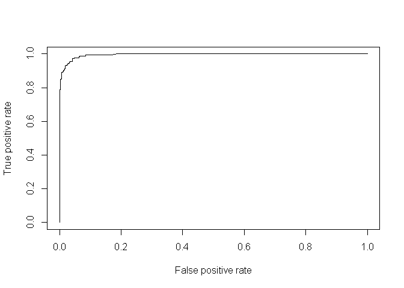

Spam SMS classifier with Naive Bays
================
Mohammed Zakaria

Required packages

``` r
#install.packages("class") # for kNN classification
#library(class)
#install.packages("gmodels") # for CrossTable function at the evaluation
library(gmodels)
#install.packages("caret") # for model tuning
library(caret)
#install.packages("e1071") # to give us Naive Bayes 
library(e1071)
#install.packages("pROC") # to make ROC plots
library(pROC)   
#install.packages("tm") # to handle text data
library(tm)
#install.packages("SnowballC") # for steaming
library(SnowballC)
#install.packages("wordcloud2") # to create word cloud
library(wordcloud2)
```

    ## Warning: package 'wordcloud2' was built under R version 3.4.4

``` r
#install.packages("widgetframe")
#library(widgetframe)
#devtools::install_github('ramnathv/htmlwidgets')
library(wordcloud)
library(klaR) # nb library used by caret
library(ROCR) # another way to do ROC
#install.packages("ggplot2")
library(ggplot2)
#install.packages("dplyr")
library(dplyr)
#install.packages("styler")
#library(styler) # introduces better code style
```

Pulling the data: The cancer data is from Brett Lantz's "Machine Learning with R" a repo for the data is under this link: <https://github.com/mzakariaCERN/Machine-Learning-with-R-datasets/blob/master/wisc_bc_data.csv> and original data can be found under <https://archive.ics.uci.edu/ml/machine-learning-databases/breast-cancer-wisconsin/>

``` r
sms_raw <- read.csv(file="C:/Users/mkzak/Documents/GitHub/FunWithR/FunWithR/2_NB/Data/sms_spam.csv", stringsAsFactors = FALSE)


dim(sms_raw)
```

    ## [1] 5574    2

``` r
str(sms_raw)
```

    ## 'data.frame':    5574 obs. of  2 variables:
    ##  $ type: chr  "ham" "ham" "spam" "ham" ...
    ##  $ text: chr  "Go until jurong point, crazy.. Available only in bugis n great world la e buffet... Cine there got amore wat..." "Ok lar... Joking wif u oni..." "Free entry in 2 a wkly comp to win FA Cup final tkts 21st May 2005. Text FA to 87121 to receive entry question("| __truncated__ "U dun say so early hor... U c already then say..." ...

``` r
summary(sms_raw)
```

    ##      type               text          
    ##  Length:5574        Length:5574       
    ##  Class :character   Class :character  
    ##  Mode  :character   Mode  :character

We see there are two features. And the feature type has a categorical variables. So we need to convert it to factor

``` r
sms_raw$type <- as.factor(sms_raw$type)

str(sms_raw$type)
```

    ##  Factor w/ 2 levels "ham","spam": 1 1 2 1 1 2 1 1 2 2 ...

``` r
table(sms_raw$type)
```

    ## 
    ##  ham spam 
    ## 4827  747

After installing (loading) tm library, we need to create a container for all the text we are dealing with. This is called a corpus. WE will use VCorpus (for volatile corpus: corpus stored in memove, compare it to PCorpus, which is stored on disk).

``` r
sms_corpus <- VCorpus(VectorSource(sms_raw$text))
typeof(sms_corpus)
```

    ## [1] "list"

corpus can read from pdf of MS word using readerControl parameter. Check it out! Notice also that corpus is a list objects. So we can manipulate it as such.

``` r
print(sms_corpus)
```

    ## <<VCorpus>>
    ## Metadata:  corpus specific: 0, document level (indexed): 0
    ## Content:  documents: 5574

``` r
inspect(sms_corpus[1:3])
```

    ## <<VCorpus>>
    ## Metadata:  corpus specific: 0, document level (indexed): 0
    ## Content:  documents: 3
    ## 
    ## [[1]]
    ## <<PlainTextDocument>>
    ## Metadata:  7
    ## Content:  chars: 111
    ## 
    ## [[2]]
    ## <<PlainTextDocument>>
    ## Metadata:  7
    ## Content:  chars: 29
    ## 
    ## [[3]]
    ## <<PlainTextDocument>>
    ## Metadata:  7
    ## Content:  chars: 155

To see one message, we need to grab that element in from the list, and conver it to characters

``` r
as.character(sms_corpus[[1]])
```

    ## [1] "Go until jurong point, crazy.. Available only in bugis n great world la e buffet... Cine there got amore wat..."

This can be generalized using lapply

``` r
lapply(sms_corpus[1:2], as.character)
```

    ## $`1`
    ## [1] "Go until jurong point, crazy.. Available only in bugis n great world la e buffet... Cine there got amore wat..."
    ## 
    ## $`2`
    ## [1] "Ok lar... Joking wif u oni..."

Next, we need to clean the text from special characters, capital letters etc, and convert it into separate words.

First, convert to lower case

``` r
sms_corpus_clean <- tm_map(sms_corpus, content_transformer(tolower))
```

remember the first message starts with an upper case letter. Let us take a look now

``` r
as.character(sms_corpus_clean[[1]])
```

    ## [1] "go until jurong point, crazy.. available only in bugis n great world la e buffet... cine there got amore wat..."

next thing, is to remove numbers from SMS. Though some might be useful for the sender/receiver. It doesn't play much value in spam/ham classification.

``` r
sms_corpus_clean <- tm_map(sms_corpus_clean, removeNumbers) # no need for content_tranformer b/c removeNumbers is built in tm. to see other
# built in functions type getTransformations()
```

Next we remove filler (stop) words suc as: 'and', 'or', and 'but'

``` r
sms_corpus_clean <- tm_map(sms_corpus_clean, removeWords, stopwords())
```

Notice that stoprwords returns a vector of the words we need to consider as such. We can thus add a remove words from the list to modify the selection

Next, we remove any punctuation

``` r
sms_corpus_clean <- tm_map(sms_corpus_clean, removePunctuation)
```

Notice that this function will join words that have punctuation marks between them without any space. Ex: "Hi...Hi" will become "HiHi" To fix this we can create a function like

``` r
replacePunctuation <- function(x){gsub("[[:punct:]]", " ", x)}
```

the above function can be used with tm\_map

Next, we return all words to their root (AKA: steaming). To do this install and/or load SnowballC

``` r
sms_corpus_clean <- tm_map(sms_corpus_clean, stemDocument)
```

next, to remove any extra white space

``` r
sms_corpus_clean <- tm_map(sms_corpus_clean, stripWhitespace)
```

Finally, we need to convert the messages into word (AKA tokenization). We will convert the corpus into Document Term Matrix: rows are SMS messages, and columns are word. Think of it as creating dummy variables for each word.

``` r
sms_dtm <- DocumentTermMatrix(sms_corpus_clean)

sms_dtm
```

    ## <<DocumentTermMatrix (documents: 5574, terms: 6604)>>
    ## Non-/sparse entries: 42631/36768065
    ## Sparsity           : 100%
    ## Maximal term length: 40
    ## Weighting          : term frequency (tf)

Notice that we could have create a DTM from the raw corpus with all the pre-processing in one command

``` r
sms_dtm2 <- DocumentTermMatrix(sms_corpus, control = list(tolower = TRUE, removeNumbers = TRUE, stopwords = TRUE, removePunctuation = TRUE, steaming = TRUE))

sms_dtm2
```

    ## <<DocumentTermMatrix (documents: 5574, terms: 8364)>>
    ## Non-/sparse entries: 44221/46576715
    ## Sparsity           : 100%
    ## Maximal term length: 40
    ## Weighting          : term frequency (tf)

notice there are minor differences between the two matrices. this is mainly due to cleaning the corpus after spliting it into words in the second option. it also uses a slightly different choice for stop words. To fortce it to use the same stopwords:

``` r
stopWords = function(x){removeWords(x, stopwords())}
```

and replace stopwrods = TRUE with that function

Next step is splitting the data into training and testing. Since the data is randomized as is, no need to randomize it

``` r
sms_dtm_train <- sms_dtm[1:4169,]
sms_dtm_test <- sms_dtm[4170:5574,]

sms_train_labels <- sms_raw[1:4169,]$type
sms_test_labels <- sms_raw[4170:5574,]$type
```

Checking that ratio of spam to ham is close in both samples

``` r
prop.table(table(sms_train_labels))
```

    ## sms_train_labels
    ##       ham      spam 
    ## 0.8647158 0.1352842

``` r
prop.table(table(sms_test_labels))
```

    ## sms_test_labels
    ##       ham      spam 
    ## 0.8697509 0.1302491

create a word cloud. Lantz uses package wordcount. I will replicate that here and use another package: wordcloud2 that gives js plots with interactive elements

``` r
wordcloud(sms_corpus_clean, min.freq = 50, random.order = FALSE)
```


Let us do a cloud for only spam and ham

``` r
spam <- subset(sms_raw, type == "spam")
ham <- subset(sms_raw, type = "ham")
wordcloud(spam$text, max.words = 40, scale = c(3, .5))
```


``` r
wordcloud(ham$text, max.words = 40, scale = c(3, .5))
```


Next I will use wordcount2. Which needs a data frame with word and frequency. which can be prepared from a TermDocumentMatrix (TDM, and not DTM)

``` r
myTdm <-
  as.matrix(TermDocumentMatrix(
  sms_corpus,
  control = list(
  tolower = TRUE,
  removeNumbers = TRUE,
  stopwords = TRUE,
  removePunctuation = TRUE,
  steaming = TRUE
  )
  ))
  FreqMat <- data.frame(ST = rownames(myTdm),
  Freq = rowSums(myTdm),
  row.names = NULL)
  
  wc2 <- wordcloud2(FreqMat, minSize = 50)
```

We can also do similar plots with ham and spam messages to compare between them. Notice that you need to set always\_allow\_html: yes in yaml and you can only see the interactive image in html. so it was difficult to deploy on github.

Since the TDM has one feature per word, we have over 6000 features. Many of these features for words that were mentioned once or twice. These are unlikely to be useful in the classification. so we set a frequency filter to remove any word mentioned less than 5 times.

``` r
sms_freq_words <- findFreqTerms(sms_dtm_train, 5)
str(sms_freq_words)
```

    ##  chr [1:1158] "–" "abiola" "abl" "abt" "accept" "access" "account" ...

remove every column that matches this vector

``` r
sms_dtm_freq_train <- sms_dtm_train[, sms_freq_words]
sms_dtm_freq_test  <- sms_dtm_test[, sms_freq_words]
```

NB classifiers typically use categorical features. This poses an issue for sparce matrices (DTM) since the cell are numeric and measure the number of times a word appears in the same massage. To change it to categorical we convert it to yes/no

``` r
convert_counts <- function(x) {
  x <- ifelse(x > 0, "yes", "no")
}
```

we apply the function on the columns

``` r
sms_train <- apply(sms_dtm_freq_train, 2, convert_counts)
sms_test <-  apply(sms_dtm_freq_test, 2, convert_counts)
```

Next we build a Naive Bayes model to find the probability of the message being a spam or a ham based on the presence of words.

``` r
sms_classifier <- naiveBayes(sms_train, sms_train_labels)
```

making a prediction

``` r
sms_test_pred <- predict(sms_classifier, sms_test)
```

using CrossTables() for evaluation

``` r
CrossTable(sms_test_pred, sms_test_labels, prop.chisq = FALSE, prop.t = FALSE, dnn = c('predicted','actual'))
```

    ## 
    ##  
    ##    Cell Contents
    ## |-------------------------|
    ## |                       N |
    ## |           N / Row Total |
    ## |           N / Col Total |
    ## |-------------------------|
    ## 
    ##  
    ## Total Observations in Table:  1405 
    ## 
    ##  
    ##              | actual 
    ##    predicted |       ham |      spam | Row Total | 
    ## -------------|-----------|-----------|-----------|
    ##          ham |      1213 |        20 |      1233 | 
    ##              |     0.984 |     0.016 |     0.878 | 
    ##              |     0.993 |     0.109 |           | 
    ## -------------|-----------|-----------|-----------|
    ##         spam |         9 |       163 |       172 | 
    ##              |     0.052 |     0.948 |     0.122 | 
    ##              |     0.007 |     0.891 |           | 
    ## -------------|-----------|-----------|-----------|
    ## Column Total |      1222 |       183 |      1405 | 
    ##              |     0.870 |     0.130 |           | 
    ## -------------|-----------|-----------|-----------|
    ## 
    ## 

``` r
probs <- predict(sms_classifier, sms_test, type = "raw")
# plot ROC curve
pred <- prediction(probs[, "spam"], sms_test_labels)
perf_nb <- performance(pred, measure = 'tpr', x.measure = 'fpr')
plot(perf_nb)
```



``` r
performance(pred, 'auc')
```

    ## An object of class "performance"
    ## Slot "x.name":
    ## [1] "None"
    ## 
    ## Slot "y.name":
    ## [1] "Area under the ROC curve"
    ## 
    ## Slot "alpha.name":
    ## [1] "none"
    ## 
    ## Slot "x.values":
    ## list()
    ## 
    ## Slot "y.values":
    ## [[1]]
    ## [1] 0.9951057
    ## 
    ## 
    ## Slot "alpha.values":
    ## list()

``` r
# plot calibration
data.frame(predicted = probs[, "spam"], actual = sms_test_labels) %>%
  group_by(predicted = round(predicted * 10) / 10) %>%
  summarize(num = n(), actual = mean(actual == "spam")) %>%
  ggplot(data = ., aes(x = predicted, y = actual, size = num)) +
  geom_point() +
  geom_abline(a = 1, b = 0, linetype = 2) +
  scale_x_continuous(labels = scales::percent, lim = c(0, 1)) +
  scale_y_continuous(labels = scales::percent, lim = c(0, 1))
```

    ## Warning: Ignoring unknown parameters: a, b


They points are distributed evenly. So no sign of over confidence.

``` r
data.frame(predicted = probs, actual = sms_test_labels) %>%
  ggplot(data = ., aes(x = predicted.spam)) +
  geom_density(aes(fill = sms_test_labels), alpha = 0.5) +
  xlab('Predicted probability of spam') +
  scale_fill_discrete(name = "Actual label") +
  theme(legend.position = c(0.8, 0.8))
```


One way to improve on the model, is to set laplace more than zero. this way words with zero occurance in either class will not have an indisputable say of the classification

``` r
sms_classifier2 <- naiveBayes(sms_train, sms_train_labels, lablace = 2)
sms_test_pred2 <- predict(sms_classifier2, sms_test)
```

``` r
CrossTable(sms_test_pred2, sms_test_labels, prop.chisq = FALSE, prop.t = FALSE, prop.r = FALSE, dnn = c('predicted','actual'))
```

    ## 
    ##  
    ##    Cell Contents
    ## |-------------------------|
    ## |                       N |
    ## |           N / Col Total |
    ## |-------------------------|
    ## 
    ##  
    ## Total Observations in Table:  1405 
    ## 
    ##  
    ##              | actual 
    ##    predicted |       ham |      spam | Row Total | 
    ## -------------|-----------|-----------|-----------|
    ##          ham |      1213 |        20 |      1233 | 
    ##              |     0.993 |     0.109 |           | 
    ## -------------|-----------|-----------|-----------|
    ##         spam |         9 |       163 |       172 | 
    ##              |     0.007 |     0.891 |           | 
    ## -------------|-----------|-----------|-----------|
    ## Column Total |      1222 |       183 |      1405 | 
    ##              |     0.870 |     0.130 |           | 
    ## -------------|-----------|-----------|-----------|
    ## 
    ## 

``` r
probs_2 <- predict(sms_classifier2, sms_test, type="raw")
# plot ROC curve
pred <- prediction(probs_2[, "spam"], sms_test_labels)
perf_nb_2 <- performance(pred, measure='tpr', x.measure='fpr')
#plot(perf_nb_2)
performance(pred, 'auc')
```

    ## An object of class "performance"
    ## Slot "x.name":
    ## [1] "None"
    ## 
    ## Slot "y.name":
    ## [1] "Area under the ROC curve"
    ## 
    ## Slot "alpha.name":
    ## [1] "none"
    ## 
    ## Slot "x.values":
    ## list()
    ## 
    ## Slot "y.values":
    ## [[1]]
    ## [1] 0.9951057
    ## 
    ## 
    ## Slot "alpha.values":
    ## list()

``` r
# plot calibration
#data.frame(predicted=probs_2[, "spam"], actual=sms_test_labels) %>%
#  group_by(predicted=round(predicted*10)/10) %>%
#  summarize(num=n(), actual=mean(actual == "spam")) %>%
#  ggplot(data=., aes(x=predicted, y=actual, size=num)) +
#  geom_point() +
#  geom_abline(a=1, b=0, linetype=2) +
#  scale_x_continuous(labels=scales::percent, lim=c(0,1)) +
#  scale_y_continuous(labels=scales::percent, lim=c(0,1))
```

Lets compary the two ROC curves

``` r
# plot ROC for each method
roc_nb   <-
  data.frame(fpr = unlist(perf_nb@x.values),
  tpr = unlist(perf_nb@y.values))
  roc_nb$method <- "naive bayes"
  roc_nb_2 <-
  data.frame(fpr = unlist(perf_nb_2@x.values),
  tpr = unlist(perf_nb_2@y.values))
  roc_nb_2$method <- "nive bayes 2"
  rbind(roc_nb, roc_nb_2) %>%
  ggplot(data = ., aes(
  x = fpr,
  y = tpr,
  linetype = method,
  color = method
  )) +
  geom_line() +
  geom_abline(a = 1, b = 0, linetype = 2) +
  scale_x_continuous(labels = scales::percent, lim = c(0, 1)) +
  scale_y_continuous(labels = scales::percent, lim = c(0, 1)) +
  theme(legend.position = c(0.8, 0.2),
  legend.title = element_blank())
```

    ## Warning: Ignoring unknown parameters: a, b


Next we need to investigate if hypertuning can get us a better result. First, let us see what caret has to say about Naive Bayes

``` r
modelLookup("nb")
```

    ##   model parameter                label forReg forClass probModel
    ## 1    nb        fL   Laplace Correction  FALSE     TRUE      TRUE
    ## 2    nb usekernel    Distribution Type  FALSE     TRUE      TRUE
    ## 3    nb    adjust Bandwidth Adjustment  FALSE     TRUE      TRUE

So we have 3 parameters to tune

``` r
sms_classifier3<- train(sms_train, sms_train_labels, method = "nb", verbose = FALSE)
sms_classifier3
```

    ## Naive Bayes 
    ## 
    ## 4169 samples
    ## 1158 predictors
    ##    2 classes: 'ham', 'spam' 
    ## 
    ## No pre-processing
    ## Resampling: Bootstrapped (25 reps) 
    ## Summary of sample sizes: 4169, 4169, 4169, 4169, 4169, 4169, ... 
    ## Resampling results across tuning parameters:
    ## 
    ##   usekernel  Accuracy   Kappa    
    ##   FALSE      0.9837345  0.9237371
    ##    TRUE      0.9837345  0.9237371
    ## 
    ## Tuning parameter 'fL' was held constant at a value of 0
    ## Tuning
    ##  parameter 'adjust' was held constant at a value of 1
    ## Accuracy was used to select the optimal model using  the largest value.
    ## The final values used for the model were fL = 0, usekernel = FALSE
    ##  and adjust = 1.

``` r
sms_test_pred3 <- predict(sms_classifier3, sms_test)
CrossTable(sms_test_pred3, sms_test_labels, prop.chisq = FALSE, prop.t = FALSE, prop.r = FALSE, dnn = c('predicted','actual'))
```

    ## 
    ##  
    ##    Cell Contents
    ## |-------------------------|
    ## |                       N |
    ## |           N / Col Total |
    ## |-------------------------|
    ## 
    ##  
    ## Total Observations in Table:  1405 
    ## 
    ##  
    ##              | actual 
    ##    predicted |       ham |      spam | Row Total | 
    ## -------------|-----------|-----------|-----------|
    ##          ham |      1213 |        20 |      1233 | 
    ##              |     0.993 |     0.109 |           | 
    ## -------------|-----------|-----------|-----------|
    ##         spam |         9 |       163 |       172 | 
    ##              |     0.007 |     0.891 |           | 
    ## -------------|-----------|-----------|-----------|
    ## Column Total |      1222 |       183 |      1405 | 
    ##              |     0.870 |     0.130 |           | 
    ## -------------|-----------|-----------|-----------|
    ## 
    ## 

I turned the verbose flag off, the output is very large. if you turn it on, you notice the first few messages are: predictions failed for Resample01: usekernel= TRUE, fL=0, adjust=1 Error in log(sapply(1:nattribs, tempfoo)) : non-numeric argument to mathematical function model fit failed for Resample01: usekernel=FALSE, fL=0, adjust=1 Error in `[<-`(`*tmp*`, , !num, value = 1) : (subscript) logical subscript too long predictions failed for Resample02: usekernel= TRUE, fL=0, adjust=1 Error in log(sapply(1:nattribs, tempfoo)) : non-numeric argument to mathematical function model fit failed for Resample02: usekernel=FALSE, fL=0, adjust=1 Error in `[<-`(`*tmp*`, , !num, value = 1) : (subscript) logical subscript too long predictions failed for Resample03: usekernel= TRUE, fL=0, adjust=1 Error in log(sapply(1:nattribs, tempfoo)) : non-numeric argument to mathematical function model fit failed for Resample03: usekernel=FALSE, fL=0, adjust=1 Error in `[<-`(`*tmp*`, , !num, value = 1) : (subscript) logical subscript too long predictions failed for Resample04: usekernel= TRUE, fL=0, adjust=1 Error in log(sapply(1:nattribs, tempfoo)) : non-numeric argument to mathematical function model fit failed for Resample04: usekernel=FALSE, fL=0, adjust=1 Error in `[<-`(`*tmp*`, , !num, value = 1) : (subscript) logical subscript too long predictions failed for Resample05: usekernel= TRUE, fL=0, adjust=1 Error in log(sapply(1:nattribs, tempfoo)) : non-numeric argument to mathematical function model fit failed for Resample05: usekernel=FALSE, fL=0, adjust=1 Error in `[<-`(`*tmp*`, , !num, value = 1) : (subscript) logical subscript too long

which is bother some. we are not getting an output ofr most of the tuning choices, except the kernel

``` r
trellis.par.set(caretTheme())
densityplot(sms_classifier3, pch = "|")
```


if you check str(sms\_classifier3) default method is boot, let us try cv

``` r
sms_classifier4<- train(sms_train, sms_train_labels, method = "nb", trControl=trainControl(method='cv',number=10));
sms_classifier4
```

    ## Naive Bayes 
    ## 
    ## 4169 samples
    ## 1158 predictors
    ##    2 classes: 'ham', 'spam' 
    ## 
    ## No pre-processing
    ## Resampling: Cross-Validated (10 fold) 
    ## Summary of sample sizes: 3752, 3753, 3753, 3752, 3751, 3752, ... 
    ## Resampling results across tuning parameters:
    ## 
    ##   usekernel  Accuracy   Kappa    
    ##   FALSE      0.9822415  0.9204073
    ##    TRUE      0.9822415  0.9204073
    ## 
    ## Tuning parameter 'fL' was held constant at a value of 0
    ## Tuning
    ##  parameter 'adjust' was held constant at a value of 1
    ## Accuracy was used to select the optimal model using  the largest value.
    ## The final values used for the model were fL = 0, usekernel = FALSE
    ##  and adjust = 1.

``` r
sms_test_pred4 <- predict(sms_classifier4, sms_test)
CrossTable(sms_test_pred4, sms_test_labels, prop.chisq = FALSE, prop.t = FALSE, prop.r = FALSE, dnn = c('predicted','actual'))
```

    ## 
    ##  
    ##    Cell Contents
    ## |-------------------------|
    ## |                       N |
    ## |           N / Col Total |
    ## |-------------------------|
    ## 
    ##  
    ## Total Observations in Table:  1405 
    ## 
    ##  
    ##              | actual 
    ##    predicted |       ham |      spam | Row Total | 
    ## -------------|-----------|-----------|-----------|
    ##          ham |      1213 |        20 |      1233 | 
    ##              |     0.993 |     0.109 |           | 
    ## -------------|-----------|-----------|-----------|
    ##         spam |         9 |       163 |       172 | 
    ##              |     0.007 |     0.891 |           | 
    ## -------------|-----------|-----------|-----------|
    ## Column Total |      1222 |       183 |      1405 | 
    ##              |     0.870 |     0.130 |           | 
    ## -------------|-----------|-----------|-----------|
    ## 
    ## 

Trying to use ROC, not sure why we get an error

ctrl &lt;- trainControl(method = "cv",
summaryFunction=twoClassSummary, classProbs=TRUE, allowParallel = FALSE) m\_cv\_ROC &lt;- train(sms\_train, sms\_train\_labels, method = "nb", metric = "ROC", trControl = ctrl)

m\_cv\_ROC sms\_test\_pred5 &lt;- predict(m\_cv\_ROC, sms\_test) CrossTable(sms\_test\_pred5, sms\_test\_labels, prop.chisq = FALSE, prop.t = FALSE, prop.r = FALSE, dnn = c('predicted','actual'))

sometimes we get this error: task 1 failed - "non-numeric argument to mathematical function". changed to cv, and removed parallel. it seems to work!

trellis.par.set(caretTheme()) densityplot(m\_cv\_ROC, pch = "|")

> References
> 1. <https://rpubs.com/jhofman/nb_vs_lr>
> 2. <https://topepo.github.io/caret/model-training-and-tuning.html>
