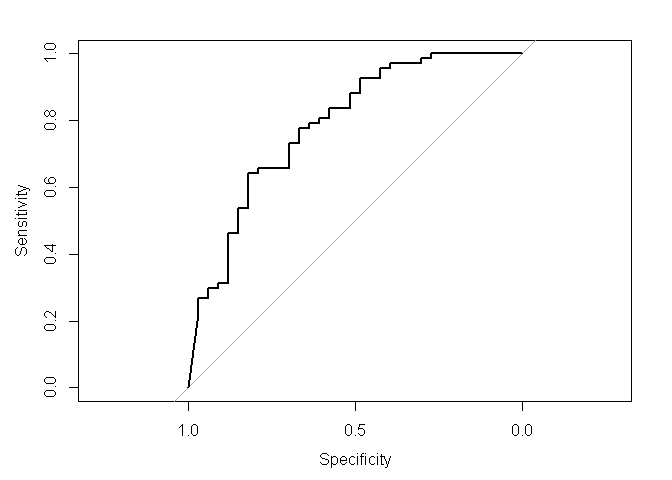
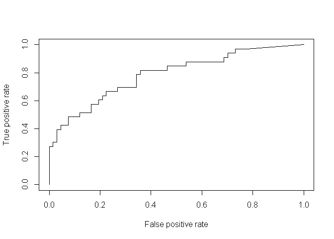
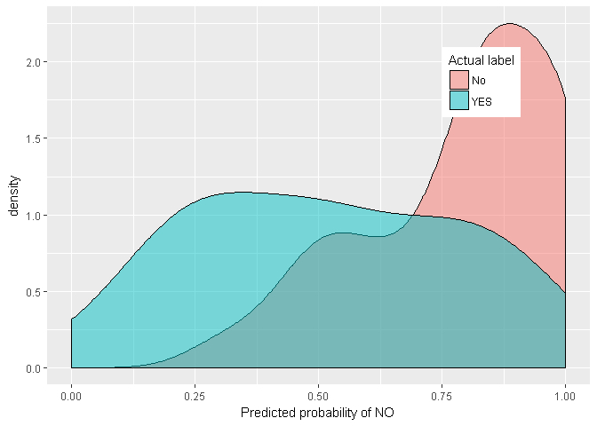
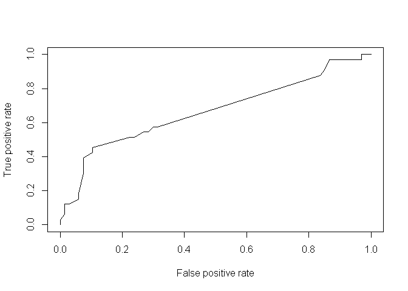
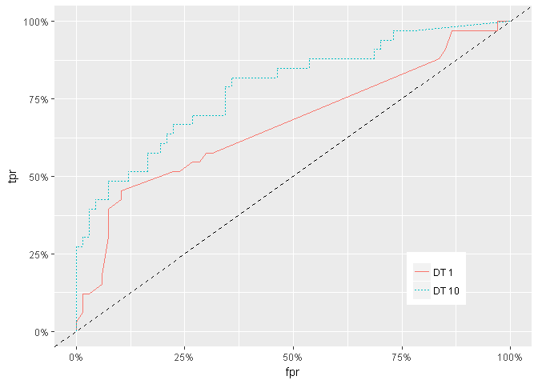
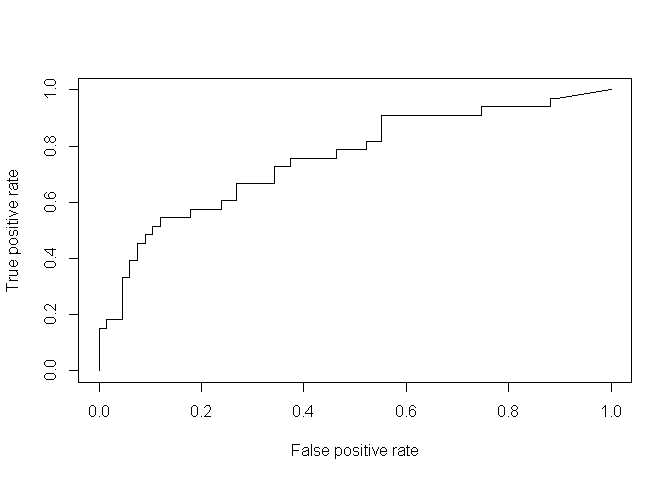
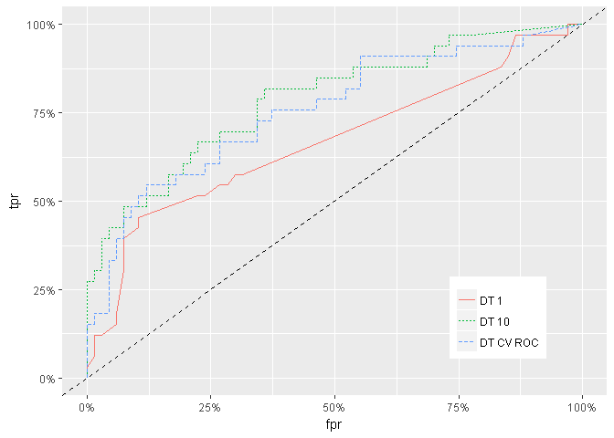

Bank Loan classifier with Decision Trees
================
Mohammed Zakaria

``` r
library(gmodels) # for CrossTable
library(ggplot2)
#install.packages("C50") # for DT algorithm
library(C50)
library(caret)
```

    ## Warning: package 'caret' was built under R version 3.5.1

``` r
#install.packages('pROC')
library(pROC)
library(dplyr)
```

Pulling the data: The credit data is from Brett Lantz’s “Machine
Learning with R” a repo for the data is under this link:
<https://github.com/stedy/Machine-Learning-with-R-datasets/blob/master/credit.csv>
and original data can be found under
<https://archive.ics.uci.edu/ml>

``` r
credit <- read.csv(file="C:/Users/mkzak/Documents/GitHub/FunWithR/FunWithR/3_DT/Data/credit.csv", stringsAsFactors = FALSE)
str(credit)
```

    ## 'data.frame':    1000 obs. of  21 variables:
    ##  $ checking_balance    : chr  "< 0 DM" "1 - 200 DM" "unknown" "< 0 DM" ...
    ##  $ months_loan_duration: int  6 48 12 42 24 36 24 36 12 30 ...
    ##  $ credit_history      : chr  "critical" "repaid" "critical" "repaid" ...
    ##  $ purpose             : chr  "radio/tv" "radio/tv" "education" "furniture" ...
    ##  $ amount              : int  1169 5951 2096 7882 4870 9055 2835 6948 3059 5234 ...
    ##  $ savings_balance     : chr  "unknown" "< 100 DM" "< 100 DM" "< 100 DM" ...
    ##  $ employment_length   : chr  "> 7 yrs" "1 - 4 yrs" "4 - 7 yrs" "4 - 7 yrs" ...
    ##  $ installment_rate    : int  4 2 2 2 3 2 3 2 2 4 ...
    ##  $ personal_status     : chr  "single male" "female" "single male" "single male" ...
    ##  $ other_debtors       : chr  "none" "none" "none" "guarantor" ...
    ##  $ residence_history   : int  4 2 3 4 4 4 4 2 4 2 ...
    ##  $ property            : chr  "real estate" "real estate" "real estate" "building society savings" ...
    ##  $ age                 : int  67 22 49 45 53 35 53 35 61 28 ...
    ##  $ installment_plan    : chr  "none" "none" "none" "none" ...
    ##  $ housing             : chr  "own" "own" "own" "for free" ...
    ##  $ existing_credits    : int  2 1 1 1 2 1 1 1 1 2 ...
    ##  $ job                 : chr  "skilled employee" "skilled employee" "unskilled resident" "skilled employee" ...
    ##  $ dependents          : int  1 1 2 2 2 2 1 1 1 1 ...
    ##  $ telephone           : chr  "yes" "none" "none" "none" ...
    ##  $ foreign_worker      : chr  "yes" "yes" "yes" "yes" ...
    ##  $ default             : int  1 2 1 1 2 1 1 1 1 2 ...

``` r
summary(credit)
```

    ##  checking_balance   months_loan_duration credit_history    
    ##  Length:1000        Min.   : 4.0         Length:1000       
    ##  Class :character   1st Qu.:12.0         Class :character  
    ##  Mode  :character   Median :18.0         Mode  :character  
    ##                     Mean   :20.9                           
    ##                     3rd Qu.:24.0                           
    ##                     Max.   :72.0                           
    ##    purpose              amount      savings_balance    employment_length 
    ##  Length:1000        Min.   :  250   Length:1000        Length:1000       
    ##  Class :character   1st Qu.: 1366   Class :character   Class :character  
    ##  Mode  :character   Median : 2320   Mode  :character   Mode  :character  
    ##                     Mean   : 3271                                        
    ##                     3rd Qu.: 3972                                        
    ##                     Max.   :18424                                        
    ##  installment_rate personal_status    other_debtors      residence_history
    ##  Min.   :1.000    Length:1000        Length:1000        Min.   :1.000    
    ##  1st Qu.:2.000    Class :character   Class :character   1st Qu.:2.000    
    ##  Median :3.000    Mode  :character   Mode  :character   Median :3.000    
    ##  Mean   :2.973                                          Mean   :2.845    
    ##  3rd Qu.:4.000                                          3rd Qu.:4.000    
    ##  Max.   :4.000                                          Max.   :4.000    
    ##    property              age        installment_plan     housing         
    ##  Length:1000        Min.   :19.00   Length:1000        Length:1000       
    ##  Class :character   1st Qu.:27.00   Class :character   Class :character  
    ##  Mode  :character   Median :33.00   Mode  :character   Mode  :character  
    ##                     Mean   :35.55                                        
    ##                     3rd Qu.:42.00                                        
    ##                     Max.   :75.00                                        
    ##  existing_credits     job              dependents     telephone        
    ##  Min.   :1.000    Length:1000        Min.   :1.000   Length:1000       
    ##  1st Qu.:1.000    Class :character   1st Qu.:1.000   Class :character  
    ##  Median :1.000    Mode  :character   Median :1.000   Mode  :character  
    ##  Mean   :1.407                       Mean   :1.155                     
    ##  3rd Qu.:2.000                       3rd Qu.:1.000                     
    ##  Max.   :4.000                       Max.   :2.000                     
    ##  foreign_worker        default   
    ##  Length:1000        Min.   :1.0  
    ##  Class :character   1st Qu.:1.0  
    ##  Mode  :character   Median :1.0  
    ##                     Mean   :1.3  
    ##                     3rd Qu.:2.0  
    ##                     Max.   :2.0

from str() we see that the target feature is actually numerical
representing a categorical variable (default vs. no default) and we see
that it has 1 for no default and 2 for default. we will label them to
make it more readable

``` r
credit$default <- factor(credit$default, labels = c('No', 'YES'))
```

``` r
table(credit$checking_balance)
```

    ## 
    ##     < 0 DM   > 200 DM 1 - 200 DM    unknown 
    ##        274         63        269        394

``` r
table(credit$default)
```

    ## 
    ##  No YES 
    ## 700 300

We divide the data 90:10. WE cannot assume that the data is random. So
let us do that

``` r
set.seed(123)
train_sample <- sample(1000, 900) # get 900 randomly selected numbers, each between 0 and 1000
str(train_sample)
```

    ##  int [1:900] 288 788 409 881 937 46 525 887 548 453 ...

``` r
credit_train <- credit[train_sample, ]
credit_test <- credit[-train_sample,]
```

``` r
prop.table(table(credit_train$default))
```

    ## 
    ##        No       YES 
    ## 0.7033333 0.2966667

``` r
prop.table(table(credit_test$default))
```

    ## 
    ##   No  YES 
    ## 0.67 0.33

Close\! So we can proceed.

``` r
# remove the "default" feature since this is the target one
credit_model <- C5.0(credit_train[-21], credit_train$default)
credit_model
```

    ## 
    ## Call:
    ## C5.0.default(x = credit_train[-21], y = credit_train$default)
    ## 
    ## Classification Tree
    ## Number of samples: 900 
    ## Number of predictors: 20 
    ## 
    ## Tree size: 54 
    ## 
    ## Non-standard options: attempt to group attributes

``` r
#summary(credit_model) # uncomment to see summary for all the trees used
```

Here, number of samples is the number of examples number of predictors
is the number of features used tree size is how many decision the depth
of the tree is

More details can be seen from the summary function

``` r
summary(credit_model)
```

    ## 
    ## Call:
    ## C5.0.default(x = credit_train[-21], y = credit_train$default)
    ## 
    ## 
    ## C5.0 [Release 2.07 GPL Edition]      Thu Aug 02 18:54:31 2018
    ## -------------------------------
    ## 
    ## Class specified by attribute `outcome'
    ## 
    ## Read 900 cases (21 attributes) from undefined.data
    ## 
    ## Decision tree:
    ## 
    ## checking_balance in {unknown,> 200 DM}: No (412/50)
    ## checking_balance in {1 - 200 DM,< 0 DM}:
    ## :...other_debtors = guarantor:
    ##     :...months_loan_duration > 36: YES (4/1)
    ##     :   months_loan_duration <= 36:
    ##     :   :...installment_plan in {none,stores}: No (24)
    ##     :       installment_plan = bank:
    ##     :       :...purpose in {others,car (used),radio/tv,business,furniture,
    ##     :           :           education,repairs,retraining,
    ##     :           :           domestic appliances}: No (7/1)
    ##     :           purpose = car (new): YES (3)
    ##     other_debtors in {none,co-applicant}:
    ##     :...credit_history = critical: No (102/30)
    ##         credit_history = fully repaid: YES (27/6)
    ##         credit_history = fully repaid this bank:
    ##         :...other_debtors = none: YES (26/8)
    ##         :   other_debtors = co-applicant: No (2)
    ##         credit_history in {delayed,repaid}:
    ##         :...savings_balance in {501 - 1000 DM,> 1000 DM}: No (19/3)
    ##             savings_balance = 101 - 500 DM:
    ##             :...other_debtors = co-applicant: YES (3)
    ##             :   other_debtors = none:
    ##             :   :...personal_status in {divorced male,
    ##             :       :                   married male}: YES (6/1)
    ##             :       personal_status = single male:
    ##             :       :...age <= 41: No (15/2)
    ##             :       :   age > 41: YES (2)
    ##             :       personal_status = female:
    ##             :       :...installment_rate <= 3: No (4/1)
    ##             :           installment_rate > 3: YES (4)
    ##             savings_balance = unknown:
    ##             :...credit_history = delayed: No (8)
    ##             :   credit_history = repaid:
    ##             :   :...foreign_worker = no: No (2)
    ##             :       foreign_worker = yes:
    ##             :       :...checking_balance = < 0 DM:
    ##             :           :...telephone = none: YES (11/2)
    ##             :           :   telephone = yes:
    ##             :           :   :...amount <= 5045: No (5/1)
    ##             :           :       amount > 5045: YES (2)
    ##             :           checking_balance = 1 - 200 DM:
    ##             :           :...residence_history > 3: No (9)
    ##             :               residence_history <= 3: [S1]
    ##             savings_balance = < 100 DM:
    ##             :...months_loan_duration > 39:
    ##                 :...residence_history <= 1: No (2)
    ##                 :   residence_history > 1: YES (19/1)
    ##                 months_loan_duration <= 39:
    ##                 :...purpose in {others,domestic appliances}: No (3)
    ##                     purpose in {car (new),retraining}: YES (47/16)
    ##                     purpose = car (used):
    ##                     :...amount <= 8086: No (9/1)
    ##                     :   amount > 8086: YES (5)
    ##                     purpose = education:
    ##                     :...checking_balance = 1 - 200 DM: No (2)
    ##                     :   checking_balance = < 0 DM: YES (5)
    ##                     purpose = repairs:
    ##                     :...residence_history <= 3: YES (4/1)
    ##                     :   residence_history > 3: No (3)
    ##                     purpose = business:
    ##                     :...credit_history = delayed: YES (2)
    ##                     :   credit_history = repaid:
    ##                     :   :...age <= 34: No (5)
    ##                     :       age > 34: YES (2)
    ##                     purpose = radio/tv:
    ##                     :...employment_length in {unemployed,
    ##                     :   :                     0 - 1 yrs}: YES (14/5)
    ##                     :   employment_length = 4 - 7 yrs: No (3)
    ##                     :   employment_length = > 7 yrs:
    ##                     :   :...amount <= 932: YES (2)
    ##                     :   :   amount > 932: No (7)
    ##                     :   employment_length = 1 - 4 yrs:
    ##                     :   :...months_loan_duration <= 15: No (6)
    ##                     :       months_loan_duration > 15:
    ##                     :       :...amount <= 3275: YES (7)
    ##                     :           amount > 3275: No (2)
    ##                     purpose = furniture:
    ##                     :...residence_history <= 1: No (8/1)
    ##                         residence_history > 1:
    ##                         :...installment_plan in {bank,stores}: No (3/1)
    ##                             installment_plan = none:
    ##                             :...telephone = yes: YES (7/1)
    ##                                 telephone = none:
    ##                                 :...months_loan_duration > 27: YES (3)
    ##                                     months_loan_duration <= 27: [S2]
    ## 
    ## SubTree [S1]
    ## 
    ## property in {unknown/none,building society savings}: YES (4)
    ## property = other: No (6)
    ## property = real estate:
    ## :...job = skilled employee: YES (2)
    ##     job in {mangement self-employed,unskilled resident,
    ##             unemployed non-resident}: No (2)
    ## 
    ## SubTree [S2]
    ## 
    ## checking_balance = 1 - 200 DM: YES (5/2)
    ## checking_balance = < 0 DM:
    ## :...property in {unknown/none,real estate,building society savings}: No (8)
    ##     property = other:
    ##     :...installment_rate <= 1: No (2)
    ##         installment_rate > 1: YES (4)
    ## 
    ## 
    ## Evaluation on training data (900 cases):
    ## 
    ##      Decision Tree   
    ##    ----------------  
    ##    Size      Errors  
    ## 
    ##      54  135(15.0%)   <<
    ## 
    ## 
    ##     (a)   (b)    <-classified as
    ##    ----  ----
    ##     589    44    (a): class No
    ##      91   176    (b): class YES
    ## 
    ## 
    ##  Attribute usage:
    ## 
    ##  100.00% checking_balance
    ##   54.22% other_debtors
    ##   50.00% credit_history
    ##   32.56% savings_balance
    ##   25.22% months_loan_duration
    ##   19.78% purpose
    ##   10.11% residence_history
    ##    7.33% installment_plan
    ##    5.22% telephone
    ##    4.78% foreign_worker
    ##    4.56% employment_length
    ##    4.33% amount
    ##    3.44% personal_status
    ##    3.11% property
    ##    2.67% age
    ##    1.56% installment_rate
    ##    0.44% job
    ## 
    ## 
    ## Time: 0.0 secs

``` r
#plot(credit_model)
```

we understand a line like checking\_balance in {unknown,\> 200 DM}: 1
(412/50) by saying that if we checking balance was unknown, or larger
than 200 DM, then we are in class one. (we have 412 examples that we got
right, and 50 that we classified wrongly based on this
rule)

``` r
credit_predict <- predict(credit_model, credit_test)
```

``` r
CrossTable(credit_test$default, credit_predict, prop.chisq = FALSE, prop.c = FALSE, prop.r = FALSE, prop.t = TRUE, dnn = c('actual defualt','predicted default')) # prop.c is for proportionaliy calculation per column
```

    ## 
    ##  
    ##    Cell Contents
    ## |-------------------------|
    ## |                       N |
    ## |         N / Table Total |
    ## |-------------------------|
    ## 
    ##  
    ## Total Observations in Table:  100 
    ## 
    ##  
    ##                | predicted default 
    ## actual defualt |        No |       YES | Row Total | 
    ## ---------------|-----------|-----------|-----------|
    ##             No |        60 |         7 |        67 | 
    ##                |     0.600 |     0.070 |           | 
    ## ---------------|-----------|-----------|-----------|
    ##            YES |        19 |        14 |        33 | 
    ##                |     0.190 |     0.140 |           | 
    ## ---------------|-----------|-----------|-----------|
    ##   Column Total |        79 |        21 |       100 | 
    ## ---------------|-----------|-----------|-----------|
    ## 
    ## 

From the table we can calculate the accuracy as .6 + .14 = 0.74. The
model was particularly bad in missing 0.19 of the cases where there was
a default. We can try improving the model using
boosting

``` r
credit_boost10 <- C5.0(credit_train[-21], credit_train$default, trials = 10)
credit_boost10
```

    ## 
    ## Call:
    ## C5.0.default(x = credit_train[-21], y = credit_train$default, trials = 10)
    ## 
    ## Classification Tree
    ## Number of samples: 900 
    ## Number of predictors: 20 
    ## 
    ## Number of boosting iterations: 10 
    ## Average tree size: 49.7 
    ## 
    ## Non-standard options: attempt to group attributes

Notice how the average tree size has schrunk\!

``` r
credit_boost_pred10 <- predict(credit_boost10, credit_test)
CrossTable(credit_test$default, credit_boost_pred10, prop.chisq = FALSE, prop.c = FALSE, prop.r = FALSE, prop.t = TRUE, dnn = c('actual defualt','predicted default')) # prop.c is for proportionaliy calculation per column
```

    ## 
    ##  
    ##    Cell Contents
    ## |-------------------------|
    ## |                       N |
    ## |         N / Table Total |
    ## |-------------------------|
    ## 
    ##  
    ## Total Observations in Table:  100 
    ## 
    ##  
    ##                | predicted default 
    ## actual defualt |        No |       YES | Row Total | 
    ## ---------------|-----------|-----------|-----------|
    ##             No |        60 |         7 |        67 | 
    ##                |     0.600 |     0.070 |           | 
    ## ---------------|-----------|-----------|-----------|
    ##            YES |        17 |        16 |        33 | 
    ##                |     0.170 |     0.160 |           | 
    ## ---------------|-----------|-----------|-----------|
    ##   Column Total |        77 |        23 |       100 | 
    ## ---------------|-----------|-----------|-----------|
    ## 
    ## 

slight improvement accuracy is now 76% and the error rate is %17

Another approcah is to make one type of mistakes costier than the other

``` r
matrix_dimentions <- list(c("no", "yes"), c("no", "yes"))
names(matrix_dimentions) <- c("predicted", "actual")
matrix_dimentions
```

    ## $predicted
    ## [1] "no"  "yes"
    ## 
    ## $actual
    ## [1] "no"  "yes"

Assuming that a loan default cost us 4 times as a missed opportunity. We
will set the error matrix as the
following

``` r
error_cost <- matrix(c(0, 1, 4, 0), nrow = 2, dimnames = matrix_dimentions) ## causes problem (trees won't grow), had to do it without dimnames!
error_cost2 <- matrix(c(0, 1, 4, 0), nrow = 2)

error_cost
```

    ##          actual
    ## predicted no yes
    ##       no   0   4
    ##       yes  1   0

``` r
error_cost2
```

    ##      [,1] [,2]
    ## [1,]    0    4
    ## [2,]    1    0

``` r
credit_cost <- C5.0(credit_train[-21], credit_train$default, costs = error_cost2)
```

    ## Warning: no dimnames were given for the cost matrix; the factor levels will
    ## be used

``` r
credit_cost_pred <- predict(credit_cost, credit_test)
CrossTable(credit_test$default, credit_cost_pred, prop.r = FALSE, prop.c = FALSE, prop.chisq = FALSE, dnn = c('actual default', 'predicted default'))
```

    ## 
    ##  
    ##    Cell Contents
    ## |-------------------------|
    ## |                       N |
    ## |         N / Table Total |
    ## |-------------------------|
    ## 
    ##  
    ## Total Observations in Table:  100 
    ## 
    ##  
    ##                | predicted default 
    ## actual default |        No |       YES | Row Total | 
    ## ---------------|-----------|-----------|-----------|
    ##             No |        33 |        34 |        67 | 
    ##                |     0.330 |     0.340 |           | 
    ## ---------------|-----------|-----------|-----------|
    ##            YES |         7 |        26 |        33 | 
    ##                |     0.070 |     0.260 |           | 
    ## ---------------|-----------|-----------|-----------|
    ##   Column Total |        40 |        60 |       100 | 
    ## ---------------|-----------|-----------|-----------|
    ## 
    ## 

Notice that the total accuracy is now 59% But the type of errors has
varied and the more costly error has been reduced.

C5.0 can create an initial tree model then decompose the tree structure
into a set of mutually exclusive rules. These rules can then be pruned
and modified into a smaller set of potentially overlapping rules. The
rules can be created using the rules
option:

``` r
credit_model_rules <- C5.0(credit_train[-21], credit_train$default, rules = TRUE)
credit_model_rules
```

    ## 
    ## Call:
    ## C5.0.default(x = credit_train[-21], y = credit_train$default, rules = TRUE)
    ## 
    ## Rule-Based Model
    ## Number of samples: 900 
    ## Number of predictors: 20 
    ## 
    ## Number of Rules: 28 
    ## 
    ## Non-standard options: attempt to group attributes

``` r
summary(credit_model_rules)
```

    ## 
    ## Call:
    ## C5.0.default(x = credit_train[-21], y = credit_train$default, rules = TRUE)
    ## 
    ## 
    ## C5.0 [Release 2.07 GPL Edition]      Thu Aug 02 18:54:32 2018
    ## -------------------------------
    ## 
    ## Class specified by attribute `outcome'
    ## 
    ## Read 900 cases (21 attributes) from undefined.data
    ## 
    ## Rules:
    ## 
    ## Rule 1: (17, lift 1.3)
    ##  checking_balance = 1 - 200 DM
    ##  savings_balance = unknown
    ##  residence_history > 3
    ##  ->  class No  [0.947]
    ## 
    ## Rule 2: (32/1, lift 1.3)
    ##  months_loan_duration <= 36
    ##  purpose in {others, car (used), radio/tv, business, furniture, repairs}
    ##  other_debtors = guarantor
    ##  ->  class No  [0.941]
    ## 
    ## Rule 3: (12, lift 1.3)
    ##  credit_history = delayed
    ##  savings_balance = unknown
    ##  ->  class No  [0.929]
    ## 
    ## Rule 4: (10, lift 1.3)
    ##  months_loan_duration > 39
    ##  other_debtors = none
    ##  residence_history <= 1
    ##  ->  class No  [0.917]
    ## 
    ## Rule 5: (45/3, lift 1.3)
    ##  credit_history in {delayed, repaid}
    ##  purpose = car (used)
    ##  amount <= 8086
    ##  ->  class No  [0.915]
    ## 
    ## Rule 6: (34/3, lift 1.3)
    ##  foreign_worker = no
    ##  ->  class No  [0.889]
    ## 
    ## Rule 7: (412/50, lift 1.2)
    ##  checking_balance in {unknown, > 200 DM}
    ##  ->  class No  [0.877]
    ## 
    ## Rule 8: (258/43, lift 1.2)
    ##  credit_history = critical
    ##  other_debtors in {none, co-applicant}
    ##  ->  class No  [0.831]
    ## 
    ## Rule 9: (557/177, lift 1.0)
    ##  credit_history in {delayed, repaid}
    ##  ->  class No  [0.682]
    ## 
    ## Rule 10: (9, lift 3.1)
    ##  checking_balance in {1 - 200 DM, < 0 DM}
    ##  months_loan_duration > 15
    ##  purpose = radio/tv
    ##  amount <= 3275
    ##  savings_balance = < 100 DM
    ##  employment_length = 1 - 4 yrs
    ##  other_debtors = none
    ##  ->  class YES  [0.909]
    ## 
    ## Rule 11: (8, lift 3.0)
    ##  months_loan_duration > 27
    ##  purpose = furniture
    ##  other_debtors in {none, co-applicant}
    ##  residence_history > 1
    ##  telephone = none
    ##  ->  class YES  [0.900]
    ## 
    ## Rule 12: (8, lift 3.0)
    ##  checking_balance = < 0 DM
    ##  months_loan_duration <= 39
    ##  purpose = education
    ##  ->  class YES  [0.900]
    ## 
    ## Rule 13: (7, lift 3.0)
    ##  checking_balance in {1 - 200 DM, < 0 DM}
    ##  credit_history = repaid
    ##  purpose = car (used)
    ##  amount > 8086
    ##  ->  class YES  [0.889]
    ## 
    ## Rule 14: (6, lift 2.9)
    ##  checking_balance in {1 - 200 DM, < 0 DM}
    ##  savings_balance = 101 - 500 DM
    ##  installment_rate > 3
    ##  personal_status = female
    ##  ->  class YES  [0.875]
    ## 
    ## Rule 15: (5, lift 2.9)
    ##  checking_balance = < 0 DM
    ##  credit_history = repaid
    ##  purpose = furniture
    ##  savings_balance = < 100 DM
    ##  installment_rate > 1
    ##  residence_history > 1
    ##  property = other
    ##  installment_plan = none
    ##  ->  class YES  [0.857]
    ## 
    ## Rule 16: (4, lift 2.8)
    ##  checking_balance = 1 - 200 DM
    ##  credit_history = repaid
    ##  savings_balance = unknown
    ##  residence_history <= 3
    ##  property in {unknown/none, building society savings}
    ##  ->  class YES  [0.833]
    ## 
    ## Rule 17: (4, lift 2.8)
    ##  checking_balance = 1 - 200 DM
    ##  credit_history in {delayed, repaid}
    ##  savings_balance = 101 - 500 DM
    ##  age > 41
    ##  ->  class YES  [0.833]
    ## 
    ## Rule 18: (3, lift 2.7)
    ##  checking_balance in {1 - 200 DM, < 0 DM}
    ##  credit_history = delayed
    ##  purpose = business
    ##  savings_balance = < 100 DM
    ##  ->  class YES  [0.800]
    ## 
    ## Rule 19: (8/1, lift 2.7)
    ##  checking_balance in {1 - 200 DM, < 0 DM}
    ##  credit_history in {delayed, repaid}
    ##  purpose = furniture
    ##  savings_balance = < 100 DM
    ##  installment_plan = none
    ##  telephone = yes
    ##  ->  class YES  [0.800]
    ## 
    ## Rule 20: (3, lift 2.7)
    ##  purpose = car (new)
    ##  other_debtors = guarantor
    ##  installment_plan = bank
    ##  ->  class YES  [0.800]
    ## 
    ## Rule 21: (11/2, lift 2.6)
    ##  checking_balance = < 0 DM
    ##  credit_history = repaid
    ##  savings_balance = unknown
    ##  telephone = none
    ##  foreign_worker = yes
    ##  ->  class YES  [0.769]
    ## 
    ## Rule 22: (27/6, lift 2.6)
    ##  checking_balance in {1 - 200 DM, < 0 DM}
    ##  credit_history = fully repaid
    ##  other_debtors = none
    ##  ->  class YES  [0.759]
    ## 
    ## Rule 23: (6/1, lift 2.5)
    ##  checking_balance in {1 - 200 DM, < 0 DM}
    ##  credit_history in {delayed, repaid}
    ##  savings_balance = 101 - 500 DM
    ##  personal_status in {divorced male, married male}
    ##  ->  class YES  [0.750]
    ## 
    ## Rule 24: (26/8, lift 2.3)
    ##  checking_balance in {1 - 200 DM, < 0 DM}
    ##  credit_history = fully repaid this bank
    ##  other_debtors = none
    ##  ->  class YES  [0.679]
    ## 
    ## Rule 25: (51/17, lift 2.2)
    ##  checking_balance in {1 - 200 DM, < 0 DM}
    ##  credit_history in {delayed, repaid}
    ##  purpose in {car (new), retraining}
    ##  savings_balance = < 100 DM
    ##  other_debtors in {none, co-applicant}
    ##  ->  class YES  [0.660]
    ## 
    ## Rule 26: (17/6, lift 2.1)
    ##  checking_balance in {1 - 200 DM, < 0 DM}
    ##  purpose = radio/tv
    ##  savings_balance = < 100 DM
    ##  employment_length in {unemployed, 0 - 1 yrs}
    ##  other_debtors in {none, co-applicant}
    ##  ->  class YES  [0.632]
    ## 
    ## Rule 27: (81/40, lift 1.7)
    ##  months_loan_duration > 36
    ##  ->  class YES  [0.506]
    ## 
    ## Rule 28: (557/380, lift 1.1)
    ##  credit_history in {delayed, repaid}
    ##  ->  class YES  [0.318]
    ## 
    ## Default class: No
    ## 
    ## 
    ## Evaluation on training data (900 cases):
    ## 
    ##          Rules     
    ##    ----------------
    ##      No      Errors
    ## 
    ##      28  141(15.7%)   <<
    ## 
    ## 
    ##     (a)   (b)    <-classified as
    ##    ----  ----
    ##     591    42    (a): class No
    ##      99   168    (b): class YES
    ## 
    ## 
    ##  Attribute usage:
    ## 
    ##   96.44% credit_history
    ##   68.44% checking_balance
    ##   47.89% other_debtors
    ##   21.56% purpose
    ##   16.33% savings_balance
    ##   15.11% months_loan_duration
    ##    6.78% amount
    ##    5.00% foreign_worker
    ##    4.78% residence_history
    ##    2.89% employment_length
    ##    2.89% telephone
    ##    1.78% installment_plan
    ##    1.33% personal_status
    ##    1.22% installment_rate
    ##    1.00% property
    ##    0.44% age
    ## 
    ## 
    ## Time: 0.0 secs

``` r
probs <- predict(credit_boost10, credit_test, type = "prob")
# plot ROC curve
ROC <- roc(predictor=probs[,1], 
               response=credit_test$default,
               levels=rev(levels(credit_test$default)))
plot(ROC)
```

<!-- -->

``` r
ROC$auc
```

    ## Area under the curve: 0.7867

credit\_boost\_pred10 \<- predict(credit\_boost10, credit\_test)
CrossTable(credit\_test$default, credit\_boost\_pred10, prop.chisq =
FALSE, prop.c = FALSE, prop.r = FALSE, prop.t = TRUE, dnn = c(‘actual
defualt’,‘predicted default’)) \# prop.c is for proportionaliy
calculation per column

``` r
probs <- predict(credit_boost10, credit_test, type = "prob")
# plot ROC curve
pred <- ROCR::prediction(probs[, 2], credit_test$default)
perf_dt_10 <- ROCR::performance(pred,  'tpr',  'fpr')
#plot(perf_dt_10) #complains about coersing s4 into numeric, so we did it manually
plot(perf_dt_10@x.values[[1]], perf_dt_10@y.values[[1]], xlab = perf_dt_10@x.name[[1]], ylab = perf_dt_10@y.name[[1]], type = "l")
```

<!-- -->

``` r
ROCR::performance(pred, 'auc')
```

    ## An object of class "performance"
    ## Slot "x.name":
    ## [1] "None"
    ## 
    ## Slot "y.name":
    ## [1] "Area under the ROC curve"
    ## 
    ## Slot "alpha.name":
    ## [1] "none"
    ## 
    ## Slot "x.values":
    ## list()
    ## 
    ## Slot "y.values":
    ## [[1]]
    ## [1] 0.7867481
    ## 
    ## 
    ## Slot "alpha.values":
    ## list()

``` r
data.frame(predicted=probs, actual=credit_test$default) %>% ggplot(data=., aes(x=predicted.No)) +
  geom_density(aes(fill=credit_test$default), alpha=0.5) +
  xlab('Predicted probability of NO') +
  scale_fill_discrete(name="Actual label") +
  theme(legend.position=c(0.8,0.8))
```

<!-- -->

``` r
credit_predict <- predict(credit_model, credit_test)
```

``` r
probs_1 <- predict(credit_model, credit_test, type = "prob")
# plot ROC curve
pred_1 <- ROCR::prediction(probs_1[, 2], credit_test$default)
perf_dt_1 <- ROCR::performance(pred_1,  'tpr',  'fpr')
#plot(perf_dt_1)
plot(perf_dt_1@x.values[[1]], perf_dt_1@y.values[[1]],  xlab = perf_dt_10@x.name[[1]], ylab = perf_dt_10@y.name[[1]], type = "l" )
```

<!-- -->

``` r
ROCR::performance(pred_1, 'auc')
```

    ## An object of class "performance"
    ## Slot "x.name":
    ## [1] "None"
    ## 
    ## Slot "y.name":
    ## [1] "Area under the ROC curve"
    ## 
    ## Slot "alpha.name":
    ## [1] "none"
    ## 
    ## Slot "x.values":
    ## list()
    ## 
    ## Slot "y.values":
    ## [[1]]
    ## [1] 0.6673451
    ## 
    ## 
    ## Slot "alpha.values":
    ## list()

``` r
credit_cost_pred <- predict(credit_cost, credit_test)
```

Next we try tuning the the model with the cost, but the following code
fails\!

``` 
probs_cost <- predict(credit_cost, credit_test, type = "prob")  
pred_cost <- prediction(probs_cost[,2], credit_test$default)  
perf_dt_cost <- performance(pred_cost, measure = 'tpr', x.measure = 'fpr')  
plot(perf_dt_cost)  
performance(pred_cost, 'auc')  
```

From the manual we see that: When the cost argument is used in the main
function, class probabilities derived from the class distribution in the
terminal nodes may not be consistent with the final predicted class. For
this reason, requesting class probabilities from a model using unequal
costs will throw an error

This post suggests a fix:
<https://stackoverflow.com/questions/32633764/error-in-predict-when-using-c-50-with-costs-and-predict-with-type-prob-to-draw>

``` r
# plot ROC for each method
roc_dt_1   <- data.frame(fpr = unlist(perf_dt_1@x.values), tpr = unlist(perf_dt_1@y.values))
roc_dt_1$method <- "DT 1"
roc_dt_10 <- data.frame(fpr = unlist(perf_dt_10@x.values), tpr = unlist(perf_dt_10@y.values))
roc_dt_10$method <- "DT 10"
rbind(roc_dt_1, roc_dt_10) %>%
  ggplot(data = ., aes(x = fpr, y = tpr, linetype = method, color = method)) + 
  geom_line() +
  geom_abline(a = 1, b = 0, linetype = 2) +
  scale_x_continuous(labels = scales::percent, lim = c(0,1)) +
  scale_y_continuous(labels = scales::percent, lim = c(0,1)) +
  theme(legend.position = c(0.8,0.2), legend.title = element_blank())
```

    ## Warning: Ignoring unknown parameters: a, b

<!-- -->

Next we consider tuning the DT model. Based on the caret package See
link <https://topepo.github.io/caret/available-models.html>

``` r
modelLookup("C5.0")
```

    ##   model parameter                 label forReg forClass probModel
    ## 1  C5.0    trials # Boosting Iterations  FALSE     TRUE      TRUE
    ## 2  C5.0     model            Model Type  FALSE     TRUE      TRUE
    ## 3  C5.0    winnow                Winnow  FALSE     TRUE      TRUE

We have 3 parameters to tune in C5.0 decision trees implementation:  
1\. trials: an integer specifying the number of boosting iterations. A
value of one indicates that a single model is used  
2\. model from caret git hub page
<https://github.com/topepo/caret/blob/master/models/files/C5.0.R> seems
there are two value: rules, tree  
3\. winnow: A logical: should predictor winnowing (i.e feature
selection) be
used?

``` r
credit_classifier3 <- train(credit_train[-21], credit_train$default , method = "C5.0", verbose = FALSE)
# we can do our own grid 
#grid <- expand.grid( .winnow = c(TRUE,FALSE), .trials=c(1,5,10,15,20), .model="tree" )
#credit_classifier3<- train(credit_train[-21], credit_train$default , method = "C5.0", verbose = FALSE, tuneGrid = grid)

credit_classifier3
```

    ## C5.0 
    ## 
    ## 900 samples
    ##  20 predictor
    ##   2 classes: 'No', 'YES' 
    ## 
    ## No pre-processing
    ## Resampling: Bootstrapped (25 reps) 
    ## Summary of sample sizes: 900, 900, 900, 900, 900, 900, ... 
    ## Resampling results across tuning parameters:
    ## 
    ##   model  winnow  trials  Accuracy   Kappa    
    ##   rules  FALSE    1      0.6954821  0.2479505
    ##   rules  FALSE   10      0.7309401  0.3355641
    ##   rules  FALSE   20      0.7383617  0.3449121
    ##   rules   TRUE    1      0.7028329  0.2601177
    ##   rules   TRUE   10      0.7298985  0.3243405
    ##   rules   TRUE   20      0.7374903  0.3401968
    ##   tree   FALSE    1      0.6888668  0.2364421
    ##   tree   FALSE   10      0.7293769  0.3104265
    ##   tree   FALSE   20      0.7347056  0.3209837
    ##   tree    TRUE    1      0.6942410  0.2478067
    ##   tree    TRUE   10      0.7277946  0.3054951
    ##   tree    TRUE   20      0.7349869  0.3209695
    ## 
    ## Accuracy was used to select the optimal model using the largest value.
    ## The final values used for the model were trials = 20, model = rules
    ##  and winnow = FALSE.

``` r
credit_test_pred3 <- predict(credit_classifier3, credit_test)
CrossTable(credit_test$default, credit_test_pred3, prop.chisq = FALSE, prop.c = FALSE, prop.r = FALSE, prop.t = TRUE, dnn = c('actual defualt','predicted default')) # prop.c is for proportionaliy calculation per column
```

    ## 
    ##  
    ##    Cell Contents
    ## |-------------------------|
    ## |                       N |
    ## |         N / Table Total |
    ## |-------------------------|
    ## 
    ##  
    ## Total Observations in Table:  100 
    ## 
    ##  
    ##                | predicted default 
    ## actual defualt |        No |       YES | Row Total | 
    ## ---------------|-----------|-----------|-----------|
    ##             No |        60 |         7 |        67 | 
    ##                |     0.600 |     0.070 |           | 
    ## ---------------|-----------|-----------|-----------|
    ##            YES |        16 |        17 |        33 | 
    ##                |     0.160 |     0.170 |           | 
    ## ---------------|-----------|-----------|-----------|
    ##   Column Total |        76 |        24 |       100 | 
    ## ---------------|-----------|-----------|-----------|
    ## 
    ## 

``` r
ctrl <- trainControl(method = "cv",   
                     summaryFunction = twoClassSummary,
                     classProbs = TRUE,
                     allowParallel = FALSE)
m_cv_ROC <- train(credit_train[-21], credit_train$default,
      method = "C5.0",
      metric = "ROC",
      trControl = ctrl)
```

    ## Warning: 'trials' should be <= 9 for this object. Predictions generated
    ## using 9 trials
    
    ## Warning: 'trials' should be <= 9 for this object. Predictions generated
    ## using 9 trials

    ## Warning: 'trials' should be <= 1 for this object. Predictions generated
    ## using 1 trials
    
    ## Warning: 'trials' should be <= 1 for this object. Predictions generated
    ## using 1 trials

    ## Warning: 'trials' should be <= 3 for this object. Predictions generated
    ## using 3 trials
    
    ## Warning: 'trials' should be <= 3 for this object. Predictions generated
    ## using 3 trials

``` r
probs_cv_ROC <- predict(m_cv_ROC, credit_test, type = "prob")
# plot ROC curve
pred_cv_ROC <- ROCR::prediction(probs_cv_ROC[, 2], credit_test$default)
perf_dt_cv_ROC <- ROCR::performance(pred_cv_ROC,  'tpr',  'fpr')
#plot(perf_dt_1)
plot(perf_dt_cv_ROC@x.values[[1]], perf_dt_cv_ROC@y.values[[1]],  xlab = perf_dt_cv_ROC@x.name[[1]], ylab = perf_dt_cv_ROC@y.name[[1]], type = "l" )
```

<!-- -->

``` r
ROCR::performance(pred_cv_ROC, 'auc')
```

    ## An object of class "performance"
    ## Slot "x.name":
    ## [1] "None"
    ## 
    ## Slot "y.name":
    ## [1] "Area under the ROC curve"
    ## 
    ## Slot "alpha.name":
    ## [1] "none"
    ## 
    ## Slot "x.values":
    ## list()
    ## 
    ## Slot "y.values":
    ## [[1]]
    ## [1] 0.7559928
    ## 
    ## 
    ## Slot "alpha.values":
    ## list()

``` r
# plot ROC for each method
roc_dt_1   <- data.frame(fpr=unlist(perf_dt_1@x.values), tpr=unlist(perf_dt_1@y.values))
roc_dt_1$method <- "DT 1"
roc_dt_10 <- data.frame(fpr=unlist(perf_dt_10@x.values), tpr=unlist(perf_dt_10@y.values))
roc_dt_10$method <- "DT 10"
roc_dt_cv_ROC <- data.frame(fpr=unlist(perf_dt_cv_ROC@x.values), tpr=unlist(perf_dt_cv_ROC@y.values))
roc_dt_cv_ROC$method <- "DT CV ROC"

rbind(roc_dt_1, roc_dt_10, roc_dt_cv_ROC) %>%
  ggplot(data=., aes(x=fpr, y=tpr, linetype=method, color=method)) + 
  geom_line() +
  geom_abline(a=1, b=0, linetype=2) +
  scale_x_continuous(labels=scales::percent, lim=c(0,1)) +
  scale_y_continuous(labels=scales::percent, lim=c(0,1)) +
  theme(legend.position=c(0.8,0.2), legend.title=element_blank())
```

    ## Warning: Ignoring unknown parameters: a, b

<!-- -->

> References  
> <https://cran.r-project.org/web/packages/C50/vignettes/C5.0.html>  
> <https://cran.r-project.org/web/packages/C50/C50.pdf>
