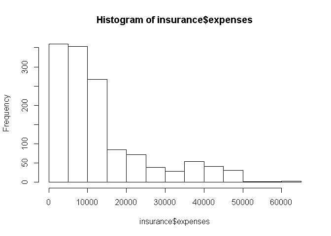
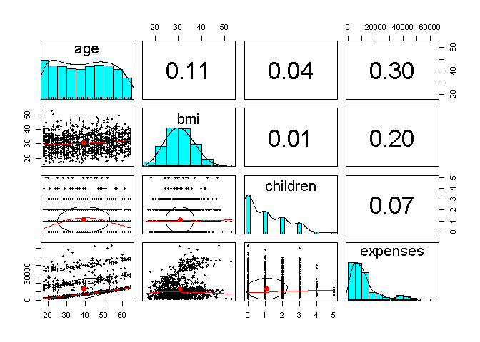

Linear Regression to PRedict Medical Expenses
================

``` r
# check.packages function: install and load multiple R packages.
# Check to see if packages are installed. Install them if they are not, then load them into the R session.
check.packages <- function(pkg){
    new.pkg <- pkg[!(pkg %in% installed.packages()[, "Package"])]
    if (length(new.pkg)) 
        install.packages(new.pkg, dependencies = TRUE)
    sapply(pkg, require, character.only = TRUE)
}

# Usage example
#packages<-c("ggplot2", "afex", "ez", "Hmisc", "pander", "plyr")
#check.packages(packages)
```

``` r
check.packages(c("psych"))
```

    ## Loading required package: psych

    ## psych 
    ##  TRUE

``` r
insurance <- read.csv(file = "Data/insurance.csv", stringsAsFactors = TRUE  )
str(insurance)
```

    ## 'data.frame':    1338 obs. of  7 variables:
    ##  $ age     : int  19 18 28 33 32 31 46 37 37 60 ...
    ##  $ sex     : Factor w/ 2 levels "female","male": 1 2 2 2 2 1 1 1 2 1 ...
    ##  $ bmi     : num  27.9 33.8 33 22.7 28.9 25.7 33.4 27.7 29.8 25.8 ...
    ##  $ children: int  0 1 3 0 0 0 1 3 2 0 ...
    ##  $ smoker  : Factor w/ 2 levels "no","yes": 2 1 1 1 1 1 1 1 1 1 ...
    ##  $ region  : Factor w/ 4 levels "northeast","northwest",..: 4 3 3 2 2 3 3 2 1 2 ...
    ##  $ expenses: num  16885 1726 4449 21984 3867 ...

``` r
summary(insurance)
```

    ##       age            sex           bmi           children     smoker    
    ##  Min.   :18.00   female:662   Min.   :16.00   Min.   :0.000   no :1064  
    ##  1st Qu.:27.00   male  :676   1st Qu.:26.30   1st Qu.:0.000   yes: 274  
    ##  Median :39.00                Median :30.40   Median :1.000             
    ##  Mean   :39.21                Mean   :30.67   Mean   :1.095             
    ##  3rd Qu.:51.00                3rd Qu.:34.70   3rd Qu.:2.000             
    ##  Max.   :64.00                Max.   :53.10   Max.   :5.000             
    ##        region       expenses    
    ##  northeast:324   Min.   : 1122  
    ##  northwest:325   1st Qu.: 4740  
    ##  southeast:364   Median : 9382  
    ##  southwest:325   Mean   :13270  
    ##                  3rd Qu.:16640  
    ##                  Max.   :63770

``` r
hist(insurance$expenses)
```

 we need to convert all features into numeric

``` r
table(insurance$region)
```

    ## 
    ## northeast northwest southeast southwest 
    ##       324       325       364       325

``` r
cor(insurance[c("age", "bmi", "children", "expenses")])
```

    ##                age        bmi   children   expenses
    ## age      1.0000000 0.10934101 0.04246900 0.29900819
    ## bmi      0.1093410 1.00000000 0.01264471 0.19857626
    ## children 0.0424690 0.01264471 1.00000000 0.06799823
    ## expenses 0.2990082 0.19857626 0.06799823 1.00000000

``` r
pairs(insurance[c("age","bmi","children","expenses")])
```


``` r
# From psych package

pairs.panels(insurance[c("age", "bmi", "children", "expenses")])
```



``` r
ins_model <- lm(expenses ~ . , data = insurance)
ins_model
```

    ## 
    ## Call:
    ## lm(formula = expenses ~ ., data = insurance)
    ## 
    ## Coefficients:
    ##     (Intercept)              age          sexmale              bmi  
    ##        -11941.6            256.8           -131.4            339.3  
    ##        children        smokeryes  regionnorthwest  regionsoutheast  
    ##           475.7          23847.5           -352.8          -1035.6  
    ## regionsouthwest  
    ##          -959.3

Notice how the model has introduced new features such as (smokeryes) and (regionnorthwest) due to dummy coding. So the reference category we are not seeing here is (femae, smokerno, northeast) so a make pays 131.4 less than sexfemale etc

``` r
summary(ins_model)
```

    ## 
    ## Call:
    ## lm(formula = expenses ~ ., data = insurance)
    ## 
    ## Residuals:
    ##      Min       1Q   Median       3Q      Max 
    ## -11302.7  -2850.9   -979.6   1383.9  29981.7 
    ## 
    ## Coefficients:
    ##                 Estimate Std. Error t value Pr(>|t|)    
    ## (Intercept)     -11941.6      987.8 -12.089  < 2e-16 ***
    ## age                256.8       11.9  21.586  < 2e-16 ***
    ## sexmale           -131.3      332.9  -0.395 0.693255    
    ## bmi                339.3       28.6  11.864  < 2e-16 ***
    ## children           475.7      137.8   3.452 0.000574 ***
    ## smokeryes        23847.5      413.1  57.723  < 2e-16 ***
    ## regionnorthwest   -352.8      476.3  -0.741 0.458976    
    ## regionsoutheast  -1035.6      478.7  -2.163 0.030685 *  
    ## regionsouthwest   -959.3      477.9  -2.007 0.044921 *  
    ## ---
    ## Signif. codes:  0 '***' 0.001 '**' 0.01 '*' 0.05 '.' 0.1 ' ' 1
    ## 
    ## Residual standard error: 6062 on 1329 degrees of freedom
    ## Multiple R-squared:  0.7509, Adjusted R-squared:  0.7494 
    ## F-statistic: 500.9 on 8 and 1329 DF,  p-value: < 2.2e-16

Notice we have few p-values (Pr(&gt;|t|) much less than the significant level. Which indicated that the feature is very unlikely to be irrelevant for the target

To improve the results we add non-linear term for age

``` r
insurance$age2 <- insurance$age^2
```

convert numeric to binary for bmi to indicate obesity

``` r
insurance$bmi30 <- ifelse(insurance$bmi >= 30, 1, 0)
```

we can also add few interaction terms (example bmi30\*smoke). Obesity and smoking

``` r
ins_model12 <- lm(expenses ~ age + age2 + children + bmi + sex + bmi30*smoker + region, data = insurance)
summary(ins_model12)
```

    ## 
    ## Call:
    ## lm(formula = expenses ~ age + age2 + children + bmi + sex + bmi30 * 
    ##     smoker + region, data = insurance)
    ## 
    ## Residuals:
    ##      Min       1Q   Median       3Q      Max 
    ## -17297.1  -1656.0  -1262.7   -727.8  24161.6 
    ## 
    ## Coefficients:
    ##                   Estimate Std. Error t value Pr(>|t|)    
    ## (Intercept)       139.0053  1363.1359   0.102 0.918792    
    ## age               -32.6181    59.8250  -0.545 0.585690    
    ## age2                3.7307     0.7463   4.999 6.54e-07 ***
    ## children          678.6017   105.8855   6.409 2.03e-10 ***
    ## bmi               119.7715    34.2796   3.494 0.000492 ***
    ## sexmale          -496.7690   244.3713  -2.033 0.042267 *  
    ## bmi30            -997.9355   422.9607  -2.359 0.018449 *  
    ## smokeryes       13404.5952   439.9591  30.468  < 2e-16 ***
    ## regionnorthwest  -279.1661   349.2826  -0.799 0.424285    
    ## regionsoutheast  -828.0345   351.6484  -2.355 0.018682 *  
    ## regionsouthwest -1222.1619   350.5314  -3.487 0.000505 ***
    ## bmi30:smokeryes 19810.1534   604.6769  32.762  < 2e-16 ***
    ## ---
    ## Signif. codes:  0 '***' 0.001 '**' 0.01 '*' 0.05 '.' 0.1 ' ' 1
    ## 
    ## Residual standard error: 4445 on 1326 degrees of freedom
    ## Multiple R-squared:  0.8664, Adjusted R-squared:  0.8653 
    ## F-statistic: 781.7 on 11 and 1326 DF,  p-value: < 2.2e-16

``` r
insurance$age2
```

    ##    [1]  361  324  784 1089 1024  961 2116 1369 1369 3600  625 3844  529
    ##   [14] 3136  729  361 2704  529 3136  900 3600  900  324 1156 1369 3481
    ##   [27] 3969 3025  529  961  484  324  361 3969  784  361 3844  676 1225
    ##   [40] 3600  576  961 1681 1369 1444 3025  324  784 3600 1296  324  441
    ##   [53] 2304 1296 1600 3364 3364  324 2809 1156 1849  625 4096  784  400
    ##   [66]  361 3721 1600 1600  784  729  961 2809 3364 1936 3249  841  441
    ##   [79]  484 1681  961 2025  484 2304 1369 2025 3249 3136 2116 3025  441
    ##   [92] 2809 3481 1225 4096  784 2916 3025 3136 1444 1681  900  324 3721
    ##  [105] 1156  400  361  676  841 3969 2916 3025 1369  441 2704 3600 3364
    ##  [118]  841 2401 1369 1936  324  400 1936 2209  676  361 2704 1024 1444
    ##  [131] 3481 3721 2809  361  400  484  361  484 2916  484 1156  676 1156
    ##  [144]  841  900  841 2116 2601 2809  361 1225 2304 1024 1764 1600 1936
    ##  [157] 2304  324  900 2500 1764  324 2916 1024 1369 2209  400 1024  361
    ##  [170]  729 3969 2401  324 1225  576 3969 1444 2916 2116 1681 3364  324
    ##  [183]  484 1936 1936 1296  676  900 1681  841 3721 1296  625 3136  324
    ##  [196]  361 1521 2025 2601 4096  361 2304 3600  729 2116  784 3481 1225
    ##  [209] 3969 1600  400 1600  576 1156 2025 1681 2809  729  676  576 1156
    ##  [222] 2809 1024  361 1764 3025  784 3364 1681 2209 1764 3481  361 3481
    ##  [235] 1521 1600  324  961  361 1936  529 1089 3025 1600 3969 2916 3600
    ##  [248]  576  361  841  324 3969 2916  729 2500 3025 3136 1444 2601  361
    ##  [261] 3364  400 2704  361 2809 2116 1600 3481 2025 2401  324 2500 1681
    ##  [274] 2500  625 2209  361  484 3481 2601 1600 2916  900 3025 2704 2116
    ##  [287] 2116 3969 3481 2704  784  841  625  484  625  324  361 2209  961
    ##  [300] 2304 1296 2809 3136  784 3249  841  784  900 3364 1681 2500  361
    ##  [313] 1849 2401  729 2704 2500 2916 1936 1024 1156  676 1156 3249  841
    ##  [326] 1600  729 2025 4096 2704 3721 2704 3721 3136 1849 4096 3600 3844
    ##  [339] 2500 2116  576 3844 3600 3969 2401 1156 1089 2116 1296  361 3249
    ##  [352] 2500  900 1089  324 2116 2116 2209  529  324 2304 1225  361  441
    ##  [365]  441 2401 3136 1764 1936  324 3721 3249 1764  676  400  529 1521
    ##  [378]  576 4096 3844  729 3025 3025 1225 1936  361 3364 2500  676  576
    ##  [391] 2304  361 2304 2401 2116 2116 1849  441 4096  324 2601 2209 4096
    ##  [404] 2401  961 2704 1089 2209 1444 1024  361 1936  676  625  361 1849
    ##  [417] 2704 1296 4096 3969 4096 3721 1600  625 2304 2025 1444  324  441
    ##  [430]  729  361  841 1764 3600  961 3600  484 1225 2704  676  961 1089
    ##  [443]  324 3481 3136 2025 3600 3136 1600 1225 1521  900  576  400 1024
    ##  [456] 3481 3025 3249 3136 1600 2401 1764 3844 3136  361  900 3600 3136
    ##  [469]  784  324  729  324  361 2209 2916 3721  576  625  441  529 3969
    ##  [482] 2401  324 2601 2304  961 2916  361 1936 2809  361 3721  324 3721
    ##  [495]  441  400  961 2025 1936 3844  841 1849 2601  361 1444 1369  484
    ##  [508]  441  576 3249 3136  729 2601  361 1521 3364  400 2025 1225  961
    ##  [521] 2500 1024 2601 1444 1764  324  361 2601 2116  324 3249 3844 3481
    ##  [534] 1369 4096 1444 1089 2116 2116 2809 1156  400 3969 2916 2916 2401
    ##  [547]  784 2916  625 1849 3969 1024 3844 2704  625  784 2116 1156 1225
    ##  [560]  361 2116 2916  729 2500  324  361 1444 1681 2401 2304  961  324
    ##  [573]  900 3844 3249 3364  484  961 2704  625 3481  361 1521 1024  361
    ##  [586] 1089  441 1156 3721 1444 3364 2209  400  441 1681 2116 1764 1156
    ##  [599] 1849 2704  324 2601 3136 4096  361 2601  729 3481  784  900 2209
    ##  [612] 1444  324 1156  400 2209 3136 2401  361 3025  900 1369 2401  324
    ##  [625] 3481  841 1296 1089 3364 1936 2809  576  841 1600 2601 4096  361
    ##  [638] 1225 1521 3136 1089 1764 3721  529 1849 2304 1521 1600  324 3364
    ##  [651] 2401 2809 2304 2025 3481 2704  676  729 2304 3249 1369 3249 1024
    ##  [664]  324 4096 1849 2401 1600 3844 1600  900  841 1296 1681 1936 2025
    ##  [677] 3025 3600 3136 2401  441  361 1521 2809 1089 2809 1764 1600 2209
    ##  [690]  729  441 2209  400  576  729  676 2809 1681 3136  529  441 2500
    ##  [703] 2809 1156 2209 1089 2601 2401  961 1296  324 2500 1849  400  576
    ##  [716] 3600 2401 3600 2601 3364 2601 2809 3844  361 2500  900 1681  841
    ##  [729]  324 1681 1225 2809  576 2304 3481 2401 1369  676  529  841 2025
    ##  [742]  729 2809  961 2500 2500 1156  361 2209  784 1369  441 4096 3364
    ##  [755]  576  961 1521 2209  900  324  484  529 1089  729 2025 3249 2209
    ##  [768] 1764 4096 1444 3721 2809 1936  361 1681 2601 1600 2025 1225 2809
    ##  [781]  900  324 2601 2500  961 1225 3600  441  841 3844 1521  361  484
    ##  [794] 2809 1521  729  900  900 3364 1089 1764 4096  441  324  529 2025
    ##  [807] 1600  361  324  625 2116 1089 2916  784 1296  400  576  529 2209
    ##  [820] 1089 2025  676  324 1936 3600 4096 3136 1296 1681 1521 3969 1296
    ##  [833]  784 3364 1296 1764 1296 3136 1225 3481  441 3481  529 3249 2809
    ##  [846] 3600 2601  529  729 3025 1369 3721 2116 2809 2401  400 2304  625
    ##  [859]  625 3249 1369 1444 3025 1296 2601 1600  324 3249 3721  625 2500
    ##  [872]  676 1764 1849 1936  529 2401 1089 1681 1369  484  529  441 2601
    ##  [885]  625 1024 3249 1296  484 3249 4096 1296 2916 2209 3844 3721 1849
    ##  [898]  361  324  361 2401 3600  676 2401 3600  676  729 1936 3969 1024
    ##  [911]  484  324 3481 1936 1089  576 1849 2025 3721 1225 3844 3844 1444
    ##  [924] 1156 1849 2500  361 3249 3844 1681  676 1521 2116 2025 1024 3481
    ##  [937] 1936 1521  324 2809  324 2500  324  361 3844 3136 1764 1369 1764
    ##  [950]  625 3249 2601  900 1936 1156  961 2916  576 1849 2304  361  841
    ##  [963] 3969 2116 2704 1225 2601 1936  441 1521 2500 1156  484  361  676
    ##  [976]  841 2304  676 2025 1296 2916 1156  961  729  400 1936 1849 2025
    ##  [989] 1156  576  676 1444 2500 1444  729 1521 1521 3969 1089 1296  900
    ## [1002]  576  576 2304 2209  841  784 2209  625 2601 2304 1849 3721 2304
    ## [1015] 1444 3481  361  676 2916  441 2601  484 2209  324 2209  441  361
    ## [1028]  529 2916 1369 2116 3025  900  324 3721 2916  484 2025  484  361
    ## [1041] 1225  324  400  784 3025 1849 1849  484  625 2401 1936 4096 2401
    ## [1054] 2209  729 3025 2304 2025  576 1024  576 3249 3481 1296  841 1764
    ## [1067] 2304 1521 3969 2916 1369 3969  441 2916 3600 1024 2209  441  784
    ## [1080] 3969  324 1024 1444 1024 3844 1521 3025 3249 2704 3136 2209 3025
    ## [1093]  529  484 2500  324 2601  484 2704  625 1089 2809  841 3364 1369
    ## [1106] 2916 2401 2500  676 2025 2916 1444 2304  784  529 3025 1681  625
    ## [1119] 1089  900  529 2116 2809  729  529 3969 3025 1225 1156  361 1521
    ## [1132]  729 3249 2704  784 2500 1936  676 1089  361 2500 1681 2704 1521
    ## [1145] 2500 2704 3600  400 3025 1764  324 3364 1849 1225 2304 1296  361
    ## [1158]  529  400 1024 1849 1156  900  324 1681 1225 3249  841 1024 1369
    ## [1171]  324 1849 3136 1444  841  484 2704 1600  529  961 1764  576  625
    ## [1184] 2304  529 2025  400 3844 1849  529  961 1681 3364 2304  961  361
    ## [1197]  361 1681 1600  961 1369 2116  484 2601  324 1225 3481 1296 1369
    ## [1210] 3481 1296 1521  324 2704  729  324 1600  841 2116 1444  900 1600
    ## [1223] 2500  400 1681 1089 1444 1764 3136 3364 2704  400 2916 3364 2025
    ## [1236]  676 3969 3364 1369  625 2704 4096  484  784  324  784 2025 1089
    ## [1249]  324 1024  576  361  400 1600 1156 1764 2601 2916 3025 2704 1024
    ## [1262]  784 1681 1849 2401 4096 3025  576  400 2025  676  625 1849 1225
    ## [1275]  676 3249  484 1024 1521  625 2304 2209  324  324 3721 2209  784
    ## [1288] 1296  400 1936 1444  361  441 2116 3364  400  324  784 1089  361
    ## [1301] 2025 3844  625 1849 1764  576  841 1024  625 1681 1764 1089 1156
    ## [1314]  361  900  324  361  324 1225 1521  961 3844 3844 1764  961 3721
    ## [1327] 1764 2601  529 2704 3249  529 2704 2500  324  324  441 3721
