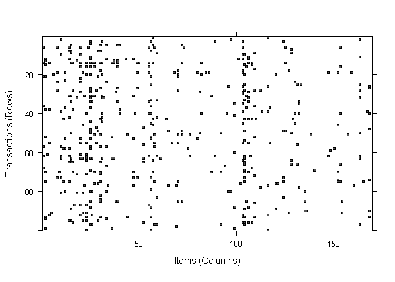

AR\_MarketBastet
================
Mohammed Zakaria

Our market basket analysis will utilize the purchase data from one month
of operation for a grocery store. We will see that we have about 9835
transaction during that period. or about 30-50 per hour (depending on
how many hours it operates). This indicates a medium size store.

Getting the data

``` r
#install.packages("arules")
library(arules)
```

    ## Loading required package: Matrix

    ## 
    ## Attaching package: 'arules'

    ## The following objects are masked from 'package:base':
    ## 
    ##     abbreviate, write

``` r
# To see vignettes
#arules::arules
data("Groceries")
summary(Groceries)
```

    ## transactions as itemMatrix in sparse format with
    ##  9835 rows (elements/itemsets/transactions) and
    ##  169 columns (items) and a density of 0.02609146 
    ## 
    ## most frequent items:
    ##       whole milk other vegetables       rolls/buns             soda 
    ##             2513             1903             1809             1715 
    ##           yogurt          (Other) 
    ##             1372            34055 
    ## 
    ## element (itemset/transaction) length distribution:
    ## sizes
    ##    1    2    3    4    5    6    7    8    9   10   11   12   13   14   15 
    ## 2159 1643 1299 1005  855  645  545  438  350  246  182  117   78   77   55 
    ##   16   17   18   19   20   21   22   23   24   26   27   28   29   32 
    ##   46   29   14   14    9   11    4    6    1    1    1    1    3    1 
    ## 
    ##    Min. 1st Qu.  Median    Mean 3rd Qu.    Max. 
    ##   1.000   2.000   3.000   4.409   6.000  32.000 
    ## 
    ## includes extended item information - examples:
    ##        labels  level2           level1
    ## 1 frankfurter sausage meat and sausage
    ## 2     sausage sausage meat and sausage
    ## 3  liver loaf sausage meat and sausage

``` r
inspect(Groceries[1:10])
```

    ##      items                     
    ## [1]  {citrus fruit,            
    ##       semi-finished bread,     
    ##       margarine,               
    ##       ready soups}             
    ## [2]  {tropical fruit,          
    ##       yogurt,                  
    ##       coffee}                  
    ## [3]  {whole milk}              
    ## [4]  {pip fruit,               
    ##       yogurt,                  
    ##       cream cheese ,           
    ##       meat spreads}            
    ## [5]  {other vegetables,        
    ##       whole milk,              
    ##       condensed milk,          
    ##       long life bakery product}
    ## [6]  {whole milk,              
    ##       butter,                  
    ##       yogurt,                  
    ##       rice,                    
    ##       abrasive cleaner}        
    ## [7]  {rolls/buns}              
    ## [8]  {other vegetables,        
    ##       UHT-milk,                
    ##       rolls/buns,              
    ##       bottled beer,            
    ##       liquor (appetizer)}      
    ## [9]  {pot plants}              
    ## [10] {whole milk,              
    ##       cereals}

``` r
as(Groceries[1:10], "list")
```

    ## [[1]]
    ## [1] "citrus fruit"        "semi-finished bread" "margarine"          
    ## [4] "ready soups"        
    ## 
    ## [[2]]
    ## [1] "tropical fruit" "yogurt"         "coffee"        
    ## 
    ## [[3]]
    ## [1] "whole milk"
    ## 
    ## [[4]]
    ## [1] "pip fruit"     "yogurt"        "cream cheese " "meat spreads" 
    ## 
    ## [[5]]
    ## [1] "other vegetables"         "whole milk"              
    ## [3] "condensed milk"           "long life bakery product"
    ## 
    ## [[6]]
    ## [1] "whole milk"       "butter"           "yogurt"          
    ## [4] "rice"             "abrasive cleaner"
    ## 
    ## [[7]]
    ## [1] "rolls/buns"
    ## 
    ## [[8]]
    ## [1] "other vegetables"   "UHT-milk"           "rolls/buns"        
    ## [4] "bottled beer"       "liquor (appetizer)"
    ## 
    ## [[9]]
    ## [1] "pot plants"
    ## 
    ## [[10]]
    ## [1] "whole milk" "cereals"

Number of rows means how many transactions we have. Number of columns
means how many different items we might have in each transaction. The
density of 0.02609146 indicates the ratio of nonzero matrix cells to
total number of elements in the matrix ( which is equal to columns\*
rows = 1662115). Total number of items purchased = 1662115\* density =
43367 Average transaction contains 43367 / 9835 = 4.41 (which is the
same value that summary gives us)

using inspect to see fea transaction records

``` r
inspect(Groceries[1:5])
```

    ##     items                     
    ## [1] {citrus fruit,            
    ##      semi-finished bread,     
    ##      margarine,               
    ##      ready soups}             
    ## [2] {tropical fruit,          
    ##      yogurt,                  
    ##      coffee}                  
    ## [3] {whole milk}              
    ## [4] {pip fruit,               
    ##      yogurt,                  
    ##      cream cheese ,           
    ##      meat spreads}            
    ## [5] {other vegetables,        
    ##      whole milk,              
    ##      condensed milk,          
    ##      long life bakery product}

if we want to see the specific columns of the data, you can use \[raw,
column\] notation. We can combine this with itemFrequency() to see the
proportions of the transactions that contain the item

``` r
inspect(Groceries[1:5, 1:3])
```

    ##     items
    ## [1] {}   
    ## [2] {}   
    ## [3] {}   
    ## [4] {}   
    ## [5] {}

``` r
itemFrequency(Groceries[, 1:4])
```

    ## frankfurter     sausage  liver loaf         ham 
    ## 0.058973055 0.093950178 0.005083884 0.026029487

Notice that the sparce matrix columns are sorted in alphabetical order.

To present these statistics visually, we use itemFrequencyPlot()
function. Since the transaction data requires a large number of items,
we will need to limit the ones appearing in the plot in order to produce
a readable
chart.

``` r
itemFrequencyPlot(Groceries, support = 0.1) # showing data with 10% support at least
```

<!-- -->

Alternatively, we can set the limit on the number of items we wish to
see, ranked by frequency

``` r
itemFrequencyPlot(Groceries, topN = 20)
```

<!-- -->

WE can alse view the entire sparce matrix using functiion image

``` r
image(Groceries[1:5])
```

<!-- -->

Notice that we have 5 rosw (number of transactions we want to look at,
and 169 columns, indicating each item in the shopping transactions) This
plot can help us with some quality control 1- (Ex. if we found one item
that repeats all the way, it can be a sign that the store might include
it’s name on the records by mistake) 2- Viewing data historically can
show seasonal effects

Rather than showing a large data set, we can simply sample few events

``` r
image(sample(Groceries, 100))
```

<!-- -->

We will use the apriori algorithm in the arules package. WE might need
to experiment few time with support and confidence levels to produce a
reasonable number of association rules. Setting the level too high we
will find no rules, or they would be too generic to be useful. If set
too low, we will get a large nunmber of rulse, or worse, taking too much
time to finish the learning task. Starting with the defauls settings
(support = 0.1, confidence = 0.8). Since support level of 10% require
the item to be visible at least 9385 \* 0.1 = 939 times, and that we
have only 8 items such, we shouldn’t expect many rules (if any)

``` r
apriori(Groceries)
```

    ## Apriori
    ## 
    ## Parameter specification:
    ##  confidence minval smax arem  aval originalSupport maxtime support minlen
    ##         0.8    0.1    1 none FALSE            TRUE       5     0.1      1
    ##  maxlen target   ext
    ##      10  rules FALSE
    ## 
    ## Algorithmic control:
    ##  filter tree heap memopt load sort verbose
    ##     0.1 TRUE TRUE  FALSE TRUE    2    TRUE
    ## 
    ## Absolute minimum support count: 983 
    ## 
    ## set item appearances ...[0 item(s)] done [0.00s].
    ## set transactions ...[169 item(s), 9835 transaction(s)] done [0.00s].
    ## sorting and recoding items ... [8 item(s)] done [0.00s].
    ## creating transaction tree ... done [0.00s].
    ## checking subsets of size 1 2 done [0.00s].
    ## writing ... [0 rule(s)] done [0.00s].
    ## creating S4 object  ... done [0.00s].

    ## set of 0 rules

One way to approach the problem of setting a threshold for support is to
think about that smallest number of transactions you need before you
would consider a pattern interesting. Perhaps an item that was
purchased, say, 10 times a day would make it of interest. so we have
30\*10 = 300. and out of 9000 transaction we have level of 3%.

similar challenges go with setting confidence thresholds. We can try
level 0.25, which means that the rule needs to be correct 25% of the
time at least. Another variable to set is minlen. Setting it to 2 means
we will eliminate rules that contain fewer than 2 items (rule count
includes left hand and right hand
items).

``` r
groceryrules <- apriori(Groceries, parameter = list(support = .006, confidence = 0.25, minlen = 2))
```

    ## Apriori
    ## 
    ## Parameter specification:
    ##  confidence minval smax arem  aval originalSupport maxtime support minlen
    ##        0.25    0.1    1 none FALSE            TRUE       5   0.006      2
    ##  maxlen target   ext
    ##      10  rules FALSE
    ## 
    ## Algorithmic control:
    ##  filter tree heap memopt load sort verbose
    ##     0.1 TRUE TRUE  FALSE TRUE    2    TRUE
    ## 
    ## Absolute minimum support count: 59 
    ## 
    ## set item appearances ...[0 item(s)] done [0.00s].
    ## set transactions ...[169 item(s), 9835 transaction(s)] done [0.00s].
    ## sorting and recoding items ... [109 item(s)] done [0.00s].
    ## creating transaction tree ... done [0.00s].
    ## checking subsets of size 1 2 3 4 done [0.00s].
    ## writing ... [463 rule(s)] done [0.00s].
    ## creating S4 object  ... done [0.00s].

``` r
groceryrules
```

    ## set of 463 rules

We see we have 463 rulse.

``` r
summary(groceryrules)
```

    ## set of 463 rules
    ## 
    ## rule length distribution (lhs + rhs):sizes
    ##   2   3   4 
    ## 150 297  16 
    ## 
    ##    Min. 1st Qu.  Median    Mean 3rd Qu.    Max. 
    ##   2.000   2.000   3.000   2.711   3.000   4.000 
    ## 
    ## summary of quality measures:
    ##     support           confidence          lift            count      
    ##  Min.   :0.006101   Min.   :0.2500   Min.   :0.9932   Min.   : 60.0  
    ##  1st Qu.:0.007117   1st Qu.:0.2971   1st Qu.:1.6229   1st Qu.: 70.0  
    ##  Median :0.008744   Median :0.3554   Median :1.9332   Median : 86.0  
    ##  Mean   :0.011539   Mean   :0.3786   Mean   :2.0351   Mean   :113.5  
    ##  3rd Qu.:0.012303   3rd Qu.:0.4495   3rd Qu.:2.3565   3rd Qu.:121.0  
    ##  Max.   :0.074835   Max.   :0.6600   Max.   :3.9565   Max.   :736.0  
    ## 
    ## mining info:
    ##       data ntransactions support confidence
    ##  Groceries          9835   0.006       0.25

The min for support and confidence as the values we set. notice that
there are varuations of support and confidence and that they are not all
set around the threshold (in that case, it might indicate that it is too
high). The third item is lift, which indicates how probable we have a
causality due to the rule rather than random chance. A lrage lift value
(more than 1, 2 etc) indicates that a rule is important, and reflects a
strong connection between items.

To inspect the rules, we use the inspect
    function

``` r
inspect(groceryrules[1:4])
```

    ##     lhs             rhs                support     confidence lift    
    ## [1] {pot plants} => {whole milk}       0.006914082 0.4000000  1.565460
    ## [2] {pasta}      => {whole milk}       0.006100661 0.4054054  1.586614
    ## [3] {herbs}      => {root vegetables}  0.007015760 0.4312500  3.956477
    ## [4] {herbs}      => {other vegetables} 0.007727504 0.4750000  2.454874
    ##     count
    ## [1] 68   
    ## [2] 60   
    ## [3] 69   
    ## [4] 76

Let us take an example to understand these rules. the second rule means
that if you buy pasta, you will buy whole milk. pasta and milk were
bought 0.6 of the time in our data. and out of the occurances, 40% pasta
was associated with whole milk. So the lift is 0.4 / 0.006 = 1.59

In general rules can be classified into 3 categories:  
Actionable  
Trivial (something we could have guessed without an algorithm Ex:
formula and diapers)  
Inexplicable (we can’t find an explanation or connection between the
items that taking action might be impossible, it can be a random
connection)

We need to look for Actionable rules.
